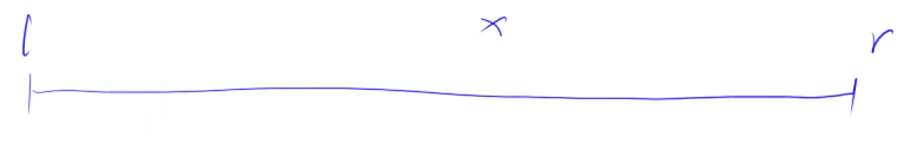
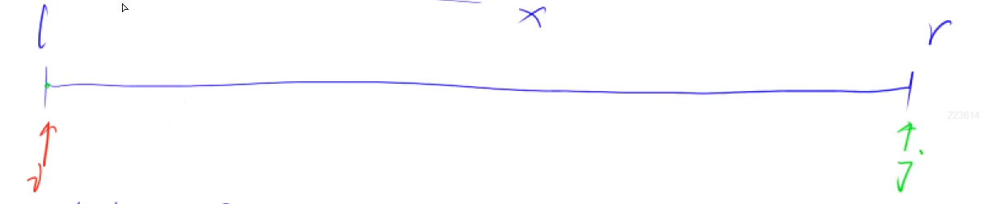
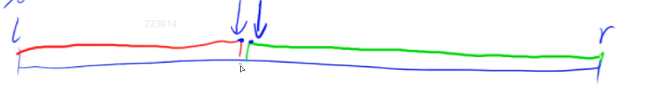

# 第一章 基础算法

## 1.1 快速排序

### 1.1.1 算法步骤

 

1. 确定分界点

   可以选择`q[l]`, `q[r]`, `q[(l + r) / 2]`, 或者随机选取，假设选取的分界点为 x。

2. 调整区间

   根据 x，将整个区间划分为两部分，使得第一个区间里面所有的数都小于等于 x，第二个区间里面所有的数都大于等于 x。（等于 x 的数放左边、右边都行）

   使用两个指针 i，j 同时往数组中间走：

    

   * 先移动 i，只要 i 所指的数小于 x，就继续移动 i，直到遇到一个大于等于 x 的数字，就停下 i。

   * 接着移动  j，只要 j 所指的数大于 x，就继续移动 j，直到遇到一个小于等于 x 的数，j 就停下来。

   * 此时 i 指向的数应该放在右边区间，j 所指向的数应该放在左边区间，就交换 i 和 j 所指向的数字。直到 i 和 j 相遇为止。

3. 递归处理左、右两段

### 1.1.2 模板

```c++
void quick_sort(int q[], int l, int r){
    if(l >= r) return;			// 递归结束条件
    
   	int x = q[l + r >> 1];		// 确定分界点，选取中间值
    int i = l - 1, j = r + 1;	// 两个指针指向边界的两侧，因为后续写法每次不管三七二十一，先把指针移动，再判断条件
    while(i < j){				// 划分区间
        do i++; while(q[i] < x);
        do j--; while(q[j] > x);
        if(i < j)				// 如果 i，j 还没有相遇
            swap(q[i], q[j]);
    }
    quick_sort(q, l, j);		// 递归处理左右两段，以 j 为分界点
    quick_sort(q, j + 1, r);	// 注意，这里以 j 为分界点时，x 不能取到 q[r]，否则会有边界问题
}
```

### 1.1.3 稳定性

快排是不稳定的排序，可以采取如下方法使快排变成稳定的：

只需要想一个机制，让数组中每一个数都不一样就可以了。比如将要排序的元素 `ai` 变成一个 pair: `<ai, i>`，做双关键字排序即可。

## 1.2 归并排序

### 1.2.1 算法步骤

1. 确定分界点，通常为数组的中间位置，mid = l + r >> 1
2. 递归排序左区间和右区间
3. 此时左区间和右区间已经排序后，将两个区间进行归并
   * 使用双指针，一个指针指向左区间开始的地方，另一个指针指向右区间开始地方，另外建立一个辅助数组 tmp
   * 比较两个指针指向的数字，将较小的一个放在 tmp 中，该指针前进一个位置
   * 直到有一个指针到达终点，将剩下一个区间剩余的数直接加入 tmp 数组

### 1.2.2 模板

```c++
void merge_sort(int q[], int l, int r){
    if(l >= r) return;
    
    int mid = l + r >> 1;				// 确定数组的中间位置为分界点
    
    merge_sort(q, l, mid);				// 递归排序左区间
    merge_sort(q, mid + 1, r);			// 递归排序右区间
    
    // 将左右两个区间进行合并
    int i = l, j = mid + 1, k = 0;
    while(i <= mid && j <= r ){
        if(q[i] <= q[j])				// 为保证算法的稳定性，优先取左区间的数，因此这里需要用等号
            tmp[k++] = q[i++];
        else
            tmp[k++] = q[j++];
    }
    while(i <= mid) tmp[k++] = q[i++];
    while(j <= r) tmp[k++] = q[j++];
    for(i = l, k = 0; i <= r; ++i, ++k)	// 最后别忘了把 tmp 数组的值放回到原数组
        q[i] = tmp[k];
}
```

## 1.3 二分

二分的本质：只要区间里面可以找到一个性质，将这个区间一分为二，就可以利用二分**<font color='red'>找到这两个区间的分界点</font>**。

因此无论区间有没有单调性，只要能找到这种性质，就可以用二分来做。

### 1.3.1 整数二分

整数二分划分的两个区间**<font color='red'>没有重合点</font>**，二分既可以找到红色边界点，也可以找到绿色分界点：

 

#### 整数二分问题解题步骤

1. 令 mid = l + r >> 1
2. 写一个 check 函数，根据题意找一个性质，使得这个性质将区间一分为二，且我们要求的点刚好在两个区间的边界上
3. **<font color='red'>确保当 check(mid) 满足条件时，我们的更新方式是 l = mid 或者 r = mid。若为 l = mid，则把第一步的条件改为 l + r + 1 >> 1</font>**

#### 模板

```c++
int bsearch_1(int l, int r){			// 查找红色分界点
    while(l < r){
        int mid = l + r + 1 >> 1;
        if(check(mid))
            l = mid;
        else
            r = mid - 1;
    }
    return l;
}

int bsearch_1(int l, int r){			// 查找绿色分界点
    while(l < r){
        int mid = l + r >> 1;
        if(check(mid))
            r = mid;
        else
            l = mid + 1;
    }
    return l;
}
```

#### 例题

给定一个按照升序排列的长度为 n 的整数数组，以及 q 个查询。

对于每个查询，返回一个元素 k 的起始位置和终止位置（位置从 0 开始计数）。

如果数组中不存在该元素，则返回 `-1`。

##### 输入格式

第一行包含整数 n 和 q，表示数组长度和询问个数。

第二行包含 n个整数（均在 1∼10000 范围内），表示完整数组。

接下来 q 行，每行包含一个整数 k，表示一个询问元素。

##### 输出格式

共 q 行，每行包含两个整数，表示所求元素的起始位置和终止位置。

如果数组中不存在该元素，则返回 `-1 -1`。

##### 数据范围

1≤ n ≤100000
1≤ q ≤10000
1≤ k ≤10000

##### 输入样例：

```c++
6 3
1 2 2 3 3 4
3
4
5
```

##### 输出样例：

```c++
3 4
5 5
-1 -1
```

##### 代码实现

```C++
#include <iostream>

using namespace std;

const int N = 100010;

int n, m;
int q[N];

int main(){
    // 读入整个数组
    scanf("%d%d", &n, &m);
    for(int i = 0; i < n; ++i)
        scanf("%d", &q[i]);
    
    while(m--){		// m 个询问
        int x;
        scanf("%d", &x);
        
        // 利用二分法求起始坐标
        int l = 0, r = n - 1;	// 定义左边界和右边界
        while(l < r){
            int mid = l + r >> 1;
            // 起始坐标（不包括起始坐标）左边的数都小于x，右边的数都大于等于 x，可以令 check 函数为小于 x
            if(q[mid] >= x)	r = mid;	// 只有选取 check 为 >= x，才能让更新的方式为 r = mid，若 check 为 < x，更新方式就变成 l = mid + 1 
            else l = mid + 1;			// check 为 true 时，更新方式为 r = mid，就不用修改 mid 的取值
        }	
        if(q[l] != x)					// 所询问的值不存在
            cout << "-1 -1" << endl;
        else{
            cout << l << " ";
            // 利用二分法求终止坐标
            l = 0, r = n - 1;
            while(l < r){
                int mid = l + r + 1 >> 1;
                if(q[mid] <= x)	l = mid;	// check 为 true 时，更新方式为 l = mid，因此要修改 mid 的取值为 l + r + 1 >> 1
                else r = mid - 1;
            }
            cout << r << endl;
        }
    }
}
```

### 1.3.2 浮点数二分

浮点数二分不需要处理边界，当整个浮点数二分区间足够小的时候，例如 `r - l <= 1e-6`，我们就可以用 l 或者 r 当成我们的答案。

#### 模板

```c++
double bsearch(double l, double r){
    const double eps = 1e-6;
    while(r - l > eps){
        double mid = (l + r) / 2;		// 浮点数不能使用移位操作
        if(check(mid))	l = mid;		// 每次更新的时候，直接更新为 mid 即可
        else r = mid;
    }
    return l;
}
```

#### 例题

给定一个浮点数 n，求它的三次方根。

##### 输入格式

共一行，包含一个浮点数 n。

##### 输出格式

共一行，包含一个浮点数，表示问题的解。注意，结果保留 6 位小数。

##### 数据范围

−10000≤ n ≤10000

##### 输入样例：

```
1000.00
```

##### 输出样例：

```
10.000000
```

##### 代码实现

```c++
#include <iostream>

using namespace std;

int main(){
    double n;
    scanf("%lf", &n);				// 读入 double 时，需要用 %lf，如果用 %f 会导致精度丢失
    
    double l = -1e+4, r = 1e+4;		// 题目中 n 的范围是 -10000 到 10000，因此我们的答案就是这个范围
    while(r - l > 1e-8){            // 答案保留 6 位小数，这里就写 1e-8
        double mid = (l + r) / 2;
        if(mid * mid * mid < n) l = mid;
        else r = mid;
    }
    
    printf("%.6f", l);				// 输出 double 时，用 %lf 或者 %f 都可以
}
```

