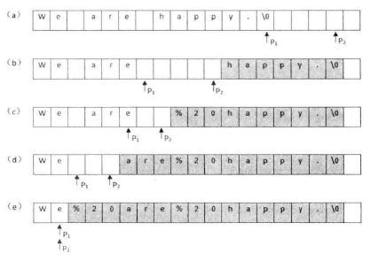
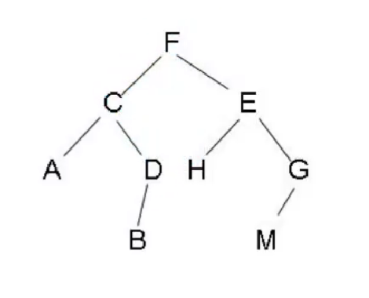
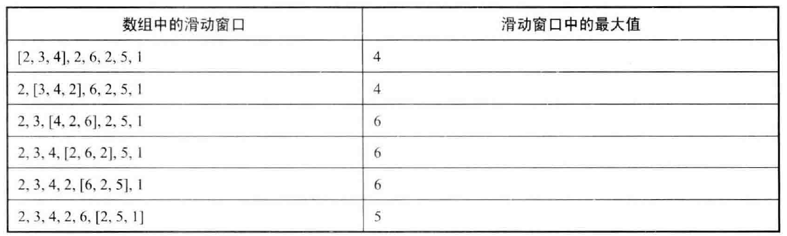
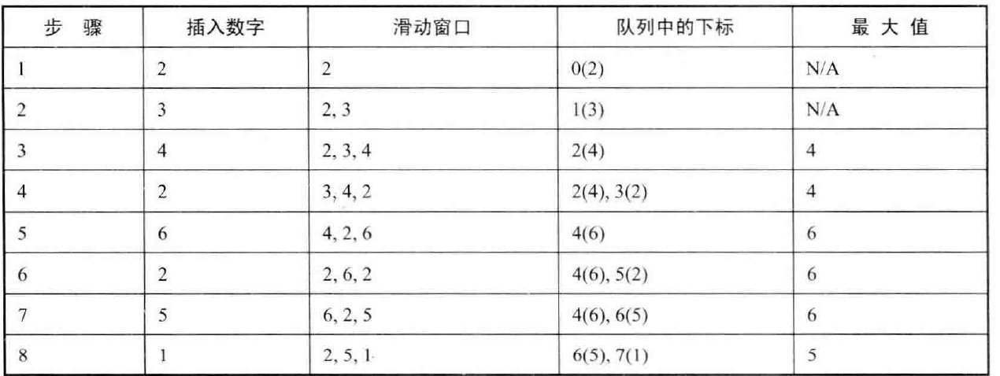
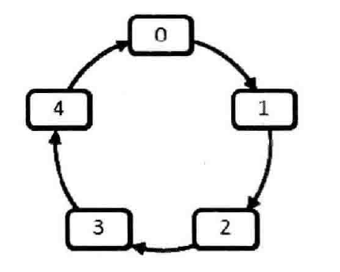
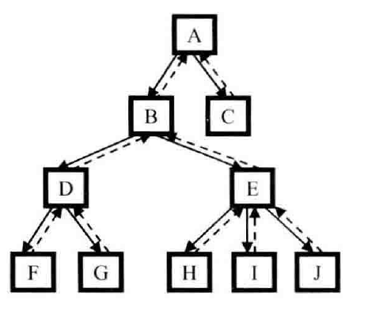

# 类型一：整数二分

二分的本质：只要区间里面可以找到一个性质，将这个区间一分为二，就可以利用二分**找到这两个区间的分界点**。

因此无论区间有没有单调性，只要能找到这种性质，就可以用二分来做。

## 解题步骤

1. 确定左边界，有边界，令 mid = l + r >> 1
2. 写一个 check 函数，根据题意找一个性质，使得这个性质将区间一分为二，且我们要求的点刚好在两个区间的边界上
3. **<font color='red'>确保当 check(mid) 满足条件时，我们的更新方式是 l = mid 或者 r = mid。若为 l = mid，则把第一步的条件改为 l + r + 1 >> 1</font>**

## 模板

```c++
int bsearch_1(int l, int r){           
    while(l < r){
        int mid = l + r + 1 >> 1;		// l = mid 时 mid 的计算方式需要改成 l + r + 1 >> 1
        if(check(mid))
            l = mid;					
        else
            r = mid - 1;
    }
    return l;
}

int bsearch_1(int l, int r){           
    while(l < r){
        int mid = l + r >> 1;			// r = mid 时 mid 的计算方式不需要改变
        if(check(mid))
            r = mid;
        else
            l = mid + 1;
    }
    return l;
}
```

**<font color='red'>注意：`mid` 的计算是在 `while` 循环里面进行的！</font>**

## 例题 1：数组中元素的起始位置和终止位置

### 题目

给定一个按照升序排列的长度为 n 的整数数组，以及 q 个查询。

对于每个查询，返回一个元素 k 的起始位置和终止位置（位置从 0 开始计数）。

如果数组中不存在该元素，则返回 `-1`。

#### 输入格式

第一行包含整数 n 和 q，表示数组长度和询问个数。

第二行包含 n个整数（均在 1∼10000 范围内），表示完整数组。

接下来 q 行，每行包含一个整数 k，表示一个询问元素。

#### 输出格式

共 q 行，每行包含两个整数，表示所求元素的起始位置和终止位置。

如果数组中不存在该元素，则返回 `-1 -1`。

#### 数据范围

1≤ n ≤100000 1≤ q ≤10000 1≤ k ≤10000

#### 输入样例：

```c++
6 3
1 2 2 3 3 4
3
4
5
```

#### 输出样例：

```c++
3 4
5 5
-1 -1
```

### 代码实现

```c++
#include <iostream>

using namespace std;

const int N = 100010;

int n, m;
int q[N];

int main(){
    // 读入整个数组
    scanf("%d%d", &n, &m);
    for(int i = 0; i < n; ++i)
        scanf("%d", &q[i]);
    
    while(m--){     // m 个询问
        int x;
        scanf("%d", &x);
        
        // 利用二分法求起始坐标
        int l = 0, r = n - 1;   // 定义左边界和右边界
        while(l < r){
            int mid = l + r >> 1;
            // 起始坐标（不包括起始坐标）左边的数都小于x，右边的数都大于等于 x，可以令 check 函数为小于 x
            if(q[mid] >= x) r = mid;    // 只有选取 check 为 >= x，才能让更新的方式为 r = mid，若 check 为 < x，更新方式就变成 l = mid + 1 
            else l = mid + 1;           // check 为 true 时，更新方式为 r = mid，就不用修改 mid 的取值
        }   
        if(q[l] != x)                   // 所询问的值不存在
            cout << "-1 -1" << endl;
        else{
            cout << l << " ";
            // 利用二分法求终止坐标
            l = 0, r = n - 1;
            while(l < r){
                int mid = l + r + 1 >> 1;
                if(q[mid] <= x) l = mid;    // check 为 true 时，更新方式为 l = mid，因此要修改 mid 的取值为 l + r + 1 >> 1
                else r = mid - 1;
            }
            cout << r << endl;
        }
    }
}
```

## 例题 2：不修改数组找出重复的数字

### 题目

给定一个长度为 n+1 的数组`nums`，数组中所有的数均在 1∼n 的范围内，其中 n≥1。

请找出数组中任意一个重复的数，但不能修改输入的数组。

#### 数据范围

1≤ n ≤1000

#### 样例

```c++
给定 nums = [2, 3, 5, 4, 3, 2, 6, 7]。

返回 2 或 3。
```

### 解题思路

我们可以很容易想到借助一个辅助数组，然后逐一把原数组的每个数字复制到辅助数组中。如果原数组中被复制的数字是 m，则把它复制到辅助数组下标位置为 m 的位置。这样很容易找到重复的数字，但是这种方案需要 O(n) 的辅助空间。

接下来思考不借助辅助空间的做法。可以按照**<font color='red'>二分查找的思路</font>**:

整个数组长度为 n + 1，可以理解为 n + 1 个坑。数组中的数均在 1~ n 的范围，即我们只有 n 个数可以选。现在要从这 n 个数中选出 n + 1 个来放到坑里，则数组中必定含有重复的数字。现在要确定的就是这个重复的数字是 1 ~ n 中的哪一个，可以利用二分法确定它的范围：

我们把从 1 ~ n 的数字从中间的数字 m 分为两部分，前面一半为 1 ~ m，后面一半为 m+ 1 ~ n 。**<font color='red'>如果 1 ~ m 的数字的数目超过 m, 那么这一半的区间里一定包含重复的数字</font>**；否则，另一半 m + 1 ~ n 的区间里一定包含重复的数字。我们可以继续把包含重复数字的区间一分为二， 直到找到一个重复的数字。

### 代码实现

```c++
class Solution {
public:
    int duplicateInArray(vector<int>& nums) {
        // 确定的数的范围是 1~n，因此左边界是 1，有边界是 nums.size() - 1
        int l = 1, r = nums.size() - 1;
        while(l < r){
            int mid = l + r >> 1;       // 左边区间[l, mid] 右边区间[mid+1, r]
            // 统计左边区间中数字的个数，即数组中在 l~mid 的数字的数量
            int count = 0;
            for(auto item : nums){
                if(item >= l && item <= mid)
                    ++count;
            }
            
            if(count > mid - l + 1){    // 如果统计结果大于左边区间的长度，说明该数字在左边区间，选左边
                r = mid;                // 更新方式为 r = mid，不用更改 mid 计算方式
            }   
            else{                       // 选右边
                l = mid + 1;
            }
        }
        return r;
    }
};
```

## 例题 3：旋转数组的最小数字

### 题目

把一个数组最开始的若干个元素搬到数组的末尾，我们称之为数组的旋转。

输入一个升序的数组的一个旋转，输出旋转数组的最小元素。

例如数组 {3,4,5,1,2} 为 {1,2,3,4,5} 的一个旋转，该数组的最小值为 1。

数组可能包含重复项。

**注意**：数组内所含元素非负，若数组大小为 0，请返回 −1。

#### 数据范围

数组长度 [0,90]。

#### 样例

```
输入：nums = [2, 2, 2, 0, 1]

输出：0
```

### 解题思路

我们首先假设这个升序数组中没有重复的元素，那么对于数组 A，经过旋转后形成数组 A1A2，其中 A2 为被搬到数组末尾的若干元素，因为 A2 在原本的升序数组中位于 A1 前面，所以：

1. A2 中的所有元素都要小于 A1 中的第一个元素
2. 而 A1 中的所有元素都要大于等于 A1 中的第一个元素

现在我们要找的是这两段的**<font color='red'>分界点</font>**，则可以使用二分的方法。

现在考虑数组中有重复元素的情况，那么 A2 的末尾的元素可能就有等于 A1 中第一个元素的情况，比如对于升序数组 {1, 2, 2, 2, 3, 4} 的一个旋转 {2, 3, 4, 1, 2, 2}。此时我们只需要将二分的右区间缩小至第一个不等于 A1 的第一个元素的元素的位置即可。即我们从序列 {2, 3, 4, 1} 开始二分。

此外，还要考虑一个特殊情况，即我们旋转数组是升序数组本身：{1, 2, 3, 4, 5}，此时不存在二分的右区间，我们直接返回数组中的第一个元素即可。

### 代码实现

```c++
class Solution {
public:
    int findMin(vector<int>& nums) {
        if(nums.empty())    return -1;
        int l = 0, r = nums.size() - 1;     // 二分区间
        if(nums[r] > nums[l])                // 没有进行旋转，如果进行了旋转，最后一个元素一定小于等于第一个元素
            return nums[0];
        while(nums[r] == nums[0])   --r;    // 去掉末尾等于第一个元素的元素
        
        // 二分，经以上处理，数组被分为两部分：左边元素大于等于首元素，右边元素小于首元素
        // 通过二分找右边元素的第一个元素
        while(l < r){
            int mid = l + r >> 1;
            if(nums[mid] < nums[0])          // mid 在右边，分界点应该在 mid 左边，且可能是 mid
                r = mid;                    // 这种更新方式不需要更新 mid 的取值方法
            else
                l = mid + 1;
        }
        return nums[l];
        
    }
};
```


# 类型二： 浮点数二分

浮点数二分不需要处理边界，当整个浮点数二分区间足够小的时候，例如 `r - l <= 1e-6`，我们就可以用 l 或者 r 当成我们的答案。

## 模板

```c++
double bsearch(double l, double r){
    const double eps = 1e-6;
    while(r - l > eps){
        double mid = (l + r) / 2;       // 浮点数不能使用移位操作
        if(check(mid))  l = mid;        // 每次更新的时候，直接更新为 mid 即可
        else r = mid;
    }
    return l;
}
```

## 例题 1：浮点数的三次方根

### 题目

给定一个浮点数 n，求它的三次方根。

#### 输入格式

共一行，包含一个浮点数 n。

#### 输出格式

共一行，包含一个浮点数，表示问题的解。注意，结果保留 6 位小数。

#### 数据范围

−10000≤ n ≤10000

#### 输入样例：

```c++
1000.00
```

#### 输出样例：

```c++
10.000000
```

### 代码实现

```c++
#include <iostream>

using namespace std;

int main(){
    double n;
    scanf("%lf", &n);               // 读入 double 时，需要用 %lf，如果用 %f 会导致精度丢失
    
    double l = -1e+4, r = 1e+4;     // 题目中 n 的范围是 -10000 到 10000，因此我们的答案就是这个范围
    while(r - l > 1e-8){            // 答案保留 6 位小数，这里就写 1e-8
        double mid = (l + r) / 2;
        if(mid * mid * mid < n) l = mid;
        else r = mid;
    }
    
    printf("%.6f", l);              // 输出 double 时，用 %lf 或者 %f 都可以
}
```

# 类型三：根据数据特点进行查找

## 例题 1：找出数组中重复的数字

### 题目

给定一个长度为 n 的整数数组 `nums`，数组中所有的数字都在 0∼n−1 的范围内。

数组中某些数字是重复的，但不知道有几个数字重复了，也不知道每个数字重复了几次。

请找出数组中任意一个重复的数字。

**注意**：如果某些数字不在 0∼n−1 的范围内，或数组中不包含重复数字，则返回 -1；

#### 数据范围

0≤ n ≤1000

#### 样例

```c++
给定 nums = [2, 3, 5, 4, 3, 2, 6, 7]。

返回 2 或 3。
```

### 解题思路

我们注意到数组中的数字都在 0 ~ n - 1 的范围内。如果这个数组中没有重复的数字，那么当数组排序之后数字 i 将出现在下标为 i 的位置。现在让我们重排这个数组：

我们从头到尾依次扫描这个数组中的每个数字。当扫描到下标为 i 的数字时，首先比较这个数字（用 m 表示）是不是等于 i 。如果是，说明该数字位于正确的位置，则接着扫描下一个数字；如果不是，则再拿它和第 m 个数字进行比较，如果它和第 m 个数字相等，就找到了一个重复的数字；如果它和第m 个数字不相等，就把第 i 个数字和第 m 个数字交换， 把 m 放到属于它的位置。接下来再重复这个比较、交换的过程，直到我们发现一个重复的数字。

### 代码实现

```c++
class Solution {
public:
    int duplicateInArray(vector<int>& nums) {
        int n = nums.size();
        if(n == 0)	return -1;						// 判断数组是否为空
        for(auto item : nums){						// 检查数组中是否有非法输入	
            if(item < 0 || item > n - 1)
                return -1;
        }
        int i = 0;
        while(i != n){								// 从 0 开始遍历数组
            int curNum = nums[i];
            if(curNum != i){						// 如果当前位置的数字不在其正确的位置上
                int posNum = nums[curNum];	
                if(curNum == posNum)				// 如果该数字等于其正确位置上的数字
                    return curNum;					// 就找到了一个重复数字，返回
                else							
                    swap(nums[i], nums[curNum]);	// 否则交换该数字到其正确的位置上
            }else{									// 如果当前位置的数字在其正确的位置上
               ++i; 								// 处理下一个数字
            }
        }
        return -1;									// 数组中没有找到重复的数字
    }
};
```

## 例题 2：二维数组中的查找

### 题目

在一个二维数组中，每一行都按照从左到右递增的顺序排序，每一列都按照从上到下递增的顺序排序。

请完成一个函数，输入这样的一个二维数组和一个整数，判断数组中是否含有该整数。

#### 数据范围

二维数组中元素个数范围 [0,1000]

#### 样例

```C++
输入数组：

[
  [1,2,8,9]，
  [2,4,9,12]，
  [4,7,10,13]，
  [6,8,11,15]
]

如果输入查找数值为7，则返回 true，

如果输入查找数值为5，则返回 false。
```

### 解题思路

观察二维数组中的特点，其从左到右、从上到下递增，我们可以从数组的四个角开始查找：

* 从左上角开始，它右边的数字都大于它，下边的数字也都大于它，对于待查找的数字，我们无法确定一个范围
* 从左下角开始，它上边的数字都小于它，右边的数字都大于它，对于待查找的数字，我们可以通过比较，排除任意一边，即将查找范围缩小
* 从右上角开始，它左边的数字都小于它，下边的数字都大于它，对于待查找的数字，我们可以通过比较，排除任意一边，即将查找范围缩小
* 从右下角开始，它左边的数字都小于它，上边的数字也都小于它，对于待查找的数字，我们无法确定一个范围

因此我们可以从左下角或者右上角开始查找，这里列出从右上角开始查找的步骤：

1. 首先选取数组中右上角的数字。

2. 如果该数字等于要查找的数字，则查找过程结束。

3. 如果该数字大于要查找的数字，说明要查找的数字只能在该数字左边或者上边，则剔除该数字所在的列。

4. 如果该数字小于要查找的数字，说明要查找的数字只能在该数字右边或者下边，则剔除该数字所在的行。

5. 不断缩小范围，直至找到要查的数字或者查找范围为空。

### 代码实现

```c++
class Solution {
public:
    bool searchArray(vector<vector<int>> array, int target) {
        if(array.empty() || array[0].empty())   return false;
        int rows = array.size(), cols = array[0].size();
        int i = 0, j = cols - 1;        // 从右上角开始
        while(i < rows && j >= 0){
            if(target == array[i][j])   return true;
            else if(target > array[i][j]){      // target 比当前数字大，应该在下一行
                ++i;
            }
            else{                               // target 比当前数字小，应该在左一列
                --j;
            }
        }
        return false;
    }
};
```

# 类型四：字符串操作

## 例题 1：替换空格

### 题目

请实现一个函数，把字符串中的每个空格替换成`"%20"`。

#### 数据范围

0≤ 输入字符串的长度 ≤1000。
注意输出字符串的长度可能大于 1000。

#### 样例

```c++
输入："We are happy."

输出："We%20are%20happy."
```

### 算法 1：线性扫描

可以直接利用 C++ 中的 `string` 类，扫描原字符串：

* 如果遇到空格，则在 `string` 类型的答案中添加 `"%20"`；
* 如果遇到其他字符，则直接将它添加在答案中；

```c++
class Solution {
public:
    string replaceSpaces(string &str) {
        string res;
        for (auto x : str)
            if (x == ' ')
                res += "%20";
            else
                res += x;
        return res;
    }
};
```

### 算法 2：双指针扫描

在部分编程语言中，我们可以**<font color='red'>动态地将原数组长度扩大</font>**，此时我们就可以使用双指针算法，**<font color='red'>来降低空间的使用</font>**：

* 首先遍历一遍原数组，求出最终答案的长度 length；
* **<font color='red'>将原数组 `resize` 成 `length` 大小；</font>**
* 使用两个指针，指针 `i` 指向原字符串的末尾，指针 `j` 指向 `length` 的位置；
* 两个指针分别从后往前遍历，如果 `str[i] == ' '`，则指针 `j` 的位置上依次填充 '0', '2', '%'，这样倒着看就是 "`%20"`；如果 `str[i] != ' '`，则指针 `j` 的位置上填充该字符即可。

 

```c++
class Solution {
public:
    string replaceSpaces(string &str) {
        if(str.empty()) return "";
        int oldLength = str.size();
        
        // 计算新字符串的长度
        int length = 0;
        for(auto x : str){
            if(x == ' ')
                length += 3;                    // 每个空格需要替换成 %20，长度 +3
            else    
                length += 1;
        }
        
        str.resize(length);                     // resize str，使得其能够容纳替换后的新字符串
        
        int i = oldLength - 1, j = length - 1;  // i，j 分别指向旧、新字符串末尾位置
        while(i >=  0){
            if(str[i] == ' '){					// 原字符串对应的字符为空格
                --i;							
                str[j--] = '0';					// 指针 j 的位置上依次填充 '0', '2', '%'
                str[j--] = '2';
                str[j--] = '%';
            }
            else{								// 原字符串对应的字符为非空格
                str[j--] = str[i--];			// 指针 j 的位置上填充该字符
            }
        }
        return str;
    }
};
```

# 类型五：链表操作

## 例题 1：从尾到头打印链表

### 题目

输入一个链表的头结点，按照 **从尾到头** 的顺序返回节点的值。

返回的结果用数组存储。

#### 数据范围

0≤ 链表长度 ≤1000。

#### 样例

```c++
输入：[2, 3, 5]
返回：[5, 3, 2]
```

### 算法 1：利用先进后出，使用递归或者栈

第一个遍历到的节点最后一个输出，而最后一个遍历到的节点第一个输出。这是典型的先进后出结构，我们可以利用栈或者递归来实现这种结构。但是值得注意的是递归实现的代码虽然简单，当链表非常长的时候，就会导致函数调用的层级很深，从而有可能导致函数调用栈溢出。

```c++
/**
 * Definition for singly-linked list.
 * struct ListNode {
 *     int val;
 *     ListNode *next;
 *     ListNode(int x) : val(x), next(NULL) {}
 * };
 */
class Solution {
public:
    vector<int> printListReversingly(ListNode* head) {
        vector<int> res;
        stack<int> istk;
        ListNode *p = head;
        while(p != nullptr){
            istk.push(p->val);
            p = p->next;
        }
        while(!istk.empty()){
            res.push_back(istk.top());
            istk.pop();
        }
        return res;
    }
};
```

### 算法 2：先读再翻转

另一个角度，我们可以顺序遍历链表时，将其结果存入数组中，最后再把结果数组翻转即可得到结果。这样可以避免递归或者栈的空间开销。

```c++
/**
 * Definition for singly-linked list.
 * struct ListNode {
 *     int val;
 *     ListNode *next;
 *     ListNode(int x) : val(x), next(NULL) {}
 * };
 */
class Solution {
public:
    vector<int> printListReversingly(ListNode* head) {
        vector<int> res;
        ListNode *p = head;
        while(p != nullptr){
            res.push_back(p->val);
            p = p->next;
        }
        return vector<int>(res.rbegin(), res.rend());
    }
};
```

## 例题 2：在 O(1) 时间删除链表结点

### 题目

给定单向链表的一个节点指针，定义一个函数在O(1)时间删除该结点。

假设链表一定存在，并且该节点一定不是尾节点。

#### 数据范围

链表长度 $[1,500]$。

#### 样例

```C++
输入：链表 1->4->6->8
      删掉节点：第2个节点即6（头节点为第0个节点）

输出：新链表 1->4->8
```

### 解题思路

我们要删除节点 i，先把 i 的下一个节点 j 的内容复制到  i，然后把 i 的指针指向节点 j 的下一个节点。此时再删除节点  j  其效果刚好是把节点 i 删除了。

另外需要考虑特殊情况：

* 如果要删除的节点位于链表的尾部， 那么它就没有下一个节点，我们只能从头节点开始顺序遍历
* **<font color='red'>如果链表中只有一个节点，而我们又要删除链表的头节点（ 也是尾节点），那么，此时我们在删除节点之后，还需要把链表的头节点设置为 `nullptr`</font>**（容易遗漏）

但是本题中已经说明待删除节点一定不是尾节点，所以不需要考虑以上两种情况。

### 代码实现

```c++
/**
 * Definition for singly-linked list.
 * struct ListNode {
 *     int val;
 *     ListNode *next;
 *     ListNode(int x) : val(x), next(NULL) {}
 * };
 */
class Solution {
public:
    void deleteNode(ListNode* node) {
        ListNode* nextNode = node->next;
        node->val = nextNode->val;
        node->next = nextNode->next;
        delete nextNode;
        
    }
};
```

# 类型六：栈、队列操作

## 例题 1：用两个栈实现队列

### 题目

请用栈实现一个队列，支持如下四种操作：

- push(x) – 将元素 x 插到队尾；
- pop() – 将队首的元素弹出，并返回该元素；
- peek() – 返回队首元素；
- empty() – 返回队列是否为空；

**注意：**

- 你只能使用栈的标准操作：`push to top`，`peek/pop from top`, `size` 和 `is empty`；
- 如果你选择的编程语言没有栈的标准库，你可以使用 `list` 或者 `deque` 等模拟栈的操作；
- 输入数据保证合法，例如，在队列为空时，不会进行`pop`或者`peek`等操作；

#### 数据范围

每组数据操作命令数量 [0,100]。

#### 样例

```c++
MyQueue queue = new MyQueue();

queue.push(1);
queue.push(2);
queue.peek();  // returns 1
queue.pop();   // returns 1
queue.empty(); // returns false
```

### 解题思路

我们使用两个栈 `stack1` 和 `stack2`来实现这个队列：

1. 插入一个元素的步骤：

   将插入的元素压入`stack1` 中，则**<font color='red'> `stack1` 中最底端的元素就是队列的头部。</font>**

2. 删除一个元素的步骤：

   因为队列头部的元素在 `stack1` 的最底端，我们需要将 `stack1` 中的内容一一弹出到 `stack2` 中：

   * 当 `stack2` 为空时，我们把 `stack1 `中的元素逐个弹出并压入 `stack2`，由于先进入队列的元素被压入 `stack1` 的底端，经过弹出和压入操作后，**<font color='red'>`stack2` 中最顶端的元素就是队列的头部。</font>**
   * 当 `stack2` 不为空时，在 `stack2` 中的栈顶元素是最先进入队列的元素，可以弹出。

 

### 代码实现

```c++
class MyQueue {
public:
    /** Initialize your data structure here. */
    MyQueue() {
        
    }
    
    /** Push element x to the back of queue. */
    void push(int x) {
        stk1.push(x);
    }
    
    /** Removes the element from in front of queue and returns that element. */
    int pop() {
        if(stk2.empty()){
            while(!stk1.empty()){
                int top1 = stk1.top();
                stk1.pop();
                stk2.push(top1);
            }
        }
        int val;
        val = stk2.top();
        stk2.pop();
        return val;
    }
    
    /** Get the front element. */
    int peek() {
        if(stk2.empty()){
            while(!stk1.empty()){
                int top1 = stk1.top();
                stk1.pop();
                stk2.push(top1);
            }
        }
        return stk2.top();
    }
    
    /** Returns whether the queue is empty. */
    bool empty() {
        return stk1.empty() && stk2.empty();
    }
    
    stack<int> stk1, stk2;
};
```

# 类型七：树操作

## 例题 1：重建二叉树

### 题目

输入一棵二叉树前序遍历和中序遍历的结果，请重建该二叉树。

**注意**:

- 二叉树中每个节点的值都互不相同；
- 输入的前序遍历和中序遍历一定合法；

#### 数据范围

树中节点数量范围 [0, 100]

#### 样例

```C++
给定：
前序遍历是：[3, 9, 20, 15, 7]
中序遍历是：[9, 3, 15, 20, 7]

返回：[3, 9, 20, null, null, 15, 7, null, null, null, null]
返回的二叉树如下所示：
    3
   / \
  9  20
    /  \
   15   7
```

### 解题思路

1. 根据前序遍历的第一个节点，获得当前子树的根节点

2. 在中序遍历中查找该节点的位置，其左边的元素为当前子树的左子树的所有节点，其右边的元素为当前子树的右子树的所有节点，由此我们可以得到：

   * 当前子树的左子树的所有节点的前序遍历和中序遍历
   * 当前子树的右子树的所有节点的前序遍历和中序遍历

   由上面获得的信息可以递归地对当前子树的左子树和当前子树的右子树进行重建

> 优化思路：
>
> 每一步我们需要查找根节点在中序遍历中的位置，我们可以建立一个 hash 表来进行优化。

### 代码实现

```c++
/**
 * Definition for a binary tree node.
 * struct TreeNode {
 *     int val;
 *     TreeNode *left;
 *     TreeNode *right;
 *     TreeNode(int x) : val(x), left(NULL), right(NULL) {}
 * };
 */
class Solution {
public:
    typedef vector<int>::iterator iter;
    map<int, iter> hash;
    
    
    TreeNode* buildTree(vector<int>& preorder, vector<int>& inorder) {
        // 构建中序遍历的 hash 表
        for(auto i = inorder.begin(); i != inorder.end(); ++i)
            hash[*i] = i;
        
        return dfs(preorder.begin(), preorder.end(), inorder.begin(), inorder.end());  // 递归重建二叉树
    }
    
    // [first1, last1)：前序遍历的序列
    // [first2, last2)：中序遍历的序列
    TreeNode* dfs(iter first1, iter last1, iter first2, iter last2){
        // 递归出口
        if(first1 == last1) return nullptr;
        
        // 根节点为前序遍历序列的第一个元素
        TreeNode* root = new TreeNode(*first1);
        
        // 找到根节点在中序遍历中的位置
        iter pos = hash[*first1];
        int leftLen = pos - first2;         // 左子树中节点的数目
        int rightLen = last2 - (pos + 1);   // 右子树中节点的数目
        // 左子树的前序遍历范围就为：[first1 + 1, first1 + 1 + leftLen)，中序遍历的范围就为：[first2, pos)
        // 右子树的前序遍历范围就为：[first1 + 1 + leftLen, last1)，中序遍历的范围就为：[pos + 1, last2)
        
        // 递归重建左、右子树
        root->left = dfs(first1 + 1, first1 + 1 + leftLen, first2, pos);
        root->right = dfs(first1 + 1 + leftLen, last1, pos + 1, last2);
        
         return root;
    }
    
};
```

## 例题 2：二叉树的下一个节点

### 题目

给定一棵二叉树的其中一个节点，请找出中序遍历序列的下一个节点。

**注意：**

- 如果给定的节点是中序遍历序列的最后一个，则返回空节点;
- 二叉树一定不为空，且给定的节点一定不是空节点；

#### 数据范围

树中节点数量 [0,100]

#### 样例

```
假定二叉树是：[2, 1, 3, null, null, null, null]， 给出的是值等于2的节点。

则应返回值等于3的节点。

解释：该二叉树的结构如下，2的后继节点是3。
  2
 / \
1   3
```

### 解题思路

 

分类进行讨论，由简单到复杂：

1. 当前节点有右子树，例如节点 F，它的下一个节点就是其右子树中最左下的节点

2. 当前节点没有右子树

   * 当前节点没有右子树，且它是它父节点的左儿子，例如节点 A，它的下一个节点就是其父节点

   * **<font color='red'>当前节点没有右子树，且它是它父节点的右儿子</font>**，例如节点 D，则可以沿着指向父节点的指针一直向上遍历，直到找到一个节点是它父节点的左儿子，则这个节点的父节点就是我们要找的下一个节点。

   将上述两种情况合并，当前节点没有右子树时，从当前节点开始，沿着 father 指针向上找，直到找到一个节点是其父节点的左儿子，最后这个节点的父节点就是我们要找的下一个节点

### 代码实现

```c++
/**
 * Definition for a binary tree node.
 * struct TreeNode {
 *     int val;
 *     TreeNode *left;
 *     TreeNode *right;
 *     TreeNode *father;
 *     TreeNode(int x) : val(x), left(NULL), right(NULL), father(NULL) {}
 * };
 */
class Solution {
public:
    TreeNode* inorderSuccessor(TreeNode* p) {
        // case1: 当前节点有右子树
        if(p->right){                            
            p = p->right;
            while(p->left)
                p = p->left;
            return p;
        }
        
        // case2：当前节点没有右子树
        TreeNode *parentNode = p->father;
        // 从当前节点开始，沿着 father 指针向上找，直到找到一个节点是其父节点的左儿子
        while(parentNode != nullptr && parentNode->right == p){      
            p = parentNode;
            parentNode = p->father;
        }
        return parentNode;
    }
};
```

# 类型八：递推

## 例题 1：快速幂

### 题目

计算  $a^{k}$  

### 解题思路：反复平方法

计算  $a^{k}$  时：

1. 首先预处理出以下结果：

    $a^{2^0}$

   $a^{2^1}$ 

   $a^{2^2}$ 

   ...

   $a^{2^{logk}}$

   **<font color='red'>其中每一个数都是上一个数的平方</font>**

2. 然后把 $a^k$ 拆成：$a^k = a^{2^i} * a^{2^j} * a^{2^k} * ... = a^{2^i + 2^j + 2^k + ...}$

   换句话说需要把 k 拆成若干个 2 的幂的和：$k = 2^i + 2^j + 2^k + ...$，即直接把 k 化成二进制表示既可以：

   比如 k 的二进制表示为 (110110)，那么所有二级制为 1 的位对应过来即可：$k = 2^1 + 2^2 + 2^4 + 2^5$

例如当计算 $4^5$ 时，首先计算以下值：

$4^{2^0} = 4$

$4^{2^1} = 16$

$4^{2^2} = 256$

然后把 5 拆成：$5 = 2^0 + 2^2$，那么 $4^5 = 4^{2^0 + 2^2} = 4^{2^0} * 4^{2^2} = 4*256$

### 代码实现

```c++
int power(int a, int k){
    int res = 1;
    while(k){
        if(k & 1){		// k 的末位是 1，乘上对应的 a
            res *= a;
        }
        k = k >> 1;		// 处理 k 二进制表示的下一位
        a *= a;			// 求下一轮迭代 a 的值
    }
    return res;
}
```

**<font color='red'>这里我们用 a 表示每次要计算的 $a^{2^{logk}}$</font>**。例如循环刚进来时，a 表示的是 $a^{2^0}$，迭代一次后，a 应该表示 $a^{2^1}$，则把 a 进行平方。然后每次迭代时，如果 k 的当前二进制位为 1，就要乘上对应的 a。 

## 例题 2：斐波那契数列

### 题目

输入一个整数 n ，求斐波那契数列的第 n 项。

假定从 0 开始，第 0 项为 0，第 1 项为 1。

#### 数据范围

0≤n≤390

#### 样例

```C++
输入整数 n=5 

返回 5
```

### 算法 1：递归

```c++
class Solution {
public:
    int Fibonacci(int n) {
        if(n == 0)  return 0;
        if(n == 1)  return 1;
        return Fibonacci(n - 1) + Fibonacci(n - 2);
    }
};
```

这种解法存在严重的效率问题，以求解f(10)为例，可以用树形结构来表示这种依赖关系，如图

 

我们不难发现，在这棵树中有很多节点是重复的，而且重复的节点数会随着 n 的增大而急剧增加。

递归计算的节点个数是 $$O(2^n)$$ 的级别的，存在大量重复计算。

### 算法 2：递归 + 记忆

为了避免重复计算，我们可以开一个大数组记录中间结果，如果一个状态被计算过，则直接查表，否则再计算。仔细观察我们会发现，我们只需要记录前两项的值即可，没有必要记录所有值，所以我们可以用滚动变量递推：

```c++
class Solution {
public:
    int Fibonacci(int n) {
        if(n == 0)  return 0;
        if(n == 1)  return 1;
        
        int a = 0, b = 1, c;
        
        for(int i = 0; i < n - 1; ++i){         // 第 n 项需要计算 n-1 次
            c = a + b;
            a = b;
            b = c;
        }
        
        return c;
    }
};
```

### 算法 3：矩阵运算 + 快速幂

可以先利用矩阵运算的性质将通项公式变成幂次形式，然后用平方倍增（快速幂）的方法求解第 n 项。

首先因为斐波那契数列任意一个数与其前两项数字有关，我们定义向量：

$X_n=[a_n\quad a_{n−1}]$，现在想办法找出一个矩阵 $A$，使得 $X_n × A$ 能够得到一个包含 $a_{n+1}$的向量，即  $[a_{n+1}\quad a_{n}] = [a_{n}+a_{n-1}\quad a_{n}]$

则我们可以找出矩阵：
$$
A = \begin{bmatrix}
1 & 1	\\
1 & 0
\end{bmatrix}
$$
则有：
$$
X_n=X_{n−1}×A
$$
所以
$$
X_n=X_1×A^{n−1}
$$


由于矩阵具有结合律，所以我们可以先求出 $A^{n-1}$，然后再用 $X_1$ 左乘，即可求出 $X_n$，向量 $X_n$ 的第一个元素就是 $a_n$。

```c++
class Solution {
public:

    // 矩阵乘法 C = A × B
    vector<vector<int>> multiply(vector<vector<int>> &A, vector<vector<int>> &B){
        vector<vector<int>> C = {{0, 0},
                                {0, 0}};
        for(int i = 0; i < 2; ++i){
            for(int j =0; j < 2; ++j){    // 依次计算 C[i][j]，此处矩阵均为 2 × 2、
                // C[i][j] 等于 A 的第 i 行，B 的第 j 列叉乘
                for(int k = 0; k < 2; ++k){
                    C[i][j] += A[i][k] * B[k][j];
                }
            }
        }
        return C;
    }

    int Fibonacci(int n) {
        if(n == 0)  return 0;
        vector<vector<int>> A = {{1, 1},
                                {1, 0}};            // 矩阵 A
        vector<int> X1 = {1, 0};                    // 向量 X1:[a1, a0]
        // 利用快速幂计算 A^n-1
        vector<vector<int>> res = {{1, 0},
                                    {0, 1}};        // 单位矩阵，相当于快速幂中的第一步 res = 1
        int k = n - 1;
        while(k){
            if(k & 1)   res = multiply(res, A);
            k = k >> 1;
            A = multiply(A, A);
        }
        // 因为 X1 = [1, 0]， X1 × res 的结果为 res 的第一行，我们要的是其结果的第一个数，即 res[0][0]
        return res[0][0];
    }
};
```

## 例题 3：数值的整数次方

### 题目

实现函数 *double Power(double base, int exponent)*，求 *base* 的  *exponent* 次方。

不得使用库函数，同时不需要考虑大数问题。

只要输出结果与答案的绝对误差不超过 $10^{−2}$ 即视为正确。

**注意：**

- 不会出现底数和指数同为0的情况
- 当底数为0时，指数一定为正
- 底数的绝对值不超过 $10$，指数的绝对值不超过 $10^9$。

#### 样例1

```
输入：10 ，2

输出：100
```

#### 样例2

```
输入：10 ，-2  

输出：0.01
```

### 解题思路

此题为快速幂的应用，但是需要注意的是需要考虑指数为负数时候的情况，这里我们首先对其取绝对值，然后对最终结果取倒数。

但是，当指数 `exponent` 为最小的负整数 $-2147483648$ 时，对其取绝对值还是其本身，因为 `int` 的取值范围为 $-12147483648$ \~ $2147483647$ 。所以我们需要定义一个 `long long` 类型的指数存储 `exponent` 的值。

另外**<font color='red'>我们不能使用 `==` 来判断两个 `double` 是否相等</font>**，需要额外定义一个 `isEqual` 函数。

### 代码实现

```c++
class Solution {
public:
    bool isEqual(double a, double b){
        double eps = 1e-8;
        return a - b > -eps && a - b < eps;
    }
    
    double Power(double base, int exponent) {
        if(isEqual(base, 0.0))   return 0;
        if(exponent == 0)   return 1;
        bool isNegative = false;
        long long k = exponent;
        if(k < 0){
            k = - k;
            isNegative = true;
        }
        double res = 1.0;
        while(k){
            if(k & 1)
                res *= base;
            base *= base;
            k >>= 1;
        }
        
        return (isNegative ? 1 / res : res);
    }
};
```


# 类型九：搜索问题

## 例题 1：矩阵中的路径

### 题目

请设计一个函数，用来判断在一个矩阵中是否存在一条包含某字符串所有字符的路径。

路径可以从矩阵中的任意一个格子开始，每一步可以在矩阵中向左，向右，向上，向下移动一个格子。

如果一条路径经过了矩阵中的某一个格子，则之后不能再次进入这个格子。

**注意：**

- 输入的路径不为空；
- 所有出现的字符均为大写英文字母；

#### 数据范围

矩阵中元素的总个数 [0,900]。 路径字符串的总长度 [0,900]。

#### 样例

```C++
matrix=
[
  ["A","B","C","E"],
  ["S","F","C","S"],
  ["A","D","E","E"]
]

str="BCCE" , return "true" 

str="ASAE" , return "false"
```

### 解题思路：DFS

暴力搜索，枚举每一条可能的路径，如果存在目标字符串的话，就返回 `true`，否则返回 `false`。

由于需要找一条路径，这里只能使用 DFS：

1. 首先枚举起点
2. 然后枚举所有的方向，走到不能走为止

### 代码实现

```c++
class Solution {
public:
    bool hasPath(vector<vector<char>>& matrix, string &str) {
        // 首先枚举所有的起点
        for(int i = 0; i < matrix.size(); ++i){
            for(int j = 0; j < matrix[i].size(); ++ j){
                vector<vector<bool>> visited(matrix.size(), vector<bool>(matrix[i].size(), false));
                // 从起点 matrix[i][j] 开始搜索第 0 个字符
                if(dfs(matrix, str, 0, i, j, visited))  
                    return true;
            }
        }
        return false;
    }
    
    
    // strIndex 表示此轮搜索 str 的第几个字符，当 strIndex = str.size() - 1 时，说明我们已经找到了全部的字符串，递归终止
    bool dfs(vector<vector<char>> &matrix, string &str, int strIndex, int x, int y, vector<vector<bool>> &visited){
        bool res = false;                                   // 定义结果
        if(x >=0 && x != matrix.size() && y >= 0 && y != matrix[x].size() &&
                !visited[x][y] && 
                matrix[x][y] == str[strIndex]){
            if(strIndex == str.size() - 1)
                return true;                                    // 已经找到所有路径
            visited[x][y] = true; 
            res = dfs(matrix, str, strIndex + 1, x - 1, y, visited) ||
                    dfs(matrix, str, strIndex + 1, x + 1, y, visited) ||
                    dfs(matrix, str, strIndex + 1, x, y - 1, visited) ||
                    dfs(matrix, str, strIndex + 1, x, y + 1, visited);
            if(!res){
                visited[x][y] = false;
                
            }
        }
        return res;
        
    }
};
```

> DFS 模板：
>
> 定义返回结果 res
>
> if(当前位置符合条件){		// （坐标未超过 && 未被访问 && 满足题目要求）
>
> ​	是否已经完成所有的搜索？若是则返回
>
> ​    设置 visited 为 true
>
> ​	向四个方向走，思考四个方向对结果 res 的影响
>
> ​    if(四个方向都失败)
>
> ​        回溯，设置 visited 为 false
>
> }	
>
> 返回结果

## 例题 2：机器人的运动范围

### 题目

地上有一个 $m$ 行和 $n$ 列的方格，横纵坐标范围分别是 $0∼m−1$ 和 $0∼n−1$。

一个机器人从坐标 $(0,0)$ 的格子开始移动，每一次只能向左，右，上，下四个方向移动一格。

但是不能进入行坐标和列坐标的数位之和大于 $k$ 的格子。

请问该机器人能够达到多少个格子？

**注意**:

1. `0<=m<=50`
2. `0<=n<=50`
3. `0<=k<=100`

#### 样例1

```C++
输入：k=7, m=4, n=5

输出：20
```

#### 样例2

```C++
输入：k=18, m=40, n=40

输出：1484

解释：当k为18时，机器人能够进入方格（35,37），因为3+5+3+7 = 18。
      但是，它不能进入方格（35,38），因为3+5+3+8 = 19。
```

### 解题思路

暴力搜索每个格子，判断该格子是否满足条件，统计总的个数。可以使用 DFS 和 BFS，当数据量过大时，DFS 通常会因为递归栈太大而爆栈，所以这里采用 BFS 的方法。

### 算法 1：BFS

```c++
class Solution {
public:

    int sumOfDigits(int x){
        int res = 0;
        while(x){
            res += x % 10;
            x /= 10;
        }
        return res;
    }
    
    int sumOfDigits(pair<int, int> pos){
        return sumOfDigits(pos.first) + sumOfDigits(pos.second);
    }
    
    int movingCount(int threshold, int rows, int cols)
    {
        if(!rows || !cols)  return 0;
        int res = 0;
        int dx[4] = {-1, 1, 0, 0}, dy[4] = {0, 0, 1, -1};
        
        // 用于判断某个点是否已经访问过
        vector<vector<bool>> visited(rows, vector<bool>(cols, false));
        
        // BFS 用队列，这里需要每次将横纵两个坐标推入队列中，因此队列中存储一个 pair
        queue<pair<int, int>> deq;
        
        // 机器人从原点出发，先把 (0, 0) 推入队列中
        deq.push({0, 0});
        
        while(!deq.empty()){
            auto curPos = deq.front();          // 当前格子
            deq.pop();                          // 不要忘了 pop
            if(visited[curPos.first][curPos.second] || sumOfDigits(curPos) > threshold)     // 当前格子已被访问过或不满足条件
                continue;
            // 当前格子满足条件
            res++;
            // 每个格子只需要判断一次，后面不需要将此 visited 恢复成 false
            visited[curPos.first][curPos.second] = true;                                    
            // 将前后左右的格子推入队列
            for(int i = 0; i < 4; ++i){
                int x = curPos.first + dx[i], y = curPos.second + dy[i];                    // 新的格子
                if(x >= 0 && x < rows && y >= 0 && y < cols)                                // 新的格子没有超出范围
                    deq.push({x, y});
            }
        }
        
        return res;
    }

};
```

### 算法 2：DFS

```c++
class Solution {
public:

    int sumOfDigits(int x){
        int res = 0;
        while(x){
            res += x % 10;
            x /= 10;
        }
        return res;
    }
    
    int sumOfDigits(int x, int y){
        return sumOfDigits(x) + sumOfDigits(y);
    }
    
    int movingCount(int threshold, int rows, int cols)
    {
        if(!rows || !cols)  return 0;
        vector<vector<bool>> visited(rows, vector<bool>(cols, false));
        return dfs(threshold, rows, cols, visited, 0, 0);       // 从 (0, 0) 开始出发
    }
    
    int dfs(int threshold, int rows, int cols, vector<vector<bool>> &visited, int x, int y){
        int count = 0;
        // step1：若当前位置符合条件（坐标未超过 && 未被访问 && 满足题目要求）
        if(x >= 0 && x < rows && y >= 0 && y < cols && !visited[x][y] && 
                sumOfDigits(x, y) <= threshold){
            // step1.1：设置 visited 为 true
            visited[x][y] = true;
            // step1.2：向四个方向走
            count = 1 + dfs(threshold, rows, cols, visited, x - 1, y)
                        + dfs(threshold, rows, cols, visited, x + 1, y)
                        + dfs(threshold, rows, cols, visited, x, y + 1)
                        + dfs(threshold, rows, cols, visited, x, y - 1);
        }
        // 若当前位置不符合条件
        return count;
    }
};
```

# 类型十：动态规划

如果面试题是求一个问题的最优解（通常是求最大值或者最小值），而且该问题能够分解成若干子问题，并且子问题之间还有重叠的更小的子问题，就可以考虑用动态规划来解决这个问题

可以应用动态规划求解问题的四个特点

* 整体问题可以分解为若干子问题
* 整体问题的最优解是依赖各个子问题的最优解
* 这些子问题之间还有相互重叠的更小的子问题
* 从上往下分析问题，从下往上求解问题，并把已经解决的子问题的最优解存储下来

## 例题 1：剪绳子

### 题目

给你一根长度为 $n$ 绳子，请把绳子剪成 $m$ 段（$m$、$n$ 都是整数，$2≤n≤58$ 并且 $m≥2$）。

每段的绳子的长度记为 $k[1]、k[2]、……、k[m]$。

$k[1]k[2]…k[m]$ 可能的最大乘积是多少？

例如当绳子的长度是 $8$ 时，我们把它剪成长度分别为 $2、3、3$ 的三段，此时得到最大的乘积 $18$。

#### 样例

```c++
输入：8

输出：18
```

### 解题思路

首先定义函数 `f(n)` 为把长度为 n 的绳子剪成若干段后，各段长度乘积的最大值。

在剪第一刀的时候，剪出来的第一段绳子可能的长度为1,2,3...,n-1，因此f(n) = max( f(i) × f(n-i) )，0<i<n。

根据动态规划问题的第四个特点，我们从下往上求解问题，也就是说我们先得到f(2)，f(3)，再得到f(4)，f(5)，直到得到f(n)：

* n=2时，绳子只可能剪成长度为1的两端，因此 f(2)=1
* n=3时，可能把绳子剪成长度分别为1和2的两段，或者长度都为1的三段，由于1×2>1×1×1，因此 f(3)=2
* 当计算f(4)时，依次计算f(1)×f(3)，f(2)×f(2)，取最大值
* 当计算f(5)时，依次计算f(1)×f(4)，f(2)×f(3)，取最大值
* 当计算f(6)时，依次计算f(1)×f(5)，f(2)×f(4)，f(3)×f(3)，取最大值
* ...当计算f(i)时，依次计算f(1)×f(i-1)，f(2)×f(i-2)，...，f(i/2)×f(i-i/2)，取最大值

这里需要注意的是：

1. n=2时，因为题目要求至少剪一刀（$m≥2$），因此 f(2) 应当返回 1。但是当计算 f(n) 时，我们需要计算 f(2) * f(n - 2)，这里的 f(2) 可以一刀不剪，即保留原长度 2，因此 f(2) 需要特殊处理。
2. n=3时同理，f(3) 应当返回 2，而在计算中可以保留原长度 3.

### 代码实现

```c++
class Solution {
public:
    int maxProductAfterCutting(int length) {
        if(length < 2)  return 0;			// 非法输入
        if(length == 2) return 1;			// 单独处理 n = 2
        if(length == 3) return 2;			// 单独处理 n = 3
        
        // 当 length  > 3 时，计算其最大值
        vector<int> dp(length + 1);         // 令 dp[i] 表示长度为 i 的绳子剪成若干段后的最大乘积；
        // 对表进行初始化
        dp[0] = 0;
        dp[1] = 1;
        dp[2] = 2;
        dp[3] = 3;
        // 从 n = 4 开始算表
        for(int i = 4; i < length + 1; ++i){
            // 长度为 i 时，依次计算 dp[1] * dp[i - 1]、dp[2] * dp[i - 2]、...、dp[i / 2] * dp[i - i / 2]的最大值
            int max = 0;
            for(int j = 1; j <= i / 2; ++j){
                int temp = dp[j] * dp[i - j];
                if(temp > max)  max = temp;
            }
            // 长度为 i 时，结果为此最大值
            dp[i] = max;
        }
        return dp[length];
        
    }
};
```

# 类型十一：位运算

## 例题 1：二进制中1的个数

### 题目

输入一个 $32$ 位整数，输出该数二进制表示中 $11$ 的个数。

**注意**：

- 负数在计算机中用其绝对值的补码来表示。

#### 数据范围

$−100≤ 输入整数 ≤100$

#### 样例1

```
输入：9
输出：2
解释：9的二进制表示是1001，一共有2个1。
```

#### 样例2

```
输入：-2
输出：31
解释：-2在计算机里会被表示成11111111111111111111111111111110，
      一共有31个1。
```

### 解题思路

常规思路是：先判断整数二进制表示中最右边一位是不是 1；接着把整数右移一位，此时原来处于从右边数第二位被移到最右边了，再接着判断最右边一位是不是1。

但是若输入的整数 n 为负数，**<font color='red'>对负数进行右移操作，最高位会补1，如果一直做右移运算，整数 n 会变成 0xFFFFFFFF，程序进入死循环。</font>**

#### 算法 1：将 n 转换为无符号整数

我们只需要将有符号整数 n 转换为无符号整数，其二进制表示不变，只是符号位发生了变化。对无符号整数进行右移操作，最高位会正常补 0：

```c++
class Solution {
public:
    int NumberOf1(int n) {
        int res = 0;
        unsigned n_ = n;
        while(n_){
            if(n_ & 1)
                ++res;
            n_ >>= 1;
        }
        return res;
    }
};
```

算法的复杂度为 n 二进制表示

#### 算法 2：lowbit

考虑任何一个整数的二进制减去1，会导致其从右往左的第一个1变为0，这个1右边的0全部变为1，这个1左边的不变。例如：10100 - 1 = 10011。我们将该整数与其减1后得到的结果相与，从右往左的第一个1左边的不变，这个1右边(包括这个1)将变为0。例如10100 & 10011 = 10000

也就是说**<font color='red'>将一个数与它减去 1 后的值相与将会消除二进制表示中从右往左的第一个 1</font>**，继续对整数进行上述操作，直至整数变为0，循环的次数为整数中1的个数。

```c++
class Solution {
public:
    int NumberOf1(int n) {
        int res = 0;
        while(n){
            ++res;
            n = n & (n - 1);
        }
        return res;
    }
};
```


# 其他


## 面试题1：赋值运算符函数

### 题目

如下为类型 CMyString 的声明，请为该类型添加赋值运算符函数。

```c++
class CMyString{
public:
	CMyString(char* pData = nullptr);
	CMyString(const CMyString& str);
	~CM yString(void);
private:
	char* m_pData,
} ;
```

### 解题思路

当定义一个赋值运算符函数时，需要注意：

* 为了能够连续赋值，需要把返回值类型声明为该类型的引用，并在函数结束前返回 `*this`
* 把传入的参数类型声明为常量引用
* 释放实例自身已有的内存
* 判断传入的参数和当前的实例是不是同一个实例

解决这四个问题可以写出一下代码：

```c++
CMyString& CMyString::operator=(const CMyString &rhs){
    if(this != &rhs){
        delete[] m_pData;
        m_pData = nullptr;
        
        m_pData = new char[strlen(rhs.m_pData) + 1];
        strcpy(m_pData, rhs.m_pData);
    }
	return *this
}
```

这里存在的一个问题是，在我们释放完自身已有的内存之后，调用 new 分配新的内存时，可能会抛出异常，此时原本的 CMyString 的实例不再保持有效的状态，这就违背了安全性原则，一个通常的做法是：**<font color='red'>copy and swap</font>**

### 代码实现

```c++
class CMyString{
public:
	CMyString(char* pData = nullptr);
	CMyString(const CMyString& str);
    // copy-assignment operator
    CMyString& operator=(const CMyString&);
	~CMyString(void);
private:
	char* m_pData,
} ;

CMyString& CMyString::operator=(const CMyString &rhs){
    if(this != &rhs){
        CMyString strTemp(rhs);
        char *pTemp = strTemp.m_pData;
        strTemp.m_pData = m_pData;
        m_pData = pTemp;
    }
	return *this
}

CMyString& CMyString::operator=(CMyString rhs){
    using std::swap;
    swap(m_pDate, rhs.m_pData);
	return *this
}
```

## 面试题2：实现 Singleton 模式

### 题目

设计一个类，我们只能生成该类的一个实例

### 解题思路

通过将类的构造函数声明成 private，以防止外界创建该类的对象。

### 解法一 饿汉模式

```c++
class A{
public:
    static A& getInstance() { return a; }
private:
    A();
    A(const A& rhs);
    static A a;
};
```

问题：如果外界没有用到实例 a，该实例仍然存在，会造成空间的浪费

很饿，先把单例准备好，饿了的时候直接使用

### 解法二 懒汉模式

```c++
class A{
public:
    static A& getInstance();
private:
    A();
    A(const A& rhs);
};

A& A::getInstance(){
    static A a;
    return a;
}
```

只有当有人调用该函数后，实例 a 才会被创建，并且离开该函数，该实例会一直存在。因此在没有人使用这个单例时，这个单例不会存在。

太懒了，只有需要单例时，才去创建。


## 面试题17：打印从1到最大的n位数

### 题目

输入数字n，按顺序打印出从1到最大的n位十进制数。比如输入3，则打印出1、2、3一直到最大的3位数999。

### 解题思路一

注意：这里题目中没有给出n的范围，需要考虑n很大，int和long long无法表示的情况，即<font color='red'>大数问题</font>。

解决大数问题，最常用也是最容易的方法是用字符串或数组表示大数，即字符串中的每个字符是'0'~'9'之间的某一个字符，用来表示数字中的一位，当实际数字不够n位的时候，在字符串的前半部分补0。

接下来最重要的是在字符串表达的数字上模拟加法，即每次加1，并且判断该数字什么时候到达了最大数字"99...9"，有以下两种方法：

* 利用库函数strcmp直接比较加1后的字符串和"99...9"，每次比较的时间复杂度为O(n)
* 我们在模拟字符串加法时，需要记录每一位的进位，可以发现只有当字符串表示的数字是"99..99"的时候，再增加1，才会导致第1位（数组下标为0）产生进位，我们可以利用这一点来判断，比较的时间复杂度则为O(1)

### 代码实现

```c++
bool Increment(char *numStr, int n){
    int takeover = 1;   // 进位
    for(int i = n - 1; n != -1; --i){
        

        int sum = numStr[i] - '0' + takeover;
        if(sum < 10){
            numStr[i] = '0' + sum;
            break;
        }
        else{               // 产生进位
            if(i == 0){     // 当第一位产生进位时，说明字符串表示的数字已达99...999
                return false;
            }
            takeover = 1;
            numStr[i] = '0' + sum - 10;
        }
    }
    return true;
}

void PrintToMaxOfNDigits(int n){
    if(n <= 0){
        return;
    }

    // 创建n+1位的字符串以表示n为整数
    char *numStr = new char[n + 1];
    memset(numStr, '0', n);
    numStr[n] = '\0';

    // 每次给数字加1，并打印，直至到达最大的数字
    while(Increment(numStr, n)){
        bool isBeginning0 = true;
        for(int i = 0; i < n; i++){ // 打印字符串表示的数字
            if(numStr[i] == '0' && isBeginning0){
                continue;
            }
            else{
                isBeginning0 = false;
                cout << numStr[i];
            }
        }
        cout << endl;
    }
    delete[] numStr;
}
```

### 解题思路二

如果我们在数字前面补0，就会发现n位所有十进制数其实就是n个从0到9的全排列。也就是说我们把数字的每一位都从0到9排列一遍，就得到了所有的十进制数。

全排列用递归很容易表达，数字的每一位都可能是0~9中的一个数，然后设置下一位。递归结束的条件是我们已经设置了数字的最后一位。

### 代码实现

```c++
void PrintNumber(char* number, int n)
{
    bool isBeginning0 = true;
    for(int i = 0; i < n; i++){ // 打印字符串表示的数字
        if(number[i] == '0' && isBeginning0){
            continue;
        }
        else{
            isBeginning0 = false;
            cout << number[i];
        }
    }
    cout << endl;
}

void Print1ToMaxOfNDigitsRecursively(char* number, int n, int index)    // index表示当前位
{
    if(index == n - 1){             // 如果当前位为最后一位，则打印数字
        PrintNumber(number, n);
        return;
    }
    // 如果当前位不是最后一位，则设置下一位
    for(int i = 0; i < 10; i++){    // 设置数字的当前位为0~9
        number[index + 1] = '0' + i;    
        Print1ToMaxOfNDigitsRecursively(number, n, index + 1); // 设置下一位的下一位
    }
}

void Print1ToMaxOfNDigits_2(int n)
{
    if(n <= 0)
        return;
    char *num = new char[n + 1];

    for(int i = 0; i < 10; i++){    // 设置数字的最高位为0~9
        num[0] = '0' + i;
        Print1ToMaxOfNDigitsRecursively(num, n, 0); // 设置下一位
    }

    delete[] num;
}
```

## 面试题18-1：在O(1)时间内删除链表节点

### 题目

给定单向链表的头指针和一个节点指针，定义一个函数在O(1)时间内删除该节点。链表节点与函数的定义如下：

```c++
struct ListNode
{
	int m_nValue;
	ListNode* m_pNext;
};
void DeleteNode(ListNode** pListHead, ListNode* pToBeDeleted);
```

### 解题思路

在单向链表中删除一个节点，常规的做法无疑是从链表的头节点开始，顺序遍历查找要删除的节点，并在链表中删除该节点。这种思路由千需要顺序查找，时间复杂度自然就是O(n ) 了。

换一种思路，我们要删除节点i , 先把 i 的下一个节点 j 的内容复制到 i , 然后把 i 的指针指向节点 j 的下一个节点。此时再删除节点 j 其效果刚好是把节点 i 删除了。

另外需要考虑特殊情况：

* 如果要删除的节点位于链表的尾部， 那么它就没有下一个节点，我们只能从头节点开始顺序遍历
* 如果链表中只有一个节点，而我们又要删除链表的头节点（ 也是尾节点），那么，此时我们在删除节点之后，还需要把链表的头节点设置为nullptr

### 代码实现

```c++
void DeleteNode(ListNode** pListHead, ListNode* pToBeDeleted){
	if(pListHead == nullptr || pToBeDeleted == nullptr)
		return;
	if(pToBeDeleted->m_pNext != nullptr){	// 待删除的节点不是尾节点
		ListNode* next = pToBeDeleted->m_pNext;
		pToBeDeleted->m_nValue = next->m_nValue;
		pToBeDeleted->m_pNext = next->m_pNext;
		delete next;
		next = nullptr;
	}
	else if(*pListHead == pToBeDeleted){	// 待删除的节点是尾节点,且是头节点，即链表只有一个节点
		delete pToBeDeleted;
		pToBeDeleted = nullptr;
		*pListHead = nullptr;
	}	
	else{									// 待删除的节点是尾节点,且不是头节点
		ListNode* pre = *pListHead;
		while(pre->m_pNext != pToBeDeleted)
			pre = pre->m_pNext;
		pre->m_pNext = pToBeDeleted->m_pNext;
		delete pToBeDeleted;
		pToBeDeleted = nullptr;
	}
}
```

## 面试题18-2：删除链表中重复的节点

### 题目

在一个排序的链表中，如何删除重复的节点？例如

输入: 1->2->3->3->4->4->5
输出: 1->2->5

输入: 1->1->1->2->3
输出: 2->3

### 解题思路

在处理链表时，有两种情况要考虑进去：第一，需不需要修改头节点；第二待处理节点为链尾节点。**如果需要修改头节点，那么就不能传入pHead*，而要传入pHead****，因为我们要修改的是指向头节点的指针，既然要修改指针，传递的参数必须是指针的指针才行。

我们可以从头遍历链表，用pre指针记录当前遍历节点的前继节点，当当前节点的值与下一个节点的值相等时，就可以让pre指向下一个大于当前节点的节点。

### 代码实现

```c++
void deleteDuplication(ListNode **pHead){
    if(pHead == nullptr)
        return;
    ListNode* pPre = nullptr;   			// 前继指针初始置为nullptr，可以用来判断当前遍历的节点是否为头节点
    ListNode* pNode = *pHead;
    while(pNode != nullptr){
        ListNode* pNext = pNode->m_pNext;
        if(pNext != nullptr && pNext->m_nValue == pNode->m_nValue){ //如果该节点为重复节点
            int dupliVal = pNode->m_nValue; 						// 重复的值
            while(pNode != nullptr && pNode->m_nValue == dupliVal){ // 删除后面所有等于重复值的节点
                delete pNode;
                pNode = nullptr;
                pNode = pNext;
                if(pNext != nullptr)        // 注意这里加非空判断，否则当链表所有节点的值都相同时，pNext可能为空，再取pNext->m_pNext时会报错
                    pNext = pNext->m_pNext;
            }
            if(pPre == nullptr){            // 重复的节点位于头节点
                *pHead = pNode;
            }
            else{
                pPre->m_pNext = pNode;
            }
        }
        else{								// 如果当前节点非重复节点，同时前进pNode和pPre
            pPre = pNode;
            pNode = pNext;
        }
    }
}
```

## 面试题19：正则表达式匹配

### 题目

请实现一个函数用来匹配包含'.'和'*'的正则表达式。模式中的字符'.'表示任意一个字符，而'\*'表示它前面的字符可以出现任意次(包含0次)。在本题中，匹配是指字符串的所有字符匹配整个模式。例如，字符串“aaa”与模式”a.a“和”ab\*ac\*a“匹配，但与”aa.a“和”ab\*a“均不匹配。

### 解题思路

普通的比较两个字符串是否相等，本质上也是利用了划分的思想，比如比较”abc“和”abde“，先比较两者的第一个字符，相等，则继续比较两个子字符串”bc“和”bde“...**直到两者有一个为空或者都为空**(递归终止条件)。

此题只是在普通的比较上增加了特殊规则而已，假设i和j分别指向字符串和模式串当前待比较的字符。

* 如果模式串的下一个字符P[j+1]不是*，则情况比较简单，只需要比较当前字符串和模式串即可
  * 若当前比较的字符匹配，即S[i] == P[j] || P[j] == .
    * 可以把S[i],P[j]砍掉，继续比较下一个子串
  * 否则
    * 返回false
  
* 如果模式串的下一个字符P[j+1]是*
  * 首先因为*可以表示前面的字符出现0次，那么相当于把P[j]和P[j+1]砍掉，再继续比较字符串与剩余的模式串，比如abc和d\*abd，可以把d\*砍掉，继续比较abc和abd
  
  * 如果不砍掉P[j]和P[j+1]，即*前面的字符至少出现一次，比如abc和a\*bc
    * 如果S[i] == P[j] || P[j] == .
      
      因为*前面的字符可以出现任何次，则将字符串往前前进一个，继续和模式比较，即比较bc和a\*bc
      
    * 否则返回false
  
* 最后考虑递归终止条件：即s或p为空时
  * p为空，s为空
    
    返回true
    
  * p为空，s不为空
    
    返回false

### 代码实现

```c++
bool regularMatch(const char* str, const char* pattern){
    if(str == nullptr || pattern == nullptr)
        return false;

    if(*pattern == '\0')
        return (*str == '\0');

    bool firstMatch = *str != '\0' && (*str == *pattern || *pattern == '.');
    // bool firstMatch = (*str == *pattern || *pattern == '.');			// 注意这里需要加一个*str != '\0'。否则当比较""和".*a"时
    																	// firstMatch会等于true，导致执行regularMatch(str + 1, 																			// pattern)，此时str就会发生越界
    if(*(pattern + 1) != '*'){   // 模式的下一个字符不是*时
        if(firstMatch)
            return regularMatch(str + 1, pattern + 1);
        else
            return false;
    }
    else{                       // 模式的下一个字符是*时
        return (regularMatch(str, pattern + 2))   // *前面的字符出现0次，砍掉pattern的前两个字符
                || (firstMatch && regularMatch(str + 1, pattern));  
    }
}
```

## 面试题20：表示数值的字符串

### 题目

请实现一个函数用来判断字符串是否表示数值（包括整数和小数）。例如，字符串"+100"、"5e2" 、"-123" 、"3.1416" 及"-1E-16"都表示数值，但"12e" 、"la3.14" 、"l.2.3" 、"+-5"及"12e+5.4"都不是。

### 解题思路

表示数值的字符串应该符合模式 A[ . [B] ]\[ e|E C \]或者[ . [B] ]\[ e|E C \]。其中A为数值的整数部分，B紧跟着小数点为数值的小数部分，C紧跟着e或者E为数值的指数部分，且不能是小数。A和C都可能以'+'或'-'开头，后面跟0~9的数字串，B则是0~9的数字串，不能以正负开头。**在小数里可能没有数值的整数部分。例如， 小数123 等于0.123 ，因此A 部分不是必需的；同理小数里也可能没有数值的小数部分，例如123.等于123.0，因此.B部分也不是必须的。**

判断一个字符串是否符合上述模式时，首先尽可能多地扫描A部分；如果遇到小数点，则开始扫描B部分；如果遇到e或者E，则开始扫描C部分

### 代码实现

```c++
bool scanUnsigned(const char **str);
bool scanInteger(const char **str);

bool isNum(const char *str){
    if(str == nullptr){
        return false;
    }
    // 扫描A部分
    bool numeric = scanInteger(&str);   // true表示包含A部分，false表示不包含A部分
    // 如果出现'.'，则开始扫描B部分
    if(*str == '.'){
        ++str;
        // 下面一行代码用|的原因：
        // 1. 小数可以没有整数部分，如.123等于0.123:
        // 2. 小数点后面可以没有数字，如233.等于233.0
        // 3. 当然，小数点前面和后面可以都有数字，如233.666
        numeric = scanUnsigned(&str) || numeric;
    }
    // 如果出现'e'或者'E'，则开始扫描B部分
    if(*str == 'e' || *str == 'E'){
        ++str;
        // 下面一行代码用＆＆的原因：
        // 1.当e或E前面没有数字时，整个字符串不能表示数宇，如.e1、el;
        // 2.当e或E后面没有整数时，整个字符串不能表示数宇，如12e、12e+5.4
        numeric = scanInteger(&str) && numeric;
    }
    // 当A，B，C部分都没有问题，且已经扫描倒字符串末尾时，返回true
    return numeric && *str == '\0';
}

// 扫描一个字符串里是否包含0~9的数字串（不能以正负开头）
// 由于需要更改实参的指针，因此形参的类型需要为const char**
// 调用完后实参的指针指向字符串中第一个不是数字的字符
bool scanUnsigned(const char **str){
    const char *before = *str;
    while(**str != '\0' && **str >= '0' && **str <= '9')
        (*str)++;     // 当当前字符为0~9时，使指针*str指向下一个字符
    return *str > before;
}

// 扫描一个字符串里是否包含0~9的数字串（可以以正负开头）
bool scanInteger(const char **str){     
    if(**str == '+' || **str == '-')
        (*str)++;           // 不要写成*str++了，记得带括号
    return scanUnsigned(str);
}
```

## 面试题21：调整数组顺序使奇数位于偶数前面

### 题目

输入一个整数数组，实现一个函数来调整该数组中数字的顺序，使得所有奇数位于数组的前半部分，所有偶数位于数组的后半部分。

### 解题思路

可以参照快速排序中划分的思想，设置两个指针，初始化时第一个指针指向数组的第一个数字，它只向后移动；第二个指针指向数组的最后一个数字，它只向前移动。在两个指针相遇之前，如果第一个指针指向的数字是偶数，并且第二个指针指向的是奇数，**则交换这两个数字**。

进一步思考，可以将判断数字是否是奇数/偶数当成一个**函数指针**传递给我们的函数，这样今后若有类似的处理，比如把数组中的数字分为两部分，能被3整除的放在不能被3整除的前面，或是所有负数在非负数前面，只需要在调用我们的函数时，修改函数指针的参数即可。

### 代码实现

```c++
bool isEven(int);
void Reorder(int *, unsigned int, bool(*)(int));

void ReorderOddEven(int *pData, unsigned int length){
    Reorder(pData, length, isEven);
}

void Reorder(int *pData, unsigned int length, bool(*func)(int)){
    if(pData == nullptr || length == 0)
        return;
    int *low = pData;
    int *high = pData + length - 1;
    while(low < high){
        while(low < high && !(func(*low))) low++;     // 注意此处要加low < high
                                                        // 否则对于序列1、3、5、7、2、4、6会出问题
        while(low < high && func(*high)) high--;
        if(low < high){
            int temp = *low;
            *low = *high;
            *high = temp;
        }
    }
}

bool isEven(int number){     // 判断一个数字是否是偶数
    return !(number & 1);
}
```

## 面试题22：链表中倒数第k个节点

### 题目

输入一个链表，输出该链表中倒数第k个节点。为了符合大多数人的习惯，本题从1开始计数，即链表的尾节点是倒数第1个节点。例如，一个链表有6个节点，从头节点开始，它们的值依次是1、2、3、4、5、6。这个链表的倒数第3个节点是值为4的节点。链表节点定义如下：

```c++
struct ListNode{
    int m_nValue;
    ListNode* m_pNext;
};
```

### 解题思路

设置两个快慢两个指针p，q；q指针始终指向p指针前k个节点，同时移动p指针和q指针，当q指针到达链尾的下一个节点，即nullptr时，此时p指针所指的即为倒数第k个节点。

### 代码实现

```c++
ListNode* FindKthToTail(ListNode *pHead, int k){
    if(pHead == nullptr || k <= 0)
        return nullptr;
    ListNode* pSlow = pHead;
    ListNode* pFast = pSlow;
    // 将pFast指向pSlow后k个位置，注意不能直接写pFast = pSlow + k，这不是数组！
    for(int i = 0; i < k - 1; i++){
        pFast = pFast->m_pNext;
        if(pFast == nullptr)        // 需额外判断当链表长度为3时，要求返回倒数第4个节点的情况
            return nullptr;
    }
    pFast = pFast->m_pNext;

    while(pFast != nullptr){
        pSlow = pSlow->m_pNext;
        pFast = pFast->m_pNext;
    }
    return pSlow;
}
```

## 面试题23：链表中环的入口节点

### 题目

如果一个链表中包含环，如何找出环的入口节点？例如，在如图所示的链表中，环的入口节点是节点3.

 

### 解题思路

* 确定一个链表中是否包含环

  定义两个指针，同时从链表的头节点出发，一个指针一次走一步，另一个指针一次走两步。如果走得快的指针追上了走得慢的指针那么链表就包含环；如果走得快的指针走到了链表的末尾都没有追上走得慢的指针，那么链表就不包含环。

* 找到环的入口

  定义两个指针P1和P2指向链表的头节点。如果链表中的环有n个节点，则指针P1先在链表上向前移动n步，然后两个指针以相同的速度向前移动，直到它们相遇，相遇的节点正好是环的入口节点。

   

* 确定环中节点的数目

  在我们确定链表中是否包含环的时候，两个指针相遇的节点一定在环中。可以从这个节点出发，一遍继续向前移动一遍计数，当再次回到这个节点时，就可以得到环中节点数了。

### 代码实现

```c++
struct ListNode
{
	int m_nValue;
	ListNode* m_pNext;
};

// 返回链表中环的节点的数目，若不存在环，则返回-1
int numOfLoop(ListNode* pHead){
    if(pHead == nullptr)
        return -1;
    ListNode* pSlow = pHead;
    ListNode* pFast = pHead;
    ListNode* pNodeOfLoop = nullptr;
    int loopCount = 1;
    while(pFast != nullptr && pFast->m_pNext != nullptr){
        pSlow = pSlow->m_pNext;
        pFast = pFast->m_pNext->m_pNext;
        if(pSlow == pFast){
            pNodeOfLoop = pSlow;
            break;
        }
    }
    if(pNodeOfLoop == nullptr){     // 链表中不存在环
        return -1;
    }
    ListNode *counter = pNodeOfLoop->m_pNext;
    while(counter != pNodeOfLoop){
        loopCount++;
        counter = counter->m_pNext;
    }
    return loopCount;
}

ListNode* entryOfLoop(ListNode* pHead){
    if(pHead == nullptr)
        return nullptr;
    int nodeOfLoopCnt = numOfLoop(pHead);
    if(nodeOfLoopCnt == -1)
        return nullptr;
    ListNode* P1 = pHead;
    ListNode* P2 = pHead;
    for(int i = 0; i < nodeOfLoopCnt; i++){
        P1 = P1->m_pNext;
    }
    while(P1 != P2){
        P1 = P1->m_pNext;
        P2 = P2->m_pNext;
    }
    return P1;
}
```

## 面试题24：反转链表

### 题目

定义一个函数，输入一个链表的头节点，反转该链表并输出反转后链表的头节点。链表节点定义如下：

```c++
struct ListNode{
    int m_nKey;
    ListNode* m_pNext;
};
```

### 解题思路

为了正确地反转一个链表，需要调整链表中指针的方向。需要注意的是，我们在调整当前节点的next指针时，需要把它指向它的前一个节点，同时需要保存它的下一个节点，否则我们在修改其next指针后，会发生断链。

### 代码实现

```c++
ListNode* reverseLst(ListNode* pHead){
    if(pHead == nullptr){
        return nullptr;
    }
    ListNode* pPre = nullptr;
    ListNode* pNode = pHead;
    ListNode* pNext = pHead->m_pNext;
    while(pNode != nullptr){
        pNode->m_pNext = pPre;
        pPre = pNode;
        pNode = pNext;
        if(pNode == nullptr){   // 当前节点为尾节点
            return pPre;
        }
        pNext = pNode->m_pNext;
    }
    return nullptr;
}
```

## 面试题25：合并两个排序的链表

### 题目

输入两个递增排序的链表，合并这两个链表并使新链表中的节点仍然是递增排序的。链表节点定义如下：

```c++
struct ListNode{
    int m_nKey;
    ListNode* m_pNext;
};
```

 

### 解题思路一

使用两个指针分别指向两个链表的头节点，每次将值较小的节点加入最终合并的链表。需要注意两个事情：

* 头节点的处理
* 需要额外用一个指针记录合并链表的尾节点，用以每次加入新的节点

### 代码实现

```c++
ListNode* mergeLst(ListNode* pHead1, ListNode* pHead2){
    if(pHead1 == nullptr)
        return pHead2;
    if(pHead2 == nullptr)
        return pHead1;
    ListNode* ret = nullptr;
    ListNode* tail = nullptr;       // 记录新链表的尾节点
    ListNode* p1 = pHead1;
    ListNode* p2 = pHead2;
    while(p1 != nullptr && p2 != nullptr){
        if(p1->m_nValue < p2->m_nValue){
            if(ret == nullptr)
                ret = p1;
            else
                tail->m_pNext = p1;
            tail = p1;
            p1 = p1->m_pNext;
        }
        else{
            if(ret == nullptr)
                ret = p2;
            else
                tail->m_pNext = p2;
            tail = p2;
            p2 = p2->m_pNext;
        }
    }
    
    if(p1 != nullptr)
        tail->m_pNext = p1;
    if(p2 != nullptr)
        tail->m_pNext = p2;
    return ret;
}
```

### 解题思路二

当我们得到两个链表中值较小的头节点并把它链接到已经合并的链表之后，两个链表剩余的节点依然是排序的，因此合并的步骤和之前的步骤是一样的。这就是典型的递归过程，我们可以定义递归函数完成这一合并过程。

### 代码实现

```c++
ListNode* mergeRecursive(ListNode* pHead1, ListNode* pHead2){
    if(pHead1 == nullptr)
        return pHead2;
    if(pHead2 == nullptr)
        return pHead1;
    ListNode* pMergeNode = nullptr;
    if(pHead1->m_nValue < pHead2->m_nValue){
        pMergeNode = pHead1;
        pMergeNode->m_pNext = mergeRecursive(pHead1->m_pNext, pHead2);
    }
    else{
        pMergeNode = pHead2;
        pMergeNode->m_pNext = mergeRecursive(pHead1, pHead2->m_pNext);
    }
    return pMergeNode;
}
```

## 面试题26：树的子结构

### 题目

输入两棵二叉树A和B，判断B是不是A的子结构。二叉树节点的定义如下：

```c++
struct BinaryTreeNode
{
	double m_dbValue;
	BinaryTreeNode* m_pLeft;
	BinaryTreeNode* m_pRight;
};
```

例如图中的两棵二叉树，由于A 中有一部分子树的结构和B 是一样的，因此B 是A 的子结构。

 

### 解题思路

* 第一步，在树A中找到和树B的根节点的值一样的节点R

  利用递归遍历树A，，若找到节点R，则调用第二步的方法

* 第二步，判断树A中以R为根节点的子树是不是包含和树B一样的结构

  利用递归的思想：递归地判断节点R和树B的左右子节点的值是否相同，递归的终止条件是我们达到了树A或树B的叶子节点。

一个细节值得我们注意：题目中节点的值的类型为double。在判断两个节点的值是不是相等时，不能直接写`pRoot1->m_dbValue == pRoot2->m_dbValue`，这是因为在计算机内表示小数时都有误差。判断两个小数是否相等，只能判断它们之差的绝对值是不是在一个很小的范围内(通常0.0000001之内)

### 代码实现

```c++
bool HasSubTree2(BinaryTreeNode* pRoot1, BinaryTreeNode* pRoot2);

struct BinaryTreeNode
{
	double m_dbValue;
	BinaryTreeNode* m_pLeft;
	BinaryTreeNode* m_pRight;
};

bool equal(double d1, double d2){		// 判断两个double是否相等
    if((d1 - d2) >= -0.0000001 && (d1 - d2) <= 0.0000001){
        return true;
    }
    else{
        return false;
    }
}

bool HasSubTree(BinaryTreeNode* pRoot1, BinaryTreeNode* pRoot2){
    if(pRoot1 == nullptr || pRoot2 == nullptr)
        return false;
    bool ret = false;
    if(equal(pRoot1->m_dbValue, pRoot2->m_dbValue)){	// 如果在A中找到节点R，则进行第二步判断
        ret = HasSubTree2(pRoot1, pRoot2);
    }
    if(!ret){   										// 如果没找到，则递归地查找子树
        ret = HasSubTree(pRoot1->m_pLeft, pRoot2) ||
                 HasSubTree(pRoot1->m_pRight, pRoot2);
    }

    return ret;
}

bool HasSubTree2(BinaryTreeNode* pRoot1, BinaryTreeNode* pRoot2){
    if(pRoot2 == nullptr)
        return true;
    if(pRoot1 == nullptr)
        return false;
    if(equal(pRoot1->m_dbValue, pRoot2->m_dbValue)){
        return HasSubTree2(pRoot1->m_pLeft, pRoot2->m_pLeft) &&
                HasSubTree2(pRoot1->m_pRight, pRoot2->m_pRight);
    }
    else{
        return false;
    }
}
```

## 面试题27：二叉树的镜像

### 题目：

请完成一个函数，输入一棵二叉树，该函数输出它的镜像。如图，两棵二叉树互为镜像。二叉树节点定义如下：

```c++
struct BinaryTreeNode
{
	int m_nValue;
	BinaryTreeNode* m_pLeft;
	BinaryTreeNode* m_pRight;
};
```

 

### 解题思路

观察上图，可以发现根节点保持不变，但它的左右两个子节点发生了改变，我们不妨先交换其左右字节点，如图a所示。之后我们注意到节点值为10，6的子节点仍需要交换顺序，交换之后分别是图中第三棵和第四棵树，最后交换完所有非叶子节点的子节点之后，我们就得到了最终的镜像二叉树

 

因此获得一棵二叉树的镜像的过程为：前序遍历这棵树的每个节点，如果遍历到的节点非叶子节点，就交换它的两个子节点。

### 代码实现

```c++
void MirrorRecursively(BinaryTreeNode* pNode){
    if(pNode == nullptr)
        return;
    if(pNode->m_pLeft == nullptr && pNode->m_pRight == nullptr){
        return;
    }

    BinaryTreeNode *temp = pNode->m_pLeft;
    pNode->m_pLeft = pNode->m_pRight;
    pNode->m_pRight = temp;

    if( pNode->m_pLeft != nullptr)
        MirrorRecursively(pNode->m_pLeft);
    if( pNode->m_pRight != nullptr)
        MirrorRecursively(pNode->m_pRight);
}
```

## 面试题28：对称的二叉树

### 题目

请实现一个函数，用来判断一棵二叉树是不是对称的。如果一棵二叉树和它的镜像一样，那么它是对称的。例如图中所示的3棵二叉树中，第一棵二叉树是对称的，而另外两棵不是。

 

### 解题思路

对于树的题目，多从**遍历**入手，常见的三种遍历算法中都是先遍历左节点，再遍历右节点。我们是否可以定义一种遍历算法，先遍历右节点，再遍历左节点？观察图中对称的二叉树，如第一课其先序遍历序列为{8,6,5,7,6,7,5}，若定义一种遍历顺序为根右左，则其序列为{8,6,5,7,6,7,5}。可以发现两者序列一致。因此我们只要设置两个指针同时从根出发，一个按照根左右的顺序遍历，一个按照根右左的顺序遍历，依次比较两个指针所指向的节点的值是否相等即可，注意在获取两者指针指向的节点的值之前，要确保二者都不为空指针。

### 代码实现

```c++
struct BinaryTreeNode
{
	int m_nValue;
	BinaryTreeNode* m_pLeft;
	BinaryTreeNode* m_pRight;
};

bool isSymmetric(BinaryTreeNode*, BinaryTreeNode*);

bool isSymmetric(BinaryTreeNode* pNode){
    return isSymmetric(pNode, pNode);
}

// 对pNode1进行根左右遍历，pNode2进行根右左遍历
bool isSymmetric(BinaryTreeNode* pNode1, BinaryTreeNode* pNode2){
    // 对根进行判断
    if(pNode1 == nullptr && pNode2 == nullptr)  // 二者均为空
        return true;
    if(pNode1 ==nullptr || pNode2 == nullptr)   // 二者有一个为空
        return false;
    if(pNode1->m_nValue == pNode2->m_nValue){   // 二者均不为空且相等时，比较子节点
        return isSymmetric(pNode1->m_pLeft, pNode2->m_pRight) &&    
                isSymmetric(pNode1->m_pRight, pNode2->m_pLeft);
    }                                           // 二者均不为空且不相等
    else{                                       
        return false;
    }
}
```

## 面试题29：顺时针打印矩阵

### 题目

输入一个矩阵，按照从外向里以顺时针的顺序依次打印出每一个数字。例如，如果输入如下矩阵：

```c++
1  2  3  4
5  6  7  8
9  10 11 12
13 14 15 16
```

则依次打印出数字1，2，3，4，8，12，16，15，14，13，9，5，16，7，1

### 解题思路

我们可以把矩阵看成一圈圈的，根据题意可知道是由外圈到内圈顺序依次打印，我们可以用一个循环来打印矩阵，每次打印矩阵中的一个圈：

假设矩阵为1×1的，打印第一圈的左上角坐标为（0，0）
假设矩阵为2×2的，打印第一圈的左上角坐标为（0，0）
假设矩阵为3×3的，打印第一圈的左上角坐标为（0，0），第二圈的左上角坐标为（1，1）
假设矩阵为4×4的，打印第一圈的左上角坐标为（0，0），第二圈的左上角坐标为（1，1）
假设矩阵为5×5的，打印第一圈的左上角坐标为（0，0），第二圈的左上角坐标为（1，1），第三圈的左上角坐标为（2，2）
...
可以看出，每一圈的起始坐标横坐标与纵坐标相等，假设矩阵为rows×columns，每一圈的起始坐标（start，start），均满足start \* 2 < rows, start * 2 < columns

```c++
void PrintMatrixClockwise(int **numbers, int rows, int columns){
    if(numbers == nullptr || rows <= 0 || columns <=0)
        return;
    for(int start = 0; start * 2 < rows && start * 2 < columns; start++){
        PrintMatrixCircle(start);
    }
}
```

接着考虑如何实现打印一圈的功能，我们可以把打印一圈分为四步：从左到右打印一行；从上到下打印一列；从右到左打印一行；从下到上打印一列。规定好每一步的起始行号，列号，终止行号，列号，即可完成四步的打印。

需要注意的是最后一圈有可能只有一列，一行，或者单独一个元素。如图所示

 

第一步总是需要的。

如果只有一行，那就不用第二步了，也就是需要第二步的前提是终止行号大于起始行号。

在第二步的基础上，需要第三步的前提条件是至少有两列，即终止列号大于起始列号。

在第三步的基础上，需要第四步的前提条件是至少有三行，即终止行号要比起始行号大2.

### 代码实现

```c++
void PrintMatrixCircle(int start, int rows, int columns, int **numbers);

void PrintMatrixClockwise(int **numbers, int rows, int columns){
    if(numbers == nullptr || rows <= 0 || columns <=0)
        return;
    for(int start = 0; start * 2 < rows && start * 2 < columns; start++){
        PrintMatrixCircle(start, rows, columns, numbers);
    }
}

void PrintMatrixCircle(int start, int rows, int columns, int **numbers){
    int rowStr = start;
    int rowEnd = rows - 1 - start;
    int colStr = start;
    int colEnd = columns - 1 - start;
    // 从左到右打印一行
    for(int i = colStr; i <= colEnd; i++){
        cout << numbers[rowStr][i] << " ";
    }

    // 从上到下打印一列
    if(rowEnd == rowStr){   // 只有一行
        return;
    }
    for(int i = rowStr + 1; i <= rowEnd; i++){
        cout << numbers[i][colEnd] << " ";
    }

    // 从右到左打印一行
    if(colStr == colEnd){   // 只有一列
        return;
    }
    for(int i = colEnd - 1; i >= colStr; i--){
        cout << numbers[rowEnd][i] << " ";
    }

    // 从下到上打印一列
    if(rowEnd <= rowStr + 1){   // 小于两行
        return;
    }
    for(int i = rowEnd - 1; i >= rowStr + 1; i--){
        cout << numbers[i][colStr] << " ";
    }
}
```

## 面试题30：包含min函数的栈

### 题目

定义栈的数据结构，请在该类型中实现一个能够得到栈的最小元素的min函数。在该栈中，调用min、push及pop的时间复杂度都是O(1)。

### 解题思路

要返回栈中最小的元素，我们可以在栈中添加一个成员变量记录栈中的最小值，每次有新元素进栈的时候，如果该元素比当前最小元素小，则更新最小元素。

但是如果栈中当前的最小元素被弹出了，我们必须找到栈中的次小元素来更新这个最小值，同理，次小元素被弹出了，我们必须找到次次小元素。因此我们必须记录每次加入新元素后的最小值，并在每次有元素弹出后，取得上一次最小值，因此可以用一个栈来记录每次的最小值。

例如我们往栈里压入3、4、2、1：

| 步骤 | 操作  | 数据栈     | 最小值栈   | 最小值 |
| ---- | ----- | ---------- | ---------- | ------ |
| 1    | 压入3 | 3          | 3          | 3      |
| 2    | 压入4 | 3、4       | 3、3       | 3      |
| 3    | 压入2 | 3、4、2    | 3、3、2    | 2      |
| 4    | 压入1 | 3、4、2、1 | 3、3、2、1 | 1      |
| 5    | 弹出  | 3、4、2    | 3、3、2    | 2      |
| 6    | 弹出  | 3、4       | 3、3       | 3      |
| 7    | 弹出  | 3          | 3          | 3      |

### 代码实现

```c++
#include <stack>
#include <cassert>
#include <iostream>

using namespace std;

template<typename T>
class StackWithMin{
public:
    void push(const T& value);
    void pop();
    const T& min() const;
private:
    stack<T> m_data;
    stack<T> m_min;
};

template<typename T>
void StackWithMin<T>::push(const T& value){
    m_data.push(value);
    if(m_min.empty() || value < min()){
        m_min.push(value);
    }
    else{
        m_min.push(min());
    }
}

template<typename T>
void StackWithMin<T>::pop(){
    assert(m_data.size() > 0 && m_min.size() > 0);
    m_data.pop();
    m_min.pop();
}

template<typename T>
const T& StackWithMin<T>::min() const{
    assert(m_data.size() > 0 && m_min.size() > 0);
    return m_min.top();
} 
```

## 面试题31：栈的压入、弹出序列

### 题目

输入两个整数序列，第一个序列表示栈的压入顺序，请判断第二个序列是否为该栈的弹出顺序。假设压入栈的所有数字均不相等。例如，序列{1，2，3，4，5}是某栈的压栈顺序，序列{4，5，3，2，1}是该压栈序列对应的一个弹出序列，但{4，3，5，1，2}就不可能是该压栈序列的弹出序列。

### 解题思路

首先我们需要一个辅助栈，按照第一个序列的顺序将数字入栈，遍历第二个序列，即弹出序列，如果下一个要弹出的元素位于栈顶，则直接弹出；若不在栈顶，则按照入栈顺序将还没有入栈的数字压入栈中，直到下一个要弹出的数字被压入栈顶为止；如果所有数字全都压入栈中仍然没有找到下一个要弹出的数字，则该序列就不可能是一个弹出序列。	

### 代码实现按

```c++
bool isPopOrder(const int* pPush, const int* pPop, int nLength){
    if(pPush == nullptr || pPop == nullptr || nLength <= 0)
        return false;
    stack<int> stk;
    int pushIndex = 0;
    for(int i = 0; i < nLength; i++){               // 遍历弹出序列
        if(!stk.empty() && stk.top() == pPop[i]){   // 如果下一个要弹出的元素刚好是栈顶元素，则直接弹出
            stk.pop();
            continue;
        }
        if(stk.empty() || stk.top() != pPop[i]){    // 如果栈为空或者下一个要弹出的元素不是栈顶元素
            while(pushIndex != nLength && pPush[pushIndex] != pPop[i]){     // 按照入栈顺序将元素依次压入，直到遇到下一个要弹出的元素
                stk.push(pPush[pushIndex++]);
            }
            if(pushIndex == nLength){               // 如果所有元素都入栈完还没有找到下一个要弹出的元素，则返回false
                return false;
            }
            pushIndex++;                            // 跳过下一个要弹出的元素，继续遍历pPop
        }
    }
    return true;
}
```

## 面试题32-1：不分行从上到下打印二叉树

### 题目

从上到下打印出二叉树的每个节点，同一层的节点按照从左到右的顺序打印。例如图中的二叉树，依次打印出8，6，10，5，7，9，11。二叉树的节点的定义如下：

```c++
struct BinaryTreeNode
{
	int m_nValue;
    BinaryTreeNode* m_pLeft;
	BinaryTreeNode* m_pRight;
}；
```

 

### 解题思路

考查二叉树的层序遍历。每次打印一个节点的时候，如果该节点有子节点，则把该节点的子节点放到一个队列的末尾。接下来到队列的头部取出最早进入队列的节点，重复前面的打印操作，直至队列中所有的节点都被打印出来。

### 代码实现

```C++
void PrintBST(BinaryTreeNode* root){
    if(root == nullptr)
        return;
    deque<BinaryTreeNode*> bstque;
    bstque.push_back(root);
    while(!bstque.empty()){
        BinaryTreeNode* tmp = bstque.front();
        cout << tmp->m_nValue << '\t';
        bstque.pop_front();
        if(tmp->m_pLeft != nullptr)
            bstque.push_back(tmp->m_pLeft);
        if(tmp->m_pRight != nullptr)
            bstque.push_back(tmp->m_pRight);
    }
}
```

## 面试题32-2：分行从上到下打印二叉树

### 题目

从上到下按层打印二叉树，同一层的节点按从左到右的顺序打印，每一层打印到一行。例如图中的打印结果为：

```c++
8
6	10
5	7	9	11
```

 

### 解题思路

参考二叉树的层序遍历，为了区分每一层，我们需要额外两个变量：

* 一个变量表示在当前曾中还没有打印的节点数
* 一个变量表示下一层节点的数目

### 代码实现

```c++
void PrintBST(BinaryTreeNode* root){
    if(root == nullptr)
        return;
    deque<BinaryTreeNode*> bstque;
    bstque.push_back(root);
    int curLayerCnt = 0;
    int nextLayerCnt = 1;
    while(!bstque.empty()){
        curLayerCnt = nextLayerCnt; // 开始打印当前层时，把之前记录的下一层的节点数赋给当前层的节点数
        nextLayerCnt = 0;

        while(curLayerCnt--){      // 打印当前层
            BinaryTreeNode* tmp = bstque.front();
            cout << tmp->m_nValue << '\t';
            bstque.pop_front();
            if(tmp->m_pLeft != nullptr){
                bstque.push_back(tmp->m_pLeft);
                nextLayerCnt++;
            }
            if(tmp->m_pRight != nullptr){
                bstque.push_back(tmp->m_pRight);
                nextLayerCnt++;
            }
        }

        cout << '\n';        
    }
}
```

## 面试题32-3：之字形打印二叉树

### 题目

请实现一个函数按照之字形顺序打印二叉树，即第一行按照从左到右的顺序打印，第二层按照从右到左的顺序打印，第三行再按照从左到右的顺序打印，其他行依次类推。例如图中二叉树的打印结果为：

```c++
1
3	2
4	5	6	7
15	14	13	12	11	10	9	8
```

 

### 解题思路

分析图中打印的具体步骤：

* 打印节点1，并把它的子节点2，3放到一个容器里，由于2，3的输出顺序为3，2，因此这个容器可以是一个栈。
* 打印节点3，2，依次把3，2的子节点放到一个容器里，由于其子节点的输出顺序为4，5，6，7，即我们入栈的顺序应该为7，6，5，4，即需要先将其右子节点入栈，再将其左子节点入栈。
* 打印节点4，5，6，7，同步骤1，依次将各节点的子节点按左子节点、右子节点的顺序入栈。

因此总结打印过程：

* 当打印奇数层时，我们依次将各节点的子节点按左子节点、右子节点的顺序入栈
* 当打印偶数层时，我们依次将各节点的子节点按右子节点、左子节点的顺序入栈

### 代码实现

```c++
void PrintBST(BinaryTreeNode* root){
    if(root == nullptr)
        return;
    stack<BinaryTreeNode*> oddStack;    // 用于打印奇数层
    stack<BinaryTreeNode*> evenStack;   // 用于打印偶数层
    oddStack.push(root);
    while(!oddStack.empty() || !evenStack.empty()){
        if(!oddStack.empty()){                  		// 打印奇数层
            while(!oddStack.empty()){                
                BinaryTreeNode* temp = oddStack.top();
                cout << temp->m_nValue << '\t';
                oddStack.pop();
                if(temp->m_pLeft != nullptr)
                    evenStack.push(temp->m_pLeft);
                if(temp->m_pRight != nullptr)
                    evenStack.push(temp->m_pRight);
            }
            cout << '\n';
        }
        else{                           				// 打印偶数层
            while(!evenStack.empty()){                
                BinaryTreeNode* temp = evenStack.top();
                cout << temp->m_nValue << '\t';
                evenStack.pop();
                if(temp->m_pRight != nullptr)
                    oddStack.push(temp->m_pRight);
                if(temp->m_pLeft != nullptr)
                    oddStack.push(temp->m_pLeft); 
            }
            cout << '\n';
        }
    }
}
```

## 面试题33：二叉搜索树的后序遍历序列

### 题目

输入一个整数数组，判断该数组是不是某二叉搜索树的后序遍历结果。如果是则返回true，否则返回false。假设输入的数组的任意两个数字都互不相同。例如，输入数组{5，7，6，9，11，10，8}，则返回true，因为这个整数序列是图中二叉搜索树的后序遍历结果。如果输入的数组是{7，4，6，5}，则由于没有哪棵二叉搜索树的后序遍历结果是这个序列，因此返回false。

 

### 解题思路

在后序遍历得到的序列中，最后一个数字是树的根节点的值。数组中前面的数字可以分为两部分：第一部分是左子树节点的值，它们都比根节点的值小；第二部分是右子树节点的值，它们都比根节点的值大。

例如对于序列{5，7，6，9，11，10，8}，8为根节点，前3个数字5、7、6比8小，是8的左子树节点；后3个数字9、11、10比8大，是8的右子树节点
接下来利用递归的方法分别检测8的左子树和右子树：{5，7，6}的根节点为6，5为其左子树节点，7为其右子树节点。{9，11，10}的根节点为10，9为其左子树节点，11为其右子树节点.

对于序列{7，4，6，5}，5为根节点，我们发现第一个值7就比5大，因此7，4，6均为5的右子树节点，根据二叉搜索树的特性，我们知道7，4，6均应该大于根节点5，其中4小于5，因此该序列不是二叉搜索树的后序遍历序列。

通过以上分析，可以确定程序思路：

对于某一序列，其最后一个值为根节点，从前向后遍历该序列，找到第一个大于根节点的值，那么从该值起到倒数第二个值应该为根节点的右子树节点，若其中有比根节点小的值，则返回false，否则递归地检查根节点地左子树序列，和右子树序列。

### 代码实现

```c++
bool isPostOrderOfBST(int *postOrder, int length){
    if(postOrder == nullptr || length < 0)
        return false;
    if(length == 1 || length == 0)         	// 递归终止条件：序列中只有一个节点或没有节点
        return true;
    int root = postOrder[length - 1];
    int rightTreeStr = 0;
    while(postOrder[rightTreeStr] < root)   // 查找右子树的起始节点
        rightTreeStr++;
    for(int i = rightTreeStr; i < length - 1; i++){ // 检查右子树的节点是否都大于根节点
        if(postOrder[i] < root)
            return false;
    }
    int leftTreeLen = rightTreeStr;
    int rightTreeLen = length - leftTreeLen - 1;
    return isPostOrderOfBST(postOrder, leftTreeLen) &&      // 递归检查其左子树和右子树
            isPostOrderOfBST(postOrder + rightTreeStr, rightTreeLen);

}
```

## 面试题34：二叉树中和为某一值的路径

### 题目

输入一棵二叉树和一个整数，打印出二叉树中节点值的和为输入整数的所有路径。从树的根节点开始往下一直到叶节点所经过的节点形成一条路径。例如输入图中的二叉树和整数22，则打印出两条路径，第一条路径包括节点10、12，第二条路径包括节点10、5、7。二叉树节点的定义如下：

```c++
struct BinaryTreeNode
{
	int m_nValue;
    BinaryTreeNode* m_pLeft;
	BinaryTreeNode* m_pRight;
}；
```

 

### 解题思路

由于路径是由根节点出发的，我们首先要遍历根节点，在树的几种遍历算法中，只有前序遍历是首先访问根节点。

以图中的二叉树为例：

* 先序遍历，每访问一个节点，我们就把当前节点添加到路径中去，当到达节点5时，路径中包括10，5，接下来遍历到节点4，我们把4也添加到路径中去，因为4是叶子节点，我们计算路径的和，为19，不符合要求。
* 我们接着遍历下一个节点，在遍历7之前，**先要从节点4返回节点5**，此时我们需要把4从路径中删除，接下来访问节点7，由于7是叶子节点，计算路径的和，为22，符合要求，则打印出路径。
* 同理，继续遍历下一个节点，在遍历12之前，**先要从节点7返回节点5，然后从节点5返回节点10**，此时需要把路径中的7，5从路径中删除，接下来访问节点12，由于12是叶子节点，计算路径的和，为22，符合要求，则打印出路径。

因此我们可以总结出程序的步骤：

* 先序遍历二叉树，每遍历到一个节点，将其加入路径中去，当加入的节点为叶子节点时，计算路径之和，若符合要求则打印路径。
* 继续遍历，若遍历时从某个节点返回其父亲节点，则把该节点从路径中删除，即当前层递归结束的时候，把它删除。（可以注意到我们每次从路径中删除的节点都是最后加入路径的，因此可以借助栈来完成）。

### 代码实现

```c++
void PrintPath(BinaryTreeNode*, int, int &, vector<BinaryTreeNode*> &);

void PrintPath(BinaryTreeNode* root, int sumOfPath){
    if(root == nullptr || sumOfPath < 0)
        return;
    vector<BinaryTreeNode*> path;   // 用curSum记录当前路径之和，避免每次重新遍历路径，计算路径和
    int curSum = 0;
    PrintPath(root, sumOfPath, curSum, path);
}
// 注意这里curSum和path使用引用类型，这样在下层递归中修改curSum和path时，能够影响上层递归。
void PrintPath(BinaryTreeNode* pNode, int sumOfPath, int &curSum, vector<BinaryTreeNode*> &path){									if(pNode == nullptr)    // 递归终止条件
        return;    
    path.push_back(pNode);   // 将当前节点加入路径
    curSum += pNode->m_nValue;
    if(pNode->m_pLeft == nullptr && pNode->m_pRight == nullptr){  // 当前节点为叶子节点
        if(curSum == sumOfPath){
            for(auto item : path)
                cout << item->m_nValue << '\t';
            cout << endl;
        }
    }
    PrintPath(pNode->m_pLeft, sumOfPath, curSum, path);
    PrintPath(pNode->m_pRight, sumOfPath, curSum, path);
    // 当前递归结束，返回上层
    path.pop_back();
    curSum -= pNode->m_nValue;
}
```

## 面试题35：复杂链表的复制

### 题目

请实现函数 ComplexListNode* Clone(ComplexListNode* pHead)，复制一个复杂链表。在复杂链表中，每个节点除了有一个 m_pNext 指针指向下一个节点，还有一个 m_pSibling 指针指向链表中的任意节点或者 nullptr，如图为一个含有5个节点的复杂链表。实线箭头表示 m_pNext 指针，虚线箭头表示 m_pSibling 指针。节点的定义如下：

```c++
struct ComplexListNode{
	int m_nValue;
    ComplexListNode* m_pNext;
    ComplexListNode* m_pSibling;
}
```

 

### 解题思路

>最直观的做法是把复制过程分成两步：第一步是复制原始链表上的每个节点，并用 m_pNext 链接起来；第二步是设置每个节点的 m_pSibling 指针，由于查找每个节点的 m_pSibling 指针所指向的节点都需要从表头沿着 m_pNext 遍历，因此这种方法的时间复杂度为 O(n^2)
>
>由于上述方法的时间主要花费在定位节点的 m_pSibling 上面，我们试着在这方面优化：第一步仍然是复制原始链表上的每个节点 N 创建 N‘，并用 m_pNext 链接起来，同时我们把<N, N'>的配对信息放到一个哈希表中；第二步仍然是设置节点的 m_pSibling 指针，对于节点 N‘ ，假设原始节点的 m_pSibling 为 S，则 N’ 的 m_pSibling 应为对应的 S‘，可以由第一步保存的哈希表中由 S 直接得出。这种方法虽然减少了时间复杂度，但是利用了哈希表，空间复杂度为O(n)

最优解法：

* 根据原始链表的每个节点N创建对应的N'，这一次，我们把N’链接到N的后面：

   

* 设置复制出来的节点的 m_pSibling 。假设原始链表上的 N 的 m_pSibling 指向节点 S ，那么对应的 N‘ 是 N 的m_pNext，同样 S’ 也是 S 的 m_pNext ，因此我们可以利用 S 的 m_pSibling 的 m_pNext 找到 N‘ 的 m_pSibling 

 

* 将这个长链表拆分为两个链表：把奇数位置的节点用 m_pNext 链接起来就是原始链表。偶数位置的节点用 m_pNext 链接起来就是复制出来的链表。

### 代码实现

```C++
ComplexListNode* Clone(ComplexListNode* pHead){
    if(pHead == nullptr)
        return nullptr;
    // Step1: 把复制的节点接在原始节点后面
    ComplexListNode *pNode = pHead;
    while(pNode != nullptr){
        // 创建复制节点
        ComplexListNode* pNodeCopy = new ComplexListNode();
        pNodeCopy->m_nValue = pNode->m_nValue;

        pNodeCopy->m_pNext = pNode->m_pNext;
        pNode->m_pNext = pNodeCopy;
        pNode = pNodeCopy->m_pNext;
    }
    // Step2：设置复制的节点的 m_pSibling 指针
    pNode = pHead;
    ComplexListNode *pNodecpy = nullptr;
    while(pNode != nullptr){
        pNodecpy = pNode->m_pNext;
        if(pNode->m_pSibling != nullptr)        // 有些节点的 m_pSibling 可能指向nullptr
            pNodecpy->m_pSibling = pNode->m_pSibling->m_pNext;
        pNode = pNode->m_pNext->m_pNext;
    }
    // Step3：将复制链表从长链表中拆下来
    pNode = pHead;
    ComplexListNode *pRet = pNode->m_pNext;
    while(pNode != nullptr){
        pNodecpy = pNode->m_pNext;
        pNode->m_pNext = pNodecpy->m_pNext;
        if(pNode->m_pNext == nullptr)
            pNodecpy->m_pNext = nullptr;
        else
            pNodecpy->m_pNext = pNode->m_pNext->m_pNext;
        pNode = pNode->m_pNext;
    }
    return pRet;
}
```

## 面试题36：二叉搜索树与双向链表

### 题目

输入一棵二叉搜索树，将该二叉搜索树转换成一个排序的双向链表。要求不能创建任何新的节点，只能调整树中节点指针的指向。比如输入图中左边的二叉搜索树，则输出转换之后的排序双向链表。二叉树节点的定义如下：

```c++
struct BinaryTreeNode
{
	int m_nValue;
    BinaryTreeNode* m_pLeft;
	BinaryTreeNode* m_pRight;
}；
```

 

### 解题思路

我们在将二叉搜索树转换成排序双向链表时， 原先指向左子节点的指针调整为链表中指向前一个节点的指针， 原先指向右子节点的指针调整为链表中指向后一个节点的指针。

很容易想到利用二叉树的中序遍历来从小到大遍历序列，这里的难点是在中序遍历过程中，需要想办法记录当前遍历的节点pNodeCur和它的前驱节点pNodePre。前者在当前递归记录即可，因此采用本地变量记录，后者需要在上层递归中记录，因此采用引用形参的方式记录。

### 代码实现

```c++
void ConvertBSTtoLst(BinaryTreeNode* pNode, BinaryTreeNode* &pNodePre);

BinaryTreeNode* ConvertBSTtoLst(BinaryTreeNode* pRoot){
    if(pRoot == nullptr)
        return nullptr;
    BinaryTreeNode* pNodePre = nullptr;	// 用于递归中记录前驱节点
    
    ConvertBSTtoLst(pRoot, pNodePre);
    pNodePre->m_pRight = nullptr;   // 处理尾节点
    // 找到链表的头节点
    BinaryTreeNode* pHeadOfLst = pRoot;
    while(pHeadOfLst->m_pLeft != nullptr)
        pHeadOfLst = pHeadOfLst->m_pLeft;
    return pHeadOfLst;
}

void ConvertBSTtoLst(BinaryTreeNode* pNode, BinaryTreeNode* &pNodePre){
    if(pNode == nullptr)
        return;
    BinaryTreeNode* pNodeCur = pNode;   // 记录当前遍历节点
    // 遍历左子树
    if(pNode->m_pLeft != nullptr)
        ConvertBSTtoLst(pNode->m_pLeft, pNodePre);
    
    // 处理指针
    if(pNodePre != nullptr)
        pNodePre->m_pRight = pNodeCur;
    pNodeCur->m_pLeft = pNodePre;
    // 当前节点处理完毕，更新pNodePre
    pNodePre = pNodeCur;

    // 遍历右子树
    if(pNode->m_pRight != nullptr)
        ConvertBSTtoLst(pNode->m_pRight, pNodePre);
}
```

## 面试题37：序列化二叉树

### 题目

请实现两个函数，分别用来序列化和反序列化二叉树。

### 解题思路

回忆面试题7，我们可以根据二叉树的前序遍历和中序遍历结果来重建一棵二叉树，因此最简单的序列化方法就是得到这棵二叉树的前序遍历和后序遍历。但是这种方法有一个问题，就是要求树中不能有数值重复的节点，且只有当两个序列中的所有数据都读出后才能开始反序列化。

因此我们考虑根据前序遍历的顺序来序列化二叉树，遍历二叉树碰到 nullptr 指针时，把这些 nullptr 指针序列化为一个特殊的字符（如'$'）。例如图中的二叉树序列化成字符串“1，2，4，\$，\$，\$，3，5，\$，\$，6，\$，\$”

 

接着来分析如何反序列化二叉树，第一个读出来的数字是1，由于是先序遍历，1为跟节点。接下来读入数字2，根据先序遍历，2应该为1的左子节点。同样接下来的4是2的左子节点，接着两个\$，意味着4的左、右子节点均为 nullptr，因此4是一个叶节点。接下来回到2节点，重建它的右子节点，由于下一个字符是 \$，着表面2的右子节点为 nullptr，再接下来回到根节点，构造根节点的右子树...

### 代码实现

```c++
struct BinaryTreeNode
{
	int m_nValue;
    BinaryTreeNode* m_pLeft;
	BinaryTreeNode* m_pRight;
};

void Serialize(const BinaryTreeNode* pRoot, ostream& stream){
    if(pRoot == nullptr){
        stream << "$,";
        return;
    }
    stream << pRoot->m_nValue << ',';
    Serialize(pRoot->m_pLeft, stream);
    Serialize(pRoot->m_pRight, stream); 
}

// 每次从输入流中读入一个字符，反序列化二叉树
void DeSerialize(BinaryTreeNode **pRoot, istream& stream){
    int number;
    char ch;
    stream >> ch;
    while(ch == ',')
        stream >> ch;
    
    if(ch >= '0' && ch <= '9'){
        stream.putback(ch);
        stream >> number;
        *pRoot = new BinaryTreeNode();
        (*pRoot)->m_nValue = number;
        (*pRoot)->m_pLeft = nullptr;
        (*pRoot)->m_pRight = nullptr;

        DeSerialize(&((*pRoot)->m_pLeft), stream);
        DeSerialize(&((*pRoot)->m_pRight), stream);
    }
}
```

## 面试题38：字符串的排列

### 题目

输入一个字符串，打印出该字符串中字符的所有排列。例如，输入字符串 abc，则打印出由字符 a、b、c 所能排列出来的所有字符串 abc、acb、bac、bca、cab 和 cba。

### 解题思路

我们把一个字符串看成由两部分组成：第一部分是它的第一个字符；第二部分是后面的所有字符。

第一步求所有可能出现在第一个位置的字符，即对于给定的字符串，把第一个字符和后面所有的字符（包括它自身）进行交换。

第二步固定第一个字符，求后面所有字符的排列，这个时候我们仍然把后面的所有字符分成两部分：后面字符的第一个字符，以及这个字符之后的所有字符。然后把第一个字符逐一和它后面的字符交换。

 

### 代码实现

```c++
void Permutation(char* pStr, char* pBegin);

void Permutation(char* pStr){
    if(pStr == nullptr)
        return;
    Permutation(pStr, pStr);
}

// pBegin 指向当前操作的字符串的第一个字符
void Permutation(char* pStr, char* pBegin){
    if(*pBegin == '\0'){	// 当 pBegin 指向的是 pStr 的末尾时，则说明前面的所有字符都已经交换完毕，递归终止，并打印出当前字符串
        printf("%s\n", pStr);
        return;
    }
    // 交换当前操作的字符串的第一个字符和其余字符
    for(char* pCh = pBegin; *pCh != '\0'; pCh++){
        char temp = *pBegin;
        *pBegin = *pCh;
        *pCh = temp;

        //交换完成后，对字串执行递归操作
        Permutation(pStr, pBegin + 1);

        // 因为每次交换是交换第一个字符和剩余字符，在进行下一次交换前，要把最开始的第一个字符交换回来
        temp = *pBegin;
        *pBegin = *pCh;
        *pCh = temp;
    }
}
```

## 面试题39：数组中出现次数超过一半的数字

### 题目

数组中有一个数字出现的次数超过数组长度的一半，请找出这个数字。例如，输入一个长度为9的数组 {1，2，3，2，2，2，5，4，2}。由于数字 2 在数组中出现了5次，超过数组长度的一半，因此输出 2。

### 解题思路一

考虑题目中数组的特性：有一个数字出现的次数超过数组长度的一半。如果把这个数组排序，那么**排序之后位于数组中间的数字一定就是那个出现次数超过数组长度一半的数字**。利用快速排序中 partition 算法的启发，我们先在数组中随机选择一个数字，然后以它为 pivot 对数组进行一次划分。如果这个选中的数字的下标刚好是 n/2，那么这个数字就是数组的**中位数**；如果它的下标大于 n/2，那么中位数应该位于它的左边，我们可以接着在它的左边部分的数组中查找；如果它的下标小于 n/2，那么中位数应该位于它的右边，我们可以接着在它的右边部分的数组中查找。

### 代码实现

```c++
bool CheckMoreThanHalf(int *numbers, int length, int number);
int partition(int* numbers, int low, int high);

int MoreThanHalfNum(int* numbers, int length){
    if(numbers == nullptr || length <= 0)
        return 0;
    
    int middle = length / 2;
    // 选取数组中的第一个数字对数组进行划分
    int low = 0;
    int high = length - 1;
    int pos = partition(numbers, low, high);
    while(pos != middle){
        if(pos < middle){   
            low = pos + 1;
            pos = partition(numbers, low, high);
        }
        else{
            high = pos - 1;
            pos = partition(numbers, low, high);
        }
    }
    int result = numbers[pos];

    // 检查该数字是否出现了一半以上
    if(!CheckMoreThanHalf(numbers, length, result))
        result = 0;
    return result;
}

int partition(int* numbers, int low, int high){
    int pivot = numbers[low];
    while(low < high){
        while(low < high && numbers[high] >= pivot) high--;
        numbers[low] = numbers[high];
        while(low < high && numbers[low] <= pivot)  low++;
        numbers[high] = numbers[low];
    }
    numbers[low] = pivot;
    return low;
}

bool CheckMoreThanHalf(int *numbers, int length, int number){
    int cnt = 0;
    for(int i = 0; i < length; i++){
        if(numbers[i] == number)
            cnt++;
    }
    return (cnt > length / 2);
}
```

### 解题思路二

数组中有一个数字出现的次数超过数组长度的一半，也就是说这个数字出现的次数比其他所有数字出现的次数的和还要多。因此我们在遍历数组时保存两个值：当前遍历的数字，出现的次数。当我们遍历到下一个数字的时候：

* 如果下一个数字和我们之前保存的数字相同，则次数+1
* 如果下一个数字和我们之前保存的数字不同，则次数-1，如果减1后次数为0，那么我们就更新保存的数字，并把次数设为1。

遍历到数组末尾，我们保存的数字就是要找的数字。

### 代码实现

```c++
int MoreThanHalfNum_Sol2(int* numbers, int length){
    if(numbers == nullptr || length <= 0)
        return 0;
    int number = numbers[0];
    int cnt = 1;
    for(int i = 1; i < length; i++){
        if(numbers[i] == number)
            cnt++;
        else
            cnt--;
            if(cnt == 0){
                number = numbers[i];
                cnt = 1;
            }
    }
    int result = number;

    // 检查该数字是否出现了一半以上
    if(!CheckMoreThanHalf(numbers, length, result))
        result = 0;

    return result;
}
```

## 面试题40：最小的 K 个数

### 题目

输入 n 个整数，找出其中最小的 k 个数。例如，输入4、5、1、6、2、7、3、8 这 8 个数字，则最小的 4 个数字是1、2、3、4。

### 解题思路一

时间复杂度为 O(n)，只有当我们可以修改输入的数组时可用

同面试题39，可以利用 partition 来解决这个问题，找出其中最小的 k 个数，我们只需找到第 k 个小的数，那么经过 partition 之后，在这个数左边的数字都比它小，即数组中左边的 k 个数字就是所求。

### 代码实现

```c++
int partition(int *numbers, int low, int high);

void GetLeastNumbers(int *numbers, int length, int *output, int k){
    if(numbers == nullptr || k <= 0)
        return;
    int low = 0;
    int high = length - 1;
    int pos = partition(numbers, low, high);
    while(pos != k){
        if(pos < k){
            low = pos + 1;
            pos = partition(numbers, low, high);
        }
        else{
            high = pos - 1;
            pos = partition(numbers, low, high); 
        }
    }
    for(int i = 0; i <= pos; i++)
        output[i] = numbers[i];
}

int partition(int *numbers, int low, int high){
    int pivot = numbers[low];
    while(low < high){
        while(low < high && numbers[high] >= pivot)
            high--;
        numbers[low] = numbers[high];
        while(low < high && numbers[low] <= pivot)
            low++;
        numbers[high] = numbers[low];
    }
    numbers[low] = pivot;
    return low;
}
```

### 解题思路二

时间复杂度为 O(nlogk)，特别适合处理海量数据，对于海量的数据，由于内存的大小是有限制的，可能不能一次性把海量的数据读入内存，这个时候就可以从硬盘中每次读入一个数字，判断该数字是不是需要放入容器 leastNumbers 即可。

我们可以先创建一个大小为 k 的数据容器来存储最小的 k 个数字，接下来每次从输入的 n 个整数中读入一个数：

* 如果容器中已有的数字少于 k 个，则直接把此次读入的数放入容器之中。
* 如果容器中已有 k 个数字了，我们要在 k 个数字中找出最大数，然后比较此次读入的数据和最大数，如果比最大数大，抛弃这个数；如果比最大数小，则用这个数替换容器中的最大数。

因此我们需要设计一种数据结构来实现该容器，该数据结构需要三件事情：

* 找出最大值
* 删除最大数
* 插入一个节点

为了减少时间复杂度，我们可以采用红黑树，其查找、插入、删除操作都能保证在 O(logk) 内完成，而一共有 n 个数，因此总的时间复杂度为  O(nlogk)。

STL 中的 set 和 multiset 都是基于红黑树实现的，因此我们可以直接使用。

### 代码实现

```c++
typedef multiset<int, greater<int>> intSet; // 指明 multiset 按从大到小排序
typedef multiset<int, greater<int>>::iterator setIterator;

void GetLeastNumbers(const vector<int>& data, intSet& leastNumbers, int k){
    leastNumbers.clear();
    if(k <= 0 || data.size() < k)
        return;
    vector<int>::const_iterator iter = data.begin();
    for(; iter != data.end(); iter++){
        if(leastNumbers.size() < k)
            leastNumbers.insert(*iter);
        else{
            setIterator iterGreatest = leastNumbers.begin();
            if(*iter < *iterGreatest){
                leastNumbers.erase(iterGreatest);
                leastNumbers.insert(*iter);
            }
        }
    }
}
```

## 面试题41：数据流中的中位数

### 题目

如何得到一个数据流中的中位数？如果从数据流中读出奇数个数值，那么中位数就是所有数值排序之后位于中间的数值。如果从数据流中读出偶数个数值，那么中位数就是所有数值排序之后中间两个数的平均值。

### 解题思路

遇到从数据流中不断读入数值这种题，首先考虑的是我们需要一种容器来保存数据流读出的数据。重点是考虑用哪种数据结构来实现这种容器，并针对题目中的操作能获得最低的时间复杂度：插入和查找中位数。

* 没有排序的数组，插入一个数据的时间复杂度是 O(1) ，查找中位数我们可以利用 Partition 算法，在 O(n)

* 排过序的数组，即每插入一个元素，保持数组有序，插入数据的时间复杂度为 O(n) ， 查找中位数的时间复杂度是 O(1)

* 排序的链表，插入数据的时间复杂度为 O(n) ， 可以定义两个指针，指向链表的中间节点，那么查找中位数的时间复杂度是 O(1)

* 二叉搜索树，插入新数据的时间复杂度为 O(logn)，为了得到中位数，可以在二叉搜索树中添加一个表示子树节点数目的字段，利用这个字段，可以在 O(logn) 时间里找到中位数

* 显然二叉搜索树存在不平衡的情况，因此考虑使用平衡二叉树或者红黑树，但是面试中先要实现带特定结构的AVL树或者红黑树（在每个节点添加一个表示子树节点数目的字段），显然是比较困难的

* 考虑容器内数据是奇数和偶数的两种情况，我们用指针P1和P2指向数据的中间节点：

    

  可以发现指针P1，P2将数据分成两个部分，左边部分的数据比右边部分的数据小，如果我们能快速获得左边数据的最大值，以及右边数据的最小值，那么就可以得到中位数。很自然地想到左边用大根堆来存储数据，右边用小根堆来存取数据。我们可以利用 vector 以及 algorithm头文件里地push_heap() 和 pop_heap() 方法来实现堆。

### 代码实现

```c++
template<typename T>
class DynamicArray{
public:
    // 从数据流中读取一个数字，并插入到我们的数据结构中
    void Insert(T value){   
        if(((maxHeap.size() + minHeap.size()) & 1) == 0){ // 当前插入的数字是第奇数个（已经插入了偶数个），插入大根堆
            // 如果待插入的数字比小根堆中最小值大
            if(!minHeap.empty() && value > minHeap[0]){
                // 先将该数字插入到小根堆中
                minHeap.push_back(value);
                push_heap(minHeap.begin(), minHeap.end(), greater<T>());
                // 弹出小根堆中的最小值插入大根堆中
                value = minHeap[0];     // 小根堆中的最小值
                pop_heap(minHeap.begin(), minHeap.end(), greater<T>()); // pop_heap 会将堆顶元素（即为数组第一个位置）和数组最后一个位置对																			// 调
                minHeap.pop_back();     // 删除交换后的堆顶元素
            }
            // 将数字插入大根堆中
            maxHeap.push_back(value);
            push_heap(maxHeap.begin(), maxHeap.end(), less<T>());
        }
        else{   // 把当前数字插入小根堆
            if(!maxHeap.empty() && value < maxHeap[0]){
                maxHeap.push_back(value);
                push_heap(maxHeap.begin(), maxHeap.end(), less<T>());
                value = maxHeap[0];
                pop_heap(maxHeap.begin(), maxHeap.end(), less<T>());
                maxHeap.pop_back();
            }
            minHeap.push_back(value);
            push_heap(minHeap.begin(), minHeap.end(), greater<T>());
        }
    }

    T GetMedian(){
        if(minHeap.size() == 0 && maxHeap.size() == 0)
            throw exception();
        // 因为我们是先插入大根堆，再插入小根堆，如此循环
        // 因此当容器内数字是奇数个时，中位数应该在大根堆里
        if(((maxHeap.size() + minHeap.size()) & 1) == 1){
            return maxHeap[0];
        }
        else{
            return (maxHeap[0] + minHeap[0]) / 2;
        }
    }


private:
    vector<T> maxHeap;  // 大根堆，存取数组中较小的值，用来快速获得其中的最大值
    vector<T> minHeap;  // 小根堆，存取数组中较大的值，用来快速获得其中的最小值
};
```

## 面试题42：连续子数组的最大和

### 题目

输入一个整型数组，数组里有正数，也有负数。数组中的一个或连续多个整数组成一个子数组，求所有子数组的和的最大值。要求时间复杂度为 O(n)。例如，输入的数组为{ I, -2, 3, 10, -4, 7, 2, -5}, 和最大的子数组为{ 3 , I 0, -4, 7, 2}, 因此输出为该子数组的18。

### 解题思路

试着分析题中给的例子，首先初始化和为0。

* 累加上第一个数字1，累加的和为1，最大的子数组和为1
* 累加上第二个数字-2，累加的和为-1，最大的子数组和为1
* 累加上第三个数字3，我们注意到之前累加的和为-1，是一个负数，继续累加只会使和比当前的数字3还小，因此我们抛弃之前累加的数字，改为从3开始，且3大于之前记录的最大的子数组和1，因此我们更新如下：累加的和为3，最大的 子数组和为3
* 累加上第四个数字10，累加的和为13，最大的子数组和为13
* 累加上第五个数字-4，累加的和为9，最大的子数组和为上一步记录的13
* 累加上第六个数字7，累加的和为16，大于之前记录的13，因此更新最大的子数组和为16
* 累加上第七个数字2，累加的和为18，最大的子数组和为18
* 累加上第八个数字-5，累加的和为13，最大的子数组和为18

由此可以得出程序的基本思路：

从头到尾遍历数组并进行累加，累加的过程需要记录两个变量：累加的值sum，最大子数组和maxTotal，并且sum小于0时，继续累加只会让和变小，因此我们抛弃之前累加的结果，从当前数字重新开始进行累加

### 代码实现

```c++
bool g_invalidInput = false;
int FindMaxSum(int* numbers, int length){
    if(numbers == nullptr || length <= 0){
        g_invalidInput = true;
        return 0;
    } 
    int sum = numbers[0];
    int maxTotal = sum;
    for(int i = 1; i < length; i++){
        if(sum < 0){
            sum = numbers[i];
        }
        else{
            sum += numbers[i];
        }
        if(sum > maxTotal)
            maxTotal = sum;

    }
    g_invalidInput = false;
    return maxTotal;
}
```

## 面试题43：1~n 整数中 1 出现的次数

### 题目

输入一个整数 n，求 1 ~ n 这 n 个整数的十进制表示中 1 出现的次数。例如，输入 12，1~12 这些整数中包含 1 的数字有1、10、11 和 12，1 一共出现了5次。

### 解题思路

1 出现的次数 = 1 在各个计数位上出现的次数。

假如我们输入的整数 n 为 3101592

* **当计数位上的数字大于 1 时，例如计算出现在百位上的1（3101 5 92）设置 base = 100**

  记百位左边的数字 3101 为 left， left = n / base / 10

  记百位的数字 5 为 cur，cur = n / base % 10

  记百位右边的数字 92 为 right，right = n % base

  由于百位的数字大于1，因此当百位上的数字为1时：

  * 百位前面的数字可以取的范围是：0000 ~ 3101，即为 left + 1

  * 百位后面的数字可以取的范围是：00~99，即为base
  * 所以总共有**（left + 1）* base**种

* **当计数位上的数字等于 1 时，例如计算出现在千位上的1（310 1 592）设置 base = 1000**

  由于千位的数字等于1，因此当千位上的数字为1时：

  * 当千位前面的数字取：000 ~ 309（left）时，千位后面的数字可以取000~999（base）
  * 当千位前面的数字取：310时，千位后面的数字可以取000~592（right + 1）
  * 所以共有 left * base + 1 * (right + 1) = **left * base  + right  + 1**种

* **当计数位上的数字小于 1 时，例如计算出现在万位上的1（31 0 1592）设置 base = 10000**

  由于万位的数字小于1，因此当万位上的数字为1时：

  * 万位前面的数字可以取的范围是：00 ~ 30，即为 left
  * 万位后面的数字可以取的范围是：0000~9999，即为base
  * 所以总共有**left * base**种

### 代码实现

```c++
int NumOf1(int n){
    if(n <= 0)
        return 0;
    int base = 1;   // 首先计算个位为1时的个数
    int cntOf1 = 0;
    while(base <= n){
        int left = n / base / 10;
        int cur = n / base % 10;
        int right = n % base;
        if(cur > 1){
            cntOf1 += (left + 1) * base;
        }
        else if( cur == 1){
            cntOf1 +=  left * base  + right  + 1;
        }
        else{
            cntOf1 += left * base;
        }
        base = base * 10;   // 计算下一位。 
    }
    return cntOf1;
}
```

## 面试题44：数字序列中某一位的数字

### 题目

数字以 0123456789101112131415... 的格式序列化到一个字符序列中。在这个序列中，第5位（从0开始计数）是5，第13位是1，第19位是4，等等。请写一个函数，求任意第n位对应的数字

### 解题思路

* **确定下标为 n 所属的数字在哪一个区间**

  对于字符序列，按照数字的位数分为以下区间：

  | 位数（s） | 1(除去0)         | 2                   | 3                    |
  | --------- | ---------------- | ------------------- | -------------------- |
  | base      | 1                | 10                  | 100                  |
  | 数字      | 1~9              | 10~99               | 100~999              |
  | 数字个数  | 9 = 9 * base * s | 180 =  9 * base * s | 2700 =  9 * base * s |
  
  用 n 依次减去每个区间的数字个数，直到 n 小于 0。以 n = 15 为例，n - 9 = 6 > 0，6 - 180 < 0，所以 n 位于第二个区间，即下标为 n 所指的数字为两位数。
  
* **确定下标为 n 所属的数字是多少**

  | 下标                 | 10   | 11   | 12   | 13   | 14   | 15   |
  | -------------------- | ---- | ---- | ---- | ---- | ---- | ---- |
  | 序列                 | 1    | 0    | 1    | 1    | 1    | 2    |
  | 下标所属的数字       | 10   | 10   | 11   | 11   | 12   | 12   |
  | 对应的是数字的第几位 | 0    | 1    | 0    | 1    | 0    | 1    |

  经过第一步的减法之后，n的值表示该下标在这个区间中第几个，例如输入n=15，经过第一步后n=6，由于在两位数区间内，每两个下标对应一个数字，则其所属的数字为：该区间的起始数字 + (n-1) / 位数(s)

* **确定下标为 n 对应的是数字的第几位**

  以输入n=15为例，经过第一步后，n=6，在两位数区间内，每2个下标对应一个数字，我们用 （n-1） % s 即可得到其对应的是第几位。

### 代码实现

```c++
int digitAtIndex(int n){
    if(n < 0)
        return -1;
    // 单独处理下标为0的情况
    if(n == 0)
        return 0;
    int s = 1;      // 数字位数
    int base = 1;
    // 判断下标 n 对应的数字属于几位数
    while(n - 9 * s * base > 0){
        n = n - 9 * s * base;
        s++;
        base *= 10;
    }
    // 确定下标 n 对应的数字
    int start = base;   // 该区间的起始数字
    int number = start + (n - 1) / s;
    // 确定下标 n 对应的数字的第几位(从0开始计数)
    int indexOfNum = (n - 1) % s;
    // 返回 number 的 第 indexOfNum 位
    int cnt = s - indexOfNum - 1;
    while(cnt--){
        number = number / 10;
    }
    return number % 10;
}
```

## 面试题45：把数组排成最小的数

### 题目

输入一个正整数数组，把数组里所有数字拼接起来排成一个数，打印能拼接出的所有数字中最小的一个。例如，输入数组{3，32，321}，则打印出这3个数字能排成的最小数字 321323

### 解题思路

这道题其实是希望我们能找到一个**排序规则**，数组根据这个规则排序之后能排成一个最小的数字。对于数组中的两个数字 m 和 n，可以拼接成两个数字：mn 和 nm，我们定义自己的比较规则：

* m > n：mn > nm
* m < n：mn < nm
* m = n：mn = nm

有了新的比较规则之后，我们只需要调用库函数 sort，将该比较函数作为 sort 的谓词，最后依次打印出排序后的数组元素，即为最终得到的最小数字。

这里需要注意的是，虽然题中 m 和 n 都是整数，但两者拼接后的 mn 和 nm 可能超过 int 的范围，因此这是一道隐含的**大数问题**，解决大数问题最直接的做法就是将数字转换为字符串，由于此题中 mn 和 nm 的长度是一致的，我们只需要依次比较其每个字符即可。

### 代码实现

```c++
bool compare(string m, string n);

void PrintMinNumber(int* numbers, int length){
    if(numbers == nullptr || length <= 0)
        return;
    // 解决大数问题，将数组中的每个整数转换为字符串
    vector<string> svec;
    for(int i = 0; i < length; i++){
        string numStr = to_string(numbers[i]);
        svec.push_back(numStr);
    }
    // 按照给定的规则，对svec进行从小到大排序
    sort(svec.begin(), svec.end(), compare);
    // 依次输出svec里的内容，即得到最小的数字
    for(auto item : svec){
        cout << item;
    }
    cout << endl;
}

bool compare(string m, string n){
    string mn = m + n;
    string nm = n + m;
    return mn < nm;
}
```

## 面试题46：把数字翻译成字符串

### 题目

给定一个数字，我们按照如下规则把它翻译为字符串： 0 翻译成 "a", 1 翻译成" b ", ……, 11 翻译成"l "'……, 25 翻译成"z " 。一个数字可能有多个翻译。例如 12258 有5 种不同的翻译，分别是"bccfi"、"bwfi" 、"bczi "、" mcfi " 和" mzi" 。请编程实现一个函数，用来计算一个数字有多少种不同的翻译方法。

### 解题思路

翻译一个数字，是从左往右依次看每一位数字被翻译为哪一个字符，因此此题是一道动态规划类型的题目。我们令 f(i) 表示以第 i 位 数字为起始，到数字末尾的数字的翻译方法的次数，显然我们要求的就是 f(0)。

以 12258 为例，计算  f(0) 时，首先 1 可以被翻译成" b "，并且由于 12 在 10 ~ 25 的范围之内，因此我们也可以把第 0 位的 “1” 和第1位的 “2” 一起翻译成“ m ”。因此  f(0) =  f(1) +  f(2)。

所以 f(i) =  f(i+1) + g(i)* f(i+2)，其中当第 i 位数字和第 i+1 位数字组成的两位数在 10 ~ 25 的范围之内时，g(i) = 1，否则g(i) = 0。

由于重复子问题的存在，我们根据表达式可以知道 f(i) 的值只与两个值 f(i+1) 和 f(i+2) 有关。我们利用从下往上的思想，将这两个值存在两个变量里，利用循环来解决这个问题。

### 代码实现

```c++
int GetTranslationCount(int number){
    if(number < 0)
        return 0;
    string numStr = to_string(number);
    int length = numStr.length();
    int nextCnt = 1;            // 记录 f(i+1) 的值，初始 f(length - 1) = 1
    int nextNextCnt = 1;        // 记录 f(i+2) 的值，初始 f(length) = 1
    int index = length - 2;     // 从倒数第二位开始计算 f(i)
    int curCnt = 1;             // 当给定的数字长度为1，即没有倒数第二位时，此时 index = -1，应该直接返回 1，因此我们把 curCnt 初始化为 1.
    while(index != -1){
        curCnt = 0;
        int curNum = numStr[index] - '0';
        int nextNum = numStr[index + 1] - '0';
        int value = 10 * curNum + nextNum;
        if(value >= 10 && value <= 25){
            curCnt = nextCnt + nextNextCnt;
        }
        else{
            curCnt = nextCnt;
        }
        nextNextCnt = nextCnt;
        nextCnt = curCnt;
        index--;
    }
    return curCnt;
}
```


## 面试题47：礼物的最大价值

### 题目

在一个 m×n 的棋盘的每一格都放有一个礼物，每个礼物都有一定的价值（价值大于 0）。你可以从棋盘的左上角开始拿格子里的礼物，并每次向右或者向下移动一格，直到到达棋盘的右下角。给定一个棋盘及其上面的礼物，请计算你最多能拿到多少价值的礼物？

例如在下面的棋盘中，如果沿着线路（1、12、5、7、7、16、5），那么我们能那倒最大价值为53的礼物。

```c++
1	10	3	8
12	2	9	6
5	7	4	11
3	7	16	5
```

### 解题思路

我们定义一个函数 f(i, j) 表示到达坐标 (i, j) 的格子时能拿到礼物的最大价值。由于题中限定每次只能向右或者向下移动一格，因此到达格子 (i, j) 只有两种方法：从格子 (i - 1, j) 向下移动一格；从格子 (i , j - 1) 向右移动一格。因此 f(i, j) = max( f(i - 1, j), f(i , j - 1) ) + gift(i, j)。其中 gift(i, j) 表示格子 (i, j) 上的礼物的价值。那么我们最终要得到的结果就是 f( m-1, n-1 )，即到达右下角时候的最大值

与46题类似，因为存在重复的子问题，我们可以用循环替代递归，并缓存中间结果。我们建立一个辅助的二维数组，数组中坐标为 (i, j) 的元素表示 f(i, j)  的值。

### 代码实现

```c++
int getMaxValue_solution1(const int* values, int rows, int cols){
    if(values == nullptr || rows <= 0 ||cols <= 0)
        return 0;
    // 申请辅助数组，用于缓存 f(i, j)
    int **maxValues = new int*[rows];   
    for(int i = 0; i < rows; i++){
        maxValues[i] = new int[cols];
    }
    // 计算每个格子的 f(i, j)
    for(int i = 0; i < rows; i++){
        for(int j = 0; j < cols; j++){
            int leftValue = 0;  // 表示f(i-1,j)的值
            int upValue = 0;    // 表示f(i,j-1)的值
            if(j - 1 >= 0){     // 如果当前格子的左边有格子
                leftValue = maxValues[i][j - 1];
            }
            if(i - 1 >= 0){     // 如果当前格子的上面有格子
                upValue = maxValues[i - 1][j];
            }
            maxValues[i][j] = max(leftValue, upValue) + values[i * cols + j];
        }
    }
    int maxValue = maxValues[rows - 1][cols - 1];

    for(int i = 0; i < rows; i++){
        delete[] maxValues[i];
    }
    delete maxValues;

    return maxValue;
}
```

### 优化思路

上述解法用了一个二维数组来存储中间结果，空间复杂度为 O(n^2)。

注意到我们计算每个格子的 f(i, j) 的循环体，是从左到右，从上到下依次计算的，我们可以用一个一维数组来保存中间结果，一维数组的长度等于输入矩阵的宽度。

当我们计算输入矩阵的第一行每个格子的 f(i, j) 时，将每个结果存入该一维数组中。

当我们计算输入矩阵的第二行第一个格子，即 f(1, 0) 后，由于往后的计算不会再用到 f(0, 0) 的值了，而 f(0, 0) 是存储在辅助数组的下标为 0 的位置，那么我们可以用 f(1, 0) 的值去替换它，即替换后辅助数组的下标为 0 的位置保存的是 f(1, 0) 的值。

当我们计算输入矩阵的第二行第二个格子，即 f(1, 1) 时，我们需要知道 f(1, 0) 和 f(0, 1)，它们分别保存在辅助数组的下标为0，1 的位置。

...

也就是说我们用一个长度与输入矩阵列数相等的数组来存储中间结果，当计算格子 (i, j) 时，该数组下标 j+1 以及后面的位置存储的是当前格子上一行的各个格子的最大值，该数组下标 j-1 以及前面的位置则存储的是当前格子所在的这一行各个格子的最大值。

### 代码实现

```c++
int getMaxValue_solution2(const int* values, int rows, int cols){
    if(values == nullptr || rows <= 0 ||cols <= 0)
        return 0;
        
    int *maxValues = new int[cols];

    for(int i = 0; i < rows; i++){
        for(int j = 0; j < cols; j++){
            int leftValue = 0;
            int upValue = 0;
            if(j - 1 >= 0){
                leftValue = maxValues[j - 1];
            }
            if(i - 1 >= 0){
                upValue = maxValues[j];
            }
            maxValues[j] = max(leftValue, upValue) + values[i * cols + j];
        }
    }

    int maxValue = maxValues[cols - 1];

    delete[] maxValues;

    return maxValue;
}
```

## 面试题48：最长不含重复字符的子字符串

### 题目

请从字符串中找出一个最长的不包含重复字符的子字符串，计算该最长字符串的长度。假设字符串中只包含'a'~'z'的字符。例如，在字符串“arabcacfr”中，最长的不含重复字符的子字符串是“acfr”，长度为4。

### 解题思路

定义函数 f(i) 表示以第 i 个字符为结尾的不包含重复字符的子字符串的最大长度。我们从左到右扫描字符串，依次计算 f(i)。

* 如果第 i 个字符之前没有出现过，那么 f(i) = f(i-1) + 1
* 如果第 i 个字符之前已经出现过，我们先计算第 i 个字符和它上次出现在字符串中的位置的距离，并记为 d
  * 当 d <= f(i-1) 时，即此时第 i 个字符上次出现的位置在 f(i-1) 对应的最长子字符串之中。例如在字符串“arabcacfr”中，f(1)=2，对应的子字符串为“ar”，当我们计算 f(2) 时，a 在前面已经出现过，且d=2<=f(1)，即上一次 a 出现的位置在 f(1) 对应的子字符串 “ar” 中。此时 f(i) = d。
  * 当 d > f(i-1) 时，即此时第 i 个字符上次出现的位置在 f(i-1) 对应的最长子字符串前面。例如在字符串“arabcacfr”中，f(7)=3，对应的子字符串为“acf”，当我们计算 f(8) 时，r 在前面已经出现过，且d=7>f(7)，即上一次 r 出现的位置在 f(7) 对应的子字符串 “acf” 前面。也就是说在f(7) 对应的子字符串 “acf” 中不存在 r 。此时 f(i) = f(i-1) + 1

上述解法需要判断某个字符在之前是否出现过，如果出现过，还需要计算与它的距离。因为题目中给出了字符串中只有'a'~'z'的字符，因此可以创建一个长度为 26 的计数数组。数组的元素分别存储某个字母上次出现的下标。

### 代码实现

```c++
int longestSubString(const string &str){
    int *position = new int[26];
    for(int i = 0; i < 26; i++){
        position[i] = -1;
    }
    int preLength = 0;      // 以第 i-1 个字符为结尾的不包含重复字符的最大子串长度
    int maxLen = 0;
    for(int i = 0; i < str.length(); i++){
        int curLength = 0;
        int pos = str[i] - 'a';
        if(position[pos] == -1){    //第 i 个字符在之前没有出现过
            curLength = preLength + 1;
        }
        else{
            int d = i - position[pos];
            if(d <= preLength){
                curLength = d;
            }
            else{
                curLength = preLength + 1;
            }
        }
        position[pos] = i;
        if(curLength > maxLen)
            maxLen = curLength;
        preLength = curLength;
    }
    delete[] position;
    return maxLen;
}
```

## 面试题49：丑数

### 题目

我们把只包含因子2、3、5的数称为丑数。求按从小到大的顺序的第1500个丑数。例如，6、8都是丑数，但14不是，因为它包含因子7。习惯上我们把1当成第一个丑数。

### 解题思路

首先思考如何判断一个数字是否是丑数，因为丑数只包含因子2、3、5，也就是说我们首先把该数字去掉所有2的因子，即用它一直除以2，直到除不尽为止；接着再去掉所有3、5的因子，如果最终得到的数字是1，则说明该数字是丑数：

```c++
bool isUglyNum(int number){
    while(number % 2 == 0)	number /= 2;
    while(number % 3 == 0)	number /= 3;
    while(number % 5 == 0)	number /= 5;
    return (number == 1) ? true : false;
}
```

接下来我们只需要从整数1开始，依次判断每个数字是否为整数，并返回其中的第1500个即可。

### 优化思路

上述解法中，不管一个数是不是丑数，我们都要对它进行计算。根据丑数的定义， **丑数应该是另一个丑数乘以2 、3 或者5 的结果**( 1 除外，即 丑数 = 2^x * 3^y * 5^z） 。因此，我们可以创建一个数组， 里面的数字是排好序的丑数，每个丑数都是前面的丑数乘以2 、3 或者5 得到的。

假设数组中已经有若下个排好序的丑数，并且把已有最大的丑数记作M, 接下来分析如何生成下一个丑数：

* 把已有的每个丑数乘以2，能得到若干个小于或等于M的结果，由于我们是按顺序生成丑数的，因此这些结果肯定已经在数组中了，我们不必管它们。同时还会得到若干个大于M的结果，但我们只需要第一个大于M的结果，其它的等以后再说。我们把得到的第一个乘以2后大于M的结果记为M2 。
* 同样，我们把已有的每个丑数乘以3 和5, 能得到第一个大于M的结果M3和M5。
* 那么下一个丑数应该是M2、M3和M5这3 个数的最小者。

在前面分析的时候提到把已有的**每个丑数**分别乘以2 、3 和5 。事实上这不是必需的，因为己有的丑数是按顺序存放在数组中的。对于乘以2而言，肯定存在某一个丑数T2 , 排在它之前的每个丑数乘以2得到的结果都会小于已有最大的丑数，在它之后的每个丑数乘以2 得到的结果都会太大。我们只需记下这个丑数的位置， 同时每次生成新的丑数的时候去更新这个T2即可。对于乘以3和5而言，也存在同样的T3 和T5:

假设我们的数组为a，因为1是第一个丑数，我们首先把1存入数组中，并初始化T2 ，T3，T5指向数组下标为0的位置，n表示第n个丑数

| 数组      | {1}                                         | {1，2}                                      | {1，2，3}                                   | {1，2，3，4}                                | {1，2，3，4，5}                                              |
| --------- | ------------------------------------------- | ------------------------------------------- | ------------------------------------------- | ------------------------------------------- | ------------------------------------------------------------ |
| n         | 2                                           | 3                                           | 4                                           | 5                                           | 6                                                            |
| T2        | 0                                           | 1                                           | 1                                           | 2                                           | 2                                                            |
| T3        | 0                                           | 0                                           | 1                                           | 1                                           | 1                                                            |
| T5        | 0                                           | 0                                           | 0                                           | 0                                           | 1                                                            |
| a[T2] * 2 | 2                                           | 4                                           | 4                                           | 6                                           | 6                                                            |
| a[T3] * 3 | 3                                           | 3                                           | 6                                           | 6                                           | 6                                                            |
| a[T5] * 5 | 5                                           | 5                                           | 5                                           | 5                                           | 10                                                           |
| 结果      | 最小值为2，因此将2加入数组，同时我们把T2加1 | 最小值为3，因此将3加入数组，同时我们把T3加1 | 最小值为4，因此将4加入数组，同时我们把T2加1 | 最小值为5，因此将5加入数组，同时我们把T5加1 | 最小值为6，因此将6加入数组，因为此时a[T2] * 2和 a[T3] * 3 都等于6，因此我们把T2、T3加1 |

### 代码实现

```c++
int getMinOf3Num(int a, int b, int c);

int NthUglyNum(int n){
    vector<int> uglyNum = {1};
    int T2 = 0, T3 = 0, T5 = 0;
    while(uglyNum.size() != n){
        int M2 = uglyNum[T2] * 2;
        int M3 = uglyNum[T3] * 3;
        int M5 = uglyNum[T5] * 5;
        int min = getMinOf3Num(M2, M3, M5);
        if(M2 == min){
            T2++;
        }
        if(M3 == min){
            T3++;
        }
        if(M5 == min){
            T5++;
        }
        uglyNum.push_back(min);
    }
    return uglyNum[n - 1];
}

int getMinOf3Num(int a, int b, int c){
    int min = (a < b) ? a : b;
    return (min < c) ? min : c;
}
```

## 面试题50-1：字符串中第一个只出现一次的字符

### 题目

在字符串中找出第一个只出现一次的字符。如输入“abaccdeff”，则输出‘b’。

### 解题思路一

从左到右扫描字符串，因为是从左到右的顺序扫描，我们就可以保证找到的字符是第一个满足要求的字符，只需要判断它是否只出现一次即可。当扫描到一个字符时，看它之后的字符中是否又出现了，如果没有，则就是我们要找的。时间复杂度为 O(n^2)。

### 解题思路二

引入计数数组，由于字符是一个长度为 8 的数据类型，共有 256 种可能，因此我们创建一个长度为 256 的数组，数组种存储每个字符出现的次数。而用字符本身的 ASCII 码值作为其对应的下标值。这种做法我们需要扫描两遍字符串，第一遍统计每个字符出现的次数，第二遍找到第一个只出现一次的字符。时间复杂度为 O(n)。因为我们需要一个长度为 256 的数组，这个数组的长度与问题规模无关，因此可以认为空间复杂度为 O(1)。

### 代码实现

```c++
char FirstNotRepeatingChar(const string& str){
    int hashTable[256];
    for(int i = 0; i < 256; i++){
        hashTable[i] = 0;
    }
    for(int i = 0; i < str.length(); i++){
        char ch = str[i];
        hashTable[ch]++;        
    }
    for(int i = 0; i < str.length(); i++){
        char ch = str[i];
        if(hashTable[ch] == 1)
            return ch;
    }
    // 当字符串种不存在只出现一次的字符时，返回 '\0'
    return '\0';
}
```

## 面试题50-2：字符流中第一个只出现一次的字符

### 题目

请实现一个函数，用来找出字符流中第一个只出现一次的字符。例如，当从字符流中只读出前两个字符'go" 时，第一个只出现一次的字符是'g'; 当从该字符流中读出前6 个字符'google" 时，第一个只出现一次的字符是'l' 。

### 解题思路

思路与上一题类似，我们仍然创建一个长度为 256 的计数数组。我们实际上只需要知道某个字符是不是只出现一次即可，并不需要知道其实际出现了几次。

数组的下标对应了某个字符的 ASCII 值，我们可以根据下标转换成对应的字符。

因为我们要找第一个出现的目标字符，因此我们可以令数组中存储字符在字符流中出现的位置，初始化将数组中所有的值置为 -1

当一个字符在之前已经出现过时，我们需要一个特殊的数字（如 -2）来表示这个字符已经出现过，后续无需再考虑这个字符

最后我们只需要查找数组中不为 -1， -2的最小的值即可，其下标对应的字符就是要返回的字符。

### 代码实现

```c++
#include <limits>

using namespace std;

class CharStatistics{
public:
    // 构造函数
    CharStatistics() : index(0) {
        for(int i = 0; i < 256; i++){
            occurrence[i] = -1;
        }
    }

    // 从字符流中读入一个字符
    void Insert(char ch){
        int pos = static_cast<int>(ch);
        int val = occurrence[pos];
        if(val == -1){  // 该字符第一次出现，在数组中记录其位置
            occurrence[pos] = index;
        }
        else{           // 该字符不是第一次出现，将数组的值置为 -2
            occurrence[pos] = -2;
        }
        index++;
    }

    //返回字符流中第一个只出现一次的字符
    char FirstAppearingOnce(){
        int minIndex = numeric_limits<int>::max();      // 在字符流中出现的最小位置
        char ch = '\0';                                 // 该位置对应的字符
        for(int i = 0; i < 256; i++){
            int chIndex = occurrence[i];
            if(chIndex >= 0 && chIndex < minIndex){
                minIndex = chIndex;
                ch = static_cast<char>(i);
            }
        }
        return ch;
    } 
private:
    int index;          // 记录当前字符流中的位置
    int occurrence[256];
};
```

## 面试题51：数组中的逆序对

### 题目

在数组中的两个数字，如果前面一个数字大于后面的数字，则这两个数字组成一个逆序对。输入一个数组，求出这个数组中的逆序对的总数。例如，在数组{7, 5, 6, 4} 中， 一共存在5 个逆序对，分别是(7, 6) 、(7, 5) 、(7, 4) 、(6, 4) 和 (5, 4) 。

### 解题思路

计算一个数组的逆序对的个数时，可以把这个数组分成两个子数组 A 和 B，则原数组中逆序对的个数就等于以下三个相加：

* 子数组 A 中逆序对的个数
* 子数组 B 中逆序对的个数
* 横跨子数组 A 和 B 的逆序对的个数，即逆序对中的两个数字一个来自 A，一个来自 B

我们结合划分的思想，把数组并不断地划分为 2 个子数组，直至子数组中的元素个数为 1，此时每个子数组中逆序对的个数就为 0。

接下来考虑如何计算横跨两个子数组的逆序对的个数。比如现在有两个子数组{9，9，0，5}和{2，5，8，3}。结合归并排序的思想，我们先将两个子数组内部排序：A：{0，5，9，9}和B：{2，3，5，8}。因为计算横跨两个子数组的逆序对的个数时，打乱两个子数组内部的顺序不影响最终的计算结果。现在将 A 和 B 进行归并排序，我们设置两个指针 i 和 j ，分别指向 A 和 B 的起始位置，每次选择 i 和 j 所指较小的元素：

* 第一次我们选择的是 A 中的 0
* 第二次我们选择的是 B 中的 2，说明此时 A 中的剩余元素均大于 2，即它们都可以与 2 构成逆序，因此逆序对的个数应当加上 A 中剩余元素的个数，即 +3
* 第三次我们选择的是 B 中的 3，同理逆序对的个数应当加上 A 中剩余元素的个数，即 +3
* 第四次我们选择的是 A 中的5
* 第五次我们选择的是 B 中的 5，同理逆序对的个数应当加上 A 中剩余元素的个数，即 +2
* 第六次我们选择的是 B 中的 8，同理逆序对的个数应当加上 A 中剩余元素的个数，即 +2
* 最后我们把 A 中剩余元素加入归并的数组中去

我们以数组 {7，5，6，4} 为例，做如下拆分与归并：

 

1. 先将数组 {7，5，6，4} 拆分成只包含一个元素的数组，这些数组内部的逆序对个数为0
2. 将相邻的数组进行归并排序，计算跨数组的逆序对的个数，并得到一个有序的归并后的数组
3. 则归并后的数组 {5，7} 内部的逆序对的个数就等于两个子数组内部逆序对的个数(0)与跨数组的逆序对的个数之和
4. 同理可得到数组 {4，6} 内部的逆序对的个数
5. 最后将数组 {5，7} 与 {4，6} 归并，同理求出原数组中逆序对的个数

### 代码实现

```c++
int GetNumOfIverseCore(int*, int*, int, int);

int GetNumOfIversePairs(int* data, int length){
    if(data == nullptr || length < 0)
        return 0;
    
    int* copy = new int[length];
    for(int i = 0; i <length; i++){
        copy[i] = data[i];
    }

    int count = GetNumOfIverseCore(data, copy, 0, length - 1);

    delete[] copy;
    return count;
}

int GetNumOfIverseCore(int* data, int* merge, int start, int end){
    if(start == end){   // 递归出口：数组中只有一个元素时，逆序对的个数为0，返回0
        return 0;
    }
    int numOfIversePairs = 0;
    int mid = start + (end - start) / 2;
    // 先令逆序对的个数等于左右两个子数组组内的逆序对个数之和
    numOfIversePairs = GetNumOfIverseCore(data, merge, start, mid)
                        + GetNumOfIverseCore(data, merge, mid + 1, end);
    // 利用归并排序计算横跨左右两个子数组的逆序对的个数
    int i = start;      // 指向左边数组的起始位置
    int j = mid + 1;    // 指向右边数组的起始位置
    int pos = start;    // 我们将归并排序后的数组存放到数组copy中，pos指向copy数组对应的存放起始位置
    while(i <= mid && j <= end){
        if(data[i] <= data[j]){     // 注意这里必须是小于等于，因为逆序对规定左边的数必须大于右边的，如{5，5}不是逆序对
            merge[pos++] = data[i++];
        }
        else{
            // 左边数组剩余的元素个数
            int leftCnt = mid - i + 1;
            numOfIversePairs += leftCnt;
            merge[pos++] = data[j++];
        }
    }
    // 将两个数组中剩余元素加入到辅助数组
    while(i <= mid)     // 这里 i 可能超过 mid，因此必须用 <=，不能用 !=
        merge[pos++] = data[i++];
    while(j <= end)
        merge[pos++] = data[j++];
    // 将排好序的数组元素拷贝回原数组
    for(int k = start; k <= end; k++)
        data[k] = merge[k];
    
    return numOfIversePairs;
}
```

## 面试题52：两个链表的第一个公共节点

### 题目

输入两个链表，找出它们的第一个公共节点。链表节点定义如下：

```c++
struct ListNode
{
    int m_nKey;
    ListNode* m_pNext;
}
```

### 解题思路

由于给的链表是单链表，每个节点只有一个 m_pNext，因此从第一个公共节点开始，之后两个链表的节点都是重合的，不可能再出现分叉。

 

所以如果两个链表有公共节点，那么公共节点出现在链表的尾部。如果我们从两个链表的尾部开始往前比较，那么最后一个相同的节点就是我们要找的节点。

接下来考虑如何从后往前遍历两个单向链表：使用两个栈，分别把两个链表的节点放入两个栈里，接下来比较两个栈顶的节点是否相同。假设链表的长度分别为 m 和 n，那么空间复杂度为 O(m+n)，时间复杂度也是 O(m+n)。

之所以需要用到栈， 是因为我们想同时遍历到达两个栈的尾节点。当两个链表的长度不相同时，如果我们从头开始遍历，那么到达尾节点的时间就不一致。因此我们可以首先遍历两个链表得到它们的长度， 就能知道哪个链表比较长，以及长的链表比短的链表多几个节点。**在第二次遍历的时候，在较长的链表上先走若干步， 接着同时在两个链表上遍历，找到的第一个相同的节点就是它们的第一个公共节点。**

### 代码实现

```c++
ListNode* FindFirstCommonNode(ListNode* pHead1, ListNode* pHead2){
    if(pHead1 == nullptr || pHead2 == nullptr)
        return nullptr;
    // 计算两个链表的长度
    int length1 = 0, length2 = 0;
    ListNode* pNode1 = pHead1;
    ListNode* pNode2 = pHead2;
    while(pNode1 != nullptr){
        length1++;
        pNode1 = pNode1->m_pNext;
    }
    while(pNode2 != nullptr){
        length2++;
        pNode2 = pNode2->m_pNext;
    }
    // 让较长的链表的指针先走若干步
    pNode1 = pHead1;
    pNode2 = pHead2;
    if(length1 > length2){
        int diff = length1 - length2;
        while(diff--){
            pNode1 = pNode1->m_pNext;
        }
    }
    if(length1 < length2){
        int diff = length2 - length1;
        while(diff--){
            pNode2 = pNode2->m_pNext;
        }
    }
    // 两个链表的指针同时往前走，知道达到第一个公告节点
    while(pNode1 != nullptr && pNode2 != nullptr && pNode1 != pNode2){
        pNode1 = pNode1->m_pNext;
        pNode2 = pNode2->m_pNext;
    }
    return pNode1;
}
```

## 面试题53-1：数字在排序数组中出现的次数

### 题目

统计一个数字在排序数组中出现的次数。例如，输入排序数组{I, 2, 3, 3, 3, 3, 4, 5} 和数字3, 由于3 在这个数组中出现了4 次，因此输出4 。

### 解题思路

通常的思路是首先我们在数组中找到数字 3 ，由于数组是排序的数组，我们可以利用二分法查找数字 3 ，由于 3 的出现一定是连续的，我们可以从找到的 3 出发，向左向右扫描数组，统计 3 出现的次数。由于 3 可能出现在数组的每一个位置，因此向左向右扫描的时间复杂度为 O(n)，所以这种方法与从头扫描数组的时间复杂度一样。

接下来思考能否利用二分法找到第一个出现的数字 3，和最后一个出现的数字 3 ：

在二分查找过程中，如果中间的数字等于 3，我们首先判断这个 3 是否是第一个 3。如果它不是第一个 3，那么我们在中间位置的左边继续查找第一个 3，直至找到第一个 3 为止。

基于同样的思路，我们可以找到最后一个 3，进而求得 3 出现的次数。

### 代码实现

```c++
int binarySearchFirstK(int* numbers, int low, int high, int k);
int binarySearchLastK(int* numbers, int length, int low, int high, int k);

int NumberOfK(int* numbers, int length, int k){
    if(numbers == nullptr)
        return 0;
    int firstK = binarySearchFirstK(numbers, 0, length - 1, k);
    int lastK = binarySearchLastK(numbers, length, 0, length - 1, k);
    if(firstK == -1 || lastK == -1)
        return 0;
    else
        return lastK - firstK + 1;
}

int binarySearchFirstK(int* numbers, int low, int high, int k){
    while(low <= high){
        int mid = (low + high) / 2;
        if(k < numbers[mid]){
            high = mid - 1;
        }
        else if(k > numbers[mid]){
            low = mid + 1;
        }
        else{
            if((mid - 1) >= 0 && numbers[mid - 1] == k){    // 注意要确保mid - 1不会越界
                high = mid - 1;
            }
            else{
                return mid;
            }
        }
    }
    return -1;
}

int binarySearchLastK(int* numbers, int length, int low, int high, int k){
    while(low <= high){
        int mid = (low + high) / 2;
        if(k < numbers[mid]){
            high = mid - 1;
        }
        else if(k > numbers[mid]){
            low = mid + 1;
        }
        else{
            if((mid + 1) < length && numbers[mid + 1] == k){    // 注意要确保mid + 1不会越界
                low = mid + 1;
            }
            else{
                return mid;
            }
        }
    }
    return -1;
}
```

## 面试题53-2：O~ n-1 中缺失的数字

### 题目

一个长度为 n-1 的递增排序数组中的所有数字都是唯一的，并且每个数字都在范围 0~n-1 之内。在范围 0~n-1 内的 n 个数字中有且只有一个数字不在该数组中，请找出这个数字。

### 解题思路

我们可以先用公式 n(n - 1)/2 求出数字 0 ~ n - 1 的所有数字之和，记为S1 。接着求出数组中所有数字的和， 记为S2 。那个不在数组中的数字就是S1- S2 的差。这种解法需要 O(n) 的时间求数组中所有数字的和。

一般如果题目中告诉了数组是排好序的，通常可以考虑利用二分查找来进行搜索。因为 0 ~ n - 1 这些数字在数组中是排序的，因此数组中开始的一些数字与它们的下标相同。也就是说， 0 在下标为 0 的位置， 1 在下标为 1 的位置，以此类推。如果不在数组中的那个数字记为 m 那么所有比 m 小的数字的下标都与它们的值相同。

由于 m 不在数组中，那么 m+ 1 处在下标为 m 的位置， m + 2 处在下标为 m+ 1 的位置，以此类推。我们发现 **m 正好是数组中第一个数值和下标不相等的下标**，因此这个问题转换成在排序数组中找出第一个值和下标不相等的元素。

我们利用二分法来查找这个元素，如果中间元素的值等于下标，那么说明目标元素在其右边；如果中间元素的值不等于下标，那么我们接着判断它是不是第一个值不等于下标的元素，如果不是，那么说明目标元素在其左边。

### 代码实现

```c++
int GeLMissingNumber(const int* numbers, int length){
    if(numbers == nullptr || length <= 0)
        return -1;
    int low = 0;
    int high = length - 1;
    while(low <= high){
        int mid = (low + high) / 2;
        if(mid == numbers[mid]){
            low = mid + 1;
        }
        else{
            if((mid - 1) >= 0 && (mid - 1) != numbers[mid - 1]){
                high = mid - 1;
            }
            else{
                return mid;
            }
        }
    }
    if(low == length)           // 当缺失的数字是最后一个时，例如 { 0, 1, 2, 3, 4 } ，最后一步 low = 4，high = 4，mid = 4
        return length;          // 由于 mid == numbers[mid] ，会导致 low + 1，此时low = length，并且 low > high，应当返回length

    return -1;
}
```

## 面试题53-3：数组中数值和下标相等的元素

### 题目

假设一个单调递增的数组里的每个元素都是整数并且是唯一的。请编程实现一个函数，找出数组中**任意**一个数值等于其下标的元素。例如，在数组 {-3, -1, 1, 3, 5 }    中，数字 3 和它的下标相等。

### 解题思路

由于题中给的数组是递增的，因此我们仍然可以利用二分法来解决此类问题。假设二分法某一步骤得到的值 m 不能于其下标 i：

* **m > i 时**

  对于下标为 i + k 的数字 n（k > 0），因为数组中均为整数，且是递增的，则必有 n >= m + k。又因为 m > i ，所以 m + k > i + k。进而 n >= m + k > i + k。也就是说位于 m 右边的数字都比其下标要大，那么我们只需要往左边找即可。

* **m < i 时**

  对于下标为 i - k 的数字 n（k > 0），因为数组中均为整数，且是递增的，则必有 n <= m - k。又因为 m < i ，所以 m - k < i - k。进而 n <= m - k < i - k。也就是说位于 m 左边的数字都比其下标要小，那么我们只需要往右边找即可。

### 代码实现

```c++
int GetNumberSameAsIndex(const int* numbers, int length){
    if(numbers == nullptr || length <= 0)
        return -1;
    int low = 0;
    int high = length - 1;
    while(low <= high){
        int mid = (low + high) >> 1;
        if(numbers[mid] > mid){
            high = mid - 1;
        }
        else if(numbers[mid] < mid){
            low = mid + 1;
        }
        else{
            return mid;
        }
    }

    return -1;
}
```

## 面试题54 : 二叉搜索树的第K 大节点

### 题目

给定一棵二叉搜索树，请找出其中第 K 大的节点。例如， 在图中的二叉搜索树里，按节点数值大小顺序， 第三大节点的值是4 。

 

### 解题思路

中序遍历一棵二叉搜索树，得到的是一个递增的序列，我们就可以知道其中第 k 大的节点的值是多少。

### 代码实现

```c++
const BinaryTreeNode* KthNodeCore(const BinaryTreeNode* pNode, int& k);

const BinaryTreeNode* KthNode(const BinaryTreeNode* pRoot, int k){
    if(pRoot == nullptr || k == 0){
        return nullptr;
    }
    return KthNodeCore(pRoot, k);
}

const BinaryTreeNode* KthNodeCore(const BinaryTreeNode* pNode, int& k){
    const BinaryTreeNode* target = nullptr;

    if(pNode->m_pLeft != nullptr)
        target = KthNodeCore(pNode->m_pLeft, k);	// 注意这里不能直接写 KthNodeCore(pNode->m_pLeft, k); 要加上 target = 


    if(target == nullptr && --k == 0){
        target = pNode;
    }
    
    if(target == nullptr && pNode->m_pRight != nullptr)	// 如果 target 不为空，说明已经遍历到目标节点，无需再往右子树查找
        target = KthNodeCore(pNode->m_pRight, k);

    return target;

}
```

## 面试题55-1 : 二叉树的深度

### 题目

输入一棵二叉树的根节点，求该树的深度。从根节点到叶节点依次经过的节点（含根、叶节点）形成树的一条路径，最长路径的长度为树的深度。二叉树的节点定义如下：

```c++
struct BinaryTreeNode
{
    int m_ nValue;
    BinaryTreeNode* m_pLeft;
    BinaryTreeNode* m_pRight;
};
```

根据题目中给的二叉树的深度的定义，我们可以参考面试题 34 中遍历树中每一条路径的方法，统计出从根节点出发的最长路径的长度，即得到输的深度。

我们还可以从另一个角度来理解树的深度。如果一棵树只有一个节点，那么它的深度为 1 。如果根节点只有左子树而没有右子树，那么树的深度应该是其左子树的深度加 1；同样，如果根节点只有右子树而没有左子树，那么树的深度应该是其右子树的深度加1。如果既有右子树又有左子树，那么该树的深度就是其左、右子树深度的较大值再加1 。因此可以利用递归来实现这一思路。

### 代码实现

```c++
int TreeDepth(const BinaryTreeNode* pRoot){
    if(pRoot == nullptr)
        return 0;
    int nLeft = TreeDepth(pRoot->m_pLeft);
    int nRight = TreeDepth(pRoot->m_pRight);
    return (nLeft > nRight) ? nLeft + 1 : nRight + 1;
}
```

## 面试题55-2 : 平衡二叉树

### 题目

输入一棵二叉树的根节点，判断该树是不是平衡二叉树。如果某二叉树中任意节点的左、右子树的深度相差不超过 1 ，那么它就是一棵平衡二叉树。

### 解题思路一

结合上题中求二叉树深度的方法，我们可以很容易想到一种思路：在遍历树的每个节点的时候，调用函数 TreeDepth 得到它的左、右子树的深度。如果每个节点的左、右子树的深度相差都不超过 1，那么它就是一棵平衡二叉树。

### 代码实现

```c++
int TreeDepth(const BinaryTreeNode* pRoot){
    if(pRoot == nullptr)
        return 0;
    int nLeft = TreeDepth(pRoot->m_pLeft);
    int nRight = TreeDepth(pRoot->m_pRight);
    return (nLeft > nRight) ? nLeft + 1 : nRight + 1;
}

bool IsBalanced_Solution1(const BinaryTreeNode* pRoot){
    if(pRoot == nullptr)
        return true;
    int nLeft = TreeDepth(pRoot->m_pLeft);
    int nRight = TreeDepth(pRoot->m_pRight);
    int diff = nLeft - nRight;
    if(diff > 1 || diff < -1)
        return false;
    else
        return IsBalanced_Solution1(pRoot->m_pLeft) &&
                IsBalanced_Solution1(pRoot->m_pRight);
}
```

### 解题思路二

思路一的方法存在重复遍历节点的问题，我们来思考每个节点只遍历一次的解法。如果我们用**后序遍历**的方式遍历二叉树的每个节点，那么在遍历到一个节点之前我们就已经遍历了它的左、右子树。只要在遍历每个节点的时候记录它的深度，我们就可以一边遍历一边判断每个节点是不是平衡的。

### 代码实现

```c++
bool IsBalanced(const BinaryTreeNode* pNode, int& depth);

bool IsBalanced(const BinaryTreeNode* pRoot){
    int depth = 0;
    return IsBalanced(pRoot, depth);
}

bool IsBalanced(const BinaryTreeNode* pNode, int& depth){
    if(pNode == nullptr){
        depth = 0;
        return true;
    }

    int left, right;
    if(IsBalanced(pNode->m_pLeft, left)
        && IsBalanced(pNode->m_pRight, right))
    {                                                   // 左子树和右子树均满足平衡二叉树，并返回各自的高度
        int diff = left - right;
        if(diff >= -1 && diff <= 1){                    // 该节点也满足平衡二叉树
            depth = 1 + (left > right ? left : right);  // 计算当前树的高度
            return true;
        }
    }
    return false;
}
```

## 面试题56-1: 数组中只出现一次的两个数字

### 题目

一个整型数组里除两个数字之外，其他数字都出现了两次。请写程序找出这两个只出现一次的数字。要求时间复杂度是 O(n)，空间复杂度是 O(1)。例如，输入数组 {2，4，3，6，3，2，5，5}，因为只有 4 和 6 这两个数字只出现了一次，其他数字都出现了两次，所以输出 4 和 6。

### 解题思路

首先考虑假如这个数组中只有一个数字出现了一次，其他数字均出现了两次，如何找出这个只出现一次的数字？可以利用**异或运算**的一个性质：任何一个数字异或它自己都是 0。也就是说，我们只需要从头到尾异或数组中的每个数字，那么最终的结果刚好是那个只出现一次的数字。

之后再回到原问题，即出现一次的数字有两个，假设为 m 和 n。如果我们能够把数组分成两个子数组 A 和 B，使得 m 和 n 分别出现在 A 和 B 中，那么我们就可以利用前面的思路来找到这两个数字。接下来考虑如何拆分：

同样我们把数组中的数字从头到尾进行异或运算，最终得到的结果是 m 和 n 异或的结果，因为 m 与 n 不相等，因此结果肯定不为 0。我们在结果数字中找到第一个为 1 的位的位置，记为第 x 位。易知 m 和 n 的二进制表示中第 x 位肯定不一样，因此我们按照数字的二进制表示中第 x 位是否为 1 来划分数组。因为相同的数字第 x 位也必定相同，因此出现两次的数字会被划分到同一个子数组中。

### 代码实现

```c++
void FindNumsAppearOnce(int* numbers, int length, int* num1, int* num2){
    if(numbers == nullptr || length < 2)
        return;
    // 将数组从头到尾进行异或操作
    int xorResult = 0;
    for(int i = 0; i < length; i++){
        xorResult ^= numbers[i];
    }
    // 从右往左找到异或结果二进制表示中第一个 1
    unsigned int flag = 1;
    while(!(xorResult & flag)){
        flag = flag << 1;
    }
    // 将数组拆分
    *num1 = 0;
    *num2 = 0;
    for(int i = 0; i < length; i++){
        if(numbers[i] & flag){
            *num1 = (*num1) ^ numbers[i];
        }
        else{
            *num2 = (*num2) ^ numbers[i];
        }
    }
}
```

## 面试题56-2：数组中唯一只出现一次的数字

### 题目

在一个数组中除一个数字只出现一次之外，其他数字都出现了三次。请找出那个只出现一次的数字。

### 解题思路

由于这里其他数字出现了三次，我们不能再继续使用异或运算，但是我们可以沿用位运算的思路。因为除了目标数字之外的其他数字均出现了三次，它们的二进制表示中的每一位加起来都应该能够被 3 整除。因此我们可以把数组中的所有数字的二进制表示的每一位相加起来：如果某一位得到的结果是 0 ，则说明只出现一次的数字对应的位的数字为 0；如果某一位得到的结果是 1 ，则说明只出现一次的数字对应的位的数字为 1。

### 代码实现

```c++
int FindNumberAppearingOnce(int* numbers, int length){
    if(numbers == nullptr || length < 1)
        return -1;
    int ResultBit[32] = {0};
    for(int i = 0; i < 32; i++){
        int bitSum = 0;
        for(int j = 0; j < length; j++){
            int num = numbers[j];
            num = num >> i;
            int bit = num & 1;
            bitSum += bit;
        }
        if(bitSum % 3 == 0){
            ResultBit[31 - i] = 0;     
        }
        else{
            ResultBit[31 - i] = 1;
        }
    }
    int result = 0;
    for(int i = 0; i < 32; i++){
        result = result << 1;
        result += ResultBit[i];
    }
    return result;
}
```

## 面试题57-1：和为 s 的两个数字

### 题目

输入一个递增排序的数组和一个数字 s，在数组中查找两个数，使得它们的和正好是 s。如果有多对数字的和等于 s，则输出任意一对即可。例如，输入数组     {1，2，4，7，11，15}  和数字 15。由于 4+11=15，因此输出 4 和 11。

### 解题思路

由于是递增排序的数组，我们依然考虑能否利用二分查找的思路来解决问题。开始时我们用两个指针分别指向数组的第一个元素和最后一个元素，计算这两个元素的和，如果它们的和等于 s，那么我们就找到了目标数字；如果它们的和小于 s，我们希望两个数字的和更大一点，则应该让指向第一个元素的指针往右移动；如果它们的和大于 s，我们希望两个数字的和更小一点，则应该让指向最后一个元素的指针往左移动。

### 代码实现

```c++
bool FindNumbersWithSum(int data[], int length, int sum, 
                        int* num1, int* num2)
{
    if(data == nullptr || length < 2){
        return false;
    }
    *num1 = 0;
    *num2 = 0;
    int p1 = 0;
    int p2 = length - 1;
    while(p1 < p2){
        int sumOfNum = data[p1] + data[p2];
        if(sumOfNum == sum){
            *num1 = data[p1];
            *num2 = data[p2];
            return true;
        }
        else if(sumOfNum > sum){
            p2--;
        }
        else{
            p1++;
        }
    }
    return false;
}
```

## 面试题57-2：和为 s 的连续正数序列

### 题目

输入一个整数 s，打印出所有和为 s 的连续整数序列（至少含有两个数）。例如，输入 15，由于 1+2+3+4+5 = 4+5+6 = 7+8=15，所以打印出 3 个来连续序列 1\~5、4 \~ 6 和 7 ~ 8。

### 解题思路

有了上一题的思路，我们可以设序列中的最小的数字为 small，最大的数字为 big。根据求和公式我们可以计算出该序列的和，如果结果小于 s，我们增大 big；如果大于 s，我们增大 smll。

首先把 small 初始化为1，big 初始化为 2。因为这个序列至少包含两个数字，big 的最大值应该为 (s+1) / 2。

### 代码实现

```c++
void PrintContinuousSequence(int small, int big);

void FindContinuousSequence(int sum){
    int small = 1;
    int big = 2;
    while(small < big && big <= (sum+1) / 2){
        int sumOfSequence = (small + big) * (big - small + 1) / 2;
        if(sumOfSequence == sum){
            PrintContinuousSequence(small, big);
            small++;
        }
        else if(sumOfSequence < sum){
            big++;
        }
        else{
            small++;
        }
    }
}

void PrintContinuousSequence(int small, int big){
    for(int i = small; i <= big; i++){
        if(i == big)
            cout << i << endl;
        else
            cout << i << '+';
    }
}
```

## 面试题58-1：翻转单词顺序

### 题目

输入一个英文句子，翻转句子中单词的顺序，但单词内字符的顺序不变。为简单起见，标点符号和普通字母一样处理。例如输入字符串 “I am a student.”，则输出 “student. a am I”。

### 解题思路

 第一步翻转句子中所有的字符。比如翻转 "I am a student. " 中所有的字符得到' . tneduts a ma I" , 此时不但翻转了句子中单词的顺序，连单词内的字符顺序也被翻转了。第二步再翻转每个单词中字符的顺序，就得到了"student. a am I" 。这正是符合题目要求的输出。

这种思路的关键在于实现一个函数以翻转字符串中的一段。

### 代码实现

```c++
void Reverse(char *pBegin, char *pEnd);

char* ReverseSentence(char *pData){
    if(pData == nullptr)
        return nullptr;
    char *pBegin = pData, *pEnd = pData;
    while(*(pEnd + 1) != '\0')
        pEnd++;
    // 翻转整个句子
    Reverse(pBegin, pEnd);

    // 翻转每个单词
    char *p = pBegin, *q = pBegin;
    while(*(q + 1) != '\0'){
        while(*(q + 1) != ' ' && *(q + 1) != '\0'){     // 注意此处要考虑最后一个单词，因此要加上 *(q + 1) != '\0
            q++;
        }
        Reverse(p, q);
        if(*(q + 1) != '\0'){
            p = q + 2;
            q = p;
        }
    }
    
    return pBegin;
}

// 翻转一个字符串，依次翻转第一个和最后一个字符
void Reverse(char *pBegin, char *pEnd){
    if(pBegin == nullptr || pEnd == nullptr)
        return;
    while(pBegin < pEnd){
        char temp = *pBegin;
        *pBegin = *pEnd;
        *pEnd = temp;
        pBegin++;
        pEnd--;
    }
}
```

## 面试题58-2：左旋转字符串

### 题目

字符串的左旋转操作是把字符串前面的若干个字符转移到字符串的尾部。请定义一个函数实现字符串左旋转操作的功能。比如，输入字符串 "abcdefg"  和数字 2, 该函数将返回左旋转两位得到的结果"cdefgab" 。

### 解题思路

在第一个问题中，如果输入的字符串之中只有两个单词，比如'hello world" , 那么翻转这个句子中的单词顺序就得到了"world hello" 。比较这两个字符串，我们是不是可以把 “world hello" 看成把原始字符串 "hello world " 的前面若干个字符转移到后面？

当输入数字 2 时，我们可以把字符串的前 2 个字符看成一个单词，后面的字符看成一个单词。我们先分别翻转这两个部分，得到 ”bagfedc“。再翻转整个字符串，得到 ”cdefgab“，即把原始字符串左旋转两位的结果。

### 代码实现

```c++
void Reverse(char *pBegin, char *pEnd);

char* LeftRotateString(char *pStr, int n){
    if(pStr == nullptr)
        return nullptr;
    int length = 0;
    char *pCh = pStr;
    while(*pCh != '\0'){
        length++;
        pCh++;
    }
    if(n > length)
        return nullptr;
    char *p = pStr;
    char *q = p + (n - 1);
    Reverse(p, q);
    Reverse(q + 1, p + (length - 1));
    Reverse(p, p + (length - 1));
    
    return pStr;
}


// 翻转一个字符串
void Reverse(char *pBegin, char *pEnd){
    if(pBegin == nullptr || pEnd == nullptr)
        return;
    while(pBegin < pEnd){
        char temp = *pBegin;
        *pBegin = *pEnd;
        *pEnd = temp;
        pBegin++;
        pEnd--;
    }
}
```

## 面试题59-1：滑动窗口的最大值

### 题目

给定一个数组和滑动窗口的大小，请找出所有滑动窗口里的最大值。例如，如果输入数组{2，3，4，2，6，2，5，1}及滑动窗口的大小3，那么一共存在6个滑动窗口，它们的最大值分别为{4，4，6，6，6，5}，如下表所示

 

### 解题思路一

实际上，一个滑动窗口可以看成一个队列。当窗口滑动时，处于窗口的第一个数字被删除，同时在窗口的末尾添加一个新的数字。这符合队列的“先进先出”特性。那么问题转换为从队列中找出它的最大数。

在面试题 30 中，我们实现了一个可以用 O(1) 时间得到最小值的栈。在面试题 9 中，我们利用两个栈实现一个队列。综合这两个问题的解决方案，我们可以用 O(1) 的时间得到队列中的最大值，那么总的时间复杂度就是 O(n)

### 解题思路二

我们并不把滑动窗口的每个数值都存入队列，而是只把有可能称为滑动窗口最大值的数值存入一个双端队列。以输入数组{2，3，4，2，6，2，5，1}为例分析：

* 数组的第一个数字是 2, 把它存入队列
* 第二个数字是 3, 由千它比前一个数字 2 大， 因此 2 不可能成为滑动窗口中的最大值。先把 2 从队列里删除，再把 3 存入队列。此时队列中只有一个数字 3 。
* 针对第三个数字 4 的步骤类似，最终在队列中只剩下一个数字 4 。此时滑动窗口中已经有 3 个数字， 而它的最大值 4 位于队列的头部。
* 接下来处理第四个数字 2 。2 比队列中的数字 4 小。当 4 滑出窗口之后，2 还是有可能成为滑动窗口中的最大值， 因此把 2 存入队列的尾部。
* 现在队列中有两个数字 4 和 2, 其中最大值 4 仍然位于队列的头部。
* 第五个数字是 6 。由于它比队列中已有的两个数字 4 和 2 都大，因此这时 4 和 2 已经不可能成为滑动窗口中的最大值了。先把 4 和 2 从队列中删除，再把数字 6 存入队列。这时候最大值 6 仍然位于队列的头部。
* 第六个数字是2 。由于它比队列中已有的数字 6 小，所以把 2 也存入队列的尾部。此时队列中有两个数字， 其中最大值 6 位于队列的头部。
* 第七个数字是5 。在队列中已有的两个数字 6 和 2 里， 2 小于 5 , 因此 2 不可能是一个滑动窗口的最大值，可以把它从队列的尾部删除。删除数字 2 之后， 再把数字 5 存入队列。此时队列里剩下两个数字 6 和 5 , 其中位于队列头部的是最大值6 。
* 数组最后一个数字是 1, 把 1 存入队列的尾部。注意到位于队列头部的数字 6 是数组的第五个数字，此时的滑动窗口已经不包括这个数字了， 因此应该把数字 6 从队列中删除。

那么怎么知道滑动窗口是否包括一个数字？**<font color='red'>应该在队列里存入数字在数组里的下标，而不是数值</font>**。当一个数字的下标与当前处理的数字的下标之差大于或者等于滑动窗门的大小时， 这个数字已经从窗口中滑出， 可以从队列中删除了。

 

### 代码实现

```c++
vector<int> maxInWindows(const vector<int>& num, unsigned int size){
    if(num.empty() || size == 0)
        return {};
    deque<int> index;
    vector<int> ret;
    for(unsigned int i = 0; i != num.size(); i++){
        if(index.empty()){
            index.push_back(i);
        }
        else{
            int curMax = index.front();
            if(i - curMax >= size)									// 当前最大值已经滑出窗口
                index.pop_front();
            while(!index.empty() && num[i] > num[index.back()])		// 因为每次都是将较小的值加入队列，因此队列中元素是降序的，从队尾开始
                index.pop_back();									// 比较，如果比当前元素小，则删除该队尾元素
            index.push_back(i);
        }
        if(i >= size - 1)											
            ret.push_back(index.front());
    }
    for(auto &elem : ret){
        elem = num[elem];
    }
    return ret;
}
```

## 面试题59-2：队列的最大值

### 题目

请定义一个队列并实现函数 max 得到队列里的最大值，要求函数 max、push_back 和 pop_front 的时间复杂度都是 O(1)

### 解题思路

参考上题的方法，只需要增加一个双端队列 maximums 维护该队列的最大值即可，当需要获取队列的最大值时，只需要取出 maximums 队首的元素：

当往队列中插入一个值时，依次弹出队尾中比其小的元素，并把该值加入 maximums 中。

当从队列中弹出一个值时，若该值为当前队列的最大值，则需要将其从 maximums 队首弹出。

### 代码实现

```c++
template<typename T> class QueueWithMax
{
public:
    void push_back(T val){
        data.push_back(val);
        while(!maximums.empty() && maximums.back() < val)
            maximums.pop_back();
        maximums.push_back(val);
    }
    void pop_front(){
        T top = data.front();
        data.pop_front();
        if(top == max()){
            maximums.pop_front();
        }
    }
    T max() const{
        if(maximums.empty()){
            // error
        }
        return maximums.front();
    }
private:
    deque<T> data;
    deque<T> maximums;
};
```

## 面试题60：n 个骰子的点数

### 题目

把 n 个骰子扔在地上，所有骰子朝上一面的点数之和为 s。输入 n，打印出 s 的所有可能的值出现的概率

### 解题思路一：基于递归求骰子点数，时间效率不高

要想求出 n 个骰子的点数和，可以先把 n 个骰子分为两堆：第一堆只有一个；另一堆有 n-1 个。单独的那一个有可能出现 1~6 的点数。我们需要计算 1~6 的每一种点数和剩下的 n-1 个骰子来计算点数和。接下来把剩下的 n-1 个骰子仍然分为两堆：第一堆只有一个；第二堆有 n-2 个。我们把上一轮那个单独骰子的点数和这一轮单独骰子的点数相加，再和剩下的n -2 个骰子来计算点数和。分析到这里， 我们不难发现这是一种递归的思路，递归结束的条件就是最后只剩下一个骰子。

易知 n 个骰子出现的点数之和 s 在 n~6n 之间，我们可以定义一个长度为 6n-n+1 的数组，令下标为 s - n 的元素表示和为 s 出现的次数。再通过上述方法计算每一个出现的次数，最后除以总次数 $ 6^n $ 即可得到每种可能值的概率。

### 代码实现

```c++
void Probability(int n, int current, int sum, vector<int> &sums);

void PrintProbability(int n){
    if(n < 1)
        return;
    vector<int> sums(6 * n - n + 1, 0);
    for(int i = 1; i != 7; i++){
        Probability(n, n, i, sums);
    }
    int total = pow(6, n);
    for(decltype(sums.size()) i = 0; i != sums.size(); ++i){
        if(sums[i]){
            cout << "The value of the sum: " << i + n << "; "
                    << "The probability: " << static_cast<double>(sums[i]) / total << endl;
        }
    }
}

void Probability(int n, int current, int sum, vector<int> &sums){
    if(n < 1)
        return;
    if(current == 1){
        sums[sum - n]++;
    }
    else{
        --current;
        for(int i = 1; i != 7; i++){
            Probability(n, current, sum + i, sums);
        } 
    }
}
```

### 解题思路二：基于循环求骰子点数，时间性能好

我们可以考虑用两个数组来存储骰子点数的每个总数出现的次数。在第一轮循环中，第一个数组的第 n 个数字表示骰子和为 n 出现的次数。在下一轮循环中，我们加上一个新的骰子，这个骰子可能的点数为 1、2、3、4、5、6，因此**<font color='red'>此时和为 n 的骰子出现的次数应该等于上一轮循环中骰子点数和为 n-1、n-2、n-3、n-4、n-5 与 n-6 的次数总和。</font>**

### 代码实现

```c++
void PrintProbability(int n){
    if(n < 1)
        return;
    vector<int> PreSums(6 * n + 1, 0);
    vector<int> CurSums(6 * n + 1, 0);
    for(int i = 1; i != 7; i++){
        PreSums[i]++;
        CurSums[i]++;
    }

    for(int k = 2; k <= n; ++k){
        // k代表当骰子的个数，k个骰子点数之和的最小值为 k，因此 CurSums的前 k-1 个位置都要置为 0
        for(int i = 0; i < k; ++i)
            CurSums[i] = 0;
        for(int i = k; i <= k * 6; ++i){    // k个骰子点数之和的范围为 k~6k
            CurSums[i] = 0;
            for(int j = 1; j != 7; j++){
                if(i - j > 0){
                    CurSums[i] += PreSums[i - j];
                }
            }
        }
        PreSums = CurSums;
    }

    int total = pow(6, n);
    for(int i = n; i <= n * 6; i++){
        if(CurSums[i]){
            cout << "The value of the sum: " << i << "; "
                    << "The probability: " << static_cast<double>(CurSums[i]) / total << endl;
        }
    }
}
```

## 面试题61：扑克牌中的顺子

### 题目

从扑克牌中随机抽 5 张牌，判断是不是一个顺子，即这 5 张牌是不是连续的。2~10 为数字本身，A 为 1，J 为 11，Q 为 12，K 为 13，而大、小王可以看成任意数字。

### 解题思路

我们把 5 张牌看成由 5 个数字组成的数组，大、小王是特殊的数字，我们不妨把它们都定义为 0。接下来我们来判断这 5 个数字是否为连续的：

* 首先将该数组排序，由于 0，即大、小王可以替代任意数字，如果排序之后的数组不是连续的，即相邻的两个数字相隔若干个数字，那么只要我们有足够的 0 可以补满这两个数之间的空缺，这个数组实际上还是连续的。比如，数组排序之后为 {0，1，3，4，5}，0 可以填补 1 和 3 之间的空缺，因此数组是连续的。
* 因此我们需要做三件事：
  * 排序数组
  * 统计数组中 0 的个数
  * 统计数组中相邻数字之间空缺总数，如果其小于等于 0 的个数，则数组就是连续的
* 另外需要注意，数组中除了 0 以外，不能有重复的数字出现，否则无法构成顺子

### 代码实现

```c++
bool IsContinuous(int *numbers, int length){
    if(numbers ==  nullptr || length < 1)
        return false;
    vector<int> ivec(numbers, numbers + length);
    sort(ivec.begin(), ivec.end());
    int zeroCnt = 0;
    int blankCnt = 0;
    for(int i = 0; i != length - 1; i++){
        int currNum = ivec[i];
        int nextNum = ivec[i + 1];
        if(currNum == 0){
            ++zeroCnt;
        }
        else{
            if(currNum == nextNum)
                return false;
            blankCnt += nextNum - currNum - 1;
        }
    }
    if(ivec[length - 1] == 0)
        ++zeroCnt;
    return blankCnt <= zeroCnt;
}
```

## 面试题62：圆圈中最后剩下的数字（约瑟夫环问题）

### 题目

0, 1, ..., n - 1 这 n 个数字排成一个圆圈，从数字 0 开始，每次从这个圆圈里删除第 m 个数字。求出这个圆圈里剩下的最后一个数字。例如，0，1，2，3，4  这 5 个数字组成一个圆圈，从数字 0 开始每次删除第 3 个数字，则删除的前 4 个数字依次是 2，0，4，1，因此最后剩下的数字是 3。

 

### 解题思路一：用环形链表模拟圆圈

我们可以模板库中的 `list` 来模拟一个环形链表。注意 `list` 本身不是一个环形链表，我们需要在迭代器扫描到链表尾部时，把迭代器移到链表的头部。

### 代码实现

```c++
int LastRemaining(unsigned n, unsigned m){
    if(n < 1 || m < 1)
        throw runtime_error("Invalid Input");
    list<int> lst;
    for(unsigned i = 0; i != n; ++i)
        lst.push_back(i);
    auto iter = lst.begin();
    int iterCnt = 0;
    while(lst.size() != 1){
        iterCnt = m;
        while(--iterCnt){
            ++iter;
            if(iter == lst.end())
                iter = lst.begin();
        }
        iter = lst.erase(iter);
        // 如果上一步删除的是最后一个元素，iter 将指向 end()，此时也需要将其重置为 begin()
        if(iter == lst.end())
                iter = lst.begin();
    }
    return lst.front();
}
```

### 解题思路二：数学方法

首先我们定义一个关于 n 和 m 的方程 $$f(n,m)$$，表示每次在 n 个数字 0，1，...，n - 1 中删除第 m 个数字最后剩下的数字。

在这 n 个数字中，第一个被删除的数字是 **(m - 1) % n**，我们将其记为 k。那么删除 k 之后剩下的数字为：0，1，...，k - 1，k + 1，...，n - 1。并且下一次删除从数字 k + 1 开始计数。**<font color='red'>相当于在剩下的序列中，k + 1 排在最前面，从而形成 k + 1，...，n - 1，0，1，...，k - 1</font>**。由于这个序列和最初的序列不一样（最初的序列是从 0 开始的连续序列），因此我们令方程 $g(n-1,m)$ 表示最后剩下的数字。则有：$f(n,m) = g(n-1, m)$

接下来我们把序列 k + 1，...，n - 1，0，1，...，k - 1 映射成 0~n - 2 的序列：

k + 1 → 0

k + 2 → 1

...

k - 2 → n - 1

k - 1 → n - 2

可以得到映射方程为 $y = (x-k-1)\%n$，其逆映射为 $x = (y+k+1)\%n$

由于映射之后的序列和最初的序列具有同样的形式，因此对这 n - 1个数的序列每次删除第 m 个数字最后剩下的数字为 $$f(n-1,m)$$ 。利用逆映射将其变换回去则为：$ x = (f(n-1,m)+k+1)\%n $，因此有：$f(n,m) = g(n-1,m) = (f(n-1,m)+k+1)\%n$ 。代入 $k=(m - 1) \% n$，最终得到：

$f(n,m) = (f(n-1,m)+m)\%n$

有了以上递推公式，并且当 n = 1 时，序列中只有一个元素 0，最终留下来的元素一定是 0。可以用递归或者循环解决。

用循环来解决：记 $h(n,m)=(f(n-1,m)+m)\%n$

$f(n,m) = (f(n-1,m)+m)\%n = ((f(n-2,m)+m)\%n + m)\%n =... $

### 代码实现

```c++
int LastRemaining2(unsigned n, unsigned m){
    if(n < 1 || m < 1)
        throw runtime_error("Invalid Input");
    unsigned last = 0;
    for(unsigned i = 2; i != n + 1; ++i)
        last = (last + m) % i;
    return last;
}
```

## 面试题63：股票的最大利润

### 题目

假设把某股票的价格按照时间先后顺序存储在数组中，请问买卖该股票一次可能获得的最大利润是多少？例如，一只股票在某些时间节点的价格为 {9，11，8，5，7，12，16，14}。如果我们能在价格为 5 的时候买入并在价格为 16时卖出，则能收获最大的利润 11。

### 解题思路

我们可以依次计算在某个时间点卖出该股票时能够获得的最大利润，在卖出价固定时，买入价越低获得的利润越大。也就是说，在我们遍历该数组时，需要用一个变量去记录之前的元素中的最小值。

### 代码实现

```c++
int MaxDiff(const int* numbers, unsigned length){
    if(numbers == nullptr || length < 2)
        return 0;
    int minPrice = numbers[0];
    int maxProfit = numbers[1] - numbers[0];
    for(unsigned i = 2; i != length; ++i){
        // update the min price
        if(numbers[i - 1] < minPrice)
            minPrice = numbers[i - 1];
        int curProfit = numbers[i] - minPrice;
        if(curProfit > maxProfit)
            maxProfit = curProfit;
    }
    return maxProfit;
}
```

## 面试题64：求1 +2+···+n

### 题目

求 1 +2+···+n，要求不能使用乘除法、for、while、if、else、switch、case 等关键字及条件判断语句（A？B：C）

### 解题思路一：利用构造函数求解

求解该问题最简单的做法就是利用循环来解决，但是题中要求我们不能使用相关的循环语句。我们完全可以不用 for 和 while 来达到这个效果。我们先定义一个类型，接着创建 n 个该类型的实例（最简单的方法就是创建一个包含 n 个元素的该类型的数组），那么这个类型的构造函数就会被调用 n 次。我们将累加相关的代码放到构造函数里即可。

### 代码实现

```c++
class Temp {
public:
	Temp() {
		++number;
		sum += number;
	}
	static int getVal() {
		return sum;
	}
	static void reset() {
		sum = 0;
		number = 0;
	}
private:
	static int sum;
	static int number;
};
int Temp::sum = 0;
int Temp::number = 0;

unsigned Sum_Solution1(unsigned n) {
	Temp::reset();
	Temp *ptr = new Temp[n];
	int ret = Temp::getVal();
	delete[] ptr;
	return ret;
}
```

### 解题思路二：利用函数指针求解

循环的另外一种代替方案就是递归，但是递归需要 if 语句判断递归终止的条件。既然不能在一个函数中判断是不是应该终止递归，那么我们不妨定义两个函数，一个函数充当递归函数的角色，另一个函数处理终止递归的情况。

我们需要做的是在两个函数里二选一，即问题是如何把数值变量 n 转换成布尔值。我们知道对一个 int 类型的整数两次取反后可以将值转化为 0 或者 1。即当 n 不为 0 时，`!!n` 的值为 `true`，即为 `1`；当 n 为 0 时，`!!n` 的值为 `false`，即为 `0`。我们可以利用这个特点，将上文提到的两个函数存在一个数组中，根据 `!!n` 的值来做为数组的下标，从而在 n 为 0 时，选择终止递归的函数进行执行。

### 代码实现

```c++
typedef unsigned(*pf) (unsigned);

unsigned Sum_Solution2_Terminator(unsigned n) {
	return 0;
}

unsigned Sum_Solution2(unsigned n) {
	static pf funcArry[2] = { Sum_Solution2_Terminator , Sum_Solution2 };
	return n + funcArry[!!n](n - 1);
}
```

### 解题思路三：利用模板元编程求解

利用模板的递归实例化模拟递归的过程

### 代码实现

```c++
template <unsigned n>
struct Sum_Solution3 {
	enum {value = n + Sum_Solution3<n - 1>::value};
};

template <>
struct Sum_Solution3<0> {
	enum {value = 0};
};
```

## 面试题65：不用加减乘除做加法

### 题目

写一个函数，求两个整数之和，要求在函数体内不得使用 “+”、“-”、“×”、“÷” 四则运算符号。

### 解题思路

1. 首先我们可以分析人们是如何做十进制加法的，比如是如何得出 5+ 17 =22 这个结果的。实际上，我们可以分成三步进行：

   * 只做各位相加不进位，此时相加的结果是12 ( 个位数 5 和 7 相加不要进位是 2, 十位数 0 和 1 相加结果是1)

   * 做进位， 5 +7 中有进位，进位的值是10

   * 把前面两个结果加起来， 12+ 10 的结果是 22

2. 对数字做运算，除四则运算之外，也就只剩下位运算了。位运算是针对二进制的，我们就以二进制再来分析一下前面三个步骤，5 的二进制是 101，17 的二进制是 10001

   * 只做各位相加不进位，得到的结果是 10100（最后一位两个数都是 1，相加的结果是二进制的 10，这一步不计进位，因此结果仍然是 0）

   * 做进位，此时只发生在最后一位相加，结果是二进制的 10

   * 把前面两个结果相加，得到的结果是 10110

3. 接下来我们需要把二进制的加法用位运算来替代：

   * 0 + 0 = 0

   * 1 + 1 = 0

   * 0 + 1 = 1

   * 1 + 0 = 1

​		可以发现，这和异或的结果是一样的。

4. 然后考虑第二步进位，只有在 1 + 1 时，会向前产生一个进位。此时我们可以想象成两个数先做位与运算（只有两个数都是 1 的时候，位与得到的结果是 1），然后再向左移动一位。

5. 第三步则是重复前面两步，直到不产生进位为止。

### 代码实现

```c++
int Add(int num1, int num2){
    int sum = 0, carry = 0;
    do{
        sum = num1 ^ num2;
        carry = (num1 & num2) << 1;
        num1 = sum;
        num2 = carry;
    }while(num2 != 0);
    return sum;
}
```

## 面试题66: 构建乘积数组

### 题目

给定一个数组 A[0,1,...,n-1]，请构建一个数组 B[0,1,...,n-1]，其中 B 中的元素 B[i] = A[0]×A[1]×...×A[i-1]×A[i+1]×...×A[n-1]。不能使用除法。

### 解题思路

如果可以使用除法，则可以直接使用利用 A[0]×A[1]×...×A[n-1] / A[i] 求得 B[i]。现在不能使用除法，最直观的做法是依次计算 B[i]，时间复杂度为 O(n^2)

一种更高效的解法是将 B[i] 拆成两个部分计算：A[0]×A[1]×...×A[i-1] 和 A[i+1]×...×A[n-1]：

不妨令 C[i] = A[0]×A[1]×...×A[i-1] ，C[0] = 1，C[1] = A[0] ，C[2] = A[0]×A[1]，...，C[n-1] = A[0]×A[1]×...×A[n-2]

不妨令 D[i] = A[i+1]×...×A[n-1] ，D[0] = A[1]×...×A[n-1]，D[1] = A[2]×...×A[n-1]，...，D[n-1] = 1

由于 C[i] 和 D[i] 都是连续的，可以分别从前到后和从后到前来求解。就避免了每次计算都需要遍历数组。

### 代码实现

```c++
void BuildProductionArray(const vector<double>& input, vector<double>& output){
    if(input.empty())
        return;
    int n = input.size();
    vector<double> cVec(n);
    vector<double> dVec(n);
    cVec[0] = 1;
    for(int i = 1; i != n; ++i ){
        cVec[i] = cVec[i - 1] * input[i - 1];
    }
    dVec[n - 1] = 1;
    for(int i = n - 2; i != -1; --i){
        dVec[i] = dVec[i + 1] * input[i + 1];
    }
    for(int i = 0; i != n; ++i){
        output.push_back(cVec[i] * dVec[i]);
    }
}
```

## 面试题67：把字符串转换成整数

### 题目

实现 C 语言库函数 `atoi`, 写一个函数 `StrTolnt`, 实现把字符串转换成整数这个功能

### 解题思路

需要注意以下几个问题：

* 检查宇符串是空指针的情况

* 当字符串为空的时候，返回值是什么，区别字符串为 “0” 时的情况

  `atoi` 通过一个全局变量来区分：

  * 如果是非法输入，则返回0，并把这个全局变量设为一个特殊标记
  * 如果输入是 “0”, 则返回 0, 不会设置全局变量

* 除了空字符串，考虑其它非法输入的情况：例如包含除了 '0' ~ '9' 以及 '+', '-' 以外的字符

* 如果输入只有一个正好或者负号，应该返回什么？

* 溢出问题，考虑最大正整数，最小负整数

### 代码实现

```c++
enum Status {
	kValid = 0, 
	kInvalid
};
int g_nStatus = kValid;

int StrToInt(const char* str) {
	g_nStatus = kInvalid;
	long long number = 0;		// 使用long long来处理溢出问题

	// 处理空指针和空字符串
	if (str == nullptr || *str == '\0')
		return 0;

	// 处理正负号
	bool minus = false;
	if (*str == '+')
		str++;
	else if (*str == '-') {
		minus = true;
		str++;
	}

	// 处理只输入正好或者符号的情况
	if (*str == '\0') {	
		return 0;
	}

	// 转换数字
	while (*str != '\0') {
		if (*str < '0' || *str > '9')
			return 0;
		number = number * 10 + (*str - '0');
		// 检查溢出情况

		if (minus && -number < (signed)0x80000000)
			return 0;
		
		if (!minus && number > (signed)0x7FFFFFFF)
			return 0;
		str++;
	}
	g_nStatus = kValid;
	return minus ? -number : number;
}
```

## 面试题68：树中两个节点的最低公共祖先

### 题目

输入两个树节点，求它们的最低公共祖先

### 解题思路

题目中仅仅给出两个树的节点，并未说明这是一棵什么树，我们需要考虑，并向面试官确认：

1. 这棵树是否是二叉树，进一步，是否是二叉搜索树

   如果是二叉搜索树，我们只需要从树的根节点开始和两个输入的节点进行比较：

   * 如果当前节点的值比两个节点的值都大，那么最低的公共祖先一定在当前节点的左子树中，于是下一步遍历当前节点的左子节点。
   * 如果当前节点的值比两个节点的值都小，那么最低的公共祖先一定在当前节点的右子树中，于是下一步遍历当前节点的右子节点。
   * 这样，在树中从上到下找到的第一个在两个输入节点的值之间的节点就是最低的公共祖先。

2. 这棵树中的节点有没有指向父节点的指针

   如果树中的每个节点都有一个指向父节点的指针，**那么这个问题可以转换成求两个链表的第一个公共节点**。假设树节点中指向父节点的指针是pParent, 那么从树的每个叶节点开始都有一个由指针 pParent 串起来的链表，这些链表的尾指针都是树的根节点。输入两个节点，那么这两个节点位于两个链表上，它们的最低公共祖先刚好就是这两个链表的第一个公共节点，比如输入的两个节点分别力 F 和 H , 那么 F  在链表 F-> D-> B->A 上，而 H 在链表H->E-> B-> A 上，这两个链表的笫一个交点 B 刚好也是它们的最低公共祖先。

    

对于普通的树，我们可以参照第二种思路，利用树的遍历得到从根节点分别到两个输入节点的路径，将该路径看做是链表，进而将问题转化为求两个链表最后一个公共节点的问题。得到路径的方法如下：

假如需要获得到 H 节点的路径，采用前序遍历从根节点开始遍历：

* 遍历到 A，将 A 加入路径，此时路径中只有一个节点 A
* 遍历到 B，将 B 加入路径，此时路径为 A，B
* 遍历到 D，将 D 加入路径，此时路径为 A，B，D
* 遍历到 F，将 F 加入路径，此时路径为 A，B，D，F。F 已经没有子节点了，因此这条路径不可能到达节点 H，把 F 从路径中删除，路径变为 A，B，D
* 遍历到 G，将 G 加入路径，此时路径为 A，B，D，G。G 已经没有子节点了，因此这条路径不可能到达节点 H，把 G 从路径中删除，路径变为 A，B，D
* 遍历到 E，将 E 加入路径，此时路径为 A，B，E
* 遍历到 H，到达目标节点，得到最终路径为 A，B，E

### 代码实现

```c++
struct TreeNode {
	int m_nValue;
	vector<TreeNode*> m_vChildren;
};

bool getNodePath(TreeNode *pRoot, TreeNode *pNode, vector<TreeNode*> &path) {
	if (pRoot == pNode) {
		return true;
	}
	path.push_back(pRoot);

	bool found = false;
	auto children = pRoot->m_vChildren;
	auto iter = children.begin();
	while (!found && iter != children.end()) {
		found = getNodePath(*iter, pNode, path);
		++iter;
	}
	if (!found)
		path.pop_back();
	return found;
}

TreeNode* GetLastCommonParent(TreeNode *pRoot, TreeNode *pNode1, TreeNode *pNode2) {
	if (pRoot == nullptr || pNode1 == nullptr || pNode2 == nullptr)
		return nullptr;
	vector<TreeNode*> path1, path2;
	bool isExist = getNodePath(pRoot, pNode1, path1) &&
						getNodePath(pRoot, pNode2, path2);
	if (!isExist)
		return nullptr;
	auto iter1 = path1.begin(), iter2 = path2.begin();
	TreeNode *pLast = nullptr;
	while (iter1 != path1.end() && iter2 != path2.end()) {
		if (*iter1 == *iter2)
			pLast = *iter1;
		iter1++;
		iter2++;
	}
	return pLast;
}
```

