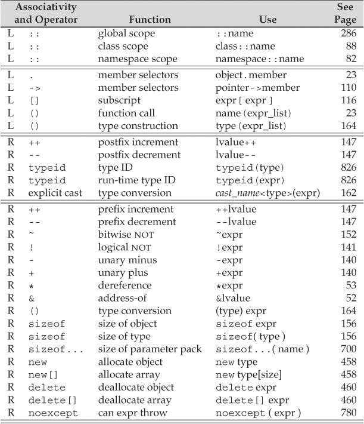
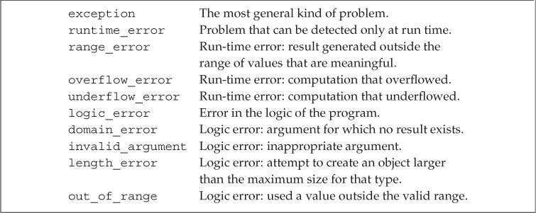

# Chapter 1. Getting Started

## 1.1 A First Look at Input/Output

### 1.1.1 Standard Input and Output

* `cin`

  Standard input

* `cout`

  Standard output

* `cerr`

  Standard error

* `clog`

  For general information about the execution of the program

### 1.1.2 Writing to a Stream

```c++
std::cout << "Enter two numbers:" << std::endl;
```

1. The `<<` operator

   * Two operands:

     * left-hand operand:  an `ostream` object
     * right-hand operand: a value to print

   * Result

     <font color='red'>Its left operand. That is, the `ostream` on which we wrote the given value.</font>

2. `endl`: a special value called a *manipulator*

   * Effect

     * Ending the current line

     * <font color='red'>Flushing the buffer associated with that device</font>

       Ensures that all the output the program has generated so far is actually written to the output stream, rather than sitting in memory waiting to be written 

### 1.1.3 Using Names from the Standard Library

```c++
std::cout, std::endl
```

The scope operator `::` means that the names `cout` and `endl` are defined inside the namespace named `std`

### 1.1.4 Reading from a Stream

```c++
int v1 = 0, v2 = 0;
std::cin >> v1 >> v2;
```

The `>>` operator returns its left operand, in this case, the `std::cin`. 

## 1.2 Flow of Control

### 1.2.1 The `for` Statement

```c++
for (int val = 1; val <= 10; ++val)
    sum += val;
```

* init-statement: `int val = 1`
* condition: `val <= 10`
* expression: `++val`

The init-statement is only executed once, if the condition is valid, execute the body, and then the expression is executed, and the condition is retested...

### 1.2.2 ⭐Reading an Unknown Number of Inputs

```c++
int sum = 0, value = 0;
while(std::cin >> value){
    sum += value;
}
```

Because the `>>` operator returns its left operand, in this case, the `while` statement tests `std::cin`.

1. When we use a `istream` as a condition, the effect is to test the state of the stream:

   * If the stream is valid, then the test succeeds.

   * If the stream hits end-of-line or encouter an invalud input, it becomes invalid.

2. Entering an `End-of-File` from the Keyboard:

   * Windows system: Typing control-z, followed by hitting the Enter key

   * Unix system: control-d

## 1.3 Introducing Classes

1. <font color='red'>Every class defines a type</font>, the type name is the same as the name of the class.

   As with the built-in type, we can define a variable of a class type:

   ```c++
   Sales_item item; // Here the item is a Sales_item object
   ```

2. Member Function

   A member function is a function that is defined as part of a class

# Chapter 2. Variables and Basic Types

## 2.1 Primitive Built-in Types

### 2.1.1 Arithmetic Types

 

The arithmetic types are divided into two categories:

* integral types
  * character
  * bollean
* floating-point types

1. Signed and Unsigned Types

   The types `int`, `short`, `long`, and `long long` are all signed. We obtain the corresponding unsigned type by adding unsigned to the type, such as `unsigned long`. <font color='red'>The type `unsigned int` may be abbreviated as `unsigned`.</font>

2. Deciding which type to use
   * Use an unsigned type when you know that the value cannot be negative
   * Use `int` for integer arithmetic
   * `long` often has the same size as `int`, so when your data is larger than `int`, use `long long`
   * Use `double` for floating-point computations

### 2.1.2 Type Conversions

```c++
bool b = 42;			// The result is false if the value is 0 and true otherwise
int i = b;				// The result is 0 if the bool is false and 1 if the bool is true
unsigned char c = -1;	// Here the number of values unsigned char can hold is 256(0 to 255), so the result is
						// -1 % 256 = (-1 + 256) % 256 = 255
signed char c2 = 256;	// If we assign an out-of-range value to a signed type, the result is undefined
```

* When we assign one of the non`bool` arithmetic types to a `bool` object, the result is `false` if the value is `0` and `true` otherwise.
* When we assign a `bool` to one of the other arithmetic types, the resulting value is `1` if the `bool` is `true` and `0` if the `bool` is `false`.
* When we assign a floating-point value to an object of integral type, the value is truncated. The value that is stored is the part before the decimal point.
* When we assign an integral value to an object of floating-point type, the fractional part is zero. Precision may be lost if the integer has more bits than the floating-point object can accommodate.
* If we assign an out-of-range value to an object of unsigned type, <font color='red'>the result is the remainder of the value modulo the number of values the target type can hold</font>. For example, an 8-bit `unsigned char` can hold values from 0 through 255, inclusive. If we assign a value outside this range, the compiler assigns the remainder of that value modulo 256. Therefore, assigning –1 to an 8-bit `unsigned char` gives that object the value 255.
* <font color='red'>If we assign an out-of-range value to an object of signed type, the result is undefined.</font> The program might appear to work, it might crash, or it might
  produce garbage values.

#### ⭐Expressions Involving Unsigned Types

1. if we use both `unsigned` and `int` values in an arithmetic expression, the `int` value ordinarily is converted to `unsigned`.

   ```c++
   unsigned u = 10;
   int i = -42;
   std::cout << i + i << std::endl; // prints -84
   std::cout << u + i << std::endl; // if 32-bit ints, prints 4294967264
   ```

   In the second expression, the `int` value `-42` is converted to `unsigned` before the addition is done. Converting a negative number to `unsigned` makes the value “wraps around”.

2. Regardless of whether one or both operands are `unsigned`, if we subtract a value from an `unsigned`, we must be sure that the result cannot be negative:

   ```c++
   unsigned u1 = 42, u2 = 10;
   std::cout << u1 - u2 << std::endl; // ok: result is 32
   std::cout << u2 - u1 << std::endl; // ok: but the result will wrap around
   ```

3. <font color='red'>The fact that an `unsigned` cannot be less than zero also affects how we write loops.</font>

   ```c++
   for(unsigned u = 10,; u >=0; --u)
       std::cout << u;
   ```

   When `u` is `0`, we print the value `0`, and `--u` subtracts `1` from `u`. That result, `-1`, will not fit in an `unsigned` type. `-1` will be converted to `unsigned`, resulting `4294967295`, so the loop will continue.

   One way to write this loop is to use a `while` instead of a for. Using a `while` lets us decrement before (rather than after) printing our value:

   ```c++
   unsigned u = 11;	// start the loop one past the first element we want to print
   while(u >= 1){
       --u;
       std::cout << u;	// decrement first, so that the last iteration will print 0
   }
   ```

<font color='orange'>Caution: Don’t Mix `Signed` and `Unsigned` Types</font>

### 2.1.3 Literals

A value, such as `42`, is known as a literal because its <font color='red'>value self-evident</font>. Every literal has a type. The form and value of a literal determine its type.

#### Integer and Floating-Point Literals

1. We can write an integer literal using decimal, octal, or hexadecimal notation. 

   Integer literals that begin with `0` (zero) are interpreted as octal. Those that begin with either `0x` or `0X` are interpreted as hexadecimal.

   ```c++
   20 /* decimal */ 024 /* octal */ 0x14 /* hexadecimal */
   ```

2. The type of an integer literal depends on its value and notation.

   By default, floating-point literals have type double. We can override defaults by using a suffix.

    

   ```c++
   L'a' // wide character literal, type is wchar_t
   u8"hi!" // utf-8 string literal (utf-8 encodes a Unicode character in 8 bits)
   42ULL // unsigned integer literal, type is unsigned long long
   1E-3F // single-precision floating-point literal, type is float
   3.14159L // extended-precision floating-point literal, type is long double
   ```

3. <font color='red'>The value of a decimal literal is never a negative number.</font>

   If we write `-42`, the minus sign is not part of the literal. The minus sign is an operator that negates the value of its operand.

#### Character and Character String Literals

A character enclosed within single quotes is a literal of type `char`. Zero or more characters enclosed in double quotation marks is a *string literal*.

<font color='red'>Two string literals that appear adjacent to one another and that are separated only by spaces, tabs, or newlines are concatenated into a single literal.</font>

```c++
// multiline string literal
std::cout << "a really, really long string literal "
                     "that spans two lines" << std::endl;
```

#### Boolean and Pointer Literals

The words `true` and `false` are literals of type `bool`:

```c++
bool test = false;
```

The word `nullptr` is a pointer literal.

## 2.2. Variables

### 2.2.1. Variable Definitions

Simple variable definition consists of a *type specifier*, followed by a list of one or more variable names separated by commas, and ends with a semicolon.

<font color='red'>An Object in C++:
An object is a region of memory that contain data and has a type.</font>

#### Initializers

When a definition defines two or more variables, the name of each object becomes visible immediately. Thus, it is possible to initialize a variable to the value of one defined earlier in the same definition.

```c++
// ok: price is defined and initialized before it is used to initialize discount
double price = 109.99, discount = price * 0.16;
```

#### List Initialization

We can use any of the following four different ways to define an `int` variable named `units_sold` and initialize it to `0`:

```c++
int units_sold = 0;
int units_sold = {0};
int units_sold{0};
int units_sold(0);
```

Braced lists of initializers can be used whenever we initialize an object and in some cases when we assign a new value to an object.

When used with variables of built-in type, list initialization has one important property: <font color='red'>The compiler will not let us list initialize variables of built-in type if
the initializer might lead to the loss of information</font>:

```c++
long double ld = 3.1415926536;
int a{ld}, b = {ld}; // error: narrowing conversion required
int c(ld), d = ld; // ok: but value will be truncated
```

#### Default Initialization

When we define a variable without an initializer, the variable is <font color='cornflowerblue'>**default initialized**</font>. Such variables are given the “default” value:

* built-in type

  * Variables defined outside any function body are initialized to zero
  * <font color='red'>Variables defined inside a function are uninitialized</font>. The value of an uninitialized variable of built-in type is undefined.

* class type

  Each class controls how we initialize objects of that class type. In particular, it is up to the class whether we can define objects of that type without an initializer. If we can, the class determines what value the resulting object will have.

  For example, as we’ve just seen, the library `string` class says that if we do not supply an initializer, then the resulting string is the empty string:

  ```c++
  std::string empty; // empty implicitly initialized to the empty string
  Sales_item item; // default-initialized Sales_item object
  ```

  Some classes require that every object be explicitly initialized. The compiler will complain if we try to create an object of such a class with no initializer.

### 2.2.2. Variable Declarations and Definitions

A **variable declaration** specifies the type and name of a variable. 

A **variable definition** is a declaration. In addition to specifying the name and type, a definition also allocates storage and may provide the variable with an initial value.

Variables must be **defined** exactly once but can be **declared** many times.

1. `extern` keyword

   To obtain a declaration that is not also a definition, we add the `extern` keyword and may not provide an explicit initializer:

   ```c++
   extern int i; // declares but does not define i
   int j; // declares and defines j
   ```

   Any declaration that includes an explicit initializer is a definition. We can provide an initializer on a variable defined as `extern`, but doing so overrides the `extern`. An `extern` that has an initializer is a definition:

   ```c++
   extern double pi = 3.1416; // definition
   ```

2. Static Typing

   C++ is a statically typed language, which means that **types are checked at compile time**. 

   As our programs get more complicated, we’ll see that static type checking can help find bugs. However, a consequence of static checking is that the
   type of every entity we use must be known to the compiler. As one example, we must declare the type of a variable before we can use that variable.

### 2.2.3. Identifiers 标识符

Identifiers in C++ can be composed of **letters**, **digits**, and the **underscore character**.

<font color='red'>Identifiers must begin with either a letter or an underscore.</font>

#### Conventions for Variable Names

1. An identifier should give some indication of its meaning.
2. Variable names normally are lowercase—`index`, not `Index` or `INDEX`.
3. Like `Sales_item`, classes we define usually begin with an uppercase letter.
4. Identifiers with multiple words should visually distinguish each word, for example, `student_loan` or `studentLoan`, not `studentloan`.

### 2.2.4. Scope of a Name

1. Advice: Define Variables Where You First Use Them

2. Use a scope operator to requests the global variable:

   ```c++
   #include <iostream>
   
   int reused = 42;
   int main(){
       int reused = 0;
       std::cout << reused << std::endl;
       std::cout << ::reused << std::endl;
   }
   ```

   The global scope has no name. Hence, when the scope operator has an empty left-hand side, it is a request to fetch the name on the right-hand side from the global scope

## 2.3 Compound Types 复合类型

A compound type is a type that is defined in terms of another type

### 2.3.1. References

* A reference defines an alternative name for an object

* Define a reference type by writing a declarator of the form `&d`. where `d` is the name being declared.

  ```c++
  int ival = 1024;
  int &refVal = ival;    //refVal is another name for ival
  ```

* After a reference has been defined, all operations on that reference are actually operations on the object which the reference is bound.

* A reference must be initialized, and there is no way to rebind a reference to refer to a different object.

* A reference is not an object. Instead a reference is just another name for an already existing object.

* The type of a reference and the object to which the reference refers must match exactly. (With two exceptions)

  ```c++
  double dval =3.14;
  int &refval1 = dval;    //error
  ```

* A reference may be bound only to an object, not to a literal or to another reference

  ```c++
  int &refVal = 10;    //error
  ```

### 2.3.2. Pointers

<font color='red'>Difference with reference</font>

* A pointer is an object, it can be assigned and copied

* A single pointer can point to several different objects over its lifetime

* A pointer need not be initialized at the time it is defined.

   Like other built-in types, pointers defined at block scope have undefined value if they are not initialized

We define a pointer type by writing a declarator of the form `*d`, where `d` is the name being defined. <font color='red'>The `*` must be repeated for each pointer variable</font>:

```c++
int *ip1, *ip2; // both ip1 and ip2 are pointers to int
double dp, *dp2; // dp2 is a pointer to double; dp is a double
```

#### Taking the Address of an Object

A pointer holds the address of another object. We get the address of an object by using the address-of operator (the `&` operator):

```c++
int ival = 42;
int *p = &ival;
```

<font color='red'>Because references are not objects, they don’t have addresses. Hence, we may not define a pointer to a reference.</font>

With two exceptions, the types of the pointer and the object to which it points must match:

```c++
double dval;
double *pd = &dval; // ok: initializer is the address of a double
double *pd2 = pd; // ok: initializer is a pointer to double
int *pi = pd; // error: types of pi and pd differ
pi = &dval; // error: assigning the address of a double to a pointer to int
```

#### Using a Pointer to Access an Object

When a pointer points to an object, we can use the dereference operator (the `*` operator) to access that object:

```c++
int ival = 42;
int *p = &ival; 	// p holds the address of ival; p is a pointer to ival
cout << *p; 		// * yields the object to which p points; prints 42
*p = 0; 			// * yields the object; we assign a new value to ival through p
cout << *p; 		// prints 0
```

#### Null Pointers

There are several ways to obtain a null pointer:

```c++
int *p1 = nullptr; 		// equivalent to int *p1 = 0;
int *p2 = 0; 			// directly initializes p2 from the literal constant 0
// must #include cstdlib
int *p3 = NULL; 		// equivalent to int *p3 = 0;
```

It is illegal to assign an `int` variable to a pointer, even if the variable’s value happens to be `0`.

```c++
int zero = 0;
pi = zero; // error: cannot assign an int to a pointer
```

#### Assignment and Pointers

Assignment makes the pointer point to a different object:

```c++
int ival = 42;
int *pi = 0; 	// pi is initialized but addresses no object
pi = &ival; 	// value in pi is changed; pi now points to ival
*pi = 0; 		// value in ival is changed; pi is unchanged
```

#### Other Pointer Operations

1. We can use a pointer in a condition. If the pointer is 0, then the condition is `false`. Any nonzero pointer evaluates as `true`.
2. Given two valid pointers of the same type, we can compare them using the equality (`==`) or inequality (`!=`) operators. 

#### `void*` Pointers

The type `void*` is a special pointer type that can hold the address of any object.

```c++
double obj = 3.14, *pd = &obj;
void *pv = &obj;
pv = pd;
```

There are only a limited number of things we can do with a `void*` pointer:

* Compare it to another pointer
* Pass it to or return it from a function
* Assign it to another void* pointer

<font color='red'>We cannot use a `void*` to operate on the object it addresses</font>—we don’t know that object’s type, and the type determines what operations we can perform on the object.

### 2.3.3. Understanding Compound Type Declarations

#### Defining Multiple Variables

```c++
int* p; // legal but might be misleading
```

We say that this definition might be misleading because it suggests that `int*` is the type of each variable declared in that statement. Despite appearances, <font color='red'>the base type of this declaration is `int`, not `int*`. The `*` modifies the type of `p`.</font>

```c++
int* p1, p2; // p1 is a pointer to int; p2 is an int
int *p1, *p2; // both p1 and p2 are pointers to int
```

#### Pointers to Pointers

We indicate each pointer level by its own `*`. That is, we write `**` for a pointer to a pointer, `***` for a pointer to a pointer to a pointer, and so on:

```c++
int ival = 1024;
int *pi = &ival; // pi points to an int
int **ppi = &pi; // ppi points to a pointer to an int

cout << "The value of ival\n"
	<< "direct value: " << ival << "\n"
	<< "indirect value: " << *pi << "\n"
	<< "doubl
```

#### ⭐References to Pointers

```c++
int i = 42;
int *p;
int *&r = p;
r = &i;
*r = 0;
```

The easiest way to understand the type of `r` is to read the definition right to left:

* The symbol closest to the name of the variable (in this case the `&` in `&r`) is the one that has the most immediate effect on the variable’s type. Thus, we know that `r` is a reference.
* The rest of the declarator determines the type to which `r` refers. The next symbol, `*` in this case, says that the type `r` refers to is a pointer type.
* Finally, the base type of the declaration says that `r` is a reference to a pointer to an `int`.

## 2.4. `const` Qualifier

Because we can’t change the value of a `const` object after we create it, it **must be initialized**. As usual, the initializer may be an arbitrarily complicated expression:

```c++
const int i = get_size(); 	// ok: initialized at run time
const int j = 42; 			// ok: initialized at compile time
const int k; 				// error: k is uninitialized const
```

#### By Default, `const` Objects Are Local to a File

When a `const` object is initialized from a compile-time constant, the compiler will usually replace uses of the variable with its corresponding value
during compilation. 

To substitute the value for the variable, the compiler has to see the variable’s initializer. When we split a program into multiple files, every file that uses the `const` must have access to its initializer. In order to see the initializer, <font color='red'>the variable must be defined in every file that wants to use the variable’s value</font>. 

To support this usage, yet avoid multiple definitions of the same variable, `const` variables are defined as local to the file. <font color='red'>When we define a const with the same name in multiple files, it is as if we had written definitions for separate variables in each file.</font>

### 2.4.1. References to `const`

Unlike an ordinary reference, a reference to `const` cannot be used to change the object to which the reference is bound:

```c++
const int ci = 1024;
const int &r1 = ci;		// ok: both reference and underlying object are const
r1 = 42;				// error: r1 is a reference to const
int &r2 = ci;			// error: non const reference to a const object
```

>Terminology: `const` Reference is a Reference to `const`
>
>Technically speaking, there are no `const` references. A reference is not an object, so we cannot make a reference itself `const`.

#### ⭐Initialization and References to `const`

<font color='red'>We can initialize a reference to `const` from any expression that can be converted to the type of the reference. In particular, we can bind a reference to
`const` to a non`const` object, a literal, or a more general expression:</font>

```c++
int i = 42;
const int &r1 = i;			// we can bind a const int& to a plain int object
const int &r2 = 42;			// ok: r1 is a reference to const
const int &r3 = r1 * 2;		// ok: r3 is a reference to const
int &r4 = r * 2;			// error: r4 is a plain, non const reference
```

Consider what happens when we bind a reference to an object of a different type:

```c++
double dval = 3.14;
const int &r1 = dval;
```

To ensure that the object to which `r1` is bound is an `int`, the compiler transforms this code into something like

```c++
const int temp = dval;	// create a temporary const int from the double
const int &ri = temp;	// bind ri to that temporary
```

In this case, `ri` is bound to a temporary object. A temporary object is an unnamed object created by the compiler when it needs a place to store a result from evaluating an expression.

#### A Reference to `const` May Refer to an Object That Is Not `const`

It is important to realize that a reference to `const` restricts only what we can do through that reference. Binding a reference to `const` to an object says nothing about whether the underlying object itself is `const`. Because the underlying object might be non`const`, it might be changed by other means:

```c++
int i = 42;
int &r1 = i; 			// r1 bound to i
const int &r2 = i; 		// r2 also bound to i; but cannot be used to change i
r1 = 0; 				// r1 is not const; i is now 0
r2 = 0; 				// error: r2 is a reference to const
```

### 2.4.2. Pointers and const

Like a reference to `const`, a pointer to `const` may not be used to change the object to which the pointer points. We may store the address of a `const` object only in a pointer to `const`:

```c++
const double pi = 3.14;
double *ptr = &pi;			// error: ptr is a plain pointer
const double *cptr = &pi;	// ok: cptr may point to a double that is const
*cptr = 42;					// error: cannot assign to *cptr
```

<font color='red'>We can use a pointer to const to point to a nonconst object</font>

```c++
double dval = 3.14;
const double *cptr = &dval;
```

#### `const` Pointers

Unlike references, pointers are objects. Hence, as with any other object type, we can have a pointer that is itself `const`.

<font color='red'>We indicate that the pointer is `const` by putting the `const` after the `*`.</font> This placement indicates that it is the pointer, not the pointed-to type, that is
`const`:

```c++
int errNumb = 0;
int *const curErr = &errNumb;		// curErr will always point to errNumb
const double pi = 3.14;
const double *const pip = &pi;		// pip is a const pointer to a const object
```

The easiest way to understand these declarations is to <font color='red'>read them from right to left</font>. 

* In this case, the symbol closest to `curErr` is `const`, which means that `curErr` itself will be a `const` object. 
* The type of that object is formed from the rest of the declarator. The next symbol in the declarator is `*`, which means that `curErr` is a const pointer.
* Finally, the base type of the declaration completes the type of `curErr`, which is a `const` pointer to an object of type `int`.

### 2.4.3. Top-Level const

We use the term<font color='blue'> top-level `const`</font> to indicate that the pointer itself is a `const`. When a pointer can point to a `const` object, we refer to that `const` as a <font color='blue'>low-level const</font>.

More generally, top-level `const` indicates that an object itself is `const`. Top-level `const` can appear in any object type, i.e., one of the built-in arithmetic types, a class type, or a pointer type. 

Low-level const appears in the base type of compound types such as pointers or references. 

```c++
int i = 0;
int *const p1 = &i; 		// we can't change the value of p1; const is top-level
const int ci = 42; 			// we cannot change ci; const is top-level
const int *p2 = &ci; 		// we can change p2; const is low-level
const int *const p3 = p2; 	// right-most const is top-level, left-most is not
const int &r = ci; 			// const in reference types is always low-level
```

1. <font color='red'>When we copy an object, top-level `const`s are ignored</font>

   ```c++
   i = ci; 		// ok: copying the value of ci; top-level const in ci is ignored
   p2 = p3; 		// ok: pointed-to type matches; top-level const in p3 is ignored
   ```

2. On the other hand, low-level `const` is never ignored. When we copy an object, both objects must have the same low-level `const` qualification or there must be a conversion between the types of the two objects. In general, we can convert a non`const` to `const` but not the other way round:

   ```c++
   int *p = p3;		// error: p3 has a low-level const but p doesn't
   p2 = p3;			// ok: p2 has the same low-level const qualification as p3
   p2 = &i;			// ok: we can convert int* to const int*
   int &r = ci;		// error: can't bind an ordinary int& to a const int object
   const int &r = i;	// ok: can bind const int& to plain int
   ```

### 2.4.4. `constexpr` and Constant Expressions

#### Constant Expression

A constant expression is an expression whose value cannot change and that <font color='red'>can be evaluated at compile time</font>:

* A literal is a constant expression.
* A const object that is initialized from a constant expression is also a constant expression.

```c++
const int max_files = 20; 			// max_files is a constant expression
const int limit = max_files + 1; 	// limit is a constant expression
int staff_size = 27; 				// staff_size is not a constant expression
const int sz = get_size(); 			// sz is not a constant expression
```

Although `staff_size` is initialized from a literal, it is not a constant expression because it is a plain `int`, not a `const int`. On the other hand, even though `sz` is a `const`, the value of its initializer is not known until run time. Hence, `sz` is not a constant expression.

#### `constexpr` Variables

In a large system, it can be difficult to determine (for certain) that an initializer is a constant expression. Under the new standard, we can ask the compiler to verify that a variable is a constant expression by declaring the variable in a `constexpr` declaration. 

<font color='red'>Variables declared as `constexpr` are implicitly `const` and must be initialized by constant expressions:</font>

```c++
constexpr int mf = 20;			// 20 is a constant expression
constexpr int limit = mf + 1;	// mf + 1 is a constant expression
constexpr int sz = size();		// ok only if size is a constexpr function
```

Although we cannot use an ordinary function as an initializer for a `constexpr` variable, <font color='red'>we can use `constexpr` functions in the initializer of a `constexpr` variable.</font> Such functions must be simple enough that the compiler can evaluate them at compile time.

#### Literal Types

Because a constant expression is one that can be evaluated at compile time, there are limits on the types that we can use in a `constexpr` declaration. The types we can use in a `constexpr` are known as “<font color='blue'>literal types</font>” because they are simple enough to have literal values:

* the arithmetic types
* reference types
* pointer  types

Our `Sales_item` class and the library IO and `string` types are not literal types. Hence, we cannot define variables of these types as `constexpr`s.

1. Although we can define both pointers and reference as `constexpr`s, the objects we use to initialize them are strictly limited:
   * We can initialize a `constexpr` pointer from the `nullptr` literal or the literal `0`. 
   * We can also point to (or bind to) an object that remains at a fixed address
     * Variables defined inside a function ordinarily are not stored at a fixed address. Hence, we cannot use a `constexpr` pointer to point to such variables.
     * The address of an object defined outside of any function is a constant expression, and so may be used to initialize a `constexpr` pointer.
     * Functions may define variables that exist across calls to that function. Like an object defined outside any function, these special local objects also have fixed addresses. Therefore, a `constexpr` reference may be bound to, and a `constexpr` pointer may address, such variables.

#### Pointers and `constexpr`

It is important to understand that when we define a pointer in a `constexpr` declaration, <font color='red'>the `constexpr` specifier applies to the pointer, not the type to which the pointer points</font>:

```c++
const int *p = nullptr;			// p is a pointer to a const int
constexpr int *np = nullptr;	// np is a constant pointer to int that is null
int j = 0;
constexpr int i = 42;
// i and j must be defined outside any function
constexpr const int *p = &i;	// p is a constant pointer to the const int i
constexpr int *p1 = &jl			// p1 is a constant pointer to the int j
```

> `constexpr` imposes a top-level `const` on the objects it defines.

## 2.5. Dealing with Types

### 2.5.1. Type Aliases

We can define a type alias in one of two ways:

* `typedef`

  <font color='red'>The keyword `typedef` may appear as part of the base type of a declaration.</font> Declarations that include typedef define type aliases rather than variables. As in any other declaration, the declarators can include type modifiers that define compound types built from the base type of the definition:

  ```c++
  typedef double wages;		// wage is a synonym for double
  typedef wages base, *p;		// base is a synonym for double, p is a synonym for double *
  ```

* alias declaration

  The alias declaration defines the name on the left-hand side of the `=` as an alias for the type that appears on the right-hand side.

  ```c++
  using SI = Sales_item; 		// SI is a synonym for Sales_item
  ```

#### Pointers, const, and Type Aliases

```c++
typedef char *pstring;			// pstring is a synonym for char*
const pstring cstr = 0;			// cstr is a constant pointer to char
const pstring *ps;				// ps is a pointer to a constant pointer to char
```

The base type in these declarations is `const pstring`. As usual, a `const` that appears in the base type modifies the given type. The type of `pstring` is “pointer to `char`.” So, `const pstring` is a constant pointer to `char`—not a pointer to `const char`.

### 2.5.2. The `auto` Type Specifier

Under the new standard, we can let the compiler figure out the type for us by using the `auto` type specifier. `auto` tells the compiler to deduce the type
from the initializer. By implication, a variable that uses `auto` as its type specifier must have an initializer:

```c++
// the type of item is deduced from the type of the result of adding val1 and val2
auto item = val1 + val2; // item initialized to the result of val1 + val2
```

As with any other type specifier, we can define multiple variables using `auto`. Because a declaration can involve only a single base type, the initializers for all the variables in the declaration must have types that are consistent with each other:

```c++
auto i = 0, *p = &i;		// ok: i is int and p is a pointer to int
auto sz = 0, pi = 3.14;		// error: inconsistent types for sz and pi
```

#### Compound Types, `const`, and `auto`

The type that the compiler infers for `auto` is not always exactly the same as the initializer’s type. 

Instead, the compiler adjusts the type to conform to normal initialization rules:

* When we use a reference, we are really using the object to which the reference refers. In particular, when we use a reference as an initializer, the
  initializer is the corresponding object. The compiler uses that object’s type for `auto`’s type deduction:

  ```c++
  int i = 0, &r = i;
  auto a = r;			// a is an int
  ```

* `auto` ordinarily ignores top-level `const`s. As usual in initializations, low-level `const`s, such as when an initializer is a pointer to `const`, are
  kept:

  ```c++
  const int ci = i, &cr = ci;
  auto b = ci; 	// b is an int (top-level const in ci is dropped)
  auto c = cr; 	// c is an int (cr is an alias for ci whose const is top-level)
  auto d = &i; 	// d is an int*(& of an int object is int*)
  auto e = &ci; 	// e is const int*(& of a const object is low-level const)
  ```

  If we want the deduced type to have a top-level `const`, we must say so explicitly:

  ```c++
  const auto f = ci;	// deduced type of ci is int; f has type const int
  ```

* When we ask for a reference to an auto-deduced type, top-level `const`s in the initializer are not ignored. As usual, `const`s are not top-level when we bind a reference to an initializer.

  ```c++
  auto &g = ci;		// g is a const int& that is bound to ci
  auto &h = 42;		// error: we can't bind a plain reference to a literal
  const auto &j = 42;	// ok: we can bind a const reference to a literal
  ```

> auto 三条规则：
>
> * 忽略引用
> * 声明的是指针的时候，忽略顶层const
> * 声明的是引用的时候，保留顶层const

When we define several variables in the same statement, it is important to remember that a reference or pointer is part of a particular declarator and not part of the base type for the declaration. As usual, the initializers must provide consistent `auto`-deduced types:

```c++
auto k = ci, &l = i;	// k is int; l is int&
auto &m = ci, *p = &ci;	// m is a const int&, p is a pointer to const int
auto &n = i, *p2 = &ci;	// error: type deduced from i is int; type deduced from &ci is const int
```

### 2.5.3. The `decltype` Type Specifier

Sometimes we want to define a variable with a type that the compiler deduces from an expression but do not want to use that expression to initialize the variable. For such cases, the new standard introduced a second type specifier, `decltype`, which returns the type of its operand.

```c++
decltype(f()) sum = x; // sum has whatever type f returns
```

When the expression to which we apply `decltype` is a variable, <font color='red'>`decltype` returns the type of that variable, including top-level const and references</font>:

```c++
const int ci = 0, &cj = ci;
decltype(ci) x = 0;		// x is const int
decltype(cj) y = x;		// y is const int&
decltype(cj) z;			// error: z is a reference and must be initialized
```

#### `decltype` and References

When we apply `decltype` to an expression that is not a variable, we get the type that that expression yields. <font color='red'>`decltype` returns a reference type for expressions that yield objects that can stand on the left-hand side of the assignment</font>:

```c++
// decltype of an expression can be a reference type
int i = 42, *p = &i, &r = i;
decltype(r + 0) b;	// ok: addition yields an int; b is an (uninitialized) int
decltype(*p) c;		// error: c is int& and must be initialized
```

* Here `r` is a reference, so `decltype(r)` is a reference type. If we want the type to which `r` refers, we can use `r` in an expression, such as `r + 0`, which is an expression that yields a value that has a nonreference type.
* The dereference operator is an example of an expression for which `decltype` returns a reference. As we’ve seen, when we dereference a pointer,
  we get the object to which the pointer points. Moreover, we can assign to that object. Thus, the type deduced by `decltype(*p)` is `int&`, not plain `int`.

Enclosing the name of a variable in parentheses affects the type returned by `decltype`. When we apply `decltype` to a variable without any parentheses, we get the type of that variable. <font color='red'>If we wrap the variable’s name in one or more sets of parentheses, the compiler will evaluate the operand as an expression</font>:

```c++
// decltype of a parenthesized variable is always a reference
decltype((i)) d; // error: d is int& and must be initialized
decltype(i) e; // ok: e is an (uninitialized) int
```

## 2.6. Defining Our Own Data Structures

## 2.6.1. Defining the `Sales_data` Type

```c++
struct Sales_data{
    std::string bookNo;
    unsigned units_sold = 0;
    double revenue = 0.0;
};
```

The close curly that ends the class body must be followed by a semicolon. The semicolon is needed because we can define variables after the class body:

```c++
struct Sales_data { /* ... */ } accum, trans, *salesptr;
// equivalent, but better way to define these objects
struct Sales_data { /* ... */ };
Sales_data accum, trans, *salesptr;
```

#### Class Data Members

Each object has its own copy of the class data members. Modifying the data members of one object does not change the data in any other `Sales_data`
object.

Under the new standard, we can supply an <font color='blue'>in-class initializer</font> for a data member. When we create objects, the in-class initializers will be used to initialize the data members. <font color='red'>Members without an initializer are default initialized.</font> 

In-class initializers are restricted as to the form we can use: They must either be enclosed inside curly braces or follow an `=` sign. <font color='red'>We may not specify an
in-class initializer inside parentheses.</font>

### 2.6.2. Using the `Sales_data` Class

```c++
#include <iostream>
#include <string>
#include "Sales_data.h"
int main()
{
	Sales_data data1, data2;
	// code to read into data1 and data2
	double price = 0;
    std::cin >> data1.bookNo >> data1.units_sold >> price;
    data1.revenue = data1.units_sold * price;
    std::cin >> data2.bookNo >> data2.units_sold >> price;
	data2.revenue = data2.units_sold * price;
	// code to check whether data1 and data2 have the same ISBN
	// and if so print the sum of data1 and data2
    if (data1.bookNo == data2.bookNo) {
		unsigned totalCnt = data1.units_sold + data2.units_sold;
		double totalRevenue = data1.revenue + data2.revenue;
        std::cout << data1.bookNo << " " << totalCnt
					<< " " << totalRevenue << " ";
	}
}
```

### 2.6.3. Writing Our Own Header Files

In order to ensure that the class definition is the same in each file, classes are usually defined in header files. Headers (usually) contain entities (such as class definitions and `const` and `constexpr` variables) that can be defined only once in any given file.

However, headers often need to use facilities from other headers. For example, because our `Sales_data` class has a `string` member, `Sales_data`.h must `#include` the `string` header. As we’ve seen, programs that use `Sales_data` also need to include the `string` header in order to use the `bookNo` member. As a result, programs that use `Sales_data` will include the `string` header twice.

Because a header might be included more than once, we need to write our headers in a way that is safe even if the header is included multiple times.

#### A Brief Introduction to the Preprocessor

The preprocessor—which C++ inherits from C—is a program that runs before the compiler and changes the source text of our programs. C++ programs also use the preprocessor to define <font color='blue'>header guards</font>.

Header guards rely on preprocessor variables. Preprocessor variables have one of two possible states: defined or not defined.

* The `#define` directive takes a name and defines that name as a preprocessor variable.
* `#ifdef` is true if the variable has been defined
* `#ifndef` is true if the variable has not been defined

```c++
#ifndef SALES_DATA_H
#define SALES_DATA_H
#include <string>
struct Sales_dat{
    std::string bookNo;
	unsigned units_sold = 0;
	double revenue = 0.0;
};
#endif
```

The first time `Sales_data.h` is included, the `#ifndef` test will succeed. The preprocessor will process the lines following `#ifndef` up to the `#endif`. As a result, the preprocessor variable `SALES_DATA_H` will be defined and the contents of `Sales_data.h` will be copied into our program. 

If we include `Sales_data.h` later on in the same file, the `#ifndef` directive will be false. The lines between it and the `#endif` directive will be ignored.

# Chapter 3. Strings, Vectors, and Arrays

## 3.1. Namespace `using` Declarations

`using` declaration covers another way to use names from a namespace without qualifying the name with a n`amespace_name::` prefix:

```c++
using namespace::name;
```

Once the `using` declaration has been made, we can access name directly:

```c++
#include <iostream>
// using declaration; when we use the name cin, we get the one from the namespace
std
using std::cin;
int main()
{
	int i;
	cin >> i; 		// ok: cin is a synonym for std::cin
	cout << i; 		// error: no using declaration; we must use the full name
	std::cout << i; // ok: explicitly use cout from namepsace std
	return 0;
}
```

#### A Separate using Declaration Is Required for Each Name

Each `using` declaration introduces a single namespace member.

```c++
#include <iostream>
// using declarations for names from the standard library
using std::cin;
using std::cout; using std::endl;
int main()
{
	cout << "Enter two numbers:" << endl;
	int v1, v2;
	cin >> v1 >> v2;
	cout << "The sum of " << v1 << " and " << v2
		<< " is " << v1 + v2 << endl;
	return 0;
}
```

#### Headers Should Not Include `using` Declarations

The reason is that the contents of a header are copied into the including program’s text. If a header has a `using` declaration, then every program that includes that header gets that same `using` declaration. As a result, a program that didn’t intend to use the specified library name might encounter unexpected name conflicts.

## 3.2. Library `string` Type

### 3.2.1. Defining and Initializing strings

 

When we supply a `string` literal, the characters from that literal—up to but not including the null character at the end of the literal—are copied into the newly created `string`.

```c++
string s1;
string s2 = s1;
string s3 = "hiya";
string s4(10, 'c');
```

#### Direct and Copy Forms of Initialization

* When we initialize a variable using `=`, we are asking the compiler to <font color='blue'>copy initialize</font> the object by copying the initializer on the right-hand side into the object being created.
* When we omit the `=`, we use <font color='blue'>direct initialization</font>.

### 3.2.2. Operations on `string`s

 

#### Reading and Writing `string`s

```c++
int main(){
    string s;
    cin >> s;
    cout << s << endl;
    return 0;
}
```

The `string` input operator reads and discards any leading whitespace (e.g., spaces, newlines, tabs). It then reads characters until the next whitespace character is encountered. So, if the input to this program is ` Hello World!` (note leading and trailing spaces), then the output will be `Hello` with no extra spaces.

#### ⭐Using `getline` to Read an Entire Line

The `getline` function takes an input stream and a `string`. This function reads the given stream up to and including the first newline and stores what it read—not including the newline—in its `string` argument.

After `getline` sees a newline, even if it is the first character in the input, it stops reading and returns. If the first character in the input is a newline, then the resulting `string` is the empty `string`.

Like the input operator, `getline` returns its `istream` argument. As a result, we can use `getline` as a condition just as we can use the input operator as a condition：

```c++
string line;
while(getline(cin, line)){
    cout << line << endl;
}
```

> The newline that causes `getline` to return is discarded; the newline is not stored in the `string`.

#### ⭐The `string::size_type` Type

The `size` member returns the length of a string. It might be logical to expect that `size` returns an `int` or, an `unsigned`. Instead, `size` returns a `string::size_type` value.

The `string` class—and most other library types—defines several companion types. These companion types make it possible to <font color='red'>use the library types in a machine-independent manner.</font> 

Although we don’t know the precise type of `string::size_type`, we do know that it is an `unsigned` type big enough to hold the size of any `string`.

Because `size` returns an unsigned type, it is essential to remember that expressions that mix signed and unsigned data can have surprising results. <font color='red'>For example, if `n` is an `int` that holds a negative value, then `s.size() < n` will almost surely evaluate as `true`. It yields `true` because the negative value in `n` will convert to a large unsigned value.</font>

#### Adding Literals and `string`s

We can use one type where another type is expected if there is a conversion from the given type to the expected type. The `string` library lets us convert both character literals and character string literals to `string`s.

 ```c++
 string s1 = "hello", s2 = "world";
 string s3 = s1 + ", " + s2 + '\n';
 ```

<font color='red'>When we mix `string`s and string or character literals, at least one operand to each operator must be of `string` type</font>:

```c++
string s4 = s1 + ", "; 				// ok: adding a string and a literal
string s5 = "hello" + ", "; 		// error: no string operand
string s6 = s1 + ", " + "world"; 	// ok: each + has a string operand
string s7 = "hello" + ", " + s2; 	// error: can't add string literals
```

The initialization of `s6` may appear surprising, This initialization groups as:

```c++
string s6 = (s1 + ", ") + "world"; 
```

The subexpression `s1 + ", "` returns a `string`, which forms the left-hand operand of the second `+` operator.

#### 3.2.3. Dealing with the Characters in a `string`

One part of processing characters is knowing and/or changing the characteristics of a character.This part of the job is handled by a set of library functions. These functions are defined in the `cctype` header.

  

#### Processing Every Character? Use Range-Based `for`

The range `for` statement iterates through the elements in a given sequence and performs some operation on each value in that sequence. The syntactic form is:

```c++
string str("some string");
for(auto c : str)
    cout << c << endl;
```

#### ⭐Using a Range `for` to Change the Characters in a `string`

If we want to change the value of the characters in a `string`, <font color='red'>we must define the loop variable as a reference type</font>.

```c++
string s("Hello World!!!");
for(auto &c : s)
    c = toUpper(c);
```

#### Processing Only Some Characters?

There are two ways to access individual characters in a `string`: We can use a <font color='blue'>subscript </font>or an <font color='blue'>iterator</font>.

The subscript operator (the `[ ]` operator) takes a <font color='red'>`string::size_type` </font>value that denotes the position of the character we want to access. The
operator returns a <font color='red'>reference </font>to the character at the given position.

The index in the subscript we supply can be any expression that yields an integral value. However, if our index has a signed type, its value will be converted to the unsigned type that `string::size_type` represents

#### Using a Subscript for Random Access

Let’s assume we have a number between 0 and 15 and we want to generate the hexadecimal representation of that number. We can do so using a `string` that is initialized to hold the 16 hexadecimal “digits”:

```c++
const string hexdigits = "0123456789ABCDEF";
cout << "Enter a series of numbers between 0 and 15"
		<< " separated by spaces. Hit ENTER when finished: "
		<< endl;
string::size_type n;
string result;
while(cin >> n){
    if(n < hexdigits.size())
    	result += hexdigits[n];
}
cout << "Your hex number is: " << result;
```

## 3.3. Library `vector` Type

A `vector` is a collection of objects, all of which have the same type.

We can define `vector`s to hold objects of most any type. Because references are not objects, we cannot have a vector of references. However, we can have `vector`s of most other (nonreference) built-in types and most class types. In particular, we can have `vector`s whose elements are themselves `vector`s.

#### 3.3.1. Defining and Initializing `vector`s

 

When we copy a `vector`, each element in the new `vector` is a copy of the corresponding element in the original `vector`. <font color='red'>The two `vector`s must be the same type</font>:

```c++
vector<int> ivec; 				// initially empty
// give ivec some values
vector<int> ivec2(ivec); 		// copy elements of ivec into ivec2
vector<int> ivec3 = ivec; 		// copy elements of ivec into ivec3
vector<string> svec(ivec2); 	// error: svec holds strings, not ints
```

#### List Initializing a `vector`

So far, we have three examples where the form of initialization matters:

* When we use the copy initialization form (i.e., when we use `=`) , we can supply only a single initializer

* When we supply an in-class initializer, we must either use copy initialization or use curly braces.

* We can supply a list of element values only by using list initialization in which the initializers are enclosed in curly braces. We cannot supply a list of initializers using parentheses.

  ```c++
  vector<string> v1{"a", "an", "the"}; // list initialization
  vector<string> v2("a", "an", "the"); // error
  ```

#### ⭐Value Initialization

We can usually omit the value and supply only a size. In this case the library creates a <font color='blue'>value-initialized</font> element initializer for us. This library-generated value is used to initialize each element in the container. The value of the element initializer depends on the type of the elements stored in the vector:

* If the `vector` holds elements of a built-in type, such as `int`, then the element initializer has a value of `0`. 
* If the elements are of a class type, such as `string`, then the element initializer is itself default initialized:

```c++
vector<int> ivec(10); 		// ten elements, each initialized to 0
vector<string> svec(10); 	// ten elements, each an empty stringbrace
```

There are two restrictions on this form of initialization: 

* Some classes require that we always supply an explicit initializer. If our `vector` holds objects of a type that we cannot default initialize, then we must
  supply an initial element value; it is not possible to create `vector`s of such types by supplying only a size.

* When we supply an element count without also supplying an initial value, we must use the direct form of initialization:

  ```c++
  vector<int> vi = 10; // error: must use direct initialization to supply a size
  ```

#### List Initializer or Element Count?

```c++
vector<int> v1(10); 		// v1 has ten elements with value 0
vector<int> v2{10}; 		// v2 has one element with value 10
vector<int> v3(10, 1); 		// v3 has ten elements with value 1
vector<int> v4{10, 1}; 		// v4 has two elements with values 10 and 1
```

When we use parentheses, we are saying that the values we supply are to be used to construct the object.

<font color='red'>When we use curly braces, `{...}`, we’re saying that, if possible, we want to list initialize the object. That is, if there is a way to use the values inside the curly braces as a list of element initializers, the class will do so. Only if it is not possible to list initialize the object will the other ways to initialize the object be considered.</font>

On the other hand, if we use braces and there is no way to use the initializers to list initialize the object, then those values will be used to construct the object:

```c++
vector<string> v5{"hi"};		// list initialization: v5 has one element
vector<string> v6("hi");		// error: can't construct a vector from a string literal
vector<string> v7{10};			// v7 has ten default-initialized elements
vector<string> v8{10, "hi"};	// v8 has ten elements with value "hi"
```

### 3.3.2. Adding Elements to a `vector`

In some cases, it is better to create an empty `vector` and use a `vector` member named `push_back` to add elements at run time. The `push_back` operation takes a value and “pushes” that value as a new last element onto the “back” of the `vector`.

The fact that we can easily and efficiently add elements to a `vector` greatly simplifies many programming tasks. However, this simplicity imposes new obligations on our programs: 

* We must ensure that any loops we write are correct even if the loop changes the size of the vector.
* We cannot use a range `for` if the body of the loop adds elements to the `vector`.

### 3.3.3. Other `vector` Operations

 

1. The `size` member returns a value of the `size_type` defined by the corresponding `vector` type:

   ```c++
   vector<int>::size_type 	// ok
   vector::size_type 		// error
   ```

2.  We can compare two `vector`s only if we can compare the elements in those `vector`s. Some class types, such as `string`, define the meaning of the equality and relational operators. Others, such as our `Sales_item` class, do not. As a result, we cannot compare two `vector<Sales_item>` objects.

#### ⭐Subscripting Does Not Add Elements

Programmers new to C++ sometimes think that subscripting a `vector` adds elements; it does not. The following code intends to add ten elements to `ivec`:

```c++
vector<int> ivec;
for(decltype(ivec.size()) ix = 0; ix != 10; ix++){
    ivec[ix] = ix;	// disaster: ivec has no elements
}
```

However, it is in error: `ivec` is an empty `vector`; there are no elements to subscript! As we’ve seen, the right way to write this loop is to use `push_back`.

## 3.4. Introducing Iterators

Although we can use subscripts to access the characters of a `string` or the elements in a `vector`, there is a more general mechanism—known as iterators—that we can use for the same purpose. All of the library containers have iterators, but only a few of them support the subscript operator.

### 3.4.1. Using Iterators

We use `begin` and `end` member to get iterators:

* The `begin` member returns an iterator that denotes the first element
* The iterator returned by `end` is an iterator positioned “<font color='red'>one past the end</font>” of the associated container. The iterator returned by `end` is often referred to as the <font color='blue'>off-the-end iterator</font>

> If the container is empty, the iterators returned by `begin` and `end` are equal —they are both off-the-end iterators.

#### Iterator Operations

 

#### Moving Iterators from One Element to Another

Iterators use the increment (`++`) operator to move from one element to the next.

```c++
// process characters in s until we run out of characters or we hit a whitespace
for(auto it = s.begin(); s != s.end() && !isspace(*it); it++)
    *it = toUpper(*it);		// Capitalize the current character
```

> Key Concept: Generic Programming
>
> Programmers coming to C++ from C or Java might be surprised that we used `!=` rather than `<` in our for loops such as the one above. C++ programmers use `!=` as a matter of habit. They do so for the same reason that they use iterators rather than subscripts: This coding style
> applies equally well to various kinds of containers provided by the library.

#### Iterator Types

As with `size_type`, the library types that have iterators define types named `iterator` and `const_iterator` that represent actual iterator types:

```c++
vector<int>::iterator it;
string::iterator it2;
vector<int>::const_iterator it3;
string::const_iterator it4;
```

A `const_iterator` behaves like a `const` pointer. It may read but not write the element it denotes. If a `vector` or `string` is `const`, we may use only its `const_iterator` type. With a non`const` `vector` or `string`, we can use either `iterator` or `const_iterator`.

#### The `begin` and `end` Operations

The type returned by `begin` and `end` depends on whether the object on which they operator is `const`. If the object is `const`, then `begin` and `end` return a `const_iterator`; if the object is not `const`, they return `iterator`.

```c++
vector<int> v;
const vector<int> cv;
auto it1 = v.begin(); 	// it1 has type vector<int>::iterator
auto it2 = cv.begin(); 	// it2 has type vector<int>::const_iterator
```

To let us ask specifically for the `const_iterator` type, the new standard introduced two new functions named `cbegin` and `cend`. Regardless of whether the `vector` (or `string`) is `const`, they return a `const_iterator`.

#### Some `vector` Operations Invalidate Iterators

For now, it is important to realize that loops that use iterators should not add elements to the container to which the iterators refer.

### 3.4.2. Iterator Arithmetic

Incrementing an iterator moves the iterator one element at a time. All the library containers have iterators that support increment. Similarly, we can use `==` and `!=` to compare two valid iterators into any of the library container types.

Iterators for `string` and `vector` support additional operations that can move an iterator multiple elements at a time. They also support all the relational operators. These operations are referred to as <font color='blue'>iterator arithmetic</font>.

 

We can subtract two iterators so long as they refer to elements in, or one off the end of, the same `vector` or `string`. The result is the distance between the iterators. By distance we mean the amount by which we’d have to change one iterator to get the other. <font color='red'>The result type is a signed integral type named `difference_type`.</font> Both vector and string define difference_type. 

## 3.5. Arrays

An array is a data structure that is similar to the library `vector` type. 

* Like a `vector`, an array is a container of unnamed objects of a single type that we access by position.
* Unlike a `vector`, arrays have fixed size; we cannot add elements to an array.

### 3.5.1. Defining and Initializing Built-in Arrays

Arrays are a compound type. An <font color='blue'>array declarator</font> has the form `a[d]`, where `a` is the name being defined and `d` is the dimension of the array. The
number of elements in an array is part of the array’s type. As a result, the dimension must be known at compile time, which means that <font color='red'>the dimension must be a constant expression.</font>

```c++
unsigned cnt = 42; 					// not a constant expression
constexpr unsigned sz = 42; 		// constant expression
int arr[10]; 						// array of ten ints
int *parr[sz]; 						// array of 42 pointers to int
string bad[cnt]; 					// error: cnt is not a constant expression
string strs[get_size()]; 			// ok if get_size is constexpr, error otherwise
```

<font color='red'>By default, the elements in an array are default initialized</font>. As with variables of built-in type, a default-initialized array of built-in type that is defined inside a function will have undefined values.

#### Explicitly Initializing Array Elements

We can list initialize the elements in an array:

* If we omit the dimension, the compiler infers it from the number of initializers. 
* If we specify a dimension, the number of initializers must not exceed the specified size. 
* If the dimension is greater than the number of initializers, the initializers are used for the first elements and any remaining elements are <font color='red'>value initialized</font>

```c++
const unsigned sz = 3;
int ia1[sz] = {0,1,2}; 			// array of three ints with values 0, 1, 2
int a2[] = {0, 1, 2}; 			// an array of dimension 3
int a3[5] = {0, 1, 2}; 			// equivalent to a3[] = {0, 1, 2, 0, 0}
string a4[3] = {"hi", "bye"}; 	// same as a4[] = {"hi", "bye", ""}
int a5[2] = {0,1,2}; 			// error: too many initializers

unsigned scores[11] = {};		// 11 elements, all value initialized to 0
```

#### ⭐Character Arrays Are Special

Character arrays have an additional form of initialization: We can initialize such arrays from a string literal. When we use this form of initialization, it is
important to remember that string literals end with a null character. <font color='red'>That null character is copied into the array along with the characters in the literal</font>:

```c++
char a1[] = {'C', '+', '+'}; 			// list initialization, no null
char a2[] = {'C', '+', '+', '\0'}; 		// list initialization, explicit null
char a3[] = "C++"; 						// null terminator added automatically
const char a4[6] = "Daniel"; 			// error: no space for the null!
```

#### No Copy or Assignment

We cannot initialize an array as a copy of another array, nor is it legal to assign one array to another:

```c++
int a[] = {0, 1, 2}; 		// array of three ints
int a2[] = a; 				// error: cannot initialize one array with another
a2 = a; 					// error: cannot assign one array to another
```

#### Understanding Complicated Array Declarations

```c++
int *ptrs[10]; 					// ptrs is an array of ten pointers to int
int &refs[10] = /* ? */; 		// error: no arrays of references
int (*Parray)[10] = &arr; 		// Parray points to an array of ten ints
int (&arrRef)[10] = arr; 		// arrRef refers to an array of ten ints
```

<font color='red'>Reading from the inside out</font> makes it much easier to understand the type of `Parray`. 

* We start by observing that the parentheses around `*Parray` mean that `Parray` is a pointer. 
* Looking right, we see that `Parray` points to an array of size 10. 
* Looking left, we see that the elements in that array are `int`s. Thus, `Parray` is a pointer to an array of ten `int`s.

### 3.5.2. Accessing the Elements of an Array

As with the library `vector` and `string` types, we can use a range `for` or the subscript operator to access elements of an array.

```c++
unsigned scores[] = {1, 2, 3, 4};
for(auto i : scores){
    cout << i << endl;
}
```

When we use a variable to subscript an array, we normally should define that variable to have type `size_t`. `size_t` is a machine-specific（机器相关） unsigned type that is guaranteed to be large enough to hold the size of any object in memory. The `size_t` type is defined in the `cstddef` header, which is the C++ version of the `stddef.h` header from the C library.

### 3.5.3. Pointers and Arrays

In C++ pointers and arrays are closely intertwined. In particular, as we’ll see, when we use an array, the compiler ordinarily converts the array to a pointer.

As with any other object, we can obtain a pointer to an array element by taking the address of that element:

```c++
string nums[] = {"one", "two", "three"};
string *p = &nums[0];			// p points to the first element in nums
```

However, arrays have a special property—in most places when we use an array, the compiler automatically substitutes<font color='red'> a pointer to the first element</font>:

```c++
string *p2 = nums; // equivalent to p2 = &nums[0]
```

1. When we use an array as an initializer for a variable defined using `auto` , the deduced type is a pointer, not an array

   ```c++
   int ia[] = {0,1,2,3,4,5,6,7,8,9}; 		// ia is an array of ten ints
   auto ia2(ia); 							// ia2 is an int* that points to the first element in ia
   ```

   Although `ia` is an array of ten `int`s, when we use `ia` as an initializer, the compiler treats that initialization as if we had written

   ```c++
   auto ia2(&ia[0]);	// now it's clear that ia2 has type int*
   ```

2. It is worth noting that this conversion does not happen when we use `decltype`. The type returned by `decltype(ia)` is array of ten `int`s:

   ```c++
   decltype(ia) ia3 = {0, 1, 2, 3, 4, 5, 6, 7, 8, 9};
   ```

#### Pointers Are Iterators

Pointers that address elements in an array support the same operations as iterators on `vector`s and `string`s. 

* We can obtain a pointer to the first element by using the array itself or by taking the address-of the first element.

  ```c++
  int arr[] = {0, 1, 2, 3, 4, 5, 6, 7, 8, 9};
  int *b = arr;
  ```

* We can obtain an off-the-end pointer by taking the address of the nonexistent element one past the last element of an array

  ```c++
  int *q = &arr[10];	// pointer just past the last element in arr
  ```

  Here we used the subscript operator to index a nonexisting element; The only thing we can do with this element is take its address.

```c++
for(int *b = arr; b != e; b++)
    cout << *b;
```

#### The Library begin and end Functions

Although we can compute an off-the-end pointer, doing so is error-prone. To make it easier and safer to use pointers, the new library includes two functions, named `begin` and `end`.

These functions act like the similarly named container members. However, arrays are not class types, so these functions are not member functions. Instead, they take an argument that is an array:

```c++
int ia[] = {0,1,2,3,4,5,6,7,8,9}; 	// ia is an array of ten ints
int *beg = begin(ia); 				// pointer to the first element in ia
int *last = end(ia); 				// pointer one past the last element in ia
```

#### Pointer Arithmetic

1. When we add (or subtract) an integral value to (or from) a pointer, the result is a new pointer. That new pointer points to the element the given number ahead of (or behind) the original pointer:

   ```c++
   constexpr size_t sz = 5;
   int arr[sz] = {1,2,3,4,5};
   int *ip = arr; 			// equivalent to int *ip = &arr[0]
   int *ip2 = ip + 4; 		// ip2 points to arr[4], the last element in arr
   ```

2. As with iterators, subtracting two pointers gives us the distance between those pointers. The pointers must point to elements in the same array:

   ```c++
   auto n = end(arr) - begin(arr);		// n is 5, the number of elements in arr
   ```

3. We can use the relational operators to compare pointers that point to elements of an array, or one past the last element in that array. But We cannot use the relational operators on pointers to two unrelated objects:

   ```c++
   int i = 0, sz = 42;
   int *p = &i, *e = &sz;
   // undefined: p and e are unrelated; comparison is meaningless!
   while(p < e)
   ```

#### Interaction between Dereference and Pointer Arithmetic

```c++
int ia[] = {0,2,4,6,8}; 	// array with 5 elements of type int
int last = *(ia + 4);		// ok: initializes last to 8, the value of ia[4]
last = *ia + 4;				// ok: last = 4, equivalent to ia[0] + 4
```

#### Subscripts and Pointers

<font color='red'>When we subscript an array, we are really subscripting a pointer to an element in that array</font>:

```c++
int ia[] = {0,2,4,6,8}; // array with 5 elements of type int
int i = ia[2];			// ia is converted to a pointer to the first element in ia
						// ia[2] fetches the element to which (ia + 2) points
```

We can use the subscript operator on any pointer, as long as that pointer points to an element (or one past the last element) in an array:

```c++
int *p = &ia[2];
int j = p[1];			// p[1] is equivalent to *(p + 1),
						// p[1] is the same element as ia[3]
int k = p[-2];			// p[-2] is the same element as ia[0]
```

The library types force the index used with a subscript to be an unsigned value. The built-in subscript operator does not. <font color='red'>The index used with the built-in subscript operator can be a negative value.</font>

### 3.5.4. C-Style Character Strings

Character string literals are an instance of a more general construct that C++ inherits from C: C-style character strings. C-style strings are not a type. Instead, they are a convention for how to represent and use character strings. Strings that follow this convention are stored in character arrays and are null terminated.

#### C Library String Functions

These functions are defined in the `cstring` header, which is the C++ version of the C header `string.h`.

 

The pointer(s) passed to these routines must point to null-terminated array(s):

```c++
char ca[] = {'C', '+', '+'};
cout strlen(ca);			// disaster: ca isn't null terminated
```

In this case, `ca` is an array of `char` but is not null terminated. The result is undefined. The most likely effect of this call is that `strlen` will keep looking through the memory that follows `ca` until it encounters a null character.

#### Comparing Strings

When we compare two library `string`s, we use the normal relational or equality operators:

```c++
string s1 = "A string example";
string s2 = "A different string";
if (s1 < s2) // false: s2 is less than s1
```

Using these operators on similarly defined C-style strings compares the pointer values, not the strings themselves:

```c++
const char ca1[] = "A string example";
const cahr ca2[] = "A different string";
if (ca1 < ca2) // undefined: compares two unrelated addresses
```

Remember that when we use an array, we are really using a pointer to the first element in the array. Hence, this condition actually compares two
`const char*` values. Those pointers do not address the same object, so the comparison is undefined.

To compare the strings, rather than the pointer values, we can call `strcmp`.

```c++
if(strcmp(ca1, ca2) < 0)
```

#### Caller Is Responsible for Size of a Destination String

Concatenating or copying C-style strings is also very different from the same operations on library `string`sThe expression `ca1 + ca2` tries to add two pointers, which is illegal and meaningless. Instead we can use `strcat` and `strcpy`. 

However, to use these functions, we must pass an array to hold the resulting string. <font color='red'>The array we pass must be large enough to hold the generated string, including the null character at the end.</font>

```c++
// disastrous if we miscalculated the size of largeStr
strcpy(largeStr, ca1); // copies ca1 into largeStr
strcat(largeStr, " "); // adds a space at the end of largeStr
strcat(largeStr, ca2); // concatenates ca2 onto largeStr
```

### 3.5.5. Interfacing to Older Code

#### ⭐Mixing Library `string`s and C-Style Strings

1. We can initialize a `string` from a string literal

   ```c++
   string s("Hello World!");
   ```

   More generally, we can use a null-terminated character array anywhere that we can use a string literal:

   * We can use a null-terminated character array to initialize or assign a `string`.
   * We can use a null-terminated character array as one operand (but not both operands) to the `string` addition operator or as the right-hand operand in the `string` compound assignment (`+=`) operator.

2. The reverse functionality is not provided: There is no direct way to use a library `string` when a C-style string is required. For example, there is no way to initialize a character pointer from a `string`. There is, however, a `string` member function named `c_str` that we can often use to accomplish what we want:

   ```c++
   char *str = s;			// error: can't initialize a char* from a string
   const char *str = s.c_str();	// ok
   ```

   The name `c_str` indicates that the function returns a C-style character string. That is, <font color='red'>it returns a pointer to the beginning of a null-terminated character array that holds the same data as the characters in the `string`.</font> The type of the pointer is `const char*`, which prevents us from changing the contents of the array.

#### Using an Array to Initialize a vector

We can use an array to initialize a `vector`. To do so, we specify the address of the first element and one past the last element that we wish to copy:

```c++
int int_arr[] = {0, 1, 2, 3, 4, 5};
// ivec has six elements; each is a copy of the corresponding element in int_arr
vector<int> ivec(begin(int_arr), end(int_arr));
```

The two pointers used to construct `ivec` mark the range of values to use to initialize the elements in `ivec`. The second pointer points one past the last element to be copied. The specified range can be a subset of the array:

```c++
// copies three elements: int_arr[1], int_arr[2], int_arr[3]
vector<int> subVec(int_arr + 1, int_arr + 4);
```

## 3.6. Multidimensional Arrays

Strictly speaking, there are no multidimensional arrays in C++. What are commonly referred to as multidimensional arrays are actually <font color='red'>arrays of arrays</font>.

We define an array whose elements are arrays by providing two dimensions: the dimension of the array itself and the dimension of its elements：

```c++
int ia[3][4]; // array of size 3; each element is an array of ints of size 4
// array of size 10; each element is a 20-element array whose elements are arrays of 30 ints
int arr[10][20][30] = {0}; // initialize all elements to 0
```

We can more easily understand these definitions by reading them from the inside out:

* We start with the name we’re defining (`ia`) and see that `ia` is an array of size 3. 

* Continuing to look to the right, we see that the elements of `ia` also have a dimension. Thus, the elements in `ia` are themselves arrays of size 4.
* Looking left, we see that the type of those elements is `int`. 
* So, `ia` is an array of size 3, each of whose elements is an array of four `int`s.

#### Initializing the Elements of a Multidimensional Array

1. Multidimensional arrays may be initialized by specifying bracketed values for each row:

   ```c++
   int ia[3][4] = { 			// three elements; each element is an array of size 4
   	{0, 1, 2, 3}, 			// initializers for the row indexed by 0
   	{4, 5, 6, 7}, 			// initializers for the row indexed by 1
   	{8, 9, 10, 11} 			// initializers for the row indexed by 2
   };
   ```

2. <font color='red'>The nested braces are optional.</font> The following initialization is equivalent, although considerably less clear:

   ```c++
   // equivalent initialization without the optional nested braces for each row
   int ia[3][4] = {0,1,2,3,4,5,6,7,8,9,10,11};
   ```

3. As is the case for single-dimension arrays, elements may be left out of the initializer list. We can initialize only the first element of each row as follows:

   ```c++
   // explicitly initialize only element 0 in each row
   int ia[3][4] = {{ 0 }, { 4 }, { 8 }};
   ```

   The remaining elements are value initialized in the same way as ordinary, single-dimension arrays

4. If the nested braces were omitted, the results would be very different.

   ```c++
   // explicitly initialize row 0; the remaining elements are value initialized
   int ix[3][4] = {0, 3, 6, 9};
   ```

#### Subscripting a Multidimensional Array

As with any array, we can use a subscript to access the elements of a multi-dimensional array. To do so, we use a separate subscript for each dimension.

If an expression provides as many subscripts as there are dimensions, we get an element with the specified type. If we supply fewer subscripts than there are dimensions, then the result is the inner-array element at the specified index:

```C++
int ia[3][4];
int arr[10][20][30] = {0};
ia[2][3] = arr[0][0][0];
int (&row)[4] = ia[1];		// binds row to the second four-element array in ia
```

#### ⭐Using a Range for with Multidimensional Arrays

```c++
size_t cnt = 0;
for(auto &row : ia){			// for every element in the outer array
    for(auto &col : row){		// for every element in the inner array
        col = cnt;
        ++cnt;
    }
}
```

We want to change the value of the elements, so we declare our control variables, `row` and `col`, as references.

In the example above, we used references as our loop control variables because we wanted to change the elements in the array. However, there is a deeper reason for using references. As an example, consider the following loop:

```c++
for (const auto &row : ia) // for every element in the outer array
	for (auto col : row) // for every element in the inner array
		cout << col << endl;	
```

This loop does not write to the elements, yet we still define the control variable of the outer loop as a reference. <font color='red'>We do so in order to avoid the normal array to pointer conversion.</font> Had we neglected the reference and written these loops as:

```c++
for (auto row : ia)
	for (auto col : row)
```

Our program would not compile. As before, the first `for` iterates through `ia`, whose elements are arrays of size 4. Because `row` is not a reference, when the compiler initializes `row` it will convert each array element (like any other object of array type) to a pointer to that array’s first element. As a result, in this loop the type of `row` is `int*`. The inner `for` loop is illegal. Despite our intentions, that loop attempts to iterate over an `int*`.

> To use a multidimensional array in a range for, the loop control variable for all but the innermost array must be references.

#### Pointers and Multidimensional Arrays

As with any array, when we use the name of a multidimensional array, it is automatically converted to a pointer to the first element in the array. Because a multidimensional array is really an array of arrays, the pointer type to which the array converts is <font color='red'>a pointer to the first inner array</font>:

```c++
int ia[3][4]; 			// array of size 3; each element is an array of ints of size 4
int (*p)[4] = ia; 		// p points to an array of four ints
p = &ia[2]; 			// p now points to the last element in ia
```

With the advent of the new standard, we can often avoid having to write the type of a pointer into an array by using `auto` or `decltype`.

```c++
// print the value of each element in ia, with each inner array on its own line
// p points to an array of four ints
for(auto p = ia; p != ia + 3; p++){
    // q points to the first element of an array of four ints; that is, q points to an int
    for(auto q = *p; q != *p + 4; q++)
        cout << *q << " ";
    cout << endl;
}
```

Of course, we can even more easily write this loop using the library `begin` and `end` functions

```c++
for(auto p = begin(ia); p != end(ia); ++p){
    for(auto q = begin(*p); q != end(*p); ++q)
      	cout << *q << " ";
    cout << endl;
}
```

#### Type Aliases Simplify Pointers to Multidimensional Arrays

A type alias can make it easier to read, write, and understand pointers to multi-dimensional arrays.

```c++
using int_array = int[4];
typedef int int_array[4];
for(int_array *p = ia; p != ia + 3; ++p)
    for(int *q = *p; q != *p + 4; ++q)
        ...
```

Here we start by defining `int_array` as a name for the type “array of four `int`s.” We use that type name to define our loop control variable in the outer `for` loop.

# Chapter 4. Expressions

## 4.1. Fundamentals

### 4.1.1. Basic Concepts

#### Operand Conversions

The binary operators usually expect operands with the same type. These operators can be used on operands with differing types so long as the
operands can be converted to a common type.

For example, we can convert an integer to floating-point, and vice versa, but we cannot convert a pointer type to floating-point. What may be a bit
surprising is that <font color='red'>small integral type operands (e.g., bool, char, short, etc.) are generally promoted to a larger integral type, typically `int`.</font>

#### Overloaded Operators

The language defines what the operators mean when applied to built-in and compound types. We can also define what most operators mean when applied to class types.

When we use an overloaded operator, the meaning of the operator—including the type of its operand(s) and the result—depend on how the operator is defined. However,<font color='red'> the number of operands and the precedence and the associativity of the operator cannot be changed.</font>

#### Lvalues and Rvalues

Every expression in C++ is either an rvalue or an lvalue. In C++, an lvalue expression yields an object or a function. However, some lvalues, such as `const` objects, may not be the left-hand operand of an assignment. Moreover, some expressions yield objects but return them as rvalues, not lvalues. 

<font color='red'>Roughly speaking, when we use an object as an rvalue, we use the object’s value (its contents). When we use an object as an lvalue, we use the object’s identity (its location in memory).</font>

* Assignment requires a (non`const`) lvalue as its left-hand operand and yields its left-hand operand as an lvalue.
* The address-of operator requires an lvalue operand and returns a pointer to its operand as an rvalue.
* The built-in dereference and subscript operators and the iterator dereference and string and vector subscript operators all yield lvalues.
* The built-in and iterator increment and decrement operators require lvalue operands and <font color='red'>the prefix versions (which are the ones we have used so far) also yield lvalues.</font>

Lvalues and rvalues also differ when used with `decltype` . <font color='red'>When we apply `decltype` to an expression (other than a variable), the result is a reference type if the expression yields an lvalue.</font> As an example, assume `p` is an `int*`. 

* Because dereference yields an lvalue, `decltype(*p)` is `int&`. 

* On the other hand, because the address-of operator yields an rvalue, `decltype(&p)` is `int**`, that is, a pointer to a pointer to type `int`.

### 4.1.2. Precedence and Associativity

Operands of operators with higher precedence group more tightly than operands of operators at lower precedence. 

Associativity determines how to group operands with the same precedence. For example, The arithmetic operators are left associative, which means operators at the same precdence group left to right: the expression `20-15-3` is `2`, not `8`.

Table below lists all the operators organized into segments separated by double lines. Operators in each segment have the same precedence, and have higher precedence than operators in subsequent segments.

 

 

### 4.1.3. Order of Evaluation

Precedence specifies how the operands are grouped. It says nothing about the order in which the operands are evaluated. <font color='red'>In most cases, the order is largely unspecified.</font>

```c++
int i = f1() * f2();
```

We know that `f1` and `f2` must be called before the multiplication can be done. After all, it is their results that are multiplied. However, we have no way of knowing whether `f1` will be called before `f2` or vice versa.

For operators that do not specify evaluation order, it is an error for an expression to refer to and change the same object. Expressions that do so have undefined behavior. As a simple example, the `<<` operator makes no guarantees about when or how its operands are evaluated. As a result, the following output expression is undefined:

```c++
int i = 0;
cout << i << " " << ++i << endl; // undefined
```

There are four operators that do guarantee the order in which operands are evaluated.

* The logical `AND` (`&&`) operator guarantees that its left-hand operand is evaluated first. Moreover, we are also guaranteed that the right-hand operand is evaluated only if the left-hand operand is `true`.
* The logical `OR`(`||`) operator
* The conditional (`? :`) operator
* The comma (`,`) operator

#### ⭐Order of Evaluation, Precedence, and Associativity

Order of operand evaluation is independent of precedence and associativity. In an expression such as `f() + g() * h() + j()`:

* Precedence guarantees that the results of `g()` and `h()` are multiplied.
* Associativity guarantees that the result of `f()` is added to the product of `g()` and `h()` and that the result of that addition is added to the value of `j()`.
* There are no guarantees as to the order in which these functions are called.

## 4.2. Arithmetic Operators

Arithmetic Operators(All Left Associative)

 

1. <font color='red'>The operands and results of these operators are rvalues.</font>

2. Unless noted otherwise, the arithmetic operators may be applied to any of the arithmetic types or to any type that can be converted to an arithmetic type. 

3. The unary plus operator and the addition and subtraction operators may also be applied to pointers. <font color='red'>When applied to a pointer or arithmetic value, unary plus returns a (possibly promoted) copy of the value of its operand.</font>

4. The unary minus operator returns the result of negating a (possibly promoted) copy of the value of its operand:

   ```c++
   int i = 1024;
   int k = -i; 	// i is -1024
   bool b = true;
   bool b2 = -b; 	// b2 is true!
   ```

   For most operators, operands of type `bool` are promoted to `int`. In this case, the value of `b` is `true`, which promotes to the `int` value `1` . That
   (promoted) value is negated, yielding `-1`. The value `-1` is converted back to `bool` and used to initialize `b2`. This initializer is a nonzero value, which when converted to `bool` is `true`. Thus, the value of `b2` is `true`!

5. ⭐In a division, a nonzero quotient is positive if the operands have the same sign and negative otherwise. The modulus operator is defined so that if `m%n` is nonzero, it has the same sign as `m`.  Moreover, except for the obscure case where `-m` overflows, `(-m)/n` and `m/(-n)` are always equal to         `-(m/n)`, `m%(-n)` is equal to `m%n`, and `(-m)%n` is equal to `-(m%n)`.

   ```c++
   21 % 6; 	/* result is 3 */ 	21 / 6; 	/* result is 3 */
   21 % 7; 	/* result is 0 */ 	21 / 7; 	/* result is 3 */
   -21 % -8; 	/* result is -5 */ 	-21 / -8; 	/* result is 2 */
   21 % -5; 	/* result is 1 */ 	21 / -5; 	/* result is -4 */
   ```

## 4.3. Logical and Relational Operators

Logical and Relational Operators

 

1. The operands to these operators are rvalues and the result is an rvalue.

#### Logical `AND` and `OR` Operators

The logical `AND` and `OR` operators always evaluate their left operand before the right. Moreover, <font color='red'>the right operand is evaluated if and only if the left operand does not determine the result.</font> This strategy is known as <font color='blue'>short-circuit evaluation</font>:

* The right side of an `&&` is evaluated if and only if the left side is `true`.
*  The right side of an `||` is evaluated if and only if the left side is `false`.

#### The Relational Operators

Because the relational operators return `bool`s, the result of chaining these operators together is likely to be surprising:

```c++
// oops! this condition compares k to the bool result of i < j
if (i < j < k) // true if k is greater than 1!
```

This condition groups `i` and `j` to the first `<` operator. The `bool` result of that expression is the left-hand operand of the second less-than operator. That is, `k` is compared to the `true`/`false` result of the first comparison!

#### Equality Tests and the `bool` Literals

If we want to test the truth value of an arithmetic or pointer object, the most direct way is to use the value as a condition:

```c++
if (val) { /* ... */ } 		// true if val is any nonzero value
if (!val) { /* ... */ } 	// true if val is zero
```

We might think we could rewrite a test of this kind as

```c++
if (val == true) { /* ... */ } // true only if val is equal to 1!
```

If `val` is not a bool, then `true` is converted to the type of `val` before the `==`operator is applied. That is, when `val` is not a `bool`, it is as if we had written

```C++
if (val == 1) { /* ... */ }
```

## 4.4. Assignment Operators

The left-hand operand of an assignment operator must be a <font color='red'>modifiable </font>lvalue. For example, given

```c++
int i = 0, j = 0, k = 0; 	// initializations, not assignment
const int ci = i; 			// initialization, not assignment
// Each of these assignments is illegal:
1024 = k; 					// error: literals are rvalues
i + j = k; 					// error: arithmetic expressions are rvalues
ci = k; 					// error: ci is a const (nonmodifiable) lvalue
```

Under the new standard, we can use a braced initializer list on the right-hand side:

```c++
k = {3.14}; 					// error: narrowing conversion
vector<int> vi; 				// initially empty
vi = {0,1,2,3,4,5,6,7,8,9}; 	// vi now has ten elements, values 0 through 9
```

#### Assignment Is Right Associative

```c++
int ival, jval;
ival = jval = 0; // ok: each assigned 0
```

Because assignment is right associative, the right-most assignment, `jval = 0`, is the right-hand operand of the left-most assignment operator. Because assignment returns its left-hand operand, the result of the right-most assignment (i.e., `jval`) is assigned to `ival`.

#### ⭐Assignment Has Low Precedence

Assignments often occur in conditions. Because assignment has relatively low precedence, we usually must parenthesize the assignment for the condition to work properly.

```c++
int i;
while((i = getValue()) != 42)
    // do something
```

Without the parentheses, the operands to `!=` would be the value returned from `getValue` and `42`. The `true` or `false` result of that test would be assigned to `i`—clearly not what we intended!

#### Beware of Confusing Equality and Assignment Operators

The fact that we can use assignment in a condition can have surprising effects:
`if (i = j)`
The condition in this `if` assigns the value of `j` to `i` and then tests the result of the assignment. If `j` is nonzero, the condition will be `true`. The author of this code almost surely intended to test whether `i` and `j` have the same value:
`if (i == j)`
Bugs of this sort are notoriously difficult to find. Some, but not all, compilers are kind enough to warn about code such as this example.

#### Compound Assignment Operators

There are compound assignments for each of arithmetic operators and the bitwise operators

```c++
+= -= *= /= %= 			// arithmetic operators
<<= >>= &= ^= |= 		// bitwise operators
```

Each compound operator is essentially equivalent to
`a = a op b;`
with the exception that, <font color='red'>when we use the compound assignment, the left-hand operand is evaluated only once. If we use an ordinary assignment, that operand is evaluated twice</font>: 

* Once in the expression on the right-hand side 
* And again as the operand on the left hand.

In many, perhaps most, contexts this difference is immaterial aside from possible performance consequences.

## 4.5. Increment and Decrement Operators

There are two forms of these operators: prefix and postfix:

* The prefix form increments (or decrements) its operand and yields the changed object as its result. 
* The postfix operators increment (or decrement) the operand but yield a copy of the original, unchanged value as its result

```c++
int i = 0, j;
j = ++i; // j = 1, i = 1: prefix yields the incremented value
j = i++; // j = 1, i = 2: postfix yields the unincremented value
```

<font color='red'>These operators require lvalue operands. The prefix operators return the object itself as an lvalue. The postfix operators return a copy of the object’s original value as an rvalue.</font>

> Advice: Use Postfix Operators only When Necessary
>
> The postfix operator must store the original value so that it can return the unincremented value as its result. If we don’t need the unincremented value, there’s no need for the extra work done by the postfix operator.

#### Combining Dereference and Increment in a Single Expression

The postfix versions of `++` and `--` are used when we want to use the current value of a variable and increment it in a single compound expression.

``` c++
auto pbeg = v.begin();
while(pbeg != v.end() && *beg >= 0)
    cout << *pbeg++ << endl;
```

The precedence of postfix increment is higher than that of the dereference operator, so `*pbeg++` is equivalent to `*(pbeg++)`. The subexpression `pbeg++`
increments `pbeg` and yields a copy of the previous value of `pbeg` as its result. Accordingly, the operand of `*` is the unincremented value of `pbeg`. Thus, the statement prints the element to which `pbeg` originally pointed and increments `pbeg`.

#### ⭐Remember That Operands Can Be Evaluated in Any Order

Most operators give no guarantee as to the order in which operands will be evaluated. This lack of guaranteed order often doesn’t matter. The cases where it does matter are when one subexpression changes the value of an operand that is used in another subexpression.Because the increment and decrement operators change their operands, it is easy to misuse these operators in compound expressions.

```c++
auto beg = s.begin();
while(beg != s.end() && !isspace(*beg)){
    *beg = toupper(*beg++);		// error: this assignment is undefined
}
// 对于二元或者多元运算符，如果它的运算对象使用了同一个 object，并且有其中一个运算对象修改了这个 object，就会导致错误。这里的问题在于 = 运算符
```

The problem is that both the left- and right-hand operands to `=` use `beg` and the right-hand operand changes `beg`. The assignment is therefore undefined. The compiler might evaluate this expression as either

```c++
*beg = toupper(*beg); 			// execution if left-hand side is evaluated first
*(beg + 1) = toupper(*beg); 	// execution if right-hand side is evaluated first
```

or it might evaluate it in yet some other way

## 4.6. The Member Access Operators

The dot and arrow operators provide for member access. The dot operator fetches a member from an object of class type; arrow is defined so that 
ptr`->`mem is a synonym for (`*`ptr).mem.

The arrow operator requires a pointer operand and yields an lvalue. The dot operator yields an lvalue if the object from which the member is fetched is an lvalue; otherwise the result is an rvalue.

## 4.7. The Conditional Operator

The conditional operator has the following form:
`cond ? expr1 : expr2;`
where cond is an expression that is used as a condition and expr1 and expr2 are expressions of the same type (or types that can be converted to a common type). This operator executes by evaluating cond. If the condition is `true`, then expr1 is evaluated; otherwise, expr2 is evaluated.

Like the logical `AND` and logical `OR` (`&&` and `||`) operators, the conditional operator guarantees that only one of expr1 or expr2 is evaluated.

That result of the conditional operator is an lvalue if both expressions are lvalues or if they convert to a common lvalue type. Otherwise the result is an rvalue.

#### ⭐Using a Conditional Operator in an Output Expression

<font color='red'>The conditional operator has fairly low precedence.</font>

```c++
cout << ((grade < 60) ? "fail" : "pass"); 	// prints pass or fail
cout << (grade < 60) ? "fail" : "pass"; 	// prints 1 or 0!
cout << grade < 60 ? "fail" : "pass"; 		// error: compares cout to 60
```

* The second expression uses the comparison between `grade` and `60` as the operand to the `<<` operator. The value `1` or `0` is printed, depending on whether `grade < 60` is `true` or `false`. The `<<` operator returns `cout`, which is tested as the condition for the conditional operator. That is, the second expression is equivalent

  ```c++
  cout << (grade < 60); 		// prints 1 or 0
  cout ? "fail" : "pass"; 	// test cout and then yield one of the two literals
  							// depending on whether cout is true or false
  ```

* The last expression is an error because it is equivalent to

  ```c++
  cout << grade; // less-than has lower precedence than shift, so print grade first
  cout < 60 ? "fail" : "pass"; // then compare cout to 60!
  ```

## 4.8. The Bitwise Operators

The bitwise operators take operands of integral type that they use as a collection of bits. As usual, if an operand is a “small integer,” its value is first promoted to a larger integral type. The operand(s) can be either signed or unsigned.

 

#### Using Bitwise Operators

Let’s assume a teacher has 30 students in a class. Each week the class is given a pass/fail quiz. We’ll track the results of each quiz using one bit per student to represent the pass or fail grade on a given test. We might represent each quiz in an unsigned integral value:

```c++
unsigned long quiz1 = 0; // we'll use this value as a collection of bits
```

1. The teacher must be able to set and test individual bits. 

   For example, we’d like to be able to set the bit corresponding to student number 27 to indicate that this student passed the quiz. We can indicate that student number 27 passed by creating a value that has only bit 27 turned on. If we then bitwise `OR` that value with `quiz1`, all the bits except bit 27 will remain unchanged:

   ```c++
   // We can obtain a value indicating that student 27 passed 
   // by using the left-shift operator and an unsigned long integer literal 1
   quiz1 |= 1UL << 27;
   ```

2. Imagine that the teacher reexamined the quiz and discovered that student 27 actually had failed the test. The teacher must now turn off bit 27.

   ```c++
   quiz1 &= ~(1UL << 27);
   ```

3. Finally, we might want to know how the student at position 27 fared:

   ```c++
   bool status = quiz1 & (1UL << 27);
   ```

   Here we `AND` a value that has bit 27 turned on with `quiz1`. The result is nonzero (i.e., `true`) if bit 27 of `quiz1` is also on; otherwise, it evaluates to zero.

#### Shift Operators (aka IO Operators) Are Left Associative

The shift operators have midlevel precedence:<font color='red'> lower than the arithmetic operators but higher than the relational, assignment, and conditional operators. </font>These relative precedence levels mean we usually have to use parentheses to force the correct grouping of operators with lower precedence.

```c++
cout << 42 + 10; 		// ok: + has higher precedence, so the sum is printed
cout << (10 < 42); 		// ok: parentheses force intended grouping; prints 1
cout << 10 < 42; 		// error: attempt to compare cout to 42!
```

## 4.9. The `sizeof` Operator

The `sizeof` operator returns the size, in bytes, of an expression or a type name. The result of sizeof is a <font color='red'>constant expression</font> of type `size_t` . Because `sizeof` returns a constant expression, we can use the result of a `sizeof` expression to specify the dimension of an array.The operator takes one of two forms:

```c++
sizeof (type)
sizeof expr
```

In the second form, `sizeof` returns the size of the type returned by the given expression.

```c++
Sales_data data, *p;
sizeof(Sales_data); 			// size required to hold an object of type Sales_data
sizeof data; 					// size of data's type, i.e., sizeof(Sales_data)
sizeof p; 						// size of a pointer
sizeof *p; 						// size of the type to which p points, i.e., sizeof(Sales_data)
sizeof data.revenue; 			// size of the type of Sales_data's revenue member
sizeof Sales_data::revenue; 	// alternative way to get the size of revenue
```

The most interesting of these examples is `sizeof *p`. First, because `sizeof` is right associative and has the same precedence as `*`, this expression groups right to left. That is, it is equivalent to `sizeof (*p)`. Second, because `sizeof` does not evaluate its operand, it doesn’t matter that `p` is an invalid (i.e., uninitialized) pointer. <font color='red'>Dereferencing an invalid pointer as the operand to `sizeof` is safe because the pointer is not actually used.</font> `sizeof` doesn’t need dereference the pointer to know what type it will return.

The result of applying `sizeof` depends in part on the type involved:

* `sizeof char` or an expression of type `char` is guaranteed to be 1.
* `sizeof` a reference type returns the size of an object of the referenced type.
* `sizeof` a pointer returns the size needed hold a pointer.
* `sizeof` a dereferenced pointer returns the size of an object of the type to which the pointer points; <font color='red'>the pointer need not be valid</font>.
* `sizeof` an array is the size of the entire array. It is equivalent to taking the `sizeof` the element type times the number of elements in the array. Note that <font color='red'>`sizeof` does not convert the array to a pointer.</font>
* `sizeof` a `string` or a `vector` returns only the size of the fixed part of these types; <font color='red'>it does not return the size used by the object’s elements</font>.

## 4.10. Comma Operator

The comma operator takes two operands, which it evaluates from left to right. The comma operator guarantees the order in which its operands are evaluated. <font color='red'>The left-hand expression is evaluated and its result is discarded. The result of a comma expression is the value of its right-hand expression. </font>The result is an lvalue if the right-hand operand is an lvalue.

One common use for the comma operator is in a `for` loop:

```c++
vector<int>::size_type cnt = ivec.size();
	// assign values from size... 1 to the elements in ivec
for(vector<int>::size_type ix = 0; ix != ivec.size(); ++ix, --cnt)
	ivec[ix] = cnt;
```

## 4.11. Type Conversions

#### Implicit Conversions

The implicit conversions among the arithmetic types are defined to <font color='red'>preserve precision</font>, if possible. Most often, if an expression has both integral and floatingpoint operands, the integer is converted to floating-point:

```C++
int ival = 3.541 + 3; // initializes ival to 6
```

In this case, `3` is converted to `double`, floating-point addition is done, and the result is a `double`. 

The initialization happens next. In this case, the `double` result of the addition is converted to `int` and used to initialize `ival`. Converting a `double` to an `int` truncates the `double`’s value, discarding the decimal portion. In this expression, the value `6` is assigned to `ival`.

### 4.11.1. The Arithmetic Conversions

#### Integral Promotions 整型提升

The integral promotions convert the small integral types to a larger integral type. The types `bool`, `char`, `signed char`, `unsigned char`, `short`, and `unsigned short` are promoted to `int` if all possible values of that type fit in an `int`. Otherwise, the value is promoted to `unsigned int`. As we’ve seen many times, a `bool` that is `false` promotes to `0` and `true` to `1`.

```c++
short sval;
char cval;
3.14159L + 'a'; // 'a' promoted to int, then that int converted to long double
sval + cval; // sval and cval promoted to int
```

#### Operands of Unsigned Type

If the operands of an operator have differing types, those operands are ordinarily converted to a common type:

* <font color='red'>As usual, integral promotions happen first.</font> If the resulting type(s) match, no further conversion is needed.

* If both (possibly promoted) operands have the same signedness, then the operand with the smaller type is converted to the larger type.

* When the signedness differs and the type of the unsigned operand is the same as or larger than that of the signed operand, the signed operand is converted to unsigned. For example, given an `unsigned int` and an `int`, the `int` is converted to `unsigned int`.

* <font color='red'>When the signed operand has a larger type than the unsigned operand. In this case, the result is machine dependent. </font>

  * If all values in the unsigned type fit in the larger type, then the unsigned operand is converted to the signed type.
  * If the values don’t fit, then the signed operand is converted to the unsigned type.

  For example, if the operands are `long` and `unsigned int`, and `int` and `long` have the same size, the `long` will be converted to `unsigned int`. If the `long` type has more bits, then the `unsigned int` will be converted to `long`.

### 4.11.2. Other Implicit Conversions

1. Array to Pointer Conversions

   In most expressions, when we use an array, the array is automatically converted to a pointer to the first element in that array. 

   This conversion is not performed when an array is used with `decltype` or as the operand of the address-of (`&`), `sizeof`, or `typeid` operators. The conversion is also omitted when we initialize a reference to an array.

2. Pointer Conversions

   There are several other pointer conversions: A constant integral value of `0` and the literal `nullptr` can be converted to any pointer type; a pointer to any nonconst type can be converted to `void*`, and a pointer to any type can be converted to a `const void*`.

3. Conversions to `bool`

   There is an automatic conversion from arithmetic or pointer types to `bool`.

4. Conversion to `const`

   We can convert a pointer to a non`const` type to a pointer to the corresponding `const` type, and similarly for references. The reverse conversion—removing a low-level `const`—does not exist.

5. Conversions Defined by Class Types

   Class types can define conversions that the compiler will apply automatically. <font color='red'>The compiler will apply only one class-type conversion at a time</font>.

   For example, We use a class-type conversion when we use a C-style character string where a library `string` is expected and when we read from an `istream` in a condition:

   ```c++
   string s, t = "a value"; 	// character string literal converted to type string
   while (cin >> s) 			// while condition converts cin to bool
   ```

   The IO library defines a conversion from `istream` to `bool`. That conversion is used (automatically) to convert `cin` to `bool`.

### ⭐4.11.3. Explicit Conversions

#### Named Casts 命名的强制类型转换

A named cast has the following form:

```c++
cast_name<type> (expression);
```

The cast-name may be one of `static_cast`, `dynamic_cast`, `const_cast`, and `reinterpret_cast`.

#### `static_cast`

Any well-defined(具有明确定义的) type conversion, other than those involving low-level `const`, can be requested using a `static_cast`.

```c++
int i, j;
double slope = static_cast<double>(j) / i;
```

A `static_cast` is also useful to perform a conversion that the compiler will not generate automatically. For example, we can use a `static_cast` to retrieve a pointer value that was stored in a `void*` pointer

```c++
void *p = &d;
double *dp = static_cast<double*>(p);
```

When we store a pointer in a `void*` and then use a `static_cast` to cast the pointer back to its original type, we are guaranteed that the pointer value is
preserved. That is, the result of the cast will be equal to the original address value.

#### `const_cast`

**<font color='red'>A const_cast changes only a low-level `const` in its operand:</font>**

```c++
const char *pc;
char *p = const_cast<char*>(pc);	// ok: but writing through p is undefined
```

If the object was originally not a `const`, using a cast to obtain write access is legal. However, using a `const_cast` in order to write to a `const` object is undefined.

> A `const_cast` is most useful in the context of overloaded functions

#### reinterpret_cast

A `reinterpret_cast` generally performs a low-level reinterpretation of the bit pattern of its operands.

reinterpret_cast 通常为运算对象的位模式提供较低层次上的重新解释

```c++
int *ip;
char *pc = reinterpret_cast<char*>(ip);
```

We must never forget that the actual object addressed by `pc` is an `int`, not a character. Any use of `pc` that assumes it’s an ordinary character pointer is likely to fail at run time. For example:

```C++
string str(pc);
```


is likely to result in bizarre run-time behavior.

#### Old-Style Casts

In early versions of C++, an explicit cast took one of the following two forms:

```c++
type (expr); 	// function-style cast notation
(type) expr; 	// C-language-style cast notation
```

Depending on the types involved, an old-style cast has the same behavior as a `const_cast`, a `static_cast`, or a `reinterpret_cast`. When we use an old-style cast where a `static_cast` or a `const_cast` would be legal, the old-style cast does the same conversion as the respective named cast. If neither cast is legal, then an old-style cast performs a `reinterpret_cast`. For example:

```c++
char *pc = (char*) ip;
```

has the same effect as using a `reinterpret_cast`.

# Chapter 5. Statements

## 5.1. Simple Statements

An expression, such as `ival + 5`, becomes an expression statement when it is followed by a semicolon. **<font color='red'>Expression statements cause the expression to be evaluated and its result discarded</font>:**

```c++
ival + 5; 			// rather useless expression statement
cout << ival; 		// useful expression statement
```

#### Null Statements

A null statement is a single semicolon:

```c++
; // null statement
```

Such usage is most common when a loop’s work can be done within its condition. For example, we might want to read an input stream, ignoring everything we read until we encounter a particular value:

```c++
while(cin >> s && s != sought)
    ;	// null statement
```

#### Compound Statements (Blocks)

A compound statement, usually referred to as a block, is a (possibly empty) sequence of statements and declarations surrounded by a pair of curly braces.

A block is a scope. Names introduced inside a block are accessible only in that block and in blocks nested inside that block. Names are visible from where they are defined until the end of the (immediately) enclosing block.

Compound statements are used when the language requires a single statement but the logic of our program needs more than one.

## 5.2. Statement Scope 语句作用域

We can define variables inside the control structure of the `if`, `switch`, `while`, and `for` statements. Variables defined in the control structure are visible only within that statement and are out of scope after the statement end.

## 5.3. Conditional Statements

### 5.3.1. The `if` Statement

There are two forms of the `if`: one with an `else` branch and one without.

```c++
if (condition)
	statement
```

```c++
if (condition)
	statement
else
	statement2
```

#### Dangling `else` 悬垂 `else`

When we nest an `if` inside another `if`, it is possible that there will be more `if` branches than `else` branches. The question arises: How do we know to which `if` a given `else` belongs? This problem, usually referred to as a <font color='blue'>dangling `else`</font>. 

In C++ the ambiguity is resolved by specifying that each `else` is matched with the closest preceding unmatched `if`.

### 5.3.2. The `switch` Statement

A `switch` statement executes by evaluating the parenthesized expression that follows the keyword `switch`. That expression may be an initialized variable declaration. **<font color='red'>The expression is converted to integral type.</font>** The result of the expression is compared with the value associated with each `case`.

The `case` keyword and its associated value together are known as the **<font color='blue'>`case` label</font>**. **<font color='red'>`case` labels must be integral constant expressions</font>**

```c++
char ch = getVal();
int ival = 42;
switch(ch){
    case 3.14:	// error: noninteger as case label
    case ival:	// error: nonconstant as case label
}
```

#### Control Flow within a switch

After a case label is matched, execution starts at that label and**<font color='red'> continues across all the remaining cases or until the program explicitly interrupts it.</font>** To avoid executing code for subsequent `case`s, we must explicitly tell the compiler to stop execution. Under most conditions, the last statement before the next `case` label is `break`.

However, there are situations where the default `switch` behavior is exactly what is needed. Each `case` label can have only a single value, but sometimes we have two or more values that share a common set of actions. In such instances, we omit a `break` statement, allowing the program to fall through multiple `case` labels.

```c++
unsigned vowelCnt = 0;
switch(ch){
    case 'a':
	case 'e':
	case 'i':
	case 'o':
	case 'u':
		++vowelCnt;
		break;  
}

switch (ch)
{
	// alternative legal syntax
	case 'a': case 'e': case 'i': case 'o': case 'u':
		++vowelCnt;
		break;
}
```

#### ⭐Forgetting a break Is a Common Source of Bugs

It is a common misconception to think that only the statements associated with the matched `case` label are executed.

```c++
// warning: deliberately incorrect!
switch (ch) {
	case 'a':
		++aCnt; // oops: should have a break statement
	case 'e':
		++eCnt; // oops: should have a break statement
	case 'i':
		++iCnt; // oops: should have a break statement
    case 'o':
		++oCnt; // oops: should have a break statement
	case 'u':
		++uCnt;
}
```

To understand what happens, assume that the value of `ch` is '`e`'. Execution jumps to the code following the `case 'e'` label, which increments `eCnt`. Execution continues across the `case` labels, incrementing `iCnt`, `oCnt`, and `uCnt` as well.

#### The `default` Label

The statements following the `default` label are executed when no `case` label matches the value of the switch expression. 

```c++
switch(ch){
    case 'a': case 'e': case 'i': case 'o': case 'u':
        ++vowelCnt;
        break;
    default:
        ++nonVowleCnt;
        break;
}
```

> Although it is not necessary to include a `break` after the last label of a `switch`, the safest course is to provide one. That way, if an additional `case`
> is added later, the `break` is already in place.

#### ⭐Variable Definitions inside the Body of a `switch`

When execution jumps to a particular `case`, any code that occurred inside the `switch` before that label is ignored. The fact that code is bypassed raises an interesting question: What happens if the code that is skipped includes a variable definition?

The answer is that **<font color='red'>the language does not allow us to jump over an initialization if the initialized variable is in scope at the point to which control transfers.</font>** (C++语言规定，不允许跨过变量的初始化语句直接跳转到该变量作用域内的另一个位置)

```c++
case true:
	string file_name; 		// error: control bypasses an implicitly initialized variable
	int ival = 0; 			// error: control bypasses an explicitly initialized variable
	int jval; 				// ok: because jval is not initialized
	break;
case false:
	// ok: jval is in scope but is uninitialized
	jval = next_num(); 		// ok: assign a value to jval
	if (file_name.empty()) 	// file_name is in scope but wasn't initialized
		// ...
```

If this code were legal, then any time control jumped to the `false` case, it would bypass the initialization of `file_name` and `ival`. Those variables would be in scope. Code following `false` could use those variables. However, these variables would not have been initialized.

If we need to define and initialize a variable for a particular `case`, we can do so by **<font color='red'>defining the variable inside a block</font>**, thereby ensuring that the variable is out of scope at the point of any subsequent label.

```c++
case true:
	{
		// ok: declaration statement within a statement block
		string file_name = get_file_name();
		// ...
	}
	break;
case false:
	if(file_name.empty())	// error: file_name is not in scope
```

## 5.4. Iterative Statements

### 5.4.1. The `while` Statement

A `while` statement repeatedly executes a target statement as long as a condition is true. Its syntactic form is

```c++
while (condition)
	statement
```

The condition can be an expression or an initialized variable declaration. **<font color='red'>Variables defined in a `while` condition or `while` body are created and
destroyed on each iteration.</font>**

### 5.4.2. Traditional `for` Statement

The syntactic form of the `for` statement is:

```c++
for (initializer; condition; expression)
	statement
```

#### Multiple Definitions in the `for` Header

As in any other declaration, `init-statement` can define several objects. However, `init-statement` may be only a single declaration statement. Therefore, all the variables must have the same base type

```c++
for(decltype(v.size()) i = 0, sz = v.size(); i != sz; ++i){
    v.push_back(v[i]);
}
```

#### Omitting Parts of the `for` Header

A `for` header can omit any (or all) of init-statement, condition, or expression.

1. We can use a null statement for init-statement when an initialization is unnecessary.

   ```c++
   auto beg = v.begin();
   for ( /* null */; beg != v.end() && *beg >= 0; ++beg)
   	; // no work to do
   ```

2. Omitting condition is equivalent to writing `true` as the condition. Because the condition always evaluates as `true`, the `for` body must contain a statement that exits the loop. Otherwise the loop will execute indefinitely:

   ```c++
   for(int i = 0; /* no condition */; ++i){
       // process i; code inside the loop must stop the iteration!
   }
   ```

3. We can also omit expression from the `for` header. In such loops, either the condition or the body must do something to advance the iteration.

   ```c++
   for(int i; cin >> i; /* no expression */){
       v.push_back(i);
   }
   ```

### 5.4.3. Range `for` Statement

The new standard introduced a simpler `for` statement that can be used to iterate through the elements of a container or other sequence.

```c++
for (declaration : expression)
	statement
```

expression must represent a sequence, such as a braced initializer list, an array, or an object of a type such as `vector` or `string` that has `begin` and `end` members that return iterators. 

**<font color='red'>If we want to write to the elements in the sequence, the loop variable must be a reference type.</font>**

```c++
vector<int> ivec = {0, 1, 2, 3, 4, 5, 6, 7, 8};
for(auto &r : ivec)
    r *= 2;		// double the value of each element in ivec
```

### 5.4.4. The `do while` Statement

A `do while` statement is like a `while` but the condition is tested after the statement body completes. Regardless of the value of the condition, we execute the loop at least once.

```c++
do{
    statement
}while(condition);
```

Variables used in `condition` must be defined outside the body of the `do while` statement.

Because the condition is not evaluated until after the statement or block is executed, **<font color='red'>the `do while` loop does not allow variable definitions inside the condition:</font>**

```c++
do {
	// . . .
	mumble(foo);
} while (int foo = get_foo()); // error: declaration in a do condition
```

## 5.5. Jump Statements

### 5.5.1. The `break` Statement

A `break` statement terminates the nearest enclosing `while`, `do while`, `for`, or `switch` statement.

A `break` can appear only within an iteration statement or switch statement (including inside statements or blocks nested inside such loops). A `break` affects only the nearest enclosing loop or switch.

### 5.5.2. The `continue` Statement

A `continue` statement terminates the current iteration of the nearest enclosing loop and immediately begins the next iteration.

A `continue` can appear only inside a `for`, `while`, or `do while` loop, including inside statements or blocks nested inside such loops.

A continue interrupts the current iteration; execution stays inside the loop. 

* In the case of a `while` or a `do while`, execution continues by evaluating the condition. 
* **<font color='red'>In a traditional `for` loop, execution continues at the expression inside the `for` header. </font>**
* In a range `for`, execution continues by initializing the control variable from the next element in the sequence.

### 5.5.3. The `goto` Statement

A `goto` statement provides an unconditional jump from the `goto` to a another statement in the same function.

The syntactic form of a `goto` statement is

```C++
goto label;
```

where label is an identifier that identifies a statement. A labeled statement is any statement that is preceded by an identifier followed by a colon:

```c++
end: return; // labeled statement; may be the target of a goto
```

**<font color='red'>The `goto` and the labeled statement to which it transfers control must be in the same function.</font>**

1. As with a `switch` statement, a `goto` cannot transfer control from a point where an initialized variable is out of scope to a point where that variable is in scope:

   ```c++
   	// . . .
   	goto end;
   	int ix = 10; // error: goto bypasses an initialized variable definition
   end:
   	// error: code here could use ix but the goto bypassed its declaration
   	ix = 42;
   ```

2. A jump backward over an already executed definition is okay. Jumping back to a point before a variable is defined destroys the variable and constructs it again:

   ```c++
   // backward jump over an initialized variable definition is okay
   begin:
   	int sz = get_size();
   	if (sz <= 0) {
   		goto begin;	// Here sz is destroyed when the goto executes.
       }
   ```

## 5.6. ⭐`try` Blocks and Exception Handling

Exception handling is generally used when one part of a program detects a problem that it cannot resolve and the problem is such that the detecting part of the program cannot continue. In such cases:

1. The detecting part needs a way to signal that something happened and that it cannot continue. 
2. The detecting part needs a way to signal the problem without knowing what part of the program will deal with the exceptional condition. 
3. Having signaled what happened, the detecting part stops processing.

Exception handling supports this cooperation between the **<font color='red'>detecting </font>**and **<font color='red'>handling </font>**parts of a program. In C++, exception handling involves

* **<font color='blue'>`throw` expressions</font>**

  The detecting part uses to indicate that it encountered something it can’t handle. We say that a `throw` raises an exception.

* **<font color='blue'>`try` blocks</font>**

  The handling part uses to deal with an exception. A try block starts with the keyword `try` and ends with one or more `catch` clauses.

  Exceptions thrown from code executed inside a `try` block are usually handled by one of the `catch` clauses. Because they “handle” the exception, `catch` clauses are also known as exception handlers.

* A set of **<font color='blue'>exception classes </font>**

  They are used to pass information about what happened between a `throw` and an associated `catch`.

### 5.6.1. A `throw` Expression

A `throw` consists of the keyword `throw` followed by an expression. The type of the expression determines what kind of exception is thrown

```c++
// first check that the data are for the same item
if (item1.isbn() != item2.isbn())
	throw runtime_error("Data must refer to same ISBN");
// if we're still here, the ISBNs are the same
cout << item1 + item2 << endl;
```

In this code, if the `ISBN`s differ, we throw an expression that is an object of type `runtime_error`. Throwing an exception terminates the current function and transfers control to a handler that will know how to handle this error.

The type `runtime_error` is one of the standard library exception types and is defined in the `stdexcept` header. We must initialize a `runtime_error` by giving it a string or a Cstyle character string. That string provides additional information about the problem.

### 5.6.2. The `try` Block

The general form of a `try` block is

```c++
try {
	program-statements
} catch (exception-declaration) {
	handler-statements
} catch (exception-declaration) {
	handler-statements
} // . . .
```

Following the `try` block is a list of one or more `catch` clauses. A `catch` consists of three parts: the keyword `catch`, **<font color='red'>the declaration of a (possibly unnamed) object within parentheses (referred to as an exception declaration)</font>**, and a block.

When a `catch` is selected to handle an exception, the associated block is executed. Once the `catch` finishes, execution continues with the statement immediately following the last `catch` clause of the try block.

#### Writing a Handler

```c++
while(cin >> item1 >> item2){
    try{
        if (item1.isbn() != item2.isbn())
			throw runtime_error("Data must refer to same ISBN");
		// execute code that will add the two Sales_items
    }catch(runtime_error err){
        cerr << err.what()
            >> "\nTry Again? Enter y or n" << endl;
        char c;
        cin >> c;
        if(!cin || c == 'n')
            break;		// break out of the while loop
    }
    
}
```

#### Functions Are Exited during the Search for a Handler

In complicated systems, the execution path of a program may pass through multiple `try` blocks before encountering code that throws an exception. For example, a `try` block might call a function that contains a `try`, which calls another function with its own `try`, and so on.

**<font color='red'>The search for a handler reverses the call chain</font>**. When an exception is thrown, the function that threw the exception is searched first. If no matching `catch` is found, that function terminates. The function that called the one that threw is searched next. If no handler is found, that function also exits.

**<font color='red'>If no appropriate `catch` is found, execution is transferred to a library function named `terminate`. The behavior of that function is system dependent but is guaranteed to stop further execution of the program.</font>**

**<font color='red'>Exceptions that occur in programs that do not define any `try` blocks are handled in the same manner</font>**: After all, if there are no `try` blocks, there can be no handlers. If a program has no `try` blocks and an exception occurs, then `terminate` is called and the program is exited.

### 5.6.3. Standard Exceptions

The C++ library defines several classes that it uses to report problems encountered in the functions in the standard library. These exception classes are also intended to be used in the programs we write. These classes are defined in four headers:

* The `exception` header defines the most general kind of exception class named `exception`. It communicates only that an exception occurred but provides no additional information.

* The `stdexcept` header defines several general-purpose exception classes

    

* The `new` header defines the `bad_alloc` exception type
* The `type_info` header defines the `bad_cast` exception type

We can only default initialize `exception`, `bad_alloc`, and `bad_cast` objects; it is not possible to provide an initializer for objects of these exception types. The other exception types have the opposite behavior: We can initialize those objects from either a `string` or a C-style string, but we cannot default initialize them.

The exception types define only a single operation named `what`. That function takes no arguments and returns a `const char*` that points to a C-style character string. The purpose of this C-style character string is to provide some sort of textual description of the exception thrown.

The contents of the C-style string that what returns depends on the type of the exception object. For the types that take a string initializer, the `what` function returns that string. For the other types, the value of the string that what returns varies by compiler.

# Chapter 6. Functions

## 6.1. Function Basics

#### Parameters and Arguments

Arguments are the initializers for a function’s parameters.

**<font color='red'>Although we know which argument initializes which parameter, we have no guarantees about the order in which arguments are evaluated. The
compiler is free to evaluate the arguments in whatever order it prefers.</font>**

#### Function Parameter List

A function’s parameter list can be empty but cannot be omitted. Typically we define a function with no parameters by writing an empty parameter list. For compatibility with C, **<font color='red'>we also can use the keyword `void` to indicate that there are no parameters</font>**:

```c++
void f1(){ /* ... */ } 			// implicit void parameter list
void f2(void){ /* ... */ } 		// explicit void parameter list
```

Parameter names are optional. However, there is no way to use an unnamed parameter. Therefore, parameters ordinarily have names. **<font color='red'>Occasionally a function has a parameter that is not used. Such parameters are often left unnamed, to indicate that they aren’t used.</font>** Leaving a parameter unnamed doesn’t change the number of arguments that a call must supply. A call must supply an argument for every parameter, even if that parameter isn’t used.

#### Function Return Type

The return type may not be an array type or a function type. However, a function may return a pointer to an array or a function.

### 6.1.1. ⭐Local Objects 局部对象

Parameters and variables defined inside a function body are referred to as **<font color='blue'>local variables</font>**. 

Objects defined outside any function exist throughout the program’s execution. Such objects are created when the program starts and are not destroyed until the program ends. The lifetime of a local variable depends on how it is defined.

#### Automatic Objects 自动对象

Objects that exist only while a block is executing are known as **<font color='blue'>automatic objects</font>**. After execution exits a block, the values of the automatic objects created in that block are undefined.

Parameters are automatic objects. Storage for the parameters is allocated when the function begins. Parameters are defined in the scope of the function body. Hence they are destroyed when the function terminates.

Automatic objects corresponding to local variables are initialized if their definition contains an initializer. Otherwise, they are default initialized, which means that **<font color='red'>uninitialized local variables of built-in type have undefined values</font>**.

#### Local static Objects 局部静态对象

It can be useful to have a local variable whose lifetime continues across calls to the function. We obtain such objects by defining a local variable as `static`.

Each local static object is initialized before the first time execution passes through the object’s definition.（局部静态对象在程序的执行路径第一次经过对象定义语句时初始化） Local statics are not destroyed when a function ends; they are destroyed when the program terminates.

```c++
size_t count_calls(){
    static size_t ctr = 0;
    return ++ctr;
}
int mian(){
    for(size_t i = 0; i != 10; i++)
        cout << count_calls() << endl;
    return 0;
}
```

Before control flows through the definition of `ctr` for the first time, `ctr` is created and given an initial value of `0`. Each call increments `ctr` and returns its new value. Whenever `count_calls` is executed, the variable `ctr` already exists and has whatever value was in that variable the last time the function exited.

**<font color='red'>If a local `static` has no explicit initializer, it is value initialized, meaning that local `static`s of built-in type are initialized to zero.</font>**

### 6.1.2. Function Declarations

Like any other name, the name of a function must be declared before we can use it. As with variables, a function may be defined only once but may be
declared multiple times.

A function declaration is just like a function definition except that a declaration has no function body. In a declaration, a semicolon replaces the function body.

Because a function declaration has no body, there is no need for parameter names. Hence, **<font color='red'>parameter names are often omitted in a declaration</font>**. Although parameter names are not required, they can be used to help users of the function understand what the function does

Function declarations are also known as the **<font color='blue'>function prototype</font>**.

### 6.1.3. Separate Compilation 分离式编译

Separate compilation lets us split our programs into several files, each of which can be compiled independently.

#### Compiling and Linking Multiple Source Files

As an example, assume that the definition of our `fact` function is in a file named `fact.cc` and its declaration is in a header file named `Chapter6.h`. Our `fact.cc` file, like any file that uses these functions, will include the `Chapter6.h` header. We’ll store a `main` function that calls `fact` in a second file named `factMain.cc`. 

Most compilers provide a way to separately compile each file. This process usually yields a file with the `.obj` (Windows) or `.o` (UNIX) file extension,
indicating that the file contains object code.

The compiler lets us link object files together to form an executable. On the system we use, we would separately compile our program as follows:

```shell
$ CC -c factMain.cc # generates factMain.o
$ CC -c fact.cc # generates fact.o
$ CC factMain.o fact.o # generates factMain.exe or a.out
$ CC factMain.o fact.o -o main # generates main or main.exe
```

## 6.2. Argument Passing

As we’ve seen, each time we call a function, its parameters are created and initialized by the arguments passed in the call. Parameter initialization works the same way as variable initialization.

### 6.2.1. Passing Arguments by Value

Passing an argument by value works the same way: nothing the function does to the parameter can affect the argument.

#### Pointer Parameters

Pointers behave like any other nonreference type. When we copy a pointer, the value of the pointer is copied. After the copy, the two pointers are
distinct. However, a pointer also gives us indirect access to the object to which that pointer points. We can change the value of that object by assigning through the pointer.

### 6.2.2. Passing Arguments by Reference

Reference parameters are often used to allow a function to change the value of one or more of its arguments.

#### Using References to Avoid Copies

It can be inefficient to copy objects of large class types or large containers. Moreover, some class types (including the IO types) cannot be copied. Functions must use reference parameters to operate on objects of a type that cannot be copied.

#### Using Reference Parameters to Return Additional Information

A function can return only a single value. However, sometimes a function has more than one value to return. Reference parameters let us effectively return multiple results.

### 6.2.3. `const` Parameters and Arguments

When we use parameters that are `const`, just as in any other initialization, when we copy an argument to initialize a parameter, top-level `const`s are ignored. As a result, **<font color='red'>top-level `const` on parameters are ignored.</font>** We can pass either a `const` or a non`const` object to a parameter that has
a top-level `const`.

```c++
void fcn(const int i) { /* fcn can read but not write to i */ }
void fcn(int i) { /* . . . */ } // error: redefines fcn(int)
```

In C++, we can define several different functions that have the same name. However, we can do so only if their parameter lists are sufficiently different. **<font color='red'>Because top-level `const`s are ignored, we can pass exactly the same types to either version of `fcn`. The second version of `fcn` is an error.</font>**

#### Pointer or Reference Parameters and `const`

Because parameters are initialized in the same way that variables are initialized, it can be helpful to remember the general initialization rules. We can initialize an object with a low-level `const` from a non`const` object but not vice versa, and a**<font color='red'> plain reference must be initialized from an object of the same type.</font>**

```c++
void reset(int &i);
void reset(int *ip);
string::size_type find_char(const string &s, char c, string::size_type &occurs)
    
int i = 0;
const int ci = i;
string::size_type ctr = 0;
int i = 0;
const int ci = i;
string::size_type ctr = 0;

reset(&i); 			// calls the version of reset that has an int* parameter
reset(&ci); 		// error: can't initialize an int* from a pointer to a const int object
reset(i); 			// calls the version of reset that has an int& parameter
reset(ci); 			// error: can't bind a plain reference to the const object ci
reset(42); 			// error: can't bind a plain reference to a literal
reset(ctr); 		// error: types don't match; ctr has an unsigned type

// ok: find_char's first parameter is a reference to const
find_char("Hello World!", 'o', ctr);
```

#### Use Reference to `const` When Possible

It is a somewhat common mistake to define parameters that a function does not change as (plain) references.

* Doing so gives the function’s caller the misleading impression that the function might change its argument’s value.

* Using a reference instead of a reference to `const` limits the type of arguments that can be used with the function.  **<font color='red'>As we’ve just seen, we cannot pass a `const` object, or a literal, or an object that requires conversion to a plain reference parameter.</font>**

  As an example, had we defined the parameter of `find_char` as a plain `string&`:

  ```c++
  // bad design: the first parameter should be a const string&
  string::size_type find_char(string &s, char c, string::size_type &occurs);
  
  find_char("Hello World", 'o', ctr);		// would fail at compile time
  
  bool is_sentence(const string &s)
  {
  	string::size_type ctr = 0;
  	return find_char(s, '.', ctr) == s.size() - 1 && ctr ==1;	// compile-time error. The problem is that s is a reference
  																// to a const string, but find_char was (incorrectly) defined 
  																// to take a plain reference
  }
  ```

### 6.2.4. Array Parameters

Arrays have two special properties that affect how we define and use functions that operate on arrays: 

* We cannot copy an array
* When we use an array it is (usually) converted to a pointer. 

**<font color='red'>Because we cannot copy an array, we cannot pass an array by value. Because arrays are converted to pointers, when we pass an array to a function, we are actually passing a pointer to the array’s first element.</font>**

Even though we cannot pass an array by value, we can write a parameter that looks like an array:

```c++
// despite appearances, these three declarations of print are equivalent
void print(const int*);
void print(const int[]);
void print(const int[10]);
```

Regardless of appearances, these declarations are equivalent: Each declares a function with a single parameter of type `const int*`. **<font color='red'>When the compiler checks a call to `print`, it checks only that the argument has type `const int*`</font>**:

```c++
int i = 0, j[2] = {0, 1};
print(&i); 	// ok: &i is int*
print(j); 	// ok: j is converted to an int* that points to j[0]
```

Because arrays are passed as pointers, functions ordinarily don’t know the size of the array they are given. They must rely on additional information provided by the caller. There are three common techniques used to manage pointer parameters:

* **Using a Marker to Specify the Extent of an Array**

  The first approach to managing array arguments requires **<font color='red'>the array itself to contain an end marker</font>**. C-style character strings are an example of this approach. C-style strings are stored in character arrays in which the last character of the string is followed by a null character.

  ```c++
  void print(const char *cp){
      void print(const char *cp)
  {
  	if (cp) 				// if cp is not a null pointer
  		while (*cp) 		// so long as the character it points to is not a null character
  			cout << *cp++; 	// print the character and advance the pointer
  }
  ```

* ⭐**Using the Standard Library Conventions**

  A second technique used to manage array arguments is to **<font color='red'>pass pointers to the first and one past the last element in the array</font>**.

  ```c++
  void print(const int *beg, const int *end)
  {
  	// print every element starting at beg up to but not including end
  	while (beg != end)
  		cout << *beg++ << endl; // print the current element
      							// and advance the pointer
  }
  ```

  To call this function, we pass two pointers—one to the first element we want to print and one just past the last element:

  ```c++
  int j[2] = {0, 1};
  // j is converted to a pointer to the first element in j
  // the second argument is a pointer to one past the end of j
  print(begin(j), end(j));
  ```

* **Explicitly Passing a Size Parameter**

  A third approach for array arguments, which is common in C programs and older C++ programs, is to define a second parameter that indicates the size of the array.

  ```c++
  void print(const int ia[], size_t size)
  {
  	for (size_t i = 0; i != size; ++i) {
  		cout << ia[i] << endl;
  	}
  }
  ```

#### Array Parameters and `const`

When a function does not need write access to the array elements, the array parameter should be a pointer to `const`. A parameter should be
a plain pointer to a non`const` type only if the function needs to change element values.

#### Array Reference Parameters

As usual, the reference parameter is bound to the corresponding argument, which in this case is an array:

```c++
void print(int (&arr)[10]){
    for(auto elem : arr)
        	cout << elem << endl;
}
```

Because the size of an array is part of its type, it is safe to rely on the dimension in the body of the function. However, the fact that the size is part of the type limits the usefulness of this version of `print`. We may call this function only for an array of exactly ten `int`s.

We’ll see in § 16.1.1 how we might write this function in a way that would allow us to pass a reference parameter to an array of any size.

#### Passing a Multidimensional Array

As with any array, a multidimensional array is passed as a pointer to its first element. Because we are dealing with an array of arrays, that element is an array, so the pointer is a pointer to an array. **<font color='red'>The size of the second (and any subsequent) dimension is part of the element type and must be specified</font>**:

```c++
void print(int (*matrix)[10], int rowSize){ /* . . . */ }
// equivalent definition
void print(int matrix[][10], int rowSize) { /* . . . */ }
```

### 6.2.5. `main`: Handling Command-Line Options

The most common use of arguments to `main` is to let the user specify a set of options to guide the operation of the program. For example, assuming our `main` program is in an executable file named `prog`, we might pass options to the program as follows:

```shell
prog -d -o ofile data0
```

Such command-line options are passed to `main` in two (optional) parameters:

```c++
int main(int argc, char *argv[]) {}
```

The second parameter, `argv`, is an array of pointers to C-style character strings. The first parameter, `argc`, passes the number of strings in that array. Because the second parameter is an array, we might alternatively define `main` as

```c++
int main(int argc, char **argv){}
```

When arguments are passed to `main`, the first element in `argv` points either to the name of the program or to the empty string. Subsequent elements pass the arguments provided on the command line. The element just past the last pointer is guaranteed to be 0.

Given the previous command line, `argc` would be 5, and `argv` would hold the following C-style character strings:

```c++
argv[0] = "prog"; // or argv[0] might point to an empty string
argv[1] = "-d";
argv[2] = "-o";
argv[3] = "ofile";
argv[4] = "data0";
argv[5] = 0;
```

> When you use the arguments in `argv`, remember that the optional arguments begin in `argv[1]`; `argv[0]` contains the program’s name, not user input.

### ⭐6.2.6. Functions with Varying Parameters

The new standard provides two primary ways to write a function that takes a varying number of arguments:

* If all the arguments have the same type, we can pass a library type named `initializer_list`.
* If the argument types vary, we can write a special kind of function, known as a variadic template(可变参数模板), which we’ll cover in § 16.4

C++ also has a special parameter type, ellipsis（省略符）, that can be used to pass a varying number of arguments. However, it is worth noting that this facility ordinarily should be used only in programs that need to interface to C functions.

#### `initializer_list` Parameters

An `initializer_list` is a library type that represents an array of values of the specified type. This type is defined in the `initializer_list` header. The operations that `initializer_list` provides are

 

Like a `vector`, `initializer_list` is a template type. When we define an `initializer_list`, we must specify the type of the elements that the list will contain.

**<font color='red'>Unlike `vector`, the elements in an `initializer_list` are always `const` values; there is no way to change the value of an element in an `initializer_list`.</font>**

Because `initializer_list` has `begin` and `end` members, we can use a range `for` to process the elements.

```c++
void error_msg(initializer_list<string> il)
{
	for (auto beg = il.begin(); beg != il.end(); ++beg)
		cout << *beg << " " ;
	cout << endl;
}

void error_msg(ErrCode e, initializer_list<string> il){
    cerr << e.msg() << ": ";
    for(const auto &elem : il)
        cout << elem << " ";
    cout << endl;
}
```

When we pass a sequence of values to an `initializer_list` parameter, we must enclose the sequence in curly braces:

```c++
// expected, actual are strings
if (expected != actual)
	error_msg({"functionX", expected, actual});
else
	error_msg({"functionX", "okay"});
```

#### Ellipsis Parameters

**<font color='red'>Ellipsis parameters should be used only for types that are common to both C and C++. In particular, objects of most class types are not copied properly
when passed to an ellipsis parameter.</font>**

An ellipsis parameter may appear only as the last element in a parameter list and may take either of two forms:

```c++
void foo(parm_list, ...);
void foo(...);
```

## 6.3. Return Types and the `return` Statement

### 6.3.1. Functions with No Return Value

A `return` with no value may be used only in a function that has a return type of `void`. Functions that return `void` are not required to contain a `return`. In a `void` function, an implicit `return` takes place after the function’s last statement.

### 6.3.2. Functions That Return a Value

The value returned must have the same type as the function return type, or it must have a type that can be implicitly converted to that type.

Failing to provide a `return` after a loop that contains a `return` is an error. However, many compilers will not detect such errors.

```c++
// incorrect return values, this code will not compile
bool str_subrange(const string &str1, const string &str2)
{
	// same sizes: return normal equality test
	if (str1.size() == str2.size())
		return str1 == str2; 			// ok: == returns bool
	// find the size of the smaller string
	auto size = (str1.size() < str2.size()) ? str1.size() : str2.size();
	// look at each element up to the size of the smaller string
	for (decltype(size) i = 0; i != size; ++i) {
		if (str1[i] != str2[i])
			return; 					// error #1: no return value; compiler should detect this error
	}
	// error #2: control might flow off the end of the function without a return
	// the compiler might not detect this error
}
```

#### How Values Are Returned

Values are returned in exactly the same way as variables and parameters are initialized: **<font color='red'>The return value is used to initialize a temporary at the call site</font>**, and that temporary is the result of the function call.

#### Never Return a Reference or Pointer to a Local Object

When a function completes, its storage is freed. After a function terminates, references to local objects refer to memory that is no longer valid:

```c++
// disaster: this function returns a reference to a local object
const string &manip()
{
	string ret;
	// transform ret in some way
	if (!ret.empty())
        return ret; 		// WRONG: returning a reference to a local object!
	else
		return "Empty"; 	// WRONG: "Empty" is a local temporary string
}
```

Both of these return statements return an undefined value—what happens if we try to use the value returned from `manip` is undefined. Both `return`s refer to memory that is no longer available:

* In the first `return`, it should be obvious that the function returns a reference to a local object. 
* In the second case, **<font color='red'>the string literal is converted to a local temporary string object</font>**. That object, like the
  `string` named s, is local to `manip`. The storage in which the temporary resides is freed when the function ends. 

#### Functions That Return Class Types and the Call Operator

The call operator has the same precedence as the dot and arrow operators. Like those operators, the call operator is left associative. As a result, if a
function returns a pointer, reference or object of class type, we can use the result of a call to call a member of the resulting object.

```c++
const string &shorterString(const string &s1, const string &s2);
auto sz = shorterString(s1, s2).size();
```

#### Reference Returns Are Lvalues

Calls to functions that return references are lvalues; other return types yield rvalues. In particular, we can assign to the result of a function that returns a reference to non`const`:

```c++
char &get_val(string &str, string::size_type ix)
{
	return str[ix]; // get_val assumes the given index is valid
}
int main()
{
	string s("a value");
	cout << s << endl; // prints a value
	get_val(s, 0) = 'A'; // changes s[0] to A
	cout << s << endl; // prints A value
	return 0;
}
```

#### ⭐List Initializing the Return Value

Under the new standard, functions can return a braced list of values. As in any other return, the list is used to initialize the temporary that represents the function’s return. If the list is empty, that temporary is value initialized. Otherwise, the value of the return depends on the function’s return type.

```c++
vector<string> process()
{
	// . . .
	// expected and actual are strings
	if (expected.empty())
        return {};	// return an empty vector
    else if (expected == actual)
		return {"functionX", "okay"}; // return list-initialized vector
	else
		return {"functionX", expected, actual};
}
```

In a function that returns a built-in type, a braced list may contain at most one value, and that value must not require a narrowing conversion. If the
function returns a class type, then the class itself defines how the intiailizers are used

#### Return from main

There is one exception to the rule that a function with a return type other than void must return a value: The `main` function is allowed to terminate without a `return`. If control reaches the end of `main` and there is no `return`, then the compiler implicitly inserts a return of `0`.

### 6.3.3. Returning a Pointer to an Array

Because we cannot copy an array, a function cannot return an array. However, a function can return a pointer or a reference to an array.

```c++
typedef int arrT[10]; 		// arrT is a synonym for the type array of ten ints
using arrtT = int[10]; 		// equivalent declaration of arrT
arrT* func(int i); 			// func returns a pointer to an array of ten ints
```

#### ⭐Declaring a Function That Returns a Pointer to an Array

To declare `func` without using a type alias, we must remember that the dimension of an array follows the name being defined:

```c++
int arr[10]; 			// arr is an array of ten ints
int *p1[10]; 			// p1 is an array of ten pointers
int (*p2)[10] = &arr; 	// p2 points to an array of ten ints
```

As with these declarations, if we want to define a function that returns a pointer to an array, the dimension must follow the function’s name. However, a function includes a parameter list, which also follows the name. **<font color='red'>The parameter list precedes the dimension.</font>**

```c++
int (*func(int i))[10];
```

To understand this declaration, it can be helpful to think about it as follows:

* `func(int)` says that we can call `func` with an `int` argument.
* `(*func(int))` says we can dereference the result of that call.
* `(*func(int))[10]` says that dereferencing the result of a call to `func` yields an array of size ten.
* `int (*func(int))[10]` says the element type in that array is `int`.

#### Using a Trailing Return Type

Trailing returns can be defined for any function, but are most useful for functions with complicated return types, such as pointers (or references) to arrays. A trailing return type follows the parameter list and is preceded by `->`. To signal that the return follows the parameter list, we use `auto` where the return type ordinarily appears:

```c++
// func takes an int argument and returns a pointer to an array of ten ints
auto func(int i) -> int(*)[10];
```

#### Using decltype

As another alternative, if we know the array(s) to which our function can return a pointer, we can use `decltype` to declare the return type.

```c++
int odd[] = {1, 3, 5, 7, 9};
int even[] = {0, 2, 4, 6, 8};
decltype(odd) *func(int i){
	return (i % 2) ? &odd : &even; // returns a pointer to the array
}
```

## 6.4. Overloaded Functions

Functions that have the same name but different parameter lists and that appear in the same scope are overloaded.

* Overloaded functions must differ in the number or the type(s) of their parameters.
* **<font color='red'>It is an error for two functions to differ only in terms of their return types.</font>** If the parameter lists of two functions match but the return types differ, then the second declaration is an error:

#### ⭐Overloading and const Parameters

Top-level `const` has no effect on the objects that can be passed to the function. A parameter that has a top-level `const` is indistinguishable from one without a top-level `const`:

```c++
Record lookup(Phone);
Record lookup(const Phone);		// redeclares Record lookup(Phone)

Record lookup(Phone*);
Record lookup(Phone* const); // redeclares Record lookup(Phone*)
```

**<font color='red'>In these declarations, the second declaration declares the same function as the first.</font>**

On the other hand, we can overload based on whether the parameter is a reference (or pointer) to the `const` or nonconst `version` of a given type; such `const`s are low-level:

```c++
Record lookup(Account&); 			// function that takes a reference to Account
Record lookup(const Account&); 		// new function that takes a const reference
Record lookup(Account&); 			// function that takes a reference to Account
Record lookup(const Account&); 		// new function that takes a const reference
```

In these cases, the compiler can use the `const`ness of the argument to distinguish which function to call.

* Because there is no conversion from `const`, we can pass a `const` object (or a pointer to `const`) only to the version with a `const` parameter.
* Because there is a conversion to `const`, we can call either function on a non`const` object or a pointer to non`const`. However, the compiler will prefer the non`const` versions when we pass a non`const` object or pointer to non`const`.

#### ⭐`const_cast` and Overloading

`const_cast`s are most useful in the context of overloaded functions.

```c++
// return a reference to the shorter of two strings
const string &shorterString(const string &s1, const string &s2)
{
	return s1.size() <= s2.size() ? s1 : s2;
}
```

This function takes and returns references to `const string`. We can call the function on a pair of non`const string` arguments, but we’ll get a reference to a `const` string as the result. We might want to have a version of `shorterString` that, when given non`const` arguments, would yield a plain reference. We can write this version of our function using a `const_cast`:

```c++
string &shorterstring(string &s1, string &s2){
   auto &r = shorterstring(const_cast<const string&>(s1), const_cast<const string&>(s2));
   return const_cast<string&>(r);
}
```

This version calls the `const` version of `shorterString` by casting its arguments to references to `const`. That function returns a reference to a `const string`, which we know is bound to one of our original, non`const` arguments. Therefore, we know it is safe to cast that `string` back to a plain `string&` in the return.

#### Calling an Overloaded Function

For any given call to an overloaded function, there are three possible outcomes:

* The compiler finds exactly one function that is a **<font color='blue'>best match</font>** for the actual arguments and generates code to call that function.
* There is no function with parameters that match the arguments in the call, in which case the compiler issues an error message that there was **<font color='blue'>no match</font>**.
* There is more than one function that matches and none of the matches is clearly best. This case is also an error; it is an **<font color='blue'>ambiguous call</font>**.（二义性调用）

### ⭐6.4.1. Overloading and Scope

Overloading has no special properties with respect to scope: As usual, if we declare a name in an inner scope, that name hides uses of that name declared in an outer scope. **<font color='red'>Names do not overload across scopes</font>**（在不同的作用域中无法重载函数名）:

```c++
string read();
void print(const string &);
void print(double);				// overloads the print function
void fooBar(int ival){
    bool read = false;			// new scope: hides the outer declaration of read
    string s = read();			// error: read is a bool variable, not a function
    // bad practice: usually it's a bad idea to declare functions at local scope
    void print(int);			// new scope: hides previous instances of print
    print("Value: "); 			// error: print(const string &) is hidden
	print(ival); 				// ok: print(int) is visible
	print(3.14); 				// ok: calls print(int); print(double) is hidden
}
```

The declaration of `print(int)` in `fooBar` hides the earlier declarations of `print`. It is as if there is only one `print` function available: the one that takes a single `int` parameter.

**<font color='red'>In C++, name lookup happens before type checking.</font>** When we call `print`, the compiler first looks for a declaration of that name. It finds the local declaration for `print` that takes an `int`. Once a name is found, the compiler ignores uses of that name in any outer scope.

## 6.5. Features for Specialized Uses

### 6.5.1. Default Arguments

Functions with default arguments can be called with or without that argument.

```c++
typedef string::size_type sz'
string screen(sz ht = 24, sz wid = 80, char backgrnd = ' ');
```

Here we’ve provided a default for each parameter. A default argument is specified as an initializer for a parameter in the parameter list. We may define defaults for one or more parameters. However, **<font color='red'>if a parameter has a default argument, all the parameters that follow it must also have default arguments.</font>**

#### Calling Functions with Default Arguments

If we want to use the default argument, we omit that argument when we call the function:

```C++
string window;
window = screen(); 				// equivalent to screen(24,80,' ')
window = screen(66);			// equivalent to screen(66,80,' ')
window = screen(66, 256); 		// screen(66,256,' ')
window = screen(66, 256, '#'); 	// screen(66,256,'#')
```

Arguments in the call are resolved by position. The default arguments are used for the trailing (right-most) arguments of a call. For example, **<font color='red'>to override the default for `background`, we must also supply arguments for `height` and `width`</font>**:

```c++
window = screen(, , '?'); 		// error: can omit only trailing arguments
window = screen('?'); 			// calls screen('?',80,' ')
```

Part of the work of designing a function with default arguments is ordering the parameters so that those least likely to use a default value appear first and those most likely to use a default appear last.

#### Default Argument Declarations

It is legal to redeclare a function multiple times. However, each parameter can have its default specified only once in a given scope. Thus, any subsequent declaration can add a default only for a parameter that has not previously had a default specified. As usual, defaults can be specified only if all parameters to the right already have defaults.

```c++
string screen(sz, sz, char = ' ');						// no default for the height or width parameters
string screen(sz, sz, char = '*');						// error: redeclaration
string screen(sz = 24, sz = 80, char); 					// ok: adds default arguments

screen();												// equivalent to screen(24, 80, ' ')
```

#### Default Argument Initializers

Local variables may not be used as a default argument. Excepting that restriction, a default argument can be any expression that has a type that is convertible to the type of the parameter:

```c++
// the declarations of wd, def, and ht must appear outside a function
sz wd = 80;
char def = ' ';
sz ht();
string screen(sz = ht(), sz = wd, char = def);
string window = screen(); // calls screen(ht(), 80, ' ')
```

**<font color='red'>Names used as default arguments are resolved in the scope of the function declaration.The value that those names represent is evaluated at the time of the call:</font>** （用作默认实参的名字在函数声明所在的作用域内解析，而这些名字的求值过程发生在函数调用时）

```c++
void f2(){
    def = '*';			// changes the value of a default argument
    sz wd = 100;		// hides the other defination of wd but does not change the default
    window = screen();	// calls screen(ht(), 80, '*')
}
```

Inside `f2`, we changed the value of `def`. The call to `screen` passes this updated value. Our function also declared a local variable that hides the outer `wd`. However, the local named `wd` is unrelated to the default argument passed to `screen`.

### 6.5.2. `Inline` and `constexpr` Functions

#### `inline` Functions Avoid Function Call Overhead（开销）

A function specified as `inline` (usually) is expanded “in line” at each call. If `shorterString` were defined as `inline`, then this call

```c++
cout << shorterString(s1, s2) << endl;
```

(probably) would be expanded during compilation into something like

```c++
cout << (s1.size() < s2.size() ? s1 : s2) << endl;
```

We can define `shorterString` as an `inline` function by putting the keyword `inline` before the function’s return type:

```c++
inline const string &shorterString(const string &s1, const string &s2){
    return s1.size() <= s2.size() ? s1 : s2;
}
```

> The `inline` specification is only a request to the compiler. The compiler may choose to ignore this request.

#### `constexpr` Functions

A `constexpr` function is a function that can be used in a constant expression. A `constexpr` function is defined like any other function but must meet certain restrictions: **<font color='red'>The return type and the type of each parameter must be a literal type</font>**, and the function body must contain exactly one return statement:

```c++
constexpr int new_sz() { return 42; }
constexpr int foo = new_sz();			// ok: foo is a constant expression
```

A call to `new_sz` returns a constant expression, so we can use `new_sz` to initialize our `constexpr` variable, `foo`. When it can do so, the compiler will replace a call to a `constexpr` function with its resulting value. In order to be able to expand the function immediately, **<font color='red'>`constexpr` functions are implicitly inline.</font>**

A `constexpr` function body may contain other statements so long as those statements generate no actions at run time. For example, a `constexpr` function may contain null statements, type aliases, and `using` declarations.

**<font color='red'>A `constexpr` function is permitted to return a value that is not a constant:</font>**

```c++
// scale(arg) is a constant expression if arg is a constant expression
constexpr size_t scale(size_t cnt) { return new_sz() * cnt; }
```

The `scale` function will return a constant expression if its argument is a constant expression but not otherwise:

```c++
int arr[scale(2)]; 			// ok: scale(2) is a constant expression
int i = 2; 					// i is not a constant expression
int a2[scale(i)]; 			// error: scale(i) is not a constant expression
```

#### Put `inline` and `constexpr` Functions in Header Files

Unlike other functions, `inline` and `constexpr` functions may be defined multiple times in the program. After all, the compiler needs the definition, not just the declaration, in order to expand the code. However, all of the definitions of a given `inline` or `constexpr` must match exactly. As a result, `inline` and `constexpr` functions normally are defined in headers.

### 6.5.3. Aids for Debugging

C++ programmers sometimes use a technique similar to header guards to conditionally execute debugging code. This approach uses two preprocessor facilities: `assert` and `NDEBUG`.

#### The `assert` Preprocessor Macro

The `assert` macro is defined in the `cassert` header. `assert` is a **<font color='blue'>preprocessor macro</font>**. A preprocessor macro is a preprocessor variable that acts somewhat like an `inline` function. The `assert` macro takes a single expression, which it uses as a condition:

```c++
assert(expr);
```

evaluates `expr` and if the expression is `false` (i.e., zero), then `assert` writes a message and terminates the program. If the expression is `true` (i.e., is nonzero), then assert does nothing.

**<font color='red'>The `assert` macro is often used to check for conditions that “cannot happen.”</font>** For example, a program that does some manipulation of input text might know that all words it is given are always longer than a threshold. That program might contain a statement such as

```c++
assert(word.size() > threshold);
```

#### The `NDEBUG` Preprocessor Variable

The behavior of `assert` depends on the status of a preprocessor variable named `NDEBUG`. **<font color='red'>If `NDEBUG` is defined, `assert` does nothing</font>**. By default, `NDEBUG` is not defined, so, by default, `assert` performs a run-time check.

We can “turn off” debugging by providing a `#define` to define `NDEBUG`. Alternatively, most compilers provide a command-line option that lets us define
preprocessor variables:

```shell
$ CC -D NDEBUG main.C # use /D with the Microsoft compiler
```

has the same effect as writing `#define NDEBUG` at the beginning of `main.C`.

If `NDEBUG` is defined, we avoid the potential run-time overhead involved in checking various conditions. Of course, there is also no run-time check. **<font color='red'>Therefore, `assert` should be used only to verify things that truly should not be possible.</font>** It can be useful as an aid in getting a program debugged but should not be used to substitute for runtime logic checks or error checking that the program should do.

In addition to using `assert`, we can write our own conditional debugging code using `NDEBUG`. If `NDEBUG` is not defined, the code between the `#ifndef` and the `#endif` is executed. If `NDEBUG` is defined, that code is ignored:

```c++
void print(const int ia[], size_t size){
    #ifndef NDEBUG
    cerr << _ _func_ _ << ": array size is " << size << endl;
    #endif
}
```

Here we use a variable named `_ _func_ _` to print the name of the function we are debugging. The compiler defines `_ _func_ _` in every function. It is a local `static` array of `const` char that holds the name of the function.

In addition to `_ _func_ _`, which the C++ compiler defines, the preprocessor defines four other names that can be useful in debugging:

* `_ _FILE_ _` string literal containing the name of the file
* `_ _LINE_ _` integer literal containing the current line number
* `_ _TIME_ _` string literal containing the time the file was compiled
* `_ _DATE_ _` string literal containing the date the file was compiled

## 6.6. Function Matching

In many (if not most) cases, it is easy to figure out which overloaded function matches a given call. However, it is not so simple when the overloaded functions have the same number of parameters and when one or more of the parameters have types that are related by conversions. As an example, consider the following set of functions and function call:

```c++
void f();
void f(int);
void f(int, int);
void f(double, double = 3.14);
f(5.6); // calls void f(double, double)
```

1. Select the **<font color='blue'>candidate functions</font>**

   A candidate function is a function with the same name as the called function and for which a declaration is visible at the point of the call. this example, there are four candidate functions named `f`.

2. Select the **<font color='blue'>viable functions</font>**

   To be viable, a function must have the same number of parameters as there are arguments in the call, and the type of each argument must match—or be convertible to—the type of its corresponding parameter.

   We can eliminate two of our candidate functions based on the number of arguments. The function that has no parameters and the one that has two `int` parameters are not viable for this call.

   The function that takes a single `int` and the function that takes two `double`s might be viable. Either of these functions can be called with a single argument.

3. Find the **<font color='blue'>Best Match</font>**

   The third step of function matching determines which viable function provides the best match for the call. The idea is that the closer the types of the argument and parameter are to each other, the better the match.

   In our case, there is only one (explicit) argument in the call. That argument has type `double`. To call `f(int)`, the argument would have to be converted from `double` to `int`. The other viable function, `f(double, double)`, is an exact match for this argument. An exact match is better than a match that requires a conversion. Therefore, the compiler will resolve the call `f(5.6)` as a call to the function that has two `double` parameters. The compiler will add the default argument for the second, missing argument.

#### Function Matching with Multiple Parameters

Given the same functions named `f`, let’s analyze the following call:

```c++
f(42, 2.56);
```

In this case, the viable functions are `f(int, int)` and `f(double, double)`. 

* When we look only at the first argument, we find that the function `f(int, int)` is an exact match. To match the second function, the `int` argument `42` must be converted to `double`. Considering only the first argument, `f(int, int)` is a better match than `f(double, double)`.
* When we look at the second argument, `f(double, double)` is an exact match to the argument `2.56`. Calling `f(int, int)` would require that `2.56` be converted from `double` to `int`. When we consider only the second parameter, the function `f(double, double)` is a better match.

**<font color='red'>The compiler will reject this call because it is ambiguous</font>**（二义性）

### 6.6.1. Argument Type Conversions

In order to determine the best match, the compiler ranks the conversions that could be used to convert each argument to the type of its corresponding parameter. Conversions are ranked as follows:

1. An exact match. An exact match happens when:
   * The argument and parameter types are identical
   * The argument is converted from an array or function type to the corresponding pointer type
   * A top-level const is added to or discarded from the argument
2. Match through a `const` conversion
3. Match through a promotion
4. Match through an arithmetic or pointer conversion
5. Match through a class-type conversion

#### ⭐Matches Requiring Promotion or Arithmetic Conversion

In order to analyze a call, it is important to remember that the small integral types always promote to `int` or to a larger integral type.

1. Given two functions, one of which takes an `int` and the other a `short`, the `short` version will be called only on values of type `short`. Even though the smaller integral values might appear to be a closer match, those values are promoted to `int`, whereas calling the `short` version would require a conversion:

   ```c++
   void ff(int);
   void ff(short);
   ff('a');		// char promotes to int; calls f(int)
   ```

2. All the arithmetic conversions are treated as equivalent to each other

   ```c++
   void manip(long);
   void manip(float);
   manip(3.14);		// error:ambigious call
   ```

   The literal `3.14` is a `double`. That type can be converted to either `long` or `float`. Because there are two possible arithmetic conversions, the call is ambiguous.

#### Function Matching and const Arguments

When we call an overloaded function that differs on whether a reference or pointer parameter refers or points to `const`, the compiler uses the constness of the argument to decide which function to call:

```c++
Record lookup(Account&); 			// function that takes a reference to Account
Record lookup(const Account&); 		// new function that takes a const reference
const Account a;
Account b;
lookup(a); 							// calls lookup(const Account&)
lookup(b); 							// calls lookup(Account&)
```

## 6.7. Pointers to Functions

Like any other pointer, a function pointer points to a particular type. A function’s type is determined by its return type and the types of its parameters. The function’s name is not part of its type. For example:

```c++
// compares lengths of two strings
bool lengthCompare(const string &, const string &);
```

has type `bool(const string&, const string&)`. To declare a pointer that can point at this function, we declare a pointer in place of the function name:

```c++
bool (*pf)(const string&, const string&)；
```

#### Using Function Pointers

When we use the name of a function as a value, the function is automatically converted to a pointer:

```c++
pf = lengthCompare; 		// pf now points to the function named lengthCompare
pf = &lengthCompare; 		// equivalent assignment: address-of operator is optional
```

Moreover, we can use a pointer to a function to call the function to which the pointer points. We can do so directly—there is no need to dereference the pointer:

```c++
bool b1 = pf("hello", "goodbye"); 				// calls lengthCompare
bool b2 = (*pf)("hello", "goodbye"); 			// equivalent call
bool b3 = lengthCompare("hello", "goodbye"); 	// equivalent call
```

#### Pointers to Overloaded Functions

As usual, when we use an overloaded function, the context must make it clear which version is being used. When we declare a pointer to an overloaded function, the compiler uses the type of the pointer to determine which overloaded function to use. **<font color='red'>The type of the pointer must match one of the overloaded functions exactly</font>**:

```c++
void ff(int*);
void ff(unsigned int);

void (*pf1)(unsigned int) = ff; // pf1 points to ff(unsigned)
void (*pf2)(int) = ff; 			// error: no ff with a matching parameter list
double (*pf3)(int*) = ff; 		// error: return type of ff and pf3 don't match
```

#### Function Pointer Parameters

As with arrays, we can write a parameter that looks like a function type, but it will be treated as a pointer

```c++
// third parameter is a function type and is automatically treated as a pointer to function
void useBigger(const string &s1, const string &s2, bool pf(const string &, const string &));
// equivalent declaration: explicitly define the parameter as a pointer to function
void useBigger(const string &s1, const string &s2, bool (*pf)(const string &, const string &));

// automatically converts the function lengthCompare to a pointer to function
useBigger(s1, s2, lengthCompare);
```

Writing function pointer types quickly gets tedious. Type aliases, along with `decltype`, let us simplify code that uses function pointers:

```c++
// Func and Func2 have function type
typedef bool Func(const string&, const string&);
typedef decltype(lengthCompare) Func2; 				// equivalent type
// FuncP and FuncP2 have pointer to function type
typedef bool(*FuncP)(const string&, const string&);
typedef decltype(lengthCompare) *FuncP2; 			// equivalent type
```

`Func` and `Func2` are function types, whereas `FuncP` and `FuncP2` are pointer types. **<font color='red'>It is important to note that `decltype` returns the function type; the automatic conversion to pointer is not done.</font>**

```c++
// equivalent declarations of useBigger using type aliases
void useBigger(const string&, const string&, Func);
void useBigger(const string&, const string&, FuncP2);
```

Both declarations declare the same function. In the first case, the compiler will automatically convert the function type represented by `Func` to a pointer.

#### 6.3.3. Returning a Pointer to an Array

As with arrays, we can’t return a function type but can return a pointer to a function type. Similarly, we must write the return type as a pointer type; **<font color='red'>the compiler will not automatically treat a function return type as the corresponding pointer type.</font>**

```c++
using F = int(int*, int); 		// F is a function type, not a pointer
using PF = int(*)(int*, int); 	// PF is a pointer type
```

The thing to keep in mind is that, unlike what happens to parameters that have function type, the return type is not automatically converted to a pointer type. We must explicitly specify that the return type is a pointer type:

```c++
PF f1(int); 		// ok: PF is a pointer to function; f1 returns a pointer to function
F f1(int); 			// error: F is a function type; f1 can't return a function
F *f1(int); 		// ok: explicitly specify that the return type is a pointer to function
```

Of course, we can also declare `f1` directly, which we’d do as

```c++
int (*f1(int))(int*, int);
auto f1(int) -> int (*)(int*, int);
```

Reading this declaration from the inside out, we see that `f1` has a parameter list, so `f1` is a function. `f1` is preceded by a `*` so `f1` returns a pointer. The type of that pointer itself has a parameter list, so the pointer points to a function. That function returns an `int`.

#### Using `auto` or `decltype` for Function Pointer Types

If we know which function(s) we want to return, we can use `decltype` to simplify writing a function pointer return type.

```C++
string::size_type sumLength(const string&, const string&);
string::size_type largerLength(const string&, const string&);
// depending on the value of its string parameter,
// getFcn returns a pointer to sumLength or to largerLength
decltype(sumLength) *getFcn(const string &);
```

The only tricky part in declaring `getFcn` is to remember that **<font color='red'>when we apply `decltype` to a function, it returns a function type, not a pointer to function type.</font>** We must add a `*` to indicate that we are returning a pointer, not a function.

# Chapter 7. Classes

The fundamental ideas behind classes are **<font color='blue'>data abstraction</font>** and **<font color='blue'>encapsulation</font>**

A class that uses data abstraction and encapsulation defines an **<font color='blue'>abstract data type</font>**.

## 7.1. Defining Abstract Data Types

### 7.1.1. Designing the `Sales_data` Class

The interface to `Sales_data` consists of the following operations:

* An `isbn` member function to return the object’s `ISBN`
* A `combine` member function to add one `Sales_data` object into another
* A function named `add` to add two `Sales_data` objects
* A `read` function to read data from an `istream` into a `Sales_data` object
* A `print` function to print the value of a `Sales_data` object on an `ostream`

#### Using the Revised `Sales_data` Class

Before we think about how to implement our class, let’s look at how we can use our interface functions.

```c++
int main()
{
	Sales_data total;			// variable to hold the running sum
	if (read(cin, total)) {		// read the first transaction
		Sales_data trans;		// variable to hold data for the next transaction
		while (read(cinm trans)) {
			if (total.isbn() == trans.isbn()) {
				total.combine(trans);	// update the running total
			}
			else {
				print(cout, total) << endl;	// print the results
				total = trans;				// process the next book
			}
		}
		print(cout, total) << endl;			// print the last transaction
	}
	else {
		cerr << "No data?!" << endl;		// notify the user
	}
}
```

### 7.1.2. Defining the Revised `Sales_data` Class

Member functions must be declared inside the class. Member functions may be defined inside the class itself or outside the class body. Nonmember
functions that are part of the interface, such as `add`, `read`, and `print`, are declared and defined outside the class.

As we’ve seen, our class will also have two member functions, `combine` and `isbn`. In addition, we’ll give `Sales_data` another member function to return the average price at which the books were sold. This function, which we’ll name `avg_price`, isn’t intended for general use. **<font color='red'>It will be part of the implementation, not part of the interface</font>**.

```c++
struct Sales_data {
	// new member functions
	string isbn() const { return bookNo; }
	Sales_data& combine(const Sales_data&);
	double avg_price() const;
	// data members
	string bookNo;					// ISBN
	unsigned units_sold = 0;		// how many copies of the book were sold
	double revenue = 0.0;			// the total revenue for sales
};
```

> Functions defined in the class are implicitly `inline`

#### ⭐Introducing `this`

Looking at the `isbn` function:

```c++
std::string isbn() const { return bookNo; }
```

The interesting thing about this function is how it gets the object from which to fetch the `bookNo` member.

Member functions access the object on which they were called through an extra, implicit parameter named `this`. **<font color='red'>When we call a member function, `this` is initialized with the address of the object on which the function was invoked.</font>** For example, when we call

```c++
total.isbn()
```

the compiler passes the address of `total` to the implicit this parameter in `isbn`. It is as if the compiler rewrites this call as

```c++
Sales_data::isbn(&total);
```

Inside a member function, Any direct use of a member of the class is assumed to be an implicit reference through `this`. That is, when `isbn` uses `bookNo`, it is implicitly using the member to which `this` points. It is as if we had written `this->bookNo`. Inside the body of a member function, we can
use `this`. It would be legal, although unnecessary, to define `isbn` as

```c++
std::string isbn() const { return this->bookNo; }
```

Because `this` is intended to always refer to “this” object, **<font color='red'>`this` is a `const` pointer</font>**.

#### Introducing `const` Member Functions

The other important part about the `isbn` function is the keyword `const` that follows the parameter list. **<font color='red'>The purpose of that `const` is to modify the type of the implicit `this` pointer.</font>**

By default, the type of `this` is a `const` pointer to the non`const` version of the class type. For example, by default, the type of `this` in a `Sales_data` member function is `Sales_data *const`. Although `this` is implicit, it follows the normal initialization rules, which means that (by default) we cannot bind `this` to a `const` object. This fact, in turn, means that **<font color='red'>we cannot call an ordinary member function on a `const` object.</font>**

A `const` following the parameter list indicates that `this` is a pointer to `const`. Member functions that use `const` in this way are `const` member functions.

We can think of the body of `isbn` as if it were written as

```c++
string Sales_data::isbn(const Sales_data *const this) { return this->bookNo; }
```

The fact that `this` is a pointer to `const` means that `const` member functions cannot change the object on which they are called. Thus, `isbn` may read but not write to the data members of the objects on which it is called.

#### Class Scope and Member Functions

It is worth noting that `isbn` can use `bookNo` even though `bookNo` is defined after `isbn`. As we’ll see in § 7.4.1, the compiler processes classes in two steps:

* the member declarations are compiled first
* after which the member function bodies, if any, are processed.

**<font color='red'>Thus, member function bodies may use other members of their class regardless of where in the class those members appear.</font>**

#### Defining a Member Function outside the Class

When we define a member function outside the class body, the member’s definition must match its declaration.

If the member was declared as a `const` member function, then the definition must also specify `const` after the parameter list. The name of a member defined outside the class must include the name of the class of which it is a member:

```c++
double Sales_data::avg_price() const {
	if (units_sold) {
		return revenue / units_sold;
	}
	else return 0;
}
```

The function name, `Sales_data::avg_price`, uses the scope operator to say that we are defining the function named `avg_price` that is declared in the
scope of the `Sales_data` class. **<font color='red'>Once the compiler sees the function name, the rest of the code is interpreted as being inside the scope of the class.</font>** Thus, when `avg_price` refers to `revenue` and `units_sold`, it is implicitly referring to the members of `Sales_data`.

#### Defining a Function to Return “This” Object

The `combine` function is intended to act like the compound assignment operator, `+=`. The object on which this function is called represents the left-hand operand of the assignment. The right-hand operand is passed as an explicit argument:

```c++
Sales_data& Sales_data::combine(const Sales_data &rhs) {
	units_sold += rhs.units_sold;		// add the members of rhs into
	revenue += rhs.revenue;				// the members of "this" object
	return *this;						// return the object on which the function was called
}
```

The interesting part about this function is its return type and the `return` statement. As we’ve seen, we do not need to use the implicit `this` pointer to access the members of the object on which a member function is executing. However, we do need to use `this` to access the object as a whole:

```c++
total.combine(trans); // update the running total
```

Here the `return` statement dereferences `this` to obtain the object on which the function is executing. That is, for the call above, we return a reference to `total`.

#### 7.1.3. Defining Nonmember Class-Related Functions

We define nonmember functions as we would any other function. As with any other function, **<font color='red'>we normally separate the declaration of the function from its definition</font>**. Functions that are conceptually part of a class, but not defined inside the class, are typically declared (but not defined) in the same header as the class itself.

#### Defining the `read` and `print` Functions

The `read` function reads data from the given stream into the given object. The `print` function prints the contents of the given object on the given stream.

```c++
istream &read(istream &is, Sales_data &item) {
	double price = 0;
	is >> item.bookNo >> item.units_sold >> price;
	item.revenue = item.units_sold * price;
	return is;
}

ostream &print(ostream &os, const Sales_data &item) {
	os << item.isbn() << " " << item.units_sold << " "
		<< item.revenue << " " << item.avg_price();
	return os;
}
```

`print` does not print a newline. Ordinarily, **<font color='red'>functions that do output should do minimal formatting.That way user code can decide whether the newline is needed.</font>** 

#### Defining the `add` Function

The add function takes two `Sales_data` objects and returns a new `Sales_data` representing their sum:

```c++
Sales_data add(const Sales_data &lhs, const Sales_data &rhs) {
	Sales_data sum = lhs;		// copy data members from lhs into sum
	sum.combine(rhs);			// add data members from rhs into sum
	return sum;
}
```

### 7.1.4. Constructors

Classes control object initialization by defining one or more special member functions known as **<font color='blue'>constructors</font>**. The job of a constructor is to initialize the data members of a class object. A constructor is run whenever an object of a class type is created.

Constructors have the same name as the class. Unlike other functions, constructors have no return type. Like other functions, constructors have a (possibly empty) parameter list and a (possibly empty) function body.

**<font color='red'>Unlike other member functions, constructors may not be declared as `const` . When we create a `const` object of a class type, the object does not
assume its “`const`ness” until after the constructor completes the object’s initialization. Thus, constructors can write to `const` objects during their construction.</font>**

#### The Synthesized Default Constructor

```c++
Sales_data total;
```

In the code above, we did not supply an initializer for the object, so we know that `total` is default initialized. **<font color='red'>Classes control default initialization by defining a special constructor, known as the default constructor. The default constructor is one that takes no arguments.</font>**

If our class does not explicitly define any constructors, the compiler will implicitly define the default constructor for us. The compiler-generated constructor is known as the **<font color='blue'>synthesized default constructor</font>**. For most classes, this synthesized constructor initializes each data member of the class as follows:

* If there is an in-class initializer, use it to initialize the member.
* Otherwise, **<font color='red'>default-initialize</font>** the member.

#### Some Classes Cannot Rely on the Synthesized Default Constructor

1. The compiler generates a default constructor automatically only if a class declares no constructors. If we define any constructors, the class will not have a default constructor unless we define that constructor ourselves.
2. For some classes, the synthesized default constructor does the wrong thing. Remember that objects of built-in or compound type (such as arrays and pointers) that are defined inside a block have undefined value when they are default initialized. The same rule applies to members of built-in type that are default initialized. Therefore, **<font color='red'>classes that have members of built-in or compound type should ordinarily either initialize those members inside the class or define their own version of the default constructor.</font>** Otherwise, users could create objects with members that have undefined value.
3. Sometimes the compiler is unable to synthesize one. For example, if a class has a member that has a class type, and that class doesn’t have a default constructor, then the compiler can’t initialize that member. For such classes, we must define our own version of the default constructor. 

#### Defining the `Sales_data` Constructors

For our `Sales_data` class we’ll define four constructors with the following parameters:

* An `istream&` from which to read a transaction
* A `const string&` representing an `ISBN`, an `unsigned` representing the count of how many books were sold, and a `double` representing the price at which the books sold.
* A `const string&` representing an `ISBN`. This constructor will use default values for the other members.
* An empty parameter list (i.e., the default constructor) which as we’ve just seen, we must define because we have defined other constructors.

```c++
struct Sales_data {
	// constructors
	Sales_data() = default;
	Sales_data(const string &s): bookNo(s) { }
	Sales_data(const string &s, unsigned n, double p):
		bookNo(s), units_sold(n), revenue(n * p) { }
	Sales_data(istream &);
	...
};
```

#### `= default`

Under the new standard, if we want default constructor to do exactly the same work as the synthesized version we had been using, we can ask the compiler to generate the constructor for us by writing **<font color='blue'>= default</font>** after the parameter list. 

**<font color='red'>The `=default` can appear with the declaration inside the class body or on the definition outside the class body.</font>** Like any other function, if the `= default` appears inside the class body, the default constructor will be `inlined`; if it appears on the definition outside the class, the member will not be `inlined` by default.

#### ⭐Constructor Initializer List 构造函数初始值列表

Constructor initializer list specifies initial values for one or more data members of the object being created.

The constructor that has a single `string` parameter uses that `string` to initialize `bookNo` but does not explicitly initialize the `units_sold` and `revenue` members. **<font color='red'>When a member is omitted from the constructor initializer list, it is implicitly initialized using the same process as is used by the synthesized default constructor</font>**. In this case, those members are initialized by the in-class initializers. Thus, the constructor that takes a string is equivalent to

```c++
Sales_data(const std::string &s):
	bookNo(s), units_sold(0), revenue(0){ }
```

#### Defining a Constructor outside the Class Body

Unlike our other constructors, the constructor that takes an `istream` does have work to do. Inside its function body, this constructor calls `read` to give the data members new values:

```c++
Sales_data::Sales_data(istream &is) {
	read(is, *this);		// read will read a transaction from is into this object
}
```

In this constructor there is no constructor initializer list, although technically speaking, it would be more correct to say that the constructor initializer list is empty. **<font color='red'>Even though the constructor initializer list is empty, the members of this object are still initialized before the constructor body is executed.</font>**

Members that do not appear in the constructor initializer list are initialized by the corresponding in-class initializer (if there is one) or are default initialized. For `Sales_data` that means that when the function body starts executing, `bookNo` will be the empty string, and `units_sold` and `revenue` will both be `0`.

### 7.1.5. Copy, Assignment, and Destruction

In addition to defining how objects of the class type are initialized, classes also control what happens when we copy, assign, or destroy objects of the class type. If we do not define these operations, the compiler will synthesize them for us. Ordinarily, the versions that the compiler generates for us execute by copying, assigning, or destroying each member of the object.

For example, in our bookstore program, when the compiler executes this assignment

```c++
total = trans; // process the next book
```

it executes as if we had written

```c++
// default assignment for Sales_data is equivalent to:
total.bookNo = trans.bookNo;
total.units_sold = trans.units_sold;
total.revenue = trans.revenue;
```

#### Some Classes Cannot Rely on the Synthesized Versions

For some classes the default versions do not behave appropriately. In particular, the synthesized versions are unlikely to work correctly for classes that allocate resources that reside outside the class objects themselves.(特别是，当类需要分配类对象之外的资源时，合成的版本常常会失效)

## 7.2. Access Control and Encapsulation

At this point, we have defined an interface for our class; but our class is not yet encapsulated—users can reach inside a `Sales_data` object and meddle with its implementation. In C++ we use access specifiers to enforce encapsulation:

* Members defined after a `public` specifier are accessible to all parts of the program. The `public` members define the interface to the class.
* **<font color='red'>Members defined after a `private` specifier are accessible to the member functions of the class but are not accessible to code that uses the class.</font>** The `private` sections encapsulate (i.e., hide) the implementation.

Redefining `Sales_data` once again, we now have

```c++
class Sales_data {
public:
	// constructors
	Sales_data() = default;
	Sales_data(const string &s): bookNo(s) { }
	Sales_data(const string &s, unsigned n, double p):
		bookNo(s), units_sold(n), revenue(n * p) { }
	Sales_data(istream &);
	// new member functions
	string isbn() const { return bookNo; }
	Sales_data& combine(const Sales_data&);
private:
	double avg_price() const;
	// data members
	string bookNo;					// ISBN
	unsigned units_sold = 0;		// how many copies of the book were sold
	double revenue = 0.0;			// the total revenue for sales
};
```

Each access specifier specifies the access level of the succeeding members. The specified access level remains in effect until the next access specifier or the end of the class body.

#### Using the `class` or `struct` Keyword

We can define a class type using either keyword. The only difference between `struct` and `class` is the default access level:

* If we use the `struct` keyword, the members defined before the first access specifier are `public`
* If we use `class`, then the members are `private`.

### 7.2.1. Friends

A class can allow another class or function to access its non`public` members by making that class or function a **<font color='blue'>friend</font>**. A class makes a function its friend by including a declaration for that function preceded by the keyword `friend`:

```c++
class Sales_data {
// friend declarations for nonmember Sales_data operations added
friend Sales_data add(const Sales_data&, const Sales_data&);
friend std::istream &read(std::istream&, Sales_data&);
friend std::ostream &print(std::ostream&, const Sales_data&);
// other members and access specifiers as before
public:
	...
private:
	...
};
// declarations for nonmember parts of the Sales_data interface
Sales_data add(const Sales_data&, const Sales_data&);
std::istream &read(std::istream&, Sales_data&);
std::ostream &print(std::ostream&, const Sales_data&);
```

Friend declarations may appear only inside a class definition; they may appear anywhere in the class. Friends are not members of the class and are not affected by the access control of the section in which they are declared.

#### Declarations for Friends

A friend declaration only specifies access. It is not a general declaration of the function. If we want users of the class to be able to call a friend function, then **<font color='red'>we must also declare the function separately from the friend declaration</font>**.

## 7.3. Additional Class Features

### 7.3.1. Class Members Revisited

To explore several additional features, we’ll define a pair of cooperating classes named `Screen` and `Window_mgr`.
#### Defining a Type Member

A `Screen` represents a window on a display. Each `Screen` has a `string` member that holds the `Screen`’s contents, and three `string::size_type` members that represent the position of the cursor, and the height and width of the screen.

In addition to defining data and function members, a class can define its own local names for types. Type names defined by a class are subject to the same access controls as any other member and may be either `public` or `private`:

```c++
class Screen{
public:
    typedef string::size_type pos;
private:
    pos cursor = 0;
    pos height = 0, width = 0;
    string contents;
};
```

We defined `pos` in the `public` part of `Screen` because we want users to use that name. Unlike ordinary members, **<font color='red'>members that define types must appear before they are used</font>**. As a result, type members usually appear at the beginning of the class.

#### Member Functions of class `Screen`

To make our class more useful, we’ll add a constructor that will let users define the size and contents of the screen, along with members to move the cursor and to get the character at a given location:

```c++
class Screen{
public:
    typedef string::size_type pos;
    Screen() = default;				// needed because Screen has another constructor
    Screen(pos ht, pos wd, char c): 
    	height(ht), width(wd), contents(ht * wd, c) { }	// cursor initialized to 0 by its in-class initializer
    char get() const { return contents[cursor]; }	// get the character at the cursor, // implicitly inline
    inline char get(pos ht, pos wd) const;			// explicitly inline
    Screen &move(pos r, pos c);						// can be made inline later
private:
    pos cursor = 0;
    pos height = 0, width = 0;
    string contents;
};
```

#### Making Members `inline`

As we’ve seen, member functions defined inside the class are automatically `inline`. Thus, `Screen`’s constructors and the version of `get` that returns the character denoted by the cursor are `inline` by default.

We can explicitly declare a member function as `inline` as part of its declaration inside the class body. Alternatively, we can specify `inline` on the function definition that appears outside the class body:

```c++
inline									// we can specify inline on the definition
Screen &Screen::move(pos r, pos c){
    pos row = r * width;
    cursor = row + c;
    return *this;
}

char Screen::get(pos r, pos c) const{ 	// declared as inline in the class
	pos row = r * width;
	return contents[row + c];
}
```

Although we are not required to do so, it is legal to specify `inline` on both the declaration and the definition. However, specifying `inline` only on the definition outside the class can make the class easier to read.

#### Overloading Member Functions

As with nonmember functions, member functions may be overloaded. The same function-matching process is used for calls to member functions as for
nonmember functions.

For example, our `Screen` class defined two versions of `get`. The compiler uses the number of arguments to determine which version to run:

```c++
Screen myscreen;
char ch = myscreen.get();		// calls Screen::get()
ch = myscreen.get(0,0); 		// calls Screen::get(pos, pos)
```

#### ⭐`mutable` Data Members

It sometimes (but not very often) happens that a class has a data member that we want to be able to modify, even inside a `const` member function. We indicate such members by including the `mutable` keyword in their declaration.

A `mutable` data member is never `const`, even when it is a member of a `const` object. Accordingly, **<font color='red'>a `const` member function may change a `mutable` member. </font>**

As an example, we’ll give `Screen` a mutable member named `access_ctr`, which we’ll use to track how often each `Screen` member function is called:

```c++
class Screen{
public:
    void some_member() const;
private:
    mutable size_t access_ctr;
    ...
};
void Screen::some_member() const{
    ++access_ctr;
}
```

Despite the fact that `some_member` is a `const` member function, it can change the value of `access_ctr`. That member is a `mutable` member, so any member function, including `const` functions, can change its value.

#### ⭐Initializers for Data Members of Class Type

In addition to defining the `Screen` class, we’ll define a window manager class that represents a collection of `Screen`s on a given display. This class will have a `vector` of `Screen`s in which each element represents a particular `Screen`. By default, we’d like our `Window_mgr` class to start up with a single, default-initialized `Screen`. Under the new standard, **<font color='red'>the best way to specify this default value is as an in-class initializer</font>**

```c++
class Window_mgr{
private:
    // Screens this Window_mgr is tracking
	// by default, a Window_mgr has one standard sized blank Screen
    vector<Screen> screens{Screen(24, 80, ' ')};
};
```

In-class initializers must use either the**<font color='red'> `=` </font>**form of initialization (which we used when we initialized the the data members of `Screen`) or the direct form of
initialization using **<font color='red'>curly braces</font>** (as we do for `screens`). 类内初始值必须使用 = 或者 {}

```c++
class Sales_data {
...
private:
	// data members
	string bookNo("A01");					// error
	string bookNo{"A01"};					// ok
    string bookNo = "A01";					// ok
};
```

### 7.3.2. Functions That Return `*this`

Next we’ll add functions to set the character at the cursor or at a given location:

```c++
class Screen {
public:
	Screen &set(char);
	// other members as before
};

inline Screen &Screen::set(char c)
{
	contents[cursor] = c; 	// set the new value at the current cursor location
	return *this; 			// return this object as an lvalue
}
```

Like the `move` operation, our `set` member returns a reference to the object on which they are called. Functions that return a reference are lvalues, which means that they return the object itself, not a copy of the object. If we concatenate a sequence of these actions into a single expression:

```c++
// move the cursor to a given position, and set that character
myScreen.move(4,0).set('#');
```

these operations will execute on the same object. That is, this statement is equivalent to

```c++
myScreen.move(4,0);
myScreen.set('#');
```

Had we defined `move` and `set` to return `Screen`, rather than `Screen&`, this statement would execute quite differently. In this case it would be equivalent to:

```c++
// if move returns Screen not Screen&
Screen temp = myScreen.move(4,0); // the return value would be copied
temp.set('#'); // the contents inside myScreen would be unchanged
```

If `move` had a nonreference return type, then the return value of `move` would be a copy of `*this`. The call to `set` would change the temporary copy,
not `myScreen`.

#### Returning `*this` from a `const` Member Function

Next, we’ll add an operation, which we’ll name `display`, to print the contents of the `Screen`. Logically, displaying a `Screen` doesn’t change the object, so we should make `display` a `const` member. If `display` is a `const` member, then**<font color='red'> `this` is a pointer to `const` and `*this` is a `const` object. </font>**Hence, the return type of `display` must be `const Sales_data&`. However, if `display` returns a reference to `const`, we won’t be able to embed `display` into a series of actions:

```c++
Screen myScreen;
// if display returns a const reference, the call to set is an error
myScreen.display(cout).set('*');
```

The problem is that the `const` version of `display` returns a reference to `const` and we cannot call `set` on a `const` object.

#### ⭐Overloading Based on `const`

We can overload a member function based on whether it is `const`. The non`const` version will not be viable for `const` objects; we can only call `const` member functions on a `const` object. We can call either version on a non`const` object, but the non`const` version will be a better match.

In this example, we’ll define a `private` member named `do_display` to do the actual work of printing the `Screen`. Each of the `display` operations will call this function and then return the object on which it is executing:

```c++
class Screen{
public:
    Screen &display(ostream &os)
    	{ do_display(os); return *this; }
    const Screen &display(ostream &os) const
    	{ do_display(os); return *this; }
private:
    void do_display(ostream &os) const {os << contents;}
}
```

As in any other context, **<font color='red'>when one member calls another the `this` pointer is passed implicitly.</font>** Thus, **<font color='red'>when `display` calls `do_display`, its own `this` pointer is implicitly passed to `do_display`.</font>** When the non`const` version of `display` calls `do_display`, its `this` pointer is implicitly converted from a pointer to non`const` to a pointer to `const`.

When `do_display` completes, the `display` functions each return the object on which they execute by dereferencing `this`. In the non`const` version, `this` points to a non`const` object, so that version of display returns an ordinary (non`const`) reference; the `const` member returns a `const` reference.

### 7.3.3. Class Types

Every class defines a unique type. Two different classes define two different types even if they define the same members.

We can refer to a class type directly, by using the class name as a type name. Alternatively, we can use the class name following the keyword `class` or `struct`:

```c++
Sales_data item1; // default-initialized object of type Sales_data
class Sales_data item1; // equivalent declaration
```

#### Class Declarations

Just as we can declare a function apart from its definition, we can also declare a class without defining it:

```c++
class Screen; // declaration of the Screen class
```

This declaration, sometimes referred to as a **<font color='blue'>forward declaration</font>**, introduces the name `Screen` into the program and indicates that `Screen` refers to a class type. After a declaration and before a definition is seen, the type `Screen` is an **<font color='blue'>incomplete type</font>**—it’s known that `Screen` is a class type but not known what members that type contains.

We can use an incomplete type in only limited ways: 

* We can define pointers or references to such types
* **<font color='red'>We can declare (but not define) functions that use an incomplete type as a parameter or return type.</font>**

Because a class is not defined until its class body is complete, a class cannot have data members of its own type. However, a class is considered declared (but not yet defined) as soon as its class name has been seen. Therefore, a class can have data members that are pointers or references to its own type:

```c++
class Link_screen {
	Screen window;
	Link_screen *next;
	Link_screen *prev;
};
```

### 7.3.4. Friendship Revisited

Our `Sales_data` class defined three ordinary nonmember functions as friends. A class can also make another class its friend or it can declare specific
member functions of another (previously defined) class as friends.

In addition, a friend function can be defined inside the class body. Such functions are implicitly inline.

#### Friendship between Classes

The member functions of a friend class can access all the members, including the non`public` members, of the class granting friendship.

Suppose our `Window_mgr` class will have a member function, named `clear` that will reset the contents of a particular `Screen` to all blanks. To do
this job, `clear` needs to access the private data members of `Screen`. To allow this access, `Screen` can designate `Window_mgr` as its friend:

```c++
class Screen{
  friend class Window_mgr;
  ...
};

class Window_mgr{
public:
    using ScreenIndex = vector<Screen>::size_type;
    void clear(ScreenIndex);
private:
	vector<Screen> screens{Screen(24, 80, ' ')};
};

void Window_mgr::clear(ScreenIndex i){
    Screen &s = screens[i];
    s.contents = string(s.height * s.width, ' ');
}
```

If `clear` were not a friend of `Screen`, this code would not compile. The `clear` function would not be allowed to use the `height` `width`, or `contents` members of `Screen`. 

**<font color='red'>It is important to understand that friendship is not transitive.</font>** That is, if class `Window_mgr` has its own friends, those friends have no special access to `Screen`.

#### Making A Member Function a Friend

Rather than making the entire `Window_mgr` class a friend, `Screen` can instead specify that only the `clear` member is allowed access.

```c++
class Screen{
    // Window_mgr::clear must have been declared before class Screen
    friend void Window_mgr::clear(ScreenIndex i);
    ...
}
```

Making a member function a friend requires careful structuring of our programs to accommodate interdependencies among the declarations and definitions. In this example, we must order our program as follows:

* First, define the `Window_mgr` class, which declares, but cannot define, `clear`. `Screen` must be declared before `clear` can use the members of `Screen`.
* Next, define class `Screen`, including a friend declaration for `clear`.
* Finally, define `clear`, which can now refer to the members in `Screen`.

#### Overloaded Functions and Friendship

Although overloaded functions share a common name, they are still different functions. Therefore, a class must declare as a friend each function in a set of overloaded functions that it wishes to make a friend:

```C++
// overloaded storeOn functions
extern ostream& storeOn(ostream &, Screen &);
extern BitMap& storeOn(Bitmao &, Screen &);
class Screen{
    friend ostream& storeOn(ostream &, Screen &);
};
```

Class `Screen` makes the version of `storeOn` that takes an `ostream&` its friend. The version that takes a `BitMap&` has no special access to `Screen`.

#### ⭐Friend Declarations and Scope

Classes and nonmember functions need not have been declared before they are used in a friend declaration.

Even if we define the function inside the class, we must still provide a declaration outside of the class itself to make that function visible. A declaration must exist even if we only call the friend from members of the friendship granting class.

```c++
struct X{
    friend void f(){ /* friend function can be defined in the class body */ }
    X(){ f(); }		// error: no declaration for f
    void g();
	void h();
};
void X::g() { return f(); } 		// error: f hasn't been declared
void f(); 							// declares the function defined inside X
void X::h() { return f(); } 		// ok: declaration for f is now in scope
```

It is important to understand that a friend declaration affects access but is not a declaration in an ordinary sense

## 7.4. Class Scope

#### Scope and Members Defined outside the Class

Every class defines its own new scope. Outside the class scope, ordinary data and function members may be accessed only through an object, a reference, or a pointer using a member access operator.

Outside of the class, the names of the members are hidden. **<font color='red'>Once the class name is seen, the remainder of the definition—including the parameter
list and the function body—is in the scope of the class.</font>** As a result, we can refer to other class members without qualification.

```c++
void Window_mgr::clear(ScreenIndex i){
    Screen &s = screens[i];
    s.contents = string(s.height * s.width, ' ');
}
```

Because the compiler sees the parameter list after noting that we are in the scope of class `WindowMgr`, there is no need to specify that we want the `ScreenIndex` that is defined by `WindowMgr`. For the same reason, the use of `screens` in the function body refers to name declared inside class `Window_mgr`.

On the other hand, the return type of a function normally appears before the function’s name. When a member function is defined outside the class body, **<font color='red'>any name used in the return type is outside the class scope.</font>** As a result, the return type must specify the class of which it is a member.

```c++
class Window_mgr {
public:
	// add a Screen to the window and returns its index
	ScreenIndex addScreen(const Screen&);
	// other members as before
};
// return type is seen before we're in the scope of Window_mgr
Window_mgr::ScreenIndex
Window_mgr::addScreen(const Screen &s){
	screens.push_back(s);
	return screens.size() - 1;
}
```

### 7.4.1. Name Lookup and Class Scope

Class definitions are processed in two phases:

* First, the member declarations are compiled.
* Function bodies are compiled only after the entire class has been seen.

> Member function definitions are processed after the compiler processes all of the declarations in the class.

Because member function bodies are not processed until the entire class is seen, they can use any name defined inside the class.

#### Name Lookup for Class Member Declarations

The two-step process above applies only to names used in the body of a member function. **<font color='red'>Names used in declarations, including names used for the return type and types in the parameter list, must be seen before they are used.</font>**

```c++
typedef double Money;
string bal;
class Account{
public:
    Money balance() { return bal; }
private:
    Money bal;
    // ...
};
```

When the compiler sees the declaration of the `balance` function, it will look for a declaration of `Money` in the `Account` class. The compiler considers only declarations inside `Account` that appear before the use of `Money`. Because no matching member is found, the compiler then looks for a declaration in the enclosing scope(s). In this example, the compiler will find the `typedef` of `Money`. That type will be used for the return type of the function `balance` and as the type for the data member `bal`. 

On the other hand, the function body of `balance` is processed only after the entire class is seen. Thus, the `return` inside that function returns the member named `bal`, not the `string` from the outer scope.

#### ⭐Type Names Are Special

Ordinarily, an inner scope can redefine a name from an outer scope even if that name has already been used in the inner scope. However, in a class, if a member uses a name from an outer scope and that name is a type, then the class may not subsequently redefine that name:

```c++
typedef double Money;
class Account{
public:
    Money balance() {return bal;}
private:
    typedef double Money;	// error: cannot redefine Money
    Money bal;
};
```

#### Normal Block-Scope Name Lookup inside Member Definitions

A name used in the body of a member function is resolved as follows:

* First, look for a declaration of the name inside the member function. As usual, only declarations in the function body that precede the use of the name are considered.
* If the declaration is not found inside the member function, look for a declaration inside the class. All the members of the class are considered.
* If a declaration for the name is not found in the class, look for a declaration that is in scope before the member function definition.

```c++
int height;
class Screen {
public:
	typedef std::string::size_type pos;
	void dummy_fcn(pos height) {
		cursor = width * height; // which height? the parameter
	}
private:
	pos cursor = 0;
	pos height = 0, width = 0;
};
```

A function’s parameters are in the function’s scope. Thus, the name `height`, used in the body of `dummy_fcn`, refers to this parameter declaration.

**<font color='red'>If we wanted to refer to the member `height`, we can do so:</font>**

```c++
void Screen::dummy_fcn(pos height) {
	cursor = width * this->height;
    // alternative way to indicate the member
    cursor = width * Screen::height;
}
```

**<font color='red'>If we want the name from the outer scope, we can ask for it explicitly using the scope operator:</font>**

```c++
void Screen::dummy_fcn(pos height) {
	cursor = width * ::height;// which height? the global one
}
```

#### Names Are Resolved Where They Appear within a File

When a member is defined outside its class, the third step of name lookup includes names declared in the scope of the member definition as well as those that appear in the scope of the class definition. 当成员定义在类的外部时，名字查找的第三步不仅要考虑类定义之前的全局作用域中的声明，还需要考虑在成员函数定义之前的全局作用域中的声明。

```c++
int height; // defines a name subsequently used inside Screen
class Screen {
public:
	typedef std::string::size_type pos;
	void setHeight(pos);
	pos height = 0; // hides the declaration of height in the outer scope
};
Screen::pos verify(Screen::pos);
void Screen::setHeight(pos var) {
	// var: refers to the parameter
	// height: refers to the class member
	// verify: refers to the global function
	height = verify(var);
}
```

Notice that the declaration of the global function `verify` is not visible before the definition of the class `Screen`. However, the third step of name lookup includes the scope in which the member definition appears. In this example, the declaration `for` verify appears before `setHeight` is defined and may, therefore, be used.

## 7.5. Constructors Revisited

### 7.5.1. Constructor Initializer List

If we do not explicitly initialize a member in the constructor initializer list, that member is default initialized before the constructor body starts executing.

```c++
// use constructor initializer list
Sales_data::Sales_data(const string &s, unsigned cnt, double price):
	bookNo(s), units_sold(cnt), revenue(cnt * price) { }

// legal but sloppier way to write the Sales_data constructor: no constructor initializers
Sales_data::Sales_data(const string &s, unsigned cnt, double price){
	bookNo = s;
	units_sold = cnt;
	revenue = cnt * price;
}
```

The difference of the two contructor above is that**<font color='red'> the original version initializes its data members, whereas the other version assigns values to the data members.</font>**

#### ⭐Constructor Initializers Are Sometimes Required

We can often, but not always, ignore the distinction between whether a member is initialized or assigned. **<font color='red'>Members that are `const` or references must be initialized. Similarly, members that are of a class type that does not define a default constructor also must be initialized.</font>**

```c++
class ConstRef{
public:
    ConstRef(int ii);
private:
    int i;
    const int ci;
    int &ri;
};

// error: ci and ri must be initialized
ConstRef::ConstRef(int ii)
{ 					// assignments:
	i = ii; 		// ok
	ci = ii; 		// error: cannot assign to a const
	ri = i; 		// error: ri was never initialized
}
```

By the time the body of the constructor begins executing, initialization is complete. Our only chance to initialize `const` or reference data members is in the constructor initializer. The correct way to write this constructor is

```c++
ConstRef::ConstRef(int ii):
	i(ii), ci(ii), ri(i){}
```

#### Order of Member Initialization

The constructor initializer list specifies only the values used to initialize the members, not the order in which those initializations are performed.
**<font color='red'>Members are initialized in the order in which they appear in the class definition</font>** The order in which initializers appear in the constructor initializer list does not change the order of initialization.

```c++
class X {
	int i;
	int j;
public:
	// undefined: i is initialized before j
    X(int val): j(val), i(j) { }
};
```

In this case, `i` is initialized first. The effect of this initializer is to initialize `i` with the undefined value of `j`!

#### Default Arguments and Constructors

The actions of the `Sales_data` default constructor are similar to those of the constructor that takes a single `string` argument. The only difference is that the constructor that takes a `string` argument uses that argument to initialize `bookNo`. The default constructor (implicitly) uses the `string` default constructor to initialize `bookNo`. We can rewrite these constructors as a single constructor with a default argument:

```c++
class Sales_data {
public:
	// defines the default constructor as well as one that takes a string argument
	Sales_data(std::string s = ""): bookNo(s) { }
	..
};
```

**<font color='red'>Because we can call this constructor with no arguments, this constructor defines a default constructor for our class.</font>**

> A constructor that supplies default arguments for all its parameters also defines the default constructor.

### 7.5.2. Delegating Constructors

A delegating constructor uses another constructor from its own class to perform its initialization.

Like any other constructor, a delegating constructor has a member initializer list and a function body. **<font color='red'>In a delegating constructor, the member initializer list has a single entry that is the name of the class itself.</font>** The name of the class is followed by a parenthesized list of arguments. The argument list must match another constructor in the class.

```c++
class Sales_data{
public:
    // nondelegating constructor initializes members from corresponding arguments
    Sales_data(string s, unsigned cnt, double price):
    	bookNo(s), units_sold(cnt), revenue(cnt * price){}
    // remaining constructors all delegate to another constructor
    Sales_data(): Sales_data("", 0, 0) {}
    Sales_data(string s): Sales_data(s, 0, 0) {}
    Sales_data(istream &is): Sales_data() { read(is, *this); }
    ...
};
```

The constructor that takes an `istream&` delegates. It delegates to the default constructor, which in turn delegates to the three-argument constructor. Once those constructors complete their work, the body of the `istream&` constructor is run.

When a constructor delegates to another constructor, the constructor initializer list and function body of the delegated-to constructor are both executed. The function bodies of the delegated-to constructors would be run before control returned to the function body of the delegating constructor.

### ⭐7.5.3. The Role of the Default Constructor

The default constructor is used automatically whenever an object is default or value initialized.

Default initialization happens:

* When we define nonstatic variables or arrays at block scope without initializers
* When a class that itself has members of class type uses the synthesized default constructor
* When members of class type are not explicitly initialized in a constructor initializer list

Value initialization happens：

* During array initialization when we provide fewer initializers than the size of the array
* When we define a local static object without an initializer
* When we explicitly request value initialization by writing an expressions of the form `T`() where `T` is the name of a type (The `vector` constructor that takes a single argument to specify the `vector`’s size uses an argument of this kind to value initialize its element initializer.)

Classes must have a default constructor in order to be used in these contexts:

```c++
class NoDefault{
public:
    NoDefault(string s);
};
struct A{
    NoDefault my_mem;
};
struct B{
    B() {}		// error: no initializer for b_member
    NoDefault my_mem;
}

A a; 			// error: cannot synthesize a constructor for A

```

#### Using the Default Constructor

The following declaration of `obj` compiles without complaint. However, when we try to use `obj`, it will be an error:

```c++
Sales_data obj(); 						// ok: but defines a function, not an object
if (obj.isbn() == Primer_5th_ed.isbn()) // error: obj is a function
```

Although we intended to declare a default-initialized object, `obj` actually declares a function taking no parameters and returning an object of type `Sales_data`.

**<font color='red'>The correct way to define an object that uses the default constructor for initialization is to leave off the trailing, empty parentheses:</font>**

```c++
// ok: obj is a default-initialized object
Sales_data obj;
```

### ⭐7.5.4. Implicit Class-Type Conversions

Every constructor that can be called with a single argument defines an implicit conversion to a class type. Such constructors are sometimes referred to as
**<font color='blue'>converting constructors</font>**.

The `Sales_data` constructors that take a `string` and that take an `istream` both define implicit conversions from those types to `Sales_data`. That is, we can use a `string` or an `istream` where an object of type `Sales_data` is expected:

```c++
string null_book = "9-999-99999-9";
// constructs a temporary Sales_data object
// with units_sold and revenue equal to 0 and bookNo equal to null_book
item.combien(nulll_book);
```

The compiler automatically creates a `Sales_data` object from the given `string`. That newly generated (temporary) `Sales_data` is passed to `combine`.

#### Only One Class-Type Conversion Is Allowed

The following code is in error because it implicitly uses two conversions:

```c++
// error: requires two user-defined conversions:
// (1) convert "9-999-99999-9" to string
// (2) convert that (temporary) string to Sales_data
item.combine("9-999-99999-9");
```

If we wanted to make this call, we can do so by explicitly converting the character string to either a `string` or a `Sales_data` object:

```c++
item.combien(string("9-999-99999-9"));
item.combine(Sales_data("9-999-99999-9"));
```

#### Suppressing Implicit Conversions Defined by Constructors

We can prevent the use of a constructor in a context that requires an implicit conversion by declaring the constructor as `explicit`:

```c++
class Sales_data {
public:
	Sales_data() = default;
	Sales_data(const std::string &s, unsigned n, double p):
		bookNo(s), units_sold(n), revenue(p*n) { }
	explicit Sales_data(const std::string &s): bookNo(s) { }
	explicit Sales_data(std::istream&);
	// remaining members as before
};
```

Now, neither constructor can be used to implicitly create a Sales_data object. Neither of our previous uses will compile:

```c++
item.combine(null_book); 	// error: string constructor is explicit
item.combine(cin); 			// error: istream constructor is explicit
```

The `explicit` keyword is used only on the constructor declaration inside the class. **<font color='red'>It is not repeated on a definition made outside the class body</font>**

```c++
// error: explicit allowed only on a constructor declaration in a class header
explicit Sales_data::Sales_data(istream& is)
{
	read(is, *this);
}
```

#### `explicit` Constructors Can Be Used Only for Direct Initialization

We cannot use an `explicit` constructor with the copy form of initialization(with an `=`); we must use direct initialization:

```c++
ales_data item1 (null_book); // ok: direct initialization
// error: cannot use the copy form of initialization with an explicit constructor
Sales_data item2 = null_book;
```

#### Explicitly Using Constructors for Conversions

Although the compiler will not use an `explicit` constructor for an implicit conversion, we can use such constructors explicitly to force a conversion:

```c++
item.combine(Sales_data(null_book));
item.combine(static_cast<Sales_data>(cin));
```

In the first call, we use the `Sales_data` constructor directly. This call constructs a temporary `Sales_data` object using the `Sales_data` constructor that takes a `string`. In the second call, we use a `static_cast`  to perform an explicit, rather than an implicit, conversion.

### ⭐7.5.5. Aggregate Classes 聚合类

An **<font color='blue'>aggregate class</font>** gives users direct access to its members and has special initialization syntax. A class is an aggregate if

* All of its data members are `public`
* It does not define any constructors
* It has no in-class initializers
* It has no base classes or virtual functions

For example, the following class is an aggregate:

```c++
struct Data{
    int iVal;
    string s;
};
```

**<font color='red'>We can initialize the data members of an aggregate class by providing a braced list of member initializers:</font>**

```c++
// val1.ival = 0; val1.s = string("Anna")
Data val1 = { 0, "Anna" };
```

The initializers must appear in declaration order of the data members.

As with initialization of array elements, if the list of initializers has fewer elements than the class has members, the trailing members are value initialized.

It is worth noting that there are three significant drawbacks to explicitly initializing the members of an object of class type:

* It requires that all the data members of the class be `public`.
* It puts the burden on the user of the class (rather than on the class author) to correctly initialize every member of every object. Such initialization is tedious and error-prone because it is easy to forget an initializer or to supply an inappropriate initializer.
* If a member is added or removed, all initializations have to be updated.

### 7.5.6. Literal Classes 字面值常量类

In § 6.5.2 we noted that the parameters and return type of a `constexpr` function must be literal types. In addition to the arithmetic types, references, and pointers, certain classes are also literal types.

An aggregate class whose data members are all of literal type is a literal class. 

A nonaggregate class, that meets the following restrictions, is also a literal class:

* The data members all must have literal type.
* The class must have at least one `constexpr` constructor.
* If a data member has an in-class initializer, the initializer for a member of built-in type must be a constant expression, or if the member has
  class type, the initializer must use the member’s own `constexpr` constructor.
* The class must use default definition for its destructor

#### `constexpr` Constructors

Although constructors can’t be `const` , constructors in a literal class can be `constexpr` functions.

A `constexpr` constructor can be declared as `= default` or as `=delete`. Otherwise, a `constexpr` constructor must meet the requirements of a constructor—meaning **<font color='red'>it can have no return statement</font>**—and of a `constexpr` function—meaning **<font color='red'>the only executable statement it can have is a return statement</font>**. As a result, the body of a `constexpr` constructor is typically empty.

```c++
class Debug{
public:
    constexpr Debug(bool b = true): hw(b), io(b), other(b) {}
    constexpr Debug(bool h, bool i, bool o): hw(b), io(i), other(o) {}
    constexpr bool any() { return hw || io || other; }
	void set_io(bool b) { io = b; }
	void set_hw(bool b) { hw = b; }
	void set_other(bool b) { hw = b; }
private:
	bool hw; // hardware errors other than IO errors
	bool io; // IO errors
	bool other; // other errors
};

```

A `constexpr` constructor must initialize every data member. The initializers must either use a `constexpr` constructor or be a constant expression.

**<font color='red'>A constexpr constructor is used to generate objects that are `constexpr` and for parameters or return types in `constexpr` functions:</font>**

```c++
constexpr Debug io_sub(false, true, false); 	// debugging IO
if (io_sub.any()) // equivalent to if(true)
	cerr << "print appropriate error messages" << endl;
constexpr Debug prod(false); // no debugging during production
if (prod.any()) // equivalent to if(false)
c	err << "print an error message" << endl;
```

## ⭐7.6. `static` Class Members

Classes sometimes need members that are associated with the class, rather than with individual objects of the class type.

#### Declaring `static` Members

We say a member is associated with the class by adding the keyword `static` to its declaration.

```c++
class Account {
public:
	void calculate() { amount += amount * interestRate; }
	static double rate() { return interestRate; }
	static void rate(double);
private:
	std::string owner;
	double amount;
	static double interestRate;
	static double initRate();
};
```

The `static` members of a class exist outside any object. Objects do not contain data associated with `static` data members. Thus, each `Account` object will contain two data members—`owner` and `amount`. There is only one `interestRate` object that will be shared by all the `Account` objects.

Similarly, **<font color='red'>`static` member</font>** functions are not bound to any object; they **<font color='red'>do not have a `this` pointer. As a result, `static` member functions may not be declared as `const`, and we may not refer to `this` in the body of a `static` member. </font>**This restriction applies both to explicit uses of `this` and to implicit uses of `this` by calling a nonstatic member.

#### Using a Class `static` Member

We can access a `static` member directly through the scope operator:

```c++
double r;
r = Account::rate(); // access a static member using the scope operator
```

Even though `static` members are not part of the objects of its class, we can use an object, reference, or pointer of the class type to access a `static` member:

```c++
Account ac1;
Account *ac2 = &ac1;
// equivalent ways to call the static member rate function
r = ac1.rate(); 	// through an Account object or reference
r = ac2->rate(); 	// through a pointer to an Account object
```

Member functions can use `static` members directly, without the scope operator:

```c++
class Account {
public:
	void calculate() { amount += amount * interestRate; }
private:
	static double interestRate;
	// remaining members as before
};
```

#### Defining `static` Members

When we define a `static` member outside the class, we do not repeat the `static` keyword. The keyword appears only with the declaration
inside the class body:

```c++
void Account::rate(double newRate){
    interestRate = newRate;
}
```

Because `static` data members are not part of individual objects of the class type, they are not defined when we create objects of the class. As a result, they are not initialized by the class’ constructors. Moreover, in general, **<font color='red'>we may not initialize a `static` member inside the class. Instead, we must define and initialize each `static` data member outside the class body.</font>**

Like global objects, `static` data members are defined outside any function. Hence, once they are defined, they continue to exist until the program
completes.

```c++
// define and initialize a static class member
double Account::interestRate = initRate();
```

In this define, once the class name is seen, the remainder of the definition is in the scope of the class. As a result, we can use `initRate` without qualification as the initializer for `interestRate`. Note also that even though `initRate` is `private`, we can use this function to initialize `interestRate`. **<font color='red'>The definition of `interestRate`, like any other member definition, has access to the `private` members of the class.</font>**

#### In-Class Initialization of `static` Data Members

Ordinarily, class `static` members may not be initialized in the class body. However, we can provide in-class initializers for `static` members that have `const` integral type and must do so for `static` members that are `constexpr`s of literal type.

Such members are themselves constant expressions; they can be used where a constant expression is required.

```c++
class Account{
public:
    static double rate() { return interesRate; }
    static void rate(double);
private:
    static constexpr int period = 30;	// period is a constant expression
    double daily_tbl[period];
}
```

Even if a `const static` data member is initialized in the class body, that member ordinarily should be defined outside the class definition.

If an initializer is provided inside the class, the member’s definition must not specify an initial value:

```c++
// definition of a static member with no initializer
constexpr int Account::period;	// initializer provided in the class definition
```

#### `static` Members Can Be Used in Ways Ordinary Members Can’t

A `static` data member can have incomplete type. In particular, **<font color='red'>a `static` data member can have the same type as the class type of which it is a member</font>**. A non`static` data member is restricted to being declared as a pointer or a reference to an object of its class:

```c++
class Bar{
    static Bar mem1; 	// ok: static member can have incomplete type
	Bar *mem2; 			// ok: pointer member can have incomplete type
	Bar mem3; 			// error: data members must have complete type
};
```

Another difference between `static` and ordinary members is that we can use a `static` member as a default argument

```c++
class Screen{
public:
    Screen& clear(char = bkground);
private:
    static const char bkground;
};
```

A non`static` data member may not be used as a default argument because its value is part of the object of which it is a member. Using a non`static` data member as a default argument provides no object from which to obtain the member’s value and so is an error.
