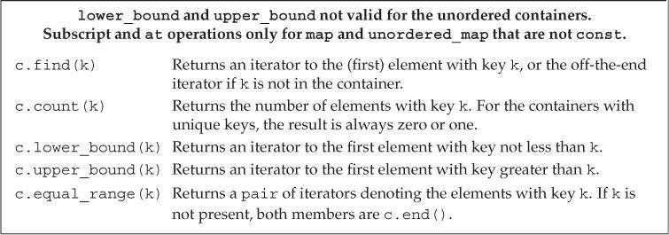

# Chapter 8. The IO Library

## 8.1. The IO Classes

The library defines a collection of IO types in addition to the `istream` and `ostream` types that we have already used.

 

To support languages that use wide characters, the library defines a set of types and objects that manipulate `wchar_t` data. The names of the widecharacter versions begin with a `w`.

#### Relationships among the IO Types

The types `ifstream` and `istringstream` inherit from `istream`. Thus, we can use objects of type `ifstream` or `istringstream` as if they were `istream` objects. We can use objects of these types in the same ways as we have used `cin`. For example, we can call `getline` on an `ifstream` or `istringstream` object, and we can use the `>>` to read data from an `ifstream` or `istringstream`. 

Similarly, the types `ofstream` and `ostringstream` inherit from `ostream`. Therefore, we can use objects of these types in the same ways that we have used `cout`.

### 8.1.1. No Copy or Assign for IO Objects

Because we can’t copy the IO types, we cannot have a parameter or return type that is one of the stream types. Functions that do IO typically pass and
return the stream through references. Reading or writing an IO object changes its state, so the reference must not be `const`.

### 8.1.2. Condition States

The IO classes define functions and flags, listed in the table below, that let us access and manipulate the condition state of a stream.

 

Once an error has occurred, subsequent IO operations on that stream will fail. We can read from or write to a stream only when it is in a non-error state.

#### Interrogating the State of a Stream

The IO library defines a machine-dependent integral type named `iostate` that it uses to convey information about the state of a stream. This type is used as a collection of bits. The IO classes define four `constexpr` values of type `iostate` that represent particular bit patterns：

* The `badbit` indicates a system-level failure, such as an unrecoverable read or write error. It is usually not possible to use a stream once `badbit` has been set.
* The `failbit` is set after a recoverable error, such as reading a character when numeric data was expected. It is often possible to correct such problems and continue using the stream.
* Reaching end-of-file sets both `eofbit` and `failbit`.
* The `goodbit`, which is guaranteed to have the value `0`, indicates no failures on the stream.

The library also defines a set of functions to interrogate the state of these flags：

* The `good` operation returns `true` if none of the error bits is set.
* The `bad`, `fail`, and `eof` operations return `true` when the corresponding bit is on.
* In addition, `fail` returns `true` if `bad` is set.

**<font color='red'>By implication, the right way to determine the overall state of a stream is to use either `good` or `fail`.</font>**

#### Managing the Condition State

The `rdstate` member returns an `iostate` value that corresponds to the current state of the stream. 

The `setstate` operation turns on the given condition bit(s) to indicate that a problem occurred.

The version of `clear` that takes no arguments turns off all the failure bits. After `clear()`, a call to `good` returns `true`. 

The version of `clear` that takes an argument expects an `iostate` value that represents the new state of the stream.

```c++
auto old_state = cin.rdstate();		// remember the current state of cin
cin.clear();						// make cin valid
process_input(cin);					// use cin
cin.setstate(old_state);			// now reset cin to its old state
```

To turn off a single condition, we use the `rdstate` member and the bitwise operators to produce the desired new state.

```c++
// turns off failbit and badbit but all other bits unchanged
cin.clear(cin.rdstate() & ~cin.failbit & )
```

###  ⭐8.1.3. Managing the Output Buffer

**<font color='red'>Each output stream manages a buffer,</font>** which it uses to hold the data that the program reads and writes.

There are several conditions that cause the buffer to be flushed—that is, to be written—to the actual output device or file:

* The program completes normally. All output buffers are flushed as part of the `return` from `main`.
* We can flush the buffer explicitly using a manipulator such as `endl`
* We can use the `unitbuf` manipulator to set the stream’s internal state to empty the buffer after each output operation. By default, `unitbuf` is set for `cerr`, so that writes to `cerr` are flushed immediately.
* An output stream might be tied to another stream. In this case, the buffer of the tied stream is flushed whenever the tied stream is read or written. By default, `cin` and `cerr` are both tied to `cout`. Hence, reading `cin` or writing to `cerr` flushes the buffer in `cout`.

#### Flushing the Output Buffer

In addition to `endl` manipulator, There are two other similar manipulators: `flush` and `ends`. `flush` flushes the stream but adds no characters to the output; `ends` inserts a null character into the buffer and then flushes it:

```c++
cout << "hi!" << endl; 		// writes hi and a newline, then flushes the buffer
cout << "hi!" << flush; 	// writes hi, then flushes the buffer; adds no data
cout << "hi!" << ends; 		// writes hi and a null, then flushes the buffer
```

#### The `unitbuf` Manipulator

If we want to flush after every output, we can use the `unitbuf` manipulator. This manipulator tells the stream to do a flush after every subsequent write. The `nounitbuf` manipulator restores the stream to use normal, system-managed buffer flushing:

```c++
cout << unitbuf; 	// all writes will be flushed immediately
// any output is flushed immediately, no buffering
cout << nounitbuf; 	// returns to normal buffering
```

#### Tying Input and Output Streams Together

When an input stream is tied to an output stream, any attempt to read the input stream will first flush the buffer associated with the output stream. 

**<font color='red'>The library ties `cin` to `cout`</font>**, so the statement `cin >> ival;` causes the buffer associated with `cout` to be flushed.

The function `tie` takes a pointer to an `ostream` and ties itself to that `ostream`. That is, `x.tie(&o)` ties the stream `x` to the output stream `o`.

We can tie either an `istream` or an `ostream` object to another `ostream`:

```c++
cin.tie(&cout);							// illustration only: the library ties cin and cout for us
// old_tie points to the stream (if any) currently tied to cin
ostream *old_tie = cin.tie(nullptr);	// cin is no longer tied
// ties cin and cerr; not a good idea because cin should be tied to cout
cin.tie(&cerr);							// reading cin flushes cerr, not cout
cin.tie(old_tie);						// reestablish normal tie between cin and cout
```

To tie a given stream to a new output stream, we pass `tie` a pointer to the new stream. To untie the stream completely, we pass a null pointer. Each stream can be tied to at most one stream at a time. However, multiple streams can tie themselves to the same `ostream`.

## 8.2. File Input and Output

The `fstream` header defines three types to support file IO. In addition to the behavior that they inherit from the `iostream` types, they add members to manage the file associated with the stream. These operations, listed in the table bellow, can be called on objects of `fstream`, `ifstream`, or `ofstream` but not on the other IO types.

 

#### 8.2.1. Using File Stream Objects

When we want to read or write a file, we define a file stream object and associate that object with the file. When we create a file stream, we can (optionally) provide a file name. When we supply a file name, `open` is called automatically:

```c++
ifstream in(ifile); 	// construct an ifstream and open the given file
ofstream out; 			// output file stream that is not associated with any file
```

#### Using an `fstream` in Place of an `iostream&`

Functions that are written to take a reference (or pointer) to one of the `iostream` types can be called on behalf of the corresponding `fstream` (or `sstream`) type.

For example, we can use the `read` and `print` functions from § 7.1.3 to read from and write to named files.

#### The `open` and `close` Members

When we define an empty file stream object, we can subsequently associate that object with a file by calling `open`. If a call to `open` fails, `failbit` is set. Because a call to `open` might fail, it is usually a good idea to verify that the `open` succeeded

```c++
ifstream in(ifile);
ofstream out();
out.open(ifile + ".copy");
if(out){
    // ...
}
```

Once a file stream has been opened, it remains associated with the specified file. To associate a file stream with a different file, we must first close the existing file. Once the file is closed, we can open a new one:

```c++
out.close();
out.open(ifile + "2");
```

**<font color='red'>When an `fstream` object is destroyed, `close` is called automatically.</font>**

### 8.2.2. File Modes

Each stream has an associated file mode that represents how the file may be used.

 

#### Opening a File in out Mode Discards Existing Data

By default, when we open an `ofstream`, the contents of the file are discarded. The only way to prevent an `ostream` from emptying the given file is to specify `app`:

```c++
// file1 is truncated in each of these cases
ofstream out("file1"); 						// out and trunc are implicit
ofstream out2("file1", ofstream::out); 		// trunc is implicit
ofstream out3("file1", ofstream::out | ofstream::trunc);

// to preserve the file's contents, we must explicitly specify app mode
ofstream app("file2", ofstream::app); 		// out is implicit
ofstream app2("file2", ofstream::out | ofstream::app);
```

## 8.3. string Streams

The `sstream` header defines three types to support in-memory IO; these types read from or write to a `string` as if the `string` were an IO stream.

In addition to the operations they inherit, the types defined in `sstream` add members to manage the `string` associated with the stream.:

 

### ⭐8.3.1. Using an `istringstream`

An `istringstream` is often used when we have some work to do on an entire line, and other work to do with individual words within a line.

As one example, assume we have a file that lists people and their associated phone numbers. Some people have only one number, but others have several—a home phone, work phone, cell number, and so on. Our input file might look like the following:

```te
morgan 2015552368 8625550123
drew 9735550130
lee 6095550132 2015550175 8005550000
```

We’ll start by defining a simple class to represent our input data:

```c++
struct PersonInfo {
	string name;
	vector<string> phones;
};
```

Our program will read the data file and build up a `vector` of `PersonInfo`.

```c++
string line, word; 				// will hold a line and word from input, respectively
vector<PersonInfo> people; 		// will hold all the records from the input
// read the input a line at a time until cin hits end-of-file (or another error)
while (getline(cin, line)) {
	PersonInfo info; 			// create an object to hold this record's data
	istringstream record(line); // bind record to the line we just read
	record >> info.name;	 	// read the name
	while (record >> word) 		// read the phone numbers
		info.phones.push_back(word); // and store them
	people.push_back(info); 	// append this record to people
}
```

We use `getline` to read an entire record from the standard input. If the call to `getline` succeeds, then `line` holds a record from the input file.

We bind an `istringstream` to the `line` that we just read. We can now use the `input` operator on that `istringstream` to read each element in the current record.

### 8.3.2. Using `ostringstream`s

An `ostringstream` is useful when we need to build up our output a little at a time but do not want to print the output until later.

For example, we might want to validate and reformat the phone numbers we read in the previous example. If all the numbers are valid, we want to print a new file containing the reformatted numbers. If a person has any invalid numbers, we won’t put them in the new file. Instead, we’ll write an error message containing the person’s name and a list of their invalid numbers.

```c++
for(const auto &entry : people){
    ostringstream formatted, badNums;
    for(const auto &nums : entry.phones){
        if(!valid(nums))
            badNums << " " << nums;
        else
            formatted << " " << format(nums);
    }
    if(badNums.str().empty())
        os << entry.name << " "
        	<< formatted.str() << endl;
    else
        cerr << "input error: " << entry.name
        		<< " invalid number(s) " << badNums.str() << endl;
}
```

The interesting part of the program is the use of the string streams `formatted` and `badNums`. We use the normal output operator (`<<`) to write to these objects. But, these “writes” are really `string` manipulations. They add characters to the `string`s inside `formatted` and `badNums`, respectively.

# Chapter 9. Sequential Containers

## 9.1. Overview of the Sequential Containers

The sequential containers, which are listed in the table, all provide fast sequential access to their elements.

 

A `deque` is a more complicated data structure. Like `string` and `vector`, **<font color='red'>`deque` supports fast random access.</font>** As with `string` and `vector`, adding or removing elements in the middle of a `deque` is a (potentially) expensive operation. However, adding or removing elements at either end of the `deque` is a fast operation, comparable to adding an element to a `list` or `forward_list`.

The `forward_list` and `array` types were added by the new standard. 

* An `array` is a safer, easier-to-use alternative to built-in arrays. Like built-in arrays, library `array`s have fixed size. As a result, `array` does not support operations to add and remove elements or to resize the container. 
* A `forward_list` is intended to be comparable to the best handwritten, singly linked list. Consequently, `forward_list` does not have the `size` operation because storing or computing its `size` would entail overhead compared to a handwritten list. 

#### Deciding Which Sequential Container to Use

There are a few rules of thumb that apply to selecting which container to use:

* **<font color='red'>Unless you have a reason to use another container, use a `vector`.</font>**
* If your program has lots of small elements and space overhead matters, don’t use `list` or `forward_list`.
* If the program requires random access to elements, use a vector or a `deque`.
* If the program needs to insert or delete elements in the middle of the container,
  use a list or forward_list.
* If the program needs to insert or delete elements at the front and the back, but
  not in the middle, use a deque.
* **<font color='red'>If the program needs to insert elements in the middle of the container only while reading input, and subsequently needs random access to the elements:</font>**
  * First, decide whether you actually need to add elements in the middle of a container. It is often easier to append to a `vector` and then call the library `sort` function to reorder the container when you’re done with input.
  * If you must insert into the middle, consider using a `list` for the input phase. Once the input is complete, copy the `list` into a `vector`.

## 9.2. Container Library Overview

Firstly, we will cover the operations provided by all container types:

 

 

#### Constraints on Types That a Container Can Hold

Almost any type can be used as the element type of a sequential container. But some container operations impose requirements of their own on the element type. We can define a container for a type that does not support an operation-specific requirement, but we can use an operation only if the element type meets that operation’s requirements.

As an example, the sequential container constructor that takes a size argument uses the element type’s default constructor. Some classes do not have a
default constructor. We can define a container that holds objects of such types, but we cannot construct such containers using only an element count:

```c++
// assume noDefault is a type without a default constructor
vector<noDefault> v1(10, init); 	// ok: element initializer supplied
vector<noDefault> v2(10); 			// error: must supply an element initializer
```

### 9.2.1. Iterators

With one exception, the container iterators support all the operations listed in 3.4.1. The exception is that the `forward_list` iterators do not support the
decrement (`--`) operator. The iterator arithmetic operations listed in Table 3.4.2 apply only to iterators for `string`, `vector`, `deque`, and `array`. We cannot use these operations on iterators for any of the other container types.

#### Iterator Ranges

An **<font color='blue'>iterator range</font>** is denoted by a pair of iterators each of which refers to an element, or to one past the last element, in the same container. These two iterators, often referred to as `begin` and `end`.

This element range is called a **<font color='blue'>left-inclusive interval</font>**. The standard mathematical notation for such a range is
$$
[ begin, end)
$$
The iterators `begin` and `end` must refer to the same container. The iterator `end` may be equal to `begin` but must not refer to an element before the one denoted by `begin`.

#### Programming Implications of Using Left-Inclusive Ranges 使用左闭合范围蕴含的编程假设

The library uses left-inclusive ranges because such ranges have three convenient properties:

* If `begin` equals `end`, the range is empty.

* If `begin` is not equal to `end`, there is at least one element in the range, and `begin` refers to the first element in that range.

* We can increment `begin` some number of times until `begin == end`

  ```c++
  while(begin != end){
      *begin = val;
      ++begin;
  }
  ```

### 9.2.2. Container Type Members

Each container defines several types:

 

If we need the element type, we refer to the container’s `value_type`. If we need a reference to that type, we use `reference` or `const_reference`.

To use one of these types, we must name the class of which they are a member:

```c++
list<string>::iterator iter;
vector<int>::difference_type count;
```

### 9.2.3. `begin` and `end` Members

 

The `begin` and `end` operations yield iterators that refer to the first and one past the last element in the container.

There are several versions of `begin` and `end`: The versions with an `r` return reverse iterators. Those that start with a `c` return the const version of the related iterator.

**<font color='red'>The functions that do not begin with a `c` are overloaded. That is, there are actually two members named `begin`. </font>**

* One is a `const` member that returns the container’s `const_iterator` type. 

* The other is non`const` and returns the container’s `iterator` type. 

Similarly for `rbegin`, `end`, and `rend`. When we call one of these members on a non`const` object, we get the version that returns `iterator`. We get a `const` version of the iterators only when we call these functions on a `const` object. 

As with pointers and references to `const`, we can convert a plain `iterator` to the corresponding `const_iterator`, but not vice versa.

```c++
// type is explicitly specified
list<string>::iterator it5 = a.begin();
list<string>::const_iterator it6 = a.begin();
// iterator or const_iterator depending on a's type of a
auto it7 = a.begin(); 		// const_iterator only if a is const
auto it8 = a.cbegin(); 		// it8 is const_iterator
```

### 9.2.4. Defining and Initializing a Container

#### ⭐Initializing a Container as a Copy of Another Container

There are two ways to create a new container as a copy of another one:

* We can directly copy the container (excepting array)

  The container and element types must match.

* We can copy a range of elements denoted by a pair of iterators

  There is no requirement that the container types be identical. Moreover, the element types in the new and original containers can differ as long as it is possible to convert the elements we’re copying to the element type of the container we are initializing

```c++
list<string> authors = {"Milton", "Shakespeare", "Austen"};
vector<const char*> articles = {"a", "an", "the"};
list<string> list2(authors); 					// ok: types match
deque<string> authList(authors);				// error: container types don't match
vector<string> words(articles);					// error: element types must match
forward_list<string> words(articles.begin(), articles.end());	// ok: converts const char* elements to string
```

#### List Initialization

Under the new standard, we can list initialize a container:

```c++
list<string> authors = {"Milton", "Shakespeare", "Austen"};
vector<const char*> articles = {"a", "an", "the"};
```

When we do so, we explicitly specify values for each element in the container. For types other than `array`, the initializer list also implicitly specifies the size of the container: The container will have as many elements as there are initializers.

#### Sequential Container Size-Related Constructors

In addition to the constructors that sequential containers have in common with associative containers, we can also initialize the sequential containers (other than `array`) from a size and an (optional) element initializer. If we do not supply an element initializer, the library creates a **<font color='red'>value-initialized</font>** one for us:

```c++
vector<int> ivec(10, -1); 		// ten int elements, each initialized to -1
list<string> svec(10, "hi!"); 	// ten strings; each element is "hi!"
forward_list<int> ivec(10);		// ten elements, each initialized to 0
deque<string> svec(10); 		// ten elements, each an empty string
```

#### Library `array`s Have Fixed Size

Just as the size of a built-in array is part of its type, the size of a library `array` is part of its type.**<font color='red'> When we define an `array`, in addition to specifying the element type, we also specify the container size:</font>**

```c++
array<int, 42> 		// type is: array that holds 42 ints
array<string, 10> 	// type is: array that holds 10 strings
    
array<int, 10>::size_type i; 	// array type includes element type and size
array<int>::size_type j; 		// error: array<int> is not a type
```

Unlike the other containers, a default-constructed `array` is not empty: It has as many elements as its size. These elements are default initialized just as are elements in a built-in array.

If we list initialize the `array`, the number of the initializers must be equal to or less than the size of the `array`. If there are fewer initializers than the size of the `array`, the initializers are used for the first elements and any remaining elements are value initialized.

```c++
array<int, 10> ia1; 							// ten default-initialized ints
array<int, 10> ia2 = {0,1,2,3,4,5,6,7,8,9}; 	// list initialization
array<int, 10> ia3 = {42};	 					// ia3[0] is 42, remaining elements are 0
```

**<font color='red'>It is worth noting that although we cannot copy or assign objects of built-in array types, there is no such restriction on `array`</font>**:

```c++
int digs[10] = {0,1,2,3,4,5,6,7,8,9};
int cpy[10] = digs; 				// error: no copy or assignment for built-in arrays
array<int, 10> digits = {0,1,2,3,4,5,6,7,8,9};
array<int, 10> copy = digits; 		// ok: so long as the element type and the size match
```

### 9.2.5. Assignment and `swap`

Container Assignment Operations:

 

If the containers had been of unequal size, **<font color='red'>after the assignment both containers would have the size of the right-hand operand</font>**.

Unlike built-in arrays, the library `array` type does allow assignment. The left- and right-hand operands must have the same type:

```c++
array<int, 10> a1 = {0, 1, 2, 3, 4, 5, 6, 7, 8, 9};
array<int, 10> a2 = {0};		// elements all have value 0
a1 = a2;						// replaces elements in a1
a2 = {0};						// error: cannot assign to an array from a braced list
```

Because the size of the right-hand operand might differ from the size of the left-hand operand, **<font color='red'>the `array` type does not support assign and it does not allow assignment from a braced list of values.</font>**

#### Using `assign` (Sequential Containers Only)

The assignment operator requires that the left-hand and right-hand operands have the same type. 

**<font color='red'>The sequential containers (except `array`) also define a member named `assign` that lets us assign from a different but compatible type, or assign from a
subsequence of a container. </font>** For example, we can use `assign` to assign a range of `char*` values from a `vector` into a list of `string`:

```c++
list<string> names;
vector<const char*> oldstyle;
names = oldstyle; 	// error: container types don't match
// ok: can convert from const char*to string
names.assign(oldstyle.cbegin(), oldstyle.cend());
```

The call to `assign` replaces the elements in `names` with copies of the elements in the range denoted by the iterators.

A second version of `assign` takes an integral value and an element value. It replaces the elements in the container with the specified number of elements, each of which has the specified element value:

```c++
list<string> slist1(1); 		// one element, which is the empty string
slist1.assign(10, "Hiya!"); 	// ten elements; each one is Hiya !
```

#### Using `swap`

The `swap` operation exchanges the contents of two containers of the same type. After the call to `swap`, the elements in the two containers are interchanged.

With the exception of `array`s, swapping two containers is guaranteed to be fast—the elements themselves are not swapped; internal data structures are swapped.

The fact that elements are not moved means that, **<font color='red'>with the exception of `string`, iterators, references, and pointers into the containers are not invalidated.</font>** They refer to the same elements as they did before the `swap`. However, after the `swap`, those elements are in a different container.

In the new library, the containers offer both a member and nonmember version of `swap`. Earlier versions of the library defined only the member version of `swap`. The nonmember `swap` is of most importance in generic programs. As a matter of habit, **<font color='red'>it is best to use the nonmember version of `swap`.</font>**

### 9.2.6. Container Size Operations

 

**<font color='red'>`forward_list` provides `max_size` and `empty`, but not `size`.</font>**

### 9.2.7. Relational Operators

 

The right- and left-hand operands must be the same kind of container and must hold elements of the same type.

#### Relational Operators Use Their Element’s Relational Operator

We can use a relational operator to compare two containers only if the appropriate comparison operator is defined for the element type.

The container equality operators use the element’s `==` operator, and the relational operators use the element’s `<` operator. If the element type doesn’t support the required operator, then we cannot use the corresponding operations on containers holding that type.

## 9.3. Sequential Container Operations

### 9.3.1. Adding Elements to a Sequential Container

 

#### Using `push_back`

Aside from `array` and `forward_list`, every sequential container (including the `string` type) supports `push_back`.

```c++
string word;
while (cin >> word)
	container.push_back(word);
```

The call to `push_back` creates a new element at the end of container, increasing the `size` of `container` by 1. **<font color='red'>The value of that element is a copy of `word`. </font>**The type of `container` can be any of `list`, `vector`, or `deque`.

**<font color='red'>Because `string` is just a container of characters, we can use `push_back` to add characters to the end of the `string`</font>**:

```c++
void pluralize(size_t cnt, string &word){
    if(cnt > 1)
        word.push_back('s');	// same as word += 's'
}
```

> **Key Concept: Container Elements Are Copies**
> When we use an object to initialize a container, or insert an object into a container, a copy of that object’s value is placed in the container, not the object itself. There is no relationship between the element in the container and the object from which that value originated.

#### Using `push_front`

In addition to `push_back`, the `list`, `forward_list`, and `deque` containers support an analogous operation named `push_front`. This operation inserts a new element at the front of the container.

Note that **<font color='red'>`deque`, which like `vector` offers fast random access to its elements, provides the `push_front` member even though `vector` does not.</font>** A `deque` guarantees constant-time insert and delete of elements at the beginning and end of the container. As with `vector`, inserting elements other than at the front or back of a `deque` is a potentially expensive operation.

#### Adding Elements at a Specified Point in the Container

The `insert` members let us insert zero or more elements at any point in the container. The `insert` members are supported for `vector`, `deque`, `list`, and `string`. `forward_list` provides specialized versions of these members that we’ll cover in §9.3.4

Each of the `insert` functions takes an iterator as its first argument. The iterator indicates where in the container to put the element(s). It can refer to any position in the container, including one past the end of the container. **<font color='red'>Element(s) are inserted before the position denoted by the iterator.</font>**

```c++
vector<string> svec;
list<string> slist;
// equivalent to calling slist.push_front("Hello!");
slist.insert(slist.begin(), "Hello!");
// no push_front on vector but we can insert before begin()
// warning: inserting anywhere but at the end of a vector might be slow
svec.insert(svec.begin(), "Hello!");
```

####  Inserting a Range of Elements

The arguments to `insert` that appear after the initial iterator argument are analogous to the container constructors that take the same parameters.

1. The version that takes an element count and a value adds the specified number of identical elements before the given position:

   ```c++
   svec.insert(svec.end(), 10, "Anna")
   ```

   This code inserts ten elements at the end of `svec` and initializes each of those elements to the `string "Anna"`.

2. The versions of insert that take a pair of iterators or an initializer list insert the elements from the given range before the given position

   ```c++
   vector<string> v = {"quasi", "simba", "frollo", "scar"};
   // insert the last two elements of v at the beginning of slist
   slist.insert(slist.begin(), v.end() - 2, v.end());
   slist.insert(slist.end(), {"these", "words", "will", "go", "at", "the", "end"});
   ```

   When we pass a pair of iterators,**<font color='red'> those iterators may not refer to the same container as the one to which we are adding elements.</font>**

   ```c++
   // run-time error: iterators denoting the range to copy from
   // must not refer to the same container as the one we are changing
   slist.insert(slist.begin(), slist.begin(), slist.end());
   ```

#### ⭐Using the Return from insert

The versions of `insert` that take a count or a range return an iterator to the first element that was inserted. If the range is empty, no elements are
inserted, and the operation returns its first parameter.

We can use the value returned by `insert` to repeatedly insert elements at a specified position in the container:

```c++
list<string> lst;
auto iter = lst.begin();
while(cin >> word)
    iter = lst.insert(iter, word);	// same as calling push_front
```

#### Using the Emplace Operations

The new standard introduced three new members—`emplace_front`, `emplace`, and `emplace_back`—that **<font color='red'>construct rather than copy elements</font>**. 

When we call a `push` or `insert` member, we pass objects of the element type and those objects are copied into the container. When we call an `emplace` member, we pass arguments to a constructor for the element type. **<font color='red'>The `emplace` members use those arguments to construct an element directly in space managed by the container.</font>**

```c++
// uses the three-argument Sales_data constructor
c.emplace_back("978-0590353403", 25, 15.99);
// error: there is no version of push_back that takes three arguments
c.push_back("978-0590353403", 25, 15.99);
// ok: we create a temporary Sales_data object to pass to push_back
c.push_back(Sales_data("978-0590353403", 25, 15.99));
```

In the call to `emplace_back`, that object is created directly in space managed by the container. The call to `push_back` creates a local temporary object that is pushed onto the container.

The arguments to an `emplace` function vary depending on the element type. The arguments must match a constructor for the element type:

```c++
// iter refers to an element in c, which holds Sales_data elements
c.emplace_back(); 					// uses the Sales_data default constructor
c.emplace(iter, "999-999999999"); 	// uses Sales_data(string)
// uses the Sales_data constructor that takes an ISBN, a count, and a price
c.emplace_front("978-0590353403", 25, 15.99);
```

### 9.3.2. Accessing Elements

 

Each sequential container, including `array`, has a `front` member, and all except `forward_list` also have a back member. These operations return a reference to the first and last element, respectively.

#### The Access Members Return References

The members that access elements in a container (i.e., `front`, `back`, `subscript`, and `at`) return references. If the container is a `const` object, the return is a reference to `const`. If the container is not `const`, the return is an ordinary reference that we can use to change the value of the fetched element:

```c++
if(!c.empty()){
    c.front() = 42;			// assigns 42 to the first element in c
    auto &v = c.back();		// get a reference to the last element
    v = 1024;				// changes the element in c
    auto v2 = c.back();		// v2 is not a reference; it's a copy of c.back()
    v2 = 0;					// no change to the element in c
}
```

#### Subscripting and Safe Random Access

The containers that provide fast random access (`string`, `vector`, `deque`, and `array`) also provide the subscript operator. The subscript operator does not check whether the index is in range. Using an out-of-range value for an index is a serious programming error, but one that the compiler will not detect.

If we want to ensure that our index is valid, we can use the `at` member instead. **<font color='red'>The `at` member acts like the subscript operator, but if the index is invalid, `at` throws an `out_of_range` exception.</font>**

```c++
vector<string> svec; 	// empty vector
cout << svec[0]; 		// run-time error: there are no elements in svec!
cout << svec.at(0); 	// throws an out_of_range exception
```

### 9.3.3. Erasing Elements

 

#### The `pop_front` and `pop_back` Members

The `pop_front` and `pop_back` functions remove the first and last elements, respectively. Just as there is no `push_front` for `vector` and `string`, there is also no `pop_front` for those types. Similarly, `forward_list` does not have pop_back.

These operations return `void`. If you need the value you are about to pop, you must store that value before doing the pop:

```c++
while (!ilist.empty()) {
	process(ilist.front()); 	// do something with the current top of ilist
	ilist.pop_front(); 			// done; remove the first element
}
```

#### ⭐Removing an Element from within the Container

The `erase` members remove element(s) at a specified point in the container. We can delete a single element denoted by an iterator or a range of elements marked by a pair of iterators. **<font color='red'>Both forms of `erase` return an iterator referring to the location after the (last) element that was removed.</font>**

```c++
// erases the odd elements in a list
list<int> lst = {0,1,2,3,4,5,6,7,8,9};
auto it = lst.begin();
while(it != lst.end()){
    if(*it % 2){				// if the element is odd
        it = list.erase(it);	// erase this element
    }
    else{
        ++it;
    }
}
```

#### Removing Multiple Elements

The iterator-pair version of `erase` lets us delete a range of elements:

```c++
elem1 = slist.erase(elem1, elem2);	// after the call elem1 = elem2
```

The iterator `elem1` refers to the first element we want to erase, and `elem2` refers to **<font color='red'>one past the last</font>** element we want to remove. 

To delete all the elements in a container, we can either call `clear` or pass the iterators from `begin` and `end` to `erase`:

```c++
slist.clear();								// delete all the elements within the container
slist.erase(slist.begin(), slist.end());	// equivalent
```

### 9.3.4. Specialized `forward_list` Operations

Consider what must happen when we remove an element from a singly linked list:

 

Removing `elem3` changes `elem2`; `elem2` had pointed to `elem3`, but after we remove `elem3`, `elem2` points to `elem4`.

When we add or remove an element, the element before the one we added or removed has a different successor. To add or remove an element, we need access to its predecessor in order to update that element’s links. However, `forward_list` is a singly linked list. In a singly linked list there is no easy way to get to an element’s predecessor. For this reason, **<font color='red'>the operations to add or remove elements in a `forward_list` operate by changing the element after the given element.</font>**

For example, in our illustration, to remove `elem3`, we’d call `erase_after` on an iterator that denoted `elem2`. To support these operations, **<font color='red'>`forward_list` also defines `before_begin`, which returns an off-the-beginning iterator.</font>** This iterator lets us add or remove elements “after” the nonexistent element before the first one in the list.

 

**<font color='red'>When we add or remove elements in a `forward_list`, we have to keep track of two iterators—one to the element we’re checking and one to that element’s predecessor.</font>** As an example, we’ll rewrite the loop that removed the odd-valued elements from a `list` to use a `forward_list`:

```c++
// erases the odd elements in a forward_list
forward_list<int> flst = {0,1,2,3,4,5,6,7,8,9};
auto prev = flst.before_begin();
auto curr = flst.begin();
while(curr != flst.end()){
    if(*curr % 2){		// if the element is odd
        curr = flst.erase_after(prev);
    }
    else{
        prev = curr;
        ++curr;
    }
}
```

When we find an odd element, we pass `prev` to `erase_after`. This call erases the element after the one denoted by `prev`; that is, it erases the element denoted by `curr`. We reset `curr` to the return from `erase_after`, which makes `curr` denote the next element in the sequence and we leave `prev` unchanged; `prev` still denotes the element before the (new) value of `curr`. 

If the element denoted by `curr` is not odd, then we have to move both iterators, which we do in the `else`.

### 9.3.5. Resizing a Container

 

If the current size is greater than the requested size, elements are deleted from the back of the container; if the current size is less than the new size, elements are added to the back of the container:

```c++
list<int> ilist(10, 42); 		// ten ints: each has value 42
ilist.resize(15); 				// adds five elements of value 0 to the back of ilist
ilist.resize(25, -1); 			// adds ten elements of value -1 to the back of ilist
ilist.resize(5); 				// erases 20 elements from the back of ilist
```

The `resize` operation takes an optional element-value argument that it uses to initialize any elements that are added to the container. If this argument is absent, added elements are **<font color='red'>value initialized</font>**.

### 9.3.6. Container Operations May Invalidate Iterators

Operations that add or remove elements from a container can invalidate pointers, references, or iterators to container elements. It is a serious run-time error to use an iterator, pointer, or reference that has been invalidated.

When you use an iterator (or a reference or pointer to a container element), it is a good idea to minimize the part of the program during which an iterator must stay valid. Because code that adds or removes elements to a container can invalidate iterators, **<font color='red'>you need to ensure that the iterator is repositioned</font>**, as appropriate, **<font color='red'>after each operation that changes the container</font>**. This advice is especially important for `vector`, `string`, and `deque`.

#### Writing Loops That Change a Container

Loops that add or remove elements of a `vector`, `string`, or `deque` must cater to the fact that iterators, references, or pointers might be invalidated. The program must ensure that the iterator, reference, or pointer**<font color='red'> is refreshed on each trip</font>** through the loop. Refreshing an iterator is easy if the loop calls `insert` or `erase`. Those operations return iterators, which we can use to reset the iterator:

```c++
// remove even-valued elements and insert a duplicate of odd-valued elements
vector<int> vi = {0,1,2,3,4,5,6,7,8,9};
auto iter = vi.begin();
while(iter != vi.end()){
    if(*iter % 2){
        iter = vi.insert(iter, *iter);	// duplicate the current element
        iter += 2;
    }
    else{
        iter = vi.erase(iter);			// remove even elements
    }
}
```

We refresh the iterator after both the `insert` and the `erase` because either operation can invalidate the iterator.

* After the call to `erase`, there is no need to increment the iterator, because the iterator returned from `erase` denotes the next element in the sequence.
* After the call to `insert`, we increment the iterator twice. Remember, `insert` inserts before the position it is given and returns an iterator to the inserted element. Thus, after calling `insert`, `iter` denotes the (newly added) element in front of the one we are processing. We add two to skip over the element we added and the one we just processed. Doing so positions the iterator on the next, unprocessed element.

#### Avoid Storing the Iterator Returned from end

When we add or remove elements in a `vector` or `string`, or add elements or remove any but the first element in a `deque`, the iterator returned by `end` is always invalidated. Thus, **<font color='red'>loops that add or remove elements should always call `end` rather than use a stored copy.</font>**

```c++
// disaster: the behavior of this loop is undefined
auto begin = v.begin(),
end = v.end(); 			// bad idea, saving the value of the end iterator
while (begin != end) {
	// do some processing
	++begin;
	begin = v.insert(begin, 42);
	++begin;
}
```

The behavior of this code is undefined. On many implementations, we’ll get an infinite loop. The problem is that we stored the value returned by the `end` operation in a local variable named `end`. In the body of the loop, we added an element. Adding an element invalidates the iterator stored in `end`. That iterator neither refers to an element in `v` nor any longer refers to one past the last element in `v`.

## 9.4. How a `vector` Grows

To support fast random access, `vector` elements are stored contiguously—each element is adjacent to the previous element. 

When they have to get new memory, `vector` and `string` implementations typically allocate capacity beyond what is immediately needed. The container holds this storage in reserve and uses it to allocate new elements as they are added. Thus, there is no need to reallocate the container for each new element.

#### Members to Manage Capacity

 

The `vector` and `string` types provide members that let us interact with the memory-allocation part of the implementation. 

* The `capacity` operation tells us how many elements the container can hold before it must allocate more space. 

* The `reserve` operation lets us tell the container how many elements it should be prepared to hold. 

  A call to `reserve` changes the capacity of the `vector` only if the requested space exceeds the current capacity. If the requested size is greater than the current capacity, `reserve` allocates at least as much as (and may allocate more than) the requested amount.**<font color='red'> If the requested size is less than or equal to the existing capacity, `reserve` does nothing.</font>**

  **<font color='red'>As a result, a call to `reserve` will never reduce the amount of space that the container uses.</font>**

* Under the new library, we can call `shrink_to_fit` to ask a `deque`, `vector`, or `string` to return unneeded memory. This function indicates that we no longer need any excess capacity.

#### `capacity` and `size`

The `size` of a container is the number of elements it already holds; its `capacity` is how many elements it can hold before more space must be allocated.

 

A `vector` may be reallocated **<font color='red'>only </font>**when the user performs an insert operation when the `size` equals `capacity` or by a call to `resize` or `reserve` with a value that exceeds the current `capacity`.

## 9.5. Additional `string` Operations

The `string` type provides a number of additional operations beyond those common to the sequential containers. For the most part, these additional operations **<font color='red'>either support the close interaction between the `string` class and C-style character arrays, or they add versions that let us use indices in place of iterators.</font>**

### 9.5.1. Other Ways to Construct `string`s

 

```c++
const char *cp = "Hello World!!!";	// null-terminated array
char noNull[] = {'H', 'i'};			// not null terminated
string s1(cp);						// copy up to the null in cp; s1 = "Hello World!!!"
string s2(noNull, 2);				// copy two characters from no_null; s2 == "Hi"
string s3(noNull); 					// undefined: noNull not null terminated
string s4(cp + 6, 5);				// copy 5 characters starting at cp[6]; s4 == "World"
string s5(s1, 6, 5);				// copy 5 characters starting at s1[6]; s5 == "World"
string s6(s1, 6);					// copy from s1 [6] to end of s1; s6 == "World!!!"
string s7(s1,6,20);					// ok, copies only to end of s1; s7 == "World!!!"
string s8(s1, 16);					// throws an out_of_range exception
```

#### The `substr` Operation

The `substr` operation returns a `string` that is a copy of part or all of the original `string`. We can pass `substr` an optional starting position and count:

 

```c++
string s("hello world");
string s2 = s.substr(0, 5); 		// s2 = hello
string s3 = s.substr(6); 			// s3 = world
string s4 = s.substr(6, 11); 		// s3 = world
string s5 = s.substr(12); 			// throws an out_of_range exception
```

### 9.5.2. Other Ways to Change a `string`

 

#### The `insert` and `erase` Functions

In addition to the versions of `insert` and `erase` that take iterators, string provides versions that take an **<font color='red'>index</font>**. The index indicates the starting element to erase or the position before which to insert the given values:

```c++
s.insert(s.size(), 5, '!'); 	// insert five exclamation points at the end of s
s.erase(s.size() - 5, 5); 		// erase the last five characters from s
```

The `string` library also provides versions of insert and assign that take C-style character arrays.

```c++
const char *cp = "Stately, plump Buck";
s.assign(cp, 7);			// s == "Stately"
s.insert(s.size(), cp + 7);	// s == "Stately, plump Buck"
```

We can also specify the characters to `insert` or `assign` as coming from another `string` or substring thereof:

```c++
string s = "some string", s2 = "some other string";
s.insert(0, s2);				// insert a copy of s2 before position 0 in s
s.insert(0, s2, 0, s2.size());	// insert s2.size() characters from s2 starting at s2[0] before s[0]
```

#### The `append` and `replace` Functions

The `append` operation is a shorthand way of inserting at the end:

```c++
string s("C++ Primer"), s2 = s; 	// initialize s and s2 to "C++ Primer"
s.insert(s.size(), " 4th Ed."); 	// s == "C++ Primer 4th Ed."
s2.append(" 4th Ed."); 				// equivalent: appends " 4th Ed." to s2; s == s2
```

The `replace` operations are a shorthand way of calling `erase` and `insert`

```c++
// equivalent way to replace "4th" by "5th"
s.erase(11, 3);				// s == "C++ Primer  Ed."
s.insert(11, "5th");		// s == "C++ Primer 5th Ed."
s2.replace(11, 3, "5th");	// equivalent: s == s2

// In this call we remove three characters but insert five in their place.
s.replace(11, 3, "Fifth"); // s == "C++ Primer Fifth Ed."
```

#### The Many Overloaded Ways to Change a `string`

1. The `assign` and `append` functions have no need to specify what part of the `string` is changed: `assign` always replaces the entire contents of the `string` and `append` always adds to the end of the `string`.
2. The `replace` functions provide two ways to specify the range of characters to remove:
   * By a position and a length
   * By an iterator range
3. The `insert` functions give us two ways to specify the insertion point:
   * By an index
   * By an iterator

​		In each case, the new element(s) are inserted in front of the given index or iterator

4. There are several ways to specify the characters to add to the `string`. The new characters can be taken from another `string`, from a character pointer, from a brace-enclosed list of characters, or as a character and a count. When the characters come from a `string` or a character pointer, we can pass additional arguments to control whether we copy some or all of the characters from the argument.

### 9.5.3. `string` Search Operations

 

Each of these search operations returns a `string::size_type` value that is the index of where the match occurred. If there is no match, the function returns a `static` member named `string::npos`. The library defines `npos` as a `const string::size_type` initialized with the value `-1`. Because `npos` is an unsigned type, this initializer means `npos` is equal to the largest possible size any string could have.

> The `string` search functions return `string::size_type`, which is an unsigned type. As a result, it is a bad idea to use an `int`, or other signed type, to hold the return from these functions

```c++
string numbers("0123456789"), name("r2d2"), dept("03714p3");
// locate the first digit within name
// returns 1, i.e., the index of the first digit in name
auto pos = name.find_first_of(numbers);
// locate the first nonnumeric character
// returns 5, which is the index to the character 'p'
auto pos = dept.find_first_not_of(numbers);
```

#### ⭐Specifying Where to Start the Search

We can pass an optional starting position to the find operations. One common programming pattern uses this optional argument to loop through a `string` finding all occurrences:

```c++
string::size_type pos = 0;
while( (pos = name.find_first_of(numbers, pos)) != string::npos ){
    cout << "found number at index: " << pos
        	<< " element is " << name[pos] << endl;
    ++pos;
}
```

#### Searching Backward

The `find` operations we’ve used so far execute left to right. The library provides analogous operations that search from right to left.

* The `rfind` member searches for the last—that is, right-most—occurrence of the indicated substring
* `find_last_of` searches for the last character that matches any element of the search `string`
* `find_last_not_of` searches for the last character that does not match any element of the search `string`.

### 9.5.4. The `compare` Functions

In addition to the relational operators, the `string` library provides a set of `compare` functions that are similar to the C library `strcmp` function

Like `strcmp`, `s.compare` returns zero or a positive or negative value depending on whether `s` is equal to, greater than, or less than the `string` formed from the given arguments.

The arguments vary based on whether we are comparing two `string`s or a `string` and a character array.

 

### ⭐9.5.5. Numeric Conversions

The new standard introduced several functions that convert between numeric data and library `string`s:

 

```c++
int i = 42;
string s = to_string(i);
double d = stod(s);
```

**<font color='red'>The first non-whitespace character in the `string` we convert to numeric value must be a character that can appear in a number</font>**

```c++
string s2 = "pi = 3.14";
// convert the first substring in s that starts with a digit, d = 3.14
d = stod(s2.substr(s2.find_first_of("+-.0123456789")));
```

The first non-whitespace character in the `string` must be a sign (`+` or `-`) or a digit. The string can begin with `0x` or `0X` to indicate hexadecimal. For the functions that convert to floating-point the string may also start with a decimal point (`.`) and may contain an `e` or `E` to designate the exponent.

## 9.6. Container Adaptors

In addition to the sequential containers, the library defines three sequential container adaptors: `stack`, `queue`, and `priority_queue`.

An adaptor is a general concept in the library. There are container, iterator, and function adaptors. Essentially, **<font color='red'>an adaptor is a mechanism for making one thing act like another.</font>** A container adaptor takes an existing container type and makes it act like a different type. 

Table below lists the operations and types that are common to all the container adaptors.

 

#### Defining an Adaptor

Each adaptor defines two constructors: the default constructor that creates an empty object, and a constructor that takes a container and initializes the adaptor by copying the given container.

```c++
// deq is a deque<int>,
stack<int> stk(deq);	// copies elements from deq into stk
```

By default both `stack` and `queue` are implemented in terms of `deque`, and a `priority_queue` is implemented on a `vector`. We can override the default container type by naming a sequential container as a second type argument when we create the adaptor:

```c++
// empty stack implemented on top of vector
stack<string, vector<string>> str_stk;
// str_stk2 is implemented on top of vector and initially holds a copy of svec
stack<string, vector<string>> str_stk2(svec);
```

There are constraints on which containers can be used for a given adaptor. All of the adaptors require the ability to add and remove elements. As a result, they cannot be built on an `array`. Similarly, we cannot use `forward_list`, because all of the adaptors require operations that add, remove, or access the last element in the container.

* A `stack` requires only `push_back`, `pop_back`, and `back` operations, so we can use any of the remaining container types for a `stack`. 
* The queue adaptor requires `back`, `push_back`, `front`, and `push_front`, so it can be built on a `list` or `deque` but not on a `vector`. 
* A `priority_queue` requires random access in addition to the `front`, `push_back`, and `pop_back` operations; it can be built on a `vector` or a `deque` but not on a `list`.

#### Stack Adaptor

The operations provided by a `stack` are listed in the table below:

 

#### The Queue Adaptors

The `queue` and `priority_queue` adaptors are defined in the `queue` header. Table below lists the operations supported by these types.

 

The library `queue` uses a first-in, first-out (FIFO) storage and retrieval policy. Objects entering the queue are placed in the back and objects leaving the queue are removed from the front.

A `priority_queue` lets us establish a priority among the elements held in the queue. Newly added elements are placed ahead of all the elements with a lower priority. By default, the library uses the `<` operator on the element type to determine relative priorities.

# Chapter 10. Generic Algorithms 泛型算法

Rather than define each of useful operations as members of each container type, the standard library defines a set of **<font color='blue'>generic algorithms</font>**:

* “algorithms” because they implement common classical algorithms such as sorting and searching
* “generic” because they operate on elements of differing type and across multiple container types—not only library types such as `vector` or `list`, but also the built-in array type—and, as we shall see, over other kinds of sequences as well.

## 10.1. Overview

In general, the algorithms do not work directly on a container. Instead, they operate by traversing a range of elements bounded by two iterators. As the algorithm traverses the range, it does something with each element.

```c++
int val = 42;
auto result = find(vec.begin(), vec.end(), val);
cout << "The value " << val
    	<< (result == vec.end() ? " is not present" : " is present") << endl;
```

The first two arguments to `find` are iterators denoting a range of elements, and the third argument is a value. It returns an iterator to the first element that is equal to that value. If there is no match, `find` returns its second iterator to indicate failure.

Because `find` operates in terms of iterators, we can use the same `find` function to look for values in any type of container

```c++
stirng val = "a value";
auto result = find(lst.cbegin(), lst.cend(), val);
```

Similarly, because pointers act like iterators on built-in arrays, **<font color='red'>we can use `find` to look in an array:</font>**

```c++
int ia[] = {27, 210, 12, 47, 109, 83};
int val = 83;
int *result = find(begin(ia), end(ia), val);
// search the elements starting from ia[1] up to but not including ia[4]
auto result = find(ia + 1, ia + 4, val);
```

### How the Algorithms Work

Conceptually, we can list the steps `find` must take:

1. It accesses the first element in the sequence.
2. It compares that element to the value we want.
3. If this element matches the one we want, `find` returns a value that identifies this element.
4. Otherwise, `find` advances to the next element and repeats steps 2 and 3.
5. `find` must stop when it has reached the end of the sequence.
6. If `find` gets to the end of the sequence, it needs to return a value indicating that the element was not found. This value and the one returned from step 3 must have compatible types.

None of these operations depends on the type of the container that holds the elements. All but the second step in the `find` function can be handled by iterator operations. 

Although iterators make the algorithms **<font color='red'>container independent</font>**, most of the algorithms use one (or more) operation(s) on the element type. That is, **<font color='red'>algorithms do depend on element-type Operations</font>**. For example, step 2, uses the element type’s `==` operator to compare each element to the given value.

> **Key Concept: Algorithms Never Execute Container Operations**
> The generic algorithms do not themselves execute container operations. They operate solely in terms of iterators and iterator operations. The fact that the algorithms operate in terms of iterators and not container operations has a perhaps surprising but essential implication: **<font color='red'>Algorithms never change the size of the underlying container.</font>** 
> As we’ll see in § 10.4.1, there is a special class of iterator, the inserters, that do more than traverse the sequence to which they are bound. When we assign to these iterators, they execute insert operations on the underlying container. When an algorithm operates on one of these iterators, the iterator may have the effect of adding elements to the container. The algorithm itself, however, never does so.

## 10.2. A First Look at the Algorithms

### 10.2.1. Read-Only Algorithms

#### Algorithms and Element Types

The `accumulate` function takes three arguments.  The first two specify a range of elements to sum. The third is an initial value for the sum:

```c++
// sum the elements in vec starting the summation with the value 0
int sum = accumulate(vec.begin(), vec.end(), 0);
```

The fact that `accumulate` uses its third argument as the starting point for the summation has an important implication: **<font color='red'>It must be possible to add the element type to the type of the sum.</font>**

For example, because `string` has a `+` operator, we can concatenate the elements of a `vector` of `string`s by calling `accumulate`:

```c++
string sum = accumulate(v,cbegin(), v.cend(), string(""));
```

This call concatenates each element in `v` onto a `string` that starts out as the empty string.

Note that we explicitly create a string as the third parameter. **<font color='red'>Passing the empty string as a string literal would be a compile-time error</font>**:

```c++
// error: no + on const char*
string sum = accumulate(v.cbegin(), v.cend(), "");
```

Had we passed a string literal, the type of the object used to hold the sum would be `const char*`. That type determines which `+` operator is used. Because there is no `+` operator for type `const char*`, this call will not compile.

#### Algorithms That Operate on Two Sequences

Another read-only algorithm is `equal`, which lets us determine whether two sequences hold the same values. The algorithm takes three iterators: The first two (as usual) denote the range of elements in the first sequence; the third denotes the first element in the second sequence:

```c++
// roster2 should have at least as many elements as roster1
equal(roster1.cbegin(), roster1.cend(), roster2.cbegin());
```

Because `equal` operates in terms of iterators, we can call `equal` to compare elements in containers of different types. Moreover, the element types also need not be the same so long as we can use `==` to compare the element types. For example, `roster1` could be a `vector<string>` and `roster2` a `list<const char*>`.

### 10.2.2. Algorithms That Write Container Elements

Remember, **<font color='red'>algorithms do not perform container operations, so they have no way themselves to change the size of a container.</font>** So when we use an algorithm that assigns to elements, we must take care to ensure that the sequence into which the algorithm writes is at least as large as the number of elements we ask the algorithm to write.

As one example, the `fill` algorithm takes a pair of iterators that denote a range and a third argument that is a value. `fill` assigns the given value to each element in the input sequence:

```c++
fill(vec.begin(), vec.end(), 0);	// reset each element to 0
```

#### Algorithms Do Not Check Write Operations

Some algorithms take an iterator that denotes a separate destination. For example, the `fill_n` function takes a single iterator, a count, and a value. It assigns the given value to the specified number of elements starting at the element denoted to by the iterator. We might use fill_n to
assign a new value to the elements in a vector:

```c++
fill_n(dest, n, val);
```

`fill_n` assumes that `dest` refers to an element and that there are at least `n` elements in the sequence starting from `dest`. It's an error  to call `fill_n` (or similar algorithms that write to elements) on a container that has no elements:

```c++
vector<int> vec; // empty vector
// disaster: attempts to write to ten (nonexistent) elements in vec
fill_n(vec.begin(), 10, 0);
```

#### Introducing `back_inserter`

An **<font color='blue'>insert iterator</font>** is an iterator that adds elements to a container. When we assign through an insert iterator, a new element equal to the right-hand value is added to the container.

`back_inserter` is a function defined in the `iterator` header. `back_inserter` takes a reference to a container and returns an insert iterator bound to that container. When we assign through that iterator, the assignment calls `push_back` to add an element with the given value to the container

```c++
vector<int> vec;
auto it = back_inserter(vec);	// assigning through it adds elements to vec
*it = 42;						// vec now has one element with value 42
```

We frequently use `back_inserter` to create an iterator to use as the destination of an algorithm. For example:

```c++
vector<int> vec; 					// empty vector
// ok: back_inserter creates an insert iterator that adds elements to vec
fill_n(back_inserter(vec), 10, 0); 	// appends ten elements to vec
```

#### Copy Algorithms

This algorithm takes three iterators. The first two denote an input range; the third denotes the beginning of the destination sequence.

```c++
int a1[] = {0,1,2,3,4,5,6,7,8,9};
int a2[sizeof(a1) / sizeof(*a1)];
auto ret = copy(begin(a1), end(a1), a2);
```

The value returned by `copy` is the (incremented) value of its destination iterator. That is, `ret` will point just past the last element copied into a2.

#### Replace Algorithms

This algorithm reads a sequence and replaces every instance of a given value with another value. This algorithm takes four parameters: two iterators denoting the input range, and two values. It replaces each element that is equal to the first value with the second:

```c++
// replace any element with the value 0 with 42
replace(ilist.begin(), ilist.end(), 0, 42);
```

If we want to leave the original sequence unchanged, we can call `replace_copy`. That algorithm takes a third iterator argument denoting a destination in which to write the adjusted sequence:

```c++
// use back_inserter to grow destination as needed
replace(ilist.begin(), ilist.end(), back_inserter(ivec) 0, 42);
```

After this call, `ilst` is unchanged, and `ivec` contains a copy of `ilst` with the exception that every element in `ilst` with the value `0` has the value `42` in `ivec`.

### 10.2.3. Algorithms That Reorder Container Elements

A call to `sort` arranges the elements in the input range into sorted order using the element type’s `<` operator.

As an example, suppose we want to reduce a `vector<string>` so that each word appears only once:

```c++
the quick red fox jumps over the slow red turtle
```

Given this input, our program should produce the following vector:

 

#### Eliminating Duplicates

```c++
void elimDups(vector<string> &words){
    sort(words.begin(), words.end());
    auto end_unique = unique(words.begin(), words.end());
    words.erase(end_unique, words.end());
}
```

1. The `sort` algorithm takes two iterators denoting the range of elements to sort. In this call, we sort the entire `vector`. After the call to `sort`, `words` is ordered as

    

2. Once `words` is sorted, we want to keep only one copy of each word. The `unique` algorithm rearranges the input range to “eliminate” adjacent duplicated entries, and returns an iterator that denotes the end of the range of the unique values. After the call to `unique`, the `vector` holds

    

   The size of `words` is unchanged; it still has ten elements. The order of those elements is changed—the adjacent duplicates have been “removed.” We put remove in quotes because `unique` doesn’t remove any elements. Instead, it overwrites adjacent duplicates so that **<font color='red'>the unique elements appear at the front of the sequence.</font>**

3. To actually remove the unused elements, we must use a container operation, which we do in the call to `erase`

## 10.3. Customizing Operations

Many of the algorithms compare elements in the input sequence. By default, such algorithms use either the element type’s `<` or `==` operator. The library also defines versions of these algorithms that let us supply our own operation to use in place of the default operator.

### 10.3.1. Passing a Function to an Algorithm

#### Predicates

A **<font color='blue'>predicate </font>**is an expression that can be called and that returns a value that can be used as a condition. 

**<font color='red'>The predicates used by library algorithms are either unary predicates (meaning they have a single parameter) or binary predicates (meaning they have two parameters). </font>**

As one example, assume that we want to print the `vector` after we call `elimDups`. However, we’ll also assume that we want to see the words ordered by
their size, and then alphabetically within each size. We can use the version of `sort` that takes a binary predicate. It uses the given predicate in place of `<` to compare elements:

```c++
bool isShorter(const string &s1, const string &s2){
    return s1.size() < s2.size()l;
}
sort(words.begin(), words.end(), isShorter);
```

#### Sorting Algorithms

When we sort `words` by size, we also want to maintain alphabetic order among the elements that have the same length. To keep the words of the same length in alphabetical order we can use the `stable_sort` algorithm. **<font color='red'>A stable sort maintains the original order among equal elements.</font>**

Ordinarily, we don’t care about the relative order of equal elements in a sorted sequence. After all, they’re equal. **<font color='red'>However, in this case, we have defined “equal” to mean “have the same length.” Elements that have the same length still differ from one another when we view their contents.</font>** By calling `stable_sort`, we can maintain alphabetical order among those elements that have the same length

```c++
elimDups(words); 	// put words in alphabetical order and remove duplicates
// resort by length, maintaining alphabetical order among words of the same length
stable_sort(words.begin(), words.end(), isShorter);
```

### ⭐10.3.2. Lambda Expressions

The predicates we pass to an algorithm must have exactly one or two parameters, depending on whether the algorithm takes a unary or binary predicate, respectively. However, sometimes we want to do processing that requires more arguments than the algorithm’s predicate allows.

Suppose we want to find the first element in the `vector` that has the given size. We can use the library `find_if` algorithm to find an element that has a particular size. The third argument to `find_if` is a predicate. **<font color='red'>The `find_if` algorithm calls the given predicate on each element in the input range.</font>** It returns the first element for which the predicate returns a nonzero value, or its end iterator if no such element is found.

It would be easy to write a function that takes a `string` and a size and returns a bool indicating whether the size of a given `string` is greater than the given size. However `find_if` takes a unary predicate—any function we pass to find_if must have exactly one parameter that can be called with an element from the input sequence. There is no way to pass a second argument representing the size.

#### Introducing Lambdas

We can pass any kind of callable object to an algorithm. An object or expression is callable if we can apply the call operator  to it.

There are four callable objects:

* functions
* function pointers
* classes that overloader the function-call operator
* lambda expressions

A lambda expression represents a callable unit of code. **<font color='red'>It can be thought of as an unnamed, inline function:</font>**

```c++
[capture list](parameter list) -> return type { function body }
```

**<font color='blue'>capture list</font>** is an (often empty) list of local variables defined in the enclosing function

We can omit either or both of the parameter list and return type but **<font color='red'>must always include the capture list and function body</font>**:

* Omitting the parentheses and the parameter list in a lambda is equivalent to specifying an empty parameter list.
* If we omit the return type, **<font color='red'>the lambda has an inferred return type that depends on the code in the function body.</font>** If the function body is just a return statement, the return type is inferred from the type of the expression that is returned. Otherwise, the return type is void.

```c++
auto f = [] { return 42; }
cout << f() << endl;		// prints 42
```

#### Passing Arguments to a Lambda

As with an ordinary function call, the arguments in a call to a lambda are used to initialize the lambda’s parameters. Unlike ordinary functions, a lambda may not have default arguments. 

We can rewrite our call to `stable_sort` to use this lambda as follows:

```c++
stable_sort(words.begin(), words.end(),
            	[](const string &s1, const string &s2)
            		{ return s1.size() < s2.size(); });
```

When `stable_sort` needs to compare two elements, it will call the given lambda expression.

#### Using the Capture List

We’re now ready to solve our original problem, We want an expression that will compare the length of each string in the input sequence with the value of the `sz` parameter in the `biggies` function:

```c++
void biggies(vector<string> &words, vector<string>::size_type sz){
	// ...
}
```

A lambda specifies the variables it will use by including those local variables in its capture list. In this case, our lambda will capture `sz` and will have a single `string` parameter. The body of our lambda will compare the given `string`’s size with the captured value of `sz`:

```c++
auto f = [sz](const string &s) { return s.size() >= sz; }
```

#### Calling `find_if`

Using this lambda, we can find the first element whose size is at least as big as `sz`:

```c++
void biggies(vector<string> &words, vector<string>::size_type sz){
	auto wc = find_if(words.begin(), words.end(), 
                     [sz](const string &s) { return s.size() >= sz; });
}
```

#### ⭐The `for_each` Algorithm

This algorithm takes a callable object and calls that object on each element in the input range:

```c++
void biggies(vector<string> &words, vector<string>::size_type sz){
	auto wc = find_if(words.begin(), words.end(), 
                     [sz](const string &s) { return s.size() >= sz; });
    for_each(wc, words.end(),
    					[](const string &s) { cout << s << " "; });
    cout << endl;
}
```

Note that the capture list in this lambda is empty, yet the body uses `cout`. 

The capture list is empty, because **<font color='red'>we use the capture list only for (nonstatic) variables defined in the surrounding function</font>**. A lambda can use names that are defined outside the function in which the lambda appears.

> The capture list is used for local non`static` variables only; lambdas can use local `static`s and variables declared outside the function directly.

### 10.3.3. Lambda Captures and Returns

**<font color='red'>When we define a lambda, the compiler generates a new (unnamed) class type that corresponds to that lambda</font>**. When we pass a lambda to a function, we are defining both a new type and an object of that type: The argument is an unnamed object of this compiler-generated class type. Similarly, when we use `auto` to define a variable initialized by a lambda, we are defining an object of the type generated from that lambda.

By default, the class generated from a lambda contains a data member corresponding to the variables captured by the lambda.

#### Capture by Value

The table below covers the various ways we can form a capture list.

 

**<font color='red'>Unlike parameters, the value of a captured variable is copied when the lambda is created, not when it is called</font>**

```c++
void fcn1()
{
	size_t v1 = 42; // local variable
	// copies v1 into the callable object named f
	auto f = [v1] { return v1; };
	v1 = 0;
	auto j = f(); // j is 42; f stored a copy of v1 when we created it
}
```

#### Capture by Reference

```c++
void fcn2()
{
	size_t v1 = 42; // local variable
	// the object f2 contains a reference to v1
	auto f2 = [&v1] { return v1; };
	v1 = 0;
	auto j = f2(); // j is 0; f2 refers to v1; it doesn't store it
}
```

Reference captures are sometimes necessary. For example, we might want our `biggies` function to take a reference to an `ostream` on which to write and a character to use as the separator:

```c++
void biggies(vector<string> &words, vector<string>::size_type sz, ostream &os = cout, char c = ' '){
    for_each(words.begin(), words.end(), [&os, c](const string &s) { os << s <<  c; });
    cout << endl;
}
```

> Waining
>
> When we capture a variable by reference, we must ensure that the variable exists at the time that the lambda executes.

#### Implicit Captures

Rather than explicitly listing the variables we want to use from the enclosing function, we can let the compiler infer which variables we use from the code in the lambda’s body.

To direct the compiler to infer the capture list, we use an `&` or `=` in the capture list. The `&` tells the compiler to capture by reference, and the `=` says the values are captured by value.

```c++
auto wc = find_if(words.begin(), words.end(), [=](const string &s) { return s.size() >= sz; });
```

If we want to capture some variables by value and others by reference, we can mix implicit and explicit captures:

```C++
// os implicitly captured by reference; c explicitly captured by value
for_each(words.begin(), words.end(),
			[&, c](const string &s) { os << s << c; });
// os explicitly captured by reference; c implicitly captured by value
for_each(words.begin(), words.end(),
			[=, &os](const string &s) { os << s << c; });
```

#### Mutable Lambdas

By default,**<font color='red'> a lambda may not change the value of a variable that it copies by value in its body</font>**. If we want to be able to change the value of a captured variable, we must follow the parameter list with the keyword `mutable`. Lambdas that are mutable may not omit the parameter list:

```c++
void fcn3(){
    size_t v1 = 42;
    auto f = [v1]() { return ++v1; };
    v1 = 0;
    auto j = f();		// j is 43
}
```

Whether a variable captured by reference can be changed (as usual) depends only on whether that reference refers to a `const` or non`const` type:

```c++
void fcn4(){
	size_t v1 = 42;
	auto f2 = [&v1] { return ++v1; };
	v1 = 0;
	auto j = f2(); // j is 1
}
```

#### Specifying the Lambda Return Type

**<font color='red'>By default, if a lambda body contains any statements other than a `return`, that lambda is assumed to return `void`.</font>**

As a simple example, we might use the library `transform` algorithm and a lambda to replace each negative value in a sequence with its absolute value:

```c++
transform(ivec.begin(), ivec.end(), ivec.begin(), [](int i){ return i > 0 ? i : -i });
```

The lambda body is a single `return` statement. We need not specify the return type, because that type can be inferred from the type of the conditional operator.

However, if we write the seemingly equivalent program using an `if` statement, our code won’t compile:

```c++
transform(ivec.begin(), ivec.end(), ivec.begin(),
          	[](int i){
            	if(i > 0)
                    return i;
                else
                    return -i;
            });
```

This version of our lambda infers the return type as `void` but we returned a value. When we need to define a return type for a lambda, we must use a trailing return type.

```c++
transform(ivec.begin(), ivec.end(), ivec.begin(),
          	[](int i) -> int{
            	if(i > 0)
                    return i;
                else
                    return -i;
            });
```

### 10.3.4. Binding Arguments

Lambda expressions are most useful for simple operations that we do not need to use in more than one or two places. If we need to do the same operation in many places, we should usually define a function rather than writing the same lambda expression multiple times. 

However, it is not so easy to write a function to replace a lambda that captures local variables. For example, the lambda that we used in the call to `find_if` compared a `string` with a given size. We can easily write a function to do the same work:

```c++
bool check_size(const string &s, string::size_type sz)
{
	return s.size() >= sz;
}
```

However, we can’t use this function as an argument to `find_if`. As we’ve seen, `find_if` takes a unary predicate, so the callable passed to `find_if` must take a single `argument`.

#### The Library `bind` Function

The `bind` function can be thought of as a general-purpose function adaptor. It takes a callable object and generates a new callable that “adapts” the parameter list of the original object:

```c++
auto newCallable = bind(callable, arg_list);
```

When we call `newCallable`, `newCallable` calls `callable`, passing the arguments in `arg_list`.

The arguments in `arg_list` may include names of the form `_n`, where `n` is an integer. These arguments are “placeholders” representing the parameters of `newCallable`. They stand “in place of” the arguments that will be passed to `newCallable`. The number `n` is the position of the parameter in the generated callable: `_1` is the first parameter in `newCallable`, `_2` is the second, and so forth.

#### Binding the `sz` Parameter of `check_size`

```c++
// check6 is a callable object that takes one argument of type string
// and calls check_size on its given string and the value 6
auto check6 = bind(check_size, _1, 6);
string s = "hello";
check6(s);	// check6(s) calls check_size(s, 6);
```

1. This call to `bind` has only one placeholder, which means that `check6` takes a single argument.
2. The placeholder appears first in `arg_list`, which means that the parameter in `check6` corresponds to the first parameter of `check_size`. That parameter is a `const string&`, which means that the parameter in `check6` is also a `const string&`.
3. The second argument in `arg_list` (i.e., the third argument to bind) is the value `6`. That value is bound to the second parameter of `check_size`.

Using `bind`, we can replace our original lambda-based call to `find_if`

```c++
auto wc = find_if(words.begin(), words.end(), 
                     [sz](const string &s) { return s.size() >= sz; });
```

with a version that uses `check_size`:

```c++
auto wc = find_if(words.begin(), words.end(), bind(check_size, _1, sz));
```

#### Using placeholders Names

The `_n` names are defined in a namespace named `placeholders`. That namespace is itself defined inside the `std` namespace. To use these names, we
must supply the names of both namespaces.

```c++
using std::placeholders::_1;
using std::placeholders::_2;
```

Rather than separately declaring each placeholder, we can use a different form of `using`

```c++
using namespcae std::placeholders;
```

makes all the names defined by `placeholders` usable.

#### Arguments to bind

More generally, we can use `bind` to bind or rearrange the parameters in the given callable.

```c++
auto g = bind(f, a, b, _2, c, _1);
```

generates a new callable that takes two arguments. The first argument to `g` is bound to `_1`, and the second argument is bound to `_2`. Thus, when
we call `g`, the first argument to `g` will be passed as the last argument to `f`; the second argument to `g` will be passed as `f`’s third argument.

For example, calling `g(X, Y)` calls

```c++
f(a, b, Y, c, X)l
```

#### Using to bind to Reorder Parameters

As a more concrete example of using `bind` to reorder arguments, we can use `bind` to invert the meaning of `isShorter` by writing

```c++
// sort on word length, shortest to longest
sort(words.begin(), words.end(), isShorter);
// sort on word length, longest to shortest
sort(words.begin(), words.end(), bind(isShorter, _2, _1));
```

#### Binding Reference Parameters

By default, the arguments to `bind` that are not placeholders are copied into the callable object that `bind` returns. However, as with lambdas, sometimes we have arguments that we want to bind but that we want to pass by reference.

For example, to replace the lambda that captured an `ostream` by reference:

```c++
for_each(words.begin(), words.end(),
			[&os, c](const string &s) { os << s << c; });
```

We can easily write a function to do the same job:

```c++
ostream &print(ostream &os, const string &s, char c)
{
	return os << s << c;
}
```

However, we can’t use `bind` directly to replace the capture of `os`:

```c++
// error: cannot copy os
for_each(words.begin(), words.end(),
			bind(print, os, _1, c));
```

**<font color='red'>If we want to pass an object to bind without copying it, we must use the library `ref` function:</font>**

```c++
for_each(words.begin(), words.end(),
			bind(print, ref(os), _1, c));
```

There is also a `cref` function that generates a class that holds a reference to `const`. 

## 10.4. Revisiting Iterators

In addition to the iterators that are defined for each of the containers, the library defines several additional kinds of iterators in the iterator header：

* Insert iterators
* Stream iterators
* Reverse iterators
* Move iterators

### 10.4.1. Insert Iterators

An inserter is an iterator adaptor that takes a container and yields an iterator that adds elements to the specified container.

 

There are three kinds of inserters. Each differs from the others as to where elements are inserted:

* `back_inserter` creates an iterator that uses `push_back`.
* `front_inserter` creates an iterator that uses `push_front`.
* `inserter` creates an iterator that uses `insert`. This function takes a second argument, which must be an iterator into the given container. Elements are inserted ahead of the element denoted by the given iterator.

⭐The iterator generated by `front_inserter` behaves quite differently from the one created by `inserter`:

* When we use `front_inserter`, elements are always inserted ahead of the first element in the container. 

* Even if the position we pass to `inserter` initially denotes the first element, as soon as we insert an element in front of that element, that element is no longer the one at the beginning of the container:

  ```c++
  list<int> 1st = {1,2,3,4};
  list<int> lst2, lst3; // empty lists
  // after copy completes, 1st2 contains 4 3 2 1
  copy(1st.cbegin(), lst.cend(), front_inserter(lst2));
  // after copy completes, 1st3 contains 1 2 3 4
  copy(1st.cbegin(), lst.cend(), inserter(lst3, lst3.begin()));	
  // 可以认为 inserter 在创建时候已经指向一个固定位置，每次使用时都是插入这个位置的前一个位置
  ```

### 10.4.2. `iostream` Iterators

An `istream_iterator` reads an input stream, and an `ostream_iterator` writes an output stream. These iterators treat their corresponding stream as a
sequence of elements of a specified type. **<font color='red'>Using a stream iterator, we can use the generic algorithms to read data from or write data to stream objects.</font>**


#### Operations on `istream_iterators`

 

When we create an `istream_iterator`, we can bind it to a stream. Alternatively, we can default initialize the iterator, which creates an iterator that we
can use as the off-the-end value. An iterator bound to a stream is equal to the end iterator once its associated stream hits end-of-file or encounters an IO error.

As an example, we can use an `istream_iterator` to read the standard input into a vector:

```c++
istream_iterator<int> int_iter(cin);		// reads ints from cin
istream_iterator<int> eof;					// end iterator value
while(int_iter != eof){
    vec.push_back(*int_iter++);
}
```

**<font color='red'>What is more useful is that we can rewrite this program as</font>**

```c++
istream_iterator<int> int_iter(cin), eof;	// read ints from cin
vector<int> ivec(int_iter, eof);			// construct vec from an iterator range
```

This constructor reads `cin` until it hits end-of-file or encounters an input that is not an `int`. The elements that are read are used to construct `vec`.

#### Using Stream Iterators with the Algorithms

As one example, we can call `accumulate` with a pair of `istream_iterators`:

```c++
istream_iterator<int> in(cin), eof;
cout << accumulate(in, eof, 0) << endl;
```

This call will generate the sum of values read from the standard input.

#### istream_iterators Are Permitted to Use Lazy Evaluation 懒惰求值

When we bind an `istream_iterator` to a stream, we are not guaranteed that it will read the stream immediately. **<font color='red'>We are guaranteed that before we dereference the iterator for the first time, the stream will have been read.</font>**

#### Operations on ostream_iterators
 

When we create an `ostream_iterator`, we may (optionally) provide a second argument that specifies a character string to print following each element.
**<font color='red'>That string must be a C-style character string</font>** (i.e., a string literal or a pointer to a null-terminated array).

```c++
ostream_iterator<int> out_iter(cout, " ");
for(auto e : vec)
    *out_iter++ = e;	// the assignment writes this element to cout
cout << endl;
```

It is worth noting that **<font color='red'>we can omit the dereference and the increment</font>** when we assign to `out_iter`. That is, we can write this loop equivalently as

```c++
ostream_iterator<int> out_iter(cout, " ");
for(auto e : vec)
    out_iter = e;	// the assignment writes this element to cout
cout << endl;
```

**<font color='red'>Rather than writing the loop ourselves, we can more easily print the elements in `vec` by calling `copy`:</font>**

```c++
copy(vec.cbegin(), vec.cend(), out_iter);
```

#### Using Stream Iterators with Class Types

We can create an `istream_iterator` for any type that has an input operator (`>>`). Similarly, we can define an `ostream_iterator` so long as the type has an output operator (`<<`).

For example, our `Sales_item`  class has both input and output operators, we can use IO iterators to write the following program:

```c++
istream_iterator<Sales_item> in(cin), eof;
ostream_iterator<Sales_item> out(cout, "\n");
// store the first transaction in sum and read the next record
Sales_item sum = *in++;
while(in != eof){
    if(in->isbn() == sum.isbn()){	// if the current transaction has the same ISBN
        sum += *in++;				// add it to sum and read the next transaction
    }
    else{
        out = sum;					// write the current sum
        sum = *in++;				// reand the next transaction
    }
}
out = sum;							// remember to print the last set of records
```

### 10.4.3. Reverse Iterators

A reverse iterator is an iterator that traverses a container backward, from the last element toward the first. Incrementing (`++it`) a reverse iterator moves the iterator to the previous element; derementing (`--it`) moves the iterator to the next element.

We obtain a reverse iterator by calling the `rbegin`, `rend`, `crbegin`, and `crend` members. These members return reverse iterators to the last element in the container and one “past” (i.e., one before) the beginning of the container.

 

As an example, the following loop prints the elements of `vec` in reverse order:

```c++
for(auto it = ivec.crbegin(), it != ivec.crend(); ++it)
    cout << *it << " ";
```

And we can sort our vector in descending order by passing sort a pair of reverse iterators:

```c++
sort(vec.begin(), vec.end()); 	// sorts vec in ''normal'' order
// sorts in reverse: puts the smallest element at the end of vec
sort(vec.rbegin(), vec.rend());
```

#### Reverse Iterators Require Decrement Operators

Aside from `forward_list`, the iterators on the standard containers all support decrement as well as increment. However, the stream iterators do not, because it is not possible to move backward through a stream. Therefore, **<font color='red'>it is not possible to create a reverse iterator from a `forward_list` or a
stream iterator.</font>**

#### Relationship between Reverse Iterators and Other Iterators

Suppose we have a `string` named `line` that contains a comma-separated list of words, and we want to print the first word in `line`. Using `find`, this task is easy:

```c++
auto comma = find(line.cbegin(), line.cend(), ',');
cout << string(line.cbegin(), comma) << endl;
```

If we wanted the last word, we can use reverse iterators instead:

```c++
auto rcomma = find(line.crbegin(), line.crend(), ',');
```

Because we pass `crbegin()` and `crend()`, this call starts with the last character in `line` and searches backward. When `find` completes, if there is a comma, then `rcomma` refers to the last comma in the `line`. If there is no comma, then `rcomma` is `line.crend()`.

The interesting part comes when we try to print the word we found. The seemingly obvious way

```c++
// WRONG: will generate the word in reverse order
cout << string(line.crbegin(), rcomma) << endl;
```

generates bogus output. For example, had our input been

```c++
FIRST,MIDDLE,LAST
```

then this statement would print `TSAL`

Instead, we want to print from `rcomma` forward to the end of `line`. However, we can’t use `rcomma` directly. That iterator is a reverse iterator, which means that it goes backward toward the beginning of the string. **<font color='red'>What we need to do is transform `rcomma` back into an ordinary iterator that will go forward through `line`.</font>** We can do so by calling the reverse iterator’s `base` member, which gives us its corresponding ordinary iterator:

```c++
cout << string(rcomma.base(), line.cend()) << endl;
```

 

**<font color='red'>Note that `rcomma` and `rcomma.base()` refer to different elements</font>**, as do `line.crbegin()` and `line.cend()`. These differences are needed to ensure that the range of elements, whether processed forward or backward, is the same.

## 10.5. Structure of Generic Algorithms

The iterator operations required by the algorithms are grouped into five iterator categories listed in the table bellow. Each algorithm specifies what kind of iterator must be supplied for each of its iterator parameters.

 

### 10.5.1. The Five Iterator Categories

1. Input iterators: can read elements in a sequence. An input iterator must provide

   * Equality and inequality operators (`==, !=`) to compare two iterators
   * Prefix and postfix increment (`++`) to advance the iterator
   * Dereference operator (`*`) to read an element; dereference may appear only on the **right-hand side** of an assignment
   * The arrow operator (`->`) as a synonym for `(* it).member`

   **<font color='red'>Input iterators may be used only for single-pass（单遍扫描） algorithms</font>**. The `find` and `accumulate` algorithms require input iterators; `istream_iterators` are input iterators.

2. Output iterators: can be thought of as having complementary functionality to input iterators; they write rather than read elements. Output iterators must provide

   * Prefix and postfix increment (`++`) to advance the iterator
   * Dereference (`*`), which may appear only as the **left-hand side** of an assignment

   We may assign to a given value of an output iterator only once. Like input iterators, output iterators may be used only for single-pass algorithms. The third parameter to `copy` is an output iterator. The `ostream_iterator` type is an output iterator.

3. Forward iterators: 

   They move in only one direction through the sequence. Forward iterators support all the operations of both input iterators and output iterators. **<font color='red'>Moreover, they can read or write the same element multiple times.</font>** Hence, algorithms that use forward iterators may make multiple passes through the sequence. The `replace` algorithm requires a forward iterator; iterators on `forward_list` are forward iterators.

4. Bidirectional iterators

   In addition to supporting all the operations of a forward iterator, a bidirectional iterator also supports the prefix and postfix decrement (`--`) operators. Aside from `forward_list`, the library containers supply iterators that meet the requirements for a bidirectional iterator

5. Random-access iterators

   These iterators support all the functionality of bidirectional iterators. In addition, random-access iterators support the operations:

   * The relational operators (`<`, `<=`, `>`, and `>=`) to compare the relative positions of two iterators.
   * Addition and subtraction operators (`+`, `+=`, `-`, and `-=`) on an iterator and an integral value.
   * The subtraction operator (`-`) when applied to two iterators, which yields the distance between two iterators.
   * The subscript operator (`iter[n]`) as a synonym for `* (iter + n)`.

   The `sort` algorithms require random-access iterators. Iterators for `array`, `deque`, `string`, and `vector` are random-access iterators

### 10.5.2. Algorithm Parameter Patterns

Most of the algorithms have one of the following four forms:

```c++
// beg and end denote the input range on which the algorithm operates
alg(beg, end, other args);
alg(beg, end, dest, other args);
alg(beg, end, beg2, other args);
alg(beg, end, beg2, end2, other args);
```

#### Algorithms with a Single Destination Iterator

A `dest` parameter is an iterator that denotes a destination in which the algorithm can write its output. Algorithms assume that it is safe to write as many elements as needed.

#### Algorithms with a Second Input Sequence

Algorithms that take either `beg2` alone or `beg2` and `end2` use those iterators to denote a second input range.

Algorithms that take only `beg2` (and not `end2`) treat `beg2` as the first element in a second input range. The end of this range is not specified. Instead, these algorithms assume that the range starting at `beg2` is at least as large as the one denoted by `beg`, `end`.

### 10.5.3. Algorithm Naming Conventions

#### Some Algorithms Use Overloading to Pass a Predicate

Algorithms that take a predicate to use in place of the `<` or `==` operator, and that **do not take other arguments**, typically are overloaded. One version of the function uses the element type’s operator to compare elements; the second takes an extra parameter that is a predicate to use in place of `<` or `==`:

```c++
unique(beg, end); 			// uses the == operator to compare the elements
unique(beg, end, comp); 	// uses comp to compare the elements
```

#### Algorithms with `_if` Versions

Algorithms that take an element value typically have a second named (not overloaded) version that takes a predicate in place of the value. The algorithms that take a predicate have the suffix `_if` appended:

```c++
find(beg, end, val); 		// find the first instance of val in the input range
find_if(beg, end, pred); 	// find the first instance for which pred is true
```

These algorithms provide a named version rather than an overloaded one because both versions of the algorithm take the same number of arguments. Overloading ambiguities would therefore be possible.

#### Distinguishing Versions That Copy from Those That Do Not

By default, algorithms that rearrange elements write the rearranged elements back into the given input range. These algorithms provide a second version that writes to a specified output destination. As we’ve seen, algorithms that write to a destination append `_copy` to their names

```c++
reverse(beg, end); // reverse the elements in the input range
reverse_copy(beg, end, dest);// copy elements in reverse order into dest
```

## 10.6. Container-Specific Algorithms

Unlike the other containers, `list` and `forward_list` define several algorithms as members. In particular, the `list` types define their own versions of `sort`, `merge`, `remove`, `reverse`, and `unique`. The generic version of `sort` requires random-access iterators. As a result, `sort` cannot be used with `list` and `forward_list`

The generic versions of the other algorithms that the `list` types define can be used with `list`s, but at a cost in performance. These algorithms swap elements in the input sequence. A list can “swap” its elements by changing the links among its elements rather than swapping the values of those elements. As a result, **<font color='red'>the list-specific versions of these algorithms can achieve much better performance than the corresponding generic versions.</font>**

 

#### The List-Specific Operations Do Change the Containers

A crucially important difference between the list-specific and the generic versions is that the list versions change the underlying container. For example, the list version of `remove` removes the indicated elements. The list version of `unique` removes the second and subsequent duplicate elements.

# Chapter 11. Associative Containers

The library provides eight associative containers: 

 

These eight differ along three dimensions: Each container is (1) a `set` or a `map`, (2) requires unique keys or allows multiple keys, and (3) stores the elements in order or not.

## 11.1. Using an Associative Container

A `map` is a collection of key–value pairs. Values in a `map` are found by a key rather than by their position.

A `set` is simply a collection of keys. A `set` is most useful when we simply want to know whether a value is present.

#### Using a `map`

A classic example that relies on associative arrays is a word-counting program:

```c++
map<string, size_t> word_count;
string word;
while(cin >> word)
    ++word_count[]
for(const auto &w : word_count)
    cout << w.first << " occurs " << w.second << " time(s)" << endl;
```

The `while` loop reads the standard input one word at a time. It uses each word to subscript `word_count`. **<font color='red'>If `word` is not already in the `map`, the subscript operator creates a new element whose key is `word` and whose value is `0`.</font>**

When we fetch an element from a `map`, we get an object of type `pair`. Briefly, a `pair` is a template type that holds two (public) data elements named
`first` and `second`. The `pair`s used by `map` have a `first` member that is the key and a `second` member that is the corresponding value.

#### Using a set

We’ll use a `set` to hold the words we want to ignore and count only those words that are not in this set:

```c++
// count the number of times each word occurs in the input
map<string, size_t> word_count; 
set<string> exclude = {"The", "But", "And", "Or", "An", "A", "the", "but", "and", "or", "an", "a"};
string word;
while (cin >> word)
// count only words that are not in exclude
if (exclude.find(word) == exclude.end())
	++word_count[word];
```

In the `if`, the call to `find` returns an iterator. If the given key is in the `set`, the iterator refers to that key. If the element is not found, `find` returns the off-the-end iterator.

## 11.2. Overview of the Associative Containers

### 11.2.1. Defining an Associative Container

Each of the associative containers defines a default constructor, which creates an empty container of the specified type. 

We can also initialize an associative container as a copy of another container of the same type or from a range of values, so long as those values can be converted to the type of the container. 

Under the new standard, we can also list initialize the elements:

```c++
map<string, size_t> word_count;									// empty
set<string> exclude = {"the", "but", "and", "or", "an", "a",
						"The", "But", "And", "Or", "An", "A"};	// list initialization
map<string, string> authors = { {"Joyce", "James"},
                               		{"Austen", "Jane"},
                               		{"Dickens", "Charles"} };
```

#### Initializing a multimap or multiset

The keys in a `map` or a `set` must be unique; there can be only one element with a given key. The multimap and multiset containers have no such restriction; there can be several elements with the same key.

```c++
// define a vector with 20 elements, holding two copies of each number from 0 to 9
vector<int> ivec;
for (vector<int>::size_type i = 0; i != 10; ++i) {
	ivec.push_back(i);
	ivec.push_back(i); // duplicate copies of each number
}
// iset holds unique elements from ivec; miset holds all 20 elements
set<int> iset(ivec.cbegin(), ivec.cend());
multiset<int> miset(ivec.cbegin(), ivec.cend());
cout << ivec.size() << endl; 	// prints 20
cout << iset.size() << endl; 	// prints 10
cout << miset.size() << endl; 	// prints 20
```

Even though we initialized `iset` from the entire `ivec` container, `iset` has only ten elements: one for each distinct element in `ivec`.

### 11.2.2. Requirements on Key Type

For the ordered containers—`map`, `multimap`, `set`, and `multiset`—the key type must define a way to compare the elements. By default, the library uses the `<` operator for the key type to compare the keys.

#### Key Types for Ordered Containers

Just as we can provide our own comparison operation to an algorithm, we can also supply our own operation to use in place of the `<` operator on keys. The specified operation must define a **<font color='blue'>strict weak ordering</font>**（严格弱序） over the key type.

#### Using a Comparison Function for the Key Type

The type of the operation that a container uses to organize its elements is part of the type of that container. 

* The operation type is specified following the element type inside the angle brackets.
* We supply a particular comparison operation (that must have the same type as we specified inside the angle brackets) **<font color='red'>as a constructor argument </font>**when we create a container.

For example, we can’t directly define a `multiset` of `Sales_data` because `Sales_data` doesn’t have a `<` operator. However, we can use the `compareIsbn` function to define a `multiset`:

```c++
bool compareIsbn(const Sales_data &lhs, const Sales_data &rhs){
    return lhs.isbn() < rhs.isbn();
}
```

To use our own operation, we must define the `multiset` with two types: the key type, `Sales_data`, and the comparison type, which is a function pointer type that can point to `compareIsbn`:

```c++
multiset<Sales_data, decltype(compareIsbn)*> bookstore(compareIsbn);
```

### 11.2.3. The `pair` Type

`pair` is a template from which we generate specific types. We must supply two type names when we create a `pair`.

```c++
pair<string, string> anon;
pair<string, size_t> word_count;
pair<stringm vector<int>> line;
```

The default `pair` constructor **<font color='red'>value initializes</font>** the data members. We can also provide initializers for each member

```c++
pair<string, string> author{"James", "Joyce"}
```

Unlike other library types, the data members of `pair` are `public` . These members are named `first` and `second`, respectively.

The library defines only a limited number of operations on `pair`s

 

#### A Function to Create `pair` Objects

Imagine we have a function that needs to return a `pair`. Under the new standard we can list initialize the return value

```c++
pair<string, int> process(vector<string> &v){
    if(!v.empty())
        return {v.back(), v.back().size()};	// list initialize
    else
        return pair<string int>();			// explicitly constructed return value
}
```

Under earlier versions of C++, we couldn’t use braced initializers to return a type like `pair`. Instead, we might have written both returns to explicitly construct the return value:

```c++
if(!v.empty())
	return pair<string int>(v.back(), v.back().size());
```

Alternatively, we could have used `make_pair` to generate a new `pair` of the appropriate type from its two arguments:

```c++
if(!v.empty())
	return make_pair(v.back(), v.back().size());
```

## 11.3. Operations on Associative Containers

The associative containers define additional types:

 

1. For the `set` types, the `key_type` and the `value_type` are the same. The values held in a `set` are the keys
2. In a `map`, the elements are key–value pairs. That is, each element is a `pair` object containing a key and a associated value. Because we cannot change an element’s key, the key part of these `pair`s is `const`

```C
set<string>::value_type v1; 			// v1 is a string
set<string>::key_type v2; 				// v2 is a string
map<string, int>::value_type v3; 		// v3 is a pair<const string, int>
map<string, int>::key_type v4; 			// v4 is a string
map<string, int>::mapped_type v5; 		// v5 is an int
```

### 11.3.1. Associative Container Iterators

**<font color='red'>When we dereference an iterator, we get a reference to a value of the container’s `value_type`</font>**. In the case of `map`, the `value_type` is a `pair` in which `first` holds the `const` key and second holds the value:

```c++
auto map_it = word_count.begin();
// *map_it is a reference to a pair<const string, size_t> object
cout << map_it->first;				// prints the key for this element
cout << " " << map_it->second;		// prints the value of the element
map_it->first = "new key"; 			// error: key is const
++map_it->second; 					// ok: we can change the value through an iterator
```

#### Iterators for `set`s Are `const`

Although the `set` types define both the `iterator` and `const_iterator` types, both types of iterators give us read-only access to the elements in the `set`. **<font color='red'>Just as we cannot change the key part of a `map` element, the keys in a `set` are also `const`. </font>**

```c++
set<int> iset = {0,1,2,3,4,5,6,7,8,9};
set<int>::iterator set_it = iset.begin();
if (set_it != iset.end()) {
	*set_it = 42; 				// error: keys in a set are read-only
	cout << *set_it << endl; 	// ok: can read the key
}
```

#### Iterating across an Associative Container

We can use the `begin` and `end` operations to obtain iterators that we can use to traverse the container.

```c++
// get an iterator positioned on the first element
auto map_it = word_count.cbegin();
// compare the current iterator to the off-the-end iterator
while (map_it != word_count.cend()) {
	// dereference the iterator to print the element key--value pairs
	cout << map_it->first << " occurs "
			<< map_it->second << " times" << endl;
	++map_it; // increment the iterator to denote the next element
}
```

When we use an iterator to traverse a `map`, `multimap`, `set`, or `multiset`, the iterators yield elements in ascending key order.

#### Associative Containers and Algorithms

The fact that the keys are `const` means that we cannot pass associative container iterators to algorithms that write to or reorder container elements.

Associative containers can be used with the algorithms that read elements. However, many of these algorithms search the sequence. Because elements in an associative container can be found (quickly) by their key,**<font color='red'> it is almost always a bad idea to use a generic search algorithm.</font>**  For example, the associative containers define a member named `find`, which directly fetches the element with a given key. We could use the generic `find` algorithm to look for an element, but that algorithm does a sequential search. It is much faster to use the `find` member defined by the container than to call the generic version.

### 11.3.2. Adding Elements

The insert members add one element or a range of elements. Because `map` and `set` (and the corresponding unordered types) contain unique keys, **<font color='red'>inserting an element that is already present has no effect:</font>**

 

```c++
vector<int> ivec = {2,4,6,8,2,4,6,8};		// ivec has eight elements
set<int> set2;								// empty set
set2.insert(ivec.cbegin(), ivec.cend());	// set2 has four elements
set2.insert({1,3,5,7,1,3,5,7});				// set2 now has eight elements
```

#### Adding Elements to a `map`

When we insert into a `map`, we must remember that the element type is a `pair`. Often, we don’t have a `pair` object that we want to insert. Instead, we create a `pair` in the argument list to `insert`:

```c++
word_count.insert({word, 1});
word_count.insert(make_pair(word, 1));
word_count.insert(pair<string, size_t>(word, 1));
word_count.insert(word_count::value_type(word, 1));
```

#### Testing the Return from `insert`

The value returned by `insert` (or `emplace`) depends on the container type and the parameters:

**<font color='red'>For the containers that have unique keys, the versions of `insert` and `emplace` that add a single element return a `pair` that lets us know whether the insertion happened. </font>**

* The `first` member of the `pair` is an iterator to the element with the given key
* The `second` is a `bool` indicating whether that element was inserted, or was already there.

```c++
map<string, size_t> word_count;
string word;
while(cin >> word){
    // inserts an element with key equal to word and value 1;
	// if word is already in word_count, insert does nothing
    auto ret = word_count.insert({word, 1});
    if(!ret.second)				// word was already in word_count
        ++ret.first->second		// increment the counter
}
```

The statement that increments the counter in this version of the word-counting program can be hard to understand. It will be easier to understand that expression by first parenthesizing it to reflect the precedence of the operators:

```c++
++((ret.first)->second); // equivalent expression
```

* `ret` holds the value returned by `insert`, which is a `pair`.
* `ret.first` is the `first` member of that `pair`, which is a `map` iterator referring to the element with the given key.
* `ret.first->` dereferences that iterator to fetch that element. Elements in the `map` are also `pair`s.
* `ret.first->second` is the value part of the `map` element `pair`.
* `++ret.first->second` increments that value.

#### Adding Elements to `multiset` or `multimap`

Sometimes, we want to be able to add additional elements with the same key. For example, we might want to map authors to titles of the books they have written. In this case, there might be multiple entries for each author, so we’d use a `multimap` rather than a `map`. 

Because keys in a multi container need not be unique, insert on these types always inserts an element:

```c++
multimap<string, string> authors;
// adds the first element with the key Barth, John
authors.insert({"Barth, John", "Sot-Weed Factor"});
// ok: adds the second element with the key Barth, John
authors.insert({"Barth, John", "Lost in the Funhouse"});
```

**<font color='red'>For the containers that allow multiple keys, the `insert` operation that takes a single element returns an iterator to the new element.</font>** There is no need to return a `bool`, because `insert` always adds a new element in these types.

### 11.3.3. Erasing Elements

 

The associative containers supply an additional `erase` operation that takes a `key_type` argument. This version removes all the elements, if any, with the given key and returns a count of how many elements were removed.

```c++
if(word_count.erase(removal_word))
    cout << "ok: " << removal_word << " removed\n";
else 
    cout << "oops: " << removal_word << " not found!\n";
```

### 11.3.4. Subscripting a `map`

The `map` and `unordered_map` containers provide the subscript operator and a corresponding `at` function. 

The `set` types do not support subscripting because there is no “value” associated with a key in a `set`.

We cannot subscript a `multimap` or an `unordered_multimap` because there may be more than one value associated with a given key.

 

**<font color='red'>Unlike other subscript operators, if the key is not already present, a new element is created and inserted into the `map` for that key. The associated value is value initialized.</font>**

Because the subscript operator might insert an element, **<font color='red'>we may use subscript only on a `map` that is not `const`.</font>**

#### Using the Value Returned from a Subscript Operation

Ordinarily, the type returned by dereferencing an iterator and the type returned by the subscript operator are the same. Not so for `map`s: when we
subscript a `map`, we get a `mapped_type` object; when we dereference a `map` iterator, we get a `value_type` object

### 11.3.5. Accessing Elements

 

#### Using `find` Instead of Subscript for `map`s

Using a subscript has an important side effect: If that key is not already in the `map`, then subscript inserts an element with that key. Sometimes, we want to know if an element with a given key is present without changing the `map`. In such cases, we should use `find`:

```c++
if (word_count.find("foobar") == word_count.end())
	cout << "foobar is not in the map" << endl;
```

#### Finding Elements in a `multimap` or `multiset`

When a `multimap` or `multiset` has multiple elements of a given key, those elements will be adjacent within the container.

For example, given our `map` from author to titles, we might want to print all the books by a particular author. We can solve this problem in three different ways. The most obvious way uses `find` and `count`:

```c++
string search_item("Alain de Botton"); 			// author we'll look for
auto entries = authors.count(search_item); 		// number of elements
auto iter = authors.find(search_item); 			// first entry for this author

// loop through the number of entries there are for this author
while(entries) {
	cout << iter->second << endl; 		// print each title
	++iter; 							// advance to the next title
	--entries; 							// keep track of how many we've printed
}
```

#### A Different, Iterator-Oriented Solution

Alternatively, we can solve our problem using `lower_bound` and `upper_bound`. Each of these operations take a key and returns an iterator. 

* If the key is in the container, the iterator returned from `lower_bound` will refer to the first instance of that key and the iterator returned by `upper_bound` will refer just after the last instance of the key.
* If the element is not in the multimap, then `lower_bound` and `upper_bound` will return equal iterators; both will refer to the point at which the key
  can be inserted without disrupting the order. 

**<font color='red'>Thus, calling `lower_bound` and `upper_bound` on the same key yields an iterator range that denotes all the elements with that key.</font>**

```c++
for (auto beg = authors.lower_bound(search_item),
		end = authors.upper_bound(search_item); beg != end; ++beg)
	cout << beg->second << endl; // print each title
```

#### The `equal_range` Function

This function takes a key and returns a `pair` of iterators. 

* If the key is present, then the first iterator refers to the first instance of the key and the second iterator refers one past the last instance of the key. 
* If no matching element is found, then both the first and second iterators refer to the position where this key can be inserted.

```c++
for(auto pos = authors.equal_range(search+item); pos.first != pos.second; ++pos.first){
    cout << pos.first->second << endl; // print each title
}
```

### 11.3.6. A Word Transformation Map

We’ll write a program that, given one `string`, transforms it into another. The input to our program is two files. The first file contains rules that we will
use to transform the text in the second file. Each rule consists of a word that might be in the input file and a phrase to use in its place. 

If the contents of the word-transformation file are

```tex
brb be right back
k okay?
y why
r are
u you
pic picture
thk thanks!
l8r later
```

and the text we are given to transform is

```tex
where r u
y dont u send me a pic
k thk l8r
```

then the program should generate the following output:

```tex
where are you
why dont you send me a picture
okay? thanks! later
```

```c++
void word_transform(ifstream &map_file, ifstream &input)
{
	auto trans_map = buildMap(map_file); 			// store the transformations
	string text; 									// hold each line from the input
	while (getline(input, text)) { 					// read a line of input
		istringstream stream(text); 				// read each word
		string word;
		bool firstword = true; 						// controls whether a space is printed
		while (stream >> word) {
			if (firstword)
				firstword = false;
			else
				cout << " "; 						// print a space between words
			// transform returns its first argument or its transformation
			cout << transform(word, trans_map); // print the output
		}
		cout << endl; // done with this line of input
	}
}
```

```c++
map<string, string> buildMap(ifstream &map_file){
    map<string, string> trans_map();
    string word, trasform;
    while(map_file >> word && getline(map_file, transform)){
    	if(transform.size() > 1)
        	trans_map[word] = transform.substr(1);	// skip leading space
        else
           	throw runtime_error("no rule for: " + word);
   	}
    return trans_map;
}
```

```c++
string transform(const string &word, const map<string, string> &trans_map){
     auto iter = trans_map.find(word);
     if(iter == trans_map.cend()){
         return word;
     }
     else{
         return iter->second;
     }
 }
```

## 11.4. The Unordered Containers

Rather than using a comparison operation to organize their elements, these containers use a **<font color='blue'>hash function </font>**and the key type’s `==` operator.

An unordered container is most useful when we have a key type for which there is no obvious ordering relationship among the elements. These containers are also useful for applications in which the cost of maintaining the elements in order is prohibitive.

#### Using an Unordered Container

Aside from operations that manage the hashing, the unordered containers provide the same operations (`find`, `insert`, and so on) as the ordered containers.

As a result, we can usually use an unordered container in place of the corresponding ordered container, and vice versa.

However, because the elements are not stored in order, the output of a program that uses an unordered container will (ordinarily) differ from the same program using an ordered container.

#### Managing the Buckets

The unordered containers are organized as a collection of buckets, each of which holds zero or more elements. These containers use a hash function to map elements to buckets.

To access an element

* The container first computes the element’s hash code, which tells which bucket to search. The container puts all of its elements with a given hash value into the same bucket. As a result, the performance of an unordered container depends on the quality of its hash function and on the number and size of its buckets.
* A hash function is allowed to map elements with differing keys to the same bucket. When a bucket holds several elements, those elements are searched sequentially to find the one we want.

The unordered containers provide a set of functions that let us manage the buckets.

 

#### Requirements on Key Type for Unordered Containers

By default, the unordered containers use the `==` operator on the key type to compare elements. They also use an object of type `hash<key_type>` to generate the hash code for each element. The library supplies versions of the `hash` template for the built-in types, including pointers. It also defines `hash` for some of the library types, including `string`s and the smart pointer types.

* **<font color='red'>We can directly define unordered containers whose key is one of the built-in types (including pointer types), or a `string`, or a smart pointer.</font>**

* We cannot directly define an unordered container that uses a our own class types for its key type. Unlike the containers, we cannot use the `hash` template directly. Instead, **<font color='red'>we must supply our own version of the hash template.</font>**

Instead of using the default `hash`, we can use a strategy similar to the one we used to override the default comparison operation on keys for the ordered containers. 

To use `Sales_data` as the key, we’ll need to supply functions to replace both the `==` operator and to calculate a hash code:

```c++
size_t hasher(const Sales_data &sd)
{
	return hash<string>()(sd.isbn());	// hash<string>() creates a temporary hash<string> object
    									// hash<string>()(sd.isbn()) invokes its function-call operator
}
bool eqOp(const Sales_data &lhs, const Sales_data &rhs)
{
	return lhs.isbn() == rhs.isbn();
}

using SD_multiset = unordered_multiset<Sales_data, decltype(hasher)*, decltype(eqOp)*>;
// arguments are the bucket size and pointers to the hash function and equality operator
SD_multiset bookstore(42, hasher, eqOp);
```

If our class has its own `==` operator we can override just the hash function:

```c++
// use FooHash to generate the hash code; Foo must have an == operator
unordered_set<Foo, decltype(FooHash)*> fooSet(10, FooHash);
```

# Chapter 12. Dynamic Memory

Dynamically allocated objects have a lifetime that is independent of where they are created; they exist until they are explicitly freed. Smart pointers ensure that the objects to which they point are automatically freed when it is appropriate to do so.

Memory:

* **<font color='blue'>Static memory</font>** is used for local `static` objects, for class `static` data members and for variables defined outside any function.

  `static` objects are allocated before they are used, and they are destroyed when the program ends.

* **<font color='blue'>Stack memory</font>** is used for non`static` objects defined inside functions.

  Stack objects exist only while the block in which they are defined is executing.

* **<font color='blue'>Heap memory</font>** is used for objects that programs dynamically allocate—that is, for objects that the program allocates at run time.

  The program controls the lifetime of dynamic objects; our code must explicitly destroy such objects when they are no longer needed.

## 12.1. Dynamic Memory and Smart Pointers

In C++, dynamic memory is managed through a pair of operators: 

* **<font color='blue'>`new`</font>**, which allocates, and optionally initializes, an object in dynamic memory and returns a pointer to that object
* **<font color='blue'>`delete`</font>**, which takes a pointer to a dynamic object, destroys that object, and frees the associated memory.

A smart pointer acts like a regular pointer with the important exception that it automatically deletes the object to which it points. The new library defines two kinds of smart pointers that differ in how they manage their underlying pointers: 

* **<font color='blue'>`shared_ptr`</font>**, which allows multiple pointers to refer to the same object
* **<font color='blue'>`unique_ptr`</font>**, which “owns” the object to which it points.

The library also defines a companion class named **<font color='blue'>`weak_ptr` </font>**that is a weak reference to an object managed by a `shared_ptr`. 

### 12.1.1. The `shared_ptr` Class

Like `vector`s, smart pointers are templates. Therefore, when we create a smart pointer, we must supply the type to which the pointer can point.

```c++
shared_ptr<string> p1;
shared_ptr<list<int>> p2;
// if p1 is not null, check whether it's the empty string
if (p1 && p1->empty())
	*p1 = "hi"; 	// if so, dereference p1 to assign a new value to that string
```

Operations Common to `shared_ptr` and `unique_ptr`:

 

Operations Specific to `shared_ptr`:

 

#### The `make_shared` Function

The safest way to allocate and use dynamic memory is to call a library function named `make_shared`. This function allocates and initializes an object in dynamic memory and returns a `shared_ptr` that points to that object.

When we call `make_shared`, we must specify the type of object we want to create:

```c++
// shared_ptr that points to an int with value 42
shared_ptr<int> p3 = make_shared<int>(42);
// p4 points to a string with value 9999999999
shared_ptr<string> p4 = make_shared<string>(10, '9');
// p5 points to an int that is value initialized to 0
share_ptr<int> p5 = make_shared<int>();
// p6 points to a dynamically allocated, empty vector<string>
auto p6 = make_shared<vector<string>>();
```

**<font color='red'>Like the sequential-container `emplace` members, `make_shared` uses its arguments to construct an object of the given type.</font>** If we do not pass any arguments, then the object is value initialized.

#### Copying and Assigning `shared_ptrs`

When we copy or assign a `shared_ptr`, each `shared_ptr` keeps track of how many other `shared_ptr`s point to the same object. 

We can think of a `shared_ptr` as if it has an associated counter, usually referred to as a **<font color='blue'>reference count</font>**. 

The counter associated with a `shared_ptr` is incremented:

* We use it to initialize another `shared_ptr`
* We use it as the right-hand operand of an assignment
* When we pass it to or return it from a function by value

The counter is decremented：

* We assign a new value to the `shared_ptr` 
* The `shared_ptr` itself is destroyed, such as when a local `shared_ptr` goes out of scope

Once a `shared_ptr`’s counter goes to zero, the `shared_ptr` automatically frees the object that it manages:

```c++
auto r = make_shared<int>(42); 		// int to which r points has one user
r = q; 								// assign to r, making it point to a different address
									// increase the use count for the object to which q points
									// reduce the use count of the object to which r had pointed
									// the object r had pointed to has no users; that object is automatically freed
```

#### `shared_ptr`s Automatically Destroy Their Objects ...

The `shared_ptr` class automatically destroys the object through **<font color='blue'>destructor</font>**.

The destructor for `shared_ptr` decrements the reference count of the object to which that `shared_ptr` points. If the count goes to zero, the `shared_ptr` destructor destroys the object to which the `shared_ptr` points and frees the memory used by that object.

#### ...and Automatically Free the Associated Memory

The fact that the `shared_ptr` class automatically frees dynamic objects when they are no longer needed makes it fairly easy to use dynamic memory.

```c++
// factory returns a shared_ptr pointing to a dynamically allocated object
shared_ptr<Foo> factory(T arg){
    // process arg as appropriate
    // shared_ptr will take care of deleting this memory
    return make_shared<Foo>(arg);
}
```

1. ```c++
   void use_factory(T arg){
       auto p = factory(arg);
       // use p
   } // p goes out of scope; the memory to which p points is automatically freed
   ```

   Because `p` is local to `use_factory`, it is destroyed when `use_factory` ends. When `p` is destroyed, its reference count is decremented and checked.
   In this case, `p` is the only object referring to the memory returned by `factory`. Because `p` is about to go away, the object to which `p` points will be destroyed and the memory in which that object resides will be freed.

2. ```c++
   shared_ptr<Foo> use_factory(T arg)
   {
   	shared_ptr<Foo> p = factory(arg);
   	// use p
   	return p; 	// reference count is incremented when we return p
   } // p goes out of scope; the memory to which p points is not freed
   ```

   In this version, the return statement in `use_factory` returns a copy of `p` to its caller. Copying a `shared_ptr` adds to the reference count of that object. Now when `p` is destroyed, there will be another user for the memory to which `p` points. The memory itself will not be freed.

#### Classes with Resources That Have Dynamic Lifetime

Programs tend to use dynamic memory for one of three purposes:

* They don’t know how many objects they’ll need.

  The container classes are an example.

* They don’t know the precise type of the objects they need

* **<font color='red'>They want to share data between several objects</font>**

So far, the classes we’ve used allocate resources that exist only as long as the corresponding objects. For example, each `vector` “owns” its own elements. When we copy a `vector`, the elements in the original `vector` and in the copy are separate from one another:

```c++
vector<string> v1; // empty vector
{ // new scope
	vector<string> v2 = {"a", "an", "the"};
	v1 = v2; 	// copies the elements from v2 into v1
} 				// v2 is destroyed, which destroys the elements in v2
				// v1 has three elements, which are copies of the ones originally in v2
```

Some classes allocate resources with a lifetime that is independent of the original object. As an example, assume we want to define a class named `Blob` that will hold a collection of elements. Unlike the containers, we want `Blob` objects that are copies of one another to share the same elements. That is, **when we copy a `Blob`, the original and the copy should refer to the same underlying elements.**

```c++
Blob<string> b1;		// empty Blob
{	// new scope
    Blob<string> b2 = {"a", "an", "the"};
    b1 = b2;		// b1 and b2 share the same elements
}	// b2 is destroyed, but the elements in b2 must not be destroyed
	// b1 points to the elements originally created in b2
```

#### Defining the `StrBlob` Class

**<font color='red'>The easiest way to implement a new collection type is to use one of the library containers to manage the elements.</font>** In this case, we’ll use a `vector` to hold our elements.

However, we can’t store the `vector` directly in a `Blob` object. Members of an object are destroyed when the object itself is destroyed. To ensure that the elements continue to exist, **<font color='red'>we’ll store the `vector` in dynamic memory.</font>** we’ll give each `StrBlob` a `shared_ptr` to a dynamically allocated `vector`. That `shared_ptr` member will keep track of how many `StrBlob`s share the same `vector` and will delete the `vector` when the last `StrBlob` using that `vector` is destroyed:

```c++
class StrBlob{
public:
    typedef vector<string>::size_type size_type;
    StrBlob();
    StrBlob(initializer_list<string> il);
    size_type size() const { return data->size(); }
    bool empty() const { return data->empty(); }
    // add and remove elements
    void push_back(const string &t) { data->push_back(t); }
    void pop_back();
    // element access
    string& front();
    string& back();
private:
    shared_ptr<vector<string>> data;
    void check(size_type i, const string &msg) const;
}
```

#### `StrBlob` Constructors

Each constructor uses its constructor initializer list to initialize its `data` member to point to a dynamically allocated `vector`. The default constructor
allocates an empty `vector`:

```c++
StrBlob::StrBlob(): data(make_shared<vector<string>>()) { }
StrBlob::StrBlob(initializer_list<string> il):
                    data(make_shared<vector<string>>(il)) { }
```

#### Element Access Members

The `pop_back`, `front`, and `back` operations access members in the `vector`. These operations must check that an element exists before attempting to access that element. Because several members need to do the same checking, we’ve given our class a `private` utility function named `check` that verifies that a given index is in range.

```c++
void StrBlob::check(size_type i, const string &msg) const{
    if(i >= data->size())
        throw out_of_range(msg);
}
```

```c++
string& StrBlob::front()
{
	// if the vector is empty, check will throw
	check(0, "front on empty StrBlob");
	return data->front();
}
string& StrBlob::back()
{
	check(0, "back on empty StrBlob");
	return data->back();
}
void StrBlob::pop_back()
{
	check(0, "pop_back on empty StrBlob");
	data->pop_back();
}
```

> The front and back members should be overloaded on `const`

#### Copying, Assigning, and Destroying `StrBlob`s

When we copy, assign, or destroy a `StrBlob`, its `shared_ptr` member will be copied, assigned, or destroyed. The `vector` allocated by the `StrBlob` constructors will be automatically destroyed when the last `StrBlob` pointing to that `vector` is destroyed.

### 12.1.2. Managing Memory Directly

The language itself defines two operators that allocate and free dynamic memory. The `new` operator allocates memory, and `delete` frees memory allocated by `new`.

Using these operators to manage memory is considerably more error-prone than using a smart pointer. Moreover, **<font color='red'>classes that do manage their own memory—unlike those that use smart pointers—cannot rely on the default definitions for the members that copy, assign, and destroy class objects</font>**

#### Using `new` to Dynamically Allocate and Initialize Objects

`new` returns a pointer to the object it allocates

```c++
int *pi = new int;	// pi points to a dynamically allocated, unnamed, uninitialized int
```

By default, dynamically allocated objects are default initialized:

```c++
string *ps = new string; 	// initialized to empty string
int *pi = new int; 			// pi points to an uninitialized int
```

We can initialize a dynamically allocated object using direct initialization. We can use traditional construction (using parentheses), and under the new
standard, we can also use list initialization (with curly braces):

```c++
int *pi = new int(1024);
string *ps = new string(10, '9');
vector<int> *pv = new vector<int>{0, 1, 2, 3, 4, 5, 6, 7, 8, 9};
```

We can also value initialize a dynamically allocated object by following the type name with a pair of empty parentheses:

```c++
string *ps1 = new string; 		// default initialized to the empty string
string *ps = new string(); 		// value initialized to the empty string
int *pi1 = new int; 			// default initialized; *pi1 is undefined
int *pi2 = new int(); 			// value initialized to 0; *pi2 is 0
```

When we provide an initializer inside parentheses, we can use `auto`to deduce the type of the object we want to allocate from that initializer. However,
because the compiler uses the initializer’s type to deduce the type to allocate, **<font color='red'>we can use `auto` only with a single initializer inside parentheses:</font>**

```c++
auto p1 = new auto(obj);		// p points to an object of the type of obj; that object is initialized from obj
auto p2 = new auto{a, b, c};	// error: must use parentheses for the initializer
```

#### Dynamically Allocated `const` Objects

It is legal to use `new` to allocate `const` objects:

```c++
// allocate and initialize a const int
const int *pci = new const int(1024);
// allocate a default-initialized const empty string
const string *pcs = new const string;
```

Like any other `const`, a dynamically allocated `const` object must be initialized. A `const` dynamic object of a class type that defines a default constructor may be initialized implicitly.

#### Memory Exhaustion

Once a program has used all of its available memory, new expressions will fail. By default, if `new` is unable to allocate the requested storage, it throws an exception of type `bad_alloc`. We can prevent `new` from throwing an exception by using a different form of `new`:

```c++
int *p1 = new int;				// if allocation fails, new throws std::bad_alloc
int *p2 = new (nothrow) int;	// if allocation fails, new returns a null pointer
```

We pass an object named `nothrow` that is defined by the library. When we pass `nothrow` to `new`, we tell `new` that it must not throw an exception.

#### Freeing Dynamic Memory

We return memory through a `delete` expression. A `delete` expression takes a pointer to the object we want to free:

```c++
delete p; // p must point to a dynamically allocated object or be null
```

#### Pointer Values and `delete`

The pointer we pass to `delete` must either point to dynamically allocated memory or be a null pointer. **<font color='red'>Deleting a pointer to memory that was not allocated by `new`, or deleting the same pointer value more than once, is undefined:</font>**

```c++
int i, *pi1 = &i, *pi2 = nullptr;
double *pd = new double(33), *pd2 = pd;
delete i;	// error: i is not a pointer
delete pi1;	// undefined: pi1 refers to a local
delete pi2;	// ok: it is always ok to delete a null pointer
delete pd;	// ok
delete pd2; // undefined: the memory pointed to by pd2 was already freed
```

#### Dynamically Allocated Objects Exist until They Are Freed

A dynamic object managed through a built-in pointer exists until it is explicitly deleted. Functions that return pointers (rather than smart pointers) to dynamic memory put a burden on their callers—the caller must remember to delete the memory:

```c++
// factory returns a pointer to a dynamically allocated object
Foo* factory(T arg)
{
	// process arg as appropriate
	return new Foo(arg); 	// caller is responsible for deleting this memory
}

void use_factory(T arg)
{
	Foo *p = factory(arg);
	// use p but do not delete it
} // p goes out of scope, but the memory to which p points is not freed!
```

In this example, `p` was the only pointer to the memory allocated by `factory`. Once `use_factory` returns, the program has no way to free that memory. Depending on the logic of our overall program, we should fix this bug by remembering to free the memory inside `use_factory`:

```c++
void use_factory(T arg)
{
	Foo *p = factory(arg);
	// use p
	delete p; // remember to free the memory now that we no longer need it
}	
```

#### Resetting the Value of a Pointer after a delete ...

After the `delete`, the pointer becomes what is referred to as a **<font color='blue'>dangling pointer</font>**. A dangling pointer is one that refers to memory that once held an
object but no longer does so.

We can avoid the problems with dangling pointers by deleting the memory associated with a pointer just before the pointer itself goes out of scope. That way there is no chance to use the pointer after the memory associated with the pointer is freed. 

If we need to keep the pointer around, we can assign `nullptr` to the pointer after we use `delete`. Doing so makes it clear that the pointer points to no object.

#### ...Provides Only Limited Protection

A fundamental problem with dynamic memory is that there can be several pointers that point to the same memory：

```c++
int *p(new int(42));
auto q = p;
delete p;
p = nullptr;
```

Here both `p` and `q` point at the same dynamically allocated object. We `delete` that memory and set `p` to `nullptr`, indicating that the pointer no longer points to an object. However, resetting `p` has no effect on `q`, which became invalid when we deleted the memory to which `p` (and `q`!) pointed.

### 12.1.3. Using `shared_ptr`s with `new`

 

**<font color='red'>The smart pointer constructors that take pointers are `explicit` .</font>** Hence, we cannot implicitly convert a built-in pointer to a smart pointer; we must use the direct form of initialization to initialize a smart pointer:

```c++
shared_ptr<int> p1 = new int(1024); // error: must use direct initialization
shared_ptr<int> p1(new int(1024)); 
```

By default, a pointer used to initialize a smart pointer must point to dynamic memory because, by default, smart pointers use `delete` to free the associated object. We can bind smart pointers to pointers to other kinds of resources. However, to do so, we must supply our own operation to use in place of `delete`.

#### Don’t Mix Ordinary Pointers and Smart Pointers ...

Consider the following function that operates on a `shared_ptr`:

```c++
// ptr is created and initialized when process is called
void process(shared_ptr<int> ptr)
{
	// use ptr
} // ptr goes out of scope and is destroyed
```

The right way to use this function is to pass it a `shared_ptr`:

```c++
shared_ptr<int> p(new int(42)); 	// reference count is 1
process(p); 						// copying p increments its count; in process the reference count is 2
int i = *p; 						// ok: reference count is 1
```

Although we cannot pass a built-in pointer to `process`, we can pass `process` a (temporary) `shared_ptr` that we explicitly construct from a built-in pointer. However, doing so is likely to be an error:

```c++
int *x(new int(1024));
process(x); 	// error: cannot convert int* to shared_ptr<int>
process(shared_ptr<int>(x));	// legal, but the memory will be deleted!
int j = *x; // undefined: x is a dangling pointer!
```

In this call, we passed a temporary `shared_ptr` to `process`. **<font color='red'>That temporary is destroyed when the expression in which the call appears finishes.</font>** Destroying the temporary decrements the reference count, which goes to zero. The memory to which the temporary points is freed when the temporary is destroyed. But `x` continues to point to that (freed) memory; `x` is now a dangling pointer. Attempting to use the value of `x` is undefined.

When we bind a `shared_ptr` to a plain pointer, we give responsibility for that memory to that `shared_ptr`. **<font color='red'>We should no longer use a built-in pointer to access the memory to which the `shared_ptr` now points.</font>**

#### ...and Don’t Use `get` to Initialize or Assign Another Smart Pointer

The `get` member returns a built-in pointer to the object that the smart pointer is managing. The code that uses the return from `get` must not `delete` that pointer.

Although the compiler will not complain, it is an error to bind another smart pointer to the pointer returned by `get`:

```c++
shared_ptr<int> p(new int(42));
int *q = p.get();
{	// new block
    // undefined: two independent shared_ptrs point to the same memory
    shared_ptr<int>(q);
}	// block ends, q is destroyed, and the memory to which q points is freed
int foo = *q;	// // undefined; the memory to which p points was freed
...
// Moreover, when p is destroyed, the pointer to that memory will be deleted a second time.
```

> Use `get` only to pass access to the pointer to code that you know will not `delete` the pointer. In particular, never use `get` to initialize or assign to
> another smart pointer.

#### Other `shared_ptr` Operations

We can use `reset` to assign a new pointer to a `shared_ptr`:

```c++
shared_ptr<int> p(new int(42));
p = new int(1024);		// error: cannot assign a pointer to a shared_ptr
p.reset(new int(1024));	// ok: p points to a new object
```

Like assignment, `reset` updates the reference counts and, if appropriate, deletes the object to which `p` points.

The `reset` member is often used together with `unique` to control changes to the object shared among several `shared_ptr`s. Before changing the underlying object, we check whether we’re the only user. If not, we make a new copy before making the change:

```c++
if(!p.unique())			// we aren't alone; allocate a new copy
    p.reset(new string(*p));
*p += newVal;			// now that we know we're the only pointer, okay to change this object
```

### 12.1.4. Smart Pointers and Exceptions

When we use a smart pointer, the smart pointer class ensures that memory is freed when it is no longer needed even if the block is exited prematurely. In contrast, memory that we manage directly is not automatically freed when an exception occurs:

```c++
void f()
{
	shared_ptr<int> sp(new int(42)); 	// allocate a new object
	// code that throws an exception that is not caught inside f
} 	// shared_ptr freed automatically when the function ends	
```

If we use built-in pointers to manage memory and an exception occurs after a `new` but before the corresponding `delete`, then that memory won’t be
freed:

```c++
void f()
{
	int *ip = new int(42); // dynamically allocate a new object
	// code that throws an exception that is not caught inside f
	delete ip; // free the memory before exiting
}
```

#### Smart Pointers and Dumb Classes（哑类）

Many C++ classes, including all the library classes, define destructors that take care of cleaning up the resources used by that object. However, not all
classes are so well behaved.

We can often use the same kinds of techniques we use to manage dynamic memory to manage classes that do not have well-behaved destructors.

For example, imagine we’re using a network library that is used by both C and C++. Programs that use this library might contain code such as

```c++
struct destination;
struct connection;
connection connect(destination *);
void disconnect(connection);

void f(destination &d){
    // get a connection; must remember to close it when done
    connection c = connect(&d);
    // use the connection
	// if we forget to call disconnect before exiting f, there will be no way to close c
}
```

If `connection` had a destructor, that destructor would automatically close the connection when `f` completes. However, `connection` does not have a destructor. This problem is nearly identical to our previous program that used a `shared_ptr` to avoid memory leaks. It turns out that we can also use a `shared_ptr` to ensure that the `connection` is properly closed.

#### ⭐Using Our Own Deletion Code

By default, `shared_pt`rs assume that they point to dynamic memory. Hence, by default, when a `shared_ptr` is destroyed, it executes `delete` on the pointer it holds.

To use a `shared_ptr` to manage a `connection`, we must first define a function to use in place of `delete`. **<font color='red'>It must be possible to call this deleter function
with the pointer stored inside the `shared_ptr`</font>**. In this case, our deleter must take a single argument of type `connection*`:

```c++
void end_connection(connection *p){
    disconnect(*p);
}
```

When we create a `shared_ptr`, we can pass an optional argument that points to a deleter function:

```c++
void f(destination &d){
    connection c = connect(&d);
    shared_ptr<connection> p(&c, end_connection);
    // use the connection
	// when f exits, even if by an exception, the connection will be properly closed
}
```

When `p` is destroyed, it won’t execute `delete` on its stored pointer. Instead, `p` will call `end_connection` on that pointer. In turn, `end_connection` will call disconnect, thus ensuring that the connection is closed. 

If `f` exits normally, then `p` will be destroyed as part of the return. Moreover, `p` will also be destroyed, and the `connection` will be closed, if an exception occurs.

> If you use a smart pointer to manage a resource other than memory allocated by `new`, remember to pass a deleter

### 12.1.5. `unique_ptr`

Unlike `shared_ptr`, only one `unique_ptr` at a time can point to a given object. The object to which a `unique_ptr` points is destroyed when the `unique_ptr` is destroyed.

Operations specific to `unique_ptr`s

 

Unlike `shared_ptr`, there is no library function comparable to `make_shared` that returns a `unique_ptr`. Instead, when we define a `unique_ptr`, we bind it to a pointer returned by `new`. As with `shared_ptr`s, we must use the direct form of initialization:

```c++
unique_ptr<double> p1;
unique_ptr<int> p2(new int(42));
```

Because a `unique_ptr` owns the object to which it points, `unique_ptr` does not support ordinary copy or assignment:

```c++
unique_ptr<string> p1(new string("Stegosaurus"));
unique_ptr<string> p2(p1); // error: no copy for unique_ptr
unique_ptr<string> p3;
p3 = p2; 					// error: no assign for unique_ptr
```

We can transfer ownership from one (nonconst) `unique_ptr` to another by calling `release` or `reset`:

```c++
unique_ptr<string> p1(new string("Stegosaurus"));
unique_ptr<string> p3(new string("Trex"));
// transfers ownership from p1 to p2
unique_ptr<string> p2(release(p1));	// release makes p1 null
// transfers ownership from p3 to p2
p2.reset(p3.release());				// reset deletes the memory to which p2 had pointed
```

The `release` member returns the pointer currently stored in the `unique_ptr` and makes that `unique_ptr` null. Calling `release` breaks the connection between a `unique_ptr` and the object it had been managing. Often the pointer returned by `release` is used to initialize or assign another smart pointer. If we do not use another smart pointer to hold the pointer returned from `release`, our program takes over responsibility for freeing that resource:

```c++
p2.release();	// WRONG: p2 won't free the memory and we've lost the pointer
auto p = p2.release();
...
delete p;
```

#### Passing and Returning `unique_ptr`s

There is one exception to the rule that we cannot copy a `unique_ptr`: **<font color='red'>We can copy or assign a `unique_ptr` that is about to be destroyed</font>**. The most common example is when we return a `unique_ptr` from a function:

```c++
unique_ptr<int> clone(int p){
    return unique_ptr<int>(new int(p));	// ok
}
```

Alternatively, we can also return a copy of a local object:

```c++
unique_ptr<int> clone(int p){
    unique_ptr<int> ret(new int(p));
    return ret;	// ok
}
```

In both cases, the compiler knows that the object being returned is about to be destroyed. In such cases, the compiler does a special kind of “copy” which we’ll discuss in § 13.6.2 (Move).

#### Passing a Deleter to `unique_ptr`

Like `shared_ptr`, by default, `unique_ptr` uses `delete` to free the object to which it points. 

Overridding the deleter in a `unique_ptr` affects the `unique_ptr` type as well as how we construct objects of that type. **<font color='red'>We must supply the deleter type inside the angle brackets along with the type to which the `unique_ptr` can point.</font>**

```c++
void f(destination &d){
    connection c = connect(&d);
    unique_ptr<connection, decltype(end_connection)*> p(&c, end_connection);
    // use the connection
	// when f exits, even if by an exception, the connection will be properly closed
}
```

### 12.1.6. `weak_ptr`

A `weak_ptr`  is a smart pointer that does not control the lifetime of the object to which it points. Instead, a `weak_ptr` points to an object that is managed by a `shared_ptr`. Binding a `weak_ptr` to a `shared_ptr` does not change the reference count of that `shared_ptr`.

 

When we create a `weak_ptr`, we initialize it from a `shared_ptr`:

```c++
auto p = make_shared<int>(42);
weak_ptr<int> wp(p);
```

Because the object might no longer exist,**<font color='red'> we cannot use a `weak_ptr` to access its object directly.</font>** To access that object, we must call `lock`. The `lock` function checks whether the object to which the `weak_ptr` points still exists. If so, `lock` returns a `shared_ptr` to the shared object：

```c++
if(shared_ptr<int> np = wp.lock()){	// true if np is not null
    // inside the if, np shares its object with p
}
```

#### Checked Pointer Class 核查指针类

As an illustration of when a `weak_ptr` is useful, we’ll define a companion pointer class for our `StrBlob` class. Our pointer class, which we’ll name `StrBlobPtr`, will store a `weak_ptr` to the `data` member of the `StrBlob` from which it was initialized.

By using a `weak_ptr`, we don’t affect the lifetime of the vector to which a given `StrBlob` points. However, we can prevent the user from attempting to access a `vector` that no longer exists.

```c++
class StrBlobPtr{
public:
    StrBlobPtr(): curr(0) { }
    StrBlobPtr(StrBlob &a, size_t sz = 0):
    	wptr(a.data), curr(sz) { }
    string& deref() const;
    StrBlobPtr& incr();
private:
    // check returns a shared_ptr to the vector if the check succeeds
    shared_ptr<vector<string>> check(size_t, const string&) const;
    weak_ptr<vector<string>> wptr;
    size_t curr;			// current position within the array
};

shared_ptr<vector<string>> StrBlobPtr::check(size_t i, const string &msg) const{
    auto ret = wptr.lock();		// is the vector still around?
    if(!ret)
        throw runtime_error("unboubnd StrBlobPtr");
    if(i >= ret->size())
        throw out_of_range(msg);
    return ret;
}
```

#### Pointer Operations

Now we will define functions named `deref` and `incr` to dereference and increment the `StrBlobPtr`, respectively.

```c++
string& StrBlobPtr::deref() const{
    auto sp = check(curr, "dereference past end");
    return (*sp)[curr];		// (*p) is the vector to which this object points
}

StrBlobPtr& StrBlobPtr::incr(){
    check(curr, "increment past end of StrBlobPtr");
    ++curr;		// advance the current state
    return *this;
}
```

Of course, in order to access the `data` member ( in the constructor of `StrBlobPtr`), our pointer class will have to be a `friend` of `StrBlob`. We’ll also give our `StrBlob` class `begin` and
`end` operations that return a `StrBlobPtr` pointing to itself:

```c++
class StrBlobPtr;
class StrBlob{
    friend StrBlobPtr;
    StrBlobPtr begin(){ return StrBlobPtr(*this); }
    StrBlobPtr end(){ return StrBlobPtr(*this, data->size()); }
}
```

## 12.2. Dynamic Arrays

The language and library provide two ways to allocate an array of objects at once:

* The language defines a second kind of `new` expression that allocates and initializes an array of objects. 
* The library includes a template class named `allocator` that lets us separate allocation from initialization. Using an allocator generally provides better performance and more flexible memory management.

Many, perhaps even most, applications have no direct need for dynamic arrays. When an application needs a varying number of objects, it is almost always easier, faster, and safer to do as we did with `StrBlob`: use a `vector` (or other library container).

### 12.2.1. `new` and Arrays

We ask `new` to allocate an array of objects by specifying the number of objects to allocate in a pair of square brackets after a type name:

```c++
int *pia = new int[get_size()];
```

`new` allocates the requested number of objects and (assuming the allocation succeeds) returns a pointer to the first one.

**<font color='red'>The size inside the brackets must have integral type but need not be a constant.</font>**

#### Allocating an Array Yields a Pointer to the Element Type

When we use `new` to allocate an array, we do not get an object with an array type. Instead, we get a pointer to the element type of the array.

Because the allocated memory does not have an array type, we cannot call `begin` or `end` on a dynamic array. For the same reasons, we also cannot use a range `for` to process the elements in a (so-called) dynamic array.

#### Initializing an Array of Dynamically Allocated Objects

By default, objects allocated by `new`—whether allocated as a single object or in an array—are default initialized. We can value initialize the elements in
an array by following the size with an empty pair of parentheses.

```c++
int *pia = new int[10];			// block of ten uninitialized ints
int *pia2 = new int[10]();		// block of ten ints value initialized to 0

string *psa = new string[10]; 		// block of ten empty strings
string *psa2 = new string[10](); 	// block of ten empty strings
```

Under the new standard, we can also provide a braced list of element initializers. If there are fewer initializers than elements, the remaining elements are value initialized:

```c++
int *pia3 = new int[10]{0,1,2,3,4,5,6,7,8,9};
string *psa3 = new string[10]{"a", "an", "the", string(3, "x")};	// // remaining elements are value initialized
```

Although we can use empty parentheses to value initialize the elements of an array, **<font color='red'>we cannot supply an element initializer inside the parentheses</font>**, which means that we cannot use `auto` to allocate an array.

#### It Is Legal to Dynamically Allocate an Empty Array

We can use an arbitrary expression to determine the number of objects to allocate:

```c++
size_t n = get_size();
int *p = new int[n];
for(int *q = p; q != p + n; ++q)
    // process the array
```

Calling `new int[n]` with `n` equal to `0` is legal even though we cannot create an array variable of size `0`:

```c++
char arry[0];						// error
char *cp = new char[0];				// ok: but cp can't be dereferenced
```

When we use `new` to allocate an array of size zero, `new` returns a **<font color='red'>valid, nonzero pointer</font>**. That pointer is guaranteed to be distinct from any other pointer returned by `new`. This pointer acts as the off-the-end pointer for a zero-element array. The pointer can be compared as in the loop above. The pointer cannot be dereferenced—after all, it points to no element.

#### Freeing Dynamic Arrays

To free a dynamic array, we use a special form of `delete` that includes an empty pair of square brackets:

```c++
delete [] pa;
```

The statement destroys the elements in the array to which `pa` points and frees the corresponding memory. Elements in an array are destroyed in reverse order. That is, the last element is destroyed first, then the second to last, and so on.

#### ⭐Smart Pointers and Dynamic Arrays

The library provides a version of `unique_ptr` that can manage arrays allocated by `new`. To use a `unique_ptr` to manage a dynamic array, we must include a pair of empty brackets after the object type:

```c++
unique_ptr<int[]> up(new int[10]);
up.release();		// automatically uses delete[] to destroy its pointer
```

`unqiue_ptr`s that point to arrays provide slightly different operations

 

We can use the subscript operator to access the elements in the array:

```c++
for(size_t i = 0; i != 10; ++i)
    up[i] = i;
```

**<font color='red'>Unlike `unique_ptr`, `shared_ptr`s provide no direct support for managing a dynamic array. If we want to use a `shared_ptr` to manage a dynamic array, we must provide our own deleter:</font>**

```c++
shared_ptr<int> sp(new int[10], [](int *p){ delete [] p; });
sp.reset();		// uses the lambda we supplied that uses delete[] to free the array
```

The fact that `shared_ptr` does not directly support managing arrays affects how we access the elements in the array:

* There is no subscript operator for `shared_ptr`s
* The smart pointer types do not support pointer arithmetic. As a result, to access the elements in the array, we must use `get` to obtain a built-in pointer, which we can then use in normal ways

```c++
for(size_t i = 0; i != 10; ++i)
    *(sp.get() + i) = i;
```

### 12.2.2. The `allocator` Class

An aspect of `new` that limits its flexibility is that `new` combines allocating memory with constructing object(s) in that memory. Combining initialization with allocation is usually what we want when we allocate a single object. In that case, we almost certainly know the value the object should have.

When we allocate a block of memory, we often plan to construct objects in that memory as needed. In this case, we want to allocate memory in large chunks and pay the overhead of constructing the objects only when we actually need to create them.

In general, coupling allocation and construction can be wasteful. For example:

```c++
string *const p = new string[n];	// construct n empty trings
string s;
string *q = p;
while(cin >> s && q != p + n)
    *q++ = s;
...
delete[] p;
```

This `new` expression allocates and initializes `n` `string`s. However, we might not need `n` `string`s; a smaller number might suffice. As a result:

* We may have created objects that are never used. 
* Moreover, for those objects we do use, we immediately assign new values over the previously initialized `string`s. The elements that are used
  are written twice: first when the elements are default initialized, and subsequently when we assign to them.

#### The `allocator` Class

The library `allocator` class, which is defined in the `memory` header, lets us **<font color='red'>separate allocation from construction</font>**. It provides type-aware allocation of raw, unconstructed, memory.

 

When an `allocator` object allocates memory, it allocates memory that is appropriately sized and aligned to hold objects of the given type:

```c++
allocator<string> alloc;			// object that can allocate strings
auto const p = alloc.allocate(n);	// allocate n unconstructed strings
```

#### `allocator`s Allocate Unconstructed Memory

The memory an `allocator` allocates is unconstructed. We use this memory by constructing objects in that memory.

The `construct` member takes a pointer and zero or more additional arguments; it constructs an element at the given location. The additional arguments are used to initialize the object being constructed:

```c++
auto q = p;
alloc.construct(q++);			// *q is the empty string
alloc.construct(q++, 10, 'c');	// *q is cccccccccc
alloc.construct(q++, "hi");		// *q is hi!
```

When we’re finished using the objects, we must destroy the elements we constructed, which we do by calling `destroy` on each constructed element. The
`destroy` function takes a pointer and runs the destructor on the pointed-to object:

```c++
while(q != p){
    alloc.destroy(--q);		// free the strings we actually allocated
}
```

Once the elements have been destroyed, we can either reuse the memory to hold other `string`s or return the memory to the system. We free the memory by calling `deallocate`:

```c++
alloc.deallocate(p, n);
```

The pointer we pass to `deallocate` cannot be null; it must point to memory allocated by `allocate`. Moreover, the size argument passed to `deallocate` must be the same size as used in the call to `allocate`.

#### Algorithms to Copy and Fill Uninitialized Memory

As a companion to the `allocator` class, the library also defines two algorithms that can construct objects in uninitialized memory

 

As an example, assume we have a `vector` of `int`s that we want to copy into dynamic memory. We’ll allocate memory for twice as many `int`s as are in the `vector`. We’ll construct the first half of the newly allocated memory by copying elements from the original `vector`. We’ll construct elements in the second half by filling them with a given value:

```c++
allocator<int> alloc;
auto p = alloc.allocate(vi.size() * 2);
auto q = uninitialized_copy(vi.begin(), vi.end(), p);
uninitialized_fill_n(1, vi.size(), 42);
```

Unlike `copy`, `uninitialized_copy` **constructs** elements in its destination. Like `copy`, `uninitialized_copy` returns a pointer positioned one element past the last constructed element.

## 12.3. Using the Library: A Text-Query Program

We’ll implement a simple text-query program. Our program will let a user search a given file for words that might occur in it. The result of a query will be the number of times the word occurs and a list of lines on which that word appears. If a word occurs more than once on the same line, we’ll display that line only once.

For example, we might  look for the word `element`. The output may be

```c++
element occurs 112 times
	(line 36) A set element contains only a key;
	(line 158) operator creates a new element
	(line 160) Regardless of whether the element
	(line 168) When we fetch an element from a map, we
	(line 214) If the element is not found, find returns
    ...
```

### 12.3.1. Design of the Query Program

**<font color='red'>A good way to start the design of a program is to list the program’s operations</font>**. Knowing what operations we need can help us see what data structures we’ll need.

* When it reads the input, the program must remember the line(s) in which each word appears. Hence, the program will need to read the input a line at a time and break up the lines from the input file into its separate words
* When it generates output
  * The program must be able to fetch the line numbers associated with a given word
  * The line numbers must appear in ascending order with no duplicates
  * The program must be able to print the text appearing in the input file at a given line number

These requirements can be met quite neatly by using various library facilities:

* We’ll use a `vector<string>` to store a copy of the entire input file. Each line in the input file will be an element in this `vector`. When we want to print a line, we can fetch the line using its line number as the index.
* We’ll use an `istringstream` to break each line into words.
* We’ll use a `set` to hold the line numbers on which each word in the input appears. Using a `set` guarantees that each line will appear only once and that the line numbers will be stored in ascending order.
* We’ll use a `map` to associate each word with the set of line numbers on which the word appears.

#### Data Structures

We’ll start by designing a class to hold the input file in a way that makes querying the file easy. This class, which we’ll name `TextQuery`, will hold a `vector` and a `map`. The `vector` will hold the text of the input file; the map will associate each word in that file to the set of line numbers on which that word appears. This class will have a constructor that reads a given input file and an operation to perform the queries.

Once we know that a word was found, we need to know how often it occurred, the line numbers on which it occurred, and the corresponding text for each of those line numbers. The easiest way to return all those data is to define a second class, which we’ll name `QueryResult`, to hold the results of a query. This class will have a `print` function to print the results in a `QueryResult`.

#### ⭐Sharing Data between Classes

Our `QueryResult` class is intended to represent the results of a query. Those results include the set of line numbers associated with the given word and the corresponding lines of text from the input file. These data are stored in objects of type `TextQuery`.

Because the data that a `QueryResult` needs are stored in a `TextQuery` object, we have to decide how to access them. We could copy the `set` of line numbers and the `vector` of input file, but that will be an expensive operation.

We could avoid making copies by returning iterators (or pointers) into the `TextQuery` object. However, this approach opens up a pitfall: What happens if the `TextQuery` object is destroyed before a corresponding `QueryResult`? In that case, the `QueryResult` would refer to data in an object that no longer exists.

Given that these two classes conceptually “share” data, we’ll use `shared_ptr`sto reflect that sharing.

#### Using the `TextQuery` Class

When we design a class, it can be helpful to write programs using the class before actually implementing the members：

```c++
void runQueries(ifstream &infile) {
	TextQuery tq(infile);
	while (true) {
		cout << "enter word to look for, or q to quit: ";
		string s;
		if (!(cin >> s) || s == "q")
			break;
		printQResult(cout, tq.query(s)) << endl;
	}
}
```

### 12.3.2. Defining the Query Program Classes

#### `TextQuery` class

* The user will create objects of this class by supplying an `istream` from which to read the input file. 
* This class also provides the query operation that will take a `string` and return a `QueryResult` representing the lines on which that `string` appears.

The `QueryResult` class will share the `vector` representing the input file and the `set`s that hold the line numbers associated with each word in the input. Hence, our class has two data members: 

* A `shared_ptr` to a dynamically allocated `vector` that holds the input file
* A `map` from `string` to `shared_ptr<set>`. 

```c++
class QueryResult;

class TextQuery {
public:
	using line_no = vector<string>::size_type;
	TextQuery(ifstream&);
	QueryResult query(const string&);
private:
	shared_ptr<vector<string>> file;			// input file
	map<string, shared_ptr<set<line_no>>> wm;	// map of each word to the set of the lines in which it appears
};
```

#### The `TextQuery` Constructor

```c++
TextQuery::TextQuery(ifstream &is):
	file(new vector<string>)
{
	string text;
	while (getline(is, text)) {
		file->push_back(text);
		line_no n = file->size() - 1;	// current line number
		istringstream line(text);
		string word;
		while (line >> word) {
			// if word isn't already in wm, subscripting adds a new entry
			auto &lines = wm[word];		// lines is a shared_ptr<set<line_no>>
			if (!lines)					// the first time we see word
				lines.reset(new set<line_no>);	// dynamically allocate a new set
			lines->insert(n);
		}
	}
}
```

The constructor initializer list allocates a new `vector` to hold the text from the input file.

Inside the inner `while`, we use the `map` subscript operator to fetch the `shared_ptr<set>` and bind `lines` to that pointer：

* If `word` wasn’t in the `map`, the subscript operator adds `word` to `wm`. The element associated with `word` is value initialized, which means that **<font color='red'>`lines`
  will be a null pointer if the subscript operator added `word` to `wm`.</font>** If `lines` is null, we allocate a new `set` and call `reset` to update the `shared_ptr` to point to this newly allocated `set`.
* Regardless of whether we created a new `set`, we call `insert` to add the current line number.

#### The `QueryResult` Class

The `QueryResult` class has three data members:

* A `string` that is the word which we query
* a `shared_ptr` to the `vector` containing the input file
* a `shared_ptr` to the `set` of line numbers on which this word appears

Its only member function is a constructor that initializes these three members:

```c++
class QueryResult {
friend ostream& printQResult(ostream&, const QueryResult&);
public:	
	QueryResult(string s, shared_ptr<set<TextQuery::line_no>> p, shared_ptr<vector<string>> f):
		sought(s), lines(p), file(f) { }
private:
	string sought;
	shared_ptr<set<TextQuery::line_no>> lines;
	shared_ptr<vector<string>> file;
};

// non member function that print the result
ostream& printQResult(ostream&, const QueryResult&);
```

#### The `query` Function

The `query` function takes a `string`, which it uses to locate the corresponding `set` of line numbers in the `map`.

If the `string` is found, the `query` function constructs a `QueryResult` from the given `string`, the TextQuery `file` member, and the `set` that was fetched from `wm`.

The only question is: What should we return if the given `string` is not found? In this case, there is no `set` to return. We’ll solve this problem by defining a local `static` object that is a `shared_ptr` to an empty `set` of line numbers. When the word is not found, we’ll return a copy of this `shared_ptr`:

#### Printing the Results

The `print` function prints its given `QueryResult` object on its given stream:

```c++
ostream& printQResult(ostream &os, const QueryResult &qr) {
	os << qr.sought << " occurs " << qr.lines->size() << " time(s)" << endl;
	for (auto num : *qr.lines)
		cout << "\t(line " << num + 1 << ") "
		<< (*qr.file)[num] << endl;
	return os;
}
```

