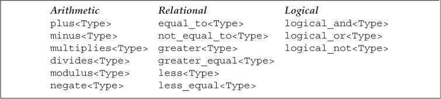
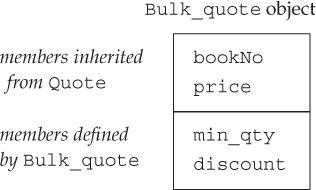
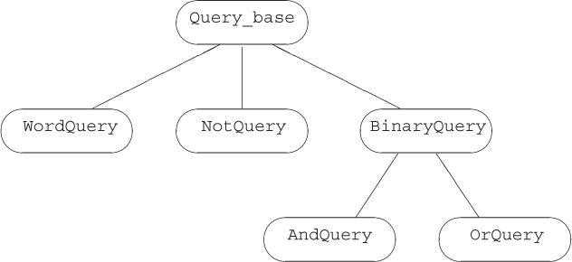
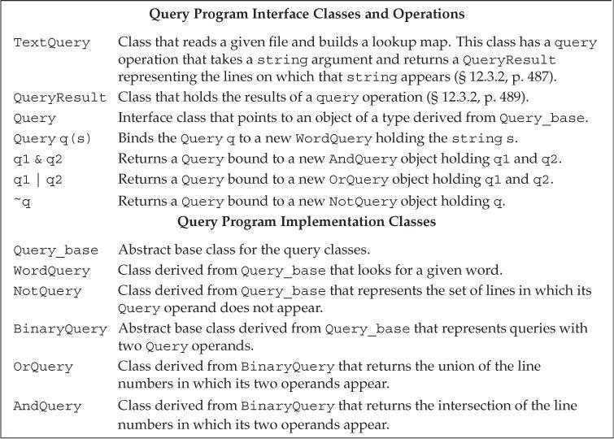
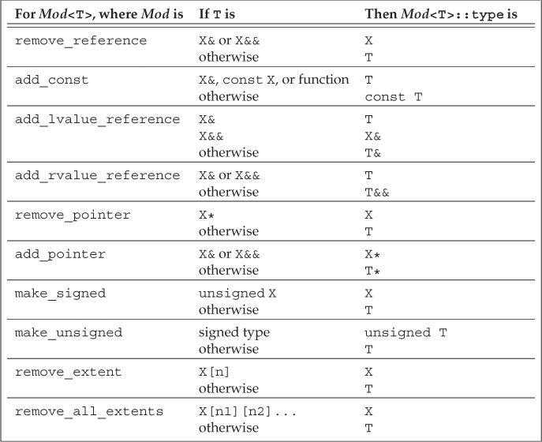

# Chapter 13. Copy Control

When we define a class, we specify—explicitly or implicitly—what happens when objects of that class type are copied, moved, assigned, and destroyed. 

* The copy and move constructors define what happens when an object is initialized from another object of the same type. 
* The copy- and move-assignment operators define what happens when we assign an object of a class type to another object of that same class type.
* The destructor defines what happens when an object of the type ceases to exist.

Collectively, we’ll refer to these operations as**<font color='blue'> copy control</font>**.

## 13.1. Copy, Assign, and Destroy

### 13.1.1. The Copy Constructor

A constructor is the copy constructor if its first parameter is a reference to the class type and any additional parameters have default values:

```c++
class Foo {
public:
	Foo(); 				// default constructor
	Foo(const Foo&); 	// copy constructor
	// ...
};
```

**<font color='red'>The first parameter of copy constructor must be a reference type.</font>** And it is almost always a reference to `const`.

#### The Synthesized Copy Constructor

When we do not define a copy constructor for a class, the compiler synthesizes one for us. The compiler copies each non`static` member in turn from the given object into the one being created.

Although we cannot directly copy an array, **<font color='red'>the synthesized copy constructor copies members of array type by copying each element.</font>** Elements of class type are copied by using the elements’ copy constructor.

#### Copy Initialization

```c++
string dots(10, '.'); 				// direct initialization
string s(dots); 					// direct initialization
string s2 = dots; 					// copy initialization
string null_book = "9-999-99999-9"; // copy initialization
string nines = string(100, '9'); 	// copy initialization
```

When we use **<font color='blue'>direct initialization</font>**, we are asking the compiler to use ordinary function matching to select the constructor that best matches the arguments we provide. When we use **<font color='blue'>copy initialization</font>**, we are asking the compiler to copy the right-hand operand into the object being created, converting that operand if necessary.

Copy initialization uses either the copy constructor or the move constructor.

Copy initialization happens not only when we define variables using an `=`, but also when we

* Pass an object as an argument to a parameter of nonreference type

  The fact that the copy constructor is used to initialize nonreference parameters of class type explains why the copy constructor’s own parameter must be a reference. If that parameter were not a reference, then the call would never succeed—to call the copy constructor, we’d need to use the copy constructor to copy the argument, but to copy the argument, we’d need to call the copy constructor, and so on indefinitely.

* Return an object from a function that has a nonreference return type

* Brace initialize the elements in an array or the members of an aggregate class

#### The Compiler Can Bypass the Copy Constructor

During copy initialization, the compiler is permitted (but not obligated) to skip the copy/move constructor and create the object directly. That is, the compiler is permitted to rewrite

```c++
string null_book = "9-999-99999-9"; // copy initialization
```

into

```c++
string null_book("9-999-99999-9");
```

### 13.1.2. The Copy-Assignment Operator

Just as a class controls how objects of that class are initialized, it also controls how objects of its class are assigned:

```c++
Sales_data trans, accum;
trans = accum; // uses the Sales_data copy-assignment operator
```

#### Introducing Overloaded Assignment

Overloaded operators are functions that have the name `operator` followed by the symbol for the operator being defined. Hence, the assignment operator is a function named `operator=`.

The parameters in an overloaded operator represent the operands of the operator. Some operators, assignment among them, must be defined as member functions.

**<font color='red'>When an operator is a member function, the left-hand operand is bound to the implicit `this` parameter. The right-hand operand in a binary operator, such as assignment, is passed as an explicit parameter.</font>**

The copy-assignment operator takes an argument of the same type as the class. To be consistent with assignment for the built-in types, assignment
operators usually return a reference to their left-hand operand.

```c++
class Foo{
public:
    Foo& operator=(const Foo&);	// assignment operator
};
```

#### The Synthesized Copy-Assignment Operator

The Synthesized Copy-Assignment Operator assigns each non`static` member of the right-hand object to the corresponding member of the left-hand object using the copy-assignment operator for the type of that member. Array members are assigned by assigning each element of the array.

### 13.1.3. The Destructor

Destructors do whatever work is needed to free the resources used by an object and destroy the non`static` data members of the object.

The destructor is a member function with the name of the class prefixed by a tilde (`~`). It has no return value and takes no parameters:

```c++
class Foo{
public:
    ~Foo();		// destructor
};
```

#### What a Destructor Does

Just as a constructor has an initialization part and a function body, **<font color='red'>a destructor has a function body and a destruction part</font>**. In a constructor, members are initialized before the function body is executed, and members are initialized in the same order as they appear in the class. **<font color='red'>In a destructor, the function body is executed first and then the members are destroyed.</font>** Members are destroyed in reverse order from the order in which they were initialized.

In a destructor, the destruction part is implicit. What happens when a member is destroyed depends on the type of the member. Members of class type are destroyed by running the member’s own destructor. The built-in types do not have destructors, so nothing is done to destroy members of built-in type.

#### When a Destructor Is Called

* Variables are destroyed when they go out of scope.
* Members of an object are destroyed when the object of which they are a part is destroyed.
* Elements in a container—whether a library container or an array—are destroyed when the container is destroyed.
* Dynamically allocated objects are destroyed when the `delete` operator is applied to a pointer to the object.
* **<font color='red'>Temporary objects are destroyed at the end of the full expression in which the temporary was created.</font>**

> The destructor is not run when a reference or a pointer to an object goes out of scope.

#### The Synthesized Destructor

The synthesized destructor has an empty function body. The members are automatically destroyed after the (empty) destructor body is run.

It is important to realize that the destructor body does not directly destroy the members themselves. **<font color='red'>Members are destroyed as part of the implicit destruction phase that follows the destructor body.</font>** 

### 13.1.4. The Rule of Three/Five 三/五法则

#### Classes That Need Destructors Need Copy and Assignment

Decide first whether the class needs a destructor. Often, the need for a destructor is more obvious than the need for the copy constructor or assignment operator. **<font color='red'>If the class needs a destructor, it almost surely needs a copy constructor and copy-assignment operator as well.</font>**

Consider the follow class:

```c++
class HasPtr{
public:
    HasPtr(const string &s = string()):
    		ps(new string(s)), i(0) {}
private:
    string *ps;
    int i;
};
```

This class allocates dynamic memory in its constructor. The synthesized destructor will not `delete` a data member that is a pointer. Therefore, this class
needs to define a destructor to free the memory allocated by its constructor:

```c++
class HasPtr{
public:
    HasPtr(const string &s = string()):
    		ps(new string(s)), i(0) { }
    ~HasPtr() { delete ps; }
private:
    string *ps;
    int i;
};
```

In this version of the class, we gave `HasPtr` a destructor but used the synthesized versions of the copy constructor and copy-assignment operator. Those
functions copy the pointer member, meaning that multiple `HasPtr` objects may be pointing to the same memory:

```c++
HasPtr f(HasPtr hp){
    HasPtr ret = hp;
    // process ret
    return ret;
}
```

When `f` returns, both `hp` and `ret` are destroyed and the `HasPtr` destructor is run on each of these objects. That destructor will `delete` the pointer member in `ret` and in `hp`. But these objects contain the same pointer value. This code will `delete` that pointer twice, which is an error.

In addition, the caller of `f` may still be using the object that was passed to `f`:

```c++
HasPtr p("some values");
f(p);
HasPtr q(p);
```

The memory to which `p` (and `q`) points is no longer valid. It was returned to the system when `hp` (or `ret`) was destroyed !

#### Classes That Need Copy Need Assignment, and Vice Versa

Some classes have work that needs to be done to copy or assign objects but has no need for the destructor.

As an example, consider a class that gives each object its own, unique serial number. Such a class would need a copy constructor to generate a new, distinct serial number for the object being created. That constructor would copy all the other data members from the given object.

This class would also need its own copy-assignment operator to avoid assigning to the serial number of the left-hand object. 

However, this class would have no need for a destructor.

### 13.1.5. Using `= default`

We can explicitly ask the compiler to generate the synthesized versions of the copy-control members by defining them as `= default`

```c++
class Sales_data{
public:
    Sales_data() = default;						// default constructor
    Sales_data(const Sales_data&) = default;	// copy constructor
    Sales_data& operator=(const Sales_data&);	// copy assignment operator
    ~Sales_data() = default;					// destructor
};
Sales_data& Sales_data::operator=(const Sales_data&) = default;
```

When we specify `= default` on the declaration of the member inside the class body, the synthesized function is implicitly `inline` (just as is any other member function defined in the body of the class).

**<font color='red'>If we do not want the synthesized member to be an `inline` function, we can specify `= default` on the member’s definition outside the class.</font>**

### 13.1.6. Preventing Copies

In some cases, there is no sensible meaning for defining a copy constructor and a copy-assignment operator. 

For example, The `iostream` classes prevent copying to avoid letting multiple objects write to or read from the same IO buffer. It might seem that we could prevent copies by not defining the copy-control members. However, this strategy doesn’t work: If our class doesn’t define these operations, the compiler will synthesize them.

#### Defining a Function as Deleted

Under the new standard, we can prevent copies by defining the copy constructor and copy-assignment operator as **<font color='blue'>deleted functions</font>**. 

A deleted function is one that is declared but may not be used in any other way. We indicate that we want to define a function as deleted by following its parameter list with `= delete`:

```c++
struct NoCopy{
  	NoCopy() = default;
    NoCopy(const Nocopy&) = delete;
    NoCopy& operator=(const NoCopy&) = delete;
    ~NoCopy() = default;
};
```

Unlike `= default`, `= delete` must appear on the first declaration of a deleted function. The compiler needs to know that a function is deleted in order to prohibit operations that attempt to use it.

Also unlike `= default`, we can specify `= delete` on any function. Although the primary use of deleted functions is to suppress the copy-control members, deleted functions are sometimes also useful when we want to guide the function-matching process.

#### The Destructor Should Not be a Deleted Member

If the destructor is deleted, then there is no way to destroy objects of that type. The compiler will not let us define variables or create temporaries of a type that has a deleted destructor. Moreover, we cannot define variables or temporaries of a class that has a member whose type has a deleted destructor.

#### The Copy-Control Members May Be Synthesized as Deleted

* The **<font color='blue'>synthesized destructor</font>** is defined as deleted if the class has a member whose own destructor is deleted or is inaccessible (e.g., `private`).
* The **<font color='blue'>synthesized copy constructor</font>** is defined as deleted if the class has a member whose own copy constructor is deleted or inaccessible. It is also deleted if the class has a member with a deleted or inaccessible destructor.
* The **<font color='blue'>synthesized copy-assignment operator</font>** is defined as deleted if a member has a deleted or inaccessible copy-assignment operator, or **<font color='red'>if the class has a `const` or reference member.</font>**
* The **<font color='blue'>synthesized default constructor</font>** is defined as deleted if the class has a member with a deleted or inaccessible destructor; or has a reference member that does not have an in-class initializer; or has a `const` member whose type does not explicitly define a default constructor and that
  member does not have an in-class initializer.

> In essence, the copy-control members are synthesized as deleted when it is impossible to copy, assign, or destroy a member of the class.

#### `private` Copy Control

Prior to the new standard, classes prevented copies by declaring their copy constructor and copy-assignment operator as `private`:

```c++
class PrivateCopy {
	// copy control is private and so is inaccessible to ordinary user code
	PrivateCopy(const PrivateCopy&);
	PrivateCopy &operator=(const PrivateCopy&);
	// other members
public:
	PrivateCopy() = default; // use the synthesized default constructor
	~PrivateCopy(); // users can define objects of this type but not copy them
};
```

Because the copy constructor and copy-assignment operator are `private`, user code will not be able to copy such objects. However, friends and members of the class can still make copies. To prevent copies by friends and members, **<font color='red'>we declare these members as `private` but do not define them. </font>**An attempt to use an undefined member results in a link-time failure.

By declaring (but not defining) a `private` copy constructor, we can forestall any attempt to copy an object of the class type: 

* User code that tries to make a copy will be flagged as an error at compile time
* Copies made in member functions or friends will result in an error at link time.

## 13.2. Copy Control and Resource Management

Ordinarily, classes that manage resources that do not reside in the class must define the copy-control members. In order to define these members, we first have to decide what copying an object of our type will mean. 

In general, we have two choices: We can define the copy operations to make the class behave like a value or like a pointer.

* Classes that behave like values have their own state. When we copy a valuelike object, the copy and the original are independent of each other. Changes made to the copy have no effect on the original, and vice versa.
* Classes that act like pointers share state. When we copy objects of such classes, the copy and the original use the same underlying data. Changes made to the copy also change the original, and vice versa.

To illustrate these two approaches, we’ll define the copy-control members for the `HasPtr` class. Our `HasPtr` class has two members, an `int` and a pointer to `string`. What we do when we copy the pointer member determines whether a class like `HasPtr` has valuelike or pointerlike behavior.

### 13.2.1. Classes That Act Like Values

To provide valuelike behavior, `HasPtr` object must have its own copy of the `string` to which `ps` points, which means it needs:

* A copy constructor that copies the `string`, not just the pointer
* A destructor to free the `string`
* A copy-assignment operator to free the object’s existing `string` and copy the `string` from its right-hand operand

```c++
class HasPtr {
public:
	HasPtr(const string &s = string()):
		ps(new string(s)), i(0){ }
	// each HasPtr has its own copy of the string to which ps points
	HasPtr(const HasPtr &rhs):
		ps(new string(*rhs.ps)), i(rhs.i) { }
	HasPtr& operator=(const HasPtr&);
	~HasPtr() { delete ps; }
private:
	string *ps;
	int i;
};
```

#### Valuelike Copy-Assignment Operator

**<font color='red'>Assignment operators typically combine the actions of the destructor and the copy constructor:</font>**

* Like the destructor, assignment destroys the left-hand operand’s resources.
* Like the copy constructor, assignment copies data from the right-hand operand.

However, it is crucially important that these actions be done in a sequence that is correct even if an object is **<font color='red'>assigned to itself</font>**.

In this case, we can handle self-assignment by first copying the right-hand side. After the copy is made, we’ll free the left-hand side and update the pointer to point to the newly allocated `string`:

```c++
HasPtr& HasPtr::operator=(const HasPtr &rhs) {
	auto newp = new string(*rhs.ps);		// copy the underlying string
	delete ps;								// free the old memory
	ps = newp;								// copy data from rhs into this object
	i = rhs.i;
	return *this;							// return this object
}
```

> There are two points to keep in mind when you write an assignment operator:
>
> * Assignment operators must work correctly if an object is **<font color='red'>assigned to itself</font>**.
>
> * Most assignment operators **<font color='red'>share work</font>** with the destructor and copy constructor.
>
> **<font color='red'>A good pattern to use when you write an assignment operator is:</font>**
>
> * First copy the right-hand operand into a local temporary. 
> * After the copy is done, it is safe to destroy the existing members of the left-hand operand. 
> * Once the left-hand operand is destroyed, copy the data from the temporary into the members of the left-hand operand.

To illustrate the importance of guarding against self-assignment, consider what would happen if we wrote the assignment operator as

```c++
// WRONG way to write an assignment operator!
HasPtr& HasPtr::operator=(const HasPtr &rhs)
{
	delete ps;
	ps = new string(*(rhs.ps));
	i = rhs.i;
	return *this;
}
```

If `rhs` and `this` object are the same object, deleting `ps` frees the `string` to which both `*this` and `rhs` point. When we attempt to copy `* (rhs.ps)` in the `new` expression, that pointer points to invalid memory. What happens is undefined.

### 13.2.2. Defining Classes That Act Like Pointers

For our `HasPtr` class to act like a pointer, we need the copy constructor and copy-assignment operator to copy the pointer member, not the `string` to which that pointer points.

Our class will still need its own destructor to free the memory allocated by the constructor that takes a `string`. And it can do so only when the last `HasPtr` pointing to that `string` goes away.

The easiest way to make a class act like a pointer is to use `shared_ptr`s to manage the resources in the class. However, sometimes we want to manage a resource directly. In such cases, it can be useful to use a **<font color='blue'>reference count</font>**

#### Reference Counts

Reference counting works as follows:

* Each constructor (other than the copy constructor) creates a counter and initialize the counter to 1.
* The copy constructor increments this shared counter, indicating that there is another user of that object’s state.
* The destructor decrements the counter. If the count goes to zero, the destructor deletes that state.
* The copy-assignment operator increments the right-hand operand’s counter and decrements the counter of the left-hand operand**. **If the counter for the left-hand operand goes to zero, the copyassignment operator must destroy the state of the left-hand operand.

The only wrinkle is deciding where to put the reference count. The counter cannot be a direct member of a `HasPtr` object. To see why, consider what happens in the following example:

```c++
HasPtr p1("Hiya!");
HasPtr p2(p1); // p1 and p2 point to the same string
HasPtr p3(p1); // p1, p2, and p3 all point to the same string
```

If the reference count is stored in each object, when p3 is created, we could increment the count in `p1` and copy that count into `p3`, but how would we update the counter in `p2`? One way to solve this problem is to **<font color='red'>store the counter in dynamic memory</font>**:

```c++
class HasPtr {
public:
	HasPtr(const string &s = string()):
		ps(new string(s)), i(0), counter(new size_t(1)){ }
	// each HasPtr has its own copy of the string to which ps points
	HasPtr(const HasPtr &rhs):
		ps(rhs.ps), i(rhs.i), counter(rhs.counter) { ++*counter; }
	HasPtr& operator=(const HasPtr&);
	~HasPtr();
private:
	size_t *counter;
	string *ps;
	int i;
};

HasPtr& HasPtr::operator=(const HasPtr &rhs) {
	++*rhs.counter;
	if (!(--*counter)) {
		delete ps;
		delete counter;
	}
	counter = rhs.counter;
	ps = rhs.ps;
	i = rhs.i;
	return *this;
}

HasPtr::~HasPtr() {
	if (!(--*counter)) {
		delete ps;
		delete counter;
	}
}
```

Note that, as usual, the copy-assignment operator must handle self-assignment. We do so by incrementing the count in `rhs` before decrementing the `count` in the left-hand object. That way if both objects are the same, the counter will have been incremented before we check to see if `ps` (and `counter`) should be deleted.

## 13.3. Swap

In addition to defining the copy-control members, classes that manage resources often also define a function named `swap`. Defining `swap` is particularly
important for classes that we plan to use with algorithms that reorder elements. Such algorithms call `swap` whenever they need to exchange two elements.

If a class defines its own `swap`, then the algorithm uses that class-specific version. Otherwise, it uses the `swap` function defined by the library. For example, code to swap two objects of our valuelike `HasPtr` class might look something like:

```c++
HasPtr temp = v1;
v1 = v2;
v2 = temp;
```

This code copies the `string` that was originally in `v1` twice. It also copies the `string` that was originally in `v2` when it assigns `v2` to `v1`. As we’ve seen, copying a valuelike `HasPtr` allocates a new `string`.

In principle, none of this memory allocation is necessary. Rather than allocating new copies of the `string`, we’d like `swap` to **<font color='red'>swap the pointers</font>**. That is, we’d like swapping two `HasPtr`s to execute as:

```c++
string *temp = v1.ps;
v1.ps = v2.ps;
v2.ps = temp;
```

#### Writing Our Own `swap` Function

We can override the default behavior of `swap` by defining a version of swap that operates on our class:

```c++
class HasPtr{
friend void swap(HasPtr &lhs, HasPtr &rhs);
    // other members as in 13.2.1
};
inline void swap(HasPtr &lhs, HasPtr &rhs){
    using std::swap;
    swap(lhs.ps, rhs.ps);	// swap the pointers, not the string data
    swap(lhs.i, rhs.i);		// swap the int members
}
```

#### `swap` Functions Should Call `swap`, Not `std::swap`

In the `HasPtr` function, the data members have built-in types. There is no type-specific version of `swap` for the built-in types. In this case, these calls will invoke the library `std::swap`.

However, if a class has a member that has its own type-specific `swap` function, calling `std::swap` would be a mistake. For example, assume we had another class named `Foo` that has a member named `h`, which has type `HasPtr`. If we did not write a `Foo` version of `swap`, then the library version of `swap` would be used. As we’ve already seen, the library `swap` makes unnecessary copies of the `string`s managed by `HasPtr`.

We can avoid these copies by writing a `swap` function for `Foo`. However, if we wrote the `Foo` version of `swap` as:

```c++
void swap(Foo &lhs, Foo &rhs)
{
	// WRONG: this function uses the library version of swap, not the HasPtr version
	std::swap(lhs.h, rhs.h);
	// swap other members of type Foo
}
```

this code would compile and execute. However, there would be no performance difference between this code and simply using the default version of `swap`. **<font color='red'>The problem is that we’ve explicitly requested the library version of `swap`.</font>** However, we don’t want the version in `std`; we want the one defined for `HasPtr` objects.

The right way to write this `swap` function is:

```c++
void swap(Foo &lhs, Foo &rhs)
{
	using std::swap;
	swap(lhs.h, rhs.h); 	// uses the HasPtr version of swap
	// swap other members of type Foo
}
```

Each call to `swap` must be unqualified. That is, each call should be to `swap`, not `std::swap`. For reasons we’ll explain in § 16.3, if there is a type-specific
version of `swap`, that version will be a better match than the one defined in `std`. As a result, if there is a type-specific version of `swap`, calls to `swap` will match that type-specific version. If there is no type-specific version, then—assuming there is a `using` declaration for `swap` in scope—calls to `swap` will use the version in `std`.

Very careful readers may wonder why the `using` declaration inside `swap` does not hide the declarations for the `HasPtr` version of `swap`. We’ll explain
the reasons for why this code works in § 18.2.3.

#### ⭐Using `swap` in Assignment Operators

Classes that define `swap` often use `swap` to define their assignment operator. These operators use a technique known as **<font color='blue'>copy and swap</font>**. This technique swaps the left-hand operand with **<font color='red'>a copy of</font>** the right-hand operand:

```c++
// note rhs is passed by value, which means the HasPtr copy constructor
// copies the string in the right-hand operand into rhs
HasPtr& operator=(HasPtr rhs){
    swap(*this, rhs);		// rhs now points to the memory this object had used
    return *this;			// rhs is destroyed, which deletes the pointer in rhs
}
```

1. Here we pass the right-hand operand **<font color='red'>by value</font>**. Thus, `rhs` is a copy of the right-hand operand. Copying a `HasPtr` allocates a new copy of that object’s `string`.
2. In the body of the assignment operator, we call `swap`, which swaps the data members of `rhs` with those in `*this`. This call puts the pointer that had been in the left-hand operand into `rhs`, and puts the pointer that was in `rhs` into `*this`. Thus, after the swap, the pointer member in `*this` points to the newly allocated `string` that is a copy of the right-hand operand.
3. When the assignment operator finishes, `rhs` is destroyed and the `HasPtr` destructor is run. That destructor deletes the memory to which `rhs` now points, thus freeing the memory to which the left-hand operand had pointed.

## ⭐13.5. Classes That Manage Dynamic Memory

Some classes need to allocate a varying amount of storage at run time. Such classes often can (and if they can, generally should) use a library container to hold their data. For example, our `StrBlob` class uses a `vector` to manage the underlying storage for its elements.

However, this strategy does not work for every class; some classes need to do their own allocation. As an example, we’ll implement a simplification of the library `vector` class. Our class will hold `string`s. Thus, we’ll call our class `StrVec`.

#### `StrVec` Class Design

Recall that the `vector` class stores its elements in contiguous storage. To obtain acceptable performance, `vector` **preallocates** enough storage to hold more elements than are needed. Each `vector` member that adds elements checks whether there is space available for another element. If so, the member **constructs** an object in the next available spot. If there isn’t space left, then the `vector` is **reallocated**: The vector obtains new space, moves the existing elements into that space, **frees the old space**, and **adds the new element**.

We’ll use a similar strategy in our `StrVec` class. We’ll use an `allocator` to obtain raw memory.

Each `StrVec` will have three pointers into the space it uses for its elements:

* `elements`, which points to the first element in the allocated memory
* `first_free`, which points just after the last actual element
* `cap`, which points just past the end of the allocated memory

 

In addition to these pointers, `StrVec` will have a member named `alloc` that is an `allocator<string>`.

Our class will also have four utility functions:

* `alloc_n_copy` will allocate space and copy a given range of elements.
* `free` will destroy the constructed elements and deallocate the space.
* `chk_n_alloc` will ensure that there is room to add at least one more element  to the `StrVec`. If there isn’t room for another element, `chk_n_alloc` will call `reallocate` to get more space.
* `reallocate` will reallocate the `StrVec` when it runs out of space.

#### `StrVec` Class Definition

Having sketched the implementation, we can now define our `StrVec` class:

```c++
class StrVec {
public:
	StrVec():	// the allocator member is default initialized
		elements(nullptr), first_free(nullptr), cap(nullptr) { }

	// copy control members
	StrVec(const StrVec&);				// copy construtor
	StrVec& operator=(const StrVec&);	// copy assignment
	~StrVec();							// destructor

	// operations
	size_t size() const { return first_free - elements; }
	size_t capacity() const { return cap - first_free; }
    void push_back(const string&);
	string *begin() const { return elements; }
	string *end() const { return first_free; }
private:
	pair<string*, string*> alloc_n_copy(const string*, const string*);
	void free();
	void chk_n_alloc() { if (size() == capacity()) reallocate(); }
	void reallocate();

	allocator<string> alloc;
	string * elements;
	string *first_free;
	string *cap;
};
```

#### Using `construct`

The `push_back` function calls `chk_n_alloc` to ensure that there is room for an element. If necessary, `chk_n_alloc` will call `reallocate`. When `chk_n_alloc` returns, `push_back` knows that there is room for the new element. It asks its `allocator` member to `construct` a new last element:

```c++
void StrVec::push_back(const string &s) {
	chk_n_alloc();							// ensure that there is room for another element
	alloc.construct(first_free++, s);		// construct a copy of s in the element to which first_free points
}	
```

#### The `alloc_n_copy` Member

The `alloc_n_copy` member is called when we copy or assign a `StrVec`. Our `StrVec` class, like `vector`, will have valuelike behavior; when we copy or assign a `StrVec`, we have to allocate independent memory and copy the elements from the original to the new `StrVec`.

The `alloc_n_copy` member will allocate enough storage to hold its given range of elements, and will copy those elements into the newly allocated space. This function returns a `pair` of pointers, pointing to the beginning of the new space and just past the last element it copied:

```c++
pair<string*, string*> StrVec::alloc_n_copy(const string *b, const string *e) {
	auto data = alloc.allocate(e - b);
	return { data, uninitialized_copy(b, e, data) };
}
```

#### The `free` Member

The `free` member has two responsibilities: It must destroy the elements and then deallocate the space that this `StrVec` itself allocated.

```c++
void StrVec::free() {
	if (elements) {
		for (auto p = first_free; p != elements; /* empty */)
			alloc.destroy(--p);
		alloc.deallocate(elements, cap - elements);
	}
}
```

The `for` loop calls the `allocator` member `destroy` **<font color='red'>in reverse order</font>**, starting with the last constructed element and finishing with the first. The `destroy` function runs the `string` destructor. Once the elements have been destroyed, we free the space that this `StrVec` allocated by calling `deallocate`.

#### Copy-Control Members

The copy constructor calls `alloc_n_copy`:

```c++
StrVec::StrVec(const StrVec &s) {
	// call alloc_n_copy to allocate exactly as many elements as in s
	auto newdata = alloc_n_copy(s.begin(), s.end());
	elements = newdata.first;
	first_free = cap = newdata.second;
}
```

The destructor calls `free`:

```c++
StrVec::~StrVec() {
	free();
}
```

The copy-assignment operator calls `alloc_n_copy` before freeing its existing elements. By doing so it protects against self-assignment:

```c++
StrVec& StrVec::operator=(const StrVec &rhs) {
	auto newdata = alloc_n_copy(rhs.begin(), rhs.end());
	free();
	elements = newdata.first;
	first_free = cap = newdata.second;
	return *this;
}
```

#### Moving, Not Copying, Elements during Reallocation

Before we write the `reallocate` member, we should think a bit about what it must do. This function will

* Allocate memory for a new, larger array of `string`s
* Construct the first part of that space to hold the existing elements
* Destroy the elements in the existing memory and deallocate that memory

We know that `string`s have valuelike behavior, so each `string` must have its own copy of the characters that make up that `string`. Copying a `string` must allocate memory for those characters, and destroying a `string` must free the memory used by that `string`.

In the `reallocate`, as soon as we copy the elements from the old space to the new, we will immediately destroy the original `string`s. Copying the data in these `string`s is unnecessary. Our `StrVec`’s performance will be much better if we can avoid the overhead of allocating and deallocating the `string`s themselves each time we reallocate.

#### Move Constructors and `std::move`

We can avoid copying the `string`s by using two facilities introduced by the new library:

* Move constructors

  Several of the library classes, including `string`, define so-called “move constructors.” Move constructors typically operate by “moving” resources from the given object to the object being constructed. For `string`, we can imagine that each `string` has a pointer to an array of `char`. Presumably the `string` move constructor **<font color='red'>copies the pointer rather than allocating space for and copying the characters themselves</font>**.

* A library function named `move`

  * When `reallocate` constructs the `string`s in the new memory it must call `move` to signal that it wants to use the `string` move constructor. If it omits the call to `move`, then the `string` copy constructor will be used.
  * We usually do not provide a `using` declaration for `move`. When we use `move`, we call `std::move`, not `move`.

#### The `reallocate` Member

```c++
void StrVec::reallocate() {
	// we'll allocate space for twice as many elements as the current size
	// If the StrVec is empty, we allocate room for one element
	auto newcapacity = size() ? size() * 2 : 1;
	// allocate new memory
	auto newdata = alloc.allocate(newcapacity);
	// move the data from the old memory to new
	auto dest = newdata;
	auto src = elements;
	for (size_t i = 0; i != size(); ++i)
		alloc.construct(dest++, std::move(*src++));
	// free the old space once we've moved the elements
	free();
	// upadate our data structure
	elements = newdata;
	first_free = dest;
	cap = newdata + newcapacity;
}
```

1. We start by calling `allocate` to allocate new space. We’ll double the capacity of the `StrVec` each time we `reallocate`. **<font color='red'>If the `StrVec` is empty, we allocate room for one element.</font>**

2. The `for` loop iterates through the existing elements and constructs a corresponding element in the new space. The second argument in the call to `construct` is the value returned by `move`. Calling `move` returns a result that causes `construct` to use the `string` move constructor.

3. After moving the elements, we call `free` to destroy the old elements and free the memory that this `StrVec` was using before the call to `reallocate`. 

4. What remains is to update the pointers to address the newly allocated and initialized array. 

## 13.6. Moving Objects

As we’ve just seen, during `reallocation` of our `StrVec` class, there is no need to copy—rather than move—the elements from the old memory to the new. A second reason to move rather than copy occurs in classes such as the IO or `unique_ptr` classes. These classes have a resource (such as a pointer or an IO buffer) that may not be shared. Hence, objects of these types can’t be copied but can be moved.

### 13.6.1. Rvalue References

An rvalue reference is a reference that must be bound to an rvalue. An rvalue reference is obtained by using `&&` rather than `&`. They may be bound only to an object that is about to be destroyed. As a result, we are free to “move” resources from an rvalue reference to another object.

Recall that lvalue and rvalue are properties of an expression. An lvalue expression refers to an object’s identity whereas an rvalue expression refers to an object’s value.

Like any reference, an rvalue reference is just another name for an object. As we know, we cannot bind regular references to expressions that require
a conversion, to literals, or to expressions that return an rvalue. We can bind an rvalue reference to these kinds of expressions, but we cannot directly bind an rvalue reference to an lvalue:

```c++
int i = 42;
int &r = i;					// ok: r refers to i
int &&r = i;				// error: cannot bind an rvalue reference to an lvalue
int &r2 = i * 42;			// error: i * 42 is an rvalue
const int &r3 = i * 42;		// ok: we can bind a reference to const to an rvalue
int &rr2 = i * 42;			// ok: bind rr2 to the result of the multiplication
```

#### Lvalues Persist; Rvalues Are Ephemeral

Lvalues have persistent state, whereas rvalues are either literals or temporary objects created in the course of evaluating expressions:

Because rvalue references can only be bound to temporaries, we know that

* The referred-to object is about to be destroyed
* There can be no other users of that object

Hence, we can “steal” state from an object bound to an rvalue reference.

#### Variables Are Lvalues

A variable is an expression with one operand and no operator. Like any other expression, a variable expression has the lvalue/rvalue property. Variable expressions are lvalues. Hence we cannot bind an rvalue reference to a variable defined as an rvalue reference type:

```c++
int &&rr1 = 42;		// ok: literals are rvalues
int &&rr2 = rr1;	// error: the expression rr1 is an lvalue!
```

#### ⭐The Library `move` Function

We can obtain an rvalue reference bound to an lvalue by calling a new library function named `move`. The `move` function uses facilities that we’ll describe in § 16.2.6 to return an rvalue reference to its given object:

```c++
int &&rr3 = std::move(rr1);		// ok
```

**<font color='red'>Calling move tells the compiler that we have an lvalue that we want to treat as if it were an rvalue.</font>** It is essential to realize that the call to `move` promises that we do not intend to use `rr1` again except to assign to it or to destroy it. After a call to `move`, we cannot make any assumptions about the value of the moved-from object.

> We can destroy a moved-from object and can assign a new value to it, but we cannot use the value of a moved-from object.
>
> Code that uses `move` should use `std::move`, not `move`. Doing so avoids potential name collisions.

### 13.6.2. Move Constructor and Move Assignment

To enable move operations for our own types, we define a move constructor and a move-assignment operator. These members are similar to the corresponding copy operations, but they “steal” resources from their given object rather than copy them.

#### Move Constructor

The move constructor has an initial parameter that is an rvalue reference to the class type. As in the copy constructor, any additional parameters must all have default arguments.

**<font color='red'>In addition to moving resources, the move constructor must ensure that the moved-from object is left in a state such that destroying that object will be harmless.</font>** In particular, once its resources are moved, **<font color='red'>the original object must no longer point to those moved resources</font>**—responsibility for those resources has been assumed by the newly created object.

```c++
StrVec::StrVec(const StrVec &&s) noexcept
    // member initializers take over the resources in s
    : elements(s.elements), first_free(s.first_free), cap(s.cap)
{
    // leave s in a state in which it is safe to run the destructor
	s.elements = s.first_free= s.cap = nullptr;        
}
```

Unlike the copy constructor, the move constructor does not allocate any new memory; it takes over the memory in the given `StrVec`. 

Having taken over the memory from its argument, the constructor body sets the pointers in the given object to `nullptr`. After an object is moved from, that object continues to exist. Eventually, the moved-from object will be destroyed, meaning that the destructor will be run on that object. The `StrVec` destructor calls `deallocate` on `first_free`. If we neglected to change `s.first_free`, then destroying the moved-from object would delete the memory we just moved.

#### Move Operations, Library Containers, and Exceptions

Because a move operation executes by “stealing” resources, it ordinarily does not itself allocate any resources. As a result, move operations ordinarily will not throw any exceptions.

When we write a move operation that cannot throw, we should inform the library of that fact. Otherwise it will do extra work to cater to the possibliity that moving an object of our class type might throw.

One way inform the library is to specify `noexcept` on our constructor. We specify `noexcept` on a function after its parameter list. In a constructor, `noexcept` appears between the parameter list and the `:` that begins the constructor initializer list. We must specify `noexcept` on both the declaration in the class header and on the definition if that definition appears outside the class:

```c++
class StrVec {
public:
    StrVec(StrVec&&) noexcept; // move constructor
	// other members as before
};

StrVec::StrVec(StrVec &&s) noexcept : /* member initializers */
{ /* constructor body */ }
```

The library containers provide guarantees as to what they do if an exception happens. As one example, `vector` guarantees that if an exception happens when we call `push_back`, the `vector` itself will be left unchanged.

`push_back` on a `vector` might require that the `vector` be reallocated. When a `vector` is reallocated, it moves the elements from its old space to new memory. As we’ve just seen, moving an object generally changes the value of the moved-from object. If reallocation uses a move constructor and that constructor throws an exception after moving some but not all of the elements, the moved-from elements in the old space would have been changed, and the unconstructed elements in the new space would not yet exist. In this case, `vector` would be unable to meet its requirement that the `vector` is left unchanged.

On the other hand, if `vector` uses the copy constructor and an exception happens, it can easily meet this requirement. If an exception happens, `vector` can free the space it allocated (but could not successfully construct) and return. The original vector elements still exist.

To avoid this potential problem, `vector` must use a copy constructor instead of a move constructor during reallocation unless it knows that the element type’s move constructor cannot throw an exception. 

**<font color='red'>If we want objects of our type to be moved rather than copied in circumstances such as `vector` reallocation, we must explicity tell the library that our move constructor is safe to use.</font>** We do so by marking the move constructor (and move-assignment operator) `noexcept`.

#### Move-Assignment Operator

The move-assignment operator does the same work as the destructor and the move constructor.

```c++
StrPtr& StrPtr::operator=(StrPtr &&rhs) noexcept{
    // direct test for self-assignment
    if(this != &rhs){
        // free existing elements
        free();		
        // take over resources from rhs
        elements = rhs.elements;
        first_free = rhs.first_free;
		cap = rhs.cap;
        // leave rhs in a destructible state
		rhs.elements = rhs.first_free = rhs.cap = nullptr;
    }
    return *this;
}
```

If the right- and left-hand operands doesn't refer to the same object:

* Free the memory that the left-hand operand had used
* Take over the memory from the given object. 
* As in the move constructor, set the pointers in `rhs` to `nullptr`.

#### A Moved-from Object Must Be Destructible and Valid

Moving from an object does not destroy that object: Sometime after the move operation completes, the moved-from object will be destroyed. Therefore, when we write a move operation, we must ensure that the moved-from object is in a state in which the destructor can be run.

In addition to leaving the moved-from object in a state that is safe to destroy,**<font color='red'> move operations must guarantee that the object remains valid</font>**----It can safely be given a new value or used in other ways that do not depend on its current value.

For example, when we move from a library `string` or container object, we know that the moved-from object remains valid. As a result, we can run operations such as `empty` or `size` on moved-from objects. However, we don’t know what result we’ll get. We might expect a moved-from object to be empty, but that is not guaranteed.

#### The Synthesized Move Operations

As it does for the copy constructor and copy-assignment operator, the compiler will synthesize the move constructor and move-assignment operator.

The compiler will synthesize a move constructor or a move-assignment operator only if the class doesn’t define any of its own copy-control members and if every non`static` data member of the class can be moved. The compiler can move members of **built-in type**. It can also move members of a class type if the member’s **class has the corresponding move operation**:

```c++
// the compiler will synthesize the move operations for X and hasX
struct X{
    int i;			// built-in types can be moved
    string s;		// string defines its own move operations
};
struct hasX{
    X mem;			// X has synthesized move operations
};
X x, x2 = std:::move(x);		// uses the synthesized move constructor
hasX hx, hx2 = std::move(hx);	// uses the synthesized move constructor
```

There is one final interaction between move operations and the synthesized copy-control members: **<font color='red'>If the class defines either a move constructor and/or a move-assignment operator, then the synthesized copy constructor and copy-assignment operator for that class will be defined as deleted.</font>**

 #### Rvalues Are Moved, Lvalues Are Copied ...

When a class has both a move constructor and a copy constructor, the compiler uses ordinary function matching to determine which constructor to use. Similarly for assignment. For example, in our `StrVec` class:

```c++
class StrVec{
public:
    StrVec(const StrVec&);
    StrVec(StrVec&&);
    StrVec& operator=(const StrVec&);
    StrVec& operator=(StrVec&&);
    ...
};
```

The copy versions take a reference to `const StrVec`. As a result, they can be used on any type that can be converted to `StrVec`. The move versions take a `StrVec&&` and can be used only when the argument is a (nonc`onst`) rvalue:

```c++
StrVec v1, v2;
v1 = v2; 					// v2 is an lvalue; copy assignment
StrVec getVec(istream &); 	// getVec returns an rvalue
v2 = getVec(cin); 			// getVec(cin) is an rvalue; move assignment
```

In the second assignment, we assign from an rvalue. In this case, both assignment operators are viable—we can bind the result of `getVec` to either operator’s parameter. Calling the copy-assignment operator requires a conversion to `const`, whereas `StrVec&&` is an exact match. Hence, the second assignment uses the move-assignment operator.

#### ...But Rvalues Are Copied If There Is No Move Constructor

If a class has a copy constructor but does not define a move constructor, the compiler will not synthesize the move constructor. In this case, the class
has a copy constructor but no move constructor. Function matching ensures that objects of that type are copied, even if we attempt to move them by calling `move`:

```c++
class Foo{
public:
    Foo() = default;
    Foo(const Foo&);
};
Foo x;
Foo y(x);				// copy constructor; x is an lvalue
Foo z(std::move(x));	// copy constructor, because there is no move constructor
```

The call to `move(x)` in the initialization of `z` returns a `Foo&&` bound to `x`. The copy constructor for `Foo` is viable because we can convert a `Foo&&` to a `const Foo&`. Thus, the initialization of `z` uses the copy constructor for `Foo`.

#### ⭐Copy-and-Swap Assignment Operators and Move

Recall the version of our `HasPtr` class that defined a copy-and-swap assignment operator. If we add a move constructor to this class, it will effectively get
a move assignment operator as well:

```c++
class HasPtr {
public:
    HasPtr(const HasPtr &rhs): ps(new string(*rhs.ps)), i(rhs.i) { }	// copy constructor
	HasPtr(HasPtr &&p) noexcept : ps(p.ps), i(p.i) {p.ps = 0;}			// move constructor
	// assignment operator is both the move- and copy-assignment operator
	HasPtr& operator=(HasPtr rhs){
        swap(*this, rhs);
        return *this;
    }
...
};
```

The assignment operator has a nonreference parameter, which means the parameter is copy initialized. Depending on the type of the argument, copy initialization uses either the copy constructor or the move constructor; lvalues are copied and rvalues are moved. 

As a result, this single assignment operator acts as both the copy-assignment and move-assignment operator:

```c++
hp = hp2;				// copy constructor used to copy hp2
hp = std::move(hp2);	// move constructor moves hp2
```

In the first assignment, the right-hand operand is an lvalue, the copy constructor will be used to initialize `rhs`. The copy constructor will allocate a new `string` and copy the `string` to which `hp2` points.

In the second assignment, we invoke `std::move` to bind an rvalue reference to `hp2`. The move constructor copies the pointer from `hp2`. It does not
allocate any memory.

#### Move Iterators

The `reallocate` member of `StrVec` used a `for` loop to call construct to copy the elements from the old memory to the new：

```c++
auto dest = alloc.allocate(newcapacity);
for (size_t i = 0; i != size(); ++i)
		alloc.construct(dest++, std::move(*src++));
```

As an alternative to writing that loop, it would be easier if we could call `uninitialized_copy` to construct the newly allocated space. However, `uninitialized_copy` does what it says: It **copies** the elements.

Instead, the new library defines a **<font color='blue'>move iterator</font>** adaptor. A move iterator adapts its given iterator by changing the behavior of the iterator’s dereference
operator: **<font color='red'>the dereference operator of a move iterator yields an rvalue reference.</font>**

We transform an ordinary iterator to a move iterator by calling the library `make_move_iterator` function：

```c++
auto dest = alloc.allocate(newcapacity);
uninitialized_copy(make_move_iterator(begin()), make_move_iterator(end()), first);
```

`uninitialized_copy` calls `construct` on each element in the input sequence to “copy” that element into the destination. That algorithm uses the iterator dereference operator to fetch elements from the input sequence. Because we passed move iterators, the dereference operator yields an rvalue reference, which means construct will use the move constructor to construct the elements.

### 13.6.3. Rvalue References and Member Functions

Member functions other than constructors and assignment can benefit from providing both copy and move versions. For example, the library containers that define `push_back` provide two versions:

```c++
void push_back(const X&);	// copy: binds to any kind of X
void push_back(X&&);		// move: binds only to modifiable rvalues of type X
```

Ordinarily, there is no need to define versions of the operation that take a `const X&&` or a (plain) `X&`:

*  Usually, we pass an rvalue reference when we want to “steal” from the argument. In order to do so, the argument must not be `const`. 
* Similarly, copying from an object should not change the object being copied. As a result, there is usually no need to define a version that take a (plain) `X&` parameter.

As a more concrete example, we’ll give our `StrVec` class a second version of `push_back`:

```c++
class StrVec {
public:
	void push_back(const std::string&); // copy the element
	void push_back(std::string&&); 		// move the element
    // other members as before
};
void StrVec::push_back(const string& s)
{
	chk_n_alloc();
	alloc.construct(first_free++, s);
}
void StrVec::push_back(string &&s)
{
	chk_n_alloc();
	alloc.construct(first_free++, std::move(s));
}
```

As we’ve seen, the `construct` function uses the type of its second and subsequent arguments to determine which constructor to use. Because `move` returns an rvalue reference, the type of the argument to `construct` is `string&&`. Therefore, the `string` move constructor will be used to construct a new last element.

#### Rvalue and Lvalue Reference Member Functions

Ordinarily, we can call a member function on an object, regardless of whether that object is an lvalue or an rvalue:

```c++
s1 + s2 = "wow!";
```

Here we assign to the rvalue result of concatentating these `string`s. such usage can be surprising.

In order to maintain backward compatability, the library classes continue to allow assignment to rvalues, However, we might want to prevent such usage in our own classes. **<font color='red'>In this case, we’d like to force the left-hand operand (i.e., the object to which `this` points) to be an lvalue.</font>**

We indicate the lvalue/rvalue property of `this` in the same way that we define `const` member functions; we place a reference qualifier after the
parameter list. The reference qualifier can be either `&` or `&&`, indicating that `this` may point to an rvalue or lvalue, respectively.:

```c++
class Foo{
public:
    Foo& operatpr=(const Foo&) &;	// may assign only to modifiable lvalues
    ...
};
Foo& Foo::operator=(const Foo &rhs) &{
    ...
    return *this;
}
```

We may run a function qualified by `&` only on an lvalue and may run a function qualified by `&&` only on an rvalue:

```c++
Foo &retFoo(); 		// returns a reference; a call to retFoo is an lvalue
Foo retVal(); 		// returns by value; a call to retVal is an rvalue
Foo i, j; 			// i and j are lvalues

i = j; 				// ok: i is an lvalue
retFoo() = j; 		// ok: retFoo() returns an lvalue
retVal() = j; 		// error: retVal() returns an rvalue
i = retVal(); 		// ok: we can pass an rvalue as the right-hand operand to assignment
```

A function can be both `const` and reference qualified. In such cases, the reference qualifier must follow the `const` qualifier:

```c++
class Foo{
public:
    Foo someMem() const &;	// may assign only to modifiable lvalues
    ...
};
```

#### Overloading and Reference Functions

Just as we can overload a member function based on whether it is `const`, we can also overload a function based on its reference qualifier:

```c++
class Foo {
public:
	Foo sorted() &&; 			// may run on modifiable rvalues
	Foo sorted() const &; 		// may run on lvalues
	// other members of Foo
private:
	vector<int> data;
};
```

Overload resolution uses the lvalue/rvalue property of the object that calls `sorted` to determine which version is used:

```c++
retVal().sorted(); 	// retVal() is an rvalue, calls Foo::sorted() &&
retFoo().sorted(); 	// retFoo() is an lvalue, calls Foo::sorted() const &
```

In overload member functions, if a member function has a reference qualifier, all the versions of that member with the same parameter list must have reference qualifiers:

```c++
class Foo {
public:
	Foo sorted() &&;
	Foo sorted() const; // error: must have reference qualifier
};
```

# Chapter 14. Overloaded Operations and Conversions

## 14.1. Basic Concepts

Overloaded operators are functions with special names: the keyword operator followed by the symbol for the operator being defined. 

An overloaded operator function has the same number of parameters as the operator has operands. A unary operator has one parameter; a binary operator has two:

* In a binary operator, the left-hand operand is passed to the first parameter and the right-hand operand to the second.

* **<font color='red'>If an operator function is a member function, the first (left-hand) operand is bound to the implicit this pointer.</font>** 

  Because the first operand is implicitly bound to `this`, **<font color='red'>a member operator function has one less (explicit) parameter than the operator has operands.</font>**

An operator function must either be a member of a class or have at least one parameter of class type:

```c++
// error: cannot redefine the built-in operator for ints
int operator+(int, int);
```

#### Calling an Overloaded Operator Function Directly

Ordinarily, we “call” an overloaded operator function indirectly by using the operator on arguments of the appropriate type. However, we can also call an overloaded operator function directly in the same way that we call an ordinary function:

```c++
// Both call the nonmember function operator+, passing data1 as the first argument and data2 as the second.
data1 + data2;
operator+(data1, data2);
```

We call a member operator function explicitly in the same way that we call any other member function:

```c++
data1 += data2;
data1.operator+=(data2);
```

Each of these statements calls the member function `operator+=`, binding `this` to the address of `data1` and passing `data2` as an argument.

#### Some Operators Shouldn’t Be Overloaded

Some operators guarantee the order in which operands are evaluated and support short-circuit evaluation. Because the overloaded versions of these operators do not preserve these properties, it is usually a bad idea to overload them.

Ordinarily, the comma, address-of, logical `AND`, and logical `OR` operators should not be overloaded.

#### Use Definitions That Are Consistent with the Built-in Meaning

Operator overloading is most useful when there is a logical mapping of a built-in operator to an operation on our type. Using overloaded operators
rather than inventing named operations can make our programs more natural and intuitive.

* If the class does IO, define the shift operators to be consistent with how IO is done for the built-in types.
* If the class has an operation to test for equality, define `operator==`. If the class has `operator==`, it should usually have `operator!=` as well.
* If the class has a single, natural ordering operation, define `operator<`. If the class has `operator<`, it should probably have all of the relational operators.
* The return type of an overloaded operator usually should be compatible with the return from the built-in version of the operator: 
  * The logical and relational operators should return `bool`
  * The arithmetic operators should return a value of the class type, and assignment and compound assignment should return a reference to the left-hand operand.

#### ⭐Choosing Member or Nonmember Implementation

The following guidelines can be of help in deciding whether to make an operator a member or an ordinary nonmember function:

* The assignment (`=`), subscript (`[]`), call (`()`), and member access arrow (`->`) operators must be defined as members.

* The compound-assignment operators ordinarily ought to be members. However, unlike assignment, they are not required to be members.

* Operators that change the state of their object or that are closely tied to their given type—such as increment, decrement, and dereference—usually should be members.

* **<font color='red'>Symmetric operators</font>**—those that might convert either operand, such as the arithmetic, equality, relational, and bitwise operators—usually should be defined as ordinary nonmember functions.

  Programmers expect to be able to use symmetric operators in expressions with mixed types. If we want to provide similar mixed-type expressions involving class objects, then the operator must be defined as a nonmember function.

  When we define an operator as a member function, then the left-hand operand must be an object of the class. For example:

  ```c++
  string s = "world";
  string t = s + "!";		// ok: we can add a const char* to a string
  string u = "hi" + s;	// would be an error if + were a member of string
  ```

  If `operator+` were a member of the `string` class, `"hi" + s` would be equivalent to `"hi".operator+(s)`. However, the type of `"hi"` is `const char*`, and that is a built-in type; it does not even have member functions.

  On the other hand, because `string` defines `+` as an ordinary nonmember function, `"hi" + s` is equivalent to `operator+("hi", s)`. As with any function call, either of the arguments can be converted to the type of the parameter. The only requirements are that at least one of the operands has a class type, and that both operands can be converted (unambiguously) to `string`.

## 14.2. Input and Output Operators

As we’ve seen, the IO library uses `>>` and `<<` for input and output, respectively. The IO library itself defines versions of these operators to read and write the built-in types. Classes that support IO ordinarily define versions of these operators for objects of the class type.

### 14.2.1. Overloading the Output Operator `<<`

1. Ordinarily, the first parameter of an output operator is a reference to a non`const` `ostream` object. The `ostream` is non`const` because writing to the stream changes its state. The parameter is a reference because we cannot copy an `ostream` object.

2. The second parameter ordinarily should be a reference to `const` of the class type we want to print.

3. To be consistent with other output operators, `operator<<` normally returns its `ostream` parameter.

#### The `Sales_data` Output Operator

```c++
ostream &operator<<(ostream &os, const Sales_data &item) {
	os << item.isbn() << " " << item.units_sold << " "
		<< item.revenue << " " << item.avg_price();
	return os;
}
```

#### Output Operators Usually Do Minimal Formatting

The output operators for the built-in types do little if any formatting. In particular, they do not print newlines. Users expect class output operators to behave similarly. An output operator that does minimal formatting lets users control the details of their output.

#### IO Operators Must Be Nonmember Functions

 If IO operators were member functions, then the left-hand operand would have to be an object of our class type:

```c++
Sales_data data;
data << cout;
```

If these operators are members of any class, they would have to be members of `istream` or `ostream`. However, those classes are part of the standard library, and we cannot add members to a class in the library.

### 14.2.2. Overloading the Input Operator `>>`

Ordinarily the first parameter of an input operator is a reference to the stream from which it is to read, and the second parameter is a reference to the (non`const`) object into which to read.

The operator usually returns a reference to its given stream.

#### The `Sales_data` Input Operator

```c++
istream &operator>>(istream &is, Sales_data &item){
	double price = 0;
	is >> item.bookNo >> item.units_sold >> price;
	if (is)
		item.revenue = item.units_sold * price;
	else
		item = Sales_data();	// input failed: give the object the default state
	return is;
}
```

If an IO error occurs, the operator resets its given object to the empty `Sales_data`. That way, the object is guaranteed to be in a consistent state.

**<font color='red'>Input operators must deal with the possibility that the input might fail</font>**; output operators generally don’t bother.

#### Errors during Input

Rather than checking each read, we check once after reading all the data and before using those data.

Putting the object into a valid state is especially important if the object might have been partially changed before the error occurred. For example, in this input operator, we might encounter an error after successfully reading a new `bookNo`. An error after reading `bookNo` would mean that the `units_sold` and `revenue` members of the old object were unchanged. The effect would be to associate a different `bookNo` with those data.

#### Indicating Errors

Some input operators need to do additional data verification. For example, our input operator might check that the `bookNo` we read is in an appropriate format. In such cases, the input operator might need to set the stream’s condition state to indicate failure, even though technically speaking the actual IO was successful.

Usually an input operator should set only the `failbit`. Setting `eofbit` would imply that the file was exhausted, and setting `badbit` would indicate that the stream was corrupted. These errors are best left to the IO library itself to indicate.

## 14.3. Arithmetic and Relational Operators

1. Ordinarily, we define the arithmetic and relational operators as nonmember functions in order to allow conversions for either the left- or right-hand operand.

2. These operators shouldn’t need to change the state of either operand, so the parameters are ordinarily references to `const`.

3. An arithmetic operator usually generates a new value that is the result of a computation on its two operands. That value is distinct from either operand and is calculated in a **local variabl**e. The operation returns a copy of this local as its result.

4. Classes that define an arithmetic operator generally define the corresponding compound assignment operator as well. When a class has both operators, it is usually more efficient to define the arithmetic operator to use compound assignment:

   ```c++
   Sales_data operator+(const Sales_data &lhs, const Sales_data &rhs){
       Sales_data sum = lhs;
       sum += rhs;
       return sum;
   }
   ```

### 14.3.1. Equality Operators

Ordinarily, classes in C++ define the equality operator to test whether two objects are equivalent. That is, they usually compare every data member and treat two objects as equal if and only if all the corresponding members are equal.

1. If a class defines `operator==`, it should also define `operator!=`. Users will expect that if they can use `==` then they can also use `!=`, and vice versa.
2. One of the equality or inequality operators should delegate the work to the other. That is, one of these operators should do the real work to compare objects. The other should call the one that does the real work.

```c++
bool operator==(const Sales_data &lhs, const Sales_data &rhs) {
	return lhs.isbn() == rhs.isbn()
		&& lhs.units_sold == rhs.units_sold
		&& lhs.revenue == rhs.revenue;
}

bool operator!=(const Sales_data &lhs, const Sales_data &rhs) {
	return !(lhs == rhs);
}
```

### 14.3.2. Relational Operators

Ordinarily the relational operators should

1. Define an ordering relation that is consistent with the requirements for use as a key to an associative container
2. Define a relation that is consistent with `==` if the class has both operators. In particular, if two objects are `!=`, then one object should be `<` the other.

If the class also has `==`, define `<` only if the definitions of `<` and `==` yield consistent results. For example, the `Sales_data` `==` operator treats two transactions with the same `ISBN` as unequal if they have different `revenue` or `units_sold` members. If we defined the `<` operator to compare only the `ISBN` member, then two objects with the same `ISBN` but different `units_sold` or `revenue` would compare as unequal, but neither object would be less than the other. 

## 14.4. Assignment Operators

In addition to the copy- and move-assignment operators that assign one object of the class type to another object of the same type, a class can define additional assignment operators that allow other types as the right-hand operand.

As one example, the library `vector` class defines a assignment operator that takes a braced list of elements：

```c++
vector<string> v;
v = {"a", "an", "the"};
```

We can add this operator to our `StrVec` class as well:

```c++
StrVec& StrVec::operator=(initializer_list<string> il) {
	auto newdata = alloc_n_copy(il.begin(), il.end());
	free();
	elements = newdata.first;
	first_free = cap = newdata.second;
	return *this;
}
```

#### Compound-Assignment Operators

Compound assignment operators are not required to be members. However, we prefer to define all assignments, including compound assignments, in the class.

For consistency with the built-in compound assignment, these operators should return a reference to their left-hand operand:

```c++
Sales_data& Sales_data::operator+=(const Sales_data &rhs){
    units_sold += rhs.units_sold;
    revenue += rhs.revenue;
    return *this;
}
```

## 14.5. Subscript Operator

1. Classes that represent containers from which elements can be retrieved by position often define the subscript operator, `operator[]`.

2. The subscript operator must be a member function.

3. To be compatible with the ordinary meaning of subscript, the subscript operator usually returns a reference to the element that is fetched.

4. If a class has a subscript operator, **<font color='red'>it usually should define two versions: one that returns a plain reference and the other that is a `const` member and returns a reference to `const`.</font>**

```c++
class StrVec{
public:
    string& operator[](size_t n){ return elements[n]; }
	const string& operator[](size_t n) const{ return elements[n]; }
    ...
};
```

## 14.6. Increment and Decrement Operators

1. There is no language requirement that these operators be members of the class. However, because these operators change the state of the object on which they operate, our preference is to make them members.
2. We can define both the prefix and postfix instances of these operators for our own classes as well.

#### Defining Prefix Increment/Decrement Operators

To be consistent with the built-in operators, the prefix operators should return a reference to the incremented or decremented object.

We’ll define these operators for our `StrBlobPtr` class (§ 12.1.6):

```c++
class StrBlobPtr{
public:
    StrBlobPtr(): curr(0) { }
    StrBlobPtr(StrBlob &a, size_t sz = 0):
    	wptr(a.data), curr(sz) { }
    StrBlobPtr& operator++();
    StrBlobPtr& operator--();
    ...
private:
    // check returns a shared_ptr to the vector if the check succeeds
    shared_ptr<vector<string>> check(size_t, const string&) const;
    weak_ptr<vector<string>> wptr;
    size_t curr;			// current position within the array
};

StrBlobPtr& StrBlobPtr::operator++()
{
	// if curr already points past the end of the container, can't increment it
	check(curr, "increment past end of StrBlobPtr");
	++curr; // advance the current state
	return *this;
}
StrBlobPtr& StrBlobPtr::operator--()
{
	// if curr is zero, decrementing it will yield an invalid subscript
	--curr; // move the current state back one element
	check(curr, "decrement past begin of StrBlobPtr");
	return *this;
}
```

The decrement operator decrements `curr` before calling `check`. That way, if `curr`(which is an unsigned number) is already zero, the value that we pass to `check` will be a large positive value representing an invalid subscript.

#### Differentiating Prefix and Postfix Operators

To distinguish a postfix function from the prefix version, **<font color='red'>the postfix versions take an extra (unused) parameter of type `int`</font>**. When we use a postfix operator, the compiler supplies 0 as the argument for this parameter. Although the postfix function can use this extra parameter, it usually should not.

To be consistent with the built-in operators, **<font color='red'>the postfix operators should return the old (unincremented or undecremented) value. That value is returned as a value, not a reference.</font>** Thus the postfix versions have to remember the current state of the object before incrementing the object.

When implement the postfix operator, it should call its own prefix version to do the actual work:

```c++
class StrBlobPtr{
public:
    // postfix operators
    StrBlobPtr operator++(int);
    StrBlobPtr operator--(int);
};

StrBlobPtr StrBlobPtr::operator++(int){
    auto ret = *this;
    ++*this;
    return ret;
}
StrBlobPtr StrBlobPtr::operator--(int){
    auto ret = *this;
    --*this;
    return ret;
}
```

#### Calling the Postfix Operators Explicitly

 If we want to call the postfix version using a function call, then we must pass a value for the integer argument:

```c++
StrBlobPtr ptr;
ptr.operator++(0);	// call postfix operator++
ptr.operator++();	// call prefix operator++
```

## 14.7. Member Access Operators

1. Operator arrow must be a member. The dereference operator is not required to be a member but usually should be a member as well.
2. These operators should be defined as `const` members. Fetching an element doesn’t change the state of a class.

We can logically add the dereference(`*`) and arrow(`->`) operators to our `StrBlobPtr` class as well:

```c++
class StrBlobPtr{
public:
    string& operator*() const{
        auto p = check(curr, "dereference past end");
        return (*p)[curr];	// (*p) is the vector to which this object points
    }
    string* operator->() const{
        // delegate the real work to the dereference operator
        return & this->operator*();
    }
    ...
};
```

We can use these operators the same way that we’ve used the corresponding operations on pointers or `vector` iterators:

```c++
StrBlob a1 = {"hi", "bye", "now"};
StrBlobPtr p(a1);	// p points to the vector inside a1
*p = "okay";		// assigns to the first element in a1
cout << p->size();	// The overloaded arrow operator will be called and return a string*,
					// the compiler will dereference that pointer and access the size member
```

#### ⭐Constraints on the Return from Operator Arrow

When we overload arrow, we change the object from which arrow fetches the specified member. We cannot change the fact that arrow fetches a member. When we write `point->mem`, `point` must be a pointer to a class object or it must be an object of a class with an overloaded `operator->`. Depending on the type of `point`, writing `point->mem` is equivalent to

```c++
(*point).mem; 				// point is a built-in pointer type
point.operator()->mem; 		// point is an object of class type
```

That is, `point->mem` executes as follows:

* If `point` is a pointer, then the built-in arrow operator is applied, which means this expression is a synonym for `(*point).mem`. 
* If `point` is an object of a class that defines `operator->`, then the result of `point.operator->()` is used to fetch mem. 
  * If that result is a pointer, then step 1 is executed on that pointer.
  *  If the result is an object that itself has an overloaded `operator->()`, then this step is repeated on that object. 

> The overloaded arrow operator must return either a pointer to a class type or an object of a class type that defines its own operator arrow.

## 14.8. Function-Call Operator

Classes that overload the call operator allow **objects** of its type to **be used as if they were a function**. Because such classes can also store state, they can be more flexible than ordinary functions.

The function-call operator must be a member function. A class may define multiple versions of the call operator, each of which must differ as to the
number or types of their parameters.

Objects of classes that define the call operator are referred to as **<font color='blue'>function objects</font>**.

#### Function-Object Classes with State

As an example, we’ll define a class that prints a `string` argument. By default, our class will write to `cout` and will print a space following each `string`:

```c++
class PrintString{
public:
    PrintString(ostream &o = cout, char c = ' '):
    	os(o), sep(c) {}
    void operator()(const string &s){
        os << s << sep;
    }
private:
    ostream &os;		// stream on which to write
    char sep;			// character to print after each output
}
```

When we define `PrintString` objects, we can use the defaults or supply our own values for the separator or output stream:

```c++
PrintString printer;
printer(s);

PrintString printer2(cerr, '\n');
printer2(s);
```

**<font color='red'>Function objects are most often used as arguments to the generic algorithms.</font>** For example, we can use the library `for_each` algorithm and our
`PrintString` class to print the contents of a container:

```c++
for_each(vs.begin(), vs.end(), PrintString(cerr, '\n'));
```

The third argument to `for_each` is a temporary object of type `PrintString` that we initialize from `cerr` and a newline character. The call to `for_each` will print each element in `vs` to `cerr` followed by a newline.

### 14.8.1. Lambdas Are Function Objects

When we write a lambda, the compiler translates that expression into an unnamed object of an unnamed class. The classes generated from a lambda contain an overloaded function-call operator.

For example, the lambda that we passed as the last argument to `stable_sort`:

```c++
stable_sort(words.begin(), words.end(),
           		[](const string &a, const string &b){
                    return a.size() < b.size();
                });
```

acts like an unnamed object of a class that would look something like:

```c++
class ShorterString{
public:
    bool operator()(const string &a, const string &b) const{
        return a.size() < b.size();
    }
};
stable_sort(words.begin(), words.end(), ShorterString());
```

By default, lambdas may not change their captured variables. As a result, by default, the function-call operator in a class generated from a lambda is a `const` member function. If the lambda is declared as `mutable`, then the call operator is not `const`.

#### Classes Representing Lambdas with Captures

When a lambda captures a variable by reference, the compiler is permitted to use the reference directly without storing that reference as a data member in the generated class.

In contrast, variables that are captured by value are copied into the lambda. As a result, classes generated from lambdas that capture variables by value have data members corresponding to each such variable. These classes also have a constructor to initialize these data members from the value of the captured variables.

Recall the following code:

```c++
auto wc = find_if(words.begin(), words.end(),
                  	[sz](const string &a){
                        return a.size() >= sz;
                    });
```

would generate a class that looks something like

```c++
class SizeComp{
public:
    SizeComp(size_t n): sz(n) { }
    bool operator()(const string &a) const{
        return a.size() >= sz;
    }
private:
    size_t sz;
};
```

This synthesized class does not have a default constructor; to use this class, we must pass an argument:

```c++
auto wc = find_if(words.begin(), words.end(), SizeComp(sz));
```

### 14.8.2. Library-Defined Function Objects

The standard library defines a set of classes that represent the arithmetic, relational, and logical operators. Each class defines a call operator that applies the named operation.

For example, the `plus` class has a function-call operator that applies `+` to a pair of operands; the `modulus` class defines a call operator that applies the binary `%` operator; the `equal_to` class applies `==`; and so on.

These classes are templates to which we supply a single type. That type specifies the parameter type for the call operator:

 

```c++
plus<int> intAdd;			// function object that can add two int values
int sum = intAdd(10, 20);	// equivalent to sum = 30
```

#### Using a Library Function Object with the Algorithms

The function-object classes that represent operators are often used to override the default operator used by an algorithm.

As we’ve seen, by default, the sorting algorithms use `operator<`. To sort into descending order, we can pass an object of type `greater`:

```c++
// svec is a vector<string>
sort(svec.begin(), svec.end(), greater<string>());
```

The third argument is an unnamed object of type `greater<string>`. When `sort` compares elements, rather than applying the `<` operator for the element type, it will call the given `greater` function object. That object applies `>` to the `string` elements.

One important aspect of these library function objects is that the library guarantees that they will work for pointers. Recall that **<font color='red'>comparing two unrelated pointers is undefined.</font>** However, we might want to sort a `vector` of pointers based on their addresses in memory. Although it would be undefined for us to do so directly, we can do so through one of the library function objects:

```c++
vector<string *> nameTable; // vector of pointers
// error: the pointers in nameTable are unrelated, so < is undefined
sort(nameTable.begin(), nameTable.end(), [](string *a, string *b) { return a < b; });
// ok: library guarantees that less on pointer types is well defined
sort(nameTable.begin(), nameTable.end(), less<string*>());
```

> The associative containers use `less<key_type>` to order their elements. As a result, we can define a `set` of pointers or use a pointer as the key in a `map` without specifying `less` directly.

### 14.8.3. Callable Objects and function

C++ has several kinds of callable objects: 

* functions and pointers to functions
* lambdas
* objects created by `bind` 
* classes that overload the function-call operator

Two callable objects with different types may share the same **<font color='blue'>call signature</font>**（调用形式）. The call signature specifies the return type and argument type(s). For example:

```c++
int(int, int)
```

#### Different Types Can Have the Same Call Signature

Consider the following different types of callable objects:

```c++
// oridinary function
int add(int i, int j){ return i + j; }

// lambda, which generates an unnamed function-object class
auto mod = [](int i, int j){ return i % j; };

// function-object class
class div{
public:
    int operator()(int i, int j){
        return i / j;
    }
};
```

Each of these callables share the same call signature: `int(int, int)`

If we want to define a function table to store "pointers" which can point to these callables, we should use the library `function` type.

#### The Library `function` Type

`function` is a template. We must specify the **call signature** when we create a function type:

```c++
function<int(int, int)>
```

We can use this type to represent any of our callables:

```c++
function<int(int, int)> f1 = add; 				// function pointer
function<int(int, int)> f2 = div(); 			// object of a function-object class
function<int(int, int)> f3 = [](int i, int j) 	// lambda
								{ return i * j; };
cout << f1(4,2) << endl; // prints 6
cout << f2(4,2) << endl; // prints 2
cout << f3(4,2) << endl; // prints 8
```

We can now define our function table using this function type:

```c++
map<string, function<int(int, int)> table = { {"+", add}, {"%", mod}, {"/", div()} };
```

Although the underlying callable objects all have different types from one another, we can store each of these distinct types in the common `function<int(int, int)>` type.

As usual, when we index a `map`, we get a reference to the associated value. When we index `table`, we get a reference to an object of type `function`. **<font color='red'>The `function` type overloads the call operator. That call operator takes its own arguments and passes them along to its stored callable object</font>**:

```c++
table["+"](10, 5);			// calls add(10, 5)
table["%"](10, 5);			// calls the lambda function object
table["/"](10, 5); 			// uses the call operator of the div object
```

#### Overloaded Functions and `function`

We cannot (directly) store the name of an overloaded function in an object of type `function`:

```c++
// overloaded function add
int add(int i, int j) { return i + j; }
Sales_data add(const Sales_data&, const Sales_data&);

map<string, function<int(int, int)>> binops;
binops.insert( {"+", add} );		// error: which add?
```

We can slove this problem by using the function pointer or lambda:

```C++
int (*pf)(int, int) = add;	// pointer to the version of add that takes two ints
binops.insert( {"+", pf} );	// ok: fp points to the right version of add
// ok: use a lambda to disambiguate which version of add we want to use
binops.insert( {"+", [](int i, int j){ return add(i, j); }} );
```

## 14.9. Overloading, Conversions, and Operators

A non`explicit` constructor that can be called with one argument defines an implicit conversion. Such constructors convert an object from the argument’s type to the class type.

We can also define a conversion from a class type by defining a conversion operator.

Converting constructors and conversion operators define **<font color='blue'>class-type conversions</font>**.

### 14.9.1. Conversion Operators

A **<font color='blue'>conversion operator</font>** is a special kind of member function that converts a value of a class type to a value of some other type. A conversion function typically has the general form:

```c++
operator type() const;
```

where `type` represents a type. Conversion operators can be defined for any type (other than void) that can be a function return type. Conversions to
an array or a function type are not permitted. Conversions to pointer types—both data and function pointers—and to reference types are allowed.

A conversion function must be a member function, may not specify a return type, and must have an empty parameter list. The function usually should be
`const`.

Because conversion operators are implicitly applied, there is no way to pass arguments to these functions. Hence, conversion operators may not be defined to take parameters. Although a conversion function does not specify a return type, each conversion function must return a value of its corresponding type.

#### Defining a Class with a Conversion Operator

We’ll define a small class that represents an integer in the range of `0` to `255`:

```c++
class SmallInt{
public:
    SmallInt(int i = 0): val(i){
        if(i < 0 || i > 255)
            throw out_of_range("Bad SmallInt Value");
    }
    operator int() const { return val; }
private:
    size_t val;
};
```

Our `SmallInt` class defines conversions to and from its type:

* The constructor converts values of arithmetic type to a `SmallInt`.
* The conversion operator converts `SmallInt` objects to `int`

```c++
SmallInt si;
si = 4;			// implicitly converts 4 to SmallInt then calls SmallInt::operator=
si + 3;			// implicitly converts si to int followed by integer addition

SmallInt si = 3.14;	// the double argument is converted to int using the built-in conversion,
					// and calls the SmallInt(int) constructor
si + 3.14;			// the SmallInt conversion operator converts si to int,
					// and that int is converted to double using the built-in conversion
```

#### Conversion Operators Can Yield Suprising Results

Classes that define conversions to `bool` may be useful. However, because `bool` is an arithmetic type, a class-type object that is converted to `bool` can be used in any context where an arithmetic type is expected:

```c++
int i = 42;
cin << i;
```

This program attempts to use the output operator on an input stream. There is no `<<` defined for `istream`, so the code is almost surely in error. However, this code could use the `bool` conversion operator to convert `cin` to `bool`. The resulting `bool` value would then be promoted to `int` and used as the left-hand operand to the built-in version of the left-shift operator. The promoted `bool` value (either `1` or `0`) would be shifted left `42` positions.

#### `explicit` Conversion Operators

To prevent such problems, the new standard introduced `explicit` conversion operators:

```c++
class SmallInt{
public:
    explicit operator int() const { return val; }
};
```

As with an `explicit` constructor, the compiler won’t (generally) use an explicit conversion operator for implicit conversions:

```c++
SmallInt si = 3; 			// ok: the SmallInt constructor is not explicit
si + 3; 					// error: implicit is conversion required, but operator int is explicit
static_cast<int>(si) + 3; 	// ok: explicitly request the conversion
```

If the conversion operator is `explicit`, we can still do the conversion. However, with one exception, we must do so explicitly through a cast.The exception is that**<font color='red'> the compiler will apply an explicit conversion to an expression used as a condition.</font>**

That is, an `explicit` conversion will be used implicitly to convert an expression used as

* The condition of an `if`, `while`, or `do` statement
* The condition expression in a `for` statement header
* An operand to the logical `NOT (!)`, `OR (||)`, or `AND (&&)` operators
* The condition expression in a conditional (`?:`) operator

#### Conversion to `bool`

Under the new standard, the IO library defines an `explicit` conversion to `bool`.Whenever we use a stream object in a condition, we use the `operator bool` that is defined for the IO types. For example,

```c++
while(cin >> value)
```

The condition in the `while` executes the input operator, which reads into `value` and returns `cin`. To evaluate the condition, **<font color='red'>`cin` is implicitly converted by the `istream` `operator bool` conversion function.</font>** That function returns `true` if the condition state of `cin` is `good`, and `false` otherwise.

### 14.9.2. Avoiding Ambiguous Conversions

There are two ways that multiple conversion paths can occur:

* The first happens when two classes provide **mutual conversions**. For example, mutual conversions exist when a class `A` defines a converting constructor that takes an object of class `B` and `B` itself defines a conversion operator to type `A`.
* The second happens when we define multiple conversions from or to types that are themselves related by conversions. The most obvious instance is the built-in arithmetic types. A given class ordinarily ought to define at most one conversion to or from an arithmetic type.

#### Argument Matching and Mutual Conversions

Consider the following code:

```c++
struct B;
struct A{
	A() = default;
    A(const B&);
};
struct B{
    operator A() const;
};
A f(const A&);
B b;
A a = f(b);		// error
```

We’ve defined two ways to obtain an `A` from a `B`: either by using `B`’s conversion operator or by using the `A` constructor that takes a `B`. Because there are two ways to obtain an `A` from a `B`, the compiler doesn’t know which conversion to run; the call to `f` is ambiguous.

If we want to make this call, we have to explicitly call the conversion operator or the constructor:

```c++
A a = f(b.operator A());	// ok: use B's conversion operator
A a = f(A(b));				// ok: use A's constructor
```

#### Ambiguities and Multiple Conversions to Built-in Types

The following class has converting constructors from two different arithmetic types, and conversion operators to two different arithmetic types:

```c++
struct A{
    A(int = 0);
    A(double);
    operator int() const;
    operator double() const;
};

void f2(long double);
A a;
f2(a);		// error
long lg;
A a2(lg);	// error
```

In the call to `f2`, neither conversion is an exact match to `long double`. However, either conversion can be used and neither conversion is better than the other, thus the call is ambiguous.

We encounter the same problem when we try to initialize `a2` from a `long`. Neither constructor is an exact match for `long`. Each would require that the argument be converted before using the constructor. The conversion sequences are indistinguishable, so the call is ambiguous.

> Caution: Conversions and Operators
>
> With the exception of an explicit conversion to `bool`, avoid defining conversion functions and limit non`explicit` constructors to those that are “obviously right.”

#### Overloaded Functions and User-Defined Conversion

In a call to an overloaded function, if two (or more) user-defined conversions provide a viable match, the conversions are considered equally good:

```c++
struct C {
	C(int);
	// other members
};
struct E {
	E(double);
	// other members
};

void manip2(const C&);
void manip2(const E&);
// error ambiguous: two different user-defined conversions could be used
manip2(10); 	// manip2(C(10) or manip2(E(double(10)))
```

In this case, `C` has a conversion from `int` and `E` has a conversion from `double`. For the call `manip2(10)`, both `manip2` functions are viable:

* `manip2(const C&)` is viable because `C` has a converting constructor that takes an `int`. That constructor is an exact match for the argument.
* `manip2(const E&)` is viable because `E` has a converting constructor that takes a `double` and we can use a standard conversion to convert the `int`
  argument in order to use that converting constructor.

Because calls to the overloaded functions require **different user-defined conversions** from one another, this call is ambiguous. Even though one of the calls requires a standard conversion and the other is an exact match, the compiler will still flag this call as an error.

### 14.9.3. Function Matching and Overloaded Operators

Overloaded operators are overloaded functions. Normal function matching is used to determine which operator—built-in or overloaded—to apply to a given expression. However, when an operator function is used in an expression, we cannot use the form of the call to distinquish whether we’re calling a nonmember or a member function:

If `a` has a class type, the expression `a` sym `b` mignt be: `a.operator`sym`(b);`  or `operator`sym`(a, b);`

Thus when we use an overloaded operator in an expression, there is nothing to indicate whether we’re using a member or nonmember function. **<font color='red'>Both
member and nonmember versions must be considered.</font>**

As an example, we’ll define an addition operator for our `SmallInt` class:

```c++
class SmallInt {
friend SmallInt operator+(const SmallInt&, const SmallInt&);
public:
	SmallInt(int = 0); // conversion from int
	operator int() const { return val; } // conversion to int
private:
	std::size_t val;
};
```

We can use this class to add two `SmallInt`s, but we will run into ambiguity problems if we attempt to perform mixed-mode arithmetic:

```c++
SmallInt s1, s2;
SmallInt s3 = s1 + s2;	// uses overloaded operator+
int i = s3 + 0;			// error: ambiguous
```

The second addition is ambiguous, because we can convert `0` to a `SmallInt` and use the `SmallInt` version of `+`, or convert `s3` to `int` and use the built-in addition operator on `int`s.

# Chapter 15. Object-Oriented Programming

Object-oriented programming is based on three fundamental concepts: data abstraction, inheritance and dynamic binding.

Using data abstraction, we can define classes that separate interface from implementation.

Through inheritance, we can define classes that model the relationships among similar types.

Through dynamic binding, we can use objects of these types while ignoring the details of how they differ.

## 15.1. OOP: An Overview

#### Inheritance

Typically there is a base class and several derived classes. The base class defines those members that are common to the types in the hierarchy. Each derived class defines those members that are specific to the derived class itself.

For example, our bookstore might offer different pricing strategies for different books. To model our different kinds of pricing strategies, we’ll define a class named `Quote`, which will be the base class of our hierarchy. A `Quote` object will represent undiscounted books. From `Quote` we will inherit a second class, named `Bulk_quote`, to represent books that can be sold with a quantity discount.

These classes will have the following two member functions:

* `isbn()`, which will return the `ISBN`. This operation does not depend on the specifics of the inherited class(es); it will be defined only in class `Quote`.
* `net_price(size_t)`, which will return the price for purchasing a specified number of copies of a book. This operation is type specific; both `Quote` and `Bulk_quote` will define their own version of this function.

```c++
class Quote {
public:
	string isbn() const;
	virtual double net_price(size_t n) const;
};

class Bulk_quote : public Quote {
public:
	double net_price(size_t n) const override;
};
```

#### Dynamic Binding

Through dynamic binding, we can use the same code to process objects of either type `Quote` or `Bulk_quote` interchangeably:

```c++
double print_total(ostream &os, const Quote &item, size_t n)
{
	// depending on the type of the object bound to the item parameter
	// calls either Quote::net_price or Bulk_quote::net_price
	double ret = item.net_price(n);
	os << "ISBN: " << item.isbn() // calls Quote::isbn
		<< " # sold: " << n << " total due: " << ret << endl;
	return ret;
}
```

1. Because the `item` parameter is a reference to `Quote`, we can call this function on either a `Quote` object or a `Bulk_quote` object.
2. Because `net_price` is a virtual function, and because `print_total` calls `net_price` through a reference, the version of `net_price` that is run will depend on the type of the object that we pass to `print_total`
3. Because the decision as to which version to run depends on the type of the argument, that decision can’t be made until run time. Therefore, **<font color='red'>dynamic binding is sometimes known as run-time binding.</font>**

> In C++, dynamic binding happens when a virtual function is called through a reference (or a pointer) to a base class.

## 15.2. Defining Base and Derived Classes

### 15.2.1. Defining a Base Class

We’ll start by completing the definition of our `Quote` class:

```c++
class Quote {
public:
	Quote() = default;
	Quote(string &book, double sales_price):
		bookNo(book), price(sales_price) { }
	string isbn() const { return bookNo; };
	// returns the total sales price for the specified number of items
	// derived classes will override and apply different discount algorithms
	virtual double net_price(size_t n) const { return n * price; }
	// dynamic binding for the destructor
	virtual ~Quote() = default;
private:
	string bookNo;			// ISBN number of this item
protected:
	double price = 0.0;		// normal, undiscounted price
};
```

#### Member Functions and Inheritance

In C++, a base class must distinguish the functions it expects its derived classes to override from those that it expects its derived classes to inherit without change. The base class defines as `virtual` those functions it expects its derived classes to override. When we call a virtual function through a pointer or reference, the call will be dynamically bound.

The `virtual` keyword appears only on the declaration inside the class and may not be used on a function definition that appears outside the class body.

A function that is declared as `virtual` in the base class is implicitly `virtual` in the derived classes as well.

Member functions that are not declared as `virtual` are resolved at compile time, not run time. 

#### Access Control and Inheritance

A derived class inherits the members defined in its base class. A derived class may access the `public` members of its base class but may not access the `private` members. However, sometimes a base class has members that it wants to let its derived classes use while still prohibiting access by other users. We specify such members after a `protected` access specifier.

### 15.2.2. Defining a Derived Class

```c++
class Bulk_quote : public Quote {
public:
	Bulk_quote() = default;
	Bulk_quote(const string&, double, size_t, double);
    // overrides the base version in order to implement the bulk purchase discount policy
	double net_price(size_t n) const override;
private:
	size_t min_qty = 0;		// minimum purchase for the discount to apply
	double discount = 0.0;	// fractional discount to apply
};
```

Our `Bulk_quote` class inherits the `isbn` function and the `bookNo` and `price` data members of its `Quote` base class.

It defines its own version of `net_price` and has two additional data members, `min_qty` and `discount`.

When the access specifier used in a derivation list is `public`, the `public` members of the base class become part of the interface of the derived class as well. In addition, we can bind an object of a publicly derived type to a pointer or reference to the base type.

#### Virtual Functions in the Derived Class

Derived classes frequently, but not always, override the virtual functions that they inherit. If a derived class does not override a virtual from its base, then, like any other member, the derived class inherits the version defined in its base class.

The new standard lets a derived class explicitly note that it intends a member function to override a virtual that it inherits. It does so by specifying `override` after the parameter list.

#### Derived-Class Objects and the Derived-to-Base Conversion

A `Bulk_quote` object will contain four data elements: the `bookNo` and `price` data members that it inherits from `Quote`, and the `min_qty` and `discount` members, which are defined by `Bulk_quote`:

 

Because a derived object contains subparts corresponding to its base class(es), we can use an object of a derived type as if it were an object of its base type(s). In particular, we can bind a base-class reference or pointer to the base-class part of a derived object.

```c++
Quote item;
Bulk_quote bulk;
Quote *p = &item;
p = *bulk;			// p points to the Quote part of bulk
Quite &r = bulk;	// r bound to the Quote part of bulk
```

This conversion is often referred to as the **<font color='blue'>derived-to-base</font>** conversion：

* We can use an object of derived type or a reference to a derived type when a reference to the base type is required. 
* We can use a pointer to a derived type where a pointer to the base type is required.

#### Derived-Class Constructors

Although a derived object contains members that it inherits from its base, it cannot directly initialize those members.**<font color='red'> It must use a base-class constructor to initialize its base-class part.</font>**

```c++
Bulk_quote(const string &book, double p, size_t qty, double disc):
		Quote(book, p), min_qty(qty), discount(disc) { }
```

* This constuctor passes its first two parameters (representing the `ISBN` and `price`) to the `Quote` constructor. That `Quote` constructor initializes the `Bulk_quote`’s base-class part.

* When the (empty) `Quote` constructor body completes, the base-class part of the object being constructed will have been initialized. 

* Next the direct members, `min_qty` and `discount`, are initialized. 

* Finally, the (empty) function body of the `Bulk_quote` constructor is run.

#### Using Members of the Base Class from the Derived Class

A derived class may access the `public` and `protected` members of its base class:

```c++
double Bulk_quote::net_price(size_t cnt) const {
	if (cnt >= min_qty)
		return cnt * (1 - discount) * price;
	else
		return cnt * price;
}
```

#### Inheritance and `static` Members

If a base class defines a `static` member, there is only one such member defined for the entire hierarchy. Regardless of the number of classes derived
from a base class, there exists a single instance of each `static` member.

```c++
class Base{
public:
    static void statmem();
};

class Derived : public Base{
    void f(const Derived&);
};
```

`static` members obey normal access control. If the member is `private` in the base class, then derived classes have no access to it. Assuming the member is accessible, we can use a `static` member through either the base or derived:

```c++
void Derived::f(const Derived &derived_obj){
    Base::statmem();			// ok: Base defines statmem
    Derived::statmem();			// ok: Derived inherits statmem
    // ok: derived objects can be used to access static from base
    derived_obj.statmem();		// accessed through a Derived object
    statmem();					// accessed through this object
}
```

#### Declarations of Derived Classes

A derived class is declared like any other class. The declaration contains the class name but **<font color='red'>does not include its derivation list</font>**:

```c++
class Bulk_Quote : public Quote;	// error: derivation list can't appear here
class Bulk_quote;					// ok: right way to declare a derived class
```

#### Classes Used as a Base Class

**<font color='red'>A class must be defined, not just declared, before we can use it as a base class:</font>**

```c++
class Quote; // declared but not defined
// error: Quote must be defined
class Bulk_quote : public Quote { ... };
```

Each derived class contains, and may use, the members it inherits from its base class. To use those members, the derived class must know what they are. 

One implication of this rule is that it is impossible to derive a class from itself.

#### Preventing Inheritance

Under the new standard, we can prevent a class from being used as a base by following the class name with `final`:

```c++
class NoDerived final { /* */ }; // NoDerived can't be a base class
```

### 15.2.3. Conversions and Inheritance

The fact that we can bind a reference (or pointer) to a base-class type to a derived object has a crucially important implication: When we use a reference (or pointer) to a base-class type, we don’t know the actual type of the object to which the pointer or reference is bound.

That object can be an object of the base class or it can be an object of a derived class.

#### Static Type and Dynamic Type

The **<font color='blue'>static type</font>** of an expression is always known at compile time—it is the type with which a variable is declared or that an expression yields.

The **<font color='blue'>dynamic type</font>** is the type of the object in memory that the variable or expression represents. The dynamic type may not be known until run time.

#### There Is No Implicit Conversion from Base to Derived ...

The conversion from derived to base exists because every derived object contains a base-class part to which a pointer or reference of the base-class type can be bound. 

On the other hand, a base object that is not part of a derived object has only the members defined by the base class; it doesn’t have the members defined by the derived class. Thus there is no automatic conversion from the base class to its derived class(s):

```c++
Quote base;
Bulk_quote* bulkP = &base;		// error: can't convert base to derived
Bulk_quote& bulkRef = base;		// error: can't convert base to derived
```

What is sometimes a bit surprising is that **<font color='red'>we cannot convert from base to derived even when a base pointer or reference is bound to a derived object</font>**:

```c++
Bulk_quote bulk;
Quote *itemP = &bulk;		// ok: dynamic type is Bulk_quote
Bulk_quote *bulkP = itemP;	// error: can't convert base to derived
```

The compiler (at compile time) looks only at the static types of the pointer or reference to determine whether a conversion is legal. If the base class has one or more virtual functions, we can use a `dynamic_cast` to request a conversion that is checked at run time. Alternatively, in those cases when we know that the conversion from base to derived is safe, we can use a `static_cast` to override the compiler.

#### ⭐...and No Conversion between Objects

The automatic derived-to-base conversion applies only for conversions to a reference or pointer type. **<font color='red'>There is no such conversion from a derived-class type to the baseclass type.</font>**

Remember that when we initialize or assign an object of a class type, we are actually calling a function：

* When we initialize, we’re calling a constructor
* When we assign, we’re calling an assignment operator

These members normally have a parameter that is a reference to the `const` version of the class type, so **<font color='red'>the derived-to-base conversion lets us pass a derived object to a base-class copy/move operation.</font>**

These operations are not virtual. When we pass a derived object to a base-class constructor, **<font color='red'>the constructor that is run is defined in the base class</font>**. Similarly, if we assign a derived object to a base object, the assignment operator that is run is the one defined in the base class:

```c++
Bulk_quote bulk;	// object of derived type
Quote item(bulk);	// uses the Quote::Quote(const Quote&) constructor
item = bulk;		// calls Quote::operator=(const Quote&)
```

When `item` is constructed, the `Quote` copy constructor is run. That constructor knows only about the `bookNo` and `price` members. It copies those members from the `Quote` part of `bulk` and ignores the members that are part of the `Bulk_quote`.

## 15.3. Virtual Functions

As we’ve seen, in C++ dynamic binding happens when a virtual member function is called through a reference or a pointer to a base-class type. Because
we don’t know which version of a function is called until run time, we must define every virtual function, regardless of whether it is used, because the compiler has no way to determine whether a virtual function is used.

#### Calls to Virtual Functions *May Be* Resolved at Run Time

It is crucial to understand that dynamic binding happens only when a virtual function is called through a pointer or a reference:

```c++
Quote base("0-201-82470-1", 50);
Bulk_quote derived("0-201-82470-1", 50, 5, .19);
base = dereived;		// copies the Quote part of derived into base
base.net_price(20);		// calls Quote::net_price
```

#### Virtual Functions in a Derived Class

When a derived class overrides（覆盖） a virtual function, it may, but is not required to, repeat the `virtual` keyword. Once a function is declared as `virtual`, it remains `virtual` in all the derived classes.

A derived-class function that overrides an inherited virtual function must have exactly the same parameter type(s) as the base-class function that it overrides.

With one exception, the return type of a virtual in the derived class also must match the return type of the function from the base class——virtuals
that return a reference (or pointer) to types that are themselves related by inheritance:

if `D` is derived from `B`, then a base class virtual can return a `B*` and the version in the derived can return a `D*`. 

#### The `final` and `override` Specifiers

As we’ll see in §15.6, it is legal for a derived class to define a function with the same name as a virtual in its base class but with a different parameter list. In such cases, the derived version does not override the version in the base class. 

In practice, such declarations often are a mistake—the class author intended to override a virtual from the base class but made a mistake in specifying the parameter list. Finding such bugs can be surprisingly hard. Under the new standard we can specify `override` on a virtual function in a derived class.

Doing so makes our intention clear and (more importantly) enlists the compiler in finding such problems for us. 

```c++
struct B {
	virtual void f1(int) const;
	virtual void f2();
	void f3();
};
struct D1 : B {
	void f1(int) const override; // ok: f1 matches f1 in the base
	void f2(int) override; 		// error: B has no f2(int) function
	void f3() override; 		// error: f3 not virtual
	void f4() override; 		// error: B doesn't have a function named f4
};
```

We can also designate a function as `final`. Any attempt to override a function that has been defined as `final` will be flagged as an error:

```c++
struct D2 : B {
	// inherits f2() and f3() from B and overrides f1(int)
	void f1(int) const final; // subsequent classes can't override f1(int)
};
struct D3 : D2 {
	void f2(); 					// ok: overrides f2 inherited from the indirect base, B
	void f1(int) const; 		// error: D2 declared f2 as final
};
```

#### Virtual Functions and Default Arguments

If a call to virtual function uses a default argument, the value that is used is **<font color='red'>the one defined by the static type</font>** through which the function is called.

That is, when a call is made through a reference or pointer to base, the default argument(s) will be those defined in the base class. The base-class arguments will be used even when the derived version of the function is run.

#### Circumventing（回避） the Virtual Mechanism

In some cases, we want to prevent dynamic binding of a call to a virtual function; we want to force the call to use a particular version of that virtual. We can use the scope operator to do so：

```c++
// calls the version from the base class regardless of the dynamic type of baseP
// This call will be resolved at compile time.
double undiscounted = baseP->Quote::net_price(42);
```

Why might we wish to circumvent the virtual mechanism? The most common reason is when **<font color='red'>a derived-class virtual function calls the version from the base class</font>**. In such cases, the base-class version might do work common to all types in the hierarchy. The versions defined in the derived classes would do whatever additional work is particular to their own type.

## 15.4. Abstract Base Classes

Imagine that we want to extend our bookstore classes to support several discount strategies：

* Each of these discount strategies is the same in that it requires a quantity and a discount amount. We might support these differing strategies by defining a new class named `Disc_quote` to store the quantity and the discount amount. Classes, such as `Bulk_item`, that represent a specific discount strategy will inherit from `Disc_quote`.

* Each of the derived classes will implement its discount strategy by defining its own version of `net_price`.

Before we can define our `Disc_Quote` class, we have to decide what to do about `net_price`：

* Our `Disc_quote` class doesn’t correspond to any particular discount strategy; there is no meaning to ascribe to `net_price` for this class.

* We could define `Disc_quote` without its own version of `net_price`. In this case, `Disc_quote` would inherit `net_price` from `Quote`.

  However, this design would make it possible for our users to write nonsensical code. A user could create an object of type `Disc_quote`. Passing that `Disc_quote` object to a function such as `print_total` would use the `Quote` version of `net_price`. The calculated price would not include the discount that was supplied when the object was created. That state of affairs makes no sense.

#### Pure Virtual Functions

The question above means that in practice, **<font color='red'>we’d like to prevent users from creating `Disc_quote` objects at all.</font>** This class represents the general concept of a discounted book, not a concrete discount strategy.

We can enforce this design intent—and make it clear that there is no meaning for `net_price`—by defining `net_price` as a **<font color='blue'>pure virtual</font>** function.

Unlike ordinary virtuals, a pure virtual function does not have to be defined. We specify that a virtual function is a pure virtual by writing `= 0` in place of a function body:

```c++
class Disc_quote : public Quote {
public:
	Disc_quote() = default;
	Disc_quote(const string &book, double p, size_t qty, double disc):
		Quote(book, p), min_qty(qty), discount(disc) { }
	double net_price(size_t) const = 0;
protected:
	size_t min_qty = 0;		// minimum purchase for the discount to apply
	double discount = 0.0;	// fractional discount to apply
};
```

It is worth noting that **<font color='red'>we can provide a definition for a pure virtual</font>**. However, the function body must be defined outside the class. That is, we cannot provide a function body inside the class for a function that is `= 0`.

#### Classes with Pure Virtuals Are Abstract Base Classes

A class containing (or inheriting without overridding) a pure virtual function is an **<font color='blue'>abstract base class</font>**.

1. An abstract base class defines an interface for subsequent classes to override. 

2. We cannot (directly) create objects of a type that is an abstract base class. We can define objects of classes that inherit from `Disc_quote`, so long as those classes override `net_price`

3. Classes that inherit from `Disc_quote` must define `net_price` or those classes will be abstract as well.

#### A Derived Class Constructor Initializes Its Direct Base Class Only

Now we can reimplement `Bulk_quote` to inherit from `Disc_quote` rather than inheriting directly from `Quote`:

```c++
class Bulk_quote : public Disc_quote {
public:
	Bulk_quote() = default;
	Bulk_quote(const string &book, double p, size_t qty, double disc) :
		Disc_quote(book, p, qty, disc) { }
	// overrides the base version to implement the bulk purchase discount policy
	double net_price(size_t n) const override;
};
```

This version of `Bulk_quote` has a direct base class, `Disc_quote`, and an indirect base class, `Quote`. 

As we’ve seen, **<font color='red'>each class controls the initialization of objects of its type</font>**. 

1. Our new constructor passes its arguments to the `Disc_quote` constructor. That constructor in turn runs the `Quote` constructor. 
2. The `Quote` constructor initializes the `bookNo` and `price` members of `bulk`. 
3. When the `Quote` constructor ends, the `Disc_quote` constructor runs and initializes the quantity and discount members. 
4. At this point, the `Bulk_quote` constructor resumes. That constructor has no further initializations or any other work to do.

## 15.5. Access Control and Inheritance

#### `protected` Members

As we’ve seen, a class uses `protected` for those members that it is willing to share with its derived classes but wants to protect from general access.

In addition, `protected` has another important property:

A derived class member or friend may access the `protected` members of the base class **<font color='red'>only through a derived object</font>**. The derived class has no special access to the `protected` members of base-class objects:

```c++
class Base{
protected:
    int prot_mem;
};
class Sneaky : public Base{
	friend void clobber(Sneaky&);
    friend void clobber(Base&);
    int j;
};
// ok: clobber can access the private and protected members in Sneaky objects
void clobber(Sneaky &s) { s.j = s.prot_mem = 0; }
// error: clobber can't access the protected members in Base
void clobber(Base &b) { b.prot_mem = 0; }
```

#### `public`, `private`, and `protected` Inheritance

Access to a member that a class inherits is controlled by a combination of the access specifier for that member in the base class, and the access specifier in the derivation list of the derived class.

The **<font color='blue'>derivation access specifier</font>**（派生访问说明符） has no effect on whether members (and friends) of a derived class may access the members of its own direct base class. Access to the members of a base class is controlled by the access specifiers in the base class itself:

```c++
class Base{
public:
    void pub_mem();
protected:
    int prot_mem();
private:
    char priv_mem(); 
};

struct Pub_Derv : public Base{
    // ok: derived classes can access protected members
    int f() { return prot_mem(); }
    // error: private members are inaccessible to derived classes
    char g() { return priv_mem(); }
};

struct Priv_Serv : private Base{
    // private derivation doesn't affect access in the derived class
    int f1() const { return prot_mem; }
}
```

The purpose of the derivation access specifier is to control the access that **users** of the derived class—including **other classes derived from** the derived class—have to the members inherited from `Base`:

```c++
Pub_Derv d1;
Priv_Derv d2;
d1.pub_mem();	// ok: pub_mem is public in the derived class
d2.pub_mem();	// error: pub_mem is private in the derived class
```

When the inheritance is `public`, members retain their access specification. Thus, `d1` can call `pub_mem`. In `Priv_Derv`, the members of `Base` are `private`; users of that class may not call `pub_mem`.

```c++
struct Derived_from_Public : public Pub_Derv{
    // ok: Base::prot_mem remains protected in Pub_Derv
	int use_base() { return prot_mem; }
};

struct Derived_from_Private : public Priv_Derv {
	// error: Base::prot_mem is private in Priv_Derv
    int use_base() { return prot_mem; }
};
```

Had we defined another class, say, `Prot_Derv`, that used `protected` inheritance, the `public` members of `Base` would be `protected` members in that class. Users of `Prot_Derv` would have no access to `pub_mem`, but the members and friends of `Prot_Derv` could access that inherited member.

#### Accessibility of Derived-to-Base Conversion

Assuming `D` inherits from `B`:

* **User code** may use the derived-to-base conversion only if `D` inherits publicly from `B`. User code may not use the conversion if `D` inherits from `B` using either `protected` or `private`.
* **Member functions** and friends of `D` can use the conversion to `B` regardless of how `D` inherits from `B`. The derived-to-base conversion to a direct base class is always accessible to members and friends of a derived class.
* **Member functions and friends of classes derived from `D`** may use the derived-to-base conversion if `D` inherits from `B` using either `public` or `protected`. Such code may not use the conversion if `D` inherits privately from `B`.

> For any given point in your code, if a `public` member of the base class would be accessible, then the derived-to-base conversion is also accessible,
> and not otherwise.

#### Friendship and Inheritance

**<font color='red'>Just as friendship is not transitive, friendship is also not inherited.</font>** Friends of the base have no special access to members of its derived classes, and
friends of a derived class have no special access to the base class:

```c++
class Base{
friend class Pal;
protected:
    int prot_mem;
};
class Sneaky : public Base{
	friend void clobber(Sneaky&);
    friend void clobber(Base&);
    int j;
};

class Pal{
public:
    int f(Base b) { return b.prot_mem; }		// ok: Pal is a friend of Base
    int f2(Sneaky s) { return s.j; }			// error: Pal not friend of Sneaky
    int f3(Sneaky s) { return s.prot_mem; }		// ok: Pal is a friend
};
```

The fact that `f3` is legal may seem surprising, but it follows directly from the notion that each class controls access to its own members. `Pal` is a friend of `Base`, so `Pal` can access the members of `Base` objects. **<font color='red'>That access includes access to `Base` objects that are embedded in an object of a type derived from `Base`.</font>**

```c++
// D2 has no access to protected or private members in Base
class D2 : public Pal {
public:
	int mem(Base b) { return b.prot_mem; } // error: friendship doesn't inherit
};
```

#### ⭐Exempting Individual Members

Sometimes we need to change the access level of a name that a derived class inherits. We can do so by providing a `using` declaration:

```c++
class Base{
public:
	size_t size() const { return n; }
protected:
    size_t n;
};

class Derived : private Base{	// note: private inheritance
public:
    using Base::size;
protected:
    using Base::n;
}
```

Because `Derived` uses `private` inheritance, the inherited members, `size` and `n`, are (by default) `private` members of `Derived`.

The `using` declarations adjust the accessibility of these members. Users of `Derived` can access the `size` member, and classes subsequently derived from `Derived` can access `n`.

> A derived class may provide a `using` declaration only for names it is permitted to access (e.g., not `private`).

#### Default Inheritance Protection Levels

By default, a derived class defined with the `class` keyword has `private` inheritance; a derived class defined with `struct` has `public` inheritance:

```c++
class Base { /* ... */ };
struct D1 : Base { /* ... */ }; 	// public inheritance by default
class D2 : Base { /* ... */ }; 		// private inheritance by default
```

**<font color='red'>The only differences between `class` and `struct` are the default access specifier for members and the default derivation access specifier. There are no other distinctions.</font>**

## 15.6. Class Scope under Inheritance

Under inheritance, the scope of a derived class is nested inside the scope of its base classes. If a name is unresolved within the scope of the derived
class, the enclosing base-class scopes are searched for a definition of that name.

#### Name Lookup Happens at Compile Time

**<font color='red'>The static type of an object, reference, or pointer determines which members of that object are visible, even when the static and dynamic types might
differ.</font>**

As an example, we might add a member to the `Disc_quote` class that returns a `pair`  holding the minimum (or maximum) quantity and the discounted price:

```c++
class Disc_quote : public Quote{
public:
    pair<size_t, double> discount_policy() const{
        return {quantity, discount};
    }
}
```

We can use `discount_policy` only through an object, pointer, or reference of type `Disc_quote` or of a class derived from `Disc_quote`:

```c++
Bulk_quote bulk;
Bulk_quote *bulkP = &bulk;
Quote *itemP = &bulk;
bulkP->discount_policy(); // ok: bulkP has type Bulk_quote*
itemP->discount_policy(); // error: itemP has type Quote*
```

The type of `itemP` is a pointer to `Quote`, which means that the search for `discount_policy` starts in class `Quote`. The `Quote` class has no member named `discount_policy`, so we cannot call that member on an object, reference, or pointer of type `Quote`.

 #### Name Collisions and Inheritance

As usual, names defined in an inner scope (e.g., a derived class) hide uses of that name in the outer scope (e.g., a base class):

```c++
struct Base {
	Base(): mem(0) { }
protected:
	int mem;
};
struct Derived : Base {
	Derived(int i): mem(i) { } 		// initializes Derived::mem to i
	// Base::mem is default initialized
	int get_mem() { return mem; } 	// returns Derived::mem
protected:
	int mem; // hides mem in the base
};

Derived d(42);
cout << d.get_mem() << endl; // prints 42
```

#### Using the Scope Operator to Use Hidden Members

We can use a hidden base-class member by using the scope operator:

```c++
struct Derived : Base {
	int get_base_mem() { return Base::mem; }
	// ...
};

Derived d(42);
cout << d.get_base_mem() << endl; // prints 0
```

#### ⭐Name Lookup and Inheritance

Given the call `p->mem()` (or `obj.mem()`), the following four steps happen:

* First determine the **static type** of `p` (or `obj`). Because we’re calling a member, that type must be a class type.
* Look for `mem` in the class that corresponds to the **static type** of `p` (or `obj`). If `mem` is not found, look in the direct base class and continue up the chain of classes until `mem` is found or the last class is searched. If `mem` is not found in the class or its enclosing base classes, then the call will not
  compile.
* Once `mem` is found, do normal type checking to see if this call is legal given the definition that was found.
* Assuming the call is legal, the compiler generates code, which varies depending on whether the call is virtual or not:
  * If `mem` is virtual and the call is made through a reference or pointer, then the compiler generates code to determine at run time which version to run based on the dynamic type of the object.
  * Otherwise, if the function is nonvirtual, or if the call is on an object (not a reference or pointer), the compiler generates a normal function call.

#### As Usual, Name Lookup Happens before Type Checking

As we’ve seen, functions declared in an inner scope do not overload functions declared in an outer scope. Instead, they **hide** the functions in an outer scope.

If a member in a derived class has the same name as a base class member, then the derived member hides the base-class member within the scope of the derived class. **<font color='red'>The base member is hidden even if the functions have different parameter lists</font>**:

```C++
struct Base {
	int memfcn();
};
struct Derived : Base {
	int memfcn(int); 	// hides memfcn in the base
};
Derived d; Base b;
b.memfcn(); 			// calls Base::memfcn
d.memfcn(10); 			// calls Derived::memfcn
d.memfcn(); 			// error: memfcn with no arguments is hidden
d.Base::memfcn(); 		// ok: calls Base::memfcn
```

Consider the third call, `d.memfcn()`. To resolve this call, the compiler looks for the name `memfcn` in `Derived`. That class defines a member named `memfcn` and the search stops. Once the name is found, the compiler looks no further. The version of `memfcn` in `Derived` expects an `int` argument. This call provides no such argument; it is in error.

#### Virtual Functions and Scope

If the base and derived members took arguments that differed from one another, the derived one **doesn't override** the virtual, instead, it **hides** the base member.

```c++
class Base {
public:
	virtual int fcn();
};
class D1 : public Base {
public:
	// hides fcn in the base; this fcn is not virtual
	// D1 inherits the definition of Base::fcn()
	int fcn(int); 		// parameter list differs from fcn in Base
	virtual void f2(); 	// new virtual function that does not exist in Base
};
class D2 : public D1 {
public:
	int fcn(int); 		// nonvirtual function hides D1::fcn(int)
	int fcn();		 	// overrides virtual fcn from Base
	void f2(); 			// overrides virtual f2 from D1
};
```

#### Calling a Hidden Virtual through the Base Class

Given the classes above, let’s look at several different ways to call these functions:

```c++
Base bobj; D1 d1obj; D2 d2obj;
Base *bp1 = &bobj, *bp2 = &d1obj, *bp3 = &d2obj;
bp1->fcn();				// virtual call, will call Base::fcn at run time
bp2->fcn();				// virtual call, will call Base::fcn at run time
bp3->fcn();				// virtual call, will call D2::fcn at run time

D1 *d1p = &d1obj; D2 *d2p = &d2obj;
bp2->f2();				// error: Base has no member named f2
d1p->f2();				// virtual call, will call D1::f2() at run time
d2p->f2(); 				// virtual call, will call D2::f2() at run time

Base *p1 = &d2obj; D1 *p2 = &d2obj; D2 *p3 = &d2obj;
p1->fcn(42);			// error: Base has no version of fcn that takes an int
p2->fcn(42);			// statically bound, calls D1::fcn(int)
p3->fcn(42); // statically bound, calls D2::fcn(int)
```

#### Overriding Overloaded Functions 覆盖重载的函数

As with any other function, a member function (virtual or otherwise) can be overloaded. A derived class can override zero or more instances of the overloaded functions it inherits.

Sometimes a class needs to override some, but not all, of the functions in an overloaded set. It would be tedious in such cases to have to override every base-class version in order to override the ones that the class needs to specialize.

Instead of overriding every base-class version that it inherits, a derived class can provide a `using` declaration for the overloaded member. A `using`
declaration for a base-class member function adds all the overloaded instances of that function to the scope of the derived class. Having brought all the names into its scope, the derived class needs to define only those functions that truly depend on its type. It can use the inherited definitions for the others.

## 15.7. Constructors and Copy Control

### 15.7.1. Virtual Destructors

A base class generally should define a virtual destructor.

Recall that the destructor is run when we `delete` a pointer to a dynamically allocated object. If that pointer points to a type in an inheritance hierarchy, it is possible that the static type of the pointer might differ from the dynamic type of the object being destroyed. 

For example, if we delete a pointer of type `Quote*`, that pointer might point at a `Bulk_quote` object. If the pointer points at a `Bulk_quote`, the compiler has to know that it should run the `Bulk_quote` destructor. As with any other function, we arrange to run the proper destructor by defining the destructor as virtual in the base class:

```c++
class Quote{
public:
    virtual ~Quote() = default;
};
```

#### Virtual Destructors Turn Off Synthesized Move

If a class defines a destructor—even if it uses `= default` to use the synthesized version—the compiler will not synthesize a move operation for that class.

### 15.7.2. Synthesized Copy Control and Inheritance

The synthesized copy-control members in a base or a derived class memberwise initialize, assign, or destroy **<font color='red'>the members of the class itself</font>**. In addition, these synthesized members initialize, assign, or destroy the direct base part of an object by using the corresponding operation from the base class.

For example, the synthesized `Bulk_quote` copy constructor uses the (synthesized) `Disc_quote` copy constructor, which uses the (synthesized) `Quote` copy constructor. The `Quote` copy constructor copies the `bookNo` and `price` members; and the `Disc_Quote` copy constructor copies the `qty` and `discount` members.

In oue `Quote` class, the synthesized destructor is (as usual) empty and its **implicit destruction part** destroys the members of the class. In addition to destroying its own members, the destruction phase of a destructor in a derived class also destroys its direct base. That destructor in turn invokes the
destructor for its own direct base, if any. And, so on up to the root of the hierarchy.

#### Base Classes and Deleted Copy Control in the Derived

* If the default constructor, copy constructor, copy-assignment operator, or destructor in the base class is deleted or **inaccessible**, then the
  corresponding member in the derived class is defined as `deleted`, because the compiler can’t use the base-class member to construct, assign, or destroy the base-class part of the object.
* If the base class has an inaccessible or deleted destructor, then the synthesized default and copy constructors in the derived classes are defined as deleted, because there is no way to destroy the base part of the derived object.

#### Move Operations and Inheritance

As we’ve seen, most base classes define a virtual destructor. As a result:

* Base classes do not get synthesized move operations.
* Classes derived from a base class don’t get synthesized move operations either.

**<font color='red'>So base classes ordinarily should define the move operations if it is sensible to do so.</font>**

Our `Quote` class can use the synthesized versions. However, `Quote` must define these members explicitly.**<font color='red'> Once it defines its move operations, it must also explicitly define the copy versions as well：</font>**

```c++
class Quote{
public:
    Quote() = default;							// default constructor
    Quote(const Quote&) = default;				// copy constructor
    Quote(Quote&&) = default;					// move constructor
    Quote& operator=(const Quote&) = default;	// copy assignment operator
    Quote& operatpr=(Quote&&) = default;		// move assignment operator
    virtual ~Quote() = default;
    ...
};
```

###  ⭐15.7.3. Derived-Class Copy-Control Members

When a derived class defines a copy or move operation, that operation is responsible for copying or moving the entire object, including base-class
members.

Unlike the constructors and assignment operators, the destructor is responsible only for destroying the resources allocated by the derived class. The base-class part of a derived object is destroyed automatically.

#### Defining a Derived Copy or Move Constructor

When we define a copy or move constructor for a derived class, **<font color='red'>we ordinarily use the corresponding base-class constructor to initialize the base part of the object:</font>**

```c++
class Base { /* ... */ };
class D : public Base{
public:
    D(const D &d): Base(d)							// copy the base members
    	{ /* initializers for members of D */ }
    D(D &&d) : Base(std::move(d))					// move the base members
    	{ /* initializers for members of D */ }
};
```

The initializer `Base(d)` passes a `D` object to a base-class constructor. The `D` object, `d`, will be bound to the `Base&` parameter in that constructor. The `Base` copy constructor will copy the base part of `d` into the object that is being created. 

Had the initializer for the base class been omitted,

```c++
D(const D &d):
    	{ /* initializers for members of D */ }
```

**<font color='red'>the `Base` default constructor would be used to initialize the base part of a `D` object.</font>** Assuming `D`’s constructor copies the derived members from `d`, this newly constructed object would be oddly configured: Its `Base` members would hold default values, while its `D` members would be copies of the data from another object.

#### Derived-Class Assignment Operator

Like the copy and move constructors, a derived-class assignment operator, must assign its base part explicitly:

```c++
D& D::operator=(const D &rhs){
    Base::operator=(rhs);	// assigns the base part
    /* assign the members in the derived class */
    /* handling self-assignment and freeing existing resources as appropriate */
}
```

This operator starts by explicitly calling the base-class assignment operator to assign the members of the base part of the derived object. Once that operator finishes, we continue doing whatever is needed to assign the members in the derived class.

#### Derived-Class Destructor

Recall that the data members of an object are implicitly destroyed after the destructor body completes. Similarly, the base-class parts of an object are also implicitly destroyed. As a result, unlike the constructors and assignment operators, **<font color='red'>a derived destructor is responsible only for destroying the resources allocated by the derived class</font>**:

```c++
class D: public Base {
public:
	// Base::~Base invoked automatically
	~D() { /* do what it takes to clean up derived members */ }
};
```

#### Calls to Virtuals in Constructors and Destructors

As we’ve seen, the base-class part of a derived object is constructed first. While the base-class constructor is executing, the derived part of the object is uninitialized. Similarly, derived objects are destroyed in reverse order, so that when a base class destructor runs, the derived part has already been destroyed. As a result, while these base-class members are executing, the object is **incomplete**. 

To accommodate this incompleteness, **<font color='red'>if a constructor or destructor calls a virtual, the version that is run is the one corresponding to the type of the constructor or destructor itself.</font>** （如果构造函数或析构函数调用了某个虚函数，则我们应该执行与构造函数或析构函数所属类型相对应的虚函数版本）

To understand this behavior, consider what would happen if the derived-class version of a virtual was called from a base-class constructor. This virtual probably accesses members of the derived object. However, those members are uninitialized while a base constructor is running. If such access were allowed, the program would probably crash.

### ⭐15.7.4. Inherited Constructors

For the same reasons that a class may initialize only its direct base class, **<font color='red'>a class may inherit constructors only from its direct base</font>**. 

**<font color='red'>A class cannot inherit the default, copy, and move constructors. </font>**If the derived class does not directly define these constructors, the compiler synthesizes them as usual.

A derived class inherits its base-class constructors by providing a `using` declaration that names its (direct) base class. Ordinarily, a `using` declaration only makes a name visible in the current scope. **<font color='red'>When applied to a constructor, a `using` declaration causes the compiler to generate code:</font>**

For each constructor in the base class, the compiler generates a constructor in the derived class that has the same parameter list. **<font color='red'>If the derived class has any data members of its own, those members are default initialized.</font>**

These compiler-generated constructors have the form:

```c++
derived(parms) : base(args) { }
```

As an example, we can redefine our `Bulk_quote` class to inherit its constructors from `Disc_quote`:

```c++
class Bulk_quote : public Disc_quote {
public:
	using Disc_quote::Disc_quote;	// inherit Disc_quote's constructors
    ...
};
```

The inherited constructor would be equivalent to

```c++
class Bulk_quote : public Disc_quote {
public:
	Disc_quote(const string &book, double p, size_t qty, double disc):
		Disc_quote(book, p, qty, disc) { }
    ...
};
```

## 15.8. Containers and Inheritance

#### Put (Smart) Pointers, Not Objects, in Containers

When we need a container that holds objects related by inheritance, we typically define the container to hold **pointers** (preferably smart pointers) **to the**
**base class**. As usual, the dynamic type of the object to which those pointers point might be the base-class type or a type derived from that base:

```c++
vector<shared_ptr<Quote>> basket;
basket.push_back(make_shared<Quote>("0-201-82470-1", 50));
basket.push_back(make_shared<Bulk_quote>("0-201-54848-8", 50, 10, .25));
cout << basket.back()->net_price(15) << endl;
```

Just as we can convert an ordinary pointer to a derived type to a pointer to an base-class type, we can also convert a smart pointer to a derived type to a smart pointer to an base-class type.

### 15.8.1. Writing a Basket Class

We’ll start by defining a class to represent a `basket`:

```c++
class Basket{
public:
    void add_item(const shared_ptr<Quote> &sale){
        items.insert(sale);
    }
    // prints the total price for each book and the overall total for all items in the basket
    double total_receipt(ostream&) const;
private:
    // function to compare shared_ptrs needed by the multiset member
    static bool compare(const shared_ptr<Quote> &lhs, const shared_ptr<Quote> &rhs){
        return lhs->isbn() < rhs->isbn();
    }
    // multiset to hold multiple quotes, ordered by the compare member
    multiset<shared_ptr<Quote>, decltype(compare)*> items{compare};
};
```

The elements in our `multiset` are `shared_ptr`s and **<font color='red'>there is no less-than operator for `shared_ptr`. </font>**As a result, we must provide our own comparison operation to order the elements. 

#### Defining the Members of Basket

The `total_receipt` member, prints an itemized bill for the contents of the basket and returns the price for all the items in the basket:

```c++
double Basket::total_receipt(ostream &os) const{
    double sum = 0.0;
    // iter refers to the first element in a batch of elements with the same ISBN
	// upper_bound returns an iterator to the element just past the end of that batch
    for(auto iter = items.cbegin(); iter != items.cend(); iter = items.upper_bound(*iter)){
        sum += print_total(os, **iter, items.count(*iter));
    }
    os << "Total Sale: " << sum << endl;
    return sum;
}
```

In our `for` loop, we advance `iter` to refer to the next key. We skip over all the elements that match the current key by calling `upper_bound`. The call to `upper_bound` returns the iterator that refers to the element just past the last one with the same key as in `iter`. The iterator we get back denotes
either the end of the `set` or the next book.

Inside the `for` loop, we call `print_total`  to print the details for each book in the basket. The arguments to `print_total` are an `ostream` on which to write, a reference to `Quote` object and a count. `**iter` is a `Quote` object (or an object of a type derived from `Quote`). 

As we’ve seen, `print_total` makes a virtual call to `net_price`, so the resulting price depends on the dynamic type of `**iter`. The `print_total` function prints the total for the given book and returns the total price that it calculated.

#### Hiding the Pointers

Users of `Basket` still have to deal with dynamic memory, because `add_item` takes a `shared_ptr`. As a result, users have to write code such as:

```c++
Basket bsk;
bsk.add_item(make_shared<Quote>("123", 45));
bsk.add_item(make_shared<Bulk_quote>("345", 45, 3, .15));
```

Our next step will be to redefine `add_item` so that it takes a `Quote` object instead of a `shared_ptr`. We’ll define two versions, one that will copy its given object and the other that will move from it:

```c++
void add_item(const Quote &sale);
void add_item(Quote &&sale);
```

The only problem is that **<font color='red'>`add_item` doesn’t know what type to allocate</font>**. When it does its memory allocation, `add_item` will copy (or move) its `sale` parameter. Somewhere there will be a `new` expression such as:
```c++
new Quote(sale);
```

Unfortunately, this expression won’t do the right thing: `new` allocates an object of the type we request. This expression allocates an object of type `Quote` and copies the `Quote` portion of `sale`. However, `sale` might refer to a `Bulk_quote` object, in which case, that object will be sliced down.

#### ⭐Simulating Virtual Copy

We’ll solve this problem by giving our `Quote` classes a `virtual` member that allocates a copy of itself.

```c++
class Quote{
public:
    virtual Quote* clone() const & { return new Quote(*this); }
    virtual Quote* clone() && { return new Quote(std::move(*this)); }
    ...
};
class Bulk_Quote : public Quote{
    Bulk_Quote* clone() const & { return new Bulk_quote(*this); }
    Bulk_Quote* clone() && { return new Bulk_quote(std::move(*this)); }
    ...
};
```

Because we have a copy and a move version of `add_item`, we defined lvalue and rvalue versions of `clone`. Using `clone`, it is easy to write our new versions of `add_item`:

```c++
class Basket{
public:
    void add_item(const Quote &sale){
        items.insert(shared_ptr<Quote>(sale.clone()));
    }
    void add_item(Quote &&sale){
        items.insert(shared_ptr<Quote>(std::move(sale).clone()));
    }
    ...
private:
   	...
    multiset<shared_ptr<Quote>, decltype(compare)*> items{compare};
};
```

Like `add_item` itself, `clone` is overloaded based on whether it is called on an lvalue or an rvalue. Thus, the first version of `add_item` calls the `const` lvalue version of `clone`, and the second version calls the rvalue reference version.

**<font color='red'>Note that in the rvalue version, although the type of `sale` is an rvalue reference type, `sale` (like any other variable) is an lvalue. Therefore, we call `move` to bind an rvalue reference to `sale`.</font>**

Our `clone` function is also virtual. Whether the `Quote` or `Bulk_quote` function is run, depends (as usual) on the dynamic type of `sale`. Regardless of whether we copy or move the data, `clone` returns a pointer to a newly allocated object, of its own type.

## 15.9. Text Queries Revisited

As a final example of inheritance, we’ll extend our text-query application from §12.3. We’d like to extend the system to support more complicated queries:

* Word queries find all the lines that match a given `string`
* Not queries, using the `~` operator, yield lines that don’t match the query
* Or queries, using the `|` operator, return lines matching either of two queries
* And queries, using the `&` operator, return lines matching both queries

Moreover, we want to be able to combine these operations, as in

```tex
fiery & bird | wind
```

This query will match a line in which both `fiery` and `bird` appear or one in which `wind` appears.

### 15.9.1. An Object-Oriented Solution

We model our different kinds of queries as independent classes that share a common base class:

```c++
WordQuery 	// Daddy
NotQuery 	// ~Alice
OrQuery 	// hair | Alice
AndQuery 	// hair & Alice
```

These classes will have only two operations:

* `eval`, which takes a `TextQuery` object and returns a `QueryResult`. The `eval` function will use the given `TextQuery` object to find the query’s the
  matching lines.
* `rep`, which returns the `string` representation of the underlying query.

#### Abstract Base Class

We’ll name our abstract base class `Query_base`, indicating that its role is to serve as the root of our query hierarchy. Our `Query_base` class will define `eval` and `rep` as pure virtual functions. Each of our classes that represents a particular kind of query must override these functions.

The `AndQuery` and `OrQuery` classes share one property that the other classes in our system do not: Each has two operands. To model this property, we’ll define another abstract base class, named `BinaryQuery`:

 

#### Hiding a Hierarchy in an Interface Class

Our program will deal with evaluating queries, not with building them. However, we need to be able to create queries in order to run our program. The simplest way to do so is to write C++ expressions to create the queries. For example, we’d like to generate the compound query previously described by writing code such as:

```c++
Query q = Query("fiery") & Query("bird") | Query("wind"
```

This problem description implicitly suggests that user-level code won’t use the inherited classes directly. Instead, we’ll define an interface class named `Query`, which will **hide the hierarchy**.

The `Query` class will store a pointer to `Query_base`. That pointer will be bound to an object of a type derived from `Query_base`. The `Query` class will provide the same operations as the `Query_base` classes: `eval` and `rep`.

Users will create and manipulate `Query_base` objects only indirectly through operations on `Query` objects. We’ll define three overloaded operators on `Query` objects, along with a `Query` constructor that takes a `string`. Each of these functions will dynamically allocate a new object of a type derived from `Query_base`:

* The `&` operator will generate a `Query` bound to a new `AndQuery`.
* The `|` operator will generate a `Query` bound to a new `OrQuery`.
* The `~` operator will generate a `Query` bound to a new `NotQuery`.
* The `Query` constructor that takes a `string` will generate a new `WordQuery`.

As an aid to understanding this design, we’ve summarized the classes used in this example in the table:

 

### 15.9.2. The `Query_base` and `Query` Classes

#### The `Query_base` class

We’ll start our implementation by defining the `Query_base` class:

```c++
class Query_base {
	friend class Query;
protected:
	using line_no = TextQuery::line_no;
	virtual ~Query_base() = default;
private:
	virtual QueryResult eval(const TextQuery&) const = 0;
	virtual string rep() const = 0;
};
```

Because we don’t intend users, or the derived classes, to use `Query_base` directly, `Query_base` has no `public` members. All use of `Query_base` will be through `Query` objects. We grant friendship to the `Query` class.

#### The `Query` Class

The `Query` class provides the interface to (and hides) the `Query_base` inheritance hierarchy. Each `Query` object will hold a `shared_ptr` to a corresponding `Query_base` object. Because `Query` is the only **interface** to the `Query_base` classes, `Query` must define its own versions of `eval` and `rep`.

The `Query` constructor that takes a `string` will create a new `WordQuery` and bind its `shared_ptr` member to that newly created object. The `&`, `|`, and `~` operators will create `AndQuery`, `OrQuery`, and `NotQuery` objects, respectively. These operators will return a `Query` object bound to its newly generated object. 

To support these operators, `Query` needs a constructor that takes a `shared_ptr` to a `Query_base` and stores its given pointer. We’ll make this constructor `private` because we don’t intend general user code to define `Query_base` objects. Because this constructor is `private`, we’ll need to make the operators friends.

```c++
class Query {
	// these operators need access to the shared_ptr constructor
	friend Query operator&(const Query&, const Query&);
	friend Query operator|(const Query&, const Query&);
	friend Query operator~(const Query&);
public:
	Query(const string&);
	// interface functions: call the corresponding Query_base operations
	QueryResult eval(const TextQuery &t) const { return q->eval(t); }
	string rep() const { return q->rep(); }
private:
	Query(shared_ptr<Query_base> query): q(query){ }
	shared_ptr<Query_base> q;
};

inline Query::Query(const string &s): q(new WordQuery(s)){ }
```

The `eval` and `rep` members represent the interface for `Query_base`. In each case, the `Query` operation uses its `Query_base` pointer to call the respective (**virtual**) `Query_base` operation. The actual version that is called is determined at run time and will depend on the type of the object to which `q` points.

#### The `Query` Output Operator

```c++
ostream& operator<<(ostream &os, const Query &query) {
	retutn os << query.rep();
}
```

When we print a `Query`, the output operator calls the (`public`) `rep` member of class `Query`. That function makes a virtual call through its pointer member to the `rep` member of the object to which this `Query` points.

### 15.9.3. The Derived Classes

#### The `WordQuery` Class

A `WordQuery` looks for a given `string`. It is **the only operation** that actually performs a query on the given `TextQuery` object:

```c++
class WordQuery : public Query_base {
	friend class Query;	// Query uses the WordQuery constructor
	QueryResult eval(const TextQuery &t) const override {
		return t.query(query_word);
	}
	string rep() const override {
		return query_word;
	}
	string query_word;
};
```

#### The `NotQuery` Class and the `~` Operator

A `NotQuery` has a single operand.**<font color='red'> The operand(s) can be an object of any of the concrete classes derived from `Query_base`</font>**: A `NotQuery` can be applied to a `WordQuery`, an `AndQuery`, an `OrQuery`, or another `NotQuery`. To allow this flexibility, the operands must be stored as pointers to `Query_base`. However, rather than storing a `Query_base` pointer, our classes will themselves use a `Query` object.

```c++
class NotQuery : public Query_base {
	friend Query operator~(const Query&);
	NotQuery(const Query &q): query(q){ }
	QueryResult eval(const TextQuery &t) const override;
	string rep() const override { return "~(" + query.rep() + ")"; }
	Query query;
};

inline Query operator~(const Query &q) {
	return shared_ptr<Query_base>(new NotQuery(q));
}
```

It is worth noting that the call to `rep` in `NotQuery`’s own `rep` member: `query.rep()` is a nonvirtual call to the `rep` member of the `Query` class. `Query::rep` in turn calls `q->rep()`, which is a virtual call through its `Query_base` pointer.

The `~` operator dynamically allocates a new `NotQuery` object. The return (implicitly) uses the `Query` constructor that takes a `shared_ptr<Query_base>`.
#### The `BinaryQuery` Class

The `BinaryQuery` class is an abstract base class that holds the data needed by the `query` types that operate on two operands. Similarly, the operands can be an object of any of the concrete classes derived from `Query_base`.

```c++
class BinaryQuery : public Query_base {
	BinaryQuery(const Query &l, const Query &r, const string &s):
		lhs(l), rhs(r), opSym(s) { }
	// abstract class: BinaryQuery doesn't define eval
	string rep() const override {
		return "(" + lhs.rep() + " " + opSym + " " + rhs.rep() + ")";
	}
	Query lhs, rhs;
	string opSym;
};
```

To `rep` a `BinaryOperator`, we generate the parenthesized expression consisting of the representation of the left-hand operand, followed by the operator, followed by the representation of the right-hand operand.

**<font color='red'>The `BinaryQuery` class does not define the `eval` function and so inherits a pure virtual. </font>**Thus, `BinaryQuery` is also an abstract base class, and we
cannot create objects of `BinaryQuery` type.

#### The `AndQuery` and `OrQuery` Classes and Associated Operators

```c++
class AndQuery : public BinaryQuery{
	friend Query operator&(const Query &lhs, const Query &rhs);
	AndQuery(const Query &l, const Query &r):
		BinaryQuery(l, r, "&"){ }
	QueryResult eval(const TextQuery&) const override;
};
inline Query operator&(const Query &lhs, const Query &rhs) {
	return shared_ptr<Query_base>(new AndQuery(lhs, rhs));
}
```

```c++
class OrQuery : public BinaryQuery {
	friend Query operator|(const Query &lhs, const Query &rhs);
	OrQuery(const Query &l, const Query &r) :
		BinaryQuery(l, r, "|") { }
	QueryResult eval(const TextQuery&) const override;
};
inline Query operator|(const Query &lhs, const Query &rhs) {
	return shared_ptr<Query_base>(new OrQuery(lhs, rhs));
}
```

These classes make the respective operator a `friend` and define a constructor to create their `BinaryQuery` base part with the appropriate operator. **<font color='red'>They inherit the `BinaryQuery` definition of `rep`, but each overrides the `eval` function.</font>**

### 15.9.4. The `eval` Functions

#### `OrQuery::eval`

An `OrQuery` represents the **union** of the results for its two operands, which we obtain by calling `eval` on each of its operands. Because these operands are `Query` objects, calling `eval` is a call to `Query::eval`, which in turn makes a virtual call to `eval` on the underlying `Query_base` object. Each of these calls yields a `QueryResult` representing the line numbers in which its operand appears. We’ll combine those line numbers into a new `set`:

```c++
QueryResult OrQuery::eval(const TextQuery &text) const{
	auto right = rhs.eval(text), left = lhs.eval(text);
	// copy the line numbers from the left-hand operand into the result set
	auto ret_lines = make_shared<set<line_no>>(left.begin(), left.end());
	// insert lines from the right-hand operand
	ret_lines->insert(right.begin(), right.end());

	return QueryResult(rep(), ret_lines, left.get_file());
}
```

We initialize `ret_lines` using the `set` constructor that takes a pair of iterators. `ret_lines` is created by copying the elements from `left`’s `set`. We next call `insert` on `ret_lines` to insert the elements from `right`. After this call, `ret_lines` contains the line numbers that appear in either `left` or `right`.

#### `AndQuery::eval`

The `AndQuery` version of `eval` is similar to the `OrQuery` version, except that it calls a library algorithm to find the lines in common to both queries:

```c++
QueryResult AndQuery::eval(const TextQuery &text) const {
	auto right = rhs.eval(text), left = lhs.eval(text);
	auto ret_lines = make_shared<set<line_no>>();
	// writes the intersection of two ranges to a destination iterator
	// destination iterator in this call adds elements to ret
	set_intersection(left.begin(), left.end(), right.begin(), right.end(),
						inserter(*ret_lines, ret_lines->begin()));


	return QueryResult(rep(), ret_lines, left.get_file());
}
```

The `set_intersection` algorithm takes five iterators. It uses the first four to denote two input sequences. Its last argument denotes a destination. The algorithm writes the elements that appear in both input sequences into the destination.

In this call we pass an insert iterator as the destination. When `set_intersection` writes to this iterator, the effect will be to insert a new element into `ret_lines`.

#### `NotQuery::eval`

`NotQuery` finds each line of the text within which the operand is not found:

```c++
QueryResult NotQuery::eval(const TextQuery &text) const {
	auto result = query.eval(text);
	auto ret_lines = make_shared<set<line_no>>();
	auto beg = result.begin(), end = result.end();
	// for each line in the input file, if that line is not in result,
	// add that line number to ret_lines
	auto sz = result.get_file()->size();
	for (size_t n = 0; n != sz; ++n) {
		if (beg == end || n != *beg)
			ret_lines->insert(n);
		else if (beg != end)
			++beg;
		return QueryResult(rep(), ret_lines, result.get_file());
	}
}
```

We want every line in the `file` that is not already in `result`. We generate that `set` by iterating through sequenital integers up to the size of the
input file. We’ll put each number that is not in `result` into `ret_lines`.

We position `beg` and `end` to denote the first and one past the last elements in `result`. That object is a `set`, so **<font color='red'>when we iterate through it, we’ll obtain the line numbers in ascending order.</font>**

The loop body checks whether the current number is in `result`. If not, we add that number to `ret_lines`. If the number is in result, we increment `beg`, which is our iterator into `result`.

# Chapter 16. Templates and Generic Programming
Both object-oriented programming (OOP) and generic programming deal with types that are not known at the time the program is written. The distinction between the two is that **<font color='red'>OOP deals with types that are not known until run time, whereas in generic programming the types become known during compilation.</font>**

Templates are the foundation for generic programming in C++. A template is a blueprint or formula for creating classes or functions.

## 16.1. Defining a Template

### 16.1.1. Function Templates

A function template is a formula from which we can generate type-specific versions of that function.

Imagine that we want to write a function to compare two values and indicate whether the first is less than, equal to, or greater than the second. The template version of `compare` looks like:

```c++
template<typename T>
int compare(const T &v1, const T &v2){
    if(v1 < v2) return -1;
    if(v2 < v1) return 1;
    return 0;
}
```

A template definition starts with the keyword `template` followed by a **<font color='blue'>template parameter list</font>**, which is a comma-separated list of one or more **<font color='blue'>template parameters</font>** bracketed by the less-than (`<`) and greater-than (`>`) tokens.

Template parameters represent types or values used in the definition of a class or function. When we use a template, we specify—either implicitly or explicitly—**<font color='blue'>template argument</font>**(s) to bind to the template parameter(s).

#### Instantiating a Function Template

When we call a function template, the compiler (ordinarily) uses the **arguments of the call** to deduce the **template argument**(s) for us. That is, when we call `compare`, the compiler uses the type of the arguments to determine what type to bind to the template parameter `T`.

The compiler uses the deduced template parameter(s) to **<font color='blue'>instantiate </font>**a specific version of the function for us. When the compiler instantiates a template, it creates a new “instance” of the template using the actual template argument(s) in place of the corresponding template parameter(s)：

```c++
// instantiates int compare(const int&, const int&)
cout << compare(1, 0) << endl; // T is int

// instantiates int compare(const vector<int>&, const vector<int>&)
vector<int> vec1{1, 2, 3}, vec2{4, 5, 6};
cout << compare(vec1, vec2) << endl; // T is vector<int>
```

These compiler-generated functions are generally referred to as an **<font color='blue'>instantiation </font>**of the template.

#### Template Type Parameters  模板类型参数

In general, we can use a **<font color='blue'>type parameter</font>** as a type specifier in the same way that we use a built-in or class type specifier. In particular, a type parameter can be used to name the **return type** or a **function parameter type**, and for **variable declarations** or **casts** inside the function body.

Each type parameter must be preceded by the keyword `class` or `typename`. These keywords have the same meaning and can be used interchangeably inside a template parameter list. A template parameter list can use both keywords:

```c++
template<typename T, class U>
calc(const T&, const U&);
```

#### Nontype Template Parameters 非类型模板参数

In addition to defining **<font color='blue'>type parameter</font>**s, we can define templates that take **<font color='blue'>nontype parameter</font>**s.

A nontype parameter represents a value rather than a type. Nontype parameters are specified by using a specific type name instead of the `class` or `typename` keyword.

When the template is instantiated, nontype parameters are replaced with a value supplied by the user or deduced by the compiler. These values must be constant expressions.

As an example, we can write a version of `compare` that will handle string literals. Such literals are arrays of `const char`. Because we’d like to be able to compare literals of different lengths, we’ll give our template two nontype parameters. The first template parameter will represent the size of the first array, and the second parameter will represent the size of the second array:

```c++
template<unsigned N, unsigned M>
int compare(const char (&p1)[N], const char (&p2)[M]){
    return strcmp(p1, p2);
}
```

When we call this version of `compare`:

```c++
compare("hi", "mom")
```

the compiler will use the size of the literals to instantiate a version of the template with the sizes substituted for `N` and `M`:

```c++
int compare(const char (&p1)[3], const char (&p2)[4])
```

#### `inline` and `constexpr` Function Templates

A function template can be declared `inline` or `constexpr` in the same ways as nontemplate functions. The `inline` or `constexpr` specifier **<font color='red'>follows the template parameter list</font>** and precedes the return type:

```c++
template<typename T>
inline T min(const T&, const T&);
```

#### Writing Type-Independent Code

Recall our initial `compare` function:

```c++
template<typename T>
int compare(const T &v1, const T &v2){
    if(v1 < v2) return -1;
    if(v2 < v1) return 1;
    return 0;
}
```

It illustrates two important principles for writing generic code:

* The function parameters in the template are references to `const`.

  By making the function parameters references to `const`, we ensure that our function can be used on types that cannot be copied.

  Moreover, if `compare` is called with large objects, then this design will also make the function run faster.

* The tests in the body use only `<` comparisons

  By writing the code using only the `<` operator, we reduce the requirements on types that can be used with our `compare` function. Those types must support `<`, but they need not also support `>`.

**<font color='red'>In fact, if we were truly concerned about type independence and portability, we probably should have defined our function using the `less`</font>**:

```c++
template<typename T>
int compare(const T &v1, const T &v2){
    if(less<T, T>()(v1, v2)) return -1;
    if(less<T, T>()(v2, v1)) return 1;
    return 0;
}
```

The problem with our original version is that if a user calls it with two pointers and those pointers do not point to the same array, then our code is undefined.

#### Template Compilation

When the compiler sees the definition of a template, it does not generate code. It generates code only when we instantiate a specific instance of the template.

Ordinarily, when we call a function, the compiler needs to see only a declaration for the function. Similarly, when we use objects of class type, the class definition must be available, but the definitions of the member functions need not be present. As a result:

* We put class definitions and function declarations in header files
* We put definitions of ordinary and class-member functions in source files

Templates are different: To generate an instantiation, the compiler needs to have the code that defines a function template or class template member function. As a result:

* Unlike nontemplate code, **<font color='red'>definitions of function templates and member functions of class templates are ordinarily put into header files.</font>**

### 16.1.2. Class Templates

Class templates differ from function templates in that **<font color='red'>the compiler cannot deduce the template parameter type(s) for a class template</font>**. Instead, as we’ve seen many times, to use a class template we must supply additional information inside angle brackets following the template’s name.

#### Defining a Class Template

As an example, we’ll implement a template version of `StrBlob` (§ 12.1.1, p. 456). We’ll name our template `Blob` to indicate that it is no longer specific to `string`s.

```c++
template <typename T>
class Blob{
public:
    typedef T value_type;
    typedef typename vector<T>::size_type size_type;
    // constructors
    Blob();
    Blob(initializer_list<T> il);
    // number of elements in the Blob
	size_type size() const { return data->size(); }
	bool empty() const { return data->empty(); }
	// add and remove elements
	void push_back(const T &t) {data->push_back(t);}
	// move version
	void push_back(T &&t) { data->push_back(std::move(t)); }
	void pop_back();
	// element access
	T& back();
	T& operator[](size_type i); 
private:
    shared_ptr<vector<T>> data;
    void check(size_type i, const string &msg) const;
};
```

#### Instantiating a Class Template

As we’ve seen many times, when we use a class template, we must supply extra information. We can now see that that extra information is a list of **<font color='blue'>explicit template arguments </font>**that are bound to the template’s parameters. The compiler uses these template arguments to instantiate a specific class from the template：

```c++
Blob<int> ia;
Blob<int> ia2 = {0,1,2,3,4};
```

When the compiler instantiates a class from our `Blob` template, it rewrites the `Blob` template, replacing each instance of the template parameter `T` by the given template argument, which in this case is `int`.

The compiler generates a different class for each element type we specify：

```c++
// these definitions instantiate two distinct Blob types
Blob<string> names; // Blob that holds strings
Blob<double> prices;// different element type
```

#### References to a Template Type in the Scope of the Template

In order to read template class code, it can be helpful to remember that **<font color='red'>the name of a class template is not the name of a type</font>**. A class template is used to instantiate a type, and an instantiated type always **<font color='red'>includes template argument(s).</font>**

In a class template, we often use the template’s own parameter(s) as the template argument(s). For example, our `data` member uses two templates, `vector` and `shared_ptr`:

```c++
shared_ptr<vector<T>> data;
```

`data` is the instantiation of `shared_ptr` that points to the instantiation of `vector` that holds objects of type `T`.

#### Member Functions of Class Templates

As with any class, we can define the member functions of a class template either inside or outside of the class body.

Because each instantiation of the class template has its own version of each member, **<font color='red'>a member function defined outside the class template body starts
with the keyword template followed by the class’ template parameter list.</font>**

As usual, when we define a member outside its class, we must say to which class the member belongs. Also as usual, the name of a class generated from a template includes its template arguments. That is, for a given member function of `StrBlob` that was defined as

```c++
ret-type StrBlob::member-name(parm-list)
```

the corresponding `Blob` member will look like

```c++
template <typename T>
ret-type Blob<T>::member-name(param-list){
    ...
}
```

#### `Blob` Constructors

As with any other member defined outside a class template, a constructor starts by declaring the template parameters for the class template of which it is a member:

```c++
template <typename T>
Blob<T>::Blob(): data(make_shared<vector<T>>()) {}

template <typename T>
Blob<T>::Blob(initializer_list<T> il): data(make_shared<vector<T>>(il)) {}
```

#### Instantiation of Class-Template Member Functions

By default, **<font color='red'>a member function of a class template is instantiated only if the program uses that member function.</font>** If a member function isn’t used, it is not instantiated.

This fact lets us instantiate a class with a type that may not meet the requirements for some of the template’s operations.

#### Simplifying Use of a Template Class Name inside Class Code

There is one exception to the rule that we must supply template arguments when we use a class template type. Inside the scope of the class template itself, we may use the name of the template without arguments:

```c++
template <typename T>
class BlobPtr{
public:
    BlobPtr(): curr(0) { }
	BlobPtr(Blob<T> &a, size_t sz = 0):
		wptr(a.data), curr(sz) { }
    BlobPtr& operator++();
    BlobPtr& operator--();
    ...
private:
    weak_ptr<vector<T>> wptr;
    size_t curr;
};
```

The prefix increment and decrement members of `BlobPtr` return `BlobPtr&,` not `BlobPtr<T>&`.

#### Using a Class Template Name outside the Class Template Body

When we define members outside the body of a class template, we must remember that we are not in the scope of the class until the class name is seen.

```c++
template <typename T>
BlobPtr<T> BlobPtr<T>::operator++(int){
    BlobPtr ret = *this;		// save the current value
    ++*this;					// advance one element; prefix ++ checks the increment
    return ret;					// return the saved state
}
```

Because the return type appears outside the scope of the class, we must specify that the return type returns a `BlobPtr` instantiated with the same type as the class.

Inside the function body, we are in the scope of the class so do not need to repeat the template argument when we define `ret`.

#### Class Templates and Friends

A class template that has a nontemplate friend grants that friend access to all the instantiations of the template.

When the friend is itself a template, the class granting friendship controls whether friendship includes all instantiations of the template or only specific instantiation(s).

#### One-to-One Friendship

The most common form of friendship from a class template to another template (class or function) establishes friendship between **corresponding instantiations** of the class and its friend.

In order to refer to a specific instantiation of a template (class or function) we must first declare the template itself. A template declaration includes the template’s template parameter list:

```c++
// forward declarations needed for friend declarations in Blob
template <typename T> class BlobPtr;
template <typename T> class Blob;		// needed for parameters in operator==
template <typename T> bool operator==(const Blob<T>&, const Blob<T>&);

template <typename T> class Blob{
    friend class BlobPtr<T>;
    friend bool bool operator==(const Blob<T>&, const Blob<T>&)
};
```

The friend declarations use `Blob`’s template parameter as their own template argument. Thus, the friendship is restricted to those instantiations of `BlobPtr` and the equality operator that are instantiated with the same type：

```c++
Blob<char> ca; 	// BlobPtr<char> and operator==<char> are friends
Blob<int> ia; 	// BlobPtr<int> and operator==<int> are friends
```

#### General and Specific Template Friendship

A class can also make every instantiation of another template its friend, or it may limit friendship to a specific instantiation:

```c++
template <typename T> class Pal;

class C{
    // Pal instantiated with class C is a friend to C
	friend class Pal<C>;		
    // all instances of Pal2 are friends to C;
	// no forward declaration required when we befriend all instantiations
    template <typename T> friend class Pal2;
};

template <typename T> class C2{
    // each instantiation of C2 has the same instance of Pal as a friend
    friend class Pas<T>;		// a template declaration for Pal must be in scope
    // all instances of Pal2 are friends of each instance of C2, prior declaration needed
    template<typename X> friend class Pal2;
    // Pal3 is a nontemplate class that is a friend of every instance of C2
	friend class Pal3; // prior declaration for Pal3 not needed
};
```

To allow all instantiations as friends, the friend declaration must use template parameter(s) that differ from those used by the class itself.

#### Befriending the Template’s Own Type Parameter 令模板自己的类型参数成为友元

```c++
template <typename Type> class Bar {
	friend Type; // grants access to the type used to instantiate Bar
	// ...
};
```

Here we say that whatever type is used to instantiate `Bar` is a friend. Thus, for some type named `Foo`, `Foo` would be a friend of `Bar<Foo>`, `Sales_data` a friend of `Bar<Sales_data>`, and so on.

#### Template Type Aliases 模板类型别名

The new standard lets us define a type alias for a class template:

```c++
template <typename T> using twin = pair<T, T>;

twin<string> authors; 	// authors is a pair<string, string>
twin<int> win_loss; 	// win_loss is a pair<int, int>
twin<double> area; 		// area is a pair<double, double>
```

Here we’ve defined `twin` as a synonym for `pai`rs in which the members have the same type. Users of `twin` need to specify that type only once.

When we define a template type alias, we can fix one or more of the template parameters:

```C++
template <typename T> using partNo = pair<T, unsigned>;
partNo<string> books; 	// books is a pair<string, unsigned>
partNo<Vehicle> cars; 	// cars is a pair<Vehicle, unsigned>
partNo<Student> kids; 	// kids is a pair<Student, unsigned>
```

#### `static` Members of Class Templates

```c++
template <typename T> class Foo {
public:
	static std::size_t count() { return ctr; }
	// other interface members
private:
	static std::size_t ctr;
	// other implementation members
};
```

Each instantiation of `Foo` has its own instance of the `static` members. That is, for any given type `X`, there is one `Foo<X>::ctr` and one `Foo<X>::count` member. All objects of type `Foo<X>` share the same `ctr` object and `count` function.

**<font color='red'>Because there is a distinct object for each instantiation of a class template, we define a `static` data member as a template similarly to how we define the member functions of that template</font>**:

```c++
template <typename T>
size_t Foo<T>::ctr = 0;
```

As with `static` members of nontemplate classes, we can access a `static` member of a class template through an object of the class type or by using the scope operator to access the member directly. Of course, to use a `static` member through the class, we must refer to a specific instantiation:

```c++
Foo<int> fi;
ct = fi.count();
ct = Foo<int>::count();
```

### 16.1.3. Template Parameters

#### Template Parameters and Scope

The name of a template parameter can be used after it has been declared and until the end of the template declaration or definition.

As with any other name, a template parameter hides any declaration of that name in an outer scope. 

Unlike most other contexts, however, a name used as a template parameter may not be reused within the template:

```c++
typedef double A;
template <typename A, typename B> void f(A a, B b)
{
	A tmp = a; 	// tmp has same type as the template parameter A, not double
	double B; 	// error: redeclares template parameter B
}
```

#### Template Declarations

A template declaration must include the template parameters .

As with function parameters, the names of a template parameter need not be the same across the declaration(s) and the definition of the same template.

```c++
// all three uses of calc refer to the same function template
template <typename T> T calc(const T&, const T&); // declaration
template <typename U> U calc(const U&, const U&); // declaration
// definition of the template
template <typename Type>
Type calc(const Type& a, const Type& b) { /* . . . */ }
```

#### Using Class Members That Are Types

Recall that we use the scope operator (`::`) to access both `static` members and type members.

In ordinary (nontemplate) code, the compiler has access to the class defintion. As a result, it knows whether a name accessed through the scope operator is a type or a `static` member.

Assuming `T` is a template type parameter, When the compiler sees code such as `T::mem` it won’t know until instantiation time whether `mem` is a type or a `static` data member：

```c++
T::size_type * p;
```

The compiler needs to know whether we’re defining a variable named `p` or are multiplying a `static` data member named `size_type` by a variable named `p`.

By default, the language assumes that a name accessed through the scope operator is not a type. As a result, **<font color='red'>if we want to use a type member of a template type parameter, we must explicitly tell the compiler that the name is a type. We do so by using the keyword `typename`</font>**:

```c++
template <typename T>
typename T::value_type top(const T& c)
{
	if (!c.empty())
		return c.back();
	else
		return typename T::value_type();
}
```

#### Default Template Arguments

Just as we can supply default arguments to function parameters, we can also supply default template arguments.

As an example, we’ll rewrite `compare` to use the library `less` function-object template by default:

```c++
template <typename T, typename F = less<T>>
int compare(const T &v1, const T &v2, F f = F()){
    if(f(v1, v2)) return -1;
    if(f(v2, v1)) return 1;
    return 0;
}
```

Here we’ve given our template a second type parameter, named `F`, that represents the type of a callable object and defined a new function parameter,
`f`, that will be bound to a callable object.

We’ve also provided defaults for this template parameter and its corresponding function parameter.

* The default template argument specifies that `compare` will use the library less function-object class, instantiated with the same type parameter as `compare`.
* The default function argument says that `f` will be a default-initialized object of type `F`.

```c++
bool i = compare(0, 42); // uses less; i is -1

Sales_data item1(cin), item2(cin);
bool j = compare(item1, item2, compareIsbn);
```

The first call uses the default function argument, which is a default-initialized object of type `less<T>`. In this call, `T` is `int` so that object has type `less<int>`. This instantiation of `compare` will use `less<int>` to do its comparisons.

In the second call, we pass `compareIsbn` and two objects of type `Sales_data`. As usual, the types of the template parameters are deduced from their
corresponding function arguments. In this call, the type of `T` is deduced as `Sales_data` and F is deduced as the type of `compareIsbn`.

#### Template Default Arguments and Class Templates

Whenever we use a class template, we must always follow the template’s name with brackets. In particular, if a class template provides default arguments for all of its template parameters, and we want to use those defaults, we must put **<font color='red'>an empty bracket pair </font>**following the template’s name:

```c++
template <typename T = int>
class Numbers{
public:
    Numbers(T v = 0): val(v) { }
private:
    T val;
};

Numbers<long double> lots_of_precision;
Numbers<> average_precision; 		// empty <> says we want the default type
```

### 16.1.4. Member Templates 成员模板

A class—either an ordinary class or a class template—may have a member function that is itself a template. Such members are referred to as **<font color='blue'>member templates</font>**. **<font color='red'>Member templates may not be virtual.</font>**

#### Member Templates of Ordianary (Nontemplate) Classes

```c++
class DebugDelete{
public:
    DebugDelete(ostream &s = cerr): os(s) { }
    // as with any function template, the type of T is deduced by the compiler
    template <typename T>
    void operator()(T *p) const{
        os << "delete unique_ptr" << endl;
        delete p;
    }
private:
    ostream &os;
};
```

Like any other template, a member template starts with its own template parameter list. We can use this class as a replacement for `delete`:

```c++
double *p = new double;
DebugDelete d;
d(p);				// calls DebugDelete::operator()(double*), which deletes p

int* ip = new int;
DebugDelete()(ip);	// calls operator()(int*) on a temporary DebugDelete object
```

#### Member Templates of Class Templates

We can also define a member template of a class template. In this case, both the class and the member have their own, independent, template parameters.

As an example, we’ll give our `Blob` class a constructor that will take two iterators denoting a range of elements to copy. Because we’d like to support iterators into varying kinds of sequences, we’ll make this constructor a template:

```c++
template <typename T> class Blob{
	template <typename It> Blob(It b, It e);
    ...
};
```

When we define a member template outside the body of a class template, we must **<font color='red'>provide the template parameter list for the class template and for the
function template.</font>**

```c++
template <typename T>			// type parameter for the class
template <typename It>			// type parameter for the construc
Blob<T>::Blob(It b, It e):
	data(make_shared<vector<T>>(b, e)) { }
```

#### Instantiation and Member Templates

To instantiate a member template of a class template, we must supply arguments for the template parameters for both the class and the function templates.

```c++
int ia[] = {0,1,2,3,4,5,6,7,8,9};
vector<long> vi = {0,1,2,3,4,5,6,7,8,9};
list<const char*> w = {"now", "is", "the", "time"};
// instantiates the Blob<int> class
// and the Blob<int> constructor that has two int* parameters
Blob<int> a1(begin(ia), end(ia));
// instantiates the Blob<int> constructor that has two vector<long>::iterator parameters
Blob<int> a2(vi.begin(), vi.end());
// instantiates the Blob<string> class 
// and the Blob<string> constructor that has two list<const char*>::iterator parameters
Blob<string> a3(w.begin(), w.end());
```

### ⭐16.1.5. Controlling Instantiations

The fact that instantiations are generated when a template is used means that **<font color='red'>the same instantiation may appear in multiple object files</font>**. When two or more separately compiled source files use the same template with the same template arguments, there is an instantiation of that template in each of those files.

Under the new standard, we can avoid this overhead through an **<font color='blue'>explicit instantiation</font>**. An explicit instantiation has the form

```c++
extern template declaration;		// instantiation declaration
template declaration; 				// instantiation definitionte 
```

where declaration is a class or function declaration in which all the template parameters are replaced by the template arguments:

```c++
extern template class Blob<string>; // declaration
template int compare(const int&, const int&); // definition
```

When the compiler sees an `extern` template declaration, it will not generate code for that instantiation in that file. Declaring an instantiation as `extern` is a promise that there will be a non`extern` use of that instantiation elsewhere in the program. There may be several `extern` declarations for a given instantiation but there must be exactly one definition for that instantiation.

```c++
// Application.cc
extern template class Blob<string>;
extern template int compare(const int&, const int&);
Blob<string> sa1, sa2; 					// instantiation will appear elsewhere
int i = compare(a1[0], a2[0]); 			// instantiation will appear elsewhere
Blob<int> a1 = {0,1,2,3,4,5,6,7,8,9};	// Blob<int> and its initializer_list constructor instantiated in this file
```

The file `Application.o` will contain instantiations for `Blob<int>`, along with the `initializer_list` constructor for that class.The `compare<int>` function and `Blob<string>` class will not be instantiated in that file. There must be definitions of these templates in some other file in the program:

```c++
// templateBuild.cc
template class Blob<string>;
template int compare(const int&, const int&);
```

When the compiler sees an instantiation definition (as opposed to a declaration), it generates code. Thus, the file `templateBuild.o` will contain the definitions for `compare` instantiated with `int` and for the `Blob<string>` class.

#### Instantiation Definitions Instantiate All Members

An instantiation definition for a class template instantiates all the members of that template including `inline` member functions.

Consequently, we can use explicit instantiation only for types that can be used with all the members of that template.

### 16.1.6. Efficiency and Flexibility

The library smart pointer types offer a good illustration of design choices faced by designers of templates.

`shared_ptr` and `unique_ptr` differ in how they let users override their default deleter:

* We can easily override the deleter of a `shared_ptr` by passing a callable object when we create or reset the pointer.
* In contrast, the type of the deleter is part of the type of a `unique_ptr` object. Users must supply that type as an explicit template argument
  when they define a `unique_ptr`. 

#### Binding the Deleter at Run Time

We can infer that `shared_ptr` must access its deleter **indirectly**. That is the deleter must be stored as a pointer or as a class (such as `function`) that encapsulates a pointer.

We can be certain that `shared_ptr` does not hold the deleter as a direct member, because the type of the deleter isn’t known until run time. Indeed, **<font color='red'>we can change the type of the deleter in a given `shared_ptr` during that `shared_ptr`’s lifetime:</font>** We can construct a `shared_ptr` using a deleter of one type, and subsequently use `reset` to give that same `shared_ptr` a different type of deleter. 

In general, we cannot have a member whose type changes at run time. Hence, the deleter must be stored indirectly.

#### Binding the Deleter at Compile Time

Because the type of the deleter is part of the type of a `unique_ptr`, the type of the deleter member is known at compile time. The deleter can be stored **directly** in each `unique_ptr` object.

**<font color='red'>By binding the deleter at compile time, `unique_ptr` avoids the run-time cost of an indirect call to its deleter. By binding the deleter at run time, `shared_ptr` makes it easier for users to override the deleter.</font>**

## 16.2. Template Argument Deduction

The process of determining the template arguments from the function arguments is known as **<font color='blue'>template argument deduction</font>**.

### 16.2.1. Conversions and Template Type Parameters

Function parameters whose type uses a template type parameter have special initialization rules. Only a very limited number of conversions are automatically applied to such arguments.

As usual, top-level `const`s in either the parameter or the argument are ignored. The only other conversions performed in a call to a function template are:

* `const` conversions
* Array- or function-to-pointer conversions

**<font color='red'>Other conversions, such as the arithmetic conversions, derived-to-base , and user-defined conversions, are not performed.</font>**

```c++
template <typename T> T fobj(T, T);
template <typename T> T fref(const T&, const T&);

string s1("a value");
const string s2("another value");
fobj(s1, s2);		// calls fobj(string, string); const is ignored
fref(s1, s2);		// calls fref(const string&, const string&)
					// uses premissible conversion to const on s1

int a[10], b[42];
fobj(a, b);			// calls fobj(int*, int*)
fref(a, b);			// error: array types don't match
```

In the first pair of calls, we pass a `string` and a `const string`.

* In the call to `fobj`, the arguments are copied, so whether the original object is `const` doesn’t matter.
* In the call to `fref`, the parameter type is a reference to `const`. Conversion to `const` for a reference parameter is a permitted conversion, so this call is legal.

In the next pair of calls, we pass array arguments in which the arrays are different sizes and hence have different types. 

* In the call to `fobj`, the fact that the array types differ doesn’t matter. Both arrays are converted to pointers. The template parameter type in `fobj` is `int*`. 
* The call to `fref`, however, is illegal. When the parameter is a reference, the arrays are not converted to pointers. The types of `a` and `b` don’t match, so the call is in error.

#### Function Parameters That Use the Same Template Parameter Type

A template type parameter can be used as the type of more than one function parameter. Because there are **limited conversions**, the arguments to such parameters must have essentially the same type. If the deduced types do not match, then the call is an error:

```c++
template <typename T> int compare(const T&, const T&);
long lng;
compare(lng, 1024); // error: cannot instantiate compare(long, int)
```

If we want to allow normal conversions on the arguments, we can define the function with two type parameters:

```c++
template <typename A, typename B> int flexibleCompare(const A&, const B&);
long lng;
flexibleCompare(lng, 1024); // ok: calls flexibleCompare(long, int)
```

### 16.2.2. Function-Template Explicit Arguments

In some situations, it is not possible for the compiler to deduce the types of the template arguments. In others, we want to allow the user to control the template instantiation. Both cases arise most often when a function **return type** differs from any of those used in the parameter list.

#### Specifying an Explicit Template Argument 指定显式模板实参

We’ll define a function template named `sum` that takes arguments of two different types. We’d like to let the user specify the type of the result. That way the user can choose whatever precision is appropriate.

We can let the user control the type of the return by **defining a third template paramete**r to represent the return type:

```c++
template <typename T1, typename T2, typename T3>
T1 sum(T2, T3);
```

In this case, there is no argument whose type can be used to deduce the type of `T1`. The caller must provide an **<font color='blue'>explicit template argument</font>** for this parameter on each call to `sum`.

We supply an explicit template argument to a call the same way that we define an instance of a class template.

```c++
int i = 0;
long lng = 42;
auto val = sum<long long>(i, lng);
```

This call explicitly specifies the type for `T1`. The compiler will deduce the types for `T2` and `T3` from the types of `i` and `lng`.

Explicit template argument(s) are matched to corresponding template parameter(s) from left to right. An explicit template argument may be omitted only for the trailing (right-most) parameters, and then only if these can be deduced from the function parameters.

#### Normal Conversions Apply for Explicitly Specified Arguments

For the same reasons that normal conversions are permitted for parameters that are defined using ordinary types, normal conversions also apply for
arguments whose template type parameter is explicitly specified:

```c++
template <typename T> int compare(const T&, const T&);
long lng;
compare(lng, 1024); 			// error: template parameters don't match
compare<long>(lng, 1024); 		// ok: instantiates compare(long, long)
compare<int>(lng, 1024); 		// ok: instantiates compare(int, int)
```

### 16.2.3. Trailing Return Types and Type Transformation

Using an explicit template argument to represent a template function’s return type works well when we want to let the user determine the return type. In other cases, requiring an explicit template argument imposes a burden on the user with no compensating advantage. 

For example, we might want to write a function that takes a pair of iterators denoting a sequence and returns a reference to an element in the sequence:

```c++
template <typename It>
??? &fcn(It beg, It end)
{
	// process the range
	return *beg; 	// return a reference to an element from the range
}
```

We don’t know the exact type we want to return, but we do know that we want that type to be a reference to the element type of the sequence we’re processing.

Here, we know that our function will return `*beg`, and we know that we can use `decltype(*beg)` to obtain the type of that expression. However, `beg` doesn’t exist until the parameter list has been seen. To define this function, we must use **a trailing return type**:

```c++
template <typename It>
auto fcn(It beg, It end)->decltype(*beg){
    // process the range
	return *beg; 	// return a reference to an element from the range
}
```

The dereference operator returns an lvalue, so the type deduced by `decltype` is a reference to the type of the element that `beg` denotes.

#### ⭐The Type Transformation Library Template Classes 进行类型转换的标准库模板类

Sometimes we do not have direct access to the type that we need. For example, we might want to write a function similar to `fcn` that returns an element by value, rather than a reference to an element.

To obtain the element type, we can use a library **<font color='blue'>type transformation template</font>**. These templates are defined in the `type_traits` header：

 

In this case, we can use `remove_reference` to obtain the element type. The `remove_reference` template has one template type parameter and a (public)
type member named `type`. If we instantiate `remove_reference` with a reference type, then `type` will be the referred-to type. For example, if we instantiate `remove_reference<int&>`, the type member will be `int`.

```c++
// must use typename to use a type member of a template parameter
template <typename It>
auto fcn(It beg, It end) -> 
	typename remove_reference<decltype(*begin)>::type{
	// process the range    
    return *beg;    // return a reference to an element from the range
}
```

Note that `type` is member of a class that depends on a template parameter. As a result, we must use `typename` in the declaration of the return type to tell the compiler that `type` represents a type.

### 16.2.4. Function Pointers and Argument Deduction

When we initialize or assign a function pointer from a function template, the compiler uses the type of the pointer to deduce the template argument(s):

```c++
template <typename T> int compare(const T&, const T&);
int (*pf1)(const int&, const int&) = compare;
```

The type of the parameters in `pf1` determines the type of the template argument for `T`. The template argument for `T` is `int`. The pointer `pf1` points to the instantiation of `compare` with `T` bound to `int`.

It is an error if the template arguments cannot be determined from the function pointer type:

```c++
// overloaded versions of func; each takes a different function pointer type
void func(int(*)(const string&, const string&));
void func(int(*)(const int&, const int&));
func(compare); 		// error: which instantiation of compare?
```

The problem is that by looking at the type of `func`’s parameter, it is not possible to determine a unique type for the template argument. We can disambiguate the call to `func` by using **explicit template arguments**:

```c++
// ok: explicitly specify which version of compare to instantiate
func(compare<int>);
```

### ⭐16.2.5. Template Argument Deduction and References

In order to understand type deduction from a call to a function such as

```c++
template <typename T> void f(T &p);
```

in which the function’s parameter `p` is a reference to a template type parameter `T`, it is important to keep in mind two points:

* Normal reference binding rules apply
* `const`s are low level, not top level

#### Type Deduction from Lvalue Reference Function Parameters

1. When a function parameter is an ordinary (lvalue) reference to a template type parameter (i.e., that has the form `T&`), the binding rules say that we can pass only an lvalue. That argument might or might not have a `const` type. If the argument is `const`, then `T` will be deduced as a `const` type：

   ```c++
   template <typename T> void f1(T&); 	// argument must be an lvalue
   f1(i); 		// i is an int; template parameter T is int
   f1(ci);	 	// ci is a const int; template parameter T is const int
   f1(5); 		// error: argument to a & parameter must be an lvalue
   ```

2. If a function parameter has type `const T&`, normal binding rules say that we can pass any kind of argument—an object (`const` or otherwise), a temporary, or a literal value.

   When the function parameter is itself `const`, the type deduced for `T` will not be a `const` type. The `const` is already part of the function parameter type; therefore, it does not also become part of the template parameter type:

   ```c++
   template <typename T> void f2(const T&);
   f2(i); 		// i is an int; template parameter T is int
   f2(ci); 	// ci is a const int, but template parameter T is int
   f2(5); 		// a const & parameter can be bound to an rvalue; T is int
   ```

#### Type Deduction from Rvalue Reference Function Parameters

When a function parameter is an rvalue reference (i.e., has the form `T&&`), normal binding rules say that we can pass an rvalue to this parameter.
When we do so, type deduction behaves similarly to deduction for an ordinary lvalue reference function parameter. **<font color='red'>The deduced type for `T` is the type of the rvalue</font>**:

```c++
template <typename T>
void f3(T&&);
f3(42);			// argument is an rvalue of type int; template parameter T is int
```

#### ⭐Reference Collapsing and Rvalue Reference Parameters

Assuming `i` is an `int` object, we might think that a call such as `f3(i)` would be illegal. After all, `i` is an lvalue, and normally we cannot bind an rvalue reference to an lvalue. However, the language defines **two exceptions** to normal binding rules that allow this kind of usage：

* When we pass an lvalue (e.g., `i`) to a function parameter that is an rvalue reference to a template type parameter (e.g, `T&&`), the compiler deduces the template type parameter as the argument’s **<font color='red'>lvalue reference type</font>**.

  So, when we call `f3(i)`, the compiler deduces the type of `T` as `int&`, not `int`.

Deducing `T` as `int&` would seem to mean that `f3`’s function parameter would be an rvalue reference to the type `int&`(e.g, `int& &&`). Ordinarily, we cannot (directly) define a reference to a reference. If we indirectly create a reference to a reference, then those references “**<font color='blue'>collapse</font>**.”:

* In all but one case, the references collapse to form an ordinary **lvalue reference type**.

* References collapse to form an **rvalue reference** only in the specific case of an rvalue reference to an rvalue reference. 

  That is, for a given type `X`:

  * `X& &`, `X& &&`, and `X&& &` all collapse to type `X&`
  * The type `X&& &`& collapses to `X&&

The combination of the reference collapsing rule and the special rule for type deduction for rvalue reference parameters means that we can call `f3` on an lvalue.

```c++
f3(i);	// argument is an lvalue; template parameter T is int&, function parameter is int& &&, which collapses to int&
```

**<font color='red'>It is also worth noting that by implication, we can pass any type of argument to a `T&&` function parameter.</font>** A parameter of such a type can (obviously) be used with rvalues, and as we’ve just seen, can be used by lvalues as well.

#### Writing Template Functions with Rvalue Reference Parameters

The fact that the template parameter can be deduced to a reference type can have surprising impacts on the code inside the template:

```c++
template <typename T>
void f3(T&& val){
    T t = val;
    t = fcn(t);
    if(val == t) { /* */ }	// always true if T is a reference type
}
```

When we call `f3` on an rvalue, such as the literal `42`, T is `int`. In this case, the local variable `t` has type `int` and is initialized by copying the value of the parameter `val`. When we assign to `t`, the parameter `val` remains unchanged.

On the other hand, when we call `f3` on the lvalue `i`, then `T` is `int&`. When we define and initialize the local variable `t`, that variable has type `int&`. The initialization of `t` binds `t` to `val`. When we assign to `t`, we change `val` at the same time. 

In practice, rvalue reference parameters are used in one of two contexts: Either **<font color='red'>the template is forwarding its arguments</font>**, or **<font color='red'>the template is overloaded</font>**.

### ⭐16.2.6. Understanding `std::move`

The library `move` function is a good illustration of a template that uses rvalue references.

#### How `std::move` Is Defined

The standard defines `move` as follows:

```c++
template <typename T>
typename remove_reference<T>::type&& move(T&& t){
    return static_cast<typename remove_reference<T>::type&&>(t);
}
```

`move`’s function parameter, `T&&`, is an rvalue reference to a template parameter type. Through reference collapsing, this parameter can match arguments of any type. In particular, we can pass either an lvalue or an rvalue to `move`:

```c++
string s1("hi!"), s2;
s2 = std::move(string("bye!")); // ok: moving from an rvalue
s2 = std::move(s1); 			// ok: but after the assigment s1 has indeterminate value
```

#### How `std::move` Works

1. In the first assignment, we pass an rvalue to an rvalue reference function parameter, the type deduced from that argument is the referred-to
   type. Thus, in `std::move(string("bye!"))`:

   * The deduced type of `T` is `string`.
   * Therefore, `remove_reference` is instantiated with `string`.
   * The `type` member of `remove_reference<string>` is `string`.
   * The return type of `move` is `string&&`.
   * `move`’s function parameter, `t`, has type `string&&`.

   The body of this function returns `static_cast<string&&>(t)`. The type of `t` is already `string&&`, so the cast does nothing. Therefore, the result of this call is the rvalue reference it was given.

2. In the second assignment, the argument to `move` is an lvalue:

   * The deduced type of `T` is `string&`.
   * Therefore, `remove_reference` is instantiated with `string&`.
   * The `type` member of `remove_reference<string>` is `string`.
   * The return type of `move` is `string&&`.
   * `move`’s function parameter, `t`, instantiates as `string& &&`, which collapses to `string&`.

   The body of this instantiation returns `static_cast<string&&>(t)`. In this case, the type of `t` is `string&`, which the cast converts to `string&&`.

#### `static_cast` from an Lvalue to an Rvalue Reference Is Permitted

Even though we cannot implicitly convert an lvalue to an rvalue reference, we can explicitly cast an lvalue to an rvalue reference using `static_cast`.

Although we can write such casts directly, it is much easier to use the library `move` function. Moreover, using `std::move` consistently makes it easy to find the places in our code that might potentially clobber lvalues.

### ⭐16.2.7. Forwarding

Some functions need to forward one or more of their arguments with their types unchanged to another, forwarded-to, function. In such cases, we need to preserve everything about the forwarded arguments, including whether or not the argument type is **<font color='red'>`const`</font>**, and whether the argument is an **<font color='red'>lvalue or an rvalue</font>**.

As an example, we’ll write a function that takes a callable expression and two additional arguments. Our function will call the given callable with the other two arguments in reverse order.

```c++
template <typename F, typename T1, typename T2>
void flip1(F f, T1 t1, T2 t2)
{
	f(t2, t1);
}
```

This template works fine until we want to use it to call a function that has a reference parameter:

```c++
void f(int v1, int &v2) // note v2 is a reference
{
	cout << v1 << " " << ++v2 << endl;
}
```

Here `f` changes the value of the argument bound to `v2`. However, if we call `f` through `flip1`, the changes made by `f` do not affect the original argument:

```c++
f(42, i); 			// f changes its argument i
flip1(f, j, 42); 	// f called through flip1 leaves j unchanged
```

The problem is that `j` is passed to the `t1` parameter in `flip1`. That parameter has is a plain, nonreference type, `int`, not an `int&`. The value of `j` is copied into `t1`. The reference parameter in `f` is bound to `t1`, not to `j`.

#### Defining Function Parameters That Retain Type Information

**<font color='red'>We can preserve all the type information in an argument by defining its corresponding function parameter as an rvalue reference to a template type
parameter.</font>** 

Using a reference parameter (either lvalue or rvalue) lets us preserve `const`ness, because the `const` in a reference type is low-level. Through reference
collapsing, if we define the function parameters as `T1&&` and `T2&&`, we can preserve the lvalue/rvalue property of `flip`’s arguments:

```c++
template <typename F, typename T1, typename T2>
void flip2(F f, T1&& t1, T2&& t2)
{
	f(t2, t1);
}
void f(int v1, int &v2) // note v2 is a reference
{
	cout << v1 << " " << ++v2 << endl;
}
```

As in our earlier call, if we call `flip2(f, j, 42)`, the lvalue `j` is passed to the parameter `t1`. However, in `flip2`, the type deduced for `T1` is `int&`, which means that the type of `t1` collapses to `int&`. The reference `t1` is bound to `j`. When `flip2` calls `f`, the reference parameter `v2` in `f` is bound to `t1`, which in turn is bound to `j`. When `f` increments `v2`, it is changing the value of `j`.

This version of `flip2` solves one half of our problem. Our `flip2` function works fine for functions that take lvalue references but **<font color='red'>cannot be used to call a function that has an rvalue reference parameter.</font>** For example:

```c++
void g(int &&i, int& j)
{
	cout << i << " " << j << endl;
}
```

If we try to call `g` through `flip2`, we will be passing the parameter `t2` to `g`’s rvalue reference parameter. Even if we pass an rvalue to `flip2`:

```c++
flip2(g, i, 42); // error: can't initialize int&& from an lvalue
```

what is passed to `g` will be the parameter named `t2` inside `flip2`. **<font color='red'>A function parameter, like any other variable, is an lvalue expression.</font>** As a result, the call to `g` in `flip2` passes an lvalue to `g`’s rvalue reference parameter.

#### Using `std::forward` to Preserve Type Information in a Call

We can use a new library facility named `forward` to pass `flip2`’s parameters in a way that preserves the types of the original arguments.

Unlike `move`, `forward` must be called with an explicit template argument. `forward` returns an rvalue reference to that explicit argument type. That is, the return type of `forward<T>` is `T&&`.

Ordinarily,**<font color='red'> we use `forward` to pass a function parameter that is defined as an rvalue reference to a template type parameter.</font>** Through reference collapsing on its return type, `forward` preserves the lvalue/rvalue nature of its given argument:

```c++
template <typename Type> intermediary(Type &&arg)
{
	finalFcn(std::forward<Type>(arg));
	// ...
}
```

1. If `arg` was an rvalue, then `Type` is an ordinary (nonreference) type and `forward<Type>` will return `Type&&`. 
2. If `arg` was an lvalue, then—through reference collapsing—`Type` itself is an lvalue reference type. In this case, the return type is an rvalue reference to an lvalue reference type. Again through reference collapsing—this time on the return type—f`orward<Type>` will return an lvalue reference type.

Using `forward`, we’ll rewrite our `flip` function once more:

```c++
template <typename F, typename T1, typename T2>
void flip3(F f, T1&& t1, T2&& t2)
{
	f(std::forward<T2>(t2), std::forward<T1>(t1));
}
```

## 16.3. Overloading and Templates

Function templates can be overloaded by other templates or by ordinary, nontemplate functions.

Function matching is affected by the presence of function templates in the following ways:

* The candidate functions for a call include any function-template instantiation for which template argument deduction succeeds.
* As usual, the viable functions (template and nontemplate) are ranked by the conversions, if any, needed to make the call. Of course, the conversions used to call a function template are quite limited
* Also as usual, if exactly one function provides a better match than any of the others, that function is selected. However, if there are several functions that provide an equally good match, then:
  * If there is only one nontemplate function in the set of equally good matches, the nontemplate function is called.
  * If there are no nontemplate functions in the set, but there are multiple function templates, and one of these templates is more **specialized** than any of the others, the more specialized function template is called.
  * Otherwise, the call is ambiguous

#### Writing Overloaded Templates

We’ll build a set of functions which will return a `string` representation of a given object. 

We’ll start by writing the most general version of this function as a template that takes a reference to a `const` object:

```c++
template <typename T> string debug_rep(const T &t){
    ostringstream ret;
    ret << t;			// uses T's output operator to print a representation of t
    return ret.str();	// return a copy of the string to which ret is bound
}
```

Next, we’ll define a version of `debug_rep` to print pointers:

```c++
template <typename T> string debug_rep(T *p){
    ostringstream ret;
	ret << "pointer: " << p; 			// print the pointer's own value
    if (p)
        ret << " " << debug_rep(*p); 	// print the value to which p points
    else
        ret << " null pointer"; 		// or indicate that the p is null
    return ret.str(); 					// return a copy of the string to which ret is bound
}
```

This version generates a `string` that contains the pointer’s own value and calls `debug_rep` to print the object to which that pointer points. Note that this function can’t be used to print character pointers, because the IO library defines a version of the `<<` for `char*` values. That version of `<<` assumes the pointer denotes a null-terminated character array, and prints the contents of the array, not its address.

1. If we call `debug_rep` with a `string`:

   ```c++
   string s("hi");
   cout << debug_rep(s) << endl;
   ```

   For this call, only the first version of `debug_rep` is viable. The second version of `debug_rep` requires a pointer parameter, and in this call we passed a nonpointer object. Because there is only one viable function, that is the one that is called.

2. If we call `debug_rep` with a pointer:

   ```c++
   cout << debug_rep(&s) << endl;
   ```

   both functions generate viable instantiations:

   * `debug_rep(const string* &)`, which is the instantiation of the first version of `debug_rep` with `T` bound to `string*`
   * `debug_rep(string*)`, which is the instantiation of the second version of `debug_rep` with `T` bound to `string`

   The instantiation of the second version of `debug_rep` is an exact match for this call. The instantiation of the first version requires a conversion of the plain pointer to a pointer to `const`. Normal function matching says we should prefer the second template, and indeed that is the one that is run.

#### Multiple Viable Templates

As another example, consider the following call:

```c++
const string *sp = &s;
cout << debug_rep(sp) << endl;
```

Here both templates are viable and both provide an exact match. 

In this case, normal function matching can’t distinguish between these two calls. We might expect this call to be ambiguous. However, due to the special rule for overloaded function templates, this call resolves to `debug_rep(T*)`, which is the **<font color='red'>more specialized</font>** （更特例化） template.

The problem is that the template `debug_rep(const T&)` can be called on essentially any type, including pointer types. That template is more general than `debug_rep(T*)`, which can be called only on pointer types. Without this rule, calls that passed pointers to `const` would always be ambiguous.

#### Nontemplate and Template Overloads

For our next example, we’ll define an ordinary nontemplate version of `debug_rep` to print `string`s inside double quotes:

```c++
// print strings inside double quotes
string debug_rep(const string &s)
{
	return '"' + s + '"';
}
```

Now, when we call `debug_rep` on a `string`,

```c++
string s("hi");
cout << debug_rep(s) << endl;
```

there are two equally good viable functions:

* `debug_rep<string>(const string&)`, the first template with `T` bound to `string`
* `debug_rep(const string&)`, the ordinary, nontemplate function

In this case, both functions have the same parameter list, so obviously, each function provides an equally good match for this call. However, the nontemplate version is selected. For the same reasons that**<font color='red'> the most specialized</font>** of equally good function templates is preferred, a nontemplate function is preferred over equally good match(es) to a function template.

#### ⭐Overloaded Templates and Conversions

Now consider that we pass a C-character string to our `debug_rep`. Because we have a version of `debug_rep` that takes a `string`, we might expect that the call  would match that version. However:

```c++
cout << debug_rep("hi world!") << endl;
```

Here all three of the `debug_rep` functions are viable:

* `debug_rep(const T&)`, with `T` bound to `char[10]`
* `debug_rep(T*)`, with `T` bound to `const char`
* `debug_rep(const string&)`, which requires a conversion from `const char*` to `string`

Both templates provide an exact match to the argument—the second template requires a (permissible) conversion from array to pointer, and that conversion is considered as an exact match for function-matching purposes.

The nontemplate version is viable but requires a user-defined conversion. That function is less good than an exact match, leaving the two templates as the possible functions to call.

As before, the `T*` version is more specialized and is the one that will be selected.

If we want to handle character pointers as `string`s, we can define two more nontemplate overloads:

```c++
string debug_rep(char *p)
{
	return debug_rep(string(p));
}
string debug_rep(const char *p)
{
	return debug_rep(string(p));
}
```

## 16.4. Variadic Templates 可变参数模板

A **<font color='blue'>variadic template</font>** is a template function or class that can take a varying number of parameters. The varying parameters are known as a **<font color='blue'>parameter pack</font>**（参数包）. 

We use an ellipsis to indicate that a template or function parameter represents a pack. 

* In a template parameter list, `class...` or `typename...` indicates that the following parameter represents a list of zero or more **type parameters**.
* The name of a type followed by an ellipsis represents a list of zero or more **nontype parameter**s of the given type. 
* In the function parameter list, a parameter whose type is a template parameter pack is a function parameter pack.

```c++
template <typename T, typename... Args>
void foo(const T &t, const Args& ... rest);
```

`foo` is a variadic function that has one type parameter named `T` and a template parameter pack named `Args`. That pack represents zero or more additional type parameters. 

The function parameter list of `foo` has one parameter, whose type is a `const &` to whatever type `T` has, and a function parameter pack named `rest`. That pack represents zero or more function parameters.

As usual, the compiler deduces the template parameter types from the function’s arguments. For a variadic template, the compiler **<font color='red'>also deduces the number of parameters in the pack</font>**. For example, given these calls:

```c++
int i = 0; double d = 3.14; string s = "how now brown cow";
foo(i, s, 42, d); 	// three parameters in the pack
foo(s, 42, "hi"); 	// two parameters in the pack
foo(d, s); 			// one parameter in the pack
foo("hi"); 			// empty pack
```

the compiler will instantiate four different instances of `foo`:

```c++
void foo(const int&, const string&, const int&, const double&);
void foo(const string&, const int&, const char[3]&);
void foo(const double&, const string&);
void foo(const char[3]&);
```

#### The `sizeof...` Operator

When we need to know how many elements there are in a pack, we can use the `sizeof...` operator.

```c++
template <typename... Args>
void foo(Args ... args){
    cout << sizeof...(Args) << endl;	// number of type parameters
    cout << sizeof...(args) << endl;	// number of function parameters
}
```

### 16.4.1. Writing a Variadic Function Template

In § 6.2.6 we saw that we can use an `initializer_list` to define a function that can take a varying number of arguments. However, the arguments must have the same type (or types that are convertible to a common type). **<font color='red'>Variadic functions are used when we know neither the number nor the types of the arguments we want to process.</font>**

**<font color='red'>Variadic functions are often recursive. The first call processes the first argument in the pack and calls itself on the remaining arguments.</font>**

As an example, we’ll define a function named `print` that will print the contents of a given list of arguments on a given stream. This function works recursively: each call will print its second argument on the stream denoted by its first argument. To stop the recursion, we’ll also need to define a non-variadic `print` function that will take a stream and an object:

```c++
// function to end the recursion and print the last element
template <typename T> 
ostream& print(ostream &os, const T &t){
    return os << t;
}

template <typename T, typename ... Args>
ostream& print(ostream &os, const T &t, const Args& ... rest){
    os << t << ", ";
    return print(os, rest...);
}
```

The key part is the call to `print` inside the variadic function:

The variadic version of our `print` function takes three parameters: 

* an `ostream&`
* a `const T&`
* a parameter pack.

Yet this call passes only two arguments. What happens is that the first argument in `rest` gets bound to `t`. The remaining arguments in `rest` form the parameter pack for the next call to `print`. Thus, on each call, the first argument in the pack is removed from the pack and becomes the argument bound to `t`.

For the last call in the recursion, both versions of `print` are viable. However, a nonvariadic template is more specialized than a variadic template, so the nonvariadic version is chosen for this call.

### 16.4.2. Pack Expansion

Aside from taking its size, the only other thing we can do with a parameter pack is to expand it. Expanding a pack separates the pack into its constituent elements, applying the **pattern** to each element as it does so. We trigger an expansion by putting an ellipsis (`...` ) to the right of the pattern.

Our `print` function contains two expansions:

* The first expansion expands the template parameter pack and generates the function parameter list for `print`:

  ```c++
  ostream& print(ostream &os, const T &t, const Args& ... rest)
  ```

  The expansion of `Args` applies the **pattern** `const Args&` to each element in the　template parameter pack `Args`.

* The second expansion appears in the call to `print`. That pattern generates the argument list for the call to `print`:

  ```c++
  print(os, rest...);
  ```

  In this case, the **pattern** is the name of the function parameter `pack` (i.e., `rest`). This pattern expands to a comma-separated list of the elements in the pack.

#### Understanding Pack Expansions

We might write a second variadic function that calls `debug_rep` (§ 16.3) on each of its arguments and then calls `print` to print the resulting `string`s:

```c++
template<typename... Args>
ostream& error_msg(ostream &os, const Args&... rest){
    return print(os, debug_rep(rest)...);
}
```

The call to `print` uses the pattern `debug_rep(rest)`. That pattern says that we want to call `debug_rep` on each element in the function parameter pack `rest`. The resulting expanded pack will be a comma-separated list of calls to `debug_rep`. That is, a call such as

```c++
errorMsg(cerr, fcnName, code.num(), otherData, "other", item);
```

will execute as if we had written

```c++
print(cerr, debug_rep(fcnName), debug_rep(code.num()), debug_rep(otherData), debug_rep("otherData"),
		debug_rep(item));
```

### 16.4.3. Forwarding Parameter Packs

Under the new standard, we can use variadic templates together with `forward` to write functions that pass their arguments unchanged to some other function. To illustrate such functions, we’ll add an `emplace_back` member to our `StrVec` class (§
13.5)

The `emplace_back` member uses its arguments to construct an element directly in space managed by the container. Because
`string` has a number of constructors that differ in terms of their parameters, our version of `emplace_back` for `StrVec` will also have to be a variadic template.

Because we’d like to be able to use the `string` move constructor, we’ll also need to preserve all the type information about the arguments passed to `emplace_back`.

**<font color='red'>As we’ve seen, preserving type information is a two-step process.</font>** 

* First, to preserve type information in the arguments, we must define `emplace_back`’s function parameters as rvalue references to a template type parameter:

  ```c++
  class StrVec{
  public:
      template <typename... Args> void emplace_back(Args&&...);
      ...
  };
  ```

* Second, we must use `forward` to preserve the arguments’ original types when `emplace_back` passes those arguments to `construct`:

  ```c++
  template <typename... Args>
  inline void StrVec::emplace_back(Args&&... args){
      chk_n_alloc(); 	// reallocates the StrVec if necessary
      alloc.construct(first_free++, std::forward<Args>(args)...);
  }
  ```

  The expansion in the call to `construct` expands both the template parameter pack, `Args`, and the function parameter pack,
  `args`. 

  By using `forward` in this call, we guarantee that if `emplace_back` is called with an rvalue, then `construct` will also get an rvalue. The `construct` function will, in turn, forward this argument to the `string` move constructor to build the element.

## 16.5. Template Specializations 模板特例化

When we can’t (or don’t want to) use the template version, we can define a specialized version of the class or function template.

Our `compare` function is a good example of a function template for which the general definition is not appropriate for a particular type, namely, **character pointers**.

We’d like `compare` to compare character pointers by calling `strcmp` rather than by comparing the pointer values. Indeed, we have already overloaded the compare function to handle character string literals (§ 16.1.1):

```c++
template <typename T> int compare(const T&, const T&);

template <size_t N, size_t M>
int compare(const char (&)[N], const char (&)[M]);
```

However, the version of `compare` that has two nontype template parameters will be called only when we pass a string literal or an array. If we call `compare` with character pointers, the first version of the template will be called:

```c++
const char *p1 = "hi", *p2 = "mom";
compare(p1, p2); 		// calls the first template
compare("hi", "mom"); 	// calls the template with two nontype parameters
```

#### Defining a Function Template Specialization

To handle character pointers, we can define a **<font color='blue'>template specialization</font>** of the first version of `compare`. A specialization is a separate definition of the template in which one or more template parameters are specified to have particular types.

To indicate that we are specializing a template, we use the keyword `template` followed by an empty pair of angle brackets (`<>`). When we specialize a function template, we must supply arguments for every template parameter in the original template:

```c++
template <>
int compare(const char* const &p1, const char* const &p2){
    return strcmp(p1, p2);
}
```

The hard part in understanding this specialization is the function parameter types. **<font color='red'>When we define a specialization, the function parameter type(s) must match the corresponding types in a previously declared template.</font>** Here we are specializing:

```c++
template <typename T> int compare(const T&, const T&);
```

in which the function parameters are r**<font color='red'>eferences to a `const` type</font>**.

We want to define a specialization of this function with `T` as `const char*`. **<font color='red'>Our function requires a reference to the `const` version of this type.</font>** Thus the type we need to use in our specialization is `const char* const &`, which is a reference to a `const` pointer to `const char`.

#### Function Overloading versus Template Specializations

It is important to realize that a specialization is an instantiation; it is not an overloaded instance of the function name.

Specializations instantiate a template; they do not overload it. As a result, **<font color='red'>specializations do not affect function matching</font>**. For example, we have defined two versions of our `compare` function template:

```c++
template <typename T> int compare(const T&, const T&);

template <size_t N, size_t M>
int compare(const char (&)[N], const char (&)[M]);
```

The fact that we also have a specialization for character pointers has no impact on function matching. When we call `compare` on a string literal:

```c++
compare("hi", "mom")
```

both function templates are viable and provide an equally good match to the call. However, the version with character array parameters is more specialized and is chosen for this call.

Had we defined the version of `compare` that takes character pointers as a plain nontemplate function, all three are equally
good matches for this call. As we’ve seen, when a nontemplate provides an equally good match as a function template, the nontemplate is selected.

#### Class Template Specializations

In addition to specializing function templates, we can also specialize class templates. As an example, we’ll define a specialization of the library `hash` template that we can use to store `Sales_data` objects in an unordered container.

By default, the unordered containers use `hash<key_type>`  to organize their elements. To **use this default** with our own data type, we must define a specialization of the `hash` template.

**<font color='red'>When we specialize a template, we must do so in the same namespace in which the original template is defined.</font>** We can add members to a namespace by opening the namespace:

```c++
// open the std namespace so we can specialize std::hash
namespace std {
} // close the std namespace; note: no semicolon after the close curly
```

A specialized `hash` class must define:

* An overloaded call operator  that returns a `size_t` and takes an object of the container’s key type
* Two type members, `result_type` and `argument_type`, which are the return and argument types, respectively, of the call operator
* The default constructor and a copy-assignment operator (which can be implicitly defined）

The following defines a specialization of `hash` for `Sales_data`:

```c++
namespace std{
	template <>						// we're defining a template specialization
    struct hash<Sales_data>{		// the template parameter is Sales_data
        typedef size_t result_type;
        typedef Sales_data argument_type;
        size_t operator()(const Sales_data &s) const;
    };
    size_t hash<Sales_data>::operator()(const Sales_data &s) const{
        return hash<string>()(s.bookNo) ^
            	hash<unsigned>()(s.units_sold) ^
            	hash<double>()(s.revenue);
    }
}
```

Our `hash<Sales_data>` definition starts with `template<>`, which indicates that we are defining a **<font color='blue'>fully specialized</font>** template.

By default, the unordered containers use the specialization of `hash` that corresponds to the key type. Assuming our specialization is in scope, it will be used automatically when we use `Sales_data` as a key to one of these containers:

```c++
// uses hash<Sales_data> and Sales_data operator==
unordered_multiset<Sales_data> SDset;
```

Because `hash<Sales_data>` uses the `private` members of `Sales_data`, we must make this class a friend of `Sales_data`:

```c++
template <typename T> class hash;
class Sales_data{
friend class hash<Sales_data>;
    ...
};
```

#### Class-Template Partial Specializations

Differently from function templates, a class template specialization does not have to supply an argument for every template parameter. 

We can specify some, but not all, of the template parameters or**<font color='red'> some, but not all, aspects of the parameters</font>**. A class template partial specialization is itself a template. Users must supply arguments for those template parameters that are not fixed by the specialization.

The library `remove_reference` template works through a series of specializations:

```c++
// original, most general template
template <class T> struct remove_reference {
	typedef T type;
};
// partial specializations that will be used for lvalue references
template <class T> struct remove_reference<T&>{
  	typedef T type;  
};
// partial specializations that will be used for rvalue references
template <class T> struct remove_reference<T&&>{
  	typedef T type;  
};

```

**<font color='red'>Because a partial specialization is a template, we start, as usual, by defining the template parameters.</font>** After the class name, we specify arguments for the template parameters we are specializing. These arguments are listed inside angle brackets following the template name. The arguments correspond positionally to the parameters in the original template.

```c++
int i;
// decltype(42) is int, uses the original template
remove_reference<decltype(42)>::type a;
// decltype(i) is int&, uses first (T&) partial specialization
remove_reference<decltype(i)>::type b;
// decltype(std::move(i)) is int&&, uses second (i.e., T&&) partial specialization
remove_reference<decltype(std::move(i))>::type c;s
```

#### Specializing Members but Not the Class

Rather than specializing the whole template, we can specialize just specific member function(s). For example, if `Foo` is a template class with a member `Bar`, we can specialize just that member:

```c++
template <typename T> struct Foo {
	Foo(const T &t = T()): mem(t) { }
	void Bar() { /* ... */ }
	T mem;
	// other members of Foo
};

template <>				// we're specializing a template
void Foo<int>::Bar()	// we're specializing the Bar member of Foo<int>
{
	// do whatever specialized processing that applies to ints
}
```

When we use `Foo` with any type other than `int`, members are instantiated as usual. When we use `Foo` with `int`, members other than `Bar` are instantiated as usual. If we use the `Bar` member of `Foo<int>`, then we get our specialized definition.
