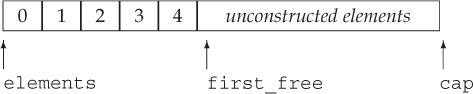

# Chapter 13. Copy Control

When we define a class, we specify—explicitly or implicitly—what happens when objects of that class type are copied, moved, assigned, and destroyed. 

* The copy and move constructors define what happens when an object is initialized from another object of the same type. 
* The copy- and move-assignment operators define what happens when we assign an object of a class type to another object of that same class type.
* The destructor defines what happens when an object of the type ceases to exist.

Collectively, we’ll refer to these operations as**<font color='blue'> copy control</font>**.

## 13.1. Copy, Assign, and Destroy

### 13.1.1. The Copy Constructor

A constructor is the copy constructor if its first parameter is a reference to the class type and any additional parameters have default values:

```c++
class Foo {
public:
	Foo(); 				// default constructor
	Foo(const Foo&); 	// copy constructor
	// ...
};
```

**<font color='red'>The first parameter of copy constructor must be a reference type.</font>** And it is almost always a reference to `const`.

#### The Synthesized Copy Constructor

When we do not define a copy constructor for a class, the compiler synthesizes one for us. The compiler copies each non`static` member in turn from the given object into the one being created.

Although we cannot directly copy an array, **<font color='red'>the synthesized copy constructor copies members of array type by copying each element.</font>** Elements of class type are copied by using the elements’ copy constructor.

#### Copy Initialization

```c++
string dots(10, '.'); 				// direct initialization
string s(dots); 					// direct initialization
string s2 = dots; 					// copy initialization
string null_book = "9-999-99999-9"; // copy initialization
string nines = string(100, '9'); 	// copy initialization
```

When we use **<font color='blue'>direct initialization</font>**, we are asking the compiler to use ordinary function matching to select the constructor that best matches the arguments we provide. When we use **<font color='blue'>copy initialization</font>**, we are asking the compiler to copy the right-hand operand into the object being created, converting that operand if necessary.

Copy initialization uses either the copy constructor or the move constructor.

Copy initialization happens not only when we define variables using an `=`, but also when we

* Pass an object as an argument to a parameter of nonreference type

  The fact that the copy constructor is used to initialize nonreference parameters of class type explains why the copy constructor’s own parameter must be a reference. If that parameter were not a reference, then the call would never succeed—to call the copy constructor, we’d need to use the copy constructor to copy the argument, but to copy the argument, we’d need to call the copy constructor, and so on indefinitely.

* Return an object from a function that has a nonreference return type

* Brace initialize the elements in an array or the members of an aggregate class

#### The Compiler Can Bypass the Copy Constructor

During copy initialization, the compiler is permitted (but not obligated) to skip the copy/move constructor and create the object directly. That is, the compiler is permitted to rewrite

```c++
string null_book = "9-999-99999-9"; // copy initialization
```

into

```c++
string null_book("9-999-99999-9");
```

### 13.1.2. The Copy-Assignment Operator

Just as a class controls how objects of that class are initialized, it also controls how objects of its class are assigned:

```c++
Sales_data trans, accum;
trans = accum; // uses the Sales_data copy-assignment operator
```

#### Introducing Overloaded Assignment

Overloaded operators are functions that have the name `operator` followed by the symbol for the operator being defined. Hence, the assignment operator is a function named `operator=`.

The parameters in an overloaded operator represent the operands of the operator. Some operators, assignment among them, must be defined as member functions.

**<font color='red'>When an operator is a member function, the left-hand operand is bound to the implicit `this` parameter. The right-hand operand in a binary operator, such as assignment, is passed as an explicit parameter.</font>**

The copy-assignment operator takes an argument of the same type as the class. To be consistent with assignment for the built-in types, assignment
operators usually return a reference to their left-hand operand.

```c++
class Foo{
public:
    Foo& operator=(const Foo&);	// assignment operator
};
```

#### The Synthesized Copy-Assignment Operator

The Synthesized Copy-Assignment Operator assigns each non`static` member of the right-hand object to the corresponding member of the left-hand object using the copy-assignment operator for the type of that member. Array members are assigned by assigning each element of the array.

### 13.1.3. The Destructor

Destructors do whatever work is needed to free the resources used by an object and destroy the non`static` data members of the object.

The destructor is a member function with the name of the class prefixed by a tilde (`~`). It has no return value and takes no parameters:

```c++
class Foo{
public:
    ~Foo();		// destructor
};
```

#### What a Destructor Does

Just as a constructor has an initialization part and a function body, **<font color='red'>a destructor has a function body and a destruction part</font>**. In a constructor, members are initialized before the function body is executed, and members are initialized in the same order as they appear in the class. **<font color='red'>In a destructor, the function body is executed first and then the members are destroyed.</font>** Members are destroyed in reverse order from the order in which they were initialized.

In a destructor, the destruction part is implicit. What happens when a member is destroyed depends on the type of the member. Members of class type are destroyed by running the member’s own destructor. The built-in types do not have destructors, so nothing is done to destroy members of built-in type.

#### When a Destructor Is Called

* Variables are destroyed when they go out of scope.
* Members of an object are destroyed when the object of which they are a part is destroyed.
* Elements in a container—whether a library container or an array—are destroyed when the container is destroyed.
* Dynamically allocated objects are destroyed when the `delete` operator is applied to a pointer to the object.
* **<font color='red'>Temporary objects are destroyed at the end of the full expression in which the temporary was created.</font>**

> The destructor is not run when a reference or a pointer to an object goes out of scope.

#### The Synthesized Destructor

The synthesized destructor has an empty function body. The members are automatically destroyed after the (empty) destructor body is run.

It is important to realize that the destructor body does not directly destroy the members themselves. **<font color='red'>Members are destroyed as part of the implicit destruction phase that follows the destructor body.</font>** 

### 13.1.4. The Rule of Three/Five 三/五法则

#### Classes That Need Destructors Need Copy and Assignment

Decide first whether the class needs a destructor. Often, the need for a destructor is more obvious than the need for the copy constructor or assignment operator. **<font color='red'>If the class needs a destructor, it almost surely needs a copy constructor and copy-assignment operator as well.</font>**

Consider the follow class:

```c++
class HasPtr{
public:
    HasPtr(const string &s = string()):
    		ps(new string(s)), i(0) {}
private:
    string *ps;
    int i;
};
```

This class allocates dynamic memory in its constructor. The synthesized destructor will not `delete` a data member that is a pointer. Therefore, this class
needs to define a destructor to free the memory allocated by its constructor:

```c++
class HasPtr{
public:
    HasPtr(const string &s = string()):
    		ps(new string(s)), i(0) { }
    ~HasPtr() { delete ps; }
private:
    string *ps;
    int i;
};
```

In this version of the class, we gave `HasPtr` a destructor but used the synthesized versions of the copy constructor and copy-assignment operator. Those
functions copy the pointer member, meaning that multiple `HasPtr` objects may be pointing to the same memory:

```c++
HasPtr f(HasPtr hp){
    HasPtr ret = hp;
    // process ret
    return ret;
}
```

When `f` returns, both `hp` and `ret` are destroyed and the `HasPtr` destructor is run on each of these objects. That destructor will `delete` the pointer member in `ret` and in `hp`. But these objects contain the same pointer value. This code will `delete` that pointer twice, which is an error.

In addition, the caller of `f` may still be using the object that was passed to `f`:

```c++
HasPtr p("some values");
f(p);
HasPtr q(p);
```

The memory to which `p` (and `q`) points is no longer valid. It was returned to the system when `hp` (or `ret`) was destroyed !

#### Classes That Need Copy Need Assignment, and Vice Versa

Some classes have work that needs to be done to copy or assign objects but has no need for the destructor.

As an example, consider a class that gives each object its own, unique serial number. Such a class would need a copy constructor to generate a new, distinct serial number for the object being created. That constructor would copy all the other data members from the given object.

This class would also need its own copy-assignment operator to avoid assigning to the serial number of the left-hand object. 

However, this class would have no need for a destructor.

### 13.1.5. Using `= default`

We can explicitly ask the compiler to generate the synthesized versions of the copy-control members by defining them as `= default`

```c++
class Sales_data{
public:
    Sales_data() = default;						// default constructor
    Sales_data(const Sales_data&) = default;	// copy constructor
    Sales_data& operator=(const Sales_data&);	// copy assignment operator
    ~Sales_data() = default;					// destructor
};
Sales_data& Sales_data::operator=(const Sales_data&) = default;
```

When we specify `= default` on the declaration of the member inside the class body, the synthesized function is implicitly `inline` (just as is any other member function defined in the body of the class).

**<font color='red'>If we do not want the synthesized member to be an `inline` function, we can specify `= default` on the member’s definition outside the class.</font>**

### 13.1.6. Preventing Copies

In some cases, there is no sensible meaning for defining a copy constructor and a copy-assignment operator. 

For example, The `iostream` classes prevent copying to avoid letting multiple objects write to or read from the same IO buffer. It might seem that we could prevent copies by not defining the copy-control members. However, this strategy doesn’t work: If our class doesn’t define these operations, the compiler will synthesize them.

#### Defining a Function as Deleted

Under the new standard, we can prevent copies by defining the copy constructor and copy-assignment operator as **<font color='blue'>deleted functions</font>**. 

A deleted function is one that is declared but may not be used in any other way. We indicate that we want to define a function as deleted by following its parameter list with `= delete`:

```c++
struct NoCopy{
  	NoCopy() = default;
    NoCopy(const Nocopy&) = delete;
    NoCopy& operator=(const NoCopy&) = delete;
    ~NoCopy() = default;
};
```

Unlike `= default`, `= delete` must appear on the first declaration of a deleted function. The compiler needs to know that a function is deleted in order to prohibit operations that attempt to use it.

Also unlike `= default`, we can specify `= delete` on any function. Although the primary use of deleted functions is to suppress the copy-control members, deleted functions are sometimes also useful when we want to guide the function-matching process.

#### The Destructor Should Not be a Deleted Member

If the destructor is deleted, then there is no way to destroy objects of that type. The compiler will not let us define variables or create temporaries of a type that has a deleted destructor. Moreover, we cannot define variables or temporaries of a class that has a member whose type has a deleted destructor.

#### The Copy-Control Members May Be Synthesized as Deleted

* The **<font color='blue'>synthesized destructor</font>** is defined as deleted if the class has a member whose own destructor is deleted or is inaccessible (e.g., `private`).
* The **<font color='blue'>synthesized copy constructor</font>** is defined as deleted if the class has a member whose own copy constructor is deleted or inaccessible. It is also deleted if the class has a member with a deleted or inaccessible destructor.
* The **<font color='blue'>synthesized copy-assignment operator</font>** is defined as deleted if a member has a deleted or inaccessible copy-assignment operator, or **<font color='red'>if the class has a `const` or reference member.</font>**
* The **<font color='blue'>synthesized default constructor</font>** is defined as deleted if the class has a member with a deleted or inaccessible destructor; or has a reference member that does not have an in-class initializer; or has a `const` member whose type does not explicitly define a default constructor and that
  member does not have an in-class initializer.

> In essence, the copy-control members are synthesized as deleted when it is impossible to copy, assign, or destroy a member of the class.

#### `private` Copy Control

Prior to the new standard, classes prevented copies by declaring their copy constructor and copy-assignment operator as `private`:

```c++
class PrivateCopy {
	// copy control is private and so is inaccessible to ordinary user code
	PrivateCopy(const PrivateCopy&);
	PrivateCopy &operator=(const PrivateCopy&);
	// other members
public:
	PrivateCopy() = default; // use the synthesized default constructor
	~PrivateCopy(); // users can define objects of this type but not copy them
};
```

Because the copy constructor and copy-assignment operator are `private`, user code will not be able to copy such objects. However, friends and members of the class can still make copies. To prevent copies by friends and members, **<font color='red'>we declare these members as `private` but do not define them. </font>**An attempt to use an undefined member results in a link-time failure.

By declaring (but not defining) a `private` copy constructor, we can forestall any attempt to copy an object of the class type: 

* User code that tries to make a copy will be flagged as an error at compile time
* Copies made in member functions or friends will result in an error at link time.

## 13.2. Copy Control and Resource Management

Ordinarily, classes that manage resources that do not reside in the class must define the copy-control members. In order to define these members, we first have to decide what copying an object of our type will mean. 

In general, we have two choices: We can define the copy operations to make the class behave like a value or like a pointer.

* Classes that behave like values have their own state. When we copy a valuelike object, the copy and the original are independent of each other. Changes made to the copy have no effect on the original, and vice versa.
* Classes that act like pointers share state. When we copy objects of such classes, the copy and the original use the same underlying data. Changes made to the copy also change the original, and vice versa.

To illustrate these two approaches, we’ll define the copy-control members for the `HasPtr` class. Our `HasPtr` class has two members, an `int` and a pointer to `string`. What we do when we copy the pointer member determines whether a class like `HasPtr` has valuelike or pointerlike behavior.

### 13.2.1. Classes That Act Like Values

To provide valuelike behavior, `HasPtr` object must have its own copy of the `string` to which `ps` points, which means it needs:

* A copy constructor that copies the `string`, not just the pointer
* A destructor to free the `string`
* A copy-assignment operator to free the object’s existing `string` and copy the `string` from its right-hand operand

```c++
class HasPtr {
public:
	HasPtr(const string &s = string()):
		ps(new string(s)), i(0){ }
	// each HasPtr has its own copy of the string to which ps points
	HasPtr(const HasPtr &rhs):
		ps(new string(*rhs.ps)), i(rhs.i) { }
	HasPtr& operator=(const HasPtr&);
	~HasPtr() { delete ps; }
private:
	string *ps;
	int i;
};
```

#### Valuelike Copy-Assignment Operator

**<font color='red'>Assignment operators typically combine the actions of the destructor and the copy constructor:</font>**

* Like the destructor, assignment destroys the left-hand operand’s resources.
* Like the copy constructor, assignment copies data from the right-hand operand.

However, it is crucially important that these actions be done in a sequence that is correct even if an object is **<font color='red'>assigned to itself</font>**.

In this case, we can handle self-assignment by first copying the right-hand side. After the copy is made, we’ll free the left-hand side and update the pointer to point to the newly allocated `string`:

```c++
HasPtr& HasPtr::operator=(const HasPtr &rhs) {
	auto newp = new string(*rhs.ps);		// copy the underlying string
	delete ps;								// free the old memory
	ps = newp;								// copy data from rhs into this object
	i = rhs.i;
	return *this;							// return this object
}
```

> There are two points to keep in mind when you write an assignment operator:
>
> * Assignment operators must work correctly if an object is **<font color='red'>assigned to itself</font>**.
>
> * Most assignment operators **<font color='red'>share work</font>** with the destructor and copy constructor.
>
> **<font color='red'>A good pattern to use when you write an assignment operator is:</font>**
>
> * First copy the right-hand operand into a local temporary. 
> * After the copy is done, it is safe to destroy the existing members of the left-hand operand. 
> * Once the left-hand operand is destroyed, copy the data from the temporary into the members of the left-hand operand.

To illustrate the importance of guarding against self-assignment, consider what would happen if we wrote the assignment operator as

```c++
// WRONG way to write an assignment operator!
HasPtr& HasPtr::operator=(const HasPtr &rhs)
{
	delete ps;
	ps = new string(*(rhs.ps));
	i = rhs.i;
	return *this;
}
```

If `rhs` and `this` object are the same object, deleting `ps` frees the `string` to which both `*this` and `rhs` point. When we attempt to copy `* (rhs.ps)` in the `new` expression, that pointer points to invalid memory. What happens is undefined.

### 13.2.2. Defining Classes That Act Like Pointers

For our `HasPtr` class to act like a pointer, we need the copy constructor and copy-assignment operator to copy the pointer member, not the `string` to which that pointer points.

Our class will still need its own destructor to free the memory allocated by the constructor that takes a `string`. And it can do so only when the last `HasPtr` pointing to that `string` goes away.

The easiest way to make a class act like a pointer is to use `shared_ptr`s to manage the resources in the class. However, sometimes we want to manage a resource directly. In such cases, it can be useful to use a **<font color='blue'>reference count</font>**

#### Reference Counts

Reference counting works as follows:

* Each constructor (other than the copy constructor) creates a counter and initialize the counter to 1.
* The copy constructor increments this shared counter, indicating that there is another user of that object’s state.
* The destructor decrements the counter. If the count goes to zero, the destructor deletes that state.
* The copy-assignment operator increments the right-hand operand’s counter and decrements the counter of the left-hand operand**. **If the counter for the left-hand operand goes to zero, the copyassignment operator must destroy the state of the left-hand operand.

The only wrinkle is deciding where to put the reference count. The counter cannot be a direct member of a `HasPtr` object. To see why, consider what happens in the following example:

```c++
HasPtr p1("Hiya!");
HasPtr p2(p1); // p1 and p2 point to the same string
HasPtr p3(p1); // p1, p2, and p3 all point to the same string
```

If the reference count is stored in each object, when p3 is created, we could increment the count in `p1` and copy that count into `p3`, but how would we update the counter in `p2`? One way to solve this problem is to **<font color='red'>store the counter in dynamic memory</font>**:

```c++
class HasPtr {
public:
	HasPtr(const string &s = string()):
		ps(new string(s)), i(0), counter(new size_t(1)){ }
	// each HasPtr has its own copy of the string to which ps points
	HasPtr(const HasPtr &rhs):
		ps(rhs.ps), i(rhs.i), counter(rhs.counter) { ++*counter; }
	HasPtr& operator=(const HasPtr&);
	~HasPtr();
private:
	size_t *counter;
	string *ps;
	int i;
};

HasPtr& HasPtr::operator=(const HasPtr &rhs) {
	++*rhs.counter;
	if (!(--*counter)) {
		delete ps;
		delete counter;
	}
	counter = rhs.counter;
	ps = rhs.ps;
	i = rhs.i;
	return *this;
}

HasPtr::~HasPtr() {
	if (!(--*counter)) {
		delete ps;
		delete counter;
	}
}
```

Note that, as usual, the copy-assignment operator must handle self-assignment. We do so by incrementing the count in `rhs` before decrementing the `count` in the left-hand object. That way if both objects are the same, the counter will have been incremented before we check to see if `ps` (and `counter`) should be deleted.

## 13.3. Swap

In addition to defining the copy-control members, classes that manage resources often also define a function named `swap`. Defining `swap` is particularly
important for classes that we plan to use with algorithms that reorder elements. Such algorithms call `swap` whenever they need to exchange two elements.

If a class defines its own `swap`, then the algorithm uses that class-specific version. Otherwise, it uses the `swap` function defined by the library. For example, code to swap two objects of our valuelike `HasPtr` class might look something like:

```c++
HasPtr temp = v1;
v1 = v2;
v2 = temp;
```

This code copies the `string` that was originally in `v1` twice. It also copies the `string` that was originally in `v2` when it assigns `v2` to `v1`. As we’ve seen, copying a valuelike `HasPtr` allocates a new `string`.

In principle, none of this memory allocation is necessary. Rather than allocating new copies of the `string`, we’d like `swap` to **<font color='red'>swap the pointers</font>**. That is, we’d like swapping two `HasPtr`s to execute as:

```c++
string *temp = v1.ps;
v1.ps = v2.ps;
v2.ps = temp;
```

#### Writing Our Own `swap` Function

We can override the default behavior of `swap` by defining a version of swap that operates on our class:

```c++
class HasPtr{
friend void swap(HasPtr &lhs, HasPtr &rhs);
    // other members as in 13.2.1
};
inline void swap(HasPtr &lhs, HasPtr &rhs){
    using std::swap;
    swap(lhs.ps, rhs.ps);	// swap the pointers, not the string data
    swap(lhs.i, rhs.i);		// swap the int members
}
```

#### `swap` Functions Should Call `swap`, Not `std::swap`

In the `HasPtr` function, the data members have built-in types. There is no type-specific version of `swap` for the built-in types. In this case, these calls will invoke the library `std::swap`.

However, if a class has a member that has its own type-specific `swap` function, calling `std::swap` would be a mistake. For example, assume we had another class named `Foo` that has a member named `h`, which has type `HasPtr`. If we did not write a `Foo` version of `swap`, then the library version of `swap` would be used. As we’ve already seen, the library `swap` makes unnecessary copies of the `string`s managed by `HasPtr`.

We can avoid these copies by writing a `swap` function for `Foo`. However, if we wrote the `Foo` version of `swap` as:

```c++
void swap(Foo &lhs, Foo &rhs)
{
	// WRONG: this function uses the library version of swap, not the HasPtr version
	std::swap(lhs.h, rhs.h);
	// swap other members of type Foo
}
```

this code would compile and execute. However, there would be no performance difference between this code and simply using the default version of `swap`. **<font color='red'>The problem is that we’ve explicitly requested the library version of `swap`.</font>** However, we don’t want the version in `std`; we want the one defined for `HasPtr` objects.

The right way to write this `swap` function is:

```c++
void swap(Foo &lhs, Foo &rhs)
{
	using std::swap;
	swap(lhs.h, rhs.h); 	// uses the HasPtr version of swap
	// swap other members of type Foo
}
```

Each call to `swap` must be unqualified. That is, each call should be to `swap`, not `std::swap`. For reasons we’ll explain in § 16.3, if there is a type-specific
version of `swap`, that version will be a better match than the one defined in `std`. As a result, if there is a type-specific version of `swap`, calls to `swap` will match that type-specific version. If there is no type-specific version, then—assuming there is a `using` declaration for `swap` in scope—calls to `swap` will use the version in `std`.

Very careful readers may wonder why the `using` declaration inside `swap` does not hide the declarations for the `HasPtr` version of `swap`. We’ll explain
the reasons for why this code works in § 18.2.3.

#### ⭐Using `swap` in Assignment Operators

Classes that define `swap` often use `swap` to define their assignment operator. These operators use a technique known as **<font color='blue'>copy and swap</font>**. This technique swaps the left-hand operand with **<font color='red'>a copy of</font>** the right-hand operand:

```c++
// note rhs is passed by value, which means the HasPtr copy constructor
// copies the string in the right-hand operand into rhs
HasPtr& operator=(HasPtr rhs){
    swap(*this, rhs);		// rhs now points to the memory this object had used
    return *this;			// rhs is destroyed, which deletes the pointer in rhs
}
```

1. Here we pass the right-hand operand **<font color='red'>by value</font>**. Thus, `rhs` is a copy of the right-hand operand. Copying a `HasPtr` allocates a new copy of that object’s `string`.
2. In the body of the assignment operator, we call `swap`, which swaps the data members of `rhs` with those in `*this`. This call puts the pointer that had been in the left-hand operand into `rhs`, and puts the pointer that was in `rhs` into `*this`. Thus, after the swap, the pointer member in `*this` points to the newly allocated `string` that is a copy of the right-hand operand.
3. When the assignment operator finishes, `rhs` is destroyed and the `HasPtr` destructor is run. That destructor deletes the memory to which `rhs` now points, thus freeing the memory to which the left-hand operand had pointed.

## ⭐13.5. Classes That Manage Dynamic Memory

Some classes need to allocate a varying amount of storage at run time. Such classes often can (and if they can, generally should) use a library container to hold their data. For example, our `StrBlob` class uses a `vector` to manage the underlying storage for its elements.

However, this strategy does not work for every class; some classes need to do their own allocation. As an example, we’ll implement a simplification of the library `vector` class. Our class will hold `string`s. Thus, we’ll call our class `StrVec`.

#### `StrVec` Class Design

Recall that the `vector` class stores its elements in contiguous storage. To obtain acceptable performance, `vector` **preallocates** enough storage to hold more elements than are needed. Each `vector` member that adds elements checks whether there is space available for another element. If so, the member **constructs** an object in the next available spot. If there isn’t space left, then the `vector` is **reallocated**: The vector obtains new space, moves the existing elements into that space, **frees the old space**, and **adds the new element**.

We’ll use a similar strategy in our `StrVec` class. We’ll use an `allocator` to obtain raw memory.

Each `StrVec` will have three pointers into the space it uses for its elements:

* `elements`, which points to the first element in the allocated memory
* `first_free`, which points just after the last actual element
* `cap`, which points just past the end of the allocated memory

 

In addition to these pointers, `StrVec` will have a member named `alloc` that is an `allocator<string>`.

Our class will also have four utility functions:

* `alloc_n_copy` will allocate space and copy a given range of elements.
* `free` will destroy the constructed elements and deallocate the space.
* `chk_n_alloc` will ensure that there is room to add at least one more element  to the `StrVec`. If there isn’t room for another element, `chk_n_alloc` will call `reallocate` to get more space.
* `reallocate` will reallocate the `StrVec` when it runs out of space.

#### `StrVec` Class Definition

Having sketched the implementation, we can now define our `StrVec` class:

```c++
class StrVec {
public:
	StrVec():	// the allocator member is default initialized
		elements(nullptr), first_free(nullptr), cap(nullptr) { }

	// copy control members
	StrVec(const StrVec&);				// copy construtor
	StrVec& operator=(const StrVec&);	// copy assignment
	~StrVec();							// destructor

	// operations
	size_t size() const { return first_free - elements; }
	size_t capacity() const { return cap - first_free; }
    void push_back(const string&);
	string *begin() const { return elements; }
	string *end() const { return first_free; }
private:
	pair<string*, string*> alloc_n_copy(const string*, const string*);
	void free();
	void chk_n_alloc() { if (size() == capacity()) reallocate(); }
	void reallocate();

	allocator<string> alloc;
	string * elements;
	string *first_free;
	string *cap;
};
```

#### Using `construct`

The `push_back` function calls `chk_n_alloc` to ensure that there is room for an element. If necessary, `chk_n_alloc` will call `reallocate`. When `chk_n_alloc` returns, `push_back` knows that there is room for the new element. It asks its `allocator` member to `construct` a new last element:

```c++
void StrVec::push_back(const string &s) {
	chk_n_alloc();							// ensure that there is room for another element
	alloc.construct(first_free++, s);		// construct a copy of s in the element to which first_free points
}	
```

#### The `alloc_n_copy` Member

The `alloc_n_copy` member is called when we copy or assign a `StrVec`. Our `StrVec` class, like `vector`, will have valuelike behavior; when we copy or assign a `StrVec`, we have to allocate independent memory and copy the elements from the original to the new `StrVec`.

The `alloc_n_copy` member will allocate enough storage to hold its given range of elements, and will copy those elements into the newly allocated space. This function returns a `pair` of pointers, pointing to the beginning of the new space and just past the last element it copied:

```c++
pair<string*, string*> StrVec::alloc_n_copy(const string *b, const string *e) {
	auto data = alloc.allocate(e - b);
	return { data, uninitialized_copy(b, e, data) };
}
```

#### The `free` Member

The `free` member has two responsibilities: It must destroy the elements and then deallocate the space that this `StrVec` itself allocated.

```c++
void StrVec::free() {
	if (elements) {
		for (auto p = first_free; p != elements; /* empty */)
			alloc.destroy(--p);
		alloc.deallocate(elements, cap - elements);
	}
}
```

The `for` loop calls the `allocator` member `destroy` **<font color='red'>in reverse order</font>**, starting with the last constructed element and finishing with the first. The `destroy` function runs the `string` destructor. Once the elements have been destroyed, we free the space that this `StrVec` allocated by calling `deallocate`.

#### Copy-Control Members

The copy constructor calls `alloc_n_copy`:

```c++
StrVec::StrVec(const StrVec &s) {
	// call alloc_n_copy to allocate exactly as many elements as in s
	auto newdata = alloc_n_copy(s.begin(), s.end());
	elements = newdata.first;
	first_free = cap = newdata.second;
}
```

The destructor calls `free`:

```c++
StrVec::~StrVec() {
	free();
}
```

The copy-assignment operator calls `alloc_n_copy` before freeing its existing elements. By doing so it protects against self-assignment:

```c++
StrVec& StrVec::operator=(const StrVec &rhs) {
	auto newdata = alloc_n_copy(rhs.begin(), rhs.end());
	free();
	elements = newdata.first;
	first_free = cap = newdata.second;
	return *this;
}
```

#### Moving, Not Copying, Elements during Reallocation

Before we write the `reallocate` member, we should think a bit about what it must do. This function will

* Allocate memory for a new, larger array of `string`s
* Construct the first part of that space to hold the existing elements
* Destroy the elements in the existing memory and deallocate that memory

We know that `string`s have valuelike behavior, so each `string` must have its own copy of the characters that make up that `string`. Copying a `string` must allocate memory for those characters, and destroying a `string` must free the memory used by that `string`.

In the `reallocate`, as soon as we copy the elements from the old space to the new, we will immediately destroy the original `string`s. Copying the data in these `string`s is unnecessary. Our `StrVec`’s performance will be much better if we can avoid the overhead of allocating and deallocating the `string`s themselves each time we reallocate.

#### Move Constructors and `std::move`

We can avoid copying the `string`s by using two facilities introduced by the new library:

* Move constructors

  Several of the library classes, including `string`, define so-called “move constructors.” Move constructors typically operate by “moving” resources from the given object to the object being constructed. For `string`, we can imagine that each `string` has a pointer to an array of `char`. Presumably the `string` move constructor **<font color='red'>copies the pointer rather than allocating space for and copying the characters themselves</font>**.

* A library function named `move`

  * When `reallocate` constructs the `string`s in the new memory it must call `move` to signal that it wants to use the `string` move constructor. If it omits the call to `move`, then the `string` copy constructor will be used.
  * We usually do not provide a `using` declaration for `move`. When we use `move`, we call `std::move`, not `move`.

#### The `reallocate` Member

```c++
void StrVec::reallocate() {
	// we'll allocate space for twice as many elements as the current size
	// If the StrVec is empty, we allocate room for one element
	auto newcapacity = size() ? size() * 2 : 1;
	// allocate new memory
	auto newdata = alloc.allocate(newcapacity);
	// move the data from the old memory to new
	auto dest = newdata;
	auto src = elements;
	for (size_t i = 0; i != size(); ++i)
		alloc.construct(dest++, std::move(*src++));
	// free the old space once we've moved the elements
	free();
	// upadate our data structure
	elements = newdata;
	first_free = dest;
	cap = newdata + newcapacity;
}
```

1. We start by calling `allocate` to allocate new space. We’ll double the capacity of the `StrVec` each time we `reallocate`. **<font color='red'>If the `StrVec` is empty, we allocate room for one element.</font>**

2. The `for` loop iterates through the existing elements and constructs a corresponding element in the new space. The second argument in the call to `construct` is the value returned by `move`. Calling `move` returns a result that causes `construct` to use the `string` move constructor.

3. After moving the elements, we call `free` to destroy the old elements and free the memory that this `StrVec` was using before the call to `reallocate`. 

4. What remains is to update the pointers to address the newly allocated and initialized array. 

## 13.6. Moving Objects

As we’ve just seen, during `reallocation` of our `StrVec` class, there is no need to copy—rather than move—the elements from the old memory to the new. A second reason to move rather than copy occurs in classes such as the IO or `unique_ptr` classes. These classes have a resource (such as a pointer or an IO buffer) that may not be shared. Hence, objects of these types can’t be copied but can be moved.

### 13.6.1. Rvalue References

An rvalue reference is a reference that must be bound to an rvalue. An rvalue reference is obtained by using `&&` rather than `&`. They may be bound only to an object that is about to be destroyed. As a result, we are free to “move” resources from an rvalue reference to another object.

Recall that lvalue and rvalue are properties of an expression. An lvalue expression refers to an object’s identity whereas an rvalue expression refers to an object’s value.

Like any reference, an rvalue reference is just another name for an object. As we know, we cannot bind regular references to expressions that require
a conversion, to literals, or to expressions that return an rvalue. We can bind an rvalue reference to these kinds of expressions, but we cannot directly bind an rvalue reference to an lvalue:

```c++
int i = 42;
int &r = i;					// ok: r refers to i
int &&r = i;				// error: cannot bind an rvalue reference to an lvalue
int &r2 = i * 42;			// error: i * 42 is an rvalue
const int &r3 = i * 42;		// ok: we can bind a reference to const to an rvalue
int &rr2 = i * 42;			// ok: bind rr2 to the result of the multiplication
```

#### Lvalues Persist; Rvalues Are Ephemeral

Lvalues have persistent state, whereas rvalues are either literals or temporary objects created in the course of evaluating expressions:

Because rvalue references can only be bound to temporaries, we know that

* The referred-to object is about to be destroyed
* There can be no other users of that object

Hence, we can “steal” state from an object bound to an rvalue reference.

#### Variables Are Lvalues

A variable is an expression with one operand and no operator. Like any other expression, a variable expression has the lvalue/rvalue property. Variable expressions are lvalues. Hence we cannot bind an rvalue reference to a variable defined as an rvalue reference type:

```c++
int &&rr1 = 42;		// ok: literals are rvalues
int &&rr2 = rr1;	// error: the expression rr1 is an lvalue!
```

#### ⭐The Library `move` Function

We can obtain an rvalue reference bound to an lvalue by calling a new library function named `move`. The `move` function uses facilities that we’ll describe in § 16.2.6 to return an rvalue reference to its given object:

```c++
int &&rr3 = std::move(rr1);		// ok
```

**<font color='red'>Calling move tells the compiler that we have an lvalue that we want to treat as if it were an rvalue.</font>** It is essential to realize that the call to `move` promises that we do not intend to use `rr1` again except to assign to it or to destroy it. After a call to `move`, we cannot make any assumptions about the value of the moved-from object.

> We can destroy a moved-from object and can assign a new value to it, but we cannot use the value of a moved-from object.
>
> Code that uses `move` should use `std::move`, not `move`. Doing so avoids potential name collisions.

### 13.6.2. Move Constructor and Move Assignment

To enable move operations for our own types, we define a move constructor and a move-assignment operator. These members are similar to the corresponding copy operations, but they “steal” resources from their given object rather than copy them.

#### Move Constructor

The move constructor has an initial parameter that is an rvalue reference to the class type. As in the copy constructor, any additional parameters must all have default arguments.

**<font color='red'>In addition to moving resources, the move constructor must ensure that the moved-from object is left in a state such that destroying that object will be harmless.</font>** In particular, once its resources are moved, **<font color='red'>the original object must no longer point to those moved resources</font>**—responsibility for those resources has been assumed by the newly created object.

```c++
StrVec::StrVec(const StrVec &&s) noexcept
    // member initializers take over the resources in s
    : elements(s.elements), first_free(s.first_free), cap(s.cap)
{
    // leave s in a state in which it is safe to run the destructor
	s.elements = s.first_free= s.cap = nullptr;        
}
```

Unlike the copy constructor, the move constructor does not allocate any new memory; it takes over the memory in the given `StrVec`. 

Having taken over the memory from its argument, the constructor body sets the pointers in the given object to `nullptr`. After an object is moved from, that object continues to exist. Eventually, the moved-from object will be destroyed, meaning that the destructor will be run on that object. The `StrVec` destructor calls `deallocate` on `first_free`. If we neglected to change `s.first_free`, then destroying the moved-from object would delete the memory we just moved.

#### Move Operations, Library Containers, and Exceptions

Because a move operation executes by “stealing” resources, it ordinarily does not itself allocate any resources. As a result, move operations ordinarily will not throw any exceptions.

When we write a move operation that cannot throw, we should inform the library of that fact. Otherwise it will do extra work to cater to the possibliity that moving an object of our class type might throw.

One way inform the library is to specify `noexcept` on our constructor. We specify `noexcept` on a function after its parameter list. In a constructor, `noexcept` appears between the parameter list and the `:` that begins the constructor initializer list. We must specify `noexcept` on both the declaration in the class header and on the definition if that definition appears outside the class:

```c++
class StrVec {
public:
    StrVec(StrVec&&) noexcept; // move constructor
	// other members as before
};

StrVec::StrVec(StrVec &&s) noexcept : /* member initializers */
{ /* constructor body */ }
```

The library containers provide guarantees as to what they do if an exception happens. As one example, `vector` guarantees that if an exception happens when we call `push_back`, the `vector` itself will be left unchanged.

`push_back` on a `vector` might require that the `vector` be reallocated. When a `vector` is reallocated, it moves the elements from its old space to new memory. As we’ve just seen, moving an object generally changes the value of the moved-from object. If reallocation uses a move constructor and that constructor throws an exception after moving some but not all of the elements, the moved-from elements in the old space would have been changed, and the unconstructed elements in the new space would not yet exist. In this case, `vector` would be unable to meet its requirement that the `vector` is left unchanged.

On the other hand, if `vector` uses the copy constructor and an exception happens, it can easily meet this requirement. If an exception happens, `vector` can free the space it allocated (but could not successfully construct) and return. The original vector elements still exist.

To avoid this potential problem, `vector` must use a copy constructor instead of a move constructor during reallocation unless it knows that the element type’s move constructor cannot throw an exception. 

**<font color='red'>If we want objects of our type to be moved rather than copied in circumstances such as `vector` reallocation, we must explicity tell the library that our move constructor is safe to use.</font>** We do so by marking the move constructor (and move-assignment operator) `noexcept`.

#### Move-Assignment Operator

The move-assignment operator does the same work as the destructor and the move constructor.

```c++
StrPtr& StrPtr::operator=(StrPtr &&rhs) noexcept{
    // direct test for self-assignment
    if(this != &rhs){
        // free existing elements
        free();		
        // take over resources from rhs
        elements = rhs.elements;
        first_free = rhs.first_free;
		cap = rhs.cap;
        // leave rhs in a destructible state
		rhs.elements = rhs.first_free = rhs.cap = nullptr;
    }
    return *this;
}
```

If the right- and left-hand operands doesn't refer to the same object:

* Free the memory that the left-hand operand had used
* Take over the memory from the given object. 
* As in the move constructor, set the pointers in `rhs` to `nullptr`.

#### A Moved-from Object Must Be Destructible and Valid

Moving from an object does not destroy that object: Sometime after the move operation completes, the moved-from object will be destroyed. Therefore, when we write a move operation, we must ensure that the moved-from object is in a state in which the destructor can be run.

In addition to leaving the moved-from object in a state that is safe to destroy,**<font color='red'> move operations must guarantee that the object remains valid</font>**----It can safely be given a new value or used in other ways that do not depend on its current value.

For example, when we move from a library `string` or container object, we know that the moved-from object remains valid. As a result, we can run operations such as `empty` or `size` on moved-from objects. However, we don’t know what result we’ll get. We might expect a moved-from object to be empty, but that is not guaranteed.

#### The Synthesized Move Operations

As it does for the copy constructor and copy-assignment operator, the compiler will synthesize the move constructor and move-assignment operator.

The compiler will synthesize a move constructor or a move-assignment operator only if the class doesn’t define any of its own copy-control members and if every non`static` data member of the class can be moved. The compiler can move members of **built-in type**. It can also move members of a class type if the member’s **class has the corresponding move operation**:

```c++
// the compiler will synthesize the move operations for X and hasX
struct X{
    int i;			// built-in types can be moved
    string s;		// string defines its own move operations
};
struct hasX{
    X mem;			// X has synthesized move operations
};
X x, x2 = std:::move(x);		// uses the synthesized move constructor
hasX hx, hx2 = std::move(hx);	// uses the synthesized move constructor
```

There is one final interaction between move operations and the synthesized copy-control members: **<font color='red'>If the class defines either a move constructor and/or a move-assignment operator, then the synthesized copy constructor and copy-assignment operator for that class will be defined as deleted.</font>**

 #### Rvalues Are Moved, Lvalues Are Copied ...

When a class has both a move constructor and a copy constructor, the compiler uses ordinary function matching to determine which constructor to use. Similarly for assignment. For example, in our `StrVec` class:

```c++
class StrVec{
public:
    StrVec(const StrVec&);
    StrVec(StrVec&&);
    StrVec& operator=(const StrVec&);
    StrVec& operator=(StrVec&&);
    ...
};
```

The copy versions take a reference to `const StrVec`. As a result, they can be used on any type that can be converted to `StrVec`. The move versions take a `StrVec&&` and can be used only when the argument is a (nonc`onst`) rvalue:

```c++
StrVec v1, v2;
v1 = v2; 					// v2 is an lvalue; copy assignment
StrVec getVec(istream &); 	// getVec returns an rvalue
v2 = getVec(cin); 			// getVec(cin) is an rvalue; move assignment
```

In the second assignment, we assign from an rvalue. In this case, both assignment operators are viable—we can bind the result of `getVec` to either operator’s parameter. Calling the copy-assignment operator requires a conversion to `const`, whereas `StrVec&&` is an exact match. Hence, the second assignment uses the move-assignment operator.

#### ...But Rvalues Are Copied If There Is No Move Constructor

If a class has a copy constructor but does not define a move constructor, the compiler will not synthesize the move constructor. In this case, the class
has a copy constructor but no move constructor. Function matching ensures that objects of that type are copied, even if we attempt to move them by calling `move`:

```c++
class Foo{
public:
    Foo() = default;
    Foo(const Foo&);
};
Foo x;
Foo y(x);				// copy constructor; x is an lvalue
Foo z(std::move(x));	// copy constructor, because there is no move constructor
```

The call to `move(x)` in the initialization of `z` returns a `Foo&&` bound to `x`. The copy constructor for `Foo` is viable because we can convert a `Foo&&` to a `const Foo&`. Thus, the initialization of `z` uses the copy constructor for `Foo`.

#### ⭐Copy-and-Swap Assignment Operators and Move

Recall the version of our `HasPtr` class that defined a copy-and-swap assignment operator. If we add a move constructor to this class, it will effectively get
a move assignment operator as well:

```c++
class HasPtr {
public:
    HasPtr(const HasPtr &rhs): ps(new string(*rhs.ps)), i(rhs.i) { }	// copy constructor
	HasPtr(HasPtr &&p) noexcept : ps(p.ps), i(p.i) {p.ps = 0;}			// move constructor
	// assignment operator is both the move- and copy-assignment operator
	HasPtr& operator=(HasPtr rhs){
        swap(*this, rhs);
        return *this;
    }
...
};
```

The assignment operator has a nonreference parameter, which means the parameter is copy initialized. Depending on the type of the argument, copy initialization uses either the copy constructor or the move constructor; lvalues are copied and rvalues are moved. 

As a result, this single assignment operator acts as both the copy-assignment and move-assignment operator:

```c++
hp = hp2;				// copy constructor used to copy hp2
hp = std::move(hp2);	// move constructor moves hp2
```

In the first assignment, the right-hand operand is an lvalue, the copy constructor will be used to initialize `rhs`. The copy constructor will allocate a new `string` and copy the `string` to which `hp2` points.

In the second assignment, we invoke `std::move` to bind an rvalue reference to `hp2`. The move constructor copies the pointer from `hp2`. It does not
allocate any memory.

#### Move Iterators

The `reallocate` member of `StrVec` used a `for` loop to call construct to copy the elements from the old memory to the new：

```c++
auto dest = alloc.allocate(newcapacity);
for (size_t i = 0; i != size(); ++i)
		alloc.construct(dest++, std::move(*src++));
```

As an alternative to writing that loop, it would be easier if we could call `uninitialized_copy` to construct the newly allocated space. However, `uninitialized_copy` does what it says: It **copies** the elements.

Instead, the new library defines a **<font color='blue'>move iterator</font>** adaptor. A move iterator adapts its given iterator by changing the behavior of the iterator’s dereference
operator: **<font color='red'>the dereference operator of a move iterator yields an rvalue reference.</font>**

We transform an ordinary iterator to a move iterator by calling the library `make_move_iterator` function：

```c++
auto dest = alloc.allocate(newcapacity);
uninitialized_copy(make_move_iterator(begin()), make_move_iterator(end()), first);
```

`uninitialized_copy` calls `construct` on each element in the input sequence to “copy” that element into the destination. That algorithm uses the iterator dereference operator to fetch elements from the input sequence. Because we passed move iterators, the dereference operator yields an rvalue reference, which means construct will use the move constructor to construct the elements.

### 13.6.3. Rvalue References and Member Functions

Member functions other than constructors and assignment can benefit from providing both copy and move versions. For example, the library containers that define `push_back` provide two versions:

```c++
void push_back(const X&);	// copy: binds to any kind of X
void push_back(X&&);		// move: binds only to modifiable rvalues of type X
```

Ordinarily, there is no need to define versions of the operation that take a `const X&&` or a (plain) `X&`:

*  Usually, we pass an rvalue reference when we want to “steal” from the argument. In order to do so, the argument must not be `const`. 
* Similarly, copying from an object should not change the object being copied. As a result, there is usually no need to define a version that take a (plain) `X&` parameter.

As a more concrete example, we’ll give our `StrVec` class a second version of `push_back`:

```c++
class StrVec {
public:
	void push_back(const std::string&); // copy the element
	void push_back(std::string&&); 		// move the element
    // other members as before
};
void StrVec::push_back(const string& s)
{
	chk_n_alloc();
	alloc.construct(first_free++, s);
}
void StrVec::push_back(string &&s)
{
	chk_n_alloc();
	alloc.construct(first_free++, std::move(s));
}
```

As we’ve seen, the `construct` function uses the type of its second and subsequent arguments to determine which constructor to use. Because `move` returns an rvalue reference, the type of the argument to `construct` is `string&&`. Therefore, the `string` move constructor will be used to construct a new last element.

#### Rvalue and Lvalue Reference Member Functions

Ordinarily, we can call a member function on an object, regardless of whether that object is an lvalue or an rvalue:

```c++
s1 + s2 = "wow!";
```

Here we assign to the rvalue result of concatentating these `string`s. such usage can be surprising.

In order to maintain backward compatability, the library classes continue to allow assignment to rvalues, However, we might want to prevent such usage in our own classes. **<font color='red'>In this case, we’d like to force the left-hand operand (i.e., the object to which `this` points) to be an lvalue.</font>**

We indicate the lvalue/rvalue property of `this` in the same way that we define `const` member functions; we place a reference qualifier after the
parameter list. The reference qualifier can be either `&` or `&&`, indicating that `this` may point to an rvalue or lvalue, respectively.:

```c++
class Foo{
public:
    Foo& operatpr=(const Foo&) &;	// may assign only to modifiable lvalues
    ...
};
Foo& Foo::operator=(const Foo &rhs) &{
    ...
    return *this;
}
```

We may run a function qualified by `&` only on an lvalue and may run a function qualified by `&&` only on an rvalue:

```c++
Foo &retFoo(); 		// returns a reference; a call to retFoo is an lvalue
Foo retVal(); 		// returns by value; a call to retVal is an rvalue
Foo i, j; 			// i and j are lvalues

i = j; 				// ok: i is an lvalue
retFoo() = j; 		// ok: retFoo() returns an lvalue
retVal() = j; 		// error: retVal() returns an rvalue
i = retVal(); 		// ok: we can pass an rvalue as the right-hand operand to assignment
```

A function can be both `const` and reference qualified. In such cases, the reference qualifier must follow the `const` qualifier:

```c++
class Foo{
public:
    Foo someMem() const &;	// may assign only to modifiable lvalues
    ...
};
```

#### Overloading and Reference Functions

Just as we can overload a member function based on whether it is `const`, we can also overload a function based on its reference qualifier:

```c++
class Foo {
public:
	Foo sorted() &&; 			// may run on modifiable rvalues
	Foo sorted() const &; 		// may run on lvalues
	// other members of Foo
private:
	vector<int> data;
};
```

Overload resolution uses the lvalue/rvalue property of the object that calls `sorted` to determine which version is used:

```c++
retVal().sorted(); 	// retVal() is an rvalue, calls Foo::sorted() &&
retFoo().sorted(); 	// retFoo() is an lvalue, calls Foo::sorted() const &
```

In overload member functions, if a member function has a reference qualifier, all the versions of that member with the same parameter list must have reference qualifiers:

```c++
class Foo {
public:
	Foo sorted() &&;
	Foo sorted() const; // error: must have reference qualifier
};
```

# Chapter 14. Overloaded Operations and Conversions

## 14.1. Basic Concepts

Overloaded operators are functions with special names: the keyword operator followed by the symbol for the operator being defined. 

An overloaded operator function has the same number of parameters as the operator has operands. A unary operator has one parameter; a binary operator has two:

* In a binary operator, the left-hand operand is passed to the first parameter and the right-hand operand to the second.

* **<font color='red'>If an operator function is a member function, the first (left-hand) operand is bound to the implicit this pointer.</font>** 

  Because the first operand is implicitly bound to `this`, **<font color='red'>a member operator function has one less (explicit) parameter than the operator has operands.</font>**

An operator function must either be a member of a class or have at least one parameter of class type:

```c++
// error: cannot redefine the built-in operator for ints
int operator+(int, int);
```

#### Calling an Overloaded Operator Function Directly

Ordinarily, we “call” an overloaded operator function indirectly by using the operator on arguments of the appropriate type. However, we can also call an overloaded operator function directly in the same way that we call an ordinary function:

```c++
// Both call the nonmember function operator+, passing data1 as the first argument and data2 as the second.
data1 + data2;
operator+(data1, data2);
```

We call a member operator function explicitly in the same way that we call any other member function:

```c++
data1 += data2;
data1.operator+=(data2);
```

Each of these statements calls the member function `operator+=`, binding `this` to the address of `data1` and passing `data2` as an argument.

#### Some Operators Shouldn’t Be Overloaded

Some operators guarantee the order in which operands are evaluated and support short-circuit evaluation. Because the overloaded versions of these operators do not preserve these properties, it is usually a bad idea to overload them.

Ordinarily, the comma, address-of, logical `AND`, and logical `OR` operators should not be overloaded.

#### Use Definitions That Are Consistent with the Built-in Meaning

Operator overloading is most useful when there is a logical mapping of a built-in operator to an operation on our type. Using overloaded operators
rather than inventing named operations can make our programs more natural and intuitive.

* If the class does IO, define the shift operators to be consistent with how IO is done for the built-in types.
* If the class has an operation to test for equality, define `operator==`. If the class has `operator==`, it should usually have `operator!=` as well.
* If the class has a single, natural ordering operation, define `operator<`. If the class has `operator<`, it should probably have all of the relational operators.
* The return type of an overloaded operator usually should be compatible with the return from the built-in version of the operator: 
  * The logical and relational operators should return `bool`
  * The arithmetic operators should return a value of the class type, and assignment and compound assignment should return a reference to the left-hand operand.

#### ⭐Choosing Member or Nonmember Implementation

The following guidelines can be of help in deciding whether to make an operator a member or an ordinary nonmember function:

* The assignment (`=`), subscript (`[]`), call (`()`), and member access arrow (`->`) operators must be defined as members.

* The compound-assignment operators ordinarily ought to be members. However, unlike assignment, they are not required to be members.

* Operators that change the state of their object or that are closely tied to their given type—such as increment, decrement, and dereference—usually should be members.

* **<font color='red'>Symmetric operators</font>**—those that might convert either operand, such as the arithmetic, equality, relational, and bitwise operators—usually should be defined as ordinary nonmember functions.

  Programmers expect to be able to use symmetric operators in expressions with mixed types. If we want to provide similar mixed-type expressions involving class objects, then the operator must be defined as a nonmember function.

  When we define an operator as a member function, then the left-hand operand must be an object of the class. For example:

  ```c++
  string s = "world";
  string t = s + "!";		// ok: we can add a const char* to a string
  string u = "hi" + s;	// would be an error if + were a member of string
  ```

  If `operator+` were a member of the `string` class, `"hi" + s` would be equivalent to `"hi".operator+(s)`. However, the type of `"hi"` is `const char*`, and that is a built-in type; it does not even have member functions.

  On the other hand, because `string` defines `+` as an ordinary nonmember function, `"hi" + s` is equivalent to `operator+("hi", s)`. As with any function call, either of the arguments can be converted to the type of the parameter. The only requirements are that at least one of the operands has a class type, and that both operands can be converted (unambiguously) to `string`.

## 14.2. Input and Output Operators

As we’ve seen, the IO library uses `>>` and `<<` for input and output, respectively. The IO library itself defines versions of these operators to read and write the built-in types. Classes that support IO ordinarily define versions of these operators for objects of the class type.

### 14.2.1. Overloading the Output Operator `<<`

1. Ordinarily, the first parameter of an output operator is a reference to a non`const` `ostream` object. The `ostream` is non`const` because writing to the stream changes its state. The parameter is a reference because we cannot copy an `ostream` object.

2. The second parameter ordinarily should be a reference to `const` of the class type we want to print.

3. To be consistent with other output operators, `operator<<` normally returns its `ostream` parameter.

#### The `Sales_data` Output Operator

```c++
ostream &operator<<(ostream &os, const Sales_data &item) {
	os << item.isbn() << " " << item.units_sold << " "
		<< item.revenue << " " << item.avg_price();
	return os;
}
```

#### Output Operators Usually Do Minimal Formatting

The output operators for the built-in types do little if any formatting. In particular, they do not print newlines. Users expect class output operators to behave similarly. An output operator that does minimal formatting lets users control the details of their output.

#### IO Operators Must Be Nonmember Functions

 If IO operators were member functions, then the left-hand operand would have to be an object of our class type:

```c++
Sales_data data;
data << cout;
```

If these operators are members of any class, they would have to be members of `istream` or `ostream`. However, those classes are part of the standard library, and we cannot add members to a class in the library.

### 14.2.2. Overloading the Input Operator `>>`

Ordinarily the first parameter of an input operator is a reference to the stream from which it is to read, and the second parameter is a reference to the (non`const`) object into which to read.

The operator usually returns a reference to its given stream.

#### The `Sales_data` Input Operator

```c++
istream &operator>>(istream &is, Sales_data &item){
	double price = 0;
	is >> item.bookNo >> item.units_sold >> price;
	if (is)
		item.revenue = item.units_sold * price;
	else
		item = Sales_data();	// input failed: give the object the default state
	return is;
}
```

If an IO error occurs, the operator resets its given object to the empty `Sales_data`. That way, the object is guaranteed to be in a consistent state.

**<font color='red'>Input operators must deal with the possibility that the input might fail</font>**; output operators generally don’t bother.

#### Errors during Input

Rather than checking each read, we check once after reading all the data and before using those data.

Putting the object into a valid state is especially important if the object might have been partially changed before the error occurred. For example, in this input operator, we might encounter an error after successfully reading a new `bookNo`. An error after reading `bookNo` would mean that the `units_sold` and `revenue` members of the old object were unchanged. The effect would be to associate a different `bookNo` with those data.

#### Indicating Errors

Some input operators need to do additional data verification. For example, our input operator might check that the `bookNo` we read is in an appropriate format. In such cases, the input operator might need to set the stream’s condition state to indicate failure, even though technically speaking the actual IO was successful.

Usually an input operator should set only the `failbit`. Setting `eofbit` would imply that the file was exhausted, and setting `badbit` would indicate that the stream was corrupted. These errors are best left to the IO library itself to indicate.

## 14.3. Arithmetic and Relational Operators

1. Ordinarily, we define the arithmetic and relational operators as nonmember functions in order to allow conversions for either the left- or right-hand operand.

2. These operators shouldn’t need to change the state of either operand, so the parameters are ordinarily references to `const`.

3. An arithmetic operator usually generates a new value that is the result of a computation on its two operands. That value is distinct from either operand and is calculated in a **local variabl**e. The operation returns a copy of this local as its result.

4. Classes that define an arithmetic operator generally define the corresponding compound assignment operator as well. When a class has both operators, it is usually more efficient to define the arithmetic operator to use compound assignment:

   ```c++
   Sales_data operator+(const Sales_data &lhs, const Sales_data &rhs){
       Sales_data sum = lhs;
       sum += rhs;
       return sum;
   }
   ```

### 14.3.1. Equality Operators

Ordinarily, classes in C++ define the equality operator to test whether two objects are equivalent. That is, they usually compare every data member and treat two objects as equal if and only if all the corresponding members are equal.

1. If a class defines `operator==`, it should also define `operator!=`. Users will expect that if they can use `==` then they can also use `!=`, and vice versa.
2. One of the equality or inequality operators should delegate the work to the other. That is, one of these operators should do the real work to compare objects. The other should call the one that does the real work.

```c++
bool operator==(const Sales_data &lhs, const Sales_data &rhs) {
	return lhs.isbn() == rhs.isbn()
		&& lhs.units_sold == rhs.units_sold
		&& lhs.revenue == rhs.revenue;
}

bool operator!=(const Sales_data &lhs, const Sales_data &rhs) {
	return !(lhs == rhs);
}
```

### 14.3.2. Relational Operators

Ordinarily the relational operators should

1. Define an ordering relation that is consistent with the requirements for use as a key to an associative container
2. Define a relation that is consistent with `==` if the class has both operators. In particular, if two objects are `!=`, then one object should be `<` the other.

If the class also has `==`, define `<` only if the definitions of `<` and `==` yield consistent results. For example, the `Sales_data` `==` operator treats two transactions with the same `ISBN` as unequal if they have different `revenue` or `units_sold` members. If we defined the `<` operator to compare only the `ISBN` member, then two objects with the same `ISBN` but different `units_sold` or `revenue` would compare as unequal, but neither object would be less than the other. 

## 14.4. Assignment Operators

In addition to the copy- and move-assignment operators that assign one object of the class type to another object of the same type, a class can define additional assignment operators that allow other types as the right-hand operand.

As one example, the library `vector` class defines a assignment operator that takes a braced list of elements：

```c++
vector<string> v;
v = {"a", "an", "the"};
```

We can add this operator to our `StrVec` class as well:

```c++
StrVec& StrVec::operator=(initializer_list<string> il) {
	auto newdata = alloc_n_copy(il.begin(), il.end());
	free();
	elements = newdata.first;
	first_free = cap = newdata.second;
	return *this;
}
```

#### Compound-Assignment Operators

Compound assignment operators are not required to be members. However, we prefer to define all assignments, including compound assignments, in the class.

For consistency with the built-in compound assignment, these operators should return a reference to their left-hand operand:

```c++
Sales_data& Sales_data::operator+=(const Sales_data &rhs){
    units_sold += rhs.units_sold;
    revenue += rhs.revenue;
    return *this;
}
```

## 14.5. Subscript Operator

1. Classes that represent containers from which elements can be retrieved by position often define the subscript operator, `operator[]`.

2. The subscript operator must be a member function.

3. To be compatible with the ordinary meaning of subscript, the subscript operator usually returns a reference to the element that is fetched.

4. If a class has a subscript operator, **<font color='red'>it usually should define two versions: one that returns a plain reference and the other that is a `const` member and returns a reference to `const`.</font>**

```c++
class StrVec{
public:
    string& operator[](size_t n){ return elements[n]; }
	const string& operator[](size_t n) const{ return elements[n]; }
    ...
};
```

## 14.6. Increment and Decrement Operators

1. There is no language requirement that these operators be members of the class. However, because these operators change the state of the object on which they operate, our preference is to make them members.
2. We can define both the prefix and postfix instances of these operators for our own classes as well.

#### Defining Prefix Increment/Decrement Operators

To be consistent with the built-in operators, the prefix operators should return a reference to the incremented or decremented object.

We’ll define these operators for our `StrBlobPtr` class (§ 12.1.6):

```c++
class StrBlobPtr{
public:
    StrBlobPtr& operator++();
    StrBlobPtr& operator--();
    ...
};

StrBlobPtr& StrBlobPtr::operator++()
{
	// if curr already points past the end of the container, can't increment it
	check(curr, "increment past end of StrBlobPtr");
	++curr; // advance the current state
	return *this;
}
StrBlobPtr& StrBlobPtr::operator--()
{
	// if curr is zero, decrementing it will yield an invalid subscript
	--curr; // move the current state back one element
	check(curr, "decrement past begin of StrBlobPtr");
	return *this;
}
```

The decrement operator decrements `curr` before calling `check`. That way, if `curr`(which is an unsigned number) is already zero, the value that we pass to `check` will be a large positive value representing an invalid subscript.

#### Differentiating Prefix and Postfix Operators

To distinguish a postfix function from the prefix version, **<font color='red'>the postfix versions take an extra (unused) parameter of type `int`</font>**. When we use a postfix operator, the compiler supplies 0 as the argument for this parameter. Although the postfix function can use this extra parameter, it usually should not.

To be consistent with the built-in operators, **<font color='red'>the postfix operators should return the old (unincremented or undecremented) value. That value is returned as a value, not a reference.</font>** Thus the postfix versions have to remember the current state of the object before incrementing the object.

When implement the postfix operator, it should call its own prefix version to do the actual work:

```c++
class StrBlobPtr{
public:
    // postfix operators
    StrBlobPtr operator++(int);
    StrBlobPtr operator--(int);
};

StrBlobPtr StrBlobPtr::operator++(int){
    auto ret = *this;
    ++*this;
    return ret;
}
StrBlobPtr StrBlobPtr::operator--(int){
    auto ret = *this;
    --*this;
    return ret;
}
```

#### Calling the Postfix Operators Explicitly

 If we want to call the postfix version using a function call, then we must pass a value for the integer argument:

```c++
StrBlobPtr ptr;
ptr.operator++(0);	// call postfix operator++
ptr.operator++();	// call prefix operator++
```

