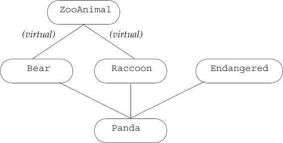

# Chapter 17. Specialized Library Facilities

## 17.1. The `tuple` Type

A `tuple` is a template that is similar to a `pair`.  Each `pair` type has different types for its members, but every pair always has exactly two members. A `tuple` also has members whose types vary from one `tuple` type to another, but a `tuple` can have any number of members. Each distinct `tuple` type has a fixed number of members, but the number of members in one `tuple` type can differ from the number of members in another.

A `tuple` is most useful when we want to combine some data into a single object but do not want to bother to define a data structure to represent those data.

 

### 17.1.1. Defining and Initializing `tuple`s

When we define a `tuple`, we name the type(s) of each of its members:

```c++
tuple<size_t, size_t, size_t> threeD;		// all three members set to 0
tuple<string, vector<double>, int, list<int>> someVal("consttants", {3.14, 2.718}, 
                                                     	42, {0, 1, 2, 3, 4, 5});
```

When we create a `tuple` object, we can use the default tuple constructor, which value initializes each member, or we can supply an initializer for each member as we do in the initialization of `someVal`. This `tuple` constructor is `explicit`, so we must use the direct initialization syntax.

Alternatively, similar to the `make_pair` function, the library defines a `make_tuple` function that generates a `tuple` object:

```c++
auto item = make_tuple("0-999-78345-X", 3, 20.00);
```

Like `make_pair`, the `make_tuple` function uses the types of the supplied initializers to infer the type of the `tuple`. In this case, `item` is a `tuple` whose type is `tuple<const char*, int, double>`.

#### Accessing the Members of a tuple

We access the members of a `tuple` through a library function template named `get`. 

To use `get` we must specify an explicit template argument, which is the position of the member we want to access. We pass a `tuple` object to `get`, which returns a reference to the specified member:

```c++
auto book = get<0>(item);			// returns the first member of item
auto cnt = get<1>(item); 			// returns the second member of item
auto price = get<2>(item)/cnt; 		// returns the last member of item
```

#### Relational and Equality Operators

The `tuple` relational and equality operators behave similarly to the corresponding operations on containers. These operators execute pairwise on the members of the left-hand and right-hand `tuple`s.

We can compare two `tuple`s only if they have the same number of members.

Moreover, to use the equality or inequality operators, it must be legal to compare each pair of members using the `==` operator;
to use the relational operators, it must be legal to use `<`.

```c++
tuple<string, string> duo("1", "2");
tuple<size_t, size_t> twoD(1, 2);
bool b = (duo == twoD); 	// error: can't compare a size_t and a string
tuple<size_t, size_t, size_t> threeD(1, 2, 3);
b = (twoD < threeD); 		// error: differing number of members
tuple<size_t, size_t> origin(0, 0);
b = (origin < twoD); 		// ok: b is true
```

### 17.1.2. Using a `tuple` to Return Multiple Values

**<font color='red'>A common use of `tuple` is to return multiple values from a function.</font>**

## 17.2. The `bitset` Type

The standard library defines the `bitset` class to make it easier to use bit operations and possible to deal with collections of bits that are larger than the longest integral type.

### 17.2.1. Defining and Initializing `bitset`s

The bitset class is a class template that, like the `array` class, has a fixed size. **<font color='red'>When we define a `bitset`, we must say how many bits the `bitset` will contain:</font>**

```c++
bitset<32> bitvec(1U);	// 32 bits; low-order bit is 1, remaining bits are 0
```

#### Initializing a `bitset` from an unsigned Value

When we use an integral value as an initializer for a `bitset`, that value is converted to `unsigned long long` and is treated as a bit pattern. The bits in the `bitset` are a copy of that pattern.

#### Initializing a `bitset` from a `string`

We can initialize a `bitset` from either a `string` or a pointer to an element in a character array. In either case, **<font color='red'>the characters represent the bit pattern directly</font>**:

```c++
bitset<32> bitvec4("1100"); // bits 2 and 3 are 1, all others are 0
```

We need not use the entire `string` as the initial value for the `bitset`. Instead, we can use a substring as the initializer:

```c++
string str("1111111000000011001101");
bitset<32> bitvec5(str, 5, 4); 			// four bits starting at str[5], 1100
bitset<32> bitvec6(str, str.size()-4); 	// use last four characters
```

### 17.2.2. Operations on `bitset`s

 

The `bitset` class also supports the bitwise operators that we covered in § 4.8. The operators have the same meaning when applied to `bitset` objects as the built-in operators have when applied to unsigned operands.

#### `bitset` IO Operators

The input operator **reads characters from the input stream into a temporary object of type `string`.** It reads until it has read as many characters as the size of the corresponding `bitset`, or it encounters a character other than 1 or 0, or it encounters end-of-file or an input error. **The `bitset` is then initialized from that temporary `string`.**

The output operator prints the bit pattern in a `bitset` object

## 17.3. Regular Expressions

A regular expression is a way of describing a sequence of characters. We’ll focus on how to use the C++ regular-expression library (RE library), which is part of the new library. The RE library, which is defined in the `regex` header, involves several components:

 

## 17.4. Random Numbers

The random-number library, defined in the `random` header, generates random numbers through a set of cooperating classes: **random-number engines** and **random-number distribution** classes.

 

C++ programs should not use the library `rand` function. Instead, they should use the `default_random_engine` along with an appropriate distribution object.

### 17.4.1. Random-Number Engines and Distribution

The random-number engines are function-object classes that define a call operator that takes no arguments and returns a random `unsigned` number.

```c++
default_random_engine e;
for(size_t i = 0; i < 10; ++i)
    cout << e() << " ";
```

Random Number Engine Operations:

 

For most purposes, the output of an engine is not directly usable. The problem is that the numbers usually span a range that differs from the one we need. Correctly transforming the range of a random number is surprisingly hard.

#### Distribution Types and Engines

To get a number in a specified range, we use an object of a distribution type:

```c++
// uniformly distributed from 0 to 9 inclusive
uniform_int_distribution<unsigned> u(0,9);
default_random_engine e; // generates unsigned random integers
for (size_t i = 0; i < 10; ++i)
	// u uses e as a source of numbers
	// each call returns a uniformly distributed value in the specified range
	cout << u(e) << " ";
```

Like the engine types, the distribution types are also function-object classes. The distribution types define a call operator that takes a random-number engine as its argument.

Note that we pass the engine object itself, `u(e)`. Had we written the call as `u(e())`, we would have tried to pass the next value generated by `e` to `u`, which would be a compile-time error.

#### Comparing Random Engines and the `rand` Function

Prior to the new standard, both C and C++ relied on a simple C library function named `rand`. That function produces pseudorandom integers that are uniformly distributed in the range from 0 to a system-dependent maximum value that is at least 32767.

The output of calling a `default_random_engine` object is similar to the output of `rand`. Engines deliver unsigned integers in a system-defined range. The range for `rand` is 0 to `RAND_MAX`.

#### Engines Generate a Sequence of Numbers

Random number generators have one property that often confuses new users: **<font color='red'>Even though the numbers that are generated appear to be random, a given generator returns the same sequence of numbers each time it is run.</font>**

**<font color='red'>As a result, a function with a local random-number generator should make that generator (both the engine and distribution objects) `static`. </font>**Otherwise, the function will generate the identical sequence on each call：

```c++
vector<unsigned> good_randVec(){
    static default_random_engine e;
    static uniform_int_distribution<unsigned> u(0, 9);
    vector<unsigned> ret;
    for(size_t i = 0; i < 100; ++i)
        ret.push_back(u(e));
    return ret;
}
// v1 and v2 have different values
vector<unsigned> v1(good_randVec());
vector<unsigned> v2(good_randVec());
```

Had we written `e` and `u` non`static`, `v1` and `v2` would have the same values.

#### Seeding a Generator

The fact that a generator returns the same sequence of numbers is helpful during debugging. However, once our program is tested, we often want to cause each run of the program to generate different random results. We do so by providing a **<font color='blue'>seed</font>**.

**<font color='red'>A seed is a value that an engine can use to cause it to start generating numbers at a new point in its sequence.</font>**

```c++
default_random_engine e1; 					// uses the default seed
default_random_engine e2(2147483646); 		// use the given seed value
default_random_engine e3; 					// uses the default seed value
e3.seed(32767); 							// call seed to set a new seed value
default_random_engine e4(32767); 			// set the seed value to 32767
```

Here we define four engines. The first two, `e1` and `e2`, have different seeds and should generate different sequences. The second two, `e3` and `e4`, have the same seed value. These two objects will generate the same sequence.

Picking a good seed is surprisingly hard. **<font color='red'>Perhaps the most common approach is to call the system `time` function.</font>** 

This function, defined in the `ctime` header, returns the number of seconds since a given epoch. The `time` function takes a single parameter that is a pointer to a structure into which to write the `time`. If that pointer is `null`, the function just returns the time:

```c++
default_ramdom_engine e(time(0));
```

### 17.4.2. Other Kinds of Distributions

#### Generating Random Real Numbers

Programs often need a source of random floating-point values. In particular, programs frequently need random numbers between zero and one.

The most common, but incorrect, way to obtain a random floating-point from `rand` is to divide the result of r`and()` by `RAND_MAX`. This technique is incorrect because random integers usually have less precision than floating-point numbers, in
which case there are some floating-point values that will never be produced as output.

With the new library facilities, we can easily obtain a floating-point random number. We define an object of type `uniform_real_distribution`:

```c++
default_random_engine e;
uniform_real_distribution<double> u(0, 1);
cout << u(e) << endl;
```

## 17.5. The IO Library Revisited

In this section we’ll look at three of the more specialized features that the IO library supports: format control, unformatted IO, and random access.

### 17.5.1. Formatted Input and Output

In addition to its condition state, each `iostream` object also maintains a **format state** that controls the details of how IO is formatted.

The library defines a set of **<font color='blue'>manipulators 操纵符 </font>** that modify the format state of a stream. A manipulator is a function or object that affects the state of a stream. Like the input and output operators, a manipulator returns the stream object to which it is applied, so we can combine manipulators and data in a single statement.

Our programs have already used one manipulator, `endl`, which we “write” to an output stream as if it were a value. **<font color='red'>But `endl` isn’t an ordinary value; instead, it performs an operation: It writes a newline and flushes the buffer.</font>**

#### Many Manipulators Change the Format State

Most of the manipulators that change the format state provide set/unset pairs; one manipulator sets the format state to a new value and the other unsets it, restoring the normal default formatting.

Manipulators that change the format state of the stream usually leave the format state changed for all subsequent IO. It is usually best to undo whatever state changes are made as soon as those changes are no longer needed.

#### Controlling the Format of Boolean Values

By default, `bool` values print as `1` or `0`. We can override this formatting by applying the `boolalpha` manipulator to the stream:

```c++
cout << boolalpha << true << " " << false << endl;
```

Once we “write” `boolalpha` on `cout`, we’ve changed how `cout` will print `bool` values from this point on. Subsequent operations that print `bool`s will print them as either `true` or `false`.

To undo the format state change to `cout`, we apply `noboolalpha`:

```c++
bool bool_val = get_status();
cout << boolalpha 			// sets the internal state of cout
		<< bool_val
		<< noboolalpha; 	// resets the internal state to default formatting
```

#### Specifying the Base for Integral Values

By default, integral values are written and read in decimal notation. We can change the notational base to octal or hexadecimal or back to decimal by using the manipulators `hex`, `oct`, and `dec`:

```c++
cout << "default: " << 20 << " " << 1024 << endl;
cout << "octal: " << oct << 20 << " " << 1024 << endl;
cout << "hex: " << hex << 20 << " " << 1024 << endl;
cout << "decimal: " << dec << 20 << " " << 1024 << endl;
```

#### Indicating Base on the Output

If we need to print octal or hexadecimal values, it is likely that we should also use the `showbase` manipulator. The `showbase` manipulator causes the output stream to use the same conventions as used for specifying the base of an integral constant:

* A leading 0x indicates hexadecimal.
* A leading 0 indicates octal.
* The absence of either indicates decimal.

```c++
cout << showbase; 											// show the base when printing integral values
cout << "default: " << 20 << " " << 1024 << endl;			// default: 20 1024
cout << "in octal: " << oct << 20 << " " << 1024 << endl;	// in octal: 024 02000
cout << "in hex: " << hex << 20 << " " << 1024 << endl;		// in hex: 0x14 0x400s
cout << noshowbase; 										// reset the state of the stream
```

#### Controlling the Format of Floating-Point Values

We can control three aspects of floating-point output:

* How many digits of precision are printed
* Whether the number is printed in hexadecimal, fixed decimal, or scientific notation
* Whether a decimal point is printed for floating-point values that are whole numbers

1. **Specifying How Much Precision to Print**

   We can change the precision by calling the `precision` member of an IO object or by using the `setprecision` manipulator. 

   * The `precision` member is overloaded. One version takes an `int` value and sets the precision to that new value. It returns the previous precision value. The other version takes no arguments and returns the current precision value. 
   * The `setprecision` manipulator takes an argument, which it uses to set the precision.

   **<font color='red'>By default, precision specifies the total number of digits—both before and after the decimal point.</font>**

   ```c++
   cout << sqrt(2.0) << endl;		// 1.41421
   
   cout.precison(12);
   cout << sqrt(2.0) << endl;		// 1.41421356237
   
   cout << setprecison(3);
   cout << sqrt(2.0) << endl;		// 1.41
   ```

2. **Specifying the Notation of Floating-Point Numbers**

   By default, floating-point values are printed in either fixed decimal or scientific notation depending on the value of the number. The library chooses a format that enhances readability of the number. Very large and very small values are printed using scientific notation. Other values are printed in fixed decimal.

   We can force a stream to use scientific, fixed, or hexadecimal notation by using the appropriate manipulator. The `scientific` manipulator changes the stream to use scientific notation. The `fixed` manipulator changes the stream to use fixed decimal.

   ```c++
   cout << 100 * sqrt(2.0) << endl;				// 141.421
   cout << scientific << 100 * sqrt(2.0) << endl;	// 1.414214e+002
   ```

3. **Printing the Decimal Point**

   By default, when the fractional part of a floating-point value is 0, the decimal point is not displayed. The `showpoint` manipulator forces the decimal point to be printed:

   ```c++
   cout << 10.0 << endl; 		// prints 10
   cout << showpoint << 10.0 	// prints 10.0000
   << noshowpoint << endl; 	// revert to default format for the decimal points
   ```

#### Padding the Output 输出补白

The library provides several manipulators to help us accomplish the control we might need:

* `setw` to specify the minimum space for the next numeric or `string` value.
* `left` to left-justify the output.
* `right` to right-justify the output. Output is right-justified by default.
* `internal` controls placement of the sign on negative values. `internal` left-justifies the sign and right-justifies the value, padding any intervening space with blanks.
* `setfill` lets us specify an alternative character to use to pad the output. By default, the value is a space.

> **<font color='red'>`setw`, like `endl`, does not change the internal state of the output stream. It determines the size of only the next output.</font>**

```c++
int i = -16;
double d = 3.14159;
// pad the first column to use a minimum of 12 positions in the output
cout << "i: " << setw(12) << i << "next col" << '\n'
		<< "d: " << setw(12) << d << "next col" << '\n';
// pad the first column and left-justify all columns
cout << left
		<< "i: " << setw(12) << i << "next col" << '\n'
		<< "d: " << setw(12) << d << "next col" << '\n'
// pad the first column and right-justify all columns
cout << right
		<< "i: " << setw(12) << i << "next col" << '\n'
		<< "d: " << setw(12) << d << "next col" << '\n';
// pad the first column but put the padding internal to the field
cout << internal
		<< "i: " << setw(12) << i << "next col" << '\n'
		<< "d: " << setw(12) << d << "next col" << '\n';
```

When executed, this program generates

 

#### Controlling Input Formatting

By default, the input operators ignore whitespace (blank, tab, newline, formfeed, and carriage return). The `noskipws` manipulator causes the input operator to read, rather than skip, whitespace. To return to the default behavior, we apply the `skipws` manipulator:

```c++
cin >> noskipws; // set cin so that it reads whitespace
while (cin >> ch)
    cout << ch;
cin >> skipws;
```

given the input sequence

```c++
a b  c
d
```

this loop makes seven iterations, reading whitespace as well as the characters in the input. This loop generates:
```c++
a b  c
d
```

### 17.5.2. Unformatted Input/Output Operations

The library also provides a set of low-level operations that support unformatted IO. These operations let us deal with a stream as **a sequence of uninterpreted bytes**.

#### Single-Byte Operations

Several of the unformatted operations deal with a stream **<font color='red'>one byte at a time</font>**. These operations read rather than ignore whitespace.

 

#### Putting Back onto an Input Stream

Sometimes we need to read a character in order to know that we aren’t ready for it. In such cases, we’d like to put the character back onto the stream. The library gives us three ways to do so:

* `peek` returns a copy of the next character on the input stream but does not change the stream. The value returned by `peek` stays on the stream.
* `unget` backs up the input stream so that whatever value was last returned is still on the stream.
* `putback` is a more specialized version of `unget`: It returns the last value read from the stream but takes an argument that must be the same as the one that was last read.

#### `int` Return Values from Input Operations

The `peek` function and the version of `get` that takes no argument return a character from the input stream as an `int`. The reason that these functions return an `int` is to allow them to return an end-of-file marker. These functions convert the character they return to `unsigned char` and then promote that value to `int`. 

**<font color='red'>It is essential that we use an `int` to hold the return from these functions:</font>**

```c++
int ch; // use an int, not a char to hold the return from get()
// loop to read and write all the data in the input
while ((ch = cin.get()) != EOF)
	cout.put(ch);
```

### 17.5.3. Random Access to a Stream

The various stream types generally support random access to the data in their associated stream. We can reposition the stream so that it skips around, reading first the last line, then the first, and so on. 

The library provides a pair of functions to seek to a given location and to tell the current location in the associated stream.

#### Seek and Tell Functions

`istream` and `ostream` types usually do not support random access, the remainder of this section should be considered as applicable to only the `fstream` and `sstream` types.

 

To support random access, the IO types maintain a **marker** that determines where the next read or write will happen. They also provide two functions: One repositions the marker by seeking to a given position; the second tells us the current position of the
marker. 

The library actually defines two pairs of seek and tell functions.. One pair is used by input streams, the other by output streams. The input and output versions are distinguished by a suffix that is either a `g` or a `p`. The `g` versions indicate that we are “getting” (reading) data, and the `p` functions indicate that we are “putting” (writing) data.

#### There Is Only One Marker

The fact that the library distinguishes between the “putting” and “getting” versions of the seek and tell functions can be misleading. Even though the library makes this distinction, it maintains only a single marker in a stream—there is not a distinct read marker and write marker.

**<font color='red'>Because there is only a single marker, we must do a seek to reposition the marker whenever we switch between reading and writing.</font>**

#### Repositioning the Marker

There are two versions of the seek functions: One moves to an “absolute” address within the file; the other moves to a byte offset from a given position:
```c++
// set the marker to a fixed position
seekg(new_position); // set the read marker to the given pos_type location
seekp(new_position); // set the write marker to the given pos_type location
// offset some distance ahead of or behind the given starting point
seekg(offset, from); // set the read marker offset distance from from
seekp(offset, from); // offset has type off_type
```

#### Accessing the Marker

The `tellg` or `tellp` functions return a `pos_type` value denoting the current position of the stream. The tell functions are usually used to remember a location so that we can subsequently seek back to it:

```c++
ostringstream writeStr;
auto mark = writeStr.tellp();
// ...
if(cancelEntry)
    // return to the remembered position
    writeStr.seekp(mark);
```

#### Reading and Writing to the Same File

Let’s look at a programming example. Assume we are given a file to read. We are to write a newline at the end of the file that contains the relative position at which each line begins. For example, given the following file,

```tex
abcd
efg
hi
j
```

the program should produce the following modified file:

```tex
abcd
efg
hi
j
5 9 12 14
```

1. Note that our program need not write the offset for the first line—it always occurs at position 0. 

2. Also note that the offset counts must include the invisible newline character that ends each line. 

3. Finally, note that the last number in the output is the offset for the line on which our output begins. 

```c++
int main()
{
	// open for input and output and preposition file pointers to end-of-file
	fstream inOut("copyOut", fstream::ate | fstream::in | fstream::out);
	if (!inOut) {
		cerr << "Unable to open file!" << endl;
		return EXIT_FAILURE;
	}
	// inOut is opened in ate mode, so it starts out positioned at the end
	auto end_mark = inOut.tellg();				// remember original end-of-file position
	inOut.seekg(0, fstream::beg); 				// reposition to the start of the file
	size_t cnt = 0; 							// accumulator for the byte count
	string line; 								// hold each line of input
	while (inOut && inOut.tellg() != end_mark && getline(inOut, line)) {
		cnt += line.size() + 1; 				// add 1 to account for the newline
		auto mark = inOut.tellg(); 				// remember the read position
		inOut.seekp(0, fstream::end); 			// set the write marker to the end
		inOut << cnt;	 						// write the accumulated length
		if (mark != end_mark)					// print a separator if this is not the last line
            inOut << " ";
		inOut.seekg(mark); 						// restore the read position
	}
	inOut.seekp(0, fstream::end); 				// seek to the end
	inOut << "\n"; 								// write a newline at end-offile
	return 0;
}
```

# Chapter 18. Tools for Large Programs

## 18.1. Exception Handling

Exceptions let us separate problem detection from problem resolution. One part of the program can detect a problem and can pass the job of resolving that problem to another part of the program. The detecting part need not know anything about the handling part, and vice versa.

### 18.1.1. Throwing an Exception

In C++, an exception is raised by **<font color='blue'>throwing an expression</font>**. The type and contents of that object allow the throwing part of the program to inform the handling part about what went wrong.

When a `throw` is executed, the statement(s) following the `throw` are not executed. Instead, control is transferred from the `throw` to the matching `catch`.

Because the statements following a `throw` are not executed, a `throw` is like a `return`: It is usually part of a conditional statement or is the last (or only) statement in a function.

#### Stack Unwinding 栈展开

When an exception is thrown, execution of the current function is suspended and the search for a matching `catch` clause begins. If the `throw` appears inside a `try` block, the catch clauses associated with that `try` are examined:

* If a matching `catch` is found, the exception is handled by that `catch`. 
* Otherwise, if the `try` was itself nested inside another `try`, the search continues through the `catch` clauses of the enclosing `try`s. If no matching `catch` is found, the current function is exited, and the search continues in the calling function.

If the call to the function that threw is in a `try` block, then the `catch` clauses associated with that `try` are examined:

* If a matching `catch` is found, the exception is handled. 
* Otherwise, if that `try` was nested, the `catch` clauses of the enclosing `try`s are searched. If no `catch` is found, the calling function is also exited. 

The search continues in the function that called the just exited one, and so on.

This process, known as **<font color='blue'>stack unwinding</font>**, continues up the chain of nested function calls until a catch clause for the exception is found, or the main function itself is exited without having found a matching `catch`.

Assuming a matching `catch` is found, that `catch` is entered. **<font color='red'>When the `catch` completes, execution continues at the point immediately after the last `catch` clause associated with that `try` block.</font>**

If no matching `catch` is found, the program calls the library `terminate` function. As its name implies, `terminate` stops execution of the program.

#### Objects Are Automatically Destroyed during Stack Unwinding

When a block is exited during stack unwinding, the compiler guarantees that objects created in that block are properly destroyed. If a local object is of class type, the destructor for that object is called automatically. As usual, the compiler does no work to destroy objects of built-in type.

#### Destructors and Exceptions

The fact that destructors are run during stack unwinding affects how we write destructors:

 During stack unwinding, an exception has been raised but is not yet handled.**<font color='red'> If a new exception is thrown during stack unwinding and not caught in the function that threw it, `terminate` is called.</font>** 

Because destructors may be invoked during stack unwinding, they should never throw exceptions that the destructor itself does not handle. That is,**<font color='red'> if a destructor does an operation that might throw, it should wrap that operation in a `try` block and handle it locally to the destructor.</font>**

#### The Exception Object

The compiler uses the thrown expression to copy initialize a special object known as the exception object. As a result, the expression in a `throw` must have a complete type.

The exception object resides in space, managed by the compiler, that is guaranteed to be accessible to whatever `catch` is invoked. The exception object is destroyed after the exception is completely handled.

When we throw an expression, the static, compile-time type of that expression determines the type of the exception object. If a `throw` expression dereferences a pointer to a base-class type, and that pointer points to a derived-type object, then the thrown object is sliced down only the base-class part is thrown.

### 18.1.2. Catching an Exception

The **<font color='blue'>exception declaration</font>** in a `catch` clause looks like a function parameter list with exactly one parameter. As in a parameter list, we can omit the name of the `catch` parameter if the `catch` has no need to access the thrown expression.

When a `catch` is entered, the parameter in its exception declaration is initialized by the exception object. Also like a function parameter, a `catch` parameter that has a base-class type can be initialized by an exception object that has a type derived from the parameter type：

* If the `catch` parameter has a nonreference type, then the exception object will be sliced down.
* On the other hand, if the parameter is a reference to a base-class type, then the parameter is bound to the exception object in the usual way

**<font color='red'>Ordinarily, a `catch` that takes an exception of a type related by inheritance ought to define its parameter as a reference.</font>**

#### Finding a Matching Handler

During the search for a matching `catch`, the `catch` that is found is not necessarily the one that matches the exception best. Instead, the selected `catch` is **the first one** that matches the exception at all. Thus programs that use exceptions from an inheritance hierarchy must order their `catch` clauses so that **<font color='red'>handlers for a derived type occur before a `catch` for its base type.</font>**

#### Rethrow

A `catch` passes its exception out to another `catch` by **<font color='blue'>rethrowing</font>** the exception. A rethrow is a `throw` that is not followed by an
expression:

```c++
throw;
```

A rethrow does not specify an expression; the (current) exception object is passed up the chain.

**<font color='red'>In general, a `catch` might change the contents of its parameter. If, after changing its parameter, the `catch` rethrows the exception, then those changes will be propagated only if the `catch`’s exception declaration is a reference</font>**：

```c++
catch (my_error &eObj) { 				// specifier is a reference type
	eObj.status = errCodes::severeErr; 	// modifies the exception object
	throw; 								// the status member of the exception object is severeErr
} catch (other_error eObj) { 			// specifier is a nonreference type
	eObj.status = errCodes::badErr; 	// modifies the local copy only
	throw; 								// the status member of the exception object is unchanged
}
```

#### The Catch-All Handler

To catch all exceptions, we use an ellipsis for the exception declaration. Such handlers, sometimes known as catch-all handlers, have the form `catch(...)`

A `catch(...)` is often used in combination with a `rethrow` expression. The `catch` does whatever local work can be done and then rethrows the exception:

```c++
void manip() {
	try {
		// actions that cause an exception to be thrown
	}
	catch (...) {
		// work to partially handle the exception
		throw;
	}
}
```

### 18.1.3. Function `try` Blocks and Constructors

An exception might occur while processing a **constructor initializer**. Constructor initializers execute before the constructor body is entered. A `catch` inside the constructor body can’t handle an exception thrown by a constructor initializer. To handle an exception from a constructor initializer, we must write the constructor as a **<font color='blue'>function `try` block</font>**.

As an example, we might wrap the `Blob` constructors in a function `try` block:

```c++
template <typename T>
Blob<T>::Blob(initializer_list<T> il) try :
				data(make_shared<vector<T>>(il)){
	/* empty function body */                    
}
catch(const bad_alloc &e){
    handle_out_of_memory(e);
}
```

Notice that the keyword `try` appears before the colon that begins the constructor initializer list and before the curly brace that forms the (in this case empty) constructor function body.

The `catch` associated with this `try` can be used to handle exceptions thrown either from within the member initialization list or from within the constructor body.

### 18.1.4. The `noexcept` Exception Specification

Under the new standard, a function can specify that it does not throw exceptions by providing a `noexcept` specification:

```c++
void recoup(int) noexcept; // won't throw
void alloc(int); // might throw
```

The `noexcept` specifier must appear on all of the declarations and the corresponding definition of a function or on none of them.

In a member function the `noexcept` specifier follows any `const` or `reference` qualifiers, and it precedes `final`, `override`, or   `= 0` on a virtual function.

#### Violating the Exception Specification

It is important to understand that the compiler does not check the `noexcept` specification at compile time. As a result, it is possible that a function that claims it will not throw will in fact throw:

```c++
// this function will compile, even though it clearly violates its exception specification
void f() noexcept 		// promises not to throw any exception
{
	throw exception(); 	// violates the exception specification
}
```

If a `noexcept` function does throw, `terminate` is called.

#### Arguments to the `noexcept` Specification

The `noexcept` specifier takes an optional argument that must be convertible to `bool`: 

* If the argument is `true`, then the function won’t throw
* If the argument is `false`, then the function might throw

```c++
void recoup(int) noexcept(true); // recoup won't throw
void alloc(int) noexcept(false); // alloc can throw
```

#### The `noexcept` Operator

The `noexcept` operator is a unary operator that returns a `bool` rvalue constant expression that indicates whether a given expression might throw:

```c++
noexcept(recoup(i)) // true if calling recoup can't throw, false otherwise
```

We can use the `noexcept` operator to form an exception specifier as follows:

```c++
void f() noexcept(noexcept(g()));	// f has same exception specifier as g
```

#### Exception Specifications and Pointers, Virtuals, and Copy Control

1. If we declare a function pointer that has a nonthrowing exception specification, we can use that pointer only to point to nonthrowing functions. A pointer that specifies (explicitly or implicitly) that it might throw can point to any function.

   ```c++
   // both recoup and pf1 promise not to throw
   void (*pf1)(int) noexcept = recoup;
   // ok: recoup won't throw; it doesn't matter that pf2 might
   void (*pf2)(int) = recoup;
   
   pf1 = alloc; // error: alloc might throw but pf1 said it wouldn't
   pf2 = alloc; // ok: both pf2 and alloc might throw
   ```

2. If a virtual function includes a promise not to throw, the inherited virtuals must also promise not to throw. On the other hand, if the base allows exceptions, it is okay for the derived functions to be more restrictive and promise not to throw

3. When the compiler synthesizes the copy-control members, it generates an exception specification for the synthesized member. If all the corresponding operation for all the members and base classes promise not to throw, then the synthesized member is `noexcept`.

### ⭐18.1.5. Exception Class Hierarchies

The standard-library exception classes form the inheritance hierarchy：

 

The only operations that the `exception` types define are the copy constructor, copy-assignment operator, a virtual destructor, and a virtual member named `what`.

The `exception`, `bad_cast`, and `bad_alloc` classes also define a default constructor. The `runtime_error` and `logic_error` classes do not have a default constructor but do have constructors that take a C-style character string or a library `string` argument.

#### Exception Classes for a Bookstore Application

Applications often extend the `exception` hierarchy by defining classes derived from `exception` (or from one of the library classes derived from `exception`).

If we were building a real bookstore application, we probably would have defined our own hierarchy of exceptions to represent application-specific problems：

```c++
class out_of_stock : public runtime_error{
public:
    explicit out_of_stock(const string &s): runtime_error(s) { }
};
class isbn_mismatch: public logic_error {
public:
	explicit isbn_mismatch(const string &s): logic_error(s) { }
	isbn_mismatch(const string &s, const string &lhs, const string &rhs):
						logic_error(s), left(lhs), right(rhs) { }
	const string left, right;
};
```

Our application-specific exception types inherit them from the standard `exception` classes. As with any hierarchy, we can think of the `exception` classes as being organized into layers. As the hierarchy becomes deeper, each layer becomes a more specific exception.

#### Using Our Own Exception Types

We use our own exception classes in the same way that we use one of the standard library classes.

```c++
// throws an exception if both objects do not refer to the same book
Sales_data& Sales_data::operator+=(const Sales_data &rhs){
    if(isbn() != rhs.isbn())
        throw isbn_mismatch("wrong isbns", isbn(), rhs.isbn());
    units_sold += rhs.units_sold;
	revenue += rhs.revenue;
	return *this;
}
```

Code that uses the compound addition operator can detect this error, write an appropriate error message, and continue:

```c++
Sales_data item1, item2, sum;
while (cin >> item1 >> item2) { 	// read two transactions
	try {
		sum = item1 + item2; // calculate their sum
		// use sum
	} catch (const isbn_mismatch &e) {
		cerr << e.what() << ": left isbn(" << e.left
				<< ") right isbn(" << e.right << ")" << endl;
	}
}
```

## 18.2. Namespaces

### 18.2.1. Namespace Definitions

A namespace definition begins with the keyword `namespace` followed by the namespace name.

Namespaces may be defined at global scope or inside another namespace. They may not be defined inside a function or a class.

A namespace scope does not end with a semicolon.

```c++
namespace cplusplus_primer {
	class Sales_data { / * ... * /};
	Sales_data operator+(const Sales_data&, const Sales_data&);
	class Query { /* ... */ };
	class Query_base { /* ... */};
} // like blocks, namespaces do not end with a semicolon
```

#### Each Namespace Is a Scope

Names defined in a namespace may be accessed directly by other members of the namespace, including scopes nested within those members. Code outside the namespace must indicate the namespace in which the name is defined:

```c++
cplusplus_primer::Query q = cplusplus_primer::Query("hello");
```

#### ⭐Namespaces Can Be Discontiguous

Unlike other scopes, a namespace can be defined in several parts. Writing a namespace definition:

```c++
namespace nsp {
	// declarations
}
```

either defines a new namespace named `nsp` or adds to an existing one.

The fact that namespace definitions can be discontiguous lets us compose a namespace from separate interface and implementation files：

* Namespace members that define classes, and declarations for the functions and objects that are part of the class interface, can be put into header files. 
* The definitions of namespace members can be put in separate source files.

#### Defining the Primer Namespace

Using this strategy for separating interface and implementation, we might define the `cplusplus_primer` library in several separate files：

```c++
// ---- Sales_data.h----
// #includes should appear before opening the namespace
#include <string>
namespace cplusplus_primer {
	class Sales_data { /* ... */};
	Sales_data operator+(const Sales_data&, const Sales_data&);
	// declarations for the remaining functions in the Sales_data interface
}

// ---- Sales_data.cc----
// be sure any #includes appear before opening the namespace
#include "Sales_data.h"
namespace cplusplus_primer {
	// definitions for Sales_data members and overloaded operators
}
```

A program using our library would include whichever headers it needed. The names in those headers are defined inside the `cplusplus_primer` namespace:

```c++
// ---- user.cc----
// names in the Sales_data.h header are in the cplusplus_primer namespace
#include "Sales_data.h"
int main()
{
	using cplusplus_primer::Sales_data;
	Sales_data trans1, trans2;
	// ...
	return 0;
}
```

It is worth noting that ordinarily, we do not put a `#include` inside the namespace. If we did, we would be attempting to define all the names in that header as members of the enclosing namespace.

#### Template Specializations

**<font color='red'>Template specializations must be defined in the same namespace that contains the original template. </font>**As with any other namespace name, so long as we have declared the specialization inside the namespace, we can define it outside the namespace:

```c++
// we must declare the specialization as a member of std
namespace std{
    template <> struct hash<Sales_data>;
}
// having added the declaration for the specialization to std
// we can define the specialization outside the std namespace
template <> struct std::hashs<Sales_data>{
	size_t operator()(const Sales_data& s) const{
        return hash<string>()(s.bookNo) ^
				hash<unsigned>()(s.units_sold) ^
				hash<double>()(s.revenue);
    }
	// other members as before  
};
```

#### The Global Namespace

Names defined at global scope (i.e., names declared outside any class, function, or namespace) are defined inside the global namespace. The global namespace is implicitly declared and exists in every program. Each file that defines entities at global
scope (implicitly) adds those names to the global namespace.

The scope operator can be used to refer to members of the global namespace. Because the global namespace is implicit, it does not have a name; the notation

```c++
::member_name
```

refers to a member of the global namespace.

#### Nested Namespaces

A nested namespace is a namespace defined inside another namespace. 

Nested namespace names follow the normal rules: Names declared in an inner namespace hide declarations of the same name in an outer namespace:

```c++
namespace cplusplus_primer {
	// first nested namespace: defines the Query portion of the library
	namespace QueryLib {
		class Query { /* ... */ };
		Query operator&(const Query&, const Query&);
		// ...
	}
	// second nested namespace: defines the Sales_data portion of the library
	namespace Bookstore {
		class Quote { /* ... */ };
		class Disc_quote : public Quote { /* ... */ };
		// ...
	}
}
```

**<font color='red'>Code in the outer parts of the enclosing namespace may refer to a name in a nested namespace only through its qualified name:</font>**

```c++
cplusplus_primer::QueryLib::Query
```

#### Inline Namespaces

The new standard introduced a new kind of nested namespace, an inline namespace. Unlike ordinary nested namespaces, names in an inline namespace can be used as if they were direct members of the enclosing namespace.

We need not qualify names from an inline namespace by their namespace name. We can access them using only the name of the enclosing namespace:

```c++
namespace cplusplus_primer {
	inline namespace FifthEd {
		class Query_base { /* ... */ };
		// other Query-related declarations
	}
	namespace FourthEd {
		class Item_base { /* ... */};
		class Query_base { /* ... */};
		// other code from the Fourth Edition
	}
}
```

Because `FifthEd` is inline, code that refers to `cplusplus_primer::` will get the version from that namespace. If we want the earlier edition code, we can access it as we would any other nested namespace, by using the names of all the enclosing
namespaces: for example, `cplusplus_primer::FourthEd::Query_base`.

#### Unnamed Namespaces

An unnamed namespace is the keyword `namespace` followed immediately by a block of declarations delimited by curly braces. Variables defined in an unnamed namespace have static lifetime: They are created before their first use and destroyed when the program ends.

An unnamed namespace may be discontiguous within a given file but does not span files. Each file has its own unnamed namespace. **<font color='red'>If two files contain unnamed namespaces, those namespaces are unrelated.</font>**

Names defined in an unnamed namespace are used directly; after all, there is no namespace name with which to qualify them.

Names defined in an unnamed namespace are in the same scope as the scope at which the namespace is defined. If an unnamed namespace is defined at the outermost scope in the file, then names in the unnamed namespace must differ from names defined at global scope:

```c++
int i; // global declaration for i
namespace {
	int i;
}
// ambiguous: defined globally and in an unnested, unnamed namespace
i = 10;
```

### 18.2.2. Using Namespace Members

Referring to namespace members as `namespace_name::member_name` is admittedly cumbersome, especially if the namespace name is long.

#### Namespace Aliases

A **<font color='blue'>namespace alias</font>** can be used to associate a shorter synonym with a namespace name. For example, a long namespace name such as

```c++
namespace cplusplus_primer { /* ... */ };
```

can be associated with a shorter synonym as follows:

```c++
namespace primer = cplusplus_primer;
```

#### `using` Declarations: A Recap

A `using` declaration introduces only one namespace member at a time. It allows us to be very specific regarding which names are used in our programs:

```c++
using std::string;
using std::cin;
using std::endl;
```

Entities with the same name defined in an outer scope are hidden.

#### `using` Directives （using 指示）

A `using` directive, like a `using` declaration, allows us to use the unqualified form of a namespace name. Unlike a `using` declaration, we retain no control over which names are made visible—they all are.

A `using` directive begins with the keyword `using`, followed by the keyword `namespace`, followed by a namespace name:

```c++
using namespace std;
```

A `using` directive may appear in global, local, or namespace scope. It may not appear in a class scope.

These directives make all the names from a specific namespace visible without qualification. The short form names can be used from the point of the `using` directive to the end of the scope in which the `using` directive appears.

#### `using` Directives and Scope

As we’ve seen, a `using` declaration puts the name in the same scope as that of the `using` declaration itself. It is as if the `using` declaration declares a local alias for the namespace member.

A `using` directive does not declare local aliases. Rather, it has the effect of lifting the namespace members into the nearest scope that contains both the namespace itself and the `using` directive. （它具有将命名空间成员提升到包含命名空间本身和 using 指示的最近作用域的能力）:

```c++
// namespace A and function f are defined at global scope
namespace A {
	int i, j;
}
void f()
{
	using namespace A; // injects the names from A into the global scope
	cout << i * j << endl; // uses i and j from namespace A
	// ...
}
```

#### Headers and `using` Declarations or Directives

A header that has a `using` directive or declaration at its top-level scope injects names into every file that includes the header. **<font color='red'>As a result, header files should not contain `using` directives or `using` declarations except inside functions or namespaces.</font>**

### ⭐18.2.3. Classes, Namespaces, and Scope

#### Argument-Dependent Lookup and Parameters of Class Type 

Consider the following simple program:

```c++
std::string s;
std::cin >> s;
```

As we know, this call is equivalent to:

```c++
operator>>(std::cin, s);
```

This `operator>>` function is defined by the `string` library, which in turn is defined in the `std` namespace. Yet we can we call `operator>>` without an `std::` qualifier and without a `using` declaration.

**<font color='red'>When we pass an object of a class type to a function, the compiler searches the namespace in which the argument’s class is defined in addition to the normal scope lookup</font>**. This exception also applies for calls that pass pointers or references to a class type.

In this example, when the compiler sees the “call” to `operator>>`, it looks for a matching function in the current scope, including the scopes enclosing the output statement. In addition, because the `>>` expression has parameters of class type, the compiler also looks in the namespace(s) in which the types of `cin` and `s` are defined. Thus, for this call, the compiler looks in the `std` namespace, which defines the `istream` and `string` types. When it searches `std`, the compiler finds the string output operator function.

#### Lookup and `std::move` and `std::forward`

Now consider the library `move` and `forward` functions. Both of these functions are template functions, and the library defines versions of them that have a single rvalue reference function parameter. As we’ve seen, in a function template, an rvalue reference parameter can match any type. If our application defines a function named `move` that takes a single parameter, then—no matter what type the parameter has—the application’s version of `move` will collide with the library version. Similarly for `forward`.

As a result, name collisions with `move` (and `forward`) are more likely than collisions with other library functions. In addition, because `move` and `forward` do very specialized type manipulations, the chances that an application specifically wants to override the behavior of these functions are pretty small.

This fact explains why we suggest always using the fully qualified versions of these names. So long as we write `std::move` rather than `move`, we know that we will get the version from the standard library.

#### Lookup and `std::swap`

 

 


 

 

### 18.2.4. Overloading and Namespaces

Namespaces have two impacts on function matching. One of these should be obvious: A `using` declaration or directive can add functions to the
candidate set. The other is much more subtle.

#### Argument-Dependent Lookup and Overloading

Each namespace that defines a class used as an function argument (and those that define its base classes) is searched for candidate functions. Any functions in those namespaces that have the same name as the called function are added to the candidate set. These functions are added even though they otherwise are not visible at the point of the call:

```c++
namespace NS{
    class Quote { /* */ };
    void display(const Quote&) { /* */ }
}
class Bulk_item : public NS::Quote { /* */ };
int main(){
    Bulk_item book1;
    display(book1);
    
    return 0;
}
```

The argument we passed to `display` has class type `Bulk_item`. The candidate functions for the call to `display` are not only the functions with declarations that are in scope where `display` is called, but also the functions in the namespace where `Bulk_item` and its base class, `Quote`, are declared. The function `display(const Quote&)` declared in namespace `NS` is added to the set of candidate functions.

#### Overloading and `using` Declarations

To understand the interaction between `using` declarations and overloading, it is important to remember that a `using` declaration declares a name, not a specific function:

```c++
using NS::print(int); // error: cannot specify a parameter list
using NS::print; // ok: using declarations specify names only
```

When we write a `using` declaration for a function, all the versions of that function are brought into the current scope.

If the `using` declaration introduces a function in a scope that already has a function of the same name with the same parameter list, then the `using` declaration is in error. Otherwise, the `using` declaration defines additional overloaded instances of the given name.

#### Overloading and `using` Directives

A `using` directive lifts the namespace members into the enclosing scope. If a namespace function has the same name as a function declared in the scope at which the namespace is placed, then the namespace member is added to the overload set:

```c++
namespace libs_R_us {
	extern void print(int);
	extern void print(double);
}
// ordinary declaration
void print(const std::string &);
// this using directive adds names to the candidate set for calls to print:
using namespace libs_R_us;
// the candidates for calls to print at this point in the program are:
// print(int) from libs_R_us
// print(double) from libs_R_us
// print(const std::string &) declared explicitly
```

Differently from how `using` declarations work, it is not an error if a `using` directive introduces a function that has the same parameters as an existing function. As with other conflicts generated by `using` directives, there is no problem unless we try to call the function without specifying whether we want the one from the namespace or from the current scope.

## 18.3. Multiple and Virtual Inheritance

**<font color='blue'>Multiple inheritance</font>** is the ability to derive a class from more than one direct base class. A multiply derived class inherits the properties of all its parents.

To explore multiple inheritance, we’ll use an example of a zoo animal hierarchy.

We’ll define an abstract `ZooAnimal` class to hold information that is common to all the zoo animals and provides the most general interface. The `Bear` class will contain information that is unique to the `Bear` family, and so on.

In addition to the `ZooAnimal` classes, our application will contain auxiliary classes. In our implementation of a `Panda` class, a Panda is multiply derived from `Bear` and `Endangered`.

### 18.3.1. Multiple Inheritance

The derivation list in a derived class can contain more than one base class:

```c++
class Bear : public ZooAnimal { /* */ };
class Panda : public Bear, public Endangered { /* */ };
```

#### Multiply Derived Classes Inherit State from Each Base Class

a `Panda` object has a `Bear` part (which itself contains a `ZooAnimal` part), an `Endangered` class part, and the non`static` data members, if any, declared within the `Panda` class.

 

#### Derived Constructors Initialize All Base Classes

Constructing an object of derived type constructs and initializes all its base subobjects. And a derived type’s constructor initializer may initialize only its direct base classes:

```c++
// explicitly initialize both base classes
Panda::Panda(std::string name, bool onExhibit)
		: Bear(name, onExhibit, "Panda"), Endangered(Endangered::critical) { }
// implicitly uses the Bear default constructor to initialize the Bear subobject
Panda::Panda() : Endangered(Endangered::critical) { }
```

#### Destructors and Multiple Inheritance

As usual, the destructor in a derived class is responsible for cleaning up resources allocated by that class only. Destructors are always invoked in the reverse order from which the constructors are run.

#### Copy and Move Operations for Multiply Derived Classes

As is the case for single inheritance, classes with multiple bases that define their own copy/move constructors and assignment operators must copy, move, or assign the whole object

The base parts of a multiply derived class are automatically copied, moved, or assigned only if the derived class uses the synthesized versions of these members. In the synthesized copy-control members, each base class is implicitly constructed, assigned, or destroyed, using the corresponding member from that base class.

### 18.3.2. Conversions and Multiple Base Classes

A pointer or reference to any of an object’s (accessible) base classes can be used to point or refer to a derived object. For example, a pointer or reference to `ZooAnimal`, `Bear`, or `Endangered` can be bound to a `Panda` object:

The compiler makes no attempt to distinguish between base classes in terms of a derived-class conversion. Converting to each base class is equally good. For example, if there was an overloaded version of `print`:

```c++
void print(const Bear&);
void print(const Endangered&);
```

an unqualified call to `print` with a `Panda` object would be a compile-time error:

```c++
Panda ying_yang("ying_yang");
print(ying_yang); // error: ambiguous
```

#### Lookup Based on Type of Pointer or Reference

As with single inheritance, the static type of the object, pointer, or reference determines which members we can use.

As an example, consider the following calls, which assume that our classes define the virtual functions listed in the following table:

 

```c++
Bear *pb = new Panda("ying_yang");
pb->print(); 		// ok: Panda::print()
pb->cuddle(); 		// error: not part of the Bear interface
pb->highlight(); 	// error: not part of the Bear interface
delete pb; 			// ok: Panda::~Panda()
```

```c++
Endangered *pe = new Panda("ying_yang");
pe->print(); 		// ok: Panda::print()
pe->toes(); 		// error: not part of the Endangered interface
pe->cuddle(); 		// error: not part of the Endangered interface
pe->highlight(); 	// ok: Panda::highlight()
delete pe; 			// ok: Panda::~Panda()
```

### 18.3.3. Class Scope under Multiple Inheritance

Under single inheritance, the scope of a derived class is nested within the scope of its direct and indirect base classes. Lookup happens by searching up the inheritance hierarchy until the given name is found. Names defined in a derived class hide uses of that name inside a base.

Under multiple inheritance, this same lookup happens **<font color='red'>simultaneously </font>**among all the direct base classes. If a name is found through more than one base class, then use of that name is ambiguous.

In our example, if we use a name through a `Panda` object, pointer, or reference, both the `Endangered` and the `Bear/ZooAnimal` subtrees are examined in **<font color='red'>parallel</font>**. If the name is found in more than one subtree, then the use of the name is ambiguous. If we want to use that name, we must specify which version we want to use.

It might be more surprising to learn that **<font color='red'>an error would be generated even if the two inherited functions had different parameter lists.</font>** As always, name lookup happens before type checking (§ 6.4.1). When the compiler finds a function name in two different scopes, it generates an error noting that the call is ambiguous.

### 18.3.4. Virtual Inheritance

Although the derivation list of a class may not include the same base class more than once, a class can inherit from the same base class more than once.

It might inherit the same base indirectly from two of its own direct base classes, or it might inherit a particular class directly and indirectly through another of its base classes.

By default, a derived object contains a separate subpart corresponding to each class in its derivation chain. **<font color='red'>If the same base class appears more than once in the derivation, then the derived object will have more than one subobject of that type.</font>**

We can avoid this rule by using **<font color='blue'>virtual inheritance</font>**. Regardless of how often the same virtual base appears in an inheritance hierarchy, the derived object contains only one, shared subobject for that virtual base class.

#### A Different `Panda` Class

As an example, we change `Panda` to inherit from both `Bear` and `Raccoon`. To avoid giving `Panda` two `ZooAnimal` base parts, we’ll define `Bear` and `Raccoon` to inherit virtually from `ZooAnimal`.

 

Virtual derivation affects the classes that subsequently derive from a class with a virtual base; it doesn’t affect the derived class itself.

#### Using a Virtual Base Class

We specify that a base class is virtual by including the keyword `virtual` in the derivation list:

```c++
// the order of the keywords public and virtual is not significant
class Raccoon : public virtual ZooAnimal { /* ... */ };
class Bear : virtual public ZooAnimal { /* ... */ };
```

We do nothing special to inherit from a class that has a virtual base:

```c++
class Panda : public Bear,
				public Raccoon, public Endangered {
};
```

Here `Panda` inherits `ZooAnimal` through both its `Raccoon` and `Bear` base classes. However, because those classes inherited virtually from `ZooAnimal`, `Panda` has only one `ZooAnimal` base subpart.

#### 18.3.5. Constructors and Virtual Inheritance

In a virtual derivation, **<font color='red'>the virtual base is initialized by the most derived constructor</font>**（虚基类是由最底层的派生类初始化的）. In our example, when we create a `Panda` object, the `Panda` constructor alone controls how the `ZooAnimal` base class is initialized. Even though `ZooAnimal` is not a direct base of `Panda`, the `Panda` constructor initializes `ZooAnimal`:

```c++
Panda::Panda(std::string name, bool onExhibit):
				ZooAnimal(name, onExhibit, "Panda"),
				Bear(name, onExhibit),
				Raccoon(name, onExhibit),
				Endangered(Endangered::critical),
				sleeping flag(false) { }
```

#### How a Virtually Inherited Object Is Constructed

The construction order for an object with a virtual base is slightly modified from the normal order: 

The virtual base subparts of the object are initialized first, using initializers provided in the constructor for the most derived class. Once the virtual base
subparts of the object are constructed, the direct base subparts are constructed in the order in which they appear in the derivation list.

For example, when a `Panda` object is created:

* The (virtual base class) `ZooAnimal` part is constructed first, using the initializers specified in the `Panda` constructor initializer list.
* The `Bear` part is constructed next.
* The `Raccoon` part is constructed next.
* The third direct base, `Endangered`, is constructed next.
* Finally, the `Panda` part is constructed.

If the `Panda` constructor does not explicitly initialize the `ZooAnimal` base class, then the `ZooAnimal` default constructor is used.

# Chapter 19. Specialized Tools and Techniques

## 19.1. Controlling Memory Allocation

### 19.1.1. Overloading new and delete

When we use a `new` expression:

```c++
// new expressions
string *sp = new string("a value"); // allocate and initialize a string
string *arr = new string[10];		// allocate ten default initialized strings
```

The expression calls a library function named `operator new` (or `operator new[]`). **<font color='red'>This function allocates raw, untyped memory large enough to hold an object (or an array of objects) of the specified type.</font>**

When we use a `delete` expression

```c++
delete sp;
delete [] arr;
```

**<font color='red'>The compiler frees the memory</font>** by calling a library function named `operator delete` or `operator delete[]` after appropriate destructor is run on the object.

Applications that want to take control of memory allocation define their own versions of the `operator new` and `operator delete` functions. Even though the library contains definitions for these functions, we can define our own versions of them and the compiler won’t complain about duplicate definitions. Instead, the compiler will use our version in place of the one defined by the library.

When the compiler sees a `new` or `delete` expression, it looks for the corresponding `operator` function to call:

* If the object being allocated (deallocated) has class type, the compiler first looks in the scope of the class, including any base classes. If the class has a member `operator new` or `operator delete`, that function is used by the `new` or `delete` expression.
* Otherwise, the compiler looks for a matching function in the global scope. If the compiler finds a user-defined version, it uses that function to execute the `new` or `delete` expression. Otherwise, the standard library version is used.

#### The `operator new` and `operator delete` Interface

The library defines eight overloaded versions of `operator new` and `delete` functions. The first four support the versions of `new` that can throw a `bad_alloc` exception. The next four support nonthrowing versions of `new`

```c++
// these versions might throw an exception
void *operator new(size_t); 				// allocate an object
void *operator new[](size_t); 				// allocate an array
void *operator delete(void*) noexcept; 		// free an object
void *operator delete[](void*) noexcept; 	// free an array
// versions that promise not to throw
void *operator new(size_t, nothrow_t&) noexcept;
void *operator new[](size_t, nothrow_t&) noexcept;
void *operator delete(void*, nothrow_t&) noexcept;
void *operator delete[](void*, nothrow_t&) noexcept;
```

An application can define its own version of any of these functions. If it does so, it must define these functions in the global scope or as members of a class. **<font color='red'>When defined as members of a class, these operator functions are implicitly `static`. </font>**The member `new` and `delete` functions must be `static` because they are used either before the object is constructed (`operator new`) or after it has been destroyed (`operator delete`). There are, therefore, no member data for these functions to manipulate.

An `operator new` or `operator new[]` function must have a return type of `void*` and its first parameter must have type `size_t`. When the compiler calls `operator new`, it initializes the `size_t` parameter with the number of bytes required to hold an object of the specified type; when it calls `operator new[]`, it passes the number of bytes required to store an array of the given number of elements.

An `operator delete` or `operator delete[]` function must have a `void` return type and a first parameter of type `void*`. Executing a `delete` expression calls the appropriate operator function and initializes its `void*` parameter with a pointer to the memory to free.

> Terminology: `new` Expression versus `operator new` Function
>
> A `new` expression always executes by calling an `operator new` function to obtain memory and then constructing an object in that memory. 
>
> A `delete` expression always executes by destroying an object and then calling an `operator delete` function to free the memory used by the object.
>
> By providing our own definitions of the `operator new` and `operator delete` functions, we can change how memory is allocated. However, we
> cannot change this basic meaning of the `new` and `delete` operators.

#### ⭐The `malloc` and `free` Functions

The `malloc` function takes a `size_t` that says how many bytes to allocate. It returns a pointer to the memory that it allocated, or `0` if it was unable to allocate the memory. 

The `free` function takes a `void*` that is a copy of a pointer that was returned from `malloc` and returns the associated memory to the system. Calling
`free(0)` has no effect.

A simple way to write `operator new` and `operator delete` is as follows:

```c++
void* operator new(size_t size){
    if(void *mem = malloc(size))
        return mem;
    else
        throw bad_alloc();
}

void operator delete(void *mem) noexcept{
    free(mem);
}
```

## 19.2. Run-Time Type Identification

**<font color='blue'>Run-time type identification</font>** (RTTI) is provided through two operators:

* The `typeid` operator, which returns the type of a given expression
* The `dynamic_cast` operator, which safely converts a pointer or reference to a base type into a pointer or reference to a derived type

These operators are useful when we have a derived operation that we want to perform through a pointer or reference to a base-class object and it is not possible to make that operation a virtual function.

> RTTI should be used with caution. When possible, it is better to define a virtual function rather than to take over managing the types directly.

### 19.2.1. The `dynamic_cast` Operator

A `dynamic_cast` has the following form:

```c++
dynamic_cast<type*> (e)
dynamic_cast<type&> (e)
dynamic_cast<type&&> (e)
```

`type` must be a class type and (ordinarily) names a class that has virtual functions.

the type of `e` must be either a class type that is publicly derived from the target type, a `public` base class of the target type, or the same as the target
type. If `e` has one of these types, then the cast will succeed. Otherwise, the cast fails. If a `dynamic_cast` to a pointer type fails, the result is `0`. If a `dynamic_cast` to a reference type fails, the operator throws an exception of type `bad_cast`.

#### Pointer-Type `dynamic_cast`s

As a simple example, assume that `Base` is a class with at least one virtual function and that class `Derived` is publicly derived from `Base`. If we have a pointer to `Base` named `bp`, we can cast it, at run time, to a pointer to `Derived` as follows:

```c++
if(Derived *dp = dynamic_cast<Derived*> (bp)){
    // use the Derived object to which dp points
}
```

#### Reference-Type `dynamic_cast`s

When a cast to a reference type fails, the cast throws a `std::bad_cast` exception, which is defined in the `typeinfo` library header.

```c++
void f(const Base &b){
    try{
        const Derived &d = dynamic_cast<Derived&> (b);
        // use the Derived object to which b referred
    }
    catch(bad_cast){
        // handle the fact that the cast failed
    }
}
```

### 19.2.2. The `typeid` Operator

A `typeid` expression has the form `typeid(e)` where `e` is any expression or a type name. The result of a `typeid` operation is a reference to a `const` object of a library type named `type_info`, or a type publicly derived from `type_info`. 

As usual, top-level `const` is ignored, and if the expression is a reference, `typeid` returns the type to which the reference refers. When applied to an array or function, the standard conversion to pointer is not done.

#### Using the `typeid` Operator

Ordinarily, we use `typeid` to compare the types of two expressions or to compare the type of an expression to a specified type:

```c++
Derived *dp = new Derived;
Base *bp = dp;				// both pointers point to a Derived object
// compare the type of two objects at run time
if(typeid(*bp) == typeid(*dp)){
    // bp and dp point to objects of the same type
}
// test whether the run-time type is a specific type
if(typeid(*bp) == typeid(Derived)){
	// bp actually points to a Derived
}
```

When the operand is not of class type or is a class without virtual functions, then the `typeid` operator indicates the static type of the operand. When the operand is an lvalue of a class type that defines at least one virtual function, then the type is evaluated at run time.

If the type has no virtuals, then `typeid` returns the static type of the expression; the compiler knows the static type without evaluating the expression.

### 19.2.3. Using RTTI

As an example of when RTTI might be useful, consider a class hierarchy for which we’d like to implement the equality operator. Two objects are equal
if they have the same type and same value for a given set of their data members. Each derived type may add its own data, which we will want to include when we test for equality.

We might think we could solve this problem by defining a set of virtual functions that would perform the equality test at each level in the hierarchy. Unfortunately, this strategy doesn’t quite work. **<font color='red'>Virtual functions must have the same parameter type(s) in both the base and derived classes</font>**. If we
wanted to define a virtual equal function, that function must have a parameter that is a reference to the base class. If the parameter is a reference to base, the `equal` function could use only members from the base class. equal would have no way to compare members that are in the derived class but not in the base.

Given this observation, we can now see that we can use RTTI to solve our problem. We’ll define an equality operator whose parameters are references to the base-class type. The equality operator will use `typeid` to verify that the operands have the same type. If the operands differ, the `==` will return `false`. Otherwise, it will call a virtual `equal` function. Each class will define `equal` to compare the data elements of its own type. These operators will take a `Base&` parameter but will cast the operand to its own type before doing the comparison.

```c++
class Base{
friend operator==(const Base&, const Base&);
protected:
    virtual bool equal(const Base&) const;
};

class Derived : public Base{
friend operator==(const Base&, const Base&);
protected:
    bool equal(const Base&) const;
};

bool operator==(const Base &lhs, const Base &rhs){
    return typeid(lhs) == typeid(rhs) &&
        	lhs.equal(rhs);
}

bool Base::equal(const Base &rhs){
    // do whatever is required to compare to Base objects
}

bool Derived::equal(const Base &rhs){
    auto r = dynamic_cast<Derived&> (rhs);
    // do the work to compare two Derived objects and return the result
}
```

### 19.2.4. The `type_info` Class

the `type_info` class will provide at least the operations:

 

The `name` member function returns a C-style character string for the name of the type represented by the `type_info` object. The value used for a given type depends on the compiler and in particular is not required to match the type names as used in a program. The only guarantee we have about the return from name is that it returns a unique string for each type.

## 19.3. Enumerations

Enumerations let us group together sets of integral constants. Like classes, each enumeration defines a new type. Enumerations are literal types.

C++ has two kinds of enumerations:

* **<font color='blue'>scoped enumerations</font>**

  We define a scoped enumeration using the keywords `enum class` (or, equivalently, `enum struct`), followed by the enumeration name and a comma-separated list of enumerators enclosed in curly braces：

  ```c++
  enum class open_modes {input, output, append};
  ```

* **<font color='blue'>unscoped enumeration</font>**

  We define an unscoped enumeration by omitting the `class` (or `struct`) keyword. The enumeration name is optional in an unscoped enum:

  ```c++
  enum color {red, yellow, green};
  enum {floatPrec = 6, doublePrec = 10, double_doublePrec = 10};
  ```

#### Enumerators 枚举成员

The names of the enumerators in a **scoped enumeration** follow normal scoping rules and are inaccessible outside the scope of the enumeration.

The enumerator names in an **unscoped enumeration** are placed into the same scope as the enumeration itself.

```c++
enum color {red, yellow, green};
enum stoplight {red, yellow, green};		// error: redefines enumerators
enum class peppers {red, yellow, green}; 	// ok: enumerators are hidden
color eyes = green;							// ok: enumerators are in scope for an unscoped enumeration
peppers p = green;							// error: enumerators from peppers are not in scope
											// color::green is in scope but has the wrong type
color hair = color::red;					// ok: we can explicitly access the enumerators
peppers p2 = peppers::red;					// ok: using red from peppers
```

By default, enumerator values start at 0 and each enumerator has a value 1 greater than the preceding one. However, we can also supply initializers for one or more enumerators:

```c++
enum class intTypes{
    charTyp = 8, shortTyp = 16, intTyp = 16,
    longTyp = 32, long_longTyp = 64
};
```

As we see with the enumerators for `intTyp` and `shortTyp`, an enumerator value need not be unique. When we omit an initializer, the enumerator has a value 1 greater than the preceding enumerator.

Enumerators are `const` and, if initialized, their initializers must be constant expressions. Consequently, **<font color='red'>each enumerator is itself a constant expression.</font>** Because the enumerators are constant expressions, we can use them where a constant expression is required.

#### Like Classes, Enumerations Define New Types

An `enum` object may be initialized or assigned only by one of its enumerators or by another object of the same `enum` type:

```c++
open_modes om = 2;		// error: 2 is not of type open_modes
om = open_modes::input;	// ok: input is an enumerator of open_modes
```

Objects or enumerators of an **unscoped enumeration** type are automatically converted to an integral type. As a result, they can be used where an integral value is required:

```c++
int i = color::red;		// ok: unscoped enumerator implicitly converted to int
int j = peppers::red;	// error: scoped enumerations are not implicitly converted
```

#### Specifying the Size of an `enum`

Although each `enum` defines a unique type, it is represented by one of the built-in integral types. Under the new standard, we may specify that type by following the `enum` name with a colon and the name of the type we want to use:

```c++
enum intValues : unsigned long long{
    charTyp = 255, shortTyp = 65535, intTyp = 65535,
	longTyp = 4294967295UL,
	long_longTyp = 18446744073709551615ULL
};
```

If we do not specify the underlying type, then by default scoped `enum`s have `int` as the underlying type. There is no default for unscoped `enum`s.

#### Forward Declarations for Enumerations

Under the new standard, we can forward declare an `enum`. An `enum` forward declaration must specify (implicitly or explicitly) the underlying size of the `enum`:

```c++
enum intValues : unsigned long long;
enum class open_modes;
```

Because there is no default size for an unscoped `enum`, every declaration must include the size of that `enum`. We can declare a scoped `enum` without specifying a size, in which case the size is implicitly defined as `int`.

## 19.4. Pointer to Class Member

**<font color='blue'>A pointer to member</font>** is a pointer that can point to a non`static` member of a class. Normally a pointer points to an object, but a pointer to member identifies a member of a class, not an object of that class.

The type of a pointer to member embodies both the type of a class and the type of a member of that class.

To explain pointers to members, we’ll use a version of the `Screen` class from §7.3.1

```c++
class Screen {
public:
	typedef std::string::size_type pos;
	char get_cursor() const { return contents[cursor]; }
	char get() const;
	char get(pos ht, pos wd) const;
private:
	std::string contents;
	pos cursor;
	pos height, width;
};
```

### 19.4.1. Pointers to Data Members

Unlike ordinary pointers, a pointer to member also incorporates the class that contains the member. Hence, we must precede the `*` with `classname::` to indicate that the pointer we are defining can point to a member of `classname`. For example:

```c++
const string Screen::*pdata;
```

declares that `pdata` is a “pointer to a member of class `Screen` that has type `const string`.”

When we initialize (or assign to) a pointer to member, we say to which member it points. For example, we can make `pdata` point to the `contents` member of an unspecified `Screen` object as follows:

```c++
auto pdata = &Screen::contents;
```

#### Using a Pointer to Data Member

It is essential to understand that when we initialize or assign a pointer to member, that pointer does not yet point to any data. It identifies a specific member but not the object that contains that member. **<font color='red'>We supply the object when we dereference the pointer to member.</font>**：

```c++
Screen myScreen, *pScreen = &myScreen;
// .* dereferences pdata to fetch the contents member from the object myScreen
auto s = myScreen.*pdata;
// ->* dereferences pdata to fetch contents from the object to which pScreen points
s = pScreen->*pdata;
```

Conceptually, these operators perform two actions: 

* They dereference the pointer to member to get the member that we want
* Then, like the member access operators, they fetch that member from an object (`.`) or through a pointer (`->`).

#### A Function Returning a Pointer to Data Member

Normal access controls apply to pointers to members. For example, the `contents` member of `Screen` is private. As a result, the use of `pdata` above must have been inside a member or friend of class `Screen` or it would be an error.

Because data members are typically `private`, we normally can’t get a pointer to data member directly. Instead, if a class like `Screen` wanted to allow access to its `contents` member, it would define a function to return a pointer to that member:

```c++
class Screen{
public:
    static const string Screen::* data(){
        return &Screen::contents;
    }
    // other members as before
};
```

When we call `data`, we get a pointer to member:

```c++
const string Screen::*pdata = Screen::data();
// fetch the contents of the object named myScreen
auto s = myScreen.*pdata;
```

### 19.4.2. Pointers to Member Functions

We can also define a pointer that can point to a member function of a class:

```c++
auto pmf = &Screen::get_cursor;
```

Like a pointer to data member, a pointer to a function member is declared using `classname::*`. Like any other function pointer, a pointer to member
function specifies the return type and parameter list of the type of function to which this pointer can point.

As with normal function pointers, if the member is overloaded, we must distinguish which function we want by declaring the type explicitly:

```c++
char (Screen*pmf2)(Screen::pos ht, Screen::pos wd) const;
pmf2 = &Screen::get;
```

#### Using a Pointer to Member Function

As when we use a pointer to a data member, we use the `.*` or `->*` operators to call a member function through a pointer to member:

```c++
Screen myScreen,*pScreen = &myScreen;
char c1 = (myScreen.*pmf2)(0, 0);
char c2 = (pScreen->*pmf2)(0, 0);
```

#### Pointer-to-Member Function Tables

One common use for function pointers and for pointers to member functions is to store them in a function table (§ 14.8.3). 

Let’s assume that our `Screen` class is extended to contain several member functions, each of which moves the cursor in a particular direction:

```c++
class Screen {
public:
	// other interface and implementation members as before
	Screen& home(); // cursor movement functions
	Screen& forward();
	Screen& back();
	Screen& up();
	Screen& down();
};
```

We might want to define a `move` function that can call any one of these functions and perform the indicated action. To support this new function, we’ll add a `static` member to `Screen` that will be an array of pointers to the cursor movement functions:

```c++
class Screen{
public:
	// other interface and implementation members as before
    using Action = Screen& (Screen::*)();	// Action is a pointer that can be assigned any of the cursor movement members
    enum Directions { HOME, FORWARD, BACK, UP, DOWN };
    Screen& move(Directions);
private:
    static Action Menu[];					// function table
};
```

The array named `Menu` will hold pointers to each of the cursor movement functions. Those functions will be stored at the offsets corresponding to the enumerators in `Directions`.

```c++
Screen& Screen::move(Directions cm){
    return (this->*Menu[cm])();		// Menu[cm] points to a member function
}

Screen::Action Screen::Menu[] = { &Screen::home,
									&Screen::forward,
									&Screen::back,
									&Screen::up,
									&Screen::down,
								};
```

### 19.4.3. Using Member Functions as Callable Objects

A pointer to member is not a callable object, we cannot directly pass a pointer to a member function to an algorithm. As an example, if we wanted to find the first empty `string` in a `vector` of `string`s, the obvious call won’t work

```c++
autp fp = &Screen::empty;
find_if(svec.begin(), svec.end(), fp);	// error
```

This call won’t compile, because the code inside `find_if` executes a statement something like

```c++
if(fp(*it))	// error: must use ->* to call through a pointer to member
```

#### Using `function` to Generate a Callable

One way to obtain a callable from a pointer to member function is by using the library `function` template

```c++
function<bool (const string&)> fcn = &Screen::empty;
find_if(svec.begin(), svec.end(), fcn);
```

When we define a `function` object, we must specify the function type that is the signature of the callable objects that object can represent. **<font color='red'>When the callable is a member function, the signature’s first parameter must represent the (normally implicit) object on which the member will be run.</font>** The signature we give to `function` must specify whether the object will be passed as a pointer or a reference.

When we defined `fcn`, we knew that we wanted to call `find_if` on a sequence of `string` objects. Hence, we asked function to generate a callable that took `string` objects. Had our `vector` held pointers to `string`, we would have told `function` to expect a pointer:

```c++
vector<string*> pvec;
function<bool (const string*)> fp = &Screen::empty;
find_if(pvec.begin(), pvec.end(), fp);
```

#### Using `mem_fn` to Generate a Callable

To use `function`, we must supply the call signature of the member we want to call. We can, instead, let the compiler deduce the member’s type by using another library facility, `mem_fn`.

Like `function`, `mem_fn` generates a callable object from a pointer to member. Unlike `function`, `mem_fn` will deduce the type of the callable from the type of the pointer to member:

```c++
find_if(svec.begin(), svec.end(), mem_fn(&string::empty));
```

The callable generated by `mem_fn` can be called on either an object or a pointer:

```c++
auto f = mem_fn(&string::empty); 	// f takes a string or a string*
f(*svec.begin()); 					// ok: passes a string object; f uses .* to call empty
f(&svec[0]); 						// ok: passes a pointer to string; f uses .-> to call empty
```

#### Using `bind` to Generate a Callable

```c++
auto it = find_if(svec.begin(), svec.end(), bind(&string::empty, _1));
```

Like `mem_fn`, the first argument to the callable generated by `bind` can be either a pointer or a reference to a `string`:

```c++
auto f = bind(&string::empty, _1);
f(*svec.begin()); 					// ok: argument is a string f will use .* to call empty
f(&svec[0]); 						// ok: argument is a pointer to string f will use .-> to call empty
```

