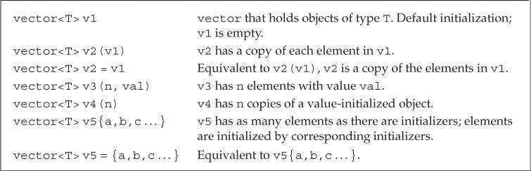
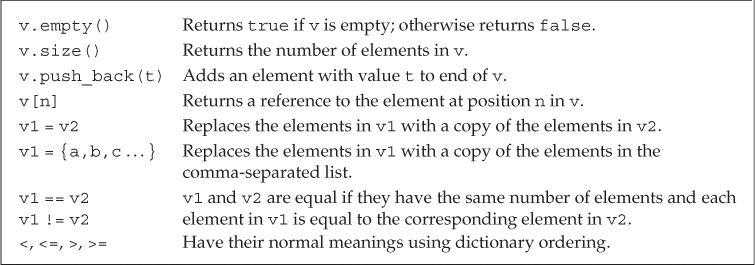
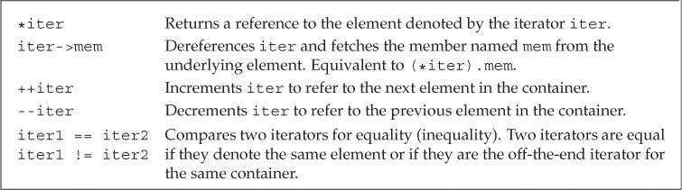
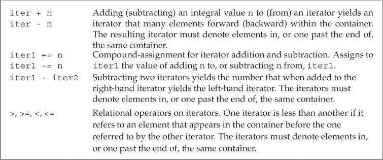
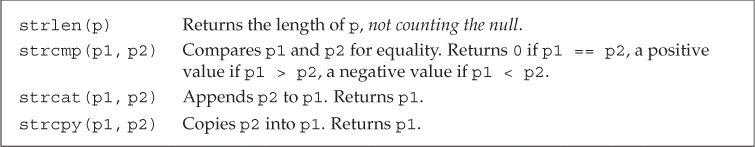
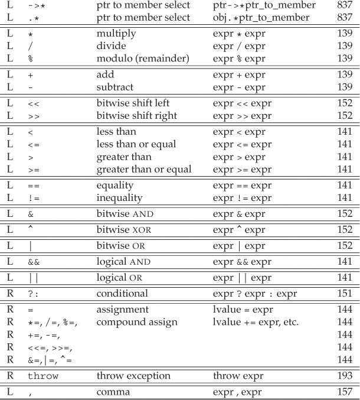
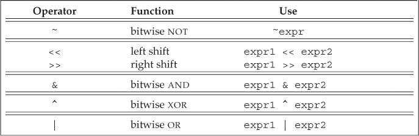

# Chapter 1. Getting Started

## 1.1 A First Look at Input/Output

### 1.1.1 Standard Input and Output

* `cin`

  Standard input

* `cout`

  Standard output

* `cerr`

  Standard error

* `clog`

  For general information about the execution of the program

### 1.1.2 Writing to a Stream

```c++
std::cout << "Enter two numbers:" << std::endl;
```

1. The `<<` operator

   * Two operands:

     * left-hand operand:  an `ostream` object
     * right-hand operand: a value to print

   * Result

     <font color='red'>Its left operand. That is, the `ostream` on which we wrote the given value.</font>

2. `endl`: a special value called a *manipulator*

   * Effect

     * Ending the current line

     * <font color='red'>Flushing the buffer associated with that device</font>

       Ensures that all the output the program has generated so far is actually written to the output stream, rather than sitting in memory waiting to be written 

### 1.1.3 Using Names from the Standard Library

```c++
std::cout, std::endl
```

The scope operator `::` means that the names `cout` and `endl` are defined inside the namespace named `std`

### 1.1.4 Reading from a Stream

```c++
int v1 = 0, v2 = 0;
std::cin >> v1 >> v2;
```

The `>>` operator returns its left operand, in this case, the `std::cin`. 

## 1.2 Flow of Control

### 1.2.1 The `for` Statement

```c++
for (int val = 1; val <= 10; ++val)
    sum += val;
```

* init-statement: `int val = 1`
* condition: `val <= 10`
* expression: `++val`

The init-statement is only executed once, if the condition is valid, execute the body, and then the expression is executed, and the condition is retested...

### 1.2.2 ⭐Reading an Unknown Number of Inputs

```c++
int sum = 0, value = 0;
while(std::cin >> value){
    sum += value;
}
```

Because the `>>` operator returns its left operand, in this case, the `while` statement tests `std::cin`.

1. When we use a `istream` as a condition, the effect is to test the state of the stream:

   * If the stream is valid, then the test succeeds.

   * If the stream hits end-of-line or encouter an invalud input, it becomes invalid.

2. Entering an `End-of-File` from the Keyboard:

   * Windows system: Typing control-z, followed by hitting the Enter key

   * Unix system: control-d

## 1.3 Introducing Classes

1. <font color='red'>Every class defines a type</font>, the type name is the same as the name of the class.

   As with the built-in type, we can define a variable of a class type:

   ```c++
   Sales_item item; // Here the item is a Sales_item object
   ```

2. Member Function

   A member function is a function that is defined as part of a class

# Chapter 2. Variables and Basic Types

## 2.1 Primitive Built-in Types

### 2.1.1 Arithmetic Types

 

The arithmetic types are divided into two categories:

* integral types
  * character
  * bollean
* floating-point types

1. Signed and Unsigned Types

   The types `int`, `short`, `long`, and `long long` are all signed. We obtain the corresponding unsigned type by adding unsigned to the type, such as `unsigned long`. <font color='red'>The type `unsigned int` may be abbreviated as `unsigned`.</font>

2. Deciding which type to use
   * Use an unsigned type when you know that the value cannot be negative
   * Use `int` for integer arithmetic
   * `long` often has the same size as `int`, so when your data is larger than `int`, use `long long`
   * Use `double` for floating-point computations

### 2.1.2 Type Conversions

```c++
bool b = 42;			// The result is false if the value is 0 and true otherwise
int i = b;				// The result is 0 if the bool is false and 1 if the bool is true
unsigned char c = -1;	// Here the number of values unsigned char can hold is 256(0 to 255), so the result is
						// -1 % 256 = (-1 + 256) % 256 = 255
signed char c2 = 256;	// If we assign an out-of-range value to a signed type, the result is undefined
```

* When we assign one of the non`bool` arithmetic types to a `bool` object, the result is `false` if the value is `0` and `true` otherwise.
* When we assign a `bool` to one of the other arithmetic types, the resulting value is `1` if the `bool` is `true` and `0` if the `bool` is `false`.
* When we assign a floating-point value to an object of integral type, the value is truncated. The value that is stored is the part before the decimal point.
* When we assign an integral value to an object of floating-point type, the fractional part is zero. Precision may be lost if the integer has more bits than the floating-point object can accommodate.
* If we assign an out-of-range value to an object of unsigned type, <font color='red'>the result is the remainder of the value modulo the number of values the target type can hold</font>. For example, an 8-bit `unsigned char` can hold values from 0 through 255, inclusive. If we assign a value outside this range, the compiler assigns the remainder of that value modulo 256. Therefore, assigning –1 to an 8-bit `unsigned char` gives that object the value 255.
* <font color='red'>If we assign an out-of-range value to an object of signed type, the result is undefined.</font> The program might appear to work, it might crash, or it might
  produce garbage values.

#### ⭐Expressions Involving Unsigned Types

1. if we use both `unsigned` and `int` values in an arithmetic expression, the `int` value ordinarily is converted to `unsigned`.

   ```c++
   unsigned u = 10;
   int i = -42;
   std::cout << i + i << std::endl; // prints -84
   std::cout << u + i << std::endl; // if 32-bit ints, prints 4294967264
   ```

   In the second expression, the `int` value `-42` is converted to `unsigned` before the addition is done. Converting a negative number to `unsigned` makes the value “wraps around”.

2. Regardless of whether one or both operands are `unsigned`, if we subtract a value from an `unsigned`, we must be sure that the result cannot be negative:

   ```c++
   unsigned u1 = 42, u2 = 10;
   std::cout << u1 - u2 << std::endl; // ok: result is 32
   std::cout << u2 - u1 << std::endl; // ok: but the result will wrap around
   ```

3. <font color='red'>The fact that an `unsigned` cannot be less than zero also affects how we write loops.</font>

   ```c++
   for(unsigned u = 10,; u >=0; --u)
       std::cout << u;
   ```

   When `u` is `0`, we print the value `0`, and `--u` subtracts `1` from `u`. That result, `-1`, will not fit in an `unsigned` type. `-1` will be converted to `unsigned`, resulting `4294967295`, so the loop will continue.

   One way to write this loop is to use a `while` instead of a for. Using a `while` lets us decrement before (rather than after) printing our value:

   ```c++
   unsigned u = 11;	// start the loop one past the first element we want to print
   while(u >= 1){
       --u;
       std::cout << u;	// decrement first, so that the last iteration will print 0
   }
   ```

<font color='orange'>Caution: Don’t Mix `Signed` and `Unsigned` Types</font>

### 2.1.3 Literals

A value, such as `42`, is known as a literal because its <font color='red'>value self-evident</font>. Every literal has a type. The form and value of a literal determine its type.

#### Integer and Floating-Point Literals

1. We can write an integer literal using decimal, octal, or hexadecimal notation. 

   Integer literals that begin with `0` (zero) are interpreted as octal. Those that begin with either `0x` or `0X` are interpreted as hexadecimal.

   ```c++
   20 /* decimal */ 024 /* octal */ 0x14 /* hexadecimal */
   ```

2. The type of an integer literal depends on its value and notation.

   By default, floating-point literals have type double. We can override defaults by using a suffix.

    

   ```c++
   L'a' // wide character literal, type is wchar_t
   u8"hi!" // utf-8 string literal (utf-8 encodes a Unicode character in 8 bits)
   42ULL // unsigned integer literal, type is unsigned long long
   1E-3F // single-precision floating-point literal, type is float
   3.14159L // extended-precision floating-point literal, type is long double
   ```

3. <font color='red'>The value of a decimal literal is never a negative number.</font>

   If we write `-42`, the minus sign is not part of the literal. The minus sign is an operator that negates the value of its operand.

#### Character and Character String Literals

A character enclosed within single quotes is a literal of type `char`. Zero or more characters enclosed in double quotation marks is a *string literal*.

<font color='red'>Two string literals that appear adjacent to one another and that are separated only by spaces, tabs, or newlines are concatenated into a single literal.</font>

```c++
// multiline string literal
std::cout << "a really, really long string literal "
                     "that spans two lines" << std::endl;
```

#### Boolean and Pointer Literals

The words `true` and `false` are literals of type `bool`:

```c++
bool test = false;
```

The word `nullptr` is a pointer literal.

## 2.2. Variables

### 2.2.1. Variable Definitions

Simple variable definition consists of a *type specifier*, followed by a list of one or more variable names separated by commas, and ends with a semicolon.

<font color='red'>An Object in C++:
An object is a region of memory that contain data and has a type.</font>

#### Initializers

When a definition defines two or more variables, the name of each object becomes visible immediately. Thus, it is possible to initialize a variable to the value of one defined earlier in the same definition.

```c++
// ok: price is defined and initialized before it is used to initialize discount
double price = 109.99, discount = price * 0.16;
```

#### List Initialization

We can use any of the following four different ways to define an `int` variable named `units_sold` and initialize it to `0`:

```c++
int units_sold = 0;
int units_sold = {0};
int units_sold{0};
int units_sold(0);
```

Braced lists of initializers can be used whenever we initialize an object and in some cases when we assign a new value to an object.

When used with variables of built-in type, list initialization has one important property: <font color='red'>The compiler will not let us list initialize variables of built-in type if
the initializer might lead to the loss of information</font>:

```c++
long double ld = 3.1415926536;
int a{ld}, b = {ld}; // error: narrowing conversion required
int c(ld), d = ld; // ok: but value will be truncated
```

#### Default Initialization

When we define a variable without an initializer, the variable is <font color='cornflowerblue'>**default initialized**</font>. Such variables are given the “default” value:

* built-in type

  * Variables defined outside any function body are initialized to zero
  * <font color='red'>Variables defined inside a function are uninitialized</font>. The value of an uninitialized variable of built-in type is undefined.

* class type

  Each class controls how we initialize objects of that class type. In particular, it is up to the class whether we can define objects of that type without an initializer. If we can, the class determines what value the resulting object will have.

  For example, as we’ve just seen, the library `string` class says that if we do not supply an initializer, then the resulting string is the empty string:

  ```c++
  std::string empty; // empty implicitly initialized to the empty string
  Sales_item item; // default-initialized Sales_item object
  ```

  Some classes require that every object be explicitly initialized. The compiler will complain if we try to create an object of such a class with no initializer.

### 2.2.2. Variable Declarations and Definitions

A **variable declaration** specifies the type and name of a variable. 

A **variable definition** is a declaration. In addition to specifying the name and type, a definition also allocates storage and may provide the variable with an initial value.

Variables must be **defined** exactly once but can be **declared** many times.

1. `extern` keyword

   To obtain a declaration that is not also a definition, we add the `extern` keyword and may not provide an explicit initializer:

   ```c++
   extern int i; // declares but does not define i
   int j; // declares and defines j
   ```

   Any declaration that includes an explicit initializer is a definition. We can provide an initializer on a variable defined as `extern`, but doing so overrides the `extern`. An `extern` that has an initializer is a definition:

   ```c++
   extern double pi = 3.1416; // definition
   ```

2. Static Typing

   C++ is a statically typed language, which means that **types are checked at compile time**. 

   As our programs get more complicated, we’ll see that static type checking can help find bugs. However, a consequence of static checking is that the
   type of every entity we use must be known to the compiler. As one example, we must declare the type of a variable before we can use that variable.

### 2.2.3. Identifiers 标识符

Identifiers in C++ can be composed of **letters**, **digits**, and the **underscore character**.

<font color='red'>Identifiers must begin with either a letter or an underscore.</font>

#### Conventions for Variable Names

1. An identifier should give some indication of its meaning.
2. Variable names normally are lowercase—`index`, not `Index` or `INDEX`.
3. Like `Sales_item`, classes we define usually begin with an uppercase letter.
4. Identifiers with multiple words should visually distinguish each word, for example, `student_loan` or `studentLoan`, not `studentloan`.

### 2.2.4. Scope of a Name

1. Advice: Define Variables Where You First Use Them

2. Use a scope operator to requests the global variable:

   ```c++
   #include <iostream>
   
   int reused = 42;
   int main(){
       int reused = 0;
       std::cout << reused << std::endl;
       std::cout << ::reused << std::endl;
   }
   ```

   The global scope has no name. Hence, when the scope operator has an empty left-hand side, it is a request to fetch the name on the right-hand side from the global scope

## 2.3 Compound Types 复合类型

A compound type is a type that is defined in terms of another type

### 2.3.1. References

* A reference defines an alternative name for an object

* Define a reference type by writing a declarator of the form `&d`. where `d` is the name being declared.

  ```c++
  int ival = 1024;
  int &refVal = ival;    //refVal is another name for ival
  ```

* After a reference has been defined, all operations on that reference are actually operations on the object which the reference is bound.

* A reference must be initialized, and there is no way to rebind a reference to refer to a different object.

* A reference is not an object. Instead a reference is just another name for an already existing object.

* The type of a reference and the object to which the reference refers must match exactly. (With two exceptions)

  ```c++
  double dval =3.14;
  int &refval1 = dval;    //error
  ```

* A reference may be bound only to an object, not to a literal or to another reference

  ```c++
  int &refVal = 10;    //error
  ```

### 2.3.2. Pointers

<font color='red'>Difference with reference</font>

* A pointer is an object, it can be assigned and copied

* A single pointer can point to several different objects over its lifetime

* A pointer need not be initialized at the time it is defined.

   Like other built-in types, pointers defined at block scope have undefined value if they are not initialized

We define a pointer type by writing a declarator of the form `*d`, where `d` is the name being defined. <font color='red'>The `*` must be repeated for each pointer variable</font>:

```c++
int *ip1, *ip2; // both ip1 and ip2 are pointers to int
double dp, *dp2; // dp2 is a pointer to double; dp is a double
```

#### Taking the Address of an Object

A pointer holds the address of another object. We get the address of an object by using the address-of operator (the `&` operator):

```c++
int ival = 42;
int *p = &ival;
```

<font color='red'>Because references are not objects, they don’t have addresses. Hence, we may not define a pointer to a reference.</font>

With two exceptions, the types of the pointer and the object to which it points must match:

```c++
double dval;
double *pd = &dval; // ok: initializer is the address of a double
double *pd2 = pd; // ok: initializer is a pointer to double
int *pi = pd; // error: types of pi and pd differ
pi = &dval; // error: assigning the address of a double to a pointer to int
```

#### Using a Pointer to Access an Object

When a pointer points to an object, we can use the dereference operator (the `*` operator) to access that object:

```c++
int ival = 42;
int *p = &ival; 	// p holds the address of ival; p is a pointer to ival
cout << *p; 		// * yields the object to which p points; prints 42
*p = 0; 			// * yields the object; we assign a new value to ival through p
cout << *p; 		// prints 0
```

#### Null Pointers

There are several ways to obtain a null pointer:

```c++
int *p1 = nullptr; 		// equivalent to int *p1 = 0;
int *p2 = 0; 			// directly initializes p2 from the literal constant 0
// must #include cstdlib
int *p3 = NULL; 		// equivalent to int *p3 = 0;
```

It is illegal to assign an `int` variable to a pointer, even if the variable’s value happens to be `0`.

```c++
int zero = 0;
pi = zero; // error: cannot assign an int to a pointer
```

#### Assignment and Pointers

Assignment makes the pointer point to a different object:

```c++
int ival = 42;
int *pi = 0; 	// pi is initialized but addresses no object
pi = &ival; 	// value in pi is changed; pi now points to ival
*pi = 0; 		// value in ival is changed; pi is unchanged
```

#### Other Pointer Operations

1. We can use a pointer in a condition. If the pointer is 0, then the condition is `false`. Any nonzero pointer evaluates as `true`.
2. Given two valid pointers of the same type, we can compare them using the equality (`==`) or inequality (`!=`) operators. 

#### `void*` Pointers

The type `void*` is a special pointer type that can hold the address of any object.

```c++
double obj = 3.14, *pd = &obj;
void *pv = &obj;
pv = pd;
```

There are only a limited number of things we can do with a `void*` pointer:

* Compare it to another pointer
* Pass it to or return it from a function
* Assign it to another void* pointer

<font color='red'>We cannot use a `void*` to operate on the object it addresses</font>—we don’t know that object’s type, and the type determines what operations we can perform on the object.

### 2.3.3. Understanding Compound Type Declarations

#### Defining Multiple Variables

```c++
int* p; // legal but might be misleading
```

We say that this definition might be misleading because it suggests that `int*` is the type of each variable declared in that statement. Despite appearances, <font color='red'>the base type of this declaration is `int`, not `int*`. The `*` modifies the type of `p`.</font>

```c++
int* p1, p2; // p1 is a pointer to int; p2 is an int
int *p1, *p2; // both p1 and p2 are pointers to int
```

#### Pointers to Pointers

We indicate each pointer level by its own `*`. That is, we write `**` for a pointer to a pointer, `***` for a pointer to a pointer to a pointer, and so on:

```c++
int ival = 1024;
int *pi = &ival; // pi points to an int
int **ppi = &pi; // ppi points to a pointer to an int

cout << "The value of ival\n"
	<< "direct value: " << ival << "\n"
	<< "indirect value: " << *pi << "\n"
	<< "doubl
```

#### ⭐References to Pointers

```c++
int i = 42;
int *p;
int *&r = p;
r = &i;
*r = 0;
```

The easiest way to understand the type of `r` is to read the definition right to left:

* The symbol closest to the name of the variable (in this case the `&` in `&r`) is the one that has the most immediate effect on the variable’s type. Thus, we know that `r` is a reference.
* The rest of the declarator determines the type to which `r` refers. The next symbol, `*` in this case, says that the type `r` refers to is a pointer type.
* Finally, the base type of the declaration says that `r` is a reference to a pointer to an `int`.

## 2.4. `const` Qualifier

Because we can’t change the value of a `const` object after we create it, it **must be initialized**. As usual, the initializer may be an arbitrarily complicated expression:

```c++
const int i = get_size(); 	// ok: initialized at run time
const int j = 42; 			// ok: initialized at compile time
const int k; 				// error: k is uninitialized const
```

#### By Default, `const` Objects Are Local to a File

When a `const` object is initialized from a compile-time constant, the compiler will usually replace uses of the variable with its corresponding value
during compilation. 

To substitute the value for the variable, the compiler has to see the variable’s initializer. When we split a program into multiple files, every file that uses the `const` must have access to its initializer. In order to see the initializer, <font color='red'>the variable must be defined in every file that wants to use the variable’s value</font>. 

To support this usage, yet avoid multiple definitions of the same variable, `const` variables are defined as local to the file. <font color='red'>When we define a const with the same name in multiple files, it is as if we had written definitions for separate variables in each file.</font>

### 2.4.1. References to `const`

Unlike an ordinary reference, a reference to `const` cannot be used to change the object to which the reference is bound:

```c++
const int ci = 1024;
const int &r1 = ci;		// ok: both reference and underlying object are const
r1 = 42;				// error: r1 is a reference to const
int &r2 = ci;			// error: non const reference to a const object
```

>Terminology: `const` Reference is a Reference to `const`
>
>Technically speaking, there are no `const` references. A reference is not an object, so we cannot make a reference itself `const`.

#### ⭐Initialization and References to `const`

<font color='red'>We can initialize a reference to `const` from any expression that can be converted to the type of the reference. In particular, we can bind a reference to
`const` to a non`const` object, a literal, or a more general expression:</font>

```c++
int i = 42;
const int &r1 = i;			// we can bind a const int& to a plain int object
const int &r2 = 42;			// ok: r1 is a reference to const
const int &r3 = r1 * 2;		// ok: r3 is a reference to const
int &r4 = r * 2;			// error: r4 is a plain, non const reference
```

Consider what happens when we bind a reference to an object of a different type:

```c++
double dval = 3.14;
const int &r1 = dval;
```

To ensure that the object to which `r1` is bound is an `int`, the compiler transforms this code into something like

```c++
const int temp = dval;	// create a temporary const int from the double
const int &ri = temp;	// bind ri to that temporary
```

In this case, `ri` is bound to a temporary object. A temporary object is an unnamed object created by the compiler when it needs a place to store a result from evaluating an expression.

#### A Reference to `const` May Refer to an Object That Is Not `const`

It is important to realize that a reference to `const` restricts only what we can do through that reference. Binding a reference to `const` to an object says nothing about whether the underlying object itself is `const`. Because the underlying object might be non`const`, it might be changed by other means:

```c++
int i = 42;
int &r1 = i; 			// r1 bound to i
const int &r2 = i; 		// r2 also bound to i; but cannot be used to change i
r1 = 0; 				// r1 is not const; i is now 0
r2 = 0; 				// error: r2 is a reference to const
```

### 2.4.2. Pointers and const

Like a reference to `const`, a pointer to `const` may not be used to change the object to which the pointer points. We may store the address of a `const` object only in a pointer to `const`:

```c++
const double pi = 3.14;
double *ptr = &pi;			// error: ptr is a plain pointer
const double *cptr = &pi;	// ok: cptr may point to a double that is const
*cptr = 42;					// error: cannot assign to *cptr
```

<font color='red'>We can use a pointer to const to point to a nonconst object</font>

```c++
double dval = 3.14;
const double *cptr = &dval;
```

#### `const` Pointers

Unlike references, pointers are objects. Hence, as with any other object type, we can have a pointer that is itself `const`.

<font color='red'>We indicate that the pointer is `const` by putting the `const` after the `*`.</font> This placement indicates that it is the pointer, not the pointed-to type, that is
`const`:

```c++
int errNumb = 0;
int *const curErr = &errNumb;		// curErr will always point to errNumb
const double pi = 3.14;
const double *const pip = &pi;		// pip is a const pointer to a const object
```

The easiest way to understand these declarations is to <font color='red'>read them from right to left</font>. 

* In this case, the symbol closest to `curErr` is `const`, which means that `curErr` itself will be a `const` object. 
* The type of that object is formed from the rest of the declarator. The next symbol in the declarator is `*`, which means that `curErr` is a const pointer.
* Finally, the base type of the declaration completes the type of `curErr`, which is a `const` pointer to an object of type `int`.

### 2.4.3. Top-Level const

We use the term<font color='blue'> top-level `const`</font> to indicate that the pointer itself is a `const`. When a pointer can point to a `const` object, we refer to that `const` as a <font color='blue'>low-level const</font>.

More generally, top-level `const` indicates that an object itself is `const`. Top-level `const` can appear in any object type, i.e., one of the built-in arithmetic types, a class type, or a pointer type. 

Low-level const appears in the base type of compound types such as pointers or references. 

```c++
int i = 0;
int *const p1 = &i; 		// we can't change the value of p1; const is top-level
const int ci = 42; 			// we cannot change ci; const is top-level
const int *p2 = &ci; 		// we can change p2; const is low-level
const int *const p3 = p2; 	// right-most const is top-level, left-most is not
const int &r = ci; 			// const in reference types is always low-level
```

1. <font color='red'>When we copy an object, top-level `const`s are ignored</font>

   ```c++
   i = ci; 		// ok: copying the value of ci; top-level const in ci is ignored
   p2 = p3; 		// ok: pointed-to type matches; top-level const in p3 is ignored
   ```

2. On the other hand, low-level `const` is never ignored. When we copy an object, both objects must have the same low-level `const` qualification or there must be a conversion between the types of the two objects. In general, we can convert a non`const` to `const` but not the other way round:

   ```c++
   int *p = p3;		// error: p3 has a low-level const but p doesn't
   p2 = p3;			// ok: p2 has the same low-level const qualification as p3
   p2 = &i;			// ok: we can convert int* to const int*
   int &r = ci;		// error: can't bind an ordinary int& to a const int object
   const int &r = i;	// ok: can bind const int& to plain int
   ```

### 2.4.4. `constexpr` and Constant Expressions

#### Constant Expression

A constant expression is an expression whose value cannot change and that <font color='red'>can be evaluated at compile time</font>:

* A literal is a constant expression.
* A const object that is initialized from a constant expression is also a constant expression.

```c++
const int max_files = 20; 			// max_files is a constant expression
const int limit = max_files + 1; 	// limit is a constant expression
int staff_size = 27; 				// staff_size is not a constant expression
const int sz = get_size(); 			// sz is not a constant expression
```

Although `staff_size` is initialized from a literal, it is not a constant expression because it is a plain `int`, not a `const int`. On the other hand, even though `sz` is a `const`, the value of its initializer is not known until run time. Hence, `sz` is not a constant expression.

#### `constexpr` Variables

In a large system, it can be difficult to determine (for certain) that an initializer is a constant expression. Under the new standard, we can ask the compiler to verify that a variable is a constant expression by declaring the variable in a `constexpr` declaration. 

<font color='red'>Variables declared as `constexpr` are implicitly `const` and must be initialized by constant expressions:</font>

```c++
constexpr int mf = 20;			// 20 is a constant expression
constexpr int limit = mf + 1;	// mf + 1 is a constant expression
constexpr int sz = size();		// ok only if size is a constexpr function
```

Although we cannot use an ordinary function as an initializer for a `constexpr` variable, <font color='red'>we can use `constexpr` functions in the initializer of a `constexpr` variable.</font> Such functions must be simple enough that the compiler can evaluate them at compile time.

#### Literal Types

Because a constant expression is one that can be evaluated at compile time, there are limits on the types that we can use in a `constexpr` declaration. The types we can use in a `constexpr` are known as “<font color='blue'>literal types</font>” because they are simple enough to have literal values:

* the arithmetic types
* reference types
* pointer  types

Our `Sales_item` class and the library IO and `string` types are not literal types. Hence, we cannot define variables of these types as `constexpr`s.

1. Although we can define both pointers and reference as `constexpr`s, the objects we use to initialize them are strictly limited:
   * We can initialize a `constexpr` pointer from the `nullptr` literal or the literal `0`. 
   * We can also point to (or bind to) an object that remains at a fixed address
     * Variables defined inside a function ordinarily are not stored at a fixed address. Hence, we cannot use a `constexpr` pointer to point to such variables.
     * The address of an object defined outside of any function is a constant expression, and so may be used to initialize a `constexpr` pointer.
     * Functions may define variables that exist across calls to that function. Like an object defined outside any function, these special local objects also have fixed addresses. Therefore, a `constexpr` reference may be bound to, and a `constexpr` pointer may address, such variables.

#### Pointers and `constexpr`

It is important to understand that when we define a pointer in a `constexpr` declaration, <font color='red'>the `constexpr` specifier applies to the pointer, not the type to which the pointer points</font>:

```c++
const int *p = nullptr;			// p is a pointer to a const int
constexpr int *np = nullptr;	// np is a constant pointer to int that is null
int j = 0;
constexpr int i = 42;
// i and j must be defined outside any function
constexpr const int *p = &i;	// p is a constant pointer to the const int i
constexpr int *p1 = &jl			// p1 is a constant pointer to the int j
```

> `constexpr` imposes a top-level `const` on the objects it defines.

## 2.5. Dealing with Types

### 2.5.1. Type Aliases

We can define a type alias in one of two ways:

* `typedef`

  <font color='red'>The keyword `typedef` may appear as part of the base type of a declaration.</font> Declarations that include typedef define type aliases rather than variables. As in any other declaration, the declarators can include type modifiers that define compound types built from the base type of the definition:

  ```c++
  typedef double wages;		// wage is a synonym for double
  typedef wages base, *p;		// base is a synonym for double, p is a synonym for double *
  ```

* alias declaration

  The alias declaration defines the name on the left-hand side of the `=` as an alias for the type that appears on the right-hand side.

  ```c++
  using SI = Sales_item; 		// SI is a synonym for Sales_item
  ```

#### Pointers, const, and Type Aliases

```c++
typedef char *pstring;			// pstring is a synonym for char*
const pstring cstr = 0;			// cstr is a constant pointer to char
const pstring *ps;				// ps is a pointer to a constant pointer to char
```

The base type in these declarations is `const pstring`. As usual, a `const` that appears in the base type modifies the given type. The type of `pstring` is “pointer to `char`.” So, `const pstring` is a constant pointer to `char`—not a pointer to `const char`.

### 2.5.2. The `auto` Type Specifier

Under the new standard, we can let the compiler figure out the type for us by using the `auto` type specifier. `auto` tells the compiler to deduce the type
from the initializer. By implication, a variable that uses `auto` as its type specifier must have an initializer:

```c++
// the type of item is deduced from the type of the result of adding val1 and val2
auto item = val1 + val2; // item initialized to the result of val1 + val2
```

As with any other type specifier, we can define multiple variables using `auto`. Because a declaration can involve only a single base type, the initializers for all the variables in the declaration must have types that are consistent with each other:

```c++
auto i = 0, *p = &i;		// ok: i is int and p is a pointer to int
auto sz = 0, pi = 3.14;		// error: inconsistent types for sz and pi
```

#### Compound Types, `const`, and `auto`

The type that the compiler infers for `auto` is not always exactly the same as the initializer’s type. 

Instead, the compiler adjusts the type to conform to normal initialization rules:

* When we use a reference, we are really using the object to which the reference refers. In particular, when we use a reference as an initializer, the
  initializer is the corresponding object. The compiler uses that object’s type for `auto`’s type deduction:

  ```c++
  int i = 0, &r = i;
  auto a = r;			// a is an int
  ```

* `auto` ordinarily ignores top-level `const`s. As usual in initializations, low-level `const`s, such as when an initializer is a pointer to `const`, are
  kept:

  ```c++
  const int ci = i, &cr = ci;
  auto b = ci; 	// b is an int (top-level const in ci is dropped)
  auto c = cr; 	// c is an int (cr is an alias for ci whose const is top-level)
  auto d = &i; 	// d is an int*(& of an int object is int*)
  auto e = &ci; 	// e is const int*(& of a const object is low-level const)
  ```

  If we want the deduced type to have a top-level `const`, we must say so explicitly:

  ```c++
  const auto f = ci;	// deduced type of ci is int; f has type const int
  ```

* When we ask for a reference to an auto-deduced type, top-level `const`s in the initializer are not ignored. As usual, `const`s are not top-level when we bind a reference to an initializer.

  ```c++
  auto &g = ci;		// g is a const int& that is bound to ci
  auto &h = 42;		// error: we can't bind a plain reference to a literal
  const auto &j = 42;	// ok: we can bind a const reference to a literal
  ```

> auto 三条规则：
>
> * 忽略引用
> * 声明的是指针的时候，忽略顶层const
> * 声明的是引用的时候，保留顶层const

When we define several variables in the same statement, it is important to remember that a reference or pointer is part of a particular declarator and not part of the base type for the declaration. As usual, the initializers must provide consistent `auto`-deduced types:

```c++
auto k = ci, &l = i;	// k is int; l is int&
auto &m = ci, *p = &ci;	// m is a const int&, p is a pointer to const int
auto &n = i, *p2 = &ci;	// error: type deduced from i is int; type deduced from &ci is const int
```

### 2.5.3. The `decltype` Type Specifier

Sometimes we want to define a variable with a type that the compiler deduces from an expression but do not want to use that expression to initialize the variable. For such cases, the new standard introduced a second type specifier, `decltype`, which returns the type of its operand.

```c++
decltype(f()) sum = x; // sum has whatever type f returns
```

When the expression to which we apply `decltype` is a variable, <font color='red'>`decltype` returns the type of that variable, including top-level const and references</font>:

```c++
const int ci = 0, &cj = ci;
decltype(ci) x = 0;		// x is const int
decltype(cj) y = x;		// y is const int&
decltype(cj) z;			// error: z is a reference and must be initialized
```

#### `decltype` and References

When we apply `decltype` to an expression that is not a variable, we get the type that that expression yields. <font color='red'>`decltype` returns a reference type for expressions that yield objects that can stand on the left-hand side of the assignment</font>:

```c++
// decltype of an expression can be a reference type
int i = 42, *p = &i, &r = i;
decltype(r + 0) b;	// ok: addition yields an int; b is an (uninitialized) int
decltype(*p) c;		// error: c is int& and must be initialized
```

* Here `r` is a reference, so `decltype(r)` is a reference type. If we want the type to which `r` refers, we can use `r` in an expression, such as `r + 0`, which is an expression that yields a value that has a nonreference type.
* The dereference operator is an example of an expression for which `decltype` returns a reference. As we’ve seen, when we dereference a pointer,
  we get the object to which the pointer points. Moreover, we can assign to that object. Thus, the type deduced by `decltype(*p)` is `int&`, not plain `int`.

Enclosing the name of a variable in parentheses affects the type returned by `decltype`. When we apply `decltype` to a variable without any parentheses, we get the type of that variable. <font color='red'>If we wrap the variable’s name in one or more sets of parentheses, the compiler will evaluate the operand as an expression</font>:

```c++
// decltype of a parenthesized variable is always a reference
decltype((i)) d; // error: d is int& and must be initialized
decltype(i) e; // ok: e is an (uninitialized) int
```

## 2.6. Defining Our Own Data Structures

## 2.6.1. Defining the `Sales_data` Type

```c++
struct Sales_data{
    std::string bookNo;
    unsigned units_sold = 0;
    double revenue = 0.0;
};
```

The close curly that ends the class body must be followed by a semicolon. The semicolon is needed because we can define variables after the class body:

```c++
struct Sales_data { /* ... */ } accum, trans, *salesptr;
// equivalent, but better way to define these objects
struct Sales_data { /* ... */ };
Sales_data accum, trans, *salesptr;
```

#### Class Data Members

Each object has its own copy of the class data members. Modifying the data members of one object does not change the data in any other `Sales_data`
object.

Under the new standard, we can supply an <font color='blue'>in-class initializer</font> for a data member. When we create objects, the in-class initializers will be used to initialize the data members. <font color='red'>Members without an initializer are default initialized.</font> 

In-class initializers are restricted as to the form we can use: They must either be enclosed inside curly braces or follow an `=` sign. <font color='red'>We may not specify an
in-class initializer inside parentheses.</font>

### 2.6.2. Using the `Sales_data` Class

```c++
#include <iostream>
#include <string>
#include "Sales_data.h"
int main()
{
	Sales_data data1, data2;
	// code to read into data1 and data2
	double price = 0;
    std::cin >> data1.bookNo >> data1.units_sold >> price;
    data1.revenue = data1.units_sold * price;
    std::cin >> data2.bookNo >> data2.units_sold >> price;
	data2.revenue = data2.units_sold * price;
	// code to check whether data1 and data2 have the same ISBN
	// and if so print the sum of data1 and data2
    if (data1.bookNo == data2.bookNo) {
		unsigned totalCnt = data1.units_sold + data2.units_sold;
		double totalRevenue = data1.revenue + data2.revenue;
        std::cout << data1.bookNo << " " << totalCnt
					<< " " << totalRevenue << " ";
	}
}
```

### 2.6.3. Writing Our Own Header Files

In order to ensure that the class definition is the same in each file, classes are usually defined in header files. Headers (usually) contain entities (such as class definitions and `const` and `constexpr` variables) that can be defined only once in any given file.

However, headers often need to use facilities from other headers. For example, because our `Sales_data` class has a `string` member, `Sales_data`.h must `#include` the `string` header. As we’ve seen, programs that use `Sales_data` also need to include the `string` header in order to use the `bookNo` member. As a result, programs that use `Sales_data` will include the `string` header twice.

Because a header might be included more than once, we need to write our headers in a way that is safe even if the header is included multiple times.

#### A Brief Introduction to the Preprocessor

The preprocessor—which C++ inherits from C—is a program that runs before the compiler and changes the source text of our programs. C++ programs also use the preprocessor to define <font color='blue'>header guards</font>.

Header guards rely on preprocessor variables. Preprocessor variables have one of two possible states: defined or not defined.

* The `#define` directive takes a name and defines that name as a preprocessor variable.
* `#ifdef` is true if the variable has been defined
* `#ifndef` is true if the variable has not been defined

```c++
#ifndef SALES_DATA_H
#define SALES_DATA_H
#include <string>
struct Sales_dat{
    std::string bookNo;
	unsigned units_sold = 0;
	double revenue = 0.0;
};
#endif
```

The first time `Sales_data.h` is included, the `#ifndef` test will succeed. The preprocessor will process the lines following `#ifndef` up to the `#endif`. As a result, the preprocessor variable `SALES_DATA_H` will be defined and the contents of `Sales_data.h` will be copied into our program. 

If we include `Sales_data.h` later on in the same file, the `#ifndef` directive will be false. The lines between it and the `#endif` directive will be ignored.

# Chapter 3. Strings, Vectors, and Arrays

## 3.1. Namespace `using` Declarations

`using` declaration covers another way to use names from a namespace without qualifying the name with a n`amespace_name::` prefix:

```c++
using namespace::name;
```

Once the `using` declaration has been made, we can access name directly:

```c++
#include <iostream>
// using declaration; when we use the name cin, we get the one from the namespace
std
using std::cin;
int main()
{
	int i;
	cin >> i; 		// ok: cin is a synonym for std::cin
	cout << i; 		// error: no using declaration; we must use the full name
	std::cout << i; // ok: explicitly use cout from namepsace std
	return 0;
}
```

#### A Separate using Declaration Is Required for Each Name

Each `using` declaration introduces a single namespace member.

```c++
#include <iostream>
// using declarations for names from the standard library
using std::cin;
using std::cout; using std::endl;
int main()
{
	cout << "Enter two numbers:" << endl;
	int v1, v2;
	cin >> v1 >> v2;
	cout << "The sum of " << v1 << " and " << v2
		<< " is " << v1 + v2 << endl;
	return 0;
}
```

#### Headers Should Not Include `using` Declarations

The reason is that the contents of a header are copied into the including program’s text. If a header has a `using` declaration, then every program that includes that header gets that same `using` declaration. As a result, a program that didn’t intend to use the specified library name might encounter unexpected name conflicts.

## 3.2. Library `string` Type

### 3.2.1. Defining and Initializing strings

 

When we supply a `string` literal, the characters from that literal—up to but not including the null character at the end of the literal—are copied into the newly created `string`.

```c++
string s1;
string s2 = s1;
string s3 = "hiya";
string s4(10, 'c');
```

#### Direct and Copy Forms of Initialization

* When we initialize a variable using `=`, we are asking the compiler to <font color='blue'>copy initialize</font> the object by copying the initializer on the right-hand side into the object being created.
* When we omit the `=`, we use <font color='blue'>direct initialization</font>.

### 3.2.2. Operations on `string`s

 

#### Reading and Writing `string`s

```c++
int main(){
    string s;
    cin >> s;
    cout << s << endl;
    return 0;
}
```

The `string` input operator reads and discards any leading whitespace (e.g., spaces, newlines, tabs). It then reads characters until the next whitespace character is encountered. So, if the input to this program is ` Hello World!` (note leading and trailing spaces), then the output will be `Hello` with no extra spaces.

#### ⭐Using `getline` to Read an Entire Line

The `getline` function takes an input stream and a `string`. This function reads the given stream up to and including the first newline and stores what it read—not including the newline—in its `string` argument.

After `getline` sees a newline, even if it is the first character in the input, it stops reading and returns. If the first character in the input is a newline, then the resulting `string` is the empty `string`.

Like the input operator, `getline` returns its `istream` argument. As a result, we can use `getline` as a condition just as we can use the input operator as a condition：

```c++
string line;
while(getline(cin, line)){
    cout << line << endl;
}
```

> The newline that causes `getline` to return is discarded; the newline is not stored in the `string`.

#### ⭐The `string::size_type` Type

The `size` member returns the length of a string. It might be logical to expect that `size` returns an `int` or, an `unsigned`. Instead, `size` returns a `string::size_type` value.

The `string` class—and most other library types—defines several companion types. These companion types make it possible to <font color='red'>use the library types in a machine-independent manner.</font> 

Although we don’t know the precise type of `string::size_type`, we do know that it is an `unsigned` type big enough to hold the size of any `string`.

Because `size` returns an unsigned type, it is essential to remember that expressions that mix signed and unsigned data can have surprising results. <font color='red'>For example, if `n` is an `int` that holds a negative value, then `s.size() < n` will almost surely evaluate as `true`. It yields `true` because the negative value in `n` will convert to a large unsigned value.</font>

#### Adding Literals and `string`s

We can use one type where another type is expected if there is a conversion from the given type to the expected type. The `string` library lets us convert both character literals and character string literals to `string`s.

 ```c++
 string s1 = "hello", s2 = "world";
 string s3 = s1 + ", " + s2 + '\n';
 ```

<font color='red'>When we mix `string`s and string or character literals, at least one operand to each operator must be of `string` type</font>:

```c++
string s4 = s1 + ", "; 				// ok: adding a string and a literal
string s5 = "hello" + ", "; 		// error: no string operand
string s6 = s1 + ", " + "world"; 	// ok: each + has a string operand
string s7 = "hello" + ", " + s2; 	// error: can't add string literals
```

The initialization of `s6` may appear surprising, This initialization groups as:

```c++
string s6 = (s1 + ", ") + "world"; 
```

The subexpression `s1 + ", "` returns a `string`, which forms the left-hand operand of the second `+` operator.

#### 3.2.3. Dealing with the Characters in a `string`

One part of processing characters is knowing and/or changing the characteristics of a character.This part of the job is handled by a set of library functions. These functions are defined in the `cctype` header.

  

#### Processing Every Character? Use Range-Based `for`

The range `for` statement iterates through the elements in a given sequence and performs some operation on each value in that sequence. The syntactic form is:

```c++
string str("some string");
for(auto c : str)
    cout << c << endl;
```

#### ⭐Using a Range `for` to Change the Characters in a `string`

If we want to change the value of the characters in a `string`, <font color='red'>we must define the loop variable as a reference type</font>.

```c++
string s("Hello World!!!");
for(auto &c : s)
    c = toUpper(c);
```

#### Processing Only Some Characters?

There are two ways to access individual characters in a `string`: We can use a <font color='blue'>subscript </font>or an <font color='blue'>iterator</font>.

The subscript operator (the `[ ]` operator) takes a <font color='red'>`string::size_type` </font>value that denotes the position of the character we want to access. The
operator returns a <font color='red'>reference </font>to the character at the given position.

The index in the subscript we supply can be any expression that yields an integral value. However, if our index has a signed type, its value will be converted to the unsigned type that `string::size_type` represents

#### Using a Subscript for Random Access

Let’s assume we have a number between 0 and 15 and we want to generate the hexadecimal representation of that number. We can do so using a `string` that is initialized to hold the 16 hexadecimal “digits”:

```c++
const string hexdigits = "0123456789ABCDEF";
cout << "Enter a series of numbers between 0 and 15"
		<< " separated by spaces. Hit ENTER when finished: "
		<< endl;
string::size_type n;
string result;
while(cin >> n){
    if(n < hexdigits.size())
    	result += hexdigits[n];
}
cout << "Your hex number is: " << result;
```

## 3.3. Library `vector` Type

A `vector` is a collection of objects, all of which have the same type.

We can define `vector`s to hold objects of most any type. Because references are not objects, we cannot have a vector of references. However, we can have `vector`s of most other (nonreference) built-in types and most class types. In particular, we can have `vector`s whose elements are themselves `vector`s.

#### 3.3.1. Defining and Initializing `vector`s

 

When we copy a `vector`, each element in the new `vector` is a copy of the corresponding element in the original `vector`. <font color='red'>The two `vector`s must be the same type</font>:

```c++
vector<int> ivec; 				// initially empty
// give ivec some values
vector<int> ivec2(ivec); 		// copy elements of ivec into ivec2
vector<int> ivec3 = ivec; 		// copy elements of ivec into ivec3
vector<string> svec(ivec2); 	// error: svec holds strings, not ints
```

#### List Initializing a `vector`

So far, we have three examples where the form of initialization matters:

* When we use the copy initialization form (i.e., when we use `=`) , we can supply only a single initializer

* When we supply an in-class initializer, we must either use copy initialization or use curly braces.

* We can supply a list of element values only by using list initialization in which the initializers are enclosed in curly braces. We cannot supply a list of initializers using parentheses.

  ```c++
  vector<string> v1{"a", "an", "the"}; // list initialization
  vector<string> v2("a", "an", "the"); // error
  ```

#### ⭐Value Initialization

We can usually omit the value and supply only a size. In this case the library creates a <font color='blue'>value-initialized</font> element initializer for us.

If the `vector` holds elements of a built-in type, such as int, then the element initializer has a value of `0`. If the elements are of a class type, such as `string`, then the element initializer is itself default initialized:

```c++
vector<int> ivec(10); 		// ten elements, each initialized to 0
vector<string> svec(10); 	// ten elements, each an empty string
```

There are two restrictions on this form of initialization: 

* Some classes require that we always supply an explicit initializer. If our `vector` holds objects of a type that we cannot default initialize, then we must
  supply an initial element value; it is not possible to create `vector`s of such types by supplying only a size.

* When we supply an element count without also supplying an initial value, we must use the direct form of initialization:

  ```c++
  vector<int> vi = 10; // error: must use direct initialization to supply a size
  ```

#### List Initializer or Element Count?

```c++
vector<int> v1(10); 		// v1 has ten elements with value 0
vector<int> v2{10}; 		// v2 has one element with value 10
vector<int> v3(10, 1); 		// v3 has ten elements with value 1
vector<int> v4{10, 1}; 		// v4 has two elements with values 10 and 1
```

When we use parentheses, we are saying that the values we supply are to be used to construct the object.

<font color='red'>When we use curly braces, `{...}`, we’re saying that, if possible, we want to list initialize the object. That is, if there is a way to use the values inside the curly braces as a list of element initializers, the class will do so. Only if it is not possible to list initialize the object will the other ways to initialize the object be considered.</font>

On the other hand, if we use braces and there is no way to use the initializers to list initialize the object, then those values will be used to construct the object:

```c++
vector<string> v5{"hi"};		// list initialization: v5 has one element
vector<string> v6("hi");		// error: can't construct a vector from a string literal
vector<string> v7{10};			// v7 has ten default-initialized elements
vector<string> v8{10, "hi"};	// v8 has ten elements with value "hi"
```

### 3.3.2. Adding Elements to a `vector`

In some cases, it is better to create an empty `vector` and use a `vector` member named `push_back` to add elements at run time. The `push_back` operation takes a value and “pushes” that value as a new last element onto the “back” of the `vector`.

The fact that we can easily and efficiently add elements to a `vector` greatly simplifies many programming tasks. However, this simplicity imposes new obligations on our programs: 

* We must ensure that any loops we write are correct even if the loop changes the size of the vector.
* We cannot use a range `for` if the body of the loop adds elements to the `vector`.

### 3.3.3. Other `vector` Operations

 

1. The `size` member returns a value of the `size_type` defined by the corresponding `vector` type:

   ```c++
   vector<int>::size_type 	// ok
   vector::size_type 		// error
   ```

2.  We can compare two `vector`s only if we can compare the elements in those `vector`s. Some class types, such as `string`, define the meaning of the equality and relational operators. Others, such as our `Sales_item` class, do not. As a result, we cannot compare two `vector<Sales_item>` objects.

#### ⭐Subscripting Does Not Add Elements

Programmers new to C++ sometimes think that subscripting a `vector` adds elements; it does not. The following code intends to add ten elements to `ivec`:

```c++
vector<int> ivec;
for(decltype(ivec.size()) ix = 0; ix != 10; ix++){
    ivec[ix] = ix;	// disaster: ivec has no elements
}
```

However, it is in error: `ivec` is an empty `vector`; there are no elements to subscript! As we’ve seen, the right way to write this loop is to use `push_back`.

## 3.4. Introducing Iterators

Although we can use subscripts to access the characters of a `string` or the elements in a `vector`, there is a more general mechanism—known as iterators—that we can use for the same purpose. All of the library containers have iterators, but only a few of them support the subscript operator.

### 3.4.1. Using Iterators

We use `begin` and `end` member to get iterators:

* The `begin` member returns an iterator that denotes the first element
* The iterator returned by `end` is an iterator positioned “<font color='red'>one past the end</font>” of the associated container. The iterator returned by `end` is often referred to as the <font color='blue'>off-the-end iterator</font>

> If the container is empty, the iterators returned by `begin` and `end` are equal —they are both off-the-end iterators.

#### Iterator Operations

 

#### Moving Iterators from One Element to Another

Iterators use the increment (`++`) operator to move from one element to the next.

```c++
// process characters in s until we run out of characters or we hit a whitespace
for(auto it = s.begin(); s != s.end() && !isspace(*it); it++)
    *it = toUpper(*it);		// Capitalize the current character
```

> Key Concept: Generic Programming
>
> Programmers coming to C++ from C or Java might be surprised that we used `!=` rather than `<` in our for loops such as the one above. C++ programmers use `!=` as a matter of habit. They do so for the same reason that they use iterators rather than subscripts: This coding style
> applies equally well to various kinds of containers provided by the library.

#### Iterator Types

As with `size_type`, the library types that have iterators define types named `iterator` and `const_iterator` that represent actual iterator types:

```c++
vector<int>::iterator it;
string::iterator it2;
vector<int>::const_iterator it3;
string::const_iterator it4;
```

A `const_iterator` behaves like a `const` pointer. It may read but not write the element it denotes. If a `vector` or `string` is `const`, we may use only its `const_iterator` type. With a non`const` `vector` or `string`, we can use either `iterator` or `const_iterator`.

#### The `begin` and `end` Operations

The type returned by `begin` and `end` depends on whether the object on which they operator is `const`. If the object is `const`, then `begin` and `end` return a `const_iterator`; if the object is not `const`, they return `iterator`.

```c++
vector<int> v;
const vector<int> cv;
auto it1 = v.begin(); 	// it1 has type vector<int>::iterator
auto it2 = cv.begin(); 	// it2 has type vector<int>::const_iterator
```

To let us ask specifically for the `const_iterator` type, the new standard introduced two new functions named `cbegin` and `cend`. Regardless of whether the `vector` (or `string`) is `const`, they return a `const_iterator`.

#### Some `vector` Operations Invalidate Iterators

For now, it is important to realize that loops that use iterators should not add elements to the container to which the iterators refer.

### 3.4.2. Iterator Arithmetic

Incrementing an iterator moves the iterator one element at a time. All the library containers have iterators that support increment. Similarly, we can use `==` and `!=` to compare two valid iterators into any of the library container types.

Iterators for `string` and `vector` support additional operations that can move an iterator multiple elements at a time. They also support all the relational operators. These operations are referred to as <font color='blue'>iterator arithmetic</font>.

 

We can subtract two iterators so long as they refer to elements in, or one off the end of, the same `vector` or `string`. The result is the distance between the iterators. By distance we mean the amount by which we’d have to change one iterator to get the other. <font color='red'>The result type is a signed integral type named `difference_type`.</font> Both vector and string define difference_type. 

## 3.5. Arrays

An array is a data structure that is similar to the library `vector` type. 

* Like a `vector`, an array is a container of unnamed objects of a single type that we access by position.
* Unlike a `vector`, arrays have fixed size; we cannot add elements to an array.

### 3.5.1. Defining and Initializing Built-in Arrays

Arrays are a compound type. An <font color='blue'>array declarator</font> has the form `a[d]`, where `a` is the name being defined and `d` is the dimension of the array. The
number of elements in an array is part of the array’s type. As a result, the dimension must be known at compile time, which means that <font color='red'>the dimension must be a constant expression.</font>

```c++
unsigned cnt = 42; 					// not a constant expression
constexpr unsigned sz = 42; 		// constant expression
int arr[10]; 						// array of ten ints
int *parr[sz]; 						// array of 42 pointers to int
string bad[cnt]; 					// error: cnt is not a constant expression
string strs[get_size()]; 			// ok if get_size is constexpr, error otherwise
```

<font color='red'>By default, the elements in an array are default initialized</font>. As with variables of built-in type, a default-initialized array of built-in type that is defined inside a function will have undefined values.

#### Explicitly Initializing Array Elements

We can list initialize the elements in an array:

* If we omit the dimension, the compiler infers it from the number of initializers. 
* If we specify a dimension, the number of initializers must not exceed the specified size. 
* If the dimension is greater than the number of initializers, the initializers are used for the first elements and any remaining elements are <font color='red'>value initialized</font>

```c++
const unsigned sz = 3;
int ia1[sz] = {0,1,2}; 			// array of three ints with values 0, 1, 2
int a2[] = {0, 1, 2}; 			// an array of dimension 3
int a3[5] = {0, 1, 2}; 			// equivalent to a3[] = {0, 1, 2, 0, 0}
string a4[3] = {"hi", "bye"}; 	// same as a4[] = {"hi", "bye", ""}
int a5[2] = {0,1,2}; 			// error: too many initializers

unsigned scores[11] = {};		// 11 elements, all value initialized to 0
```

#### ⭐Character Arrays Are Special

Character arrays have an additional form of initialization: We can initialize such arrays from a string literal. When we use this form of initialization, it is
important to remember that string literals end with a null character. <font color='red'>That null character is copied into the array along with the characters in the literal</font>:

```c++
char a1[] = {'C', '+', '+'}; 			// list initialization, no null
char a2[] = {'C', '+', '+', '\0'}; 		// list initialization, explicit null
char a3[] = "C++"; 						// null terminator added automatically
const char a4[6] = "Daniel"; 			// error: no space for the null!
```

#### No Copy or Assignment

We cannot initialize an array as a copy of another array, nor is it legal to assign one array to another:

```c++
int a[] = {0, 1, 2}; 		// array of three ints
int a2[] = a; 				// error: cannot initialize one array with another
a2 = a; 					// error: cannot assign one array to another
```

#### Understanding Complicated Array Declarations

```c++
int *ptrs[10]; 					// ptrs is an array of ten pointers to int
int &refs[10] = /* ? */; 		// error: no arrays of references
int (*Parray)[10] = &arr; 		// Parray points to an array of ten ints
int (&arrRef)[10] = arr; 		// arrRef refers to an array of ten ints
```

<font color='red'>Reading from the inside out</font> makes it much easier to understand the type of `Parray`. 

* We start by observing that the parentheses around `*Parray` mean that `Parray` is a pointer. 
* Looking right, we see that `Parray` points to an array of size 10. 
* Looking left, we see that the elements in that array are `int`s. Thus, `Parray` is a pointer to an array of ten `int`s.

### 3.5.2. Accessing the Elements of an Array

As with the library `vector` and `string` types, we can use a range `for` or the subscript operator to access elements of an array.

```c++
unsigned scores[] = {1, 2, 3, 4};
for(auto i : scores){
    cout << i << endl;
}
```

When we use a variable to subscript an array, we normally should define that variable to have type `size_t`. `size_t` is a machine-specific（机器相关） unsigned type that is guaranteed to be large enough to hold the size of any object in memory. The `size_t` type is defined in the `cstddef` header, which is the C++ version of the `stddef.h` header from the C library.

### 3.5.3. Pointers and Arrays

In C++ pointers and arrays are closely intertwined. In particular, as we’ll see, when we use an array, the compiler ordinarily converts the array to a pointer.

As with any other object, we can obtain a pointer to an array element by taking the address of that element:

```c++
string nums[] = {"one", "two", "three"};
string *p = &nums[0];			// p points to the first element in nums
```

However, arrays have a special property—in most places when we use an array, the compiler automatically substitutes<font color='red'> a pointer to the first element</font>:

```c++
string *p2 = nums; // equivalent to p2 = &nums[0]
```

1. When we use an array as an initializer for a variable defined using `auto` , the deduced type is a pointer, not an array

   ```c++
   int ia[] = {0,1,2,3,4,5,6,7,8,9}; 		// ia is an array of ten ints
   auto ia2(ia); 							// ia2 is an int* that points to the first element in ia
   ```

   Although `ia` is an array of ten `int`s, when we use `ia` as an initializer, the compiler treats that initialization as if we had written

   ```c++
   auto ia2(&ia[0]);	// now it's clear that ia2 has type int*
   ```

2. It is worth noting that this conversion does not happen when we use `decltype`. The type returned by `decltype(ia)` is array of ten `int`s:

   ```c++
   decltype(ia) ia3 = {0, 1, 2, 3, 4, 5, 6, 7, 8, 9};
   ```

#### Pointers Are Iterators

Pointers that address elements in an array support the same operations as iterators on `vector`s and `string`s. 

* We can obtain a pointer to the first element by using the array itself or by taking the address-of the first element.

  ```c++
  int arr[] = {0, 1, 2, 3, 4, 5, 6, 7, 8, 9};
  int *b = arr;
  ```

* We can obtain an off-the-end pointer by taking the address of the nonexistent element one past the last element of an array

  ```c++
  int *q = &arr[10];	// pointer just past the last element in arr
  ```

  Here we used the subscript operator to index a nonexisting element; The only thing we can do with this element is take its address.

```c++
for(int *b = arr; b != e; b++)
    cout << *b;
```

#### The Library begin and end Functions

Although we can compute an off-the-end pointer, doing so is error-prone. To make it easier and safer to use pointers, the new library includes two functions, named `begin` and `end`.

These functions act like the similarly named container members. However, arrays are not class types, so these functions are not member functions. Instead, they take an argument that is an array:

```c++
int ia[] = {0,1,2,3,4,5,6,7,8,9}; 	// ia is an array of ten ints
int *beg = begin(ia); 				// pointer to the first element in ia
int *last = end(ia); 				// pointer one past the last element in ia
```

#### Pointer Arithmetic

1. When we add (or subtract) an integral value to (or from) a pointer, the result is a new pointer. That new pointer points to the element the given number ahead of (or behind) the original pointer:

   ```c++
   constexpr size_t sz = 5;
   int arr[sz] = {1,2,3,4,5};
   int *ip = arr; 			// equivalent to int *ip = &arr[0]
   int *ip2 = ip + 4; 		// ip2 points to arr[4], the last element in arr
   ```

2. As with iterators, subtracting two pointers gives us the distance between those pointers. The pointers must point to elements in the same array:

   ```c++
   auto n = end(arr) - begin(arr);		// n is 5, the number of elements in arr
   ```

3. We can use the relational operators to compare pointers that point to elements of an array, or one past the last element in that array. But We cannot use the relational operators on pointers to two unrelated objects:

   ```c++
   int i = 0, sz = 42;
   int *p = &i, *e = &sz;
   // undefined: p and e are unrelated; comparison is meaningless!
   while(p < e)
   ```

#### Interaction between Dereference and Pointer Arithmetic

```c++
int ia[] = {0,2,4,6,8}; 	// array with 5 elements of type int
int last = *(ia + 4);		// ok: initializes last to 8, the value of ia[4]
last = *ia + 4;				// ok: last = 4, equivalent to ia[0] + 4
```

#### Subscripts and Pointers

<font color='red'>When we subscript an array, we are really subscripting a pointer to an element in that array</font>:

```c++
int ia[] = {0,2,4,6,8}; // array with 5 elements of type int
int i = ia[2];			// ia is converted to a pointer to the first element in ia
						// ia[2] fetches the element to which (ia + 2) points
```

We can use the subscript operator on any pointer, as long as that pointer points to an element (or one past the last element) in an array:

```c++
int *p = &ia[2];
int j = p[1];			// p[1] is equivalent to *(p + 1),
						// p[1] is the same element as ia[3]
int k = p[-2];			// p[-2] is the same element as ia[0]
```

The library types force the index used with a subscript to be an unsigned value. The built-in subscript operator does not. <font color='red'>The index used with the built-in subscript operator can be a negative value.</font>

### 3.5.4. C-Style Character Strings

Character string literals are an instance of a more general construct that C++ inherits from C: C-style character strings. C-style strings are not a type. Instead, they are a convention for how to represent and use character strings. Strings that follow this convention are stored in character arrays and are null terminated.

#### C Library String Functions

These functions are defined in the `cstring` header, which is the C++ version of the C header `string.h`.

 

The pointer(s) passed to these routines must point to null-terminated array(s):

```c++
char ca[] = {'C', '+', '+'};
cout strlen(ca);			// disaster: ca isn't null terminated
```

In this case, `ca` is an array of `char` but is not null terminated. The result is undefined. The most likely effect of this call is that `strlen` will keep looking through the memory that follows `ca` until it encounters a null character.

#### Comparing Strings

When we compare two library `string`s, we use the normal relational or equality operators:

```c++
string s1 = "A string example";
string s2 = "A different string";
if (s1 < s2) // false: s2 is less than s1
```

Using these operators on similarly defined C-style strings compares the pointer values, not the strings themselves:

```c++
const char ca1[] = "A string example";
const cahr ca2[] = "A different string";
if (ca1 < ca2) // undefined: compares two unrelated addresses
```

Remember that when we use an array, we are really using a pointer to the first element in the array. Hence, this condition actually compares two
`const char*` values. Those pointers do not address the same object, so the comparison is undefined.

To compare the strings, rather than the pointer values, we can call `strcmp`.

```c++
if(strcmp(ca1, ca2) < 0)
```

#### Caller Is Responsible for Size of a Destination String

Concatenating or copying C-style strings is also very different from the same operations on library `string`sThe expression `ca1 + ca2` tries to add two pointers, which is illegal and meaningless. Instead we can use `strcat` and `strcpy`. 

However, to use these functions, we must pass an array to hold the resulting string. <font color='red'>The array we pass must be large enough to hold the generated string, including the null character at the end.</font>

```c++
// disastrous if we miscalculated the size of largeStr
strcpy(largeStr, ca1); // copies ca1 into largeStr
strcat(largeStr, " "); // adds a space at the end of largeStr
strcat(largeStr, ca2); // concatenates ca2 onto largeStr
```

### 3.5.5. Interfacing to Older Code

#### ⭐Mixing Library `string`s and C-Style Strings

1. We can initialize a `string` from a string literal

   ```c++
   string s("Hello World!");
   ```

   More generally, we can use a null-terminated character array anywhere that we can use a string literal:

   * We can use a null-terminated character array to initialize or assign a `string`.
   * We can use a null-terminated character array as one operand (but not both operands) to the `string` addition operator or as the right-hand operand in the `string` compound assignment (`+=`) operator.

2. The reverse functionality is not provided: There is no direct way to use a library `string` when a C-style string is required. For example, there is no way to initialize a character pointer from a `string`. There is, however, a `string` member function named `c_str` that we can often use to accomplish what we want:

   ```c++
   char *str = s;			// error: can't initialize a char* from a string
   const char *str = s.c_str();	// ok
   ```

   The name `c_str` indicates that the function returns a C-style character string. That is, <font color='red'>it returns a pointer to the beginning of a null-terminated character array that holds the same data as the characters in the `string`.</font> The type of the pointer is `const char*`, which prevents us from changing the contents of the array.

#### Using an Array to Initialize a vector

We can use an array to initialize a `vector`. To do so, we specify the address of the first element and one past the last element that we wish to copy:

```c++
int int_arr[] = {0, 1, 2, 3, 4, 5};
// ivec has six elements; each is a copy of the corresponding element in int_arr
vector<int> ivec(begin(int_arr), end(int_arr));
```

The two pointers used to construct `ivec` mark the range of values to use to initialize the elements in `ivec`. The second pointer points one past the last element to be copied. The specified range can be a subset of the array:

```c++
// copies three elements: int_arr[1], int_arr[2], int_arr[3]
vector<int> subVec(int_arr + 1, int_arr + 4);
```

## 3.6. Multidimensional Arrays

Strictly speaking, there are no multidimensional arrays in C++. What are commonly referred to as multidimensional arrays are actually <font color='red'>arrays of arrays</font>.

We define an array whose elements are arrays by providing two dimensions: the dimension of the array itself and the dimension of its elements：

```c++
int ia[3][4]; // array of size 3; each element is an array of ints of size 4
// array of size 10; each element is a 20-element array whose elements are arrays of 30 ints
int arr[10][20][30] = {0}; // initialize all elements to 0
```

We can more easily understand these definitions by reading them from the inside out:

* We start with the name we’re defining (`ia`) and see that `ia` is an array of size 3. 

* Continuing to look to the right, we see that the elements of `ia` also have a dimension. Thus, the elements in `ia` are themselves arrays of size 4.
* Looking left, we see that the type of those elements is `int`. 
* So, `ia` is an array of size 3, each of whose elements is an array of four `int`s.

#### Initializing the Elements of a Multidimensional Array

1. Multidimensional arrays may be initialized by specifying bracketed values for each row:

   ```c++
   int ia[3][4] = { 			// three elements; each element is an array of size 4
   	{0, 1, 2, 3}, 			// initializers for the row indexed by 0
   	{4, 5, 6, 7}, 			// initializers for the row indexed by 1
   	{8, 9, 10, 11} 			// initializers for the row indexed by 2
   };
   ```

2. <font color='red'>The nested braces are optional.</font> The following initialization is equivalent, although considerably less clear:

   ```c++
   // equivalent initialization without the optional nested braces for each row
   int ia[3][4] = {0,1,2,3,4,5,6,7,8,9,10,11};
   ```

3. As is the case for single-dimension arrays, elements may be left out of the initializer list. We can initialize only the first element of each row as follows:

   ```c++
   // explicitly initialize only element 0 in each row
   int ia[3][4] = {{ 0 }, { 4 }, { 8 }};
   ```

   The remaining elements are value initialized in the same way as ordinary, single-dimension arrays

4. If the nested braces were omitted, the results would be very different.

   ```c++
   // explicitly initialize row 0; the remaining elements are value initialized
   int ix[3][4] = {0, 3, 6, 9};
   ```

#### Subscripting a Multidimensional Array

As with any array, we can use a subscript to access the elements of a multi-dimensional array. To do so, we use a separate subscript for each dimension.

If an expression provides as many subscripts as there are dimensions, we get an element with the specified type. If we supply fewer subscripts than there are dimensions, then the result is the inner-array element at the specified index:

```C++
int ia[3][4];
int arr[10][20][30] = {0};
ia[2][3] = arr[0][0][0];
int (&row)[4] = ia[1];		// binds row to the second four-element array in ia
```

#### ⭐Using a Range for with Multidimensional Arrays

```c++
size_t cnt = 0;
for(auto &row : ia){			// for every element in the outer array
    for(auto &col : row){		// for every element in the inner array
        col = cnt;
        ++cnt;
    }
}
```

We want to change the value of the elements, so we declare our control variables, `row` and `col`, as references.

In the example above, we used references as our loop control variables because we wanted to change the elements in the array. However, there is a deeper reason for using references. As an example, consider the following loop:

```c++
for (const auto &row : ia) // for every element in the outer array
	for (auto col : row) // for every element in the inner array
		cout << col << endl;	
```

This loop does not write to the elements, yet we still define the control variable of the outer loop as a reference. <font color='red'>We do so in order to avoid the normal array to pointer conversion.</font> Had we neglected the reference and written these loops as:

```c++
for (auto row : ia)
	for (auto col : row)
```

Our program would not compile. As before, the first `for` iterates through `ia`, whose elements are arrays of size 4. Because `row` is not a reference, when the compiler initializes `row` it will convert each array element (like any other object of array type) to a pointer to that array’s first element. As a result, in this loop the type of `row` is `int*`. The inner `for` loop is illegal. Despite our intentions, that loop attempts to iterate over an `int*`.

> To use a multidimensional array in a range for, the loop control variable for all but the innermost array must be references.

#### Pointers and Multidimensional Arrays

As with any array, when we use the name of a multidimensional array, it is automatically converted to a pointer to the first element in the array. Because a multidimensional array is really an array of arrays, the pointer type to which the array converts is <font color='red'>a pointer to the first inner array</font>:

```c++
int ia[3][4]; 			// array of size 3; each element is an array of ints of size 4
int (*p)[4] = ia; 		// p points to an array of four ints
p = &ia[2]; 			// p now points to the last element in ia
```

With the advent of the new standard, we can often avoid having to write the type of a pointer into an array by using `auto` or `decltype`.

```c++
// print the value of each element in ia, with each inner array on its own line
// p points to an array of four ints
for(auto p = ia; p != ia + 3; p++){
    // q points to the first element of an array of four ints; that is, q points to an int
    for(auto q = *p; q != *p + 4; q++)
        cout << *q << " ";
    cout << endl;
}
```

Of course, we can even more easily write this loop using the library `begin` and `end` functions

```c++
for(auto p = begin(ia); p != end(ia); ++p){
    for(auto q = begin(*p); q != end(*p); ++q)
      	cout << *q << " ";
    cout << endl;
}
```

#### Type Aliases Simplify Pointers to Multidimensional Arrays

A type alias can make it easier to read, write, and understand pointers to multi-dimensional arrays.

```c++
using int_array = int[4];
typedef int int_array[4];
for(int_array *p = ia; p != ia + 3; ++p)
    for(int *q = *p; q != *p + 4; ++q)
        ...
```

Here we start by defining `int_array` as a name for the type “array of four `int`s.” We use that type name to define our loop control variable in the outer `for` loop.

# Chapter 4. Expressions

## 4.1. Fundamentals

### 4.1.1. Basic Concepts

#### Operand Conversions

The binary operators usually expect operands with the same type. These operators can be used on operands with differing types so long as the
operands can be converted to a common type.

For example, we can convert an integer to floating-point, and vice versa, but we cannot convert a pointer type to floating-point. What may be a bit
surprising is that <font color='red'>small integral type operands (e.g., bool, char, short, etc.) are generally promoted to a larger integral type, typically `int`.</font>

#### Overloaded Operators

The language defines what the operators mean when applied to built-in and compound types. We can also define what most operators mean when applied to class types.

When we use an overloaded operator, the meaning of the operator—including the type of its operand(s) and the result—depend on how the operator is defined. However,<font color='red'> the number of operands and the precedence and the associativity of the operator cannot be changed.</font>

#### Lvalues and Rvalues

Every expression in C++ is either an rvalue or an lvalue. In C++, an lvalue expression yields an object or a function. However, some lvalues, such as `const` objects, may not be the left-hand operand of an assignment. Moreover, some expressions yield objects but return them as rvalues, not lvalues. 

<font color='red'>Roughly speaking, when we use an object as an rvalue, we use the object’s value (its contents). When we use an object as an lvalue, we use the object’s identity (its location in memory).</font>

* Assignment requires a (non`const`) lvalue as its left-hand operand and yields its left-hand operand as an lvalue.
* The address-of operator requires an lvalue operand and returns a pointer to its operand as an rvalue.
* The built-in dereference and subscript operators and the iterator dereference and string and vector subscript operators all yield lvalues.
* The built-in and iterator increment and decrement operators require lvalue operands and <font color='red'>the prefix versions (which are the ones we have used so far) also yield lvalues.</font>

Lvalues and rvalues also differ when used with `decltype` . <font color='red'>When we apply `decltype` to an expression (other than a variable), the result is a reference type if the expression yields an lvalue.</font> As an example, assume `p` is an `int*`. 

* Because dereference yields an lvalue, `decltype(*p)` is `int&`. 

* On the other hand, because the address-of operator yields an rvalue, `decltype(&p)` is `int**`, that is, a pointer to a pointer to type `int`.

### 4.1.2. Precedence and Associativity

Operands of operators with higher precedence group more tightly than operands of operators at lower precedence. 

Associativity determines how to group operands with the same precedence. For example, The arithmetic operators are left associative, which means operators at the same precdence group left to right: the expression `20-15-3` is `2`, not `8`.

Table below lists all the operators organized into segments separated by double lines. Operators in each segment have the same precedence, and have higher precedence than operators in subsequent segments.

 

 

### 4.1.3. Order of Evaluation

Precedence specifies how the operands are grouped. It says nothing about the order in which the operands are evaluated. <font color='red'>In most cases, the order is largely unspecified.</font>

```c++
int i = f1() * f2();
```

We know that `f1` and `f2` must be called before the multiplication can be done. After all, it is their results that are multiplied. However, we have no way of knowing whether `f1` will be called before `f2` or vice versa.

For operators that do not specify evaluation order, it is an error for an expression to refer to and change the same object. Expressions that do so have undefined behavior. As a simple example, the `<<` operator makes no guarantees about when or how its operands are evaluated. As a result, the following output expression is undefined:

```c++
int i = 0;
cout << i << " " << ++i << endl; // undefined
```

There are four operators that do guarantee the order in which operands are evaluated.

* The logical `AND` (`&&`) operator guarantees that its left-hand operand is evaluated first. Moreover, we are also guaranteed that the right-hand operand is evaluated only if the left-hand operand is `true`.
* The logical `OR`(`||`) operator
* The conditional (`? :`) operator
* The comma (`,`) operator

#### ⭐Order of Evaluation, Precedence, and Associativity

Order of operand evaluation is independent of precedence and associativity. In an expression such as `f() + g() * h() + j()`:

* Precedence guarantees that the results of `g()` and `h()` are multiplied.
* Associativity guarantees that the result of `f()` is added to the product of `g()` and `h()` and that the result of that addition is added to the value of `j()`.
* There are no guarantees as to the order in which these functions are called.

## 4.2. Arithmetic Operators

Arithmetic Operators(All Left Associative)

 

1. <font color='red'>The operands and results of these operators are rvalues.</font>

2. Unless noted otherwise, the arithmetic operators may be applied to any of the arithmetic types or to any type that can be converted to an arithmetic type. 

3. The unary plus operator and the addition and subtraction operators may also be applied to pointers. <font color='red'>When applied to a pointer or arithmetic value, unary plus returns a (possibly promoted) copy of the value of its operand.</font>

4. The unary minus operator returns the result of negating a (possibly promoted) copy of the value of its operand:

   ```c++
   int i = 1024;
   int k = -i; 	// i is -1024
   bool b = true;
   bool b2 = -b; 	// b2 is true!
   ```

   For most operators, operands of type `bool` are promoted to `int`. In this case, the value of `b` is `true`, which promotes to the `int` value `1` . That
   (promoted) value is negated, yielding `-1`. The value `-1` is converted back to `bool` and used to initialize `b2`. This initializer is a nonzero value, which when converted to `bool` is `true`. Thus, the value of `b2` is `true`!

5. ⭐In a division, a nonzero quotient is positive if the operands have the same sign and negative otherwise. The modulus operator is defined so that if `m%n` is nonzero, it has the same sign as `m`.  Moreover, except for the obscure case where `-m` overflows, `(-m)/n` and `m/(-n)` are always equal to         `-(m/n)`, `m%(-n)` is equal to `m%n`, and `(-m)%n` is equal to `-(m%n)`.

   ```c++
   21 % 6; 	/* result is 3 */ 	21 / 6; 	/* result is 3 */
   21 % 7; 	/* result is 0 */ 	21 / 7; 	/* result is 3 */
   -21 % -8; 	/* result is -5 */ 	-21 / -8; 	/* result is 2 */
   21 % -5; 	/* result is 1 */ 	21 / -5; 	/* result is -4 */
   ```

## 4.3. Logical and Relational Operators

Logical and Relational Operators

 

1. The operands to these operators are rvalues and the result is an rvalue.

#### Logical `AND` and `OR` Operators

The logical `AND` and `OR` operators always evaluate their left operand before the right. Moreover, <font color='red'>the right operand is evaluated if and only if the left operand does not determine the result.</font> This strategy is known as <font color='blue'>short-circuit evaluation</font>:

* The right side of an `&&` is evaluated if and only if the left side is `true`.
*  The right side of an `||` is evaluated if and only if the left side is `false`.

#### The Relational Operators

Because the relational operators return `bool`s, the result of chaining these operators together is likely to be surprising:

```c++
// oops! this condition compares k to the bool result of i < j
if (i < j < k) // true if k is greater than 1!
```

This condition groups `i` and `j` to the first `<` operator. The `bool` result of that expression is the left-hand operand of the second less-than operator. That is, `k` is compared to the `true`/`false` result of the first comparison!

#### Equality Tests and the `bool` Literals

If we want to test the truth value of an arithmetic or pointer object, the most direct way is to use the value as a condition:

```c++
if (val) { /* ... */ } 		// true if val is any nonzero value
if (!val) { /* ... */ } 	// true if val is zero
```

We might think we could rewrite a test of this kind as

```c++
if (val == true) { /* ... */ } // true only if val is equal to 1!
```

If `val` is not a bool, then `true` is converted to the type of `val` before the `==`operator is applied. That is, when `val` is not a `bool`, it is as if we had written

```C++
if (val == 1) { /* ... */ }
```

## 4.4. Assignment Operators

The left-hand operand of an assignment operator must be a <font color='red'>modifiable </font>lvalue. For example, given

```c++
int i = 0, j = 0, k = 0; 	// initializations, not assignment
const int ci = i; 			// initialization, not assignment
// Each of these assignments is illegal:
1024 = k; 					// error: literals are rvalues
i + j = k; 					// error: arithmetic expressions are rvalues
ci = k; 					// error: ci is a const (nonmodifiable) lvalue
```

Under the new standard, we can use a braced initializer list on the right-hand side:

```c++
k = {3.14}; 					// error: narrowing conversion
vector<int> vi; 				// initially empty
vi = {0,1,2,3,4,5,6,7,8,9}; 	// vi now has ten elements, values 0 through 9
```

#### Assignment Is Right Associative

```c++
int ival, jval;
ival = jval = 0; // ok: each assigned 0
```

Because assignment is right associative, the right-most assignment, `jval = 0`, is the right-hand operand of the left-most assignment operator. Because assignment returns its left-hand operand, the result of the right-most assignment (i.e., `jval`) is assigned to `ival`.

#### ⭐Assignment Has Low Precedence

Assignments often occur in conditions. Because assignment has relatively low precedence, we usually must parenthesize the assignment for the condition to work properly.

```c++
int i;
while((i = getValue()) != 42)
    // do something
```

Without the parentheses, the operands to `!=` would be the value returned from `getValue` and `42`. The `true` or `false` result of that test would be assigned to `i`—clearly not what we intended!

#### Beware of Confusing Equality and Assignment Operators

The fact that we can use assignment in a condition can have surprising effects:
`if (i = j)`
The condition in this `if` assigns the value of `j` to `i` and then tests the result of the assignment. If `j` is nonzero, the condition will be `true`. The author of this code almost surely intended to test whether `i` and `j` have the same value:
`if (i == j)`
Bugs of this sort are notoriously difficult to find. Some, but not all, compilers are kind enough to warn about code such as this example.

#### Compound Assignment Operators

There are compound assignments for each of arithmetic operators and the bitwise operators

```c++
+= -= *= /= %= 			// arithmetic operators
<<= >>= &= ^= |= 		// bitwise operators
```

Each compound operator is essentially equivalent to
`a = a op b;`
with the exception that, <font color='red'>when we use the compound assignment, the left-hand operand is evaluated only once. If we use an ordinary assignment, that operand is evaluated twice</font>: 

* Once in the expression on the right-hand side 
* And again as the operand on the left hand.

In many, perhaps most, contexts this difference is immaterial aside from possible performance consequences.

## 4.5. Increment and Decrement Operators

There are two forms of these operators: prefix and postfix:

* The prefix form increments (or decrements) its operand and yields the changed object as its result. 
* The postfix operators increment (or decrement) the operand but yield a copy of the original, unchanged value as its result

```c++
int i = 0, j;
j = ++i; // j = 1, i = 1: prefix yields the incremented value
j = i++; // j = 1, i = 2: postfix yields the unincremented value
```

<font color='red'>These operators require lvalue operands. The prefix operators return the object itself as an lvalue. The postfix operators return a copy of the object’s original value as an rvalue.</font>

> Advice: Use Postfix Operators only When Necessary
>
> The postfix operator must store the original value so that it can return the unincremented value as its result. If we don’t need the unincremented value, there’s no need for the extra work done by the postfix operator.

#### Combining Dereference and Increment in a Single Expression

The postfix versions of `++` and `--` are used when we want to use the current value of a variable and increment it in a single compound expression.

``` c++
auto pbeg = v.begin();
while(pbeg != v.end() && *beg >= 0)
    cout << *pbeg++ << endl;
```

The precedence of postfix increment is higher than that of the dereference operator, so `*pbeg++` is equivalent to `*(pbeg++)`. The subexpression `pbeg++`
increments `pbeg` and yields a copy of the previous value of `pbeg` as its result. Accordingly, the operand of `*` is the unincremented value of `pbeg`. Thus, the statement prints the element to which `pbeg` originally pointed and increments `pbeg`.

#### ⭐Remember That Operands Can Be Evaluated in Any Order

Most operators give no guarantee as to the order in which operands will be evaluated. This lack of guaranteed order often doesn’t matter. The cases where it does matter are when one subexpression changes the value of an operand that is used in another subexpression.Because the increment and decrement operators change their operands, it is easy to misuse these operators in compound expressions.

```c++
auto beg = s.begin();
while(beg != s.end() && !isspace(*beg)){
    *beg = toupper(*beg++);		// error: this assignment is undefined
}
// 对于二元或者多元运算符，如果它的运算对象使用了同一个 object，并且有其中一个运算对象修改了这个 object，就会导致错误。这里的问题在于 = 运算符
```

The problem is that both the left- and right-hand operands to `=` use `beg` and the right-hand operand changes `beg`. The assignment is therefore undefined. The compiler might evaluate this expression as either

```c++
*beg = toupper(*beg); 			// execution if left-hand side is evaluated first
*(beg + 1) = toupper(*beg); 	// execution if right-hand side is evaluated first
```

or it might evaluate it in yet some other way

## 4.6. The Member Access Operators

The dot and arrow operators provide for member access. The dot operator fetches a member from an object of class type; arrow is defined so that 
ptr`->`mem is a synonym for (`*`ptr).mem.

The arrow operator requires a pointer operand and yields an lvalue. The dot operator yields an lvalue if the object from which the member is fetched is an lvalue; otherwise the result is an rvalue.

## 4.7. The Conditional Operator

The conditional operator has the following form:
`cond ? expr1 : expr2;`
where cond is an expression that is used as a condition and expr1 and expr2 are expressions of the same type (or types that can be converted to a common type). This operator executes by evaluating cond. If the condition is `true`, then expr1 is evaluated; otherwise, expr2 is evaluated.

Like the logical `AND` and logical `OR` (`&&` and `||`) operators, the conditional operator guarantees that only one of expr1 or expr2 is evaluated.

That result of the conditional operator is an lvalue if both expressions are lvalues or if they convert to a common lvalue type. Otherwise the result is an rvalue.

#### ⭐Using a Conditional Operator in an Output Expression

<font color='red'>The conditional operator has fairly low precedence.</font>

```c++
cout << ((grade < 60) ? "fail" : "pass"); 	// prints pass or fail
cout << (grade < 60) ? "fail" : "pass"; 	// prints 1 or 0!
cout << grade < 60 ? "fail" : "pass"; 		// error: compares cout to 60
```

* The second expression uses the comparison between `grade` and `60` as the operand to the `<<` operator. The value `1` or `0` is printed, depending on whether `grade < 60` is `true` or `false`. The `<<` operator returns `cout`, which is tested as the condition for the conditional operator. That is, the second expression is equivalent

  ```c++
  cout << (grade < 60); 		// prints 1 or 0
  cout ? "fail" : "pass"; 	// test cout and then yield one of the two literals
  							// depending on whether cout is true or false
  ```

* The last expression is an error because it is equivalent to

  ```c++
  cout << grade; // less-than has lower precedence than shift, so print grade first
  cout < 60 ? "fail" : "pass"; // then compare cout to 60!
  ```

## 4.8. The Bitwise Operators

The bitwise operators take operands of integral type that they use as a collection of bits. As usual, if an operand is a “small integer,” its value is first promoted to a larger integral type. The operand(s) can be either signed or unsigned.

 

#### Using Bitwise Operators

Let’s assume a teacher has 30 students in a class. Each week the class is given a pass/fail quiz. We’ll track the results of each quiz using one bit per student to represent the pass or fail grade on a given test. We might represent each quiz in an unsigned integral value:

```c++
unsigned long quiz1 = 0; // we'll use this value as a collection of bits
```

1. The teacher must be able to set and test individual bits. 

   For example, we’d like to be able to set the bit corresponding to student number 27 to indicate that this student passed the quiz. We can indicate that student number 27 passed by creating a value that has only bit 27 turned on. If we then bitwise `OR` that value with `quiz1`, all the bits except bit 27 will remain unchanged:

   ```c++
   // We can obtain a value indicating that student 27 passed 
   // by using the left-shift operator and an unsigned long integer literal 1
   quiz1 |= 1UL << 27;
   ```

2. Imagine that the teacher reexamined the quiz and discovered that student 27 actually had failed the test. The teacher must now turn off bit 27.

   ```c++
   quiz1 &= ~(1UL << 27);
   ```

3. Finally, we might want to know how the student at position 27 fared:

   ```c++
   bool status = quiz1 & (1UL << 27);
   ```

   Here we `AND` a value that has bit 27 turned on with `quiz1`. The result is nonzero (i.e., `true`) if bit 27 of `quiz1` is also on; otherwise, it evaluates to zero.

#### Shift Operators (aka IO Operators) Are Left Associative

The shift operators have midlevel precedence:<font color='red'> lower than the arithmetic operators but higher than the relational, assignment, and conditional operators. </font>These relative precedence levels mean we usually have to use parentheses to force the correct grouping of operators with lower precedence.

```c++
cout << 42 + 10; 		// ok: + has higher precedence, so the sum is printed
cout << (10 < 42); 		// ok: parentheses force intended grouping; prints 1
cout << 10 < 42; 		// error: attempt to compare cout to 42!
```

## 4.9. The `sizeof` Operator

The `sizeof` operator returns the size, in bytes, of an expression or a type name. The result of sizeof is a <font color='red'>constant expression</font> of type `size_t` . Because `sizeof` returns a constant expression, we can use the result of a `sizeof` expression to specify the dimension of an array.The operator takes one of two forms:

```c++
sizeof (type)
sizeof expr
```

In the second form, `sizeof` returns the size of the type returned by the given expression.

```c++
Sales_data data, *p;
sizeof(Sales_data); 			// size required to hold an object of type Sales_data
sizeof data; 					// size of data's type, i.e., sizeof(Sales_data)
sizeof p; 						// size of a pointer
sizeof *p; 						// size of the type to which p points, i.e., sizeof(Sales_data)
sizeof data.revenue; 			// size of the type of Sales_data's revenue member
sizeof Sales_data::revenue; 	// alternative way to get the size of revenue
```

The most interesting of these examples is `sizeof *p`. First, because `sizeof` is right associative and has the same precedence as `*`, this expression groups right to left. That is, it is equivalent to `sizeof (*p)`. Second, because `sizeof` does not evaluate its operand, it doesn’t matter that `p` is an invalid (i.e., uninitialized) pointer. <font color='red'>Dereferencing an invalid pointer as the operand to `sizeof` is safe because the pointer is not actually used.</font> `sizeof` doesn’t need dereference the pointer to know what type it will return.

The result of applying `sizeof` depends in part on the type involved:

* `sizeof char` or an expression of type `char` is guaranteed to be 1.
* `sizeof` a reference type returns the size of an object of the referenced type.
* `sizeof` a pointer returns the size needed hold a pointer.
* `sizeof` a dereferenced pointer returns the size of an object of the type to which the pointer points; <font color='red'>the pointer need not be valid</font>.
* `sizeof` an array is the size of the entire array. It is equivalent to taking the `sizeof` the element type times the number of elements in the array. Note that <font color='red'>`sizeof` does not convert the array to a pointer.</font>
* `sizeof` a `string` or a `vector` returns only the size of the fixed part of these types; <font color='red'>it does not return the size used by the object’s elements</font>.

## 4.10. Comma Operator

The comma operator takes two operands, which it evaluates from left to right. The comma operator guarantees the order in which its operands are evaluated. <font color='red'>The left-hand expression is evaluated and its result is discarded. The result of a comma expression is the value of its right-hand expression. </font>The result is an lvalue if the right-hand operand is an lvalue.

One common use for the comma operator is in a `for` loop:

```c++
vector<int>::size_type cnt = ivec.size();
	// assign values from size... 1 to the elements in ivec
for(vector<int>::size_type ix = 0; ix != ivec.size(); ++ix, --cnt)
	ivec[ix] = cnt;
```

## 4.11. Type Conversions

#### Implicit Conversions

The implicit conversions among the arithmetic types are defined to <font color='red'>preserve precision</font>, if possible. Most often, if an expression has both integral and floatingpoint operands, the integer is converted to floating-point:

```C++
int ival = 3.541 + 3; // initializes ival to 6
```

In this case, `3` is converted to `double`, floating-point addition is done, and the result is a `double`. 

The initialization happens next. In this case, the `double` result of the addition is converted to `int` and used to initialize `ival`. Converting a `double` to an `int` truncates the `double`’s value, discarding the decimal portion. In this expression, the value `6` is assigned to `ival`.

### 4.11.1. The Arithmetic Conversions

#### Integral Promotions 整型提升

The integral promotions convert the small integral types to a larger integral type. The types `bool`, `char`, `signed char`, `unsigned char`, `short`, and `unsigned short` are promoted to `int` if all possible values of that type fit in an `int`. Otherwise, the value is promoted to `unsigned int`. As we’ve seen many times, a `bool` that is `false` promotes to `0` and `true` to `1`.

```c++
short sval;
char cval;
3.14159L + 'a'; // 'a' promoted to int, then that int converted to long double
sval + cval; // sval and cval promoted to int
```

#### Operands of Unsigned Type

If the operands of an operator have differing types, those operands are ordinarily converted to a common type:

* <font color='red'>As usual, integral promotions happen first.</font> If the resulting type(s) match, no further conversion is needed.

* If both (possibly promoted) operands have the same signedness, then the operand with the smaller type is converted to the larger type.

* When the signedness differs and the type of the unsigned operand is the same as or larger than that of the signed operand, the signed operand is converted to unsigned. For example, given an `unsigned int` and an `int`, the `int` is converted to `unsigned int`.

* <font color='red'>When the signed operand has a larger type than the unsigned operand. In this case, the result is machine dependent. </font>

  * If all values in the unsigned type fit in the larger type, then the unsigned operand is converted to the signed type.
  * If the values don’t fit, then the signed operand is converted to the unsigned type.

  For example, if the operands are `long` and `unsigned int`, and `int` and `long` have the same size, the `long` will be converted to `unsigned int`. If the `long` type has more bits, then the `unsigned int` will be converted to `long`.

### 4.11.2. Other Implicit Conversions

1. Array to Pointer Conversions

   In most expressions, when we use an array, the array is automatically converted to a pointer to the first element in that array. 

   This conversion is not performed when an array is used with `decltype` or as the operand of the address-of (`&`), `sizeof`, or `typeid` operators. The conversion is also omitted when we initialize a reference to an array.

2. Pointer Conversions

   There are several other pointer conversions: A constant integral value of `0` and the literal `nullptr` can be converted to any pointer type; a pointer to any nonconst type can be converted to `void*`, and a pointer to any type can be converted to a `const void*`.

3. Conversions to `bool`

   There is an automatic conversion from arithmetic or pointer types to `bool`.

4. Conversion to `const`

   We can convert a pointer to a non`const` type to a pointer to the corresponding `const` type, and similarly for references. The reverse conversion—removing a low-level `const`—does not exist.

5. Conversions Defined by Class Types

   Class types can define conversions that the compiler will apply automatically. <font color='red'>The compiler will apply only one class-type conversion at a time</font>.

   For example, We use a class-type conversion when we use a C-style character string where a library `string` is expected and when we read from an `istream` in a condition:

   ```c++
   string s, t = "a value"; 	// character string literal converted to type string
   while (cin >> s) 			// while condition converts cin to bool
   ```

   The IO library defines a conversion from `istream` to `bool`. That conversion is used (automatically) to convert `cin` to `bool`.

### ⭐4.11.3. Explicit Conversions

#### Named Casts 命名的强制类型转换

A named cast has the following form:

```c++
cast_name<type> (expression);
```

The cast-name may be one of `static_cast`, `dynamic_cast`, `const_cast`, and `reinterpret_cast`.

#### `static_cast`

Any well-defined(具有明确定义的) type conversion, other than those involving low-level `const`, can be requested using a `static_cast`.

```c++
int i, j;
double slope = static_cast<double>(j) / i;
```

A `static_cast` is also useful to perform a conversion that the compiler will not generate automatically. For example, we can use a `static_cast` to retrieve a pointer value that was stored in a `void*` pointer

```c++
void *p = &d;
double *dp = static_cast<double*>(p);
```

When we store a pointer in a `void*` and then use a `static_cast` to cast the pointer back to its original type, we are guaranteed that the pointer value is
preserved. That is, the result of the cast will be equal to the original address value.

#### `const_cast`

**<font color='red'>A const_cast changes only a low-level `const` in its operand:</font>**

```c++
const char *pc;
char *p = const_cast<char*>(pc);	// ok: but writing through p is undefined
```

If the object was originally not a `const`, using a cast to obtain write access is legal. However, using a `const_cast` in order to write to a `const` object is undefined.

> A `const_cast` is most useful in the context of overloaded functions

#### reinterpret_cast

A `reinterpret_cast` generally performs a low-level reinterpretation of the bit pattern of its operands.

reinterpret_cast 通常为运算对象的位模式提供较低层次上的重新解释

```c++
int *ip;
char *pc = reinterpret_cast<char*>(ip);
```

We must never forget that the actual object addressed by `pc` is an `int`, not a character. Any use of `pc` that assumes it’s an ordinary character pointer is likely to fail at run time. For example:

```C++
string str(pc);
```


is likely to result in bizarre run-time behavior.

#### Old-Style Casts

In early versions of C++, an explicit cast took one of the following two forms:

```c++
type (expr); 	// function-style cast notation
(type) expr; 	// C-language-style cast notation
```

Depending on the types involved, an old-style cast has the same behavior as a `const_cast`, a `static_cast`, or a `reinterpret_cast`. When we use an old-style cast where a `static_cast` or a `const_cast` would be legal, the old-style cast does the same conversion as the respective named cast. If neither cast is legal, then an old-style cast performs a `reinterpret_cast`. For example:

```c++
char *pc = (char*) ip;
```

has the same effect as using a `reinterpret_cast`.

# Chapter 5. Statements

## 5.1. Simple Statements

An expression, such as `ival + 5`, becomes an expression statement when it is followed by a semicolon. **<font color='red'>Expression statements cause the expression to be evaluated and its result discarded</font>:**

```c++
ival + 5; 			// rather useless expression statement
cout << ival; 		// useful expression statement
```

#### Null Statements

A null statement is a single semicolon:

```c++
; // null statement
```

Such usage is most common when a loop’s work can be done within its condition. For example, we might want to read an input stream, ignoring everything we read until we encounter a particular value:

```c++
while(cin >> s && s != sought)
    ;	// null statement
```

#### Compound Statements (Blocks)

A compound statement, usually referred to as a block, is a (possibly empty) sequence of statements and declarations surrounded by a pair of curly braces.

A block is a scope. Names introduced inside a block are accessible only in that block and in blocks nested inside that block. Names are visible from where they are defined until the end of the (immediately) enclosing block.

Compound statements are used when the language requires a single statement but the logic of our program needs more than one.

## 5.2. Statement Scope 语句作用域

We can define variables inside the control structure of the `if`, `switch`, `while`, and `for` statements. Variables defined in the control structure are visible only within that statement and are out of scope after the statement end.

## 5.3. Conditional Statements

### 5.3.1. The `if` Statement

There are two forms of the `if`: one with an `else` branch and one without.

```c++
if (condition)
	statement
```

```c++
if (condition)
	statement
else
	statement2
```

#### Dangling `else` 悬垂 `else`

When we nest an `if` inside another `if`, it is possible that there will be more `if` branches than `else` branches. The question arises: How do we know to which `if` a given `else` belongs? This problem, usually referred to as a <font color='blue'>dangling `else`</font>. 

In C++ the ambiguity is resolved by specifying that each `else` is matched with the closest preceding unmatched `if`.

### 5.3.2. The `switch` Statement

A `switch` statement executes by evaluating the parenthesized expression that follows the keyword `switch`. That expression may be an initialized variable declaration. **<font color='red'>The expression is converted to integral type.</font>** The result of the expression is compared with the value associated with each `case`.

The `case` keyword and its associated value together are known as the **<font color='blue'>`case` label</font>**. **<font color='red'>`case` labels must be integral constant expressions</font>**

```c++
char ch = getVal();
int ival = 42;
switch(ch){
    case 3.14:	// error: noninteger as case label
    case ival:	// error: nonconstant as case label
}
```

#### Control Flow within a switch

After a case label is matched, execution starts at that label and**<font color='red'> continues across all the remaining cases or until the program explicitly interrupts it.</font>** To avoid executing code for subsequent `case`s, we must explicitly tell the compiler to stop execution. Under most conditions, the last statement before the next `case` label is `break`.

However, there are situations where the default `switch` behavior is exactly what is needed. Each `case` label can have only a single value, but sometimes we have two or more values that share a common set of actions. In such instances, we omit a `break` statement, allowing the program to fall through multiple `case` labels.

```c++
unsigned vowelCnt = 0;
switch(ch){
    case 'a':
	case 'e':
	case 'i':
	case 'o':
	case 'u':
		++vowelCnt;
		break;  
}

switch (ch)
{
	// alternative legal syntax
	case 'a': case 'e': case 'i': case 'o': case 'u':
		++vowelCnt;
		break;
}
```

#### ⭐Forgetting a break Is a Common Source of Bugs

It is a common misconception to think that only the statements associated with the matched `case` label are executed.

```c++
// warning: deliberately incorrect!
switch (ch) {
	case 'a':
		++aCnt; // oops: should have a break statement
	case 'e':
		++eCnt; // oops: should have a break statement
	case 'i':
		++iCnt; // oops: should have a break statement
    case 'o':
		++oCnt; // oops: should have a break statement
	case 'u':
		++uCnt;
}
```

To understand what happens, assume that the value of `ch` is '`e`'. Execution jumps to the code following the `case 'e'` label, which increments `eCnt`. Execution continues across the `case` labels, incrementing `iCnt`, `oCnt`, and `uCnt` as well.

#### The `default` Label

The statements following the `default` label are executed when no `case` label matches the value of the switch expression. 

```c++
switch(ch){
    case 'a': case 'e': case 'i': case 'o': case 'u':
        ++vowelCnt;
        break;
    default:
        ++nonVowleCnt;
        break;
}
```

> Although it is not necessary to include a `break` after the last label of a `switch`, the safest course is to provide one. That way, if an additional `case`
> is added later, the `break` is already in place.

#### ⭐Variable Definitions inside the Body of a `switch`

When execution jumps to a particular `case`, any code that occurred inside the `switch` before that label is ignored. The fact that code is bypassed raises an interesting question: What happens if the code that is skipped includes a variable definition?

The answer is that **<font color='red'>the language does not allow us to jump over an initialization if the initialized variable is in scope at the point to which control transfers.</font>** (C++语言规定，不允许跨过变量的初始化语句直接跳转到该变量作用域内的另一个位置)

```c++
case true:
	string file_name; 		// error: control bypasses an implicitly initialized variable
	int ival = 0; 			// error: control bypasses an explicitly initialized variable
	int jval; 				// ok: because jval is not initialized
	break;
case false:
	// ok: jval is in scope but is uninitialized
	jval = next_num(); 		// ok: assign a value to jval
	if (file_name.empty()) 	// file_name is in scope but wasn't initialized
		// ...
```

If this code were legal, then any time control jumped to the `false` case, it would bypass the initialization of `file_name` and `ival`. Those variables would be in scope. Code following `false` could use those variables. However, these variables would not have been initialized.

If we need to define and initialize a variable for a particular `case`, we can do so by **<font color='red'>defining the variable inside a block</font>**, thereby ensuring that the variable is out of scope at the point of any subsequent label.

```c++
case true:
	{
		// ok: declaration statement within a statement block
		string file_name = get_file_name();
		// ...
	}
	break;
case false:
	if(file_name.empty())	// error: file_name is not in scope
```

## 5.4. Iterative Statements

### 5.4.1. The `while` Statement

A `while` statement repeatedly executes a target statement as long as a condition is true. Its syntactic form is

```c++
while (condition)
	statement
```

The condition can be an expression or an initialized variable declaration. **<font color='red'>Variables defined in a `while` condition or `while` body are created and
destroyed on each iteration.</font>**

### 5.4.2. Traditional `for` Statement

The syntactic form of the `for` statement is:

```c++
for (initializer; condition; expression)
	statement
```

#### Multiple Definitions in the `for` Header

As in any other declaration, `init-statement` can define several objects. However, `init-statement` may be only a single declaration statement. Therefore, all the variables must have the same base type

```c++
for(decltype(v.size()) i = 0, sz = v.size(); i != sz; ++i){
    v.push_back(v[i]);
}
```

#### Omitting Parts of the `for` Header

A `for` header can omit any (or all) of init-statement, condition, or expression.

1. We can use a null statement for init-statement when an initialization is unnecessary.

   ```c++
   auto beg = v.begin();
   for ( /* null */; beg != v.end() && *beg >= 0; ++beg)
   	; // no work to do
   ```

2. Omitting condition is equivalent to writing `true` as the condition. Because the condition always evaluates as `true`, the `for` body must contain a statement that exits the loop. Otherwise the loop will execute indefinitely:

   ```c++
   for(int i = 0; /* no condition */; ++i){
       // process i; code inside the loop must stop the iteration!
   }
   ```

3. We can also omit expression from the `for` header. In such loops, either the condition or the body must do something to advance the iteration.

   ```c++
   for(int i; cin >> i; /* no expression */){
       v.push_back(i);
   }
   ```

### 5.4.3. Range `for` Statement

The new standard introduced a simpler `for` statement that can be used to iterate through the elements of a container or other sequence.

```c++
for (declaration : expression)
	statement
```

expression must represent a sequence, such as a braced initializer list, an array, or an object of a type such as `vector` or `string` that has `begin` and `end` members that return iterators. 

**<font color='red'>If we want to write to the elements in the sequence, the loop variable must be a reference type.</font>**

```c++
vector<int> ivec = {0, 1, 2, 3, 4, 5, 6, 7, 8};
for(auto &r : ivec)
    r *= 2;		// double the value of each element in ivec
```

### 5.4.4. The `do while` Statement

A `do while` statement is like a `while` but the condition is tested after the statement body completes. Regardless of the value of the condition, we execute the loop at least once.

```c++
do{
    statement
}while(condition);
```

Variables used in `condition` must be defined outside the body of the `do while` statement.

Because the condition is not evaluated until after the statement or block is executed, **<font color='red'>the `do while` loop does not allow variable definitions inside the condition:</font>**

```c++
do {
	// . . .
	mumble(foo);
} while (int foo = get_foo()); // error: declaration in a do condition
```

## 5.5. Jump Statements

### 5.5.1. The `break` Statement

A `break` statement terminates the nearest enclosing `while`, `do while`, `for`, or `switch` statement.

A `break` can appear only within an iteration statement or switch statement (including inside statements or blocks nested inside such loops). A `break` affects only the nearest enclosing loop or switch.

### 5.5.2. The `continue` Statement

A `continue` statement terminates the current iteration of the nearest enclosing loop and immediately begins the next iteration.

A `continue` can appear only inside a `for`, `while`, or `do while` loop, including inside statements or blocks nested inside such loops.

A continue interrupts the current iteration; execution stays inside the loop. 

* In the case of a `while` or a `do while`, execution continues by evaluating the condition. 
* **<font color='red'>In a traditional `for` loop, execution continues at the expression inside the `for` header. </font>**
* In a range `for`, execution continues by initializing the control variable from the next element in the sequence.

### 5.5.3. The `goto` Statement

A `goto` statement provides an unconditional jump from the `goto` to a another statement in the same function.

The syntactic form of a `goto` statement is

```C++
goto label;
```

where label is an identifier that identifies a statement. A labeled statement is any statement that is preceded by an identifier followed by a colon:

```c++
end: return; // labeled statement; may be the target of a goto
```

**<font color='red'>The `goto` and the labeled statement to which it transfers control must be in the same function.</font>**

1. As with a `switch` statement, a `goto` cannot transfer control from a point where an initialized variable is out of scope to a point where that variable is in scope:

   ```c++
   	// . . .
   	goto end;
   	int ix = 10; // error: goto bypasses an initialized variable definition
   end:
   	// error: code here could use ix but the goto bypassed its declaration
   	ix = 42;
   ```

2. A jump backward over an already executed definition is okay. Jumping back to a point before a variable is defined destroys the variable and constructs it again:

   ```c++
   // backward jump over an initialized variable definition is okay
   begin:
   	int sz = get_size();
   	if (sz <= 0) {
   		goto begin;	// Here sz is destroyed when the goto executes.
       }
   ```

## 5.6. ⭐`try` Blocks and Exception Handling

Exception handling is generally used when one part of a program detects a problem that it cannot resolve and the problem is such that the detecting part of the program cannot continue. In such cases:

1. The detecting part needs a way to signal that something happened and that it cannot continue. 
2. The detecting part needs a way to signal the problem without knowing what part of the program will deal with the exceptional condition. 
3. Having signaled what happened, the detecting part stops processing.

Exception handling supports this cooperation between the **<font color='red'>detecting </font>**and **<font color='red'>handling </font>**parts of a program. In C++, exception handling involves

* **<font color='blue'>`throw` expressions</font>**

  The detecting part uses to indicate that it encountered something it can’t handle. We say that a `throw` raises an exception.

* **<font color='blue'>`try` blocks</font>**

  The handling part uses to deal with an exception. A try block starts with the keyword `try` and ends with one or more `catch` clauses.

  Exceptions thrown from code executed inside a `try` block are usually handled by one of the `catch` clauses. Because they “handle” the exception, `catch` clauses are also known as exception handlers.

* A set of **<font color='blue'>exception classes </font>**

  They are used to pass information about what happened between a `throw` and an associated `catch`.

### 5.6.1. A `throw` Expression

A `throw` consists of the keyword `throw` followed by an expression. The type of the expression determines what kind of exception is thrown

```c++
// first check that the data are for the same item
if (item1.isbn() != item2.isbn())
	throw runtime_error("Data must refer to same ISBN");
// if we're still here, the ISBNs are the same
cout << item1 + item2 << endl;
```

In this code, if the `ISBN`s differ, we throw an expression that is an object of type `runtime_error`. Throwing an exception terminates the current function and transfers control to a handler that will know how to handle this error.

The type `runtime_error` is one of the standard library exception types and is defined in the `stdexcept` header. We must initialize a `runtime_error` by giving it a string or a Cstyle character string. That string provides additional information about the problem.

### 5.6.2. The `try` Block

The general form of a `try` block is

```c++
try {
	program-statements
} catch (exception-declaration) {
	handler-statements
} catch (exception-declaration) {
	handler-statements
} // . . .
```

Following the `try` block is a list of one or more `catch` clauses. A `catch` consists of three parts: the keyword `catch`, **<font color='red'>the declaration of a (possibly unnamed) object within parentheses (referred to as an exception declaration)</font>**, and a block.

When a `catch` is selected to handle an exception, the associated block is executed. Once the `catch` finishes, execution continues with the statement immediately following the last `catch` clause of the try block.

#### Writing a Handler

```c++
while(cin >> item1 >> item2){
    try{
        if (item1.isbn() != item2.isbn())
			throw runtime_error("Data must refer to same ISBN");
		// execute code that will add the two Sales_items
    }catch(runtime_error err){
        cerr << err.what()
            >> "\nTry Again? Enter y or n" << endl;
        char c;
        cin >> c;
        if(!cin || c == 'n')
            break;		// break out of the while loop
    }
    
}
```

#### Functions Are Exited during the Search for a Handler

In complicated systems, the execution path of a program may pass through multiple `try` blocks before encountering code that throws an exception. For example, a `try` block might call a function that contains a `try`, which calls another function with its own `try`, and so on.

**<font color='red'>The search for a handler reverses the call chain</font>**. When an exception is thrown, the function that threw the exception is searched first. If no matching `catch` is found, that function terminates. The function that called the one that threw is searched next. If no handler is found, that function also exits.

**<font color='red'>If no appropriate `catch` is found, execution is transferred to a library function named `terminate`. The behavior of that function is system dependent but is guaranteed to stop further execution of the program.</font>**

**<font color='red'>Exceptions that occur in programs that do not define any `try` blocks are handled in the same manner</font>**: After all, if there are no `try` blocks, there can be no handlers. If a program has no `try` blocks and an exception occurs, then `terminate` is called and the program is exited.

### 5.6.3. Standard Exceptions

The C++ library defines several classes that it uses to report problems encountered in the functions in the standard library. These exception classes are also intended to be used in the programs we write. These classes are defined in four headers:

* The `exception` header defines the most general kind of exception class named `exception`. It communicates only that an exception occurred but provides no additional information.

* The `stdexcept` header defines several general-purpose exception classes

   

* The `new` header defines the `bad_alloc` exception type
* The `type_info` header defines the `bad_cast` exception type

We can only default initialize `exception`, `bad_alloc`, and `bad_cast` objects; it is not possible to provide an initializer for objects of these exception types. The other exception types have the opposite behavior: We can initialize those objects from either a `string` or a C-style string, but we cannot default initialize them.

The exception types define only a single operation named `what`. That function takes no arguments and returns a `const char*` that points to a C-style character string. The purpose of this C-style character string is to provide some sort of textual description of the exception thrown.

The contents of the C-style string that what returns depends on the type of the exception object. For the types that take a string initializer, the `what` function returns that string. For the other types, the value of the string that what returns varies by compiler.
