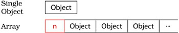

# 1. Accustoming Yourself to C++

## Item 1: View C++ as a federation of languages

C++ is a multiparadigm programming language. To make sense of C++, you have to recognize its primary sublanguages:

* **C**

  Way down deep, C++ is still based on C. Blocks, statements, the preprocessor, built-in data types, arrays, pointers, etc., all come from C.

* **Object-Oriented C++**

  Classes (including constructors and destructors), encapsulation, inheritance, polymorphism, virtual functions (dynamic binding), etc.

* **Template C++**

  The generic programming part of C++

* **The STL**

  The STL is a template library with containers, iterators, algorithms, and function objects.

C++, isn't a unified language with a single set of rules; it's a federation of four sublanguages, each with its own conventions.

## Item 2: Prefer `const`s, `enum`s, and `inline`s to `#define`s

This Item might better be called “prefer the compiler to the preprocessor（宁可以编译器替换预处理器）,” because `#define` may be treated as if it's not part of the language.

When you do something like this:

```c++
#define ASPECT_RATIO 1.653
```

The symbolic name `ASPECT_RATIO` may never be seen by compilers; it may be removed by the preprocessor before the source code ever gets to a compiler. As a result, This can be confusing if you get an error during compilation involving the use of the constant, because the error message may refer to `1.653`, not `ASPECT_RATIO`.

The solution is to replace the macro with a constant:

```c++
const double AspectRatio = 1.653;
```

In the case of a floating point constant (such as in this example), use of the constant may yield smaller code than using a `#define`:

That's because the preprocessor's blind substitution of the macro name `ASPECT_RATIO` with `1.653` could result in multiple copies of `1.653` in your object code, while the use of the constant `AspectRatio` should never result in more than one copy.

### 2.1 class-specific constants

To limit the scope of a constant to a class, you must make it a member, and to ensure there's at most one copy of the constant, you must make it a static member:

```c++
class GamePlayer {
private:
	static const int NumTurns = 5; 	// constant declaration
	int scores[NumTurns]; 			// use of constant
	...
};
```

**<font color='red'>What you see above is a declaration for `NumTurns`, not a definition.</font>** 

**<font color='red'>Usually, C++ requires that you provide a definition for anything you use, but class-specific constants that are `static` and of integral type (e.g., integers, `char`s, `bool`s) are an exception.</font>**

As long as you don't take their address, you can declare them and use them without providing a definition.

If you do take the address of a class constant, or if your compiler incorrectly insists on a definition even if you don't take the address, you provide a **separate definition** like this:

```c++
const int GamePlayer::NumTurns; // definition of NumTurns;
```

Because the initial value of class constants is provided where the constant is declared (e.g., `NumTurns` is initialized to `5` when it is declared), no initial value is permitted at the point of definition.

### 2.2 the `enum` hack 

Older compilers may not accept the syntax above, because it used to be illegal to provide an initial value for a static class member at its point of declaration. Instead, you can put the initial value at the point of definition:

```c++
class CostEstimate {
private:
	static const double FudgeFactor; 	// declaration of static class
	... 									// constant; goes in header file
};
const double CostEstimate::FudgeFactor = 1.35; // definition of static class constant; goes in impl. file
```

This is all you need almost all the time. The only exception is when you need the value of a class constant during compilation of the class, such as in the
declaration of the array `GamePlayer::scores` above. Then the accepted way to compensate for compilers that (incorrectly) forbid the in-class specification of initial values for `static` integral class constants is to use what is known as “**<font color='blue'>the enum hack</font>**.”

```c++
class GamePlayer {
private:
	enum { NumTurns = 5 }; 	// "the enum hack" — makes NumTurns a symbolic name for 5
	int scores[NumTurns]; 	// fine
	...
};
```

This technique takes advantage of the fact that the values of an enumerated type can be used where `int`s are expected.

The `enum` hack behaves in some ways more like a `#define` than a `const` does：

It's legal to take the address of a `const`, but it's not legal to take the address of an `enum`, and it's typically not legal to take the address of a `#define`, either. If you don't want to let people get a pointer or reference to one of your integral constants, an `enum` is a good way to enforce that constraint.

### 2.3 ⭐function-like macros

Using `#define` to implement macros that look like functions but that don't incur the overhead of a function call:

```c++
// call f with the maximum of a and b
#define CALL_WITH_MAX(a, b) f((a) > (b) ? (a) : (b))
```

Macros like this have so many drawbacks:

* Whenever you write this kind of macro, you have to remember to parenthesize all the arguments in the macro body. Otherwise you can run into
  trouble when somebody calls the macro with an expression. 

* But even if you get that right, look at the weird things that can happen:

  ```c++
  int a = 5, b = 0;
  CALL_WITH_MAX(++a, b); // a is incremented twice
  CALL_WITH_MAX(++a, b+10); // a is incremented once
  ```

  Here, the number of times that `a` is incremented before calling `f` depends on what it is being compared with!

**<font color='red'>You can get all the efficiency of a macro plus all the predictable behavior and type safety of a regular function by using a template for an `inline` function:</font>**

```c++
template<typename T>
inline void callWithMax(const T& a, const T& b)
{ 
	f(a > b ? a : b); 
}
```

## Item3: Use `const` whenever possible

### 3.1 `const` for Pointers

```c++
char greeting[] = "Hello";
char *p = greeting; 				// non-const pointer, non-const data
const char *p = greeting; 			// non-const pointer, const data
char * const p = greeting; 			// const pointer, non-const data
const char * const p = greeting; 	// const pointer, const data
```

If the word `const` appears to the left of the asterisk, what's pointed to is constant; if the word `const` appears to the right of the asterisk, the pointer itself is constant; if `const` appears on both sides, both are constant.

**<font color='red'>When what's pointed to is constant, some programmers list `const` before the type. Others list it after the type but before the `asterisk`. There is no difference in meaning:</font>**

```c++
void f1(const Widget *pw);
void f2(Widget const *pw);
```

The funcions take the same parameter  type.

### 3.2 `const` for Iterators

An iterator acts much like a `T*` pointer. Declaring an iterator `const` is like declaring a pointer `const` (i.e., declaring a `T* const` pointer): the iterator isn't allowed to point to something different, but the thing it points to may be modified. 

If you want an iterator that points to something that can't be modified, you want a `const_iterator`:

```c++
vector<int> vec;
const vector<int>::iterator iter = vec.begin();		// iter acts like a T* const
*iter = 10; 										// OK, changes what iter points to
++iter; 											// error! iter is const

vector<int>::const_iterator cIter = vec.begin();	//cIter acts like a const T*
*cIter = 10; 										// error! *cIter is const
++cIter; 											// fine, changes cIter
```

### 3.3 `const` Member Functions

The purpose of `const` on member functions is to identify which member functions may be invoked on `const` objects.

One of the fundamental ways to improve a C++ program's performance is to pass objects by reference-to-`const`. That technique is viable only if there are `const` member functions with which to manipulate the resulting `const`-qualified objects.

#### member functions differing only in their constness can be overloaded

Consider a class for representing a block of text:

```c++
class TextBlock {
public:
	...
	const char& operator[](size_t position) const 	//operator[] for const objects
		{ return text[position]; }
	char& operator[](std::size_t position) 			//operator[] for non-const objects
		{ return text[position]; }
private:
	string text;
};
```

```c++
TextBlock tb("Hello");
std::cout << tb[0]; // calls non-const TextBlock::operator[]

const TextBlock ctb("World");
std::cout << ctb[0]; // calls const TextBlock::operator[]
```

By overloading `operator[]` and giving the different versions different return types, you can have `const` and non-`const` `TextBlock`s handled differently:

```c++
std::cout << tb[0]; 	// fine — reading a non-const TextBlock
tb[0] = 'x'; 			// fine — writing a non-const TextBlock
std::cout << ctb[0]; 	// fine — reading a const TextBlock
ctb[0] = 'x'; 			// error! — writing a const TextBlock
```

#### ⭐What does it mean for a member function to be `const`?

* **bitwise constness**

  The bitwise `const` camp believes that a member function is `const` if and only if it doesn't modify any of the object's data members (excluding those that are `static`), i.e., if it doesn't modify any of the bits inside the object.

  Unfortunately, many member functions that don't act very `const` pass the bitwise test.

  ```c++
  class CTextBlock {
  public:
  	...
  	char& operator[](std::size_t position) const 	// inappropriate (but bitwise const) declaration of operator[]
  		{ return pText[position]; }
  private:
  	char *pText;
  };
  ```

  `operator[]`'s implementation doesn't modify `pText` in any way. As a result, compilers will happily generate code for `operator[]`; it is, after all, bitwise `const`, and that's all compilers check for. But look what it allows to happen:

  ```c++
  const CTextBlock cctb("Hello"); 	// declare constant object
  char *pc = &cctb[0]; 				// call the const operator[] to get a pointer to cctb's data
  *pc = 'J'; 							// cctb now has the value "Jello"
  ```

  You create a constant object with a particular value, yet you still change its value!

* **logical constness**

  logical constness belives that a `const` member function might modify some of the bits in the object on which it's invoked, but only in ways that **<font color='red'>clients cannot detect</font>**.

  For example, your `CTextBlock` class might want to cache the length of the textblock whenever it's requested. We can use `mutable` to implement solve this problem. `mutable` frees non-`static` data members from the constraints of bitwise constness.

  ```c++
  class CTextBlock {
  public:
  	...
  	size_t length() const;
  private:
  	char *pText;
  	mutable size_t textLength; // these data members may always be modified, even in const member functions
  	mutable bool lengthIsValid;
  };
  
  size_t CTextBlock::length() const
  {
  	if (!lengthIsValid) {
  		textLength = strlen(pText);
  		lengthIsValid = true;
  	}
  	return textLength;
  }
  ```

> Compilers enforce bitwise constness, but you should program using logical constness.

### 3.4 ⭐Avoiding Duplication in `const` and Non-`const` Member Functions

Sometimes, there may be duplicate processes in both `const` and non-`const` member functions.  For example, suppose that `operator[]` in `TextBlock` (and `CTextBlock`) not only returned a reference to the appropriate character, it also performed bounds checking, logged access information, maybe even did data integrity validation.

It's possible to move all the process codes into a separate member function (`private`, naturally) that both versions call, but you've still got the
duplicated calls to that function and you've still got the duplicated `return` statement code.

**<font color='red'>What you really want to do is implement `operator[]` functionality once and use it twice.</font>** That is, you want to have one version of `operator[]` call the other one. And that brings us to**<font color='red'> casting away constness</font>**.

In this case, the `const` version of `operator[]` does exactly what the non-`const` version does, it just has a `const`-qualified return type. So **<font color='red'>having the non-`const` `operator[]` call the `const` version</font>** is a safe way to avoid code duplication, even though it requires a cast.

```c++
class TextBlock {
public:
	...
	const char& operator[](std::size_t position) const // same as before
	{
		... // do bounds checking
		... // log access data
		... // verify data
		return text[position];
	}
	char& operator[](std::size_t position) // now just calls const op[]
	{
		return const_cast<char&>(static_cast<const TextBlock&>(*this)[position]); 	// cast away const on op[]'s return type;
 																					// add const to *this's type;
                                 													// call const version of op[]
    }
	...
};
```

We have two casts

* one to add `const` to `*this`

  The cast that adds `const` is just forcing a **<font color='red'>safe conversion</font>** (from a non-`const` object to a `const` one), so we use a `static_cast` for that.

* the second to remove the `const` from the `const operator[]`'s return value

  The one that removes `const` can be accomplished only via a `const_cast`, so we don't really have a choice there.

**<font color='red'>Having a `const` member function call a non-`const` one is wrong</font>**: A `const` member function promises never to change the logical state of its object, but a non-`const` member function makes no such promise. If you were to call a non-`const` function from a `const` one, you'd run the risk that the object you'd promised not to modify would be changed.

> When `const` and non-`const` member functions have essentially identical implementations, code duplication can be avoided by having the non-`const` version call the `const` version.

## Item4: Make sure that objects are initialized before they're used

There are rules that describe when object initialization is guaranteed to take place and when it isn't. Unfortunately, the rules are complicated — too
complicated to be worth memorizing. The best way to deal with this seemingly indeterminate state of affairs is to **<font color='red'>always initialize your objects before you use them</font>**. 

### 4.1 non-member objects of built-in types

For non-member objects of built-in types, you'll need to initialize your objects manually:

```c++
int x = 0; 									// manual initialization of an int
const char * text = "A C-style string"; 	// manual initialization of a pointer
double d; 									// "initialization" by reading from an input stream
std::cin >> d; 							
```

### 4.2 constuctors and initialization

For almost everything else, the responsibility for initialization falls on constructors. The rule there is simple: make sure that all constructors initialize everything in the object. But it's important not to confuse assignment with initialization:

```c++
class ABEntry {
public:
	ABEntry(const string& name, const string& address, const list<PhoneNumber>& phones);
private:
	string theName;
	string theAddress;
	list<PhoneNumber> thePhones;
	int num TimesConsulted;
};

ABEntry::ABEntry(const string& name, const string& address, const list<PhoneNumber>& phones)
{
    // these are all assignments,not initializations
	theName = name; 		
	theAddress = address;
	thePhones = phones;
	numTimesConsulted = 0;
}
```

Inside the `ABEntry` constructor, `theName`, `theAddress`, and `thePhones` aren't being initialized, they're being assigned. Initialization took place earlier — when their default constructors were automatically called prior to entering the body of the `ABEntry` constructor. This isn't true for `numTimesConsulted`, because it's a built-in type. For it, there's no guarantee it was initialized at all prior to its assignment.

**<font color='red'>A better way to write the `ABEntry` constructor is to use the member initialization list instead of assignments:</font>**

```c++
ABEntry::ABEntry(const std::string& name, const std::string& address, const std::list<PhoneNumber>& phones)
					: theName(name),			// these are now all initializations		
					theAddress(address), 	
					thePhones(phones),
					numTimesConsulted(0)
{} // the ctor body is now empty
```

This constructor yields the same end result as the one above, but it will often be more efficient.

* The assignment-based version first called default constructors to initialize `theName`, `theAddress`, and `thePhones`, then promptly assigned new values on top of the default-constructed ones. All the work performed in those default constructions was therefore wasted.
* The member initialization list approach avoids that problem, because the arguments in the initialization list are used as constructor arguments for the various data members. In this case, `theName` is **<font color='red'>copy-constructed</font>** from `name`, `theAddress` is copy-constructed from `address`, and `thePhones` is copy-constructed from `phones`.
* For objects of built-in type like `numTimesConsulted`, there is no difference in cost between initialization and assignment, but for consistency, it's often best to initialize everything via member initialization.

> Compilers will automatically call default constructors for data members of user-defined types when those data members have no initializers on the member initialization list

Sometimes the initialization list must be used, even for built-in types. For example, data members that are `const` or are references must be initialized;
they can't be assigned.

#### The order in which an object's data is initialized

This order is always the same: base classes are initialized before derived classes, and within a class, **<font color='red'>data members are initialized in the order in which they are declared</font>**. This is true even if they are listed in a different order on the member initialization list. 

### 4.3 The order of initialization of non-local `static` objects defined in different translation units

A static object is one that exists from the time it's constructed until the end of the program:

* global objects
* objects defined at namespace scope
* objects declared `static` inside classes
* objects declared `static` inside functions
* objects declared `static` at file scope

Static objects inside functions are known as**<font color='blue'> local static objects</font>** (because they're local to a function), and the other kinds of static objects are known as **<font color='blue'>non-local static</font>** objects.

A **<font color='blue'>translation unit</font>**(编译单元) is the source code giving rise to a single object file(单一目标文件). It's basically a single source file, plus all of its `#include` files.

The problem we're concerned with, then, involves at least two separately compiled source files, each of which contains at least one non-local `static`
object. And the actual problem is this:

 if initialization of a non-local `static` object in one translation unit uses a non-local `static` object in a different translation unit, the object it uses could be uninitialized, because**<font color='red'> the relative order of initialization of non-local `static` objects defined in different translation units is undefined.</font>**

```c++
class FileSystem { 	// from your library’s header file
public:
	...
	size_t numDisks() const; // one of many member functions
	...
};
extern FileSystem tfs; 	// declare object for clients to use, definition is in some .cpp file in your library
```

```c++
class Directory { // created by library client
public:
	Directory( params );
	...
};
Directory::Directory( params )
{
	...
	size_t disks = tfs.numDisks(); // use the tfs object
	...
}
Directory tempDir( params ); // directory for temporary files
```

Now the importance of initialization order becomes apparent: unless `tfs` is initialized before `tempDir`, `tempDir`'s constructor will attempt to use `tfs` before it's been initialized. But `tfs` and `tempDir` were created by different people at different times in different source files — they're non-local `static` objects defined in different translation units. You can't be sure that `tfs` will be initialized before `tempDir`.

#### Solution: using local `static` objects instead of non-local `static` objects

Move each non-local static object into its own function, where it's declared `static`. These functions return references to the objects they contain. **<font color='red'>Clients then call the functions instead of referring to the objects</font>**. In other words, non-local `static` objects are replaced with local `static` objects.

This approach is founded on C++'s guarantee that local `static` objects are initialized when the object's definition is first encountered during a call to that function. So if you replace direct accesses to non-local `static` objects with calls to functions that return references to local `static` objects, you're
guaranteed that the references you get back will refer to initialized objects.

```c++
class FileSystem { ... }; 	
FileSystem& tfs() 			
{ 							
	static FileSystem fs; 
	return fs; 				
}
class Directory { ... }; 			
Directory::Directory( params ) 		
{ 									
	...
	size_t disks = tfs().numDisks();
	...
}
```

The reference-returning functions dictated by this scheme are always simple: define and initialize a local `static` object on line 1, return it on line 2. This
simplicity makes them excellent candidates for inlining, especially if they're called frequently.

# 2. Constructors, Destructors, and Assignment Operators

## Item 5: Know what functions C++ silently writes and calls

If you don't declare them yourself, compilers will declare their own versions of a **copy constructor**, a **copy assignment operator**, and a **destructor**.
Furthermore, if you declare no constructors at all, compilers will also declare a **default constructor** for you. All these functions will be both `public` and
`inline`.

**<font color='red'>These functions are generated only if they are needed</font>**. The following code will cause each function to be generated:

```c++
Empty e1; 		// default constructor;
				// destructor
Empty e2(e1); 	// copy constructor
e2 = e1; 		// copy assignment operator
```

For the copy constructor and the copy assignment operator, the compiler-generated versions simply copy each non-`static` data member of the source
object over to the target object. 

For example, consider a `NamedObject` template that allows you to associate names with objects of type `T`:

```c++
template<typename T>
class NamedObject {
public:
	NamedObject(const char *name, const T& value);
	NamedObject(const std::string& name, const T& value);
	...
private:
	std::string nameValue;
	T objectValue;
};
```

```c++
NamedObject<int> no1("Smallest Prime Number", 2);
NamedObject<int> no2(no1); // calls copy constructor
```

The copy constructor generated by compilers must initialize `no2.nameValue` and `no2.objectValue` using `no1.nameValue` and `no1.objectValue`:

* The type of `nameValue` is `string`, and the standard `string` type has a copy constructor, so `no2.nameValue` will be initialized by **<font color='red'>calling the `string` copy constructor</font>** with `no1.nameValue` as its argument.
* The type of `objectValue` is `int` , and `int` is a built-in type, so `no2.objectValue` will be initialized by **<font color='red'>copying the bits</font>** in `no1.objectValue`.

### 5.1 Compilers  may refuse to generate an `operator=` for class

In general, compiler-generated copy assignment operators only when the resulting code is both legal and has a reasonable chance of making sense. If either of these tests fails, compilers will refuse to generate an `operator=` for your class.

1. **Classes containing reference members**

   For example, suppose `NamedObject` were defined like this, where `nameValue` is a reference to a `string` and `objectValue` is a `const T`:

   ```c++
   template<typename T>
   class NamedObject {
   public:
   	// this ctor no longer takes a const name, because nameValue
   	// is now a reference-to-non-const string. The char* constructor
   	// is gone, because we must have a string to refer to.
   	NamedObject(string& name, const T& value);
   	... // as above, assume no
   		// operator= is declared
   private:
   	string& nameValue; 		// this is now a reference
   	const T objectValue; 	// this is now const
   };
   ```

   ```c++
   std::string newDog("Persephone");
   std::string oldDog("Satch");
   NamedObject<int> p(newDog, 2);
   NamedObject<int> s(oldDog, 36);
   p = s; // what should happen to the data members in p?
   ```

   How should the assignment affect `p.nameValue`? 

   * Should `p.nameValue` refer to the `string` referred to by `s.nameValue`, i.e., should the reference itself be modified?

     If so, that breaks new ground, because **<font color='red'>C++ doesn't provide a way to make a reference refer to a different object.</font>**

   * Should the `string` object to which `p.nameValue` refers be modified, thus affecting other objects that hold pointers or references to that `string`?

   Faced with this conundrum, C++ refuses to compile the code. If you want to support copy assignment in a class containing a reference member, you must define the copy assignment operator yourself.

2. **Classes containing `const` members**

   Compilers behave similarly for classes containing `const` members. It's not legal to modify `const` members, so compilers are unsure how to treat them during an implicitly generated assignment function.

3. **Derived classes that inherit from base classes declaring the copy assignment operator `private`.**

   Compiler-generated copy assignment operators for derived classes are supposed to handle base class parts, too, but in doing so, they certainly can't invoke member functions the derived class has no right to call.

## Item 6: Explicitly disallow the use of compiler generated functions you do not want
Usually, if you don't want a class to support a particular kind of functionality, you simply don't declare the function that would provide it. This strategy doesn't work for the copy constructor and copy assignment operator, because if you don't declare them and somebody tries to call them, compilers declare them for you.

### 6.1 Declaring member functions `private` and deliberately not implementing them

1. By declaring a member function explicitly, you prevent compilers from generating their own version.

2. By making the function `private`, you keep people from calling it.

3. But member and friend functions can still call your private functions. By deliberately not implementing them, if somebody inadvertently calls one, they'll get an error **<font color='red'>at link-time</font>**.

```c++
class HomeForSale {
public:
	...
private:
	...
	HomeForSale(const HomeForSale&); 			// declarations only
	HomeForSale& operator=(const HomeForSale&);
};
```

### 6.2 Declaring the copy constructor and copy assignment operator `private` in a base class

It's possible to move the link-time error up to compile time (always a good thing — earlier error detection is better than later) by declaring the copy
constructor and copy assignment operator `private` not in `HomeForSale` itself, but in a base class specifically designed to prevent copying:

```c++
class Uncopyable {
protected: 				// allow construction
	Uncopyable() {} 	// and destruction of
	~Uncopyable() {} 	// derived objects...
private:
	Uncopyable(const Uncopyable&); // ...but prevent copying
	Uncopyable& operator=(const Uncopyable&);
};
```

To keep `HomeForSale` objects from being copied, all we have to do now is inherit from `Uncopyable`

```c++
class HomeForSale: private Uncopyable { // class no longer
	...									// declares copy ctor or
}; 										// copy assign operator
```

Compilers will try to generate a copy constructor and a copy assignment operator if anybody tries to copy a `HomeForSale` object. The compiler-generated versions of these functions will **<font color='red'>try to call their base class counterparts, and those calls will be rejected</font>**, because the copying operations are `private` in the base class.

The implementation and use of `Uncopyable` include some subtleties: 

* inheritance from `Uncopyable` needn't be `public`
* `Uncopyable`'s destructor need not be virtual

### 6.3 Defining a Function as Deleted

Under the new standard, we can prevent copies by defining the copy constructor and copy-assignment operator as deleted functions.

A deleted function is one that is declared but may not be used in any other way. We indicate that we want to define a function as deleted by following its parameter list with `= delete`.

```c++
struct NoCopy {
	NoCopy() = default; 						// use the synthesized default constructor
	NoCopy(const NoCopy&) = delete; 			// no copy
	NoCopy &operator=(const NoCopy&) = delete; 	// no assignment
    ~NoCopy() = default; 						// use the synthesized destructor
	// other members
};
```

## Item 7: Declare destructors virtual in **<font color='red'>polymorphic base classes</font>** （多态基类）

### 7.1 Virtual destructors in polymorphic base classes

Suppose we create a `TimeKeeper` base class along with derived classes for different approaches to timekeeping:

```c++
class TimeKeeper {
public:
	TimeKeeper();
	~TimeKeeper();
	...
};
class AtomicClock: public TimeKeeper { ... };
class WaterClock: public TimeKeeper { ... };
class WristWatch: public TimeKeeper { ... };
```

Many clients will want access to the time without worrying about the details of how it's calculated, so a **<font color='red'>factory function — a function that returns a base
class pointer to a newly-created derived class object</font>** — can be used to return a pointer to a `timekeeping` object:

```c++
TimeKeeper* getTimeKeeper(); 	// returns a pointer to a dynamically
								// allocated object of a class derived from TimeKeeper
```

In keeping with the conventions of factory functions, the objects returned by `getTimeKeeper` are on the heap, so to avoid leaking memory and other
resources, it's important that **<font color='red'>each returned object be properly deleted</font>**:

```c++
TimeKeeper *ptk = getTimeKeeper(); 	// get dynamically allocated object from TimeKeeper hierarchy
... 								// use it
delete ptk; 						// release it to avoid resource leak
```

The problem is that `getTimeKeeper` returns **<font color='red'>a pointer to a derived class object</font>** , that object **<font color='red'>is being deleted via a base class pointer</font>** and **<font color='red'>the base class has a non-virtual destructor</font>**.

 What typically happens at runtime is that the derived part of the object is never destroyed. If `getTimeKeeper` were to return a pointer to an `AtomicClock` object, the `AtomicClock` part of the object would probably not be destroyed, nor would the `AtomicClock` destructor run. However, the base class part typically would be destroyed, thus leading to a curious **<font color='red'>“partially destroyed” object</font>**. This is an excellent way to leak resources, corrupt data structures, and spend a lot of time with a debugger.

### 7.2 In some cases, making the destructor virtual may be a bad idea

Any class with virtual functions should almost certainly have a virtual destructor. If a class does not contain virtual functions, that often indicates it is not
meant to be used as a base class. When a class is not intended to be a base class, making the destructor virtual is usually a bad idea.

```c++
class Point { // a 2D point
public:
	Point(int xCoord, int yCoord);
	~Point();
private:
	int x, y;
};
```

If an `int` occupies 32 bits, a `Point` object can typically fit into a 64-bit register. If `Point`'s destructor is made virtual, however, the situation changes:

The implementation of virtual functions requires that objects carry information that can be used at runtime to determine which virtual functions should be invoked on the object. This information typically takes the form of a pointer called a `vptr` (“**<font color='blue'>virtual table pointer</font>**”). The `vptr` points to an array of
function pointers called a `vtbl` (“**<font color='blue'>virtual table</font>**”); each class with virtual functions has an associated `vtbl`. When a virtual function is invoked on an object, the actual function called is determined by following the object's `vptr` to a `vtbl` and then looking up the appropriate function pointer in the `vtbl`. As a result, **<font color='red'>if the `Point` class contains a virtual function, objects of that type will increase in size.</font>**

> Declare a virtual destructor in a class if and only if that lass contains at least one virtual function.

It is possible to get bitten by the non-virtual destructor problem even in the complete absence of virtual functions. For example, the standard `string` type contains no virtual functions, but misguided programmers sometimes use it as a base class anyway:

```c++
class SpecialString: public std::string { 	// bad idea! std::string has a non-virtual destructor

};
```

The same analysis applies to any class lacking a virtual destructor, including all the STL container types.

### 7.3 Pure virtual destructor

Pure virtual functions result in abstract classes — classes that can't be instantiated. 

Sometimes, however, you have a class that you'd like to be abstract, but you don't have any pure virtual functions. The solution is simple: declare a pure virtual destructor in the class you want to be abstract.

```c++
class AWOV {
public:
	virtual ~AWOV() = 0; // declare pure virtual destructor
};
```

There is one twist, however: **<font color='red'>you must provide a definition for the pure virtual destructor</font>**:

```c++
AWOV::~AWOV() {} 		// definition of pure virtual dtor
```

The way destructors work is that the most derived class's destructor is called first, then the destructor of each base class is called. **<font color='red'>Compilers will generate a call to `~AWOV` from its derived classes' destructors, so you have to be sure to provide a body for the function.</font>** If you don't, the linker will complain.

## Item 8: Prevent exceptions from leaving destructors 别让异常逃离析构函数

Consider:

```c++
class Widget {
public:
	...
	~Widget() { ... } // assume this might emit an exception
};
void doSomething()
{
	std::vector<Widget> v;
	...
} // v is automatically destroyed here
```

Suppose `v` has ten `Widget`s in it, and during destruction of the first one, an exception is thrown. The other nine `Widget`s still have to be destroyed, so `v` should invoke their destructors. But suppose that during those calls, a second `Widget` destructor throws an exception. Now there are two simultaneously active exceptions, and that's one too many for C++. Depending on the precise conditions under which such pairs of simultaneously active exceptions arise, program execution either terminates or yields undefined behavior.

### 8.1 What should you do if your destructor needs to perform an operation that may fail by throwing an exception?

Suppose you're working with a class for database connections. And you have a resource-managing class for `DBConnection` that calls `close` in its desturctor.

```c++
class DBConnection {
public:
	...
	static DBConnection create(); 	// function to return DBConnection objects
	void close(); 					// close connection; throw an exception if closing fails
};

class DBConn { 	// class to manage DBConnection objects
public:
	...
	~DBConn() // make sure database connections are always closed
	{
		db.close();
	}
private:
	DBConnection db;
};
```

This is fine as long as the call to close succeeds, but if the call yields an exception, `DBConn`'s destructor will propagate that exception. That's a problem, because destructors that throw mean trouble.

There are two primary ways to avoid the trouble. `DBConn`'s destructor could:

1. **<font color='red'>Terminate the program</font>** if `close` throws, typically by calling `abort`

   ```c++
   DBConn::~DBConn()
   { 
   	try {
   		db.close();
       }
   	catch (...) {
   		make log entry that the call to close failed;
   		std::abort();
   	}
   }
   ```

2. **<font color='red'>Swallow the exception</font>** arising from the call to `close`:

   ```c++
   DBConn::~DBConn()
   {
       try {
   		db.close();
       }
   	catch (...) {
   		make log entry that the call to close failed;
   	}
   }
   ```

   In general, swallowing exceptions is a bad idea, because it suppresses important information — something failed! Sometimes, however, swallowing
   exceptions is preferable to running the risk of premature program termination or undefined behavior. 

   For this to be a viable option, the program must be able to reliably continue execution even after an error has been encountered and ignored.

### 8.2 A better strategy

Neither of these approaches is especially appealing. The problem with both is that **<font color='red'>the program has no way to react to the condition that led to `close`
throwing an exception in the first place.</font>**

A better strategy is to design `DBConn`'s interface so that its clients have an opportunity to react to problems that may arise:

```c++
class DBConn {
public:
	...
	void close() // new function for client use
	{
        db.close();
		closed = true;
	}
	~DBConn()
	{
    	if (!closed) {	// close the connection if the client didn't
			try { 
				db.close();
			}
			catch (...) { // if closing fails, note that and terminate or swallow
				make log entry that call to close failed;
				...
			}
		}
	}
private:
	DBConnection db;
	bool closed;
};
```

`DBConn` offers a `close` function itself, thus giving clients a chance to handle exceptions arising from that operation. It also keep track of whether its `DBConnection` had been closed, closing it itself in the destructor if not. If the call to `close` were to fail in the `DBConnection` destructor, however, we'd be back to terminating or swallowing.

In this example, telling clients to call `close` themselves doesn't impose a burden on them; it gives them an opportunity to deal with errors they would otherwise have no chance to react to. If they don't find that opportunity useful, they can ignore it, relying on `DBConn`'s destructor to call `close` for them. If an error occurs at that point — if `close` does throw — they're in no position to complain if `DBConn` swallows the exception or terminates the program. After all, they had first crack at dealing with the problem, and they chose not to use it.

## Item 9: Never call virtual functions during construction or destruction

You shouldn't call virtual functions during construction or destruction, because the calls won't do what you think.

Suppose you've got a class hierarchy for modeling stock transactions:

```c++
class Transaction { // base class for all transactions
public:
	Transaction();
	virtual void logTransaction() const = 0; // make type-dependent log entry
	...
};
Transaction::Transaction() // implementation of base class ctor
{
	...
	logTransaction(); // as final action, log this transaction
}

class BuyTransaction: public Transaction { // derived class
public:
	virtual void logTransaction() const; // how to log transactions of this type
	...
};

class SellTransaction: public Transaction { // derived class
public:
	virtual void logTransaction() const; // how to log transactions of this type
	...
};
```

When the code `BuyTransaction b;` is executed, a `BuyTransaction` constructor will be called, but first, a `Transaction` constructor must be called.
Base class parts of derived class objects are constructed before derived class parts are. The last line of the `Transaction` constructor calls the virtual function `logTransaction`. 

The version of `logTransaction` that's called is the one in `Transaction`, not the one in `BuyTransaction` — even though the type of object being created is `BuyTransaction`.

There's a good reason for this seemingly counterintuitive behavior. Because **<font color='red'>base class constructors execute before derived class constructors, derived
class data members have not been initialized when base class constructors run.</font>** If virtual functions called during base class construction went down to derived classes, the derived class functions would almost certainly refer to local data members, but those data members would not yet have been initialized.

It's actually more fundamental than that. **<font color='red'>During base class construction of a derived class object, the type of the object is that of the base class.</font>** Not only do virtual functions resolve to the base class, but the parts of the language using runtime type information (e.g., `dynamic_cast` and `typeid`)
treat the object as a base class type.

The same reasoning applies during destruction. Once a derived class destructor has run, the object's derived class data members assume undefined
values, so C++ treats them as if they no longer exist. **<font color='red'>Upon entry to the base class destructor, the object becomes a base class object, and all parts of C++
— virtual functions, `dynamic_casts`, etc., — treat it that way.</font>**

### 9.1 How to ensure that the proper version of `logTransaction` is called each time an object in the Transaction hierarchy is created

Turn `logTransaction` into a non-virtual function in `Transaction`, then require that derived class constructors pass the necessary log information to the
`Transaction` constructor. That function can then safely call the non-virtual `logTransaction`.

```c++
class Transaction {
public:
	explicit Transaction(const std::string& logInfo);
	void logTransaction(const std::string& logInfo) const; // now a non-virtual func
	...
};
Transaction::Transaction(const std::string& logInfo)
{
	...
	logTransaction(logInfo); // now a non-virtual call
}

class BuyTransaction: public Transaction {
public:
	BuyTransaction( parameters )
		: Transaction(createLogString( parameters )) // pass log info to base class constructor
	{ ... }
private:
	static std::string createLogString( parameters );
};
```

In other words, since you can't use virtual functions to call down from base classes during construction（无法在构造期间使用virtual 函数从基类向下调用）,you can compensate by **<font color='red'>having derived classes pass necessary construction information up to base class constructors</font>** instead.

## Item 10: Have assignment operators return a reference to `*this`
One of the interesting things about assignments is that you can chain them together:

```c++
int x, y, z;
x = y = z = 15;
```

Also interesting is that assignment is **<font color='red'>right-associative</font>**, so the above assignment chain is parsed like this:

```c++
x = (y = (z = 15));
```

Here, `15` is assigned to `z`, then the result of that assignment (the updated `z`) is assigned to `y`, then the result of that assignment (the updated `y`) is assigned to x.

The way this is implemented is that assignment returns a reference to its lefthand argument, and that's the convention you should follow when you
implement assignment operators for your classes：

```c++
class Widget {
public:
	...
	Widget& operator=(const Widget& rhs) // return type is a reference to the current class
	{ 
		...
		return *this; // return the lefthand object
	}
	Widget& operator+=(const Widget& rhs) // the convention applies to +=, -=, *=, etc.
	{
		...
		return *this;
	}
	Widget& operator=(int rhs) // it applies even if the operator's parameter type is unconventional
	{
		... 
		return *this;	
	}
	...
};
```

## ⭐Item 11: Handle assignment to self in `operator=`

An assignment to self occurs when an object is assigned to itself. In general, code that operates on references or pointers to multiple objects of the same type needs to consider that the objects might be the same.

If you try to manage resources yourself,  you can fall into the trap of accidentally releasing a resource before you're done using it in your assignment operators. For example, suppose you create a class that holds a raw pointer to a dynamically allocated `Bitmap`:

```c++
class Bitmap { ... };
class Widget {
	...
private:
	Bitmap *pb; // ptr to a heap-allocated object
};

Widget& Widget::operator=(const Widget& rhs) // unsafe impl. of operator=
{
	delete pb; // stop using current bitmap
	pb = new Bitmap(*rhs.pb); // start using a copy of rhs's bitmap
	return *this;
}
```

When `*this` (the target of the assignment) and `rhs` are the same object, the `delete` not only destroys the `Bitmap` for the current object, it destroys the `Bitmap` for `rhs`, too.

### 11.1 identity test

The traditional way to prevent this error is to check for assignment to self via an identity test at the top of `operator=`

```c++
Widget& Widget::operator=(const Widget& rhs)
{
	if (this == &rhs) return *this; // identity test: if a self-assignment, do nothing
	delete pb;
	pb = new Bitmap(*rhs.pb);
	return *this;
}
```

This works, but the previous version of `operator=` wasn't just self-assignment-unsafe, it was also exception-unsafe, and **<font color='red'>this version continues to have exception trouble:</font>**If the “`new Bitmap`” expression yields an exception, the `Widget` will end up holding a pointer to a deleted `Bitmap`.

### 11.2 exception safety

Happily, making `operator=` exception-safe typically renders it self-assignment-safe, too. As a result, **<font color='red'>it's increasingly common to deal with issues of self-assignment by ignoring them, focusing instead on achieving exception safety.</font>**

In many cases, a careful ordering of statements can yield exception-safe (and self-assignment-safe) code. Here, for example, we just have to be careful not to `delete pb` until after we've copied what it points to:

```c++
Widget& Widget::operator=(const Widget& rhs)
{
	Bitmap *pOrig = pb; 		// remember original pb
	pb = new Bitmap(*rhs.pb);
	delete pOrig; 				// delete the original pb
	return *this;
}
```

Now, if `new Bitmap` throws an exception, `pb` (and the `Widget` it's inside of) remains unchanged. 

Even without the identity test, this code handles assignment to self, because we make a copy of the original `bitmap`, `delete` the original bitmap, then point to the copy we made.

### 11.3 copy and swap

An alternative to manually ordering statements in `operator=` to make sure the implementation is both exception- and self-assignment-safe is to use the
technique known as “**<font color='blue'>copy and swap</font>**:”

```c++
class Widget {
	...
	void swap(Widget& rhs); 	// exchange *this's and rhs's data;
};
Widget& Widget::operator=(const Widget& rhs)
{
	Widget temp(rhs); 	// make a copy of rhs's data
	swap(temp); 		// swap *this's data with the copy's
	return *this;
}
```

A variation on this theme takes advantage of the facts that

* A class's copy assignment operator may be declared to take its argument by value
* Passing something by value makes a copy of it

```c++
Widget& Widget::operator=(Widget rhs) 	// rhs is a copy of the object passed in
{ 										// note pass by val
	swap(rhs); 							// swap *this's data with the copy's
	return *this;
}
```

## Item 12: Copy all parts of an object

In well-designed object-oriented systems that encapsulate the internal parts of objects, only two functions copy objects: the aptly named **copy constructor** and **copy assignment operator**. We'll call these the copying functions.

Compilers will generate the copying functions, if needed, and they do precisely what you'd expect: they copy **all the data** of the object being copied.

When you declare your own copying functions, you are indicating to compilers that there is something about the default implementations you don't
like. Compilers don't tell you when your implementations are almost certainly wrong.

Especially, **<font color='red'>if you add a data member to a class, you need to make sure that you update the copying functions, too.</font>**

#### Copying functions in inheritance

Consider the following inheritance hierarchy:

```c++
class Customer {
public:
	... 
private:
	string name;
	Date lastTransaction;
};

class PriorityCustomer: public Customer { // a derived class
public:
	...
	PriorityCustomer(const PriorityCustomer& rhs);
	PriorityCustomer& operator=(const PriorityCustomer& rhs);
	...
private:
	int priority;
};

PriorityCustomer::PriorityCustomer(const PriorityCustomer& rhs)
		: priority(rhs.priority)
{
	logCall("PriorityCustomer copy constructor");
}
PriorityCustomer& PriorityCustomer::operator=(const PriorityCustomer& rhs)
{
	logCall("PriorityCustomer copy assignment operator");
	priority = rhs.priority;
	return *this;
}
```

The problem is that every `PriorityCustomer` also contains a copy of the data members it inherits from `Customer`, and those data members are not being copied at all.

`PriorityCustomer`'s copy constructor specifies no arguments to be passed to its base class constructor (i.e., it makes no mention of `Customer` on its member initialization list), so**<font color='red'> the `Customer` part of the `PriorityCustomer` object will be initialized by the `Customer`'s default constructor.</font>**That constructor will perform a default initialization for `name` and `lastTransaction`.

The situation is only slightly different for `PriorityCustomer`'s copy assignment operator. It makes no attempt to modify its base class data members in any way, so they'll remain unchanged.

Any time you take it upon yourself to **<font color='red'>write copying functions for a derived class, you must take care to also copy the base class parts</font>**. Those parts are typically `private`, so you can't access them directly. Instead, derived class copying functions must**<font color='red'> invoke their corresponding base class functions</font>**:

```c++
PriorityCustomer::PriorityCustomer(const PriorityCustomer& rhs)
	: Customer(rhs), // invoke base class copy ctor
	  priority(rhs.priority)
{
	logCall("PriorityCustomer copy constructor");
}
PriorityCustomer& PriorityCustomer::operator=(const PriorityCustomer& rhs)
{
	logCall("PriorityCustomer copy assignment operator");
	Customer::operator=(rhs); // assign base class parts
	priority = rhs.priority;
	return *this;
}
```

> In practice, the two copying functions will often have similar bodies, and this may tempt you to try to avoid code duplication by having one function call the other. 
>
> Don't try to implement one of the copying functions in terms of the other. Instead, put common functionality in a third function that both call.

# 3. Resource Management

A resource is something that, once you're done using it, you need to return to the system. If you don't, bad things happen. 

In C++ programs, the most commonly used resource is **dynamically allocated memory**. Other common resources include **file descriptors**, **mutex locks**, **database connections**, and **network sockets**.

## Item 13: Use objects to manage resources

Suppose we're working with a library for modeling investments (e.g., stocks, bonds, etc.), where the various investment types inherit from a root class
`Investment`:

```c++
class Investment { ... }; // root class of hierarchy of investment types
```

Further suppose that the way the library provides us with specific `Investment` objects is through a **<font color='red'>factory function</font>**

```c++
Investment* createInvestment(); // return ptr to dynamically allocated
								// object in the Investment hierarchy;
								// the caller must delete it
```

As the comment indicates, callers of createInvestment are responsible for deleting the object that function returns when they are done with it:

```c++
void f()
{
	Investment *pInv = createInvestment(); // call factory function
	... // use pInv
	delete pInv; // release object
}
```

There are several ways `f` could fail to `delete` the `investment` object it gets from `createInvestment`:

* There might be a premature `return` statement somewhere inside the “`...`” part of the function
* If the uses of `createInvestment` and `delete` were in a loop, and the loop was prematurely exited by a `break` or `goto` statement
* Some statement inside the “...” might throw an exception

### 13.1 Putting resources inside objects(often, smart pointers)

To make sure that the resource returned by `createInvestment` is always released, we need to **<font color='red'>put that resource inside an object whose destructor will
automatically release the resource when control leaves `f`</font>**.

The standard library's `auto_ptr` is tailor-made for this kind of situation. `auto_ptr` is a pointer-like object (a smart pointer) whose destructor automatically calls `delete` on what it points to.

```c++
void f()
{
	auto_ptr<Investment> pInv(createInvestment()); 	// call factory function
	... 											// use pInv as before
} // automatically delete pInv via auto_ptr's dtor

// auto_ptr在C++11中已经弃用，可用shared_ptr和unique_ptr代替
```

**<font color='red'>This simple example demonstrates the two critical aspects of using objects to manage resources:</font>**

* Resources are acquired and immediately turned over to resource-managing objects.

  Above, the resource returned by `createInvestment` is used to initialize the `auto_ptr` that will manage it. In fact, the idea of using objects to manage resources is often called Resource Acquisition Is Initialization (**<font color='blue'>RAII</font>**), because it's so common to acquire a resource and initialize a resource-managing object in the same statement.

* Resource-managing objects use their destructors to ensure that resources are released.

  Because destructors are called automatically when an object is destroyed (e.g., when an object goes out of scope), resources are correctly released, regardless of how control leaves a block.

> `createInvestment`'s raw pointer return type is an invitation to a resource leak, because it's so easy for callers to forget to call `delete` on the pointer they get back. Combatting that problem calls for an **<font color='blue'>interface modification</font>** to `createInvestment`, a topic addressed in Item 18.

## Item 14: Think carefully about copying behavior in resource-managing classes
Not all resources are heap-based, and for such resources, smart pointers are generally inappropriate as resource handlers. Sometimes you have to create your own resource-managing classes.

For example, suppose you're using a C API to manipulate mutex objects of type `Mutex` offering functions `lock` and `unlock`:

```c++
void lock(Mutex *pm); // lock mutex pointed to by pm
void unlock(Mutex *pm); // unlock the mutex
```

To make sure that you never forget to unlock a `Mutex` you've locked, you'd like to create a class to manage locks. 

The basic structure of such a class is dictated by the **<font color='blue'>RAII principle</font>** that resources are **<font color='red'>acquired during construction and released during destruction</font>**:

```c++
class Lock {
public:
	explicit Lock(Mutex *pm): mutexPtr(pm) { lock(mutexPtr); } // acquire resource
	~Lock() { unlock(mutexPtr); } // release resource
private:
	Mutex *mutexPtr;
};


```

Clients use `Lock` in the conventional RAII fashion:

```c++
Mutex m; 			// define the mutex you need to use
...
{ 					// create block to define critical section
	Lock ml(&m); 	// lock the mutex
	... 			// perform critical section operations
} 					// automatically unlock mutex at end of block
```

### 14.1 when a `Lock` object is copied, what should happen?

The problem is that when a `Lock` object is copied, what should happen? 

```c++
Lock ml1(&m); 	// lock m
Lock ml2(ml1); 	// copy ml1 to ml2
```

Typically you have the choices:

* **Prohibit copying**

  In many cases, it makes no sense to allow RAII objects to be copied. When copying makes no sense for an RAII class, you should prohibit it.

* **Reference-count the underlying resource**

  Sometimes it's desirable to hold on to a resource until the last object using it has been destroyed. When that's the case, copying an RAII object should increment the count of the number of objects referring to the resource.

  Often,**<font color='red'> RAII classes can implement reference-counting copying behavior by containing a `shared_ptr` data member.</font>** 

  Unfortunately, `shared_ptr`'s default behavior is to `delete` what it points to when the reference count goes to zero, and that's not what we want. When we're done with a `Mutex`, we want to `unlock` it, not `delete` it.

  Fortunately, `shared_ptr` allows specification of a “deleter” — a function or function object to be called when the reference count goes to zero:

  ```c++
  class Lock {
  public:
  	explicit Lock(Mutex *pm) 		// init shared_ptr with the Mutex
  		: mutexPtr(pm, unlock) 		// to point to and the unlock func
  	{ 								// as the deleter
  		lock(mutexPtr.get());
  	}
  private:
  	shared_ptr<Mutex> mutexPtr; // use shared_ptr instead of raw pointer
  };
  ```

  The `Lock` class no longer declares a destructor. The synthetized destructor automatically invokes the destructor of the class's non-`static` data members. In this case, that is `mutexPtr`. And `mutexPtr's` destructor will automatically call its deleter -- `unlock`.

* **Copy the underlying resource**

  Copying the resource-managing object should also copy the resource it wraps. That is, copying a resource-managing object performs a “**<font color='blue'>deep copy</font>**.”

  Some implementations of the standard `string` type consist of pointers to heap memory, where the characters making up the `string` are stored. Objects of such `string`s contain a pointer to the heap memory. When a `string` object is copied, a copy is made of both the pointer and the memory it points to. Such `string`s exhibit deep copying.

* **Transfer ownership of the underlying resource**

  On rare occasion, you may wish to make sure that only one RAII object refers to a raw resource and that when the RAII object is copied, ownership of the resource is transferred from the copied object to the copying object.

## Item 15: Provide access to raw resources in resource managing classes
Item 13 introduces the idea of using smart pointers  to hold the result of a call to a factory function like `createInvestment`:

```c++
shared_ptr<Investment> pInv(createInvestment());
```

Suppose that a function you'd like to use when working with `Investment` objects is this:

```c++
int daysHeld(const Investment *pi); // return number of days investment has been held
```

You'd like to call it like this,

```c++
int days = daysHeld(pInv); // error!
```

The code won't compile: `daysHeld` wants a raw `Investment*` pointer, but you're passing an object of type `shared_ptr<Investment>`.

You need a way to convert an object of the RAII class (in this case, `shared_ptr`) into the raw resource it contains (e.g., the underlying `Investment*`). There are two general ways to do it: explicit conversion and implicit conversion：

* `shared_ptr` offers a `get` member function to perform an explicit conversion, i.e., to return (a copy of) the raw pointer inside the smart pointer object:

  ```c++
  int days = daysHeld(pInv.get());
  ```

* `shared_ptr` also overloads the pointer dereferencing operators (`operator->` and `operator*`), and this allows implicit conversion to the underlying raw pointers:

  ```c++
  class Investment {
  public:
  	bool isTaxFree () const;
      ...
  };
  Investment* createinvestment();
  shared_ptr<Investment> pi1 (createinvestment());
  bool taxable1 = !(pi1->isTaxFree()); // access resource via operator->
  shared_ptr<Investment> pi2 (createinvestment());
  bool taxable2 = !((*pi2).isTaxFree()); // access resource via operator*
  ```

Because it is sometimes necessary to get at the raw resource inside an RAII object, some RAII class designers offer an implicit conversion function. For example, consider this RAII class for `fonts` that are native to a C API:

```c++
FontHandle getFont(); 				// from C API—params omitted for simplicity
void releaseFont(FontHandle fh); 	// from the same C API

class Font { 	// RAII class
public:
	explicit Font(FontHandle fh) 	// acquire resource;
		: f(fh) 					// use pass-by-value
	{} 
	~Font() { releaseFont(f); } 	// release resource
private:
	FontHandle f; // the raw font resource
};
```

Assuming there's a large font-related C API that deals entirely with `FontHandles`, there will be a frequent need to convert from `Font` objects to `FontHandles`. 

* **The Font class could offer an explicit conversion function such as get:**

  ```c++
  class Font {
  public:
  	...
  	FontHandle get() const { return f; } // explicit conversion function
  	...
  };
  ```

  Unfortunately, this would require that clients call `get` every time they want to communicate with the API:

  ```c++
  Font f(getFont());
  changeFontSize(f.get(), newFontSize);
  ```

* **The alternative is to have Font offer an implicit conversion function to its FontHandle**

  ```c++
  class Font {
  public:
  	...
  	operator FontHandle() const // implicit conversion function
  		{ return f; }
  ...
  };
  ```
  
  That makes calling into the C API easy and natural:
  
  ```c++
  Font f(getFont());
  changeFontSize(f, newFontSize);
  ```
  
  The downside is that implicit conversions increase the chance of errors. For example, a client might accidently create a `FontHandle` when a `Font` was intended:
  
  ```c++
  Font f1(getFont());
  ...
  FontHandle f2 = f1;
  ```
  
  Now the program has a `FontHandle` being managed by the `Font` object `f1`, but the `FontHandle` is also available for direct use as `f2`. When `f1` is destroyed, the `font` will be released, and `f2` will dangle.

## Item 16: Use the same form in corresponding uses of `new` and `delete`
When you employ a `new` expression, two things happen：

* memory is allocated (via a function named `operator new`)
* one or more constructors are called for that memory

When you employ a `delete` expression, two other things happen:

* one or more destructors are called for the memory
* the memory is deallocated (via a function named `operator delete`)

The big question for `delete` is this: *how many objects reside in the memory being deleted?* 

The answer to that determines how many destructors must be called. The memory layout for single objects is generally different from the memory layout for arrays. In particular, **<font color='red'>the memory for an array usually includes the size of the array</font>**, thus making it easy for `delete` to know how many
destructors to call：

 

If you use brackets in your use of `delete`, `delete` assumes an array is pointed to. Otherwise, it assumes that a single object is pointed to.

```c++
string *stringPtr1 = new string;
string *stringPtr2 = new string[100];
...
delete stringPtr1; 		// delete an object
delete [] stringPtr2; 	// delete an array of objects
```

What would happen if you used the “`[]`” form on `stringPtr1`? The result is undefined, but it's unlikely to be pretty. Assuming the layout above, `delete`
would read some memory and interpret what it read as an array size, then start invoking that many destructors, oblivious to the fact that the memory it's
working on not only isn't in the array, it's also probably not holding objects of the type it's busy destructing.

What would happen if you didn't use the “`[]`” form on `stringPtr2`? Well, that's undefined too, but you can see how it would lead to too few destructors being called. Furthermore, it's undefined (and sometimes harmful) for built-in types like `int`s, too, even though such types lack destructors.

The rule is simple: I

f you use `[]` in a `new` expression, you must use `[]` in the corresponding `delete` expression. 

If you don't use `[]` in a `new` expression, don't use `[]` in the matching `delete` expression.

## Item 17: Store `new`ed objects in smart pointers in standalone statements
Suppose we have a function to reveal our processing priority and a second function to do some processing on a dynamically allocated `Widget` in accord
with a priority.

Mindful of the wisdom of using objects to manage resources, `processWidget` uses a smart pointer for the dynamically allocated `Widget` it processes:

```c++
int priority();
void processWidget(shared_ptr<Widget> pw, int priority);
```

To call processWidget, we may write the code:

```c++
processWidget(shared_ptr<Widget>(new Widget),priority());
```

Surprisingly, although we're using object-managing resources everywhere here, **<font color='red'>this call may leak resources.</font>** Before `processWidget` can be called, compilers must generate code to do these three things:

* Call `priority`
* Execute “`new Widget`”
* Call the `shared_ptr`'s constructor

The “`new Widget`” expression must be executed before the `shared_ptr` constructor can be called, but the call to `priority` can be performed first, second, or third in C++.

If If compilers choose to perform it second, we end up with this sequence of operations:

* Execute “`new Widget`”
* Call `priority`
* Call the `shared_ptr` constructor

Here that is the problem, if the call to `priority` yields an exception, the pointer returned from “`new Widget`” will be lost, because it won't have been stored in the `shared_ptr` we were expecting.

A leak in the call to `processWidget` can arise because **<font color='red'>an exception can intervene between the time a resource is created (via “`new Widget`”) and the time that resource is turned over to a resource-managing object.</font>**

The way to avoid problems like this is simple: use a separate statement to create the `Widget` and store it in a smart pointer, then pass the smart pointer to `processWidget`:

```c++
shared_ptr<Widget> pw(new Widget); 	// store newed object in a smart pointer in a standalone statement
processWidget(pw, priority()); 		// this call won't leak
```

# 4. Designs and Declarations

## Item 18: Make interfaces easy to use correctly and hard to use incorrectly

Developing interfaces that are easy to use correctly and hard to use incorrectly requires that **<font color='red'>you consider the kinds of mistakes that clients might make</font>**.

For example, suppose you're designing the constructor for a class representing dates in time.

```c++
class Date {
public:
	Date(int month, int day, int year);
	...
};
```

For this interface, clients might pass parameters in the wrong order:

```c++
Date d(30, 3, 1995); // Oops! Should be "3, 30" , not "30, 3"
```

Or they might pass an invalid month or day number:

```c++
Date d(3, 40, 1995); // Oops! Should be "3, 30" , not "3, 40"
```

### 18.1 Introduce new types

**<font color='red'>Many client errors can be prevented by the introduction of new types. </font>**In this case, we can introduce simple wrapper types to distinguish days, months, and years, then use these types in the `Date` constructor:

```c++
struct Day {
    explicit Day(int d)
        :val(d) {}
    int val;
};
struct Month {
    explicit Month(int m)
        :val(m) {}
    int val;
};
struct Year{
	explicit Year(int y)
    	:val(y) {}
	int val;
};
class Date {
public:
	Date(const Month& m, const Day& d, const Year& y);
	...
};

Date d(30, 3, 1995); // error! wrong types
Date d(Day(30), Month(3), Year(1995)); // error! wrong types
Date d(Month(3), Day(30), Year(1995)); // okay, types are correct
```

### 18.2 Using functions instead of objects to represent specific months

Once the right types are in place, it can sometimes be reasonable to restrict the values of those types. For example, there are only 12 valid month values, so the `Month` type should reflect that. One way to do this would be to use an `enum` to represent the month, but `enum`s are not as type-safe as we might like. For example, `enum`s can be used like `int`s. A safer solution is to **<font color='red'>predefine the set of all valid `Month`s</font>**:

```c++
class Month {
public:
	static Month Jan() { return Month(1); } 	// functions returning all valid Month values
	static Month Feb() { return Month(2); } 	// using functions instead of objects to represent specific months
												// because reliable initialization of non-local static objects can be 			
    											// problematic
	... 										
	static Month Dec() { return Month(12); } 	
	... // other member functions
private:
	explicit Month(int m); // prevent creation of new Month values
	...
};
Date d(Month::Mar(), Day(30), Year(1995));
```

### 18.3 Any interface that requires that clients remember to do something is prone to incorrect use

For example, Item 13 introduces a factory function that returns pointers to dynamically allocated objects in an `Investment` hierarchy:

```c++
Investment* createInvestment(); // from Item 13; parameters omitted for simplicity
```

Item 13 shows how clients can store `createInvestment`'s return value in a smart pointer, thus turning over to the smart pointer the responsibility for using `delete`. But what if clients forget to use the smart pointer? 

In many cases, a better interface decision would be to preempt the problem by **<font color='red'>having the factory function return a smart pointer in the first place:</font>**

```c++
shared_ptr<Investment> createInvestment(); // from Item 13; parameters omitted for simplicity
```

## Item 19: Treat class design as type design

In C++, defining a new class defines a new type. You should therefore approach class design with the same care that language designers lavish on the design of the language's built-in types.

When you design your class, consider the following questions:

* **How should objects of your new type be created and destroyed?**

  The design of your class's constructors and destructor, as well as its memory allocation and deallocation functions (`operator new`, `operator new[]`, `operator delete`, and `operator delete[]`)

* **How should object initialization differ from object assignment?**

  The differences between your constructors and your assignment operators

* **What does it mean for objects of your new type to be passed by value?**

  The copy constructor defines how pass-by-value is implemented for a type

* **What are the restrictions on legal values for your new type?**

  The error checking you'll have to do inside your member functions

  The exceptions your functions throw

* **Does your new type fit into an inheritance graph?**

  If you inherit from existing classes, you are constrained by the design of those classes

  If you wish to allow other classes to inherit from your class, that affects whether the functions you declare are virtual, especially your destructor

* **<font color='red'>What kind of type conversions are allowed for your new type?</font>**

  * If you wish to allow objects of type `T1` to be implicitly converted into objects of type `T2`
    * Write a type conversion function in class `T1` (e.g., `operator T2`)
    * Write non-`explicit` constructor in class `T2` that can be called with a single argument
  * If you wish to allow explicit conversions only
    * You'll want to write functions to perform the conversions, but you'll need to avoid making them type conversion operators or non-`explicit` constructors that can be called with one argument.

* **What operators and functions make sense for the new type?**

  Which functions you'll declare for your class

* **What standard functions should be disallowed?**

  Those are the ones you'll need to declare `private`

* **Who should have access to the members of your new type?**

  This question helps you determine which members are `public`, which are `protected`, and which are `private`.

  It also helps you determine which classes and/or functions should be friends, as well as whether it makes sense to nest one class inside another.

* **How general is your new type?**

  Perhaps you're defining a whole family of types. If so, you don't want to define a new class, you want to define a new **class template**

* **Is a new type really what you need?**

  If you're defining a new derived class only so you can add functionality to an existing class, perhaps you'd better achieve your goals by simply defining one or more non-member functions or templates.

## Item 20: Prefer pass-by-reference-to-`const` to pass-by value

Unless you specify otherwise, function parameters are initialized with copies of the actual arguments, and**<font color='red'> function callers get back a copy of the value returned by the function</font>**. 

These copies are produced by the objects' copy constructors. This can make pass-by-value an expensive operation.

Pass by reference-to-const is much more efficient: no constructors or destructors are called, because no new objects are being created.

### 20.1 Passing parameters by reference also avoids the slicing problem.

When a derived class object is passed (by value) as a base class object, the base class copy constructor is called, and the specialized features that make the object behave like a derived class object are “sliced” off:

```c++
class Window {
public:
	...
	string name() const; 			// return name of window
	virtual void display() const; 	// draw window and contents
};
class Window-WithScrollBars: public Window {
public:
	...
	virtual void display() const;
};
```

Now suppose you'd like to write a function to print out a `Window`'s name and then display the `Window`. Here's the wrong way to write such a function

```c++
void printNameAndDisplay(Window w) 	// incorrect! parameter may be sliced!
{
	cout << w.name();
	w.display();
}
Window-WithScrollBars wwsb;
printNameAndDisplay(wwsb);
```

The parameter `w` will be constructed as a `Window` object, Inside `printNameAndDisplay`, `w` will always act like an object of class `Window`, regardless of the type of object passed to the function. In particular, the call to display inside `printNameAndDisplay` will always call `Window::display`, never `Window-WithScrollBars::display`.

The way around the slicing problem is to pass `w` by reference-to-`const`:

```c++
void printNameAndDisplay(const Window& w) // fine, parameter won't be sliced
{
	cout << w.name();
	w.display();
}
```

### 20.2 For built-in types and STL iterator and function object types, pass-by-value is usually appropriate

References are typically implemented as pointers, so passing something by reference usually means really passing a pointer. As a result, if you have an object of a **<font color='red'>built-in type</font>** (e.g., an `int`), it's often more efficient to pass it by value than by reference. 

This same advice applies to **<font color='red'>iterators </font>**and **<font color='red'>function objects in the STL</font>**, because, by convention, they are designed to be passed by value.

Built-in types are small, so some people conclude that all small types are good candidates for pass-by-value, even if they're user-defined. This is shaky
reasoning:

* Just because an object is small doesn't mean that calling its copy constructor is inexpensive. Many objects — most STL containers among them — contain little more than a pointer, but copying such objects entails copying everything they point to. That can be very expensive.
* Some compilers treat built-in and user-defined types differently. They refuse to put objects consisting of only a double into a register, but compilers will certainly put pointers (the implementation of references) into registers.
* Being user-defined, their size is subject to change. A type that's small now may be bigger in a future release, because its internal implementation may change.

## Item 21: Don't try to return a reference when you must return an object
### 21.1 Returning a local object

Consider a class for representing rational numbers, including a function for multiplying two rationals together:

```c++
class Rational {
public:
	Rational(int numerator = 0, int denominator = 1);
	...
private:
	int n, d; // numerator and denominator
friend const Rational operator*(const Rational& lhs, const Rational& rhs);
};

const Rational& operator*(const Rational& lhs, const Rational& rhs) // warning! bad code!
{
	Rational result(lhs.n * rhs.n, lhs.d * rhs.d);
	return result;
}
```

This function returns a reference to `result`, but `result` is a local object, and local objects are destroyed when the function exits. As a result, it returns a reference to an ex-`Rational`; a former `Rational`; the empty, stinking, rotting carcass of what used to be a `Rational` but is no longer, because it has been destroyed.

The fact is, **<font color='red'>any function returning a reference to a local object is broken</font>**.

### 21.2 Constructing an object on the heap and returning a reference to it

Heap-based objects come into being through the use of `new`, so you might write a heap-based `operator*` like this:

```c++
const Rational& operator*(const Rational& lhs, const Rational& rhs) // warning! more bad code!
{
	Rational *result = new Rational(lhs.n * rhs.n, lhs.d *rhs.d);
	return *result;
}
```

You will have a different problem: who will apply `delete` to the object conjured up by your use of `new`?

Even if callers are conscientious and well intentioned, there's not much they can do to prevent leaks in reasonable usage scenarios like this:

```c++
Rational w, x, y, z;
w = x * y * z; // same as operator*(operator*(x, y), z)
```

Here, there are two calls to `operator*` in the same statement, hence two uses of `new` that need to be undone with uses of `delete`. Yet there is no reasonable way for clients of `operator*` to make those calls, because there's no reasonable way for them to get at the pointers hidden behind the references being returned from the calls to `operator*`.

### 21.3 Returning a reference to a `static` Rational object defined inside the function

```c++
const Rational& operator*(const Rational& lhs, const Rational& rhs) 	// warning! yet more bad code!
{
	static Rational result; 	// static object to which a reference will be returned
	result = ... ; 				// multiply lhs by rhs and put the product inside result
	return result;
}
```

Consider this perfectly reasonable client code:

```c++
bool operator==(const Rational& lhs, const Rational& rhs);	// an operator== for Rationals
Rational a, b, c, d;
...
if ((a * b) == (c * d)){
	// do whatever's appropriate when the products are equal;
}
else{
	// do whatever's appropriate when they're not;
}
```

Guess what? The expression `((a*b) == (c*d))` will always evaluate to `true`, regardless of the values of `a`, `b`, `c`, and `d`!

This revelation is easiest to understand when the code is rewritten in its equivalent functional form:

```c++
if (operator*(a, b) == operator*(c, d))
```

Each of the calls to `operator*` will return a reference to the `static` `Rational` object inside `operator*`. Thus, `operator==` will be asked to compare the value of the `static Rational` object inside `operator*` with the value of the `static Rational` object inside `operator*`. It would be surprising indeed if they did not compare equal. Always.

### 21.4 Summary

The right way to write a function that must return a new object is to have that function return a new object:

```c++
inline const Rational operator*(const Rational& lhs, const Rational& rhs)
{
	return Rational(lhs.n * rhs.n, lhs.d * rhs.d);
}
```

## Item 22: Declare data members `private`

### 22.1 why data members shouldn't be `public`
1. If data members aren't `public`, the only way for clients to access an object is via member functions. If everything in the `public` interface is a function, clients won't have to scratch their heads trying to remember whether to use parentheses when they want to access a member of the class. They'll just do it, because everything is a function.
2. Using functions gives you much more precise control over the accessibility of data members. If you make a data member `public`, everybody has read-write access to it, but if you use functions to get or set its value, you can implement no access, read-only access, and read-write access.

3. Encapsulation

   If you implement access to a data member through a function, you can later replace the data member with a computation, and nobody using your class will be any the wiser. Clients will, at most, only have to recompile. (You can eliminate even that inconvenience by following the techniques described in Item 31.)

If you hide your data members from your clients (i.e., encapsulate them), you can ensure that **<font color='red'>class invariants</font>** are always maintained, because
only member functions can affect them. Furthermore, you reserve the right to change your implementation decisions later.

### 22.2 `protected` is no more encapsulated than `public`

1. The reasoning about syntactic consistency and fine-grained access control is clearly as applicable to `protected` data as to `public`

2. Encapsulation

   SomethinSg's encapsulation is inversely proportional to the amount of code that might be broken if that something changes.

   Suppose we have a `public` data member, and we eliminate it. How much code might be broken? All the client code that uses it, which is generally an
   **unknowably** large amount. `Public` data members are thus completely unencapsulated. 

   But suppose we have a `protected` data member, and we eliminate it. How much code might be broken now? All the derived classes that use it, which is, again, typically an **unknowably** large amount of code.

   `Protected` data members are thus as unencapsulated as `public` ones

## Item 23: Prefer non-member non-friend functions to member functions
Imagine a class for representing web browsers with a set of member functions:

```c++
class WebBrowser {
public:
	...
	void clearCache();
	void clearHistory();
	void removeCookies();
	...
};
```

Many users will want to perform all these actions together, so `WebBrowser` might also offer a function to do just that:

```c++
class WebBrowser {
public:
	...
	void clearEverything(); // calls clearCache, clearHistory, and removeCookies
	...
};
```

Of course, this functionality could also be provided by a non-member function that calls the appropriate member functions：

```c++
void clearBrowser(WebBrowser& wb)
{
	wb.clearCache();
	wb.clearHistory();
	wb.removeCookies();
}
```

So which is better, the member function `clearEverything` or the non-member function `clearBrowser`?

### 23.1 Encapsulation

Object-oriented principles dictate that data should be as **<font color='red'>encapsulated </font>**as possible. If something is encapsulated, it's hidden from view. The more something is encapsulated, the fewer things can see it. The fewer things can see it, the greater flexibility we have to change it.

Consider the data associated with an object. The less code that can see the data (i.e., access it), the more the data is encapsulated. **<font color='red'>We can count the number of functions that can access that data: the more functions that can access it, the less encapsulated the data.</font>**

For data members that are `private`, the number of functions that can access them is the number of member functions of the class plus the number of friend functions. Given a choice between a member function and a non-member non-friend function providing the same functionality, the choice yielding greater encapsulation is the non-member non-friend function.

Thus `clearBrowser` (the non-member non-friend function) is preferable to `clearEverything` (the member function): it yields greater encapsulation in the `WebBrowser` class.

### 23.2 Putting all convenience functions in multiple header files — but one namespace
In C++, a more natural approach would be to make `clearBrowser` a nonmember function in the same namespace as `WebBrowser`:

```c++
namespace WebBrowserStuff {
	class WebBrowser { ... };
	void clearBrowser(WebBrowser& wb);
	...
}
```

Being neither members nor friends, `clearBrowser` has no special access to `WebBrowser`, so it can't offer any functionality a `WebBrowser` client couldn't already get in some other way. For example, if `clearBrowser` didn't exist, clients could just call `clearCache`, `clearHistory`, and `removeCookies` themselves.

A class like `WebBrowser` might have a large number of **<font color='blue'>convenience functions</font>**, some related to bookmarks, others related to printing, still others related to cookie management, etc. As a general rule, most clients will be interested in only some of these sets of convenience functions. 

The straightforward way to separate them is to declare bookmark-related convenience functions in one header file, cookie-related convenience functions in a different header file, printing-related convenience functions in a third, etc.:

```c++
// header "webbrowser.h" — header for class WebBrowser itself
// as well as "core" WebBrowser-related functionality
namespace WebBrowserStuff {
	class WebBrowser { ... };
	... // "core" related functionality, e.g.
		// non-member functions almost
		// all clients need
} 

// header "webbrowserbookmarks.h"
namespace WebBrowserStuff {
	... // bookmark-related convenience functions
}

// header "webbrowsercookies.h"
namespace WebBrowserStuff {
	... // cookie-related convenience functions
}
...
```

This allows clients to be compilation dependent only on the parts of the system they actually use. Partitioning functionality in this way is not possible when it comes from a class's member functions, because a class must be defined in its entirety; it can't be split into pieces.

Furthermore, clients can easily extend the set of convenience functions. All they have to do is add more non-member non-friend functions to the namespace. This is another feature classes can't offer, because class definitions are closed to extension by clients.

## Item 24: Declare non-member functions when type conversions should apply to all parameters

Consider our `Rational` class:

```c++
class Rational {
public:
	Rational(int numerator = 0, nt denominator = 1);  		// ctor is deliberately not explicit; 																							// allows implicit int-to-Rational conversions	
	int numerator() const; 							
	int denominator() const;
private:
	...
};
```

You know you'd like to support arithmetic operations like addition, multiplication, etc., but you're unsure whether you should implement them via member functions, non-member functions, or, possibly, non-member functions that are friends.

### 24.1 Making `operator*` a member function of Rational

```c++
class Rational {
public:
	...
	const Rational operator*(const Rational& rhs) const;
};
```

This design lets you multiply rationals with the greatest of ease:

```c++
Rational oneEighth(1, 8);
Rational oneHalf(1, 2);
Rational result = oneHalf * oneEighth; 	// fine
result = result * oneEighth; 			// fine
```

When you try to do mixed-mode arithmetic, however, you find that it works only half the time:

```c++
result = oneHalf * 2; 	// fine
result = 2 * oneHalf; 	// error!
```

The source of the problem becomes apparent when you rewrite the last two examples in their equivalent functional form:

```c++
//The equivalent fuction form:
result = oneHalf.operator*(2); // fine
result = 2.operator*(oneHalf); // error!
```

1. The object `oneHalf` is an instance of a class that contains an `operator*`, so compilers call that function. You'll see that its second parameter is the integer `2`, yet `Rational::operator*` takes a Rational object as its argument. Then **<font color='blue'>implicit type conversion</font>** happens. Compilers know you're passing
   an `int` and that the function requires a `Rational`, but they also know they can conjure up a suitable `Rational` by calling the `Rational` constructor with the `int` you provided, so that's what they do. Of course, compilers do this only because a non-`explici`t constructor is involved.

2. However, the integer `2` has no associated class, hence no `operator*` member function. Compilers will also look for nonmember `operator*`s (i.e., ones at namespace or global scope) that can be called like this:

   ```c++
   result = operator*(2, oneHalf);
   ```

   But in this example, there is no non-member `operator*` taking an `int` and a `Rational`, so the search fails.

**<font color='red'>It turns out that parameters are eligible for implicit type conversion only if they are listed in the parameter list.</font>** The implicit parameter corresponding to the object on which the member function is invoked — the one `this` points to — is never eligible for implicit conversions.

### 24.2 Making `operator*` a non-member function

If you'd still like to support **<font color='red'>mixed-mode arithmetic</font>**, hthe way to do it is by now perhaps clear: make `operator*` a non-member function, thus **<font color='red'>allowing compilers to perform implicit type conversions on all arguments</font>**:

```c++
class Rational {
	... // contains no operator*
};
const Rational operator*(const Rational& lhs, const Rational& rhs)// now a non-member function
{
	return Rational(lhs.numerator() * rhs.numerator(), lhs.denominator() * rhs.denominator());
}
Rational oneFourth(1, 4);
Rational result;
result = oneFourth * 2; // fine
result = 2 * oneFourth; // hooray, it works!
```

#### Should `operator*` be made a friend of the `Rational` class?

In this case, the answer is no, because `operator*` can be implemented entirely in terms of `Rational`'s `public` interface. The code above shows one way to do it. Whenever you can avoid friend functions, you should, because, much as in real life, friends are often more trouble than they're worth.

Sometimes friendship is warranted, of course, but the fact remains that just because **<font color='red'>a function shouldn't be a member doesn't automatically mean it should be a friend.</font>**

## ⭐Item 25: Consider support for a non-throwing `swap`

`swap` is an interesting function. Originally introduced as part of the STL, it's since become a mainstay of exception-safe programming and a common mechanism for coping with the possibility of assignment to self.

By default, swapping is accomplished via the standard `swap` algorithm. Its typical implementation is exactly what you'd expect:

```c++
namespace std {
	template<typename T> 	// typical implementation of std::swap;
	void swap(T& a, T& b) 	// swaps a's and b's values
	{
		T temp(a);
		a = b;
		b = temp;
	}
}
```

As long as your types support copying (via copy constructor and copy assignment operator), the default `swap` implementation will let objects of your types be swapped without your having to do any special work to support it.

However, the default `swap` implementation involves copying three objects: `a` to `temp`, `b` to `a`, and `temp` to `b`. For some types, none of these copies are really necessary. Foremost among such types are those consisting primarily of a pointer to another type that contains the real data. A `Widget` class employing such a design might look like this:

```c++
class WidgetImpl { 			// class for Widget data;
public: 					// details are unimportant
	...
private:
	int a, b, c; 			// possibly lots of data 
	std::vector<double> v; 	// expensive to copy!
	...
};

class Widget {	// class using the pimpl idiom
public:
	Widget(const Widget& rhs);
	Widget& operator=(const Widget& rhs) 	// to copy a Widget, copy its WidgetImpl object
	{
		... 
		*pImpl = *(rhs.pImpl); 
	}
	...
private:
	WidgetImpl *pImpl; // ptr to object with this Widget's data
};
```

To swap the value of two `Widget` objects, all we really need to do is `swap` their `pImpl` pointers, but the default `swap` algorithm would copy not only three `Widget`s, but also three `WidgetImpl` objects.

### 25.1 Write a total template specialization for `std::swap`

What we'd like to do is tell `std::swa`p that when `Widget`s are being swapped, the way to perform the `swap` is to swap their internal `pImpl` pointers. There is a way to say exactly that: specialize `std::swap` for `Widget`. Here's the basic idea, though it won't compile in this form:

```c++
namespace std {
	template<> 	// this is a specialized version of std::swap when T is Widget
	void swap<Widget>(Widget& a, Widget& b)
	{
		swap(a.pImpl, b.pImpl); // to swap Widgets, swap their pImpl pointers;
	}
	// this won't compile
}
```

This function won't compile. That's because it's trying to access the `pImpl` pointers inside `a` and `b`, and they're `private`. We could declare our specialization a friend, but the convention is different: it's to **<font color='red'>have `Widget` declare a `public` member function called `swap` that does the actual swapping,
then specialize `std::swap` to call the member function</font>**:

```c++
class Widget { 	// same as above, except for the addition of the swap mem func
public:
	...
	void swap(Widget& other)
	{
		using std::swap; 			// the need for this declaration is explained later in this Item
		swap(pImpl, other.pImpl); 	// to swap Widgets, swap their pImpl pointers
	} 
	...
};

namespace std {
	template<> // revised specialization of std::swap
	void swap<Widget>(Widget& a, Widget& b)// 
	{
		a.swap(b); // to swap Widgets, call their swap member function
	}
}
```

Not only does this compile, it's also consistent with the STL containers, all of which provide both `public swap` member functions and versions of `std::swap` that call these member functions.

### 25.2 Add an overload version of `swap` for template class

Suppose, however, that `Widget` and `WidgetImpl` were class templates instead of classes, possibly so we could parameterize the type of the data stored in `WidgetImpl`:

```c++
template<typename T>
class WidgetImpl { ... };

template<typename T>
class Widget { ... };
```

Putting a `swap` member function in `Widget` is as easy as before, but we run into trouble with the specialization for `std::swap`:

```c++
namespace std {
	template<typename T>
	void swap<Widget<T>>(Widget<T>& a, Widget<T>& b)	// error! illegal code!
	{
        a.swap(b);
    }
}
```

We're trying to **<font color='blue'>partially specialize</font>** a function template (`std::swap`), but **<font color='red'>C++ allows partial specialization of class templates, it doesn't allow it for function templates.</font>**

When you want to “partially specialize” a function template, the usual approach is to simply **<font color='red'>add an overload</font>**. That would look like this:

```c++
namespace std {
	template<typename T> // an overloading of std::swap
	void swap(Widget<T>& a, Widget<T>& b)// (note the lack of "<...>" after "swap"), but see below for why this isn't valid code
	{
        a.swap(b);
    }
}
```

In general, overloading function templates is fine, but `std` is a special namespace, and the rules governing it are special, too. **<font color='red'>It's okay to totally specialize templates in `std`, but it's not okay to add new templates (or classes or functions or anything else) to `std`.</font>**

Programs that cross this line will almost certainly compile and run, but their behavior is undefined. If you want your software to have predictable behavior, you'll not add new things to `std`.

### 25.3 Don't declare the `swap` to be a specialization or overloading of `std::swap`
We still need a way to let other people call `swap` and get our more efficient template-specific version. The answer is simple. We still declare a non-member `swap` that calls the member `swap`, we just don't declare the non-member to be a specialization or overloading of `std::swap`. 

For example, if all our `Widget`-related functionality is in the namespace `WidgetStuff`, it would look like this:

```c++
namespace WidgetStuff {
	... // templatized WidgetImpl, etc.
	template<typename T> 					// as before, including the swap
	class Widget { ... }; 					// member function
	...
	template<typename T> 					// non-member swap function;
	void swap(Widget<T>& a, Widget<T>& b) 	// not part of the std namespace
	{
		a.swap(b);
	}
}
```

Now, if any code anywhere calls `swap` on two `Widget` objects, the name lookup rules in C++ (specifically the rules known as **<font color='blue'>argument-dependent lookup（参数依赖查找）</font>**) will find the `Widget`-specific version in `WidgetStuff`. Which is exactly what we want.

This approach works as well for classes as for class templates, so it seems like we should use it all the time. Unfortunately, there is a reason for specializing `std::swap` for classes (I'll describe it shortly).

So if you want to have your class-specific version of `swap` called in as many contexts as possible, you need to write both a non-member version in the same namespace as your class and a specialization of `std::swap`.

### 25.4 From a client's point of view

Suppose you're writing a function template where you need to swap the values of two objects:

```c++
template <typename T>
void doSomething(T& obj1, T&obj2){
    ...
    swap(obj1, obj2);    
    ...
}
```

Which `swap` should this call?

* The general one in `std`, which you know exists;
* A specialization of the general one in `std`, which may or may not exist;
* A `T`-specific one, which may or may not exist and which may or may not be in a namespace (but should certainly not be in `std`)

What you desire is to call a `T`-specific version if there is one, but to fall back on the general version in `std` if there's not. Here's how you fulfill your desire:

```c++
template<typename T>
void doSomething(T& obj1, T& obj2)
{
	using std::swap; 	// make std::swap available in this function
	...
	swap(obj1, obj2); 	// call the best swap for objects of type T
	...
}
```

When compilers see the call to `swap`, they search for the right `swap` to invoke. C++'s name lookup rules ensure that this will find any `T`-specific `swap` at
global scope or in the same namespace as the type `T`. 

If no `T`-specific `swap` exists, compilers will use `swap` in `std`, thanks to the `using` declaration that makes `std::swap` visible in this function. Even then, however, compilers will prefer a `T`-specific specialization of `std::swap` over the general template, so if `std::swap` has been specialized for `T`, the specialized version will be used.

### 25.5 Summary

If the default implementation of `swap` isn't efficient enough, do the following:

* Offer a `public swap` member function that efficiently swaps the value of two objects of your type. And **<font color='red'>this
  function should never throw an exception:</font>** 

  * That's because one of the most useful applications of `swap` is to help classes (and class templates) offer the strong exception-safety guarantee. This constraint applies only to the member version! When you write a custom version of `swap`, then, you are typically offering more than just an efficient way to swap values; you're also offering one that doesn't throw exceptions.

  * As a general rule, these two `swap` characteristics go hand in hand, because highly efficient `swap`s are almost always based on operations on built-in types (such as the pointers underlying the pimpl idiom), and operations on built-in types never throw exceptions.

* Offer a non-member `swap` in the same namespace as your class or template. Have it call your `swap` member function.

* If you're writing a class (not a class template), specialize `std::swap` for your class. Have it also call your `swap` member function.

Finally, if you're calling `swap`, be sure to include a `using` declaration to make `std::swa`p visible in your function, then call `swap` without any namespace qualification.

# 5. Implementations

## Item 26: Postpone variable definitions as long as possible

Whenever you define a variable of a type with a constructor or destructor, you incur the cost of construction when control reaches the variable's definition, and you incur the cost of destruction when the variable goes out of scope. There's a cost associated with unused variables, so you want to avoid them whenever you can.

Consider the following function, which returns an encrypted version of a password:

```c++
// this function defines the variable "encrypted" too soon
string encryptPassword(const string& password)
{
	using namespace std;
	string encrypted;
	if (password.length() < MinimumPasswordLength) {
		throw logic_error("Password is too short");
	}
	... // do whatever is necessary to place an
		// encrypted version of password in encrypted
	return encrypted;
}
```

The object `encrypted` is unused if an exception is thrown. That is, you'll pay for the construction and destruction of `encrypted` even if `encryptPassword` throws an exception.

As a result, you're better off postponing `encrypted`'s definition until you know you'll need it:

```c++
// this function postpones encrypted's definition until
// it's necessary, but it's still needlessly inefficient
string encryptPassword(const string& password)
{
	using namespace std;
	if (password.length() < MinimumPasswordLength) {
		throw logic_error("Password is too short");
	}
	string encrypted;		// default-construct encrypted
    						// encrypted is defined without any initialization arguments. 
							// That means its default constructor will be used.
	encrypted = password; 	// assign to encrypted
	encrypt(encrypted);
	return encrypted;
}
```

`encrypted` is defined without any initialization arguments, which means its default constructor will be used. Item 4 explains why default-constructing an
object and then assigning to it is less efficient than initializing it with the value you really want it to have:

```c++
// finally, the best way to define and initialize encrypted: 
// skipping the pointless and potentially expensive default construction
string encryptPassword(const string& password)
{
	... // import std and check length
	string encrypted(password); // define and initialize via copy constructor
	encrypt(encrypted);
	return encrypted;
}
```

**<font color='red'>As a result, not only should you postpone a variable's definition until right before you have to use the variable, you should also try to postpone the definition until you have initialization arguments for it.</font>**

### 26.1 variable used in a loop

If a variable is used only inside a loop, is it better to define it outside the loop and make an assignment to it on each loop iteration, or is it be better to define the variable inside the loop?

```c++
// Approach A: define outside loop
Widget w;
for (int i = 0; i < n; ++i){ 
	w = some value dependent on i; 
	... 
}
// Approach B: define inside loop
for (int i = 0; i < n; ++i){
    Widget w(some value dependent on i);
    ...;
}
```

In terms of `Widget` operations, the costs of these two approaches are as follows:

* Approach A: 1 constructor + 1 destructor + n assignments.
* Approach B: n constructors + n destructors.

For classes where an assignment costs less than a constructor-destructor pair, Approach A is generally more efficient.

However, Approach A makes the name `w` visible in a larger scope, something that's contrary to program comprehensibility and maintainability.

As a result, unless you know that (1) assignment is less expensive than a constructor-destructor pair and (2) you're dealing with a performance-sensitive part of your code, **<font color='red'>you should default to using Approach B.</font>**

## Item 27: Minimize casting

The rules of C++ are designed to guarantee that type errors are impossible. In theory, if your program compiles cleanly, it's not trying to perform any unsafe or nonsensical operations on any objects. This is a valuable guarantee. You don't want to forgo it lightly. Unfortunately, casts subvert the type system. That can lead to all kinds of trouble,

### 27.1 Casting syntax

#### old-style casts 

* C-style casts

  ```c++
  (T) expression // cast expression to be of type T
  ```

* Function-style casts

  ```c++
  T(expression) // cast expression to be of type T
  ```

There is no difference in meaning between these forms; it's purely a matter of where you put the parentheses.

#### new-style casts

* `const_cast<T>(expression)`

  `const_cast` is typically used to cast away the `const`ness of objects. It is the only C++style cast that can do this.

* `dynamic_cast<T>(expression)`

  `dynamic_cast` is primarily used to perform “**<font color='red'>safe downcasting</font>**,” i.e., to determine whether an object is of a particular type in an inheritance
  hierarchy. 

  It is the only cast that cannot be performed using the old-style syntax.

  It is also the only cast that may have a significant runtime cost.

* `reinterpret_cast<T>(expression)`

  `reinterpret_cast` is intended for low-level casts that yield implementation dependent (i.e., unportable) results, e.g., casting a pointer to an `int`.

* `static_cast<T>(expression)`

  `static_cast` can be used to force implicit conversions (e.g., non-`const` object to `const` object, `int` to `double`, etc.). 

  It can also be used to perform the reverse of many such conversions (e.g., `void*` pointers to typed pointers, pointer-to-base to pointer-to-derived), though it cannot cast from `const` to non-`const` objects. (Only `const_cast` can do that.)

The old-style casts continue to be legal, but the new forms are preferable:

* They're much easier to identify in code, thus simplifying the process of finding places in the code where the type system is being subverted.
* The more narrowly specified purpose of each cast makes it possible for compilers to diagnose usage errors. For example, if you try to cast away `const`ness using a new-style cast other than `const_cast`, your code won't compile.

### 27.2 Cast may create a new, temporary cop of the object

Many application frameworks require that virtual member function implementations in derived classes call their base class counterparts first. Suppose we have a `Window` base class and a `SpecialWindow` derived class, both of which define the virtual function `onResize`. Further suppose that `SpecialWindow`'s `onResize` is expected to invoke `Window`'s `onResize` first.

Here's a way to implement this that looks like it does the right thing, but doesn't:

```c++
class Window { // base class
public:
	virtual void onResize() { ... } // base onResize impl
	...
};
class SpecialWindow: public Window { // derived class
public:
	virtual void onResize() { 					// derived onResize impl;
		static_cast<Window>(*this).onResize(); 	// cast *this to Window, then call its onResize;
		// this doesn't work!
		... // do SpecialWindow-specific stuff
	} 
	...
};
```

As you would expect, the code casts `*this` to a `Window`. The resulting call to `onResize` therefore invokes `Window::onResize`. 

What you might not expect is that it does not invoke that function on the current object! Instead, **<font color='red'>the cast creates a new, temporary copy of the base class part of `*this`, then invokes `onResize` on the copy!</font>** If `Window::onResize` modifies the current object, the current object won't be modified. Instead, a copy of that object will be modified. If `SpecialWindow::onResize` modifies the current object, however, the current object will be modified, leading to the prospect that **<font color='red'>the code will leave the current object in an invalid state, one where base class modifications have not been made, but derived class ones have been.</font>**

The solution is to eliminate the cast, replacing it with what you really want to say. You want to call the base class version of `onResize` on the current
object:

```c++
class SpecialWindow: public Window {
public:
	virtual void onResize() {
		Window::onResize(); 	// call Window::onResize on *this
        ...
	}
	...
};
```

### 27.3 `dynamic_cast` 

Many implementations of `dynamic_cast` can be quite slow. in addition to being leery of casts in general, you should be especially leery of `dynamic_cast`s in performance-sensitive code.

**<font color='red'>The need for `dynamic_cast` generally arises because you want to perform derived class operations on what you believe to be a derived class object, but
you have only a pointer- or reference-to-base through which to manipulate the object:</font>**

There are two general ways to avoid this problem. For example, if, in our `Window/SpecialWindow` hierarchy:

* Use containers that store pointers to derived class objects directly

  ```c++
  class Window { ... };
  class SpecialWindow: public Window {
  public:
  	void blink();
  	...
  };
  typedef  vector<shared_ptr<SpecialWindow>> VPW;
  VPW winPtrs;
  ...
  for (VPW::iterator iter = winPtrs.begin(); iter != winPtrs.end(); ++iter) {
  	(*iter)->blink();
  }
  ```

  Of course, this approach won't allow you to store pointers to all possible `Window` derivatives in the same container. To work with different `window`
  types, you might need multiple type-safe containers.

* Provide virtual functions in the base class

  Though only `SpecialWindows` can `blink`, maybe it makes sense to declare the function in the base class, offering a default implementation that does nothing:

  ```c++
  class Window {
  public:
  	virtual void blink() {} 		// default impl is no-op;
  	...
  }; 
  class SpecialWindow: public Window {
  public:
  	virtual void blink() { ... }; 	// in this class, blink does something
      ...
  };
  
  typedef vector<shared_ptr<Window>> VPW;
  VPW winPtrs; 	// container holds (ptrs to) all possible Window types
  for (VPW::iterator iter = winPtrs.begin(); iter != winPtrs.end(); ++iter)
  	(*iter)->blink();
  ```

  This approach will let you manipulate all possible `Window` derivatives through a base class interface.

## Item 28: Avoid returning “handles” to object internals

Suppose you're working on an application involving rectangles. To keep a `Rectangle` object small, you might decide that the points defining its extent shouldn't be stored in the `Rectangle` itself, but rather in an auxiliary struct that the `Rectangle` points to：

```c++
class Point { // class for representing points
public:
	Point(int x, int y);
	...
	void setX(int newVal);
	void setY(int newVal);
	...
};
struct RectData { 	// Point data for a Rectangle
	Point ulhc; 	// ulhc = " upper lefthand corner"
	Point lrhc; 	// lrhc = " lower righthand corner"
};
class Rectangle {
	...
private:
	shared_ptr<RectData> pData;
}; 
```

Because `Rectangle` clients will need to be able to determine the extent of a `Rectangle`, the class provides the `upperLeft` and `lowerRight` functions. However, `Point` is a user-defined type, so, mindful of Item 20's observation that passing user-defined types by reference is typically more efficient than passing them by value, these functions return references to the underlying `Point` objects:

```c++
class Rectangle {
public:
	...
	Point& upperLeft() const { return pData->ulhc; }
	Point& lowerRight() const { return pData->lrhc; }
...
};
```

This design will compile, but it's wrong, it's self-contradictory:

* On the one hand, `upperLeft` and `lowerRight` are declared to be `const` member functions , because they are designed only to offer clients a way to learn what the `Rectangle`'s points are, not to let clients modify the `Rectangle`
* On the other hand, both functions return references to `private` internal data--references that callers can use to modify that internal data.

References, pointers, and iterators are all handles (ways to get at other objects), and returning a handle to an object's internals always runs the risk of compromising an object's encapsulation.

We generally think of an object's “internals” as its data members, but member functions not accessible to the general public (i.e., that are `protected` or
private) are part of an object's internals, too.

### 28.1 Applying to their return types `const` 

The problems we've identified for those functions can be eliminated by simply applying `const` to their return types:

```c++
class Rectangle {
public:
	...
	const Point& upperLeft() const { return pData->ulhc; }
	const Point& lowerRight() const { return pData->lrhc; }
	...
};
```

With this altered design, clients can read the `Point`s defining a `rectangle`, but they can't write them. Even so, `upperLeft` and `lowerRight` are still returning handles to an object's internals, and that can be problematic in other ways.

**<font color='red'>In particular, it can lead to dangling handles: handles that refer to parts of objects that don't exist any longer.</font>** 

For example, consider a function that returns the bounding box for a GUI object in the form of a rectangle:

```c++
class GUIObject { ... };
const Rectangle boundingBox(const GUIObject& obj); // returns a rectangle by value

// Now consider how a client might use this function:
GUIObject *pgo; 	// make pgo point to some GUIObject
... 
const Point *pUpperLeft = &(boundingBox(*pgo).upperLeft()); // get a ptr to the upper left point of its bounding box
```

Consider the last statement that create `pUpperLeft`:

* The call to `boundingBox` will return a new, temporary `Rectangle` object，we call it `temp`. 

* `upperLeft` will then be called on `temp`, and that call will return a reference to one of the `Point`s making it up

* `pUpperLeft` will then point to that `Point` object

* At the end of the statement, `boundingBox`'s return value — `temp` — will be destroyed, and that will indirectly lead to the destruction of `temp`'s `Point`s, in turn, will leave `pUpperLeft` pointing to an object that no longer exists; `pUpperLeft` will dangle by the end of the statement that created it!

Function that returns a handle to an internal part of the object is dangerous:

* It doesn't matter whether the handle is a pointer, a reference, or an iterator.
*  It doesn't matter whether it's qualified with `const`. 
* It doesn't matter whether the member function returning the handle is itself `const`.

But, there is always an exception: `operator[]` returns references to the data in the containers.

## Item 29: Strive for exception-safe code

Suppose we have a class for representing GUI menus with background images. The class is designed to be used in a threaded environment, so it has a mutex for concurrency control:

```c++
class PrettyMenu {
public:
	...
	void changeBackground(istream& imgSrc); // change background image
private:
	Mutex mutex; 		// mutex for this object
	Image *bgImage; 	// current background image
	int imageChanges; 	// # of times image has been changed
};
```

Consider this possible implementation of `PrettyMenu`'s `changeBackground` function:

```c++
void PrettyMenu::changeBackground(istream& imgSrc)
{
	lock(&mutex); 					// acquire mutex
	delete bgImage; 				// get rid of old background
	++imageChanges; 				// update image change count
	bgImage = new Image(imgSrc); 	// install new background
	unlock(&mutex); 				// release mutex
}
```

From the perspective of exception safety, this function is about as bad as it gets. There are two requirements for exception safety, and this satisfies
neither:

* **Leak no resources**

  If the “`new Image(imgSrc)`” expression yields an exception, the call to `unlock` never gets executed, and the mutex is held forever.

* **Don't allow data structures to become corrupted**

  If “`new Image(imgSrc)`” throws, `bgImage` is left pointing to a deleted object. In addition, `imageChanges` has been incremented, even though it's not true that a new image has been installed.

### 29.1 Addressing the resource leak issue

Use resource management classes like `Lock` introduced in Item14 can easily address the resource leak issue.

```c++
class Lock {
public:
	explicit Lock(Mutex *pm): mutexPtr(pm) { lock(mutexPtr); } // acquire resource
	~Lock() { unlock(mutexPtr); } // release resource
private:
	Mutex *mutexPtr;
};

void PrettyMenu::changeBackground(std::istream& imgSrc)
{
	Lock ml(&mutex);
	delete bgImage;
	++imageChanges;
	bgImage = new Image(imgSrc);
}
```

### 29.2 Addressing the data structure corruption issue

**<font color='red'>Exception-safe functions offer one of three guarantees:</font>**

* The basic guarantee

  if an exception is thrown, everything in the program remains in a valid state. However, the exact state of the program may not be predictable.

  For example, we could write `changeBackground` so that if an exception were thrown, the `PrettyMenu` object might continue to have the old background image, or it might have some default background image, but clients wouldn't be able to predict which.

* The strong guarantee

  if an exception is thrown, the state of the program is unchanged. Calls to such functions are **<font color='red'>atomic </font>**in the sense that if they succeed, they succeed completely, and if they fail, the program state is as if they'd never been called.

* The nothrow guarantee

  Never to throw exceptions. **<font color='red'>All operations on built-in types (e.g., `int`s, pointers, etc.) are nothrow.</font>** This is a critical building block of exception-safe code.

Exception-safe code must offer one of the three guarantees above. The choice, then, is to determine which guarantee to offer for each of the functions you write. As a general rule, offer the nothrow guarantee when you can, but for most functions, the choice is between the basic and strong guarantees.

#### Offer the strong guarantee in `changeBackground`

First, we change the type of `PrettyMenu`'s `bgImage` data member from a built-in `Image*` pointer to one of the**<font color='red'> smart</font>** resource-managing **<font color='red'>pointers</font>**. Frankly, this is a good idea purely on the basis of preventing resource leaks. The fact that it **<font color='red'>helps us offer the strong exception safety guarantee</font>** simply reinforces Item 13's argument that using objects (such as smart pointers) to manage resources is fundamental to good design.

Second, we reorder the statements in `changeBackground` so that we don't increment `imageChanges` until the image has been changed. As a general rule, **<font color='red'>it's a good policy not to change the status of an object to indicate that something has happened until something actually has.</font>**

```c++
class PrettyMenu {
	...
	shared_ptr<Image> bgImage;
	...
};
void PrettyMenu::changeBackground(std::istream& imgSrc)
{
	Lock ml(&mutex);
	bgImage.reset(new Image(imgSrc)); // replace bgImage's internal pointer with the result of the "new Image" expression
	++imageChanges;
}
```

Note that there's no longer a need to manually `delete` the old image, because that's handled internally by the smart pointer.

Furthermore, the deletion takes place only if the new image is successfully created: The `shared_ptr::reset` function will be called only if its parameter (the result of “`new Image(imgSrc)`”) is successfully created. `delete` is used only inside the call to `reset`, so if the function is never entered, `delete` is never used.

### 29.3 copy and `swap`

In principle, it's very simple：

**<font color='red'>Make a copy of the object you want to modify, then make all needed changes to the copy. If any of the modifying operations throws an exception, the original object remains unchanged. After all the changes have been successfully completed, swap the modified object with the original in a non-throwing operation.</font>**

This is usually implemented by the “**pimpl idiom**”----把数据(`bgImage`)放在类PMimpl里，而本身的类只保存一个指向PMimpl的智能指针

```c++
struct PMImpl {			// PMImpl = "PrettyMenu Impl."
	shared_ptr<Image> bgImage;
	int imageChanges;
};
class PrettyMenu {
	...
private:
	Mutex mutex;
	shared_ptr<PMImpl> pImpl;
};

void PrettyMenu::changeBackground(istream& imgSrc)
{
	using std::swap;
	Lock ml(&mutex); // acquire the mutex
	shared_ptr<PMImpl> pNew(new PMImpl(*pImpl)); 	// copy obj.data
	pNew->bgImage.reset(new Image(imgSrc)); 		// modify the copy
	++pNew->imageChanges;
	swap(pImpl, pNew); 								// swap the new data into place
} // release the mutex
```

## Item 30: Understand the ins and outs of inlining

Inline functions look like functions, act like functions, and you can call them without having to incur the overhead of a function call.

The idea behind an inline function is to replace each call of that function with its code body, thus this is likely to increase the size of your object code. On the other hand, if an inline function body is very short, the code generated for the function body may be smaller than the code generated for a function call.

Bear in mind that `inline` is a **request** to compilers, not a command.

### Define an inline function

* **The implicit way to define an inline function**: Define a function inside a class definition:

  ```c++
  class Person {
  public:
  	...
  	int age() const { return theAge; } // an implicit inline request: age is defined in a class definition
  	...
  private:
  	int theAge;
  };
  ```

  Such functions are usually member functions, but friend functions can also be defined inside classes. When they are, they're also implicitly declared inline.

* **The explicit way to define an inline function**: Precede its definition with the inline keyword

  ```c++
  template<typename T> 								// an explicit inline
  inline const T& std::max(const T& a, const T& b) 	// request: std::max is preceded by "inline"
  { return a < b ? b : a; }
  ```

### inline functions and templates

Inline functions must typically be in header files, because most build environments **do inlining during compilation**. In order to replace a function
call with the body of the called function, compilers must know what the function looks like.

Templates are typically in header files, because compilers need to know what a template looks like in order to instantiate it when it's used.

Template instantiation is independent of inlining

### `inline` is a request that compilers may ignore

* **Most compilers refuse to inline functions they deem too complicated (e.g., those that contain loops or are recursive)**

* **All but the most trivial calls to virtual functions defy inlining**

  `virtual` means “wait until runtime to figure out which function to call,” and `inline` means “before execution, replace the call site with the called function.” If compilers don't know which function will be called, you can hardly blame them for refusing to inline the function's body.
  
* **Sometimes compilers generate a function body for an inline function even when they are perfectly willing to inline the function**

  For example, if your program takes the address of an inline function, compilers must typically generate an outlined function body for it. How can they come up with a pointer to a function that doesn't exist?

  ```c++
  inline void f() {...} 		// assume compilers are willing to inline calls to f
  void (*pf)() = f; 			// pf points to f
  ...
  f(); 						// this call will be inlined, because it's a "normal" call
  pf(); 						// this call probably won't be, because it's through a function pointer
  ```

* Even if you never use function pointers, sometimes compilers generate out-of-line copies of constructors and destructors so that they can get pointers to those functions for use during construction and destruction of objects in arrays.

### Drawbacks of inline function

* If f is an inline function in a library, clients of the library compile the body of f into their applications. If a library implementer later decides to change f, all clients who've used f must **recompile**. This is often undesirable.

  On the other hand, if f is a non-inline function, a modification to f requires only that clients **relink**. This is a substantially less onerous burden than recompiling and, if the library containing the function is dynamically linked, one that may be absorbed in a way that's completely transparent to clients.

* Most debuggers have trouble with inline functions. How do you set a breakpoint in a function that isn't there?

## Item 31: Minimize compilation dependencies between files

C++ doesn't do a very good job of separating interfaces from implementations. A class definition specifies not only a class interface but also a fair number of implementation details. For example:

```c++
class Person {
public:
	Person(const std::string& name, const Date& birthday, const Address& addr);
	std::string name() const;
	std::string birthDate() const;
	std::string address() const;
	...
private:
	std::string theName; // implementation detail
	Date theBirthDate; // implementation detail
	Address theAddress; // implementation detail
};
```

Here, class `Person` can't be compiled without access to definitions for the classes the `Person` implementation uses, namely, `string`, `Date`, and `Address`. Such definitions are typically provided through `#include` directives, so in the file defining the `Person` class, you are likely to find something like this:

```c++
#include <string>
#include "date.h"
#include "address.h"
```

This sets up a **compilation dependency** between the file defining `Person` and these header files. If any of these header files is changed, or if any of the header files they depend on changes, the file containing the `Person` class must be recompiled, as must any files that use `Person`.

### Forward Declaration
```c++
namespace std {
	class string; // forward declaration (an incorrectone — see below)
} 
class Date; 	// forward declaration
class Address; 	// forward declaration
class Person {
public:
	Person(const std::string& name, const Date& birthday,const Address& addr);
	std::string name() const;
	std::string birthDate() const;
	std::string address() const;
	...
};
```

If that were possible, clients of `Person` would have to recompile only if the interface to the class changed.

There are two problems with this idea:

* `string` is not a class, it's a typedef (for basic_string<char>). *And  you shouldn't try to manually declare parts of the standard library. Instead, simply use the proper `#includes` and be done with it.*

* The need for compilers to know the size of objects during compilation:

  ```c++
  int main()
  {
      int x; // define an int
  	Person p( params ); // define a Person
  	...
  }
  ```

  When compilers see the definition for `x`, they know they must allocate enough space (typically on the stack) to hold an int. No problem. Each compiler knows how big an int is.

  When compilers see the definition for `p`, they know they have to allocate enough space for a `Person`, but how are they supposed to know how big a `Person` object is? The only way they can get that information is to consult the class definition, but if it were legal for a class definition to omit the implementation details, how would compilers know how much space to allocate? Instead, you can write code like this:

  ```c++
  int main()
  {
  	int x; 		// define an int
  	Person *p; 	// define a pointer to a Person
  	...
  }
  ```

### Handle classes -- Hide the object implementation behind a pointer: pimpl idiom (“pointer to implementation”)

Separate `Person` into two classes, one offering only an interface, the other implementing that interface:

```c++
#include <string> // standard library components shouldn't be forward-declared
#include <memory> // for tr1::shared_ptr; see below
class PersonImpl; // forward decl of Person impl. class
class Date; 	  // forward decls of classes used in
class Address; 	  // Person interface

class Person {
public:
	Person(const std::string& name, const Date& birthday, const Address& addr);
	std::string name() const;
	std::string birthDate() const;
	std::string address() const;
	...
private: // ptr to implementation;
	std::tr1::shared_ptr<PersonImpl> pImpl;
};
```

```c++
#include "Person.h" 	// we're implementing the Person class, so we must #include its class definition
#include "PersonImpl.h" // we must also #include PersonImpl's class definition, otherwise we couldn't call
						// its member functions; note that PersonImpl has exactly the same public
						// member functions as Person — their interfaces are identical
Person::Person(const std::string& name, const Date& birthday, const Address& addr)
	: pImpl(new PersonImpl(name, birthday, addr))
{}
std::string Person::name() const
{
	return pImpl->name();
}
```

The main class (`Person`) contains as a data member nothing but a pointer o its implementation class (`PersonImpl`). Classes like Person that employ the pimpl idiom are often called **Handle classes**.

With this design, clients of `Person` are divorced from the details of `dates` and `addresses`. The implementations of those classes can be modified at will, but `Person` clients need not recompile.

In addition, because clients are unable to see the details of Person's implementation, clients are unlikely to write code that somehow depends on those details. This is a true separation of interface and implementation.

The key to this separation is **replacement of dependencies on definitions with dependencies on declarations**: make your header files self-sufficient whenever it's practical, and when it's not, depend on declarations in other files, not definitions.

* **Avoid using objects when object references and pointers will do**

  You may define references and pointers to a type with only a declaration for the type. Defining objects of a type necessitates the presence of the type's definition.

* **Depend on class declarations instead of class definitions whenever you can**

  Note that *you never need a class definition to declare a function using that class, not even if the function passes or returns the class type* *by value*:

  ```c++
  class Date; 					// class declaration
  Date today(); 					// fine — no definition
  void clearAppointments(Date d); // of Date is needed
  ```

* **Provide separate header files for declarations and definitions**

  Header files need to come in pairs: one for declarations, the other for definitions. As a result, library clients should always `#include` a declaration file instead of forward-declaring something themselves, and library authors should provide both header files:

  ```c++
  #include "datefwd.h" // header file declaring (but not defining) class Date as before
  Date today();
  void clearAppointments(Date d);
  ```

### Interface classes

An alternative to the `Person` class approach is to make `Person` a special kind of abstract base class called an **Interface class**. The purpose of such a class is to specify an interface for derived classes. As a result, it typically has no data members, no constructors, a virtual destructor, and a set of pure virtual functions that specify the interface.

```c++
class Person {
public:
	virtual ~Person();
	virtual std::string name() const = 0;
	virtual std::string birthDate() const = 0;
	virtual std::string address() const = 0;
	...
};
```

Clients of this class must program in terms of `Person` pointers and references, because it's not possible to instantiate classes containing pure virtual
functions.

Clients of an Interface class must have a way to create new objects. They typically do it by calling a function that plays the role of the constructor for the derived classes that are actually instantiated. Such functions are typically called **factory functions** or **virtual constructors**. They return pointers (preferably smart pointers) to dynamically allocated objects. **Such functions are often declared static inside the Interface class**:

```c++
class Person {
public:
	...
    // return a tr1::shared_ptr to a new Person initialized with the given params
	static std::tr1::shared_ptr<Person> create(const std::string& name, const Date& birthday, const Address& addr); 
    ...
};
```

Clients use them like this:

```c++
std::string name;
Date dateOfBirth;
Address address;
...
// create an object supporting the Person interface
std::tr1::shared_ptr<Person> pp(Person::create(name, dateOfBirth, address));
...
std::cout << pp->name() // use the object via the
<< " was born on " 		// Person interface
<< pp->birthDate()
<< " and now lives at "
<< pp->address();
... 					// the object is automatically deleted when pp goes out of scope
```

Concrete derived class `RealPerson` that provides implementations for the virtual functions it inherits:

```c++
class RealPerson: public Person {
public:
	RealPerson(const std::string& name, const Date& birthday, const Address& addr)
		: theName(name), theBirthDate(birthday), theAddress(addr)
	{}
	virtual ~RealPerson() {}
	std::string name() const; 		// implementations of these
	std::string birthDate() const; 	// functions are not shown, but
	std::string address() const; 	// they are easy to imagine
private:
	std::string theName;
	Date theBirthDate;
	Address theAddress;
};
```

Given RealPerson, it is truly trivial to write `Person::create`:

```c++
std::tr1::shared_ptr<Person> Person::create(const std::string& name, const Date& birthday, const Address& addr)
{
	return std::tr1::shared_ptr<Person>(new RealPerson(name, birthday, addr));
}
```

A more realistic implementation of `Person::create` would create different types of derived class objects, depending on e.g., the values of additional function parameters, data read from a file or database, environment variables, etc.

# 6. Inheritance and Object-Oriented Design

## Item 32: Make sure public inheritance models “is-a.”

If you write that class D (“Derived”) publicly inherits from class B (“Base”), you are telling C++ compilers (as well as human readers of your code) that every object of type D is also an object of type B, but not vice versa. You are saying that B represents a more general concept than D, that D represents a more specialized concept than B.

```c++
class Person {...};
class Student: public Person {...};
```

Any function that expects an argument of type Person (or pointer-to-Person or reference-to-Person) will also take a Student object (or pointer-to-Student or reference-to-Student):

```c++
void eat(const Person& p); 		// anyone can eat
void study(const Student& s); 	// only students study
Person p; 	// p is a Person
Student s; 	// s is a Student
eat(p); 	// fine, p is a Person
eat(s); 	// fine, s is a Student,
			// and a Student is-a Person
study(s); 	// fine
study(p); 	// error! p isn't a Student
```

The equivalence of public inheritance and is-a sounds simple, but sometimes your intuition can mislead you:

```C++
class Bird {
public:
	virtual void fly(); // birds can fly
	...
};
class Penguin: public Bird { // penguins are birds
	...
};
```

Suddenly we are in trouble, because this hierarchy says that penguins can fly, which we know is not true. **Public inheritance asserts that everything that applies to base class objects — everything! — also applies to derived class objects**. In the case of birds and penguins that assertion fails to hold, so using public inheritance to model their relationship is simply incorrect.

Instead, we would come up with the following hierarchy, which models reality much better:

```c++
class Bird {
	... // no fly function is declared
};
class FlyingBird: public Bird {
public:
	virtual void fly();
	...
};
class Penguin: public Bird {
	... // no fly function is declared
};
```

## Item 33: Avoid hiding inherited names（避免遮掩继承而来的名称）

When we're inside a derived class member function and we refer to something in a base class (e.g., a member function, a typedef, or a data member), compilers can find what we're referring to because derived classes inherit the things declared in base classes. The way that actually works is that **the scope of a derived class is nested inside its base class's scope.**

```c++
class Base {
private:
	int x;
public:
	virtual void mf1() = 0;
	virtual void mf1(int);
	virtual void mf2();
	void mf3();
	void mf3(double);
	...
};
class Derived: public Base {
public:
	virtual void mf1();
	void mf3();
	void mf4();
	...
};
```

All functions named `mf1` and `mf3` in the base class are hidden by the functions named `mf1` and `mf3` in the derived class. <font color='red'>From the perspective of name lookup, Base::mf1 and Base::mf3 are no longer inherited by Derived!</font>

```c++
Derived d;
int x;
...
d.mf1(); // fine, calls Derived::mf1
d.mf1(x); // error! Derived::mf1 hides Base::mf1
d.mf2(); // fine, calls Base::mf2
d.mf3(); // fine, calls Derived::mf3
d.mf3(x); // error! Derived::mf3 hides Base::mf3
```

As you can see, this applies even though the functions in the base and derived classes take different parameter types, and it also applies regardless of whether the functions are virtual or non-virtual. The function `mf3` in `Derived` hides a `Base` function named `mf3` that has a different type.

### Inherit the overloads with `using` declarations

```c++
class Base {
private:
	int x;
public:
	virtual void mf1() = 0;
	virtual void mf1(int);
	virtual void mf2();
	void mf3();
	void mf3(double);
	...
};
class Derived: public Base {
public:
	using Base::mf1; // make all things in Base named mf1 
	using Base::mf3; // and mf3 visible (and public) in Derived's scope
	virtual void mf1();
	void mf3();
	void mf4();
	...
};

Derived d;
int x;
...
d.mf1(); // still fine, still calls Derived::mf1
d.mf1(x); // now okay, calls Base::mf1
d.mf2(); // still fine, still calls Base::mf2
d.mf3(); // fine, calls Derived::mf3
d.mf3(x); // now okay, calls Base::mf3
```

This means that if you **inherit** from a base class with **overloaded functions** and you want to redefine or **override** only **some of them**, you need to **include a `using` declaration** for each name you'd otherwise be hiding. If you don't, some of the names you'd like to inherit will be hidden.

### Forwarding Function

It's conceivable that you sometimes won't want to inherit all the functions from your base classes. Under public inheritance, this should never be the case, because it violates public inheritance's is-a relationship between base and derived classes. Under private inheritance, however, it can make sense.

Suppose `Derived` privately inherits from `Base`, and the only version of `mf1` that `Derived` wants to inherit is the one taking no parameters. A using declaration won't do the trick here, because a using declaration makes all inherited functions with a given name visible in the derived class. In this case, you can use a technique named **forwarding function**（转交函数）.

```c++
class Base {
public:
	virtual void mf1() = 0;
	virtual void mf1(int);
	... // as before
};
class Derived: private Base {
public:
	virtual void mf1() // forwarding function; implicitly inline
		{ Base::mf1(); } 
    ...
};
...
Derived d;
int x;
d.mf1(); // fine, calls Derived::mf1
d.mf1(x); // error! Base::mf1() is hidden
```

## Item 34: Differentiate between inheritance of interface and inheritance of implementation
```c++
class Shape {
public:
	virtual void draw() const = 0;
	virtual void error(const std::string& msg);
	int objectID() const;
	...
};
class Rectangle: public Shape { ... };
class Ellipse: public Shape { ... };
```

### pure virtual function: `draw`

Pure virtual functions must be redeclared by any concrete class that inherits them, and they typically have no definition in abstract classes.

The purpose of declaring a pure virtual function is to have derived classes inherit a function **interface only**.

The declaration of `Shape::draw` says to designers of concrete derived classes, “You must provide a draw function, but I have no idea how you're going to implement it.”

Incidentally, it is possible to provide a definition for a pure virtual function. but the only way to call it would be to qualify the call with the class name:

```c++
Shape *ps = new Shape; 		// error! Shape is abstract
Shape *ps1 = new Rectangle; // fine
ps1->draw(); 				// calls Rectangle::draw
Shape *ps2 = new Ellipse; 	// fine
ps2->draw(); 				// calls Ellipse::draw
ps1->Shape::draw(); 		// calls Shape::draw
ps2->Shape::draw(); 		// calls Shape::draw
```

### simple virtual function: `error`

As usual, derived classes inherit the interface of the function, but simple virtual functions provide an implementation that derived classes may override.

The purpose of declaring a simple virtual function is to have derived classes inherit a function **interface as well as a default implementation**.

The declaration of `Shape::error` says to designers of derived classes, “You've got to support an error function, but if you don't want to write your own, you can fall back on the default version in the `Shape` class.”

It turns out that it can be dangerous to allow simple virtual functions to specify both a function interface and a default implementation. 

Consider a hierarchy of airplanes for XYZ Airlines. XYZ has only two kinds of planes, the Model A and the Model B, and both are flown in exactly the same way. Hence, XYZ designs the following hierarchy:

```c++
class Airport { ... }; // represents airports
class Airplane {
public:
	virtual void fly(const Airport& destination);
	...
};
void Airplane::fly(const Airport& destination)
{
	// default code for flying an airplane to the given destination
}
class ModelA: public Airplane { ... };
class ModelB: public Airplane { ... };
```

Now suppose that XYZ decides to acquire a new type of airplane, the Model C. The Model C is flown differently from Model A and Model B.

XYZ's programmers add the class for Model C to the hierarchy, but foget to redefine the fly function:

```c++
class ModelC: public Airplane {
	... // no fly function is declared
};
Airport PDX(...); // PDX is the airport near my home
Airplane *pa = new ModelC;
...
pa->fly(PDX); 		// calls Airplane::fly! This is a disaster: an attempt is being made to fly a ModelC object as if it were
					//a ModelA or a ModelB.
```

The problem here is not that `Airplane::fly` has default behavior, but that ModelC was allowed to inherit that behavior **without explicitly saying that it wanted to**. 

#### define a non-virtual function: `defaultFly`

To fix the problem above, we can sever the connection between the interface of the virtual function and its default implementation:

```c++
class Airplane {
public:
	virtual void fly(const Airport& destination) = 0;
	...
protected:
	void defaultFly(const Airport& destination);
};

void Airplane::defaultFly(const Airport& destination)
{
	default code for flying an airplane to the given destination
}
```

`Airplane::fly` has been turned into a pure virtual function, providing the interface for flying. The default implementation is in the form of an independent function, `defaultFly`,which is a non-virtual function. This means no derived class should redefine this function. Classes like `ModelA` and `ModelB` that want to use the default behavior simply make an inline call to defaultFly inside their body of fly:

```c++
class ModelA: public Airplane {
public:
	virtual void fly(const Airport& destination)
	{ defaultFly(destination); }
	...
};
class ModelB: public Airplane {
public:
	virtual void fly(const Airport& destination)
	{ defaultFly(destination); }
	...
};
```

For the `ModelC` class, there is no possibility of accidentally inheriting the incorrect implementation of fly, because the pure virtual in `Airplane` forces
`ModelC` to provide its own version of fly.

```c++
class ModelC: public Airplane {
public:
	virtual void fly(const Airport& destination);
		...
};
void ModelC::fly(const Airport& destination)
{
	code for flying a ModelC airplane to the given destination
}
```

#### implement the pure virtual function: `fly`

Some people may think that adding the `defaultFlyit` function pollutes the class namespace with a proliferation of closely related function names. Instead, they write the hierarchy like this:

```c++
class Airplane {
public:
	virtual void fly(const Airport& destination) = 0;
	...
};
void Airplane::fly(const Airport& destination) // an implementation of a pure virtual function
{ 
	// default code for flying an airplane to the given destination
}
class ModelA: public Airplane {
public:
	virtual void fly(const Airport& destination)
	{ Airplane::fly(destination); }
	...
};
class ModelB: public Airplane {
public:
	virtual void fly(const Airport& destination)
	{ Airplane::fly(destination); }
	...
};
class ModelC: public Airplane {
public:
	virtual void fly(const Airport& destination);
	...
};
void ModelC::fly(const Airport& destination)
{
	// code for flying a ModelC airplane to the given destination
}
```

This is almost exactly the same design as before, except that the body of the pure virtual function Airplane::fly takes the place of the independent function `Airplane::defaultFly`.

### non-virtual function: `objectID`

When a member function is non-virtual, it's not supposed to behave differently in derived classes.

The purpose of declaring a non-virtual function is to have derived classes inherit a function **interface as well as a mandatory implementation**.

The declaration of `Shape::objectID` says to designers of derived classes, "Every `Shape` object has a function that yields an object identifier, and that object identifier is always computed the same way. That way is determined by the definition of `Shape::objectID`, and no derived class should try to change how it's done.”

### Summary

*  Pure virtual functions specify inheritance of interface only.
* Simple (impure) virtual functions specify inheritance of interface plus inheritance of a default implementation.
* Non-virtual functions specify inheritance of interface plus inheritance of a mandatory implementation.

## Item 35: Consider alternatives to virtual functions

Suppose you're working on a video game, and you're designing a hierarchy for characters in the game. And you decide to offer a member function, `healthValue`, that returns an integer indicating how healthy the character is. Because different characters may calculate their health in different ways, declaring `healthValue` virtual seems the obvious way to design things:

```c++
class GameCharacter {
public:
	virtual int healthValue() const; // return character's health rating;
	... 							// derived classes may redefine this
};
```

Some other ways to approach this problem:

### The Template Method Pattern via the Non-Virtual Interface Idiom
Retain `healthValue` as a public member function but make it non-virtual and have it call a private virtual function to do the real work:

```c++
class GameCharacter {
public:
	int healthValue() const // derived classes do not redefine this
	{
		... // do "before" stuff
		int retVal = doHealthValue(); // do the real work
		... // do "after" stuff 
	return retVal;
	}
	...
private:
	virtual int doHealthValue() const // derived classes may redefine this
	{
		... // default algorithm for calculating character's health
	}
};
```

This basic design — having clients call private virtual functions indirectly through public non-virtual member functions — is known as the **non-virtual**
**interface (NVI) idiom**. I call the non-virtual function (e.g., `healthValue`) the virtual function's wrapper.

An advantage of the NVI idiom is suggested by the “do 'before' stuff” and “do 'after' stuff” comments in the code. This means that the wrapper ensures that before a virtual function is called, the proper context is set up, and after the call is over, the context is cleaned up.

### The Strategy Pattern via Function Pointers

A more dramatic design assertion would be to say that calculating a character's health is independent of the character's type — that such calculations need not be part of the character at all. For example, we could require that each character's constructor be passed a pointer to a health calculation function, and we could call that function to do the actual calculation:

```c++
class GameCharacter; // forward declaration

// function for the default health calculation algorithm
int defaultHealthCalc(const GameCharacter& gc);

class GameCharacter {
public:
	typedef int (*HealthCalcFunc)(const GameCharacter&);
	explicit GameCharacter(HealthCalcFunc hcf = defaultHealthCalc)
		: healthFunc(hcf) {}
	int healthValue() const { return healthFunc(*this); }
	...
private:
	HealthCalcFunc healthFunc;
};
```

Compared to approaches based on virtual functions in the `GameCharacter` hierarchy, it offers some interesting flexibility:

* Different instances of the same `character` type can have different health calculation functions.
* Health calculation functions for a particular character may be changed at runtime.

On the other hand, the fact that the health calculation function is no longer a member function of the `GameCharacter` hierarchy means that it has no special access to the internal parts of the object whose health it's calculating. As a general rule, the only way to resolve the need for non-member functions to have access to non-public parts of a class is to weaken the class's encapsulation: Declare the non-member functions to be friends or offer public accessor functions.

### The Strategy Pattern via tr1::function

Replace the use of a function pointer (such as `healthFunc`) with an object of type `tr1::function`. Such objects may hold any callable entity (i.e., function pointer, function object, or member function pointer):

```c++
class GameCharacter; // as before
int defaultHealthCalc(const GameCharacter& gc); // as before
class GameCharacter {
public:
	// HealthCalcFunc is any callable entity that can be called with
	// anything compatible with a GameCharacter and that returns anything
	// compatible with an int; see below for details
	typedef std::tr1::function<int (const GameCharacter&)> HealthCalcFunc;
	explicit GameCharacter(HealthCalcFunc hcf = defaultHealthCalc)
		: healthFunc(hcf) {}
	int healthValue() const { return healthFunc(*this); }
	...
private:
	HealthCalcFunc healthFunc;
};
```

An object of this `tr1::function` type (i.e., of type `HealthCalcFunc`) may hold any callable entity compatible with the target signature. To be compatible means that `const GameCharacter&` either is or can be converted to the type of the entity’s parameter, and the entity’s return type either is or can be
implicitly converted to int.

```c++
short calcHealth(const GameCharacter&); // health calculation function;
										// note non-int return type

struct HealthCalculator { // class for health calculation function objects
	int operator()(const GameCharacter&) const
		{ ... }
};

class GameLevel {
public:
	float health(const GameCharacter&) const; // health calculation mem function; note non-int return type
};

class EvilBadGuy: public GameCharacter { // as before
	...
};
class EyeCandyCharacter: public GameCharacter { // another character type
	... 
};

EvilBadGuy ebg1(calcHealth); // character using a health calculation function
EyeCandyCharacter ecc1(HealthCalculator()); // character using a health calculation function object

GameLevel currentLevel;
EvilBadGuy ebg2(std::tr1::bind(&GameLevel::health, currentLevel, _1)); // character using a health calculation member function
```

#### the call to tr1::bind

`GameLevel::health` is a function that is declared to take one parameter (a reference to a `GameCharacter`), but **it really takes two, because it also gets an implicit `GameLevel` parameter — the one this points to**.

Health calculation functions for `GameCharacters`, however, take a single parameter: the `GameCharacter` whose health is to be calculated.

If we're to use `GameLevel::health` for `ebg2`'s health calculation, we have to somehow “adapt” it so that instead of taking two parameters (a `GameCharacter` and a `GameLevel`), it takes only one (a `GameCharacter`).

In this example, we always want to use `currentLevel` as the `GameLevel` object for `ebg2`'s health calculation, so we “bind” `currentLevel` as the `GameLevel` object to be used each time `GameLevel::health` is called

### The “Classic” Strategy Pattern

Make the health-calculation function a virtual member function of a separate health-calculation hierarchy.

 

Each object of type GameCharacter contains a pointer to an object from the HealthCalcFunc hierarchy:

```c++
class GameCharacter; // forward declaration
class HealthCalcFunc {
public:
	...
	virtual int calc(const GameCharacter& gc) const
		{ ... }
	...
};

HealthCalcFunc defaultHealthCalc;
class GameCharacter {
public:
	explicit GameCharacter(HealthCalcFunc *phcf = &defaultHealthCalc)
		: pHealthCalc(phcf) {}
	int healthValue() const
		{ return pHealthCalc->calc(*this);}
	...
private:
	HealthCalcFunc *pHealthCalc;
};
```

This approach offers the possibility that an existing health calculation algorithm can be tweaked by adding a derived class to the HealthCalcFunc hierarchy.

### Summary

The alternatives to virtual functions:

* **non-virtual interface idiom (NVI idiom)**

  A form of the *Template Method design pattern* that wraps public non-virtual member functions around less accessible virtual functions.

* **Replace virtual functions with function pointer data members**

  A stripped-down manifestation of the *Strategy design pattern*.

* **Replace virtual functions with `tr1::function` data members**

  Allowing use of any callable entity with a signature compatible with what you need. This, too, is a form of the `Strategy design pattern`

* **Replace virtual functions in one hierarchy with virtual functions in another hierarchy**

  This is the conventional implementation of the *Strategy design pattern*

## Item 36: Never redefine an inherited non-virtual function
Suppose we have the following class hierarchy:

```c++
class B {
public:
	void mf();
	...
};
class D: public B {
public:
	void mf(); // hides B::mf; see Item 33
	...
};

D x; 			// x is an object of type D
B *pB = &x; 	// get pointer to x
pB->mf(); 		// calls B::mf

D *pD = &x; 	// get pointer to x
pD->mf(); 		// calls D::mf
```

The reason for this two-faced behavior is that non-virtual functions like `B::mf` and `D::mf` are **statically bound**. That means that because `pB` is declared to be of type pointer-to-`B`, non-virtual functions invoked through `pB` will always be those defined for class `B`, even if `pB` points to an object of a class derived from `B`.

Virtual functions, on the other hand, are **dynamically bound**.

If you are writing class `D` and you redefine a non-virtual function `mf` that you inherit from class `B`, `D` objects will likely exhibit inconsistent behavior. In
particular, any given `D` object may act like either a `B` or a `D` when `mf` is called, and the determining factor will have nothing to do with the object itself, but with the declared type of the pointer or reference that points to it.

## Item 37: Never redefine a function's inherited default parameter value

As discussed in item 36, you should not redefine a non-virtual function, so we can safely limit our discussion here to the situation in which you *inherit a virtual function with a default parameter value.*

Remember that virtual functions are dynamically bound, but default parameter values are statically bound.

#### virtual functions are dynamically bound

An object's **static type** is the type you declare it to have in the program text.

An object's **dynamic type** is determined by the type of the object to which it currently refers.

```c++
// a class for geometric shapes
class Shape {
public:
	enum ShapeColor { Red, Green, Blue };
	// all shapes must offer a function to draw themselves
	virtual void draw(ShapeColor color = Red) const = 0;
	...
};
class Rectangle: public Shape {
public:
// notice the different default parameter value — bad!
virtual void draw(ShapeColor color = Green) const;
...
};
class Circle: public Shape {
public:
	virtual void draw(ShapeColor color) const;
	...
};

Shape *ps; 					// static type = Shape*		doesn't really have a dynamic type 
Shape *pc = new Circle; 	// static type = Shape*		dynamic type = Circle*
Shape *pr = new Rectangle; 	// static type = Shape*		dynamic type = Rectangle*
```

Virtual functions are dynamically bound, meaning that the particular function called is determined by the dynamic type of the object through which it's
invoked:

```c++
pc->draw(Shape::Red); // calls Circle::draw(Shape::Red)
pr->draw(Shape::Red); // calls Rectangle::draw(Shape::Red)
```

### default parameter values are statically bound

That means you may end up invoking a virtual function defined in a derived class but using a default parameter value from a base class:

```c++
pr->draw(); // calls Rectangle::draw(Shape::Red)!
```

In this case, pr's dynamic type is `Rectangle*`, so the `Rectangle` virtual function is called, just as you would expect. In `Rectangle::draw`, the default parameter value is `Green`. Because `pr`'s static type is `Shape*`, however, the default parameter value for this function call is taken from the `Shape` class, not the `Rectangle` class!

### Use alternative designs to virtual function

What happens if you try to offer default parameter values to users of both base and derived classes：

```c++
class Shape {
public:
	enum ShapeColor { Red, Green, Blue };
	virtual void draw(ShapeColor color = Red) const = 0;
	...
};
class Rectangle: public Shape {
public:
	virtual void draw(ShapeColor color = Red) const;
	...
};
```

Code duplication with dependencies: if the default parameter value is changed in `Shape`, all derived classes that repeat it must also be changed.

Instead, use the *non-virtual interface idiom* (NVI idiom):

```c++
class Shape {
public:
	enum ShapeColor { Red, Green, Blue };
	void draw(ShapeColor color = Red) const // now non-virtual
	{
		doDraw(color); // calls a virtual
	}
	...
private:
	virtual void doDraw(ShapeColor color) const = 0; // the actual work is done in this func
};

class Rectangle: public Shape {
public:
	...
private:
	virtual void doDraw(ShapeColor color) const; // note lack of a default param val.
	... 
};
```

Because non-virtual functions should never be overridden by derived classes (see Item 36), this design makes clear that the default value for `draw`'s color parameter should always be `Red`.

## Item 38: Model “has-a” or “is-implemented-in-terms of” through composition
Composition is that objects of one type contain objects of another type.

Composition means either “has a” or “is-implemented-in-terms-of” :

* Some objects in your programs correspond to things in the world you are modeling, e.g., people, vehicles, video frames, etc. Such objects are part of the **application domain**. When composition occurs between objects in the application domain, it expresses a has-a relationship.

* Other objects are purely implementation artifacts, e.g., buffers, mutexes, search trees, etc. These kinds of objects correspond to your software's
  **implementation domain**. When it occurs in the implementation domain, it expresses an is-implemented-in-terms-of relationship.

### has-a relationship

```c++
class Address { ... }; // where someone lives
class PhoneNumber { ... };
class Person {
public:
	...
private:
	std::string name; 			// composed object
	Address address; 			// ditto
	PhoneNumber voiceNumber; 	// ditto
	PhoneNumber faxNumber; 		// ditto
};
```

In this example, `Person` objects are composed of `string`, `Address`, and `PhoneNumber` objects. 

The Person class above demonstrates the has-a relationship. A Person object has a name, an address, and voice and fax telephone numbers.

### is-implemented-in-terms-of relationship

Suppose you need a template for classes representing fairly small sets of objects, i.e., collections without duplicates. Your first instinct is to employ the standard library's `set` template, but it typically incurs an overhead of three pointers per element. 

Firstly, you decide to have your nascent `Set` template inherit from `list`:

```c++
template<typename T> // the wrong way to use list for Set
class Set: public std::list<T> { ... };
```

Public inheritance means is-a. However, a `list` object may contain duplicates. In contrast, a `Set` may not contain duplicates. It is thus untrue that a `Set` is-a `list`, because some of the things that are true for `list` objects are not true for `Set` objects.

The right way is to realize that a `Set` object can be implemented in terms of a `list` object:

```c++
template<class T> // the right way to use list for Set
class Set {
public:
	bool member(const T& item) const;
	void insert(const T& item);
	void remove(const T& item);
	std::size_t size() const;
private:
	std::list<T> rep; // representation for Set data
};
```

`Set`'s member functions can lean heavily on functionality already offered by `list` and other parts of the standard library：

```c++
template<typename T>
bool Set<T>::member(const T& item) const
{
	return std::find(rep.begin(), rep.end(), item) != rep.end();
} 
template<typename T>
void Set<T>::insert(const T& item)
{
	if (!member(item)) rep.push_back(item);
} 
template<typename T>
void Set<T>::remove(const T& item)
{
	typename std::list<T>::iterator it =  std::find(rep.begin(), rep.end(), item);
	if (it != rep.end()) rep.erase(it);
}
template<typename T>
std::size_t Set<T>::size() const
{
	return rep.size();
}
```

## Item 39: Use private inheritance judiciously

### private inheritance
```c++
class Person { ... };
class Student: private Person { ... }; // inheritance is now private
void eat(const Person& p); // anyone can eat
void study(const Student& s); // only students study
Person p; 		// p is a Person
Student s; 		// s is a Student
eat(p); 		// fine, p is a Person
eat(s); 		// error! a Student isn't a Person
```

* In contrast to public inheritance, compilers will generally not convert a derived class object (such as `Student`) into a base class object (such as `Person`). That's why the call to `eat` fails for the object `s`.
* Members inherited from a private base class become private members of the derived class, even if they were protected or public in the base class.

### Private inheritance means is-implemented-in-terms-of

If you make a class `D` privately inherit from a class `B`, you do so because you are interested in taking advantage of some of the features available in class `B`, not because there is any conceptual relationship between objects of types `B` and `D`. As such, private inheritance is purely an implementation technique.

Private inheritance means nothing during *software design*, only during *software implementation*.

### Private inheritance and composition

Both composition and private inheritance mean is-implemented-in-terms-of, but composition is easier to understand, so you should use it whenever you can:

Suppose we're working on an application involving `Widgets`. And we decide to modify the Widget class to keep track of how many times each member function is called. At runtime, we'll periodically examine that information:

```c++
// A Timer object can be configured to tick
// with whatever frequency we need, and on each tick, it calls a virtual function.
class Timer {
public:
	explicit Timer(int tickFrequency);
	virtual void onTick() const; // automatically called for each tick
	...
};


```

#### use private inheritance

```c++
class Widget: private Timer {
private:
	virtual void onTick() const; // look at Widget usage data, etc.
...
};
```

By virtue of private inheritance, Timer's public `onTick` function becomes private in `Widget`, and we keep it there when we redeclare it.

#### use composition

We'd just declare a private nested class inside `Widget` that would publicly inherit from `Timer`, redefine `onTick` there, and put an object of that type inside `Widget`.

```c++
class Widget {
private:
	class WidgetTimer: public Timer {
		public:
		virtual void onTick() const;
		...
	};
	WidgetTimer timer;
	...
};
```

Two reasons why you might prefer public inheritance plus composition over private inheritance:

* You might want to design `Widget` to allow for derived classes, but you might also want to prevent derived classes from redefining `onTick`. If `Widget` inherits from `Timer`, that's not possible, not even if the inheritance is private. (Recall from Item 35 that **derived classes may redefine virtual functions even if they are not permitted to call them**.) But if `WidgetTimer` is private in `Widget` and inherits from `Timer`, `Widget`'s derived classes have no access to `WidgetTimer`, hence can't inherit from it or redefine its virtual functions.

* You might want to minimize `Widget`'s compilation dependencies. If `Widget` inherits from `Timer`, `Timer`'s definition must be available when `Widget` is compiled, so the file defining `Widget` probably has to `#include Timer.h`. 

  On the other hand, if `WidgetTimer` is moved out of `Widget` and `Widget` contains only a pointer to a `WidgetTimer`, `Widget` can get by with a simple declaration for the `WidgetTimer` class; it need not `#include` anything to do with `Timer`.

#### private inheritance can enable the empty base optimization

When you're dealing with a class that has no data in it. Such classes have no non-static data members; no virtual functions (because the existence of such functions adds a vptr to each object); and no virtual base classes (because such base classes also incur a size overhead — see Item 40).

Conceptually, objects of such empty classes should use no space, because there is no per-object data to be stored. However, there are technical reasons for C++ decreeing that freestanding objects must have non-zero size:

```c++
class Empty {}; 	// has no data, so objects should use no memory
class HoldsAnInt { 	// should need only space for an int
private:
	int x;
	Empty e; // should require no memory
};
```

You'll find that `sizeof(HoldsAnInt) > sizeof(int)`; an `Empty` data member requires memory. 

With most compilers, `sizeof(Empty)` is 1, because C++'s edict against zero-size **freestanding objects** is typically satisfied by the silent insertion of a char into “empty” objects. However, **alignment** requirements may cause compilers to add padding to classes like `HoldsAnInt`, so it's likely that `HoldsAnInt` objects wouldn't gain just the size of a char, they would actually enlarge enough to hold a second int.

This constraint doesn't apply to base class parts of derived class objects, because they're not freestanding:

```c++
class HoldsAnInt: private Empty {
private:
	int x;
};
```

You're almost sure to find that `sizeof(HoldsAnInt) == sizeof(int)`. This is known as the *empty base optimization* (EBO). 

Note that EBO is generally viable only under single inheritance.

## Item 40: Use multiple inheritance judiciously

MI (Multiple inheritance)  just means inheriting from more than one base class.

### ambiguity issues

One of the first things to recognize is that when MI enters the designscape, it becomes possible to inherit the same name (e.g., function, typedef, etc.) from more than one base class:

```c++
class BorrowableItem { // something a library lets you borrow
public:
	void checkOut(); // check the item out from the library
	...
};
class ElectronicGadget {
private:
	bool checkOut() const; // perform self-test,return whether test succeeds
};
class MP3Player: public BorrowableItem, public ElectronicGadget	   // note MI here
{ ... }; 				 										   // class definition is unimportant

MP3Player mp;
mp.checkOut(); // ambiguous! which checkOut?
```

The call to `checkOut` is ambiguous, even though only one of the two functions is accessible. (`checkOut` is public in `BorrowableItem` but private in `ElectronicGadget`.)--before seeing whether a function is accessible, C++ first identifies the function that's the best match for the call.

To resolve the ambiguity, you must specify which base class's function to call:

```c++
mp.BorrowableItem::checkOut(); // ah, that checkOut...
```

### virtual inheritance

Considering the following hierachy:

```c++
class File { ... };
class InputFile: public File { ... };
class OutputFile: public File { ... };
class IOFile: public InputFile, public OutputFile
{ ... };
```

 

Any time you have an inheritance hierarchy with more than one path between a base class and a derived class (such as between `File` and `IOFile` above, which has paths through both `InputFile` and `OutputFile`), you must confront the question of whether you want the data members in the base class to be **replicated** for each of the paths.

For example, suppose that the `File` class has a data member, `fileName`. How many copies of this field should `IOFile` have? There may be two possible answers:

* `IOFile` inherits a copy from each of its base classes, so that suggests that `IOFile` should have **two** `fileName` data members.
* Simple logic says that an `IOFile` object has **only one** file name, so the `fileName` field it inherits through its two base classes should not be replicated.

C++'s  default is to perform the replication. If that's not what you want, you must make the class with the data (i.e., `File`) a **virtual base class**. To do that, you have all classes that **immediately inherit** from it use **virtual inheritance**:

```c++
class File { ... };
class InputFile: virtual public File { ... };
class OutputFile: virtual public File { ... };
class IOFile: public InputFile, public OutputFile
{ ... };
```

 

#### virtual inheritance costs

Virtual inheritance imposes costs in size, speed, and complexity of initialization and assignment:

* Objects created from classes using virtual inheritance are generally larger than they would be without virtual inheritance
* Access to data members in virtual base classes is also slower than to those in non-virtual base classes
* The responsibility for initializing a virtual base is borne by the most derived class in the hierarchy.

#### advice on virtual base classes

* Don't use virtual bases unless you need to. By default, use non-virtual inheritance. 
* If you must use virtual base classes, try to avoid putting data in them. That way you won't have to worry about oddities in the initialization (and, as it turns out, assignment) rules for such classes

### An example that MI can be helpful

Multiple inheritance does have legitimate uses. One scenario involves combining **public inheritance from an Interface class** with **private inheritance from a class that helps with implementation**.

Consider the following C++ Interface class (see Item 31) for modeling persons:

```c++
class IPerson {
public:
	virtual ~IPerson();
	virtual std::string name() const = 0;
	virtual std::string birthDate() const = 0;
};
```

Now we will create some concrete class derived from `IPerson` , suppose this class is called `CPerson`. As a concrete class, `CPerson` must provide
implementations for the pure virtual functions it inherits from `IPerson`. It could write these from scratch, but it would be better to take advantage of
existing components that do most or all of what's necessary. For example, suppose an old database-specific class `PersonInfo` offers the essence of what
`CPerson` needs:

```c++
class PersonInfo {
public:
	explicit PersonInfo(DatabaseID pid);
	virtual ~PersonInfo();
	virtual const char * theName() const;
	virtual const char * theBirthDate() const;
...
private:
	virtual const char * valueDelimOpen() const; // see
	virtual const char * valueDelimClose() const; // below
	...
};

const char * PersonInfo::valueDelimOpen() const
{
	return "["; // default opening delimiter
}
const char * PersonInfo::valueDelimClose() const
{
	return "]"; // default closing delimiter
}
const char * PersonInfo::theName() const
{
	// reserve buffer for return value; because this is
	// static, it's automatically initialized to all zeros
	static char value[Max_Formatted_Field_Value_Length];
    
	// write opening delimiter
	std::strcpy(value, valueDelimOpen());
    
	// append to the string in value this object's name field
	...
        
	// write closing delimiter
	std::strcat(value, valueDelimClose());
    
	return value;
}
```

`theName` calls `valueDelimOpen` to generate the opening delimiter of the string it will return, then it generates the name value itself, then it calls `valueDelimClose`. Because `valueDelimOpen` and `valueDelimClose` are virtual functions, the result returned by `theName` is dependent not only on
`PersonInfo` but also on the classes derived from `PersonInfo`. As the implementer of `CPerson`, that's good news, because while perusing the fine print in the `IPerson` documentation, you discover that `name` and `birthDate` are required to return with no delimiters are allowed.

The relationship between `CPerson` and `PersonInfo` is that `PersonInfo` happens to have some functions that would make `CPerson` easier to implement. That's all. Their relationship is thus is-implemented-in-terms-of which can be represented in composition or privare inheritance.

But `CPerson` must also implement the `IPerson` interface, and that calls for public inheritance. This leads to one reasonable application of multiple inheritance: combine public inheritance of an interface with private inheritance of an implementation:

```c++
class IPerson { // this class specifies the interface to be implemented
public:
	virtual ~IPerson();
	virtual std::string name() const = 0;
	virtual std::string birthDate() const = 0;
};

class DatabaseID { ... }; // used below details are unimportant

class PersonInfo { // this class has functions useful in implementing the IPerson interface
public:
	explicit PersonInfo(DatabaseID pid);
	virtual ~PersonInfo();
	...
private:
	virtual const char * theName() const;
	virtual const char * theBirthDate() const;
	virtual const char * valueDelimOpen() const;
	virtual const char * valueDelimClose() const;
	...
};

class CPerson: public IPerson, private PersonInfo { // note use of MI
public:
	explicit CPerson( DatabaseID pid): PersonInfo(pid) {}
    // implementations of the required IPerson member functions
	virtual std::string name() const 
		{ return PersonInfo::theName(); }
	virtual std::string birthDate() const
		{ return PersonInfo::theBirthDate(); }
private: 
	// redefinitions of inherited virtual delimiter functions
	const char * valueDelimOpen() const { return ""; }
	const char * valueDelimClose() const { return ""; }

};
```

 

# 7. Templates and Generic Programming

## Item 41: Understand implicit interfaces and compiletime polymorphism

The world of object-oriented programming revolves around `explicit` interfaces and `runtime` polymorphism:

```c++
class Widget {
public:
	Widget();
	virtual ~Widget();
	virtual std::size_t size() const;
	virtual void normalize();
	void swap(Widget& other); // see Item 25
	...
};

void doProcessing(Widget& w)
{
	if (w.size() > 10 && w != someNastyWidget) {
		Widget temp(w);
		temp.normalize();
		temp.swap(w);
	}
}
```

In `doProcessing`:

* Because `w` is declared to be of type `Widget`, `w` must support the `Widget` interface. We can look up this interface in the source code (e.g., the .h
  file for `Widget`) to see exactly what it looks like, so I call this an **explicit interface** — one explicitly visible in the source code.
* Because some of `Widget`'s member functions are virtual, `w`'s calls to those functions will exhibit runtime polymorphism: the specific function to call
  will be determined at runtime based on `w`'s dynamic type.

The world of templates and generic programming is fundamentally different: 

```c++
template<typename T>
void doProcessing(T& w)
{
	if (w.size() > 10 && w != someNastyWidget) {
		T temp(w);
		temp.normalize();
		temp.swap(w);
	}
}
```

in `doProcessing`:

* The interface that `w` must support is determined by the operations performed on `w` in the template. In this example, it appears that `w`'s type (T)
  must support the `size`, `normalize`, and `swap` member functions; copy construction (to create temp); and comparison for inequality (for comparison with `someNastyWidget`).
* The calls to functions involving w such as `operator>` and `operator!=` may involve instantiating templates to make these calls succeed. Such
  instantiation occurs during compilation. Because instantiating function templates with different template parameters leads to different functions
  being called, this is known as compile-time polymorphism.

### An explicit interface consists of function signatures, i.e., function names, parameter types, return types, etc.

The `Widget` class public interface consists of a constructor, a destructor, and the functions `size`, `normalize`, and `swap`, along with the parameter types, return types, and constnesses of these functions.

### An implicit interface consists of valid expressions:

Consider the conditional at the beginning of the `doProcessing` template:

```c++
template<typename T>
void doProcessing(T& w)
{
	if (w.size() > 10 && w != someNastyWidget) {
	...
```

The conditional part of an if statement must be a boolean expression, so regardless of the exact types involved, whatever `w.size() > 10 && w != someNastyWidget` yields, it must be compatible with bool. The rest of the interface required by `doProcessing` is that calls to the copy constructor, to `normalize`, and to `swap` must be valid for objects of type T.


The implicit interfaces imposed on a template's parameters are just as real as the explicit interfaces imposed on a class's objects, and both are checked
during compilation. Just as you can't use an object in a way contradictory to the explicit interface its class offers (the code won't compile), you can't try to
use an object in a template unless that object supports the implicit interface the template requires (again, the code won't compile).

## Item 42: Understand the two meanings of typename

When declaring a template type parameter, `class` and `typename` mean exactly the same thing：

```c++
template<class T> class Widget; // uses "class"
template<typename T> class Widget; // uses "typename"
```

### Sometimes you must use `typename`

Suppose we have a template for a function that takes an STL-compatible container holding objects that can be assigned to ints. And this function simply prints the value of its second element:

```c++
template<typename C> 					// print 2nd element in container;
void print2nd(const C& container) 	 	// this is not valid C++!	
{
	if (container.size() >= 2) {
		C::const_iterator iter(container.begin()); // get iterator to 1st element
		++iter; // move iter to 2nd element
		int value = *iter; // copy that element to an int
		std::cout << value; // print the int
	}
}
```

* **nested dependent type name**

  `C::const_iterator` is a type that depends on the template parameter `C`. Names in a template that are dependent on a template parameter are called **dependent names**. When a dependent name is nested inside a class, I call it a **nested dependent name**. `C::const_iterator` is a `nested dependent type name`, i.e., a nested dependent name that refers to a type.

* **non-dependent names**

  `value` has type `int`. `int` is a name that does not depend on any template parameter. Such names are known as non-dependent names

Nested dependent names can lead to parsing difficulties:

```c++
template<typename C>
void print2nd(const C& container)
{
	C::const_iterator * x;
	...
}
```

This looks like we're declaring `x` as a local variable that's a pointer to a `C::const_iterator`. But it looks that way only because we “know” that `C::const_iterator` is a type. 

But what if `C::const_iterator` weren't a type? What if `C` had a static data member that happened to be named `const_iterator`, and what if `x` happened to be the name of a global variable? In that case, the code above wouldn't declare a local variable, it would be a multiplication of
`C::const_iterator` by `x`!

**C++ has a rule to resolve this ambiguity: if the parser encounters a nested dependent name in a template, it assumes that the name is not a type unless you tell it otherwise.** So we have to tell C++ that `C::const_iterator` is a type. We do that by putting `typename` immediately in front of it:

```c++
template<typename C> // this is valid C++
void print2nd(const C& container)
{
	if (container.size() >= 2) {
		typename C::const_iterator iter(container.begin());
		...
	}
}
```

### `typename` should be used to identify only nested dependent type names; other names shouldn't have it

```c++
template<typename C> 				// typename allowed (as is "class")
void f(const C& container, 			// typename not allowed
       typename C::iterator iter); 	// typename required
```

`C` is not a nested dependent type name (it's not nested inside anything dependent on a template parameter), so it must not be preceded by `typename`
when declaring container.

`C::iterator` is a nested dependent type name, so it's required to be preceded by typename.

### The exception to the “typename must precede nested dependent type names” rule
`typename` must not precede nested dependent type names in **a list of base classes** or as **a base class identifier in a member initialization list**

```c++
template<typename T>
class Derived: public Base<T>::Nested { // base class list: typename not allowed
public:
	explicit Derived(int x)
		: Base<T>::Nested(x) // base class identifier in mem. init. list: typename not allowed
	{ 
		typename Base<T>::Nested temp; 	// use of nested dependent type name not in a base class list
		... 							//  or as a base class identifier in a mem. init. list: typename required
	}
	... // 
};
```

### One last `typename` example which you're going to see in real code

Suppose we're writing a function template that takes an iterator, and we want to make a local copy, `temp`, of the object the iterator points to.

```c++
template<typename IterT>
void workWithIterator(IterT iter)
{
	typename std::iterator_traits<IterT>::value_type temp(*iter);
	...
}
```

The statement declares a local variable (`temp`) of the same type as what `IterT` objects point to, and it initializes `temp` with the object that `iter` points to. If `IterT` is `vector<int>::iterator`, `temp` is of type `int`. If `IterT` is `list<string>::iterator`, `temp` is of type `string`.

Because `std::iterator_traits<IterT>::value_type` is a nested dependent type name (`value_type` is nested inside `iterator_traits<IterT>`, and
`IterT` is a template parameter), we must precede it by `typename`.

If you're like most programmers, the thought of typing `std::iterator_traits<IterT>::value_type`more than once is ghastly, so you'll want to create a `typedef`:

```c++
template<typename IterT>
void workWithIterator(IterT iter)
{
	typedef typename std::iterator_traits<IterT>::value_type value_type;
	value_type temp(*iter);
	...
}
```

## Item 43: Know how to access names in templatized base classes
### When we cross from Object-Oriented C++ to Template C++, inheritance stops working
Suppose we need to write an application that can send messages to several different companies. Messages can be sent in either encrypted or cleartext
(unencrypted) form：

```c++
class CompanyA {
public:
	...
	void sendCleartext(const std::string& msg);
	void sendEncrypted(const std::string& msg);
	...
};
class CompanyB {
public:
	...
	void sendCleartext(const std::string& msg);
	void sendEncrypted(const std::string& msg);
	...
};
class MsgInfo { ... }; // class for holding information used to create a message
template<typename Company>
class MsgSender {
public:
	... // ctors, dtor, etc.
	void sendClear(const MsgInfo& info)
	{
		std::string msg;
		// create msg from info;
		Company c;
		c.sendCleartext(msg);
	}
	void sendSecret(const MsgInfo& info) // similar to sendClear, except calls c.sendEncrypted
	{ ... }
};
```

Moreover, suppose we have a class `CompanyZ` that insists on encrypted communications:

```c++
class CompanyZ { // this class offers no sendCleartext function
public:
	...
	void sendEncrypted(const std::string& msg);
	...
};
```

The general `MsgSender` template is inappropriate for `CompanyZ`, because that template offers a `sendClear` function that makes no sense for `CompanyZ` objects. To rectify that problem, we can create a specialized version of `MsgSender` for `CompanyZ`:

```c++
template<> // a total specialization of MsgSender;
class MsgSender<CompanyZ> { //  the same as the general template, except sendClear is omitted
public:
	... 
	void sendSecret(const MsgInfo& info)
	{ ... }
};
```

And now we want to log some information each time we send a message. We can implement this in a derived class:

```c++
template<typename Company>
class LoggingMsgSender: public MsgSender<Company> {
public:
	... // ctors, dtor, etc.
	void sendClearMsg(const MsgInfo& info)
	{
		...write "before sending" info to the log;
		sendClear(info); 	// call base class function; 
        					// if Company == CompanyZ, this function doesn't exist!
							// this code will not compile!
		...write "after sending" info to the log;
	}
	...
};
```

The code above will not compile, compilers will complain that `sendClear` doesn't exist. We can see that `sendClear` is in the base class, but compilers
won't look for it there.

The problem is that when compilers encounter the definition for the class template `LoggingMsgSender`, they don't know what class it inherits from. Sure,
it's `MsgSender<Company>`, but `Company` is a template parameter, one that won't be known until later (when `LoggingMsgSender` is instantiated). Without knowing what `Company` is, there's no way to know what the class `MsgSender<Company>` looks like. In particular, there's no way to know if it has a `sendClear` function.

To make the problem concrete, this code makes no sense when the base class is `MsgSender<CompanyZ>`, because that class offers no `sendClear` function.

C++ recognizes that base class templates may be specialized and that such specializations may not offer the same interface as the general template. As a result, **it generally refuses to look in templatized base classes for inherited names**.

### Disable C++'s “don't look in templatized base classes” behavior
* **Preface calls to base class functions with `this->`**

  ```c++
  template<typename Company>
  class LoggingMsgSender: public MsgSender<Company> {
  public:
  	...
  	void sendClearMsg(const MsgInfo& info)
  	{
  		...write "before sending" info to the log;
  		this->sendClear(info); // okay, assumes that sendClear will be inherited
  		...write "after sending" info to the log;
  	}
  	...
  };
  ```

* **Employ a `using` declaration**

  ```c++
  template<typename Company>
  class LoggingMsgSender: public MsgSender<Company> {
  public:
  	using MsgSender<Company>::sendClear; // tell compilers to assume that sendClear is in the base class
  	...
  	void sendClearMsg(const MsgInfo& info)
  	{
  		...
  		sendClear(info); // okay, assumes that sendClear will be inherited
  		... 
  	}
  	...
  };
  ```

* **Explicitly specify that the function being called is in the base class**

  ```c++
  template<typename Company>
  class LoggingMsgSender: public MsgSender<Company> {
  public:
  	...
  	void sendClearMsg(const MsgInfo& info)
  	{
  		...
  		MsgSender<Company>::sendClear(info); // okay, assumes that sendClear will be inherited
  		... 
  	}
  	...
  };
  ```

  This is generally the least desirable way to solve the problem, because if the function being called is virtual, **explicit qualification turns off the virtual binding behavior.**

## Item 44: Factor parameter-independent code out of templates

Templates are a wonderful way to save time and avoid code replication. But sometimes. If you're not careful, using templates can lead to code bloat: binaries with replicated (or almost replicated) code, data, or both.

In template code, replication is implicit: there's only one copy of the template source code, so you have to train yourself to sense the replication that may take place when a template is instantiated multiple times.

For example, suppose you'd like to write a template for fixed-size square matrices that, among other things, support matrix inversion:

```c++
template<typename T, std::size_t n>	// template for n x n matrices of objects of type T
class SquareMatrix { 				// on the size_t parameter
public:
	...
	void invert(); // invert the matrix in place
};

SquareMatrix<double, 5> sm1;
sm1.invert(); // call SquareMatrix<double,5>::invert

SquareMatrix<double, 10> sm2;
sm2.invert(); // call SquareMatrix<double,10>::invert
```

This template takes a type parameter and a non-type parameter.

When we create `sm1`, `sm2` and call their `ivert`, two copies of `invert` will be instantiated here. The functions won't be identical, because one will work on 5×5 matrices and one will work on 10 × 10 matrices, but other than the constants 5 and 10, the two functions will be the same. This is a classic way for template-induced code bloat to arise.

### Replacing template parameters with function parameters

Create a version of the function that took a value as a parameter, then call the parameterized function with 5 or 10 instead of replicating the code:

```c++
template<typename T> // size-independent base class for square matrices
class SquareMatrixBase {
protected:
	...
	void invert(std::size_t matrixSize); // invert matrix of the given size
	...
};
template<typename T, std::size_t n>
class SquareMatrix: private SquareMatrixBase<T> {	// private inheritance: is-implemented-in-terms-of
private:
	using SquareMatrixBase<T>::invert; // make base class version of invert visible in this class
public:
	...
	void invert() { this->invert(n); } // make inline call to base class version of invert
};
```

The base class, `SquareMatrixBase` is templatized only on the type of objects in the matrix, not on the size of the matrix. Hence, all matrices holding a given type of object will share a single `SquareMatrixBase` class. They will thus share a single copy of that class's version of invert.

### Replacing template parameters with class data members

Have `SquareMatrixBase` store a pointer to the memory for the matrix values as well as the matrix size:

```c++
template<typename T>
class SquareMatrixBase {
protected:
	SquareMatrixBase(std::size_t n, T *pMem) // store matrix size and a ptr to matrix values
		: size(n), pData(pMem) {}
	void setDataPtr(T *ptr) { pData = ptr; } // reassign pData
...
private:
	std::size_t size; // size of matrix
	T *pData; // pointer to matrix values
};

template<typename T, std::size_t n>
class SquareMatrix: private SquareMatrixBase<T> {
public:
	SquareMatrix() // send matrix size and data ptr to base class
		: SquareMatrixBase<T>(n, data) {}
	...
private:
	T data[n*n];
};
```

Now many — maybe all — of `SquareMatrix`'s member functions can be simple inline calls to (non-inline) base class versions that are shared with all other matrices holding the same type of data, regardless of their size. At the same time, SquareMatrix objects of different sizes are distinct types.

e.g., `SquareMatrix<double, 5>` and `SquareMatrix<double, 10>` objects use the same member functions in `SquareMatrixBase<double>`

## Item 45: Use member function templates to accept “all compatible types.”
Built-in pointers support implicit conversions:

```c++
class Top { ... };
class Middle: public Top { ... };
class Bottom: public Middle { ... };
Top *pt1 = new Middle; // convert Middle* ⇒ Top*
Top *pt2 = new Bottom; // convert Bottom* ⇒ Top*
const Top *pct2 = pt1; // convert Top* ⇒ const Top*
```

Emulating such conversions in user-defined smart pointer classes is tricky:

```c++
template<typename T>
class SmartPtr {
public: 								// smart pointers are typically
	explicit SmartPtr(T *realPtr); 		// initialized by built-in pointers
	...
};
SmartPtr<Top> pt1 = SmartPtr<Middle>(new Middle); // convert SmartPtr<Middle> ⇒ SmartPtr<Top>
SmartPtr<Top> pt2 = SmartPtr<Bottom>(new Bottom); // convert SmartPtr<Bottom> ⇒ martPtr<Top>
SmartPtr<const Top> pct2 = pt1; 				  // convert SmartPtr<Top> ⇒ SmartPtr<const Top>
```

There is no inherent relationship among different instantiations of the same template, so compilers view `SmartPtr<Middle>` and `SmartPtr<Top>` as completely different classes. To get the conversions among `SmartPtr` classes that we want, we have to program them explicitly.

### constructor template

Such templates are examples of member function templates (often just known as member templates) — templates that generate member functions of a class:

```c++
template<typename T>
class SmartPtr {
public:
	template<typename U> SmartPtr(const SmartPtr<U>& other);// member template for a "generalized copy constructor"
	... 
};
```

This says that for every type `T` and every type `U`, a `SmartPtr<T>` can be created from a `SmartPtr<U>`, because `SmartPtr<T>` has a constructor that takes a `SmartPtr<U>` parameter.

Constructors like this — ones that create one object from another object whose type is a different instantiation of the same template (e.g., create a `SmartPtr<T>` from a `SmartPtr<U`>) — are sometimes known as **generalized copy constructors**.

### restrict the conversions

We want to be able to create a `SmartPtr<Top>` from a `SmartPtr<Bottom>`, but we don't want to be able to create a `SmartPtr<Bottom>` from a `SmartPtr<Top>`, as that's contrary to the meaning of public inheritance. We also don't want to be able to create a `SmartPtr<int>` from a
`SmartPtr<double>`, because there is no corresponding implicit conversion from `int*` to `double*`.

```c++
template<typename T>
class SmartPtr {
public:
	template<typename U> SmartPtr(const SmartPtr<U>& other) // initialize this held ptr with other's held ptr
		: heldPtr(other.get()) { ... } 
	T* get() const { return heldPtr; }
	...
private: 
	T *heldPtr; // built-in pointer held by the SmartPtr
};
```

We use the member initialization list to initialize `SmartPtr<T>`'s data member of type `T*` with the pointer of type `U*` held by the `SmartPtr<U>`. This will compile only if there is an implicit conversion from a `U*` pointer to a `T*` pointer, and that's precisely what we want.

### member function templates for assignment

An excerpt from TR1's specification for `tr1::shared_ptr`:

```c++
template<class T> class shared_ptr {
public:
	template<class Y> explicit shared_ptr(Y * p);					// construct from any compatible built-in pointer,
	template<class Y> shared_ptr(shared_ptr<Y> const& r);			//	shared_ptr, (the generalized copy constructor)
	template<class Y> explicit shared_ptr(weak_ptr<Y> const& r);	// weak_ptr
	template<class Y> explicit shared_ptr(auto_ptr<Y>& r);			// or auto_ptr

	template<class Y> shared_ptr& operator=(shared_ptr<Y> const& r);// assign from any compatible shared_ptr 
	template<class Y> shared_ptr& operator=(auto_ptr<Y>& r); 		// or auto_ptr
	...
};
```

### member templates don't change the rules of the language

The rules state that if a copy constructor is needed and you don't declare one, one will be generated for you automatically.

Declaring a generalized copy constructor (a member template) in a class doesn't keep compilers from generating their own copy constructor (a non-template), so if you want to control all aspects of copy construction, you must declare both a generalized copy constructor as well as the “normal” copy constructor. The same applies to assignment:

```C++
template<class T> class shared_ptr {
public:
	shared_ptr(shared_ptr const& r); 						// copy constructor
	template<class Y> shared_ptr(shared_ptr<Y> const& r);	// generalized copy constructor

	shared_ptr& operator=(shared_ptr const& r); 						// copy assignment
	template<class Y> shared_ptr& operator=(shared_ptr<Y> const& r);	// generalized copy assignment
	...
};
```

## Item 46: Define non-member functions inside templates when type conversions are desired
Templatizes both `Rational` and `operator*` in Item 24:

```c++
template<typename T>
class Rational {
public:
	Rational(const T& numerator = 0, const T& denominator = 1);
	const T numerator() const;
	const T denominator() const;
    ...
};
template<typename T>
const Rational<T> operator*(const Rational<T>& lhs, const Rational<T>& rhs)
{ ... }

Rational<int> oneHalf(1, 2);
Rational<int> result = oneHalf * 2; // error! mix mode multiplication won't compile
```

The fact that the last statement fails to compile suggests that there's something that the templatized `Rational` is different from the non-template version:

In the non-template version, compilers know what function we're trying to call (operator* taking two Rationals), but here, compilers do not know which function we want to call. Instead, they're trying to figure out what function to instantiate from the template named `operator*`, taking two parameters of type `Rational<T>`

In attempting to deduce `T`, they look at the types of the arguments being passed in the call to `operator*`. In this case, those types are `Rational<int>` and `int`. Each parameter is considered separately.

* The deduction using `Rational<int>` is easy. `operator*`'s first parameter is declared to be of type `Rational<T>`, and the first argument passed to `operator*` (`oneHalf`) is of type `Rational<int>`, so `T` must be `int`.
* Unfortunately, the deduction for the other parameter is not so simple. `operator*`'s second parameter is declared to be of type `Rational<T>`, but the second argument passed to `operator*` (2) is of type `int`. You might expect them to use `Rational<int>`'s non-explicit constructor to convert 2 into a `Rational<int>`, thus allowing them to deduce that `T` is `int`, but they don't do that. **Because implicit type conversion functions are never considered during template argument deduction**.

### A `friend` declaration in a template class can refer to a specific function
The class `Rational<T>` can declare `operator*` for `Rational<T>` as a friend function. So T is always known at the time the class `Rational<T>` is instantiated.

```c++
template<typename T>
class Rational {
public:
	...
	friend const Rational operator*(const Rational& lhs, const Rational& rhs); // declare operator* function
    																		   // inside Rational<T>, we can just 
    																		   // write Rational instead of Rational<T>.
};
template<typename T> // define operator* functions
const Rational<T> operator*(const Rational<T>& lhs, const Rational<T>& rhs)//
{ ... }
```

In this case, when the object `oneHalf` is declared to be of type `Rational<int>`, the class `Rational<int>` is instantiated, and as part of that process, the friend function `operator*` that takes `Rational<int>` parameters is automatically declared. As a declared function (not a function template), compilers can use implicit conversion functions (such as `Rational`'s non-explicit constructor) when calling it, and that's how they make the mixed-mode call succeed.

### Define those functions as friends inside the class template
Although the code above will compile, it won't link:

The mixed-mode code compiles, because compilers know that we want to call a specific function (`operator*` taking a `Rational<int>` and a `Rational<int>`), but that function is only declared inside `Rational`, not defined there. If we declare a function ourselves (which is what we're doing inside the `Rational` template), we're also responsible for defining that function. In this case, we never provide a definition, and that's why linkers can't find one.

The simplest thing that could possibly work is to merge the body of `operator*` into its declaration:

```c++
template<typename T>
class Rational {
public:
	...
	friend const Rational operator*(const Rational& lhs, const Rational& rhs)
	{
		return Rational(lhs.numerator() * rhs.numerator(), lhs.denominator() * rhs.denominator());
	}
};
```

Functions defined inside a class are implicitly declared `inline`, and that includes friend functions like `operator*`. You can minimize the impact of such `inline` declarations by having `operator*` do nothing but **call a helper function defined outside of the class**.

```c++
template<typename T> class Rational; // declare Rational template

template<typename T> // declare helper template
const Rational<T> doMultiply(const Rational<T>& lhs, const Rational<T>& rhs);

template<typename T>
class Rational {
public:
	...
	friend const Rational<T> operator*(const Rational<T>& lhs, const Rational<T>& rhs) // Have friend call helper
		{ return doMultiply(lhs, rhs); }
	...
};
```

```c++
template<typename T> // define helper template in header file, if necessary
const Rational<T> doMultiply(const Rational<T>& lhs, const Rational<T>& rhs) 
{ 
	return Rational<T>(lhs.numerator() * rhs.numerator(), lhs.denominator() * rhs.denominator());
}
```

As a template, of course, `doMultiply` won't support mixed-mode multiplication, but it doesn't need to. In essence, the function `operator*` supports
whatever type conversions are necessary to ensure that two `Rational` objects are being multiplied, then it passes these two objects to an appropriate
instantiation of the `doMultiply` template to do the actual multiplication.

## Item 47: Use traits classes for information about types

### STL iterator categories

* **Input iterators**

  Input iterators can move only forward, can move only one step at a time, can only read what they point to, and can read what they're pointing to only once. They're modeled on the read pointer into an input file; the C++ library's `istream_iterators` are representative of this category.

* **Output iterators**

  Output iterators move only forward, move only one step at a time, can only write what they point to, and can write it only once. They're modeled on the write pointer into an output file; `ostream_iterators` are representative of this category.

* **forward iterators**

  Forward iterators can do everything input and output iterators can do, plus they can read or write what they point to more than once.

* **Bidirectional iterators**

  Bidirectional iterators add to forward iterators the ability to move backward as well as forward. Iterators for the STL's `list` are in this category, as are iterators for `set`, `multiset`, `map`, and `multimap`.

* **Random access iterators**

  Random access iterators add to bidirectional iterators the ability to perform “iterator arithmetic,” i.e., to jump forward or backward an arbitrary distance in constant time. Iterators for `vector`, `deque`, and `string` are random access iterators.

The inheritance relationships among these iterators:

```c++
struct input_iterator_tag {};
struct output_iterator_tag {};
struct forward_iterator_tag: public input_iterator_tag {};
struct bidirectional_iterator_tag: public forward_iterator_tag {};
struct random_access_iterator_tag: public bidirectional_iterator_tag {};
```

### `advance`：a utility template of STL

`advance` moves a specified iterator a specified distance：

```c++
template<typename IterT, typename DistT> 	// move iter d units forward; 
void advance(IterT& iter, DistT d);			// if d < 0, move iter backward
```

Conceptually, `advance` just does iter += d, but `advance` can't be implemented that way, because only random access iterators support the += operation. Less powerful iterator types have to implement advance by iteratively applying ++ or -- `d` times.

To implement `advance`, random access iterators support constant-time iterator arithmetic, and we'd like to take advantage of that ability when it's present. We might write code like this:

```c++
template<typename IterT, typename DistT>
void advance(IterT& iter, DistT d)
{
	if (iter is a random access iterator) {
		iter += d; // use iterator arithmetic for random access iters
	} 
	else {
		if (d >= 0) { while (d--) ++iter; } // use iterative calls to ++ or -- for other iterator categories
		else { while (d++) --iter; } 
	} 
}
```

In other words, we need to get some information about a type. That's what **traits** let you do: they allow you to get information about a type during compilation.

### traits

The standard technique is to put trait into a template and one or more specializations of that template. For iterators, the template in the standard library is named `iterator_traits`:

```c++
template<typename IterT> 	// template for information about
struct iterator_traits; 	// iterator types
```

By convention, traits are always implemented as structs. The structs used to implement traits are known as traits classes.

The way `iterator_traits` works is that for each type `IterT`, a typedef named `iterator_category` is declared in the struct `iterator_traits<IterT>`:

* First, it imposes the requirement that any user-defined iterator type must contain a nested typedef named `iterator_category` that identifies the appropriate tag struct:

  ```c++
  template < ... > 	// deque's iterators are random access
  class deque {
  public:
  	class iterator {
  	public:
  		typedef random_access_iterator_tag iterator_category;
  		...
  	};
  	...
  };
  
  template < ... >	// list's iterators are bidirectional
  class list {
  public:
  	class iterator {
  	public:
  		typedef bidirectional_iterator_tag iterator_category;
  	...
  	};
  	...
  };
  
  // the iterator_category for type IterT is whatever IterT says it is;
  template<typename IterT>
  struct iterator_traits {
  	typedef typename IterT::iterator_category iterator_category;
  	...
  };
  ```

  This works well for user-defined types, but it doesn't work at all for iterators that are pointers, because there's no such thing as a pointer with a nested typedef.

* Second, to handle iterators that are pointers,  `iterator_traits` offers a **partial template specialization** for pointer types.

  ```c++
  template<typename T> 		// partial template specialization
  struct iterator_traits<T*> 	// for built-in pointer types
  {
  	typedef random_access_iterator_tag iterator_category;	// Pointers act as random access iterators
  	...
  };
  ```

Given `iterator_traits`,  we can refine our pseudocode for `advance`:

```c++
template<typename IterT, typename DistT>
void advance(IterT& iter, DistT d)
{
	if (typeid(typename std::iterator_traits<IterT>::iterator_category) == typeid(std::random_access_iterator_tag))
		...
}
```

### using overload to evaluate the conditional construct during compilation

The code above has a issue: `IterT`'s type is known during compilation, so `iterator_traits<IterT>::iterator_category` can also be determined during compilation. Yet the `if` statement is evaluated at runtime. Why do something at runtime that we can do during compilation? It wastes time (literally), and it bloats our executable. What we really want is a conditional construct (i.e., an if...else statement) for types that is evaluated during compilation.

When you overload some function `f`, you specify different parameter types for the different overloads. When you call `f`, compilers pick the best overload, based on the arguments you're passing. To get `advance` to behave the way we want, all we have to do is create multiple versions of an overloaded function containing the “guts” of advance, declaring each to take a different type of `iterator_category` object.

```c++
template<typename IterT, typename DistT> // use this impl for random access iterators
void doAdvance(IterT& iter, DistT d, std::random_access_iterator_tag)
{
	iter += d;
}
template<typename IterT, typename DistT> // use this impl for bidirectional iterators
void doAdvance(IterT& iter, DistT d, std::bidirectional_iterator_tag) //
{
	if (d >= 0) { while (d--) ++iter; }
	else { while (d++) --iter; }
}
template<typename IterT, typename DistT> // use this impl for input iterators
void doAdvance(IterT& iter, DistT d, std::input_iterator_tag)
{
	if (d < 0 ) {
		throw std::out_of_range("Negative distance"); // see below
	}
	while (d--) ++iter;
}
```

Because `forward_iterator_tag` inherits from `input_iterator_tag`, the version of `doAdvance` for `input_iterator_tag` will also handle forward iterators. 

Given the various overloads for `doAdvance`, all `advance` needs to do is call them, passing an extra object of the appropriate iterator category type so that the compiler will use overloading resolution to call the proper implementation:

```c++
template<typename IterT, typename DistT>
void advance(IterT& iter, DistT d)
{
	doAdvance(iter, d, typename std::iterator_traits<IterT>::iterator_category()); // call the version of doAdvance
																					// that is appropriate for iter's iterator																						// category
} 
```

### Summary

How to design and implement a traits class:

* Identify some information about types you'd like to make available (e.g., for iterators, their iterator category).
* Choose a name to identify that information (e.g., `iterator_category`).
* Provide a template and set of specializations (e.g., `iterator_traits`) that contain the information for the types you want to support.

How to use a traits class:

* Create a set of overloaded “worker” functions or function templates (e.g., `doAdvance`) that differ in a traits parameter. Implement each function in
  accord with the traits information passed.
* Create a “master” function or function template (e.g., `advance`) that calls the workers, passing information provided by a traits class.

## Item 48: Be aware of template metaprogramming

Template metaprogramming (TMP) is the process of writing template-based C++ programs that execute during compilation. **They can shift work from runtime to compile-time**. One consequence is that some kinds of errors that are usually detected at runtime can be found during compilation. Another is that C++ programs making use of TMP can be more efficient in just about every way: **smaller executables, shorter runtimes, lesser memory requirements.**

Reconsider the code in Item 47, there are two approches to implemt the `advance`: `typeid`-based approach and the one using traits.

`typeid`-based approach: 

```c++
template<typename IterT, typename DistT>
void advance(IterT& iter, DistT d)
{
	if (typeid(typename std::iterator_traits<IterT>::iterator_category) == typeid(std::random_access_iterator_tag))
		iter += d;
	}
	else {
		if (d >= 0) { while (d--) ++iter; }
		else { while (d++) --iter; }
	}
}
```

This typeid-based approach is less efficient than the one using traits, because with this approach, (1) the type testing occurs at runtime instead of during compilation, and (2) the code to do the runtime type testing must be present in the executable. 

Moreover, this approach can lead to compilation problems:

```c++
std::list<int>::iterator iter;
...
advance(iter, 10); // move iter 10 elements forward;
				   // won't compile with above impl.
```

Consider the version of `advance` that will be generated for the above call. After substituting `iter`'s and `10`'s types for the template parameters `IterT` and `DistT`, we get this:

```c++
void advance(std::list<int>::iterator& iter, int d)
{
	if (typeid(std::iterator_traits<std::list<int>::iterator>::iterator_category) ==
			typeid(std::random_access_iterator_tag)) {
		iter += d; // error! won’t compile
	}
	else {
		if (d >= 0) { while (d--) ++iter; }
		else { while (d++) --iter; }
	}
}
```

In this case, we're trying to use `+=` on a `list<int>::iterator`, but `list<int>::iterator` is a bidirectional iterator, so it doesn't support `+=`. Although we know that the `typeid` test will always fail for `list<int>::iterators`, but compilers are obliged to make sure that all source code is valid, even if it's not executed, and “`iter += d`” isn't valid when `iter` isn't a random access iterator.

### loops in TMP

TMP has no real looping construct, so the effect of loops is accomplished via recursion -- *recursive template instantiations*

TMP factorial computation:

```c++
template<unsigned n> // general case: the value of Factorial<n> is n times the value of Factorial<n-1>
struct Factorial {
	enum { value = n * Factorial<n-1>::value };
};

template<> 			// special case: the value of Factorial<0> is 1
struct Factorial<0> {
	enum { value = 1 };
};
```

Given this template metaprogram (really just the single template metafunction `Factorial`), you get the value of factorial(n) by referring to
`Factorial<n>::value`.

```c++
int main()
{
	std::cout << Factorial<5>::value; // prints 120
	std::cout << Factorial<10>::value; // prints 3628800
}
```

# 8. Customizing new and delete

## Item 49: Understand the behavior of the new-handler

When `operator new` can't satisfy a memory allocation request, it throws an exception. Before `operator new` throws an exception, it calls a client specifiable error-handling function called a **new-handler**. To specify the out-of-memory-handling function, clients call `set_new_handler`, a standard library function declared in `<new>`:

```c++
namespace std {
	typedef void (*new_handler)();
	new_handler set_new_handler(new_handler p) throw();
}
```

`new_handler` is a typedef for a pointer to a function that takes and returns nothing, and `set_new_handler` is a function that takes and returns a `new_handler`. The `throw()` at the end of `set_new_handler`'s declaration is an exception specification. It essentially says that this function won't throw any exceptions. `set_new_handler`'s parameter is a pointer to the function `operator new` should call if it can't allocate the requested memory. The return value of `set_new_handler` is a pointer to the function in effect for that purpose before `set_new_handler` was called:

```c++
// function to call if operator new can't allocate enough memory
void outOfMem()
{
	std::cerr << "Unable to satisfy request for memory\n";
	std::abort();
}
int main()
{
	std::set_new_handler(outOfMem);
	int *pBigDataArray = new int[100000000L];
	...
}
```

When `operator new` is unable to fulfill a memory request, it calls the new-handler function **repeatedly** until it can find enough memory. So a well-designed new-handler function must do one of the following:

* **Make more memory available**

* **Install a different new-handler**

* **Deinstall the new-handler**

  i.e., pass the null pointer to `set_new_handler`. With no new-handler installed, operator new will throw an exception when memory allocation is unsuccessful.

* **Throw an exception of type `bad_alloc` or some type derived from `bad_alloc`**

* **Not return, typically by calling `abort` or `exit`**

### Handle memory allocation failures in different ways

Sometimes you'd like to handle memory allocation failures in different ways, depending on the class of the object being allocated:

```c++
class X {
public:
	static void outOfMemory();
	...
};
class Y {
public:
	static void outOfMemory();
	...
};
X* p1 = new X; // if allocation is unsuccessful, call X::outOfMemory
Y* p2 = new Y; // if allocation is unsuccessful, call Y::outOfMemory
```

You just have each class provide its own versions of `set_new_handler` and `operator new`, for example, suppose you want to handle memory allocation failures for the `Widget` class.:

```c++
class Widget {
public:
	static std::new_handler set_new_handler(std::new_handler p) throw();
	static void* operator new(std::size_t size) throw(std::bad_alloc);
private:
	static std::new_handler currentHandler;
};

// Static class members must be defined outside the class definition (unless they're const and integral)
std::new_handler Widget::currentHandler = 0; // init to null in the class impl. file

// Save whatever pointer is passed to it, and return whatever pointer had been saved prior to the call
std::new_handler Widget::set_new_handler(std::new_handler p) throw()
{
	std::new_handler oldHandler = currentHandler;
	currentHandler = p;
	return oldHandler;
}
 
class NewHandlerHolder {	// treat the global new-handler as a resource
public:
	explicit NewHandlerHolder(std::new_handler nh) // acquire current newhandler
		: handler(nh) {}
	~NewHandlerHolder() // release it
		{ std::set_new_handler(handler); }
private:
	std::new_handler handler; // remember it
    
	NewHandlerHolder(const NewHandlerHolder&); // prevent copying
	NewHandlerHolder& operator=(const NewHandlerHolder&);
};

void* Widget::operator new(std::size_t size) throw(std::bad_alloc)
{
	NewHandlerHolder h(std::set_new_handler(currentHandler)); 	// install Widget's new-handler, and use old global 
    															// new-handler to initialize NewHandlerHolder
	return ::operator new(size); 								// allocate memory or throw 
}// call NewHandlerHolder's destructor, restore global newhandler
```

`Widget`'s `operator new` will do the following:

1. Call the standard `set_new_handler` with `Widget`'s error-handling function. This installs `Widget`'s new-handler as the global new-handler.

2. Call the global `operator new` to perform the actual memory allocation. If allocation fails, the global `operator new` invokes `Widget`'s new-handler,
   because that function was just installed as the global new-handler. 

   If the global `operator new` is ultimately unable to allocate the memory, it throws a `bad_alloc` exception. In that case, **`Widget`'s `operator new` must restore the original global new-handler**, then propagate the exception. **To ensure that the original new-handler is always reinstated, `Widget` treats the global new-handler as a resource** and follows the advice of Item 13 to use resource-managing objects to prevent resource leaks.

3. If the global `operator new` was able to allocate enough memory for a `Widget` object, `Widget`'s `operator new` returns a pointer to the allocated
   memory. The destructor for the object managing the global new-handler automatically restores the global new-handler to what it was prior to the
   call to `Widget`'s operator new.

Clients of `Widget` use its new-handling capabilities like this:

```c++
void outOfMem(); // decl. of func. to call if mem. alloc. for Widget objects fails
Widget::set_new_handler(outOfMem); // set outOfMem as Widget's new-handling function
Widget *pw1 = new Widget; // if memory allocation fails, call outOfMem

std::string *ps = new std::string; // if memory allocation fails, call the global newhandling function (if there is one)

Widget::set_new_handler(0); // set the Widget-specific new-handling function to nothing (i.e., null)
Widget *pw2 = new Widget; 	// if mem. alloc. fails, throw an exception immediately. (There is no new- handling function for
							// class Widget.)
```

### Create a base class that's designed to allow derived classes to to set a class-specific new-handler

The code for implementing the scheme above is the same regardless of the class, so a reasonable goal would be to reuse it in other places. An easy way to make that possible is to create a “mixin-style” base class. Then turn the base class into a template, so that you get a different copy of the class data for
each inheriting class.

```c++
template<typename T> // "mixin-style" base class for set_new_handler class-specific support
class NewHandlerSupport{
public:
	static std::new_handler set_new_handler(std::new_handler p) throw();
	static void* operator new(std::size_t size) throw(std::bad_alloc);
	...
private:
	static std::new_handler currentHandler;
};

// this initializes each currentHandler to null
template<typename T>
std::new_handler NewHandlerSupport<T>::currentHandler = 0;
template<typename T>
std::new_handler NewHandlerSupport<T>::set_new_handler(std::new_handler p) throw()
{ 
    std::new_handler oldHandler = currentHandler;
	currentHandler = p;
	return oldHandler;
}
template<typename T>
void* NewHandlerSupport<T>::operator new(std::size_t size) throw(std::bad_alloc)
{
	NewHandlerHolder h(std::set_new_handler(currentHandler));
	return ::operator new(size);
}

class Widget: public NewHandlerSupport<Widget> {
	... // as before, but without declarations for set_new_handler or operator new
}; 
```

Note tha**t the `NewHandlerSupport` template never uses its type parameter `T`**. It doesn't need to. All we need is a different copy of `NewHandlerSupport` — in particular, its static data member `currentHandler` — for each class that inherits from `NewHandlerSupport`. The template parameter `T` just distinguishes one inheriting class from another. The template mechanism itself automatically generates a copy of `currentHandler` for each `T` with which `NewHandlerSupport` is instantiated.

## Item 50: Understand when it makes sense to replace `new` and `delete`

* **To detect usage errors**

  Failure to `delete` memory conjured up by `new` leads to memory leaks. Using more than one `delete` on newed memory yields undefined behavior. If `operator new` keeps a list of allocated addresses and `operator delete` removes addresses from the list, it's easy to detect such usage errors.
  
* **To collect usage statistics**

  Custom versions of `operator new` and `operator delete` make it easy to collect information: What is the distribution of allocated block sizes? What is the distribution of their lifetimes? Do they tend to be allocated and deallocated in FIFO (“first in, first out”) order, LIFO (“last in, first out”) order, or something closer to random order? Do the usage patterns change over time...

* **To increase the speed of allocation and deallocation**

  General-purpose allocators are often (though not always) a lot slower than custom versions, especially if the custom versions are designed for objects of a particular type.

* **To reduce the space overhead of default memory management**

  General-purpose memory managers often incur some overhead for each allocated block. Allocators tuned for small objects (such as those in Boost's Pool library) essentially eliminate such overhead.

* **To compensate for suboptimal alignment in the default allocator**

  The `operator news` that ship with some compilers don't guarantee eight-byte alignment for dynamic allocations of doubles. In such cases, replacing the default `operator new` with one that guarantees eight-byte alignment could yield big increases in program performance.

* **To cluster related objects near one another**

  It can make sense to create a separate heap for particular data structures so they are clustered together on as few pages as possible. Placement versions of `new` and `delete` (see Item 52) can make it possible to achieve such clustering.

* **To obtain unconventional behavior**

  

### An example: writing a custom `operator new`

Here's a quick first pass at a global `operator new` that facilitates the detection of data overruns (writing beyond the end of an allocated block)
and underruns (writing prior to the beginning of an allocated block)--overallocate blocks so there's room to put known byte patterns (“signatures”) before and after the memory made available to clients. `operator delete`s can check to see if the signatures are still intact:

  ```c++
  static const int signature = 0xDEADBEEF;
  typedef unsigned char Byte;
  // this code has several flaws—see below
  void* operator new(std::size_t size) throw(std::bad_alloc)
  {
  	using namespace std;
  	size_t realSize = size + 2 * sizeof(int); // increase size of request so 2 signatures will also fit inside
  	void *pMem = malloc(realSize); 			  // call malloc to get the actual memory
  	if (!pMem) throw bad_alloc();
  	// write signature into first and last parts of the memory
  	*(static_cast<int*>(pMem)) = signature;
  	*(reinterpret_cast<int*>(static_cast<Byte*>(pMem)+realSizesizeof(int))) = signature;
  	// return a pointer to the memory just past the first signature
  	return static_cast<Byte*>(pMem) + sizeof(int);
  }
  ```

### An issue in this `operator new`: alignment

Many computer architectures require that data of particular types be placed in memory at particular kinds of addresses. For example, an architecture might require that pointers occur at addresses that are a multiple of four or that doubles must occur at addresses that are a multiple of eight.

C++ requires that all `operator new`s return pointers that are suitably aligned for any data type. `malloc` labors under the same requirement, so having `operator new` return a pointer it gets from `malloc` is safe. However, in `operator new` above, we're not returning a pointer we got from `malloc`, we're returning a pointer we got from `malloc` offset by the size of an `int`.

For example, if the client called `operator new` to get enough memory for a `double` and we were running on a machine where `int`s were four bytes in size but `double`s were required to be eight-byte aligned, we'd probably return a pointer with improper alignment.

## Item 51: Adhere to convention when writing new and delete

### Implementing a conformant `operator new`

The convention when writing `operator new`

* Having the right return value
* Calling the new-handling function when insufficient memory is available
* Being prepared to cope with requests for no memory

`operator new` actually tries to allocate memory more than once, calling the new-handling function after each failure. The assumption here is that the new-handling function might be able to do something to free up some memory. Only when the pointer to the new-handling function is null does operator new throw an exception.

Curiously, C++ requires that `operator new` return a legitimate pointer even when zero bytes are requested.

```c++
void * operator new(std::size_t size) throw(std::bad_alloc)
{ // your operator new might take additional params
	using namespace std;
	if (size == 0) { // handle 0-byte requests
		size = 1; 	 // by treating them as 1-byte requests
	}
	while (true) {
		attempt to allocate size bytes;
		if (the allocation was successful)
			return (a pointer to the memory);
		// allocation was unsuccessful; find out what the
		// current new-handling function is (see below)
		new_handler globalHandler = set_new_handler(0);
		set_new_handler(globalHandler);
		if (globalHandler) (*globalHandler)();
		else throw std::bad_alloc();
	}
}
```

### Implementing a conformant `operator delete`

All you need to remember is that C++ guarantees **it's always safe to delete the null pointer**.

Here's pseudocode for a non-member `operator delete`:

```c++
void operator delete(void *rawMemory) throw()
{
	if (rawMemory == 0) return; // do nothing if the null pointer is being deleted
	deallocate the memory pointed to by rawMemory;
}
```

The member version of this function is simple, too, except you've got to be sure to check the size of what's being deleted. Assuming your class-specific
`operator new` forwards requests of the “wrong” size to `::operator new`, you've got to forward “wrongly sized” deletion requests to `::operator delete`:

```c++
class Base {
public:
	static void* operator new(std::size_t size) throw(std::bad_alloc);
	static void operator delete(void *rawMemory, std::size_t size) throw();
	...
};
void Base::operator delete(void *rawMemory, std::size_t size) throw()
{
	if (rawMemory == 0) return; // check for null pointer
	if (size != sizeof(Base)) { // if size is "wrong,"
		::operator delete(rawMemory); // have standard operator delete handle the request
		return;
	}
	deallocate the memory pointed to by rawMemory;
	return;
}
```

## Item 52: Write placement `delete` if you write placement `new`

When you write a new expression such as this:

```c++
Widget *pw = new Widget;
```

Two functions are called: one to `operator new` to allocate memory, a second to `Widget`'s default constructor.

Suppose that the first call succeeds, but the second call results in an exception being thrown. In that case, the memory allocation performed in step 1 must be undone. Otherwise we'll have a memory leak.

The responsibility for undoing step 1 must therefore fall on the C++ runtime system. The runtime system is happy to call the `operator delete` that corresponds to the version of `operator new` it called in step 1, **but it can do that only if it knows which operator delete — there may be many — is the proper one to cal**l. Thus when you start declaring non-normal forms of operator new — forms that take additional parameters, the which-`delete`-goes-with-this-`new` issue does arise:

```c++
class Widget {
public:
	...
	static void* operator new(std::size_t size, std::ostream& logStream) throw(std::bad_alloc); // non-normal form of new
	static void operator delete(void *pMemory, std::size_t size) throw(); // normal classs-specific form of delete
	...
};
```

When an `operator new` function takes extra parameters (other than the mandatory `size_t` argument), that function is known as a placement version of `new`.

This design is problematic. The difficulty is that this class will give rise to subtle memory leaks:

```c++
Widget *pw = new (std::cerr) Widget; // call operator new, passing cerr as the ostream; this leaks memory
									 // if the Widget constructor throws
```

If memory allocation succeeds and the `Widget` constructor throws an exception, the runtime system is responsible for undoing the allocation that `operator new` performed. The runtime system looks for a version of `operator delete` that takes the same number and types of extra arguments as `operator new`. In this case, the corresponding `operator delete` would have this signature:

```c++
void operator delete(void*, std::ostream&) throw();
```

In this case, `Widget` declares no placement version of `operator delete`, so the runtime system doesn't know how to undo what the call to placement `new` does. As a result, it does nothing. In this example, no `operator delete` is called if the `Widget` constructor throws an exception.

To eliminate the memory leak in the code above, `Widget` needs to declare a placement `delete` that corresponds to the placement `new`:

```c++
class Widget {
public:
	...
	static void* operator new(std::size_t size, std::ostream& logStream) throw(std::bad_alloc);
	static void operator delete(void *pMemory) throw();
	static void operator delete(void *pMemory, std::ostream& logStream) throw();
	...
};
```

### Avoid having class-specific news hide other news
For example, if you have a base class that declares only a placement version of `operator new`, clients will find that the normal form of `new` is unavailable to them:

```c++
class Base {
public:
	...
	static void* operator new(std::size_t size, std::ostream& logStream) throw(std::bad_alloc); // this new hides the normal
																								// global forms
	...
};
Base *pb = new Base; // error! the normal form of operator new is hidden
Base *pb = new (std::cerr) Base; // fine, calls Base's placement new
```

Similarly, `operator new`s in derived classes hide both global and inherited versions of operator new:

```c++
class Derived: public Base { // inherits from Base above
public:
	...
	static void* operator new(std::size_t size) throw(std::bad_alloc); // redeclares the normal form of new
 	// 
	...
};

Derived *pd = new (std::clog) Derived; // error! Base's placement new is hidden
Derived *pd = new Derived; // fine, calls Derived's operator new
```

By default, C++ offers the following forms of operator new at global scope:

```c++
void* operator new(std::size_t) throw(std::bad_alloc); // normal new
void* operator new(std::size_t, void*) throw(); // placement new
void* operator new(std::size_t, const std::nothrow_t&) throw();// nothrow new
```

If you declare any `operator new`s in a class, you'll hide all these standard forms. An easy way to do this is to create a base class containing all the normal
forms of `new` and `delete`:

```c++
class StandardNewDeleteForms {
public:
	// normal new/delete
	static void* operator new(std::size_t size) throw(std::bad_alloc)
		{ return ::operator new(size); }
	static void operator delete(void *pMemory) throw()
		{ ::operator delete(pMemory); }
	// placement new/delete
	static void* operator new(std::size_t size, void *ptr) throw()
		{ return ::operator new(size, ptr); }
	static void operator delete(void *pMemory, void *ptr) throw()
		{ return ::operator delete(pMemory, ptr); }
	// nothrow new/delete
	static void* operator new(std::size_t size, const std::nothrow_t& nt) throw()
		{ return ::operator new(size, nt); }
	static void operator delete(void *pMemory, const std::nothrow_t&) throw()
		{ ::operator delete(pMemory); }
};
```

Clients who want to augment the standard forms with custom forms can then just use inheritance and using declarations (see Item 33) to get the standard forms:

```c++
class Widget: public StandardNewDeleteForms { // inherit std forms
public:
	using StandardNewDeleteForms::operator new; // make those forms visible
	using StandardNewDeleteForms::operator delete;
	static void* operator new(std::size_t size, std::ostream& logStream) throw(std::bad_alloc); // add a custom placement new
	static void operator delete(void *pMemory, std::ostream& logStream) throw(); // add the corresponding placement delete
	...
};
```

# 9. Miscellany

## Item 53: Pay attention to compiler warnings

For example, here's an error everybody makes at one time or another:

```c++
class B {
public:
	virtual void f() const;
};
class D: public B {
public:
	virtual void f();
};
```

The idea is for `D::f` to redefine the virtual function `B::f`, but there's a mistake: in `B`, `f` is a `const` member function, but in `D` it's not declared `const`. One compiler I know says this about that:

```c++
warning: D::f() hides virtual B::f()
```

This compiler is trying to tell you that the `f` declared in `B` has not been redeclared in `D`; instead, it's been hidden entirely.

So in C++, take compiler warnings seriously, and strive to compile **warning-free** at the maximum warning level supported by your compilers.

