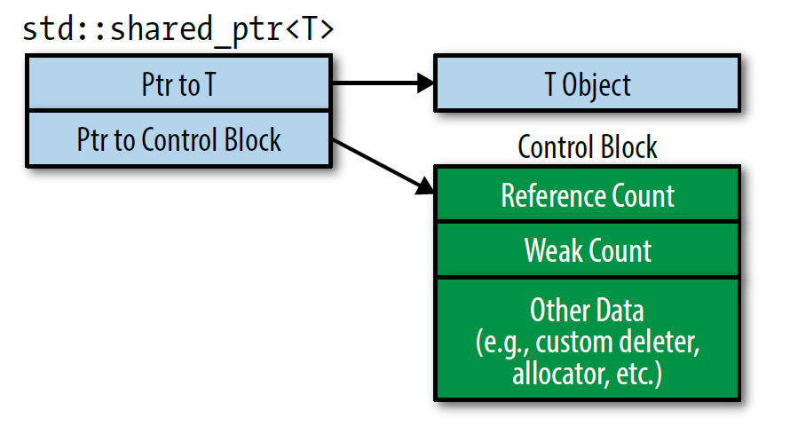
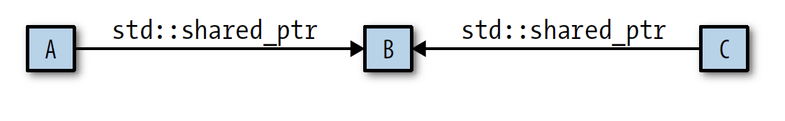

# 1. Deducing Types
## Item 1: Understand template type deduction

Think of a function template as looking like this:

```c++
template<typename T>
void f(ParamType param);

f(expr); // call f with some expression
```

During compilation, compilers use `expr` to deduce two types: one for `T` and one for `ParamType`. These types are frequently different, because `ParamType` often contains adornments, e.g., `const` or reference qualifiers:

```c++
template<typename T>
void f(const T& param); // ParamType is const T&
int x = 0;
f(x); // call f with an int
```

`T` is deduced to be `int`, but `ParamType` is deduced to be `const int&`.

It’s natural to expect that the type deduced for `T` is the same as the type of the argument passed to the function, i.e., that `T` is the type of `expr`. In the above example, that’s the case: `x` is an `int`, and `T` is deduced to be int. But it doesn’t always work that way. The type deduced for `T` is dependent not just on the type of `expr`, but also on the form of `ParamType`. There are three cases:

### Case 1: `ParamType` is a Reference or Pointer, but not a Universal Reference
Type deduction works like this:

* If `expr`’s type is a reference, ignore the reference part.
* Then pattern-match `expr`’s type against `ParamType` to determine `T`.

```c++
template<typename T>
void f(T& param); // param is a reference

int x = 27; // x is an int
const int cx = x; // cx is a const int
const int& rx = x; // rx is a reference to x as a const int

f(x); // T is int, param's type is int&
f(cx); // T is const int, param's type is const int&
f(rx); // T is const int, param's type is const int&
```

Passing a `const` object to a template taking a `T&` parameter is safe: the constness of the object becomes part of the type deduced for `T`.

In the third example, note that even though `rx`’s type is a reference, `T` is deduced to be a non-reference. That’s because `rx`’s reference-ness is ignored during type deduction.

If we change the type of `f`’s parameter from `T&` to `const T&`, things change a little, because we’re now assuming that param is a reference-to-const, there’s no longer a need for `const` to be deduced as part of  `T`:

```c++
template<typename T>
void f(const T& param); // param is now a ref-to-const

int x = 27; // as before
const int cx = x; // as before
const int& rx = x; // as before

f(x); // T is int, param's type is const int&
f(cx); // T is int, param's type is const int&
f(rx); // T is int, param's type is const int&
```

If param were a pointer (or a pointer to const) instead of a reference, things would work essentially the same way:

```c++
template<typename T>
void f(T* param); // param is now a pointer

int x = 27; // as before
const int *px = &x; // px is a ptr to x as a const int

f(&x); // T is int, param's type is int*
f(px); // T is const int, param's type is const int*
```

### Case 2: `ParamType` is a Universal Reference

Universal reference parameters are declared like rvalue references( T&& ), they behave differently when lvalue arguments are passed in:

* If `expr` is an lvalue, both `T` and `ParamType` are deduced to be lvalue references. That’s doubly unusual. First, it’s the only situation in template type deduction where `T` is deduced to be a reference. Second, although `ParamType` is declared using the syntax for an rvalue reference, its deduced type is an lvalue reference.
* If `expr` is an rvalue, the “normal” (i.e., Case 1) rules apply

```c++
template<typename T>
void f(T&& param); // param is now a universal reference

int x = 27; // as before
const int cx = x; // as before
const int& rx = x; // as before

f(x); // x is lvalue, so T is int&, param's type is also int&
f(cx); // cx is lvalue, so T is const int&, param's type is also const int&
f(rx); // rx is lvalue, so T is const int&, param's type is also const int&
f(27); // 27 is rvalue, so T is int, param's type is therefore int&&
```

### Case 3: `ParamType` is Neither a Pointer nor a Reference

```c++
template<typename T>
void f(T param); // param is now passed by value
```

That means that param will be a copy of whatever is passed in—a completely new object. The fact that param will be a new object motivates the rules that govern how `T` is deduced from `expr`:

* As before, if `expr`’s type is a reference, ignore the reference part
* If, after ignoring `expr`’s reference-ness, `expr` is const, ignore that, too. 

```c++
int x = 27; // as before
const int cx = x; // as before
const int& rx = x; // as before

f(x); // T's and param's types are both int
f(cx); // T's and param's types are again both int
f(rx); // T's and param's types are still both int
```

Note that even though `cx` and `rx` represent const values, param isn’t const. That makes sense. param is an object that’s completely independent of `cx` and `rx`—a copy of `cx` or `rx`. The fact that `cx` and `rx` can’t be modified says nothing about whether param can be. That’s why `expr`’s constness is ignored.

And consider the case where `expr` is a const pointer to a const object, and `expr` is passed to a by-value `param`:

```c++
template<typename T>
void f(T param); // param is still passed by value
const char* const ptr = f(ptr); // ptr is const pointer to const object
 								// pass arg of type const char * const
```

When `ptr` is passed to `f`, the bits making up the pointer are copied into param. As such, **the pointer itself (`ptr`) will be passed by value**. In accord with the type deduction rule for by-value parameters, the constness of `ptr` will be ignored, and the type deduced for param will be const char*

### Array Arguments

Array types are different from pointer types, even though they sometimes seem to be interchangeable:

#### Pass by value

```c++
const char name[] = "J. P. Briggs"; // name's type is const char[13]

template<typename T>
void f(T param); // template with by-value parameter

f(name);
```

Remember that as a function parameter, the array declaration is treated as a pointer declaration:

```c++
void myFunc(int param[]);
void myFunc(int* param); // same function as above
```

Because array parameter declarations are treated as if they were pointer parameters, the type of an array that’s passed to a template function **by value** is deduced to be a pointer type:

```c++
f(name); // name is array, but T deduced as const char*
```

#### Pass by reference

Although functions can’t declare parameters that are truly arrays, they can declare parameters that are references to arrays! So if we modify the template `f` to take its argument by reference:

```c++
template<typename T>
void f(T& param); // template with by-reference parameter

f(name); // pass array to f
```

The type deduced for `T` is the actual type of the array! That type includes the size of the array, so in this example, `T` is deduced to be `const char [13]`, and the type of `f`’s parameter (a reference to this array) is `const char (&)[13]`

Interestingly, the ability to declare references to arrays enables creation of a template that deduces the number of elements that an array contains:

```c++
template<typename T, std::size_t N>
constexpr std::size_t arraSize(T (&)[N]) noexcept{
    return N;
}
```

### Function Arguments

Arrays aren’t the only things in C++ that can decay into pointers. Function types can decay into function pointers:

```c++
void someFunc(int, double); // someFunc is a function; type is void(int, double)

template<typename T>
void f1(T param); // in f1, param passed by value

template<typename T>
void f2(T& param); // in f2, param passed by ref

f1(someFunc); // param deduced as ptr-to-func; type is void (*)(int, double)
f2(someFunc); // param deduced as ref-to-func; type is void (&)(int, double
```

### Things to Remember

* During template type deduction, arguments that are references are treated as non-references, i.e., their reference-ness is ignored.
* When deducing types for universal reference parameters, lvalue arguments get special treatment.
* When deducing types for by-value parameters, const arguments are treated as non-const.
* During template type deduction, arguments that are array or function names decay to pointers, unless they’re used to initialize references.

## Item 2: Understand `auto` type deduction

Deducing types for `auto` is, with only one exception, the same as deducing types for templates.

In Item 1, template type deduction is explained using this general function template：

```C++ 
template<typename T>
void f(ParamType param);

f(expr); // call f with some expression
```


In the call to `f`, compilers use `expr` to deduce types for `T` and `ParamType`.

When a variable is declared using `auto`, `auto` plays the role of `T` in the template, and the type specifier for the variable acts as `ParamType`.

```c++
auto x = 27;		// the type specifier for x is simply auto by itself
const auto cx = x;	// the type specifier is const auto
const auto& rx = x;	// the type specifier is const auto&
```

To deduce types for `x`, `cx`, and `rx` in these examples, compilers act as if there were a template for each declaration as well as a call to that template with the corresponding initializing expression:

```c++
template<typename T> 
void func_for_x(T param);
func_for_x(27);

template<typename T> 
void func_for_cx(const T param);
func_for_cx(x);

template<typename T>
void func_for_rx(const T& param);
func_for_rx(x);
```

As type deduced in template, in a variable declaration using `auto`, the type specifier takes the place of `ParamType`, so there are three cases for that, too:

* The type specifier is a pointer or reference, but not a universal reference
* The type specifier is a universal reference
* The type specifier is neither a pointer nor a reference

```c++
auto x = 27; 			// case 3 (x is neither ptr nor reference)
const auto cx = x; 		// case 3 (cx isn't either)
const auto& rx = x; 	// case 1 (rx is a non-universal ref.)

auto&& uref1 = x; 		// x is int and lvalue,
						// so uref1's type is int&
auto&& uref2 = cx; 		// cx is const int and lvalue,
						// so uref2's type is const int&
auto&& uref3 = 27; 		// 27 is int and rvalue,
						// so uref3's type is int&&
```

Array and function names decay into pointers for non-reference type specifiers. That happens in auto type deduction, too:

```c++
const char name[] = "R. N. Briggs"; // name's type is const char[13]

auto arr1 = name; // arr1's type is const char*
auto& arr2 = name; // arr2's type is const char (&)[13]

void someFunc(int, double); // someFunc is a function; type is void(int, double)
auto func1 = someFunc; // func1's type is void (*)(int, double)
auto& func2 = someFunc; // func2's type is void (&)(int, double)
```

### Special type deduction rule for `auto`

If you want to declare `an` int with an initial value of 27, you have the following four choice:

```c++
// four syntaxes, but only one result: an int with value 27
int x1 = 27;
int x2(27);
int x3 = { 27 };
int x4{ 27 };
```

But if you substitute `int` with `auto`, things will change:

```c++
auto x1 = 27;		// type is int, value is 27
auto x2(27);		// ditto
auto x3 = { 27 };	// type is std::initializer_list<int>, value is { 27 }
auto x4{ 27 };		// ditto
```

The first two statements do, indeed, declare a variable of type `int` with value 27. The second two, however, declare a variable of type `std::initializer_list<int>` containing a single element with value 27. 

When the initializer for an auto-declared variable is enclosed in braces, the deduced type is a `std::initializer_list`.

The treatment of braced initializers is the only way in which `auto` type deduction and template type deduction differ:

```c++
auto x = { 11, 23, 9 }; // x's type is std::initializer_list<int>

template<typename T> 	// template with parameter declaration equivalent to x's declaration
void f(T param); 
f({ 11, 23, 9 }); 		// error! can't deduce type for T
```

However, if you specify in the template that param is a `std::initializer_list<T>` for some unknown `T`, template type deduction will deduce what `T` is:

```c++
template<typename T>
void f(std::initializer_list<T> initList);

f({ 11, 23, 9 }); 		// T deduced as int
```

### `auto` in a function return type or a lambda parameter implies template type deduction, not auto type deduction

C++14 permits `auto` to indicate that a function’s return type should be deduced, and C++14 lambdas may use `auto` in parameter declarations.

```c++
auto createInitList()
{
	return { 1, 2, 3 }; // error: can't deduce type
}

std::vector<int> v;
auto resetV = [&v](const auto& newValue) { v = newValue; }; // C++14
resetV({ 1, 2, 3 }); // error! can't deduce type // for { 1, 2, 3 }
```

## Item 3: Understand `decltype`

Given a name or an expression, `decltype` tells you the name’s or the expression’s type.

### The typical cases for `decltype`

In contrast to what happens during type deduction for templates and `auto`, `decltype` typically parrots back the exact type of the name or expression you give it:

```c++
const int i = 0; 						// decltype(i) is const int
bool f(const Widget& w); 				// decltype(w) is const Widget&
										// decltype(f) is bool(const Widget&)
struct Point {
int x, y; 								// decltype(Point::x) is int
}; 										// decltype(Point::y) is int
Widget w; 								// decltype(w) is Widget
if (f(w)) … 							// decltype(f(w)) is bool
vector<int> v; 							// decltype(v) is vector<int>
if (v[0] == 0)							// decltype(v[0]) is int&
```

### The use of `decltype` to compute the return type

The type returned by a container’s `operator[]` depends on the container. `decltype` makes it easy to express that.

```c++
template<typename Container, typename Index> // works, but requires refinement
auto authAndAccess(Container& c, Index i) -> decltype(c[i])
{
	authenticateUser();
	return c[i];
}
```

The use of `auto` before the function name has nothing to do with type deduction. it indicates that C++11’s `trailing return type` syntax is being used. Trailing return type has the advantage that **the function’s parameters can be used in the specification of the return type.**

in C++14 we can omit the trailing return type, leaving just the leading `auto`. With that form of declaration, `auto` does mean that type deduction will take place:

```c++
template<typename Container, typename Index> 	// C++14;
auto authAndAccess(Container& c, Index i) 		// not quite correct
{
	authenticateUser();
	return c[i]; // return type deduced from c[i]
}
```

For functions with an `auto` return type specification, compilers employ template type deduction. In this case, that’s problematic. **`operator[]` returns a `T&`, but during template type deduction, the reference-ness of an initializing expression is ignored.**

### `decltype(auto)`

To fix this issue, in C++14 we can use the `decltype(auto)` specifier. `auto` specifies that the type is to be deduced, and `decltype` says that `decltype` rules should be used during the deduction:

```c++
template<typename Container, typename Index> 	// C++14; works,
decltype(auto) 									// but still requires refinement
authAndAccess(Container& c, Index i)
{
	authenticateUser();
	return c[i];
}
```

Now `authAndAccess` will truly return whatever `c[i]` returns.

`decltype(auto)` can also be convenient for declaring variables when you want to apply the `decltype` type deduction rules to the initializing expression:

```c++
Widget w;
const Widget& cw = w;
auto myWidget1 = cw; // auto type deduction: myWidget1's type is Widget
decltype(auto) myWidget2 = cw; // decltype type deduction: myWidget2's type is const Widget&
```

### The refinement to `authAndAccess`

Look again at the declaration for the C++14 version of `authAndAccess`:

```c++
template<typename Container, typename Index>
decltype(auto) authAndAccess(Container& c, Index i);
```

The container is passed by lvalue-reference-to-non-const, this means it’s not possible to pass rvalue containers to this function. Rvalues can’t bind to lvalue references.

Have `authAndAccess` employ a reference parameter that can bind to lvalues and rvalues -- universal references.

```c++
template<typename Container, typename Index> // c is now a universal reference
decltype(auto) authAndAccess(Container&& c, Index i);
```

And we need to update the template’s implementation to bring it into accord with Item 25’s admonition to apply `std::forward` to universal references:

```c++
template<typename Container, typename Index> // final C++14 version
decltype(auto)
authAndAccess(Container&& c, Index i)
{
	authenticateUser();
	return std::forward<Container>(c)[i];
}
```

### A few special cases for `decltype`

if an lvalue expression other than a name has type `T`, decltype reports that type as `T&`:

```c++
int x = 0;
```

`x` is the name of a variable, so `decltype(x`) is `int`.

But wrapping the name `x` in parentheses—“`(x)`”—yields an expression more complicated than a name. Being a name, `x` is an lvalue, and C++ defines the expression `(x)` to be an lvalue, too. `decltype((x))` is therefore `int&`.

## Item 4: Know how to view deduced types

We’ll explore three possibilities: getting type deduction information as you edit your code, getting it during compilation, and getting it at runtime.

### IDE Editors

Code editors in IDEs often show the types of program entities when you do something like hover your cursor over the entity.

```c++
const int theAnswer = 42;
auto x = theAnswer;
auto y = &theAnswer;
```

An IDE editor would likely show that `x`’s deduced type was `int` and `y`’s was `const int*`.

For simple types like `int`, information from IDEs is generally fine. However, when more complicated types are involved, the information displayed by IDEs may not be particularly helpful.

### Compiler Diagnostics

An effective way to get a compiler to show a type it has deduced is to use that type in a way that leads to compilation problems. **The error message** reporting the problem is virtually sure to mention the type that’s causing it.

For example, we first declare a class template that we don’t define. Something like this does nicely:

```c++
template<typename T> 	// declaration only for TD;
class TD; 				// TD == "Type Displayer"
```

Attempts to instantiate this template will elicit an error message, because there’s no template definition to instantiate. To see the types for `x` and `y`, just try to instantiate `TD` with their types:

```c++
TD<decltype(x)> xType; // elicit errors containing
TD<decltype(y)> yType; // x's and y's types
```

You will see the following error message:

```c++
error: aggregate 'TD<int> xType' has incomplete type and cannot be defined
     TD<decltype(x)> xType;
error: aggregate 'TD<const int*> yType' has incomplete type and cannot be defined
     TD<decltype(y)> yType;
```

### Runtime Output

In our continuing quest to see the types deduced for `x` and `y`, you may figure we can write this:

```c++
std::cout << typeid(x).name() << '\n'; // display types for
std::cout << typeid(y).name() << '\n'; // x and y
```

This approach relies on the fact that invoking `typeid` on an object such as `x` or `y` yields a `std::type_info` object, and `std::type_info` has a member function, `name`, that produces a C-style string (i.e., a const char*) representation of the name of the type.

Consider a more complex example: 

```c++
template<typename T> 		// template function to
void f(const T& param); 	// be called

std::vector<Widget> createVec(); // factory function

const auto vw = createVec();
if (!vw.empty()) {
	f(&vw[0]); // call f
}
```

Suppose now we want to know what types are inferred for the template type parameter `T` and the function parameter `param` in f.

Loosing `typeid` on the problem is straightforward:

```c++
template<typename T>
void f(const T& param)
{
	using std::cout;
    cout << "T = " << typeid(T).name() << '\n';
	cout << "param = " << typeid(param).name() << '\n';
}
```

Executables produced by the GNU and Clang compilers produce this output:

```c++
T = PK6Widget
param = PK6Widget
```

So these compilers tell us that both `T` and `param` are of type `const Widget*`. Sadly, the results of `std::type_info::name` are not reliable. In this case, the type that compilers report for `param` are incorrect.

The specification for `std::type_info::name` mandates that the type be treated as if it had been passed to a template function as a by-value parameter. That means that if the type is a reference, its reference-ness is ignored, and if the type after reference removal is const, its constness is also ignored. That’s why param’s type—which is `const Widget * const &`—is reported as `const Widget*`.

Where `std::type_info::name` and IDEs may fail, the **Boost TypeIndex library** (often written as Boost.TypeIndex) is designed to succeed.

```c++
#include <boost/type_index.hpp>
template<typename T>
void f(const T& param)
{
	using std::cout;
	using boost::typeindex::type_id_with_cvr;
	// show T
	cout << "T = " << type_id_with_cvr<T>().pretty_name() << '\n';
	// show param's type
	cout << "param = " << type_id_with_cvr<decltype(param)>().pretty_name() << '\n';
	…
}
```

Under compilers from GNU and Clang, Boost.TypeIndex produces this (accurate) output:

```c++
T = Widget const*
param = Widget const* const&
```

# 2. `auto`

## Item 5: Prefer `auto` to explicit type declarations

### Avoidance of uninitialized variables

`auto` variables have their type deduced from their initializer, so they must be initialized. That means you can wave goodbye to a host of uninitialized variable problems:

```c++
int x1; 		// potentially uninitialized
auto x2; 		// error! initializer required
auto x3 = 0; 	// fine, x's value is well-defined
```

### Avoidance of verbose variable declarations, and the ability to directly hold closures
Because auto uses type deduction, it can represent types known only to compilers:

```c++
auto derefUPLess = // comparison func. for Widgets pointed to by std::unique_ptrs
	[](const std::unique_ptr<Widget>& p1, 
		const std::unique_ptr<Widget>& p2)
	{ return *p1 < *p2; };
```

In C++14, parameters to lambda expressions may involve `auto`:

```c++
auto derefLess = // C++14 comparison function for values pointed to by anything pointer-like
	[](const auto& p1, 
   		const auto& p2) 
	{ return *p1 < *p2; };
```

Without `auto`, to declare the `derefLess`, you might use the `std::function`. `std::function` is a template in the C++11 Standard Library that generalizes the idea of a function pointer. `std::function` objects can refer to any callable object：

```c++
std::function<bool(const std::unique_ptr<Widget>&, const std::unique_ptr<Widget>&)> func;
```

Because lambda expressions yield callable objects, closures can be stored in `std::function` objects. So without `auto` , you can declare `derefLess` like this:

```c++
std::function<bool (const std::unique_ptr<Widget>& p1, 
					const std::unique_ptr<Widget>& p2)> 
   	derefLess = [](const std::unique_ptr<Widget>& p1, 
					const std::unique_ptr<Widget>& p2)
				{ return *p1 < *p2; };
```

Note that using `std::function` is not the same as using `auto`：

* An `auto`-declared variable holding a closure has the same type as the closure, and as such it uses only as much memory as the closure requires.
* The type of a `std::function` declared variable holding a closure is an instantiation of the `std::function` template, and that has a fixed size for any given signature.

The result is that the `std::function` approach is generally bigger and slower than the `auto` approach, and it may yield out-of-memory exceptions, too.

### Avoidance of problems related to “type shortcuts”

```c++
std::vector<int> v;
…
unsigned sz = v.size();
```

The official return type of `v.size()` is `std::vector<int>::size_type`. And On 32-bit Windows, for example, both `unsigned` and `std::vector<int>::size_type` are the same size, but on 64-bit Windows, `unsigned` is 32 bits, while `std::vector<int>::size_type` is 64 bits. This means that code that works under 32-bit Windows may behave incorrectly under 64-bit Windows.

```c++
auto sz = v.size(); // sz's type is std::vector<int>::size_type
```

Similarly see this example:

```c++
std::unordered_map<std::string, int> m;
…
for (const std::pair<std::string, int>& p : m)
{
	… // do something with p
}
```

Remember that the key part of a `std::unordered_map` is `const`, so the type of `std::pair` in the hash table isn’t `std::pair<std::string, int>`, it’s `std::pair<const std::string, int>`. As a result, compilers will strive to find a way to convert `std::pair<const std::string, int>` objects to
`std::pair<std::string, int>` objects. They’ll succeed by creating a temporary object of the type that `p` wants to bind to by copying each object in `m`, then binding the reference `p` to that **temporary object**. At the end of each loop iteration, the temporary object will be destroyed.

```c++
for (const auto& p : m)
{
	… // as before
}	
```

### Refactorings are facilitated by the use of `auto`

Furthermore, `auto` types automatically change if the type of their initializing expression changes. For example, if a function is declared to return an `int`, but you later decide that a `long` would be better, the calling code automatically updates itself the next time you compile if the results of calling the function are stored in `auto` variables.

## Item 6: Use the explicitly typed initializer idiom when `auto` deduces undesired types
Suppose I have a function that takes a `Widget` and returns a `std::vector<bool>`, where each `bool` indicates whether the `Widget` offers a particular feature:

```c++
std::vector<bool> features(const Widget& w);
```

Further suppose that bit 5 indicates whether the `Widget` has high priority. We can thus write code like this:

```c++
Widget w;
bool highPriority = features(w)[5]; // is w high priority?
processWidget(w, highPriority); // process w in accord with its priority
```

The code above works fine. But if we use `auto` instead:

```c++
auto highPriority = features(w)[5]; // is w high priority?
processWidget(w, highPriority); // undefined behavior!
```

The call to `processWidget` now has undefined behavior. The type of `highPriority` is no longer `bool`.

Though `std::vector<bool>` conceptually holds `bool`s, `operator[]` for `std::vector<bool>` doesn’t return a reference to an element of the container. Instead, it returns an object of type `std::vector<bool>::reference` (a class nested inside `std::vector<bool>`).

`std::vector<bool>::reference` exists because `std::vector<bool>` is specified to represent its `bool`s in packed form, one bit per `bool`. `operator[]` for `std::vector<T>` is supposed to return a `T&`, but C++ forbids references to bits. Not being able to return a `bool&`, `operator[]` for `std::vector<bool>` returns an object that acts like a `bool&`. 

With this information in mind, look again at this part of the original code:

```c++
bool highPriority = features(w)[5]; // declare highPriority's type explicitly
```

Here, `operator[]` returns a `std::vector<bool>::reference` object, which is then implicitly converted to the `bool` that is needed to initialize `highPriority`


`std::vector<bool>::reference` is an example of a **proxy class**: a class that exists for the purpose of emulating and augmenting the behavior of some other type. Standard Library’s smart pointer types are proxy classes that graft resource management onto raw pointers.

Some proxy classes are designed to be apparent to clients. That’s the case for `std::shared_ptr` and `std::unique_ptr`, for example. Other proxy classes are designed to act more or less invisibly. `std::vector<bool>::reference` is an example of such “invisible” proxies.

As a general rule, **“invisible” proxy classes don’t play well with `auto`.** You therefore want to avoid code of this form:

```c++
auto someVar = expression of "invisible" proxy class type;
```

### How to find a  “invisible” proxy class

libraries using “invisible” proxy classes often document that they do so.

Where documentation comes up short, header files fill the gap. Function signatures usually reflect their existence:

```c++
namespace std { 			// from C++ Standards
template <class Allocator>
class vector<bool, Allocator> {
public:
	…
	class reference { … };
	reference operator[](size_type n);
	…
};
}
```

The unconventional return type for `operator[]` in this case is a tip-off that a proxy class is in use.

### The explicitly typed initializer idiom

The explicitly typed initializer idiom involves declaring a variable with `auto`, but casting the initialization expression to the type you want `auto` to deduce:

```c++
auto highPriority = static_cast<bool>(features(w)[5]);
```

Here, `features(w)[5]` continues to return a `std::vector<bool>::reference` object, just as it always has, but the cast changes the type of the expression to `bool`, which `auto` then deduces as the type for `highPriority`.

Applications of the idiom aren’t limited to initializers yielding proxy class types. It can also be useful to emphasize that you are deliberately creating a variable of a type that is different from that generated by the initializing expression:

```c++
double calcEpsilon(); // return tolerance value
float ep = calcEpsilon(); // impliclitly convert double → float
auto ep = static_cast<float>(calcEpsilon());
```

A declaration using the explicitly typed initializer idiom announces “I’m deliberately reducing the precision of the value returned by the function.”

# 3. Moving to Modern C++

## Item 7: Distinguish between () and {} when creating objects

As a general rule, initialization values may be specified with parentheses, an equals sign, or braces:

```c++
int x(0); 	// initializer is in parentheses
int y = 0; 	// initializer follows "="
int z{ 0 }; // initializer is in braces
int z = { 0 }; // initializer uses "=" and braces; the same as the braces-only version
```

for userdefined types, it’s important to distinguish initialization from assignment, because different function calls are involved:

```c++
Widget w1; 			// call default constructor
Widget w2 = w1; 	// not an assignment; calls copy ctor
w1 = w2; 			// an assignment; calls copy operator=
```

### uniform initialization

A single initialization syntax that can, at least in concept, be used anywhere and express everything. It’s based on braces, and for that reason I prefer the term *braced initialization*.

Using braces, specifying the initial contents of a container:

```c++
std::vector<int> v{ 1, 3, 5 }; // v's initial content is 1, 3, 5
```

Braces can also be used to specify default initialization values for non-static data members, This capability—new to C++11—is shared with the “=” initialization syntax, but not with parentheses:

```c++
class Widget {
…
private:
	int x{ 0 }; // fine, x's default value is 0
	int y = 0; // also fine
	int z(0); // error!
};
```

On the other hand, uncopyable objects (e.g., `std::atomics`—see Item 40) may be initialized using braces or parentheses, but not using “=”:

```c++
std::atomic<int> ai1{ 0 }; // fine
std::atomic<int> ai2(0); // fine
std::atomic<int> ai3 = 0; // error!
```

#### prohibit implicit narrowing conversions among built-in types

If the value of an expression in a braced initializer isn’t guaranteed to be expressible by the type of the object being initialized, the code won’t compile:

```c++
double x, y, z;
…
int sum1{ x + y + z }; 	// error! sum of doubles may
						// not be expressible as int
```

Initialization using parentheses and “=” doesn’t check for narrowing conversions

```c++
int sum2(x + y + z); 	// okay (value of expression
						// truncated to an int)
int sum3 = x + y + z; 	// ditto
```

#### immunity to C++’s most vexing parse

If you try to call a `Widget` constructor with zero arguments, you may declare a function instead of an object:

```c++
Widget w2(); 	// most vexing parse! declares a function
				// named w2 that returns a Widget!
```

Functions can’t be declared using braces for the parameter list, so defaultconstructing an object using braces doesn’t have this problem:

```c++
Widget w3{}; // calls Widget ctor with no args
```

### braced initializers, std::initializer_lists, and constructor overloading

In constructor calls, parentheses and braces have the same meaning as long as `std::initializer_list` parameters are not involved:

```c++
class Widget {
public:
	Widget(int i, bool b); 		// ctors not declaring
	Widget(int i, double d); 	// std::initializer_list params
	…
};
Widget w1(10, true); 			// calls first ctor
Widget w2{10, true}; 			// also calls first ctor
Widget w3(10, 5.0); 			// calls second ctor
Widget w4{10, 5.0}; 			// also calls second ctor
```

If, however, one or more constructors declare a parameter of type `std::initializer_list`, calls using the braced initialization syntax **strongly** prefer the overloads taking `std::initializer_lists`.

```c++
class Widget {
public:
	Widget(int i, bool b); 							// as before
	Widget(int i, double d); 						// as before
    Widget(std::initializer_list<long double> il); 	// added
    
    operator float() const; 						// convert to float
};

Widget w1(10, true); 								// uses parens and, as before,
													// calls first ctor
Widget w2{10, true}; 								// uses braces, but now calls
													// std::initializer_list ctor
													// (10 and true convert to long double)
Widget w3(10, 5.0); 								// uses parens and, as before,
													// calls second ctor
Widget w4{10, 5.0}; 								// uses braces, but now calls
													// std::initializer_list ctor
													// (10 and 5.0 convert to long double)
Widget w5(w4); 										// uses parens, calls copy ctor
Widget w6{w4}; 										// uses braces, calls std::initializer_list ctor
													// (w4 converts to float, and float
													// converts to long double)
```

Compilers’ determination to match braced initializers with constructors taking `std::initializer_lists` is so strong, it prevails even if the `std::initializer_list` constructor can’t be called：

```c++
class Widget {
public:
	Widget(int i, bool b); 		// as before
	Widget(int i, double d); 	// as before
	Widget(std::initializer_list<bool> il); // element type is now bool
};

Widget w{10, 5.0}; // error! requires narrowing conversions
```

Here, compilers will ignore the first two constructors and try to call the constructor taking a `std::initializer_list<bool>`. Calling that constructor would require narrowing conversions, which are prohibited inside braced initializers, so the call is invalid, and the code is rejected.

Only if there’s no way to convert the types of the arguments in a braced initializer to the type in a `std::initializer_list` do compilers fall back on normal overload resolution.

```c++
class Widget {
public:
	Widget(int i, bool b); // as before
	Widget(int i, double d); // as before
	// std::initializer_list element type is now std::string
    // There is no way to convert ints and bools to std::strings
	Widget(std::initializer_list<std::string> il);
};

Widget w1(10, true); 	// uses parens, still calls first ctor
Widget w2{10, true}; 	// uses braces, now calls first ctor
Widget w3(10, 5.0); 	// uses parens, still calls second ctor
Widget w4{10, 5.0}; 	// uses braces, now calls second ctor
```

### Empty brace

Suppose you use an empty set of braces to construct an object that supports default construction and also supports `std::initializer_list` construction. What do your empty braces mean? 

If they mean “no arguments,” you get default construction, but if they mean “empty `std::initializer_list`,” you get construction from a `std::initializer_list` with no elements.

The rule is that you get default construction. **Empty braces mean no arguments, not an `empty std::initializer_list`:**

```c++
class Widget {
public:
	Widget(); 								// default ctor
	Widget(std::initializer_list<int> il); 	// std::initializer_list ctor

};
Widget w1; 									// calls default ctor
Widget w2{}; 								// also calls default ctor
Widget w3(); 								// most vexing parse! declares a function!
```

If you want to call a `std::initializer_list` constructor with an empty `std::initializer_list`, you do it by making the empty braces a constructor argument：

```c++
Widget w4({}); // calls std::initializer_list ctor with empty list
Widget w5{{}}; // ditto Item
```

### Parentheses and braces for `std::vector<numeric type>`

An example of where the choice between parentheses and braces can make a significant difference is creating a `std::vector<numeric type>` with two
arguments.

`std::vector` has a non-`std::initializer_list` constructor that allows you to specify the initial size of the container and a value each of the initial elements should have, but it also has a constructor taking a `std::initializer_list` that permits you to specify the initial values in the container.

```c++
std::vector<int> v1(10, 20); 		// use non-std::initializer_list
									// ctor: create 10-element
									// std::vector, all elements have
									// value of 20
std::vector<int> v2{10, 20}; 		// use std::initializer_list ctor:
									// create 2-element std::vector,
									// element values are 10 and 20
```

### Parentheses and braces for object creation inside templates

Suppose you’d like to create an object of an arbitrary type from an arbitrary number of arguments:

```c++
template<typename T, 			// type of object to create
			typename... Ts> 	// types of arguments to use
void doSomeWork(Ts&&... params)
{
	T localObject(std::forward<Ts>(params)...); // using parens
	T localObject{std::forward<Ts>(params)...}; // using braces
	…
}

std::vector<int> v;
…
doSomeWork<std::vector<int>>(10, 20);
```

If `doSomeWork` uses parentheses when creating `localObject`, the result is a `std::vector` with 10 elements. If `doSomeWork` uses braces, the result is a `std::vector` with 2 elements. Which is correct? The author of doSomeWork can’t know. Only the caller can.

This is precisely the problem faced by the Standard Library functions `std::make_unique` and `std::make_shared`. These functions resolve the problem by internally using parentheses and by documenting this decision as part of their interfaces.

## Item 8: Prefer nullptr to 0 and NULL

Neither `0` nor `NULL` has a pointer type. 

In C++98, the primary implication of this was that overloading on pointer and integral types could lead to surprises. Passing `0` or `NULL` to such overloads never called a pointer overload:

```c++
void f(int); 	// three overloads of f
void f(bool);
void f(void*);
f(0); 			// calls f(int), not f(void*)
f(NULL); 		// might not compile, but typically calls
				// f(int). Never calls f(void*)
f(nullptr); 	// calls f(void*) overload
```

`nullptr`’s advantage is that it doesn’t have an integral type. To be honest, it doesn’t have a pointer type, either, but you can think of it as **a pointer of all types.** Calling the overloaded function `f` with `nullptr` calls the `void*` overload, because `nullptr` can’t be viewed as anything integral.

## Item 9: Prefer alias declarations to typedefs

`typedef`  and alias declarations:

```c++
typedef
	std::unique_ptr<std::unordered_map<std::string, std::string>>
	UPtrMapSS;
using UPtrMapSS =
	std::unique_ptr<std::unordered_map<std::string, std::string>>;
```

* **alias declaration is easier to swallow when dealing with types involving function pointers**

  ```c++
  // FP is a synonym for a pointer to a function taking an int and
  // a const std::string& and returning nothing
  typedef void (*FP) (int, const std::string&);	// typedef
  using FP = void (*)(int, const std::string&);	// alias declaration
  ```

* **alias declarations may be templatized (in which case they’re called *alias templates*), while typedefs cannot**

  Consider defining a synonym for a linked list that uses a custom allocator, `MyAlloc`.

  ```c++
  template<typename T> 							
  using MyAllocList = std::list<T, MyAlloc<T>>; 	
  
  template<typename T>
  struct MyAllocList { 
  	typedef std::list<T, MyAlloc<T>> type;
  };
  
  MyAllocList<Widget> lw; 		// client code
  MyAllocList<Widget>::type lw; 	// client code
  ```

  It gets worse, If you want to use the `typedef` inside a template with a template parameter, you have to precede the `typedef` name with `typename`:

  ```c++
  template<typename T>
  class Widget {
  private:
  	typename MyAllocList<T>::type list;
  	…
  };
  
  template<typename T>
  class Widget {
  private:
  	MyAllocList<T> list; // no "typename", no "::type"
  };
  ```

## Item 10: Prefer scoped `enum`s to unscoped `enum`s

As a general rule, declaring a name inside curly braces limits the visibility of that name to the scope defined by the braces. Not so for the enumerators declared in C++98-style enums:

```c++
enum Color { black, white, red }; 	// black, white, red are
									// in same scope as Color
auto white = false; 				// error! white already
									// declared in this scope
```

The fact that these enumerator names leak into the scope containing their `enum` definition gives rise to the official term for this kind of `enum`: **unscoped**.

Their new C++11 counterparts, **scoped** `enums`, don’t leak names in this way:

```c++
enum class Color { black, white, red }; 	// black, white, red
											// are scoped to Color
auto white = false; 						// fine, no other
											// "white" in scope
Color c = white;							// error! no enumerator named
											// "white" is in this scope
Color c = Color::white; 					// fine
auto c = Color::white;						// also fine (and in accord with Item 5's advice)
```

### Scoped enums are much more stongly typed

Scoped `enum`s have a second compelling advantage: their enumerators are much more strongly typed. Enumerators for unscoped enums implicitly convert to integral types:

```c++
std::vector<std::size_t> 			// func. returning prime factors of x
primeFactors(std::size_t x);

enum Color { black, white, red }; 	// unscoped enum
Color c = red;
if (c < 14.5) { 					// compare Color to double (!)
	auto factors = primeFactors(c);	// compute prime factors of a Color (!)
	…
}

enum class Color { black, white, red }; 	// enum is now scoped
Color c = Color::red; 						// as before, but with scope qualifier
if (c < 14.5) { 							// error! can't compare Color and double
    auto factors = primeFactors(c); 		// error! can't pass Color to function expecting std::size_t
	…
}

// If you honestly want to perform a conversion from Color to a different type, use the cast
if (static_cast<double>(c) < 14.5) { 		// odd code, but it's valid
	auto factors = primeFactors(static_cast<std::size_t>(c)); // suspect, but it compiles
	…
}
```

### Scoped `enum`s may be forward-declared

```c++
enum Color; // error!
enum class Color; // fine
```

The inability to forward-declare `enum`s has drawbacks. The most notable is probably the increase in compilation dependencies:

Every `enum` in C++ has an integral underlying type that is determined by compilers. For an unscoped `enum` like `Color`, 

```c++
enum Color { black, white, red };
```

compilers might choose `char` as the underlying type, because there are only three values to represent. However, some enums have a range of values that is much larger:

```c++
enum Status { good = 0,
	failed = 1,
	incomplete = 100,
	corrupt = 200,
	indeterminate = 0xFFFFFFFF
};
```

Here the values to be represented range from `0` to `0xFFFFFFFF`. Compilers will have to select an integral type larger than `char` for the representation of `Status` values. 

To make efficient use of memory, compilers often want to choose the smallest underlying type for an `enum` that’s sufficient to represent its range of enumerator values. **To make that possible, C++98 supports only enum definitions (where all enumerators are listed); enum declarations are not allowed.**

The underlying type for a scoped `enum` is always known, and for unscoped `enum`s, you can specify it.

By default, the underlying type for scoped `enum`s is int:

```c++
enum class Status; // underlying type is int
```

If the default doesn’t suit you, you can override it:

```c++
enum class Status: std::uint32_t; 	// underlying type for
									// Status is std::uint32_t
									// (from <cstdint>)
```

To specify the underlying type for an unscoped `enum`, you do the same thing as for a scoped `enum`, and the result may be forward-declared:

```c++
enum Color: std::uint8_t; 	// fwd decl for unscoped enum;
							// underlying type is
							// std::uint8_t
```

### One situation where unscoped enums may be useful

That’s when referring to fields within C++11’s `std::tuples`. Suppose we have a tuple holding values for the name, email address, and reputation value for a user at a social networking website:

```c++
using UserInfo = // type alias; see Item 9
	std::tuple<std::string, // name
				std::string, // email
				std::size_t> ; // reputation
```

```c++
UserInfo uInfo; // object of tuple type
…
auto val = std::get<1>(uInfo); // get value of field 1, that is email address
```

Should you really be expected to remember that field 1 corresponds to the user’s email address? I think not. Using an unscoped enum to associate names with field numbers avoids the need to:

```c++
enum UserInfoFields { uiName, uiEmail, uiReputation };
UserInfo uInfo; // as before
…
auto val = std::get<uiEmail>(uInfo); // ah, get value of email field
```

What makes this work is the implicit conversion from `UserInfoFields` to `std::size_t`, which is the type that `std::get` requires.

The corresponding code with scoped `enum`s is substantially more verbose:

```c++
enum class UserInfoFields { uiName, uiEmail, uiReputation };
UserInfo uInfo; // as before
…
auto val = std::get<static_cast<std::size_t>(UserInfoFields::uiEmail)>(uInfo); // ah, get value of email field
```

## Item 11: Prefer `deleted` functions to `private` undefined ones
For the copy constructor and the copy assignment operator, the C++98 approach to preventing use of these functions is to declare them `private` and not define them. For example, To render `istream` and `ostream` classes uncopyable, `basic_ios` is specified in C++98 as follows:

```c++
template <class charT, class traits = char_traits<charT> >
class basic_ios : public ios_base {
public:
	…
private:
	basic_ios(const basic_ios& ); // not defined
	basic_ios& operator=(const basic_ios&); // not defined
};
```

Declaring these functions `private` prevents clients from calling them. Deliberately failing to define them means that if code that still has access to them (i.e., member functions or `friend`s of the class) uses them, linking will fail due to missing function definitions.

In C++11, there’s a better way to achieve essentially the same end: use “= `delete`” to declare them as as *deleted functions*.

```c++
template <class charT, class traits = char_traits<charT> >
class basic_ios : public ios_base {
public:
	…
	basic_ios(const basic_ios& ) = delete;
	basic_ios& operator=(const basic_ios&) = delete;
	…
};
```

Deleted functions may not be used in any way, so even code that’s in member and `friend` functions will fail to compile if it tries to copy `basic_ios` objects.

### `deleted` functions are declared `public`, not `private`

When client code tries to use a member function, C++ checks accessibility before deleted status. When client code tries to use a deleted `private` function, some compilers complain only about the function being `private`. Thus making the deleted functions `public` will generally result in **better error messages**.

### Any function may be deleted

Suppose we have a non-member function that takes an integer and returns whether it’s a lucky number:

```c++
bool isLucky(int number);
```

In C++, pretty much any type that can be viewed as vaguely numerical will implicitly convert to int, but some calls that would compile might not make sense:

```c++
if (isLucky('a')) … 	// is 'a' a lucky number?
if (isLucky(true)) … 	// is "true"?
if (isLucky(3.5)) … 	// should we truncate to 3
						// before checking for luckiness?
```

If lucky numbers must really be integers, we’d like to prevent calls such as these from compiling by **creating deleted overloads for the types we want to filter out**:

```c++
bool isLucky(int number); // original function
bool isLucky(char) = delete; // reject chars
bool isLucky(bool) = delete; // reject bools
bool isLucky(double) = delete; // reject doubles and floats
```

Although deleted functions can’t be used, they are part of your program. As such, they are taken into account during overload resolution:

```c++
if (isLucky('a')) … // error! call to deleted function
if (isLucky(true)) … // error!
if (isLucky(3.5f)) … // error!
```

### Prevent use of template instantiations that should be disabled

Suppose you need a template that works with built-in pointers:

```c++
template<typename T>
void processPointer(T* ptr);
```

In the case of the `processPointer` template, let’s assume the proper handling is to reject calls using `void*` pointers and `char*` pointers. That is, it should not be possible to call `processPointer` with `void*` or `char*` pointers.

```c++
template<>
void processPointer<void>(void*) = delete;

template<>
void processPointer<char>(char*) = delete;

template<>
void processPointer<const void>(const void*) = delete;

template<>
void processPointer<const char>(const char*) = delete;
```

If `processPointer` were a member function template inside `Widget`, for example, and you wanted to disable calls for `void*` pointers, this would be the C++98 approach, though it would not compile:

```c++
class Widget {
public:
	…
	template<typename T>
	void processPointer(T* ptr)
	{ … }
private:
	template<> // error!
	void processPointer<void>(void*);
};
```

The problem is that **template specializations must be written at namespace scope**, not class scope. This issue doesn’t arise for deleted functions, because they can be deleted outside the class (hence at namespace scope):

```c++
class Widget {
public:
	…
	template<typename T>
	void processPointer(T* ptr)
	{ … }
};

template<>
void Widget::processPointer<void>(void*) = delete;	// still public but deletede
```

## Item 12: Declare overriding functions `override`

Among the most fundamental ideas in OOP is that virtual function implementations in derived classes override the implementations of their base class counterparts. For overriding to occur, several requirements must be met:

* The base class function must be virtual

* The base and derived function names must be identical (except in the case of destructors)

* The parameter types of the base and derived functions must be identical

* The constness of the base and derived functions must be identical

* The return types and exception specifications of the base and derived functions must be **compatible**

* The functions’ *reference qualifiers* must be identical

All these requirements for overriding mean that small mistakes can make a big difference. For example, the following code is completely legal and, at first sight, looks reasonable, but it contains no virtual function overrides:

```c++
class Base {
public:
	virtual void mf1() const;
	virtual void mf2(int x);
	virtual void mf3() &;
	void mf4() const;
};
class Derived: public Base {
public:
	virtual void mf1();
	virtual void mf2(unsigned int x);
	virtual void mf3() &&;
	void mf4() const;
};
```

Because declaring derived class overrides is important to get right, but easy to get wrong, C++11 gives you a way to make explicit that a derived class function is supposed to override a base class version: *declare it `override`*.

```c++
class Derived: public Base {
public:
	virtual void mf1() override;
	virtual void mf2(unsigned int x) override;
	virtual void mf3() && override;
	virtual void mf4() const override;
};
```

This won’t compile, of course, because when written this way, compilers will kvetch about all the overriding-related problems.

### Contextual keywords

C++11 introduces two contextual keywords, `override` and `final` These keywords have the characteristic that they are reserved, but only in certain contexts. In the case of `override`, it has a reserved meaning only when it occurs at the end of a member function declaration:

```c++
class Warning { // potential legacy class from C++98
public:
	…
	void override(); // legal in both C++98 and C++11 (with the same meaning)
};
```

### Member function reference qualifiers
Reference qualifiers make it possible to limit use of a member function to lvalues only or to rvalues only:

  ```c++
  class Widget {
  public:
  	…
  	void doWork() &; 	// this version of doWork applies only when *this is an lvalue
  	void doWork() &&; 	// this version of doWork applies only when *this is an rvalue
  };
  ```
Reference qualifiers simply make it possible to draw the distinction for the object on which a member function is invoked, i.e., `*this`. It’s precisely
analogous to the `const` at the end of a member function declaration, which indicates that the object on which the member function is invoked (i.e., `*this`) is `const`.

Suppose our `Widget` class has a `std::vector` data member, and we offer an accessor function that gives clients direct access to it:

```c++
class Widget {
public:
    using DataType = std::vector<double>;
	DataType& data() { return values; }
	…
private:
	DataType values;
};
```

Consider what happens in this client code:

```c++
Widget w;
auto vals1 = w.data(); // copy w.values into vals1
```

The return type of `Widget::data` is an lvalue reference, and because lvalue references are defined to be lvalues, we’re initializing `vals1` from an lvalue. `vals1` is thus copy constructed from `w.values`.

```c++
// a factory function that creates Widgets
Widget makeWidget();
auto vals2 = makeWidget().data(); // copy values inside the Widget into vals2
```

Again, `Widgets::data` returns an lvalue reference, and, again, the lvalue reference is an lvalue, so, again, our new object (`vals2`) is copy constructed from values inside the `Widget`. This time, though, the `Widget` is the temporary object returned from `makeWidget` (i.e., an rvalue), so copying the `std::vector` inside it is a waste of time.

What’s needed is a way to specify that when `data` is invoked on an rvalue `Widget`, the result should also be an rvalue:

```c++
class Widget {
public:
	using DataType = std::vector<double>;
	DataType& data() & 					// for lvalue Widgets,
		{ return values; } 				// return lvalue
	DataType data() && 					// for rvalue Widgets,
		{ return std::move(values); } 	// return rvalue
	…
private:
	DataType values;
};
```

The lvalue reference overload returns an lvalue reference (i.e., an lvalue), and the rvalue reference overload returns a temporary object (i.e., an rvalue)

```c++
auto vals1 = w.data(); 					// calls lvalue overload for
										// Widget::data, copy-constructs vals1
auto vals2 = makeWidget().data(); 		// calls rvalue overload for
										// Widget::data, move-constructs vals2
```

## Item 13: Prefer const_iterators to iterators

`const_iterator`s point to values that may not be modified. **You should use `const_iterator`s any time you need an iterator, yet have no need to modify what the iterator points to.**

The container member functions `cbegin` and `cend` produce `const_iterator`s.

Suppose you want to search a `std::vector<int>` for the first occurrence of 1983, then insert the value 1998 at that location. `iterator`s aren’t really the proper choice here, because this code never modifies what an `iterator` points to.

```c++
std::vector<int> values; // as before
…
auto it = std::find(values.cbegin(),values.cend(), 1983); // use cbegin and cend
values.insert(it, 1998);
```

### maximally generic library code

Such code takes into account that some containers and container-like data structures offer `begin` and `end` as non-member functions, rather than members. This is the case for built-in arrays, for example:

```c++
template<typename C, typename V>
void findAndInsert(C& container, // in container, find
					const V& targetVal, // first occurrence
					const V& insertVal) // of targetVal, then
{ 										// insert insertVal
	using std::cbegin; 					// there
	using std::cend;
	auto it = std::find(cbegin(container), // non-member cbegin
						cend(container), // non-member cend
						targetVal);
	container.insert(it, insertVal);
}
```

This works fine in C++14, but, sadly, not in C++11. C++11 added the non-member functions `begin` and `end`, but it failed to add `cbegin`, `cend`, `rbegin`, `rend`, `crbegin`, and `crend`.

If you’re using C++11, you want to write maximally generic code, you can throw your own implementations together with ease. For example, here’s an implementation of non-member `cbegin`:

```c++
template <class C>
auto cbegin(const C& container)->decltype(std::begin(container))
{
    return std::begin(container); // see explanation below
}
```

Note that non-member `cbegin` doesn’t call member `cbegin`. This `cbegin` template accepts any type of argument representing a container-like data structure, `C`, and it accesses this argument through its **reference-to-const parameter**, `container`. Invoking the nonmember `begin` function (provided by C++11) on a const container yields a `const_iterator`, and that iterator is what this template returns.

## Item 14: Declare functions noexcept if they won’t emit exceptions
In C++11, unconditional `noexcept` is for functions that guarantee they won’t emit exceptions. Callers can query a function’s `noexcept` status, and the results of such a query can affect the exception safety or efficiency of the calling code. Failure to declare a function `noexcept` when you know that it won’t emit an exception is simply poor interface specification.

Compilers typically offer no help in identifying inconsistencies between function implementations and their exception specifications

```c++
void setup(); 	// functions defined elsewhere
void cleanup();
void doWork() noexcept
{
	setup(); // set up work to be done
	… // do the actual work
	cleanup(); // perform cleanup actions
}
```

Here, `doWork` is declared `noexcept`, even though it calls the non-`noexcept` functions `setup` and `cleanup`. Because there are legitimate reasons for `noexcept` functions to rely on code lacking the `noexcept` guarantee, C++ permits such code, and compilers generally don’t issue warnings about it.

### The move operations and `noexcept` 

Suppose you have a C++98 code base making use of a `std::vector<Widget>`:

```c++
std::vector<Widget> vw;
Widget w;
vw.push_back(w); // add w to vw
```

When a new element is added to a `std::vector`, it’s possible that the `std::vector` lacks space for it. When that happens, the `std::vector` allocates a new, larger, chunk of memory to hold its elements, and it transfers the elements from the existing chunk of memory to the new one. In C++11, a natural optimization would be to replace the copying of `std::vector` elements with moves. Unfortunately, if n elements have been moved from the old memory and an exception is thrown moving element n+1, the `push_back` operation can’t run to completion. But the original `std::vector` has been modified: n of its elements have been moved from.

This is a serious problem, therefore, C++11 implementations can’t silently replace copy operations inside push_back with moves unless it’s known that the move operations won’t emit exceptions.

`std::vector::push_back` takes advantage of this “move if you can, but copy if you must” strategy. It replaces calls to copy operations in C++98 with calls to move operations in C++11 only if the move operations are known to not emit exceptions -- that is the operation is declared `noexcept`

### `swap` functions and `noexcept` 

Whether `swap`s in the Standard Library are `noexcept` is sometimes dependent on whether user-defined `swap`s are `noexcept`：

```c++
template <class T, size_t N>
void swap(T (&a)[N], T (&b)[N]) noexcept(noexcept(swap(*a, *b)));

template <class T1, class T2>
struct pair {
	…
	void swap(pair& p) noexcept(noexcept(swap(first, p.first)) && noexcept(swap(second, p.second)));
	…
};
```

These functions are conditionally `noexcept`: whether they are `noexcept` depends on whether the expressions inside the `noexcept` clauses are `noexcept`: Given two arrays of `Widget`, for example, swapping them is `noexcept` only if swapping individual elements in the arrays is `noexcept`, i.e., if `swap` for `Widget` is `noexcept`.

The fact that swapping higher-level data structures can generally be `noexcept` only if swapping their lower-level constituents is `noexcept` should motivate you to offer `noexcept` `swap` functions whenever you can.

### `operator delete`, `operator delete[]`, destructors and `noexcept`
By default, all memory deallocation functions and all destructors—both user-defined and compilergenerated—are implicitly `noexcept`. There’s thus no need to declare them `noexcept`. 

## Item 15: Use constexpr whenever possible

`constexpr` indicates a value that’s not only `constant`, it’s known during compilation

### `constexpr` objects

`constexpr` objects are `const` and have values that are known at compile time. 

Values known during compilation are privileged：

* They may be placed in read-only memory

* Integral values that are `constant` and known during compilation can be used in contexts where C++ requires an integral `constant` expression, such as specification of array sizes, integral template arguments, enumerator values, alignment specifiers.

  ```c++
  int sz;							// non-constexpr variable
  …
  constexpr auto arraySize1 = sz; // error! sz's value not known at compilation
  std::array<int, sz> data1; 		// error! same problem
  constexpr auto arraySize2 = 10; // fine, 10 is a compile-time constant
  std::array<int, arraySize2> data2; // fine, arraySize2 is constexpr
  ```

  Note that `const` doesn’t offer the same guarantee as `constexpr`, because `const` objects need not be initialized with values known during compilation:

  ```c++
  int sz; 							// as before
  …
  const auto arraySize = sz; 			// fine, arraySize is
  									// const copy of sz
  std::array<int, arraySize> data; 	// error! arraySize's value
  									// not known at compilation
  ```

### `constexpr` functions

Such functions produce compile-time constants when they are called with compile-time constants. If they’re called with values not known until runtime, they produce runtime values.

* `constexpr` functions can be used in contexts that demand compile-time constants. If the values of the arguments you pass to a `constexpr` function in such a context are known during compilation, the result will be computed during compilation. If any of the arguments’ values is not known during compilation, your code will be rejected.
* When a `constexpr` function is called with one or more values that are not known during compilation, it acts like a normal function, computing its result at runtime. This means you don’t need two functions to perform the same operation, one for compile-time constants and one for all other values. The `constexpr` function does it all.

```c++
constexpr 							// pow's a constexpr func
int pow(int base, int exp) noexcept // that never throws
{
	… // impl is below
}
constexpr auto numConds = 5; // # of conditions
std::array<int, pow(3, numConds)> results; // results has 3^numConds elements
```

the `constexpr` in front of pow doesn’t say that `pow` returns a `const` value, it says that if `base` and `exp` are compile-time constants, `pow`’s result may be used as a compile-time constant. If `base` and/or `exp` are not compile-time constants, `pow`’s result will be computed at runtime. That means that `pow` can not only be called to do things like compile-time-compute the size of a `std::array`, it can also be called in runtime contexts such as this:

```c++
auto base = readFromDB("base"); 	// get these values
auto exp = readFromDB("exponent"); 	// at runtime
auto baseToExp = pow(base, exp); 	// call pow function at runtime
```

#### Restrictions on constexpr functions

In C++11, `constexpr` functions may contain no more than a single executable statement: a `return`. But you can use the conditional “`?:`” operator in place of `if-else` statements, recursion indtead of loops:

```c++
constexpr int pow(int base, int exp) noexcept
{
	return (exp == 0 ? 1 : base * pow(base, exp - 1));
}
```

In C++14, the restrictions on `constexpr` functions are substantially looser:

```c++
constexpr int pow(int base, int exp) noexcept // C++14
{
	auto result = 1;
	for (int i = 0; i < exp; ++i) result *= base;
	return result;
}
```

#### `constexpr` functions are limited to taking and returning literal types

literal types are types that can have values determined during compilation:

* In C++11, all built-in types except `void` are literal types
* User-defined types may be literal, if their constructors and other member functions are `constexpr`

```c++
class Point {
public:
	constexpr Point(double xVal = 0, double yVal = 0) noexcept
	: x(xVal), y(yVal)
	{}
    
	constexpr double xValue() const noexcept { return x; }
	constexpr double yValue() const noexcept { return y; }
	void setX(double newX) noexcept { x = newX; }
	void setY(double newY) noexcept { y = newY; }
private:
	double x, y;
};
```

if the arguments passed to `Point` are known during compilation, the value of the data members of the constructed `Point` can also be known during compilation. `Point`s so initialized could thus be `constexpr`:

```c++
constexpr Point p1(9.4, 27.7); // fine, "runs" constexpr ctor during compilation
constexpr Point p2(28.8, 5.3); // also fine
```

Similarly, the getters `xValue` and `yValue` can be `constexpr`, because if they’re invoked on a `Point` object with a value known during compilation (e.g., a `constexpr Point` object), the values of the data members `x` and `y` can be known during compilation：

```c++
constexpr
Point midpoint(const Point& p1, const Point& p2) noexcept
{
	return { (p1.xValue() + p2.xValue()) / 2, 		// call constexpr
				(p1.yValue() + p2.yValue()) / 2 }; 	// member funcs
}
constexpr auto mid = midpoint(p1, p2);
```

In C++11, two restrictions prevent `Point`’s member functions `setX` and `setY` from being declared `constexpr`.

* `constexpr` member functions are implicitly `const`. They cannot modify the object they operate on
* They cannot have `void` return types, and `void` isn’t a literal type in C++11

Both these restrictions are lifted in C++14, so in C++14, even `Point`’s setters can be `constexpr`

## Item 16: Make const member functions thread safe

Suppose we have a class representing polynomials, and it has a member function, `roots` computing the roots of the polynomial.

```c++
class Polynomial {
public:
	using RootsType = std::vector<double>;
RootsType roots() const
{
	if (!rootsAreValid) { 	// if cache not valid
		… 					// compute roots,
							// store them in rootVals
		rootsAreValid = true;
	}
	return rootVals;
}
private:
	mutable bool rootsAreValid{ false };
	mutable RootsType rootVals{};
};
```

Conceptually, `roots` doesn’t change the `Polynomial` object on which it operates, but, as part of its caching activity, it may need to modify `rootVals` and `rootsAreValid`. That’s a classic use case for `mutable`, and that’s why it’s part of the declarations for these data members.

Imagine now that two threads simultaneously call `roots` on a `Polynomial` object:

```c++
Polynomial p;
…
/*----- Thread 1 ----- */
auto rootsOfP = p.roots();

/*------- Thread 2 ------- */
auto valsGivingZero = p.roots();
```

`roots` is a `const` member function, and that means it represents a read operation. Having multiple threads perform a read operation without synchronization is safe. But in this case, it’s not, because inside `roots`, one or both of these threads might try to modify the data members `rootsAreValid` and `rootVals`. That means that this code could have different threads reading and writing the same memory without synchronization.

In other words, `roots` is not thread safe.

### Employ a `mutex`

```c++
class Polynomial {
public:
	using RootsType = std::vector<double>;
	RootsType roots() const
	{
		std::lock_guard<std::mutex> g(m); // lock mutex
		if (!rootsAreValid) { 	// if cache not valid
			… 					// compute/store roots
			rootsAreValid = true;
		}
		return rootVals;
	} // unlock mutex
private:
	mutable std::mutex m;
	mutable bool rootsAreValid{ false };
	mutable RootsType rootVals{};
};
```

It’s worth noting that because `std::mutex` is a move-only type (i.e., a type that can be moved, but not copied), a side effect of adding `m` to `Polynomial` is that `Polynomial` loses the ability to be copied. It can still be moved, however.

### `std::atomic` counter

In some situations, a mutex is overkill. if all you’re doing is counting how many times a member function is called, a `std::atomic` counter will often be a less expensive way to go. 

```c++
class Point { // 2D point
public:
	…
	double distanceFromOrigin() const noexcept
	{ 
		++callCount; // atomic increment
		return std::sqrt((x * x) + (y * y));
	}
private:
	mutable std::atomic<unsigned> callCount{ 0 };
	double x, y;
};
```

Like `std::mutex`es, `std::atomic`s are move-only types, so the existence of `callCount` in `Point` means that `Point` is also move-only.

## Item 17: Understand special member function generation
Generated special member functions are implicitly public and `inline`, and they’re nonvirtual unless the function is a destructor in a derived class inheriting from a base class with a virtual destructor. In that case, the compiler-generated destructor for the derived class is also virtual.

C++98 has four special member functions that  C++ is willing to generate on its own: the default constructor, the destructor, the copy constructor, and the copy assignment operator.

As of C++11, the special member functions club has two more inductees: **the move constructor** and **the move assignment operator**. Their signatures are:

```c++
class Widget {
public:
	…
	Widget(Widget&& rhs); 				// move constructor
	Widget& operator=(Widget&& rhs); 	// move assignment operator
…
};
```

The move operations are generated only if they’re needed, and if they are generated, they perform “memberwise moves” on the non-static data members of the class and its base class parts. “Memberwise moves” are, in reality, more like memberwise move requests, because types that aren’t move-enabled will be “moved” via their copy operations. The heart of each memberwise “move” is application of `std::move` to the object to be moved from. 

### Conditions under which move operations are generated

Move operations are generated for classes (when needed) only if these three things are true:

* **No copy operations are declared in the class**

  Move operations won’t be generated for any class that explicitly declares a copy operation. Declaring a copy operation indicates that the normal approach to copying an object (memberwise copy) isn’t appropriate for the class, and thus  memberwise move probably isn’t appropriate for the move operations.

  Similarly, declaring a move operation in a class causes compilers to disable the copy operations. 

* **No move operations are declared in the class**

  The two copy operations are independent: If you declare a copy constructor, but no copy assignment operator, then write code that requires copy assignment, compilers will generate the copy assignment operator for you. And vice versa.

  The two move operations are not independent. If you declare either, that prevents compilers from generating the other.

* **No destructor is declared in the class**

  Perhaps you’ve heard of a guideline known as the Rule of Three. The Rule of Three states that if you declare any of a copy constructor, copy assignment operator, or destructor, you should declare all three. Combined with the observation that declaration of a copy operation precludes the implicit generation of the move operations, C++11 does not generate move operations for a class with a user-declared destructor.

### “= default” used in polymorphic base classes

Polymorphic base classes normally have virtual destructors. Unless a class inherits a destructor that’s already virtual, the only way to make a destructor virtual is to **explicitly declare** it that way. Often, the default implementation would be correct, and “`= default`” is a good way to express that.

However, a user-declared destructor suppresses generation of the move operations, so if movability is to be supported, “`= default`” often finds a second application. Declaring the move operations disables the copy operations, so if copyability is also desired, one more round of “`= default`” does the job:

```c++
class Base {
public:
	virtual ~Base() = default; // make dtor virtual
    
    Base(Base&&) = default; // support moving
	Base& operator=(Base&&) = default;
    
	Base(const Base&) = default; // support copying
	Base& operator=(const Base&) = default;
    …
};
```

### The C++11 rules governing the special member functions

* **Default constructor**

  Same rules as C++98. Generated only if the class contains no user-declared constructors.

* **Destructor**

  Essentially same rules as C++98; sole difference is that destructors are noexcept by default. As in C++98, virtual only if a base class destructor is virtual.

* **Copy constructor**

  Generated only if the class lacks a userdeclared copy constructor. 

  Deleted if the class declares a move operation.

  Generation of this function in a class with a user-declared copy assignment operator or destructor is deprecated.

* **Copy assignment operator**

  Generated only if the class lacks a user-declared copy assignment operator. 

  Deleted if the class declares a move operation. 

  Generation of this function in a class with a user-declared copy constructor or destructor is deprecated.

* **Move constructor** and **move assignment operator**

  Generated only if the class contains no userdeclared copy operations, move operations, or destructor.

Note that there’s nothing in the rules about the existence of a member function template preventing compilers from generating the special member functions. That means that if `Widget` looks like this,

```c++
class Widget {
	…
	template<typename T> 		// construct Widget
	Widget(const T& rhs); 		// from anything
    
	template<typename T> 				// assign Widget
	Widget& operator=(const T& rhs); 	// from anything
	…
};
```

compilers will still generate copy and move operations for `Widget`, even though these templates could be instantiated to produce the signatures for the copy constructor and copy assignment operator. (That would be the case when `T` is `Widget`.)

# 4. Smart Pointers

There are four smart pointers in C++11: `std::auto_ptr`, `std::unique_ptr`, `std::shared_ptr`, and `std::weak_ptr`.

## Item 18: Use `std::unique_ptr` for exclusive-ownership resource management

It’s reasonable to assume that, by default, `std::unique_ptr`s are the same size as raw pointers, and for most operations (including dereferencing), they
execute exactly the same instructions.

`std::unique_ptr` embodies exclusive ownership semantics:

* A non-null `std::unique_ptr` always owns what it points to.
* Moving a `std::unique_ptr` transfers ownership from the source pointer to the destination pointer. (The source pointer is set to null.)
* Copying a `std::unique_ptr` isn’t allowed

Upon destruction, a non-null `std::unique_ptr` destroys its resource. **By default, resource destruction is accomplished by applying `delete` to the raw pointer inside the `std::unique_ptr`.**

### used as a factory function return type for objects in a hierarchy

Suppose we have a hierarchy for types of investments：

```c++
class Investment { … };

class Stock:
public Investment { … };

class Bond:
public Investment { … };

class RealEstate:
public Investment { … };
```

A factory function for such a hierarchy typically allocates an object on the heap and returns a pointer to it:

```c++
template<typename... Ts> 		// return std::unique_ptr
std::unique_ptr<Investment> 	// to an object created
makeInvestment(Ts&&... params); // from the given args
```

By default, that destruction would take place via `delete`, but, during construction, `std::unique_ptr` objects can be configured to use custom deleters：

```c++
auto delInvmt = [](Investment* pInvestment) // custom deleter (a lambda expression)
{
	makeLogEntry(pInvestment);
	delete pInvestment;
};

template<typename... Ts>	
std::unique_ptr<Investment, decltype(delInvmt)> // return type
makeInvestment(Ts&&... params)
{
	std::unique_ptr<Investment, decltype(delInvmt)> pInv(nullptr, delInvmt);	// ptr to be returned
    if ( /* a Stock object should be created */ )
	{
		pInv.reset(new Stock(std::forward<Ts>(params)...));
	}
	else if ( /* a Bond object should be created */ )
	{
		pInv.reset(new Bond(std::forward<Ts>(params)...));
	}
	else if ( /* a RealEstate object should be created */ )
	{
		pInv.reset(new RealEstate(std::forward<Ts>(params)...));
	}
	return pInv;
}
```

The code is implemented as the following:

* `delInvmt` is the custom deleter for the object returned from makeInvestment. **All custom deletion functions accept a raw pointer to the object to be destroyed**, then do what is necessary to destroy that object

* When a custom deleter is to be used, its type must be specified as the second type argument to `std::unique_ptr`

* The basic strategy of `makeInvestment` is to create a **null** `std::unique_ptr`, make it point to an object of the appropriate type, and then return it. To associate the custom deleter `delInvmt` with `pInv`, we pass that as its second constructor argument

* Attempting to assign a raw pointer (e.g., from `new`) to a `std::unique_ptr` won’t compile. That’s why `reset` is used to have `pInv` assume ownership
  of the object created via `new`.

* With each use of `new`, we use `std::forward` to perfect-forward the arguments passed to `makeInvestment` (see Item 25). This makes all the information provided by callers available to the constructors of the objects being created.

* The custom deleter takes a parameter of type `Investment*`. Regardless of the actual type of object created inside `makeInvestment` (i.e., Stock, Bond, or RealEstate), it will ultimately be deleted inside the lambda expression as an `Investment*` object. For that to work, the base class—`Investment`—must have a virtual destructor:

  ```c++
  class Investment {
  public:
  	…  
  virtual ~Investment(); // essential design component!
  	…
  };
  ```

### The size of `std::unique_ptr`

When using the default deleter (i.e., `delete`), you can reasonably assume that `std::unique_ptr` objects are the same size as raw pointers. When custom deleters enter the picture, this may no longer be the case.

* Deleters that are function pointers generally cause the size of a `std::unique_ptr` to grow from one word to two.
* For deleters that are function objects, the change in size depends on how much state is stored in the function object.
  * Stateless function objects (e.g., from **lambda expressions with no captures**) incur no size penalty

So when a custom deleter can be implemented as either a function or a captureless lambda expression, the lambda is preferable:

### `std::unique_ptr` and `std::shared_ptr`

`std::unique_ptr` is the C++11 way to express exclusive ownership, but one of its most attractive features is that it easily and efficiently converts to a `std::shared_ptr`:

```c++
std::shared_ptr<Investment> sp = 	// converts std::unique_ptr
makeInvestment( arguments ); 		// to std::shared_ptr
```

Factory functions can’t know whether callers will want to use exclusiveownership semantics for the object they return or whether shared ownership (i.e.,
`std::shared_ptr`) would be more appropriate. By returning a `std::unique_ptr`, factories provide callers with the most efficient smart pointer, but they don’t hinder callers from replacing it with its more flexible sibling.

## Item 19: Use `std::shared_ptr` for shared-ownership resource management

An object accessed via `std::shared_ptr`s has its lifetime managed by those pointers through *shared ownership*.

A `std::shared_ptr` can tell whether it’s the last one pointing to a resource by consulting the resource’s *reference count*:

* `std::shared_ptr` constructors increment this count

* `std::shared_ptr` destructors decrement it

* copy assignment operators do both

  If `sp1` and `sp2` are `std::shared_ptr`s to different objects, the assignment “`sp1 = sp2;`” modifies `sp1` such that it points to the object pointed to by `sp2`. The net effect of the assignment is that the reference count for the object originally pointed to by `sp1` is decremented, while that for the object pointed to by `sp2` is incremented.

The existence of the reference count has performance implications:

* `std::shared_ptr`s are twice the size of a raw pointer. 
* Memory for the reference count must be dynamically allocated
* Increments and decrements of the reference count must be atomic（原子操作）

### Move construction of `std::shared_ptr`

`std::shared_ptr` constructors only “**usually**” increment the reference count for the object they point to.

**Move-constructing** a `std::shared_ptr` from another `std::shared_ptr` sets the source `std::shared_ptr` to null, and that means that the old `std::shared_ptr` stops pointing to the resource at the moment the new `std::shared_ptr` starts. As a result, **no reference count manipulation is required**. 

This is as true for assignment as for construction, so move construction is faster than copy construction, and move assignment is faster than copy assignment.

### Custom deleters for `std::shared_ptr`

For `std::unique_ptr`, the type of the deleter is part of the type of the smart pointer. For `std::shared_ptr`, it’s not:

```c++
auto customDeleter1 = [](Widget *pw) { … }; // custom deleters,
auto customDeleter2 = [](Widget *pw) { … }; // each with a different type

std::shared_ptr<Widget> pw1(new Widget, customDeleter1);
std::shared_ptr<Widget> pw2(new Widget, customDeleter2);
```

Because `pw1` and `pw2` have the same type, they can be placed in a container of objects of that type:

```c++
std::vector<std::shared_ptr<Widget>> vpw{ pw1, pw2 };
```

They could also be assigned to one another, and they could each be passed to a function taking a parameter of type `std::shared_ptr<Widget>`. None of these things can be done with `std::unique_ptrs` that differ in the types of their custom deleters, because **the type of the custom deleter would affect the type of the `std::unique_ptr`.**

### The control block of `std::shared_ptr`

Specifying a custom deleter doesn’t change the size of a std::shared_ptr object Regardless of deleter, a `std::shared_ptr` object is two pointers in size， one for the object it points to, one for the control block.

The reference count is part of a larger data structure known as the *control block*. There’s a control block for each object managed by `std::shared_ptr`s. The control block contains, in addition to the reference count, a copy of the custom deleter, if one has been specified. The control block may also contain additional data.

 

The following rules for control block creation are used:

* `std::make_shared` always creates a control block. It manufactures a new object to point to, so there is certainly no control block for that object at the time `std::make_shared` is called.
* A control block is created when a `std::shared_ptr` is constructed from a unique-ownership pointer. Unique-ownership pointers don’t use control blocks, so there should be no control block for the pointed-to object.
* When a `std::shared_ptr` constructor is called with a raw pointer, it creates a control block. `std::shared_ptr` constructors taking `std::shared_ptr`s or `std::weak_ptr`s as constructor arguments don’t create new control blocks, because they can rely on the smart pointers passed to them to point to any necessary control blocks.

#### Multiple control blocks 

A consequence of these rules is that **constructing more than one std::shared_ptr from a single raw pointer** cause that the pointed-to object will have multiple control blocks. Multiple control blocks means multiple reference counts, and multiple reference counts means **the object will be destroyed multiple times**.

```c++
auto pw = new Widget; // pw is raw ptr
…
std::shared_ptr<Widget> spw1(pw, loggingDel); // create control block for *pw
…
std::shared_ptr<Widget> spw2(pw, loggingDel); // create 2nd control block for *pw!
```

`*pw` has two reference counts, each of which will eventually become zero, and that will ultimately lead to an attempt to destroy `*pw` twice. The second destruction is responsible for the undefined behavior.

Two lessons regarding `std::shared_ptr` use here:

* Try to avoid passing raw pointers to a `std::shared_ptr` constructor. The usual alternative is to use `std::make_shared`

* If you must pass a raw pointer to a `std::shared_ptr` constructor, pass the result of `new` directly instead of going through a raw pointer variable:

  ```c++
  std::shared_ptr<Widget> spw1(new Widget, loggingDel); // direct use of new
  std::shared_ptr<Widget> spw2(spw1); 	// call the std::shared_ptr copy constructor
  										// spw2 uses same control block as spw1
  ```

#### Multiple control blocks involves the `this` pointer

Suppose our program uses `std::shared_ptr`s to manage `Widget` objects:

```c++
std::vector<std::shared_ptr<Widget>> processedWidgets;

class Widget {
public:
	…
	void process();
	…
};

void Widget::process()
{
	… // process the Widget
	processedWidgets.emplace_back(this);     // add it to list of processed Widgets;
}											 // this is wrong!
```

This code will compile, but it’s passing a raw pointer (`this`) to a container of `std::shared_ptr`s. The `std::shared_ptr` thus
constructed will create a new control block for the pointed-to `Widget` (`*this`). But if if there are `std::shared_ptr`s outside
the member function that already point to that `Widget`, it’s game, set, and match for undefined behavior.

The `std::shared_ptr` API includes a facility for just this kind of situation: `std::enable_shared_from_this`. That’s a template for a base class you inherit from if you want a class managed by `std::shared_ptr`s to be able to safely create a `std::shared_ptr` from a `this` pointer:

```c++
class Widget: public std::enable_shared_from_this<Widget> {
public:
	…
	void process();
	…
};
```

`std::enable_shared_from_this` defines a member function that creates a `std::shared_ptr` to the current object, but it does it without duplicating control blocks. The member function is `shared_from_this`, and you use it in member functions whenever you want a `std::shared_ptr` that points to the same object as the this pointer.

```c++
void Widget::process()
{
	// as before, process the Widget
	…
	// add std::shared_ptr to current object to processedWidgets
	processedWidgets.emplace_back(shared_from_this());
}
```

Internally, `shared_from_this` looks up the control block for the current object, and it creates a new `std::shared_ptr` that refers to that control block. If no such `std::shared_ptr` exists (i.e., if the current object has no associated control block), behavior is undefined, although `shared_from_this` typically throws an exception.

To prevent clients from calling member functions that invoke `shared_from_this` before a `std::shared_ptr` points to the object, classes inheriting from `std::enable_shared_from_this` often declare their constructors `private` and have clients create objects by calling factory functions that return `std::shared_ptr`s:

```c++
class Widget: public std::enable_shared_from_this<Widget> {
public:
	// factory function that perfect-forwards args
	// to a private ctor
	template<typename... Ts>
	static std::shared_ptr<Widget> create(Ts&&... params);
	…
	void process(); // as before
	…
private:
	… // ctors
};
```

### `std::shared_ptr` with arrays

In yet another difference from `std::unique_ptr`, `std::shared_ptr` has an API that’s designed only for pointers to single objects. There’s no `std::shared_ptr<T[]>`.

Given the variety of C++11 alternatives to built-in arrays (e.g., `std::array`, `std::vector`, `std::string`), declaring a smart pointer to a dumb array is almost always a sign of bad design.

## Item 20: Use `std::weak_ptr` for `std::shared_ptr` like pointers that can dangle

`std::weak_ptr`s can’t be dereferenced, nor can they be tested for nullness. That’s because `std::weak_ptr` isn’t a standalone smart pointer. It’s an augmentation of `std::shared_ptr`. 

`std::weak_ptr`s are typically created from `std::shared_ptrs`. They point to the same place as the `std::shared_ptr`s initializing them, but they don’t affect the reference count of the object they point to:

```c++
auto spw = std::make_shared<Widget>();	// after spw is constructed, the pointed-to Widget's
										// ref count (RC) is 1.
…
std::weak_ptr<Widget> wpw(spw); 		// wpw points to same Widget as spw. RC remains 1
…
spw = nullptr; 							// RC goes to 0, and the Widget is destroyed.
										// wpw now dangles
```

`std::weak_ptr`s that dangle are said to have expired. You can test for this directly:

```c++
if (wpw.expired()) … // if wpw doesn't point to an object…
```

But often what you desire is a check to see if a `std::weak_ptr` has expired and, if it hasn’t (i.e., if it’s not dangling), to access the object it points to. Because `std::weak_ptr`s lack dereferencing operations, there’s no way to write the code. And separating the check and the dereference would introduce a race condition: between the call to expired and the dereferencing action, another thread might reassign or destroy the last `std::shared_ptr` pointing to the object, thus causing that object to be destroyed. In that case, your dereference would yield undefined behavior.

What you need is **an atomic operation that checks to see if the `std::weak_ptr` has expired and, if not, gives you access to the object it points to**. This is done by creating a `std::shared_ptr` from the `std::weak_ptr`.

```c++
std::shared_ptr<Widget> spw1 = wpw.lock(); // if wpw's expired, spw1 is null
auto spw2 = wpw.lock(); // same as above, but uses auto
```

```c++
std::shared_ptr<Widget> spw3(wpw); // if wpw's expired, throw std::bad_weak_ptr
```

### Example of `std::weak_ptr`’s utility

#### The Observer design pattern

The primary components of this pattern are:

* **subjects**

  Objects whose state may change.

* **observers**

  Objects to be notified when state changes occur.

In most implementations, each subject contains a data member holding pointers to its observers. That makes it easy for subjects to issue state change notifications. Subjects have no interest in controlling the lifetime of their observers. But they have a great
interest in making sure that if an observer gets destroyed.

A reasonable design is for each subject to hold a container of `std::weak_ptr`s to its observers.

#### The prevention of `std::shared_ptr` cycles

As an example, consider a data structure with objects A, B, and C in it, where A and C share ownership of B and therefore hold
`std::shared_ptr`s to it. Suppose it’d be useful to also have a pointer from B back to A. What kind of pointer should this be?




There are three choices:

* **A raw pointer**

  With this approach, if A is destroyed, but C continues to point to B, B will contain a pointer to A that will dangle. B won’t be able to detect that.

* **A std::shared_ptr**

  In this design, A and B contain `std::shared_ptr`s to each other. The resulting **`std::shared_ptr` cycle** (A points to B and B points to A) will prevent both A and B from being destroyed.

* **A std::weak_ptr**

  This avoids both problems above. If A is destroyed, B’s pointer back to it will dangle, but B will be able to detect that. Furthermore, though A and B will point to one another, B’s pointer won’t affect A’s reference count, hence can’t keep A from being destroyed when `std::shared_ptr`s no longer point to it.

### Efficiency of `std::weak_ptr`

From an efficiency perspective, `std::weak_ptr` objects are the same size as `std::shared_ptr` objects, they make use of the same control blocks as `std::shared_ptrs`.

**Operations such as construction, destruction, and assignment involve atomic reference count manipulations.** In fact, `std::weak_ptr`s don’t participate in the shared ownership of objects and hence don’t affect the pointed-to object’s reference count. But there’s actually a second reference count in the control block, and it’s this second reference count that `std::weak_ptr`s manipulate.

## Item 21: Prefer `std::make_unique` and `std::make_shared` to direct use of `new`

`std::make_shared` is part of C++11, but, sadly, `std::make_unique` isn’t. It joined the Standard Library as of C++14.

`std::make_unique` and `std::make_shared` are two of the three `make` functions: functions that take an arbitrary set of arguments, **perfect-forward** them to the constructor for a dynamically allocated object, and return a smart pointer to that object.

### The reasons why using `make` functions is preferable

* Versions using `new` repeat the type being created, but the make functions don’t, which lead to **duplication in source**
  **code**:

  ```c++
  auto upw1(std::make_unique<Widget>()); // with make func
  std::unique_ptr<Widget> upw2(new Widget); // without make func
  
  auto spw1(std::make_shared<Widget>()); // with make func
  std::shared_ptr<Widget> spw2(new Widget); // without make func
  ```

* **Exception safety**

  Consider the following code:

  ```c++
  void processWidget(std::shared_ptr<Widget> spw, int priority);
  int computePriority();	// a function to compute the relevant priority
  processWidget(std::shared_ptr<Widget>(new Widget), computePriority()); // potential resource leak!
  ```

  The things do with compilers’ translation of source code into object code. At runtime, the arguments for a function must be evaluated before the function can be invoked, so in the call to processWidget, the following things must occur before `processWidget` can begin execution:

  * The expression “`new Widget`” must be evaluated, i.e., a `Widget` must be created on the heap.
  * The constructor for the `std::shared_ptr<Widget>` responsible for managing the pointer produced by `new` must be executed
  * `computePriority` must run

  Compilers are not required to generate code that executes them in this order. `computePriority` may be executed before between `new Widget` and `std::shared_ptr` constructor. If such code is generated and, at runtime, `computePriority` produces an exception, the dynamically allocated `Widget` will be leaked.

  Using `std::make_shared` avoids this problem：

  ```c++
  processWidget(std::make_shared<Widget>(), // no potential
  				computePriority()); // resource leak
  ```

  So the best way to do that is to make sure that when you use `new` directly, you immediately pass the result to a smart pointer constructor in a statement that does nothing else. Suppose that we want to specify a custom deleter this time:

  ```c++
  void processWidget(std::shared_ptr<Widget> spw, int priority); // as before
  void cusDel(Widget *ptr); // custom deleter
  std::shared_ptr<Widget> spw(new Widget, cusDel);
  processWidget(spw, computePriority()); // correct, but not optimal
  ```

  In the call of `processWidget`, we’re passing an lvalue(`spw`). Because `processWidget`’s `std::shared_ptr` parameter is passed by value, construction from an rvalue entails only a **move**, while construction from an lvalue requires a **copy**. 

  Copying a `std::shared_ptr` requires an atomic increment of its reference count, while moving a `std::shared_ptr` requires no reference count manipulation at all. So we can apply `std::move` to spw `to` turn it into an rvalue to get the best performance.

  ```c++
  processWidget(std::move(spw), computePriority());
  ```

* **Using `std::make_shared` allows compilers to generate smaller, faster code that employs leaner data structures**

  ```c++
  std::shared_ptr<Widget> spw(new Widget);
  
  auto spw = std::make_shared<Widget>();
  ```

  Direct use of `new` requires one memory allocation for the `Widget` and a second allocation for the control block. `std::make_shared` allocates a single chunk of memory to hold both the `Widget` object and the control block. 

  This optimization reduces the static size of the program, because the code contains only one memory allocation call, and it increases the speed of the executable code, because memory is allocated only once.

### Circumstances where `make` functions can’t or shouldn’t be used.

* None of the `make` functions permit the specification of custom deleters

  ```c++
  auto widgetDeleter = [](Widget* pw) { … };
  
  std::unique_ptr<Widget, decltype(widgetDeleter)> upw(new Widget, widgetDeleter);
  std::shared_ptr<Widget> spw(new Widget, widgetDeleter);
  ```

  There’s no way to do the same thing with a `make` function.

* If you want to construct your pointed-to object using a braced initializer, you must use `new` directly

  The `make` functions perfect-forward their parameters to an object’s constructor. And within the `make` functions, the perfect
  forwarding code uses parentheses, not braces.

  ```c++
  // both calls create std::vectors of size 10 with all values set to 20.
  auto upv = std::make_unique<std::vector<int>>(10, 20);
  auto spv = std::make_shared<std::vector<int>>(10, 20);
  ```

  Using a `make` function would require the ability to perfect-forward a braced initializer, but, as Item 30 explains, braced initializers can’t be perfect-forwarded. However, Item 30 also describes a workaround: use `auto` type deduction to create a `std::initializer_list` object from a braced initializer, then pass the autocreated object through the `make` function:

  ```c++
  // create std::initializer_list
  auto initList = { 10, 20 };
  // create std::vector using std::initializer_list ctor
  auto spv = std::make_shared<std::vector<int>>(initList);
  ```

* Classes with custom memory management

  Some classes define their own versions of operator `new` and operator `delete`. Often, class-specific routines are designed only to allocate and deallocate chunks of memory of precisely the size of objects of the class. Such routines are a poor fit for `std::shared_ptr`’s support for custom allocation (via `std::allocate_shared`) and deallocation (via custom deleters), because the amount of memory that `std::allocate_shared` requests isn’t the size of the dynamically allocated object, it’s the size of that object plus the size of a control block.

  Consequently, using `make` functions to create objects of types with class-specific versions of operator `new` and operator `delete` is typically a poor idea.

* Systems with memory concerns, very large objects, and `std::weak_ptr`s that outlive the corresponding `std::shared_ptr`s

  `std::shared_ptr`’s control block is placed in the same chunk of memory as the managed object. When that object’s reference count goes to zero, the object is destroyed. However, the memory it occupies can’t be released until the control block has also been destroyed, because the same chunk of dynamically allocated memory contains both.

  In addition to the reference count, the control block contains a second reference count, one that tallies how many `std::weak_ptr`s refer to the control block  ---- the *weak count*. As long as `std::weak_ptr`s refer to a control block, that control block must continue to exist. And as long as a control block exists, the memory containing it must remain allocated. 

  **The memory allocated by a `std::shared_ptr` `make` function, then, can’t be deallocated until the last `std::shared_ptr` and the last `std::weak_ptr` referring to it have been destroyed.**

  With a direct use of `new`, the memory for the object can be released as soon as the last `std::shared_ptr` to it is destroyed.

## Item 22: When using the Pimpl Idiom, define special member functions in the implementation file

*Pimpl Idiom* is the technique whereby you replace the data members of a class with a pointer to an implementation class (or struct), put the data members that used to be in the primary class into the implementation class, and access those data members indirectly through the pointer:

```c++
class Widget { // in header "widget.h"
public:
	Widget();
	~Widget(); // dtor is needed—see below
…
private:
	struct Impl; // declare implementation struct
	Impl *pImpl; // and pointer to it
};
```

Suppose `Widget`’s data members are of types `std::string`, `std::vector`, and `Gadget`. in the implemention above, `Widget` no longer mentions the types, `Widget` clients no longer need to `#include` the headers for these types. That speeds compilation, and it also means that if something in these headers changes, `Widget` clients are unaffected.

The second part of Pimpl Idiom is the dynamic allocation and deallocation of the object that holds the data members that used to be in the original class. The allocation and deallocation code goes in the implementation file:

```c++
#include "widget.h" // in impl. file "widget.cpp"
#include "gadget.h"
#include <string>
#include <vector>
struct Widget::Impl { 			// definition of Widget::Impl
	std::string name; 			// with data members formerly
	std::vector<double> data; 	// in Widget
	Gadget g1, g2, g3;
};
Widget::Widget() 				// allocate data members for
: pImpl(new Impl) 				// this Widget object
{}
Widget::~Widget() 				// destroy data members for
{ delete pImpl; } 				// this object
```

Consider the code above, if what we want is to dynamically allocate a `Widget::Impl` object inside the `Widget` constructor and
have it destroyed at the same time the `Widget` is, `std::unique_ptr` is precisely the tool we need.

```c++
class Widget { // in "widget.h"
public:
	Widget();
	…
private:
    struct Impl;
	std::unique_ptr<Impl> pImpl; // use smart pointer
};
```

```c++
#include "widget.h" // in "widget.cpp"
#include "gadget.h"
#include <string>
#include <vector>
struct Widget::Impl { // as before
	std::string name;
	std::vector<double> data;
	Gadget g1, g2, g3;
};
Widget::Widget() // per Item 21, create
: pImpl(std::make_unique<Impl>()) // std::unique_ptr
{}
```

You’ll note that the `Widget` destructor is no longer present. `std::unique_ptr` automatically deletes what it points to when it is destroyed, so we need not delete anything ourselves.

This code compiles, but, alas, the most trivial client use doesn’t:

```c++
#include "widget.h"
Widget w; // error!
```

The issue arises due to the code that’s generated when `w` is destroyed. At that point, its destructor is called. Within that destructor, the compiler inserts code to call the destructor for `Widget`’s data member `pImpl`. `pImpl` is a `std::unique_ptr<Widget::Impl>`, i.e., a `std::unique_ptr` using the default deleter. The default deleter is a function that **uses `delete` on the** raw pointer inside the `std::unique_ptr`, which is a pointer to an **incomplete type(i.e. Impl)**.

To fix the problem, you just need to make sure that at the point where the code to destroy the `std::unique_ptr<Widget::Impl>` is generated, `Widget::Impl` is a complete type. The type becomes complete when its definition has been seen.

Arranging for that is simple. Declare `Widget`’s destructor in widget.h, but don’t define it there:

```c++
class Widget { 	// as before, in "widget.h"
public:
	Widget();
	~Widget(); 	// declaration only
	…
private: 		// as before
	struct Impl;
	std::unique_ptr<Impl> pImpl;
};
```

```c++
#include "widget.h" 	// as before, in "widget.cpp"
#include "gadget.h"
#include <string>
#include <vector>
struct Widget::Impl { 	// as before, definition of
    std::string name; 	// Widget::Impl
	std::vector<double> data;
	Gadget g1, g2, g3;
};
Widget::Widget() 		// as before
: pImpl(std::make_unique<Impl>())
{}
Widget::~Widget() 		// ~Widget definition
{}
```

### Move support in the Pimpl Idiom

The declaration of a destructor in `Widget` prevents compilers from generating the move operations, so if you want move support, you must declare the functions yourself:

```c++
class Widget { 		// still in
public: 			// "widget.h"
	Widget();
	~Widget();
	Widget(Widget&& rhs) = default; 			// right idea,
	Widget& operator=(Widget&& rhs) = default; 	// wrong code!
…
private: // as before
	struct Impl;
	std::unique_ptr<Impl> pImpl;
};
```

This approach leads to the same kind of problem as declaring the class without a destructor, the compiler-generated move assignment operator needs to destroy the object pointed to by `pImpl` before reassigning it, but in the `Widget` header file, `pImpl` points to an incomplete type. Because the problem is the same as before, so is the fix—move the definition of the move operations into the implementation file:

```c++
class Widget { // still in "widget.h"
public:
	Widget();
	~Widget();
	Widget(Widget&& rhs); 				// declarations
	Widget& operator=(Widget&& rhs); 	// only
	…
private: // as before
	struct Impl;
	std::unique_ptr<Impl> pImpl;
};

#include <string> 			// as before, in "widget.cpp"
struct Widget::Impl { … }; 	// as before
Widget::Widget()
: pImpl(std::make_unique<Impl>())
{}
Widget::~Widget() = default; // as before
Widget::Widget(Widget&& rhs) = default; // definitions
Widget& Widget::operator=(Widget&& rhs) = default;
```

### Copy operations in the Pimpl Idiom

We have to write copy operations ourselves, because:

* Compilers won’t generate copy operations for classes with move-only types like `std::unique_ptr` 
* Even if they did, the generated functions would copy only  the `std::unique_ptr` (i.e., perform a shallow copy), and we want to copy what the pointer points to (i.e., perform a **deep copy**).

In a ritual that is by now familiar, we declare the functions in the header file and implement them in the implementation file:

```c++
class Widget { 				// still in "widget.h"
public:
	… // other funcs, as before
	Widget(const Widget& rhs); 				// declarations
	Widget& operator=(const Widget& rhs); 	// only
private: // as before
	struct Impl;
	std::unique_ptr<Impl> pImpl;
};

#include "widget.h" 			// as before,
… 								// in "widget.cpp"
struct Widget::Impl { … }; 		// as before
Widget::~Widget() = default; 	// other funcs, as before
Widget::Widget(const Widget& rhs) // copy ctor
: pImpl(std::make_unique<Impl>(*rhs.pImpl))
{}
Widget& Widget::operator=(const Widget& rhs) // copy operator=
{
	*pImpl = *rhs.pImpl;
	return *this;
}
```

### When use `std::shared_ptr` instead of `std::unique_ptr` for pImpl

For purposes of implementing the Pimpl Idiom, `std::unique_ptr` is the smart pointer to use, because the `pImpl` pointer inside an object (e.g., inside a `Widget`) has exactly exclusive ownership of the corresponding implementation object.

Although that, if we were to use `std::shared_ptr`, there’d be no need to declare a destructor in `Widget`, and without a user-declared destructor, compilers would happily generate the move operations.

```c++
class Widget { // in "widget.h"
public:
	Widget();
	… // no declarations for dtor
	// or move operations
private:
	struct Impl;
	std::shared_ptr<Impl> pImpl; // std::shared_ptr
};

Widget w1;
auto w2(std::move(w1)); // move-construct w2
w1 = std::move(w2); 	// move-assign w1
```

The difference in behavior between `std::unique_ptr` and `std::shared_ptr` for `pImpl` pointers stems from the differing ways these smart pointers support custom deleters.

For `std::unique_ptr`, the type of the deleter is part of the type of the smart pointer, thus pointed-to types must be complete when compiler-generated special functions (e.g., destructors or move operations) are used.

For `std::shared_ptr`, the type of the deleter is not part of the type of the smart pointer, thus pointed-to types need not be complete when compiler-generated special functions are employed.

# 5. Rvalue References, Move Semantics, and Perfect Forwarding
## Item 23: Understand `std::move` and `std::forward`

### `std::move`

`std::move` unconditionally casts its argument to an rvalue.

Here’s a sample implementation of `std::move` in C++11:

```c++
template<typename T> 		// in namespace std
typename remove_reference<T>::type&& move(T&& param)
{
	using ReturnType = typename remove_reference<T>::type&&;
	return static_cast<ReturnType>(param);
}
```

As you can see, `std::move` takes a universal referenceto an object and it returns a reference to the same object.

The “`&&`” part of the function’s return type implies that `std::move` returns an rvalue reference, but, as Item 28 explains, if the type `T` happens to be an lvalue reference, `T&&` would become an lvalue reference. To prevent this from happening, the type trait `std::remove_reference` is applied to `T`, thus ensuring that “`&&`” is applied to a type that isn’t a reference. That guarantees that `std::move` truly returns an rvalue reference, and that’s important, because rvalue references returned from functions are rvalues. Thus, `std::move` casts its argument to an rvalue, and that’s all it does.

So it’s important to remember what `std::move` does and doesn’t do. **It does cast. It doesn’t move.**

### An example of using `std::move`

Suppose you’re writing a class representing annotations. The class’s constructor takes a `std::string` parameter (`text`) comprising the annotation, and it copies the parameter to a data member.

To avoid paying for a copy operation when copying `text` into a data member, you apply `std::move` to `text`, thus producing an rvalue:

```c++
class Annotation {
public:
	explicit Annotation(const std::string text)
		: value(std::move(text)) // "move" text into value; this code doesn't do what it seems to!
	{ … }
	…
private:
	std::string value;
};
```

This code compiles. This code links. This code runs. **But `text` is not moved into `value`, it’s copied.**

Before the cast, `text` is an lvalue `const std::string`, and the result of the cast is an rvalue `const std::string`, but throughout it all, **the constness remains**. Consider the effect that has when compilers have to determine which `std::string` constructor to call. There are two possibilities:

```c++
class string { 		// std::string is actually a
public: 			// typedef for std::basic_string<char>
	…
	string(const string& rhs); // copy ctor
	string(string&& rhs); // move ctor
	…
};
```

The result of `std::move(text)` is an rvalue of type `const std::string`. That rvalue can’t be passed to `std::string`’s move constructor, because the move constructor takes an rvalue reference to a `non-const std::string`.

The rvalue can, however, be passed to the copy constructor, because an lvalue-reference-to-`const` is permitted to bind to a const rvalue.

The member initialization therefore invokes the copy constructor in `std::string`, even though `text` has been cast to an rvalue! Such behavior is essential to maintaining `const`-correctness. Moving a value out of an object generally modifies the object, so the language should not permit `const` objects to be passed to functions (such as move constructors) that could modify them.

#### Two lessons from the example

* Don’t declare objects `const` if you want to be able to move from them
* `std::move` not only doesn’t actually move anything, it doesn’t even guarantee that the object it’s casting will be eligible to be moved.

### `std::forward`

The story for `std::forward` is similar to that for `std::move`, but whereas `std::move` unconditionally casts its argument to an rvalue, `std::forward` does it only under certain conditions. `std::forward` is a conditional cast.

Consider a function template taking a universal reference parameter that is to be passed to another function:

```c++
void process(const Widget& lvalArg); 	// process lvalues
void process(Widget&& rvalArg); 		// process rvalues

template<typename T> 					// template that passes param to process
void logAndProcess(T&& param) 
{
	auto now = std::chrono::system_clock::now(); // get current time
	makeLogEntry("Calling 'process'", now);
	process(std::forward<T>(param));
}

// two calls to logAndProcess
Widget w;
logAndProcess(w); // call with lvalue
logAndProcess(std::move(w)); // call with rvalue
```

When we call `logAndProcess` with an lvalue, we naturally expect that lvalue to be forwarded to `process` as an lvalue, and when we call `logAndProcess` with an rvalue, we expect the rvalue overload of `process` to be invoked.

But `param`, like **all function parameters, is an lvalue**. Every call to `process` inside `logAndProcess` will thus want to invoke the lvalue overload for `process`.

To prevent this, we need a mechanism for `param` to be cast to an rvalue if and only if the argument with which `param` was initialized—the argument passed to `logAndProcess`—was an rvalue. This is precisely what `std::forward` does.

**`std::forward` casts to an rvalue only if its argument was initialized with an rvalue.**

## Item 24: Distinguish universal references from rvalue references
To declare an rvalue reference to some type `T`, you write `T&&`. It thus seems reasonable to assume that if you see “`T&&`” in source code, you’re looking at an rvalue reference. Alas, it’s not quite that simple:

```c++
void f(Widget&& param); 	// rvalue reference
Widget&& var1 = Widget(); 	// rvalue reference
auto&& var2 = var1; 		// not rvalue reference

template<typename T>
void f(std::vector<T>&& param); // rvalue reference

template<typename T>
void f(T&& param); 				// not rvalue reference
```

In fact, “`T&&`” has two different meanings.

* **rvalue reference**

  Such references bind only to rvalues.

* **either rvalue reference or lvalue reference**

  Such references look like rvalue references in the source code (i.e., “`T&&`”), but they can behave as if they were lvalue references (i.e., “`T&`”). They can bind to `const` or non-`const` objects, to `volatile` or non-`volatile` objects, even to objects that are both `const` and `volatile`. **They can bind to virtually anything.**

### universal references

Universal references arise in two contexts:

* **function template parameters**

  ```c++
  template<typename T>
  void f(T&& param); // param is a universal reference
  ```

* **`auto` declarations**

  ```c++
  auto&& var2 = var1; // var2 is a universal reference
  ```

What these contexts have in common is the presence of type deduction. 

The initializer for a universal reference determines whether it represents an rvalue reference or an lvalue reference. For universal references that are function parameters, the initializer is provided at the call site:

```c++
template<typename T>
void f(T&& param); // param is a universal reference

Widget w;
f(w);		 		// lvalue passed to f; param's type is Widget& (i.e., an lvalue reference)
f(std::move(w)); 	// rvalue passed to f; param's type is Widget&& (i.e., an rvalue reference)
```

#### If you see “`T&&`” without type deduction, you’re looking at an rvalue reference:

```c++
void f(Widget&& param); // no type deduction; param is an rvalue reference
Widget&& var1 = Widget(); // no type deduction; var1 is an rvalue reference
```

#### For a reference to be universal, type deduction is necessary, but it’s not sufficient. The form of the reference declaration must be precisely “`T&&`”.

```c++
template<typename T>
void f(std::vector<T>&& param); // param is an rvalue reference

std::vector<int> v;
f(v); // error! can't bind lvalue to rvalue reference
```

Even the simple presence of a `const` qualifier is enough to disqualify a reference from being universal:

```c++
template<typename T>
void f(const T&& param); // param is an rvalue reference
```

#### If you’re in a template and you see a function parameter of type “`T&&`”, you might think you can assume that it’s a universal reference. You can’t.
Being in a template doesn’t guarantee the presence of type deduction. Consider this `push_back` member function in `std::vector`:

```c++
template<class T, class Allocator = allocator<T>> // from C++ Standards
class vector {
public:
	void push_back(T&& x);
	…
};
```

`push_back`’s parameter certainly has the right form for a universal reference, but there’s no type deduction in this case. That’s because `push_back` can’t exist without a particular vector instantiation for it:

```c++
std::vector<Widget> v;

// causes the std::vector template to be instantiated as follows
class vector<Widget, allocator<Widget>> {
public:
	void push_back(Widget&& x); // push_back employs no type deduction, so it declares a rvalue reference
	…
};
```

In contrast, the conceptually similar `emplace_back` member function in `std::vector` does employ type deduction:

```c++
template<class T, class Allocator = allocator<T>> // still from C++ Standards
class vector {
public:
	template <class... Args>
	void emplace_back(Args&&... args);
	…
};
```

Here, the type parameter `Args` is independent of vector’s type parameter `T`, so `Args` must be deduced each time `emplace_back` is called.

#### variables declared with the type `auto&&` are universal references

C++14 lambda expressions may declare `auto&&` parameters

```c++
auto timeFuncInvocation =
	[](auto&& func, auto&&... params) // C++14
	{
		start timer;
		std::forward<decltype(func)>(func)( 			// invoke func
			std::forward<decltype(params)>(params)... 	// on params
			);
		stop timer and record elapsed time;
	};
```

`func` is a universal reference that can be bound to any callable object, lvalue or rvalue. `args` is zero or more universal references that can be bound to any number of objects of arbitrary types.

### Summary

Bear in mind that this entire Item—the foundation of universal references—is an “abstraction.” The underlying truth is known as **reference collapsing** .

Universal references correspond to rvalue references if they’re initialized with rvalues. They correspond to lvalue references if they’re initialized with lvalues.

## Item 25: Use `std::move` on rvalue references, `std::forward` on universal references

Rvalue references bind only to objects that are candidates for moving. You’ll want to pass such objects to other functions in a way that permits those functions to take advantage of the object’s rvalueness. The way to do that is to cast parameters bound to such objects to rvalues. That’s not only what `std::move` does, it’s what it was created for:

```c++
class Widget {
public:
	Widget(Widget&& rhs) // rhs is rvalue reference
		: 	name(std::move(rhs.name)),
			p(std::move(rhs.p))
		{ … }
	…
private:
	std::string name;
	std::shared_ptr<SomeDataStructure> p;
};
```

A universal reference, on the other hand, might be bound to an object that’s eligible for moving. Universal references should be cast to rvalues only if they were initialized with rvalues. Item 23 explains that this is precisely what `std::forward` does:

```c++
class Widget {
public:
	template<typename T>
	void setName(T&& newName) // newName is universal reference
	{ name = std::forward<T>(newName); }
…
};
```

**In short, rvalue references should be unconditionally cast to rvalues (via `std::move`) when forwarding them to other functions, because they’re always bound to rvalues**
**Universal references should be conditionally cast to rvalues (via `std::forward`) when forwarding them, because they’re only sometimes bound to rvalues.**

### using `std::move` with universal references may unexpectedly modify lvalues (e.g., local variables)

```c++
class Widget {
public:
	template<typename T>
	void setName(T&& newName) 		// universal reference
	{ name = std::move(newName); } 	// compiles, but is bad, bad, bad!
private:
	std::string name;
	std::shared_ptr<SomeDataStructure> p;
};

std::string getWidgetName(); 		// factory function
Widget w;
auto n = getWidgetName(); 			// n is local variable
w.setName(n); 						// moves n into w!
… 									// n's value now unknown
```

Here, the local variable `n` is passed to `w.setName`. But because `setName` internally uses `std::move` to unconditionally cast its reference parameter to an rvalue, `n`’s value will be moved into `w.name`. And `n` will come back from the call to `setName` with an unspecified value.

### If you’re in a function that returns by value, and you’re returning an object bound to an rvalue reference or a universal reference, you’ll want to apply `std::move` or `std::forward` when you return the reference

Consider an `operator+` function to add two matrices together, where the left-hand matrix is known to be an rvalue (and can hence have its storage reused to hold the sum of the matrices):

```c++
Matrix // by-value return
operator+(Matrix&& lhs, const Matrix& rhs)
{
	lhs += rhs;
    return std::move(lhs); // lhs will be moved into the function’s return value location
}
```

```c++
Matrix // as above
operator+(Matrix&& lhs, const Matrix& rhs)
{
	lhs += rhs;
	return lhs; // lhs is an lvalue, copy lhs into return value
}
```

If `Matrix` does not support moving, casting it to an rvalue won’t hurt, because the rvalue will simply be copied by `Matrix`’s copy constructor.

### Given a function returning a local variable by value, don't “optimize” it by turning the “copy” into a move

```c++
Widget makeWidget() // "Copying" version of makeWidget
{
	Widget w; // local variable
	… // configure w
	return w; // "copy" w into return value
}
```

Given the code above, dont't do this

```c++
Widget makeWidget() // Moving version of makeWidget
{
	Widget w;
	…
	return std::move(w); // move w into return value (don't do this!)
}
```

It was recognized long ago that the “copying” version of `makeWidget` can avoid the need to copy the local variable `w` by **constructing it in the memory alloted for the function’s return value**. This is known as the return value optimization (RVO), and it’s been expressly blessed by the C++ Standard for as long as there’s been one. That means that the “copying” version of `makeWidget` doesn’t, in fact, copy anything. 

The moving version of `makeWidget` does just what its name says it does: it moves the contents of `w` into `makeWidget`’s return value location. But why don’t compilers use the RVO to eliminate the move, again constructing `w` in the memory alloted for the function’s return value? The answer is that what’s being returned here isn’t the local object `w`, it’s a reference to `w`—the result of
`std::move(w)`. Returning a reference to a local object doesn’t satisfy the conditions required for the RVO.

So applying `std::move` to a local variable that’s being returned are actually limiting the optimization options available to compilers.

In effect, the Standard requires that when the RVO is permitted, either copy elision takes place or `std::move` is implicitly applied to local objects being returned. So in the “copying” version of `makeWidget`, compilers must either elide the copying of `w` or they must treat the function as if it were written like this:

```c++
Widget makeWidget()
{
	Widget w;
	…
	return std::move(w); // treat w as rvalue, because
}
```

## Item 26: Avoid overloading on universal references

Suppose you need to write a function that takes a name as a parameter, logs the current date and time, then adds the name to a global data structure:

```c++
std::multiset<std::string> names; // global data structure

void logAndAdd(const std::string& name)
{
	auto now = std::chrono::system_clock::now(); // get current time
	log(now, "logAndAdd"); 	// make log entry
	names.emplace(name); 	// add name to global data structure
}
```

This isn’t unreasonable code, but it’s not as efficient as it could be. Consider three potential calls:

```c++
std::string petName("Darla");
logAndAdd(petName); 						// pass lvalue std::string
logAndAdd(std::string("Persephone")); 		// pass rvalue std::string
logAndAdd("Patty Dog"); 					// pass string literal
```

* In the first call, `logAndAdd`’s parameter `name` is bound to the variable `petName`. Within `logAndAdd`, `name` is ultimately passed to `names.emplace`. Because `name` is an lvalue, it is copied into `names`.
* In the second call, the parameter `name` is bound to an rvalue (the temporary `std::string` explicitly created from "Persephone"). `name` itself is an lvalue, so it’s copied into `names`, but we recognize that, in principle, its value could be moved into `names`.
* In the third call, the parameter name is again bound to an rvalue, but this time it’s to a temporary `std::string` that’s **implicitly created from "`Patty Dog`"**. As in the second call, `name` is copied into `names`, but in this case, the argument originally passed to `logAndAdd` was a string literal. If  that string literal can be passed directly to `emplace`, there would have been no need to create a temporary `std::string` at all.

We can eliminate the inefficiencies in the second and third calls by rewriting `logAndAdd` to take a universal reference and `std::forwarding` this reference to `emplace`. 

```c++
template<typename T>
void logAndAdd(T&& name)
{
	auto now = std::chrono::system_clock::now();
	log(now, "logAndAdd");
	names.emplace(std::forward<T>(name));
}

std::string petName("Darla"); 				// as before
logAndAdd(petName); 						// as before, copy lvalue into multiset

logAndAdd(std::string("Persephone")); 		// move rvalue instead of copying it

logAndAdd("Patty Dog"); 					// create std::string in multiset instead of copying a temporary
											// std::string
```

### Combining overloading and universal references

Now consider that some clients have only an index that `logAndAdd` uses to look up the corresponding name in a table. To support such clients, `logAndAdd` is overloaded:

```c++
std::string nameFromIdx(int idx); 	// return name corresponding to idx
void logAndAdd(int idx) 			// new overload
{
	auto now = std::chrono::system_clock::now();
	log(now, "logAndAdd");
	names.emplace(nameFromIdx(idx));
}

std::string petName("Darla");
logAndAdd(petName); 						// as before, these
logAndAdd(std::string("Persephone")); 		// calls all invoke
logAndAdd("Patty Dog"); 					// the T&& overload

logAndAdd(22); 								// calls int overload
```

But suppose a client has a short holding an index and passes that to `logAndAdd`:

```c++
short nameIdx;
… 							// give nameIdx a value
logAndAdd(nameIdx); 		// error!
```

There are two `logAndAdd` overloads:

* The one taking a universal reference can deduce T to be short, thus yielding an exact match.
* The overload with an int parameter can match the `short` argument only with a promotion.

An exact match beats a match with a promotion, so the universal reference overload is invoked. Within that overload, the parameter `name` is bound to the short that’s passed in. `name` is then `std::forward`ed to the `emplace` member function on `names` (a `std::multiset\<std::string>`), which, in turn, dutifully forwards it to the `std::string` constructor. There is no constructor for `std::string` that takes a short, so the `std::string` constructor call inside the call to `multiset::emplace` inside the call to `logAndAdd` fails.

Functions taking universal references are the greediest functions in C++. They instantiate to create exact matches for almost any type of argument. This is why combining overloading and universal references is almost always a bad idea.

### Perfect forwarding constructor

Instead of writing a free function that can take either a `std::string` or an index that can be used to look up a `std::string`, imagine a class `Person` with constructors that do the same thing:

```c++
class Person {
public:
	template<typename T>
	explicit Person(T&& n) 		// perfect forwarding ctor;
	: name(std::forward<T>(n)) {} // initializes data member
	
    explicit Person(int idx) 	// int ctor
	: name(nameFromIdx(idx)) {}
	…
private:
	std::string name;
};
```

And recall that C++ will generate both copy and move constructors, even if the class contains a templatized constructor that could be instantiated to produce the signature of the copy or move constructor. If the copy and move constructors for `Person` are thus generated, `Person` will effectively look like this:

```c++
class Person {
public:
	template<typename T> 			// perfect forwarding ctor
	explicit Person(T&& n)
	: name(std::forward<T>(n)) {}
    
    explicit Person(int idx); 		// int ctor
    
	Person(const Person& rhs); 		// copy ctor (compiler-generated)

	Person(Person&& rhs); 			// move ctor (compiler-generated)
	… 
};
```

This leads to the following error:

```c++
Person p("Nancy");
auto cloneOfP(p); 					// create new Person from p; this won't compile!
```

The last line of the code won’t call the copy constructor. `cloneOfP` is being initialized with a non-const lvalue (`p`), and that means that the templatized constructor can be instantiated to take a non-const lvalue of type `Person`. After such instantiation, the `Person` class looks like this:

```c++
class Person {
public:
	explicit Person(Person& n) 					// instantiated from
		: name(std::forward<Person&>(n)) {} 	// perfect-forwarding template
    
	explicit Person(int idx); 					// as before
    
    Person(const Person& rhs); 					// copy ctor
	… // (compiler-generated)
};
```

In the statement,

```C++
auto cloneOfP(p);
```

`p` could be passed to either the copy constructor or the instantiated template. Calling the copy constructor would require adding `const` to `p` to match the copy constructor’s parameter’s type, but calling the instantiated template requires no such addition. The overload generated from the template is thus a better match.

If we change the example slightly so that the object to be copied is `const`, we hear an entirely different tune:

```c++
const Person cp("Nancy"); 	// object is now const
auto cloneOfP(cp); 			// calls copy constructor!
```

Because the object to be copied is now `const`, it’s an exact match for the parameter taken by the copy constructor. The templatized constructor can be instantiated to have the same signature:

```c++
class Person {
public:
	explicit Person(const Person& n); // instantiated from template
	Person(const Person& rhs); // copy ctor
	// (compiler-generated)
	…
};
```

But this doesn’t matter, because one of the overload-resolution rules in C++ is that in situations where a template instantiation and a non-template function are equally good matches for a function call, the normal function is preferred.

## Item 27: Familiarize yourself with alternatives to overloading on universal references

### Abandon overloading

Using different names for the would-be overloads. The first example in Item 26, `logAndAdd`, could be broken into `logAndAddName` and `logAndAddNameIdx`. 

But this approach won’t work for the second example we considered, the `Person` constructor, because constructor names are fixed by the language.

### Pass by `const T&`

Replace pass-by-universal-reference with pass-by-lvalue-reference-to-const. The drawback is that the design isn’t as efficient as we’d prefer.

### Pass by value

In the `Person` example:

```c++
class Person {
public:
	explicit Person(std::string n) 	// replaces T&& ctor; see
    : name(std::move(n)) {} 		// Item 41 for use of std::move
	
    explicit Person(int idx) 		// as before
	: name(nameFromIdx(idx)) {}
	…
private:
	std::string name;
};
```

Because there’s no `std::string` constructor taking only an integer, all `int` and `int`-like arguments to a `Person` constructor (e.g., `std::size_t`, `short`, `long`) get funneled to the `int` overload.

Similarly, all arguments of type `std::string` (and things from which `std::string`s can be created, e.g., literals such as "`Ruth`") get passed to the constructor taking a `std::string`.

### Use Tag dispatch

Neither pass by lvalue-reference-to-`const` nor pass by value offers support for perfect forwarding.

A universal reference parameter generally provides an exact match for whatever’s passed in, but if **the universal reference is part of a parameter list containing other parameters that are not universal references**, sufficiently poor matches on the non-universal reference parameters can knock an overload with a universal reference out of the running.

Here’s the code for `logAndAdd` example:

We’ll reimplement `logAndAdd` to delegate to two other functions, one for integral values and one for everything else. `logAndAdd` itself will accept all argument types, both integral and non-integral.

The two functions doing the real work will be named `logAndAddImpl`, i.e., we’ll use overloading. One of the functions will take a universal reference. So we’ll have both overloading and universal references. **But each function will also take a second parameter, one that indicates whether the argument being passed is integral.**

```c++
std::multiset<std::string> names; // global data structure

template<typename T>
void logAndAdd(T&& name)
{
	logAndAddImpl(std::forward<T>(name),
					std::is_integral<T>()); // not quite correct
}
```

However if an lvalue argument is passed to the universal reference `name`, the type deduced for `T` will be an lvalue reference. So if an lvalue of type `int` is passed to `logAndAdd`, `T` will be deduced to be `int&`. That’s not an integral type, because references aren’t integral types. That means that `std::is_integral<T>` will be false for any lvalue argument, even if the argument really does represent an integral value.

Standard C++ Library has a type trait, `std::remove_reference`, that does both what its name suggests and what we need: remove any reference qualifiers from a type. The proper way to write `logAndAdd` is therefore:

```c++
template<typename T>
void logAndAdd(T&& name)
{
	logAndAddImpl(std::forward<T>(name),
					std::is_integral<typename std::remove_reference<T>::type>()); // not quite correct
}
```

We then look at the `logAndAddImpl`:

```c++
template<typename T> 							// non-integral argument: add it to global data structure
void logAndAddImpl(T&& name, std::false_type)
{
	auto now = std::chrono::system_clock::now();
	log(now, "logAndAdd");
	names.emplace(std::forward<T>(name));
}

void logAndAddImpl(int idx, std::true_type) // integral argument: look up name and call logAndAdd with it
{ 
	logAndAdd(nameFromIdx(idx));
}
```

In this design, the types `std::true_type` and `std::false_type` are “tags” whose only purpose is to force overload resolution to go the way we want. Notice that we don’t even name those parameters. **They serve no purpose at runtime**. **They can be created at compile-time.** The call to the overloaded implementation functions inside `logAndAdd` “dispatches” the work to the correct overload by causing the proper tag object to be created.

### Constraining templates that take universal references

When come to perfect-forwarding constructor for the `Person` class, tag dispatch doesn't solve the problem. Because compilers may generate copy
and move constructors themselves, so even if you write only one constructor and use tag dispatch within it, some constructor calls may be handled by compiler-generated functions that bypass the tag dispatch system. This time what you need is `std::enable_if.`

`std::enable_if` gives you a way to force compilers to behave as if a particular template didn’t exist. Such templates are said to be disabled. In our case, we’d like to enable the `Person` perfect-forwarding constructor only if the type being passed isn’t `Person`. If the type being passed is `Person`, we want to disable the perfect-forwarding constructor.

```c++
class Person {
public:
	template<typename T,
				typename = typename std::enable_if<condition>::type>
	explicit Person(T&& n);
	…
};
```

The condition we want to specify is that `T` isn’t `Person`. Thanks to a type trait that determines whether two types are the same (`std::is_same`), it would seem that the condition we want is:

```c++
!std::is_same<Person, T>::value
```

That is not quite correct! Because the type deduced for a universal reference initialized with an lvalue is always an lvalue reference. That means that for code like this,

```c++
Person p("Nancy");
auto cloneOfP(p); // initialize from lvalue
```

the type `T` in the universal constructor will be deduced to be `Person&`. The types `Person` and `Person&` are not the same, and the result of `std::is_same` will reflect that: `std::is_same<Person, Person&>::value` is false.

Thus when we’re looking at `T`, we want to ignore both its reference qualifier and `const` or `volatile`. Once again, the Standard Library gives us what we need in the form of a type trait. That trait is `std::decay`. `std::decay<T>::type` is the same as `T`, except that references and cv-qualifiers (i.e., `const` or `volatile` qualifiers) are removed. Then our condition will be:

```c++
!std::is_same<Person, typename std::decay<T>::type>::value
```

And the `Person` perfect-forwarding constructor will be:

```c++
class Person {
public:
	template<typename T,
				typename = typename std::enable_if<!std::is_same<Person,typename std::decay<T>::type>::value>::type>
	explicit Person(T&& n);
…
};
```

But suppose a class derived from `Person` implements the copy and move operations in the conventional manner:

```c++
class SpecialPerson: public Person {
public:
	SpecialPerson(const SpecialPerson& rhs) // copy ctor; calls base class forwarding ctor!
	: Person(rhs)
	{ … }
    
	SpecialPerson(SpecialPerson&& rhs) // move ctor; calls base class forwarding ctor!
	: Person(std::move(rhs))
	{ … }
	…
};
```

In these functions, we’re passing `SpecialPerson` objects to the base class’s constructors, and because `SpecialPerson` isn’t the same as `Person` (not even after application of `std::decay`), the universal reference constructor in the base class is enabled. So again copying and moving `SpecialPerson` objects would use the `Person` perfect-forwarding constructor to copy or move their base class parts.

Once again among the standard type traits there is one that determines whether one type is derived from another. It’s called `std::is_base_of`. `std::is_base_of<T1, T2>::value` is true if `T2` is derived from `T1`. Types are considered to be derived from themselves, so `std::is_base_of<T, T>::value` is true. 

So Using `std::is_base_of` instead of `std::is_same` gives us what we need:

```c++
class Person {
public:
	template<typename T,
				typename = typename std::enable_if<!std::is_base_of<Person,typename std::decay<T>::type>::value>::type>
	explicit Person(T&& n);
…
};
```

Finally, we add a `Person` constructor overload to handle integral arguments, and further constrain the templatized constructor so that it’s disabled for such arguments:

```c++
class Person {
public:
	template<typename T,
				typename = std::enable_if_t<!std::is_base_of<Person, std::decay_t<T>>::value
											&& !std::is_integral<std::remove_reference_t<T>>::value
											>
			>
	explicit Person(T&& n) 			// ctor for std::strings and
	: name(std::forward<T>(n)) 		// args convertible to
	{ … } 							// std::strings

    explicit Person(int idx) 		// ctor for integral args
		: name(nameFromIdx(idx))
	{ … }

    … // copy and move ctors, etc.
private:
	std::string name;
};
```

## Item 28: Understand reference collapsing

For this template,

```c++
template<typename T>
void func(T&& param);
```

The deduced template parameter `T` will encode whether the argument passed to param was an lvalue or an rvalue. The encoding mechanism is simple:

* When an lvalue is passed as an argument, `T` is deduced to be an lvalue reference. 

* When an rvalue is passed, `T` is deduced to be a non-reference.

Hence:

```c++
Widget widgetFactory();			// function returning rvalue
Widget w; 						// a variable (an lvalue)
func(w); 						// call func with lvalue; T deduced to be Widget&
func(widgetFactory()); 			// call func with rvalue; T deduced to be Widget
```

### reference collapsing

Before we can look more closely at `std::forward` and universal references, we must note that **references to references are illegal** in C++. 

Consider what happens when an lvalue is passed to a function template taking a universal reference:

```c++
template<typename T>
void func(T&& param); 	// as before
func(w); 				// invoke func with lvalue;
						// T deduced as Widget&
```

If we take the type deduced for `T` (i.e., `Widget&`) and use it to instantiate the template, we get this:

```c++
void func(Widget& && param);
```

A reference to a reference! From Item 24 we know that because the universal reference `param` is being initialized with an lvalue,
`param`’s type is supposed to be an lvalue reference.

The compiler get from the result by *reference collapsing*. You are forbidden from declaring references to references, but compilers may produce them in particular contexts, template instantiation being among them.When compilers generate references to references, reference collapsing dictates what happens next.

There are two kinds of references (lvalue and rvalue), so there are four possible reference-reference combinations (lvalue to lvalue, lvalue to rvalue, rvalue to lvalue, and rvalue to rvalue). The reference-reference combinationscollapse to a single reference
according to this rule:

**If either reference is an lvalue reference, the result is an lvalue reference. Otherwise (i.e., if both are rvalue references) the result is an rvalue reference.**

In our example above, we get an rvalue reference to an lvalue reference (`Widget& &&`) , and the reference-collapsing rule tells us that the result is an lvalue reference.

Reference collapsing occurs in four contexts:

* **template instantiation**

* **`auto` type generation**

  The details are essentially the same as for templates, because type deduction for `auto` variables is essentially the same as type deduction for templates.

  Consider again this example from earlier in the Item:

  ```c++
  Widget widgetFactory(); // function returning rvalue
  Widget w; 				// a variable (an lvalue)
  auto&& w1 = w;			// initializes w1 with an lvalue, thus deducing the type Widget& for auto
  						// after reference collapsing, w1 is an lvalue reference
  auto&& w2 = widgetFactory();	// initializes w2 with an rvalue, causing the non-reference type Widget to 									// be deduced for auto. 
  								// There are no references to references here, so we’re done; w2 is an 										// rvalue reference.
  ```

* **creation and use of `typedefs` and alias declarations**

  ```c++
  template<typename T>
  class Widget {
  public:
  	typedef T&& RvalueRefToT;
  	…
  };
  ```

* **uses of `decltype`**

### `std::forward`

As explained in Item 25, `std::forward` is applied to universal reference parameters, so a common use case looks like this:

```c++
template<typename T>
void f(T&& fParam)
{
	… // do some work
	someFunc(std::forward<T>(fParam)); // forward fParam to someFunc
}
```

`std::forward`’s job is to cast `fParam` (**an lvalue**) to an rvalue if and only if T encodes that the argument passed to f was an rvalue. 

Here’s how `std::forward` can be implemented to do that:

```c++
template<typename T> // in namespace std
T&& forward(typename remove_reference<T>::type& param)
{
	return static_cast<T&&>(param);
}
```

#### Suppose that the argument passed to `f` is an lvalue of type `Widget`. 

`T` will be deduced as `Widget&`, and the call to `std::forward` will instantiate as `std::forward<Widget&>`. Plugging `Widget&` into the `std::forward` implementation yields this:

```c++
widget& && forward(typename remove_reference<widget&>::type& param)
{
    return static_cast<widget& &&>(param);
}
```

The type trait `std::remove_reference<Widget&>::type` yields `Widget` , so `std::forward` becomes:

```c++
widget& && forward(widget& param)
{
    return static_cast<widget& &&>(param);
}
```

Reference collapsing is also applied to the return type and the cast, and the result is the final version of `std::forward` for the call:

```c++
widget& forward(widget& param)
{
    return static_cast<widget&>(param);
}
```

As you can see, when an lvalue argument is passed to the function template `f`, `std::forward` is instantiated to take and return an lvalue reference. The cast inside `std::forward` does nothing, because `param`’s type is already `Widget&`. An lvalue argument passed to `std::forward` will thus return an lvalue reference.

#### Suppose that the argument passed to `f` is an rvalue of type `Widget`.

The deduced type for `f`’s type parameter `T` will simply be `Widget`. The call inside `f` to `std::forward` will thus be to `std::forward<Widget>`. Substituting `Widget` for `T` in `the std::forward` implementation gives this:

```c++
widget&& forward(typename remove_reference<widget>::type& param)
{
	return static_cast<widget&&>(param);
}
```

Applying `std::remove_reference` to the non-reference type `Widget` yields the same type it started with (`Widget`), so `std::forward` becomes this:

```c++
Widget&& forward(Widget& param)
{ 
    return static_cast<Widget&&>(param); 
}
```

There are no references to references here, so there’s no reference collapsing, and this is the final instantiated version of `std::forward` for the call.

In this case, `std::forward` will turn `f`’s parameter `fParam` (an lvalue) into an rvalue. The end result is that an rvalue argument passed to `f` will be forwarded to `someFunc` as an rvalue, which is precisely what is supposed to happen.

### universal reference

With reference collapsing in mind, a universal reference isn’t a new kind of reference, it’s actually an rvalue reference in a context where two conditions are satisfied:

* **Type deduction distinguishes lvalues from rvalues**

  Lvalues of type `T` are deduced to have type `T&`, while rvalues of type `T` yield `T` as their deduced type.

* **Reference collapsing occurs**

## Item 29: Assume that move operations are not present, not cheap, and not used
All containers in the standard C++11 library support moving, but it would be a mistake to assume that moving all containers is cheap. For some containers, there’s no truly cheap way to move their contents. For others, the truly cheap move operations come with caveats the container elements can’t satisfy.

### `std::array`

Consider `std::array`, `std::array` is essentially a built-in array with an STL interface. 

The other standard containers, each of which stores its contents on the heap. Objects of such container types hold only a pointer to the heap memory storing the contents of the container.

The existence of this pointer makes it possible to move the contents of an entire container in constant time: just copy the pointer to the container’s contents from the source container to the target, and set the source’s pointer to null:

```c++
std::vector<Widget> vw1;
// put data into vw1
…
// move vw1 into vw2. Runs in
// constant time. Only ptrs
// in vw1 and vw2 are modified
auto vw2 = std::move(vw1);
```

`std::array` objects lack such a pointer, because the data for a `std::array`’s contents are stored directly in the `std::array` object:

```c++
std::array<Widget, 10000> aw1;
// put data into aw1
…
// move aw1 into aw2. Runs in
// linear time. All elements in
// aw1 are moved into aw2
auto aw2 = std::move(aw1);
```

Note that the elements in `aw1` are **moved** into `aw2`. Assuming that `Widget` is a type where moving is faster than copying, moving a `std::array` of `Widget` will be faster than copying the same `std::array`. So `std::array` certainly offers move support.

### `std::string`

On the other hand, `std::string` offers constant-time moves and linear-time copies. That makes it sound like moving is faster than copying, but that may not be the case.

Many string implementations employ the small string optimization (SSO). With the SSO, “small” strings (e.g., those with a capacity of no more than 15 characters) are stored in a buffer within the `std::string` object; no heap-allocated storage is used.

Moving small strings using an SSO-based implementation is no faster than copying.

### some seemingly sure-fire move situations can end up making copies
Some container operations in the Standard Library offer the strong exception safety guarantee. The underlying copy operations may be replaced with move operations only if the move operations are known to not throw.

Even if a type offers move operations that are more efficient than the corresponding copy operations, and even if, at a particular point in the code, a move operation would generally be appropriate (e.g., if the source object is an rvalue), compilers might still be forced to invoke a copy operation because the corresponding move operation isn’t declared `noexcept`.

### Summary

There are thus several scenarios in which C++11’s move semantics do you no good:

* **No move operations**

* **Move not faster**

  The object to be moved from has move operations that are no faster than its copy operations

* **Move not usable**

  The context in which the moving would take place requires a move operation that emits no exceptions, but that operation isn’t declared `noexcept`.

* **Source object is lvalue**

  With very few exceptions (see e.g., Item 25) only rvalues may be used as the source of a move operation

## Item 30: Familiarize yourself with perfect forwarding failure cases

*Perfect forwarding* means we don’t just forward objects, we also forward their salient characteristics: their types, whether they’re lvalues or rvalues, and whether they’re `const` or `volatile`.

Let’s assume we have some function `f`, and we’d like to write a function (in truth, a function template) that forwards to it.

```c++
template<typename T>
void fwd(T&& param) 			// accept any argument
{
	f(std::forward<T>(param)); // forward it to f
}
```

A logical extension of this genericity is for forwarding functions to be not just templates, but variadic templates,
thus accepting any number of arguments:

```c++
template<typename... Ts>
void fwd(Ts&&... params) // accept any arguments
{
    f(std::forward<Ts>(params)...); // forward them to f
}
```

Given our target function `f` and our forwarding function `fwd`, perfect forwarding fails if calling `f` with a particular argument does one thing, but calling `fwd` with the same argument does something different.

The following kinds of arguments lead to this kind of failure.

### Braced initializers

Suppose `f` is declared like this:

```c++
void f(const std::vector<int>& v);
```

In that case, calling `f` with a braced initializer compiles,

```c++
f({ 1, 2, 3 }); // fine, "{1, 2, 3}" implicitly converted to std::vector<int>
```

but passing the same braced initializer to `fwd` doesn’t compile:

```c++
fwd({ 1, 2, 3 }); // error! doesn't compile
```

In a direct call to `f`, compilers see the arguments passed at the call site, and they see the types of the parameters declared by `f`. They compare the arguments at the call site to the parameter declarations to see if they’re compatible, and, if necessary, they perform implicit conversions to make the call succeed. In the example above, they generate a temporary `std::vector<int>` object from `{ 1, 2, 3 }` so that `f`’s parameter `v` has a `std::vector<int>` object to bind to.

When calling `f` indirectly through the forwarding function template `fwd`, compilers no longer compare the arguments passed at `fwd`’s call site to the parameter declarations in `f`. Instead, they deduce the types of the arguments being passed to `fwd`, and they compare the deduced types to `f`’s parameter declarations. 

In the “`fwd({ 1, 2, 3 })`” call above, compilers are forbidden from deducing a type for the expression `{ 1, 2, 3 }` in the call to `fwd`, because `fwd`’s parameter isn’t declared to be a `std::initializer_list`. Being prevented from deducing a type for `fwd`’s parameter, compilers must understandably reject the call.

Interestingly, Item 2 explains that type deduction succeeds for auto variables initialized with a braced initializer. And this affords a simple workaround for cases where the type the forwarding function should deduce is a `std::initializer_list`

```c++
auto il = { 1, 2, 3 }; 			// il's type deduced to be std::initializer_list<int>
fwd(il); 						// fine, perfect-forwards il to f
```

### `0` or `NULL` as null pointers

When you try to pass `0` or `NULL` as a null pointer to a template, type deduction will deduce an integral type (typically `int`) instead of a pointer type for the argument you pass.

The fix is easy: pass `nullptr` instead of `0` or `NULL`.

### Declaration-only integral static const data members

As a general rule, there’s no need to define integral static const data members in classes; declarations alone suffice. That’s because compilers perform **const propagation** on such members’ values:

```c++
class Widget {
public:
	static const std::size_t MinVals = 28; // MinVals' declaration
	…
};
… // no defn. for MinVals
std::vector<int> widgetData;
widgetData.reserve(Widget::MinVals); // use of MinVals
```

Here, we’re using `Widget::MinVals` to specify `widgetData`’s initial capacity, even though `MinVals` lacks a definition. Compilers work around the missing definition by plopping the value 28 into all places where MinVals is mentioned. The fact that no storage has been set aside for `MinVals`’ value is unproblematic.

But if `MinVals`’ address were to be taken (e.g., if somebody created a pointer to `MinVals`), then `MinVals` would require storage (so that the pointer had something to point to), and the code above, though it would compile, would fail at link-time until a definition for `MinVals` was provided.

With that in mind, imagine that `f` is declared like this:

```c++
void f(std::size_t val);
```

Calling `f` with `MinVals` is fine, because compilers will just replace `MinVals` with its value:

```c++
f(Widget::MinVals); // fine, treated as "f(28)"
```

But things may not go so smoothly if we try to call `f` through `fwd`:

```c++
fwd(Widget::MinVals); // error! shouldn't link
```

This code will compile, but it shouldn’t link. 

Although nothing in the source code takes `MinVals`’ address, `fwd`’s parameter is a universal reference, and references, in the code generated by compilers, are usually treated like pointers. That being the case, passing `MinVals` by reference is effectively the same as passing it by pointer, and as such, there has to be some memory for the pointer to point to.

Passing integral static const data members by reference, then, generally requires that they be defined, and that requirement can cause code using perfect forwarding to fail where the equivalent code without perfect forwarding succeeds.

To fix the problem, simply provide a definition for the integral static const data member. For `MinVals`, that’d look like this:

```c++
const std::size_t Widget::MinVals; // in Widget's .cpp file
```

Note that the definition doesn’t repeat the initializer (`28`, in the case of `MinVals`).

### Overloaded function names and template names

Suppose our function `f` (the one we keep wanting to forward arguments to via `fwd`) can have its behavior customized by passing it a function that does some of its work:

```c++
void f(int (*pf)(int)); // pf = "processing function"
void f(int pf(int)); 	// declares same f as above
```

Now suppose we have an overloaded function, `processVal`:

```c++
int processVal(int value);
int processVal(int value, int priority);
```

We can pass `processVal` to `f`,

```c++
f(processVal); // fine
```

`f` demands a pointer to a function as its argument, but `processVal` isn’t a function pointer or even a function, it’s the name of two different functions. However, compilers know which `processVal` they need: the one matching `f`’s parameter type. They thus choose the `processVal` taking one `int`, and they pass that function’s address to `f`.

`fwd`, however, being a function template, doesn’t have any information about what type `f` needs, and that makes it impossible for compilers to determine which overload should be passed:

```c++
fwd(processVal); // error! which processVal?
```

The same problem arises if we try to use a function template instead of an overloaded function name. A function template doesn’t represent one function, it represents many functions:

```c++
template<typename T>
T workOnVal(T param) // template for processing values
{ … }

fwd(workOnVal); // error! which workOnVal instantiation?
```

The way to get a perfect-forwarding function like `fwd` to accept an overloaded function name or a template name is to **manually specify the overload or instantiation you want to have forwarded**.

```c++
using ProcessFuncType = int (*)(int); 			// make typedef;
ProcessFuncType processValPtr = processVal; 	// specify needed signature for processVal
fwd(processValPtr); 							// fine
fwd(static_cast<ProcessFuncType>(workOnVal)); 	// also fine
```

### Bitfields

The final failure case for perfect forwarding is when a bitfield is used as a function argument.

Observe that an IPv4 header can be modeled as follows:

```c++
struct IPv4Header {
	std::uint32_t version:4,
	IHL:4,
	DSCP:6,
	ECN:2,
	totalLength:16;
	…
};
```

If our function `f` is declared to take a `std::size_t` parameter:

```c++
void f(std::size_t sz); // function to call
IPv4Header h;
…
f(h.totalLength); 		// fine
```

Trying to forward `h.totalLength` to `f` via `fwd`, however, is a different story:

```c++
fwd(h.totalLength); // error!
```

The problem is that fwd’s parameter is a reference, and `h.totalLength` is a non-`const` bitfield. And C++ Standard requires that “A non-`const` reference shall not be bound to a bit-field.”

The key to passing a bitfield into a perfect-forwarding function is to take advantage of the fact that **the forwarded-to function will always receive a copy of the bitfield’s value**. You can thus make a copy yourself and call the forwarding function with the copy. In the case of our example with `IPv4Header`, this code would do the trick:

```c++
// copy bitfield value; see Item 6 for info on init. form
auto length = static_cast<std::uint16_t>(h.totalLength);
fwd(length); // forward the copy
```

# 6. Lambda Expressions

A brief refresher for lambda expressions:

* A lambda expression is just that: an expression. It’s part of the source code:

  ```c++
  std::find_if(container.begin(), container.end(),
  				[](int val) { return 0 < val && val < 10; });
  ```

* A *closure* is the runtime object created by a lambda. Depending on the capture mode, closures hold copies of or references to the captured data. In the call to  `std::find_if` above, the closure is the object that’s passed at runtime as the third argument to `std::find_if`.

* A closure class is a class from which a closure is instantiated. Each lambda causes compilers to generate a unique closure class. The statements inside a lambda become executable instructions in the member functions of its closure class.

Informally, it’s perfectly acceptable to blur the lines between lambdas, closures, and closure classes. But in the Items that follow, it’s often important to distinguish what **exists during compilation (lambdas and closure classes)**, what **exists at runtime (closures)**, and how they relate to one another.

## Item 31: Avoid default capture modes

### Default by-reference capture
A by-reference capture causes a closure to contain a reference to a local variable or to a parameter that’s available in the scope where the lambda is defined. If the lifetime of a closure created from that lambda exceeds the lifetime of the local variable or parameter, the reference in the closure will dangle.

Suppose we have a container of filtering functions, each of which takes an int and returns a bool indicating whether a passed-in value satisfies the filter:

```c++
using FilterContainer = std::vector<std::function<bool(int)>>;
FilterContainer filters; 	// filtering funcs

void addDivisorFilter()
{
	auto calc1 = computeSomeValue1();
	auto calc2 = computeSomeValue2();
	auto divisor = computeDivisor(calc1, calc2);
	filters.emplace_back( 						// danger! ref to divisor will dangle!
		[&](int value) { return value % divisor == 0; }
	);
}
```

The lambda refers to the local variable `divisor`, but that variable ceases to exist when `addDivisorFilter` returns. The function that’s added to filters is essentially dead on arrival. Using that filter yields undefined behavior from virtually the moment it’s created.

The same problem would exist if `divisor`’s by-reference capture were explicit

```c++
filters.emplace_back(
	[&divisor](int value) // danger! ref to divisor will still dangle!
	{ return value % divisor == 0; }
);
```

But with an explicit capture, it’s easier to see that the viability of the lambda is dependent on `divisor`’s lifetime. Also, writing out the name, “`divisor`,” reminds us to ensure that `divisor` lives at least as long as the lambda’s closures. That’s a more specific memory jog than the general “make sure nothing dangles” admonition that “`[&]`” conveys.

### Default by-value capture

#### Default by-value capture is susceptible to dangling pointers (especially this)

If you **capture a pointer by value**, you copy the pointer into the closures arising from the lambda, but you don’t prevent code outside the lambda from deleteing the pointer and causing your copies to dangle.

Suppose one of the things `Widget`s can do is add entries to the container of filters:

```c++
class Widget {
public:
	… // ctors, etc.
	void addFilter() const; 	// add an entry to filters
private:
	int divisor; 				// used in Widget's filter
};

void Widget::addFilter() const
{
	filters.emplace_back(
		[=](int value) { return value % divisor == 0; }
	);
}
```

Captures apply only to **non-static local variables (including parameters)** visible in the scope where the lambda is created. In the body of `Widget::addFilter`, `divisor` is not a local variable, it’s a data member of the `Widget` class. It can’t be captured.

If an attempt is made to explicitly capture `divisor` (either by value or by reference—it doesn’t matter), the capture won’t compile, because `divisor` isn’t a local variable or a parameter:

```c++
void Widget::addFilter() const
{
	filters.emplace_back(
		[divisor](int value) 			// error! no local divisor to capture
		{ return value % divisor == 0; }
	);
}
```

Every non-`static` member function has a `this` pointer, and you use that pointer every time you mention a data member of the class. Inside any `Widget` member function, for example, compilers internally replace uses of `divisor` with `this->divisor`.

In the version of `Widget::addFilter` with a default by-value capture, **what’s being captured is the `Widget`’s `this` pointer, not `divisor`**. Compilers treat the code as if it had been written as follows:

```c++
void Widget::addFilter() const
{
	auto currentObjectPtr = this;
	filters.emplace_back(
		[currentObjectPtr](int value)
		{ return value % currentObjectPtr->divisor == 0; }
	);
}
```

Thus the viability of the closures arising from this lambda is tied to the lifetime of the `Widget` whose `this` pointer they contain a copy of.

In particular, consider this code:

```c++
using FilterContainer = std::vector<std::function<bool(int)>>;
FilterContainer filters;
void doSomeWork()
{
	auto pw = std::make_unique<Widget>();
	pw->addFilter(); // add filter that uses Widget::divisor
	…
}
// destroy Widget; filters now holds dangling pointer!
```

When a call is made to `doSomeWork`, a filter is created that depends on the `Widget` object produced by `std::make_unique`, i.e., a filter that contains a copy of a pointer to that `Widget`—the `Widget`’s `this` pointer. This filter is added to filters, but when `doSomeWork` finishes, the `Widget` is destroyed by the `std::unique_ptr`. From that point on, filters contains an entry with a dangling pointer.

This particular problem can be solved by making a local copy of the data member you want to capture and then capturing the copy:

```c++
void Widget::addFilter() const
{
	auto divisorCopy = divisor; // copy data member
	filters.emplace_back(
		[divisorCopy](int value) // capture the copy
		{ return value % divisorCopy == 0; } // use the copy
	);
}
```

A default capture mode is what made it possible to accidentally capture `this` when you thought you were capturing `divisor` in the first place.

#### Default by-value capture misleadingly suggests that lambdas are self-contained

lambdas may be dependent not just on local variables and parameters (which may be captured), but also on objects with static storage duration.

Objects with static storage duration are defined at global or namespace scope or are declared `static` inside classes, functions, or files. These objects can be used inside lambdas, but they can’t be captured. Yet specification of a default by-value capture mode can lend the impression that they are.

Consider this revised version of the `addDivisorFilter` function we saw earlier:

```c++
void addDivisorFilter()
{
	static auto calc1 = computeSomeValue1(); // now static
	static auto calc2 = computeSomeValue2(); // now static
	static auto divisor = computeDivisor(calc1, calc2);	// now static

	filters.emplace_back(
		[=](int value) 						// captures nothing!
		{ return value % divisor == 0; } 	// refers to above static
	);
    
	++divisor; // modify divisor
}
```

Seeing “`[=]`”, you may think the lambda makes a copy of all the objects it uses and is therefore self-contained. 

But it’s not self-contained. This lambda doesn’t use any non-static local variables, so nothing is captured. When, at the end of each invocation of `addDivisorFilter`, `divisor` is incremented, any lambdas that have been added to filters via this function will exhibit new behavior (corresponding to the new value of `divisor`).

## Item 32: Use init capture to move objects into closures

Sometimes neither by-value capture nor by-reference capture is what you want. If you have a **move-only object** (e.g., a `std::unique_ptr` or a `std::future`) that you want to get into a closure, C++11 offers no way to do it. If you have **an object that’s expensive to copy but cheap to move** (e.g., most containers in the Standard Library), and you’d like to get that object into a closure, you’d much rather move it than copy it. Again, however, C++11 gives you no way to accomplish that.

C++14 offers direct support for moving objects into closures. In C++14, the Standardization Committee introduced a new capture mechanism that’s so flexible, capture-by-move is only one of the tricks it can perform. The new capability is called *init capture*. Another name for it is *generalized lambda capture*.

Using an init capture makes it possible for you to specify

* the name of a data member in the closure class generated from the lambda and
* an expression initializing that data member

Here’s how you can use init capture to move a `std::unique_ptr` into a closure:

```c++
class Widget { // some useful type
public:
	…
	bool isValidated() const;
	bool isProcessed() const;
	bool isArchived() const;
private:
…
};

auto pw = std::make_unique<Widget>();
auto func = [pw = std::move(pw)] // init data member in closure
			{ return pw->isValidated()
						&& pw->isArchived(); };
```

In the init capture, "`pw = std::move(pw)`", to the left of the “=” is the name of the data member in the closure class you’re specifying, and to the right is the initializing expression. The scope on the left is that of the closure class. The scope on the right is the same as where the lambda is being defined.

In the example above, the name `pw` on the left of the “=” refers to a data member in the closure class, while the name `pw` on the right refers to the object declared above the lambda, i.e., the variable initialized by the call to `std::make_unique`.

As usual, code in the body of the lambda is in the scope of the closure class, so uses of `pw` there refer to the closure class data member.

### Accomplish move capture in a language lacking support for move capture
#### Create a class in C++11 that supports move-initialization of its data members

Remember that a lambda expression is simply a way to cause a class to be generated and an object of that type to be created. The example C++14 code we just saw, for example, can be written in C++11 like this:

```c++
class IsValAndArch { 	// "is validated and archived"
public:
	using DataType = std::unique_ptr<Widget>;
	explicit IsValAndArch(DataType&& ptr)s
		: pw(std::move(ptr)) {}
	bool operator()() const
		{ return pw->isValidated() && pw->isArchived(); }
private:
	DataType pw;
};
auto func = IsValAndArch(std::make_unique<Widget>());
```

#### Use bind objects

Move capture can be emulated in C++11 by

* moving the object to be captured into a function object produced by `std::bind`
* giving the lambda a reference to the “captured” object

Suppose you’d like to create a local `std::vector`, put an appropriate set of values into it, then move it into a closure. In C++14, this is easy:

```c++
std::vector<double> data;
auto func = [data = std::move(data)] // C++14 init capture
			{ /* uses of data */ };
```

The C++11 equivalent is as follows:

```c++
std::vector<double> data;
auto func = std::bind(
				[](const std::vector<double>& data)
				{ /* uses of data */ },
				std::move(data)
);
```

Like lambda expressions, `std::bind` produces function objects. I call function objects returned by `std::bind` *bind objects*. The first argument to `std::bind` is a callable object. Subsequent arguments represent values to be passed to that object.

A bind object contains copies of all the arguments passed to `std::bind`. For each lvalue argument, the corresponding object in the bind object is copy constructed. For each rvalue, it’s move constructed. In this example, the second argument is an rvalue, so `data` is move constructed into the bind
object.

When a bind object is “called” (i.e., its function call operator is invoked) the arguments it stores are passed to the callable object originally passed to `std::bind`. In this example, that means that when `func` (the bind object) is called, the move-constructed copy of data inside `func` is passed as an argument to the lambda that was passed to `std::bind`. 

The lambda that was passed to `std::bind` has a parameter, `data`. This parameter is an lvalue reference to the copy of `data` in the bind object. Uses of `data` inside the lambda will thus operate on the move-constructed copy of `data` inside the bind object.

Giving the statements above, these fundamental points should be clear:

* It’s not possible to move-construct an object into a C++11 closure, but it is possible to move-construct an object into a C++11 bind object.
* Emulating move-capture in C++11 consists of move-constructing an object into a bind object, then passing the move-constructed object to the lambda by reference.

As a second example of using `std::bind` to emulate move capture, here’s the C++14 code we saw earlier to create a `std::unique_ptr` in a closure:

```c++
auto func = [pw = std::make_unique<Widget>()]
			{ return pw->isValidated() 
						&& pw->isArchived(); };
```

And here’s the C++11 emulation:

```c++
auto func = std::bind(
    			[](const std::unique_ptr<Widget>& pw)
    			{ return pw->isValidated()
                			&& pw->isArchived();},
    			std::make_unique<Widget>()
)
```

## Item 33: Use `decltype` on `auto&&` parameters to `std::forward` them

One of the most exciting features of C++14 is generic lambdas—lambdas that use `auto` in their parameter specifications. The implementation of this feature is straightforward: `operator()` in the lambda’s closure class is a template:

```c++
auto f = [](auto x){ return func(normalize(x)); };
```

the closure class’s function call operator looks like this:

```c++
class SomeCompilerGeneratedClassName {
public:
	template<typename T>
	auto operator()(T x) const
	{ 
    	return func(normalize(x)); 
    }
	… // other closure class functionality
};
```

In this example, the only thing the lambda does with its parameter `x` is forward it to `normalize`. This lambda isn’t written properly, because it always passes an lvalue (the parameter `x`) to `normalize`, even if the argument that was passed to the lambda was an rvalue.

The correct way to write the lambda is to have it perfect-forward `x` to `normalize`:

* `x` has to become a universal reference. 
* `x` has to be passed to `normalize` via `std::forward`

In concept, these are trivial modifications:

```c++
auto f = [](auto&& x)
		{ return func(normalize(std::forward<???>(x))); };
```

However the question is that what type to pass to `std::forward`. 

Normally, when you employ perfect forwarding, you’re in a template function taking a type parameter `T`, so you just write `std::forward<T>`. In the generic lambda, though, there’s no type parameter `T` available to you.

We can use decltype to determine whether the argument passed was an lvalue or an rvalue. If an lvalue was passed in, `decltype(x)` will produce a type that’s an lvalue reference. If an rvalue was passed, `decltype(x)` will produce an rvalue reference type：

```c++
auto f =
	[](auto&& param)
	{
		return func(normalize(std::forward<decltype(param)>(param)));
	};
```

## Item 34: Prefer lambdas to `std::bind`

### Lambdas are more readable

Suppose, for example, we have a function to set up an audible alarm:

```c++
using Time = std::chrono::steady_clock::time_point;
enum class Sound { Beep, Siren, Whistle };
using Duration = std::chrono::steady_clock::duration;

// at time t, make sound s for duration d
void setAlarm(Time t, Sound s, Duration d);
```

Further suppose that at some point in the program, we’ve determined we’ll want an alarm that will go off an hour after it’s set and that will stay on for 30 seconds. The alarm sound, however, remains undecided.

We can write a lambda that revises `setAlarm`’s interface so that only a `sound` needs to be specified:

```c++
auto setSoundL =
	[](Sound s)
	{
		using namespace std::chrono;
		using namespace std::literals;
		setAlarm(steady_clock::now() + 1h, 	// alarm to go off
					s,						// in an hour for
					30s); 					// 30 seconds
};
```

Our first attempt to write the corresponding `std::bind` call is below.

```c++
using namespace std::chrono; 		// as above
using namespace std::literals;
using namespace std::placeholders; 	// needed for use of "_1"
auto setSoundB = 					// "B" for "bind"
	std::bind(setAlarm,
				steady_clock::now() + 1h, // incorrect! see below
				_1,
				30s);
```

The code isn’t quite right. In the lambda, it’s clear that the expression “`steady_clock::now() + 1h`” is an argument to `setAlarm`. It will be evaluated when `setAlarm` is called.

In the `std::bind` call, however, “`steady_clock::now() + 1h`” is passed as an argument to `std::bind`, not to `setAlarm`. That means that the expression will be evaluated when `std::bind` is called, and the time resulting from that expression will be stored inside the resulting bind object. As a consequence, the alarm will be set to go off an hour after the call to `std::bind`, not an hour after the call to `setAlarm`!

Fixing the problem requires telling `std::bind` to defer evaluation of the expression until `setAlarm` is called, and the way to do that is to **nest a second call to `std::bind` inside the first one**:

```c++
auto setSoundB =
	std::bind(setAlarm,
				std::bind(std::plus<>(), steady_clock::now(), 1h),	// In C++14, the template type
																	// argument for the standard 
              														// operator templates can generally be 
              														// omitted
				_1,
				30s);
```

### Lambdas may be more efficient than using `std::bind`

Suppose there’s an overload taking a fourth parameter specifying the `alarm` volume:

```c++
enum class Volume { Normal, Loud, LoudPlusPlus };
void setAlarm(Time t, Sound s, Duration d, Volume v);
```

The lambda continues to work as before, because overload resolution chooses the three-argument version of `setAlarm`.

The `std::bind` call, on the other hand, now fails to compile:

```c++
auto setSoundB = 				// error! which
		std::bind(setAlarm, 	// setAlarm?
					std::bind(std::plus<>(), steady_clock::now(), 1h),
					_1,
					30s);
```

The problem is that compilers have no way to determine which of the two `setAlarm` functions they should pass to `std::bind`. All they have is a function name, and the name alone is ambiguous.

To get the `std::bind` call to compile, `setAlarm` must be cast to the proper function pointer type:

```c++
using SetAlarm3ParamType = void(*)(Time t, Sound s, Duration d);

auto setSoundB = // now
	std::bind(static_cast<SetAlarm3ParamType>(setAlarm), // okay
				std::bind(std::plus<>(), steady_clock::now(), 1h),
				_1,
				30s);
```

But this brings up another difference between lambdas and `std::bind`:

* Inside the function call operator for `setSoundL` (i.e., the function call operator of the lambda’s closure class), the call to `setAlarm` is a normal function invocation that **can be inlined by compilers**.

* The call to `std::bind`, however, passes a function pointer to `setAlarm`, and that means that inside the function call operator for `setSoundB` (i.e., the function call operator for the bind object), the call to `setAlarm` takes place through a function pointer. Compilers are less likely to inline function calls through function pointers. 

It’s thus possible that using lambdas generates faster code than using `std::bind`.

### In C++11, `std::bind` may be useful in two constrained situations

* **Move capture**

  C++11 lambdas don’t offer move capture, but it can be emulated through a combination of a lambda and `std::bind`.

* **Polymorphic function objects**

  Because **the function call operator on a bind object uses perfect forwarding**, it can accept arguments of any type. This can be useful when
  you want to bind an object with a templatized function call operator. 

  For example, given this class,

  ```c++
  class PolyWidget {
  public:
  	template<typename T>
  	void operator()(const T& param);
  	…
  };
  ```

  `std::bind` can bind a `PolyWidget` as follows:

  ```c++
  PolyWidget pw;
  auto boundPW = std::bind(pw, _1);
  ```

  `boundPW` can then be called with different types of arguments:

  ```c++
  boundPW(1930); 		// pass int to PolyWidget::operator()
  boundPW(nullptr); 	// pass nullptr to PolyWidget::operator()
  boundPW("Rosebud"); // pass string literal to PolyWidget::operator()
  ```

  There is no way to do this with a C++11 lambda. In C++14, however, it’s easily achieved via a lambda with an auto parameter:

  ```c++
  PolyWidger pw;
  auto boundPW = [pw](const auto& param){ pw(param); };
  ```


# 8. The Concurrency API

## Item 41: Consider pass by value for copyable parameters that are cheap to move and always copied 

Suppose a member function `addName` might copy its parameter into a private container. For efficiency, such a function should copy lvalue arguments, but move rvalue arguments. We can implement this member function in the following 3 ways:

### Overloading

```c++
class Widget {
public:
	void addName(const std::string& newName) 	// take lvalue; copy it
	{ names.push_back(newName); }
	void addName(std::string&& newName) 		// take rvalue;  move it;
    { names.push_back(std::move(newName)); }
private:
	std::vector<std::string> names;
};
```

This works, but it requires writing two functions that do essentially the same thing. Furthermore, there will be two functions in the object code.

### Using a universal reference

An alternative approach is to make `addName` a function template taking a universal reference:

```c++
class Widget{
public:
    template<typename T>
    void addName(T&& newName){
        names.push_back(std::forward<T>(newName));
    }
    ...
};
```

This reduces the source code you have to deal with, but as a template, it may yield several functions in object code, because it not only instantiates differently for lvalues and rvalues, it also instantiates differently for `std::string` and types that are convertible to `std::string`.

### Passing by value

 For parameters like `newName` in functions like `addName`, pass by value may be an entirely reasonable strategy:

```c++
class Widget {
public:
	void addName(std::string newName) // take lvalue or rvalue; move it
	{ names.push_back(std::move(newName)); }
	…
};
```

Note the application of `std::move` to the parameter `newName`. Typically, `std::move` is used with rvalue references, but in this case, we know that

* `newName` is a completely independent object from whatever the caller passed in, so changing `newName` won’t affect callers
* this is the final use of `newName`, so moving from it won’t have any impact on the rest of the function

In C++98, no matter what callers passed in, the parameter `newName` would be created by copy construction. In C++11, however, `addName` will be copy constructed only for lvalues. For rvalues, it will be move constructed. Lvalues are thus copied, and rvalues are moved, just like we want.

### Summary

Now consider the cost, in terms of copy and move operations, of adding a `name` to a `Widget` for the two calling scenarios and each of the three `addName` implementations:

* **Overloading**

  Regardless of whether an lvalue or an rvalue is passed, the caller’s argument is bound to a reference called `newName`. In the lvalue overload, `newName` is copied into `Widget::names`. In the rvalue overload, it’s moved. 

  Cost summary: one copy for lvalues, one move for rvalues.

* **Using a universal reference**

  As with overloading, the caller’s argument is bound to the reference `newName`. This is a no-cost operation. Due to the use of `std::forward`, lvalue `std::string` arguments are copied into `Widget::names`, while rvalue `std::string` arguments are moved.

  Cost summary: one copy for lvalues, one move for rvalues.

* **Passing by value**

  Regardless of whether an lvalue or an rvalue is passed, the parameter `newName` must be constructed. If an lvalue is passed, this costs a copy construction. If an rvalue is passed, it costs a move construction. In the body of the function, `newName` is unconditionally moved into `Widget::names`.

  Cost summary: one copy plus one move for lvalues, and two moves for rvalues. Compared to the by-reference approaches, that’s one extra move for both lvalues and rvalues.

Usually, the most practical approach is that you use overloading or universal references instead of pass by value unless it’s been demonstrated that pass by value yields acceptably efficient code for the parameter type you need.

## Item 42: Consider emplacement instead of insertion

If you have a container holding, say, `std::string`s, it seems logical that when you add a new element via an insertion function:

```c++
std::vector<std::string> vs; 	// container of std::string
vs.push_back("xyzzy"); 			// add string literal
```

Here, the container holds `std::string`s, but what you’re actually trying to push_back—is a string literal. A string literal is not a `std::string`, and that means that the argument you’re passing to `push_back` is not of the type held by the container.

push_back for `std::vector` is overloaded for lvalues and rvalues as follows:

```c++
template <class T, class Allocator = allocator<T>>
class vector {
public:
	…
	void push_back(const T& x); // insert lvalue
	void push_back(T&& x); // insert rvalue
	…
};
```

In the call

```c++
vs.push_back("xyzzy");
```

Compilers see a mismatch between the type of the argument (`const char[6]`) and the type of the parameter taken by `push_back` (a reference to a `std::string`). They address the mismatch by generating code to create a temporary `std::string` object from the string literal, and they pass that temporary object to push_back. In other words, they treat the call as if it had been written like this:

```c++
vs.push_back(std::string("xyzzy")); // create temp. std::string and pass it to push_back
```

Here’s what happens at runtime in the call to `push_back`:

* A temporary `std::string` object is created from the string literal "`xyzzy`". This object has no name; we’ll call it `temp`. Because it’s a temporary object, `temp` is an rvalue.
* `temp` is passed to the rvalue overload for `push_back`, where it’s bound to the rvalue reference parameter `x`. A copy of `x` is then constructed in the memory for the `std::vector`. The constructor that’s used to copy `x` into the `std::vector` is the move constructor, because `x`, being an rvalue reference.
* Immediately after `push_back` returns, `temp` is destroyed, thus calling the `std::string` destructor.

Notice that if there were a way to take the string literal and pass it directly to the code in step 2 that constructs the `std::string` object inside the `std::vector`, we could avoid constructing and destroying `temp`. The function you want is `emplace_back`.

### `emplace_back`

`emplace_back` uses whatever arguments are passed to it to construct a `std::string` directly inside the `std::vector`.

`emplace_back` uses perfect forwarding, so, as long as you don’t bump into one of perfect forwarding’s limitations, you can pass any number of arguments of any combination of types through `emplace_back`:

```c++
vs.emplace_back(50, 'x'); // insert std::string consisting of 50 'x' characters
```

Insertion functions take objects to be inserted, while emplacement functions take constructor arguments for objects to be inserted. This difference permits emplacement functions to avoid the creation and destruction of temporary objects that insertion functions can necessitate.

### Why not use emplacement functions all the time

Because an argument of the type held by the container can be passed to an emplacement function, emplacement can be used even when an insertion function would require no temporary. In that case, insertion and emplacement do essentially the same thing:

```c++
std::string queenOfDisco("Donna Summer");
vs.push_back(queenOfDisco); 	// copy-construct queenOfDisco at end of vs
vs.emplace_back(queenOfDisco); 	// ditto
```

Emplacement functions can thus do everything insertion functions can. They sometimes do it more efficiently. But with current implementations of the Standard Library, there are situations where the insertion functions run faster.

If all the following are true, emplacement will almost certainly outperform insertion:

* **The value being added is constructed into the container, not assigned**

  Consider the situation that the new `std::string` goes into a location already occupied by an object:

  ```c++
  std::vector<std::string> vs; 		// as before
  … 									// add elements to vs
  vs.emplace(vs.begin(), "xyzzy"); 	// add "xyzzy" to beginning of vs
  ```

  For this code, most implementations will **move-assign** the value into place. But move assignment requires an object to move from, and that means that a temporary object will need to be created to be the source of the move. Because the primary advantage of emplacement over insertion is that temporary objects are neither created nor destroyed, when the value being added is put into the container via assignment, emplacement’s edge tends to disappear.

* **The argument type(s) being passed differ from the type held by the container**

  When an object of type T is to be added to a `container<T>`, there’s no reason to expect emplacement to run faster than insertion, because no temporary needs to be created to satisfy the insertion interface. 

* **The container is unlikely to reject the new value as a duplicate**

  The reason this matters is that in order to detect whether a value is already in the container, emplacement implementations typically create a node
  with the new value so that they can compare the value of this node with existing container nodes. If the value to be added isn’t in the container, the node is linked in. However, if the value is already present, the emplacement is aborted and the node is destroyed, meaning that the cost of its construction and destruction was wasted.

When deciding whether to use emplacement functions, two other issues are worth keeping in mind:

* **Resource management**

  Suppose you have a container of `std::shared_ptr<Widget>`s

  ```c++
  std::list<std::shared_ptr<Widget>> ptrs;
  ```

  and you want to add a `std::shared_ptr` that should be released via a custom deleter. When you want to specify a custom deleter, you can't use `std::make_shared`, instead you must use `new` directly to get the raw pointer to be managed by the `std::shared_ptr`.

  ```c++
  void killWidget(Widget* pWidget);
  ptrs.push_back(std::shared_ptr<Widget>(new Widget, killWidget));
  ptrs.push_back({new Widget, killWidget});	// the meaning would be the same
  ```

  A temporary `std::shared_ptr` would be constructed before calling `push_back`. `push_back`’s parameter is a reference to a `std::shared_ptr`, so there has to be a `std::shared_ptr` for this parameter to refer to.

  Now consider what happens if `emplace_back` is called instead of `push_back`:

  ```c++
  void killWidget(Widget* pWidget);
  ptrs.emplace_back(new Widget, killWidget);
  ```

  1. The raw pointer resulting from “`new Widget`” is perfect-forwarded to the point inside `emplace_back` where a list node is to be allocated. That allocation fails, and an out-of-memory exception is thrown.
  2. As the exception propagates out of emplace_back, the raw pointer that was the only way to get at the Widget on the heap is lost. That `Widget` (and any resources it owns) is leaked.

  Frankly, you shouldn’t be passing expressions like “`new Widget`” to `emplace_back` or `push_back` or most any other function, anyway, because, as Item 21 explains, this leads to the possibility of exception safety problems of the kind we just examined.

  Closing the door requires **taking the pointer from “`new Widget`” and turning it over to a resource-managing object in a standalone statement**, then passing that object as an rvalue to the function you originally wanted to pass “`new Widget`” to:

  ```c++
  std::shared_ptr<Widget> spw(new Widget, killWidget); 	// create Widget and have spw manage it
  ptrs.push_back(std::move(spw)); 						// add spw as rvalue
  
  std::shared_ptr<Widget> spw(new Widget, killWidget);
  ptrs.emplace_back(std::move(spw));
  ```

* **`explicit` constructors**

  Suppose you create a container of regular expression objects:

  ```c++
  std::vector<std::regex> regexes;
  ```

  The `std::regex` constructor taking a `const char*` pointer is `explicit`. That’s why when you write these lines don’t compile:

  ```c++
  std::regex r = nullptr; 		// error! won't compile
  regexes.push_back(nullptr); 	// error! won't compile
  ```

  In both cases, we’re requesting an implicit conversion from a pointer to a `std::regex`, and the explicitness of that constructor prevents such conversions. But if you use emplace functions, your compilers will accept the code without complaint:

  ```c++
  regexes.emplace_back(nullptr);
  ```

  Here we’re not claiming to pass a `std::regex` object. Instead, we’re **passing a constructor argument** for a `std::regex` object. That’s not considered an implicit conversion request. Rather, it’s viewed as if you’d written this code:

  ```c++
  std::regex r(nullptr); // compiles
  ```

  Setting aside `push_back`, `emplace_back`, notice how these very similar initialization syntaxes yield different results:

  ```c++
  std::regex r1 = nullptr; // error! won't compile
  std::regex r2(nullptr); // compiles
  ```

  The syntax used to initialize `r1` (employing the equals sign) corresponds to what is known as *copy initialization*. In contrast, the syntax used to initialize `r2` (with the parentheses, although braces may be used instead) yields what is called *direct initialization*. Copy initialization is not permitted
  to use explicit constructors. Direct initialization is.

  Back to `push_back` and `emplace_back` and, more generally, the insertion functions versus the emplacement functions. Emplacement functions use direct initialization, which means they may use explicit constructors. Insertion functions employ copy initialization, so they can’t.
