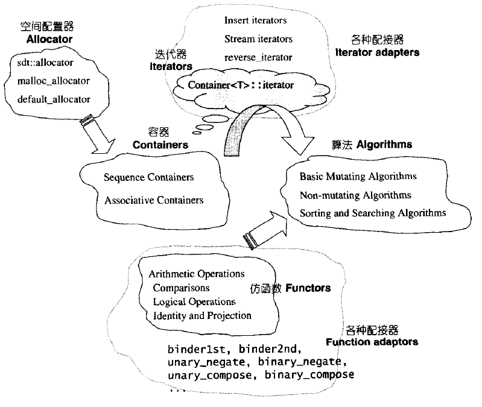
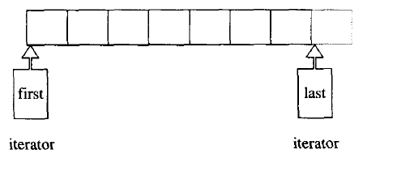

# 第一章 STL 概论与版本简介

## 1.1 STL 六大组件 功能与运用

STL 提供六大组件：

1. 容器 (containers)

   各种数据结构，如 vector, list, deque, set, map，用来存放数据

2. 算法 (algorithms)

   各种常用算法如 sort, search, copy, erase...

3. 迭代器 (iterators)

   扮演容器与算法之间的胶合剂，是所谓的＂泛型指针”

4. 仿函数 (functors)

   行为类似函数，可作为算法的某种策略。是一种重载了`operator()`的 class 或 class template

5. 配接器 (adapters)

   一种用来修饰容器 (containers) 或仿函数 (functors) 或迭代器 (iterators) 接口的东西。例如，STL 提供的 `queue` 和 `stack`, 虽然看似容器，其实只能算是一种容器配接器，因为它们的底部完全借助 `deque`, 所有操作都由底层的 `deque` 供应

6. 配置器 (allocators)

   负责空间配置与管理。从实现的角度来看，配置器是一个实现了动态空间配置、空间管理、空间释放的 class template

STL 六大组件的交互关系： Container 通过 Allocator 取得数据储存空间， Algorithm 通过 Iterator 存取 Container 内容， Functor 可以协助 Algorithm完成不同的策略变化， Adapter 可以修饰或套接Functor。

 

## 1.2 SGI STL 实现版本

SGI 版本由 Silicon Graphics Computer Systems, Inc. 公司发展，承继HP 版本。SGI 版本被 GCC 采用。你可以在 GCC 的 “include" 子目录下（例如 C:\cygnus\
cygwin-b20\include\g++)找到所有 STL 头文件。

### 1.2.1 SGI STL 文件分布与简介

其众多头文件中，概略可分为五组：

* C++ 标准规范下的 C 头文件（无扩展名），例如 cstdio, cstdlib, cstring...
* C+＋标准程序库中不属于 STL 范畴者，例如 stream, string. ．．相关文件
* STL 标准头文件（无扩展名），例如 vector, deque, list, map, algorithm, functional...
* C++ Standard 定案前， HP 所规范的STL 头文件，例如 vector.h, deque.h, list.h, map.h, algo.h, function.h …
* **<font color='red'>SGI STL 内部文件（STL 真正实现于此）</font>**，例如 stl_vector.h, stl_deque.h, stl_list.h, stl_map.h, stl_algo.h, stl_function.h...

### 1.2.2 SGI STL 的编译器组态设置(configuration)

不同的编译器对 C+＋语言的支持程度不尽相同。作为一个希望具备广泛移植能力的程序库，SGI STL 准备了一个环境组态文件 <stl_config.h> ，其中定义了许多常量，标示某些组态的成立与否。所有 STL 头文件都会直接或间接包含这个组态文件，并以条件式写法，让预处理器 (pre-processor) 根据各个常量决定取舍哪一段程序代码。

## 1.3 可能令你困惑的 C++ 语法

### 1.3.1 临时对象的产生与运用

所谓临时对象，就是一种无名对象（unnamed objects）。刻意制造临时对象的方法是，在型别名称之后直接加一对小括号，并可指定初值，例如 `Shape(3,5)` 或 `int(8)`，其意义相当于调用相应的 constructor 且不指定对象名称。STL 最常将此技巧应用于仿函数（functor）与算法的搭配上，例如：

```c++
template <typename T>
class print{
public:
    void operator()(const T &elem){
        cout << elem << ' ';
    }
};
vector<int> ivec{0, 1, 2, 3, 4, 5};
// print<int>()是一个临时对象，不是一个函数调用操作
for_each(ivec.begin(), ivec.end(), print<int>());
```

### 1.3.2 静态常量整数成员在 class 内部直接初始化

如果 class 内含 cons t static integral data member, 那么根据C+＋标准规格，我们可以在 class 之内直接给予初值。所谓 integral 泛指所有整数型别，不单只是
指 `int` 。例如：

```c++
template <typename T>
class testClass {
public:
    static const int _datai = 5;
	static const long _datal = 3L;
	static const char _datac ='c';
} ;

int main()
{
	cout << testClass<int>::_datai << endl; / / 5
	cout << testClass<int>::_datal << endl; / / 3
	cout << testClass<int>::_datac << endl; / / c
}
```

### 1.3.3 前闭后开区间表示法［）

任何一个 STL 算法，都需要获得由一对迭代器（泛型指针）所标示的区间，用以表示操作范围。这一对迭代器所标示的是个所谓的前闭后开区间，以 [first, last) 表示。也就是说，整个实际范围从 first  开始，直到 last-1 。迭代器 last 所指的是“最后一个元素的下一位置”。

 