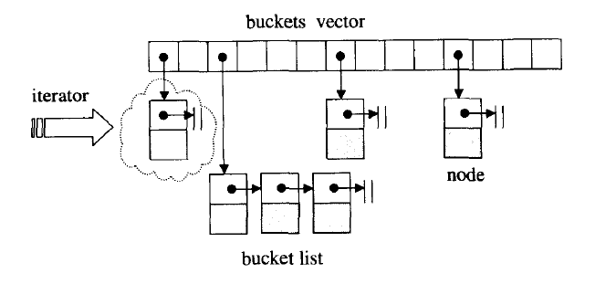

# 第一章 STL 概论与版本简介

## 1.1 STL 六大组件 功能与运用

STL 提供六大组件：

1. 容器 (containers)

   各种数据结构，如 vector, list, deque, set, map，用来存放数据

2. 算法 (algorithms)

   各种常用算法如 sort, search, copy, erase...

3. 迭代器 (iterators)

   扮演容器与算法之间的胶合剂，是所谓的＂泛型指针”

4. 仿函数 (functors)

   行为类似函数，可作为算法的某种策略。是一种重载了`operator()`的 class 或 class template

5. 配接器 (adapters)

   一种用来修饰容器 (containers) 或仿函数 (functors) 或迭代器 (iterators) 接口的东西。例如，STL 提供的 `queue` 和 `stack`, 虽然看似容器，其实只能算是一种容器配接器，因为它们的底部完全借助 `deque`, 所有操作都由底层的 `deque` 供应

6. 配置器 (allocators)

   负责空间配置与管理。从实现的角度来看，配置器是一个实现了动态空间配置、空间管理、空间释放的 class template

STL 六大组件的交互关系： Container 通过 Allocator 取得数据储存空间， Algorithm 通过 Iterator 存取 Container 内容， Functor 可以协助 Algorithm完成不同的策略变化， Adapter 可以修饰或套接Functor。

 

## 1.2 SGI STL 实现版本

SGI 版本由 Silicon Graphics Computer Systems, Inc. 公司发展，承继HP 版本。SGI 版本被 GCC 采用。你可以在 GCC 的 “include" 子目录下（例如 C:\cygnus\
cygwin-b20\include\g++)找到所有 STL 头文件。

### 1.2.1 SGI STL 文件分布与简介

其众多头文件中，概略可分为五组：

* C++ 标准规范下的 C 头文件（无扩展名），例如 cstdio, cstdlib, cstring...
* C+＋标准程序库中不属于 STL 范畴者，例如 stream, string. ．．相关文件
* STL 标准头文件（无扩展名），例如 vector, deque, list, map, algorithm, functional...
* C++ Standard 定案前， HP 所规范的STL 头文件，例如 vector.h, deque.h, list.h, map.h, algo.h, function.h …
* **<font color='red'>SGI STL 内部文件（STL 真正实现于此）</font>**，例如 stl_vector.h, stl_deque.h, stl_list.h, stl_map.h, stl_algo.h, stl_function.h...

### 1.2.2 SGI STL 的编译器组态设置(configuration)

不同的编译器对 C+＋语言的支持程度不尽相同。作为一个希望具备广泛移植能力的程序库，SGI STL 准备了一个环境组态文件 <stl_config.h> ，其中定义了许多常量，标示某些组态的成立与否。所有 STL 头文件都会直接或间接包含这个组态文件，并以条件式写法，让预处理器 (pre-processor) 根据各个常量决定取舍哪一段程序代码。

## 1.3 可能令你困惑的 C++ 语法

### 1.3.1 临时对象的产生与运用

所谓临时对象，就是一种无名对象（unnamed objects）。刻意制造临时对象的方法是，在型别名称之后直接加一对小括号，并可指定初值，例如 `Shape(3,5)` 或 `int(8)`，其意义相当于调用相应的 constructor 且不指定对象名称。STL 最常将此技巧应用于仿函数（functor）与算法的搭配上，例如：

```c++
template <typename T>
class print{
public:
    void operator()(const T &elem){
        cout << elem << ' ';
    }
};
vector<int> ivec{0, 1, 2, 3, 4, 5};
// print<int>()是一个临时对象，不是一个函数调用操作
for_each(ivec.begin(), ivec.end(), print<int>());
```

### 1.3.2 静态常量整数成员在 class 内部直接初始化

如果 class 内含 cons t static integral data member, 那么根据C+＋标准规格，我们可以在 class 之内直接给予初值。所谓 integral 泛指所有整数型别，不单只是
指 `int` 。例如：

```c++
template <typename T>
class testClass {
public:
    static const int _datai = 5;
	static const long _datal = 3L;
	static const char _datac ='c';
} ;

int main()
{
	cout << testClass<int>::_datai << endl; / / 5
	cout << testClass<int>::_datal << endl; / / 3
	cout << testClass<int>::_datac << endl; / / c
}
```

### 1.3.3 前闭后开区间表示法［）

任何一个 STL 算法，都需要获得由一对迭代器（泛型指针）所标示的区间，用以表示操作范围。这一对迭代器所标示的是个所谓的前闭后开区间，以 [first, last) 表示。也就是说，整个实际范围从 first  开始，直到 last-1 。迭代器 last 所指的是“最后一个元素的下一位置”。

 

# 第二章 空间配置器 （Allocator）

整个 STL 的操作对象（所有的数值）都存放在容器之内，而容器一定需要配置空间以置放资料。

## 2.1 空间配置器的标准接口

根据 STL 的规范，以下是 allocator 的必要接口：

```c++
// 各种type
allocator::value_type
allocator::pointer
allocator::const_pointer
allocator::reference
allocator::const_reference
allocator::size_type
allocator::difference_type
allocator: :rebind			// 一个嵌套的 class template。class rebind<U> 拥有唯一成员 other, 那是一个 typedef, 代表 allocator<U>
allocator: :allocator()
allocator::allocator(const allocator&)
template <class U>allocator::allocator(const allocator<U>&)	// 泛化的copy constructor
allocator::~allocator ()
pointer allocator::address(reference x) const	// 返回某个对象的地址。算式 a.address(x) 等同于 &x
const_poin 七er alloca 七or: :address(const_reference x) const		// 返回某个 const 对象的地址
pointer allocator::allocate(size_type n, const void*= 0)	// 配置空间，足以存储 n 个 T 对象
void allocator::deallocate(pointer p, size_type n)			// 归还先前配置的空间
size_type allocator::max_size() const						// 返回可成功配置的最大量
void allocator::construct(pointer p, const T& x)			// 等同于new((const void*) p) T(x)
void allocator: :destroy(pointer p)							// 等同于p->~T()
```

### 2.1.1 设计一个简单的空间配置器， nxb::allocator

```c++
#ifndef NXBALLOC_H
#define NXBALLOC_H

#include <new>		// for placement new
#include <cstddef>	// for ptrdiff_t, size_t
#include <cstdlib>	// for exit()
#include <climits>	// for UINT_MAX
#include <iostream>	// for cerr

using namespace std;

namespace nxb {

template <class T>
inline T* _allocate(ptrdiff_t size, T*) {
	set_new_handler(0);
	T *tmp = (T*)(::operator new((size_t)(size * sizeof(T))));
	if (tmp == 0) {
		cerr << "out of memory" << endl;
		exit(1);
	}
	return tmp;
}

template <class T>
inline void _deallocate(T *buffer) {
	::operator delete(buffer);
}

template <class T1, class T2>
inline void construct(T1* p, const T2& value) {
	new(p) T2(value);
}

template <class T>
inline void destroy(T* p) {
	p->~T();
}

template <typename T>
class allocator {
public:
	typedef T value_type;
	typedef T* pointer;
	typedef const T* const_pointer;
	typedef T& reference;
	typedef const T& const_reference;
	typedef size_t size_type;
	typedef ptrdiff_t difference_type;

	// rebind allocator of type U
	template <class U>
	class rebind {
		typedef allocator<U> other;
	};

	pointer allocate(size_type n, const void* hint = 0) {
		return _allocate((difference_type)n, (pointer)0);
	}

	void deallocate(pointer p, size_type n) { _deallocate(p); }

	void construct(pointer p, const T& value) {
		_construct(p, value);
	}

	void destroy(pointer p) { _destroy(p); }

	pointer address(reference x) { return (pointer)&x; }

	const_pointer const_address(const_reference x) { return (const_pointer)&x; }

	size_type max_size() const { return size_type(UINT_MAX / sizeof(T)); }
};

}	// end of namespace nxb

#endif	// NXBALLOC_H
```

## 2.2 具备次配置力(sub-allocation) 的 SGI 空间配置器

SGI STL 的配置器与众不同，也与标准规范不同，其名称是 alloc 而非 allocator, 而且不接受任何参数。这个事实通常不会给我们带来困扰，因为通常我们使用缺省的空间配置器，很少需要自行指定配置器名称。例如下面的 vector 声明：

```c++
template <class T, class Alloc = alloc>		// 缺省使用 alloc 为配置器
class vector{...};
```

### 2.2.1 SGI 标准的空间配置器， std ::allocator

虽然 SGI 也定义有一个符合部分标准、名为 allocator 的配置器，但 SGI 自己从未用过它，也不建议我们使用。主要原因是效率不佳，只把 C++ 的 `operator new` 和 `operator delete` 做一层薄薄的包装而已。和 2.1.1 中我们自己实现的 allocator 类似。

### 2.2.2 SGI 特殊的空间配置器， std ::alloc

为了精密分工，STL allocator 决定将内存操作和对象操作区分开来：

* 内存配置操作由 `alloc:allocate()` 负责，内存释放操作由 `alloc: :deallocate()`负责
* 对象构造操作由 `construct()` 负责，对象析构操作由 `destroy()` 负责。

 

### 2.2.3 构造和析构基本工具: `construct()` 和 `destroy()`

这两个作为构造、析构之用的函数被设计为**<font color='red'>全局函数</font>**，符合 STL 的规范。此外， STL 还规定配置器必须拥有名为`construct()` 和 `destroy()`的两个成员函数。然而真正在 SGI STL 中大显身手的那个名为 `std: :alloc` 的配置器并未遵守这一规则（稍后可见）。

1. `construct()` 接受一个指针 `p` 和一个初值 `value`, 该函数的用途就是将初值设定到指针所指的空间上。C+＋的 `placement new` 运算子可用来完成这一任务:

   ```c++
   template <class T1, class T2>
   inline void construct(T1* p, const T2& value) {
     new (p) T1(value);
   }
   ```

2. `destroy()`有两个版本：

   * 第一版本接受一个指针，准备将该指针所指之物析构掉。这很简单，直接调用该对象的析构函数即可：

     ```c++
     template <class T>
     inline void destroy(T* pointer) {
         pointer->~T();
     }
     ```

   * 第二版本接受 `first` 和 `last`两个迭代器，准备将 [first,last) 范围内的所有对象析构掉。我们不知道这个范围有多大，万一很大，而每个对象的析构函数都无关痛痒（所谓trivial destructor) ，那么一次次调用这些无关痛痒的析构函数，对效率是一种伤害。因此，这里首先利用 `value_type()` 获得迭代器所指对象的型别，再利用 `_type_traits<T>` 判断该型别的析构函数是否无关痛痒。若是 (`_true_type`)，则什么也不做就结束；若否(`_false_type`) ，这才以循环方式巡访整个范围，并在循环中每经历一个对象就调用第一个版本的 `destroy()`:

     ```c++
     // 找出元素的数值型别
     template <class ForwardIterator>
     inline void destroy(ForwardIterator first, ForwardIterator last) {
       __destroy(first, last, value_type(first));
     }
     
     // 判断元素的数值型别(value type) 是否有t rivial destructor
     template <class ForwardIterator, class T>
     inline void __destroy(ForwardIterator first, ForwardIterator last, T*) {
       typedef typename __type_traits<T>::has_trivial_destructor trivial_destructor;
       __destroy_aux(first, last, trivial_destructor());
     }
     
     // 如果元素的数值型别(value type) 有non-trivial destructor…
     template <class ForwardIterator>
     inline void
     __destroy_aux(ForwardIterator first, ForwardIterator last, __false_type) {
       for ( ; first < last; ++first)
         destroy(&*first);
     }
     
     // 如果元素的数值观别(value type) 有trivial destructor…
     template <class ForwardIterator> 
     inline void __destroy_aux(ForwardIterator, ForwardIterator, __true_type) {}
     ```

### 2.2.4 空间的配置与释放， `std::alloc`

对象构造前的空间配置和对象析构后的空间释放，由<`stl_alloc.h`> 负责，SGI 对此的设计哲学如下：

* 向 system heap 要求空间
* 考虑多线程状态
* 考虑内存不足时的应变措施
* 考虑过多“小型区块”可能造成的内存碎片问题

SGI 以 `malloc()` 和 `free()` 完成内存的配置与释放。考虑到小型区块所可能造成的内存破碎问题， SGI 设计了**<font color='blue'>双层级配置器</font>**，第一级配置器直接使用 `malloc()` 和 `free()`，第二级配置器则视情况采用不同的策略：

当配置区块超过 128 bytes 时，视之为＂足够大”，便调用第一级配置器。当配置区块小于128 bytes 时，视之为“过小”，为了降低额外负担，便采用复杂 memory pool 整理方式，而不再求助于第一级配置器。

其中`＿malloc_alloc_template` 是第一级配置器，`＿default_alloc_template` 是第二级配置器。SGI 将 `alloc` 定义为第一级或第二级配置器，并为它再包装一个接口，使配置器的接口能够符合STL 规格（`alloc` 并不接受任何 template 型别参数）：

```c++
# ifdef _USE_MALLOC
// 令alloc 为第一级配置器
typedef __malloc_alloc_template<0> malloc_alloc;
typedef malloc_alloc alloc; 	
# else
// 令alloc 为第二级配置器
typedef _default_alloc_template<_NODE_ALLOCATOR_THREADS, 0> alloc;
#endif I* ! _USE_MALLOC *I
```

```c++
template<class T, class Alloc>
class simple_alloc {
public:
    static T *allocate(size_t n)
                { return 0 == n? 0 : (T*) Alloc::allocate(n * sizeof (T)); }
    static T *allocate(void)
                { return (T*) Alloc::allocate(sizeof (T)); }
    static void deallocate(T *p, size_t n)
                { if (0 != n) Alloc::deallocate(p, n * sizeof (T)); }
    static void deallocate(T *p)
                { Alloc::deallocate(p, sizeof (T)); }
};
```

这个接口其内部四个成员函数其实都是单纯的转调用，调用传递给配置器（可能是第一级也可能是第二级）的成员函数。SG ISTL 容器全都使用这个`simple_alloc` 接口、例如：

```c++
template <class T, class Alloc = alloc> // 缺省使用 alloc 为配置器
class vector{
protected:
    // 专属之空间配置器，每次配置一个元素大小
    typedef simple_alloc<value_type, Alloc> data_allocator;
    
    void deallocate(){
        if(...)
            data_allocator::deallocate(start, end_of_storage - start)
    }
    ...
}
```

 

### 2.2.5 第一级配置器 `＿malloc_alloc_template` 剖析

```c++
#if 0
#   include <new>
#   define __THROW_BAD_ALLOC throw bad_alloc
#elif !defined(__THROW_BAD_ALLOC)
#   include <iostream.h>
#   define __THROW_BAD_ALLOC cerr << "out of memory" << endl; exit(1)
#endif
// malloc-based allocator. 通常比稍后介绍的 default alloc 速度慢
// 以下是第一级配置器
// 注意，无“template型别参数”。至于“非型别参数”inst，则完全没派上用场
template <int inst>
class __malloc_alloc_template {

private:
// 以下函数将用来处理内存不足的情况
// oom: out of memory
static void *oom_malloc(size_t);
static void *oom_realloc(void *, size_t);
static void (* __malloc_alloc_oom_handler)();

public:

static void * allocate(size_t n)
{
    void *result = malloc(n);					// 第一级配置器直接使用 malloc()
    if (0 == result) result = oom_malloc(n);	// 无法满足需求时，改用oom_malloc()
    return result;
}

static void deallocate(void *p, size_t /* n */)
{
    free(p);	// 第一级配置器直接使用free()
}

static void * reallocate(void *p, size_t /* old_sz */, size_t new_sz)
{
    void * result = realloc(p, new_sz);					// 第一级配置器直接使用realloc()
    if (0 == result) result = oom_realloc(p, new_sz);	// 无法满足需求时，改用oom_realloc()
    return result;
}

// 以下仿真 C++ 的set_new_handler()。换句话说，你可以通过它指定你自己的 out-of-memory handler
static void (* set_malloc_handler(void (*f)()))()
{
    void (* old)() = __malloc_alloc_oom_handler;
    __malloc_alloc_oom_handler = f;
    return(old);
}

};

// malloc_alloc out-of-memory handling 初值为0 。有待客端设定
template <int inst>
void (* __malloc_alloc_template<inst>::__malloc_alloc_oom_handler)() = 0;

template <int inst>
void * __malloc_alloc_template<inst>::oom_malloc(size_t n)
{
    void (* my_malloc_handler)();
    void *result;

    for (;;) {				// 不断尝试释放、配置、再释放、再配置...
        my_malloc_handler = __malloc_alloc_oom_handler;
        if (0 == my_malloc_handler) { __THROW_BAD_ALLOC; }
        (*my_malloc_handler)();	// 调用处理例程，企图释放内存
        result = malloc(n);		//	再次尝试配置内存
        if (result) return(result);
    }
}

template <int inst>
void * __malloc_alloc_template<inst>::oom_realloc(void *p, size_t n)
{
    void (* my_malloc_handler)();
    void *result;

    for (;;) {
        my_malloc_handler = __malloc_alloc_oom_handler;
        if (0 == my_malloc_handler) { __THROW_BAD_ALLOC; }
        (*my_malloc_handler)();
        result = realloc(p, n);
        if (result) return(result);
    }
}
```

第一级配置器以 `malloc()`, `free ()`, `realloc()` 等 C 函数执行实际的内存配置、释放、重配置操作，并实现出类似 C++ new-handler 的机制。

SGI 第一级配置器的 `allocate()` 和 `reallocate()` 都是在调用 `malloc()` 和 `realloc()` 不成功后，改调用 `oom_malloc()` 和 `oom_realloc()`。后两者都有内循环，不断调用“内存不足处理例程”，期望在某次调用之后，获得足够的内存而圆满完成任务。但如果“内存不足处理例程”并未被客端设定，`oom_malloc()` 和`oom_realloc()` 便老实不客气地调用 `_THROW_BAD_ALLOC`，丢出 `bad_alloc` 异常信息，或利用 `exit(1)` 硬生生中止程序。

### 2.2.6 第二级配置器 `__default_alloc_template` 剖析

小额区块带来的其实不仅是内存碎片，配置时的额外负担 (overhead) 也是一个大问题。索求任何一块内存，都得有一些 “税“ 要缴给系统，区块愈小，额外负担所占的比例就愈大，愈显得浪费。

 

SGI 第二级配置器的做法是，当区块小于 128 bytes 时，则以**<font color='blue'>内存池(memory pool) </font>**管理，此法又称为**<font color='blue'>次层配置(sub-allocation)</font>** ：

每次配置一大块内存，并维护对应之**<font color='blue'>自由链表(free-list)</font>** 。下次若再有相同大小的内存需求，就直接从 free-lists 中拨出。如果客端释还小额区块，就由配置器回收到 free-lists 中。为了方便管理，**<font color='red'>SGI 第二级配置器会主动将任何小额区块的内存需求量上调至 8 的倍数</font>**（例如客端要求 30 bytes, 就自动调整为 32 bytes)，并维护16 个 free-lists ，各自管理大小分别为 8, 16, 24, 32, 40, 48, 56, 64, 72, 80, 88, 96, 104, 112, 120, 128 bytes 的小额区块。free-lists 的节点结构如下：

```c++
union obj {
	union obj * free_list_link;
   	char client_data[1];    /* The client sees this. */
};
```

注意，上述 `obj` 所用的是 `union`, 由于`union` 之故，从其第一字段观之，`obj` 可被视为一个指针，指向相同形式的另一个obj。从其第二字段观之，`obj` 可被视为一个指针，指向实际区块。一物二用的结果是，不会为了维护链表所必须的指针而造成内存的另一种浪费（我们正在努力节省内存的开销呢）。

下面是第二级配置器的部分实现内容：

```c++
enum {__ALIGN = 8};							// 小型区块的上调边界
enum {__MAX_BYTES = 128};					// 小型区块的上限
enum {__NFREELISTS = __MAX_BYTES/__ALIGN};	// free-lists 个数
// 以下是第二级配置器
// 注意，无“ template 型别参数”，且第二参数完全没派上用场
// 第一参数用于多线程环境下。本书不讨论多线程环境
template <bool threads, int inst>
class __default_alloc_template {
private:
    // ROUND_UP() 将 bytes 上调至 8 的倍数
    static size_t ROUND_UP(size_t bytes) {
        return (((bytes) + __ALIGN-1) & ~(__ALIGN - 1));
    }
private:
    union obj {			// free-lists 的节点构造
        union obj * free_list_link;
        char client_data[1];    /* The client sees this.        */
  	};
private:
    // 16 个free-lists
    static obj * volatile free_list[__NFREELISTS];
    // 以下函数根据区块大小，决定使用第 n 号free-list。n 从 1 起算
    static  size_t FREELIST_INDEX(size_t bytes) {
        return (((bytes) + __ALIGN-1)/__ALIGN - 1);
  	}
    // 返回一个大小为 n 的对象，并可能加入大小为 n 的其它区块到 free list
    static void *refill(size_t n);
    // 配置－大块空间，可容纳 nobjs 个大小为 "size" 的区块
	// 如果配置 nobjs 个区块有所不便， nobjs 可能会降低
	static char *chunk_alloc(size_t size, int &nobjs);
  	// Chunk allocation state
    static char *start_free;	// 内存池起始位置。只在 chunk_alloc() 中变化
	static char *end_free; 		// 内存池结束位置，只在chunk_alloc() 中变化
	static size_t heap_size;
public:
    static void* allocate(size_t n) { /*详述于后*/ }
	static void deallocate(void *p, size_t n) { /*详述于后*/ }
	static void* reallocate(void *p, size_t old_sz, size_t new_sz);	
};

// 以下是 static data member 的定义初初值设定
template <bool threads, int inst>
char *__default_alloc_template<threads, inst>::start_free = 0;

template <bool threads, int inst>
char *__default_alloc_template<threads, inst>::end_free = 0;

template <bool threads, int inst>
size_t __default_alloc_template<threads, inst>::heap_size = 0;

template <bool threads, int inst>
__default_alloc_template<threads, inst>::obj * volatile
__default_alloc_template<threads, inst> ::free_list[__NFREELISTS] = {0, 0, 0, 0, 0, 0, 0, 0, 0, 0, 0, 0, 0, 0, 0, 0, };
```

### 2.2.7 空间配置函数 `allocate()`

此函数首先判断区块大小，大于128 bytes 就调用第一级配置器，小于128 bytes 就检查对应的 free list：

* 如果 free list 之内有可用的区块，就直接拿来用
* 如果没有可用区块，就将区块大小上调至 8 倍数边界，然后调用 `refill()`，准备为 free list 重新填充空间。`refill()`将于稍后介绍。

```c++
static void * allocate(size_t n)
{
	obj * volatile * my_free_list;
    obj * result;
	
    // 大于128 就调用第一级配置器
    if (n > (size_t) __MAX_BYTES) {
        return(malloc_alloc::allocate(n));
    }
    // 寻找 16 个free lists 中适当的一个
    my_free_list = free_list + FREELIST_INDEX(n);
    result = *my_free_list;
    if (result == 0) {
        // 没找到可用的 free list, 准备重新填充 free list
        void *r = refill(ROUND_UP(n));	// 下节详述
        return r;
    }
    // 调整free list
    *my_free_list = result -> free_list_link;
    return (result);
  };
```

 

> my_free_list 指向第一个可分配区块，将该区块分配之后，my_free_list 需要指向当前管理的区块之中下一个可分配区块（即当前区块的 free_list_link）

### 2.2.8 空间释放函数 `deallocate()`

该函数首先判断区块大小，大于 128 bytes 就调用第一级配置器，小于 128 bytes 就找出对应的 free list, 将区块回收。

```c++
// p不可以是0
static void deallocate(void *p, size_t n)
{
    obj *q = (obj *)p;
    obj * volatile * my_free_list;
	
    // 大于 128 就调用第一级配置器
    if (n > (size_t) __MAX_BYTES) {
        malloc_alloc::deallocate(p, n);
        return;
    }
    // 寻找对应的free list
    my_free_list = free_list + FREELIST_INDEX(n);
    // 调整free list ，回收区块
    q -> free_list_link = *my_free_list;
    *my_free_list = q;
  }
```

 

> my_free_list 指向第一个可分配区块，q 指向当前待回收区块，此操作相当于把 q 所指区块插到 my_free_list 所指区块之前。

### 2.2.9 重新填充 free lists

当 `allocate` 发现 free list 中没有可用区块了时，就调用 `refill()`，准备为 free list 重新填充空间。新的空间将取自内存池（经由 `chunk_alloc()` 完成）。缺省取得 20 个新节点（新区块），但万一内存池空间不足，获得的节点数（区块数）可能小于 20：

```c++
// 返回一个大小为 n 的对象，并且有时候会为适当的 free list 增加节点
// 假设 n 已经适当上调至 8 的倍数

template <bool threads, int inst>
void* __default_alloc_template<threads, inst>::refill(size_t n)
{
    int nobjs = 20;
    // 调用 chunk_alloc()，尝试取得 nobjs 个区块作为 free list 的新节点
	// 注意参数 nobjs 是 pass by reference
    char * chunk = chunk_alloc(n, nobjs);	// 下节详述
    obj * volatile * my_free_list;
    obj * result;
    obj * current_obj, * next_obj;
    int i;
    
	// 如果只获得一个区块，这个区块就分配给调用者用， free list 无新节点
    if (1 == nobjs) return(chunk);
    // 否则准备调整 free list, 纳入新节点
    my_free_list = free_list + FREELIST_INDEX(n);

    // 以下在 chunk 空间内建立 free list
    result = (obj *)chunk;	// 这一块准备返回给客端
    // 以下导引 free list 指向新配置的空间（取自内存池）
    *my_free_list = next_obj = (obj *)(chunk + n);
    // 以下将 free list 的各节点串接起来
    for (i = 1; ; i++) {
        current_obj = next_obj;
        next_obj = (obj *)((char *)next_obj + n);
        if (nobjs - 1 == i) {
            current_obj -> free_list_link = 0;
            break;
        } else {
            current_obj -> free_list_link = next_obj;
        }
      }
    return(result);
}
```

### 2.2.10 内存池 (memory pool)

从内存池中取空间给 free list 使用，是 `chunk_alloc()` 的工作：

```c++
// 假设 size 已经适当上调至 8 的倍数
// 注意参数 nobjs 是 pass by reference
template <bool threads, int inst>
char*
__default_alloc_template<threads, inst>::chunk_alloc(size_t size, int& nobjs)
{
    char * result;
    size_t total_bytes = size * nobjs;
    size_t bytes_left = end_free - start_free;	// 内存池剩余空间

    if (bytes_left >= total_bytes) {
        // 内存池剩余空间完全满足需求量
        result = start_free;
        start_free += total_bytes;
        return(result);
    } else if (bytes_left >= size) {
        // 内存池剩余空间不能完全满足需求量，但足够供应一个（含）以上的区块
        nobjs = bytes_left/size;
        total_bytes = size * nobjs;
        result = start_free;
        start_free += total_bytes;
        return(result);
    } else {
        // 内存池剩余空间连一个区块的大小都无法提供
        size_t bytes_to_get = 2 * total_bytes + ROUND_UP(heap_size >> 4);
        // 以下试着让内存池中的残余零头还有利用价值
        if (bytes_left > 0) {
            // 内存池内还有一些零头，先配给适当的free list
			// 首先寻找适当的free list
            obj * volatile * my_free_list =
                        free_list + FREELIST_INDEX(bytes_left);
            // 调整free list, 将内存池中的残余空间编入
            ((obj *)start_free) -> free_list_link = *my_free_list;
            *my_free_list = (obj *)start_free;
        }
        
        // 配置 heap 空间，用来补充内存池
        start_free = (char *)malloc(bytes_to_get);
        if (0 == start_free) {
            // heap 空间不足， malloc() 失败
            int i;
            obj * __VOLATILE * my_free_list, *p;
            // 试着检视我们手上拥有的东西。这不会造成伤害。我们不打算尝试配置
			// 以下搜寻适当的free list
			// 所谓适当是指“尚有未用区块，且区块够大”之 free list
            for (i = size; i <= __MAX_BYTES; i += __ALIGN) {
                my_free_list = free_list + FREELIST_INDEX(i);
                p = *my_free_list;
                if (0 != p) {	// free list 内尚有未用区块
                    // 调整 free list 以释出未用区块
                    *my_free_list = p -> free_list_link;
                    start_free = (char *)p;
                    end_free = start_free + i;
                    // 递归调用自己，为了修正 nobjs
                    return(chunk_alloc(size, nobjs));
                    // 注意，任何残余零头终将被编人适当的free-list 中备用
                }
       		}
	    	end_free = 0;	// 如果出现意外（山穷水尽，到处都没内存可用了）
            // 调用第一级配置器，看看 out-of-memory 机制能否尽点力
            start_free = (char *)malloc_alloc::allocate(bytes_to_get);
            // 这会导致抛出异常(exception) ，或内存不足的情况获得改善
        }
        heap_size += bytes_to_get;
        end_free = start_free + bytes_to_get;
        return(chunk_alloc(size, nobjs));
    }
}
```

上述的`chunk_alloc()` 函数函数以 `end_free - start_free` 来判断内存池的水量：

* 如果水量充足，就直接调出 20 个区块返回给 free list
* 如果水量不足以提供 20 个区块，但还足够供应一个以上的区块，就拨出这不足 20 个区块的空间出去。这时候其 pass by reference 的 `nobjs` 参数将被修改为实际能够供应的区块数
* 如果内存池连一个区块空间都无法供应，对客端显然无法交待，此时便需利用 `malloc()` 从 heap 中配置内存，为内存池注入活水源头以应付需求。新水量的大小为需求量的两倍，**<font color='red'>再加上一个随着配置次数增加而愈来愈大的附加量</font>**。

举个例子：

1. 假设程序开始，客端就调用 `chunk_alloc (32, 20)`，于是 `malloc` 配置 40 个 32 bytes 区块，其中第1 个交出，另19 个交给 free_list [3] 维护，余 20 个留给内存池。
2. 接下来客端调用 `chunk_alloc (64, 20)` ，此时 free_list [7] 空空如也，必须向内存池要求支持，内存池只够供应 (32*20)/64=10 个 64 bytes 区块，就把这10 个区块返回，第1 个交给客端，余 9 个由free_list[7] 维护。此时内存池全空。
3. 接下来客端再调用 `chunk_alloc(96, 20)` ，此时 free_list[11] 空空如也，必须向内存池要求支持，而内存池此时也是空的，于是以 `malloc` 配置 40+n （附加量）个 96 bytes 区块，其中第 1 个交出，另 19 个交给 free_list[11] 维护，余 20+n （附加量）个区块留给内存池...

 

万一山穷水尽，整个 system heap 空间都不够了，`malloc()` 行动失败，`chunk_alloc()` 就四处寻找有无 “尚有未用区块，且区块够大” 之 free lists 。找到了就挖一块交出，找不到就调用第一级配置器。第一级配置器其实也是使用 `malloc()` 来配置内存，但它有 out-of-memory 处理机制，或许有机会释放其它的内存拿来此处使用。如果可以，就成功，否则发出 `bad_alloc` 异常。

## 2.3 内存基本处理工具

STL 定义有五个全局函数，作用于未初始化空间上。前两个函数是 2.2.3 节说过的、用于构造的 `construct()` 和用于析构的 `destroy()`，另三个函数是 `uniniialized_copy()`, `uninitialized_fill()`, `uninitialized_fill_n()`。这三个函数都具有 “commit or rollback"  语意：要么产生所有必要的元素，否则就不产生任何元素，如果任何一个 copy constructor 丢出异常，必须析构已产生的所有元素。

### 2.3.1 `uninitialized_copy`

```c++
template <class InputIterator, class ForwardIterator>
ForwardIterator
uninitialized_copy(InputIterator first, InputIterator last, ForwardIterator result);
```

如果作为输出目的地的 [result, result+(last-first)）范围内的每一个迭代器都指向未初始化区域，则 `uninitialized_copy`会使用 copy constructor，给身为输入来源之 [first,last）范围内的每一个对象产生一份复制品，放进输出范围中。

换句话说，针对输入范围内的每一个迭代器 `i`, 该函数会调用:

```c++
construct(&*(result+(i-first)), *i)
```

产生 `*i` 的复制品，放置于输出范围的相对位置上

如果你需要实现一个容器，这样的函数会为你带来很大的帮助，因为容器的全区间构造函数(range constructor) 通常以两个步骤完成：

* 配置内存区块。足以包含范围内的所有元素
* 使用 `uninitialized_copy` 在该内存区块上构造元素

#### 具体实现

```c++
// first 指向输入端的起始位置。
// last 指向输入端的结束位置（前闭后开区间）。
// result 指向输出端（欲初始化空间）的起始处。
template <class InputIterator, class ForwardIterator>
inline ForwardIterator
  uninitialized_copy(InputIterator first, InputIterator last,
                     ForwardIterator result) {
  return __uninitialized_copy(first, last, result, value_type(result));
}

// 这个函数的进行逻辑是，首先萃取出迭代器 result 的 value type，然后判断该型别是否为 POD 型别
// POD 意指 Plain Old Data, 也就是标量型别 (scalar types) 或传统的 C struct 型别
// POD 型别必然拥有 trivial ctor/dtor/copy/ assignment 函数
// 因此，我们可以对POD 型别采用最有效率的复制手法，而对non-POD 型别采取最保险安全的做法：
template <class InputIterator, class ForwardIterator, class T>
inline ForwardIterator
__uninitialized_copy(InputIterator first, InputIterator last,
                     ForwardIterator result, T*) {
  typedef typename __type_traits<T>::is_POD_type is_POD;
  return __uninitialized_copy_aux(first, last, result, is_POD());
}

// 如果 copy construction 等同于 assignment, 而且
// destructor 是trivial, 以下就有效
// 如果是POD 型别，执行流程就会转进到以下函数。这是藉由 function template 的参数推导机制而得
template <class InputIterator, class ForwardIterator>
inline ForwardIterator 
__uninitialized_copy_aux(InputIterator first, InputIterator last,
                         ForwardIterator result,
                         __true_type) {
  return copy(first, last, result);		// 调用 STL 算法 copy()
}

// 如果是non-POD 型别，执行流程就会转进到以下函数
template <class InputIterator, class ForwardIterator>
ForwardIterator 
__uninitialized_copy_aux(InputIterator first, InputIterator last,
                         ForwardIterator result,
                         __false_type) {
  ForwardIterator cur = result;
  for ( ; first != last; ++first, ++cur)
      construct(&*cur, *first);	// 必须一个一个元素地构造，无法批量进行
  return cur;
}

// 针对 char* 和 wchar_t* 两种型别
// 可以采用最具效率的做法 memmove （直接移动内存内容）来执行复制行为

// 以下是针对 const char* 的特化版本
inline char* uninitialized_copy(const char* first, const char* last,
                                char* result) {
  memmove(result, first, last - first);
  return result + (last - first);
}

// 以下是针对 const char* 的特化版本
inline wchar_t* uninitialized_copy(const wchar_t* first, const wchar_t* last,
                                   wchar_t* result) {
  memmove(result, first, sizeof(wchar_t) * (last - first));
  return result + (last - first);
}
```

### 2.3.2 `uninitialized_fill`

```c++
template <class ForwardIterator, class T>
void uninitialized_fill (ForwardIterator first, ForwardIterator last, const T& x);
```

如果 [first, last) 范围内的每个迭代器都指向未初始化的内存，那么 `uninitialized_fill` 会在该范围内产生 `x` （上式第三参数）的复制品。

换句话说， `uninitialized_fill` 会针对操作范围内的每个迭代器 `i` 调用
```c++
construct(&*i, x)
```

在 `i` 所指之处产生 `x` 的复制品。

#### 具体实现

```c++
// first 指向输出端（欲初始化空间）的起始处。
// last 指向输出端（欲初始化空间）的结束处（前闭后开区间）。
// X 表示初值。
template <class ForwardIterator, class T>
inline void uninitialized_fill(ForwardIterator first, ForwardIterator last, 
                               const T& x) {
  __uninitialized_fill(first, last, x, value_type(first));
}

template <class ForwardIterator, class T, class T1>
inline void __uninitialized_fill(ForwardIterator first, ForwardIterator last, 
                                 const T& x, T1*) {
  typedef typename __type_traits<T1>::is_POD_type is_POD;
  __uninitialized_fill_aux(first, last, x, is_POD());
                   
}

template <class ForwardIterator, class T>
inline void
__uninitialized_fill_aux(ForwardIterator first, ForwardIterator last, 
                         const T& x, __true_type)
{
  fill(first, last, x);			// 调用 STL 算法fill()
}

template <class ForwardIterator, class T>
void
__uninitialized_fill_aux(ForwardIterator first, ForwardIterator last, 
                         const T& x, __false_type)
{
  ForwardIterator cur = first;
    for ( ; cur != last; ++cur)
      construct(&*cur, x);
}
```

### 2.3.3 `uninitialized_fill_n`

```c++
template <class ForwardIterator, class Size, class T>
Forwarditerator
uninitialized_fill_n(Forwarditerator first, Size n, const T& x);
```

`uninitialized_fill_n` 会为指定范围内的所有元素设定相同的初值。

如果 [first, first+n) 范围内的每一个迭代器都指向未初始化的内存，那么 `uninitialized_fill_n` 会调用 copy constructor，在该范围内产生 `x` （上式第三参数）的复制品。

也就是说，面对 [first, first+n) 范围内的每个迭代器 `i`, `uninitialized_fill_n` 会调用

```C++
construct(&*i, x)
```

在对应位置处产生 `x` 的复制品。

#### 具体实现

```c++
// frrst 指向欲初始化空间的起始处。
// n 表示欲初始化空间的大小。
// X 表示初值。
template <class ForwardIterator, class Size, class T>
inline ForwardIterator uninitialized_fill_n(ForwardIterator first, Size n,
                                            const T& x) {
  return __uninitialized_fill_n(first, n, x, value_type(first));
}

template <class ForwardIterator, class Size, class T, class T1>
inline ForwardIterator __uninitialized_fill_n(ForwardIterator first, Size n,
                                              const T& x, T1*) {
  typedef typename __type_traits<T1>::is_POD_type is_POD;
  return __uninitialized_fill_n_aux(first, n, x, is_POD());
                                    
}

template <class ForwardIterator, class Size, class T>
inline ForwardIterator
__uninitialized_fill_n_aux(ForwardIterator first, Size n,
                           const T& x, __true_type) {
  return fill_n(first, n, x);	// 交由 STL 算法执行
}

template <class ForwardIterator, class Size, class T>
ForwardIterator
__uninitialized_fill_n_aux(ForwardIterator first, Size n,
                           const T& x, __false_type) {
  ForwardIterator cur = first;
  for ( ; n > 0; --n, ++cur)
      construct(&*cur, x);
  return cur;
}
```

# 第三章 迭代器（iterators）概念与 traits 编程技法
## 3.1 迭代器设计思维一STL 关键所在

STL 的中心思想在于：将数据容器 (containers) 和算法 (algorithms) 分开，彼此独立设计，最后再以一帖胶着剂将它们撮合在一起。而迭代器就是扮演粘胶角色。

以算法 `find()` 为例，它接受两个迭代器和一个搜寻目标：

```c++
template <class InputIterator, class T>
InputIterator find(InputIterator first, InputIterator last, const T& value) {
  while (first != last && *first != value) ++first;
  return first;
}
```

只要给予不同的迭代器，`find()` 便能够对不同的容器进行查找操作。

## 3.2 迭代器 (iterator) 是一种 smart pointer

迭代器是一种行为类似指针的对象，而指针的各种行为中最常见也最重要的便是 dereference 和 member access，因此，迭代器最重要的编程工作就是对`operator*` 和 `operator-> `进行重载工作。

现在我们来为 `list` 设计一个迭代器。假设 list 及其节点的结构如下：

```c++
template <typename T>
class List {
public:
	void insert_front(T value);
	void insert_end(T value);
	void displace(ostream &os = cout) const;
	// ...
private:
	ListItem<T>* _end;
	ListItem<T>* _front;
	long _size;
};

template <typename T>
class ListItem{
public:
	T value() const { return _value; }
	ListItem* next() const { return _next; }
	// ...
private:
	T _value;
	List Item* _next; / /单向链表(single linked list)
};
```

当我们 dereference 这一迭代器时，传回的应该是个 `ListItem` 对象；当我们递增该迭代器时，它应该指向下一个 `ListItem` 对象。为了让该迭代器适用于任何型态的节点，而不只限于 `ListItem`，我们可以将它设计为一个 class template:

```c++
template <class Item>	// Item 可以是单向链表节点或双向链表节点。
struct ListIter {		// 此处这个迭代器特定只为链表服务，因为其独特的 operator++ 之故
	Item *ptr;			// 保持与容器之间的一个联系
	ListIter(Item *p = 0): ptr(p) { }	// 默认构造函数
	// 不必实现copy ctor, 因为编译器提供的缺省行为己足够
	// 不必实现operator = ，因为编译器提供的缺省行为己足够

	Item& operator*() const { return *ptr; }
	Item* operator->() const { return ptr; }

	// pre-increment operator
	ListIter& operator++() {
		ptr = ptr->next();
		return *this;
	}
	// post-increment operator
	ListIter operator++(int) {
		ListIter tmp = *this;
		++*this;
		return tmp;
	}

	bool operator==(const ListIter &rhs) { return ptr == rhs.ptr; }
	bool operator!=(const ListIter &rhs) { return ptr != rhs.ptr; }

};
```

现在我们可以将 `List` 和 `find()` 藉由 `ListIter` 粘合起来：

```c++
// 3mylist-iter-test.cpp
void main(){
	List<int> mylist;
	for(int i=O; i<5; ++i) {
		mylist.insert_front(i);
		mylist.insert_end(i+2);
    }	
	mylist.display ();	// 10 (4 3 2 1 0 2 3 4 5 6)
	ListIter<ListItem<int> > begin(mylist.front());
	ListIter<ListItem<int> > end; 	// default 0, null
	ListIter<ListItem<int> > iter; 	// default O, null
    iter = find(begin, end, 3);
    ...
}
```

从以上实现可以看出，为了完成一个针对 List 而设计的迭代器，我们无可避免地暴露了太多 List 实现细节：

1. 在 `main()` 之中为了制作 `begin` 和 `end` 两个迭代器，我们暴露了 `ListItem`; 
2. 在 `ListIter` 之中为了达成 `operator++` 的目的，我们暴露了 `ListItem` 的操作函数 `next`。

如果不是为了迭代器， `ListItem` 原本应该完全隐藏起来不曝光的。换句话说，**<font color='red'>要设计出 `ListItem`，首先必须对 `List` 的实现细节有非常丰富的了解。</font>**既然这无可避免，干脆就把迭代器的开发工作交给 `List` 的设计者好了，如此一来，所有实现细节反而得以封装起来不被使用者看到。这正是为什么每一种 STL 容器都提供有专属迭代器的缘故。

## 3.3 迭代器相应型别 (associated types)

什么是相应型别？迭代器所指之物的型别便是其一。假设算法中有必要声明一个变量，以 ”迭代器所指对象的型别” 为型别，如何是好？毕竟 C++ 只支持 `sizeof()`, 并未支持 `typeof()` ！即便动用 RTII 性质中的 `typeid()`，获得的也只是型别名称，不能拿来做变量声明之用。

解决办法是：**<font color='red'>利用 function template 的参数推导机制</font>**：

```c++
template <class I, class T>
void func_impl(I iter, T t){
    T tmp;		// 这里解决了问题, T 就是迭代器所指之物的型别，本例为int
    // ... 这里做原本 func() 应该做的全部工作
};

template <class I>
inline func(I iter){
    func_impl(iter, *iter);	// func 的工作全部移往 func_impl
}

int main(){
    int i;
    func(&i);
}
```

我们以 `func()` 为对外接口，却把实际操作全部置于 `func_impl()` 之中。由于 `func_impl()` 是一个function template ，一旦被调用，编译器会自动进行 template 参数推导。于是导出型别 `T`, 顺利解决了问题。

## 3.4 Traits 编程技法——STL 源代码门钥

迭代器所指对象的型别，称为该迭代器的 value type。上述的参数型别推导技巧虽然可用于 value type，却非全面可用：

万一 value type 必须用于函数的传回值，就束手无策了，毕竟函数的 "template 参数推导机制” 推而导之的只是参数，无法推导函数的返回值型别。我们需要其它的方法，**<font color='red'>声明内嵌型别</font>**似乎是个好主意：

```c++
template <class T>
struct MyIter{
    typedef T value_type;	// 内嵌型别声明（nested type）
    T* ptr;
    ...
};

template <class I>
typename I::value_type func(I ite){ return *ite; }
```

看起来不错，但是**<font color='red'>并不是所有迭代器都是 class type。原生指针就不是！如果不是 class type，就无法为它定义内嵌型别。</font>**但STL（以及整个泛型思维）绝对必须接受原生指针作为一种迭代器，所以上面这样还不够。有没有办法可以让上述的一般化概念针对特定情况（例如针对原生指针）做特殊化处理呢？是的， **<font color='blue'>template partial specialization</font>** 可以做到。

#### Partial Specialization （偏特化） 的意义

偏特化是指如果 class template 拥有一个以上的 template 参数，我们可以针对其中某个（或数个，但非全部） template 参数进行特化工作。而《泛型思维》一书对 partial specialization 的定义是： “**<font color='red'>针对（任何） template 参数更进—步的条件限制所设计出来的一个特化版本</font>**”。由此，面对以下这么一个 class template：

```c++
template <typename T>
class C{...};	// 这个泛化版本允许（接受） T 为任何型别
```

我们便很容易接受它有一个形式如下的 partial specialization:

```c++
template <typename T>
class C<T*>{...};	// 这个特化版本仅适用于 "T 为原生指针" 的情况
					// "T 为原生指针" 便是 ”T为任何型别“ 的一个更进一步的条件限制
```

由此我们可用解决前述原生指针并非 class，无法为其定义内嵌型别的问题了。我们可用针对 “迭代器之 template 参数为指针” 者，设计特化版的迭代器。下面这个 class template 专门用来 “萃取“ 迭代器的特性，而 value type 正是迭代器的特性之一：

```c++
template <class I>
struct iterator_traits{		// trait 意为 “特性”
    typedef typename I::value_type value_type;
};
```

这个所谓的 traits, 其意义是，如果 `I` 定义有自己的 `value type`，那么通过这个 traits 的作用，萃取出来的 `value_type` 就是 `I: :value＿type` 。先前那个`func()` 可以改写成这样：

```c++
template <class I>
typename iterator_traits<I>::value_type func(I ite){ return *ite; }
```

这样多一层间接性的好处是 traits 可以拥有特化版本。现在，我们令 `iterator_traits` 拥有一个 partial specializations 如下：

```c++
template <class T>
struct iterator_traits<T*>{		// 偏特化版——迭代器是个原生指针
    typedef typename T value_type;
};
```

于是，原生指针 `int*` 虽然不是一种 class type，亦可通过 traits 取其 `value_type` 。这就解决了先前的问题。但是请注意，针对 “pointer-to-const”，下面这个
式子得到什么结果：

```c++
iterator_traits<const int*>: :value_type
```

获得的是 `const int` 而非 `int` 。这显然不是我们想要的结果，因此，如果迭代器是个 pointer-to-const ，我们应该设法令其 `value_type` 为一个 non-const 型别。没问题，只要另外设计一个特化版本，就能解决这个问题：

```c++
template <class T>
struct iterator_traits<const T*>{		
    typedef typename T value_type;
};
```

当然，若要这个 “特性萃取机” traits 能够有效运作，**<font color='red'>每一个迭代器必须遵循约定，自行以内嵌型别定义 (nested `typedef`) 的方式定义出相应型别 (associated types) </font>**。

 

### 3.4.1 迭代器相应型别之一： value type

所谓 value type，是指迭代器所指对象的型别。

### 3.4.2 迭代器相应型别之二： difference type

difference type 用来表示**<font color='blue'>两个迭代器之间的距离</font>**，因此它也可以用来表示一个容器的最大容量，因为对于连续空间的容器而言，头尾之间的距离就是其最大容量：

```c++
template <class I>
struct iterator_traits{
	typedef typename I::difference_type difference_type;  
};
```

针对原生指针，以 C++ 内建的 `ptrdiff_t` 作为 difference type:

```c++
// 针对原生指针而设计的偏特化版
template <class T>
struct iterator_traits<T*>{
	typedef ptrdiff_t difference_type;  
};

// 针对原生的 pointer-to-const 而设计的偏特化版
template <class T>
struct iterator_traits<const T*>{
	typedef ptrdiff_t difference_type;  
};
```

现在，任何时候当我们需要任何迭代器 `I` 的 difference type, 可以这么写：

```c++
typename iterator_traits<I>::difference_type
```

### 3.4.3 迭代器相应型别之三： reference type

1. 当 `p` 是个 mutable iterators 时，如果其 value type 是 `T` ，那么 `*p` 的型别不应该是 `T`，应该是 `T&` 。
2. 当 `p` 是一个 constant iterators时，其 value type 是 `T`，那么 `*p` 的型别不应该是 `const T`, 而应该是 `const T&` 。

这里所讨论的 `*p` 的型别，即所谓的 reference type 。实现细节将在下一小节一并展示。

### 3.4.4 迭代器相应型别之四： pointer type

reference type 和 pointer type 已在先前的 `ListIter` class 中出现过：

```c++
Item& operator*() const { return *ptr; }
Item* operator->() const { return ptr; }
```

`Item&` 便是 `ListIter` 的reference type, 而 `Item*` 便是其 pointer type 。

现在我们把 reference type 和 pointer type 这两个相应型别加入traits 内：

```c++
template <class I>
struct iterator_traits{
	typedef typename I::pointer pointer;
    typedef typename I::reference reference;
};

// 针对原生指针而设计的偏特化版
template <class T>
struct iterator_traits<T*>{
	typedef T* pointer;
    typedef T& reference;
};

// 针对原生的 pointer-to-const 而设计的偏特化版
template <class T>
struct iterator_traits<const T*>{
	typedef const T* pointer;
    typedef const T& reference;
};
```

### 3.4.5 迭代器相应型别之五： iterator_category

#### 迭代器的分类

* Input Iterator：只读
* Output Iterator：只写
* Forward Iterator：写入型
* Bidirectional Iterator：可双向移动
* Random Access Iterator：前四种迭代器都只供应一部分指针算术能力（前三种支持 `operator++`，第四种再加上 `operator--`) ，第五种则涵盖所有指针算术能力，包括 `p+n`, `p-n`, `p[n]`, `p1-p2`, `p1<p2` 。

这些迭代器的分类与从属关系，可用下图表示：

 

设计算法时，如果可能，我们尽量针对某种迭代器提供一个明确定义，并针对更强化的某种迭代器提供另一种定义，这样才能在不同情况下提供最大效率。做法如下：利用 traits 萃取出迭代器的种类，利用这个 “迭代器类型” 相应型别作为算法的第三个参数，且这个相应型别一定必须是一个 class type，因为编译器需依赖它（一个型别）来进行 overloaded resolution。

因此我们需要定义五个 class：

```c++
// 五个作为标记用的型别 (tag types)
struct input_iterator_tag { };
struct output_iterator_tag { } ;
struct forward_iterator_tag: public input_iterator_tag { };
struct bidirectional_iterator_tag: public forward_iterator_tag { } ;
struct random_access_iterator—tag: public bidirectional_iterator_tag { } ;
```

这些 classes 只作为标记用，所以不需要任何成员。对应的，traits 必须再增加一个相应的型别：

```c++
template <class I>
struct iterator_traits {
	typedef typename I::iterator_category iterator_category;
};

// 针对原生指针而设计的偏特化版
template <class T
struct iterator_traits<T*> {
	// 原生指针是一种 andom Access Iterator
	typedef random_access_iterator_tag iterator_category;
};

// 针对原生的 pointer-to-const 而设计的偏特化版
template <class T>
struct iterator_traits<const T*> {
	// 原生的 pointer-to-const 是一种 Random Access Iterator
	typedef random_access_iterator_tag iterator_category;
};
```

#### `advance`

现在以 advance() 为例，该函数有两个参数，迭代器 `p` 和数值 `n` ，函数内部将 `p` 前进 `n` 距离：

```c++
template <class InputIterator, class Distance>
inline void __advance(InputIterator& i, Distance n, input_iterator_tag) {
  // 单向，逐一前进
  while (n--) ++i;
}

template <class BidirectionalIterator, class Distance>
inline void __advance(BidirectionalIterator& i, Distance n, 
                      bidirectional_iterator_tag) {
  // 双向，逐－前进
  if (n >= 0)
    while (n--) ++i;
  else
    while (n++) --i;
}

template <class RandomAccessIterator, class Distance>
inline void __advance(RandomAccessIterator& i, Distance n, 
                      random_access_iterator_tag) {
  // 双向，跳跃前进
  i += n;
}

template <class InputIterator, class Distance>
inline void advance(InputIterator& i, Distance n) {
  __advance(i, n, iterator_category(i));
}
```

1. 每个 `_advance()` 的最后一个参数都只声明型别，并未指定参数名称，因为它纯粹只是用来激活重载机制，函数之中根本不使用该参数。
2. `advance()` 的最后一个参数 `iterator_traits<Iterator>::iterator_category()` 将产生一个**<font color='red'>暂时对象</font>**，其型别应该隶属于前述五个迭代器类型之一。根据这个型别，编译器才决定调用哪一个 `_advance()` 重载函数。
3. 注意我们并没有写 Forward Iterator 版的  `_advance()` 。这是得益于以 class 来定义迭代器的各种分类标签，不仅可以促成重载机制，通过继承，可以使 Forward Iterator 自动调用 Input Iterator 版的 `_advance()`。

## 3.5 `std::iterator` 的保证

为了符合规范，任何迭代器都应该提供五个内嵌相应型别，以利于 traits 萃取，否则便是自别于整个 STL 架构，可能无法与其它 STL 组件顺利搭配。

然而写代码难免挂一漏万，谁也不能保证不会有粗心大意的时候。如果能够将事情简化，就好多了。STL 提供了一个 iterators class 如下，如果每个新设计的迭代器都继承自它，就可保证符合STL 所需之规范：

```c++
template<class Category,
		 class T,
		 class Distance = ptrdiff_t,
		 class Pointer = T*,
		 class Reference = T&>
struct iterator{
    typedef Category iterator_category;
    typedef T value_type;
    typedef Distance difference_type;
    typedef Pointer pointer;
    typedef Reference reference;
}
```

`iterator` class 不含任何成员，纯粹只是型别定义，所以继承它并不会招致任何额外负担。由于后三个参数皆有默认值，故新的迭代器只需提供前两个参数即可。例如之前我们自己定义的 `ListIter`，可以这样写：

```c++
template <class Item>
ListIter : public iterator<forward_iterator_tag, Item>
{ ... }
```

> 设计适当的相应型别 (associated types) ，是迭代器的责任。设计适当的迭代器，则是容器的责任。唯容器本身，才知道该设计出怎样的迭代器来遍历自己，并执行迭代器该有的各种行为（前进、后退、取值、取用成员...)。至于算法，完全可以独立于容器和迭代器之外自行发展，只要设计时以迭代器为对外接口就行。

## 3.6 SGI STL 的私房菜： __type_traits

STL 只对迭代器加以规范，制定出 iterator_traits 这样的东西。SGI 把这种技法进一步扩大到迭代器以外的世界，于是有了所谓的 __ type_traits。双底线前缀词意指这是 SGI STL 内部所用的东西，不在 STL 标准规范之内。

`iterator_traits` 负责萃取迭代器的特性，`__type_traits` 则负责萃取型别 (type) 的特性。此处我们所关注的型别特性是指：这个型别是否具备 non-trivial
defalt ctor? 是否具备 non-trivial copy ctor? 是否具备non-trivial assignment operator? 是否具备non-trivial dtor? 如果答案是否定的，我们在对这个型别进行构造、析构、拷贝、赋值等操作时，就可以采用最有效率的措施（例如根本不调用身居高位，不谋实事的那些constructor, destructor) ，而采用内存直接处理操作
如 `malloc`、`memcpy` 等等，获得最高效率。

根据 `iterator_traits` 得来的经验，我们希望，程序之中可以这样运用 `__type_traits<T>`, `T` 代表任意型别：

```c++
__type_traits::has_trivial_default_constructor
__type_traits::has_trivial_copy_constructor
__type_traits::has_trivial_assignment_operator
__type_traits::has_trivial_destructor
__type_traits::is_POD_type		// POD : Plain Old Data
```

我们希望上述式子应该是个有着真／假性质的对象，因为我们希望利用其响应结果来进行**<font color='red'>参数推导</font>**，而**<font color='red'>编译器只有面对 class object 形式的参数，才会做参数推导</font>**。为此，上述式子应该传回这样的东西：

```c++
struct __true_type { };
struct __false_type { };
```

为了达成上述五个式子，`__type_traits` 内必须定义一些 `typedef`s, 其值不是`__true_type`就是`__false_type`。下面是 SGI 的做法：

```c++
// 把所有内嵌型别都定义为 __false_type，定义出最保守的值
// 然后再针对每一个标量型别 (scalar types) 设计适当的特化版本
template <class type>
struct __type_traits { 
   typedef __true_type     this_dummy_member_must_be_first;

   typedef __false_type    has_trivial_default_constructor;
   typedef __false_type    has_trivial_copy_constructor;
   typedef __false_type    has_trivial_assignment_operator;
   typedef __false_type    has_trivial_destructor;
   typedef __false_type    is_POD_type;
};

// 以下针对 C++ 基本型别char, signed char, unsigned char, short, unsigned short, int， unsigned int,
// long, unsigned long, float, double, long double 提供特化版本。
// 注意，每一个成员的值都是 __true_type, 表示这些型别都可采用最快速方式（例如memcpy) 来进行拷贝 (copy) 或赋值 (assign) 操作

// 注意， SGI STL <stl_config.h> 将以下出现的 __STL_TEMPLATE_NULL 定义为 template<>
__STL_TEMPLATE_NULL struct __type_traits<char> {
   typedef __true_type    has_trivial_default_constructor;
   typedef __true_type    has_trivial_copy_constructor;
   typedef __true_type    has_trivial_assignment_operator;
   typedef __true_type    has_trivial_destructor;
   typedef __true_type    is_POD_type;
};

__STL_TEMPLATE_NULL struct __type_traits<signed char> {
   typedef __true_type    has_trivial_default_constructor;
   typedef __true_type    has_trivial_copy_constructor;
   typedef __true_type    has_trivial_assignment_operator;
   typedef __true_type    has_trivial_destructor;
   typedef __true_type    is_POD_type;
};

__STL_TEMPLATE_NULL struct __type_traits<unsigned char> {
   typedef __true_type    has_trivial_default_constructor;
   typedef __true_type    has_trivial_copy_constructor;
   typedef __true_type    has_trivial_assignment_operator;
   typedef __true_type    has_trivial_destructor;
   typedef __true_type    is_POD_type;
};

__STL_TEMPLATE_NULL struct __type_traits<short> {
   typedef __true_type    has_trivial_default_constructor;
   typedef __true_type    has_trivial_copy_constructor;
   typedef __true_type    has_trivial_assignment_operator;
   typedef __true_type    has_trivial_destructor;
   typedef __true_type    is_POD_type;
};

__STL_TEMPLATE_NULL struct __type_traits<unsigned short> {
   typedef __true_type    has_trivial_default_constructor;
   typedef __true_type    has_trivial_copy_constructor;
   typedef __true_type    has_trivial_assignment_operator;
   typedef __true_type    has_trivial_destructor;
   typedef __true_type    is_POD_type;
};

__STL_TEMPLATE_NULL struct __type_traits<int> {
   typedef __true_type    has_trivial_default_constructor;
   typedef __true_type    has_trivial_copy_constructor;
   typedef __true_type    has_trivial_assignment_operator;
   typedef __true_type    has_trivial_destructor;
   typedef __true_type    is_POD_type;
};

__STL_TEMPLATE_NULL struct __type_traits<unsigned int> {
   typedef __true_type    has_trivial_default_constructor;
   typedef __true_type    has_trivial_copy_constructor;
   typedef __true_type    has_trivial_assignment_operator;
   typedef __true_type    has_trivial_destructor;
   typedef __true_type    is_POD_type;
};

__STL_TEMPLATE_NULL struct __type_traits<long> {
   typedef __true_type    has_trivial_default_constructor;
   typedef __true_type    has_trivial_copy_constructor;
   typedef __true_type    has_trivial_assignment_operator;
   typedef __true_type    has_trivial_destructor;
   typedef __true_type    is_POD_type;
};

__STL_TEMPLATE_NULL struct __type_traits<unsigned long> {
   typedef __true_type    has_trivial_default_constructor;
   typedef __true_type    has_trivial_copy_constructor;
   typedef __true_type    has_trivial_assignment_operator;
   typedef __true_type    has_trivial_destructor;
   typedef __true_type    is_POD_type;
};

__STL_TEMPLATE_NULL struct __type_traits<float> {
   typedef __true_type    has_trivial_default_constructor;
   typedef __true_type    has_trivial_copy_constructor;
   typedef __true_type    has_trivial_assignment_operator;
   typedef __true_type    has_trivial_destructor;
   typedef __true_type    is_POD_type;
};

__STL_TEMPLATE_NULL struct __type_traits<double> {
   typedef __true_type    has_trivial_default_constructor;
   typedef __true_type    has_trivial_copy_constructor;
   typedef __true_type    has_trivial_assignment_operator;
   typedef __true_type    has_trivial_destructor;
   typedef __true_type    is_POD_type;
};

__STL_TEMPLATE_NULL struct __type_traits<long double> {
   typedef __true_type    has_trivial_default_constructor;
   typedef __true_type    has_trivial_copy_constructor;
   typedef __true_type    has_trivial_assignment_operator;
   typedef __true_type    has_trivial_destructor;
   typedef __true_type    is_POD_type;
};

// 注意，以下针对原生指针设计＿＿type_traits 偏特化版本
// 原生指针亦被视为一种标量型别
template <class T>
struct __type_traits<T*> {
	typedef __true_type    has_trivial_default_constructor;
   	typedef __true_type    has_trivial_copy_constructor;
   	typedef __true_type    has_trivial_assignment_operator;
   	typedef __true_type    has_trivial_destructor;
   	typedef __true_type    is_POD_type;
};
```

`__type_traits` 在 SGI STL 中的应用很广，例如 `copy()` 全局函数（泛型算法之一），其最基本的想法是这样的：

```c++
// 拷贝一个数组，其元素为任意型别，视情况采用最有效率的拷贝手段
template <class T> inline void copy(T* source, T* destination, int n) {
	copy(source, destination, n,
         	typename __type_traits<T>::has_trivial_copy_constructor());
}

// 拷贝一个数组，其元素型别拥有 non-trivial copy constructors
template <class T> inline void copy(T* source, T* destination, int n, __false_type){
    ...
}

// 拷贝一个数组，其元素型别拥有 trivial copy constructors
// 可借助 memcpy() 完成工作
template <class T> inline void copy(T* source, T* destination, int n, __true_type){
    ...
}
```

> 究竟一个 class 什么时候该有自己的 non-trivial default constructor, non-trivial copy constructor, non-trivial assignment operator, non-trivial destructor 呢？一个简单的判断准则是：如果 class 内含指针成员，并且对它进行内存动态配置，那么这个 class 就需要实现出自己的 non-trivial-xxx。

# 第四章 序列式容器 （Sequence Containers）

## 4.1 容器的概观与分类

下图以缩进方式表示了 SGI STL 的各种容器基层与衍生层的关系。这里所谓的衍生，并非派生（inheritance）关系，而是内含关系。例如 `heap` 内含一个 `vector`，`priority-queue` 内含一个 `heap`、`stack` 和 `queue` 都内含一个 `deque`，`set`、`map`、`multiset`、`multimap` 都内含一个 `RB-tree...`

 

## 4.2 `vector`

### 4.2.1 `vector` 概述

`vector` 的数据安排以及操作方式，与 array 非常相似。两者的唯一差别在于空间的运用的灵活性：

* array 是**<font color='blue'>静态空间</font>**，一旦配置了就不能改变：要换个大（或小）一点的房子，可以，一切琐细得由客户端自己来，首先配置一块新空间，然后将元素从旧址一一搬往新址，再把原来的空间释还给系统。
* `vector` 是**<font color='blue'>动态空间</font>**，随着元素的加入，它的内部机制会自行扩充空间以容纳新元素。

### 4.2.2 `vector` 定义摘要

以下是 vector 定义的源代码摘录：

```c++
template <class T, class Alloc = alloc>
class vector {
public:
  // vector 的嵌套定义
  typedef T value_type;
  typedef value_type* pointer;
  typedef value_type* iterator;
  typedef value_type& reference;
  typedef size_t size_type;
  typedef ptrdiff_t difference_type;
protected:
  typedef simple_alloc<value_type, Alloc> data_allocator;
  iterator start;						// 表示目前使用空间的头
  iterator finish;						// 表示目前使用空间的尾
  iterator end_of_storage;				// 表示目前可用空间的尾
  void insert_aux(iterator position, const T& x);
  void deallocate() {
    if (start) data_allocator::deallocate(start, end_of_storage - start);
  }

  void fill_initialize(size_type n, const T& value) {
    start = allocate_and_fill(n, value);
    finish = start + n;
    end_of_storage = finish;
  }
public:
  iterator begin() { return start; }
  iterator end() { return finish; }
  size_type size() const { return size_type(end() - begin()); }
  size_type capacity() const { return size_type(end_of_storage - begin()); }
  bool empty() const { return begin() == end(); }
  reference operator[](size_type n) { return *(begin() + n); }
    
  vector() : start(0), finish(0), end_of_storage(0) {}
  vector(size_type n, const T& value) { fill_initialize(n, value); }
  vector(int n, const T& value) { fill_initialize(n, value); }
  vector(long n, const T& value) { fill_initialize(n, value); }
  explicit vector(size_type n) { fill_initialize(n, T()); }
    
  ~vector() { 
    destroy(start, finish);		// 全局函数
    deallocate();				// vector的一个member函数
  }
  
  reference front() { return *begin(); }		// 第一个元素
  reference back() { return *(end() - 1); }		// 最后一个元素
  void push_back(const T& x) {					// 将元素插入至最尾端
    if (finish != end_of_storage) {
      construct(finish, x);		// 全局函数
      ++finish;
    }
    else
      insert_aux(end(), x);
  }
  void pop_back() {								// 将最尾端元素取出
    --finish;
    destroy(finish);
  }
  iterator erase(iterator position) {			// 清楚某位置上的元素
    if (position + 1 != end())
      copy(position + 1, finish, position);		// 后续元素往前移动
    --finish;
    destroy(finish);
    return position;
  }
  void resize(size_type new_size, const T& x) {
    if (new_size < size()) 
      erase(begin() + new_size, end());
    else
      insert(end(), new_size - size(), x);
  }
  void resize(size_type new_size) { resize(new_size, T()); }
  void clear() { erase(begin(), end()); }
protected:
  // 配置空间并填满内容
  iterator allocate_and_fill(size_type n, const T& x) {
    iterator result = data_allocator::allocate(n);
      uninitialized_fill_n(result, n, x);
      return result;
    }
  }
};
```

### 4.2.3 `vector` 的迭代器

`vector` 维护的是一个连续线性空间，所以不论其元素型别为何，普通指针都可以作为 `vector` 的迭代器而满足所有必要条件。`vector` 支持随机存取，而普通指针正有着这样的能力。所以，`vector` 提供的是 Random Access Iterators 。

```c++
template <class T, class Alloc = alloc>
class vector {
public:
  // vector 的嵌套定义
  typedef T value_type;
  typedef value_type* iterator;		// vector 的迭代器是普通指针
  ...
};
```

根据上述定义，如果客户端写出这样的代码：

```c++
vector<int>::iterator ivite;
vector<Shape>::iterator svite;
```

`ivite` 的型别其实就是 `int*`，`svite` 的型别其实就是 `shape*`

### 4.2.4 `vector` 的数据结构

`vector` 所采用的数据结构非常简单：**<font color='red'>线性连续空间</font>**。它以两个迭代器 `start` 和 `finish` 分别指向配置得来的连续空间中目前已被使用的范围，并以迭代器
`end_of_storage` 指向整块连续空间（含备用空间）的尾端：

```c++
template <class T, class Alloc = alloc>
class vector {
...
protected:
  iterator start;						// 表示目前使用空间的头
  iterator finish;						// 表示目前使用空间的尾
  iterator end_of_storage;				// 表示目前可用空间的尾
...
};
```

 

运用这三个迭代器，便可轻易地提供首尾标示、大小、容量、空容器判断、下标运算符、最前端元素值、最后端元素值等机能：

```c++
template <class T, class Alloc = alloc>
class vector {
...
public:
  iterator begin() { return start; }
  iterator end() { return finish; }
  size_type size() const { return size_type(end() - begin()); }
  size_type capacity() const { return size_type(end_of_storage - begin()); }
  bool empty() const { return begin() == end(); }
  reference operator[](size_type n) { return *(begin() + n); }
    
  reference front() { return *begin(); }		// 第一个元素
  reference back() { return *(end() - 1); }		// 最后一个元素
...
};
```

### 4.2.5 `vector` 的构造与内存管理： `constructor`, `push_back`

`vector` 缺省使用 `alloc` （第二章）作为空间配置器，并据此另外定义了一个 `data_allocator`, 为的是更方便以元素大小为配置单位：

```c++
template <class T, class Alloc = alloc>
class vector {
...
protected:
  typedef simple_alloc<value_type, Alloc> data_allocator;
...
};
```

#### 指定空间大小及初值的构造函数

```c++
// 构造函数，允许指定vector大小和初值value
vector(size_type n, const T& value) { fill_initialize(n, value); }

// 填充并予以初始化
void fill_initialize(size_type n, const T& value) {
    start = allocate_and_fill(n, value);
    finish = start + n;
    end_of_storage = finish;
}

// 配置而后填充
iterator allocate_and_fill(size_type n, const T& x) {
    iterator result = data_allocator::allocate(n);	// 配置 n 个元素空间
    // uninitialized_fill_n 会根据第一参数的型别特性决定使用算法 fill_n 或反复调用 construct 来完成任务
    uninitialized_fill_n(result, n, x);				// 全局函数，见 2.3 节
    return result;
}
```

#### `push_back`

当我们以 `push_back` 将新元素插入于 `vector` 尾端时，该函数首先检查是否还有备用空间：

* 如果有就直接在备用空间上**<font color='red'>构造</font>**元素，并调整迭代器 `finish`, 使 `vector` 变大
* 如果没有备用空间了，就扩充空间（**<font color='red'>重新配置、移动数据、释放原空间</font>**）

```c++
void push_back(const T& x) {					// 将元素插入至最尾端
    if (finish != end_of_storage) {	// 还有备用空间
      construct(finish, x);			// 全局函数
      ++finish;
    }
    else{							// 已无备用空间
      insert_aux(end(), x);
  	}
}

template <class T, class Alloc>
void vector<T, Alloc>::insert_aux(iterator position, const T& x) {
  if (finish != end_of_storage) {	// 还有备用空间
    construct(finish, *(finish - 1));
    ++finish;
    T x_copy = x;
    copy_backward(position, finish - 2, finish - 1);
    *position = x_copy;
  }
  else {							// 已无备用空间
    // 配置原则：如果原大小为0, 则配置1 （个元素大小） ;
	// 如果原大小不为0, 则配置原大小的两倍，前半段用来放置原数据，后半段准备用来放置新数据
    const size_type old_size = size();
    const size_type len = old_size != 0 ? 2 * old_size : 1;	
    
    iterator new_start = data_allocator::allocate(len);	// 配置新空间
    iterator new_finish = new_start;
    try {
      // 将原 vector 的内容拷贝到新 vector
      new_finish = uninitialized_copy(start, position, new_start);
      // 为新元素设定初值 x
      construct(new_finish, x);
      ++new_finish;
      // 将原vector 的备用空间中的内容也忠实拷贝过来（疑惑：啥用途？）
      new_finish = uninitialized_copy(position, finish, new_finish);
    }
    catch(...) {
      // commit or rollback
      destroy(new_start, new_finish); 
      data_allocator::deallocate(new_start, len);
      throw;
    }
    
    // 析构并释放原 vector
    destroy(begin(), end());
    deallocate();
    
    // 调整迭代器，指向新 vector
    start = new_start;
    finish = new_finish;
    end_of_storage = new_start + len;
  }
}
```

注意，所谓动态增加大小，并不是在原空间之后接续新空间（因为无法保证原空间之后尚有可供配置的空间），而是以原大小的两倍**<font color='red'>另外配置</font>**一块较大空间，然
后将原内容拷贝过来，然后才开始在原内容之后构造新元素，并释放原空间。

因此，**<font color='red'>对 `vector` 的任何操作，一且引起空间重新配置，指向原 `vector` 的所有迭代器就都失效了</font>**。这是程序员易犯的一个错误，务需小心。

### 4.2.6 `vector` 的元素操作： `pop_back`, `erase`, `clear`, `insert`

####  `pop_back`

```c++
void pop_back() {								
    --finish;			// 将尾端标记往前移一格，表示将放弃尾端元素，注意 finish 是指向下 one pass last 处
    destroy(finish);	// 析构尾端元素，并不调用 deallocate 释放其所在空间
}
```

#### `erase`、`clear`

```c++
// 消除［first,last) 中的所有元素
iterator erase(iterator first, ierator last) {
    iterator i = copy(last, finish, first);	// 后续元素向前移动
    destroy(i, finish);						
    finish = finish - (last - first);
    return first;
}
```

```c++
// 清除某个位置上的元素
iterator erase(iterator position) {
    if(position + 1 != end())
        copy(position + 1, finish, position);	// 后续元素向前移动
    --finish;
    destroy(finish);						
    return position;
}
```

```c++
void clear(){
    erase(begin(), end());
}
```

#### `insert`

```c++
template <class T, class Alloc>
void vector<T, Alloc>::insert(iterator position, size_type n, const T& x) {
  if (n != 0) {
    if (size_type(end_of_storage - finish) >= n) {	// 备用空间大于等于新增元素个数
      T x_copy = x;
      const size_type elems_after = finish - position;
      iterator old_finish = finish;
      if (elems_after > n) {						// 插入点之后的现有元素个数（包括插入点） 大于 新增元素个数
        // 在源区间末尾切出一块同待插入区间等长的部分，整体后移；因为源区间末尾之后面对的是未初始化的内存，所以调用 uninitialized_copy 
        uninitialized_copy(finish - n, finish, finish);		
        finish += n;
     	// 第一步的剩余部分逆向拷贝的方式，整体右移；因为是对已初始化空间的操作而且是逆向拷贝，所以调用 copy_backward
        copy_backward(position, old_finish - n, old_finish);
        // 第二部分的空洞部分由待插入序列进行填充。因为是对已初始化空间的操作，所以调用 fill 
        fill(position, position + n, x_copy);		// 从插入点开始填入新值
      }
      else {										// 插入点之后的现有元素个数 小于等于 新增元素个数
        // 先把需要插入在未初始化空间的待插入元素插在容器尾端，数量为 n - elems_after
        uninitialized_fill_n(finish, n - elems_after, x_copy);
        finish += n - elems_after;
        // 把原先插入点之后的元素后移到上述步骤之后，同样是在未初始化空间插入
        uninitialized_copy(position, old_finish, finish);
        finish += elems_after;
        // 最后往空出来的 从插入点之后到原先容器尾端 的位置中插入待插入元素
        fill(position, old_finish, x_copy);
      }
    }
    else {											// 备用空间小于新增元素个数
      // 首先决定新长度：旧长度的两倍，或旧长度＋新增元素个数
      const size_type old_size = size();        
      const size_type len = old_size + max(old_size, n);
      // 配置新的 vector 空间
      iterator new_start = data_allocator::allocate(len);
      iterator new_finish = new_start;
      try {
        // 首先将旧 vector 的插入点之前的元素复制到新空间
        new_finish = uninitialized_copy(start, position, new_start);
        // 再将新增元素填入新空间
        new_finish = uninitialized_fill_n(new_finish, n, x);
        // 最后将旧 vector 插入点之后的元素复制到新空间
        new_finish = uninitialized_copy(position, finish, new_finish);
      }
      catch(...) {
        // commit or rollback
        destroy(new_start, new_finish);
        data_allocator::deallocate(new_start, len);
        throw;
      }
      // 清楚并释放就 vector
      destroy(start, finish);
      deallocate();
      // 更新三个迭代器
      start = new_start;
      finish = new_finish;
      end_of_storage = new_start + len;
    }
  }
}
```

图示说明：

* 备用空间 ≥ 新增元素个数

  区分下面两种情况主要是因为在 `position` 到 `finish `之间插入元素需要调用 `copy_backward` / `fill` ，而在备用空间中插入元素则需要调用`uninitialized_copy`，因此不能一起整体后移。

  * 插入点之后的现有元素 ＞ 新增元素个数

     

  * 插入点之后的现有元素 ≤ 新增元素个数

     

* 备用空间 ＜新增元素个数

   

## 4.3 `list`

### 4.3.1 `list` 概述

相较于 `vector` 的连续线性空间， `list` 就显得复杂许多，它的好处是每次插入或删除一个元素，就配置或释放一个元素空间。因此， `list` 对于空间的运用有
绝对的精准，一点也不浪费。而且，对于任何位置的元素插入或元素移除， `list` 永远是常数时间。

### 4.3.2 `list` 的节点（node）

以下是 STL list 的节点结构：

```c++
template <class T>
struct __list_node {
  typedef void* void_pointer;
  void_pointer next;
  void_pointer prev;
  T data;
};
```

显然这是一个**<font color='red'>双向链表</font>**。

### 4.3.3 `list` 的迭代器

`list` 不再能够像 `vector` 一样以普通指针作为迭代器，因为其节点不保证在储存空间中连续存在。

`list` 迭代器必须有能力指向 `list` 的节点，并有能力进行正确的递增、递减、取值、成员存取等操作。以下是 `list` 迭代器的设计：

```c++
template<class T, class Ref, class Ptr>
struct __list_iterator {
  typedef __list_iterator<T, T&, T*>             iterator;
  typedef __list_iterator<T, Ref, Ptr>           self;

  typedef bidirectional_iterator_tag iterator_category;
  typedef T value_type;
  typedef Ptr pointer;
  typedef Ref reference;
  typedef __list_node<T>* link_type;
  typedef size_t size_type;
  typedef ptrdiff_t difference_type;

  link_type node;			// 迭代器内部当然要有一个普通指针，指向 list 的节点

  // constructor
  __list_iterator(link_type x) : node(x) {}
  __list_iterator() {}
  __list_iterator(const iterator& x) : node(x.node) {}

  bool operator==(const self& x) const { return node == x.node; }
  bool operator!=(const self& x) const { return node != x.node; }
  // 对迭代器进行解引用，取的是节点的数据值
  reference operator*() const { return (*node).data; }
  // 迭代器成员存取的做法，返回的是指向节点数据的指针
  pointer operator->() const { return &(operator*()); }

  // 对迭代器累加 1，就是前进一个节点
  self& operator++() { 
    node = (link_type)((*node).next);
    return *this;
  }
  self operator++(int) { 
    self tmp = *this;
    ++*this;
    return tmp;
  }
  // 对迭代器递减 1，就是后退一个节点
  self& operator--() { 
    node = (link_type)((*node).prev);
    return *this;
  }
  self operator--(int) { 
    self tmp = *this;
    --*this;
    return tmp;
  }
};

template <class T, class Alloc = alloc>
class list{
public:
    typedef __list_iterator<T, T&, T*>             iterator;
...
};
```

### 4.3.4 `list` 的数据结构

SGI `list` 不仅是一个双向链表，而且还是一个**<font color='red'>环状双向链表</font>**。所以它只需要一个指针，便可以完整表现整个链表：

```c++
template <class T, class Alloc = alloc>
class list{
protected:
    typedef _list_node<T> list_node;
public:
    typedef lis_node* link_type;
protected:
    link_type node;	// 只要一个指针，便可表示整个环状双向链表
...
};
```

如果让指针 `node` 指向刻意**<font color='red'>置于尾端的一个空白节点</font>**， `node` 便能符合 STL 对于 “前闭后开“ 区间的要求，成为 last 迭代器，如图所示：

 

利用这个 last 迭代器，可以轻松实现下面几个函数：

```c++
iterator begin() { return (link_type)((*node).next); }
iterator end() { return node; }
bool empty() const { return node->next == node; }
  	size_type size() const {
    size_type result = 0;
    distance(begin(), end(), result);
    return result;
}
reference front() { return *begin(); }
reference back() { return *(--end()); }
```

### 4.3.5 `list` 的构造与内存管理

`list` 缺省使用 `alloc`  作为空间配置器，并据此另外定义了一个 `list_node_allocator`, 为的是更方便地以节点大小为配置单位：

```c++
template <class T, class Alloc = alloc>	// 缺省使用 alloc 为配置器
class list{
protected:
    typedef _list_node<T> list_node;
    // 专属之空间配置器，每次配置一个节点大小
    typedef simple_alloc<list_node, Alloc> list_node_allocator;
    ...
};
```

list 通过 list_node_allocator 来配置、释放、构造、销毁一个节点：

```c++
// 配置一个节点并传回
link_type get_node() { return list_node_allocator::allocate(); }
// 释放一个节点
void put_node(link_type p) { list_node_allocator::deallocate(p); }
// 产生（配置并构造）一个节点，带有元素值
link_type create_node(const T& x) {
    link_type p = get_node();
    construct(&p->data, x);		// 调用 construct 函数在节点数据位置构造数据
    return p;
}
void destroy_node(link_type p) {
    destroy(&p->data);			// 析构节点数据
    put_node(p);
}
```

#### 默认构造函数

```c++
list() { empty_initialize(); }	// 产生一个空链表

void empty_initialize() { 
	node = get_node();			// 配置一个节点空间，令 node 指向它
    node->next = node;			// 令 node 头尾都指向自己，不设元素值
    node->prev = node;
}
```

 

#### `insert` 函数

`insert` 是一个重载函数，有多种形式。其中一种为 ”在迭代器 `position` 所指位置插入一个节点，内容为 `x`“：

```c++
iterator insert(iterator position, const T& x) {
    link_type tmp = create_node(x);		// 产生一个节点，内容为 x
    // 调整双向指针，使 tmp 插入进去
    tmp->next  = position.node;			// node为list的迭代器中保存的指向当前节点的指针
    tmp->prev = position.node->prev;
    (link_type(position.node->prev))->next = tmp;
    position.node->prev = tmp;
    return tmp;
}
```

注意，插入完成后，**<font color='red'>新节点将位于 `position` 的前方</font>**，这是 STL 对于插入操作的标准规范。

**<font color='red'>由于 `list` 不像 `vector` 那样有可能在空间不足时做重新配置、数据移动操作，所以插入前的所有迭代器在插入操作之后仍然有效。</font>**

### 4.3.6 `list` 的元素操作

#### `push_front`, `push_back`

两者均调用上一节中 `insert` 方法完成元素的插入：

```c++
// 插入一个节点，作为头节点
void push_front(const T& x) { insert(begin(), x); }
// 插入一个节点，作为尾节点
void push_back(const T& x) { insert(end(), x); }
```

#### `erase`、`pop_front`、`pop_back`

```c++
iterator erase(iterator position) {
   // 调整双向指针，从链表中移除待删除节点
   link_type next_node = link_type(position.node->next);
   link_type prev_node = link_type(position.node->prev);
   prev_node->next = next_node;
   next_node->prev = prev_node;
   // 释放待删除节点的空间
   destroy_node(position.node);
   
   return iterator(next_node);
}
// 移除头节点
void pop_front() { erase(begin()); }
// 移除尾节点
void pop_back() { 
   iterator tmp = end();
   erase(--tmp);
}
```

#### `clear` 清除所有节点

```c++
template <class T, class Alloc> 
void list<T, Alloc>::clear()
{
  link_type cur = (link_type) node->next;		// node 为 list 中记录的 last 指针，node->next 即为 begin()
  // 遍历链表，销毁每一个节点
  while (cur != node) {							// begin != end
  	link_type tmp = cur;
  	cur = (link_type) cur->next;
  	destroy_node(tmp);
  }
  // 恢复 node 原始状态
  node->next = node;
  node->prev = node;
}
```

#### `transfer`

`list` 内部提供一个所谓的迁移操作（transfer）：将某连续范围的元素迁移到某个特定位置**<font color='red'>之前</font>**。技术上很简单，节点间的指针移动而已。这个操作为其它的复
杂操作如 `splice`, `sort`, `merge` 等奠定良好的基础。

```c++
protected:
  void transfer(iterator position, iterator first, iterator last) {	// 注意是左闭又开区间，最终插入的是 first 到 last->prev
    if (position != last) {
      (*(link_type((*last.node).prev))).next = position.node;		// 将 last 的前驱的后继指向 position
      (*(link_type((*first.node).prev))).next = last.node;			// 将 first ~ last->prev 从原链表中断开
      (*(link_type((*position.node).prev))).next = first.node;  	// 将 position->prev->next 指向 first
      link_type tmp = link_type((*position.node).prev);
      (*position.node).prev = (*last.node).prev;					// 将 position->prev 指向 last->prev
      (*last.node).prev = (*first.node).prev; 						// 将 last 的前驱指向 first 的前驱
        															// 将 first ~ last->prev 从原链表中断开
      (*first.node).prev = tmp;										// 将 first 的前驱指向原 position 的前驱
    }
  }
```

以下是 `merge`, `reverse`, `sort` 的源代码。有了 `transfer`，这些操作都不难完成。

```c++
// merge 将 x 合并到 *this 身上。两个 list 的内容都必须先经过递增排序
template <class T, class Alloc>
void list<T, Alloc>::merge(list<T, Alloc>& x) {
  iterator first1 = begin();
  iterator last1 = end();
  iterator first2 = x.begin();
  iterator last2 = x.end();
  while (first1 != last1 && first2 != last2)
    if (*first2 < *first1) {			// 如果 first2 的值 < first1 的值
      iterator next = first2;
      transfer(first1, first2, ++next);	// 将 first2 指向的节点插入到 first1 前面
      first2 = next;					// 将 first2 向前进一格
    }
    else								// 如果 first1 的值较小
      ++first1;							// 直接将 first1 向前进一格
  if (first2 != last2) transfer(last1, first2, last2);
}
```

```c++
// reverse 将 *this 的内容逆向重置
template <class T, class Alloc>
void list<T, Alloc>::reverse() {
  // 如果是空链表，或仅有一个元素，就不进行任何操作
  if (node->next == node || link_type(node->next)->next == node) return;
  iterator first = begin();
  ++first;
  // 调用 transfer 不断地进行一个头插操作
  while (first != end()) {
    iterator old = first;
    ++first;
    transfer(begin(), old, first);
  }
}    
```

**<font color='red'>`list` 不能使用 STL 算法 `sort`，必须使用自己的 `sort` member function，因为 STL 算法 `sort` 只接受 RamdonAccessiterator。</font>**

```c++
// 基于归并排序
template <class T, class Alloc>
void list<T, Alloc>::sort() {
  // 如果是空链表，或仅有一个元素，就不进行任何操作
  if (node->next == node || link_type(node->next)->next == node) return;
  // 辅助链表
  list<T, Alloc> carry;
  list<T, Alloc> counter[64];
    
  int fill = 0;
  while (!empty()) {
    // 将 *this 链表中的首元素移入空链表 carry 中，并在 *this 中删除移走的元素
    carry.splice(carry.begin(), *this, begin());
      
    int i = 0;
    while(i < fill && !counter[i].empty()) {
      counter[i].merge(carry);
      carry.swap(counter[i++]);
    }
    // 交换 carry 和 counter[i] 两个 list
    carry.swap(counter[i]);         
    if (i == fill) ++fill;
  } 

  for (int i = 1; i < fill; ++i) counter[i].merge(counter[i-1]);
  swap(counter[fill-1]);
}
```

`sort` 中定义了含有 64 个链表的数组 `counter`，做为中转数组。当其中第 `i` 个（从 0 开始计数）链表中最多可以放 $2^i$ 个元素，当超过时，需要把其中的元素转移到第 `i + 1` 个链表中。由于一共有 64 个链表，所以最多可以处理含有 $2^{64}$ 个元素的链表。

比如我们的链表中有如下几个需要排序的元素：21，45，1，30，52，3，58，47，22，59，0，58

1. 取出第一个元素 21，放到 counter[0] 中：

   counter[0]：21

   counter[1]：null

2. 取出第二个元素 45，放到 counter[0] 中（不是简单的放，调用 merge，做归并排序），此时 counter[0] 中的元素个数超过 1 个，于是把 counter[0] 中的元素转移到 counter[1] 中：

   counter[0]：null

   counter[1]：21，45

3. 取出第三个元素 1，放到 counter[0] 中：

   counter[0]：1

   counter[1]：21，45

4. 取出第四个元素 30，放到 counter[0] 中，此时 counter[0] 中的元素个数超过 1 个，于是把 counter[0] 中的元素转移到 counter[1] 中：

   counter[0]：null

   counter[1]：1，21，30，45

5. 此时 counter[1]  中的元素超过 2 个了，于是把 counter[1] 中的元素转移到 counter[2] 中：

   counter[0]：null

   counter[1]：null

   counter[2]：1，21，30，45

6. 以此类推。。。

## 4.4 `deque`

### 4.4.1 `deque` 概述

`vector` 是单向开口的连续线性空间， `deque` 则是一种双向开口的连续线性空间：

 

`deque` 和 `vector` 的最大差异，一在于 `deque` 允许于常数时间内对头端进行元素的插人或移除操作，二在于**<font color='red'> `deque` 没有所谓容量（capacity）观念，因为它是动态地以分段连续空间组合而成，随时可以增加一段新的空间并链接起来</font>**。换句话说，像 `vector` 那样 “因旧空间不足而重新配置一块更大空间，然后复制元素，再释放旧空间” 这样的事情在 `deque` 是不会发生的。也因此， `deque` 没有必要提供所谓的空间保留（reserve）功能。

虽然 `deque` 也提供 Ramdon Access Iterater，但它的迭代器并不是普通指针，相比 `vector` 要复杂很多，这当然影响了各个运算层面。因此，除非必要，我们应尽可能选择使用 `vector` 而非 `deque` 。

**<font color='red'>对 `deque` 进行的排序操作，为了最高效率，可将 `deque` 先完整复制到一个 `vector`身上，将 `vector` 排序后（利用STL `sort` 算法），再复制回 `deque` 。</font>**

### 4.4.2 `deque` 的中控器

`deque` 系由一段一段的定量连续空间构成。一旦有必要在 `deque` 的前端或尾端增加新空间，便配置一段定量连续空间，串接在整个 `deque` 的头端或尾端。`deque` 的最大任务，便是在这些分段的定量连续空间上，维护其**<font color='red'>整体连续的假象</font>**，并提供随机存取的接口。避开了 “重新配置、复制、释放” 的轮回，代价则是复
杂的迭代器架构。

`deque` 采用一块所谓的 `map` （注意，不是 STL 的 `map` 容器）作为主控。这里所谓 `map` 是一小块连续空间，其中每个元素（此处称为一个节点， node）都是指针，指向另一段（较大的）连续线性空间，称为**<font color='blue'>缓冲区</font>**。缓冲区才是 `deque` 的储存空间主体。SGI STL 允许我们指定缓冲区大小，默认值 0 表示将使用 512 bytes 缓冲区。

```c++
template <class T, class Alloc = alloc, size_t BufSiz = 0> 
class deque {
public:                         // Basic types
  typedef T value_type;
  typedef value_type* pointer;
  ...
protected:
  typedef pointer* map_pointer;	// 元素的指针的指针
protected:						// Data members
  map_pointer map;				// 指向 map, map 是块连续空间，其内的每个元素都是一个指针（称为节点），指向一块缓冲区
  size_type map_size;			// map 内可容纳多少指针
};
```

我们可以发现， `map` 其实是一个 `T**`，也就是说它是一个指针，所指之物又是一个指针，指向型别为 `T` 的一块空间：

 

### 4.4.3 `deque` 的迭代器

`deque` 是**<font color='red'>分段连续空间</font>**。维持其 “整体连续“ 假象的任务，落在了迭代器的 `operator++` 和 `operator--` 两个运算子身上。

deque 的迭代器需要能够指出分段连续空间（亦即缓冲区）在哪里，而且**<font color='red'>它必须能够判断自己是否已经处于其所在缓冲区的边缘，如果是，一旦前进或后退时就必须跳跃至下一个或上一个缓冲区。</font>**

```c++
template <class T, class Ref, class Ptr>
struct __deque_iterator {
  typedef __deque_iterator<T, T&, T*>             iterator;
  typedef __deque_iterator<T, const T&, const T*> const_iterator;
  static size_t buffer_size() {return __deque_buf_size(0, sizeof(T)); }

  typedef random_access_iterator_tag iterator_category;
  typedef T value_type;
  typedef Ptr pointer;
  typedef Ref reference;
  typedef size_t size_type;
  typedef ptrdiff_t difference_type;
  typedef T** map_pointer;

  typedef __deque_iterator self;

  // 保持与容器的联结
  T* cur;			// 当前指向的元素
  T* first;			// 当前缓冲区的头
  T* last;			// 当前缓冲区的尾，含备用空间
  map_pointer node;	// 指向 deque 的中控器
  ...
};

// 全局函数，用来决定缓冲区的大小
// 若 n 不为 0，传回 n，表示 buffer size 由用户自定义
// 若 n 为 0，表示 buffer size 使用默认值，那么
//     如果元素大小小于 512， 传回 512/sz
//     如果元素大小大于等于 512，传回 1
inline size_t __deque_buf_size(size_t n, size_t sz)
{
  return n != 0 ? n : (sz < 512 ? size_t(512 / sz) : size_t(1));
}
```

下图所示为 deque 的中控器、缓冲区、迭代器之间的关系：

 

下面是 `deque` 迭代器的几个关键行为。迭代器内各种指针运算的关键就是：一旦行进时遇到缓冲区边缘，要特别当心，可能需要调用 `set_node` 跳一个缓冲区：

```c++
void set_node(map_pointer new_node) {
    node = new_node;
    first = *new_node;
    last = first + difference_type(buffer_size());
}
```

以下各个重载运算子是 `__deque_iterator` 成功运作的关键

```c++
reference operator*() const { return *cur; }
pointer operator->() const { return &(operator*()); }

difference_type operator-(const self& x) const {
	return difference_type(buffer_size()) * (node - x.node - 1) +
      (cur - first) + (x.last - x.cur);
}

self& operator++(){
    cur++;						// 切换至下一个元素
    if(cur == last){			// 如果已达到所在缓冲区的尾端
        set_node(node + 1);		// 切换至下一个缓冲区
        cur = first;			// 指向新缓冲区的第一个元素
    }
    return *this;
}
self operator++(int){
    self tmp = *this;
    ++*this;
    return tmp;
}

self& operator--(){
    if(cur == first){		// 如果已达所在缓冲区的头端
        set_node(node - 1);	// 切换至上一个缓冲区
        cur = last;			// 指向新缓冲区最后一个元素
    }
    --cur;
    return *this;
}
self operator--(int){
    self tmp = *this;
    --*this;
    return tmp;
}

// 以下实现随机存取.迭代器可以直接跳跃 n 个距离
self& operator+=(difference_type n){
    difference_type offset = n + (cur - first);
    if(offset >= 0 && offset < difference_type(buffer_size()))	// 目标位置在同一缓冲区内
        cur+=n;
    else{
        difference_type node_offset = 
            offset > 0 ? offset / difference_type(buffer_size())
            		: -difference_type((-offset - 1) / buffer_size())  - 1;
        // 切换至正确的缓冲区
        set_node(node + node_offset);
        // cur 指向正确的元素
        cur = first + (offset - node_offset * difference_type(bufffer_size()));
    }
    return *this;
}
// consider using op= instead of stand-alone op
self operator+(difference_type n) const{
    self tmp = *this;
    return tmp += n;		// 调用 operator+=
}
// 用 operator+= 来完成 operator-=
self& operator-=(difference_type n){
    return *this += -n;
}
self operator-(difference_type n) const{
    self tmp = *this;
    return tmp -= n;		// 调用 operator-=
}

reference operator[](difference_type n) const{
    return *(*this + n);	// 调用 operator+，operator*
}

bool operator==(const self& x) const{
    return cur == x.cur;
}
bool operator!=(const self& x) const{
    return !(*this == x);
}
bool operator<(const self& x) const{
    return (node == x.node) ? (cur < x.cur) : (node < x.node);
}
```

### 4.4.4 `deque` 的数据结构

`deque` 除了维护一个先前说过的指向 `map` 的指针外，也维护 `start`, `finish`两个迭代器，分别指向第一缓冲区的第一个元素和最后缓冲区的最后一个元素（的
下一位置）。此外，它当然也必须记住目前的 `map` 大小。因为一旦 `map` 所提供的节点不足，就必须重新配置更大的一块 `map` 。

```c++
template <class T, class Alloc = alloc, size_t BufSiz = 0>
class deque{
public:
  typedef T value_type;
  typedef value_type* pointer;
  typedef size_t size_type;

public:			// Iterators
  typedef __deque_iterator<T, T&, T*, BufSiz>              iterator;

protected:
  typedef pointer* map_pointer;		// 指向元素指针的指针
    
protected:
  iterator start;			// 指向第一缓冲区的第一个元素
  iterator finish;			// 指向最后缓冲区的最后一个元素（的下一位置）
  
  map_pointer map;			// 指向map, map是块连续空间，其每个元素都是个指针，指向一个缓冲区
  size_type map_size;		// map 内有多少指针
};
```

 


> 注意 `finish` 的 `cur` 指向最后一个缓冲区的最后一个元素（不含备用元素）的下一个位置，`finish` 的 `last` 指向最后一个缓冲区的最后一个元素（含备用元素）的下一个位置。

有了上述结构，以下数个机能便可轻易完成：

```c++
iterator begin(){
    return start;
}
iterator end(){
    return finish;
}
referece operator[](size_type n){
    return start[difference_type(n)];	// 调用__deque_iterator的operatpr[]
}
reference front(){
    return *start;
}
referece back(){
    iterator tmp = finish;
    --tmp;								// 调用__deque_iterator的operatpr--
    return *tmp;						// 调用__deque_iterator的operatpr*
}

size_type size() const { return finish - start;; }
size_type max_size() const { return size_type(-1); }
bool empty() const { return finish == start; }max_
```

### 4.4.5 `deque` 的构造与内存管理

`deque` 自行定义了两个专属的空间配置器：

```c++
protected:
  typedef simple_alloc<value_type, Alloc> data_allocator;	// 每次配置一个元素大小
  typedef simple_alloc<pointer, Alloc> map_allocator;		// 每次配置一个指针大小
  
  pointer allocate_node() { return data_allocator::allocate(buffer_size()); }

```

#### 构造函数

`deque` 内提供有一个构造函数如下：

```c++
  deque(size_type n, const value_type& value)
    : start(), finish(), map(0), map_size(0)
  {
    fill_initialize(n, value);
  }
```

其内所调用的 `fill_initialize()` 负责产生并安排好 `deque` 的结构，并将元素的初值设定妥当：

```c++
template <class T, class Alloc, size_t BufSize>
void deque<T, Alloc, BufSize>::fill_initialize(size_type n,
                                               const value_type& value) {
  create_map_and_nodes(n);		// 把deque的结构都产生并安排好
  map_pointer cur;
  try {
    // 为每个节点的缓冲区设定初值
    for (cur = start.node; cur < finish.node; ++cur)
      uninitialized_fill(*cur, *cur + buffer_size(), value);
    // 最后一个节点的设定稍有不同，因为尾端可能有备用空间，不必设初值
    uninitialized_fill(finish.first, finish.cur, value);
  }
  catch(...) {
    ...
  }
}
```

其中 `create_map_and_nodes()` 负责产生并安排好 `deque` 的结构：

```c++
template <class T, class Alloc, size_t BufSize>
void deque<T, Alloc, BufSize>::create_map_and_nodes(size_type num_elements) {
  // 计算所需要的缓冲区数目，如果刚好整除，会多配送一个节点
  size_type num_nodes = num_elements / buffer_size() + 1;

  // 一个map要管理几个节点。最少8个，最多是 “所需缓冲区数加2” (前后各预留一个，扩充时可用）
  map_size = max(initial_map_size(), num_nodes + 2);
  map = map_allocator::allocate(map_size);		// 配置含有 map_size 个节点的 map

  // 令 nstart 和 nfinish 指向 map 所拥有全部节点的最中央区段
  // 保持在最中央，可使头尾两端的扩充能量一样大，每个节点可对应一个缓冲区
  // num_nodes为所需要的缓冲区数，用所有的缓冲区数 map_size 减去 num_nodes 即为剩余的可使用的缓冲区数，将其除以 2，前后各留出一半
  map_pointer nstart = map + (map_size - num_nodes) / 2;	
  map_pointer nfinish = nstart + num_nodes - 1;
    
  map_pointer cur;
  try {
    // 为 map 内的每个现用节点配置缓冲区
    for (cur = nstart; cur <= nfinish; ++cur)
      *cur = allocate_node();
  }
  catch(...) {	// commit or rollback
    for (map_pointer n = nstart; n < cur; ++n)
      deallocate_node(*n);
    map_allocator::deallocate(map, map_size);
    throw;
  }
    
  // 为 deque 的两个迭代器 start 和 finish 设定正确的内容
  start.set_node(nstart);
  finish.set_node(nfinish);
  start.cur = start.first;
  // 前面说过，如果计算缓冲区数目时刚好整除，会多配一个节点
  // 此时 finish 的 cur 即指向这多配的一个起点
  finish.cur = finish.first + num_elements % buffer_size();
}
```

> 举例：假设有如下代码
>
> ```c++
> deque<int, alloc, 8> ideq(20, 9);	// 构造一个 deque，有 20 个 int 元素，初值皆为 9。缓冲区大小设定为 8
> // 为每一个元素设定新的值
> for(int i = 0; i != ideq.size())
>     ideq[i] = i;					// deque 内元素的值为 0,1,2,3,...,19
> ```
>
> map 的 size 将为最小值 8，而一共需要 3 个缓冲区来存储这 20 个元素，deque 的状态将如下所示：
>
>  

#### `push_back`

```c++
public:                         // push_* and pop_*
  
  void push_back(const value_type& t) {
    if (finish.cur != finish.last - 1) {	// 最后一个缓冲区尚有备用空间
      construct(finish.cur, t);				// 直接在备用空间上构造元素
      ++finish.cur;							// 调整最后一个缓冲区的使用状态
    }
    else									// 最后缓冲区已经没有备用空间
      push_back_aux(t);
  }
```

```c++
// Called only if finish.cur == finish.last - 1.
template <class T, class Alloc, size_t BufSize>
void deque<T, Alloc, BufSize>::push_back_aux(const value_type& t) {
  value_type t_copy = t;
  reserve_map_at_back();		// 判断是否需要扩充 map
  *(finish.node + 1) = allocate_node();		// 配置一个新缓冲区
  try {
    construct(finish.cur, t_copy);			// 在最后一个缓冲区的最后一个位置上构造元素	
    finish.set_node(finish.node + 1);		// 使 finish 迭代器向后跳一个缓冲区，会设定 finish 的 node，firs，last
    finish.cur = finish.first;				// 设定 finish 的 cur
  }
  __STL_UNWIND(deallocate_node(*(finish.node + 1)));
}
```

> 举例：假设有如下代码
>
> ```c++
> for(int i = 0; i < 3; ++i)
>     ideq.push_back(i);
> ```
>
> 连续插入 3 个元素，此时最后一个缓冲区的备用空间足够，deque 的状态将如下所示：
>
>  
>
> 紧接着，又有如下代码：
>
> ```c++
> ideq.push_back(3);
> ```
>
> 此时 `finish.cur = finish.last - 1`，将配置一个新的缓冲区，并使得 `finish.node` 的下一个 `node` 指向它：
>
>  
>
> 注意新增的元素并不是放在新配置的缓冲区中的。

#### `push_front`

```c++
public:                         // push_* and pop_*
  void push_front(const value_type& t) {
    if (start.cur != start.first) {			// 第一个缓冲区前方仍有备用空间
      construct(start.cur - 1, t);			// 直接在备用空间上构造元素
      --start.cur;							// 调整第一个缓冲区的使用状态
    }
    else									// 第一个缓冲区已无备用空间
      push_front_aux(t);					
  }
```

```c++
// Called only if start.cur == start.first.
template <class T, class Alloc, size_t BufSize>
void deque<T, Alloc, BufSize>::push_front_aux(const value_type& t) {
  value_type t_copy = t;
  reserve_map_at_front();				// 判断是否需要扩充 map
  *(start.node - 1) = allocate_node();	// 配置一个新的缓冲区
  try {
    start.set_node(start.node - 1);		// 使 start 迭代器向前跳一个缓冲区，会设定 start 的 node，firs，last
    start.cur = start.last - 1;			// 设定 start 的 cur
    construct(start.cur, t_copy);		// 在 cur 所指处构造元素
  }
  catch(...) {							// commit or rollback	
    start.set_node(start.node + 1);
    start.cur = start.first;
    deallocate_node(*(start.node - 1));
    throw;
  }
} 

```

> 举例：假设有如下代码
>
> ```c++
> ideq.push_front(99);
> ```
>
> 由于第一个缓冲区已经没有备用空间了，将配置新的缓冲区，并使得 `start.node` 的前一个 node 指向它:
>
>  
>
> 注意，新增加的元素放到了新配置的缓冲区中。
>
> 紧接着，又有如下代码：
>
> ```c++
> ideq.push_front(98);
> ideq.push_front(97);
> ```
>
> 由于此时第一个缓冲区备用空间充足，直接插入即可：
>
>  

#### `reserve_map_at_back` 和 `reserve_map_at_front`

在上述插入操作中，什么时候 `map` 需要重新整治？这个问题的判断由 `reserve_map_at_back` 和 `reserve_map_at_front` 进行，实际操作则由 `reallocate_map` 执行：

```c++
protected:                    

  void reserve_map_at_back (size_type nodes_to_add = 1) {
    if (nodes_to_add + 1 > map_size - (finish.node - map))	// map 尾端的节点备用空间不足
      reallocate_map(nodes_to_add, false);
  }

  void reserve_map_at_front (size_type nodes_to_add = 1) {
    if (nodes_to_add > start.node - map)					// map 前端的节点备用空间不足
      reallocate_map(nodes_to_add, true);
  }
```

```c++
template <class T, class Alloc, size_t BufSize>
void deque<T, Alloc, BufSize>::reallocate_map(size_type nodes_to_add,
                                              bool add_at_front) {
  size_type old_num_nodes = finish.node - start.node + 1;
  size_type new_num_nodes = old_num_nodes + nodes_to_add;

  map_pointer new_nstart;
  if (map_size > 2 * new_num_nodes) {
    new_nstart = map + (map_size - new_num_nodes) / 2 
                     + (add_at_front ? nodes_to_add : 0);
    if (new_nstart < start.node)
      copy(start.node, finish.node + 1, new_nstart);
    else
      copy_backward(start.node, finish.node + 1, new_nstart + old_num_nodes);
  }
  else {
    size_type new_map_size = map_size + max(map_size, nodes_to_add) + 2;
	// 配置一块空间，准备给新 map 使用
    map_pointer new_map = map_allocator::allocate(new_map_size);
    new_nstart = new_map + (new_map_size - new_num_nodes) / 2
                         + (add_at_front ? nodes_to_add : 0);
    // 把 map 内容拷贝过来
    copy(start.node, finish.node + 1, new_nstart);
    // 释放原 map
    map_allocator::deallocate(map, map_size);
	// 设定新 map 的起始地址和大小
    map = new_map;
    map_size = new_map_size;
  }

  // 重新设定迭代器 start 和 finish
  start.set_node(new_nstart);
  finish.set_node(new_nstart + old_num_nodes - 1);
}
```

### 4.4.6 `deque` 的元素操作

#### `pop_back`

```c++
public:                         // push_* and pop_*
  void pop_back() {
    if (finish.cur != finish.first) {	// 最后一个缓冲区有一个或更多元素
      --finish.cur;						// 调整指针，相当于排除了最后元素
      destroy(finish.cur);				// 将最后的元素析构
    }	
    else								// 最后一个缓冲区没有任何元素，此时 finish.cur = finish.first
      pop_back_aux();	
  }
```

```c++
void deallocate_node(pointer n) {
    data_allocator::deallocate(n, buffer_size());
}
// Called only if finish.cur == finish.first.
template <class T, class Alloc, size_t BufSize>
void deque<T, Alloc, BufSize>:: pop_back_aux() {
  deallocate_node(finish.first);		// 释放最后一个缓冲区
  finish.set_node(finish.node - 1);		// 使 finish 迭代器向前跳一个缓冲区，会设定 finish 的 node，firs，last
  finish.cur = finish.last - 1;			// 调整指针，相当于排除了上一个缓冲区的最后一个元素
  destroy(finish.cur);					// 析构该元素
}
```

#### `pop_front`

```c++
public:                         // push_* and pop_*
  void pop_front() {
    if (start.cur != start.last - 1) {	// 第一个缓冲区有一个或更多元素
      destroy(start.cur);				// 将第一个元素析构
      ++start.cur;						// 调整指针，相当于排除了第一个元素
    }
    else 								// 第一个缓冲区只有一个元素
      pop_front_aux();
  }
```

```c++
// Called only if start.cur == start.last - 1.  Note that if the deque
template <class T, class Alloc, size_t BufSize>
void deque<T, Alloc, BufSize>::pop_front_aux() {
  destroy(start.cur);					// 析构第一个缓冲区的最后一个元素
  deallocate_node(start.first);			// 释放第一个缓冲区
  start.set_node(start.node + 1);		// 使 start 迭代器向后跳一个缓冲区，会设定 start 的 node，firs，last
  start.cur = start.first;				// 调整指针，相当于排除了第一个缓冲区的最后一个元素
}   
```

#### `clear`：清除整个 `deque`

**<font color='red'>注意， `deque` 的最初状态（无任何元素时）保有一个缓冲区，因此，`clear` 完成之后回复初始状态，也一样要保留一个缓冲区。</font>**

```c++
template <class T, class Alloc, size_t BufSize>
void deque<T, Alloc, BufSize>::clear() {
  // 以下针对头尾以外的每一个缓冲区（它们一定都是饱满的）
  for (map_pointer node = start.node + 1; node < finish.node; ++node) {
    // 将缓冲区内的所有元素析构，注意，调用的是 destroy 的第二个版本
    destroy(*node, *node + buffer_size());
    // 释放缓冲区
    data_allocator::deallocate(*node, buffer_size());
  }

  if (start.node != finish.node) {		// 至少有头尾两个缓冲区
    destroy(start.cur, start.last);		// 将头缓冲区的目前所有元素析构
    destroy(finish.first, finish.cur);	// 将尾缓冲区的目前所有元素析构
    data_allocator::deallocate(finish.first, buffer_size());	// 释放尾缓冲区，注意，保留头缓冲区
  }
  else									// 只有一个缓冲区
    destroy(start.cur, finish.cur);		// 将头缓冲区的目前所有元素析构
	
  finish = start;						// 调整状态
}
```

#### `erase`：清除某个元素

清除 `pos` 所指的元素

```c++
public:                         // Erase
  iterator erase(iterator pos) {
    iterator next = pos;
    ++next;
    difference_type index = pos - start;	// 清除点之前的元素的个数
    if (index < (size() >> 1)) {			// 如果清除点之前的元素比较少
      copy_backward(start, pos, next);		// 就将清除点之前的元素往后移一格
      pop_front();							// 移动完毕后，最前一个元素冗余，去除它
    }
    else {									// 清除点之后的元素比较少
      copy(next, finish, pos);				// 就将清除点之后的元素往前移一格
      pop_back();							// 移动完毕后，最后一个元素冗余，去除它
    }
    return start + index;
  }
```

来清除［first, last) 区间内的所有元素：

```c++
template <class T, class Alloc, size_t BufSize>
deque<T, Alloc, BufSize>::iterator 
deque<T, Alloc, BufSize>::erase(iterator first, iterator last) {
  if (first == start && last == finish) {	// 如果清除区间就是整个 deque
    clear();								// 就直接调用 clear
    return finish;
  }
  else {
    difference_type n = last - first;					// 清除区间的长度
    difference_type elems_before = first - start;		// 清除区间之前的元素的个数
    if (elems_before < (size() - n) / 2) {				// 如果前方的元素比较少
      copy_backward(start, first, last);				// 就将前方的元素往后移动
      iterator new_start = start + n;					// deque 的新起点
      destroy(start, new_start);						// 移动完毕后，将冗余的元素析构
      for (map_pointer cur = start.node; cur < new_start.node; ++cur)	// 将冗余的缓冲区释放
        data_allocator::deallocate(*cur, buffer_size());
      start = new_start;								// 设定 deque 的新起点
    }
    else {												// 如果后方的元素比较少									
      copy(last, finish, first);						// 就将后方的元素向前移动
      iterator new_finish = finish - n;					// deque 的新尾点
      destroy(new_finish, finish);						// 移动完毕后，将冗余的元素析构
      for (map_pointer cur = new_finish.node + 1; cur <= finish.node; ++cur)	// 将冗余的缓冲区释放
        data_allocator::deallocate(*cur, buffer_size());
      finish = new_finish;								// 设定 deque 的新尾点				
    }
    return start + elems_before;
  }
}
```

#### `insert`：在某个点之前插入一个元素，并设定其值

```c++
public:                         // Insert

  iterator insert(iterator position, const value_type& x) {
    if (position.cur == start.cur) {			// 如果插入点是 deque 最前端
      push_front(x);							// 交给 push_front 去做
      return start;
    }
    else if (position.cur == finish.cur) {		// 如果插入点是 deque 最尾端
      push_back(x);								// 交给 push_back 去做
      iterator tmp = finish;
      --tmp;
      return tmp;
    }
    else {
      return insert_aux(position, x);
    }
  }
```

```c++
template <class T, class Alloc, size_t BufSize>
typename deque<T, Alloc, BufSize>::iterator
deque<T, Alloc, BufSize>::insert_aux(iterator pos, const value_type& x) {
  difference_type index = pos - start;		// 插入点之前的元素的个数
  value_type x_copy = x;
  if (index < size() / 2) {					// 如果插入点之前的元素个数较少
    push_front(front());					// 在最前端加入与第一个元素同值的元素
    iterator front1 = start;
    ++front1;
    iterator front2 = front1;
    ++front2;
    pos = start + index;
    iterator pos1 = pos;
    ++pos1;
    copy(front2, pos1, front1);				// 元素移动
  }
  else {									// 如果插入点之后的元素个数较少
    push_back(back());						// 在尾端加入与最后一个元素同值的元素
    iterator back1 = finish;
    --back1;
    iterator back2 = back1;
    --back2;
    pos = start + index;
    copy_backward(pos, back2, back1);		// 移动元素
  }		
  *pos = x_copy;							// 在插入点上设定新值
  return pos;
}
```

## 4.5 `stack`

### 4.5.1 `stack` 概述

`stack` 是一种先进后出（First In Last Out，FILO）的数据结构：

 

### 4.5.2 `stack` 定义完整列表

以某种既有容器作为底部结构，将其接口改变，使之符合“ 先进后出＂的特性，形成一个 `stack` ，是很容易做到的。SGI STL 便以 `deque` 作为缺省情况下的 `stack` 底部结构。

由于 stack 系以底部容器完成其所有工作，而具有这种 “修改某物接口，形成另一种风貌之性质者，称为**<font color='blue'>adapter </font>**（配接器），因此， **<font color='red'>STL stack 往往不被归类为container，而被归类为 container adapter。</font>**

```c++
template <class T, class Sequence = deque<T> >
class stack {
  friend bool operator== <> (const stack&, const stack&);
  friend bool operator< <> (const stack&, const stack&);
public:
  typedef typename Sequence::value_type value_type;
  typedef typename Sequence::size_type size_type;
  typedef typename Sequence::reference reference;
  typedef typename Sequence::const_reference const_reference;
protected:
  Sequence c;		// 底层容器
public:
  // 以下完全利用 Sequence c 的操作，完成 stack 的操作
  bool empty() const { return c.empty(); }
  size_type size() const { return c.size(); }
  reference top() { return c.back(); }
  const_reference top() const { return c.back(); }
  void push(const value_type& x) { c.push_back(x); }
  void pop() { c.pop_back(); }
};

template <class T, class Sequence>
bool operator==(const stack<T, Sequence>& x, const stack<T, Sequence>& y) {
  return x.c == y.c;
}

template <class T, class Sequence>
bool operator<(const stack<T, Sequence>& x, const stack<T, Sequence>& y) {
  return x.c < y.c;
}
```

### 4.5.3 `stack` 没有迭代器

`stack` 所有元素的进出都必须符合 “先进后出“ 的条件，只有 `stack` 顶端的元素，才有机会被外界取用。`stack` 不提供走访功能，也不提供迭代器。

### 4.5.4 以 `list` 作为 `stack` 的底层容器

除了 `deque` 之外，`list` 也是双向开口的数据结构。上述 `stack` 源代码中使用的底层容器的函数有 `empty`, `size`, `back`, `push_back`, `pop_back`，这些函数 `list` 都具备。因此，我们可以指定 `list` 做为 `stack` 的底层容器：

```c++
stack<int, list<int>> istack;
istack.push(1);
istack.push(3);
istack.push(5);
istack.push(7);
cout << istack.size() << endl; // 4
cout << istack.top () << endl; // 7
...
```

## 4.6 `queue`

### 4.6.1 `queue` 概述

`queue` 是一种先进先出（First In First Out, FIFO）的数据结构。它有两个出口，形式如图所示：

 

### 4.6.2 `queue` 定义完整列表

同 `stack`，SGI STL 以 `deque` 作为缺省情况下的 `queue` 底部结构。同理，STL `queue` 往往不被归类为container，而被归类为 container adapter。

```c++
template <class T, class Sequence = deque<T> >
class queue {
  friend bool operator== __STL_NULL_TMPL_ARGS (const queue& x, const queue& y);
  friend bool operator< __STL_NULL_TMPL_ARGS (const queue& x, const queue& y);
public:
  typedef typename Sequence::value_type value_type;
  typedef typename Sequence::size_type size_type;
  typedef typename Sequence::reference reference;
  typedef typename Sequence::const_reference const_reference;
protected:
  Sequence c;		// 底层容器
public:
  // 以下完全利用 Sequence c 的操作，完成 queue 的操作
  bool empty() const { return c.empty(); }
  size_type size() const { return c.size(); }
  reference front() { return c.front(); }
  const_reference front() const { return c.front(); }
  reference back() { return c.back(); }
  const_reference back() const { return c.back(); }
  // deque 是两头可进出，queue 是末端进、前端出（所以先进者先出）
  void push(const value_type& x) { c.push_back(x); }
  void pop() { c.pop_front(); }
};
```

### 4.6.3 `queue` 没有迭代器

`queue` 所有元素的进出都必须符合 “先进先出” 的条件，只有 queue 顶端的元素，才有机会被外界取用。`queue` 不提供遍历功能，也不提供迭代器。

### 4.6.4 以 `list` 作为 `queue` 的底层容器

同 `stack`，我们也可以使用 `list` 做为 `queue` 的底层容器：

```c++
queue<int, list<int>> iqueue;
iqueue.push(1);
iqueue.push(3);
iqueue.push(5);
iqueue.push(7);
cout << iqueue.size() << endl; 		// 4
cout << iqueue.front() << endl;		// 1
iqueue.pop(); cout << iqueue.front() << endl; 	// 3
iqueue.pop(); cout << iqueue.front() << endl;	// 5
iqueue.pop(); cout << iqueue.front() << endl;	// 7
cout << iqueue.size() << endl; 		// 1
```

## 4.7 `heap`

### 4.7.1 heap 概述

heap 并不归属于 STL 容器组件，它是个**<font color='blue'>幕后英雄</font>**，扮演 priority queue 的助手。**<font color='red'>priority queue 允许用户以任何次序将任何元素推入容器内，但取出时一定是从优先权最高（也就是数值最高）的元素开始取</font>**。

所谓 binary heap 就是一种完全二叉树，也就是说，整棵二叉树除了最底层的叶节点之外，是填满的，而最底层的叶节点由左至右又不得有空隙：

 

我们可以利用 array 来储存完全二叉树的所有节点，则对任一元素，若其下标为 i，则有如下性质：

* i 的父亲节点下标为 (i - 1) / 2
* i 的左孩子节点下标为 2i + 1
* i 的右孩子节点下标为 2i + 2

这么一来，我们需要的工具就很简单了： 一个 array 和一组 heap 算法（用来插入元素、删除元素、取极值，将某一整组数据排列成一个 heap) 。array 的缺点是无法动态改变大小，而 heap 却需要这项功能，因此，以 `vector` 代替 array 是更好的选择。

根据元素排列方式， heap 可分为 max-heap 和 min-heap 两种，前者每个节点的键值都大于或等于其子节点键值，后者的每个节点键值都小于或等于其子节点键值。因此， max-heap 的最大值在根节点，并总是位于底层 array 或 `vector` 的起头处；min-heap 的最小值在根节点，亦总是位于底层 array 或 `vector` 的起头处。

 STL 供应的是 max-heap，因此，以下介绍的 heap 指的是 max-heap。

### 4.7.2 heap 算法

#### `push_heap`

为了满足完全二叉树的条件，新加入的元素一定要放在最下一层作为叶节点，并填补在由左至右的第一个空格，也就是**<font color='red'>把新元素插入在底层 `vector` 的尾端</font>**。

为满足 max-heap 的条件（每个节点的键值都大于或等于其子节点键值），我们执行一个所谓的上溯程序：

将新节点拿来与其父节点比较，如果其键值比父节点大，就父子对换位置。如此一直上溯，直到不需对换或直到根节点为止。

下面便是 `push_heap` 算法的实现细节。该函数接受两个迭代器，用来表现一个 heap 底层容器（`vector`）的头尾，**<font color='red'>并且新元素已经插入到底部容器的最尾端</font>**。如果不符合这两个条件， `push_heap` 的执行结果未可预期。

```c++
template <class RandomAccessIterator, class Compare>
inline void push_heap(RandomAccessIterator first, RandomAccessIterator last,
                      Compare comp) {
  // 注意，此函数被调用时，新元素应己置于底部容器的最尾端
  __push_heap_aux(first, last, comp, distance_type(first), value_type(first));
}

template <class RandomAccessIterator, class Compare, class Distance, class T>
inline void __push_heap_aux(RandomAccessIterator first,
                            RandomAccessIterator last, Compare comp,
                            Distance*, T*) {
  __push_heap(first, Distance((last - first) - 1), Distance(0), 
              T(*(last - 1)), comp);
}

template <class RandomAccessIterator, class Distance, class T, class Compare>
void __push_heap(RandomAccessIterator first, Distance holeIndex,
                 Distance topIndex, T value, Compare comp) {
  Distance parent = (holeIndex - 1) / 2;	// 找出父节点
  while (holeIndex > topIndex && comp(*(first + parent), value)) {	// 尚未调整至顶端 并且 父节点小于新
    *(first + holeIndex) = *(first + parent);						// 令洞值为父值
    holeIndex = parent;												// 令父节点为新的洞值，向上继续调整父节点
    parent = (holeIndex - 1) / 2;									// 计算新的父节点
  }
  *(first + holeIndex) = value;										// 完成插入操作
}
```

#### `pop_heap`

pop 操作取走根节点，即最大值（其实是移至底部容器 `vector` 的最后一个元素）之后，为满足 max-heap 的条件（每个节点的键值都大于或等于其子节点键值），我们执行一个所谓的下溯程序：

将根节点（最大值被取走后，形成一个“洞”）填入原本尾端的值，再将它拿来和其两个子节点比较键值(key) ，并与较大子节点对调位置。如此一直下放，直到这个 “洞” 的键值大于左右两个子节点，或直到下放至叶节点为止。

```c++
template <class RandomAccessIterator>
inline void pop_heap(RandomAccessIterator first, RandomAccessIterator last) {
  __pop_heap_aux(first, last, value_type(first));
}

template <class RandomAccessIterator, class T>
inline void __pop_heap_aux(RandomAccessIterator first,
                           RandomAccessIterator last, T*) {
  // 设定欲调整值为尾值，然后将首值调至尾节点
  __pop_heap(first, last - 1, last - 1, T(*(last - 1)), distance_type(first));
}

template <class RandomAccessIterator, class T, class Compare, class Distance>
inline void __pop_heap(RandomAccessIterator first, RandomAccessIterator last,
                       RandomAccessIterator result, T value, Compare comp,
                       Distance*) {
  // 以上迭代器 result 为 last- 1，然后重整 [first, last - 1) 使之重新成一个合格的 heap
  *result = *first;		// 设定尾值为首值，可由客户端稍后再以底层容器之 pop_back() 取出尾值
  // 重新调整 heap, 洞号为0 （亦即树根处），欲调整值为 value （原尾值）
  __adjust_heap(first, Distance(0), Distance(last - first), value, comp);
}

// __adjust_heap为核心操作，它的作用是调整以 holeIndex 为根节点的子树，完成一个下溯操作
template <class RandomAccessIterator, class Distance, class T, class Compare>
void __adjust_heap(RandomAccessIterator first, Distance holeIndex,
                   Distance len, T value, Compare comp) {
  Distance topIndex = holeIndex; 		
  Distance secondChild = 2 * holeIndex + 2;		// 洞节点之右子节点
  while (secondChild < len) {
    // 比较洞节点之左右两个子值，然后以 secondChild 代表较大子节点
    if (comp(*(first + secondChild), *(first + (secondChild - 1))))
      secondChild--;
    // 把较大子节点的值赋给当前的父节点
    *(first + holeIndex) = *(first + secondChild);
    // 此时较大子节点应该存放之前父节点的值，继续对其进行下溯操作，直至它没有右子节点
    holeIndex = secondChild;
    // 找出新洞节点的右子节点
    secondChild = 2 * (secondChild + 1);
  }
  if (secondChild == len) {		// 没有右子节点，只有左子节点
    // 令左子值为洞值，再令洞号下移至左子节点处。
    *(first + holeIndex) = *(first + (secondChild - 1));
    holeIndex = secondChild - 1;
  }
  *(first + holeIndex) = value;
}
```

**<font color='red'>注意， `pop_heap` 之后，最大元素只是被置放于底部容器的最尾端，尚未被取走。如果要取其值，可使用底部容器（`vector`）所提供的 `back` 操作函数。如果要移除它，可使用底部容器（`vector`）所提供的 `pop_back` 操作函数。</font>**

#### `sort_heap`

既然每次 `pop_heap` 可获得 `heap` 中键值最大的元素，并把它置于其底层 `vector` 的尾端，如果持续对整个 heap 做 `pop_heap` 操作，每次将操作范围从后向前缩减一个元素（因为 `pop_heap` 会把键值最大的元素放在底部容器的最尾端），当整个程序执行完毕时，我们便有了一个递增序列。

```c++
template <class RandomAccessIterator>
void sort_heap(RandomAccessIterator first, RandomAccessIterator last) {
  // 以下每执行一次 pop_heap，最大值被放在尾端
  // 扣除尾端再执行一次 pop_heap，次最大值又被放在新尾端，一直下去，最后即得到排序结果
  while (last - first > 1) pop_heap(first, last--);
}
```

#### `make_heap`

这个算法用来将一段现有的数据转化为一个 heap

```c++
template <class RandomAccessIterator>
inline void make_heap(RandomAccessIterator first, RandomAccessIterator last) {
  __make_heap(first, last, value_type(first), distance_type(first));
}

template <class RandomAccessIterator, class T, class Distance>
void __make_heap(RandomAccessIterator first, RandomAccessIterator last, T*,
                 Distance*) {
  if (last - first < 2) return;		// 如果只有 1 个元素，或没有元素，不必重新排列
  Distance len = last - first;	
  Distance parent = (len - 2)/2;	// 树中最后一个节点（下标为len - 1）的父节点，即需要调整的第一课子树的根节点
    
  while (true) {
    // 调整以 parent 为根节点的子树
    __adjust_heap(first, parent, len, T(*(first + parent)));
    if (parent == 0) return;	// 走完根节点，就结束
    parent--;					// 头部向前一个节点
  }
}
```

### 4.7.3 heap 没有迭代器

heap 的所有元素都必须遵循特别的完全二叉树排列规则，所以 heap 不提供遍历功能，也不提供迭代器。

### ⭐4.7.4 heap 测试实例

```c++
int main() {
	int ia[9] = { 0,1,2,3,4,8,9,3,5 };
	vector<int> ivec(ia, ia + 9);
	
	// 构造大根堆
	make_heap(ivec.begin(), ivec.end());
	for (int i = 0; i < ivec.size(); ++i)
		cout << ivec[i] << ' ';				// 9 5 8 3 4 0 2 3 1
	cout << endl;

	// 先把新增元素加入到底层 vector 的尾端
	ivec.push_back(7);
	// 调整新加入的元素
	push_heap(ivec.begin(), ivec.end());
	for (int i = 0; i < ivec.size(); ++i)
		cout << ivec[i] << ' ';				// 9 7 8 3 5 0 2 3 1 4
	cout << endl;

	// 将堆顶的元素移至底层 vector 的尾端
	pop_heap(ivec.begin(), ivec.end());
	// 调用底层 vector 的 back 函数，获取堆顶元素
	cout << ivec.back() << endl;			// 9
	// 调用底层 vector 的 pop_back 函数，移除堆顶元素
	ivec.pop_back();
	for (int i = 0; i < ivec.size(); ++i)
		cout << ivec[i] << ' ';				//  8 7 4 3 5 0 2 3 1
	cout << endl;

	// 对已经构造好的大根堆进行排序
	sort_heap(ivec.begin(), ivec.end());
	for (int i = 0; i < ivec.size(); ++i)
		cout << ivec[i] << ' ';				// 0 1 2 3 3 4 5 7 8
	cout << endl;

	return 0;
}
```

## 4.8 `priority_queue`

### 4.8.1 `priority_queue` 概述

`priority_queue` 是一个拥有权值观念的 `queue`，它允许加入新元素、移除旧元素、审视元素值等功能。由于这是一个 `queue`，所以只允许在底端加入元素，并从顶端取出元素，除此之外别无其它存取元素的途径。

**<font color='red'>`priority_queue` 内的元素并非依照被推入的次序排列，而是自动依照元素的权值排列</font>**（通常权值以实值表示）。权值最高者，排在最前面。

缺省情况下 `priority_queue` 系利用一个 max-heap 完成，后者是一个以 `vector` 表现的完全二叉树。

 

### 4.8.2 `priority_queue`定义完整列表

`priority_queue` 完全以底部容器为根据，再加上 heap 处理规则，它具有 “修改某物接口，形成另一种风貌” 的特性，因此是一种 adapter（配接器）。STL `priority_queue` 往往不被归类为 container，而被归类为 container adapter 。

```c++
template <class T, class Sequence = vector<T>, 
          class Compare = less<typename Sequence::value_type> >		// 底层容器默认使用 vector，比较默认使用小于，即大根堆
class  priority_queue {
public:
  typedef typename Sequence::value_type value_type;
  typedef typename Sequence::size_type size_type;
  typedef typename Sequence::reference reference;
  typedef typename Sequence::const_reference const_reference;
protected:
  Sequence c;		// 底层容器
  Compare comp;		// 元素大小比较标准
public:
  priority_queue() : c() {}
  explicit priority_queue(const Compare& x) :  c(), comp(x) {}

  // 以下用到的 make_heap, push_heap, pop_heap 都是泛型算法
  template <class InputIterator>
  priority_queue(InputIterator first, InputIterator last, const Compare& x)
    : c(first, last), comp(x) { make_heap(c.begin(), c.end(), comp); }
  template <class InputIterator>
  priority_queue(InputIterator first, InputIterator last) 
    : c(first, last) { make_heap(c.begin(), c.end(), comp); }


  bool empty() const { return c.empty(); }
  size_type size() const { return c.size(); }
  const_reference top() const { return c.front(); }
  void push(const value_type& x) {
      // push_heap 是泛型算法，先利用底层容器的 push_back 将新元素推入末端，再重排 heap
      c.push_back(x); 
      push_heap(c.begin(), c.end(), comp);
  }
  void pop() {
      // pop_heap 是泛型算法，从heap 内取出一个元素．它并不是真正将元素弹出，而是重排heap, 将其放入尾端，我们需要再以底层容器的pop_back将其真正弹出
      pop_heap(c.begin(), c.end(), comp);
      c.pop_back();
  }
};
```

### 4.8.3 `priority_queue` 没有迭代器

`priority_queue` 的所有元素，进出都有一定的规则，只有 queue 顶端的元素（权值最高者），才有机会被外界取用，`priority_queue` 不提供遍历功能，也不
提供迭代器。

### 4.8.4 `priority_queue` 测试实例

```c++
int main() {
	int ia[9] = { 0,1,2,3,4,8,9,3,5 };
	priority_queue<int> ipq(ia, ia + 9);								// 创建大根堆
	// priority_queue<int, vector<int>, greater<int>> ipq(ia, ia + 9);	// 创建小根堆

	cout << ipq.top() << endl;		// 0

	while (!ipq.empty()) {
		cout << ipq.top() << ' ';
		ipq.pop();
	}
	cout << endl;

	return 0;
}
```

**<font color='red'>创建小根堆的时候，需要指定 priority_queue 的底层容器和 compare，令其 compare 为 `greater<T>`</font>**

## 4.9 `slist`

### 4.9.1 `slist` 概述

STL `list` 是个双向链表（double linked list）。SGI STL 另提供了一个单向链表（single linked list），名为 `slist` 。这个容器并不在标准规格之内。

`slist` 和 `list` 的主要差别在于，前者的迭代器属于单向的 Forward Iterator，后者的迭代器属于双向的 Bidirectional Iterator。

**<font color='red'>根据 STL 的习惯，插入操作会将新元素插入于指定位置之前，而非之后</font>**。然而作为一个单向链表， `slist` 没有任何方便的办法可以回头定出前一个位置，因此它必须从头找起。换旬话说，除了 `slist` 起点处附近的区域之外，在其它位置上采用 `insert` 或 `erase` 操作函数，都属不智之举。为此， `slist` 特别提供了`insert_after` 和 `erase_after` 供灵活运用。

**<font color='red'>基于同样的（效率）考虑， `slist` 不提供 push_back，只提供 push_front，因此 slist 的元素次序会和元素插入进来的次序相反。</font>**

### 4.9.2 `slist` 的节点

单向链表的节点基本结构

```c++
struct __slist_node_base
{
  __slist_node_base* next;
};
```

单向链表的节点结构

```c++
template <class T>
struct __slist_node : public __slist_node_base
{
  T data;
};
```

全局函数：已知某一节点，插入新节点于其后

```c++
inline __slist_node_base* __slist_make_link(__slist_node_base* prev_node,
                                            __slist_node_base* new_node)
{
  new_node->next = prev_node->next;
  prev_node->next = new_node;
  return new_node;
}
```

全局函数：单向链表的大小（元素个数）

```c++
inline size_t __slist_size(__slist_node_base* node)
{
  size_t result = 0;
  for ( ; node != 0; node = node->next)
    ++result;
  return result;
}
```

### 4.9.3 `slist` 的迭代器

单向链表的迭代器基本结构

```c++
struct __slist_iterator_base
{
  typedef size_t size_type;
  typedef ptrdiff_t difference_type;
  typedef forward_iterator_tag iterator_category;	// 类型为 forward iterator

  __slist_node_base* node;							// 指向节点基本结构

  __slist_iterator_base(__slist_node_base* x) : node(x) {}
    
  void incr() { node = node->next; }				// 前进一个节点

  bool operator==(const __slist_iterator_base& x) const {
    return node == x.node;
  }
  bool operator!=(const __slist_iterator_base& x) const {
    return node != x.node;
  }
};
```

单向链表的迭代器结构

```c++
template <class T, class Ref, class Ptr>
struct __slist_iterator : public __slist_iterator_base
{
  typedef __slist_iterator<T, T&, T*>             iterator;
  typedef __slist_iterator<T, const T&, const T*> const_iterator;
  typedef __slist_iterator<T, Ref, Ptr>           self;

  typedef T value_type;
  typedef Ptr pointer;
  typedef Ref reference;
  typedef __slist_node<T> list_node;

  __slist_iterator(list_node* x) : __slist_iterator_base(x) {}
  __slist_iterator() : __slist_iterator_base(0) {}
  __slist_iterator(const iterator& x) : __slist_iterator_base(x.node) {}

  reference operator*() const { return ((list_node*) node)->data; }
  pointer operator->() const { return &(operator*()); }

  self& operator++()
  {
    incr();			// 前进一个节点
    return *this;
  }
  self operator++(int)
  {
    self tmp = *this;
    incr();			// 前进一个节点
    return tmp;
  }
    
  // 注意，没有实现 operator--，因为这是一个 forward iterator
};
```

`slist` 节点和其迭代器的设计，架构上比 `list` 复杂许多，运用了继承关系，如下图所示：

 

### 4.9.4 `slist` 的数据结构

```c++
template <class T, class Alloc = alloc>
class slist
{
public:
  typedef T value_type;
  typedef value_type* pointer;
  typedef const value_type* const_pointer;
  typedef value_type& reference;
  typedef const value_type& const_reference;
  typedef size_t size_type;
  typedef ptrdiff_t difference_type;

  typedef __slist_iterator<T, T&, T*>             iterator;
  typedef __slist_iterator<T, const T&, const T*> const_iterator;

private:
  typedef __slist_node<T> list_node;
  typedef __slist_node_base list_node_base;
  typedef __slist_iterator_base iterator_base;
  typedef simple_alloc<list_node, Alloc> list_node_allocator;

  static list_node* create_node(const value_type& x) {		// 创建一个 node，其值为 x
    list_node* node = list_node_allocator::allocate();		// 配置空间
    __STL_TRY {
      construct(&node->data, x);							// 构造元素
      node->next = 0;
    }
    __STL_UNWIND(list_node_allocator::deallocate(node));
    return node;
  }
  
  static void destroy_node(list_node* node) {				// 摧毁一个 node
    destroy(&node->data);									// 析构 node 中的元素
    list_node_allocator::deallocate(node);					// 释放 node 所占空间
  }
    
private:
  list_node_base head;										// 头部。注意，它不是指针，是实物
    
public:
  slist() { head.next = 0; }
  ~slist() { clear(); }
    
public:
  iterator begin() { return iterator((list_node*)head.next); }
  iterator end() { return iterator(0); }
  size_type size() const { return __slist_size(head.next); }	// 调用 4.9.2 节中的全局函数
  bool empty() const { return head.next == 0; }
    
  void swap(slist& L)
  {
    list_node_base* tmp = head.next;
    head.next = L.head.next;
    L.head.next = tmp;
  }
  
public:		// 注意，没有 push_back
  // 取头部元素
  reference front() { return ((list_node*) head.next)->data; }
  // 从头部插入元素，新元素将成为 slist 的第一个元素
  void push_front(const value_type& x)   {
    __slist_make_link(&head, create_node(x));
  }
  // 从头部取走元素，修改 head
  void pop_front() {
    list_node* node = (list_node*) head.next;
    head.next = node->next;
    destroy_node(node);
  }
  
```

**<font color='red'>这里，需要注意的是，`slist` 中含有一个 `__slist_node_base` 的头部，它不是指针，是一个实物，它不包含数据元素，只包含一个 `next` 指针，指向 `slist` 的第一个元素。</font>**

# 第五章 关联式容器 （Associative Containers）

标准的 STL 关联式容器分为 `set` 和 `map` 两大类，以及这两大类的衍生体 `multiset` 和 `multimap`。**<font color='red'>这些容器的底层机制均以红黑树完成。红黑树也是一个独立容器，但并不开放给外界使用。</font>**

此外， SGI STL 还提供了一个不在标准规格之列的关联式容器： hash table， 以及以此 hash table 为底层机制而完成的 hash_set、hash_map、hash_multiset、hash_multimap。

 

**<font color='red'>所谓关联式容器</font>**，观念上类似关联式数据库（ 实际上则简单许多）：**<font color='red'>每个元素都有一个键值和一个实值</font>**。当元素被插入到关联式容器中时，容器内部结构（可能是红黑树，也可能是 hash_table）便依照其键值大小，以某种特定规则将这个元素放置于适当位置。

**<font color='red'>关联式容器没有所谓头尾，所以不会有所谓 `push_back`、`push_front`、`pop_back`、`pop_front`、`begin`、`end`  这样的操作行为。</font>**

## 5.1 树的导览

### 5.1.1 二叉搜索树（binary search tree）

所谓二叉搜索树，可提供对数时间的元素插入和访问。二叉搜索树的节点放置规则是：任何节点的键值一定大于其左子树中的每一个节点的键值，并小于其右子树中的每一个节点的键值：

 

要在一棵二叉搜索树中找出最大元素或最小元素，是一件极简单的事：一直往左走或一直往右走即是。

插入新元素时，可从根节点开始，遇键值较大者就向左，遇键值较小者就向右，一直到尾端，即为插入点。

欲删除旧节点 A，情况可分三种：

* 如果 A 是叶子节点，直接删除即可

* 如果 A 只有一个子节点，我们就直接将 A 的子节点连至 A 的父节点，并将 A 删除

   

* 如果 A 有两个子节点，我们就以右子树内的最小节点取代 A，右子树的最小节点极易获得：从右子节点开始（视为右子树的根节点），一直向左走至底即是

   

### 5.1.2 平衡二叉搜索树（balanced binary search tree）

所谓树形平衡与否，并没有一个绝对的测量标准。“平衡”的大致意义是：没有任何一个节点过深（深度过大）。不同的平衡条件，造就出不同的效率表现，以及不同的实现复杂度。有数种特殊结构如 AVL-tree 、RB-tree 、AA-tree 均可实现出平衡二叉搜索树。

### 5.1.3 A VL tree (Adelson-Velskii-Landis tree)

AVL tree 要求任何节点的左右子树高度相差最多为 1。

AVL 树中插入一个节点之后，如果破坏了 AVL 树的平衡，则从插入节点开始向上找到第一个不符合平衡条件的节点，调整以该节点为根节点的子树即可，例如图中在插入了 11 之后，我们只需要调整值为 18 的节点即可：

 

假设需要调整的子树的根节点为 X，由于节点最多拥有两个子节点，而所谓 “平衡被破坏” 意味着 X 的左右两棵子树的高度相差为 2，因此我们可以轻易将情况分为四种：

1. 插入点位于 X 的左子节点的左子树——左左。
2. 插入点位千X 的左子节点的右子树——左右。
3. 插入点位于X 的右子节点的左子树——右左。
4. 插入点位于X 的右子节点的右子树——右右。

情况 1，4 彼此对称，称为外侧 插入，可以采用**<font color='blue'>单旋转操作</font>**调整解决。情况 2，3 彼此对称，称为内侧插入，可以采用**<font color='blue'>双旋转操作</font>**调整解决:

 

 

## 5.2 RB-tree（红黑树）

红黑树是一种平衡二叉搜索树，它必须满足以下规则：

1. 每个节点不是黑色的，就是红色的
2. 根和叶子节点都是黑色的
3. 从根到叶子的任意一条简单路径上，不能有相邻的红节点
4. 从任何一个节点 x 到它后代叶子的简单路径上的黑色节点的数目相同（统计时不包括本身）

**<font color='red'>根据规则 4，新增节点必须为红，根据规则3，新增节点之父节点必须为黑</font>**。当新节点根据二叉搜索树的规则到达其插入点，却未能符合上述条件时，就必须调整颜色井旋转树形。

### 5.2.1 RB-tree 的节点设计

RB-tree 有红黑二色，并且拥有左右子节点，为了有更大的弹性，节点分为两层。由于RB-tree 的各种操作时常需要上溯其父节点，所以特别在数据结构中安排了一个 parent 指针：

 

```c++
typedef bool __rb_tree_color_type;
const __rb_tree_color_type __rb_tree_red = false;		// 红色为 0
const __rb_tree_color_type __rb_tree_black = true;		// 黑色为 1

// 基层节点
struct __rb_tree_node_base
{
  typedef __rb_tree_color_type color_type;
  typedef __rb_tree_node_base* base_ptr;

  color_type color; 									// 节点颜色
  base_ptr parent;										// 指向父节点
  base_ptr left;										// 指向左节点
  base_ptr right;										// 指向右节点

  static base_ptr minimum(base_ptr x)
  {
    while (x->left != 0) x = x->left;					// 一直向左走，就会找到最小值
    return x;
  }

  static base_ptr maximum(base_ptr x)
  {
    while (x->right != 0) x = x->right;					// 一直向右走，就会找到最大值
    return x;
  }
};

// 正规节点
template <class Value>
struct __rb_tree_node : public __rb_tree_node_base
{
  typedef __rb_tree_node<Value>* link_type;
  Value value_field;									// 节点值
};
```

### 5.2.2 RB-tree 的迭代器

要成功地将 RB-tree 实现为一个泛型容器，迭代器的设计是一个关键。首先我们要考虑它的类别，然后要考虑它的前进、后退、解引用、成员访问等操作。

为了更大的弹性， SGI 将 RB-tree 迭代器也实现为两层，下图是 RB-tree 的节点和迭代器直接的关系，与 `slist` 极为类似：

 

> 这种设计的核心思想是将与元素无关的数据成员、操作放在基类，将与元素有关的放在模板类中，并继承基类

**<font color='red'>RB-tree 迭代器属于双向迭代器</font>**，但不具备随机定位能力，其解引用操作和成员访问操作与 `list` 十分近似，较为特殊的是其前进和后退操作。前进或后退的举止行为完全依据二叉搜索树的节点排列法则，再加上实现上的某些特殊技巧：

```c++
// 基层迭代器
struct __rb_tree_base_iterator
{
  typedef __rb_tree_node_base::base_ptr base_ptr;			
  typedef bidirectional_iterator_tag iterator_category;		// 双向迭代器
  typedef ptrdiff_t difference_type;	
  base_ptr node;											// 指向基层节点的指针

  void increment()
  {
    if (node->right != 0) {				// 如果有右子节点
      node = node->right;				// 向右走
      while (node->left != 0)			// 然后一直往左子树走到底
        node = node->left;
    }
    else {								// 没有右子节点
      base_ptr y = node->parent;		// 找出父节点
      while (node == y->right) {		// 如果现节点本身是个右子节点
        node = y;						// 一直上溯，直到不为右子节点为止
        y = y->parent;	
      }
      // 此时 node 为 其父节点 y 的左子节点
      if (node->right != y)				// 若此时的右子节点不等于此时的父节点
        node = y;						// 此时的父节点即为解答
        								// 否则此时的 node 为解答
    }
  }

  void decrement()
  {
    if (node->color == __rb_tree_red &&	// 如果是红节点，且
        node->parent->parent == node)	// 父节点的父节点等于自己
      node = node->right;				// 右子节点即为解答
    // 以上情况发生于 node 为 header 时（亦即 node 为 end 时）
    else if (node->left != 0) {			// 如果有左子节点
      base_ptr y = node->left;			// 向左走
      while (y->right != 0)				// 然后一直往右子树走到底
        y = y->right;
      node = y;
    }
    else {								// 既非根节点，也无左子节点
      base_ptr y = node->parent;		// 找出父节点
      while (node == y->left) {			// 如果现节点本身是个左子节点
        node = y;						// 一直上溯，直到不为左子节点为止
        y = y->parent;
      }
      // 此时 node 为 其父节点 y 的右子节点
      node = y;							// 此时父节点即为答案
    }
  }
};
```

```c++
// RB-tree 的正规迭代器
template <class Value, class Ref, class Ptr>
struct __rb_tree_iterator : public __rb_tree_base_iterator
{
  typedef Value value_type;
  typedef Ref reference;
  typedef Ptr pointer;
  typedef __rb_tree_iterator<Value, Value&, Value*>             iterator;
  typedef __rb_tree_iterator<Value, const Value&, const Value*> const_iterator;
  typedef __rb_tree_iterator<Value, Ref, Ptr>                   self;
  typedef __rb_tree_node<Value>* link_type;

  __rb_tree_iterator() {}
  __rb_tree_iterator(link_type x) { node = x; }
  __rb_tree_iterator(const iterator& it) { node = it.node; }

  reference operator*() const { return link_type(node)->value_field; }
  pointer operator->() const { return &(operator*()); }

  self& operator++() { increment(); return *this; }
  self operator++(int) {
    self tmp = *this;
    increment();
    return tmp;
  }
    
  self& operator--() { decrement(); return *this; }
  self operator--(int) {
    self tmp = *this;
    decrement();
    return tmp;
  }
};
```

### 5.2.3 RB-tree 的数据结构

```c++
template <class Key, class Value, class KeyOfValue, class Compare,
          class Alloc = alloc>
class rb_tree {
protected:
  typedef void* void_pointer;
  typedef __rb_tree_node_base* base_ptr;
  typedef __rb_tree_node<Value> rb_tree_node;
  typedef simple_alloc<rb_tree_node, Alloc> rb_tree_node_allocator;		// 专属的空间配置器，每次用来配置一个节点大小
  typedef __rb_tree_color_type color_type;
public:
  typedef Key key_type;
  typedef Value value_type;
  typedef value_type* pointer;
  typedef const value_type* const_pointer;
  typedef value_type& reference;
  typedef const value_type& const_reference;
  typedef rb_tree_node* link_type;
  typedef size_t size_type;
  typedef ptrdiff_t difference_type;
protected:
  link_type get_node() { return rb_tree_node_allocator::allocate(); }	
  void put_node(link_type p) { rb_tree_node_allocator::deallocate(p); }

  link_type create_node(const value_type& x) {
    link_type tmp = get_node();						// 配置节点空间
    __STL_TRY {
      construct(&tmp->value_field, x);				// 构造内容
    }
    __STL_UNWIND(put_node(tmp));
    return tmp;
  }

  link_type clone_node(link_type x) {				// 复制一个节点（的值和色）
    link_type tmp = create_node(x->value_field);
    tmp->color = x->color;
    tmp->left = 0;
    tmp->right = 0;
    return tmp;
  }

  void destroy_node(link_type p) {
    destroy(&p->value_field);						// 析构内容
    put_node(p);									// 释放节点空间
  }

protected:
  size_type node_count;								// 树中节点的数量
  link_type header;  								// 实现上的一个技巧
  Compare key_compare;								// 节点间的键值大小比较准则

  // 取得 header 的三个成员，可以看到整棵树的根是 header 的父节点
  link_type& root() const { return (link_type&) header->parent; }
  link_type& leftmost() const { return (link_type&) header->left; }
  link_type& rightmost() const { return (link_type&) header->right; }

  // 取得节点 x 的成员
  static link_type& left(link_type x) { return (link_type&)(x->left); }
  static link_type& right(link_type x) { return (link_type&)(x->right); }
  static link_type& parent(link_type x) { return (link_type&)(x->parent); }
  static reference value(link_type x) { return x->value_field; }
  static const Key& key(link_type x) { return KeyOfValue()(value(x)); }
  static color_type& color(link_type x) { return (color_type&)(x->color); }

  // 取得节点指针 x 的成员
  static link_type& left(base_ptr x) { return (link_type&)(x->left); }
  static link_type& right(base_ptr x) { return (link_type&)(x->right); }
  static link_type& parent(base_ptr x) { return (link_type&)(x->parent); }
  static reference value(base_ptr x) { return ((link_type)x)->value_field; }
  static const Key& key(base_ptr x) { return KeyOfValue()(value(link_type(x)));} 
  static color_type& color(base_ptr x) { return (color_type&)(link_type(x)->color); }

  // 取得极大值
  static link_type minimum(link_type x) { 
    return (link_type)  __rb_tree_node_base::minimum(x);
  }
  // 取得极小值
  static link_type maximum(link_type x) {
    return (link_type) __rb_tree_node_base::maximum(x);
  }

public:
  typedef __rb_tree_iterator<value_type, reference, pointer> iterator;		// 迭代器

private:
  iterator __insert(base_ptr x, base_ptr y, const value_type& v);
  link_type __copy(link_type x, link_type p);
  void __erase(link_type x);
  void init() {
    header = get_node();				// 产生一个节点空间，令 header 指向它
    color(header) = __rb_tree_red;		// 令 header 为红色，用来在 iterator.operator++ 中区分 header 和 root 
    root() = 0;
    leftmost() = header;				// 令 header 的左子节点为自己
    rightmost() = header;				// 令 header 的右子节点为自己
  }
public:
                                // allocation/deallocation
  rb_tree(const Compare& comp = Compare())
    : node_count(0), key_compare(comp) { init(); }
    
  ~rb_tree() {
    clear();
    put_node(header);
  }

public:    
                                // accessors:
  Compare key_comp() const { return key_compare; }
  iterator begin() { return leftmost(); }				// RB 树的起头为最左（最小）节点处
  iterator end() { return header; }						// RB 树的终点为 header 所指处
  bool empty() const { return node_count == 0; }
  size_type size() const { return node_count; }
  size_type max_size() const { return size_type(-1); }
    
public:
                                // insert/erase
  pair<iterator,bool> insert_unique(const value_type& x);
  iterator insert_equal(const value_type& x);
  ...
};
```

我们知道、树状结构的各种操作，最需注意的就是边界情况的发生，也就是走到根节点时要有特殊的处理。为了简化处理，SGI STL 特别为根节点再设计一个父节点，名为 `header`。

**<font color='red'>`header` 为了区别根节点，颜色为红色，其左孩子指向整棵树中的最左（最小）节点处，右孩子指向整棵树中的最右（最大）节点处，因此根据左闭右开的区间原则，RB 树的 `begin()` 返回 `header` 的左孩子，`end()` 返回 `header` 的右孩子。</font>**其初始状态和加入一个节点后的状态如图：

 

接下来，每当插入新节点时，不但要依照 RB-tree 的规则来调整，并且还要维护 `header` 的正确性，使其父节点指向根节点，左子节点指向最小节点，右子节点指
向最大节点。

## 5.3 `set`

 `set` 的特性是，所有元素都会根据元素的键值自动被排序，且不允许两个元素有相同的键值。

我们不可以通过 set 的迭代器改变 set 的元素值，因为 set 元素值就是其键值，关系到 set 元素的排列规则。如果任意改变s et 元素值，会严重破坏 set 组织。因此， **<font color='red'>`set<T>::iterator` 被定义为底层 RB-tree 的 `const_iterator`，杜绝写入操作。</font>**

set 拥有与 list 相同的某些性质：当客户端对它进行元素新增操作（insert）或删除操作（erase）时，操作之前的所有迭代器，在操作完成之后都依然有效。当然，被删除的那个元素的迭代器必然是个例外。

由于 RB-tree 是一种平衡二叉搜索树，自动排序的效果很不错，所以标准的 STL `set` 即以 RB-tree 为底层机制。SGI 另外提供一种以 hash-table 为底层机制的 set，称为 `hash_set`。

```c++
template <class Key, class Compare = less<Key>, class Alloc = alloc>		// Compare 缺省情况下，使用递增排序
class set {
public:
  // typedefs:

  typedef Key key_type;
  typedef Key value_type;
  typedef Compare key_compare;
  typedef Compare value_compare;
private:
  typedef rb_tree<key_type, value_type, 
                  identity<value_type>, key_compare, Alloc> rep_type;
  rep_type t;  				// 采用红黑树来表现 set
public:
  typedef typename rep_type::const_pointer pointer;
  typedef typename rep_type::const_pointer const_pointer;
  typedef typename rep_type::const_reference reference;
  typedef typename rep_type::const_reference const_reference;
  typedef typename rep_type::const_iterator iterator;		// 注意：iterator 定义为 RB-tree 的 const_iterator
    														// 这表示 set 的迭代器无法执行写入操作
  typedef typename rep_type::const_iterator const_iterator;
  typedef typename rep_type::const_reverse_iterator reverse_iterator;
  typedef typename rep_type::const_reverse_iterator const_reverse_iterator;
  typedef typename rep_type::size_type size_type;
  typedef typename rep_type::difference_type difference_type;

  // allocation/deallocation
  // 注意，set 一定使用 RB-tree 的 insert_unique 而非 insert_equal
  // multiset 才使用 RB-tree 的 insert_equal
  set() : t(Compare()) {}
  explicit set(const Compare& comp) : t(comp) {}

  template <class InputIterator>
  set(InputIterator first, InputIterator last)
    : t(Compare()) { t.insert_unique(first, last); }

  template <class InputIterator>
  set(InputIterator first, InputIterator last, const Compare& comp)
    : t(comp) { t.insert_unique(first, last); }

  set(const set<Key, Compare, Alloc>& x) : t(x.t) {}
  set<Key, Compare, Alloc>& operator=(const set<Key, Compare, Alloc>& x) { 
    t = x.t; 
    return *this;
  }

  // accessors: 所有的操作，RB-tree 都已提供，所有 set 只要传递调用即可

  key_compare key_comp() const { return t.key_comp(); }
  value_compare value_comp() const { return t.key_comp(); }
  iterator begin() const { return t.begin(); }
  iterator end() const { return t.end(); }
  bool empty() const { return t.empty(); }
  size_type size() const { return t.size(); }
  size_type max_size() const { return t.max_size(); }
  void swap(set<Key, Compare, Alloc>& x) { t.swap(x.t); }

  // insert，调用 RB-tree 的 insert_unique
  typedef  pair<iterator, bool> pair_iterator_bool; 
  pair<iterator,bool> insert(const value_type& x) { 
    pair<typename rep_type::iterator, bool> p = t.insert_unique(x); 
    return pair<iterator, bool>(p.first, p.second);
  }
  iterator insert(iterator position, const value_type& x) {
    typedef typename rep_type::iterator rep_iterator;
    return t.insert_unique((rep_iterator&)position, x);
  }
  template <class InputIterator>
  void insert(InputIterator first, InputIterator last) {
    t.insert_unique(first, last);
  }

  // erase
  void erase(iterator position) { 
    typedef typename rep_type::iterator rep_iterator;
    t.erase((rep_iterator&)position); 
  }
  size_type erase(const key_type& x) { 
    return t.erase(x); 
  }
  void erase(iterator first, iterator last) { 
    typedef typename rep_type::iterator rep_iterator;
    t.erase((rep_iterator&)first, (rep_iterator&)last); 
  }
  void clear() { t.clear(); }

  // set operations:
  iterator find(const key_type& x) const { return t.find(x); }
  size_type count(const key_type& x) const { return t.count(x); }
  iterator lower_bound(const key_type& x) const {
    return t.lower_bound(x);
  }
  iterator upper_bound(const key_type& x) const {
    return t.upper_bound(x); 
  }
  pair<iterator,iterator> equal_range(const key_type& x) const {
    return t.equal_range(x);
  }
    
};
```

>  `set` 内部提供了自己的 `find` 方法，面对关联式容器，应该使用其所提供的 `find` 函数来搜寻元素，会比使用 STL 算法 `find` 更有效率。因为 STL 算法 `find` 只是循序搜寻。

## 5.4 `map`

`map` 的元素都是 `pair`，`pair` 的第一元素被视为键值，第二元素被视为实值。`map` 中所有元素都会根据其键值自动被排序，且不允许两个元素拥有相同的键值。以下是 `stl_pair.h` 中 `pair` 的定义：

```c++
template <class T1, class T2>
struct pair {
  typedef T1 first_type;
  typedef T2 second_type;

  T1 first;			//pair 中的两个数据成员 first、second 是 public 的
  T2 second;
  pair() : first(T1()), second(T2()) {}
  pair(const T1& a, const T2& b) : first(a), second(b) {}
};
```

和 `set` 一样，因为 `map` 元素的**键值**关系到 `map` 元素的排列规则，任意改变 `map` 元素键值将会严重破坏 `map` 组织，所以我们不可以通过 `map` 的迭代器改变 `map` 的元素的键值。但如果想要修正元素的**实值**，却是可以，因为 `map` 元素的实值并不影响 `map` 元素的排列规则。因此，map iterators 既不是一种 constant iterators , 也不是一种 mutable iterators。

`map` 拥有与 `list` 相同的某些性质：当客户端对它进行元素新增操作（insert）或删除操作（erase）时，操作之前的所有迭代器，在操作完成之后都依然有效。当然，被删除的那个元素的迭代器必然是个例外。

由于 RB-tree 是一种平衡二叉搜索树，自动排序的效果很不错，所以标准的 STL `map` 即以 RB-tree 为底层机制，**<font color='red'>每个节点的内容是一个 `pair`</font>**，红黑树的节点按照 `pair` 的第一个元素排序：（SGI 另外提供一种以 hash-table 为底层机制的 map，称为 `hash_map`。）

 

```c++
template <class Key, class T, class Compare = less<Key>, class Alloc = alloc>
class map {
public:

// typedefs:

  typedef Key key_type;						// 键值型别
  typedef T data_type;						// 实值型别
  typedef T mapped_type;
  typedef pair<const Key, T> value_type;	// 元素型别（键值/实值）
  typedef Compare key_compare;
  
  // 以下定义一个 functor, 其作用就是调用 “元素比较函数”
  class value_compare
    : public binary_function<value_type, value_type, bool> {
  friend class map<Key, T, Compare, Alloc>;
  protected :
    Compare comp;
    value_compare(Compare c) : comp(c) {}
  public:
    bool operator()(const value_type& x, const value_type& y) const {
      return comp(x.first, y.first);
    }
  };

private:
  // 定义红黑树的 key 为 map 的键值，元素为 map 的键值和实值的 pair
  typedef rb_tree<key_type, value_type, 
                  select1st<value_type>, key_compare, Alloc> rep_type;
  rep_type t;  // red-black tree representing map
public:
  typedef typename rep_type::pointer pointer;
  typedef typename rep_type::const_pointer const_pointer;
  typedef typename rep_type::reference reference;
  typedef typename rep_type::const_reference const_reference;
  typedef typename rep_type::iterator iterator;				// 注意：map 并不像 set 一样将 iterator 定义为RB-tree 的const_iterator
    														// 因为它允许用户通过其迭代器修改元素的实值
  typedef typename rep_type::const_iterator const_iterator;
  typedef typename rep_type::reverse_iterator reverse_iterator;
  typedef typename rep_type::const_reverse_iterator const_reverse_iterator;
  typedef typename rep_type::size_type size_type;
  typedef typename rep_type::difference_type difference_type;

  // allocation/deallocation
  // 注意， map 一定使用底 层RB-tree 的i nsert_unique 而非 insert_equal
  // multimap 才使用 insert_equal，因 为map 不允许相同键值存在，multimap 才允许相同键值存在
  map() : t(Compare()) {}
  explicit map(const Compare& comp) : t(comp) {}

  template <class InputIterator>
  map(InputIterator first, InputIterator last)
    : t(Compare()) { t.insert_unique(first, last); }

  template <class InputIterator>
  map(InputIterator first, InputIterator last, const Compare& comp)
    : t(comp) { t.insert_unique(first, last); }

  map(const map<Key, T, Compare, Alloc>& x) : t(x.t) {}
  map<Key, T, Compare, Alloc>& operator=(const map<Key, T, Compare, Alloc>& x)
  {
    t = x.t;
    return *this; 
  }

  // accessors:
  // 以下所有的 map 操作行为，RB-tree 都已提供， map 只要转调用即可
  key_compare key_comp() const { return t.key_comp(); }
  value_compare value_comp() const { return value_compare(t.key_comp()); }
  iterator begin() { return t.begin(); }
  const_iterator begin() const { return t.begin(); }
  iterator end() { return t.end(); }
  const_iterator end() const { return t.end(); }
  reverse_iterator rbegin() { return t.rbegin(); }
  const_reverse_iterator rbegin() const { return t.rbegin(); }
  reverse_iterator rend() { return t.rend(); }
  const_reverse_iterator rend() const { return t.rend(); }
  bool empty() const { return t.empty(); }
  size_type size() const { return t.size(); }
  size_type max_size() const { return t.max_size(); }
    
  // map 的下标操作符，会调用自身的 insert 方法，因此当其 key 值不存在时，会自动插入到 map 中去
  T& operator[](const key_type& k) {
    return (*((insert(value_type(k, T()))).first)).second;
  }
  void swap(map<Key, T, Compare, Alloc>& x) { t.swap(x.t); }

  // insert/erase
  pair<iterator,bool> insert(const value_type& x) { return t.insert_unique(x); }
  iterator insert(iterator position, const value_type& x) {
    return t.insert_unique(position, x);
  }
  
  template <class InputIterator>
  void insert(InputIterator first, InputIterator last) {
    t.insert_unique(first, last);
  }

  void erase(iterator position) { t.erase(position); }
  size_type erase(const key_type& x) { return t.erase(x); }
  void erase(iterator first, iterator last) { t.erase(first, last); }
  void clear() { t.clear(); }

  // map operations:

  iterator find(const key_type& x) { return t.find(x); }
  const_iterator find(const key_type& x) const { return t.find(x); }
  size_type count(const key_type& x) const { return t.count(x); }
  iterator lower_bound(const key_type& x) {return t.lower_bound(x); }
  const_iterator lower_bound(const key_type& x) const {
    return t.lower_bound(x); 
  }
  iterator upper_bound(const key_type& x) {return t.upper_bound(x); }
  const_iterator upper_bound(const key_type& x) const {
    return t.upper_bound(x); 
  }
  
  pair<iterator,iterator> equal_range(const key_type& x) {
    return t.equal_range(x);
  }
  pair<const_iterator,const_iterator> equal_range(const key_type& x) const {
    return t.equal_range(x);
  }

};
```

针对 `map` 的下标操作符：

```c++
typedef Key key_type;						// 键值型别
typedef pair<const Key, T> value_type;		// 元素型别（键值/实值）

T& operator[](const key_type& k) {
	return (*((insert(value_type(k, T()))).first)).second;
}
```

1. 首先，根据键值和实值做出一个 `pair`，由于实值未知，所以产生一个与实值型别相同的暂时对象替代：

   ```c++
   value_type(k, T())
   ```

2. 再将该元素插人到 `map` 里面去：

   ```c++
   insert(value_type(k, T()))
   ```

   该插入操作返回一个 `pair`，其第一元素是个迭代器，指向插入妥当的新元素，或指向插入失败点（键值重复）的旧元素，也就是说我们调用 `map[key]` 时，如果 `key` 已经存在，则插入失败，该迭代器指向已经存在的元素；如果 `key` 不存在，则插入成功，该迭代器指向插入妥当的新元素。现在我们取得该迭代器：

   ```c++
   (insert(value_type(k, T()))).first
   ```

3. 紧接着，解引用该迭代器，获得 `map` 的一个元素，其类型是一个 `pair`

   ```c++
   *((insert(value_type(k, T()))).first)
   ```

4. 最后我们取得这个 `map` 元素的第二个值，也就是其实值

   ```c++
   (*((insert(value_type(k, T()))).first)).second
   ```

## 5.5 `multiset`

`multiset` 的特性以及用法和 `set` 完全相同，唯一的差别在于它允许键值重复，因此它的插人操作采用的是底层机制 RB-tree 的 `insert_equal` 而非 `insert_unique`。下面是 `multiset` 的源代码提要，只列出了与 `set` 不同之处：

  ```c++
  template <class Key, class Compare = less<Key>, class Alloc = alloc>
  class multiset {
  public:
    // typedefs:
    ... （与 set 相同）
  
    // allocation/deallocation
    template <class InputIterator>
    multiset(InputIterator first, InputIterator last)
      : t(Compare()) { t.insert_equal(first, last); }
    template <class InputIterator>
    multiset(InputIterator first, InputIterator last, const Compare& comp)
      : t(comp) { t.insert_equal(first, last); }
    ... （其它与 set 相同）
  
    // accessors:
    ... （与 set 相同）
  
    // insert/erase
    iterator insert(const value_type& x) { 
      return t.insert_equal(x);
    }
    iterator insert(iterator position, const value_type& x) {
      typedef typename rep_type::iterator rep_iterator;
      return t.insert_equal((rep_iterator&)position, x);
    }
    template <class InputIterator>
    void insert(InputIterator first, InputIterator last) {
      t.insert_equal(first, last);
    }
    ... （其它与 set 相同）
  };
  ```

## 5.6 `multimap`

`multimap` 的特性以及用法与 `map` 完全相同，唯一的差别在于它允许键值重复，因此它的插入操作采用的是底层机制 RB-tree 的 `insert_equal` 而非
`insert_unique`。下面是 `multimap` 的源代码提要，只列出了与 `map` 不同之处：

```c++
template <class Key, class T, class Compare = less<Key>, class Alloc = alloc>
class multimap {
public:

  // typedefs:
  ... （与 set 相同）

  // allocation/deallocation
  template <class InputIterator>
  multimap(InputIterator first, InputIterator last)
    : t(Compare()) { t.insert_equal(first, last); }
  template <class InputIterator>
  multimap(InputIterator first, InputIterator last, const Compare& comp)
    : t(comp) { t.insert_equal(first, last); }
  ... （其它与 set 相同）
      
  // insert/erase
  iterator insert(const value_type& x) { return t.insert_equal(x); }
  iterator insert(iterator position, const value_type& x) {
    return t.insert_equal(position, x);
  }
  template <class InputIterator>
  void insert(InputIterator first, InputIterator last) {
    t.insert_equal(first, last);
  }
  ... （其它与 set 相同）
};
```

## 5.7 `hashtable` 散列表

### 5.7.1 `hashtable` 概述

`hashtable` 也可被视为一种字典结构（dictionary）。这种结构的用意在于提供常数时间的基本操作，就像 stack 或 queue 那样。`hashtable` 实现的方法是使用某种映射函数，将大数映射为小数。负责将某一元素映射为一个 “大小可接受的索引＂，这样的函数称为 **<font color='blue'>hash function （散列函数）</font>**。例如，假设 `x` 是任意整数， `TableSize` 是 array 大小，则 `x % TableSize` 会得到一个整数，范围在0 - `TableSize`-1 之间，恰可作为 array 的索引。

使用 hash function 会带来一个问题：可能有不同的元素被映射到相同的位置，这无法避免，因为元素个数大于 array 容量。这便是所谓的**<font color='blue'>碰撞（collision）</font>**问题。解决碰撞间题的方法有许多种，包括线性探测、二次探测、开链等做法。

#### 线性探测

当 hash function 计算出某个元素的**插入**位置，而该位置上的空间已不再可用时，循序往下一一寻找（如果到达尾端，就绕到头部继续寻找），直到找到一个可用空间为止。

进行元素**搜寻**操作时，如果 hash function 计算出来的位置上的元素值与我们的搜寻目标不符，就循序往下一一寻找，直到找到吻合者，或直到遇上空格元素。

元素的**删除**，必须采用惰性删除，也就是**<font color='red'>只标记删除记号</font>**，实际删除操作则待表格重新整理（rehashing）时再进行一一这是因为 hash table 中的每一个元素不仅表述它自己，也关系到其它元素的排列。

下图是采用线性探测依次插入 5 个元素的过程：

 

线性探测存在一个问题，平均插入成本的成长幅度，远高于负载系数的成长幅度。这样的现象在 hashing 过程中称为**<font color='blue'>主集团</font>**。此时的我们手上有的是一大团已被用过的方格，插入操作极有可能在主集团所形成的泥泞中奋力爬行，不断解决碰撞问题，最后才射门得分，但是却又助长了主集团的泥泞面积。

#### 二次探测

二次探测主要用来解决主集团的问题。其命名由来是因为解决碰撞问题的方程式 $$F(i)＝i^2$$ 是个二次方程式。

更明确地说，如果 hash function 计算出新元素的位置为 H，而该位置实际上已被使用，那么我们就依序尝试 $$H+1^2$$, $$H+2^2$$, $$H+3^2$$, ..., $$H+i^2$$ 而不是像线性探测那样依序尝试 $$H+1$$, $$H+2$$, $$H+3$$, $$H+i$$ ：

 

二次探测可以消除主集团，却可能造成**<font color='blue'>次集团</font>**：两个元素经 hash function 计算出来的位置若相同，则插入时所探测的位置也相同，形成某种浪费。

#### 开链

这种做法是在每一个表格元素中维护一个 `list`: hash function 为我们分配某一个 `list`，然后我们在那个 `list` 身上执行元素的插入、搜寻、删除等操作。虽然**<font color='red'>针对 `list` 而进行的搜寻只能是一种线性操作</font>**，但如果 `list` 够短，速度还是够快。

SGI STL 的 `hashtable` 便是采用这种做法：

 

### 5.7.2 `hashtable` 的桶子（buckets）与节点（nodes）

我们一般称 `hashtable` 表格内的元素为桶子，此名称的大约意义是，表格内的每个单元，涵盖的不只是个节点（元素），甚且可能是一 “桶” 节点。

下面是 `hashtable` 的节点定义：

```c++
template <class Value>
struct __hashtable_node
{
  __hashtable_node* next;
  Value val;
};  
```

 

SGI STL 中 bucket 所维护的 linked list，并不采用 STL 的 `list` 或 `slist`，而是自行维护上述的 hash table node。至于 buckets 聚合体，则以 `vector` 完成，
以便有动态扩充能力。

### 5.7.3 `hashtable` 的迭代器

以下是 `hashtable` 迭代器的定义：

```c++
template <class Value, class Key, class HashFcn,
          class ExtractKey, class EqualKey, class Alloc>
struct __hashtable_iterator {
  typedef hashtable<Value, Key, HashFcn, ExtractKey, EqualKey, Alloc>
          hashtable;
  typedef __hashtable_iterator<Value, Key, HashFcn, 
                               ExtractKey, EqualKey, Alloc>
          iterator;
  typedef __hashtable_const_iterator<Value, Key, HashFcn, 
                                     ExtractKey, EqualKey, Alloc>
          const_iterator;
  typedef __hashtable_node<Value> node;

  typedef forward_iterator_tag iterator_category;		// hashtable 的迭代器为 forward iterator
  typedef Value value_type;
  typedef ptrdiff_t difference_type;
  typedef size_t size_type;
  typedef Value& reference;
  typedef Value* pointer;

  node* cur;			// 迭代器目前所指节点
  hashtable* ht;		// 保持与 buckets vector 的关系（因为可能需要从 bucket 跳到 bucket）

  __hashtable_iterator(node* n, hashtable* tab) : cur(n), ht(tab) {}
  __hashtable_iterator() {}
  reference operator*() const { return cur->val; }
#ifndef __SGI_STL_NO_ARROW_OPERATOR
  pointer operator->() const { return &(operator*()); }
#endif /* __SGI_STL_NO_ARROW_OPERATOR */
  iterator& operator++();
  iterator operator++(int);
  // 注意， hash table 的迭代器是 forward iterator，没有定义 operator--
  bool operator==(const iterator& it) const { return cur == it.cur; }
  bool operator!=(const iterator& it) const { return cur != it.cur; }
};
```

注意， `hasttable` 迭代器必须永远维系着与整个 “buckets vector" 的关系，并记录目前所指的节点。

其前进操作是首先尝试从目前所指的节点出发，前进一个位置（节点），由于节点被安置于 list 内，所以利用节点的 `next` 指针即可轻易达成前进操作。**<font color='red'>如果目前节点正巧是 list 的尾端，就跳至下一个 bucket 身上</font>**，那正是指向下一个 list 的头部节点：

```c++
template <class V, class K, class HF, class ExK, class EqK, class A>
__hashtable_iterator<V, K, HF, ExK, EqK, A>&
__hashtable_iterator<V, K, HF, ExK, EqK, A>::operator++()
{
  const node* old = cur;
  cur = cur->next;
  if (!cur) {										// 如果前进一个位置后到达 list 的尾端
    size_type bucket = ht->bkt_num(old->val);		// 获得当前的桶在 buckets vector 中的序号
    while (!cur && ++bucket < ht->buckets.size())	// 一直向后移动一个桶，直到该桶内有元素
      cur = ht->buckets[bucket];					// 令 cur 指向这个桶的第一个元素
  }
  return *this;
}
```

### 5.7.4 `hashtable` 的数据结构

```c++
// 前置声明
template <class Value, class Key, class HashFcn,
          class ExtractKey, class EqualKey, class Alloc = alloc>
class hashtable;


template <class Value, class Key, class HashFcn,
          class ExtractKey, class EqualKey,
          class Alloc>			// 前置声明已给予 Alloc 默认值 alloc
class hashtable {
public:
  typedef HashFcn hasher;				// 为 template 型别参数重新定义一个名称
  typedef EqualKey key_equal;			// 为 template 型别参数重新定义一个名称
  typedef size_t            size_type;

private:
  // 以下三者都是 function objects
  hasher hash;
  key_equal equals;
  ExtractKey get_key;

  typedef __hashtable_node<Value> node;					// hash table 的节点
  typedef simple_alloc<node, Alloc> node_allocator;		// 节点分配器

  vector<node*,Alloc> buckets;							// buckets vector
  size_type num_elements;	

public:

  // bucket 个数即 buckets vector 的大小
  size_type bucket_count() const { return buckets.size(); }
  ...

};
```

`hashtable` 的模板参数相当多，包括：

* Value：节点的实值型别

* Key：节点的键值型别

* HashFcn：hash function 的函数型别

  `stl_hash_fun.h` 中定义有数个现成的 hash functions，全都是仿函数。hash function 是计算元素位置的函数，SGI 将这项任务赋予 `bk_num`，由它调用hash function 取得一个可以执行取模运算的值

* ExtractKey：从节点中取出键值的方法（函数或仿函数）

* EqualKey：判断键值相同与否的方法（函数或仿函数）

* Alloc：空间配置器，缺省使用 `std: :alloc`

### 5.7.5 `hashtable` 的构造与内存管理

#### 节点配置与释放

```c++
private:
  node* new_node(const value_type& obj)
  {
    node* n = node_allocator::allocate();
    n->next = 0;
    __STL_TRY {
      construct(&n->val, obj);
      return n;
    }
    __STL_UNWIND(node_allocator::deallocate(n));
  }

  void delete_node(node* n)
  {
    destroy(&n->val);
    node_allocator::deallocate(n);
  }
```

#### 构造函数

```c++
public:  
  hashtable(size_type n,
            const HashFcn&    hf,
            const EqualKey&   eql,
            const ExtractKey& ext)
    : hash(hf), equals(eql), get_key(ext), num_elements(0)
  {
    initialize_buckets(n);
  }
private:
  void initialize_buckets(size_type n)
  {
    const size_type n_buckets = next_size(n);				// next_size 返回最接近 n 并大于 n 的质数
    buckets.reserve(n_buckets);								// 为 buckets vector 保留 n_buckets 个元素空间
    buckets.insert(buckets.end(), n_buckets, (node*) 0);	// 将每个 bucket 设置为空
    // 注意此时 buckets vector 的 size 和 capacity 都是 next_size(n)
    num_elements = 0;
  }
```

#### 插入操作与表格重整

```c++
  pair<iterator, bool> insert_unique(const value_type& obj)
  {
    resize(num_elements + 1);				// 判断是否需要重建表格，如需要就扩充
    return insert_unique_noresize(obj);
  }
```

表格重建与否的判断原则是拿元素个数（把新增元素计入后）和 buckets vector 的大小来比。如果前者大于后者，就重建表格：

```c++
template <class V, class K, class HF, class Ex, class Eq, class A>
void hashtable<V, K, HF, Ex, Eq, A>::resize(size_type num_elements_hint)
{
  const size_type old_n = buckets.size();
  if (num_elements_hint > old_n) {					// 如果 hashtable 的元素个数（计入新增的元素）大于 buckets vector 的大小，就重建表格	
    const size_type n = next_size(num_elements_hint);	// 找出下一个质数
    if (n > old_n) {
      vector<node*, A> tmp(n, (node*) 0);				// 设定新的 buckets vector
      __STL_TRY {
        for (size_type bucket = 0; bucket < old_n; ++bucket) {	// 以下处理 buckets vector 中每一个旧 bucket
          node* first = buckets[bucket];						// 指向该 bucket 的第一个节点
          while (first) {										// 以下处理该 bucket 中每一个节点
            size_type new_bucket = bkt_num(first->val, n);		// 该节点落在新 buckets vector 哪一个位置
            buckets[bucket] = first->next;						// 将该节点从旧的 bucket 中摘掉
            first->next = tmp[new_bucket];						// 将该节点插入新的 bucket 中
            tmp[new_bucket] = first;							// 做为其第一个节点
            first = buckets[bucket];          					// 令 first 指向该 bucket 中的下一个节点，迭代处理
          }
        }
        buckets.swap(tmp);										// 新旧两个 buckets vector 对调，离开时释放 tmp 的内存
      }
    }
  }
}
```

实际插入过程：

```c++
template <class V, class K, class HF, class Ex, class Eq, class A>
pair<typename hashtable<V, K, HF, Ex, Eq, A>::iterator, bool> 
hashtable<V, K, HF, Ex, Eq, A>::insert_unique_noresize(const value_type& obj)
{
  const size_type n = bkt_num(obj);			// 决定新插入的元素置于哪一个桶
  node* first = buckets[n];					// first 指向对应桶的第一个节点

  // 如果发现与桶中的某键值相同，就不插入，立刻返回
  for (node* cur = first; cur; cur = cur->next) 
    if (equals(get_key(cur->val), get_key(obj)))
      return pair<iterator, bool>(iterator(cur, this), false);

  // 以头插的方式插入桶中，即新增加的元素会成为桶中的第一个元素
  node* tmp = new_node(obj);
  tmp->next = first;
  buckets[n] = tmp;
  ++num_elements;
  return pair<iterator, bool>(iterator(tmp, this), true);
}
```

**<font color='red'>注意，无论是重建表格后的插入，还是最后向元素对应的桶里插入，都是采用头插法，即新增加的元素会成为桶中的第一个元素。</font>**

同时，为了实现 `hash_multiset` 和 `hash_multimap`，`hashtable` 还提供了 `insert_equal`，允许插入重复的元素。当插入重复的元素时，该元素就会被插入在与其相同的元素的后面，否则插入在桶的第一个位置：

```c++
  void insert_equal(const value_type* f, const value_type* l)
  {
    size_type n = l - f;
    resize(num_elements + n);
    for ( ; n > 0; --n, ++f)
      insert_equal_noresize(*f);
  }

template <class V, class K, class HF, class Ex, class Eq, class A>
typename hashtable<V, K, HF, Ex, Eq, A>::iterator 
hashtable<V, K, HF, Ex, Eq, A>::insert_equal_noresize(const value_type& obj)
{
  const size_type n = bkt_num(obj);
  node* first = buckets[n];

  // 链表中存在相同的元素
  for (node* cur = first; cur; cur = cur->next) 		
    if (equals(get_key(cur->val), get_key(obj))) {
      node* tmp = new_node(obj);
      tmp->next = cur->next;
      cur->next = tmp;
      ++num_elements;
      return iterator(tmp, this);
    }

  node* tmp = new_node(obj);
  tmp->next = first;
  buckets[n] = tmp;
  ++num_elements;
  return iterator(tmp, this);
}
```

#### 判知元素的落脚处（`bkt_num`）

判知元素的落脚处本来是 hash function 的责任，SGI 把这个任务包装了一层，**<font color='red'>先交给 `bkt_num` 函数，再由此函数调用 hash function，取得一个可以执行取模运算的数值，再对 buckets vector 的 size 进行取模运算。因为有些元素型别无法直接拿来对 hashtable 的大小进行模运算，例如字符字符串 `const char*`，这时候我们需要做一些转换。</font>**

```c++
private:  
  // 版本1：接受实值（value）和 buckets 个数
  size_type bkt_num(const value_type& obj, size_t n) const
  {
    return bkt_num_key(get_key(obj), n);
  }

  // 版本2：只接受实值（value）
  size_type bkt_num(const value_type& obj) const
  {		
    return bkt_num_key(get_key(obj));				
  }

  size_type bkt_num_key(const key_type& key) const
  {
    return bkt_num_key(key, buckets.size());
  }

  // 最终都会调用到此函数，是SGI 的所有内建的 hash
  size_type bkt_num_key(const key_type& key, size_t n) const
  {
    return hash(key) % n;
  }
```

### 5.7.6 hash function

`stl_hash_fun.h` 定义有数个现成的 hash functions，全都是仿函数。前面已经提到过**<font color='red'>这里的 hash functions 的作用是取得一个可以对 `hashtable` 的 `size` 进行模运算的值。</font>**

针对 `char`，`int`，`long` 等整数型别，hash functions 什么也不做，只是返回原值，但对于字符字符串（`const char*`），就设计了一个转换函数：

```c++
template <class Key> struct hash { };

inline size_t __stl_hash_string(const char* s)
{
  unsigned long h = 0; 
  for ( ; *s; ++s)
    h = 5*h + *s;
  
  return size_t(h);
}

// 以下所有的 __STL_TEMPLATE_NULL, 在 stl_config.h 中皆被定义为 template<>
__STL_TEMPLATE_NULL struct hash<char*>
{
  size_t operator()(const char* s) const { return __stl_hash_string(s); }
};

__STL_TEMPLATE_NULL struct hash<const char*>
{
  size_t operator()(const char* s) const { return __stl_hash_string(s); }
};

__STL_TEMPLATE_NULL struct hash<char> {
  size_t operator()(char x) const { return x; }
};
__STL_TEMPLATE_NULL struct hash<unsigned char> {
  size_t operator()(unsigned char x) const { return x; }
};
__STL_TEMPLATE_NULL struct hash<signed char> {
  size_t operator()(unsigned char x) const { return x; }
};
__STL_TEMPLATE_NULL struct hash<short> {
  size_t operator()(short x) const { return x; }
};
__STL_TEMPLATE_NULL struct hash<unsigned short> {
  size_t operator()(unsigned short x) const { return x; }
};
__STL_TEMPLATE_NULL struct hash<int> {
  size_t operator()(int x) const { return x; }
};
__STL_TEMPLATE_NULL struct hash<unsigned int> {
  size_t operator()(unsigned int x) const { return x; }
};
__STL_TEMPLATE_NULL struct hash<long> {
  size_t operator()(long x) const { return x; }
};
__STL_TEMPLATE_NULL struct hash<unsigned long> {
  size_t operator()(unsigned long x) const { return x; }
};
```

由此观之，**<font color='red'> SGI `hashtable` 无法处理上述所列各项型别以外的元素，例如 `string`, `double`, `float` 。欲处理这些型别，用户必须自行为它们定义 hash function。</font>**

```c++
// hash table
// <value, key, hash-func, extract-key, equal-key, allocator>
hashtable<string, string, hash<string>, identity<string>, equal_to<string>, alloc>
    iht(50, hash<string>(), equal_to<string>());
cout << iht.size() << endl;				// 0
cout << iht.bucket_count() << endl;		// 53
iht.insert_unique(string("jjhou"));		// error

// hashtable 无法处理的型别，hash_set 当然也无法处理
hash_set<string> shs;
hash_set<double> dhs;
shs.insert(string("jjhou")); 			// error
dhs.insert(15.0); 						// error
```

> **<font color='red'>注：本章中下面所介绍的 `hash_set`、`hash_map`、`hash_multiset`、`hash_multimap` 在 C++11 中已被改为 `unordered_set`、`unordered_map`、`unordered_multiset`、`unordered_multimap`，并且已被纳入标准库。</font>**

## 5.8 `hash_set`

STL `set`  多半以 RB-tree 为底层机制。SGI 则在 STL 标准规格之外另又提供了一个所谓的 `hash_set`，以 `hashtable` 为底层机制。

运用 set，为的是能够快速搜寻元素。这一点，不论其底层是 RB-tree 或是 hash table，都可以达成任务。但是：

1. **<font color='red'>RB-tree 有自动排序功能而 hashtable没有，反应出来的结果就是， `set` 的元素有自动排序功能而 `hash_set` 没有。</font>**
2. `hashtable` 有一些无法处理的型别（除非用户为那些型别撰写 hash function) 。凡是 `hashtable` 无法处理者， `hash_set` 也无法处理。

`hash_set` 源码摘录：

```c++
template <class Value, class HashFcn = hash<Value>,
          class EqualKey = equal_to<Value>,
          class Alloc = alloc>
class hash_set
{
private:
  typedef hashtable<Value, Value, HashFcn, identity<Value>, 
                    EqualKey, Alloc> ht;
  ht rep;			// 底层数据结构为 hash table

public:
  typedef typename ht::key_type key_type;
  typedef typename ht::value_type value_type;
  typedef typename ht::hasher hasher;
  typedef typename ht::key_equal key_equal;

  typedef typename ht::size_type size_type;
  typedef typename ht::difference_type difference_type;
  typedef typename ht::const_pointer pointer;
  typedef typename ht::const_pointer const_pointer;
  typedef typename ht::const_reference reference;
  typedef typename ht::const_reference const_reference;

  typedef typename ht::const_iterator iterator;
  typedef typename ht::const_iterator const_iterator;

  hasher hash_funct() const { return rep.hash_funct(); }
  key_equal key_eq() const { return rep.key_eq(); }

public:
  // 缺省使用大小为 100 的 buckets vector，将被 hashtable 调整为最接近且比 100 大的质数
  hash_set() : rep(100, hasher(), key_equal()) {}
  explicit hash_set(size_type n) : rep(n, hasher(), key_equal()) {}
  hash_set(size_type n, const hasher& hf) : rep(n, hf, key_equal()) {}
  hash_set(size_type n, const hasher& hf, const key_equal& eql)
    : rep(n, hf, eql) {}
  
  // 以下，插入操作全部使用 insert_unique，不允许键值重复
  template <class InputIterator>
  hash_set(InputIterator f, InputIterator l)
    : rep(100, hasher(), key_equal()) { rep.insert_unique(f, l); }
  template <class InputIterator>
  hash_set(InputIterator f, InputIterator l, size_type n)
    : rep(n, hasher(), key_equal()) { rep.insert_unique(f, l); }
  template <class InputIterator>
  hash_set(InputIterator f, InputIterator l, size_type n,
           const hasher& hf)
    : rep(n, hf, key_equal()) { rep.insert_unique(f, l); }
  template <class InputIterator>
  hash_set(InputIterator f, InputIterator l, size_type n,
           const hasher& hf, const key_equal& eql)
    : rep(n, hf, eql) { rep.insert_unique(f, l); }

public:
  // 所有操作几乎都有 hashtable 对应版本，传递调用就行
  size_type size() const { return rep.size(); }
  size_type max_size() const { return rep.max_size(); }
  bool empty() const { return rep.empty(); }
  void swap(hash_set& hs) { rep.swap(hs.rep); }
  friend bool operator== __STL_NULL_TMPL_ARGS (const hash_set&,
                                               const hash_set&);

  iterator begin() const { return rep.begin(); }
  iterator end() const { return rep.end(); }

public:
  pair<iterator, bool> insert(const value_type& obj)
    {
      pair<typename ht::iterator, bool> p = rep.insert_unique(obj);
      return pair<iterator, bool>(p.first, p.second);
    }
    
  template <class InputIterator>
  void insert(InputIterator f, InputIterator l) { rep.insert_unique(f,l); }
  pair<iterator, bool> insert_noresize(const value_type& obj)
  {
    pair<typename ht::iterator, bool> p = rep.insert_unique_noresize(obj);
    return pair<iterator, bool>(p.first, p.second);
  }

  iterator find(const key_type& key) const { return rep.find(key); }

  size_type count(const key_type& key) const { return rep.count(key); }
  
  pair<iterator, iterator> equal_range(const key_type& key) const
    { return rep.equal_range(key); }

  size_type erase(const key_type& key) {return rep.erase(key); }
  void erase(iterator it) { rep.erase(it); }
  void erase(iterator f, iterator l) { rep.erase(f, l); }
  void clear() { rep.clear(); }

public:
  void resize(size_type hint) { rep.resize(hint); }
  size_type bucket_count() const { return rep.bucket_count(); }
  size_type max_bucket_count() const { return rep.max_bucket_count(); }
  size_type elems_in_bucket(size_type n) const
    { return rep.elems_in_bucket(n); }
};
```

注意：使用 `hash_set` 的时候，除了要注意 `HashFcn` 以外，还要注意 `EqualKey`，前者缺省使用 `hash<T>`，后者缺省使用 `EqualKey<T>`。例如当使用 `hash_set` 存储 C 字符串的时候，默认的 `EqualKey<const char*>` 比较的是指针而不是字符串，应当使用 `strcom` 进行比较：

```c++
struct eqstr {
	bool operator()(const char* s1, const char* s2) const{		// 注意要加上 const 限定符
		return strcmp(s1, s2) == 0;
	}
};

unordered_set<const char*, hash<const char*>, eqstr> Set;
Set.insert("kiwi");
...
```

## 5.9 `hash_map`

SGI 在 STL 标准规格之外另又提供了一个所谓的 `hash_map`，以 `hashtable` 为底层机制。

运用 map，为的是能够根据键值快速搜寻元素。这一点，不论其底层是 RB-tree 或是 hash table，都可以达成任务。但是：

1. **<font color='red'>RB-tree 有自动排序功能而 hashtable没有，反应出来的结果就是， `map` 的元素有自动排序功能而 `hash_map` 没有。</font>**
2. `hashtable` 有一些无法处理的型别（除非用户为那些型别撰写 hash function) 。凡是 `hashtable` 无法处理者， `hash_map` 也无法处理。

`hash_map` 源码摘录

```c++
template <class Key, class T, class HashFcn = hash<Key>,
          class EqualKey = equal_to<Key>,
          class Alloc = alloc>
class hash_map
{
private:
  typedef hashtable<pair<const Key, T>, Key, HashFcn,						// 底层 hashtable 的元素是 hash_map 的键值组成的 pair
                    select1st<pair<const Key, T> >, EqualKey, Alloc> ht;	// 键值是 hash_map 的键值
  ht rep;		// 底层数据结构为 hashtable

public:
  typedef typename ht::key_type key_type;
  typedef T data_type;
  typedef T mapped_type;
  typedef typename ht::value_type value_type;
  typedef typename ht::hasher hasher;
  typedef typename ht::key_equal key_equal;

  typedef typename ht::size_type size_type;
  typedef typename ht::difference_type difference_type;
  typedef typename ht::pointer pointer;
  typedef typename ht::const_pointer const_pointer;
  typedef typename ht::reference reference;
  typedef typename ht::const_reference const_reference;

  typedef typename ht::iterator iterator;
  typedef typename ht::const_iterator const_iterator;

  hasher hash_funct() const { return rep.hash_funct(); }
  key_equal key_eq() const { return rep.key_eq(); }

public:
  // 缺省使用大小为 100 的 buckets vector，将被 hashtable 调整为最接近且比 100 大的质数
  hash_map() : rep(100, hasher(), key_equal()) {}
  explicit hash_map(size_type n) : rep(n, hasher(), key_equal()) {}
  hash_map(size_type n, const hasher& hf) : rep(n, hf, key_equal()) {}
  hash_map(size_type n, const hasher& hf, const key_equal& eql)
    : rep(n, hf, eql) {}

  // 以下所有的操作均使用 insert_unique，不允许键值重复
  template <class InputIterator>
  hash_map(InputIterator f, InputIterator l)
    : rep(100, hasher(), key_equal()) { rep.insert_unique(f, l); }
  template <class InputIterator>
  hash_map(InputIterator f, InputIterator l, size_type n)
    : rep(n, hasher(), key_equal()) { rep.insert_unique(f, l); }
  template <class InputIterator>
  hash_map(InputIterator f, InputIterator l, size_type n,
           const hasher& hf)
    : rep(n, hf, key_equal()) { rep.insert_unique(f, l); }
  template <class InputIterator>
  hash_map(InputIterator f, InputIterator l, size_type n,
           const hasher& hf, const key_equal& eql)
    : rep(n, hf, eql) { rep.insert_unique(f, l); }

public:
  // 所有操作几乎都有 hash table 对应版本。传递调用就行
  size_type size() const { return rep.size(); }
  size_type max_size() const { return rep.max_size(); }
  bool empty() const { return rep.empty(); }
  void swap(hash_map& hs) { rep.swap(hs.rep); }
  friend bool
  operator== __STL_NULL_TMPL_ARGS (const hash_map&, const hash_map&);

  iterator begin() { return rep.begin(); }
  iterator end() { return rep.end(); }
  const_iterator begin() const { return rep.begin(); }
  const_iterator end() const { return rep.end(); }

public:
  pair<iterator, bool> insert(const value_type& obj)
    { return rep.insert_unique(obj); }
    
  template <class InputIterator>
  void insert(InputIterator f, InputIterator l) { rep.insert_unique(f,l); }

  pair<iterator, bool> insert_noresize(const value_type& obj)
    { return rep.insert_unique_noresize(obj); }    

  iterator find(const key_type& key) { return rep.find(key); }
  const_iterator find(const key_type& key) const { return rep.find(key); }

  T& operator[](const key_type& key) {
    return rep.find_or_insert(value_type(key, T())).second;
  }

  size_type count(const key_type& key) const { return rep.count(key); }
  
  pair<iterator, iterator> equal_range(const key_type& key)
    { return rep.equal_range(key); }
  pair<const_iterator, const_iterator> equal_range(const key_type& key) const
    { return rep.equal_range(key); }

  size_type erase(const key_type& key) {return rep.erase(key); }
  void erase(iterator it) { rep.erase(it); }
  void erase(iterator f, iterator l) { rep.erase(f, l); }
  void clear() { rep.clear(); }

public:
  void resize(size_type hint) { rep.resize(hint); }
  size_type bucket_count() const { return rep.bucket_count(); }
  size_type max_bucket_count() const { return rep.max_bucket_count(); }
  size_type elems_in_bucket(size_type n) const
    { return rep.elems_in_bucket(n); }
};
```

使用 `hash_map` 的时候，和 `hash_set` 类似，除了要注意 `HashFcn` 以外，还要注意 `EqualKey`，前者缺省使用 `hash<T>`，后者缺省使用 `EqualKey<T>`。例如当使用 `hash_map` 存储 C 字符串的时候，默认的 `EqualKey<const char*>` 比较的是指针而不是字符串，应当使用 `strcom` 进行比较：

```c++
struct eqstr {
	bool operator()(const char* s1, const char* s2) const{
		return strcmp(s1, s2) == 0;
	}
};

int main() {
	unordered_map<const char*, int, hash<const char*>, eqstr> days;
	days["january"] = 31;
	days["february"] = 28;
	cout << days["february"] << endl;
}
```

## 5.10 `hash_multiset`

`hash_multiset` 的特性与 `multiset` 完全相同，唯一的差别在于它的底层机制是 `hashtable`。也因此， `hash_multiset` 的元素并不会被自动排序。

`hash_multiset`  和 `hash_set` 实现上的唯一差别在于，前者的元素插入操作采用底层机制 `hashtable` 的 `insert_equal`，后者则是采用 `insert_unique`。

## 5.11 `hash_multimap`

`hash_multimap` 的特性与 `multimap` 完全相同，唯一的差别在于它的底层机制是 `hashtable`。也因此， `hash_multimap` 的元素并不会被自动排序。

`hash_multimap`  和 `hash_map` 实现上的唯一差别在于，前者的元素插入操作采用底层机制 `hashtable` 的 `insert_equal`，后者则是采用 `insert_unique`。

# 第六章 算法（algorithms）

## 6.1 算法概观

本章所讨论的，是可施行于 “无太多特殊条件限制” 的空间中的**<font color='red'>某一段元素区间</font>**的算法。

### 6.1.1 质变算法——会改变操作对象的值

所有的 STL 算法都作用在由迭代器 [first, last) 所标示出来的区间上。

所谓 “质变算法”，是指运算过程中会更改区间内（迭代器所指）的元素内容。诸如拷贝(copy) 、互换(swap) 、替换(replace) 、填写(fill) 、删除(remove) 、
排列组合(permutation) 、分割(partition) 、随机重排(random shuffling) 、排序(sort) 等算法，都属此类。

### 6.1.2 非质变算法——不改变操作对象的值

所谓“非质变算法”，是指运算过程中不会更改区间内（迭代器所指）的元素内容。诸如查找(find) 、匹配(search) 、计数(count) 、巡访(for_each) 、比较(equal,
mismatch) 、寻找极值(max, min) 等算法，都属此类。但是如果你在 巡访(for_each) 算法身上应用一个会改变元素内容的仿函数，那么当然元素会被改变。

### 6.1.3 STL 算法的—般形式

所有泛型算法的前两个参数都是一对迭代器，通常称为 first 和 last，用以标示算法的操作区间。STL 习惯采用**<font color='red'>前闭后开</font>**区间，写成［firrst，last)

根据行进特性，迭代器可分为 5 类。每一个 STL 算法的声明，都表现出它所需要的最低程度的迭代器类型。例如 find 需要一个 lnputlterator，这是它的最低要求，但它也可以接受更高类型的迭代器，如 Forwardlterator，Bidirectionallterator 或 RandomAccesslterator。但如果你交给 find 一个 OutputIterator，会导致错误。

许多 STL 算法不只支持一个版本。这一类算法的某个版本采用缺省运算行为，另一个版本提供额外参数，接受外界传入一个仿函数，以便采用其他策略。例如`unique` 缺省情况下使用 equality 操作符来比较两个相邻元素，但如果这些元素的型别并未供应 equality 操作符，或如果用户希望定义自己的 equality 操作符，便可以传一个仿函数给另一版本的 `unique`。有些算法干脆将这样的两个版本分为两个不同名称的实体，附从的那个总是以 `_if` 作为尾词，例如 `find_if`。

质变算法通常提供两个版本：一个是就地进行版本，就地改变其操作对象；另一个是 copy 版，将操作对象的内容复制一份副本，然后在副本上进行修改并返回该副本。copy 版总是以 `_copy` 作为函数名称尾词，例如 `replace` 和 `replace_copy`。不过并不是所有质变算法都有 copy 版，例如 `sort` 就没有。

## 6.2 数值算法

这一节介绍的算法，统称为数值（numeric）算法。STL 规定，欲使用它们，客户端必须包含表头 `<numeric>` 。

### 6.2.1 `accumulate`

`accumulate` 的行为顺序有明确的定义：先将 `init` 初始化，然后针对 [first, last) 区间中的每一个迭代器 `i` 依序执行 `init =init＋ *i`（第一版本）或		 `init = binary_op(init, *i)`（第二版本） :

```c++
// 使用实例
vector<int> iv = {1,2,3,4,5};
cout << accumulate(iv.begin(), iv.end(), 0) << endl;
// 15, i.e. 0 + 1 + 2 + 3 + 4 + 5
cout << accumulate(iv.begin(), iv.end(), 0, minus<int>()) << endl;
// -15, i.e. 0 - 1 - 2 - 3 - 4 - 5
```

代码摘录：

```c++
// 版本1
template <class InputIterator, class T>
T accumulate(InputIterator first, InputIterator last, T init) {
  for ( ; first != last; ++first)
    init = init + *first;				// 将每个元素值累加到初值 init 身上
  return init;
}

// 版本2
template <class InputIterator, class T, class BinaryOperation>
T accumulate(InputIterator first, InputIterator last, T init,
             BinaryOperation binary_op) {
  for ( ; first != last; ++first)
    init = binary_op(init, *first);		// 对每个元素执行二元操作
  return init;
}
```

### 6.2.2 `adjacent_difference`

算法 `adjacent_difference` 用来计算 `[first, last)`  中相邻元素的差额。它将 `*first` 赋值给 `*result`，并针对 `[first + 1, last)` 内的每个迭代器 `i`，将 `*i - *(i - 1)` 之值赋值给 `*(result + (i - first))`。第二个版本则是将 `binary(*i - *(i - 1))` 的运算结果赋值给												`*(result + (i - first))`。**<font color='red'>注意 `result` 可以等于 `first`，这个时候，就变成就地运算，该算法也就变成了质变算法。</font>**

**<font color='red'>算法返回输出区间的最尾端位置：`result + (last - first)`</font>**

```c++
// 使用实例
vector<int> iv = {1,2,3,4,5};
ostream_iterator<int> oite(cout, " ");		// 该迭代器绑定到 cout
adjacent_difference(iv.begin(), iv.end(), oite);
// 输出 1 1 1 1 1（#1元素照录，#n新元素等于 #n旧元素 - #n-1旧元素）
adjacent_difference(iv.begin(), iv.end(), oite, plus<int>());
// 输出 1 3 5 7 9（#1元素照录，#n新元素等于 op(#n旧元素, #n-1旧元素）
```

代码摘录：

```c++
template <class Iterator>
inline typename iterator_traits<Iterator>::value_type*
value_type(const Iterator&) {
  return static_cast<typename iterator_traits<Iterator>::value_type*>(0);
}

// 版本1
template <class InputIterator, class OutputIterator>
OutputIterator adjacent_difference(InputIterator first, InputIterator last, 
                                   OutputIterator result) {
  if (first == last) return result;
  *result = *first;
  return __adjacent_difference(first, last, result, value_type(first));
  // 传递调用是为了获取迭代器first所指的型别，也可以直接写成：
  // typename iterator_traits<InputIterator>::value_type value = *first;
  // ...
}
template <class InputIterator, class OutputIterator, class T>
OutputIterator __adjacent_difference(InputIterator first, InputIterator last, 
                                     OutputIterator result, T*) {
  T value = *first;				// value 保存 #n-1 的值
  while (++first != last) {			
    T tmp = *first;				// tmp 保存 #n 的值
    *++result = tmp - value;
    value = tmp;				// 更新 #n-1 的值，迭代处理
  }
  return ++result;				
}

// 版本2
template <class InputIterator, class OutputIterator, class BinaryOperation>
OutputIterator adjacent_difference(InputIterator first, InputIterator last,
                                   OutputIterator result,
                                   BinaryOperation binary_op) {
  if (first == last) return result;
  *result = *first;
  return __adjacent_difference(first, last, result, value_type(first),
                               binary_op);
}

template <class InputIterator, class OutputIterator, class T, 
          class BinaryOperation>
OutputIterator __adjacent_difference(InputIterator first, InputIterator last, 
                                     OutputIterator result, T*,
                                     BinaryOperation binary_op) {
  T value = *first;
  while (++first != last) {
    T tmp = *first;
    *++result = binary_op(tmp, value);
    value = tmp;
  }
  return ++result;
}
```

### 6.2.3 `partial_sum`

算法 `partial_sum` 用来计算局部总和。运算中的总和首先初始为 `*first`，然后赋值给 `*result`。然后对于 [first+1, last) 中每个迭代器 `i`, 从头至尾依序执行`sum = sum + *i`（第一版本）或 `sum = binary_op(sum, *i)` （第二版本），然后再将 `sum` 赋值给 `*(result + (i - first))`

```c++
// 使用实例
vector<int> iv = {1,2,3,4,5};
ostream_iterator<int> oite(cout, " ");		// 该迭代器绑定到 cout
partial_sum(iv.begin(), iv.end(), oite);
// 输出 1 3 6 10 15（第 n 个新元素是前 n 个旧元素的相加总和）
partial_sum(iv.begin(), iv.end(), oite, minus<int>());
// 输出 1 -1 -4 -8 -13（第 n 个新元素是前 n 个旧元素的运算总和）
```

代码摘录

```c++
// 版本1
template <class InputIterator, class OutputIterator>
OutputIterator partial_sum(InputIterator first, InputIterator last,
                           OutputIterator result) {
  if (first == last) return result;
  *result = *first;
  return __partial_sum(first, last, result, value_type(first));
}

template <class InputIterator, class OutputIterator, class T>
OutputIterator __partial_sum(InputIterator first, InputIterator last,
                             OutputIterator result, T*) {
  T value = *first;				// value 保存 前 n-1 个数的和
  while (++first != last) {
    value = value + *first;		// 加上第 n 个数的值，为新的第 n 个元素的值
    *++result = value;
  }
  return ++result;
}

// 版本2
template <class InputIterator, class OutputIterator, class BinaryOperation>
OutputIterator partial_sum(InputIterator first, InputIterator last,
                           OutputIterator result, BinaryOperation binary_op) {
  if (first == last) return result;
  *result = *first;
  return __partial_sum(first, last, result, value_type(first), binary_op);
}

template <class InputIterator, class OutputIterator, class T,
          class BinaryOperation>
OutputIterator __partial_sum(InputIterator first, InputIterator last,
                             OutputIterator result, T*,
                             BinaryOperation binary_op) {
  T value = *first;
  while (++first != last) {
    value = binary_op(value, *first);
    *++result = value;
  }
  return ++result;
}
```

如果加法与减法的定义一如常规定义，那么 `partial_sum` 与先前介绍过的 `adjacent_difference` 互为逆运算。这里的意思是，如果对区间值 1,2,3,4,5 执行
`partial_sum` ，获得结果为 1,3,6,10,15，再对此结果执行 `adjacent_difference`，便会获得原始区间值 1,2,3,4,5 。

### ⭐6.2.4 `power`

这个算法由 SGI 专属，并不在 STL 标准之列。它用来计算某数的 n 幕次方。这里所谓的 n 幕次是指自己对自已进行某种运算，达n 次。运算类型可由外界指定；
如果指定为乘法，那就是乘幕。

```c++
// 实例
cout << power(10,3) << endl; // 1000, i.e. 10*10*10
cout << power(10,3, plus<int>()) << endl; // 30, i.e. 10+10+10
```

代码摘录

```c++
// 版本一，乘幕
template <class T, class Integer>
inline T power(T x, Integer n) {
  return power(x, n, multiplies<T>());		// 指定运算型式为乘法
}

template <class T, class Integer, class MonoidOperation>
T power(T x, Integer n, MonoidOperation op) {
  if (n == 0)
    return identity_element(op);		// 取出“证同元素” identity element
  else {
    while ((n & 1) == 0) {				// 将 n 转化为 2 进制，过滤末尾的 0，每过滤一次，令 x = x^2
      n >>= 1;
      x = op(x, x);
    }

    T result = x;						// 过滤完后，末尾必定为 1，令 result = x 
    n >>= 1;							// 将 n 右移一位
    while (n != 0) {
      x = op(x, x);						// 每移动一次，令 x = x^2
      if ((n & 1) != 0)					// 如果当前位为1，则让result乘以x
        result = op(result, x);	
      n >>= 1;							// 处理下一位
    }
    return result;
  }
}
```

#### 算法思想

例如当计算 $$10^{13}$$ 时，可以将 $$13$$ 转换为二进制 $$1101$$ ，即 $$13 = 2^3 + 2^2 + 2^0$$ ，因此 $$10^{13} = 10^{2^3 + 2^2 + 2^0} = 10^{2^3} * 10^{2^2} * 10^{2^0} $$ ，而这里的 0，2，3 正是 13 对应的二进制中为 1 的位数。也就是说我们可以看成二进制第一位对应$$10^1$$，第二位对应$$10^2$$，第三位对应$$10^4$$，第四位对应$$10^8$$...当这一位为  1 时，就将结果乘以该位对应的数，举例来说：

* 13 第一位为 1，result = $$10^1$$
* 13 第三位为1，result = result  * $$10^4$$ = $$10^1 * 10^4$$
* 13 第四位为1，result = result  * $$10^8$$ = $$10^1 * 10^4 * 10^8$$

由于 n 的二进制共有 lgn 位，所以该算法的复杂度就为 lgn。

而对于 n = 48 时，对应的二进制为 110000，可以进一步优化，先把末位的 0 给过滤掉。

## 6.3 基本算法

### 6.3.1 `equal`, `fill`, `fill_n`, `iter_swap`, `max`, `min`, `mismatch`, `swap`
#### `equal`

如果两个序列在 [first,last) 区间内相等，`equal` 返回 `true` 。如果第二序列的元素比较多，多出来的元素不予考虑。因此，如果我们希望保证两个序列完全相等，必须先判断其元素个数是否相同：

```c++
if(vec1.size() == vec2.size() &&
  	equal(vec1.begin(), vec1.end(), vec2.begin()));
```

或者直接使用容器所提供的 equality 操作符，例如 `vecl==vec2`

```c++
template <class InputIterator1, class InputIterator2>
inline bool equal(InputIterator1 first1, InputIterator1 last1,
		  InputIterator2 first2) {
  for ( ; first1 != last1; ++first1, ++first2)
    if (*first1 != *first2)
      return false;
  return true;
}

// 版本2：允许我们指定仿函数 pred 做为比较依据
template <class InputIterator1, class InputIterator2, class BinaryPredicate>
inline bool equal(InputIterator1 first1, InputIterator1 last1,
		  InputIterator2 first2, BinaryPredicate binary_pred) {
  for ( ; first1 != last1; ++first1, ++first2)
    if (!binary_pred(*first1, *first2))
      return false;
  return true;
}
```

#### `fill`

将 [first, last) 内的所有元素改填新值。

```c++
template <class ForwardIterator, class T>
void fill(ForwardIterator first, ForwardIterator last, const T& value) {
  for ( ; first != last; ++first)
    *first = value;
}
```

#### `fill_n`

将 [first, last) 内的前 n 个元素改填新值，返回的迭代器指向被填入的最后一个元素的下一位置。

```c++
template <class OutputIterator, class Size, class T>
OutputIterator fill_n(OutputIterator first, Size n, const T& value) {
  for ( ; n > 0; --n, ++first)
    *first = value;
  return first;
}
```

#### `iter_swap`

将两个 Forwardlterators 所指的对象对调。

```c++
template <class ForwardIterator1, class ForwardIterator2>
inline void iter_swap(ForwardIterator1 a, ForwardIterator2 b) {
  __iter_swap(a, b, value_type(a));
}

template <class ForwardIterator1, class ForwardIterator2, class T>
inline void __iter_swap(ForwardIterator1 a, ForwardIterator2 b, T*) {
  T tmp = *a;
  *a = *b;
  *b = tmp;
}
```

该函数必须知道迭代器的 value type，才能够据此声明一个对象，用来暂时存放迭代器所指对象。为此，上述源代码特别设计了一个双层构造，第一层调用第二层，并多出一个额外的参数 `value_type(a)` 。这么一来，第二层就有 value type 可以用了。其实这并非必要，直接这么写就行：

```c++
template <class ForwardIterator1, class ForwardIterator2>
inline void __iter_swap(ForwardIterator1 a, ForwardIterator2 b) {
  typename iterator_traits<ForwardIterator1>::value_type tmp = *a;
  *a = *b;
  *b = tmp;
}
```

#### `max`

取两个对象中的较大值。有两个版本，版本一使用对象型别 `T` 所提供的 greater-than 操作符来判断大小，版本二使用仿函数 `comp` 来判断大小:

```c++
template <class T>
inline const T& max(const T& a, const T& b) {
  return  a < b ? b : a;
}

template <class T, class Compare>
inline const T& max(const T& a, const T& b, Compare comp) {
  return comp(a, b) ? b : a;
}
```

#### `min`

取两个对象中的较大值。有两个版本，版本一使用对象型别 `T` 所提供的 less-than 操作符来判断大小，版本二使用仿函数 `comp` 来判断大小:

```c++
template <class T>
inline const T& min(const T& a, const T& b) {
  return b < a ? b : a;
}

template <class T, class Compare>
inline const T& min(const T& a, const T& b, Compare comp) {
  return comp(b, a) ? b : a;
}
```

#### `mismatch`

用来平行比较两个序列，指出两者之间的第一个不匹配点。返回一对迭代器，分别指向两序列中的不匹配点。如果两序列的所有对应元素都匹配，返回的便是两序列各自的 last 迭代器。缺省情况下是以 equality 操作符来比较元素；第二版本允许用户指定比较操作。如果第二序列的元素个数比第一序列多，多出来的元素忽略不计。如果第二序列的元素个数比第一序列少，会发生未可预期的行为。

```c++
template <class InputIterator1, class InputIterator2>
pair<InputIterator1, InputIterator2> mismatch(InputIterator1 first1,
					      InputIterator1 last1,
					      InputIterator2 first2) {
  while (first1 != last1 && *first1 == *first2) {
    ++first1;
    ++first2;
  }
  return pair<InputIterator1, InputIterator2>(first1, first2);
}

template <class InputIterator1, class InputIterator2, class BinaryPredicate>
pair<InputIterator1, InputIterator2> mismatch(InputIterator1 first1,
					      InputIterator1 last1,
					      InputIterator2 first2,
					      BinaryPredicate binary_pred) {
  while (first1 != last1 && binary_pred(*first1, *first2)) {
    ++first1;
    ++first2;
  }
  return pair<InputIterator1, InputIterator2>(first1, first2);
}
```

#### `swap`

该函数用来交换（对调）两个对象的内容。

```c++
template <class T>
inline void swap(T& a, T& b) {
  T tmp = a;
  a = b;
  b = tmp;
}
```

### 6.3.2 copy

由于`copy` 进行的是复制操作，而复制操作不外乎运用 assignment operator 或 copy constructor，copy 运用的是前者，但是某些元素型别拥有的是 trivial assignment operator ，因此，如果能够使用内存直接复制行为（例如 C 标准函数 `memmove` 或 `memcpy`），便能够节省大量时间。为此， SGI STL 的 `copy` 算法用尽各种办法，包括函数重载、型别特性、偏特化等编程技巧，加强效率。

`copy` 可将输入区间 [first,last) 内的元素复制到输出区间 [result, result + (last－first) )内。也就是说，它会执行赋值操作 `*result = *first`, `*(result + 1) = *(result + 1)` 依此类推。

注意 `copy` 更改的是 [result, result + (last－first) ) 中的迭代器所指对象，而非更改迭代器本身。它会为输出区间内的元素**<font color='red'>赋予新值</font>**，而**<font color='red'>不是产生新的元素</font>**。它
不能改变输出区间的迭代器个数。换句话说， copy 不能直接用来将元素插入空容
器中。

### 6.3.2 `copy`

由于`copy` 进行的是复制操作，而复制操作不外乎运用 assignment operator 或 copy constructor，`copy` 运用的是前者，但是某些元素型别拥有的是 trivial assignment operator ，因此，如果能够使用内存直接复制行为（例如 C 标准函数 `memmove` 或 `memcpy`），便能够节省大量时间。为此， SGI STL 的 `copy` 算法用尽各种办法，包括**<font color='blue'>函数重载</font>**、**<font color='blue'>型别特性</font>**、**<font color='blue'>偏特化</font>**等编程技巧，加强效率。

`copy` 可将输入区间 [first,last) 内的元素复制到输出区间 [result, result + (last－first) )内。也就是说，它会执行赋值操作 `*result = *first`, `*(result + 1) = *(result + 1)` ... 依此类推。

注意 `copy` 更改的是 [result, result + (last－first) ) 中的迭代器所指对象，而非更改迭代器本身。它会为输出区间内的元素**<font color='red'>赋予新值</font>**，而**<font color='red'>不是产生新的元素</font>**。它不能改变输出区间的迭代器个数。换句话说， `copy` 不能直接用来将元素插入空容器中。如果想要将元素插入（而非赋值）序列之内，可以使用 `copy` 算法并搭配 `insert_iterator`。

#### 对外接口

```c++
// 完全泛化版本
template <class InputIterator, class OutputIterator>
inline OutputIterator copy(InputIterator first, InputIterator last,
                           OutputIterator result)
{
  return __copy_dispatch<InputIterator,OutputIterator>()(first, last, result);
}
```

```c++
// 针对原生指针 const char* 和 const wchar_t* 的重载版本，进行内存直接拷贝操作
inline char* copy(const char* first, const char* last, char* result) {
  memmove(result, first, last - first);
  return result + (last - first);
}

inline wchar_t* copy(const wchar_t* first, const wchar_t* last,
                     wchar_t* result) {
  memmove(result, first, sizeof(wchar_t) * (last - first));
  return result + (last - first);
}
```

#### `__copy_dispatch` 仿函数

`copy` 的泛化版本中调用了一个 `__copy_dispatch` 仿函数，此仿函数有一个完全泛化版本和两个偏特化版本：

1. 完全泛化版本

   ```c++
   // 完全泛化版本，提取出迭代器的类型
   template <class InputIterator, class OutputIterator>
   struct __copy_dispatch
   {
     OutputIterator operator()(InputIterator first, InputIterator last,
                               OutputIterator result) {
       return __copy(first, last, result, iterator_category(first));
     }
   };
   ```

   其根据迭代器种类的不同，调用了不同的 `__copy`，为的是不同种类的迭代器所使用的循环条件不同，有快慢之别：

   * InputIterator 版本：**<font color='red'>以迭代器等同与否，决定循环是否继续，速度慢</font>**

     ```c++
     template <class InputIterator, class OutputIterator>
     inline OutputIterator __copy(InputIterator first, InputIterator last,
                                  OutputIterator result, input_iterator_tag)
     {
       for ( ; first != last; ++result, ++first)
         *result = *first;
       return result;
     }
     ```

   * RandomAccessIterator 版本：**<font color='red'>以整个拷贝区间的长度 n 决定循环执行的次数，速度快</font>**

     ```c++
     template <class RandomAccessIterator, class OutputIterator>
     inline OutputIterator 
     __copy(RandomAccessIterator first, RandomAccessIterator last,
            OutputIterator result, random_access_iterator_tag)
     {
       return __copy_d(first, last, result, distance_type(first));
     }
     
     template <class RandomAccessIterator, class OutputIterator, class Distance>
     inline OutputIterator
     __copy_d(RandomAccessIterator first, RandomAccessIterator last,
              OutputIterator result, Distance*)
     {
       for (Distance n = last - first; n > 0; --n, ++result, ++first) 
         *result = *first;
       return result;
     }
     ```

2. 偏特化版本：当迭代器为原生指针时

   ```c++
   // 偏特化版本 1，两个参数都是 T* 指针形式，提取出指针所指型别是否具有 trivial assignment operator
   template <class T>
   struct __copy_dispatch<T*, T*>
   {
     T* operator()(T* first, T* last, T* result) {
       typedef typename __type_traits<T>::has_trivial_assignment_operator t; 
       return __copy_t(first, last, result, t());
     }
   };
   
   // 偏特化版本 2，第一个参数为 const T*，第二个参数为 T*
   // 提取出指针所指型别是否具有 trivial assignment operator
   template <class T>
   struct __copy_dispatch<const T*, T*>
   {
     T* operator()(const T* first, const T* last, T* result) {
       typedef typename __type_traits<T>::has_trivial_assignment_operator t; 
       return __copy_t(first, last, result, t());
     }
   };
   ```

   这两个偏特化版是在 “参数为原生指针形式” 的前提下，希望进一步探测 ”指针所指型别是否具有 trivial assignment operator。这一点对效率的影响不小，因为这里的复制操作是由 assignment 操作符负责，如果指针所指对象拥有 non-trivial assignment operator，复制操作就一定得通过它来进行。但如果指针所指对象拥有的是 trivial assignment operator，复制操作可以不通过它，直接以最快速的内存对拷方式（`memmove`）完成：

   * 指针所指对象具备 trivial assignment operator

     ```c++
     template <class T>
     inline T* __copy_t(const T* first, const T* last, T* result, __true_type) {
       memmove(result, first, sizeof(T) * (last - first));	
       // memmove 第三个参数为拷贝多少字节，last - first 为需要拷贝的元素个数
       // 因此总的字节数需要乘以 sizeof(T)
       return result + (last - first);
     }
     ```

   * 指针所指对象具备 non-trivial assignment operator

     ```c++
     template <class T>
     inline T* __copy_t(const T* first, const T* last, T* result, __false_type) {
       return __copy_d(first, last, result, (ptrdiff_t*) 0);
     }
     ```

     原生指针是一种 RandomAccessIterator，因此交给处理 RandomAccessIterator 的 `__copy_d` 去做。

> 注意，`vector` 迭代器的实现方式为原生指针：
>
> ```c++
> template <class T, class Alloc = alloc>
> class vector {
> public:
> 	typedef T value_type;
> 	typedef value_type* iterator; 	// vector 的迭代器是原生指针
>  ...
> };
> ```
>
> 所以当 `copy` 的参数为 `vector` 的迭代器时，调用的是 `__copy_dispatch<T*, T*>` ，而不是  `__copy(random_access_iterator_tag)`

#### `copy` 算法完整流程

 

#### 输入区间和输出区间重叠

`copy` 是一一进行元素的赋值操作，如果**<font color='red'>输出区间的起点位于输入区间内</font>**， `copy` （**<font color='red'>可能</font>**）会在输入区间的（某些）元素尚未被复制之前，就覆盖其值，导致错误结果：

 

**<font color='red'>在这里使用 “可能“  是因为，如果 `copy` 算法根据其所接收的迭代器的特性决定调用 `memmove` 来执行任务，就不会造成上述错误，因为 `memmove` 会先将整个输人区间的内容复制下来，没有被覆盖的危险。</font>**

### 6.3.3 `copy_backward`

`copy_backward` 将 [first, last] 区间内的每一个元素，以逆行的方向复制到以 `result - 1` 为起点，方向亦为逆行的区间上。换句话说，它会执行赋值操作 `*(result - 1) = *(last - 1)`,  `*(result - 2) = *(last - 2)`... 依此类推。

 

`copy_backward` 在实现方式上与 `copy` 类似。

## 6.4 `set` 相关算法

STL 一共提供了四种与 set 相关的算法，分别是并集(union) 、交集(intersection) 、差集(difference) 、对称差集(symmetric difference) 。这四个算法所接受的 `set`，必须是有序区间。因此 `hash_set` / `hash_multiset` 不可以应用于这四个算法。

### 6.4.1 `set_union`

`set_union` 可构造 S1、S2 的并集，此集合内含 S1 或 S2 内的每一个元素。 S1、S2 及其并集都是以排序区间表示。返回值为一个迭代器，指向输出区间的尾端。

由于 S1、S2 内的每个元素都不需唯一，因此，**<font color='red'>如果某个值在 S1 出现 n 次，在 S2 出现 m 次，那么该值在输出区间中会出现 max(m, n)次，其中 n 个来自 S1，其余来自 S2。</font>**

```c++
template <class InputIterator1, class InputIterator2, class OutputIterator>
OutputIterator set_union(InputIterator1 first1, InputIterator1 last1,
                         InputIterator2 first2, InputIterator2 last2,
                         OutputIterator result) {
  // 实际上就是对 S1 和 S2 进行一次归并，比较特殊的是，当 S1 中 和 S2 中的元素相等时，同时移动两个指针
  while (first1 != last1 && first2 != last2) {
    if (*first1 < *first2) {		
      *result = *first1;
      ++first1;
    }
    else if (*first2 < *first1) {
      *result = *first2;
      ++first2;
    }
    else {
      *result = *first1;
      ++first1;
      ++first2;
    }
    ++result;
  }
  // 将尚未到达尾端的区间的剩余所有元素拷贝到目的端
  return copy(first2, last2, copy(first1, last1, result));
}
```

### 6.4.2 `set_intersection`

`set_intersection` 可构造 S1、S2 的交集。此集合内含同时出现于 S1、S2 内的每一个元素。 S1、S2 及其交集都是以排序区间表示。返回值为一个迭代器，指向输出区间的尾端。

由于 S1、S2 内的每个元素都不需唯一，因此，**<font color='red'>如果某个值在 S1 出现 n 次，在 S2 出现 m 次，那么该值在输出区间中会出现 min (m, n) 次，并且全部来自 S1</font>**。

```c++
template <class InputIterator1, class InputIterator2, class OutputIterator>
OutputIterator set_intersection(InputIterator1 first1, InputIterator1 last1,
                                InputIterator2 first2, InputIterator2 last2,
                                OutputIterator result) {
  while (first1 != last1 && first2 != last2) 
    // 在两区间内分别移动迭代器，直到遇有元素值相同，暂停，将该值记录于目标区，
    // 再继续移动迭代器...直到两区之中有一区到达尾端
    if (*first1 < *first2) 
      ++first1;
    else if (*first2 < *first1) 
      ++first2;
    else {
      *result = *first1;
      ++first1;
      ++first2;
      ++result;
    }
  return result;
}
```

### 6.4.3 `set_difference`

`set_difference`可构造 S1 、S2 的差集。此集合内含 “出现于 S1 但不出现于 S2" 的每一个元素。S1 、S2 及其差集都是以排序区间表示。返回值为一个迭代器，指向输出区间的尾端。

由于 S1 、S2 内的每个元素都不需唯一，因此**<font color='red'>如果某个值在 S1 出现 n 次，在 S2 出现 m 次，那么该值在输出区间中会出现 max(n-m, 0) 次，并且全部来自 S1。</font>**

```c++
template <class InputIterator1, class InputIterator2, class OutputIterator>
OutputIterator set_difference(InputIterator1 first1, InputIterator1 last1,
                              InputIterator2 first2, InputIterator2 last2,
                              OutputIterator result) {
  while (first1 != last1 && first2 != last2)
    // 当 s1 的元素小于 s2 的元素时，因为 s2 后面的元素只会比 s1 更大，此元素即为只在 s1 中出现的元素，加入结果集，前进 s1
    if (*first1 < *first2) {
      *result = *first1;
      ++first1;
      ++result;
    }
    // 当 s1 的元素大于 s2 的元素时，s1 后面的元素肯定也会大于 s2 的元素，因此 s2 当前元素没有比较的价值，前进 s2
    else if (*first2 < *first1)
      ++first2;
    // 当 s1 的元素等于 s2 的元素时，同时前进 s1 和 s2
    else {
      ++first1;
      ++first2;
    }
  // 把 S1 剩余结果拿过来
  return copy(first1, last1, result);
}
```

 


### 6.4.4 `set_symmetric_difference`

算法 `set_symmetric_difference` 可构造 S1 、S2 的对称差集。也就是说，它能构造出集合 (S1-S2) U (S2-S1) ，此集合内含 “出现于 S1 但不出现于 S2" 以及 “出现于 S2 但不出现于 S1" 的每一个元素。Sl1、S2 及其对称差集都是以排序区间表示。返回值为一个迭代器，指向输出区间的尾端。

由于 S1 和 S2 内的每个元素都不需唯一，因此如果某个值在 S1 出现 n 次，在 S2 出现 m 次，那么该值在输出区间中会出现 abs(n - m) 次。如果 n > m, 输出区间内的最后 n - m 个元素将由 S1 复制而来，如果 n < m， 则输出区间内的最后 m - n 个元素将由 S2 复制而来。

```c++
template <class InputIterator1, class InputIterator2, class OutputIterator>
OutputIterator set_symmetric_difference(InputIterator1 first1,
                                        InputIterator1 last1,
                                        InputIterator2 first2,
                                        InputIterator2 last2,
                                        OutputIterator result) {
  while (first1 != last1 && first2 != last2)
    // 当 s1 的元素小于 s2 的元素时，因为 s2 后面的元素只会比 s1 更大，此元素即为只在 s1 中出现的元素，加入结果集，前进 s1
    if (*first1 < *first2) {
      *result = *first1;
      ++first1;
      ++result;
    }
    // 当 s2 的元素小于 s1 的元素时，因为 s1 后面的元素只会比 s1 更大，此元素即为只在 s2 中出现的元素，加入结果集，前进 s2
    else if (*first2 < *first1) {
      *result = *first2;
      ++first2;
      ++result;
    }
    // 当 s1 的元素等于 s2 的元素时，同时前进 s1 和 s2
    else {
      ++first1;
      ++first2;
    }
  // 把 S1 或 S2 剩余结果拿过来
  return copy(first2, last2, copy(first1, last1, result));
}
```

## 6.5 `heap` 算法

heap 相关的算法共有 4 个：

* `make_heap`
* `pop_heap`
* `push_heap`
* `sort_heap`

其具体的内容已经在 4.7.2 节中介绍过。

## 6.6 其它算法

### 6.6.1 单纯的数据处理

这一小节所列的算法，都只进行单纯的数据移动、线性查找、计数、循环遍历、逐一对元素施行指定运算等操作。

#### `adjacent_find`

找出第一组满足条件的相邻元素。这里所谓的条件，在版本一中是指 “两元素相等”，在版本二中允许用户指定一个二元运算，两个操作数分别是相邻的第一元素和第二元素。

```c++
template <class ForwardIterator>
ForwardIterator adjacent_find(ForwardIterator first, ForwardIterator last) {
  if (first == last) return last;
  ForwardIterator next = first;
  while(++next != last) {
    if (*first == *next) return first;		// 如果找到相邻的元素相同，就结束
    first = next;
  }
  return last;
}

template <class ForwardIterator, class BinaryPredicate>
ForwardIterator adjacent_find(ForwardIterator first, ForwardIterator last,
                              BinaryPredicate binary_pred) {
  if (first == last) return last;
  ForwardIterator next = first;
  while(++next != last) {
    // 如果找到相邻的元素符合外界指定条件，就结束
	// 以下，两个操作数分别是相邻的第一元素和第二元素
    if (binary_pred(*first, *next)) return first;
    first = next;
  }
  return last;
}
```

#### `count`

运用 equality 操作符，将 [first,last) 区间内的每一个元素拿来和指定值 value 比较，并返回与 value 相等的元素个数。

```c++
template <class InputIterator, class T>
typename iterator_traits<InputIterator>::difference_type			// return type
count(InputIterator first, InputIterator last, const T& value) {
  typename iterator_traits<InputIterator>::difference_type n = 0;
  for ( ; first != last; ++first)		// 遍历整个区间
    if (*first == value)				// 如果元素的值和 value 相等
      ++n;								// 计数器 +1
  return n;
}
```

#### `count_if`

将指定操作（一个仿函数） `pred` 实施于 [first,last) 区间内的每一个元素身上，并将“ 造成 `pred` 的计算结果为 `true`" 的所有元素的个数返回。

```c++
template <class InputIterator, class Predicate>
typename iterator_traits<InputIterator>::difference_type
count_if(InputIterator first, InputIterator last, Predicate pred) {
  typename iterator_traits<InputIterator>::difference_type n = 0;
  for ( ; first != last; ++first)		// 遍历整个区间
    if (pred(*first))					// 如果元素带入 pred 的运算结果为 true
      ++n;								// 计数器 +1
  return n;
}
```

#### ⭐`find`

运用 equality 操作符，将 [first,last) 区间内的每一个元素拿来和指定值 value 比较，找出第一个与 value 相等的元素。如果找到，就返回一个 lnputlterator 指向该元素，否则返回迭代器 `last`。

```c++
template <class InputIterator, class T>
InputIterator find(InputIterator first, InputIterator last, const T& value) {
  while (first != last && *first != value) ++first;		// 遍历整个区间，直至找到目标元素，或者走到区间尾部
  return first;
}
```

#### `find_if`

根据指定的 pred 运算条件（以仿函数表示），循序查找［first,last) 内的所有元素，找出第一个令 pred 运算结果为 true 的元素。如果找到就返回一个 lnputlterator 指向该元素，否则返回迭代器 `last` 。

```c++
template <class InputIterator, class Predicate>
InputIterator find_if(InputIterator first, InputIterator last,
                      Predicate pred) {
  while (first != last && !pred(*first)) ++first;
  return first;
}
```

#### ⭐`find_end`

在序列一 [first1, last1) 所涵盖的区间中，查找序列二 [first2, last2)  的最后一次出现点。如果序列一之内不存在 “完全匹配序列二“ 的子序列，便返回迭代器 `last`：

 

此函数有两个版本，版本一使用 equality 操作符比较两个序列中的元素。版本二则允许用户指定某个二元运算（以仿函数呈现），作为判断元素相等与否的依据。

由于这个算法查找的是 “最后一次出现地点”，如果我们有能力逆向查找，题目就变成了 “首次出现地点”，那对设计者而言当然比较省力。逆向查找的关键在于迭代器的双向移动能力，因此， SGI 将算法设计为双层架构，一般称呼此种上层函数为 dispatch function（分派函数、派送函数）：

```c++
// 版本一
template <class ForwardIterator1, class ForwardIterator2>
inline ForwardIterator1 
find_end(ForwardIterator1 first1, ForwardIterator1 last1, 
         ForwardIterator2 first2, ForwardIterator2 last2)
{
  typedef typename iterator_traits<ForwardIterator1>::iterator_category
          category1;
  typedef typename iterator_traits<ForwardIterator2>::iterator_category
          category2;
  // 根据两个区间的迭代器的种类，调用不同的下层函数
  return __find_end(first1, last1, first2, last2, category1(), category2());
}
```

> 注意 _find_end 参数中的 `category1()` 和 `category2()`：
>
> 这是一种常见的技巧，令函数传递调用过程中产生迭代器类型的**<font color='red'>临时对象</font>**，再利用编译器的**<font color='red'>参数推导机制</font>**，自动调用某个对应函数。

1. forward_iterators 版

   ```c++
   template <class ForwardIterator1, class ForwardIterator2>
   ForwardIterator1 __find_end(ForwardIterator1 first1, ForwardIterator1 last1,
                               ForwardIterator2 first2, ForwardIterator2 last2,
                               forward_iterator_tag, forward_iterator_tag)
   {
     if (first2 == last2)
       return last1;
     else {
       ForwardIterator1 result = last1;
       while (1) {
         // 利用 search 查找某个子序列的首次出现点。找不到的话返回 last1
         ForwardIterator1 new_result = search(first1, last1, first2, last2);
         if (new_result == last1)		// 区间1中不含有区间2表示的子序列
           return result;
         else {
           result = new_result;		// 记录当前查找结果
           first1 = new_result;		// 继续向后查找
           ++first1;
           // 这里不能写 first1 = new_result + 1，因为 forward_iterator 只能进行自增操作
         }
       }
     }
   }
   ```

2. bidirectional_iterator 版本

   ```c++
   template <class BidirectionalIterator1, class BidirectionalIterator2>
   BidirectionalIterator1
   __find_end(BidirectionalIterator1 first1, BidirectionalIterator1 last1,
              BidirectionalIterator2 first2, BidirectionalIterator2 last2,
              bidirectional_iterator_tag, bidirectional_iterator_tag)
   {
     // 由于要使用反向查找，利用 reverse_iterator
     typedef reverse_iterator<BidirectionalIterator1> reviter1;
     typedef reverse_iterator<BidirectionalIterator2> reviter2;
   
     reviter1 rlast1(first1);
     reviter2 rlast2(first2);
     // 利用 reverse_iterator 和 search 在区间1中反向查找区间2
     reviter1 rresult = search(reviter1(last1), rlast1, reviter2(last2), rlast2);
   
     if (rresult == rlast1)		// 区间1中不含有区间2表示的子序列
       return last1;				// 返回 last1
     else {						// 如果找到了，rresult 将是指向子序列末尾的逆向迭代器
       BidirectionalIterator1 result = rresult.base();		// 将结果转化为正向迭代器
       advance(result, -distance(first2, last2));			// 调整回到子序列的起始位置
       return result;
     }
   }
   ```

#### `find_first_of`

以 [first2, last2)  区间内的某些元素作为查找目标，寻找它们在 [first1, last1)  区间内的第一次出现地点。如果区间一内并未包含区间二中的任何元素，返回 `last1` 。

本算法提供两个版本，第一个版本使用元素型别所提供的 equality 操作符，第二个版本允许用户指定一个二元运算 `pred` 。

```c++
// 版本 1
template <class InputIterator, class ForwardIterator>
InputIterator find_first_of(InputIterator first1, InputIterator last1,
                            ForwardIterator first2, ForwardIterator last2)
{
  for ( ; first1 != last1; ++first1) 
    for (ForwardIterator iter = first2; iter != last2; ++iter)
      if (*first1 == *iter)
        return first1;
  return last1;
}
```

```c++
// 版本 2
template <class InputIterator, class ForwardIterator, class BinaryPredicate>
InputIterator find_first_of(InputIterator first1, InputIterator last1,
                            ForwardIterator first2, ForwardIterator last2,
                            BinaryPredicate comp)
{
  for ( ; first1 != last1; ++first1) 
    for (ForwardIterator iter = first2; iter != last2; ++iter)
      if (comp(*first1, *iter))
        return first1;
  return last1;
}
```

#### `for_each`

将仿函数 `f` 施行于 [first, last)  区间内的每一个元素身上。

```c++
template <class InputIterator, class Function>
Function for_each(InputIterator first, InputIterator last, Function f) {
  for ( ; first != last; ++first)
    f(*first);
  return f;
}
```

注意：**<font color='red'>`f` 不可以改变区间中元素内容，因为 `first` 和 `last` 都是 InputIterator。</font>**

#### ⭐`includes`（应用于有序区间）

判断序列 S1 中是否 "含有" 序列 S2。S1 和 S2 都必须是有序集合，其中的元素都可重复（不必唯一）。所谓 ”含有“，是指 “S2 的每一个元素都出现于 S1"。注意，由于 S1 和 S2 中的元素可重复，假设某元素在 S2 出现 n 次，在 S1 出现m 次，那么如果 m< n，此算法会返回 `false` 。

 

```c++
// 版本一，判断区间二的每个元素值是否都存在于区间一中
// 前提：区间一和区间二都是增序排序
template <class InputIterator1, class InputIterator2>
bool includes(InputIterator1 first1, InputIterator1 last1,
              InputIterator2 first2, InputIterator2 last2) {
  while (first1 != last1 && first2 != last2)
    if (*first2 < *first1)			// 序列二的元素比序列一小，序列一后面的元素只会更大，因此序列一不会含有序列二
      return false;
    else if(*first1 < *first2) 		// 序列一的元素比序列二小，检查序列一后面是否有与序列二当前元素相等的元素
      ++first1;
    else							// 检查序列二中的下一个元素
      ++first1, ++first2;

  return first2 == last2;
}
```

```c++
// 当序列一和二中的元素为降序排列时，即以 greater 排序
// 需要调用 includes(first1, last1, first2, last2, greater<int>())
template <class InputIterator1, class InputIterator2, class Compare>
bool includes(InputIterator1 first1, InputIterator1 last1,
              InputIterator2 first2, InputIterator2 last2, Compare comp) {
  while (first1 != last1 && first2 != last2)
    if (comp(*first2, *first1))
      return false;
    else if(comp(*first1, *first2)) 
      ++first1;
    else
      ++first1, ++first2;

  return first2 == last2;
}。
```

#### `merge`（用于有序区间）

将两个经过排序的集合 S1 和S2，合并起来置于另一段空间。所得结果也是一个有序序列。返回一个迭代器，指向最后结果序列的最后一个元素的下一位置。

```C++
template <class InputIterator1, class InputIterator2, class OutputIterator>
OutputIterator merge(InputIterator1 first1, InputIterator1 last1,
                     InputIterator2 first2, InputIterator2 last2,
                     OutputIterator result) {
  while (first1 != last1 && first2 != last2) {
    if (*first2 < *first1) {
      *result = *first2;
      ++first2;
    }
    else {
      *result = *first1;
      ++first1;
    }
    ++result;
  }
  // 最后剩余元素以 copy 复制到目的端。以下两个序列一定至少有一个为空
  return copy(first2, last2, copy(first1, last1, result));	
}
```

#### ⭐`partition`

`partition` 会将区间 [first, last) 中的元素重新排列。所有被一元条件运算 pred 判定为 `true` 的元素，都会被放在区间的前段，被判定为 `false` 的元素，都会被放在区间的后段。这个算法并不保证保留元素的原始相对位置。如果需要保留原始相对位置，应使用`stable_partition` 。

```c++
// 所有被 pred 判定为 true 的元素，都被放到前段
// 被 pred 判定为 falise 的元素，都被放到后段
// not stable
template <class BidirectionalIterator, class Predicate>
BidirectionalIterator partition(BidirectionalIterator first,
                                BidirectionalIterator last, Predicate pred) {
  while (true) {
    // 从前往后查找第一个需要移动到后段的元素，即被 pred 判定为 false 的元素
    while (true)
      if (first == last)		// 如果 first 和 last 相遇，说明整个区间已经处理完毕，返回	
        return first;
      else if (pred(*first))	// 当前元素不需要移动，继续判断下一个元素
        ++first;
      else						// 当前元素需要移动，停止查找，first 当前指向元素需要移动到后段
        break;
      
    --last;						// 使 last 指向最后一个元素
    // 从后往前查找第一个需要移动到前段的元素，即被 pred 判定为 true 的元素
    while (true)
      if (first == last)		// 如果 first 和 last 相遇，说明整个区间已经处理完毕，返回
        return first;
      else if (!pred(*last))	// 当前元素不需要移动，继续判断前一个元素
        --last;
      else
        break;					// 当前元素需要移动，停止查找，last 当前指向元素需要移动到后段
     
    // 交换两个需要移动的元素
    iter_swap(first, last);
    // 交换完毕后，first 指针向前移动一位，继续查找下一个元素
    ++first;
  }
}
```

以下是当 `pred` 为 ”判断一个值是否为偶数“ 的仿函数时，`partition` 的工作原理：

 

#### `remove_copy`

移除 [first,last) 之中所有与 value 相等的元素。这算法并不真正从容器中删除那些元素（换句话说容器大小并未改变），而是将结果复制到一个以 result 标示起始位置的容器身上。新容器可以和原容器重叠。返回值指向被复制的最后元素的下一位置。

```c++
template <class InputIterator, class OutputIterator, class T>
OutputIterator remove_copy(InputIterator first, InputIterator last,
                           OutputIterator result, const T& value) {
  for ( ; first != last; ++first)
    if (*first != value) {		// 如果当前元素的值不等于 value
      *result = *first;			// 将当前元素赋值给新容器
      ++result;
    }
  return result;
}
```

#### `remove` 移除（但不删除）

移除 [first,last) 之中所有与 value 相等的元素。这算法并不真正从容器中删除那些元素（换句话说容器大小并未改变），而是将每一个不与 value 相等的元素**<font color='red'>轮番赋值给 first 之后的空间</font>**。返回值指向重新整理后的最后元素的下一位置。

例如序列 { 0, 1, 0, 2, 0, 3, 0, 4}，如果我们执行 `remove`， 希望移除所有 0 值元素，执行结果将是 {1, 2, 3, 4, 0, 3, 0, 4｝。每一个与 0 不相等的元素 1, 2, 3, 4 分别被拷贝到第一、二、三、四个位置上。第四个位置以后不动。返回值指向第五个位置。

```c++
template <class ForwardIterator, class T>
ForwardIterator remove(ForwardIterator first, ForwardIterator last,
                       const T& value) {
  first = find(first, last, value);		// 找到容器中第一个等于 value 的元素
  ForwardIterator next = first;
  // 它前面的元素均不等于 value，无需进行处理
  // s当前的元素等于 value，是需要被移除的，因此直接令 remove_copy 的 result 指向当前元素
  // 处理范围从当前元素下一个元素开始，一直到容器尾端
  return first == last ? first : remove_copy(++next, last, first, value);
}
```

#### `remove_copy_if`

与 `remove_copy` 类似，移除 [first,last) 之中所有被仿函数 pred 评估为 true 的元素。将结果复制到一个以 result 标示起始位置的容器身上。

```c++
template <class InputIterator, class OutputIterator, class Predicate>
OutputIterator remove_copy_if(InputIterator first, InputIterator last,
                              OutputIterator result, Predicate pred) {
  for ( ; first != last; ++first)
    if (!pred(*first)) {
      *result = *first;
      ++result;
    }
  return result;
}
```

#### `remove_if`

与 `remove_copy` 类似，移除 [first,last) 之中所有被仿函数 pred 评估为 true 的元素。

```c++
template <class ForwardIterator, class Predicate>
ForwardIterator remove_if(ForwardIterator first, ForwardIterator last,
                          Predicate pred) {
  first = find_if(first, last, pred);
  ForwardIterator next = first;
  return first == last ? first : remove_copy_if(++next, last, first, pred);
}
```

 

#### `replace`

将 [first,last) 区间内的所有 old_value 都以 new_value 取代。

```c++
// 迭代器型别要求是写入型以上
template <class ForwardIterator, class T>
void replace(ForwardIterator first, ForwardIterator last, const T& old_value,
             const T& new_value) {
  for ( ; first != last; ++first)
    if (*first == old_value) *first = new_value;
}
```

#### `replace_copy`

行为与`replace`类似，唯一不同的是新序列会被复制到 result 所指的容器中。返回值指向被复制的最后一个元素的下一位置。原序列没有任何改变。

```c++
// 区间一迭代器为只读以上，区间二迭代器为只写以上
template <class InputIterator, class OutputIterator, class T>
OutputIterator replace_copy(InputIterator first, InputIterator last,
                            OutputIterator result, const T& old_value,
                            const T& new_value) {
  for ( ; first != last; ++first, ++result)
    *result = *first == old_value ? new_value : *first;
  return result;
}
```

#### `replace_if`

将 [first, last) 区间内所有 ”被 pred 评估为 true" 的元素，都以 new_value 取而代之。

```c++
template <class ForwardIterator, class Predicate, class T>
void replace_if(ForwardIterator first, ForwardIterator last, Predicate pred,
                const T& new_value) {
  for ( ; first != last; ++first)
    if (pred(*first)) *first = new_value;
}
```

#### `replace_copy_if`

行为与 `replace_if` 类似，但是新序列会被复制到 result 所指的区间内。返回值指向被复制的最后一个元素的下一位置。原序列无任何改变。

```c++
template <class Iterator, class OutputIterator, class Predicate, class T>
OutputIterator replace_copy_if(Iterator first, Iterator last,
                               OutputIterator result, Predicate pred,
                               const T& new_value) {
  for ( ; first != last; ++first, ++result)
    *result = pred(*first) ? new_value : *first;
  return result;
}
```

#### ⭐`reverse`

将序列 [first, last) 的元素在原容器中颠倒重排。例如序列 {0, 1, 1, 3, 5} 颠倒重排后为 {5, 3, 1, 1, 0} 。迭代器的双向或随机定位能力，影响了这个算法的效率，所以设计为双层架构。

```c++
template <class BidirectionalIterator>
inline void reverse(BidirectionalIterator first, BidirectionalIterator last) {
  __reverse(first, last, iterator_category(first));
}
```

1. BidirectionalIterator 版本

   ```c++
   template <class BidirectionalIterator>
   void __reverse(BidirectionalIterator first, BidirectionalIterator last, 
                  bidirectional_iterator_tag) {
     while (true)
       // 每次迭代开始时，last 会减 1
       if (first == last || first == --last)	// 容器为空，或者头尾指针相遇
         return;
       else
         iter_swap(first++, last);				// 交换完成后，first 再增加 1
   }
   ```

2. RandomAccessIterator 版本

   ```c++
   template <class RandomAccessIterator>
   void __reverse(RandomAccessIterator first, RandomAccessIterator last,
                  random_access_iterator_tag) {
     // 头尾两两互换，然后头部前进一个位置，尾部后退一个位置。两者交错时停止
     while (first < last) iter_swap(first++, --last);
   }
   ```

> 注意 BidirectionalIterator 版本不能这样写：
>
> ```c++
> while (first != last) iter_swap(first++, --last);
> ```
>
> 当序列中的元素个数为奇数时，最后一步 first 指针和 last 指针将会相遇，即 first = last。在完成交换后，first 指针向前一步，last 指针向后一步，此时 first > last，循环条件 first != last 判定为 true，将会继续交换，导致无线循环。

#### `reverse_copy`

行为类似 `reverse`，但产生出来的新序列会被置于以 `result` 指出的容器中。返回值指向新产生的最后元素的下一位置。原序列没有任何改变。

```c++
template <class BidirectionalIterator, class OutputIterator>
OutputIterator reverse_copy(BidirectionalIterator first,
                            BidirectionalIterator last,
                            OutputIterator result) {
  while (first != last) {				// 遍历整个序列
    --last;								// 尾端前移一个位置
    *result = *last;					// 将尾端所指元素复制到 result 所指位置
    ++result;							// result 前进一个位置
  }
  return result;
}
```

> 因为只需要用 first != last 去做为判定条件，不用区分 BidirectionalIterator  和 RandomAccessIterator 

#### ⭐`rotate`

将 [first, middle) 内的元素和 [middle,last) 内的元素互换。middle 所指的元素会成为容器的第一个元素：

 

迭代器的移动能力，影响了这个算法的效率，所以设计为双层架构：

```c++
template <class ForwardIterator>
inline void rotate(ForwardIterator first, ForwardIterator middle,
                   ForwardIterator last) {
  if (first == middle || middle == last) return;		// 第一个区间或第二个区间为空，则返回
  __rotate(first, middle, last, distance_type(first),	// 分派函数
           iterator_category(first));
}
```

1. ForwardIterator 版本

   ```c++
   template <class ForwardIterator, class Distance>
   void __rotate(ForwardIterator first, ForwardIterator middle,
                 ForwardIterator last, Distance*, forward_iterator_tag) {
     for (ForwardIterator i = middle; ;) {
       iter_swap(first, i);		// 前段、后段的元素一一交换
       ++first;
       ++i;
       
       if (first == middle) {		// 前段结束了
         if (i == last) return;	// 后段也同时结束了，返回
         middle = i;				// 后段还没有结束，调整区间，对新的前、后段再作交换
       }
       else if (i == last)			// 前段还没有结束，后段结束了
         i = middle;				// 调整区间，对新的前、后段再作交换
         
       // 前段，后段均未结束，继续交换两段的元素
     }
   }
   ```

    

2. BidirectionalIterator 版本：

   ```c++
   // reverse 至少要求迭代器为 BidirectionalIterator 
   template <class BidirectionalIterator, class Distance>
   void __rotate(BidirectionalIterator first, BidirectionalIterator middle,
                 BidirectionalIterator last, Distance*,
                 bidirectional_iterator_tag) {
     reverse(first, middle);		// 先翻转前段
     reverse(middle, last);		// 再翻转后段
     reverse(first, last);			// 最后翻转整个区间
   }
   ```

    

3. RandomAccessIterator 版本：**<font color='red'>无需交换，只需赋值，且赋值次数更少</font>**

   该算法的本质是序列的循环移位，假设前段长度为 n，总长为 m。所谓的元素互换可以看成是将整个容器中的元素循环向左移动  n 位：

   * 首先求出 n 与 m 的最大公约数 d

   * 将 m 个数分为若干组，每一组的元素个数为 d

      

     分 d 次移动元素，每次移动以下分组，将每组左移 n 位

     1. 第一分组：{0, d, 2d,...  n-d}
     2. 第一分组：{1, d+1, 2d+1...... n-d+1}
     3. 第三分组：{2, d+2, 2d+2...... n-d+2}
     4. ....

     移动每组的函数就是 `__rotate`

   ```c++
   template <class RandomAccessIterator, class Distance>
   void __rotate(RandomAccessIterator first, RandomAccessIterator middle,
                 RandomAccessIterator last, Distance*,
                 random_access_iterator_tag) {
     // 以下迭代器的相减操作，只适用于 RandomAccessIterator
     Distance n = __gcd(last - first, middle - first);	// 取全长和前段的最大公因子
     while (n--)
       __rotate_cycle(first, last, first + n, middle - first,
                      value_type(first));
   }
   ```

   ```c++
   // 辗转相除法求最大公因子
   template <class EuclideanRingElement>
   EuclideanRingElement __gcd(EuclideanRingElement m, EuclideanRingElement n)
   {
     while (n != 0) {			// 从最后一个分组开始循环左移
       EuclideanRingElement t = m % n;
       m = n;
       n = t;
     }
     return m;
   }
   ```

   ```c++
   // 从 initial 开始，间隔为 shift 的元素组成一个分组，将该分组循环左移 shift 位 
   template <class RandomAccessIterator, class Distance, class T>
   void __rotate_cycle(RandomAccessIterator first, RandomAccessIterator last,
                       RandomAccessIterator initial, Distance shift, T*) {
     T value = *initial;
     RandomAccessIterator ptr1 = initial;		// ptr1 初始指向分组第一个元素
     RandomAccessIterator ptr2 = ptr1 + shift;	// ptr2 初始指向分组第二个元素
     while (ptr2 != initial) {
       *ptr1 = *ptr2;				// 把后一个元素的值赋给前一个
       ptr1 = ptr2;				// 更新 ptr1
       if (last - ptr2 > shift)	// 更新 ptr2，相当于做取模操作
         ptr2 += shift;
       else
         ptr2 = first + (shift - (last - ptr2));
     }
     *ptr1 = value;				// 最后把最后一个元素的值更改为第一个元素的初始值
   }
   ```

#### `rotate_copy`

行为类似 `rotate` ，但产生出来的新序列会被置于 result 所指出的容器中。返回值指向新产生的最后元素的下一位置。原序列没有任何改变。

由于它不需要就地在原容器中调整内容，实现上也就简单得多。**<font color='red'>旋转操作其实只是两段元素彼此交换，所以只要先把后段复制到新容器的前端，再把前段接续复制到新容器，即可。</font>**

```c++
template <class ForwardIterator, class OutputIterator>
OutputIterator rotate_copy(ForwardIterator first, ForwardIterator middle,
                           ForwardIterator last, OutputIterator result) {
  return copy(first, middle, copy(middle, last, result));
}

```

#### `search`

在序列一 [first1, last1) 中，查找序列二 [first2, last2)  的首次出现点。如果序列一内不存在与序列二完全匹配的子序列，便返回迭代器 last1。版本一使用元素型别所提供的 equality 操作符，版本二允许用户指定某个二元运算（以仿函数呈现），作为判断相等与否的依据。

```c++
template <class ForwardIterator1, class ForwardIterator2>
inline ForwardIterator1 search(ForwardIterator1 first1, ForwardIterator1 last1,
                               ForwardIterator2 first2, ForwardIterator2 last2)
{
  return __search(first1, last1, first2, last2, distance_type(first1),
                  distance_type(first2));
}
```

```c++
template <class ForwardIterator1, class ForwardIterator2, class Distance1,
          class Distance2>
ForwardIterator1 __search(ForwardIterator1 first1, ForwardIterator1 last1,
                          ForwardIterator2 first2, ForwardIterator2 last2,
                          Distance1*, Distance2*) {
  Distance1 d1 = 0;						// 区间一的长度
  distance(first1, last1, d1);
  Distance2 d2 = 0;						// 区间二的长度
  distance(first2, last2, d2);

  if (d1 < d2) return last1;		

  // 双指针分别遍历两个区间
  ForwardIterator1 current1 = first1;
  ForwardIterator2 current2 = first2;

  while (current2 != last2) 			// 遍历第二个序列
    if (*current1 == *current2) {		// 如果这个元索相同
      ++current1;						// 调整，以便比对下一个元素
      ++current2;
    }
    else {								// 如果这个元索不相同
      if (d1 == d2)						// 如果两个序列一样长
        return last1;					// 不可能拥有子序列
      else {							// 如果序列一的长度大于序列二
        current1 = ++first1;			// 比较序列一的下一个元素
        current2 = first2;				// 序列二从头比较
        --d1;							// 已经排除了序列一的一个元素，所以序列一的长度减1
      }
    }
  return first1;
}
```

#### `search_n`

在序列 [first, last) 区间中，查找 “连续 count 个符合条件的元素” 所形成的子序列，并返回一个迭代器指向该子序列起始处。如果找不到这样的子序列，就返回迭代器 last。

上述所谓的 “某条件”，在 `search_n` 版本一指的是相等条件，在`search_n` 版本二指的是用户指定的某个二元运算（以仿函数呈现）。

例如，面对序列 {10, 8, 8, 7, 2, 8, 7, 2, 2, 8, 7, 0} ：

* 查找 “连续两个8" 所形成的子序列起点，可以这么写：
  `iter1 = search_n(iv.begin(), iv.end(), 2, 8);`
* 查找 “连续三个小于 8 的元素” 所形成的子序列起点，可以这么写：
  `iter2 = search_n(iv.begin(), iv.end(), 3, 8, less<int>());`

```c++
// 版本一
// 查找 “元素 value 连续出现 count 次” 所形成的那个子序列，返回其起始位置
template <class ForwardIterator, class Integer, class T>
ForwardIterator search_n(ForwardIterator first, ForwardIterator last,
                         Integer count, const T& value) {
  if (count <= 0)
    return first;
  else {
    first = find(first, last, value);				// 找出 value 第一次的出现位置
    while (first != last) {							// 继续查找剩余元素
      Integer n = count - 1;						// 剩余元素 value 还应出现 n 次
      ForwardIterator i = first;
      ++i;											// 从上一次出现的下一个位置开始找
      while (i != last && n != 0 && *i == value) {
        ++i;
        --n;
      }
      if (n == 0)									// 如果 value 连续出现了 n 次
        return first;								// 就返回 first
      else
        first = find(i, last, value);				// 从下一次出现 value 的地方开始找
    }
    return last;
  }
}
```

#### `swap_ranges`

将两个区间内的元素互相交换。这两个序列可位于同一容器中，也可位于不同的容器中。返回一个迭代器，指向第二序列中的最后一个被交换元素的下一位置。

```c++
template <class ForwardIterator1, class ForwardIterator2>
ForwardIterator2 swap_ranges(ForwardIterator1 first1, ForwardIterator1 last1,
                             ForwardIterator2 first2) {
  for ( ; first1 != last1; ++first1, ++first2)
    iter_swap(first1, first2);
  return first2;
}
```

#### `transform`

`tranform` 的第一版本以仿函数 op 作用于区间中的每一个元素身上，并以其结果产生出一个新序列。第二版本以仿函数 binary_op 作用于双元素身上（其中一个元素来自区间一，另一个元素来自区间二），并以其结果产生出一个新序列。

两个版本都把执行结果放进迭代器 result 所标示的容器中。返回值指向结果序列的最后元素的下一位置。

```c++
// 版本一
template <class InputIterator, class OutputIterator, class UnaryOperation>
OutputIterator transform(InputIterator first, InputIterator last,
                         OutputIterator result, UnaryOperation op) {
  for ( ; first != last; ++first, ++result)
    *result = op(*first);
  return result;
}

// 版本二
template <class InputIterator1, class InputIterator2, class OutputIterator,
          class BinaryOperation>
OutputIterator transform(InputIterator1 first1, InputIterator1 last1,
                         InputIterator2 first2, OutputIterator result,
                         BinaryOperation binary_op) {
  for ( ; first1 != last1; ++first1, ++first2, ++result)
    *result = binary_op(*first1, *first2);
  return result;
}
```

#### `unique_copy`

从输入区间中将元素复制到以 result 开头的区间上，如果面对相邻重复元素群，只会复制其中第一个元素。返回的迭代器指向以 result 开头的区间的尾端。

`unique_copy` 有两个版本，因为所谓 “相邻元素是否重复” 可有不同的定义。第一版本使用简单的相等测试，第二版本使用一个 Binary Predicate `binary_pred` 作为测试准则。

```c++
// 版本一
template <class InputIterator, class OutputIterator>
inline OutputIterator unique_copy(InputIterator first, InputIterator last,
                                  OutputIterator result) {
  if (first == last) return result;
  // 根据 result 的 iterator category, 做不同的处理
  return __unique_copy(first, last, result, iterator_category(result));
}
```

1. ForwardIterator 版本

   ```c++
   template <class InputIterator, class ForwardIterator>
   ForwardIterator __unique_copy(InputIterator first, InputIterator last,
                                 ForwardIterator result, forward_iterator_tag) {
     *result = *first;
     while (++first != last)
       if (*result != *first) *++result = *first;	// 元素不同就记录，否则就跳过
     return ++result;
   }
   ```

2. OutputIterator 版本

   ```c++
   template <class InputIterator, class OutputIterator>
   inline OutputIterator __unique_copy(InputIterator first, InputIterator last,
                                       OutputIterator result, 
                                       output_iterator_tag) {
     // OutputIterator 无法读取，所以必须先知道其 value type
     return __unique_copy(first, last, result, value_type(first));
   }
   ```

   ```c++
   template <class InputIterator, class OutputIterator, class T>
   OutputIterator __unique_copy(InputIterator first, InputIterator last,
                                OutputIterator result, T*) {
     T value = *first;			// 因为无法读取 OutputIterator，必须用 value 记录前一个值
     *result = value;
     while (++first != last)
       if (value != *first) {
         value = *first;
         *++result = value;
       }
     return ++result;
   }
   ```

#### `unique`

移除区间内相邻的重复元素，**<font color='red'>如果你想要移除所有（包括不相邻的）重复元素，必须先将序列排序，使所有重复元素都相邻。</font>**

`unique` 会返回一个迭代器指向新区间的尾端，新区间之内不含相邻的重复元素。`unique` 并不会改变区间内的元素个数，会有一些残余数据留下来，如下图所示，类似 `remove` 方法：

 

`unique` 有两个版本，因为所谓 “相邻元素是否重复” 可有不同的定义。第一版本使用简单的相等测试，第二版本使用一个 Binary Predicate `binary_pred` 作为测试准则。

```c++
// 版本一
template <class ForwardIterator>
ForwardIterator unique(ForwardIterator first, ForwardIterator last) {
  first = adjacent_find(first, last);		// 首先找到相邻重复元素的起点
  return unique_copy(first, last, first);
}

// 版本二
template <class ForwardIterator, class BinaryPredicate>
ForwardIterator unique(ForwardIterator first, ForwardIterator last,
                       BinaryPredicate binary_pred) {
  first = adjacent_find(first, last, binary_pred);
  return unique_copy(first, last, first, binary_pred);
}
```

### 6.6.2 `lower_bound` （应用于有序区间）

在已排序的 [first, last) 中寻找元素 value :

* 如果其中具有与 value 相等的元素，便返回一个迭代器，指向其中**<font color='red'>第一个</font>**元素
* 如果没有这样的元素存在，便返回一个迭代器，指向第一个**<font color='red'>大于 value </font>**的元素。
* 如果区间中所有元素都小于 value，则返回 last

换句话说，该算法找到区间中**<font color='red'>第一个大于等于 value 的元素</font>**

这个算法有两个版本：

* 版本一采用 `operator<` 进行比较，返回 [first,last) 中最远的迭代器 `i`, 使得 [first,i) 中的每个迭代器 `j` 都满足 `*j < value` 。
* 版本二采用仿函数 comp，返回最远的迭代器 `i`, 使得 [first,i) 中的每个迭代器 `j` 都满足 `comp(*j, value)` 为 `true`。

版本一的代码：

```c++
template <class ForwardIterator, class T>
inline ForwardIterator lower_bound(ForwardIterator first, ForwardIterator last,
                                   const T& value) {
  return __lower_bound(first, last, value, distance_type(first),
                       iterator_category(first));
}
```

1. ForwardIterator 版本

   ```c++
   template <class ForwardIterator, class T, class Distance>
   ForwardIterator __lower_bound(ForwardIterator first, ForwardIterator last,
                                 const T& value, Distance*,
                                 forward_iterator_tag) {
     Distance len = 0;
     distance(first, last, len);
     Distance half;
     ForwardIterator middle;
   
     while (len > 0) {
       // 令 middle 从 first 开始，前进区间长度一半的距离，即 使 middle 指向区间的中点
       half = len >> 1;
       middle = first;
       advance(middle, half);
         
       if (*middle < value) {		// 在右边的区间进行查找
         first = middle;
         ++first;					// // 对于 ForwardIterator，只能先赋值，再自增
         len = len - half - 1;
       }
       else						// 在左边的区间进行查找，修正 len
         len = half;				
     }
     return first;
   }
   ```

2. RandomAccessIterator 版本

   ```c++
   template <class RandomAccessIterator, class T, class Distance>
   RandomAccessIterator __lower_bound(RandomAccessIterator first,
                                      RandomAccessIterator last, const T& value,
                                      Distance*, random_access_iterator_tag) {
     Distance len = last - first;
     Distance half;
     RandomAccessIterator middle;
   
     while (len > 0) {
       half = len >> 1;
       middle = first + half;		// 对于 RandomAccessIterator，不需要调用 advance
       if (*middle < value) {
         first = middle + 1;		// 对于 RandomAccessIterator，可以直接加1
         len = len - half - 1;
       }
       else
         len = half;
     }
     return first;
   }
   
   ```

### 6.6.3 upper_bound （应用于有序区间）

在已排序的 [first, last) 中寻找元素 value :

* 如果其中具有与 value 相等的元素，便返回一个迭代器，指向其中**<font color='red'>最后一个</font>**元素的**<font color='red'>下一个位置</font>**
* 如果没有这样的元素存在，便返回一个迭代器，指向第一个**<font color='red'>大于 value </font>**的元素。
* 如果区间中所有元素都小于 value，则返回 last

换句话说，该算法找到区间中**<font color='red'>第一个大于 value 的元素</font>**

 

这个算法有两个版本：

* 版本一采用 `operator<` 进行比较，返回 [first,last) 中最远的迭代器 `i`, 使得 [first,i) 中的每个迭代器 `j` 都满足 ` value < *j` **<font color='red'>不为真</font>** 。
* 版本二采用仿函数 comp，返回最远的迭代器 `i`, 使得 [first,i) 中的每个迭代器 `j` 都满足 `comp(value, *j)` 为 `false`。

版本一的代码：

```c++
template <class ForwardIterator, class T>
inline ForwardIterator upper_bound(ForwardIterator first, ForwardIterator last,
                                   const T& value) {
  return __upper_bound(first, last, value, distance_type(first),
                       iterator_category(first));
}
```

1. ForwardIterator 版本

   ```c++
   template <class ForwardIterator, class T, class Distance>
   ForwardIterator __upper_bound(ForwardIterator first, ForwardIterator last,
                                 const T& value, Distance*,
                                 forward_iterator_tag) {
     Distance len = 0;
     distance(first, last, len);
     Distance half;
     ForwardIterator middle;
   
     while (len > 0) {
       half = len >> 1;
       middle = first;
       advance(middle, half);
       if (value < *middle)
         len = half;
       else {
         first = middle;
         ++first;
         len = len - half - 1;
       }
     }
     return first;
   }
   ```

2. RandomAccessIterator 版本

   ```c++
   template <class RandomAccessIterator, class T, class Distance>
   RandomAccessIterator __upper_bound(RandomAccessIterator first,
                                      RandomAccessIterator last, const T& value,
                                      Distance*, random_access_iterator_tag) {
     Distance len = last - first;
     Distance half;
     RandomAccessIterator middle;
   
     while (len > 0) {
       half = len >> 1;
       middle = first + half;
       if (value < *middle)
         len = half;
       else {
         first = middle + 1;
         len = len - half - 1;
       }
     }
     return first;
   }
   ```

### 6.6.4 `equal_range` （应用于有序区间）

算法 `lower_bound` 返回区间 A 的第一个迭代器，算法 `upper_bound` 返回区间 A 的最后元素的下一位置，算法`equal_range` 则是以 `pair` 的形式将两者都返回。我们可把它想成是 [first,last）内 ”与value 等同” 的所有元素所形成的区间。

本算法有两个版本，第一版本采用 `operator<` 进行比较，第二版本采用仿函数 comp 进行比较。

```c++
// 版本一
template <class ForwardIterator, class T>
inline pair<ForwardIterator, ForwardIterator>
equal_range(ForwardIterator first, ForwardIterator last, const T& value) {
  return __equal_range(first, last, value, distance_type(first),
                       iterator_category(first));
}
```

1. RandomAccessIterator 版本

   ```c++
   template <class RandomAccessIterator, class T, class Distance>
   pair<RandomAccessIterator, RandomAccessIterator>
   __equal_range(RandomAccessIterator first, RandomAccessIterator last,
                 const T& value, Distance*, random_access_iterator_tag) {
     Distance len = last - first;
     Distance half;
     RandomAccessIterator middle, left, right;
   
     while (len > 0) {						// 遍历整个区间
       half = len >> 1;					
       middle = first + half;				// 找出中间位置
       if (*middle < value) {				// 如果中央元素 < 指定值
         first = middle + 1;				// 将运作区间缩小（移至后半段）
         len = len - half - 1;
       }
       else if (value < *middle)			// 如果中央元素 > 指定值
         len = half;						// 将运作区间缩小（移至前半段）
       else {
         left = lower_bound(first, middle, value);			// 在前半段找 lower_bound
         right = upper_bound(++middle, first + len, value);// 在后半段找 upper_bound
         return pair<RandomAccessIterator, RandomAccessIterator>(left,
                                                                 right);
       }
     }
     return pair<RandomAccessIterator, RandomAccessIterator>(first, first);
   }
   ```

2. ForwardIterator 版本

   与 RandomAccessIterator  版本原理一样，只是迭代器移动方式不同：

   ```c++
   template <class ForwardIterator, class T, class Distance>
   pair<ForwardIterator, ForwardIterator>
   __equal_range(ForwardIterator first, ForwardIterator last, const T& value,
                 Distance*, forward_iterator_tag) {
     Distance len = 0;
     distance(first, last, len);
     Distance half;
     ForwardIterator middle, left, right;
   
     while (len > 0) {
       half = len >> 1;
       middle = first;
       advance(middle, half);
       if (*middle < value) {
         first = middle;
         ++first;
         len = len - half - 1;
       }
       else if (value < *middle)
         len = half;
       else {
         left = lower_bound(first, middle, value);
         advance(first, len);
         right = upper_bound(++middle, first, value);
         return pair<ForwardIterator, ForwardIterator>(left, right);
       }
     }
     return pair<ForwardIterator, ForwardIterator>(first, first);
   }
   ```

### 6.6.5 `binary_search` （应用于有序区间）

二分查找，试图在已排序的区间中寻找元素 value。如果区间内有等同于value 的元素，便返回 `true`，否则返回 `false`。

`binary_search` 有两个版本：

* 第一版本采用 `operator<` 进行比较，当且仅当区间中存在一个迭代器 `i`，使得 `*i < value` 和 `value< *i` 皆不为真，返回 `true` 。
* 第二版本采用仿函数 comp 进行比较，当且仅当区间中存在一个迭代器 `i`，使得 `comp(*i, value)` 和 `comp(value, *i)` 皆不为真，返回 `true` 。

```c++
template <class ForwardIterator, class T>
bool binary_search(ForwardIterator first, ForwardIterator last,
                   const T& value) {
  ForwardIterator i = lower_bound(first, last, value);
  // lower_bound 找到第一个大于等于 value 的元素
  return i != last && !(value < *i);	// i != last 保证了 *i < value 不为真
}

template <class ForwardIterator, class T, class Compare>
bool binary_search(ForwardIterator first, ForwardIterator last, const T& value,
                   Compare comp) {
  ForwardIterator i = lower_bound(first, last, value, comp);
  return i != last && !comp(value, *i);
}
```

### ⭐6.6.6 `next_permutation`

STL 提供了两个用来计算排列组合关系的算法，分别是 `next_permutation` 和 `prev_permutation`。

首先我们必须了解什么是 “下一个“ 排列组合，什么是 “前一个 “排列组合：

考虑三个字符所组成的序列 {a,b,c} 。这个序列有六个可能的排列组合：abc, acb, bac, bca, cab, cba 。这些排列组合根据 less-than 操作符做**<font color='red'>字典顺序</font>**的排序。面对 bca，我们可以说其前一个排列组合是 bac，而其后一个排列组合是 cab。序列 abc 没有 “前一个“ 排列组合，cba 没有 ”后一个“ 排列组合。

`next_permutation` 会取得 [first,last) 所标示的序列的下一个排列组合。如果没有下一个排列组合，便返回`false`，否则返回 `true` 。

#### 算法思想

1. 首先，从最尾端开始往前寻找两个相邻元素，令第一元素为 `*i`，第二元素为 `*ii`，且满足 `*i < *ii` 。即从后往前找到第一组非逆序数。
2. 找到这样一组相邻元素后，再从最尾端开始往前检验，找出第一个大于 `*i` 的元素，令为 `*j`，将 `i`, `j` 元素对调。即从后往前找到一个大于 `i` 的元素，与 `i` 对调。
3. 再将 `ii` 之后的所有元素颠倒排列。此即所求的 “下一个“ 排列组合。

 对于序列 {0,1,2,3,4}，下图为利用该算法，一步一步获得的下一个排列组合，图中框出了 `i` 和 `ii` 的位置：

 

```c++
template <class BidirectionalIterator>
bool next_permutation(BidirectionalIterator first,
                      BidirectionalIterator last) {
  if (first == last) return false;			// 空区间，返回 false
  BidirectionalIterator i = first;
  ++i;
  if (i == last) return false;				// 只有一个元素，返回 false
  i = last;
  --i;										// i 指向最后一个元素

  for(;;) {
    BidirectionalIterator ii = i;
    --i;
    if (*i < *ii) {							// 找到相邻的 i，ii
      BidirectionalIterator j = last;
      while (!(*i < *--j));					// 从后往前找到第一个大于 i 的 j
      iter_swap(i, j);						// 交换 i 和 j
      reverse(ii, last);					// 颠倒 i 之后的元素
      return true;
    }
    if (i == first) {						// 进行至最前面了
      reverse(first, last);					// 全部逆向重排
      return false;							
    }
  }
}
```

### 6.6.7 `prev_permutation`

`prev_permutation` 会取得 [first,last) 所标示的序列的上一个排列组合。如果没有上一个排列组合，便返回`false`，否则返回 `true` 。

#### 算法思想

1. 首先，从最尾端开始往前寻找两个相邻元素，令第一元素为 `*i`，第二元素为 `*ii`，且满足 `*i > *ii` 。
2. 找到这样一组相邻元素后，再从最尾端开始往前检验，找出第一个小于 `*i` 的元素，令为 `*j`，将 `i`, `j` 元素对调。
3. 再将 `ii` 之后的所有元素颠倒排列。此即所求的 “下一个“ 排列组合。

 对于序列 {0,1,2,3,4}，下图为利用该算法，一步一步获得的下一个排列组合，图中框出了 `i` 和 `ii` 的位置：

```c++
template <class BidirectionalIterator>
bool prev_permutation(BidirectionalIterator first,
                      BidirectionalIterator last) {
  if (first == last) return false;
  BidirectionalIterator i = first;
  ++i;
  if (i == last) return false;
  i = last;
  --i;

  for(;;) {
    BidirectionalIterator ii = i;
    --i;
    if (*ii < *i) {
      BidirectionalIterator j = last;
      while (!(*--j < *i));
      iter_swap(i, j);
      reverse(ii, last);
      return true;
    }
    if (i == first) {
      reverse(first, last);
      return false;
    }
  }
}
```

### 6.6.8 `random_shuffle`

这个算法将 [first,last) 的元素次序随机重排。也就是说，在 $$N!$$ 种可能的元素排列顺序中随机选出一种。此任何一个排列被选中的机率为 $$1 / N!$$  。

`random_shuffle` 有两个版本，差别在于随机数的取得。版本一使用内部随机数产生器，版本二使用一个会产生随机随机数的仿函数：

```c++
// 版本一
template <class RandomAccessIterator>
inline void random_shuffle(RandomAccessIterator first,
                           RandomAccessIterator last) {
  __random_shuffle(first, last, distance_type(first));
}

template <class RandomAccessIterator, class Distance>
void __random_shuffle(RandomAccessIterator first, RandomAccessIterator last,
                      Distance*) {
  if (first == last) return;
  for (RandomAccessIterator i = first + 1; i != last; ++i) 
      // rand() % ((i - first) + 1)) 从 0， 1，...，i - first 中产生一个随机数
#ifdef __STL_NO_DRAND48
    iter_swap(i, first + Distance(rand() % ((i - first) + 1)));
#else
  iter_swap(i, first + Distance(lrand48() % ((i - first) + 1)));
#endif
}
// 版本二
template <class RandomAccessIterator, class RandomNumberGenerator>
void random_shuffle(RandomAccessIterator first, RandomAccessIterator last,
                    RandomNumberGenerator& rand) {
  if (first == last) return;
  for (RandomAccessIterator i = first + 1; i != last; ++i)
    iter_swap(i, first + rand((i - first) + 1));
}
```

> 实现方式：从序列的第二个元素开始，将它与它前面的（包括它自己）任意一个元素互换

### ⭐6.6.9 `partial_sort`

本算法接受一个 middle 迭代器（位于序列 [first, last) 之内），然后重新安排 [first,last) ，使序列中的 middle －first 个最小元素以递增顺序排序，置于 [first, middle) 内。其余 last-middle 个元素安置于 [middle,last) 中，不保证有任何特定顺序。

#### 算法原理

`partial_sort` 有两个版本，其差别在于如何定义某个元素小于另一元素。第一版本使用 less-than 操作符，第二版本使用仿函数 comp 。**<font color='red'>算法内部采用 heap sort 来完成任务。</font>**

`partial_sort`  的任务是找出 middle-first 个最小元素：

1. 首先界定出区间 [first, middle) ，并利用 `make_heap` 将它组织成一个 max-heap
2. 然后将区间 [middle,last) 中的每一个元素拿来与 max-heap 的最大值比较（max-heap 的最大值就在第一个元素身上，轻松可以获得）：如果小于该最大值，就互换位置并重新保持 max-heap 的状态。

3. 如此一来，当我们走遍整个 [middle,last) 时，较大的元素都已经被抽离出 [first, middle) ，这时候再以 `sort＿heap` 将 [first, middle) 做一次排序，即功德圆满

 

```c++
template <class RandomAccessIterator, class T>
void __partial_sort(RandomAccessIterator first, RandomAccessIterator middle,
                    RandomAccessIterator last, T*) {
  make_heap(first, middle);
  for (RandomAccessIterator i = middle; i < last; ++i)
    if (*i < *first) 
      // __pop_heap 第三个参数 i 表示用该位置的元素与大根堆的根节点互换，并重新调整大根堆
      __pop_heap(first, middle, i, T(*i), distance_type(first));
  sort_heap(first, middle);
}

template <class RandomAccessIterator>
inline void partial_sort(RandomAccessIterator first,
                         RandomAccessIterator middle,
                         RandomAccessIterator last) {
  __partial_sort(first, middle, last, value_type(first));
}
```

### ⭐6.6.10 `sort`

STL 所提供的各式各样算法中，`sort` 是最复杂最庞大的一个。这个算法接受两个 RandomAccesslterator，然后将区间内的所有元素以递增的方式排列。第二个版本则允许用户指定一个仿函数做为排序标准。

* STL 的所有关系型容器都拥有自动排序功能（底层结构采用RB-tree），所以不需要用到这个 `sort` 算法。
* 序列式容器中的 `stack` 、`queue` 和 `priority_queue` 都有特别的出入口，不允许用户对元素排序。
* 剩下的 `vector` 、`deque` 和 `list`：
  * 前两者的迭代器属于 `RandomAccesslterators`，适合使用 `sort` 算法。
  * `list` 的迭代器则属于 Bidirectioinallterators，不适合使用 `sort` 算法。如果要对 `list` 排序，应该
    使用它们自己提供的 member function `sort`

**<font color='red'>STL 的 `sort` 算法，数据量大时采用 Quick Sort，分段递归排序。一旦分段后的数据量小于某个门槛，为避 Quick Sort 的递归调用带来过大的额外负荷，就改用 Insertion Sort 。如果递归层次过深，还会改用 Heap Sort。</font>**

#### Insertion Sort

Insertion Sort 以双层循环的形式进行。外循环遍历整个序列，每次迭代决定出一个子区间。内循环遍历子区间，将子区间内的每一个 “逆转对(inversion) " 倒转过来：

 

这个算法的复杂度为 $$O(N^2)$$，说起来并不理想，但是当数据量很少时，却有不错的效果，原因是实现上有一些技巧，而且不像其它较为复杂的排序算法有着诸如递归调用等操作带来的额外负荷。

SG ISTL 的 Insertion Sort 有两个版本，版本一使用以渐增方式排序，也就是说，以 `operator<` 为两元素的比较函数，版本二允许用户指定一个仿函数作为两元素的比较函数。

```c++
template <class RandomAccessIterator>
void __insertion_sort(RandomAccessIterator first, RandomAccessIterator last) {
  if (first == last) return; 
  for (RandomAccessIterator i = first + 1; i != last; ++i)	// 外循环
    __linear_insert(first, i, value_type(first));			
    // i 从第二个元素开始，形成 [first, i) 这样一个子区间
}
```

```c++
// 将 last 所指元素插入已经排序好的 [first, last) 区间中
template <class RandomAccessIterator, class T>
inline void __linear_insert(RandomAccessIterator first, 
                            RandomAccessIterator last, T*) {
  T value = *last;							// 将 i 所指元素插入 [first, i) 区间中
  if (value < *first) {						// 如果该元素比头元素还小
      										// 头元素是 [first, i) 区间中的最小值
    copy_backward(first, last, last + 1);	// 就将整个区间向右移动一个位置
    *first = value;
  }
  else
    __unguarded_linear_insert(last, value);
}
```

```c++
// 将 value 所指元素插入已经排序好的 [first, last) 区间中
template <class RandomAccessIterator, class T>
void __unguarded_linear_insert(RandomAccessIterator last, T value) {
  RandomAccessIterator next = last;
  --next;
  // 注意，一旦不再出现逆转对，循环就可以结束了
  while (value < *next) {
    *last = *next;			
    last = next;
    --next;
  }
  *last = value;
}

```

> Insertion Sort 在面对小数据，“几近排序但尚未完成“ 的序列时，有很好的表现

#### Quick Sort

Quick Sort 的精神在于将大区间分割为小区间，分段排序，分段的原则通常采用 **<font color='blue'>median-of-three</font>**。每一个小区间排序完成后，串接起来的大区间也就完成了排序。**<font color='red'>最坏的情况发生在分割时产生出一个空的子区间</font>**

#### Median-of-Three （三点中值）

Quick Sort 中，任何一个元素都可以被选来当作 pivot，**<font color='red'>取整个序列的头、尾、中央三个位置的元素，以其中值作为枢轴</font>**。这种做法称为 median-of-three partitioning, 或称为 mediun-of-three-QuickSort 。为了能够快速取出中央位置的元素，显然迭代器必须能够随机定位，亦即必须是个RandomAccesslte「ators 。

以下是 SGI STL 提供的三点中值决定函数：

```c++
template <class T>
inline const T& __median(const T& a, const T& b, const T& c) {
  if (a < b)
    if (b < c)
      return b;
    else if (a < c)
      return c;
    else
      return a;
  else if (a < c)
    return a;
  else if (b < c)
    return c;
  else
    return b;
}
```

#### ⭐ Partitioining (分割）

SGI 提供的分割的方法为：

1. 令头端迭代器 first 向尾部移动，尾端迭代器 last 向头部移动。
2. 当 *first 大于或等于枢轴时就停下来，当 *last 小于或等于枢轴时也停下来，然后检验两个迭代器是否交错：
   * 如果 first 仍然在左而 last 仍然在右，就将两者元素互换，然后各自调整一个位置（向中央逼近），再继续进行相同的行为。
   * 如果发现两个迭代器交错了（亦即 `!(first < last)`) ，表示整个序列已经调整完毕，以此时的 first 为轴，将序列分为左右两半，左半部所有元素值都小于或等于枢轴，右半部所有元素值都大于或等于枢轴。

下面是 SGI STL 提供的分割函数，**<font color='red'>其返回值是为分割后的右段第一个位置</font>**：

```c++
template <class RandomAccessIterator, class T>
RandomAccessIterator __unguarded_partition(RandomAccessIterator first, 
                                           RandomAccessIterator last, 
                                           T pivot) {
  while (true) {
    while (*first < pivot) ++first;			// first 找到 >= pivot 的元素就停下来
    --last;
    while (pivot < *last) --last;			// last 找到 <= pivot 的元素就停下来
    if (!(first < last)) return first;		// first 与 last 交错，循环结束
    iter_swap(first, last);					// 否则
    ++first;
  }
}    
```

 

#### threshold (阈值）

面对一个只有十来个元素的小型序列，使用像 Quick Sort 这样复杂的排序法，并不划算，甚至 Insertion Sort 也可能快过 Quick Sort——因为 Quick Sort 会为了极小的子序列而产生许多的函数递归调用。

鉴于这种情况，适度评估序列的大小，然后决定采用 Quick Sort 或 Insertion Sort，是值得采纳的一种优化措施。

#### intro sort

不当的枢轴选择，导致不当的分割，导致 Quick Sort 恶化为 $$O(N^2)$$。由此提出了一种混合式排序算法：
**<font color='blue'>Introspective Sorting</font>**，简称 lntroSort，其行为在大部分情况下几乎与 median-of-3 Quick Sort 完全相同。但是当分割行为有恶化为二次行为的倾向时，能够自我侦测，转而改用 Heap Sort，使效率维持在 Heap Sort 的$$O(NlogN)$$。又比一开始就使用 Heap Sort 来得好。

#### SGI STL sort

SGI STL sort 首先使用快速排序，其中若快速排序的分割层数大于 $$lgN$$ ，改用 heap sort。

当快速排序划分出的某个区间中的元素小于 16 个时，该区间改用 insertion sort。

```c++
// 千万注意: sort 只适用于 RandomAccessIterator
template <class RandomAccessIterator>
inline void sort(RandomAccessIterator first, RandomAccessIterator last) {
  if (first != last) {
    __introsort_loop(first, last, value_type(first), __lg(last - first) * 2);
    __final_insertion_sort(first, last);
  }
}

// __lg 用来控制分割恶化的情况：
// 找出2^k <= n 的最大值 K。例：n=7, 得k=2；n=20, 得k=4；n=8, 得k=3
template <class Size>
inline Size __lg(Size n) {
  Size k;
  for (k = 0; n > 1; n >>= 1) ++k;
  return k;
}
```

1. lntroSort 算法

   ```c++
   // 当元素个数为40 时，＿introsoft_loop 的最后一个参数将是 5*2, 意思是最多允许分割10 层。
   template <class RandomAccessIterator, class T, class Size>
   void __introsort_loop(RandomAccessIterator first,
                         RandomAccessIterator last, T*,
                         Size depth_limit) {
     while (last - first > __stl_threshold) {		// > 16
       if (depth_limit == 0) {						// 分割层数超过指定层，分割恶化
         partial_sort(first, last, last);			// 改用 heapsort
         return;
       }
       --depth_limit;
       // 以下是 median-of-3 partition, 选择一个够好的枢轴并决定分割点
   	// 分割点将落在迭代器 cut 身上
       RandomAccessIterator cut = __unguarded_partition
         (first, last, T(__median(*first, *(first + (last - first)/2),
                                  *(last - 1))));
       // 对右半段递归进行sort
       __introsort_loop(cut, last, value_type(first), depth_limit);
       last = cut;
       // 令 last 等于 cut，现在回到 while 循环，准备对左半段递归进行sort
   	// 这种写法可读性较差，效率并没有比较好
   	// RW STL 采用一般教科书写法（直观地对左半段和右半段递归），较易阅读
     }
   }
   ```

2. `__final_insertion_sort`

   当 `__introsort_loop` 结束，[first, lasy) 内有多个 “元素个数少于16" 的子序列，每个子序列都有相当程度的排序，但尚未完全排序（因为元素个数一旦小于 `__stl_threshold`，就被中止进一步的排序操作了）。此时调用插入排序即可完成最终的排序任务。

   ```c++
   template <class RandomAccessIterator>
   void __final_insertion_sort(RandomAccessIterator first, 
                               RandomAccessIterator last) {
     if (last - first > __stl_threshold) {
       __insertion_sort(first, first + __stl_threshold);
       __unguarde.d_insertion_sort(first + __stl_threshold, last);
     }
     else
       __insertion_sort(first, last);
   }
   ```

   此函数首先判断元素个数是否大于 16：

   * 如果答案为否，就调用 `__insertion_sort` 加以处理。
   * 如果答案为是，就将 [first,last) 分割为长度 16 的一段子序列，和另一段剩余子序列，再针对两个子序列分别调用 `__insertion_sort` 和 `__unguarded_insertion_sort`。两个函数实际效果一样，均为插入排序。

### ⭐6.6.11 `inplace_merge` （原地 merge，应用于有序区间）

如果两个连接在一起的序列 [first,middle) 和 [middle,last) 都已排序，那么 `inplace_merge` 可将它们结合成单一一个序列，并仍保有序性。

`inplace_merge` 有两个版本，其差别在于如何定义某元素小于另一个元素。第一版本使用 `operator<` 进行比较，第二版本使用仿函数 `comp` 进行比较。

```c++
// 版本一
template <class BidirectionalIterator>
inline void inplace_merge(BidirectionalIterator first,
                          BidirectionalIterator middle,
                          BidirectionalIterator last) {
  if (first == middle || middle == last) return;	// 只要有任何一个序列为空，就直接返回
  __inplace_merge_aux(first, middle, last, value_type(first),
                      distance_type(first));
}
```

```c++
template <class BidirectionalIterator, class T, class Distance>
inline void __inplace_merge_aux(BidirectionalIterator first,
                                BidirectionalIterator middle,
                                BidirectionalIterator last, T*, Distance*) {
  Distance len1 = 0;				
  distance(first, middle, len1);		// len1 表示区间一的长度
  Distance len2 = 0;
  distance(middle, last, len2);			// len2 表示区间二的长度

  temporary_buffer<BidirectionalIterator, T> buf(first, last);
  if (buf.begin() == 0)					// 内存配置失败
    __merge_without_buffer(first, middle, last, len1, len2);
  else									// 缓冲区配置成功
    __merge_adaptive(first, middle, last, len1, len2,
                     buf.begin(), Distance(buf.size()));
}
```

这个算法如果有额外的内存（缓冲区）辅助，效率会好许多。可以将其中一个序列拷贝到缓冲区中，而后调用 `merge` 函数，并将结果放到原序列起始的位置。

下面介绍不适用缓冲区的方式：

假设原本的序列为 `AB`（`A` 和 `B` 分别为左右两个序列，均是有序的状态）：

* 首先，选择两边较长的序列的中间的元素做为 pivot 元素，假如 `B` 序列较长，因为 `B` 是有序的，这个 pivot 就将 `B` 分成了两段，即 `B1B2`。
* 然后我们利用 `upper_bound` 在 `A` 中找到第一个大于该 pivot 的元素，同理也将 `A` 分为了两端 `A1A2`。
* 至此整个序列被分为：`A1A2B1B2`，其中 `A1`，`B1` 中的元素小于 pivot，`A2`，`B2` 中的元素大于 pivot。我们交换 `A2` 和 `B1`，可得到 `A1B1A2B2`，可以知道 `A2B2` 中的元素全都大于  `A1B1` 中的元素，同时 `A2`，`B2`，`A1`，`B1` 中的元素各自有序，我们只需要递归地分别对 `A2B2` 和 `A1B1` 进行 `inplace_merge` 即可。

```c++
template <class BidirectionalIterator, class Distance>
void __merge_without_buffer(BidirectionalIterator first,
                            BidirectionalIterator middle,
                            BidirectionalIterator last,
                            Distance len1, Distance len2) {
  // 递归出口
  if (len1 == 0 || len2 == 0) return;				// 有任意一个区间为空，则返回
  if (len1 + len2 == 2) {							// 两个区间分别只有一个元素
    if (*middle < *first) iter_swap(first, middle);
    return;
  }
  BidirectionalIterator first_cut = first;
  BidirectionalIterator second_cut = middle;
  Distance len11 = 0;
  Distance len22 = 0;
  if (len1 > len2) {
    len11 = len1 / 2;
    advance(first_cut, len11);
    second_cut = lower_bound(middle, last, *first_cut);
    distance(middle, second_cut, len22);
  }
  else {												// 如果序列二比较长
    len22 = len2 / 2;
    // second_cut 指向序列二中间的位置
    advance(second_cut, len22);							
    // first_cut 指向序列一中第一个大于 *second_cut 的位置
    first_cut = upper_bound(first, middle,  *second_cut);	
    distance(first, first_cut, len11);
  }
  rotate(first_cut, middle, second_cut);
  BidirectionalIterator new_middle = first_cut;
  advance(new_middle, len22);
  // 分别递归合并
  __merge_without_buffer(first, first_cut, new_middle, len11, len22);
  __merge_without_buffer(new_middle, second_cut, last, len1 - len11,
                         len2 - len22);
}
```

1. 输入：

    

2. 选取 pivot，划分 `A1A2B1B2`。

    

   其中 pivot 为第二个序列的中间元素 6，`A1` 为 [first, first_cut)，`A2` 为 [first_cut, middle)，`B1` 为 [middle, second_cut)，`B2` 为 [second_cut, last)

3. 交换 `A2`，`B1`

    

4. 分段处理

   * 首先针对左段 [first, first_cut, new_middle)，也就是 `A1B1`，亦即 { 1,3,5,2,4} ，做递归调用：

    

   * 再针对右段 [new_middle, first_cut, last)，也就是 `A2B2`，亦即 {7,6,8,10}，做递归调用：

      

### 6.6.12 `nth_element`

当采用默认的升序排序规则（即使用 `operator<` 比较相邻的两个元素）时，该函数可以从某个序列中找到第 n 小的元素 K，并将 K 移动到序列中第 n 的位置处。不仅如此，整个序列经过 `nth_element` 函数处理后，所有位于 K 之前的元素都比 K 小，所有位于 K 之后的元素都比 K 大。

以下面这个序列为例：

```c++
3 4 1 2 5
```

假设按照升序排序，并通过 `nth_element` 函数查找此序列中第 3 小的元素，则最终得到的序列可能为：

```c++
2 1 3 4 5
```

`nth_element` 有两个版本，其差异在于如何定义某个元素小于另一个元素，第一版本使用 `operator<` 进行比较，第二个版本使用仿函数 `comp` 进行比较。

`nth_element` 的做法是，不断地以 median-of-3 partitioning 将整个序列分割为更小的左、右子序列。如果 `nth_element` 迭代器落于左子序列，就再对左子序列进行分割，否则就再对右子序列进行分割。依此类推，直到分割后的子序列长度不大于3 （够小了），便对最后这个待分割的子序列做 Insertion Sort、

```c++
template <class RandomAccessIterator>
inline void nth_element(RandomAccessIterator first, RandomAccessIterator nth,
                        RandomAccessIterator last) {
  __nth_element(first, nth, last, value_type(first));
}

template <class RandomAccessIterator, class T>
void __nth_element(RandomAccessIterator first, RandomAccessIterator nth,
                   RandomAccessIterator last, T*) {
  while (last - first > 3) {			// 区间长度超过 3
    // 使用 median-of-3 partitioning 划分区间
    RandomAccessIterator cut = __unguarded_partition	
      (first, last, T(__median(*first, *(first + (last - first)/2),
                               *(last - 1))));
    if (cut <= nth)						// 如果 nth 迭代器落于右区间
      first = cut;						// 就继续划分右区间
    else 
      last = cut;						// 否则就继续划分左区间
  }
  __insertion_sort(first, last);		// 当区间长度 小于等于 3 时，采用插入排序对其排序
}
```

 下图为对序列调用 `nth_element(iv.begin(), iv.begin()+5, iv.end())` 的执行过程

 

### 6.6.13 `merge_sort`

Merge Sort 可以很轻易地使用 `inplace_merge` 实现出来：

首先，将区间对半分割，左右两段各自排序，再利用 `inplace_merge` 重新组合为一个完整的有序序列。对半分
割的操作可以递归进行，直到每一小段的长度为0 或1 （那么该小段也就自动完成了排序）。

以下为一种实现方法：

```c++
template <class BidirectionalIter>
void mergesort(BidirectionalIter first, BidirectionalIter last){
    typename iterator_traits<BidirectionalIter>::difference_type n =
    	distance(first, last);
    if(n == 0 || n == 1)	return;
    BidirectionalIter mid = first + n / 2;
    mergesort(first, mid);
    mergesort(mid, last);
    inplace_merge(first, mid, last);
}
```

# 第七章 仿函数（functors）

## 7.1 仿函数概览

STL 所提供的各种算法，往往有两个版本。其中一个版本表现出最常用（或最直观）的某种运算，第二个版本则表现出最泛化的演算流程，允许用户　”以template 参数来指定所要采行的策略”。

将某种 “操作“ 当做算法的参数，有以下两种办法：

1. 将该 “操作“  设计为一个函数，再将**函数指针**当做算法的一个参数；
2. 将该 “操作“ 设计为一个所谓的仿函数（就语言层面而言是个 class) ，再**以该仿函数产生一个对象**，并以此对象作为算法的一个参数。

而函数指针毕竟不能满足 STL 对抽象性的要求，也无法和 STL 其它组件（如配接器adapter）搭配，产生更灵活的变化。

任何应用程序欲使用 STL 内建的仿函数，都必须包含 `functional` 头文件。

## 7.2 可配接（Adaptable）的关键

STL 仿函数应该有能力被函数配接器（function adapter）修饰。为了拥有配接能力，**每一个仿函数必须定义自己的相应型别**，就像迭代器如果要融入整个 STL 大家庭，也必须依照规定定义自己的 5 个相应型别一样。

这些相应型别是为了让配接器能够取出，获得仿函数的某些信息。相应型别都只是—些 `typedef`，所有必要操作在编译期就全部完成了，对程序的执行效率没有任何影响，不带来任何额外负担。

仿函数的相应型别主要用来表现**函数参数型别**和**返回值型别**。为了方便起见，`stl_function.h` 定义了两 classes，分别代表一元仿函数和二元仿函数，其中没有任何 data members 或 member functions，唯有一些型别定义。任何仿函数，只要依个人需求选择继承其中一个 class，便自动拥有了那些相应型别，也就自动拥有了配接能力。

### 7.2.1 `unary_function`

`unary_function` 用来呈现**一元函数**的参数型别和返回值型别：

```c++
// STL 规定，每一个 Adaptable Unary Function 都应该继承此类别
template <class Arg, class Result>
struct unary_function {
    typedef Arg argument_type;
    typedef Result result_type;
};
```

### 7.2.2 `binary_function`

`binary_function` 用来呈现**二元函数**的第一参数型别、第二参数荆别，以及返回值型别。

```c++
// STL 规定，每一个 Adaptable Binary Function 都应该继承此类别
template <class Arg1, class Arg2, class Result>
struct binary_function {
    typedef Arg1 first_argument_type;
    typedef Arg2 second_argument_type;
    typedef Result result_type;
};      
```

## 7.3 算术类（Arithmetic）仿函数

STL 内建的算数类仿函数，除了否定运算为一元运算，其他都是二元运算：

- 加法： `plus<T>`
- 减法： `minus<T>`
- 乘法： `multiplies<T>`
- 除法： `divides<T>`
- 取模 : `modulus<T>`
- 取相反数：`negate<T>`

```c++
template <class T>
struct plus : public binary_function<T, T, T> {
    T operator()(const T& x, const T& y) const { return x + y; }
};

template <class T>
struct minus : public binary_function<T, T, T> {
    T operator()(const T& x, const T& y) const { return x - y; }
};

template <class T>
struct multiplies : public binary_function<T, T, T> {
    T operator()(const T& x, const T& y) const { return x * y; }
};

template <class T>
struct divides : public binary_function<T, T, T> {
    T operator()(const T& x, const T& y) const { return x / y; }
};

template <class T>
struct modulus : public binary_function<T, T, T> {
    T operator()(const T& x, const T& y) const { return x % y; }
};

template <class T>
struct negate : public unary_function<T, T> {
    T operator()(const T& x) const { return -x; }
};

```

这些仿函数所产生的对象，用法和一般函数完全相同。当然，我们也可以**产生一个无名的临时对象来履行函数功能**

```c++
plus<int> plusobj;
cout << plusobj(3, 5) << endl;
cout << plus<int>()(3, 5) << endl;
```

仿函数的主要用途是为了搭配 STL 算法。例如，以下式子表示要以 1 为基本元素，对 `iv` 中的每一个元素进行乘法(multiplies) 运算：

```c++
accumulate(iv.begin(), iv.end(), 1, multiplies<int>());
```

#### 证同元素（identity element）

所谓 “运算 op 的证同元素“，意思是任意的数值 A 若与该元素做 op 运算，会得到 A 自己。加法的证同元素为 0， 因为任何元素加上 0 仍为自己。乘法的证同元素为 1，因为任何元素乘以 1 仍为自己。

```c++
template <class T> inline T identity_element(plus<T>) { return T(0); }

template <class T> inline T identity_element(multiplies<T>) { return T(1); }
// 乘法的证同元素应用于 stl_numerics.h 的 power
```

## 7.4 关系运算类（Relational）仿函数

STL 内建的 “关系运算类仿函数” 每一个都是二元运算：

- 等于：`equal_to<T>`
- 不等于: `not_equal_to<T>`
- 大于：`greater<T>`
- 大于或等于：`greater_equal<T>`
- 小于：`less<T>`
- 小于或等于：`less_equal<T>`

```c++
template <class T>
struct equal_to : public binary_function<T, T, bool> {
    bool operator()(const T& x, const T& y) const { return x == y; }
};

template <class T>
struct not_equal_to : public binary_function<T, T, bool> {
    bool operator()(const T& x, const T& y) const { return x != y; }
};

template <class T>
struct greater : public binary_function<T, T, bool> {
    bool operator()(const T& x, const T& y) const { return x > y; }
};

template <class T>
struct less : public binary_function<T, T, bool> {
    bool operator()(const T& x, const T& y) const { return x < y; }
};

template <class T>
struct greater_equal : public binary_function<T, T, bool> {
    bool operator()(const T& x, const T& y) const { return x >= y; }
};

template <class T>
struct less_equal : public binary_function<T, T, bool> {
    bool operator()(const T& x, const T& y) const { return x <= y; }
};
```

## 7.5 逻辑运算类（Logical）仿函数

STL 内建的 "逻辑运算类仿函数” 中 And 和 Or 为二元运算，Not 为一元运算：

- 逻辑运算与：`logical_and<T>`
- 逻辑运算或：`logical_or<T>`
- 逻辑运算非：`logical_not<T>`

```c++
template <class T>
struct logical_and : public binary_function<T, T, bool> {
    bool operator()(const T& x, const T& y) const { return x && y; }
};

template <class T>
struct logical_or : public binary_function<T, T, bool> {
    bool operator()(const T& x, const T& y) const { return x || y; }
};

template <class T>
struct logical_not : public unary_function<T, bool> {
    bool operator()(const T& x) const { return !x; }
};

```

## 7.6 证同（identity）、选择（select）

这一节介绍的仿函数，都只是将其参数原封不动地传回。其中某些仿函数对传回的参数有刻意的选择。之所以不在STL 或其它泛型程序设计过程中直接使用原本极其简单的 identity，select 等操作，而要再划分一层出来，全是为了间接性。

```c++
// 证同函数，任何数值通过此函数后，不会有任何改变
// 此式运用于<stl_set.h>, 用来指定 RB-tree 所需的 KeyOfValue
// 那是因为 set 元素的键值即实值，所以采用过 identity
template <class T>
struct identity : public unary_function<T, T> {
  const T& operator()(const T& x) const { return x; }
};

// 选择函数：接受一个 pair，传回其第一元素
// 此式运用于<stl_map.h> ，用来指定RB-tree 所需的 KeyOfValue
// 由于 map 系以 pair 元素的第一元素为其键值，所以采用 select1st
template <class Pair>
struct select1st : public unary_function<Pair, typename Pair::first_type> {
  const typename Pair::first_type& operator()(const Pair& x) const
  {
    return x.first;
  }
};

// 选择函数：接受一个 pair，传回其第二元素
template <class Pair>
struct select2nd : public unary_function<Pair, typename Pair::second_type> {
  const typename Pair::second_type& operator()(const Pair& x) const
  {
    return x.second;
  }
};
```

# 第八章 配接器（adapters）
