# 第 1 章 Linux 是什么

Linux 其实就是一个操作系统最底层的核心及其提供的内核工具。 他是 GNU GPL 授权模式，所以，任何人均可取得源代码与可执行这个内核程序，并且可以修改。 此外，因为 Linux 参考 POSIX 设计规范，于是兼容于 Unix 操作系统，故亦可称之为 Unix Like 的一种。

## 1.1 可完全安装的 Linux 发行版

由托瓦兹负责开发的 Linux 仅具有内核与内核所提供的工具，不过，很多的软件已经可以在 Linux 上面运行，因此，“Linux + 各种软件”就是一个相当完整的操作系统。

为了让用户能够接触到 Linux，于是很多的商业公司或非营利团体， 就将Linux 内核（及其工具）与可运行的软件整合起来，加上自己具有创意的工具程序， 这个工具程序可以让用户以 CD/DVD 或者通过网络直接安装/管理 Linux 系统。 这个“**内核 + 软件 + 工具 + 可完全安装程序**”的东西，我们称之为Linux distribution， 一般中文翻译成 **<font color='blue'>Linux 发行版</font>**。

 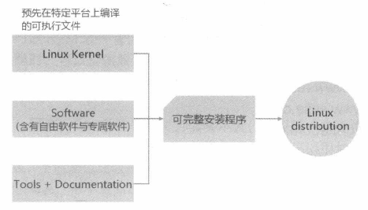

因为每个 Linux 发行版使用的kernel都是由 http://www.kernel.org 所发布，而它们所选择的软件，几乎都是目前很知名的软件，重复性相当的高， 例如网页服务器的 Apache，电子邮件服务器的 Postfix/sendmail，文件服务器的Samba等等。所以基本上，每个 Linux 发行版除了架构的严谨度与选择的套件内容外，其实差异并不太大。

 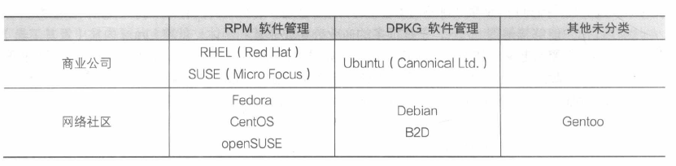

依照计算机主机的用途，可以按照如下建议选择适合的 Linux 发行版

* 用于企业环境：建议使用商业版本，例如 Red Hat 的 RHEL 或者是 SUSE 都是很不错的选择。毕竟企业的环境强调的是稳定的运行。由于商业版本都会提供客户服务，所以可以降低企业的风险。
* 用于个人或教学的服务器环境：要是你的服务器所在环境如果宕机还不会造成太大的问题的话，加上你的环境是在教学的场合当中时（就是说，经费不足的环境）那么可以使用号称完全兼容商业版 RHEL 的 CentOS。 因为 CentOS 是抓 RHEL 的源代码来重新编译发布的一个 Linux 发行版，所以号称兼容于 RHEL。 这一版的软件完全与 RHEL 相同，在改版的幅度较小，适合于服务器系统的环境。
* 用于个人的计算机：想要尝鲜吗？建议使用很炫的 Fedora/Ubuntu 等桌面环境使用的版本。 如果不想要安装 Linux 的话，那么 Fedora 或 CentOS 也有推出Live CD。

## 1.2 Linux 当前应用的角色

1. 企业环境的使用

   * 网络服务器

     这是 Linux 当前最热门的应用。Linux 上面的网络功能特别稳定与强大。此外，由于 GNU 计划与 Linux 的 GPL 授权模式，让很多优秀的软件都在 Linux 上面开发，且这些在 Linux 上面的服务器软件几乎都是自由软件。

   * 关键任务的应用（金融数据库、大型企业网络环境）

   * 学术机构的高性能计算任务

     Linux 有强大的运算能力，并且 Linux 具有支持度相当广泛的 gcc 编译软件，因此 Linux 在这方面的优势相当明显。

2. 个人环境的使用

   * 桌面计算机

     为了要强化桌面计算机的使用率，Linux 与 X-Window System 结合了。 要注意的是，X-Window System 仅只是 Linux 上面的一个软件， 而不是内核。所以即使 X-Window System 挂了，对 Linux 也可能不会有直接的影响。

     近年来在各大社区的团结合作之下，Linux 的窗口系统上面能够运行的软件实在是多的吓人。而且也能够应付的了企业的办公环境。

   * 手持系统

     Android 其实就是 Linux 内核的分支，只是专门用来针对手机或平板这类的 ARM 机器所设计的。

   * 嵌入式系统

     硬件系统除了我们常看到的计算机之外， 其实家电产品、PDA、手机、数码相机以及其他微型的计算机设备也是硬件系统。这些计算机设备也都是需要操作系统来控制，它们都可以说 Linux 操作系统。

3. 云端应用

   * 云程序
   * 终端设备

# 第2章 主机规划与磁盘分区

## 2.1 Linux 与硬件的搭配

Linux 对于计算机各组件或设备的识别， 与大家常用的 Windows 系统完全不一样。因为，各个组件或设备在 Linux 下面都是一个文件。

举例来说，SATA 接口的硬盘的文件名即为	/dev/sd[a-d]，其中，括号内的字母为 a-d 当中的任意一个，亦即有/dev/sda, /dev/sdb, /dev/sdc, 及 /dev/sdd 这四个文件的意思。下面列出几个常见的设备与其在 Linux 当中的文件名：

 

## 2.2 磁盘分区

我们知道一块磁盘可以划分成多个分区（partition），以 Windows 观点来看，你可能会有一块磁盘并且将它们划分为C、D、E 盘。那个C、D、E就是分区。

### 2.2.1 磁盘连接方式与设备文件名的关系

虚拟化是目前很常见的一项技术， 因此你在使用的机器很可能就是虚拟机，这些虚拟机使用的虚拟磁盘并不是正规的磁盘接口，这种情况下，你的磁盘文件名
就不一样了。正常的物理机器大概使用的都是 /dev/sd[a-] 的磁盘文件名，至于虚拟机环境中，为了加速，可能就会使用 /dev/vd[a-p] 这种设备文件名。

磁盘的组成主要有碟片、机械手臂、磁头与主轴马达所组成， 而数据的写入其实是在碟片上面。碟片上面又可细分出扇区（Sector）与磁道（Track）两种单位，
其中扇区的物理大小设计有两种，分别是 512 字节 与 4K 字节。

整块磁盘的第一个扇区特别重要，因为它记录了整块磁盘的重要信息，例如磁盘分区表。

### 2.2.2 MBR(MS-DOS) 与 GPT 磁盘分区表

#### MBR (Master Boot Record, 主引导记录) 分区表格式与限制

启动引导程序记录区与分区表通通放在磁盘的第一个扇区，这个扇区通常是 512 字节的大小，包括：

* 主引导记录：可以安装启动引导程序的地方，有446字节
* 分区表：记录整块硬盘分区的状态，有64字节

由于分区表所在区块仅有 64 字节容量，因此**<font color='red'>最多仅能有四组记录区，每组记录区记录了该区段的启始与结束的柱面号码</font>**。

 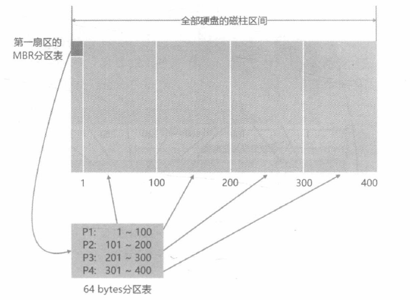

上图中我们假设硬盘只有 400 个柱面，共划分为四个分区，第四个分区所在为 301~400 号柱面的范围。假设上面的硬盘设备文件名为 /dev/sda，那么这四个分区在 Linux 系统中的设备文件名如下所示：

* P1:/dev/sda1
* P2:/dev/sda2
* P3:/dev/sda3
* P4:/dev/sda4

由于分区表就只有 64 字节而已，最多只能容纳四组分区记录， 这四个分区的记录被称为主要或扩展分区。

既然分区表只有记录四组数据的空间，那么是否代表我一颗硬盘最多只能分区出四个分区？当然不是。在 Windows 与 Linux 系统中，我们是通过**<font color='blue'>扩展分区</font>** 的方式来处理。扩展分区的意思是：既然第一个扇区所在的分区表只能记录四组数据， 那我可否利用额外的扇区来记录更多的分区信息？

 

在上图中，我们知道硬盘的四个分区记录仅仅使用到两个，P1 为主要分区，而 P2 则为扩展分区。**<font color='red'>请注意，扩展分区的目的是使用额外的扇区来记录分区信息，扩展分区本身并不能被拿出来格式化。</font>**

图中右下方那个区块继续划分出五个分区，这五个由扩展分区继续切出来的分区，就被称为**<font color='blue'>逻辑分区</font>**。

上述的分区在Linux系统中的设备文件名分别如下：

* P1: /dev/sda1
* P2: /dev/sda2
* L1: /dev/sda5
* L2: /dev/sda6
* L3: /dev/sda7
* L4: /dev/sda8
* L5: /dev/sda9

仔细看看，怎么设备文件名没有 /dev/sda3 与 /dev/sda4 呢？因为前面四个号码都是保留给主要分区或扩展分区用的，所以**<font color='red'>逻辑分区的设备名称号码就由 5 号开始。</font>**

MBR主要分区、扩展分区、逻辑分区特性：

* 主要分区与扩展分区最多可以有四个（硬盘的限制）
* 扩展分区最多只能有一个（操作系统的限制）
* 逻辑分区是由扩展分区持续划分出来的分区
* 能够被格式化后作为数据存取的分区是主要分区与逻辑分区。扩展分区无法格式化
* 逻辑分区的数量依操作系统而不同，在Linux系统中SATA硬盘已经可以突破63个以上的分区限制

MBR 每组分区表仅有 16 字节而已，因此可记录的信息相当有限。所以，MBR 分区表有以下限制：

* 操作系统无法使用 2.2T 以上的磁盘容量
* MBR 仅有一个区块，若被破坏后，经常无法或很难恢复
* MBR 内的存放启动引导程序的区块仅 446 字节，无法存储较多的程序代码

#### GPT(GUID partition table)磁盘分区表

过去一个扇区大小就是 512 字节，不过目前已经有 4K 的扇区设计出现。为了兼容所有的磁盘，因此在扇区的定义上面，大多会使用所谓的**<font color='blue'>逻辑区块地址</font>**（Logical Block Address, LBA）来处理。

GPT将磁盘的所有区块以此 LBA （默认为 512 字节）来规划，第一个 LBA 称为 LBA0。

与 MBR 仅使用第一个 512 字节区块来记录不同， **<font color='red'>GPT 使用了 34 个 LBA 区块来记录分区信息</font>**。同时，GPT 除了前面 34 个LBA 之外，整个磁盘的最后 34 个 LBA 也拿来作为另一个备份。

 

从 LBA2 区块开始，每个 LBA 都可以记录 4 组分区记录，所以在默认的情况下，总共可以有 4×32 = 128 组分区记录。此外，GPT 分区已经没有所谓的主、扩展、逻辑分区的概念，既然每组记录都可以独立存在，当然每个都可以视为主要分区，每一个分区都可以拿来格式化使用。

并不是所有的操作系统都可以读取到 GPT 的磁盘分区格式。同时，也不是所有的硬件都可以支持 GPT 格式，是否能够读写 GPT 格式又与启动的检测程序有关。启动的检测程序又分为 BIOS 与 UEFI。

### 2.2.3 启动流程中的 BIOS 与 UEFI 启动检测程序

基本上，目前的主机系统在加载硬件驱动方面的程序，主要有早期的 BIOS 与新的 UEFI 两种机制。

#### BIOS 搭配 MBR/GPT 的启动流程

BIOS 是一个写入到主板上的一个固件（固件就是写入到硬件上的一个软件程序）。这个BIOS就是在启动的时候，计算机系统会主动执行的第一个程序。

接下来 BIOS 会去分析计算机里面有哪些存储设备，我们以硬盘为例，BIOS 会依据用户的设置去取得能够启动的硬盘， 并且到该硬盘里面去读取第一个扇区的MBR位置。MBR 这个仅有 446 字节的硬盘容量里面会放置最基本的启动引导程序， 这个启动引导程序的目的是加载内核文件，然后接下来就是内核文件的工作，将之后的工作交给操作系统：

1. BIOS：启动后主动执行的固件，会认识第一个可启动的设备；
2. MBR：第一个可启动设备的第一个扇区内的主引导记录块，内含启动引导代码；
3. 启动引导程序（boot loader）：一个可读取内核文件来执行的软件；
4. 内核文件：开始启动操作系统

其中 Boot loader 是操作系统安装在 MBR 上面的一个软件。由于 MBR 仅有 446 字节而已，因此这个启动引导程序是非常小而高效。其主要任务有下面这些：

1. 提供选项：用户可以选择不同的启动选项，这也是多重引导的重要功能；
2. 加载内核文件：直接指向可使用的程序区段来启动操作系统；
3. 转交其他启动引导程序：将启动管理功能转交给其他启动引导程序负责。

启动引导程序除了可以安装在 MBR 之外，还可以安装在每个分区的启动扇区，这个特性能够造就**<font color='blue'>多重引导</font>**的功能。假设你的电脑只有一个硬盘，里面分成四个分区，其中第一、二分区分别安装了 Windows 以及 Linux。那么整个流程如图：

 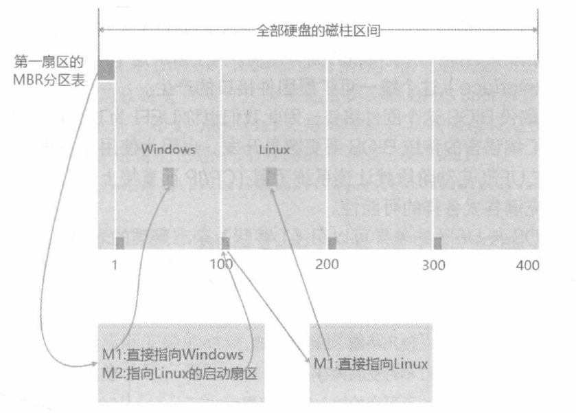

MBR 的启动引导程序提供两个选项：

* (M1) 可以直接加载 Windows 的内核文件来开机
* (M2) 将开机管理工作交给第二个分区的启动扇区

当用户选择 M2 时，整个开机管理工作交给第二个分区的启动引导程序，当它启动后，该程序内仅有一个启动选项，因此就能够使用 Linux 的内核文件来启动。

如果要安装多重引导，最好先安装 Windows 再安装 Linux。因为 Windows 在安装的时候，它的安装程序会主动地覆盖掉 MBR 以及自己所在分区的启动扇区，如果先安装 Linux 再安装 Windows 的话，那 MBR 的启动引导程序就只会有 Windows 的选项，而不会有 Linux 的选项。

#### UEFI BIOS 搭配 GPT 启动的流程

UEFI 主要是想要取代 BIOS 这个固件接口，两者的差异如下：

 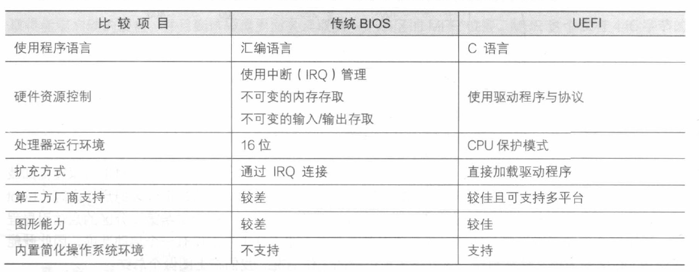

从上面我们可以发现，与传统的 BIOS 不同，UEFI 简直就像是一个低级的操作系统。

### ⭐2.2.4 Linux 安装模式下，磁盘分区的选择

#### 目录树结构

Linux 内的所有数据都是以文件的形式来呈现。所谓的目录树架构（directory tree）就是以根目录为主，然后向下呈现分支状的目录结构的一种文件架构。

整个目录树架构最重要的就是那个根目录（root directory），这个根目录的表示方法为一条斜线 “/”， 所有的文件都是由目录（/）衍生的，而子目录之下还能够有其它的数据存在。

 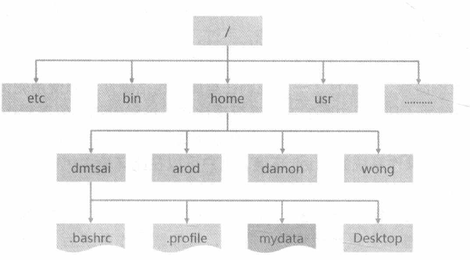

#### 文件系统与目录树的关系（挂载）

整个 Linux 系统使用的是目录树架构，但是我们的文件数据其实是放置在磁盘分区当中的， 现在的问题是 “如何结合目录树的架构与磁盘内的数据”？这个时候就牵扯到挂载（mount）了。

所谓的**<font color='blue'>挂载</font>**，就是利用一个目录当成进入点，将磁盘分区的数据放置在该目录下。也就是进入该目录就可以读取该分区的意思。这个操作我们称为挂载，那个进入点的目录我们称为挂载点。

例如我们将硬盘分为两个区，分区1挂载到根目录，分区2挂载到 /home 这个目录。也就是说当我的数据放置在 /home 内的各次目录时，数据是放置到分区 2 的，如果不是放在 /home 下面的目录， 那么数据就会被放置到分区 1 了。

 

当我们想知道 /home/vbird/tes 这个文件在哪个分区时，反向追踪即可，由test --> vbird --> home --> /，看哪个“进入点”先被查到那就是使用的进入点。所以 test使用的是 /home 这个进入点而不是 /。

#### 发行版安装时，挂载点与磁盘分区的规划

Linux 系统安装的时候，自然得要规划磁盘分区与目录树的挂载。

* 初次接触Linux：只要划分 “ /  ”及“ 交换分区 ”即可

  通常初次安装 Linux 系统，直接以一个最大的分区 “/” 来安装系统即可。

* 建议分区的方法：预留一个备用的剩余磁盘容量

  预留的分区可以拿来做为备份之用。可以使用这个剩余的容量划分出新的分区，并使用来备份重要的配置文件或是脚本。

## 2.3 安装 Linux 前的规划

 ### 2.3.1 选择适当的Linux发行版

每个 Linux 发行版使用的都是来自于 http://www.kernel.org 官方网站所提供的 Linux 内核，各家发行版使用的软件其实也都是大同小异， 最大的差别或许就是在于软件的安装模式而已。

### 2.3.2 主机硬盘的主要规划

1. 最简单的分区方法

   仅划分出根目录与内存交换分区（/ 与 swap）即可，然后再预留一些剩余的磁盘空间以供后续使用。

2. 稍微麻烦一点的方式

   将需要较大容量的目录，以及读写频繁的目录分别独立出来而不与根目录放在一起。在默认的 CentOS 环境中，下面的目录是比较符合容量大且读写频繁的特征的目录：

   * /boot
   * /
   * /home
   * /var
   * swap

   

# 第 4 章 首次登录与在线求助

## 4.1 首次登录系统

### 4.1.1 主文件夹(home)

 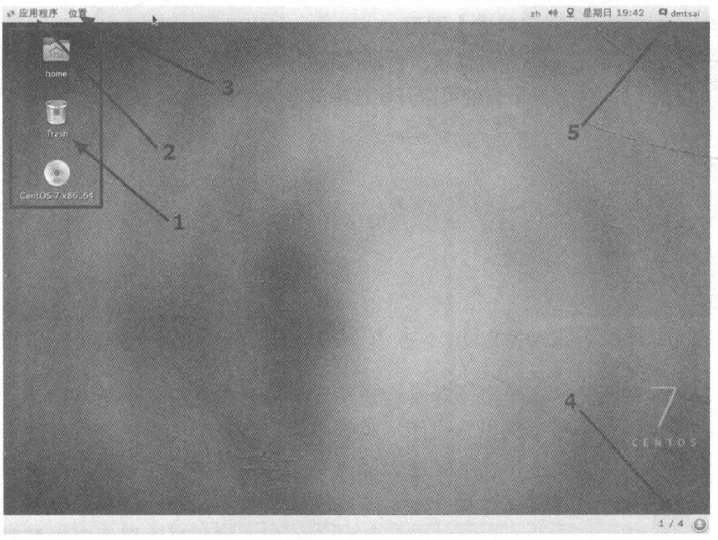

Linux 是多人多任务的操作系统，每个人都会有自己的工作目录，这个目录是用户可以完全掌控的，所以就称为【用户个人家目录】。

一般来说，加目录都在 /home 下面，假如登录的账号是 dmtsai，那么家目录就应该在 /home/dmtsai/。

### 4.1.2 Linux 系统下的隐藏文件

 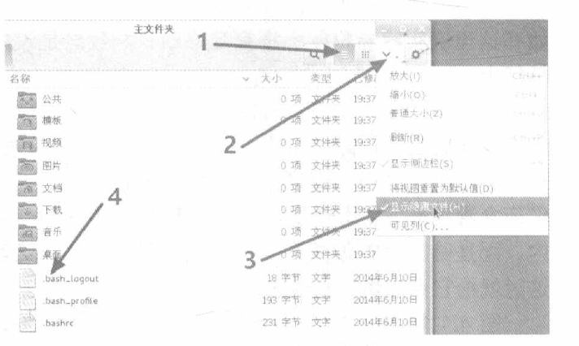

Linux中，只要文件名的开头是小数点，那么该文件名就不会在一般观察模式被显示出来。所以说，在Linux下面，隐藏文件并不是什么特殊的权限，单纯是因为文件名命名的处理方式不同。

### 4.1.3 X Window 与命令行模式的切换

通常我们也称命令行界面为终端界面、Terminal 或 Console。Linux默认的情况下会提供六个终端来让用户登陆，切换的方式为使用【Ctrl+Alt+F1~F6】的组合键。系统会将 [F1]~[F6]命名为 tty1~tty6 的操作接口环境，登录环境如下：

* [Ctrl] + [Alt] + [F2] ~ [F6] ：命令行模式登录 tty2 ~ tty6 终端
* [Ctrl] + [Alt] + [F1] ：图形用户界面模式

在 CentOS 7 环境下，当启动完成之后，默认系统只会提供给你一个 tty 而已，因此无论是命令行界面还是图形界面，都是会出现在 tty1。tty2~tty6 其实一开始是不存在的。但是当你要切换时 （按下 [ctrl]+[alt]+[F2]），系统才产生出额外的 tty2, tty3...、

若你在命令行环境中启动 X Window，那么图形界面就会出现在当时的那个 tty 上面。举例来说，你在 tty3 登录系统，然后输入【startx】启动个人的图形界面， 那么这个图形界面就会产生在 tty3 上面

```shell
# 纯命令行界面下 （不能有 X 存在） 启动图形界面的做法
[dmtsai@study ~]$ startx
```

### 4.1.2 在终端登录 Linux

在终端正确输入账号名和密码之后，能够看到：

```shell
CentOS Linux 7 （Core）
Kernel 3.10.0-229.el7.x86_64 on an x86_64
study login: dmtsai
Password: <==这里输入你的密码
Last login: Fri May 29 11:55:05 on tty1 <==上次登陆的情况
[dmtsai@study ~]$ _ <==光标闪烁，等待你的指令输入
```

[dmtsai@study ~]$ _

是正确登陆之后才显示的讯息， 最左边的 dmtsai 显示的是【目前用户的帐号】，而【@】之后接的 study 则是【主机名称】，至于最右边的 ~ 则指的是【目前所在的目录】，那个 $ 则是我们常常讲的【提示字符】。

~ 符号代表的是 “用户的家目录” 的意思，它是个变量，举例来说 root 的家目录在 /root，所以~ 就代表 /root 的意思。而 dmtsai 的家目录在 /home/dmtsai，所以如果你以 dmtsai 登录时，~ 就会等价于 /home/dmtsai。

在Linux中，默认root的提示字符为 #，而一般身份用户的提示字符为 $。

#### 离开系统

注销Linux很简单，直接输入`exit`就可以了

但是**离开系统并不是关机**，Linux本身已经有相当多的任务在进行，你的登录也仅是其中的一个任务而已，所以当你离开时，这次这个登录任务就停止了，但此时 Linux 其他的任务还是在继续进行中。

## 4.2 命令行模式下命令的执行

命令行模式登录后所运行的程序被称为壳（Shell），这是因为这个程序负责最外面跟用户（我们）沟通，所以才被戏称为壳程序。我们 Linux 的壳程序就是厉害的 BASH。

### 4.2.1 开始执行命令

你可以这样执行命令：

`[dmtsai@study ~]$ command [-options] parameter1 parameter2 ...`

* 一行命令中第一个输入的部分绝对是命令（command）或可执行文件（例如shell脚本）
* command 为命令的名称，例如变换工作目录的命令为 cd 等
* 中括号 [] 并不存在于实际的命令中，表示是可选的，而加入选项设置时，通常选项前会带 - 号，例如 -h；有时候会使用选项的完整全名，则选项前带有 -- 符号，例如 --help
* parameter1 parameter2 为依附在选项后面的参数，或是 command 的参数
* 命令, 选项, 参数等这几个东西中间以空格来区分，不论空几格 shell 都视为一格。所以空格是很重要的特殊字符。
* 按下回车键后，该命令就立即执行。回车键代表着一行命令的开始启动。
* **<font color='red'>命令太长的时候，可以使用反斜线 （\） 来转义回车键，使命令连续到下一行</font>**
* 在 Linux 中，英文大小写字母是不一样的

### 4.2.2 重要的几个热键

#### Tab按键

具有命令补全与文件补齐的功能：

* [Tab] 接在一串命令的第一个字段后面，则为【命令补全】
* [Tab] 接在一串命令的第二个字段后面，则为【文件补齐】
* 若安装了 Bash-completion 软件，则在某些命令后面使用 [Tab] 按键时，可以进行【选项/参数补齐】功能

#### Ctrl-c按键

如果你想让当前的程序停掉的话，可以输入：[Ctrl] 与 c 按键，那就是中断目前程序的按键。

#### Ctrl-d按键

* 表示键盘输入结束（End Of File）
* 也可以用来取代 exit 的输入，例如你想要直接离开命令行模式，可以直接按下 Ctrl-d 就能直接离开（相当于输入exit）

#### [shift]+{[Page UP]|[Page Down]}按键

当某些命令的输出信息很长的时候，可能会导致前面的部分已经不在目前的屏幕中，可以使用这两个组合键来往前/往后翻页

## 4.3 Linux 系统在线求助 man page

### 4.3.1 命令的 --help 求助说明

几乎 Linux 上面的命令，你只要使用【--help】这个选项，就能够将该命令的用法做一个大致的理解。

通常【--help】用在协助你查询“你曾经使用的命令所具备的选项与参数”而已， 如果你要使用的是从来没有用过的命令，或者是你要查询的根本就不是命令，而是文件的格式时，那就得要通过【man page】命令了。

### 4.3.2 man page

这个 man 时 manual 的简写。只要执行【man date】马上就会有清楚的说明出现在你面前：

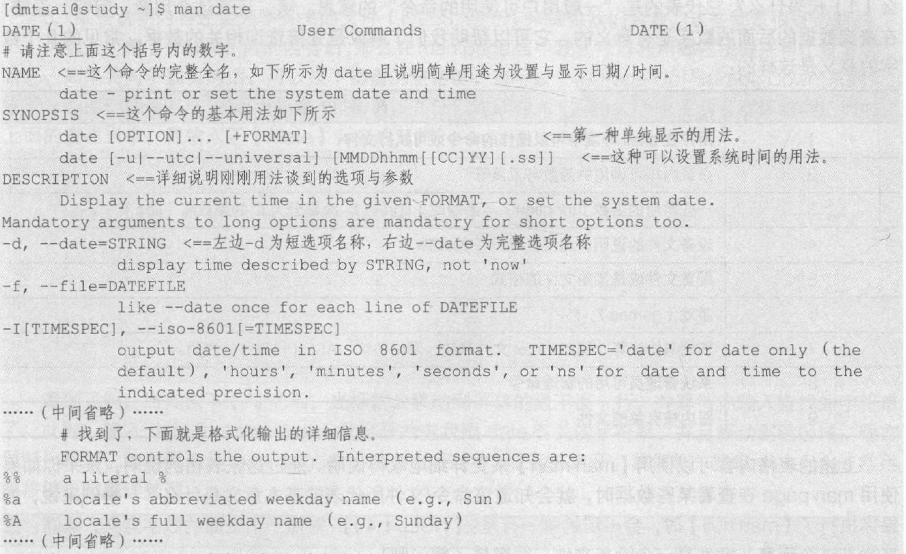

 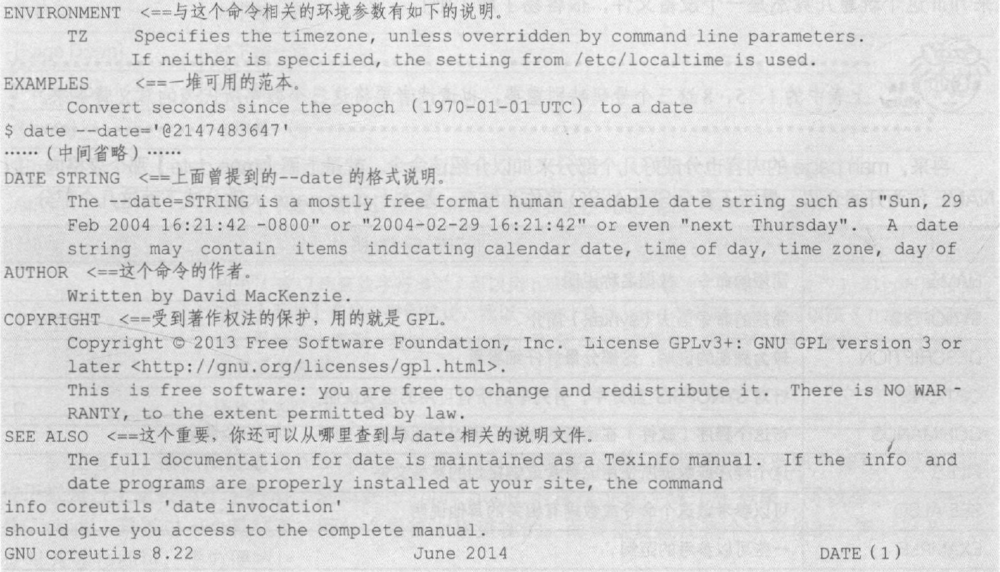

出现的这个屏幕界面，我们称呼它为 man page。

在页面的第一行，你可以看到【DATE(1)】，DATE是命令的名称，(1)表示的是 date 是“一般用户可使用的命令”的意思。常见的几个数字的意义是这样的：

 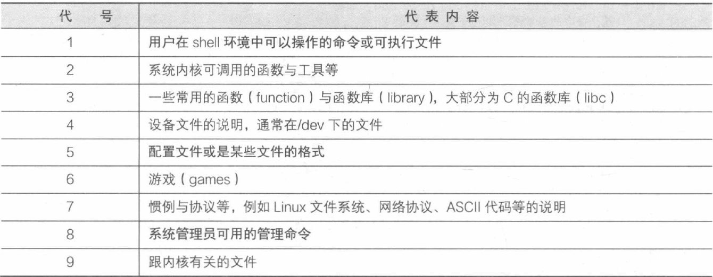

man page 的内容分成好几个部分来加以介绍该命令。man page 大致分成下面这几个部分：

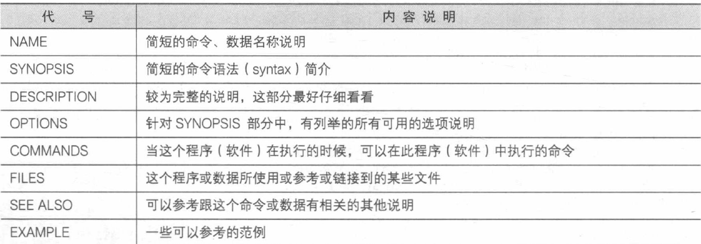


man page 中常用的按键：

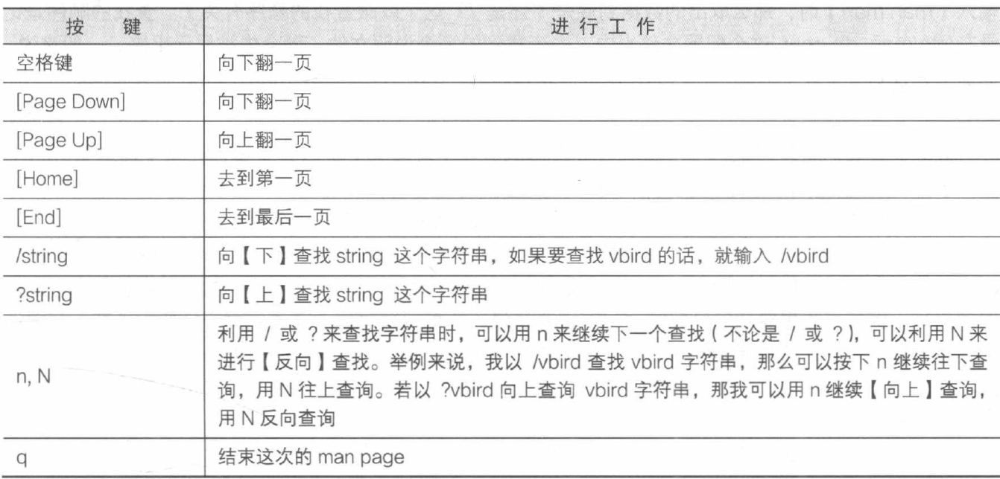

比较有意思的是查找，当你按下【/】之后，光标就会移动到屏幕的最下面一行，并等待你输入查找的字符串。而要重复查找某个字符串时，可以使用 n 或 N 来操作即可。

## 4.4 超简单的文本编辑器：nano

nano 的使用其实很简单，你可以直接加上文件名就能够打开一个旧文件或新文件。下面我们就来打开一个名为 text.txt 的文件来看看：

 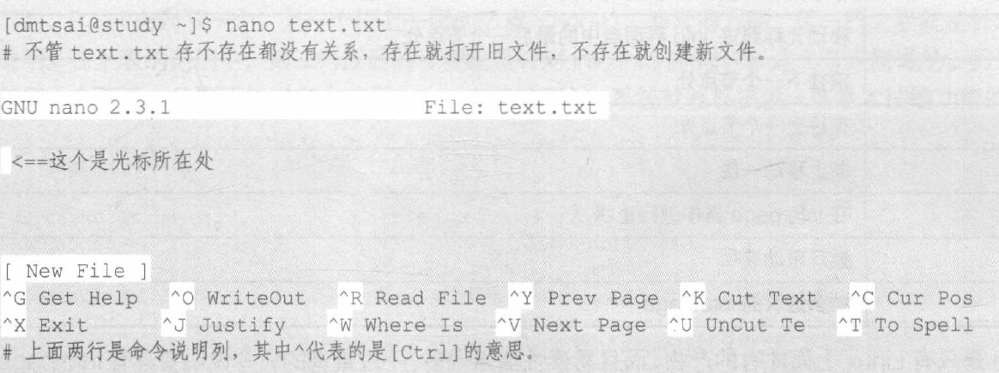

第一行实在声明 nano 的版本与打开的文件名。

最下面的三行，分别是文件的状态（New File）与两行命令说明。命令说明反白部分就是组合键，那个指数符号（^）代表的是键盘的[Ctrl]按键。下面是比较重要的几个组合按键：

* [ctrl]-G：获得联机帮助（help）
* [ctrl]-X：离开 nano 软件，若有修改过文件会提示是否需要保存
* [ctrl]-O：保存文件，若你有权限的话就能够保存文件了
* [ctrl]-R：从其他文件读入数据，可以将某个文件的内容贴在本文件中
* [ctrl]-W：查找字符串
* [ctrl]-C：说明目前光标所在处的行数与列数等信息
* [ctrl]-_：可以直接输入行号，让光标快速移动到该行
* [alt]-Y：语法校验功能开启或关闭
* [alt]-M：可以支持鼠标来移动光标的功能

## 4.5 正确的关机方法

1. 数据同步写入磁盘：sync

   在 Linux 系统中，为了加快数据的读取速度，所以在默认的情况中， 某些已经加载内存中的数据将不会直接被写回硬盘，而是先暂存在内存当中。不过，如此一来也造成些许的困扰，那就是万一你的系统因为某些特殊情况造成不正常关机（例如停电或者是不小心碰到电源）时，由于数据尚未被写入硬盘当当中，就会造成数据的更新不正常。这个时候就需要 sync 这个命令来进行数据的写入操作。

   直接在命令行模式下输入sync，那么在内存中尚未被更新的数据，就会被写入硬盘中。所以，这个命令在系统关机或重新启动之前，最好多执行几次。

   ```shell
   [dmtsai@study ~]$ su - # 这个命令在让你的身份变成 root ！下面请输入 root 的密码！
   Password: # 就这里！请输入安装时你所设置的 root 密码！
   Last login: Mon Jun 1 16:10:12 CST 2015 on pts/0
   [root@study ~]# sync
   ```

   > 事实上 sync 也可以被一般帐号使用喔！只不过一般帐号用户所更新的硬盘数据就仅有自己的数据，不像 root 可以更新整个系统中的数据。

2. 常用的关机命令：shutdown

   我们较常使用的是 shutdown 命令，这个命令会通知系统内的各个进程，并且将通知系统中的一些服务来关闭。简单的语法规则为：

   ```shell
   [root@study ~]# /sbin/shutdown [-krhc] [时间] [警告讯息]
   选项与参数：
   -k ： 不要真的关机，只是发送警告信息出去
   -r ： 在将系统的服务停掉之后就重新启动（常用）
   -h ： 将系统的服务停掉后，立即关机。 （常用）
   -c ： 取消已经在进行的 shutdown 命令内容
   时间 ：指定系统关机的时间。若没有这个项目，则默认 1 分钟后自动进行。
   范例：
   [root@study ~]# /sbin/shutdown -h 10 'I will shutdown after 10 mins'
   Broadcast message from root@study.centos.vbird （Tue 2015-06-02 10:51:34 CST）:
   I will shutdown after 10 mins
   The system is going down for power-off at Tue 2015-06-02 11:01:34 CST!
   ```

   在执行 shutdown 之后，系统告诉大家，这台机器会在十分钟后关机，并且会将信息显示在目前登录者的屏幕上。你可以输入【shutdown -c】来取消这次的关机命令。

   如果你什么参数也没加，单纯执行【shutdown】之后，系统默认会在 1 分钟后进行关机操作。几个范例：

   ```shell
   [root@study ~]# shutdown -h now
   立刻关机，其中 now 相当于时间为 0 的状态
   [root@study ~]# shutdown -h 20:25
   系统在今天的 20:25 分会关机，若在21:25才下达此指令，则隔天才关机
   [root@study ~]# shutdown -h +10
   系统再过十分钟后自动关机
   [root@study ~]# shutdown -r now
   系统立刻重新开机
   [root@study ~]# shutdown -r +30 'The system will reboot'
   再过三十分钟系统会重新开机，并显示后面的讯息给所有在线上的使用者
   [root@study ~]# shutdown -k now 'This system will reboot'
   仅发出警告，系统并不会关机
   ```

3. 重新启动，关机：reboot、halt、poweroff

   这三个命令调用的函数库都差不多，都是去调用 systemctl 这个重要的管理命令。

   ```shell
   [root@study ~]# sync; sync; sync; reboot # 	重新开机
   [root@study ~]# halt  					 #	系统停止～屏幕可能会保留系统已经停止的信息
   [root@study ~]# poweroff  				 #	系统关机，所以没有提供额外的电力，屏幕空白
   ```

4. 实际使用管理工具 systemctl 关机

   上面谈到的 halt、poweroff、reboot、shutdown 等，其实都是调用 systemctl 这个命令。这个命令与关机的有关语法如下：

   ```shell
   [root@study ~]# systemctl [命令]
   命令项目包括如下：
   halt 			进入系统停止的模式，屏幕可能会保留一些信息，这与你的电源管理模式有关
   poweroff 		进入系统关机模式，直接关机
   reboot 			直接重新启动
   suspend 		进入休眠模式
   [root@study ~]# systemctl reboot # 系统重新启动
   [root@study ~]# systemctl poweroff # 系统关机
   ```

# 第5章 Linux的文件权限与目录配置

## 5.1 用户与用户组

Linux 最优秀的地方之一就在于它的多人多任务环境。而为了让各个用户具有保密的文件数据， 因此文件权限管理就变得很重要了。

Linux 一般将文件可读写的身份分为三个类别：

* 拥有者（owner）
* 所属群组（group）
* 其他人（others）

且三种身份各有读（read）、写（write）、执行（execute）等权限。

### Linux用户身份与用户组记录文件

在我们Linux系统当中，默认的情况下，所有的系统上的帐号与一般身份用户，还有那个 root 的相关信息， 都是记录在 **/etc/passwd** 这个文件内的；至于个人的密码则是记录在 **/etc/shadow** 这个文件内；此外，Linux所有的组名都纪录在 **/etc/group** 中。

这三个文件可以说是 Linux 系统里面账号、密码、用户组信息的集中地，不要随便删除这三个文件。

## 5.2 Linux文件权限概念

### 5.2.1 Linux文件属性

既然要了解 Linux 的文件属性，就需要用到【ls 】这一命令。其选项【-al】: 列出所有的文件以及其详细的权限与属性（包含隐藏文件，就是文件名第—个字符为【.】的文件）:

```shell
[dmtsai@study ~]$ su - # 先来切换一下身份看看
Password:
Last login: Tue Jun 2 19:32:31 CST 2015 on tty2
[root@study ~]# ls -al
total 48
dr-xr-x---. 5 root root 4096 May 29 16:08 .
dr-xr-xr-x. 17 root root 4096 May 4 17:56 ..
-rw-------. 1 root root 1816 May 4 17:57 anaconda-ks.cfg
```

> 建议不要以 root 身份登录系统，而是使用【su -】这个命令来切换身份，离开【su -】则使用【exit】回到一般用户的身份即可。

输入【ls -al】后每一行七个字段的含义如下：

 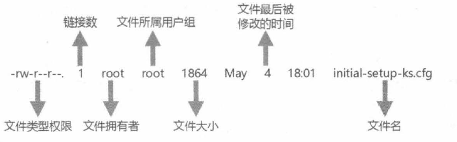

* 第一个字符代表文件的类型

  * 当为 [ d ] 则是目录

  * 当为 [ - ] 则是常规文件

  * 若是 [ l ] 则表示为链接文件

  * 若是 [ b ] 则表示为设备文件里面的可供储存的周边设备

  * 若是 [ c ] 则表示为设备文件里面的串行端口设备，例如键盘、鼠标

  * 若是 [ s ] 则为数据接口文件

  * 若是 [ p ] 则为数据输送文件


* 接下来的字符中，以三个为一组，且均为【rwx】的三个参数的组合。其中，[ r ] 代表可读（read）、[ w ] 代表可写（write）、[ x ]代表可执（execute）。这三个权限的位置不会改变，如果没有权限，就会用 [ - ] 当占位符。

  * 第一组为**文件拥有者**可具备的权限

  * 第二组为**加入此用户组**的帐号的权限

  * 第三组为**非本人且没有加入本用户组的其他帐号**的权限


* 第二栏表示有多少文件名链接到此节点（inode）

  每个文件都会将它的权限与属性记录到文件系统的 inode 中，不过，我们使用的目录树却是使用文件名来记录，因此每个文件名就会链接到一个 inode, 这个属性记录的就是**<font color='red'>有多少不同的文件名链接到相同的—个 inode 号码</font>**.

* 第三栏表示这个文件的拥有者账号

* 第四栏表示这个文件的所属用户组

* 第五栏为这个文件的容量大小，默认单位为 Bytes

* 第六栏为这个文件的创建日期或者是最近的修改日期

* 第七栏为这个文件的文件名

### 5.2.2 如何修改文件属性与权限

#### 修改所属用户组, `chgrp`

修改一个文件的用户组直接使用 `chgrp` 命令来修改即可，不过，请记得，要被修改的组名必须要在 /etc/group 文件中存在才行，否则就会显示错误。

```shell
[root@study ~]# chgrp [-R] dirname/filename ...
选项与参数：
-R : 进行递归（recursive）修改，亦即连同子目录下的所有文件、目录都更新成为这个用户组之意。常常用在修改某一目录内所有的文件之情况。

范例：
[root@centos ~]# chgrp users initial-setup-ks.cfg 
[root@centos ~]# ls -l
total 28
-rw-------. 1 root root   2180 Mar 12  2022 anaconda-ks.cfg
-rw-r--r--. 1 root users  2228 Mar 12  2022 initial-setup-ks.cfg
-rw-r--r--. 1 root root  17920 Mar 29  2022 q
[root@centos ~]# chgrp testing initial-setup-ks.cfg 
chgrp: invalid group: ‘testing’
```

#### 修改文件拥有者, `chown`

只需要使用 `chown` 就可以修改文件的拥有者。同理，用户必须是已经存在系统中的账号，也就是在 /etc/passwd 这个文件中有记录的用户名称才能修改。

**<font color='red'>`chown` 还可以顺便直接修改用户组</font>**。

```shell
[root@study ~]# chown [-R] 帐号名称 文件或目录
[root@study ~]# chown [-R] 帐号名称:用户组名称 文件或目录
选项与参数：
-R : 进行递归（recursive）修改，亦即连同子目录下的所有文件都修改

范例：将 initial-setup-ks.cfg 的拥有者改为bin这个帐号：
[root@study ~]# chown bin initial-setup-ks.cfg
[root@study ~]# ls -l
-rw-r--r--. 1 bin users 1864 May 4 18:01 initial-setup-ks.cfg

范例：将 initial-setup-ks.cfg 的拥有者与群组改回为root：
[root@study ~]# chown root:root initial-setup-ks.cfg
[root@study ~]# ls -l
-rw-r--r--. 1 root root 1864 May 4 18:01 initial-setup-ks.cfg
```

> 关于何时使用 chown 和 chgrp
>
> 最常见的例子就是在复制文件给你之外的其他人时，由于复制操作（cp）会复制执行者的属性与权限，所以如果把 root 的文件拷贝给一般用户，他可能仍然无法修改这个文件，这个时候就要将文件的拥有者与用户组修改一下。
> ```shell
> [root@study ~]# cp .bashrc .bashrc_test
> [root@study ~]# ls -al .bashrc*
> -rw-r--r--. 1 root root 176 Dec 29 2013 .bashrc
> -rw-r--r--. 1 root root 176 Jun 3 00:04 .bashrc test <==新文件的属性没变。
> ```

#### 修改权限，`chmod`

文件权限的修改使用的是 `chmod` 这个命令，但是，权限的设置方法有两种，分别可以使用数字或是符号来进行权限的修改：

1. 数字类型修改文件权限

   Linux 文件的基本权限有 9 个，分别是拥有者，用户组，其他人三种身份各自的 read、write、execute。文件的权限字符为：【－rwxrwxrwx ] ，这九个权限是三个三个—组。其中我们可以用数字来代表各个权限：

   ```shell
   r:4
   w:2
   x:1
   ```

   每种身份（owner、group、others）各自的三个权限（r、w、x）数字是需要累加的，例如当权限为： [-rwxrwx---] 数字则是：

   ```shell
   owner = rwx = 4+2+1 = 7
   group = rwx = 4+2+1 = 7
   others= --- = 0+0+0 = 0
   ```

   所以等—下我们设置权限时，该文件的权限数字就是 770，修改权限的命令 `chmod` 的语法是：

   ```shell
   [root@study ~]# chmod [-R] xyz 文件或目录
   选项与参数：
   xyz : 就是刚刚提到的数字类型的权限属性，为 rwx 属性数值的相加。
   -R : 进行递归（recursive）修改，亦即连同次目录下的所有文件都会修改
   
   范例：将 .bashrc 这个文件所有的权限都设置启用，
   [root@study ~]# ls -al .bashrc
   -rw-r--r--. 1 root root 176 Dec 29 2013 .bashrc
   [root@study ~]# chmod 777 .bashrc
   [root@study ~]# ls -al .bashrc
   -rwxrwxrwx. 1 root root 176 Dec 29 2013 .bashrc
   ```

2. 符号类型修改文件权限

   借由 u, g, o 来代表三种身份（user、group、others），a 则代表 all 亦即全部的身份。借由 r、w、x 来代表对应的读、写、执行三种权限。可以用下面的方式来看：

    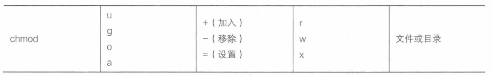

   * 设置一个文件的权限成为【-rwxr-xr-x】

     ```shell
     [root@study ~]# chmod u=rwx,go=rx .bashrc
     # 注意！那个 u=rwx,go=rx 是连在一起的，中间并没有任何空格
     [root@study ~]# ls -al .bashrc
     -rwxr-xr-x. 1 root root 176 Dec 29 2013 .bashrc
     ```


   * 如果我不知道原先的文件属性，而我只想要增加 .bashrc 这个文件的每个人均可写入的权限

     ```shell
     [root@study ~]# ls -al .bashrc
     -rwxr-xr-x. 1 root root 176 Dec 29 2013 .bashrc
     [root@study ~]# chmod a+w .bashrc
     [root@study ~]# ls -al .bashrc
     -rwxrwxrwx. 1 root root 176 Dec 29 2013 .bashrc
     ```

   * 拿掉全部人的可执行权限

     ```shell
     [root@study ~]# chmod a-x .bashrc
     [root@study ~]# ls -al .bashrc
     -rw-rw-rw-. 1 root root 176 Dec 29 2013 .bashrc
     ```

### 5.2.3 目录与文件的权限意义

#### 权限对文件的意义

文件是实际含有数据的地方，包括一般文本文件、数据库文件、二进制可执行文件等。因此，权限对于文件来说，它的意义是这样的：

* r：可读取此文件的实际内容，如读取文本文件的文字内容等

* w：可以编辑、新增或者是修改该文件的内容（**<font color='red'>但不含删除该文件</font>**）

* x：该文件具有可以被系统执行的权限

  在 Windows下面一个文件是否具有执行的能力是借由“ 扩展名 ”来判断的， 例如：.exe、.bat、.com 等等，但是**<font color='red'>在 Linux 下面，我们的文件是否能被执行，则是借由是否具有【x】这个权限来决定，跟文件名是没有绝对的关系的。</font>**

对于文件的 rwx 来说，主要都是**针对文件的内容**而言，与文件名的存在与否没有关系，因为文件记录的是实际的数据嘛。

#### 权限对目录的意义

目录主要的内容在记录文件名列表

* r：表示具有读取目录结构列表的权限，所以当你具有读取（r）—个目录的权限时，表示你可以查询该目录下的**文件名**数据，所以你就可以利用 Is 这个命令将该目录的内容列出来。

* w：这个可写入的权限对目录来说，是很了不起的，因为它表示**<font color='red'>你具有改动该目录结构列表的权限</font>font>**：
  * 建立新的文件与目录
  * 删除已存在的文件与目录（不论该文件的权限是什么）
  * 将已存在的文件或目录进行更名
  * 移动该目录内的文件、目录位置
  
* x：目录不可以被执行，目录的 x 代表的是**<font color='red'>用户能否进入该目录</font>**成为工作目录的用途，所谓的工作目录就是你目前所在的目录。

  举例来说，当你登录 Linux 时，你所在的家目录就是你当前的工作目录，而变换目录的命令是【cd】 (change directory)。

> 根据上述说明，我们来处理个特殊案例。假设两个文件名，分别是下面这样：
>
> * /dir1/file1
> * /dir2
>
> 假设你现在在系统使 用dmtsai 这个账号，那么这个账号针对 /dir1 、/dir1/file1 、/dir2  这三个文件名来说，分别需要哪些最小的权限才能完成各项任务?
>
> 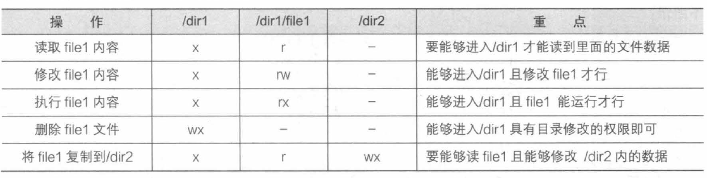
>
> 注意，**<font color='red'>要想对 file1 进行操作，首先必须要能够进入 /dir1</font>**，但不必对 /dir1 拥有 r 权限，只是没有 r 权限的话，你无法列出 /dir1 的内容，且使用 【Tab】时，无法自动补齐文件名。
>
> 所以，**<font color='red'>通常要开放的目录，至少会有 rx 这两个权限。</font>**

### 5.2.4 Linux 文件种类与扩展名

#### 文件种类

我们使用【Is -I】 观察到第一栏那十个字符中，第—个字符为文件的类型，有以下这些文件的类型：

* 常规文件

  就是一般我们在进行读写的类型的文件，在由【Is -al】所显示出来的属性方面，**<font color='blue'>第一个字符为 [ - ]</font>**，依照文件的内容，又大概可以分为：

  * 纯文本文件（ASCII）

    这是 Linux 系统中最多的一种文件类型，称为纯文本文件是因为内容为我们人类可以直接读到的数据，例如数字、字母等

  * 二进制文件（binary）

    Linux 当中的可执行文件就是这种格式，举例来说，我们执行的命令【cat】就是—个二进制文件。

  * 数据文件（data）

    有些程序在运行的过程当中会读取某些特定格式的文件，那些特定格式的文件可以被称为数据文件。
    
    举例来说，我们的 Linux 在用户登录时，都会将登录的数据记录在 /var/log/wtmp 这个文件内，该文件是—个数据文件，它能够通过【 last 】这个命令读出来。但是使用 【cat】 时，会读出乱码，因为它是属于一种特殊格式的文件。

* 目录

  **<font color='blue'>第一个字符为 [ d ]</font>**

* 链接文件

  类似 Windows 系统下面的快捷方式，**<font color='blue'>第一个字符为 [ l ]</font>**

* 设备与设备文件

  与系统周边及存储相关的一些文件，通常都集中在 /dev 这个目录之下，通常又分为两种：

  * 区块设备文件

    就是—些存储数据，以提供系统随机存取的接口设备，举例来说硬盘与软盘等就是。你可以随机地在硬盘的不同区块读写，这种设备就是块设备。

    **<font color='blue'>第一个字符为 [ b ]</font>**

  * 字符设备文件

    —些串行端口的接口设备，例如键盘、鼠标等。这些设备的特色就是—次性读取，不能够截断输出。
    
    **<font color='blue'>第一个字符为 [ c ]</font>**

* 数据接口文件（sockets）

  这种类型的文件通常被用在网络上的数据交换。我们可以启动—个程序来监听客户端的要求，而客户端就可以通过这个socket 来进行数据的沟通了。

  **<font color='blue'>第一个字符为 [ s ]</font>**

* 数据输送文件（FIFO，pipe）：主要目的是解决多个程序同时读写一个文件所造成的错误问题。

  FIFO 也是一种特殊的文件类型，它主要的目的是解决多个程序同时读写一个文件所造成的错误问题。

  **<font color='blue'>第一个字符为 [ p ]</font>**

#### Linux文件扩展名

**<font color='red'>基本上，Linux 的文件是没有所谓的扩展名</font>**，一个 Linux 文件能不能被执行，与它的第一栏的十个属性有关， 与文件名根本一点关系也没有。只要你的权限当中具有 x 的话，即代表这个文件据具有可以被执行的能力。 但是 x 仅仅代表这个文件具有可执行的能力，但是能不能执行成功，就得要看该文件的内容。

虽然如此，通常我们还是会以适当的扩展名来表示该文件是什么种类的：

* *.sh

  脚本或批处理文件。因为批处理文件使用 shell 写成，所以扩展名就编成 .sh

* \*Z 、\*.tar 、\*.tar.gz 、\*.zip 、*.tgz

  经过打包的压缩文件

* \*.html、\*.php

  网页相关的文件

#### Linux文件名长度的限制

单一文件或目录的最大容许文件名为 **<font color='red'>255 字节</font>**，以一个 ASCII 英文占用一个字节来说，则大约可达 255 个字符长度。若是以每个汉字占用 2 字节来说， 最大文件名就是大约在 128 个汉字之间

## 5.3 Linux目录配置

### 5.3.1 Linux目录配置的依据——FHS（Filesystem Hierarchy Standard）

因为利用 Linux 来开发产品或发行版的社区、公司及个人实在太多了，如果每个人都用自己的想法来配置文件放置的目录，那么将可能造成很多管理上的困扰。FHS 的重点在于规范每个特定的目录下应该要放置什么样子的数据。

FHS 依据文件系统使用的频繁与否与是否允许用户随意修改，而将目录定义成为四种交互作用的形态，用表格来说有点像下面这样：

 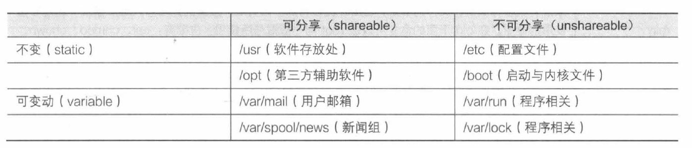

* 可分享：可以分享给其他系统挂载使用的目录，所以包括可执行文件与用户的邮件等数据， 是能够分享给网络上其他主机挂载用的目录
* 不可分享：自己机器上面运行的设备文件或者是与程序有关的 socket 文件等， 由于仅与自身机器有关，所以当然就不适合分享给其他主机
* 不变：有些数据是不会经常变动的。例如函数库、文件说明、系统管理员所管理的主机服务配置文件等等
* 可变动：经常修改的数据，例如日志文件、一般用户可自行接收的新闻组等

事实上，FHS 针对目录树架构仅定义出三层目录下面应该放置什么数据：

* / （root, 根目录）：与启动系统有关
* /usr （unix software resource）：与软件安装/执行有关
* /var （variable）：与系统运行过程有关

#### 根目录 （/） 的意义与内容

根目录是整个系统最重要的一个目录，因为不但所有的目录都是由根目录衍生出来，同时根目录也与启动、还原、系统修复等操作有关。所以在 FHS 的要求方面，它希望根目录不要放在非常大的分区内，因为越大的分区你会放入越多的数据，如此—来根目录所在分区就可能会有较多发生错误的机会。

FHS标准建议：根目录（/）所在分区应该越小越好， 且应用程序所安装的软件最好不要与根目录放在同一个分区内，保持根目录越小越好。 如此不但性能较佳，根目录所在的文件系统也较不容易发生问题。

鉴于上述的说明，因此 FHS 定义出根目录（/）下面应该要有下面这些子目录的存在才好，即使没有物理目录， FHS 也希望至少有链接 (link) 目录存在才好

 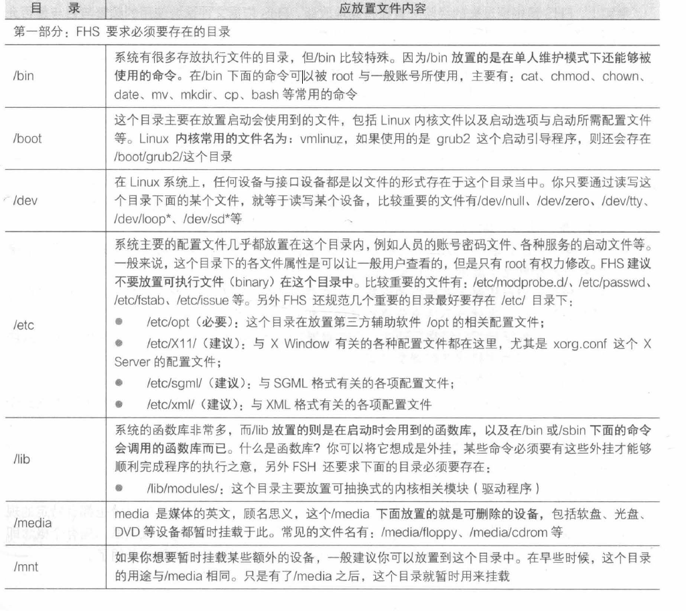

 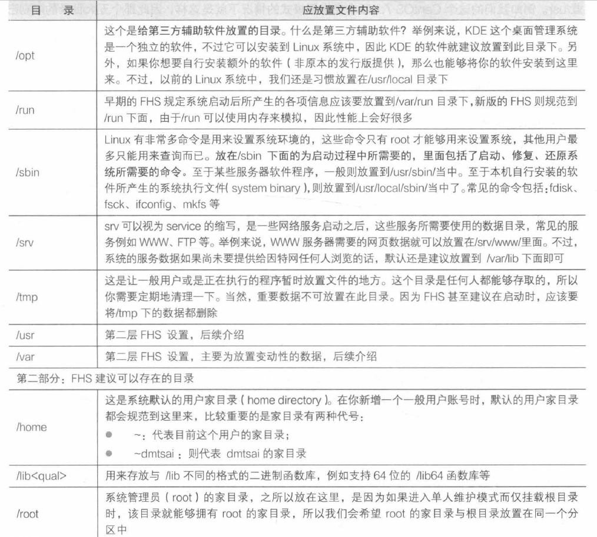

#### /usr 的意义与内容

依据 FHS 的基本定义，/usr 里面放置的数据属于可分享与不可变动(shareable, static)。

很多读者都会误以为 /usr 为 user 的缩写，其实 usr 是 UNIX Software Resource 的缩写，**<font color='red'>也就是 UNIX 操作系统软件资源所放置的目录，而不是用户的数据。</font>**

因为是**<font color='red'>所有系统默认的软件（发行版发布者提供的软件）都会放置到 /usr 下面</font>**，系统刚安装完毕时，这个目录会占用最多的硬盘容量。一般来说，/usr 的子目录建议有下面这些：

 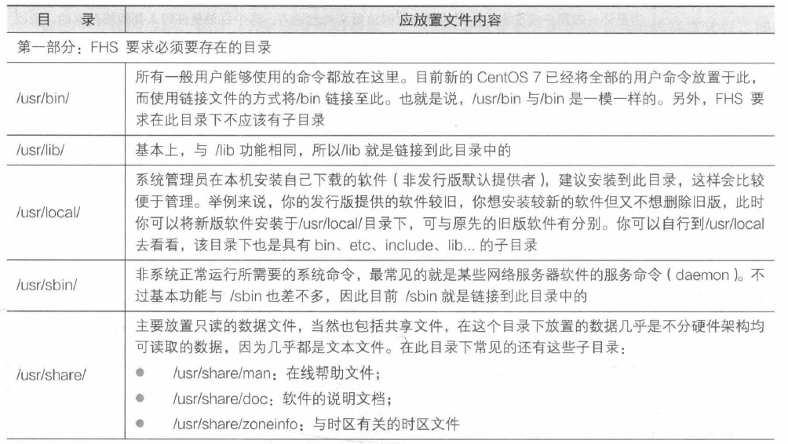

#### /var 的意义与内容

如果说 /usr 是安装时会占用较大硬盘容量的目录，那么 /var 就是在系统运行后才会渐渐占用硬盘容量的目录。因为 /var 目录主要针对**<font color='red'>经常性变动的文件</font>**，包括缓存（cache）、日志文件（log file）以及某些软件运行所产生的文件， 包括程序文件（lock file, run file），或者例如 MySQL 数据库的文件等。

 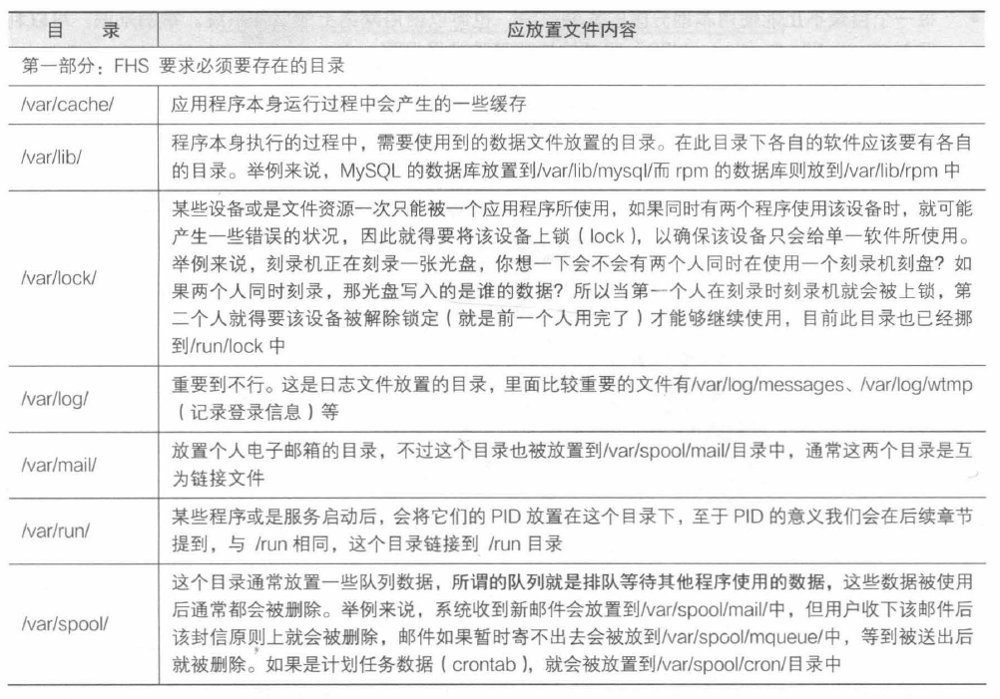

>  CentOS 7 在目录的排列上与过去的版本不同。比较大的差异在于将许多原本应该要在根目录（/）里面的目录，将它内部数据全部移到 /usr 里面去，
> 然后进行链接（link）设置：
>
> * /bin --> /usr/bin
> * /sbin --> /usr/sbin
> * /lib--> /usr/lib
> * /lib64 --> /usr/lib64
> * /var/lock --> /run/lock
> * /var/run --> /run

### 5.3.2 目录树（directory tree）

在 Linux 下面，所有的文件与目录都是由根目录开始的。那是所有目录与文件的源头，然后再一个一个的分支下来，有点像是树枝状，因此，我们也称这种目录配置方式为：**<font color='blue'>目录树</font>**。

* 目录树的起始点为根目录（/, root）

* 每一个目录不止能使用本地分区的文件系统，也可以使用网络上的文件系统，比如用 NFS 服务挂载某特定目录。

* 每一个文件在此目录树中的**<font color='red'>文件名（包含完整路径</font>**）都是独一无二的。

# 第6章 Linux文件与目录管理

## 6.1 目录与路径

### 6.1.1 相对路径与绝对路径

根据文件名写法的不同，也可将所谓的路径（path）定义为绝对路径（absolute）与相对路径（relative）：

* 绝对路径：由根目录（/）开始写起的文件名或目录名称， 例如 /home/dmtsai/.bashrc
* 相对路径：相对于目前路径的文件名写法。 例如 ./home/dmtsai 或 ../../home/dmtsai/ 等。反正开头不是 / 就属于相对路径的写法
  * **<font color='red'>. 代表当前的目录，也可以使用 ./ 来表示</font>**
  * **<font color='red'>.. 代表上一层目录，也可以使用 ../ 来表示</font>**

> 例如当前在 /var/spool/mail 目录，如何进入到 /var/spool/cron/ 目录中呢？
>
> 首先 ./ 代表当前目录，即 /var/spool/mail，../ 代表上一层目录，即 /var/spool，所以只需要输入 【cd ../cron】就可以了。

### 6.1.2 目录的相关操作

#### ⭐特殊的目录

```
.				代表此层目录
..				代表上一层目录
-				代表前一个工作目录
~				代表“目前使用者身份”所在的家目录
~account 		代表 account 这个使用者的家目录（account是个帐号名称）
```

> 在 Linux 下，若使用【ls-al /】去查询，可以看到根目录下存在 ．与 .. 两个目录，再仔细查看，可发现这两个目录的属性与权限完全—致，这代表**<font color='red'>根目录的上一层（..）与根目录自己（.）是同一个目录</font>**。

#### 常见的处理目录的命令

* **cd （change directory, 切换目录）**

  ```shell
  [dmtsai@study ~]$ su - # 先切换身份成为 root 看看。
  [root@study ~]# cd [相对路径或绝对路径]
  # 最重要的就是目录的绝对路径与相对路径，还有一些特殊目录的符号。
  
  范例：
  [root@study ~]# cd ~dmtsai
  # 代表去到 dmtsai 这个使用者的家目录，亦即 /home/dmtsai
  
  [root@study dmtsai]# cd ~
  # 表示回到自己的家目录，亦即是 /root 这个目录
  
  [root@study ~]# cd
  # 没有加上任何路径，也还是代表回到自己家目录的意思喔，即等价于 cd ~
  
  [root@study ~]# cd ..
  # 表示去到目前的上层目录，亦即是 /root 的上层目录的意思
  
  [root@study /]# cd -
  # 表示回到刚刚的那个目录，也就是 /root
  
  [root@study ~]# cd /var/spool/mail
  # 这个就是绝对路径的写法。直接指定要去的完整路径名称
  
  [root@study mail]# cd ../postfix
  # 这个是相对路径的写法，我们由/var/spool/mail 去到/var/spool/postfix 就这样写。
  ```

  当登录 Linux 系统后，每个账号都会在自己账号的家目录中。

  其实，我们的提示字符，亦即那个 [root@study~]＃ 当中，就已经有指出当前目录了，刚登录时会到自己的家目录，而家目录还有—个符号，那就是＂～＂。例如上面的例子可以发现，使用【cd ~】可以回到自己的家目录里面。另外，**<font color='red'>如果仅输入【cd 】时，代表的就是【cd ~】的意思，亦即回到自己的家目录。</font>**

* **pwd （Print Working Directory，显示目前所在的目录）**

  ```shell
  [root@study ~]# pwd [-P]
  选项与参数：
  -P ：显示出真正的路径，而非使用链接 （link） 路径。
  
  范例：单纯显示出目前的工作目录：
  [root@study ~]# pwd
  /root <== 显示出目录
  
  范例：显示出实际的工作目录，而非链接文件本身的目录名而已
  [root@study ~]# cd /var/mail <==注意，/var/mail是一个链接文件
  [root@study mail]# pwd
  /var/mail <==列出目前的工作目录
  [root@study mail]# pwd -P
  /var/spool/mail <==怎么回事？有没有加 -P 差很多
  
  [root@study mail]# ls -ld /var/mail
  lrwxrwxrwx. 1 root root 10 May 4 17:51 /var/mail -> spool/mail
  # 看到这里应该知道为啥了吧？因为 /var/mail 是链接文件，链接到 /var/spool/mail
  # 所以，加上 pwd -P 的选项后，不会显示链接文件的路径，而是显示正确的完整路径。
  ```

  **<font color='red'>注意这个命令中的【-P】的选项。它可以让我们取得正确的目录名称，而不是以链接文件的路径来显示的。</font>**

* **mkdir （创建新目录）**

  ```shell
  [root@study ~]# mkdir [-mp] 目录名称
  选项与参数：
  -m ：设置文件的权限。直接设置，不使用默认权限 （umask）
  -p ：帮助你直接将所需要的目录（包含上层目录）递归创建
  
  范例：请到/tmp下面尝试创建数个新目录看看：
  [root@study ~]# cd /tmp
  [root@study tmp]# mkdir test <==建立一名为 test 的新目录
  
  [root@study tmp]# mkdir test1/test2/test3/test4
  mkdir: cannot create directory ‘test1/test2/test3/test4’: No such file or directory
  # 话说，系统告诉我们，不可能建立这个目录，就是没有目录才要建立的，见鬼嘛
  [root@study tmp]# mkdir -p test1/test2/test3/test4
  # 原来是要建 test4 上层没先建 test3 的原因，加了这个 -p 的选项，可以自行帮你建立多层目录。
  
  范例：创建权限为rwx--x--x的目录
  [root@study tmp]# mkdir -m 711 test2
  [root@study tmp]# ls -ld test*
  drwxr-xr-x. 2 root root 6 Jun 4 19:03 test
  drwxr-xr-x. 3 root root 18 Jun 4 19:04 test1
  drwx--x--x. 2 root root 6 Jun 4 19:05 test2
  # 仔细看上面的权限部分，如果没有加上 -m 来强制设置属性，系统会使用默认属性。
  # 那么你的默认属性是什么？这要通过下面介绍的 [umask]才能了解。
  ```

  在默认的情况下，你所需要的目录得一层一层地建立才行。例如：假如你要建立—个目录为 /home/bird/testing/test1，那么，首先必须要有 /home 然后 /home/bird， 再来 /home/bird/testing 都必须要存在，才可以建立 /home/bird/testing/test1 这个目录。假如没有 /home/bird/testing 时，就没有办法建立test1 的目录。不过，现在有个更简单有效的方法，那就是加上【-p】这个选项，你可以直接执行： 【mkdir -p /home/bird/testing/test1】，则系统会自动帮你将 /home 、/home/bird 、/home/bird/testing 依序地建立起目录。并且，如果该目录本来就已经存在时，系统也不会显示错误信息。

* **rmdir （删除“空”的目录）**

  ```shell
  [root@study ~]# rmdir [-p] 目录名称
  选项与参数：
  -p ：连同上层的“空的”目录也一起删除
  
  范例：将于mkdir范例中创建的目录（/tmp下面）删除掉
  [root@study tmp]# ls -ld test* <==看看有多少目录存在？
  drwxr-xr-x. 2 root root 6 Jun 4 19:03 test
  drwxr-xr-x. 3 root root 18 Jun 4 19:04 test1
  drwx--x--x. 2 root root 6 Jun 4 19:05 test2
  [root@study tmp]# rmdir test <==可直接删除掉，没问题
  [root@study tmp]# rmdir test1 <==因为尚有内容，所以无法删除
  rmdir: failed to remove ‘test1’: Directory not empty
  [root@study tmp]# rmdir -p test1/test2/test3/test4
  [root@study tmp]# ls -ld test* <==您看看，下面的输出中test与test1不见了！
  drwx--x--x. 2 root root 6 Jun 4 19:05 test2
  # 使用 -p 这个选项，立刻可将 test1/test2/test3/test4 一次删除
  # 不过要注意，这个 rmdir 仅能“删除空目录”——被删除的目录里面必定不能存在其他的目录或文件
  ```

  请注意，**<font color='red'>目录需要—层—层的删除才行，而且被删除的目录里面必定不能存在其他的目录或文件</font>**，这也是所谓的空目录（empty directory）的意思。那如果要将所有目录下的东西都删除？这个时候就必须使用【rm -r test1】不过，还是使用【rmdir】比较安全，你也可以尝试以【-p】选项来删除上层空的目录。

### 6.1.3 关于执行文件路径的变量：$PATH

查看文件属性的命令 ls 完整文件名为：/bin/ls（这是绝对路径），但是我们可以在任何地方执行 /bin/ls 这个命令。这是因为**<font color='red'>当我们在执行一个命令的时候，举例来说 ls 好了，系统会依照 PATH 的设置去每个 PATH 定义的目录下查找文件名为 ls 的可执行文件</font>**。

PATH（一定是大写）这个变量的内容是由一堆目录所组成的，每个目录中间用冒号（:）来隔开， 每个目录是有顺序之分的。

可以执行【echo $PATH】来查看PATH的内容，echo有“显示、打印”的意思，而 \$ 表示后面接的是变量:

```shell
范例：用root的身份列出查找的路径是什么？
[root@study ~]# echo $PATH
/usr/local/sbin:/usr/local/bin:/sbin:/bin:/usr/sbin:/usr/bin:/root/bin

范例：用dmtsai的身份列出查找的路径是什么？
[root@study ~]# exit # 由之前的 su - 离开，变回原本的帐号
[dmtsai@study ~]$ echo $PATH
/usr/local/bin:/usr/bin:/usr/local/sbin:/usr/sbin:/home/dmtsai/.local/bin:/home/dmtsai/bin
# 记不记得我们前一章说过，目前 /bin 是链接到 /usr/bin 当中
```

仔细看—下上面的输出，你可以发现到无论是 root 还是 dmtsai 都有 /bin 或 /usr/bin 这个目录在 PATH 变量内，所以当然就能够在任何地方执行 Is 来找到 /bin/ls 执行文件。

* 不同身份用户默认的 PATH 不同，默认能够随意执行的命令也不同（如 root 与 dmtsai）

* PATH 是可以修改的

  例如我们将 “/root” 加入到 PATH 中

  ```shell
  [root@study ~]# PATH="${PATH}:/root"
  ```

## 6.2 文件与目录管理

### 6.2.1 文件与目录的查看：ls

```shell
[root@study ~]# ls [-aAdfFhilnrRSt] 文件名或目录名称
[root@study ~]# ls [--color={never,auto,always}] 文件名或目录名称
[root@study ~]# ls [--full-time] 文件名或目录名称
选项与参数：
-a ：全部的文件，连同隐藏文件（ 开头为 . 的文件） 一起列出来（常用）⭐
-A ：全部的文件，连同隐藏文件，但不包括 . 与 .. 这两个目录
-d ：仅列出目录本身，而不是列出目录内的文件数据（常用）⭐
-f ：直接列出结果，而不进行排序 （ls 默认会以文件名排序）
-F ：根据文件、目录等信息，给予附加数据结构，例如：
	*代表可可执行文件； /代表目录； =代表 socket 文件； |代表 FIFO 文件；
-h ：将文件容量以人类较易读的方式（例如 GB, KB 等等）列出来；
-i ：列出 inode 号码，inode 的意义下一章将会介绍；
-l ：详细信息显示，包含文件的属性与权限等等数据；（常用）⭐
-n ：列出 UID 与 GID 而非使用者与用户组的名称 （UID与GID会在帐号管理提到）
-r ：将排序结果反向输出，例如：原本文件名由小到大，反向则为由大到小；
-R ：连同子目录内容一起列出来，等于该目录下的所有文件都会显示出来；
-S ：以文件容量大小排序，而不是用文件名排序；
-t ：依时间排序，而不是用文件名。
--color=never ：不要依据文件特性给予颜色显示；
--color=always ：显示颜色
--color=auto ：让系统自行依据设置来判断是否给予颜色
--full-time ：以完整时间模式 （包含年、月、日、时、分） 输出
--time={atime,ctime} ：输出 access 时间或改变权限属性时间 （ctime）而非内容修改时间 （modification time）
```

当你只有执行 ls 时，默认显示的只有：非隐藏文件的文件名、 以文件名进行排序及文件名代表的颜色显示如此而已。

【Is】 最常被使用到的功能还是那个 【-l】 的选项，为此**<font color='red'>很多 Linux 发行版在默认的清况中，已经将【ll】 (L 的小写）设置成为【ls -l】的意思</font>**。其实，那个功能是 Bash shell 的 alias 功能，也就是说，我们直接输入【II】就等于是输入【ls -l】

### 6.2.2 复制、删除与移动： cp、rm、mv

#### cp （复制文件或目录）

 【cp】（copy）这个命令除了单纯的复制之外，还可以建立链接文件（就是快捷方式），比对两文件的新旧而予以更新，以及复制整个目录等的功能。

```shell
[root@study ~]# cp [-adfilprsu] 源文件（source） 目标文件（destination）
[root@study ~]# cp [options] source1 source2 source3 .... directory
选项与参数：
-a ：相当于 -dr --preserve=all 的意思，至于 dr 请参考下列说明（常用）⭐
-d ：若源文件为链接文件的属性（link file），则复制链接文件属性而非文件本身；
-f ：为强制（force）的意思，若目标文件已经存在且无法开启，则删除后再尝试一次；
-i ：若目标文件（destination）已经存在时，在覆盖时会先询问操作的进行（常用）⭐
-l ：进行硬链接（hard link）的链接文件建立，而非复制文件本身；
-p ：连同文件的属性（权限、用户、时间）一起复制过去，而非使用默认属性（备份常用）；⭐
-r ：递归复制，用于目录的复制操作；（常用）⭐
-s ：复制成为符号链接文件 （symbolic link），亦即“快捷方式”文件；
-u ：源文件比目标文件新才更新目标文件，或目标文件不存在的情况下才复制。常用于备份的工作当中。
--preserve=all ：除了 -p 的权限相关参数外，还加入 SELinux 的属性, links, xattr 等也复制
最后需要注意的，如果来源文件有两个以上，则最后一个目标文件一定要是“目录”才行
```

—般来说，我们如果去复制别人的数据（当然，该文件你必须要有 read 的权限才行）时，总是希望复制到的数据最后是我们自己的，所以，**<font color='red'>在默认的条件中， cp 的源文件与目标文件的权限是不同的，目标文件的拥有者通常会是命令操作者本身。</font>**

由于具有这个特性，因此当我们在进行备份的时候，某些需要特别注意的特殊权限文件，例如密码文件（/etc/shadow）以及—些配置文件，就不能直接以 cp 来复制，而必须要加上 -a 或是 -p 等可以完整复制文件权限的选项才行。另外，**<font color='red'>如果你想要复制文件给其他的用户，也必须要注意到文件的权限（包含读、写、执行以及文件拥有者等），否则，其他人还是无法针对你给予的文件进行自定义的操作。</font>**

```shell
范例一：用root身份，将家目录下的 .bashrc 复制到 /tmp 下，并更名为 bashrc
[root@study ~]# cp ~/.bashrc /tmp/bashrc
[root@study ~]# cp -i ~/.bashrc /tmp/bashrc
cp: overwrite ‘bashrc’? n           <==n不覆盖，y为覆盖
# 重复作两次操作，由于 /tmp 下面已经存在 bashrc 了，加上 -i 选项后，
# 则在覆盖前会询问使用者是否确定，可以按下 n 或者 y 来二次确认

范例二：变换目录到/tmp，并将/var/log/wtmp复制到/tmp且观察属性：
[root@study ~]# cd /tmp
[root@study tmp]# cp /var/log/wtmp .   <==想要复制到目前的目录，最后的 . 不要忘
[root@study tmp]# ls -l /var/log/wtmp wtmp
-rw-rw-r--. 1 root utmp 28416 Jun 11 18:56 /var/log/wtmp
-rw-r--r--. 1 root root 28416 Jun 11 19:01 wtmp
# 在不加任何选项的情况下，文件的某些属性/权限会改变；
# 这是个很重要的特性,要注意,还有，连文件创建的时间也不一样了
# 那如果你想要将文件的所有特性都一起复制过来该怎办？可以加上 -a ,如下所示：
[root@study tmp]# cp -a /var/log/wtmp wtmp_2
[root@study tmp]# ls -l /var/log/wtmp wtmp_2
-rw-rw-r--. 1 root utmp 28416 Jun 11 18:56 /var/log/wtmp
-rw-rw-r--. 1 root utmp 28416 Jun 11 18:56 wtmp_2
# 整个数据特性完全一模一样,这就是 -a 的特性
```

复制整个目录：

```shell
范例三：复制 /etc/ 这个目录下的所有内容到 /tmp 下面
[root@study tmp]# cp /etc/ /tmp
cp: omitting directory ‘/etc’        <== 如果是目录则不能直接复制，要加上 -r 的选项
[root@study tmp]# cp -r /etc/ /tmp
```

使用 -l 及 -s 选项都会建立所谓的链接文件(link file) ，但是这两种链接文件却有不—样的情况：

* 那个 -l 就是所谓的**<font color='blue'>硬链接</font>**（hard link）。bashrc_hlink 文件与 bashrc 的属性与权限完全一模一样，与尚未进行链接前的差异则是第二栏的 link 数由1 变成了2 。
* 至于 -s 则是**<font color='blue'>符号链接</font>**(symbolic link) ，简单来说， bashrc_slink 是—个快捷方式，这个快捷方式会链接到 bashrc 。所以你会看到文件名右侧会有个指向    （->）的符号。

```shell
范例四：将范例一复制的 bashrc 创建一个符号链接文件 （symbolic link）
[root@study tmp]# ls -l bashrc
-rw-r--r--. 1 root root 176 Jun 11 19:01 bashrc <==先观察一下文件情况
[root@study tmp]# cp -s bashrc bashrc_slink
[root@study tmp]# cp -l bashrc bashrc_hlink
[root@study tmp]# ls -l bashrc*
-rw-r--r--. 2 root root 176 Jun 11 19:01 bashrc <==与原始文件不太一样了
-rw-r--r--. 2 root root 176 Jun 11 19:01 bashrc_hlink
lrwxrwxrwx. 1 root root 6 Jun 11 19:06 bashrc_slink -> bashrc
# bashrc_slink 是一个“快捷方式”，这个快捷方式会链接到bashrc。所以你会看到文件名右侧会有个指向（->）的符号
# bashrc_hlink文件与bashrc的属性与权限完全一模一样，与尚未进行链接前的差异则是第二栏的link数由1变成2了
```

用于备份工作：

````shell
范例五：若 ~/.bashrc 比 /tmp/bashrc 新才复制过来
[root@study tmp]# cp -u ~/.bashrc /tmp/bashrc
# 这个 -u 的特性，是在目标文件与来源文件有差异时，才会复制的。
# 所以，比较常被用于“备份”的工作当中
````

如果没有加上任何选项时，cp 复制的是链接文件指向的文件，而非链接文件本身。若要复制链接文件本身，就得要使用 -d 的选项了：

```shell
范例六：将范例四造成的 bashrc_slink 复制成为 bashrc_slink_1 与bashrc_slink_2
[root@study tmp]# cp bashrc_slink bashrc_slink_1
[root@study tmp]# cp -d bashrc_slink bashrc_slink_2
[root@study tmp]# ls -l bashrc bashrc_slink*
-rw-r--r--. 2 root root 176 Jun 11 19:01 bashrc
lrwxrwxrwx. 1 root root 6 Jun 11 19:06 bashrc_slink -> bashrc
-rw-r--r--. 1 root root 176 Jun 11 19:09 bashrc_slink_1 		<==与原始文件相同
lrwxrwxrwx. 1 root root 6 Jun 11 19:10 bashrc_slink_2 -> bashrc <==是链接文件！
```

将多个数据一次复制到同一个目录，最后面一定是目录：

```shell
范例七：将家目录的 .bashrc 及 .bash_history 复制到 /tmp 下面
[root@study tmp]# cp ~/.bashrc ~/.bash_history /tmp
```

#### rm （删除文件或目录）

```shell
[root@study ~]# rm [-fir] 文件或目录
选项与参数：
-f ：就是 force 的意思，忽略不存在的文件，不会出现警告讯息；
-i ：互动模式，在删除前会询问使用者是否操作
-r ：递归删除 最常用于目录的删除，这是非常危险的选项

范例一：将刚刚在 cp 的范例中创建的 bashrc 删除掉！
[root@study ~]# cd /tmp
[root@study tmp]# rm -i bashrc
rm: remove regular file 'bashrc'? y
# 如果加上 -i 的选项就会主动询问，避免你删除到错误的文件名

范例二：通过通配符*的帮忙，将/tmp下面开头为bashrc的文件名通通删除：
[root@study tmp]# rm -i bashrc*
# 注意那个星号，代表的是 0 到无穷多个任意字符，很好用的东西
```

通常在 Linux 系统下，为了怕文件被 root 误删，所以**<font color='red'>很多 Linux 发行版都已经默认加入了 -i 这个选项</font>**。可以通过在指令前加上反斜线，忽略掉 alias 的指定选项来避免询问，而如果要连目录下的东西都—起删除的话，例如子目录里面还有子目录时，那就要使用 -r 这个选项。

```shell
范例三：将 cp 范例中所创建的 /tmp/etc/ 这个目录删除掉！
[root@study tmp]# rmdir /tmp/etc
rmdir: failed to remove '/tmp/etc': Directory not empty		<== 删不掉，因为这不是空的目录
[root@study tmp]# rm -r /tmp/etc
rm: descend into directory '/tmp/etc'? y
rm: remove regular file '/tmp/etc/fstab'? y
rm: remove regular empty file '/tmp/etc/crypttab'? ^C <== 按下 [crtl]+c 中断
.....（中间省略）.....
# 因为身份是 root ，默认已经加入了 -i 的选项，所以你要一直按 y 才会删除！
# 如果不想要继续按 y ，可以按下“ [ctrl]-c ”来终止 rm 的工作。
# 这是一种保护的操作，如果确定要删除掉此目录而不要询问，可以这样做：
[root@study tmp]# \rm -r /tmp/etc
# 在指令前加上反斜线，可以忽略掉 alias 的指定选项，至于 alias 我们在bash再谈。
```

另外我们在之前就谈过，文件名最好不要使用 “-” 号开头，因为 “-” 后面接的是选项，因此，单纯的使用【rm -aaa-】系统的命令就会误判。所以，只能**<font color='red'>用避过首位字符是 “-” 的方法，就是加上本目录 ”/ "即可</font>**。如果 man rm 的话，其实还有—种方法，那就是【rm -- -aaa-】也可以：

```shell
范例四：删除一个带有 - 开头的文件
[root@study tmp]# touch ./-aaa- <== touch这个命令可以建立空文件
[root@study tmp]# ls -l
-rw-r--r--. 1 root root 0 Jun 11 19:22 -aaa- <==文件大小为0，所以是空文件
[root@study tmp]# rm -aaa-
rm:invalid option -- 'a' <== 因为 "-" 是选项嘛，所以系统误判了
Try 'rm ./-aaa-' to remove the file '-aaa-' <== 新的 bash 有给建议的, 即在前面加上本目录./
Try 'rm --help' for more information.
[root@study tmp]# rm ./-aaa-
```

#### **mv （移动文件与目录，或重命名）**

```shell
[root@study ~]# mv [-fiu] source destination
[root@study ~]# mv [options] source1 source2 source3 .... directory
选项与参数：
-f ：force 强制的意思，如果目标文件已经存在，不会询问而直接覆盖；
-i ：若目标文件 （destination） 已经存在时，就会询问是否覆盖
-u ：若目标文件已经存在，且 source 比较新，才会更新 （update）

范例一：复制一文件，创建一目录，将文件移动到目录中
[root@study ~]# cd /tmp
[root@study tmp]# cp ~/.bashrc bashrc
[root@study tmp]# mkdir mvtest
[root@study tmp]# mv bashrc mvtest
# 将某个文件移动到某个目录去，就是这样做

范例二：将刚刚的目录名称更名为 mvtest2
[root@study tmp]# mv mvtest mvtest2 <== 这样就更名了。

范例三：再创建两个文件，再全部移动到 /tmp/mvtest2 当中
[root@study tmp]# cp ~/.bashrc bashrc1
[root@study tmp]# cp ~/.bashrc bashrc2
[root@study tmp]# mv bashrc1 bashrc2 mvtest2
# 注意到这边，如果有多个来源文件或目录，则最后一个目标文件一定是目录
# 意思是说，将所有的文件移动到该目录的意思！
```

### 6.2.3 获取路径的文件名与目录名称

每个文件的完整文件名包含了前面的目录与最终的文件名，其实，获取文件名或是目录名称，一般的用途应该是在写程序的时候用来判断之用：

```shell
[root@study ~]# basename /etc/sysconfig/network
network <== 很简单,就取得最后的文件名
[root@study ~]# dirname /etc/sysconfig/network
/etc/sysconfig <== 取得的变成目录名
```

## 6.3 文件内容查看

### 6.3.1 直接查看文件内容

#### ⭐cat (concatenate)：由第一行开始显示文件内容

```shell
[root@study ~]# cat [-AbEnTv]
选项与参数：
-A ：相当于 -vET 的整合选项，可列出一些特殊字符而不是空白而已；
-b ：列出行号，仅针对非空白行做行号显示，空白行不标行号;
-E ：将结尾的换行符 $ 显示出来；
-n ：打印出行号，连同空白行也会有行号，与 -b 的选项不同；⭐
-T ：将 [tab] 按键以 ^I 显示出来；
-v ：列出一些看不出来的特殊字符;

范例一：查看 /etc/issue 这个文件的内容
[root@study ~]# cat /etc/issue
\S
Kernel \r on an \m

范例二：承上题，如果还要打印行号？
[root@study ~]# cat -n /etc/issue
1 \S
2 Kernel \r on an \m
3
# 所以这个文件有三行，看到了吧！可以列出行号。这对于大文件要找某个特定的行时，有点用处。
# 如果不想要显示空白行的行号，可以使用“cat -b /etc/issue”

范例三：将 /etc/man_db.conf 的内容完整的显示出来（包含特殊字符）
[root@study ~]# cat -A /etc/man_db.conf
# $
....（中间省略）....
MANPATH_MAP^I/bin^I^I^I/usr/share/man$
MANPATH_MAP^I/usr/bin^I^I/usr/share/man$
MANPATH_MAP^I/sbin^I^I^I/usr/share/man$
MANPATH_MAP^I/usr/sbin^I^I/usr/share/man$
.....（下面省略）.....
# 基本上，在一般的环境中，使用 [tab] 与空格键的效果差不多，都是一堆空白。我们无法知道两者的差别。
# 此时使用 cat -A 就能够发现那些空白的地方是啥鬼东西了，[tab]会以 ^I 表示，
# 换行符则是以 $ 表示，所以你可以发现每一行后面都是 $ 。
# 不过换行符在Windows/Linux则不太相同，Windows的换行符是 ^M$。
```

鸟哥个人比较少用 cat。毕竟当你的文件内容的行数超过 40 行以上，根本来不及在屏幕上看到结果。所以，配合等—下要介绍的 more 或是 less 来执行比较好。此外，如果是一般的DOS 文件时，就需要特别留意一些奇怪的符号了，例如换行与 [Tab] 等要显示出来，就得加入 -A 之类的选项。

#### tac：从最后一行开始显示，可以看出 tac 是 cat 倒着写的

tac 刚好是将 cat 反写过来，所以它的功能就跟 cat 相反， cat 是由第—行到最后—行连续显示在屏幕上，而 tac 则是由最后一行到第一行反向在屏幕上显示出来

```shell
[root@study ~]# tac /etc/issue

Kernel \r on an \m
\S
# 与刚刚上面的范例一比较，是由最后一行先显示。
```

#### nl：显示的时候，同时输出行号

nl 可以将输出的文件内容自动地加上行号，其默认的结果与 cat-n 有点不太—样， nl 可以将行号做比较多的显示设计，包括位数与是否自动补齐0 等的功能。

```shell
[root@study ~]# nl [-bnw] 文件
选项与参数：
-b ：	指定行号指定的方式，主要有两种：
		-b a ：表示不论是否为空行，也同样列出行号（类似 cat -n）；
		-b t ：如果有空行，空的那一行不要列出行号（默认值）；
-n ：	列出行号表示的方法，主要有三种：
		-n ln ：行号在屏幕的最左方显示；
		-n rn ：行号在自己字段的最右方显示，且不加 0 ；
		-n rz ：行号在自己字段的最右方显示，且加 0 ；
-w ：行号字段的占用的字符数。

范例一：用 nl 列出 /etc/issue 的内容
[root@study ~]# nl /etc/issue
1 \S
2 Kernel \r on an \m

# 注意看，这个文件其实有三行，第三行为空白（没有任何字符），
# 因为他是空白行，所以 nl 不会加上行号。如果确定要加上行号，可以这样做：
[root@study ~]# nl -b a /etc/issue
1 \S
2 Kernel \r on an \m
3
# 那么如果要让行号前面自动补上 0 呢？
[root@study ~]# nl -b a -n rz /etc/issue
000001 \S
000002 Kernel \r on an \m
000003
# 自动在自己字段的地方补上 0 了，默认字段是六位数，如果想要改成 3 位数？
[root@study ~]# nl -b a -n rz -w 3 /etc/issue
001 \S
002 Kernel \r on an \m
003
# 变成仅有 3 位数
```

### 6.3.2 可翻页查看

前面提到的 nl 与 cat, tac 等等，都是一次性的将数据一口气显示到屏幕上面。

#### more：一页一页地显示文件内容

```shell
[root@study ~]# more /etc/man_db.conf
#
#
This file is used by the man-db package to configure the man and cat paths.
# It is also used to provide a manpath for those without one by examining
# their PATH environment variable. For details see the manpath（5） man page.
# .....（中间省略）.....
--More--（28%）   <== 重点在这一行,你的光标也会在这里等待你的命令
```

最后一行会显示出目前显示的百分比，而且还可以在最后一行输入一些有用的命令：

* 空白键 （space）：代表向下翻一页 ⭐

* Enter ：代表向下翻一行

* /字符串 ：代表在这个显示的内容当中，向下查找 “字符串” 这个关键词

  若想要在该文件内查找 MANPATH 这个字符串时，可以这样做：

  ```shell
  [root@study ~]# more /etc/man db.conf
  # This file is used by the man-db package to configure the man and cat paths.
  # It is also used to provide a manpath for those without one by examining
  # their PATH environment variable. For details see the manpath (5) man page.
  #
  ．．．．．．（中间省略） ． ．．． ． ．
  /MANPATH		<==输入了 / 之后，光标就会自动跑到最下面一行等待输入。
  ```

  **<font color='red'>输入了 / 之后，光标就会跑到最下面—行，并且等待你的输入，你输入了字符串并按下 [enter] 之后， more 就会开始向下查找该字符串，而重复查找同一个字符串，可以直接按下 n 即可。</font>**

* :f ：立刻显示出文件名以及目前显示的行数

* q ：代表立刻离开 more ，不再显示该文件内容 ⭐

* b 或 [ctrl]-b ：代表往回翻页，不过这动作只对文件有用，对管道无用

#### less：与 more 类似，但是比 more 更好的是，它可以往前翻页

```shell
[root@study ~]# less /etc/man_db.conf
#
#
This file is used by the man-db package to configure the man and cat paths.
# It is also used to provide a manpath for those without one by examining
# their PATH environment variable. For details see the manpath（5） man page.
# .....（中间省略）.....
: <== 这里可以等待你输入命令
```

在 more 的时候，我们并没有办法向前面翻， 只能往后面看，但若使用了 less 时，就可以使用 [pageup] [pagedown] 等按键的功能来往前往后翻看文件。

除此之外，less里面拥有更多的查找功能，不止可以向下查找，也可以向上查找：

* 空格键 ：向下翻动一页
* [pagedown]：向下翻动一页
* [pageup] ：向上翻动一页
* /字符串 ：向下查找“字符串”的功能
* ?字符串 ：向上查找“字符串”的功能
* n ：重复前一个查找（与 / 或 ? 有关）
* N ：反向的重复前一个查找 （与 / 或 ? 有关）
* g ：前进到这个数据的第一行
* G ：前进到这个数据的最后一行 （注意大小写）
* q ：离开 less 这个程序

### ⭐6.3.3 数据截取

我们可以将输出的数据作—个最简单的截取，那就是取出文件前面几行（head）或取出后面几行（tail）文字的功能。不过，要注意的是 head 与 tail 都是以“行”为单位来进行数据截取的。

#### head：只看前面几行

```shell
[root@study ~]# head [-n number] 文件
选项与参数：
-n ：后面接数字，代表显示几行的意思

[root@study ~]# head /etc/man_db.conf
# 默认的情况中，显示前面十行,若要显示前 20 行，就得要这样：
[root@study ~]# head -n 20 /etc/man_db.conf

范例：如果后面100行的数据都不打印，只打印/etc/man_db.conf的前面几行，该如何是好？
[root@study ~]# head -n -100 /etc/man_db.conf
# -n后面如果接的是负数，如上面的-100，代表列出前面所有行，但不包括后面100行
```

**<font color='red'>-n 选项后面的参数如果接的是负数，例如上面范例的【-n -100】时，代表列出前面所有行数，但不包括后面 100 行。</font>**

#### tail：只看后面几行

```shell
[root@study ~]# tail [-n number] 文件
选项与参数：
-n ：后面接数字，代表显示几行的意思
-f ：表示持续刷新显示文件中的内容，要等到按下[ctrl]-c才会结束

[root@study ~]# tail /etc/man_db.conf
# 默认的情况中，显示最后的十行。若要显示最后的 20 行，就得要这样：
[root@study ~]# tail -n 20 /etc/man_db.conf

范例一：如果不知道/etc/man_db.conf有几行，却只想列出100行以后的数据时？
[root@study ~]# tail -n +100 /etc/man_db.conf
# +100表示该文件从100行以后都会被列出来

范例二：持续检测/var/log/messages的内容
[root@study ~]# tail -f /var/log/messages
	<==要等到输入[crtl]-c之后才会结束执行tail这个命令
```

范例—中当执行 【tail -n +100 /etc/man_db.conf】代表该文件从 100 行以后都会被列出来，在 man_db.conf 共有131 行，因此第100~131 行就会被列出来，前面的99 行都不会被显示出来。

**<font color='red'>范例二中，由于 /var/log/messages 随时会有数据写入，你想要让该文件有数据写入时就立刻显示到屏幕上，就利用 -f 这个选项，它可以一直刷新显示这个文件，新加入的数据都会被显示到屏幕上，直到你按下 [crtl]-c 才会结束 tail 这个命令的执行。</font>**

> 假如我想要显示 /etc/man_db.conf 的第 11 到第 20 行？
>
> ```shell
> head -n 20 /etc/man_db.conf | tail -n 10
> # 这两个命令中间有个管道 （|） 的符号存在，这个管线的意思是：前面的命令所输出的信息，通过管道交由后续的命令继续使用。
> ```
>
> 承上一题，那如果我想要列出正确的行号？就是屏幕上仅列出 /etc/man_db.conf 的第 11 到第 20 行，且有行号存在？
>
> ```shell
> [root@centos tmp]# cat -n /etc/man_db.conf | head -n 20 | tail -n 10
>     11	# --------------------------------------------------------
>     12	# MANDATORY_MANPATH			manpath_element
>     13	# MANPATH_MAP		path_element	manpath_element
>     14	# MANDB_MAP		global_manpath	[relative_catpath]
>     15	#---------------------------------------------------------
>     16	# every automatically generated MANPATH includes these fields
>     17	#
>     18	#MANDATORY_MANPATH 			/usr/src/pvm3/man
>     19	#
>     20	MANDATORY_MANPATH			/usr/man
> ```

### 6.3.4 非纯文本文件

#### od：以二进制的方式读取文件内容

上面提到的都是在查看纯文本文件的内容，那么万一我们想要查看非文本文件，举例来说，/usr/bin/passwd 这个执行文件时，由于执行文件通常是二进制文件，使用上面的命令会产生类似乱码的数据，此时可以利用 od 这个命令来读取。

```shell
[root@study ~]# od [-t TYPE] 文件
选项或参数：
-t ：	后面可以接各种“类型 （TYPE）”的输出，例如：
		a ：利用默认的字符来输出；
		c ：使用 ASCII 字符来输出
		d[size] ：利用十进制（decimal）来输出数据，每个整数占用 size Bytes ；
		f[size] ：利用浮点数值（floating）来输出数据，每个数占用 size Bytes ；
		o[size] ：利用八进位（octal）来输出数据，每个整数占用 size Bytes ；
		x[size] ：利用十六进制（hexadecimal）来输出数据，每个整数占用 size Bytes ；
		
范例一：请将/usr/bin/passwd的内容使用ASCII方式来展现！
[root@study ~]# od -t c /usr/bin/passwd
0000000 177 E L F 002 001 001 \0 \0 \0 \0 \0 \0 \0 \0 \0
0000020 003 \0 > \0 001 \0 \0 \0 364 3 \0 \0 \0 \0 \0 \0
0000040 @ \0 \0 \0 \0 \0 \0 \0 x e \0 \0 \0 \0 \0 \0
0000060 \0 \0 \0 \0 @ \0 8 \0 \t \0 @ \0 035 \0 034 \0
0000100 006 \0 \0 \0 005 \0 \0 \0 @ \0 \0 \0 \0 \0 \0 \0
.....（后面省略）....
# 最左边第一列是以 8 进位来表示Bytes数。
# 以上面范例来说，第二行0000020代表开头是第 16 个 byes （2x8） 的内容之意。

范例二：请将/etc/issue这个文件的内容以八进制列出存储值与 ASCII 的对照表
[root@study ~]# od -t oCc /etc/issue
0000000 134 123 012 113 145 162 156 145 154 040 134 162 040 157 156 040
		\ 	S 	\n 	K 	e 	r 	n 	e 	l 	\ 	r 	o 	n
0000020 141 156 040 134 155 012 012
		a n \ m \n \n
0000027
# 如上所示，可以发现每个字符可以对应到的数值是什么
# 例如 S 对应的记录数值为 123 ，转成十进制：1x8^2+2x8+3=83。
```

**<font color='red'>如果对纯文本文件使用这个命令，你甚至可以发现 ASCII 与字符的对照表</font>**，例如上述的范例二，你可以发现到每个英文字 S 对照到的数字都是 123, 转成十进制你就能够发现那是83。如果你有任何程序语言的书， 拿出来对照—下 ASCII 的对照表，就能够发现真是正确。

举例来说如果我想知道 password 这几个字的 ASCII 对照，可以利用 od 来达到目的：

```shell
# echo 可以在屏幕上面显示任何信息，而这个信息不由屏幕输出，而是传给 od 去继续处理
[root@centos tmp]# echo password | od -t oCc
0000000 160 141 163 163 167 157 162 144 012
          p   a   s   s   w   o   r   d  \n
0000011
```

### 6.3.5 修改文件时间或创建新文件： touch

Linux 中文件的主要时间参数：

* **修改时间（modification time，mtime）**

  当该文件的“内容数据”变更时，就会更新这个时间，内容数据指的是**文件的内容**，而不是文件的属性或权限

* **状态时间（status time，ctime）**

  当该文件的“状态”改变时，就会更新这个时间，举例来说，像是**权限与属性**被更改了，都会更新这个时间

* **读取时间（access time，atime）**

  当“该文件的内容被读取”时，就会更新这个读取时间。举例来说，我们使用 cat 去读取 /etc/man_db.conf ， 就会更新该文件的 atime 了

```shell
[root@centos tmp]# date; ls -l /etc/man_db.conf ; ls -l --time=atime /etc/man_db.conf ;\	# 这两行其实是同一行，分号代表连续命令的执行
> ls -l --time=ctime /etc/man_db.conf 
Sun Oct  9 10:43:43 CST 2022											# 目前的时间
-rw-r--r--. 1 root root 5171 Oct 31  2018 /etc/man_db.conf				# mtime
-rw-r--r--. 1 root root 5171 Oct  8 17:48 /etc/man_db.conf				# atime	
-rw-r--r--. 1 root root 5171 Mar 12  2022 /etc/man_db.conf				# ctime
```

**<font color='red'>在默认的情况下，ls 显示出来的是该文件的 mtime ，也就是这个文件的内容上次被修改的时间。</font>**

#### 使用【touch】修改文件的时间

```shell
[root@study ~]# touch [-acdmt] 文件
选项与参数：
-a ：仅自定义 atime
-m ：仅修改 mtime
-c ：仅修改文件的时间，若该文件不存在则不建立新文件；
-d ：后面可以接欲自定义的日期而不用目前的日期，也可以使用 --date="日期或时间"
-t ：后面可以接欲自定义的时间而不用目前的时间，格式为[YYYYMMDDhhmm]
```

**<font color='red'>通过 touch 这个命令</font>**，我们可以轻易地自定义文件的日期与时间，并且也**<font color='red'>可以建立—个空文件</font>**：

```shell
范例一：新建一个空文件并观察时间
[dmtsai@study ~]# cd /tmp
[dmtsai@study tmp]# touch testtouch
[dmtsai@study tmp]# ls -l testtouch
-rw-rw-r--. 1 dmtsai dmtsai 0 Jun 16 00:45 testtouch
# 注意到，这个文件的大小是 0 。在默认的状态下，如果 touch 后面有接文件，
# 则该文件的三个时间 （atime/ctime/mtime） 都会更新为目前的时间。若该文件不存在，
# 则会主动的创建一个新的空的文件！
```

要注意的是，即使我们复制—个文件时，复制所有的属性，但也没有办法复制 ctime 这个属性，而且也无法通过 touch 修改 ctime 这个属性：

```shell
范例二：将 ~/.bashrc 复制成为 bashrc，假设复制完全的属性，检查其日期
[dmtsai@study tmp]# cp -a ~/.bashrc bashrc
[dmtsai@study tmp]# date; ll bashrc; ll --time=atime bashrc; ll --time=ctime bashrc
Tue Jun 16 00:49:24 CST 2015 <==这是目前的时间
-rw-r--r--. 1 dmtsai dmtsai 231 Mar 6 06:06 bashrc  <==这是 mtime
-rw-r--r--. 1 dmtsai dmtsai 231 Jun 15 23:44 bashrc <==这是 atime
-rw-r--r--. 1 dmtsai dmtsai 231 Jun 16 00:47 bashrc <==这是 ctime
# 数据的内容与属性是被复制过来的，因此文件修改时间 (mtime) 与原本文件相同。
# 但是由于这个文件是刚刚被建立的，因此状态时间(ctime) 就变成现在的时间。

范例三：修改案例二的 bashrc 文件，将日期调整为两天前
[dmtsai@study tmp]# touch -d "2 days ago" bashrc
[dmtsai@study tmp]# date; ll bashrc; ll --time=atime bashrc; ll --time=ctime bashrc
Tue Jun 16 00:51:52 CST 2015
-rw-r--r--. 1 dmtsai dmtsai 231 Jun 14 00:51 bashrc
-rw-r--r--. 1 dmtsai dmtsai 231 Jun 14 00:51 bashrc
-rw-r--r--. 1 dmtsai dmtsai 231 Jun 16 00:51 bashrc
# 跟上个范例比较看看，本来是 16 日变成 14 日了 （atime/mtime），但是 ctime 则是记录目前的时间

范例四：将上个范例的 bashrc 日期改为 2014/06/15 2:02
[dmtsai@study tmp]# touch -t 201406150202 bashrc
[dmtsai@study tmp]# date; ll bashrc; ll --time=atime bashrc; ll --time=ctime bashrc
Tue Jun 16 00:54:07 CST 2015
-rw-r--r--. 1 dmtsai dmtsai 231 Jun 15 2014 bashrc
-rw-r--r--. 1 dmtsai dmtsai 231 Jun 15 2014 bashrc
-rw-r--r--. 1 dmtsai dmtsai 231 Jun 16 00:54 bashrc
# 注意看看，日期在 atime 与 mtime 都改变了，但是 ctime 则是记录目前的时间
```

touch 这个命令最常被使用的情况是：

* 建立一个空文件
* 将某个文件日期自定义为目前（mtime与atime）

## 6.4 文件与目录的默认权限与隐藏权限

除了基本 r 、w 、x  权限外，在 Linux 传统的 ext2 、ext3 、ext4 文件系统下，我们还可以设置其他的系统隐藏属性，这部分可使用 chattr 来设置，而以 lsattr 来查看，最重要的属性就是可以设置其不可修改的特性，让连文件的拥有者都不能进行修改。但是在 CentOS 7.x 当中利用 xfs 作为默认文件系统，xfs 就没有支持所有的 chattr的参数了，仅有部分参数还有支持而已。

### 6.4.1 文件默认权限：umask

当你建立一个新的文件或目录时，它的默认权限与 umask 有关，**<font color='red'>umask 就是指定目前用户在建立文件或目录的时候的权限默认值。</font>**

在默认权限的属性上，目录与文件是不一样的，而且—般文件的建立不应该有执行的权限，因为一般文件通常是用于数据的记录。因此，默认的情况如下：

* 若用户建立为文件，则默认没有可执行（ x ）权限，即只有 rw  这两个项目，也就是最大为 666 ，默认权限如下： -rw-rw-rw-
* 若用户建立为目录，则由于 x 与是否可以进入此目录有关，因此默认为所有权限均开放，亦即为 777 ，默认权限如下： drwxrwxrwx

查看 umask 的方式有两种：

* 直接输入 【umask】, 就可以看到数字类型的权限设置值

  ```shell
  [root@study ~]# umask
  0022 			<==与一般权限有关的是后面三个数字！
  # umask为022，所以 user 并没有被拿掉任何权限，不过 group 与 others 的权限被拿掉了 2 （也就是 w 这个权限）
  ```

  奇怪的是，怎么 umask 会有四组数字？不是只有三组吗？是没错，第一组是特殊权限用的，我们先不要理它，所以先看后面三组即可。

  要注意的是， **<font color='red'>umask 的数字指的是该默认值需要减掉的权限</font>**。因为 r 、w 、x 分别是 4 、2 、1，所以，当要拿掉能写的权限，就是输入 2；而如果要拿掉能读的权限，也就是 4；那么要拿掉读与写的权限，也就是6...

  如果以上面的例子来说明的话，因为 umask 为 022 ，所以 user 并没有被拿掉任何权限，不过 group 与 others 的权限被拿掉了 2，也就是 w 这个权限，那么当用户：

  * 建立文件时： (-rw-rw-rw-) - (-----w--w-) ==> -rw-r--r-
  * 建立目录时： (drwxrwxrwx) - (d----w--w-) ==> drwxr-xr-x

* 加入【-S】（Symbolic）这个选项，就会以符号类型的方式来显示出权限了

  ```shell
  [root@study ~]# umask -S
  u=rwx,g=rx,o=rx
  ```

#### umask 的利用与重要性：课题制作

假如你跟你的同学在同一台主机里面工作时，因为你们两个正在进行同—个课题，老师也帮你们两个的账号建立好了相同用户组的状态，并且将 /home/class/ 目录做为你们两个人的课题目录。想象—下，如果 umask 制定为022，那新建的数据只有用户自己具有 w 的权限，同用户组的人只有 r 这个可读的权限而已，并无法修改。这样要怎么共同制作课题，您说是吧！

所以，当我们需要新建文件给同用户组的用户共同编辑时，那么 umask 的用户组就不能拿掉 2 这个 w 的权限。所以， umask 就得是 002 之类的才可以。

那么如何设置 umask 呢？很简单，直接在 umask 后面输入 002 就好：

```shell
[root@study ~]# umask 002
[root@study ~]# touch test3
[root@study ~]# mkdir test4
[root@study ~]# ll -d test[34] # 中括号 [ ] 代表中间有个指定的字符，而不是任意字符的意思
-rw-rw-r--. 1 root root 0 6月 16 01:12 test3
drwxrwxr-x. 2 root root 6 6月 16 01:12 test4
```

### 6.4.2 文件隐藏属性

文件的隐藏属性对于系统有很大的帮助的，尤其是在系统安全上面，非常的重要。要先强调的是，下面的 chattr 命令只能在ext2/ext3/ext4的 Linux 传统文件系统上面完整生效， 其他的文件系统可能就无法完整的支持这个命令了。

#### chattr （设置文件隐藏属性）

```shell
[root@study ~]# chattr [+-=][ASacdistu] 文件或目录名称
选项与参数：
+ ：增加某一个特殊参数，其他原本存在参数则不动。
- ：移除某一个特殊参数，其他原本存在参数则不动。
= ：直接设置参数，且仅有后面接的参数
A ：当设置了 A 这个属性时，若你在存取此文件（或目录）时，他的存取时间 atime 将不会被修改，
   可避免 I/O 较慢的机器过度的读写磁盘。（目前建议使用文件系统挂载参数处理这个项目）
S ：一般文件是非同步写入磁盘的，如果加上 S 这个属性时，当你进行任何文件的修改，该更动会“同步”写入磁盘中。
a ：当设置 a 之后，这个文件将只能增加数据，而不能删除也不能修改数据，只有 root 才能设置这属性 ⭐
c ：这个属性设置之后，将会自动的将此文件“压缩”，在读取的时候将会自动解压缩，
	但是在储存的时候，将会先进行压缩后再储存（看来对于大文件似乎蛮有用的）
d ：当 dump 程序被执行的时候，设置 d 属性将可使该文件（或目录）不会被 dump 备份
i ：这个 i 可就很厉害了，他可以让一个文件【不能被删除、改名、设置链接也无法写入或新增数据】
	对于系统安全性有相当大的助益，只有 root 能设置此属性 ⭐
s ：当文件设置了 s 属性时，如果这个文件被删除，他将会被完全的移除出这个硬盘空间，所以如果误删了，完全无法恢复
u ：与 s 相反的，当使用 u 来设置文件时，如果该文件被删除了，则数据内容其实还存在磁盘中，可以使用来恢复该文件
注意1：属性设置常见的是 a 与 i 的设置值，而且很多设置值必须要是 root 才能设置
注意2：xfs 文件系统仅支持 AadiS 而已

范例：请尝试到/tmp下面创建文件，并加入 i 的参数，尝试删除看看。
[root@study ~]# cd /tmp
[root@study tmp]# touch attrtest <==创建一个空文件
[root@study tmp]# chattr +i attrtest <==给予 i 的属性
[root@study tmp]# rm attrtest <==尝试删除看看
rm: remove regular empty file 'attrtest'? y
rm: cannot remove 'attrtest': Operation not permitted
# 看到了吗？连 root 也没有办法将这个文件删除，赶紧取消参数设置。

范例：请将该文件的 i 属性取消！
[root@study tmp]# chattr -i attrtest
```

**<font color='red'>其中最重要的当属 +i 与 +a 这个属性了：</font>**

* +i 可以让一个文件无法被修改，对于需要强烈的系统安全的人来说， 真是相当的重要
* 如果是 log file 这种的日志文件，就更需要 +a 这个可以增加但是不能修改旧数据与删除的参数

#### lsattr （显示文件隐藏属性）

```Shell
[root@study ~]# lsattr [-adR] 文件或目录
选项与参数：
-a ：将隐藏文件的属性也显示出来；
-d ：如果接的是目录，仅列出目录本身的属性而非目录内的文件名；
-R ：连同子目录的数据也一并列出来。
[root@study tmp]# chattr +aiS attrtest
[root@study tmp]# lsattr attrtest
--S-ia---------- attrtest
```

### 6.4.3 文件特殊权限： SUID, SGID, SBIT

我们前面—直提到关于文件的重要权限，那就是r 、w 、x 这三个读、写、执行的权限。但是，如果看看 /tmp 和 /usr/bin/passwd 会发现除了这 3 个，还有其它特殊的权限（s 跟 t）:

```shell
[centos.nxb@centos tmp]$ ls -ld /tmp; ls -l /usr/bin/passwd
drwxrwxrwt. 17 root root 4096 Oct  9 11:05 /tmp
-rwsr-xr-x. 1 root root 27856 Apr  1  2020 /usr/bin/passwd
```

#### Set UID

**<font color='blue'>当 s 这个标志出现在文件拥有者的 x 权限上时</font>**，例如 /usr/bin/passwd 这个文件的权限状态：“-rwsr-xr-x”，此时就被称为 Set UID，简称为 **<font color='blue'>SUID</font>** 的特殊权限。

它具有如下的限制与功能：

* SUID 权限仅对二进制程序（binary program）有效
* 执行者对于该程序需要具有 x 的可执行权限
* 本权限仅在执行该程序的过程中有效 （run-time）
* 执行者将具有该程序拥有者 （owner） 的权限

举例来说，Linux 系统中，所有帐号的密码都记录在 /etc/shadow 这个文件里面，这个文件仅有 root 可读且仅有 root 可以强制写入，但是一般使用者却可以修改自己的密码。明明 /etc/shadow 不能让一般用户去存取的，为什么还能够修改这个文件内的密码呢？ 这就是 SUID 的功能：

* 一般用户对于 /usr/bin/passwd 这个程序来说是具有 x 权限的，表示其能执行passwd
* passwd 的拥有者是 root 这个帐号
* **<font color='red'>一般用户执行 passwd 的过程中，会 “暂时” 获得 root 的权限</font>**
* /etc/shadow 就可以被一般用户所执行的 passwd 所修改

但如果 dmtsai 使用 cat 去读取 /etc/shadow 时，因为**<font color='red'> cat 不具有 SUID 的权限</font>**，所以 dmtsai 执行【cat /etc/shadow】时，是不能读取的。

 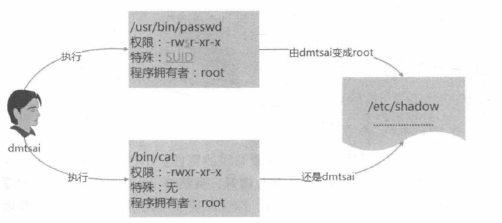

注意，SUID 仅可用在二进制程序上，不能够用在 shell 脚本上面，**<font color='red'>shell 脚本只是将很多的二进制执行文件调用执行而已</font>**。

另外，SUID对于目录也是无效的。

#### Set GID

**<font color='blue'>当 s 这个标志出现在用户组的 x 权限上时</font>**，例如 /usr/bin/locate 这个文件的权限状态：“-rwx--s--x”，此时就被称为 Set GID，简称为 **<font color='blue'>SGID</font>** 的特殊权限。

与 SUID 不同的是，SGID 可以针对文件或目录来设置：

* 如果是对文件来说， SGID 有如下的功能：
  * SGID 对二进制程序有用
  * 程序执行者对于该程序来说，需具备 x 的权限
  * 执行者在执行的过程中将会获得该程序用户组的支持
  
  举例来说，有如下的可执行文件 /usr/bin/locate 和 文本文件 /var/lib/mlocate/mlocate.db：
  
  ```shell
  [root@study ~] # 11 /usr/bin/locate /var/lib/mlocate/mlocate.db
  -rwx--s--x. 1 root slocate 40496 Jun 10 2014 /usr/bin/locate
  -rw-r-----. 1 root slocate 2349055 Jun 15 03:44 /var/lib/mlocate/mlocate.db
  ```
  
  若我使用 dmtsai 这个账号去执行 locate 时，那 dmtsai 将会取得 slocate 用户组的支持，因此就能够去读取 mlocate.db。
* 如果是对目录来说， SGID 有如下的功能：
  * 用户若对于此目录具有 r 与 x 的权限时，该使用者能够进入此目录
  * 用户在此目录下的有效用户组（effective group）将会变成该目录的用户组
  * 用途：若用户在此目录下具有 w 的权限（可以新建文件），则使用者所创建的新文件，该新文件的用户组与此目录的用户组相同。

#### Sticky Bit

**<font color='blue'>当 t 这个标志出现在其他人的 x 权限上时</font>**，例如 /tmp 这个目录的权限状态：“drwxrwxrwt”，此时就被称为 Sticky Bit，简称为 **<font color='blue'>SBIT </font>** 的特殊权限。

SBIT 对于目录的作用是：

* 当用户对于此目录具有 w, x 权限，即具有写入的权限
* 当用户在该目录下创建文件或目录时，仅有自己与 root 才有权力删除该文件

换句话说，**<font color='red'>当甲这个用户对于 A 目录具有 w 的权限，这表示甲用户对该目录内任何人建立的目录或文件均可进行删除、更名、移动等操作。不过，如果 A 目录加上了 SBIT 的权限选项时，则甲只能够针对自己建立的文件或目录进行删除、更名、移动等操作，而无法删除它人的文件。</font>**

举例来说，我们的 /tmp 本身的权限是“drwxrwxrwt”， 在这样的权限内容下，任何人都可以在/tmp 内新增、修改文件，但仅有该文件/目录的创建者与 root 能够删除自己的目录或文件。

#### SUID/SGID/SBIT 权限设置

在用数字形式更改权限的方式中再加一个数字，最前面的数字就代表这几个权限了

* 4 为 SUID
* 2 为 SGID
* 1 为 SBIT

假设要将一个文件权限改为“-rwsr-xr-x”时，由于 s 在使用者权限中，所以是 SUID ，因此，在原先的 755 之前还要加上 4：

```Shell
chmod 4755 filename
```

范例：

```Shell
[root@study ~]# cd /tmp
[root@study tmp]# touch test <==创建一个测试用空文件
[root@study tmp]# chmod 4755 test; ls -l test <==加入具有 SUID 的权限
-rwsr-xr-x 1 root root 0 Jun 16 02:53 test
[root@study tmp]# chmod 6755 test; ls -l test <==加入具有 SUID/SGID 的权限
-rwsr-sr-x 1 root root 0 Jun 16 02:53 test
[root@study tmp]# chmod 1755 test; ls -l test <==加入 SBIT 的功能！
-rwxr-xr-t 1 root root 0 Jun 16 02:53 test
[root@study tmp]# chmod 7666 test; ls -l test <==具有空的 SUID/SGID 权限
-rwSrwSrwT 1 root root 0 Jun 16 02:53 test
#注意这里出现了大写的S和T，我们执行的是7666，也就是说usr，group，others都没有x这个可执行的标志，所有S和T就代表空。
```

也可以通过符号法来处理，其中SUID为u+s，SGID为g+s，SBIT则是o+t

```shell
# 设置权限成为 -rws--x--x 的模样：
[root@study tmp]# chmod u=rwxs,go=x test; ls -l test
-rws--x--x 1 root root 0 Jun 16 02:53 test
# 承上，加上 SGID 与 SBIT 在上述的文件权限中！
[root@study tmp]# chmod g+s,o+t test; ls -l test
-rws--s--t 1 root root 0 Jun 16 02:53 test
```

### 6.4.4 观察文件类型：file

  通过这个命令，我们可以简单地先判断这个文件的格式是什么。包括未来你也可以用来判断 tar 包使用的是哪一种压缩方式。

  ```shell
  [root@study ~]# file ~/.bashrc
  /root/.bashrc: ASCII text				<==告诉我们是 ASCII 的纯文本文件
  [root@study ~]# file /usr/bin/passwd
  /usr/bin/passwd: setuid ELF 64-bit LSB shared object, x86-64, version 1 （SYSV）, dynamically
  linked （uses shared libs）, for GNU/Linux 2.6.32,
  BuildID[sha1]=0xbf35571e607e317bf107b9bcf65199988d0ed5ab, stripped
  # 可执行文件的数据可就多的不得了,包括这个文件的 suid 权限、相容于 Intel x86-64 等级的硬件平台
  # 使用的是 Linux 核心 2.6.32 的动态函数库链接等
  [root@study ~]# file /var/lib/mlocate/mlocate.db
  /var/lib/mlocate/mlocate.db: data		<== 这是 data 文件
  ```

  ## 6.5 命令与文件的查找

因为我们常常需要知道哪个文件放在哪里，才能够对该文件进行—些修改或维护等操作。此时就要利用—些查找命令将该配置文件的完整文件名找出来。

### 6.5.1 脚本文件的查找

#### which （查找【执行文件】）

这个命令**<font color='red'>是根据【PATH】这个环境变量所规范的路径，去查找执行文件的文件名</font>**，所以，重点是找出执行文件而已，且 which 后面接的是完整文件名。若加上 【-a】选项，则可以列出所有的可以找到的同名执行文件，而非仅显示第—个而已。

```Shell
[root@study ~]# which [-a] command
选项或参数：
-a ：将所有由 PATH 目录中可以找到的命令均列出，而不止第一个被找到的命令名称

范例一：查找 ifconfig 这个命令的完整文件名
[root@study ~]# which ifconfig
/sbin/ifconfig

范例二：用 which 去找出 which 的文件名是什么
[root@study ~]# which which
alias which='alias | /usr/bin/which --tty-only --read-alias --show-dot --show-tilde'
	/bin/alias
	/usr/bin/which
# 竟然会有两个 which ，其中一个是 alias ，那是啥？那就是所谓的“命令别名”
# 意思是输入 which 会等于后面接的那串命令，更多的内容我们会在 bash 章节中再来谈

范例三：请找出 history 这个命令的完整文件名
[root@study ~]# which history
/usr/bin/which: no history in （/usr/local/sbin:/usr/local/bin:/sbin:/bin:
/usr/sbin:/usr/bin:/root/bin）
[root@study ~]# history --help
-bash: history: --: invalid option
history: usage: history [-c] [-d offset] [n] or history -anrw [filename] or history -ps arg
# 什么？怎么可能没有 history ，我明明就能够用 root 执行 history
```

最后一个范例最有趣，怎么 history 这个常用的命令竟然找不到。为什么？这是因为 history 是 **<font color='red'>bash 内置的命令</font>**。但是 which 默认是找 PATH 内所设置的目录，所以当然—定找不到的。那怎么办？没关系，我们可以通过 type 这个命令。关于 type 的用法我们将在第 10 章的bash 再来谈。

### 6.5.2 文件的查找

在 Linux 下面也有相当优异的查找命令，**<font color='red'>通常 find 不很常用</font>**。除速度慢之外，也影响硬盘性能。**<font color='red'>—般我们都是先使用 whereis 或是 locate 来检查，如果真的找不到了，才以 find 来查找</font>**。为什么？因为 whereis 只找系统中某些特定目录下面的文件而已， locate 则是利用数据库来查找文件名。

#### whereis （由一些特定的目录中查找文件）

```Shell
[root@study ~]# whereis [-bmsu] 文件或目录名
选项与参数：
-l :可以列出 whereis 会去查询的几个主要目录
-b :只找 binary 格式的文件
-m :只找在说明文件 manual 路径下的文件
-s :只找 source 源文件
-u :查找不在上述三个项目当中的其他特殊文件

范例一：请找出 ifconfig 这个文件名
[root@study ~]# whereis ifconfig
ifconfig: /sbin/ifconfig /usr/share/man/man8/ifconfig.8.gz

范例二：只找出跟 passwd 有关的“说明文件”文件名（man page）
[root@study ~]# whereis passwd # 全部的文件名通通列出来
passwd: /usr/bin/passwd /etc/passwd /usr/share/man/man1/passwd.1.gz /usr/share/man/man5/passwd.5.gz
[root@study ~]# whereis -m passwd # 只有在 man 里面的文件名才显示出来
passwd: /usr/share/man/man1/passwd.1.gz /usr/share/man/man5/passwd.5.gz
```

whereis 可以加入选项来查找相关的数据，例如，如果你是要找可执行文件，那么加上 -b 就可以。如果不加任何选项的话，那么就将所有的数据显示出来。

whereis 搜寻的速度会比 find 快很多，这是因为 whereis 只找几个特定的目录而已，并没有全系统去查询。想要知道 whereis 到底查了多少目录？可以使用whereis -I 来确认一下。

#### locate / updatedb

```shell
[root@study ~]# locate [-ir] keyword
选项与参数：
-i ：忽略大小写的差异；
-c ：不输出文件名，仅计算找到的文件数量
-l ：仅输出几行的意思，例如输出五行则是 -l 5
-S ：输出 locate 所使用的数据库文件的相关信息，包括该数据库纪录的文件/目录数量等
-r ：后面可接正则表达式的显示方式

范例一：找出系统中所有与 passwd 相关的文件名，且只列出 5 个
[root@study ~]# locate -l 5 passwd
/etc/passwd
/etc/passwd-
/etc/pam.d/passwd
/etc/security/opasswd
/usr/bin/gpasswd

范例二：列出 locate 查询所使用的数据库文件的文件名与各数据数量
[root@study ~]# locate -S
Database /var/lib/mlocate/mlocate.db:
8,086 directories # 总纪录目录数
109,605 files # 总纪录文件数
5,190,295 Bytes in file names
2,349,150 Bytes used to store database
```

这个 locate 的使用更简单，直接在后面**<font color='red'>输入文件的部分名称后，就能够得到结果</font>**。举上面的例子来说，我输入 locate passwd，那么在完整文件名（包含路径名称）当中，只要有 passwd 在其中，就会被显示出来。

使用 locate 来寻找数据的时候特别的快， 这是因为 locate 寻找的数据是由**<font color='red'>已建立的数据库</font>** /var/lib/mlocate/ 里面的数据所查找到的，所以不用直接在去硬盘当中存取数据。

但是数据库的建立默认是在每天执行一次 ，所以当你新建立起来的文件， 却还在数据库更新之前查找该文件，那么 locate 会告诉你“找不到！”但是我们可以使用【updatedb】来手动更新数据库，updatedb 会根据 /etc/updatedb.conf 的设置去查找系统硬盘内的文件，并更新/var/lib/mlocate 内的数据库文件。

#### find

```shell
[root@study ~]# find [PATH] [option] [action]
选项与参数：
1. 与时间有关的选项：共有 -atime, -ctime 与 -mtime ，以 -mtime 说明
-mtime n ：n 为数字，意义为在 n 天之前的“一天之内”被修改过内容的文件；
-mtime +n ：列出在 n 天之前（不含 n 天本身）被修改过内容的文件
-mtime -n ：列出在 n 天之内（含 n 天本身）被修改过内容的文件
-newer file ：file 为一个存在的文件，列出比 file 还要新的文件

范例一：将过去系统上面 24 小时内有修改过内容 （mtime） 的文件列出
[root@study ~]# find / -mtime 0
# 那个 0 是重点。0 代表目前的时间，所以，从现在开始到 24 小时前，
# 有变动过内容的文件都会被列出来，那如果是三天前那一天的 24 小时内？
# find / -mtime 3 有变动过的文件都被列出的意思

范例二：寻找 /etc 下面的文件，如果文件日期比 /etc/passwd 新就列出
[root@study ~]# find /etc -newer /etc/passwd
# -newer 用在分辨两个文件之间的新旧关系是很有用的。
```

find相关的时间参数的意义：

 

```shell
选项与参数：
2. 与使用者或用户组名称有关的参数：
-uid n ：n 为数字，这个数字是使用者的帐号 ID，亦即 UID ，这个 UID 是记录在/etc/passwd 里面与帐号名称对应的数字
-gid n ：n 为数字，这个数字是群组名称的 ID，亦即 GID，这个 GID 记录在/etc/group
-user name ：name 为使用者帐号名称。例如 dmtsai
-group name：name 为用户组名称，例如 users
-nouser ：查找文件的拥有者不存在 /etc/passwd 中
-nogroup ：查找文件的用户组不存在于 /etc/group 的文件。
# 当你自行安装软件时，很可能该软件的属性当中并没有文件拥有者，这是可能的。在这个时候，就可以使用 -nouser 与 -nogroup 搜寻。

范例三：搜寻 /home 下面属于 dmtsai 的文件
[root@study ~]# find /home -user dmtsai
# 这个东西也很有用的，当我们要找出任何一个用户在系统当中的所有文件时，
# 就可以利用这个命令将属于某个用户的所有文件都找出来。

范例四：搜寻系统中不属于任何人的文件
[root@study ~]# find / -nouser
# 通过这个指令，可以轻易的就找出那些不太正常的文件。如果有找到不属于系统任何人的文件时，
# 不要太紧张，那有时候是正常的，尤其是你曾经以源代码自行编译软件时
```

```shell
选项与参数：
3. 与文件权限及名称有关的参数：
-name filename：查找文件名称为 filename 的文件；
-size [+-]SIZE：查找比 SIZE 还要大（+）或小（-）的文件。这个 SIZE 的规格有：
	c: 代表 Byte， k: 代表 1024Bytes。所以，要找比 50KB还要大的文件，就是“ -size +50k ”
-type TYPE ：查找文件的类型为 TYPE 的，类型主要有：一般正规文件 （f）, 设备文件 （b, c）,
	目录 （d）, 链接文件 （l）, socket （s）, 及 FIFO （p） 等属性。
-perm mode ：查找文件权限【刚好等于】 mode 的文件，这个 mode 为类似 chmod的属性值，举例来说， -rwsr-xr-x 的属性为 4755 
-perm -mode ：查找文件权限【必须要全部囊括 mode 的权限】的文件，举例来说，我们要搜寻 -rwxr--r-- ，亦即 0744 的文件，使用 -perm -0744，
	当一个文件的权限为 -rwsr-xr-x ，亦即 4755 时，也会被列出来，因为 -rwsr-xr-x 的属性已经囊括了 -rwxr--r-- 的属性了。
-perm /mode ：查找文件权限【包含任一 mode 的权限】的文件，举例来说，我们搜寻 -rwxr-xr-x ，亦即 -perm /755 时，但一个文件属性为 -rw-------
	也会被列出来，因为他有 -rw.... 的属性存在！
	
范例五：找出文件名为 passwd 这个文件
[root@study ~]# find / -name passwd
范例五-1：找出文件名包含了 passwd 这个关键字的文件
[root@study ~]# find / -name "*passwd*"
# 利用这个 -name 可以查找文件名啊，默认是完整文件名，如果想要找关键字，
# 可以使用类似 * 的任意字符来处理

范例六：找出 /run 目录下，文件类型为 Socket 的文件名有哪些？
[root@study ~]# find /run -type s
# 这个 -type 的属性也很有帮助，尤其是要找出那些怪异的文件，
# 例如 socket 与 FIFO 文件，可以用 find /run -type p 或 -type s 来找

范例七：查找文件当中含有 SGID 或 SUID 或 SBIT 的属性
[root@study ~]# find / -perm /7000
# 所谓的 7000 就是 ---s--s--t ，那么只要含有 s 或 t 的就列出，所以当然要使用 /7000，
# 使用 -7000 表示要同时含有 ---s--s--t 的所有三个权限。而只需要任意一个，就是 /7000
```

**<font color='red'>find 后面可以接多个目录来进行查找。另外， find 本来就会查找子目录</font>**，这个特色也要特别注意。

```shell
选项与参数：
4. 额外可进行的操作：
-exec command ：command 为其他命令，-exec 后面可再接额外的命令来处理查找到的结果。
-print ：将结果打印到屏幕上，这个操作是默认动作

范例八：将上个范例找到的文件使用 ls -l 列出来
[root@study ~]# find /usr/bin /usr/sbin -perm /7000 -exec ls -l {} \;
# 注意到，那个 -exec 后面的 ls -l 就是额外的命令，命令不支持命令别名，
# 所以仅能使用 ls -l 不可以使用 ll
# {} 代表的是find找到的内容
# -exec 一直到 \；是关键词，代表find额外操作的开始到结束，在这中间的就是 find 命令内的额外操作。在本例中就是"ls -l {}"
# 因为";"在bash环境下是有特殊意义的，因此利用反斜杠来转义
```

注意由于find在查找数据的时候相当消耗硬盘资源，所以没事不要使用find。

## 6.6 权限与命令间的关系

一、让用户能进入某目录成为可工作目录

* 可使用的命令：例如 cd 等变换工作目录的命令
* 目录所需权限：**用户对这个目录至少需要具有 x 的权限**
* 额外需求：如果用户想要在这个目录内利用 ls 查看文件名，则用户对此目录还需要 r 的权限

二、用户在某个目录内读取一个文件

* 可使用的命令：例如 car、more、less等
* 目录所需权限：用户对这个目录至少需要具有 x 的权限
* 文件所需权限：**用户对这个文件至少需要具有 r 的权限**

三、让用户可以修改一个文件

* 可使用的命令：例如 nano 或 vi 编辑器等
* 目录所需权限：用户对这个目录至少需要具有 x 的权限
* 文件所需权限：**用户对这个文件至少需要具有 r、w 的权限**

四、让一个用户可以建立一个文件

* 目录所需权限：用户对这个目录至少需要具有 w、x 的权限，重点在于w

五、让用户进入某目录并执行该目录下的某个命令

* 目录所需权限：用户对这个目录至少需要具有 x 的权限
* 文件所需权限：用户对这个文件至少需要具有 x 的权限

# 第7章 Linux磁盘与文件系统管理

## 7.1 认识Linux文件系统

### 7.1.1 磁盘组成与分区的复习

#### 磁盘的物理组成

* 圆形的碟片（主要记录数据的部分）
* 机械手臂，与在机械手臂上的磁头（可读写盘碟片上的数据）
* 主轴马达，可以转动碟片，让机械手臂的磁头在碟片上读写数据

#### 碟片的物理组成

* 扇区（Sector）为最小的物理存储单位，且依据磁盘设计的不同，目前主要有 512Bytes与 4KB 两种格式
* 将扇区组成一个圆，那就是柱面（Cylinder）
* 早期的分区主要以柱面为最小分区单位，现在的分区通常使用扇区为最小分区单位（每个扇区都有其号码，就好像座位一样）
* 磁盘分区表主要有两种格式，一种是限制较多的 MBR 分区表，一种是较新且限制较少的 GPT 分区表
* MBR 分区表中，第一个扇区最重要，里面有：主引导记录（Master boot record, MBR）及分区表（partition table）， 其中 MBR 占有 446 Bytes，而 partition table 则占有 64 Bytes
* GPT 分区表除了分区数量扩充较多之外，支持的磁盘容量也可以超过 2TB

#### 磁盘的文件名

* /dev/sd\[a-p][1-128]：为物理磁盘的文件名
* /dev/vd\[a-d][1-128]：为虚拟磁盘的文件名

### 7.1.2 文件系统特性

传统的磁盘与文件系统应用中，一个分区就只能够被格式化成为一个文件系统，所以我们可以说一个文件分区。但是 LVM 与软件磁盘阵列等新技术可以将一个分区格式化为多个文件系统，也能够将多个分区合成一个文件系统。所以说，目前我们在格式化时已经不再说成针对硬盘分区来格式化了，通常我们可以称呼**<font color='red'>一个可被挂载的数据为一个文件系统而不是一个分区</font>**。

Linux 操作系统的文件内容和文件权限（rwx），文件属性（拥有者，用户组，时间参数等）会被分别存放在不同的区块，**<font color='red'>权限与属性放到 inode 中，实际数据则放置到数据区块中</font>**。另外还有一个超级区块（superblock）会记录整个文件系统的整体信息，包括 inode 与数据区块的总量、使用量、剩余量等。

* 超级区块

  记录此文件系统的整体信息，包括 inode 与数据区块的总量、使用量、剩余量，以及文件系统的格式与相关信息等

* inode

  记录文件的属性，一个文件占用一个 inode，同时记录此文件的数据所在的区块号码

* 数据区块

  实际记录文件的内容，若文件太大时，会占用多个区块

由于 inode 内有文件数据放置的区块号码，如果能够找到文件的 inode 的话，那么自然就会知道这个文件所放置数据的区块号码，当然也就能够读出该文件的实际数据了。这种利用 inode 记录实际数据存放的区块的方式，称为**<font color='blue'>索引式文件系统</font>**。例如图中一个文件的属性与权限数据是放置到 inode 4号中，而这个 inode 记录了文件数据的实际放置点为 2、7、13、15 这 4 个区块号码：

 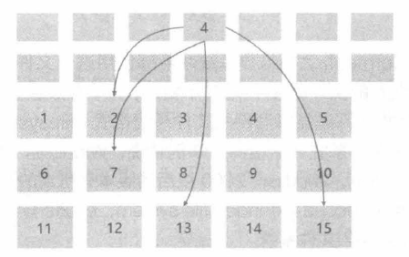


### 7.1.3 Linux的ext2文件系统（inode）

标准的 ext2 就是使用这种前文提到的 inode 为基础的 Linux 文件系统。

文件系统一开始就将 inode 与数据区块规划好了，除非重新格式化（或利用 resize2fs 等命令修改其大小），否则 inode 与数据区块固定后就不再变动。但是，如果我的文件系统高达数百 GB 时，那么将所有的 inode 与数据区块通通放置在一起将是很不明智的决定，因为 inode 与数据区块的数量太庞大，不容易管理。

因此ext2 文件系统在格式化的时候基本上是区分为多个**<font color='blue'>区块群组 </font>**（block group） ，每个区块群组都有独立的 inode、数据区块、超级区块系统。

 

文件系统最前面有一个启动扇区（boot sector），可以安装启动引导程序。

每一个区块群组有以下六个主要内容：

#### 数据区块（data block）

数据区块是用来放置文件数据的地方，在 ext2 文件系统中所支持的区块大小有 1K, 2K及 4K 三种。在格式化时区块的大小就固定了，且每个区块都有编号，以方便 inode 的记录。ext2 文件系统的区块还有以下基本限制：

* 原则上，区块的大小与数量在格式化完就不能够再修改（除非重新格式化）
* **<font color='red'>每个区块内最多只能够放置一个文件的数据</font>**
* 承上，如果文件大于区块的大小，则一个文件会占用多个区块数量
* 承上，若文件小于区块，则该区块的剩余容量就不能够再被使用了（磁盘空间会浪费）

#### inode表（inode table）

inode记录的数据至少有：

* 该文件的读写属性（read/write/excute）
* 该文件的拥有者与用户组（owner/group）
* 该文件的大小
* 该文件建立或状态改变的时间（ctime）
* 最近一次的读取时间（atime）
* 最近修改的时间（mtime）
* 定义文件特性的标识（flag），如 SetUID
* 该文件真正内容的指向 （pointer）

inode的数量与大小也是在格式化时就已经固定了，除此之外，还有以下特色：

* 每个 inode 大小均固定为 128 B （新的 ext4 与 xfs 可设置到 256 B）
* 每个文件都仅会占用一个 inode 而已
* 承上，因此**<font color='red'>文件系统能够建立的文件数量与 inode 的数量有关</font>**
* 系统读取文件时需要先找到 inode，并分析 inode 所记录的权限与用户是否符合，若符合才能够读取区块的内容

文件系统将 inode 记录区块号码的区域定义为 12 个直接、一个间接、一个双间接与一个三间接记录区：

 

上图最左边为 inode 本身（128B），里面有 12 个直接指向区块号码的对照，这12 条记录就能够直接取得区块号码。至于所谓的间接就是再拿一个区块来当作记录区块号码的记录区，如果文件太大，就会使用间接的区块来记录编号。

#### 超级区块 （Superblock）

记录的主要信息有：

* 数据区块与 inode 的总量
* 未使用与已使用的 inode 与数据区块的数量
* 数据区块与 inode 的大小 （block 为 1, 2, 4K，inode 为 128Bytes 或 256Bytes）
* 文件系统的挂载时间、最近一次写入数据的时间、最近一次检验磁盘 （fsck） 的时间等文件系统的相关信息
* 一个有效位数值，若此文件系统已被挂载，则有效位为 0 ，若未被挂载，则有效位为 1

上述信息我们可以通过 dumpe2fs 来观察。

超级区块非常的重要，因为我们这个文件系统的基本信息都存储在这里。此外，每个区块群组（block group）都可能含有超级区块。但是我们也说—个文件系统应该仅有—个超级区块而已，那是怎么回事？事实上除了第一个区块群组内会含有超级区块之外，**<font color='red'>后续的区块群组不—定含有超级区块</font>**，而若含有超级区块则该超级区块主要是做为第—个区块群组内超级区块的备份，这样可以进行超级区块的恢复。

#### 文件系统描述说明 （Filesystem Description）

这个区段可以描述每个区块群组的开始与结束的区块号码，以及说明每个区段（超级区块, 对照表, inode对照表, 数据区块） 分别介于哪一个区块号码之间。这部分也能够用 dumpe2fs 来观察。

#### 区块对照表 （block bitmap）

新增文件时，从区块对照表当中可以知道哪些区块是空的，因此我们的系统就能够很快速的找到可使用的空间来处理文件。

删除某些文件时，那么那些文件原本占用的区块号码就得要释放出来， 此时在区块对照表当中相对应到该区块号码的标志就要修改成 “未使用中”。

#### inode 对照表 （inode bitmap）

与区块对照表类似，记录使用与未使用的 inode 号码。

#### dumpe2fs： 查询超级块信息的命令

需要注意，我们的 CentOS 7 现在是以 xfs 为默认文件系统，所以目前你的系统应该无法使用 dumpe2fs 去查询任何文件系统。不过后续可以自己划分一个 ext4 的文件系统进行查询。

下面的这个文件系统是 1GB 的容量，使用默认方式来进行格式化，观察的内容如下：

```shell
[root@study ~]# dumpe2fs [-bh] 设备文件名
选项与参数：
-b ：列出保留为坏道的部分（一般用不到）
-h ：仅列出 superblock 的数据，不会列出其他的区段内容

范例：一块 1GB ext4 文件系统内容
[root@study ~]# blkid <==这个指令可以显示目前系统被格式化的设备
/dev/vda1: LABEL="myboot" UUID="ce4dbf1b-2b3d-4973-8234-73768e8fd659" TYPE="xfs"
/dev/vda2: LABEL="myroot" UUID="21ad8b9a-aaad-443c-b732-4e2522e95e23" TYPE="xfs"
/dev/vda3: UUID="12y99K-bv2A-y7RY-jhEW-rIWf-PcH5-SaiApN" TYPE="LVM2_member"
/dev/vda5: UUID="e20d65d9-20d4-472f-9f91-cdcfb30219d6" TYPE="ext4" <==看到 ext4 了！
[root@study ~]# dumpe2fs /dev/vda5
dumpe2fs 1.42.9 （28-Dec-2013）
Filesystem volume name: <none> 							# 文件系统的名称（不一定会有）
Last mounted on: <not available> 						# 上一次挂载的目录位置
Filesystem UUID: e20d65d9-20d4-472f-9f91-cdcfb30219d6	# UUID 为 Linux 对设备的定义码
Filesystem magic number: 0xEF53 						
Filesystem revision #: 1 （dynamic） 
Filesystem features: has_journal ext_attr resize_inode dir_index filetype extent 64bit	# 文件系统的特征数据
flex_bg sparse_super large_file huge_file uninit_bg dir_nlink extra_isize
Filesystem flags: signed_directory_hash
Default mount options: user_xattr acl 					# 默认在挂载时会主动加上的挂载参数
Filesystem state: clean 								# 这块文件系统的状态是什么，clean 是没问题
Errors behavior: Continue
Filesystem OS type: Linux
Inode count: 65536 										# inode 的总数
Block count: 262144 									# block 的总数
Reserved block count: 13107 							# 保留的 block 总数
Free blocks: 249189 									# 还有多少的 block 可用数量
Free inodes: 65525 										# 还有多少的 inode 可用数量
First block: 0
Block size: 4096 										# 单个 block 的大小
Fragment size: 4096
Group descriptor size: 64
....（中间省略）....
Inode size: 256 										# inode 的容量大小，已经是 256B 了
....（中间省略）....
Journal inode: 8
Default directory hash: half_md4
Directory Hash Seed: 3c2568b4-1a7e-44cf-95a2-c8867fb19fbc
Journal backup: inode blocks
Journal features: （none）
Journal size: 32M 										# Journal 日志的可供存储大小
Journal length: 8192
Journal sequence: 0x00000001
Journal start: 0
Group 0: （Blocks 0-32767） 							   # 第一块区块群组位置
Checksum 0x13be, unused inodes 8181
Primary superblock at 0, Group descriptors at 1-1 		# 主要超级区块的所在
Reserved GDT blocks at 2-128
Block bitmap at 129 （+129）, Inode bitmap at 145 （+145）
Inode table at 161-672 （+161） 						   # inode 表的所在
28521 free blocks, 8181 free inodes, 2 directories, 8181 unused inodes
Free blocks: 142-144, 153-160, 4258-32767 				# 下面两行说明剩余的容量有多少
Free inodes: 12-8192
Group 1: （Blocks 32768-65535） [INODE_UNINIT] 		   # 后续为更多其他的区块群组
....（下面省略）....
# 上半部分显示超级区块的内容，下半部分则是每个区块群组的信息
```

如上所示，利用 dumpe2fs 可以查询到非常多的信息，不过依内容主要可以划分为上半部分的超级区块内容，下半部分则是每个区块群组的信息。

### 7.1.4 文件系统与实际的目录树的关系

#### 目录

当我们在 Linux 下的文件系统建立一个目录时，**<font color='red'>文件系统会分配一个 inode 与至少一块区块给该目录</font>**。其中，inode 记录该目录的相关权限与属性，并可记录分配到的那块区块号码。**<font color='red'>区块则是记录在这个目录下的文件名与该文件名占用的 inode 号码数据。</font>**

另外在目录下面的文件数如果太多而导致一个区块无法记录得下所有的文件名与其占用的 inode 号码时， Linux 会多给该目录一个区块来继续记录相关的数据。

可以使用【ls -i】来观察文件所占用的 inode 号码：

```shell
[root@study ~]# ls -li
total 8
53735697 -rw-------. 1 root root 1816 May 4 17:57 anaconda-ks.cfg
53745858 -rw-r--r--. 1 root root 1864 May 4 18:01 initial-setup-ks.cfg
```

#### 文件

当我们在 Linux 下的 ext2 创建一个一般文件时， ext2 会分配一个 inode 与相对于该文件大小的区块数量给该文件。

#### 目录树读取

**<font color='red'>inode 本身并不记录文件名，文件名的记录是在目录的区块中。</font>**因此新增、删除、修改文件名与目录的 w 权限有关。

由于目录树是由根目录开始读起，因此系统通过挂载的信息可以找到**挂载点**的 inode 号码，此时就能够得到根目录的 inode 内容，并依据该 inode 读取根目录的区块内的文件名数据，再一层一层的往下读到正确的文件名。

举例来说，如果我想要读取 /etc/passwd 这个文件时

1. / 的 inode

   系统通过挂载点的信息找到根目录的 inode 号码，且 inode 记录的权限让我们可以读取该区块的内容（有 r 与 x）

2. / 的区块

   通过 / 的 inode 记录的 / 的区块号码，可以读取 / 的区块内容，其中有 etc 目录的 inode 号码

3. etc 的 inode

   通过 etc 的 inode 得知 dmtsai 具有 r 与 x 的权限，因此可以读取 etc 的区块内容

4. etc 的区块

   通过 etc 的 inode 记录的 etc 的区块号码，可以读取 etc 的区块内容，其中有 passwd 的 inode 号码

5. passwd 的 inode

   通过 passwd 的 inode 得知 dmtsai 具有 r 权限，因此可以读取 passwd  的区块内容

6. passwd 的区块

   通过 passwd 的 inode 记录的 passwd 的区块号码，可以读取 passwd 的区块内容，其中记录的就是该文件的数据

#### 文件系统大小与磁盘读取性能

当—个文件系统规划得很大时，例如 100GB 这么大时，由于磁盘上面的数据总是来来去去的，所以，整个文件系统上面的文件通常无法连续写在一起（区块
号码不会连续的意思），而是填入式地将数据写入没有被使用的区块当中。

如果文件写入的区块真的很分散，此时就会有所谓的文件数据离散的问题发生了，因为磁头得要在整个文件系统中来来去去地频繁读取。果真如此，那么可以将整个文件系统内的数据全部复制出来，将该文件系统重新格式化，再将数据给它复制回去即可解决这个间题。

此外，如果文件系统真的太大，那么当一个文件分别记录在这个文件系统的最前面与最后面的区块号码中，此时会造成磁盘的机械手臂移动幅度过大，也会造成数据读取性能的下降。而且磁头在查找整个文件系统时，也会花费比较多的时间去查找。因此，磁盘分区的规划并不是越大越好，而是要针对您的主机用途来进行规划才行。

### 7.1.5  ext2/ext3/ext4 文件的存取与日志式文件系统的功能

当我们新增一个文件时，此时文件系统的操作是：

* 先确定用户对于欲新增文件的目录是否具有 w 与 x 的权限，若有的话才能新增
* 根据 inode 对照表找到没有使用的 inode 号码，并将新文件的权限/属性写入
* 根据区块对照表找到没有使用中的区块号码，并将实际的数据写入区块中，且更新 inode 的区块指向数据
* 将刚刚写入的 inode 与区块数据同步更新 inode 对照表与区块对照表，并更新超级区块的内容

一般来说，我们将 inode 表与数据区块称为**<font color='blue'>数据存放区域</font>**，至于其他例如超级区块、区块对照表与 inode 对照表等区段就被称为**<font color='blue'>元数据</font>**（ metadata ），因为它们的数据是经常变动的，每次新增、移除、编辑时都可能会影响到这三个部分的数据，因此才被称为元数据。

#### 数据的不一致状态

如果在写入文件系统时，因为某些原因导致系统中断，写入的数据仅有 inode 表和数据区块，最后一个同步更新元数据的步骤并没有完成，此时就会发生元数据的内容与实际数据存放区产生不一致的情况。

#### 日志式文件系统

为了避免上述提到的文件系统不一致的情况发生，我们在文件系统当中规划出—个区块，该区块专门记录写入或修改文件时的步骤:

* 预备：当系统要写入一个文件时，会先在日志记录区块中记录某个文件准备要写入的信息
* 实际写入：开始写入文件的权限与数据；开始更新 metadata 的数据
* 结束：完成数据与 metadata 的更新后，在日志记录区块当中完成该文件的记录

这样，万一数据的记录过程当中发生了问题，那么系统只要去检查日志记录区块，就可以知道哪个文件发生了问题，而不必针对整个文件系统进行检查。

### 7.1.6 Linux文件系统的运行

Linux的异步处理方式：当系统加载一个文件到内存后，如果该文件没有被修改过，则在内存区段的文件数据会被设置为**干净（clean）**的。 但如果内存中的文件数据被更改过了（例如你用 nano 去编辑过这个文件），此时该内存中的数据会被设置为**脏的 （Dirty）**。**此时所有的动作都还在内存中执行，并没有写入到磁盘中**。 系统会不定时的将内存中设置为 “Dirty” 的数据写回磁盘，以保持磁盘与内存数据的一致性。 你也可以利用 sync 命令来手动强制写入磁盘。

### 7.1.7 挂载点（mount point）的意义

每个文件系统都有独立的 inode 、区块、超级区块等信息，这个文件系统要能够链接到目录树才能被我们使用。将文件系统与目录树结合的操作我们称为**<font color='blue'>挂载</font>**。**<font color='red'>挂载点一定是目录，该目录为进入该文件系统的入口。</font>**因此并不是你有任何文件系统都能使用，必须要挂载到目录树的某个目录后，才能够使用该文件系统。

### 7.1.8 其他 Linux 支持的文件系统与 VFS

Linux 支持的常见的文件系统有：

* 传统文件系统：ext2 / minix / FAT （用 vfat 模块） / iso9660 （光盘）等

* 日志式文件系统： ext3 /ext4 / ReiserFS / Windows' NTFS / IBM's JFS / SGI's XFS / ZFS

* 网络文件系统： NFS / SMBFS

想要知道你的Linux支持的文件系统有哪些，可以查看下面这个目录：

```shell
[root@study ~]# ls -l /lib/modules/$（uname -r）/kernel/fs
```

#### Linux VFS(Virtual File System)

所有的Linux系统都是通过一个名为 Virtual Filesystem Switch 的内核功能去读取文件系统。也就是说，整个 Linux 识别的文件系统其实都是 VFS 在进行管理，用户并不需要知道哪个硬盘分区上面的文件系统是什么，VFS 会主动帮我们做好读取的操作。

举例来说假设你的 / 使用的是 /dev/hda1 ，用 ext3 ，而 /home 使用 /dev/hda2 ，用 reiserfs ， 那么你取用 /home/dmtsai/.bashrc 时，有特别指定要用的什么文件系统的模块来读取吗？ 应该是没有吧！这个就是 VFS 的功能。

 

### 7.1.9 XFS文件系统简介

CentOS 7 开始，默认的文件系统巳经由原本的 ext4 变成了 xfs 文件系统。

#### ext 文件系统存在的问题：支持度最广，但格式化超慢

ext 文件系统对于文件格式化的处理方面，采用的是预先规划出所有的 inode，区块，元数据，未来系统可以直接使用，不需要再进行动态配置的做法。当 TB 以上等级的传统 ext 系列文件系统在格式化的时候，光是预先分配inode与区块就要消耗好多时间。

#### XFS 文件系统的配置

基本上 xfs 就是一个日志式文件系统。

xfs文件系统在数据分布上，主要规划为三个部分：

* 数据区（data section）

  基本上，数据区就跟我们之前谈到的 ext 系列—样，包括 inode 、数据区块、超级区块等数据，都放置在这个区块。这个数据区与 ext 系列的区块群组类似，也是分为多个**<font color='blue'>存储区群组</font>**，每个存储区群组都包含了：

  * 整个文件系统的超级区块
  * 剩余空间的管理机制
  * inode 的分配与追踪

  另外与 ext 系列不同的是，inode与区块都是系统需要用到时才动态配置产生，所以格式化操作超级快。

* 文件系统活动登录区（log section）

  在登录区这个区域主要被用来**记录文件系统的变化，其实有点像是日志区**。文件的变化会在这里记录下来，直到该变化完整地写入到数据区后，该条记录才会被结束。如果文件系统因为某些缘故（例如最常见的停电）而损坏时，系统会拿这个登录区块来进行检验，看看系统挂掉之前，文件系统正在运行些啥操作，借以快速地修复文件系统。

  因为系统所有的操作都会在这个区块做个记录，因此这个区块的磁盘活动相当频繁。**<font color='red'>在这个区域中， 你可以指定外部的磁盘来作为 xfs 文件系统的日志区块。例如，你可以将 SSD 磁盘作为 xfs 的登录区，这样当系统需要进行任何活动时， 就可以更快速的进行工作。</font>**

* 实时运行区（realtime section）

  当有文件要被建立时，xfs会在这个区段里面找一个到数个的 extent 区块，将文件放置在这个区块内，等到分配完毕后，再写入到数据区的 inode 与区块中。

#### XFS 文件系统的描述数据观察

可以用 xfs_info 观察 xfs 文件系统超级区块的内容

```shell
[root@study ~]# xfs_info 挂载点 | 设备文件名

范例一：找出系统 /boot 这个挂载点下面的文件系统的超级区块纪录
[centos.nxb@centos tmp]$ df -T /boot
Filesystem     Type 1K-blocks   Used Available Use% Mounted on
/dev/sda2      xfs    1038336 175492    862844  17% /boot
[centos.nxb@centos tmp]$ xfs_info /boot
meta-data=/dev/sda2              isize=512    agcount=4, agsize=65536 blks
         =                       sectsz=512   attr=2, projid32bit=1
         =                       crc=1        finobt=0 spinodes=0
data     =                       bsize=4096   blocks=262144, imaxpct=25
         =                       sunit=0      swidth=0 blks
naming   =version 2              bsize=4096   ascii-ci=0 ftype=1
log      =internal               bsize=4096   blocks=2560, version=2
         =                       sectsz=512   sunit=0 blks, lazy-count=1
realtime =none                   extsz=4096   blocks=0, rtextents=0
```

* 第 1 行里面的 isize 指的是 inode 的容量，每个有 512B 这么大。至于 agcount 则是前面谈到的存储区群组（allocation group）的个数，共有 4 个， agsize 则是指每个存储区群组具有 65536 个区块。
* 第 2 行里面 sectsz 指的是逻辑扇区（sector）的容量设置为 512B 这么大的意思。
* 第 4 行里面的 bsize 指的是区块的容量，每个区块为 4K 的意思，共有 262144 个区块在这个文件系统内。
* 第 5 行里面的 sunit 与 swidth 与磁盘阵列的 stripe 相关性较高，这部分我们下面格式化的时候会举一个例子来说明。
* 第 7 行里面的 internal 指的是这个登录区的位置在文件系统内，而不是外部设备的意思，且占用了 4K * 2560 个区块，总共约10M 的容量。
* 第 9 行里面的 realtime 区域，里面的 extent 容量为4K，不过目前没有使用。

## 7.2 文件系统的简单操作

### 7.2.1 磁盘与目录的容量

#### df（disk-free）：列出文件系统的整体磁盘使用量

由于 df 主要读取的数据几乎都是针对一整个文件系统，因此读取的范围主要是在超级区块内的信息，所以这个命令显示结果的速度非常快。

在 Linux 下面如果 df 没有加任何选项，那么默认会将系统内所有的（不含特殊的内存内的文件系统与 swap） 文件系统都以 1 KBytes 的容量来列出来:

```shell
[root@study ~]# df [-ahikHTm] [目录或文件名]
选项与参数：
-a ：列出所有的文件系统，包括系统特有的 /proc 等文件系统；
-k ：以 KBytes 的容量显示各文件系统；
-m ：以 MBytes 的容量显示各文件系统；
-h ：以人们较易阅读的 GBytes, MBytes, KBytes 等格式自行显示；	⭐
-H ：以 M=1000K 取代 M=1024K 的进位方式；
-T ：连同该硬盘分区的文件系统名称 （例如 xfs） 也列出；
-i ：不用磁盘容量，而以 inode 的数量来显示						⭐

范例一：将系统内所有文件系统全列出来
[centos.nxb@centos tmp]$ df
Filesystem              1K-blocks    Used Available Use% Mounted on
devtmpfs                   480812       0    480812   0% /dev
tmpfs                      497836       0    497836   0% /dev/shm
tmpfs                      497836   14928    482908   3% /run
tmpfs                      497836       0    497836   0% /sys/fs/cgroup
/dev/mapper/centos-root  10475520 4540256   5935264  44% /
/dev/mapper/centos-home   5232640  119700   5112940   3% /home
/dev/sda2                 1038336  175492    862844  17% /boot
tmpfs                       99568      32     99536   1% /run/user/1000
```

所输出的结果信息为：

* Filesystem：代表该文件系统是哪个硬盘分区，所以列出设备名称
* 1k-blocks：说明下面的数字单位是1KB
* Mounted on：磁盘的挂载目录（挂载点）

```shell
范例二：将容量结果以易读的容量格式显示出来
[centos.nxb@centos tmp]$ df -h
Filesystem               Size  Used Avail Use% Mounted on
devtmpfs                 470M     0  470M   0% /dev
tmpfs                    487M     0  487M   0% /dev/shm
tmpfs                    487M   15M  472M   3% /run
tmpfs                    487M     0  487M   0% /sys/fs/cgroup
/dev/mapper/centos-root   10G  4.4G  5.7G  44% /
/dev/mapper/centos-home  5.0G  117M  4.9G   3% /home
/dev/sda2               1014M  172M  843M  17% /boot
tmpfs                     98M   32K   98M   1% /run/user/1000
# 不同于范例一，这里会以 G/M 等容量格式显示出来，比较容易看

范例三：将文件系统名称一并列出来
[centos.nxb@centos tmp]$ df -T
Filesystem              Type     1K-blocks    Used Available Use% Mounted on
devtmpfs                devtmpfs    480812       0    480812   0% /dev
tmpfs                   tmpfs       497836       0    497836   0% /dev/shm
tmpfs                   tmpfs       497836   14928    482908   3% /run
tmpfs                   tmpfs       497836       0    497836   0% /sys/fs/cgroup
/dev/mapper/centos-root xfs       10475520 4536220   5939300  44% /
/dev/mapper/centos-home xfs        5232640  119700   5112940   3% /home
/dev/sda2               xfs        1038336  175492    862844  17% /boot
tmpfs                   tmpfs        99568      32     99536   1% /run/user/1000
```

**<font color='red'>在 df 后面加上目录或者是文件时， df 会自动的分析该目录或文件所在的硬盘分区 ，并将该硬盘分区的容量显示出来，所以，您就可以知道某个目录下面还有多少容量可以使用了：</font>**

```shell
范例四：将 /etc 下面的可用的磁盘容量以易读的容量格式显示
[centos.nxb@centos tmp]$ df -h /etc
Filesystem               Size  Used Avail Use% Mounted on
/dev/mapper/centos-root   10G  4.4G  5.7G  44% /
```

-i 选项主要列出可用的 inode 剩余量与总容量。分析一下与范例一的关系，你可以清楚的发现到，通常 inode 的数量剩余都比区块还要多

```shell
范例五：将目前各个硬盘分区可用的 inode 数量列出
[centos.nxb@centos tmp]$ df -ih
Filesystem              Inodes IUsed IFree IUse% Mounted on
devtmpfs                  118K   406  117K    1% /dev
tmpfs                     122K     1  122K    1% /dev/shm
tmpfs                     122K   976  121K    1% /run
tmpfs                     122K    16  122K    1% /sys/fs/cgroup
/dev/mapper/centos-root   5.0M  128K  4.9M    3% /
/dev/mapper/centos-home   2.5M   429  2.5M    1% /home
/dev/sda2                 512K   340  512K    1% /boot
tmpfs                     122K    20  122K    1% /run/user/1000
```

#### du（ disk usage）：查看目录所占磁盘空间

```shell
[root@study ~]# du [-ahskm] 文件或目录名称
选项与参数：
-a ：列出所有的文件与目录容量，因为默认仅统计目录下面的文件量
-h ：以人们较易读的容量格式 （G/M） 显示；
-s ：仅列出总量，而不列出每个各别的目录占用容量；			⭐
-S ：不包括子目录下的总计，与 -s 有点差别。
-k ：以 KBytes 列出容量显示；
-m ：以 MBytes 列出容量显示；
```

直接输入 du 没有加任何选项时，则 du 会分析 “目前所在目录” 的文件与目录所占用的磁盘空间。但是，实际显示时，**<font color='red'>仅会显示目录容量（不含文件）</font>**，输出的数值数据为 1K 大小的容量单位：

```shell
范例一：列出目前目录下的所有文件容量
[root@centos ~]# du
4	./.cache/dconf
4	./.cache/abrt
8	./.cache
4	./.dbus/session-bus
4	./.dbus
0	./.config/abrt
0	./.config
72	.
```

将文件的容量也列出来：

```shell
范例二：同范例一，但是将文件的容量也列出来
[root@centos ~]# du -a
4	./.bash_logout			<==有文件的列表了
4	./.bash_profile
4	./.bashrc
4	./.cshrc
4	./.tcshrc
4	./anaconda-ks.cfg
4	./.cache/dconf/user
4	./.cache/dconf
4	./.cache/abrt/lastnotification
4	./.cache/abrt
8	./.cache
4	./.dbus/session-bus/0aa18f4088fa46dba63e92ae3c067ef9-9
4	./.dbus/session-bus
4	./.dbus
4	./initial-setup-ks.cfg
0	./.config/abrt
0	./.config
4	./.bash_history
20	./q
4	./.bashrc_test
4	./.xauthMKQi1z
72	.
```

du 最常用的是**<font color='red'>检查某个目录下，哪个子目录占用最大的容量</font>**:

```shell
范例三：检查根目录下面每个目录所占用的容量
[root@centos ~]# du -sm /*
0	/bin
139	/boot
0	/dev
42	/etc
85	/home
0	/lib
0	/lib64
0	/media
0	/mnt
0	/opt
du: cannot access ‘/proc/47353/task/47353/fd/3’: No such file or directory
du: cannot access ‘/proc/47353/task/47353/fdinfo/3’: No such file or directory
du: cannot access ‘/proc/47353/fd/3’: No such file or directory
du: cannot access ‘/proc/47353/fdinfo/3’: No such file or directory
0	/proc
1	/root
du: cannot access ‘/run/user/1000/gvfs’: Permission denied
15	/run
0	/sbin
512	/srv
0	/sys
1	/tmp
3636	/usr		<== 系统初期最大的就是它了．
147	/var
```

> 与 df 不一样的是，du 这个命令其实会直接到文件系统内去查找所有的文件数据。
>
> 另外 dh 后面接目录，查看的是该目录所在硬盘分区的容量，不是该目录的容量。

### 7.2.2 硬链接与符号链接

#### 硬链接（Hard Link）

文件名只与目录有关，文件内容则与 inode 有关。硬链接只是在某个目录下新增一条文件名链接到某 inode 号码的关联记录。

举个例子来说，假设我系统有个 /root/crontab 它是 /etc/crontab 的硬链接，也就是说这两个文件名链接到同—个 inode，自然这两个文件名的所有相关信息都会一模一样（除了文件名之外）：

```shell
[root@study ~]# ll -i /etc/crontab
34474855 -rw-r--r--. 1 root root 451 Jun 10 2014 /etc/crontab
[root@study ~]# ln /etc/crontab . 				<==创建硬链接的指令
[root@study ~]# ll -i /etc/crontab crontab
34474855 -rw-r--r--. 2 root root 451 Jun 10 2014 crontab
34474855 -rw-r--r--. 2 root root 451 Jun 10 2014 /etc/crontab
# 注意，第三个字段由1变成了2，表示有多少个文件名链接到这个inode号码
```

硬链接最大的好处就是安全，如果你将任何一个 “文件名 ”删除，其实 inode 与区块都还是存在的。此时你可以通过另一个文件名来读取到正确的文件数据。此外，不论你使用哪个 “文件名” 来编辑， 最终的结果都会写入到相同的 inode 与区块中，因此均能进行数据的修改。

**<font color='red'>一般来说，使用硬链接设置链接文件时，磁盘的空间与 inode 的数目都不会改变。我们只是在某个目录下的区块多写入一个关联数据而已，既不会增加 inode 也不会消耗区块数量。</font>**

但是硬链接也具有以下限制：

* 不能跨文件系统

* 不能链接目录

  如果使用硬链接链接到目录时， 链接的数据需要连同被链接目录下面的所有数据都建立链接，会造成相当大的环境复杂度。举例来说，如果你要将 /etc 使用硬链接建立一个 /etc_hd 的目录时，那么在 /etc_hd 下面的所有文件名同时都与 /etc 下面的文件名要建立硬链接。

#### 符号链接（Symbolic Link，亦即快捷方式）

符号链接就是建立一个独立的文件，而这个文件会让数据的读取指向它链接的那个文件的文件名。所以，当源文件被删除之后，符号链接的文件会打不开了。

```shell
[root@study ~]# ln -s /etc/crontab crontab2
[root@study ~]# ll -i /etc/crontab /root/crontab2
34474855 -rw-r--r--. 2 root root 451 Jun 10 2014 /etc/crontab
53745909 lrwxrwxrwx. 1 root root 12 Jun 23 22:31 /root/crontab2 -> /etc/crontab
```

可以看到两个文件指向不同的 inode 号码，是两个独立的文件存在。你可以发现上表中链接文件的大小为 12B。因为箭头（-->）右边的文件名 “/etc/crontab” 总共有 12 个字母，每个字母占用 1 个 Bytes ，所以文件大小就是 12Bytes了。

符号链接由链接文件读取到文件名，根据文件名链接到正确的目录去取得目标文件的 inode，最终就能够读取到正确的数据了。

#### ln（link）：制作链接文件的命令

```shell
[root@study ~]# ln [-sf] 来源文件 目标文件
选项与参数：
-s ：如果不加任何参数就进行链接，那就是 hard link，至于 -s 就是symbolic link
-f ：如果目标文件存在时，就主动的将目标文件直接删除后再建立

范例一：将 /etc/passwd 复制到 /tmp 下面，并且观察 inode 与 block
[root@centos ~]# cd /tmp
[root@centos tmp]# cp -a /etc/passwd .
[root@centos tmp]# du -sb; df -i .
6619	.
Filesystem               Inodes  IUsed   IFree IUse% Mounted on
/dev/mapper/centos-root 5242880 130336 5112544    3% /
# 利用 du 与 df 来检查一下目前的参数,那个 du -sb 是计算整个 /tmp 下面有多少 Bytes 容量的命令

范例二：将 /tmp/passwd 制作 hard link 成为 passwd-hd 文件，并观察文件与容量
[root@centos tmp]# ln passwd passwd-hd
[root@centos tmp]# du -sb; df -i .
6619	.
Filesystem               Inodes  IUsed   IFree IUse% Mounted on
/dev/mapper/centos-root 5242880 130336 5112544    3% /
# 仔细看，即使多了一个文件在 /tmp 下面，整个 inode 与 block 的容量并没有改变

[root@centos tmp]# ll -i passwd*
18413378 -rw-r--r--. 2 root root 2277 Mar 12  2022 passwd
18413378 -rw-r--r--. 2 root root 2277 Mar 12  2022 passwd-hd
# 原来是指向同一个 inode ，另外，那个第二栏的链接数也会增加

范例三：将 /tmp/passwd 创建一个符号链接
[root@centos tmp]# ln -s passwd passwd-so
[root@centos tmp]# ls -il passwd*
18413378 -rw-r--r--. 2 root root 2277 Mar 12  2022 passwd
18413378 -rw-r--r--. 2 root root 2277 Mar 12  2022 passwd-hd
18413376 lrwxrwxrwx. 1 root root    6 Oct 11 11:46 passwd-so -> passwd
# passwd-so 指向的 inode number 不同了，这是一个新的文件，这个文件的内容是指向 passwd 的。
# passwd-so 的大小是 6Bytes ，因为 “passwd” 这个单字共有六个字符
[root@centos tmp]# du -sb .;df -i .
6625	.
Filesystem               Inodes  IUsed   IFree IUse% Mounted on
/dev/mapper/centos-root 5242880 130337 5112543    3% /
# 整个容量与 inode 使用数都改变了

范例四：删除原始文件 passwd ，其他两个文件是否能够打开？
[root@study tmp]# rm passwd
[root@study tmp]# cat passwd-hd
.....（正常显示完毕！）
[root@study tmp]# cat passwd-so
cat: passwd-so: No such file or directory
[root@study tmp]# ll passwd*
-rw-r--r--. 1 root root 2092 Jun 17 00:20 passwd-hd
lrwxrwxrwx. 1 root root 6 Jun 23 22:40 passwd-so --> passwd
# 符号链接果然无法打开！另外，如果符号链接的目标文件不存在，
# 其实文件名的部分就会有特殊的颜色显示
```

#### 目录的链接数量

当我们建立一个新的空的目录后，它里面存在 . 与 .. 这两个目录，例如我们建立一个新目录名称为 /tmp/testing，将包含以下三个：

* /tmp/testing
* /tmp/testing/.
* /tmp/testing/..

其中前两个都代表该目录，第三个代表上层目录，即 /tmp。

所以，**<font color='red'>当我们建立一个新的目录时，新的目录链接数为 2，而上层目录的链接数则会增加 1。</font>**

## 7.3 磁盘的分区、格式化、检验与挂载

当我们想要在系统里面新增—块磁盘时，应该有以下操作需要做：

1. 对磁盘进行**划分**，以建立可用的硬盘分区
2. 对该硬盘分区进行**格式化**，以建立系统可用的文件系统
3. 若想要仔细一点，则可对刚刚建立好的文件系统进行**检验**
4. 在 Linux 系统上，需要建立挂载点（亦即目录），并将它**挂载**上来

### 7.3.1 观察磁盘分区状态

在进行分区之前，我们自然要去确定—下目前系统都有哪些磁盘，这些磁盘是 MBR 还是GPT 等信息，这样才能处理。

#### lsblk（list block，block 指块设备）：列出系统上的所有磁盘列表

```shell
[root@study ~]# lsblk [-dfimpt] [device]
选项与参数：
-d ：仅列出磁盘本身，并不会列出该磁盘的分区数据
-f ：同时列出该磁盘内的文件系统名称
-i ：使用 ASCII 的字符输出，不要使用复杂的编码 （在某些环境下很有用）
-m ：同时输出该设备在 /dev 下面的权限信息 （rwx 的数据）
-p ：列出该设备的完整文件名，而不是仅列出最后的名字而已。
-t ：列出该磁盘设备的详细数据，包括磁盘阵列机制、预读写的数据量大小等

范例一：列出本系统下的所有磁盘与磁盘内的分区信息
[root@centos tmp]# lsblk
NAME            MAJ:MIN RM  SIZE RO TYPE MOUNTPOINT
sda               8:0    0   40G  0 disk 				# 一整块磁盘
├─sda1            8:1    0    2M  0 part 
├─sda2            8:2    0    1G  0 part /boot
└─sda3            8:3    0   28G  0 part 
  ├─centos-root 253:0    0   10G  0 lvm  /				# 在 sda3 内的其它文件系统
  ├─centos-swap 253:1    0    1G  0 lvm  [SWAP]
  └─centos-home 253:2    0    5G  0 lvm  /home
sr0              11:0    1 1024M  0 rom  
```

从上面的输出我们可以很清楚地看到，目前的系统主要有个 sr0 以及—个 sda 的设备，而 sda 的设备下面又有三个分区，其中 sda 甚至还有因为 LVM 而产生的文件系统。以下是默认输出的信息：

* NAME：就是设备的文件名

* MAJ:MIN：其实内核识别的设备都是通过这两个代码来实现的，分别是主要与次要设备代码

* RM：是否为可卸载设备 （removable device），如光盘、USB 磁盘等等

* SIZE：当然就是容量

* RO：是否为只读设备的意思

* TYPE：是磁盘 （disk）、分区 （partition） 还是只读存储器 （rom） 

* MOUTPOINT：挂载点

```c++
范例二：仅列出 /dev/sda 设备内的所有数据的完整文件名
[root@centos tmp]# lsblk -ip /dev/sda
NAME                        MAJ:MIN RM SIZE RO TYPE MOUNTPOINT
/dev/sda                      8:0    0  40G  0 disk 
|-/dev/sda1                   8:1    0   2M  0 part 
|-/dev/sda2                   8:2    0   1G  0 part /boot
`-/dev/sda3                   8:3    0  28G  0 part 
  |-/dev/mapper/centos-root 253:0    0  10G  0 lvm  /
  |-/dev/mapper/centos-swap 253:1    0   1G  0 lvm  [SWAP]
  `-/dev/mapper/centos-home 253:2    0   5G  0 lvm  /home	# 完整的文件名，由 / 开始写
```

#### blkid（block id）：列出设备的 UUID 亦即文件系统的类型

**<font color='blue'>UUID </font>**是全局唯一标识符（universally unique identifier），Linux 会将系统内所有的设备都给予一个独一无二的标识符， 这个标识符就可以拿来作为挂载或者是使用这个设备或文件系统

```shell
[root@centos tmp]# blkid
/dev/sda1: PARTUUID="5fcecf7d-57b0-477d-b248-244ff1c298c9" 
/dev/sda2: UUID="222a6355-76d2-4d0e-a2b4-5321da8276c5" TYPE="xfs" PARTUUID="17a97970-f824-48db-a37f-7abcbe24ee4f" 
/dev/sda3: UUID="1N5HvR-0pyJ-a3hs-ffyW-DodL-ZvUD-VxQYgN" TYPE="LVM2_member" PARTUUID="e1c756ed-2af6-46f0-a2cc-b1cc08059bfc" 
/dev/mapper/centos-root: UUID="3796e52d-c74f-432e-8fc6-6306c8ee7992" TYPE="xfs" 
/dev/mapper/centos-swap: UUID="bccccc87-f302-4d78-8ba1-2fe38ea84f7e" TYPE="swap" 
/dev/mapper/centos-home: UUID="64ff27cb-d107-4a95-8c56-a93b7b7a7317" TYPE="xfs" 
```

如上所示，每一行代表—个文件系统，主要列出设备名称、UUID 名称以及文件系统的类型。

#### parted：列出磁盘的分区表类型与分区信息

```shell
[root@study ~]# parted device_name print

范例一：列出 /dev/sda 磁盘的相关数据
[root@centos tmp]# parted /dev/sda print
Model: VMware, VMware Virtual S (scsi)			
Disk /dev/sda: 42.9GB							# 磁盘的总容量
Sector size (logical/physical): 512B/512B		# 磁盘的每个逻辑/物理扇区容量
Partition Table: gpt							# 分区表的格式（MBR/GPT)
Disk Flags: pmbr_boot

Number  Start   End     Size    File system  Name  Flags		# 下面是分区数据
 1      1049kB  3146kB  2097kB                     bios_grub
 2      3146kB  1077MB  1074MB  xfs
 3      1077MB  31.1GB  30.0GB                     lvm
```

### 7.3.2 磁盘分区： gdisk / fdisk

接下来我们进行磁盘分区。要注意的是： MBR 分区表请使用 fdisk 分区， GPT 分区表请使用 gdisk 分区。从上面 parted 的输出结果，我们知道这个磁盘使用的是 GPT 分区表，因此可用通过 gdisk 来进行分区。

#### **gdisk**

```shell
[root@study ~]# gdisk 设备名称
范例：由前一小节的 lsblk 输出，我们知道系统有个 /dev/sda，请观察该磁盘的分区与相关数据

[root@centos tmp]# gdisk /dev/sda
GPT fdisk (gdisk) version 0.8.10

Partition table scan:
  MBR: protective
  BSD: not present
  APM: not present
  GPT: present

Found valid GPT with protective MBR; using GPT.					<== 找到了GPT 的分区表

Command (? for help): ?											<== 这里可以让你输入命令操作，可以按问号（？）来查看可用命令
b	back up GPT data to a file
c	change a partition's name
d	delete a partition											⭐ # 删除一个分区
i	show detailed information on a partition
l	list known partition types
n	add a new partition											⭐ # 增加一个分区
o	create a new empty GUID partition table (GPT)
p	print the partition table									⭐ # 打印出分区表
q	quit without saving changes									⭐ # 不保存分区就直接离开gdisk
r	recovery and transformation options (experts only)
s	sort partitions
t	change a partition's type code
v	verify disk
w	write table to disk and exit								⭐ # 保存分区操作后离开gdisk
x	extra functionality (experts only)
?	print this menu

Command (? for help): 

```

**<font color='red'>你应该要先通过【lsblk】或【blkid】先找到磁盘，再用 【parted/dev/xxx print】来找出内部的分区表类型，之后才用【gdisk】或【fdisk】来操作系统。</font>**

不管你进行了什么操作，只要离开 gdisk 时按下【q】，那么所有的操作都不会生效，相反，按下【w】就是写入、操作生效的意思。

接下来我们利用 gdisk 查看分区表信息：

```shell
Command （? for help）: p 
Disk /dev/vda: 83886080 sectors, 40.0 GiB # 磁盘文件名/扇区数与总容量
Logical sector size: 512 Bytes # 单一扇区大小为 512 Bytes
Disk identifier （GUID）: A4C3C813-62AF-4BFE-BAC9-112EBD87A483 # 磁盘的 GPT 标识码
Partition table holds up to 128 entries
First usable sector is 34, last usable sector is 83886046
Partitions will be aligned on 2048-sector boundaries
Total free space is 18862013 sectors （9.0 GiB）
Number Start （sector） End （sector） Size Code Name # 下面为完整的分区信息了！
1 		2048			 6143 		2.0 MiB EF02 	# 第一个分区数据
2 		6144 			2103295 	1024.0 MiB 0700
3 		2103296 		65026047 	30.0 GiB 8E00
# 分区编号 开始扇区号码 结束扇区号码 容量大小
Command （? for help）: q
# 想要不储存离开吗？按下 q 就对了,不要随便按 w 


Command (? for help): p											<== 这里可以输出目前磁盘的状态
Disk /dev/sda: 83886080 sectors, 40.0 GiB						# 磁盘文件名、扇区数、总容量
Logical sector size: 512 bytes									# 单一扇区大小为 512 Bytes
Disk identifier (GUID): 5C427BD7-5D88-4633-A994-0782F6DCED14	# 磁盘的 GPT 标识码
Partition table holds up to 128 entries
First usable sector is 34, last usable sector is 83886046
Partitions will be aligned on 2048-sector boundaries
Total free space is 23179197 sectors (11.1 GiB)

Number  Start (sector)    End (sector)  Size       Code  Name	# 下面为完整的分区信息
   1            2048            6143   2.0 MiB     EF02  
   2            6144         2103295   1024.0 MiB  0700  
   3         2103296        60708863   27.9 GiB    8E00  

Command (? for help): 
```

使用【p】可以列出目前这块磁盘的分区表信息，这个信息的上半部分在显示整体磁盘的状态。下半部分的分区表信息主要在列出每个分区的信息，每个项目的意义为：

* Number：分区编号，1 号指的是 /dev/sda1 这样计算；
* Start (sector ) ：每—个分区的开始扇区号码位置；
* End (sector) ：每—个分区的结束扇区号码位置；
* Size: 分区的容量；
* Code：在分区内的可能的文件系统类型，Linux 为 8300, swap 为 8200, 不过这个项目只是—个提示而已，不见得真的代表此分区内的文件系统；
* Name: 文件系统的名称等；

**<font color='red'>由此我们可用知道整个磁盘还可以进行额外的划分，因为最大扇区为 83886080,，但只使用到 60708863 号而已；分区的设计中，新分区通常选用上—个分区的结束扇区号码数加 1 作为起始扇区号码。</font>**

#### 用gdisk新增分区

假设我们现在要新增以下分区：

* 1GB 的 xfs 文件系统 （Linux）
* 1GB 的 vfat 文件系统 （Windows）
* 0.5GB 的 swap （Linux swap）

```shell
Command (? for help): p
Disk /dev/sda: 83886080 sectors, 40.0 GiB
Logical sector size: 512 bytes
Disk identifier (GUID): 5C427BD7-5D88-4633-A994-0782F6DCED14
Partition table holds up to 128 entries
First usable sector is 34, last usable sector is 83886046
Partitions will be aligned on 2048-sector boundaries
Total free space is 23179197 sectors (11.1 GiB)

Number  Start (sector)    End (sector)  Size       Code  Name
   1            2048            6143   2.0 MiB     EF02  
   2            6144         2103295   1024.0 MiB  0700  
   3         2103296        60708863   27.9 GiB    8E00  						# 找出最后一个 sector 的号码是很重要的

Command (? for help): n															# 开始新增的操作
Partition number (4-128, default 4): 4											# 默认就是 4 号，所以也能 enter 即可
First sector (34-83886046, default = 60708864) or {+-}size{KMGTP}: 				# 直接 enter 即可，默认使用上一个分区结束扇区的下一个扇区
Last sector (60708864-83886046, default = 83886046) or {+-}size{KMGTP}: +1G		# 决不要 enter
																				# 我们不需要自己去计算扇区号码，通过 +容量 的这个方式，
																				# 就可以让 gdisk 主动去帮你算出扇区号码 
Current type is 'Linux filesystem'
Hex code or GUID (L to show codes, Enter = 8300): 								# 使用默认值即可，直接 enter 下去
																				# 这里在让你选择未来这个分区预计使用的文件系统,
																				# 默认都是 Linux 文件系统的 8300 
Command (? for help): p
Disk /dev/sda: 83886080 sectors, 40.0 GiB
Logical sector size: 512 bytes
Disk identifier (GUID): 5C427BD7-5D88-4633-A994-0782F6DCED14
Partition table holds up to 128 entries
First usable sector is 34, last usable sector is 83886046
Partitions will be aligned on 2048-sector boundaries
Total free space is 21082045 sectors (10.1 GiB)

Number  Start (sector)    End (sector)  Size       Code  Name
   1            2048            6143   2.0 MiB     EF02  
   2            6144         2103295   1024.0 MiB  0700  
   3         2103296        60708863   27.9 GiB    8E00  
   4        60708864        62806015   1024.0 MiB  8300  Linux filesystem

Command (? for help): 
```

重点在【last sector】那一行，绝对不要使用默认值，因为默认值会将所有的容量用光，会选择最大的扇区号码。因为我们仅要 1GB 而已，所以你得要加上 +1G 或者 +500M 这样即可。不需要计算扇区的数量，gdisk 会根据你填写的数值，直接计算最接近该容量的扇区数。

继续新增剩余的两个分区，最后直接写入磁盘分区表：

```shell
Command (? for help): w

Final checks complete. About to write GPT data. THIS WILL OVERWRITE EXISTING
PARTITIONS!!

Do you want to proceed? (Y/N): y
OK; writing new GUID partition table (GPT) to /dev/sda.
Warning: The kernel is still using the old partition table.
The new table will be used at the next reboot.
The operation has completed successfully.
# gdisk 会先警告你可能的问题，我们确定分区是对的，这时才按下 y ,不过怎么还有警告？
# 这是因为这颗磁盘目前正在使用当中，因此系统无法立即载入新的分区表

[root@centos tmp]# cat /proc/partitions 
major minor  #blocks  name

   8        0   41943040 sda
   8        1       2048 sda1
   8        2    1048576 sda2
   8        3   29302784 sda3
  11        0    1048575 sr0
 253        0   10485760 dm-0
 253        1    1048576 dm-1
 253        2    5242880 dm-2
# 你可以发现，并没有 sda4, sda5, sda6 ，因为内核还没有更新。可以重新启动或者执行partprobe这个命令
```

#### partprobe 更新 Linux 内核的分区表信息

```shell
[root@centos tmp]# partprobe [-s] 		# 你可以不要加 -s 那么屏幕不会出现信息。	
[root@centos tmp]# partprobe -s			# 不过还是建议加上 -s 比较清晰。
/dev/sda: gpt partitions 1 2 3 4 5 6

[root@centos tmp]# cat /proc/partitions # 内核的分区记录。
major minor  #blocks  name

   8        0   41943040 sda
   8        1       2048 sda1
   8        2    1048576 sda2
   8        3   29302784 sda3
   8        4    1048576 sda4
   8        5    1048576 sda5
   8        6     512000 sda6
  11        0    1048575 sr0
 253        0   10485760 dm-0
 253        1    1048576 dm-1
 253        2    5242880 dm-2
 
[root@centos tmp]# lsblk /dev/sda		# 实际的磁盘分区状态
NAME            MAJ:MIN RM  SIZE RO TYPE MOUNTPOINT
sda               8:0    0   40G  0 disk 
├─sda1            8:1    0    2M  0 part 
├─sda2            8:2    0    1G  0 part /boot
├─sda3            8:3    0   28G  0 part 
│ ├─centos-root 253:0    0   10G  0 lvm  /
│ ├─centos-swap 253:1    0    1G  0 lvm  [SWAP]
│ └─centos-home 253:2    0    5G  0 lvm  /home
├─sda4            8:4    0    1G  0 part 
├─sda5            8:5    0    1G  0 part 
└─sda6            8:6    0  500M  0 part 
[root@centos tmp]# 

```

#### 用 gdisk 删除一个分区

```shell
# 进入 gdisk
[root@centos tmp]# gdisk /dev/sda
GPT fdisk (gdisk) version 0.8.10

Partition table scan:
  MBR: protective
  BSD: not present
  APM: not present
  GPT: present

Found valid GPT with protective MBR; using GPT.

Command (? for help): p
Disk /dev/sda: 83886080 sectors, 40.0 GiB
Logical sector size: 512 bytes
Disk identifier (GUID): 5C427BD7-5D88-4633-A994-0782F6DCED14
Partition table holds up to 128 entries
First usable sector is 34, last usable sector is 83886046
Partitions will be aligned on 2048-sector boundaries
Total free space is 17960893 sectors (8.6 GiB)

Number  Start (sector)    End (sector)  Size       Code  Name
   1            2048            6143   2.0 MiB     EF02  
   2            6144         2103295   1024.0 MiB  0700  
   3         2103296        60708863   27.9 GiB    8E00  
   4        60708864        62806015   1024.0 MiB  8300  Linux filesystem
   5        62806016        64903167   1024.0 MiB  8300  Linux filesystem
   6        64903168        65927167   500.0 MiB   8300  Linux filesystem

Command (? for help): d
Partition number (1-6): 6

Command (? for help): w

Final checks complete. About to write GPT data. THIS WILL OVERWRITE EXISTING
PARTITIONS!!

Do you want to proceed? (Y/N): y
OK; writing new GUID partition table (GPT) to /dev/sda.
Warning: The kernel is still using the old partition table.
The new table will be used at the next reboot.
The operation has completed successfully.

# 你会发现，还是有 /dev/sda6，没办法，还没有更新内核的分区表
[root@centos tmp]# lsblk /dev/sda
NAME            MAJ:MIN RM  SIZE RO TYPE MOUNTPOINT
sda               8:0    0   40G  0 disk 
├─sda1            8:1    0    2M  0 part 
├─sda2            8:2    0    1G  0 part /boot
├─sda3            8:3    0   28G  0 part 
│ ├─centos-root 253:0    0   10G  0 lvm  /
│ ├─centos-swap 253:1    0    1G  0 lvm  [SWAP]
│ └─centos-home 253:2    0    5G  0 lvm  /home
├─sda4            8:4    0    1G  0 part 
├─sda5            8:5    0    1G  0 part 
└─sda6            8:6    0  500M  0 part 

# 这个时候，那个 /dev/vda6 才真的消失不见了
[root@centos tmp]# partprobe -s
/dev/sda: gpt partitions 1 2 3 4 5
[root@centos tmp]# lsblk /dev/sda
NAME            MAJ:MIN RM SIZE RO TYPE MOUNTPOINT
sda               8:0    0  40G  0 disk 
├─sda1            8:1    0   2M  0 part 
├─sda2            8:2    0   1G  0 part /boot
├─sda3            8:3    0  28G  0 part 
│ ├─centos-root 253:0    0  10G  0 lvm  /
│ ├─centos-swap 253:1    0   1G  0 lvm  [SWAP]
│ └─centos-home 253:2    0   5G  0 lvm  /home
├─sda4            8:4    0   1G  0 part 
└─sda5            8:5    0   1G  0 part 
```

#### fdisk

fdisk 用来处理 MBR 分区表，fdisk 有时会用柱面作为分区的最小单位，与 gdisk 默认使用扇区不太一样，此外用法与gdisk几乎一样。

### 7.3.3 磁盘格式化（创建文件系统）

分区完毕后自然就是要进行文件系统的格式化。格式化的命令非常简单，那就是【make filesystem, mkfs】这个命令。

这个命令其实是个综合命令，它会去调用正确的文件系统格式化工具软件。因为 CentOS 7 使用 xfs 作为默认文件系统，下面我们会先介绍 mkfs.xfs，之后介绍新一代的 ext 系列成员 mkfs.ext4，最后再聊—聊 mkfs 这个综合命令。

#### XFS 文件系统 mkfs.xfs

```shell
[root@study ~]# mkfs.xfs [-b bsize] [-d parms] [-i parms] [-l parms] [-L label] [-f] [-r parms] 设备名称
选项与参数：
关于单位：下面只要谈到“数值”时，没有加单位则为 Bytes 值，可以用 k,m,g,t,p （小写）等来解释
		比较特殊的是 s 这个单位，它指的是 sector 的“个数”
-b ：后面接的是区块容量，可由 512 到 64k，不过最大容量限制为 Linux 的 4k
-d ：后面接的是重要的 data section 的相关参数值，主要的值有：
	agcount=数值 ：设置需要几个存储群组的意思（AG），通常与 CPU 有关
	agsize=数值 ：每个 AG 设置为多少容量的意思，通常 agcount/agsize 只选一个设置即可
	file ：指的是 “格式化的设备是个文件而不是个设备 ”的意思！（例如虚拟磁盘）
	size=数值 ：data section 的容量，亦即你可以不将全部的设备容量用完的意思
	su=数值 ：当有 RAID 时，那个 stripe 数值的意思，与下面的 sw 搭配使用
	sw=数值 ：当有 RAID 时，用于保存数据的磁盘数量（须扣除备份盘与备用盘）
	sunit=数值 ：与 su 相当，不过单位使用的是“几个 sector（512Bytes大小）”的意思
	swidth=数值 ：就是 su*sw 的数值，但是以“几个 sector（512Bytes大小）”来设置
-f ：如果设备内已经有文件系统，则需要使用这个 -f 来强制格式化才行
-i ：与 inode 有较相关的设置，主要的设置值有：
	size=数值 ：最小是 256Bytes 最大是 2k，一般保留 256 就足够使用了
	internal=[0|1]：log 设备是否为内置？默认为 1 内置，如果要用外部设备，使用下面设置
	logdev=device ：log 设备为后面接的那个设备的意思，需设置 internal=0 才可
	size=数值 ：指定这块登录区的容量，通常最小得要有 512 个 block，大约 2M 以上才行
-L ：后面接这个文件系统的标头名称 Label name 的意思
-r ：指定 realtime section 的相关设置值，常见的有：
	extsize=数值 ：就是那个重要的 extent 数值，一般不须设置，但有 RAID 时，
				最好设置与 swidth 的数值相同较佳，最小为 4K 最大为 1G 。
				
范例：将前一小节分区出来的 /dev/vda4 格式化为 xfs 文件系统
[root@centos tmp]# mkfs.xfs /dev/sda4
meta-data=/dev/sda4              isize=512    agcount=4, agsize=65536 blks
         =                       sectsz=512   attr=2, projid32bit=1
         =                       crc=1        finobt=0, sparse=0
data     =                       bsize=4096   blocks=262144, imaxpct=25
         =                       sunit=0      swidth=0 blks
naming   =version 2              bsize=4096   ascii-ci=0 ftype=1
log      =internal log           bsize=4096   blocks=2560, version=2
         =                       sectsz=512   sunit=0 blks, lazy-count=1
realtime =none                   extsz=4096   blocks=0, rtextents=0
# 很快格式化完毕，都用默认值，较重要的是 inode 与 block 的数值
[root@centos tmp]# blkid /dev/sda4
/dev/sda4: UUID="36109173-175f-470f-860d-c839230d012b" TYPE="xfs" PARTLABEL="Linux filesystem" PARTUUID="581701c3-d7dc-49c2-a300-891df123ea1b" 
# 确定创建好 xfs 文件系统了。
```

因为 xfs 可以使用多个数据流来读写系统，以增加速度，因此那个 agcount 可以跟 CPU 的内核数来做搭配。举例来说，如果我的服务器仅有 4 个物理内核，但
是使用 Intel 超线程技术，则系统会模拟出 8 个CPU 时，那个 agcount 就可以设置为 8：

```shell
范例：找出你系统的 CPU 数，并据以设置你的 agcount 数值
[root@study ~]# grep 'processor' /proc/cpuinfo
processor : 0
processor : 1
# 所以就是有两块 CPU 的意思，那就来设置设置我们的 xfs 文件系统格式化参数
[root@study ~]# mkfs.xfs -f -d agcount=2 /dev/vda4
meta-data=/dev/vda4 isize=256 agcount=2, agsize=131072 blks
= sectsz=512 attr=2, projid32bit=1
= crc=0 finobt=0
.....（下面省略）.....
# 可以跟前一个范例对照看看，可以发现 agcount 变成 2 
# 此外，因为已经格式化过一次，因此 mkfs.xfs 可能会出现不给你格式化的警告，因此需要使用 -f
```

#### ext4 文件系统 mkfs.ext4

如果想要格式化为 ext4 的传统 Linux 文件系统的话，可以使用 mkfs.ext4 这个命令：

```shell
[root@study ~]# mkfs.ext4 [-b size] [-L label] 设备名称
选项与参数：
-b ：设置 block 的大小，有 1K, 2K, 4K 的容量，
-L ：后面接这个设备的标头名称。

范例：将 /dev/vda5 格式化为 ext4 文件系统
[root@centos tmp]# mkfs.ext4 /dev/sda5
mke2fs 1.42.9 (28-Dec-2013)
Filesystem label=
OS type: Linux
Block size=4096 (log=2)								# 每一个 block 的大小
Fragment size=4096 (log=2)
Stride=0 blocks, Stripe width=0 blocks				# 跟 RAID 相关性较高
65536 inodes, 262144 blocks							# 总计 inode/block 的数量
13107 blocks (5.00%) reserved for the super user
First data block=0
Maximum filesystem blocks=268435456
8 block groups										# 共有 8 个 block groups
32768 blocks per group, 32768 fragments per group
8192 inodes per group
Superblock backups stored on blocks: 
	32768, 98304, 163840, 229376

Allocating group tables: done                            
Writing inode tables: done                            
Creating journal (8192 blocks): done
Writing superblocks and filesystem accounting information: done
```

### 7.3.4 文件系统校验

由于系统在运行时谁也说不准啥时硬件或是电源会有问题，所以宕机可能是难免的情况，我们知道文件系统运行时会有磁盘与内存数据异步的状况发生，因此莫名其妙的宕机非常可能导致文件系统的错乱。

如果文件系统真的发生错乱的话，不同的文件系统恢复的命令不太—样，我们主要针对 xfs 及 ext4 这两个主流文件系统来说明。

#### xfs_repair 处理 XFS 文件系统

```shell
[root@study ~]# xfs_repair [-fnd] 设备名称
选项与参数：
-f ：后面的设备其实是个文件而不是实体设备
-n ：单纯检查并不修改文件系统的任何数据 （检查而已）
-d ：通常用在单人维护模式下面，针对根目录 （/） 进行检查与修复的动作,很危险,不要随便使用

范例：检查一下刚刚创建的 /dev/sda4 文件系统
[root@centos tmp]# xfs_repair /dev/sda4
Phase 1 - find and verify superblock...
Phase 2 - using internal log
        - zero log...
        - scan filesystem freespace and inode maps...
        - found root inode chunk
Phase 3 - for each AG...
        - scan and clear agi unlinked lists...
        - process known inodes and perform inode discovery...
        - agno = 0
        - agno = 1
        - agno = 2
        - agno = 3
        - process newly discovered inodes...
Phase 4 - check for duplicate blocks...
        - setting up duplicate extent list...
        - check for inodes claiming duplicate blocks...
        - agno = 0
        - agno = 1
        - agno = 2
        - agno = 3
Phase 5 - rebuild AG headers and trees...
        - reset superblock...
Phase 6 - check inode connectivity...
        - resetting contents of realtime bitmap and summary inodes
        - traversing filesystem ...
        - traversal finished ...
        - moving disconnected inodes to lost+found ...
Phase 7 - verify and correct link counts...
done
# 共有 7 个重要的检查流程,详细的流程介绍可以 man xfs_repair 即可。
```

**<font color='red'>xfs_repair</font>** 可以检查／修复文件系统，不过，因为修复文件系统是个很庞大的任务，**<font color='red'>修复时该文件系统不能被挂载。</font>**可以卸载后再处理即可。

Linux 有个设备无法被卸载，那就是根目录，如果根目录有问题，就要进入单人维护或恢复模式，然后通过 -d 这个选项来处理。加入－d 这个选项后，系统会强制检验该设备，检验完毕后就会自动重新启动。

#### fsck.ext4 处理 ext4 文件系统

```shell
[root@study ~]# fsck.ext4 [-pf] [-b superblock] 设备名称
选项与参数：
-p ：当文件系统在修复时，若有需要回复 y 的操作时，自动回复 y 来继续进行修复操作。
-f ：强制检查！一般来说，如果 fsck 没有发现任何 unclean 的标识，不会主动进入
	详细检查的，如果您想要强制 fsck 进入详细检查，就得加上 -f 标识
-D ：针对文件系统下的目录进行最优化配置。
-b ：后面接 superblock 的位置，一般来说这个选项用不到。但是如果你的 superblock 因故损毁时，
	通过这个参数即可利用文件系统内备份的 superblock 来尝试恢复。一般来说，superblock 备份在：
	1K block 放在 8193, 2K block 放在 16384, 4K block 放在 32768
	
范例：找出刚刚创建的 /dev/vda5 的另一块 superblock，并据以检测系统
[root@centos tmp]# dumpe2fs -h /dev/sda5 | grep 'Blocks per group'
dumpe2fs 1.42.9 (28-Dec-2013)
Blocks per group:         32768
# 看起来每个 区块群组会有 32768 个 block，因此第二个 superblock 应该就在 32768 上。
# 因为 block 号码为 0 号开始编的。

[root@centos tmp]# fsck.ext4 -b 32768 /dev/sda5
e2fsck 1.42.9 (28-Dec-2013)
/dev/sda5 was not cleanly unmounted, check forced.
Pass 1: Checking inodes, blocks, and sizes
Pass 2: Checking directory structure
Pass 3: Checking directory connectivity
Pass 4: Checking reference counts
Pass 5: Checking group summary information

/dev/sda5: ***** FILE SYSTEM WAS MODIFIED *****				# 文件系统被改过，所以这里会有警告！
/dev/sda5: 11/65536 files (0.0% non-contiguous), 12955/262144 blocks

范例：以默认设置强制检查一次 /dev/vda5
[root@centos tmp]# fsck.ext4 /dev/sda5
e2fsck 1.42.9 (28-Dec-2013)
/dev/sda5: clean, 11/65536 files, 12955/262144 blocks
# 文件系统状态正常，它并不会进入强制检查！会告诉你文件系统没问题 （clean）
[root@centos tmp]# fsck.ext4 -f  /dev/sda5
e2fsck 1.42.9 (28-Dec-2013)
Pass 1: Checking inodes, blocks, and sizes
Pass 2: Checking directory structure
Pass 3: Checking directory connectivity
Pass 4: Checking reference counts
Pass 5: Checking group summary information
/dev/sda5: 11/65536 files (0.0% non-contiguous), 12955/262144 blocks
```

### 7.3.5 文件系统挂载与卸载

挂载点是目录，而这个目录是进入磁盘分区（其实是文件系统）的入口。在进行挂载之前，先确定几件事：

* 单一文件系统不应该被重复挂载在不同的挂载点（目录）中

* 单一目录不应该重复挂载多个文件系统

* 要作为挂载点的目录，理论上应该都是空目录才行

  如果你要用来挂载的目录里面并不是空的，那么挂载了文件系统之后，原目录下的东西就会暂时地消失

#### 使用mount将文件系统挂载到Linux系统上

```shell
[root@study ~]# mount -a
[root@study ~]# mount [-l]
[root@study ~]# mount [-t 文件系统] LABEL='' 挂载点
[root@study ~]# mount [-t 文件系统] UUID=''  挂载点 			# 建议用这种方式。
[root@study ~]# mount [-t 文件系统] 设备文件名 挂载点
选项与参数：
-a ：依照配置文件 [/etc/fstab]的数据将所有未挂载的磁盘都挂载上来
-l ：单纯的输入 mount 会显示目前挂载的信息。加上 -l 可增列 Label 名称
-t ：可以加上文件系统种类来指定欲挂载的类型。常见的 Linux 支持类型有：xfs, ext3, ext4,
	reiserfs, vfat, iso9660（光盘格式）, nfs, cifs, smbfs （后三种为网络文件系统类型）
-n ：在默认的情况下，系统会将实际挂载的情况实时写入 /etc/mtab 中，以利其他程序的运行。
	但在某些情况下（例如单人维护模式）为了避免问题会刻意不写入。此时就得要使用 -n 选项。
-o ：后面可以接一些挂载时额外加上的参数，比方说帐号、密码、读写权限等：
	async, sync: 此文件系统是否使用同步写入 （sync） 或非同步 （async） 的内存机制，默认为 async。
	atime,noatime: 是否修订文件的读取时间（atime）。为了性能，某些时刻可使用 noatime
	ro, rw: 挂载文件系统成为只读（ro） 或可读写（rw）
	auto, noauto: 允许此 filesystem 被以 mount -a 自动挂载（auto）
	dev, nodev: 是否允许此 filesystem 上，可创建设备文件？ dev 为可允许
	suid, nosuid: 是否允许此 filesystem 含有 suid/sgid 的文件格式？
	exec, noexec: 是否允许此 filesystem 上拥有可执行 binary 文件？
	user, nouser: 是否允许此 filesystem 让任何使用者执行 mount ？一般来说，mount 仅有 root 可以进行，但下达 user 参数，则可让一般 user 也能够对此 				partition 进行 mount 。
	defaults: 默认值为：rw, suid, dev, exec, auto, nouser, and async
	remount: 重新挂载，这在系统出错，或重新更新参数时，很有用。
```

基本上，你不需要加上 -t 这个选项，系统会自动分析最恰当的文件系统来尝试挂载你需要的设备。

#### 挂载 xfs/ext4/vfat 等文件系统

```shell
范例：找出 /dev/Sda4 的 UUID 后，用该 UUID 来挂载文件系统到 /data/xfs 内
[root@centos tmp]# blkid /dev/sda4
/dev/sda4: UUID="36109173-175f-470f-860d-c839230d012b" TYPE="xfs" PARTLABEL="Linux filesystem" PARTUUID="581701c3-d7dc-49c2-a300-891df123ea1b" 
[root@centos tmp]# mkdir -p /data/xfs
[root@centos tmp]# mount UUID="36109173-175f-470f-860d-c839230d012b" /data/xfs
[root@centos tmp]# df /data/xfs
Filesystem     1K-blocks  Used Available Use% Mounted on
/dev/sda4        1038336 32992   1005344   4% /data/xfs
# 顺利挂载，且容量约为 1G 左右没问题

范例：使用相同的方式，将 /dev/Sda5 挂载于 /data/ext4
[root@centos tmp]# blkid /dev/sda5
/dev/sda5: UUID="f65a2755-f213-4209-975f-326e22fc1d78" TYPE="ext4" PARTLABEL="Linux filesystem" PARTUUID="0767394a-34d6-49bd-91bf-c8b03fff116d" 
[root@centos tmp]# mkdir /data/ext4
[root@centos tmp]# mount UUID="f65a2755-f213-4209-975f-326e22fc1d78" /data/ext4
[root@centos tmp]# df /data/ext4
Filesystem     1K-blocks  Used Available Use% Mounted on
/dev/sda5         999320  2564    927944   1% /data/ext4
```

#### 挂载 CD 或 DVD 光盘

```shell
范例：将你用来安装 Linux 的 CentOS 原版光盘拿出来挂载到 /data/cdrom
[root@study ~]# blkid
.....（前面省略）.....
/dev/sr0: UUID="2015-04-01-00-21-36-00" LABEL="CentOS 7 x86_64" TYPE="iso9660" PTTYPE="dos"
[root@study ~]# mkdir /data/cdrom
[root@study ~]# mount /dev/sr0 /data/cdrom
mount: /dev/sr0 is write-protected, mounting read-only
[root@study ~]# df /data/cdrom
Filesystem 1K-blocks Used Available Use% Mounted on
/dev/sr0 7413478 7413478 0 100% /data/cdrom
# 怎么会使用掉 100% 呢？是啊！因为是 DVD 啊！所以无法再写入了。
```

光驱一挂载之后就无法退出光盘了，除非你将它卸载才能够退出。如果你使用的是图形界面，那么系统会自动帮你挂载这个光盘到 /media 目录。也可以不卸载就直接退出，但是命令行界面没有这个福利。

#### 挂载 vfat 中文移动磁盘（USB 磁盘）

```shell
范例：找出你的 USB 移动磁盘设备的 UUID, 并挂载到 /data/usb 目录中
[ root@study ~] # blkid
/dev/sdal : UUID="35BC-6D6B" TYPE="vfat"
[root@study ~]# mkdir /data/usb
[ root@study ~] # mount -o codepage=950, iocharset=utf8 UUID= " 35BC-6D6B" /data/usb
[root@s 七udy ~]##mount -o codepage=950,iocharset=big5 UUID=" 35BC-6D6B" /data/usb
[root@study ~]# df /data/usb
Filesystem	lK-blocks 	Used 	Available 	Use% 	Mounted on
/dev/sda1	2092344 	4 		2092340 	1%		/data/usb
```

#### 重新挂载根目录与挂载不特定目录

```shell
范例：将 / 重新挂载，并加入参数为 rw 与 auto
[root@centos tmp]# mount -o remount,rw,auto /
```

重新挂载是个非常重要的机制。尤其是当你进入单人维护模式时，你的根目录常会被系统挂载为只读，这个时候这个命令就太重要了。

另外，我们也可以利用 mount --bind 来将某个目录挂载到另外一个目录。这并不是挂载文件系统，而是额外挂载某个目录的方法。（也可以使用符号链接来做链接）

```shell
范例：将 /var 这个目录暂时挂载到 /data/var 下面：
[root@study ~]# mkdir /data/var
[root@study ~]# mount --bind /var /data/var
[root@study ~]# ls -lid /var /data/var
16777346 drwxr-xr-x. 22 root root 4096 Jun 15 23:43 /data/var
16777346 drwxr-xr-x. 22 root root 4096 Jun 15 23:43 /var
# 内容完全一模一样,因为挂载目录的缘故
```

#### umount （将设备文件卸载）

```shell
[root@study ~]# umount [-fn] 设备文件名或挂载点
选项与参数：
-f ：强制卸载！可用在类似网络文件系统 （NFS） 无法读取到的情况下；
-l ：立刻卸载文件系统，比 -f 还强
-n ：不更新 /etc/mtab 情况下卸载。
```

```shell
范例：将本章之前自行挂载的文件系统全部卸载：
[root@study ~]# umount /dev/sda4 		<==用设备文件名来卸载
[root@study ~]# umount /data/ext4 		<==用挂载点来卸载
# 基本上，卸载后面接设备或挂载点都可以
```

### 7.3.6 修改文件系统的 UUID 与 Label name

某些时刻，你可能会希望修改—下目前文件系统的—些相关信息，举例来说，你可能要修改 Label name 或是 journal 的参数，或是其他磁盘/文件系统运行时的相关参数（例如 DMA 启动与否），这个时候，就需要下面这些相关的命令功能。

#### xfs_admin 修改 XFS 文件系统的 UUID 与 Label name

如果你当初格式化的时候忘记加上标头名称，后来想要再次加入时，不需要重复格式化。直接使用这个 xfs_admin 即可

```shell
[root@study ~]# xfs_admin [-lu] [-L label] [-U uuid] 设备文件名
选项与参数：
-l ：列出这个设备的 label name
-u ：列出这个设备的 UUID
-L ：设置这个设备的 Label name
-U ：设置这个设备的 UUID

范例：设置 /dev/sda4 的 label name 为 nxb_xfs
[root@study ~]# xfs_admin -L nxb_xfs /dev/sda4
writing all SBs
new label = "nxb_xfs" 						# 产生新的 LABEL 名称
[root@study ~]# xfs_admin -l /dev/sda4
label = "nxb_xfs"


范例：利用 uuidgen 产生新 UUID 来设置 /dev/sda4，并测试挂载
[root@study ~]# umount /dev/sda4 						# 使用前，请先卸载
[root@study ~]# uuidgen
e0fa7252-b374-4a06-987a-3cb14f415488 					# 很有趣的指令！可以产生新的 UUID 
[root@study ~]# xfs_admin -u /dev/sda4
UUID = e0a6af55-26e7-4cb7-a515-826a8bd29e90
[root@study ~]# xfs_admin -U e0fa7252-b374-4a06-987a-3cb14f415488 /dev/sda4
Clearing log and setting UUID
writing all SBs
new UUID = e0fa7252-b374-4a06-987a-3cb14f415488
[root@study ~]# mount UUID=e0fa7252-b374-4a06-987a-3cb14f415488 /data/xfs
```

#### tune2fs 修改 ext4 的 label name 与 UUID

```shell
[root@study ~]# tune2fs [-l] [-L Label] [-U uuid] 设备文件名
选项与参数：
-l ：类似 dumpe2fs -h 的功能,将 superblock 内的数据读出来
-L ：修改 LABEL name
-U ：修改 UUID

范例：列出 /dev/vda5 的 label name 之后，将它改成 vbird_ext4
[root@study ~]# dumpe2fs -h /dev/vda5 | grep name
dumpe2fs 1.42.9 （28-Dec-2013）
Filesystem volume name: <none> # 果然是没有设置
[root@study ~]# tune2fs -L vbird_ext4 /dev/vda5
[root@study ~]# dumpe2fs -h /dev/vda5 | grep name
Filesystem volume name: vbird_ext4
[root@study ~]# mount LABEL=vbird_ext4 /data/ext4
```

## 7.4 设置启动挂载

### 7.4.1 启动挂载 /etc/fstab （ fstab，filesystem table）及 /etc/mtab

如果能够在启动的时候就将我要的文件系统都挂载好，就不需要每次进入 Linux 系统都再挂载—次。只要直接到 /etc/fstab 里面去修改就行。不过，有以下系统挂载的限制：

1. 根目录 / 是必须挂载的，而且一定要先于其他挂载点被挂载进来
2. 其他挂载点必须为已建立的目录，可任意指定，但一定要遵守必需的系统目录架构原则
3. 所有挂载点（亦即目录）在同一时间之内，只能挂载一次
4. 所有硬盘分区在同一时间之内，只能挂载一次
5. 如若进行卸载，必须先将工作目录移到挂载点（及其子目录）之外

先来查看一下 /etc/fstab 这个文件的内容：

```shell
[root@centos tmp]# cat /etc/fstab

# Device				Mount point				filesystem parameters	dump fsck							
/dev/mapper/centos-root /                       xfs     defaults        0 0
UUID=222a6355-76d2-4d0e-a2b4-5321da8276c5 /boot                   xfs     defaults        0 0
/dev/mapper/centos-home /home                   xfs     defaults        0 0
/dev/mapper/centos-swap swap                    swap    defaults        0 0

```

其实 /etc/fstab 就是在我们利用 mount  命令进行挂载时，将所有的选项与参数写入的文件。这个文件的内容共有六个字段，这六个字段非常重要，各字段的概述与详细信息如下：

```she
[设备/UUID等] [挂载点] [文件系统] [文件系统参数] [dump] [fsck]
```

* 第一栏：磁盘设备文件名/UUID/LABEL name

* 第二栏：挂载点 （mount point）

* 第三栏：磁盘分区的文件系统

* 第四栏：文件系统参数

  即我们在 mount 命令中提到的很多特殊的文件系统参数。具体如下：
  
   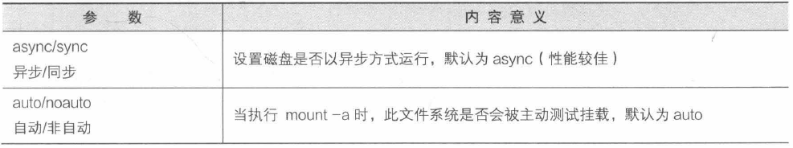
  
   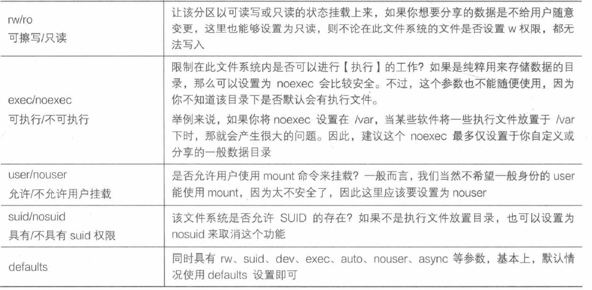

* 第五栏：能否被 dump 备份命令作用

  dump 是一个用来做为备份的命令，不过现在有太多的备份方案了，所以这个项目可以不要理会，直接输入 0 就好了。

* 第六栏：是否以 fsck 检验扇区

  早期启动的流程中，会有一段时间去检验本机的文件系统，看看文件系统是否完整（clean）。 不过这个方式使用的主要是通过 fsck 去做的，我们现在用的 xfs 文件系统就没有办法适用，因为 xfs 会自己进行检验，不需要额外进行这个动作，所以直接填 0 就好了。

/etc/fstab 是启动时的配置文件，不过，**<font color='red'>实际文件系统的挂载是记录到 /etc/mtab 与 /proc/mounts 这两个文件中的</font>**。每次我们在修改文件系统的挂载时，也会同时修改这两个文件。

#### 每次启动都将 /dev/sda4 自动挂载到 /data/xfs

1. 用 nano 将下面这—行写入 /etc/fstab 最后面中

   ```shell
   [root@centos tmp]# nano /etc/fstab
   /dev/sda4               /data/xfs               xfs     defaults	0 0
   ```

2. 测试—下刚刚我们写入 /etc/fstab 的语法有没有错误

   ```shell
   [root@centos tmp]# df
   Filesystem              1K-blocks    Used Available Use% Mounted on
   devtmpfs                   480812       0    480812   0% /dev
   tmpfs                      497836       0    497836   0% /dev/shm
   tmpfs                      497836   14948    482888   4% /run
   tmpfs                      497836       0    497836   0% /sys/fs/cgroup
   /dev/mapper/centos-root  10475520 4541160   5934360  44% /
   /dev/mapper/centos-home   5232640  119676   5112964   3% /home
   /dev/sda2                 1038336  175492    862844  17% /boot
   tmpfs                       99568      24     99544   1% /run/user/1000
   [root@centos tmp]# mount -a
   [root@centos tmp]# df /data/xfs
   Filesystem     1K-blocks  Used Available Use% Mounted on
   /dev/sda4        1038336 32992   1005344   4% /data/xfs
   # 可以看到 /dev/sda4 已经成功被挂载起来了，而且以后每次启动都会顺利地将此文件系统挂载起来
   ```

### 7.4.2 特殊设备 loop 挂载 （镜像文件不刻录就挂载使用）

####  挂载 CD/DVD 镜像文件

想象—下如果我们下载了Linux 或是其他所需的 CD/DVD 的镜像文件后，难道一定需要刻录成为光盘才能够使用该文件里面的数据吗？当然不是，**<font color='red'>我们可以通过loop 设备来挂载。</font>**

下面我们将整 个CentOS 7.x 的 DVD 镜像文件上传到测试机上面，然后利用这个文件来进行挂载：

```shell
[root@study ~]# ll -h /tmp/CentOS-7.0-1406-x86_64-DVD.iso
-rw-r--r--. 1 root root 3.9G Jul 7 2014 /tmp/CentOS-7.0-1406-x86_64-DVD.iso
# 看到上面的结果吧，这个文件就是镜像文件，文件非常的大
[root@study ~]# mkdir /data/centos_dvd
[root@study ~]# mount -o loop /tmp/CentOS-7.0-1406-x86_64-DVD.iso /data/centos_dvd
[root@study ~]# df /data/centos_dvd
Filesystem		1K-blocks			Used		Available		Use%		Mounted on
/dev/loop0 		4050860 			4050860 	0 				100% 		/data/centos_dvd
# .iso 镜像文件内的所有数据可以在 /data/centos_dvd 看到
[root@study ~]# ll /data/centos_dvd
total 60
-rw-r--r--. 1 500 502 14 Jul 5 2014 CentOS_BuildTag 		<== 看，这就是 DVD 的内容
drwxr-xr-x. 3 500 502 2048 Jul 4 2014 EFI
-rw-r--r--. 1 500 502 611 Jul 5 2014 EULA
-rw-r--r--. 1 500 502 18009 Jul 5 2014 GPL
drwxr-xr-x. 3 500 502 2048 Jul 4 2014 images
.....（下面省略）.....
[root@study ~]# umount /data/centos_dvd/
# 测试完成，记得将数据给他卸载
```

如此—来我们不需要将这个文件刻录成为光盘或是 DVD 就能够读取内部的数据了。换句话说，你也可以在这个文件内动手脚去修改文件。

#### ⭐ 建立大文件以制作 loop 设备文件

想—想，既然能够挂载 DVD 的镜像文件，那么我能不能制作出一个大文件，然后将这个文件格式化后挂载？

这是个有趣的操作，而且还能够帮助我们解决很多系统的分区不合理的清况。举例来说，如果当初在分区时，你只有划分出—个根目录，假设你已经没有多余的容量可以进行额外的分区，偏偏根目录的容量还很大。此时你就能够制作出—个大文件，然后将这个文件挂载，如此一来感觉上你就多了—个分区，用途非常广泛。

* **使用 dd 命令建立大型文件**

  现在在 /srv/loopdev 建立—个空的文件

  ```shell
  [root@centos ~]# dd if=/dev/zero of=/srv/loopdev bs=1M count=512
  512+0 records in			<==读入 512 条数据
  512+0 records out			<==输出 512 条数据
  536870912 bytes (537 MB) copied, 0.325843 s, 1.6 GB/s
  # 这个指令的简单意义如下：
  # if 是 input file ，输入文件。那个 /dev/zero 是会一直输出 0 的设备。
  # of 是 output file ，将一堆零写入到后面接的文件中。
  # bs 是每个 block 大小，就像文件系统那样的 block 意义；
  # count 则是总共几个 bs 的意思。所以 bs*count 就是这个文件的容量了
  [root@centos ~]# ll -h /srv/loopdev
  -rw-r--r--. 1 root root 512M Oct 11 19:45 /srv/loopdev
  ```

* **大型文件的格式化**

  默认 xfs 不能够格式化文件的，所以要格式化文件得要加入 -f 的参数才行

  ```shell
  [root@centos ~]# mkfs.xfs -f /srv/loopdev
  meta-data=/srv/loopdev           isize=512    agcount=4, agsize=32768 blks
           =                       sectsz=512   attr=2, projid32bit=1
           =                       crc=1        finobt=0, sparse=0
  data     =                       bsize=4096   blocks=131072, imaxpct=25
           =                       sunit=0      swidth=0 blks
  naming   =version 2              bsize=4096   ascii-ci=0 ftype=1
  log      =internal log           bsize=4096   blocks=855, version=2
           =                       sectsz=512   sunit=0 blks, lazy-count=1
  realtime =none                   extsz=4096   blocks=0, rtextents=0
  [root@centos ~]# blkid /srv/loopdev
  /srv/loopdev: UUID="f65387b4-7052-44d4-bf44-049ea522b962" TYPE="xfs" 
  ```

* **挂载**

  和挂载镜像文件类似，利用 mount 的特殊参数，-o loop 来处理

  ```shell
  [root@centos ~]# mount -o loop UUID="f65387b4-7052-44d4-bf44-049ea522b962" /mnt
  [root@centos ~]# df /mnt
  Filesystem     1K-blocks  Used Available Use% Mounted on
  /dev/loop0        520868 26436    494432   6% /mnt
  ```

通过这种方法，感觉上你就可以在不修改原有环境的情况下，在原分区中制作出你想要的分区。最后通过修改 /etc/fstab 将这个文件系统自动地挂载起来：

```shell
[root@centos ~]# nano /etc/fstab
/srv/loopdev            /data/file              xfs     defaults,loop   0 0
[root@centos ~]# umount /mnt
[root@centos ~]# mkdir /data/file
[root@centos ~]# mount -a
[root@centos ~]# df /data/file
Filesystem     1K-blocks  Used Available Use% Mounted on
/dev/loop0        520868 26436    494432   6% /data/file
```

## 7.5 内存交换分区（swap）之创建

CPU 所读取的数据都来自于内存，那么内存不足的时候，为了让后续的程序可以顺利运行，需要将暂不使用的程序与数据挪到**<font color='blue'>内存交换分区</font>**中，此时内存就会空出来给需要执行的程序加载。**<font color='red'>内存交换分区是用磁盘来暂时放置内存中的信息</font>**。

说实话，内存交换分区对目前的桌面计算机来讲，存在的意义已经不大了。这是因为目前的 x86 主机所含的内存实在都太大了(—般入门级至少也都有4GB) ，所以，我们的 Linux 系统大概都用不到内存交换分区这个玩意儿。不过，如果是针对**<font color='red'>服务器或是工作站</font>**这些常年运行的系统来说的话，那么，无论如何内存交换分区还是需要建立的。

另外，如果你的主机支持电源管理模式，也就是说你的 Linux 主机系统可以进入【**<font color='red'>休眠</font>**】模式的话，那么，运行当中的程序状态则会被记录到内存交换分区中，以作为【唤醒】主机的状态依据。另外，某些程序在运行时，本来就会利用内存交换分区的特性来存放一些数据，所以，内存交换分区还是需要建立的，只是不需要太大。

### 7.5.1 使用物理分区创建内存交换分区

#### 1. 在磁盘中划分一个分区给系统作为内存交换分区

```shell
[root@centos ~]# gdisk /dev/sda
Command (? for help): n
Partition number (6-128, default 6): 
First sector (34-83886046, default = 64903168) or {+-}size{KMGTP}: 
Last sector (64903168-83886046, default = 83886046) or {+-}size{KMGTP}: +512M 
Current type is 'Linux filesystem'
Hex code or GUID (L to show codes, Enter = 8300): 8200
Changed type of partition to 'Linux swap'

Command (? for help): p
Disk /dev/sda: 83886080 sectors, 40.0 GiB
Logical sector size: 512 bytes
Disk identifier (GUID): 5C427BD7-5D88-4633-A994-0782F6DCED14
Partition table holds up to 128 entries
First usable sector is 34, last usable sector is 83886046
Partitions will be aligned on 2048-sector boundaries
Total free space is 17936317 sectors (8.6 GiB)

Number  Start (sector)    End (sector)  Size       Code  Name
   1            2048            6143   2.0 MiB     EF02  
   2            6144         2103295   1024.0 MiB  0700  
   3         2103296        60708863   27.9 GiB    8E00  
   4        60708864        62806015   1024.0 MiB  8300  Linux filesystem
   5        62806016        64903167   1024.0 MiB  8300  Linux filesystem
   6        64903168        65951743   512.0 MiB   8200  Linux swap				# 重点是产生这个分区

Command (? for help): w

Final checks complete. About to write GPT data. THIS WILL OVERWRITE EXISTING
PARTITIONS!!

Do you want to proceed? (Y/N): y
OK; writing new GUID partition table (GPT) to /dev/sda.
Warning: The kernel is still using the old partition table.
The new table will be used at the next reboot.
The operation has completed successfully.

[root@centos ~]# partprobe
[root@centos ~]# lsblk
NAME            MAJ:MIN RM  SIZE RO TYPE MOUNTPOINT
sda               8:0    0   40G  0 disk 
├─sda1            8:1    0    2M  0 part 
├─sda2            8:2    0    1G  0 part /boot
├─sda3            8:3    0   28G  0 part 
│ ├─centos-root 253:0    0   10G  0 lvm  /
│ ├─centos-swap 253:1    0    1G  0 lvm  [SWAP]
│ └─centos-home 253:2    0    5G  0 lvm  /home
├─sda4            8:4    0    1G  0 part /data/xfs
├─sda5            8:5    0    1G  0 part 
└─sda6            8:6    0  512M  0 part 
sr0              11:0    1 1024M  0 rom  
loop0             7:0    0  512M  0 loop /data/file
```

#### 2. 格式化：利用【mkswap】命令就能够格式化该分区成为内存交换分区格式

```shell
[root@centos ~]# mkswap /dev/sda6
Setting up swapspace version 1, size = 524284 KiB
no label, UUID=b7228b5e-8a40-4880-b076-6ba15dcf74df
[root@centos ~]# blkid /dev/sda6
/dev/sda6: UUID="b7228b5e-8a40-4880-b076-6ba15dcf74df" TYPE="swap" PARTLABEL="Linux swap" PARTUUID="e3097259-940f-4b14-b0f9-72db8f463882" 
# 确定格式化成功,且使用 blkid 确实可以识别这个设备
```

#### 3. 开始观察与加载

```shell
[root@centos ~]# free
              total        used        free      shared  buff/cache   available
Mem:         995672      717588       80936       30404      197148      103800		# 物理内存
Swap:       1048572       26292     1022280											# swap 相关
	# 我有 995672K 的实体内存，使用 717588K 剩余 80936K ，使用掉的内存有 197148K 用在缓冲/高速缓存的用途中。
# 至于 swap 已经有 1048572K 了

[root@centos ~]# swapon /dev/sda6				<== 将该设备启动
[root@centos ~]# free
              total        used        free      shared  buff/cache   available
Mem:         995672      717564       80896       30404      197212      103840
Swap:       1572856       26292     1546564		<==有看到增加了没

[root@centos ~]# swapon -s
Filename				Type		Size	Used	Priority
/dev/dm-1                              	partition	1048572	26292	-2
/dev/sda6                              	partition	524284	0	-3
# 上面列出目前使用的 swap 设备有哪些的意思

[root@study ~]# nano /etc/fstab
/dev/sda6               swap                    swap    defaults	0 0
# 当然要写入配置文件，只不过不是文件系统，所以没有挂载点,第二个字段写入 swap 即可。
```

### 7.5.2 使用文件创建内存交换文件

如果是在物理分区无法支持的环境下，此时前—小节提到的 loop 设备创建方法就派上用场了。与物理分区相比，这个方法只是利用 dd 去创建一个大文件而已。接下来我们就通过文件创建的方法建立一个 128MB 的内存交换文件。

#### 1. 使用 dd 这个命令来新增一个 128MB 的文件在 /tmp 下面

```shell
[root@centos ~]# dd if=/dev/zero of=/tmp/swap bs=1M count=128
128+0 records in
128+0 records out
134217728 bytes (134 MB) copied, 0.145657 s, 921 MB/s
[root@centos ~]# ll -h /tmp/swap
-rw-r--r--. 1 root root 128M Oct 11 20:20 /tmp/swap
```

#### 2. 使用 mkswap 将 /tmp/swap 这个文件格式化为 swap 的文件格式

```shell
[root@centos ~]# mkswap /tmp/swap
Setting up swapspace version 1, size = 131068 KiB
no label, UUID=2ab98972-b1da-474d-a23e-88745d3c1f1e
```

#### 3. 使用 swapon 来将 /tmp/swap 启动

```shell
[root@centos ~]# swapon /tmp/swap
swapon: /tmp/swap: insecure permissions 0644, 0600 suggested.
[root@centos ~]# swapon -s
Filename				Type		Size	Used	Priority
/dev/dm-1                              	partition	1048572	26292	-2
/dev/sda6                              	partition	524284	0	-3
/tmp/swap                              	file	131068	0	-4
```

#### 4. 使用 swapoff 关掉 swap file，并设置自动启用

```shell
[root@centos ~]# nano /etc/fstab
/tmp/swap	        swap	                swap	defaults	0 0

[root@centos ~]# swapoff /tmp/swap /dev/sda6
[root@centos ~]# swapon -s
Filename				Type		Size	Used	Priority
/dev/dm-1                              	partition	1048572	26004	-2
# 确定已经回复到原本的状态了，然后准备来测试

[root@centos ~]# swapon -a
swapon: /tmp/swap: insecure permissions 0644, 0600 suggested.
[root@centos ~]# swapon -s
Filename				Type		Size	Used	Priority
/dev/dm-1                              	partition	1048572	26004	-2
/dev/sda6                              	partition	524284	0	-3
/tmp/swap                              	file	131068	0	-4
```

# 第8章 文件与文件系统的压缩

## 8.2 Linux 系统常见的压缩命令

Linux里常见的压缩文件扩展名：

```shell
*.Z 		compress 程序压缩的文件；
*.zip 		zip 程序压缩的文件；
*.gz 		gzip 程序压缩的文件；
*.bz2 		bzip2 程序压缩的文件；
*.xz 		xz 程序压缩的文件；
*.tar 		tar 程序打包的数据，并没有压缩过；
*.tar.gz 	tar 程序打包的文件，其中并且经过 gzip 的压缩
*.tar.bz2 	tar 程序打包的文件，其中并且经过 bzip2 的压缩
*.tar.xz 	tar 程序打包的文件，其中并且经过 xz 的压缩
```

### 8.2.1 gzip，zcat/zmore/zless/zgrep

gzip 可以说是应用最广的压缩命令了，目前 gzip 可以解开 compress, zip 与 gzip 等软件所压缩的文件。 至于 gzip 所创建的压缩文件为 *.gz 

```shell
[dmtsai@study ~]$ gzip [-cdtv#] 文件名
[dmtsai@study ~]$ zcat 文件名.gz
选项与参数：
-c ：将压缩的数据输出到屏幕上，可通过数据流重导向来处理；
-d ：解压缩；
-t ：可以用来检验一个压缩文件的一致性，看看文件有无错误；
-v ：可以显示出原文件/压缩文件的压缩比等信息；
-# ：# 为数字的意思，代表压缩等级，-1 最快，但是压缩比最差、-9 最慢，但是压缩比最好！默认是 -6

范例一：找出 /etc 下面 （不含子目录） 容量最大的文件，并将它复制到 /tmp ，然后以 gzip 压缩
[dmtsai@study ~]$ ls -ldSr /etc/*
.....（前面省略）.....
-rw-r--r--. 1 root root 25213 Jun 10 2014 /etc/dnsmasq.conf
-rw-r--r--. 1 root root 69768 May 4 17:55 /etc/ld.so.cache
-rw-r--r--. 1 root root 670293 Jun 7 2013 /etc/services
[dmtsai@study ~]$ cd /tmp
[dmtsai@study tmp]$ cp /etc/services .
[dmtsai@study tmp]$ gzip -v services
services: 79.7% -- replaced with services.gz
[dmtsai@study tmp]$ ll /etc/services /tmp/services*
-rw-r--r--. 1 root root 670293 Jun 7 2013 /etc/services
-rw-r--r--. 1 dmtsai dmtsai 136088 Jun 30 18:40 /tmp/services.gz
```

当你使用gzip进行压缩时，在默认的状态下原本的文件会被压缩成为.gz后缀的文件，**源文件就不再存在了**。

```shell
范例二：由于 services 是文本文件，请将范例一的压缩文件的内容读出来！
[dmtsai@study tmp]$ zcat services.gz
# 由于 services 这个原本的文件是是文本文件，因此我们可以尝试使用 zcat/zmore/zless 去读取
# 此时屏幕上会显示 servcies.gz 解压缩之后的原始文件内容

范例三：将范例一的文件解压缩
[dmtsai@study tmp]$ gzip -d services.gz
# 与 gzip 相反， gzip -d 会将原本的 .gz 删除，回复到原本的 services 文件。

范例四：将范例三解开的 services 用最佳的压缩比压缩，并保留原本的文件
[dmtsai@study tmp]$ gzip -9 -c services > services.gz

范例五：由范例四再次创建的 services.gz 中，找出 http 这个关键字在哪几行？
[dmtsai@study tmp]$ zgrep -n 'http' services.gz
14:# http://www.iana.org/assignments/port-numbers
89:http 80/tcp www www-http # WorldWideWeb HTTP
90:http 80/udp www www-http # HyperText Transfer Protocol
.....（下面省略）.....
```

* -c 与 > 的使用

  -c可以将原本要转成压缩文件的数据内容，将它变成文字类型从屏幕输出，然后我们可以通过 > 这个符号，将原本应该由屏幕输出的数据，转成输出到文件而不是屏幕，所以就能够建立压缩文件了。

* zcat/zmore/zless 可以对应于cat/more/less 的方式来读取纯文本文件被压缩后的压缩文件

### 8.2.2 bzip2, bzcat/bzmore/bzless/bzgrep

若说 gzip 是为了取代 compress 并提供更好的压缩比而成立的，那么 bzip2 则是为了取代 gzip 并提供更佳的压缩比而来的。

```shell
[dmtsai@study ~]$ bzip2 [-cdkzv#] 文件名
[dmtsai@study ~]$ bzcat 文件名.bz2
选项与参数：
-c ：将压缩的过程产生的数据输出到屏幕上
-d ：解压缩
-k ：保留原始文件，而不会删除原始的文件
-z ：压缩 （默认值，可以不加）
-v ：可以显示出原文件/压缩文件的压缩比等信息；
-# ：与 gzip 同样的，都是在计算压缩比的参数， -9 最佳， -1 最快！

范例一：将刚刚 gzip 范例留下来的 /tmp/services 以 bzip2 压缩
[dmtsai@study tmp]$ bzip2 -v services
services: 5.409:1, 1.479 bits/Byte, 81.51% saved, 670293 in, 123932 out.
[dmtsai@study tmp]$ ls -l services*
-rw-r--r--. 1 dmtsai dmtsai 123932 Jun 30 18:40 services.bz2
-rw-rw-r--. 1 dmtsai dmtsai 135489 Jun 30 18:46 services.gz
# 此时 services 会变成 services.bz2 之外，你也可以发现 bzip2 的压缩比要较 gzip 好
# 压缩率由 gzip 的 79% 提升到 bzip2 的 81% 

范例二：将范例一的文件内容读出来！
[dmtsai@study tmp]$ bzcat services.bz2

范例三：将范例一的文件解压缩
[dmtsai@study tmp]$ bzip2 -d services.bz2

范例四：将范例三解开的 services 用最佳的压缩比压缩，并保留原本的文件
[dmtsai@study tmp]$ bzip2 -9 -c services > services.bz2
```

### 8.2.3 xz, xzcat/xzmore/xzless/xzgrep

xz 是压缩比更高的软件。

```shell
[dmtsai@study ~]$ xz [-dtlkc#] 文件名
[dmtsai@study ~]$ xcat 文件名.xz
选项与参数：
-d ：解压缩
-t ：测试压缩文件的完整性，看有没有错误
-l ：列出压缩文件的相关信息
-k ：保留原本的文件不删除
-c ：同样的，就是将数据由屏幕上输出的意思
-# ：同样的，也有较佳的压缩比的意思

范例一：将刚刚由 bzip2 所遗留下来的 /tmp/services 通过 xz 来压缩！
[dmtsai@study tmp]$ xz -v services
services （1/1）
100 % 97.3 KiB / 654.6 KiB = 0.149
[dmtsai@study tmp]$ ls -l services*
-rw-rw-r--. 1 dmtsai dmtsai 123932 Jun 30 19:09 services.bz2
-rw-rw-r--. 1 dmtsai dmtsai 135489 Jun 30 18:46 services.gz
-rw-r--r--. 1 dmtsai dmtsai 99608 Jun 30 18:40 services.xz
# 容量又进一步下降的更多

范例二：列出这个压缩文件的信息，然后读出这个压缩文件的内容
[dmtsai@study tmp]$ xz -l services.xz
Strms Blocks Compressed Uncompressed Ratio Check Filename
1 1 97.3 KiB 654.6 KiB 0.149 CRC64 services.xz
# 可以列出这个文件的压缩前后的容量
[dmtsai@study tmp]$ xzcat services.xz

范例三：将他解压缩吧
[dmtsai@study tmp]$ xz -d services.xz

范例四：保留原文件的文件名，并且创建压缩文件！
[dmtsai@study tmp]$ xz -k services
```

## 8.3 打包命令： tar
前一小节谈到的命令大多仅能针对单一文件来进行压缩，虽然 gzip，bizip2，xz也能够针对目录来进行压缩，但是，它指的是**将目录内的所有文件分别进行压缩**的操作。这种将多个文件或目录包成一个大文件的命令功能，我们称它是一种**打包命令**。

```shell
[dmtsai@study ~]$ tar [-z|-j|-J] [cv] [-f 待建立的新文件名] filename... <==打包与压缩
[dmtsai@study ~]$ tar [-z|-j|-J] [tv] [-f 既有的 tar文件名] <==查看文件名
[dmtsai@study ~]$ tar [-z|-j|-J] [xv] [-f 既有的 tar文件名] [-C 目录] <==解压缩
选项与参数：
-c ：建立打包文件，可搭配 -v 来查看过程中被打包的文件名（filename）
-t ：查看打包文件的内容含有哪些文件名，重点在察看“文件名”
-x ：解打包或解压缩的功能，可以搭配 -C （大写） 在特定目录解开

特别留意的是， -c, -t, -x 不可同时出现在一串命令行中。
-z ：通过 gzip 的支持进行压缩/解压缩：此时文件名最好为 *.tar.gz
-j ：通过 bzip2 的支持进行压缩/解压缩：此时文件名最好为 *.tar.bz2
-J ：通过 xz 的支持进行压缩/解压缩：此时文件名最好为 *.tar.xz
特别留意， -z, -j, -J 不可以同时出现在一串命令行中

-v ：在压缩/解压缩的过程中，将正在处理的文件名显示出来
-f filename：-f 后面要立刻接要被处理的文件名，建议 -f 单独写一个选项（比较不会忘记）
-C 目录 ：这个选项用在解压缩，若要在特定目录解压缩，可以使用这个选项。

其他后续练习会使用到的选项介绍：
-p（小写） ：保留备份数据的原本权限与属性，常用于备份（-c）重要的配置文件
-P（大写） ：保留绝对路径，亦即允许备份数据中含有根目录存在之意；
--exclude=FILE：在压缩的过程中，不要将 FILE 打包
```

其实最简单的使用tar就只要记住下面的命令即可

```shell
压　缩：tar -jcv -f filename.tar.bz2 要被压缩的文件或目录名称
查　询：tar -jtv -f filename.tar.bz2
解压缩：tar -jxv -f filename.tar.bz2 -C 欲解压缩的目录
```

注意 tar 并不会主动的产生建立的文件名，我们要通过 -f 选项自定义，所以扩展名就显得很重要了。

#### 使用 tar 加入 -z, -j 或 -J 的参数备份 /etc/ 目录

```shell
[dmtsai@study ~]$ su - # 因为备份 /etc 需要 root 的权限，否则会出现一堆错误
[root@study ~]# time tar -zpcv -f /root/etc.tar.gz /etc
tar: Removing leading `/' from member names <==注意这个警告信息
/etc/
....（中间省略）....
/etc/hostname
/etc/aliases.db
real 0m0.799s # 多了 time 会显示程序运行的时间！看 real 就好了！花去了 0.799s
user 0m0.767s
sys 0m0.046s
# 由于加上 -v 这个选项，因此正在作用中的文件名就会显示在屏幕上。
# 至于 -p 的选项，重点在于“保留原本文件的权限与属性”之意。

[root@study ~]# time tar -jpcv -f /root/etc.tar.bz2 /etc
....（前面省略）....
real 0m1.913s
user 0m1.881s
sys 0m0.038s

[root@study ~]# time tar -Jpcv -f /root/etc.tar.xz /etc
....（前面省略）....
real 0m9.023s
user 0m8.984s
sys 0m0.086s
# 使用了 -J 时，会花更多时间

[root@study ~]# ll /root/etc*
-rw-r--r--. 1 root root 6721809 Jul 1 00:16 /root/etc.tar.bz2
-rw-r--r--. 1 root root 7758826 Jul 1 00:14 /root/etc.tar.gz
-rw-r--r--. 1 root root 5511500 Jul 1 00:16 /root/etc.tar.xz
[root@study ~]# du -sm /etc
28 /etc # 实际目录约占有 28MB 的意思！
```

#### 查看 tar 文件的数据内容 （可查看文件名）

```shell
[root@study ~]# tar -jtv -f /root/etc.tar.bz2
....（前面省略）....
-rw-r--r-- root/root 131 2015-05-25 17:48 etc/locale.conf
-rw-r--r-- root/root 19 2015-05-04 17:56 etc/hostname
-rw-r--r-- root/root 12288 2015-05-04 17:59 etc/aliases.db
```

加上 -v 这个选项，详细的文件权限/属性都会被列出来，如果只是想要知道文件名而已，那么就将 -v 拿掉即可。

从上面的数据我们可以发现，每个文件名都没有了根目录。删掉根目录是为了安全，在tar所记录的文件名就是解压缩后实际文件名。如果拿掉了根目录，假设你将备份在 /tmp 解开，那么解压缩的文件名就会变成【/tmp/etc/xxx】。但是如果没有去掉根目录，解压缩后的文件名就会是绝对路径，即解压缩后的数据一定会被放置到 /etc/xxx 去，如此一来，可能会覆盖原本 etc 下面的数据。

如果你确定要备份根目录到 tar 的文件中，那可以使用 -P（大写）这个选项

```shell
范例：将文件名中的（根）目录也备份下来，并查看一下备份文件的内容文件名
[root@study ~]# tar -jpPcv -f /root/etc.and.root.tar.bz2 /etc
[root@study ~]# tar -jtf /root/etc.and.root.tar.bz2
/etc/locale.conf
/etc/hostname
/etc/aliases.db
# 这次查看文件名不含 -v 选项，所以仅有文件名而已，没有详细属性/权限等参数。
```

#### 将备份的数据解压缩，并考虑特定目录的解压缩动作 （-C 选项的应用）

```shell
[root@study ~]# tar -jxv -f /root/etc.tar.bz2
[root@study ~]# ll
....（前面省略）....
drwxr-xr-x. 131 root root 8192 Jun 26 22:14 etc
....（后面省略）....
```

此时打包文件会在本目录下进行解压缩操作，利用 -C 可以指定解压缩的目录

```shell
[root@study ~]# tar -jxv -f /root/etc.tar.bz2 -C /tmp
[root@study ~]# ll /tmp
....（前面省略）....
drwxr-xr-x. 131 root root 8192 Jun 26 22:14 etc
....（后面省略）....
```

#### 仅解开单一文件的方法

解开打包文件内的其中一个文件

```shell
# 1. 先找到我们要的文件名，假设解开 shadow 文件：
[root@study ~]# tar -jtv -f /root/etc.tar.bz2 | grep 'shadow'
---------- root/root 721 2015-06-17 00:20 etc/gshadow
---------- root/root 1183 2015-06-17 00:20 etc/shadow-
---------- root/root 1210 2015-06-17 00:20 etc/shadow <==这是我们要的
---------- root/root 707 2015-06-17 00:20 etc/gshadow-
# 2. 将该文件解开,语法与实际做法如下：
[root@study ~]# tar -jxv -f /root/etc.tar.bz2 etc/shadow
etc/shadow
[root@study ~]# ll etc
total 4
----------. 1 root root 1210 Jun 17 00:20 shadow
# 此时只会解开一个文件而已，不过，重点是那个文件名，你要找到正确的文件名。
# 在本例中，你不能写成 /etc/shadow ，因为记录在 etc.tar.bz2 内的并没有 / 
```

#### 打包某目录，但不含该目录下的某些文件

假设我们想要打包 /etc/ /root 这几个重要的目录，但却不想要打包 /root/etc* 开头的文件，而且假设这个新的打包文件要放置成为 /root/system.tar.bz2 ，当然这个文件自己不要打包自己 （因为这个文件放置在 /root 下面），此时我们可以通过 --exclude 的帮忙， 那个 exclude 就是不包含的意思：

```shell
[root@study ~]# tar -jcv -f /root/system.tar.bz2 --exclude=/root/etc* \
> --exclude=/root/system.tar.bz2 /etc /root
# 一条命令如果想要两行输入时，最后面加上反斜杠 \ ，并立刻按下[Enter]就好了
```

#### 仅备份比某个时刻还要新的文件

有两个选项，一个是“ --newer ”另一个就是“ --newer-mtime ”，当使用“ --newer ”时，表示后续的日期包含“ mtime 与 ctime ”，而 “--newer-mtime” 则仅是 mtime 而已

```shell
# 1. 先由 find 找出比 /etc/passwd 还要新的文件
[root@study ~]# find /etc -newer /etc/passwd
....（过程省略）....
# 此时会显示出比 /etc/passwd 这个文件的 mtime 还要新的文件名
[root@study ~]# ll /etc/passwd
-rw-r--r--. 1 root root 2092 Jun 17 00:20 /etc/passwd
# 2. 好了，那么使用 tar 来进行打包吧！日期为上面看到的 2015/06/17
[root@study ~]# tar -jcv -f /root/etc.newer.then.passwd.tar.bz2 \
> --newer-mtime="2015/06/17" /etc/*
tar: Option --newer-mtime: Treating date `2015/06/17' as 2015-06-17 00:00:00
tar: Removing leading `/' from member names
/etc/abrt/
....（中间省略）....
/etc/alsa/
/etc/yum.repos.d/
....（中间省略）....
tar: /etc/yum.repos.d/CentOS-fasttrack.repo: file is unchanged; not dumped
# 最后行显示的是“没有被备份的”，亦即 not dumped 的意思！
# 3. 显示出文件即可
[root@study ~]# tar -jtv -f /root/etc.newer.then.passwd.tar.bz2 | grep -v '/$'
# 通过这个命令可以调用出 tar.bz2 内的结尾非 / 的文件名,就是我们要的
```

#### 基本名称： tarfile, tarball

如果仅是打包而已，就是“ tar -cv -f file.tar ”，这个文件我们称呼为 tarfile。

如果还有进行压缩的支持，例如“ tar -jcv -f file.tar.bz2 ”时，我们就称呼为 tarball。

此外，tar 除了可以将数据打包成为文件之外，还能够将文件打包到某些特别的设备中去，举例来说， 磁带机（tape） 就是一个常见的例子。磁带由于是一次性读取/写入的设备，因此我们不能够使用类似 cp 等指令来复制， 那如果想要将 /home, /root, /etc 备份到磁带（/dev/st0） 时，就可以使用：

“tar -cv -f /dev/st0 /home /root /etc”

#### 特殊应用：利用管线命令与数据流

```shell
# 1. 将 /etc 整个目录一边打包一边在 /tmp 解开
[root@study ~]# cd /tmp
[root@study tmp]# tar -cvf - /etc | tar -xvf -
# 这个动作有点像是 cp -r /etc /tmp ,依旧是有其用途的
# 要注意的地方在于输出文件变成 - 而输入文件也变成 - ，又有一个 | 存在
# 这分别代表 standard output, standard input 与管线命令
# 简单的想法中，你可以将 - 想成是在内存中的一个设备（缓冲区）。
```

## 8.4 XFS 文件系统的备份与还原

#### 8.4.1 XFS 文件系统备份 xfsdump

xfsdump 除了可以进行文件系统的*完整备份*之外，还可以进行*增量备份*。假设你的 /home 是独立的一个文件系统，那你在第一次使用 xfsdump 进行完整备份后，等过一段时间的文件系统自然运行后， 你再进行第二次 xfsdump 时，就可以选择增量备份了，此时新备份的数据只会记录与第一次完整备份有所差异的文件。

 

上方的“实时文件系统”是一直随着时间而变化的数据，例如在 /home 里面的文件数据会一直变化一样。 而下面的方块则是 xfsdump 备份起来的数据，第一次备份一定是完整备份，完整备份在 xfsdump 当中被定义为 level 0 ，等到第二次备份时，/home 文件系统内的数据已经与 level 0 不一样了，而 level 1 仅只是比较目前的文件系统与 level 0 之间的差异后，备份有变化过的文件而已。**至于 level 2 则是与 level 1 进行比较**。

使用 xfsdump 的限制：

* xfsdump 不支持没有挂载的文件系统备份
* xfsdump 必须使用 root 的权限才能操作
* xfsdump 只能备份 XFS 文件系统
* xfsdump 备份下来的数据 （文件或存储媒介） 只能让 xfsrestore 解析
* xfsdump 是通过文件系统的 UUID 来分辨各个备份文件的，因此不能备份两个具有相同 UUID 的文件系统

```shell
[root@study ~]# xfsdump [-L S_label] [-M M_label] [-l #] [-f 备份文件] 待备份数据
[root@study ~]# xfsdump -I
选项与参数：
-L ：xfsdump 会纪录每次备份的 session 标头，这里可以填写针对此文件系统的简易说明
-M ：xfsdump 可以纪录存储媒介的标头，这里可以填写此媒介的简易说明
-l ：是 L 的小写，就是指定等级，有 0~9 共 10 个等级 （默认为 0，即完整备份）
-f ：有点类似 tar ，后面接产生的文件，亦可接例如 /dev/st0 设备文件名或其他一般文件文件名等
-I ：从 /var/lib/xfsdump/inventory 列出目前备份的信息状态
```

##### 用 xfsdump 备份完整的文件系统**

```shell
# 1. 先确定 /boot 是独立的文件系统
[root@study ~]# df -h /boot
Filesystem Size Used Avail Use% Mounted on
/dev/vda2 1014M 131M 884M 13% /boot # 挂载 /boot 的是 /dev/vda 设备
# 确实是独立的文件系统喔 /boot 是挂载点
# 2. 将完整备份的文件名记录成为 /srv/boot.dump ：
[root@study ~]# xfsdump -l 0 -L boot_all -M boot_all -f /srv/boot.dump /boot
xfsdump -l 0 -L boot_all -M boot_all -f /srv/boot.dump /boot
xfsdump: using file dump （drive_simple） strategy
xfsdump: version 3.1.4 （dump format 3.0） - type ^C for status and control
xfsdump: level 0 dump of study.centos.vbird:/boot 			# 开始备份本机/boot
xfsdump: dump date: Wed Jul 1 18:43:04 2015 # 备份的时间
xfsdump: session id: 418b563f-26fa-4c9b-98b7-6f57ea0163b1 	# 这次dump的ID
xfsdump: session label: "boot_all" 							# 简单给予一个名称
xfsdump: ino map phase 1: constructing initial dump list 	# 开始备份程序
xfsdump: ino map phase 2: skipping （no pruning necessary）
xfsdump: ino map phase 3: skipping （only one dump stream）
xfsdump: ino map construction complete
xfsdump: estimated dump size: 103188992 Bytes
xfsdump: creating dump session media file 0 （media 0, file 0）
xfsdump: dumping ino map
xfsdump: dumping directories
xfsdump: dumping non-directory files
xfsdump: ending media file
xfsdump: media file size 102872168 Bytes
xfsdump: dump size （non-dir files） : 102637296 Bytes
xfsdump: dump complete: 1 seconds elapsed
xfsdump: Dump Summary:
xfsdump: stream 0 /srv/boot.dump OK （success）
xfsdump: Dump Status: SUCCESS
# 在命令的执行方面，你也可以不加 -L 及 -M 的，只是那就会进入交互模式，要求你 enter！
[root@study ~]# ll /srv/boot.dump
-rw-r--r--. 1 root root 102872168 Jul 1 18:43 /srv/boot.dump
[root@study ~]# ll /var/lib/xfsdump/inventory
-rw-r--r--. 1 root root 5080 Jul 1 18:43 506425d2-396a-433d-9968-9b200db0c17c.StObj
-rw-r--r--. 1 root root 312 Jul 1 18:43 94ac5f77-cb8a-495e-a65b-2ef7442b837c.InvIndex
-rw-r--r--. 1 root root 576 Jul 1 18:43 fstab
# 使用了 xfsdump 之后才会有上述 /var/lib/xfsdump/inventory 内的文件产生
```

##### 用 xfsdump 进行增量备份 

```shell
# 0. 看一下有没有任何文件系统被 xfsdump 过的数据？
[root@study ~]# xfsdump -I
file system 0:
fs id: 94ac5f77-cb8a-495e-a65b-2ef7442b837c
session 0:
mount point: study.centos.vbird:/boot
device: study.centos.vbird:/dev/vda2
time: Wed Jul 1 18:43:04 2015
session label: "boot_all"
session id: 418b563f-26fa-4c9b-98b7-6f57ea0163b1
level: 0
resumed: NO
subtree: NO
streams: 1
stream 0:
pathname: /srv/boot.dump
start: ino 132 offset 0
end: ino 2138243 offset 0
interrupted: NO
media files: 1
media file 0:
mfile index: 0
mfile type: data
mfile size: 102872168
mfile start: ino 132 offset 0
mfile end: ino 2138243 offset 0
media label: "boot_all"
media id: a6168ea6-1ca8-44c1-8d88-95c863202eab
xfsdump: Dump Status: SUCCESS
# 我们可以看到目前仅有一个 session 0 的备份数据而已,而且是 level 0
# 1. 创建一个大约 10 MB 的文件在 /boot 内：
[root@study ~]# dd if=/dev/zero of=/boot/testing.img bs=1M count=10
10+0 records in
10+0 records out
10485760 Bytes （10 MB） copied, 0.166128 seconds, 63.1 MB/s
# 2. 开始创建差异备份文件，此时我们使用 level 1 吧：
[root@study ~]# xfsdump -l 1 -L boot_2 -M boot_2 -f /srv/boot.dump1 /boot
....（中间省略）....
[root@study ~]# ll /srv/boot*
-rw-r--r--. 1 root root 102872168 Jul 1 18:43 /srv/boot.dump
-rw-r--r--. 1 root root 10510952 Jul 1 18:46 /srv/boot.dump1
# 看看文件大小，岂不是就是刚刚我们所创建的那个大文件的容量吗？
# 3. 最后再看一下是否有记录 level 1 备份的时间点呢？
[root@study ~]# xfsdump -I
file system 0:
fs id: 94ac5f77-cb8a-495e-a65b-2ef7442b837c
session 0:
mount point: study.centos.vbird:/boot
device: study.centos.vbird:/dev/vda2
....（中间省略）....
session 1:
mount point: study.centos.vbird:/boot
device: study.centos.vbird:/dev/vda2
time: Wed Jul 1 18:46:21 2015
session label: "boot_2"
session id: c71d1d41-b3bb-48ee-bed6-d77c939c5ee8
level: 1
resumed: NO
subtree: NO
streams: 1
stream 0:
pathname: /srv/boot.dump1
start: ino 455518 offset 0
....（下面省略）....
```

#### 8.4.2 XFS 文件系统还原 xfsrestore

```shell
[root@study ~]# xfsrestore -I <==用来查看备份文件
[root@study ~]# xfsrestore [-f 备份文件] [-L S_label] [-s] 待复原目录 <==单一文件全系统恢复
[root@study ~]# xfsrestore [-f 备份文件] -r 待复目录 <==通过增量备份文件来恢复系统
[root@study ~]# xfsrestore [-f 备份文件] -i 待复目录 <==进入交互模式
选项与参数：
-I ：跟 xfsdump 相同的输出。可查询备份数据，包括 Label 名称与备份时间等
-f ：后面接的就是备份文件，企业界很有可能会接 /dev/st0 等磁带机，我们这里接文件名。
-L ：就是 Session 的 Label name ，可用 -I 查询到的数据，在这个选项后输入
-s ：需要接某特定目录，亦即仅恢复某一个文件或目录之意
-r ：如果是用文件来存储备份数据，那这个就不需要使用。如果是一个磁带内有多个文件，需要这东西来完成累积恢复
-i ：进入交互模式，高级管理员使用的，一般我们不太需要操作它
```

##### 用 xfsrestore 观察 xfsdump 后的备份数据内容

```shell
[root@study ~]# xfsrestore -I
file system 0:
fs id: 94ac5f77-cb8a-495e-a65b-2ef7442b837c
session 0:
mount point: study.centos.vbird:/boot
device: study.centos.vbird:/dev/vda2
time: Wed Jul 1 18:43:04 2015
session label: "boot_all"
session id: 418b563f-26fa-4c9b-98b7-6f57ea0163b1
level: 0
pathname: /srv/boot.dump
mfile size: 102872168
media label: "boot_all"
session 1:
mount point: study.centos.vbird:/boot
device: study.centos.vbird:/dev/vda2
time: Wed Jul 1 18:46:21 2015
session label: "boot_2"
session id: c71d1d41-b3bb-48ee-bed6-d77c939c5ee8
level: 1
pathname: /srv/boot.dump1
mfile size: 10510952
media label: "boot_2"
xfsrestore: Restore Status: SUCCESS
# 我们可以看到这个文件系统是 /boot 载点，然后有两个备份，一个 level 0 一个 level 1。
# 也看到这两个备份的数据的内容大小,更重要的，就是那个 session label
```

##### 简单恢复 level 0 的文件系统

```shell
# 1. 直接将数据给它覆盖回去即可。
[root@study ~]# xfsrestore -f /srv/boot.dump -L boot_all /boot
xfsrestore: using file dump （drive_simple） strategy
xfsrestore: version 3.1.4 （dump format 3.0） - type ^C for status and control
xfsrestore: using online session inventory
xfsrestore: searching media for directory dump
xfsrestore: examining media file 0
xfsrestore: reading directories
xfsrestore: 8 directories and 327 entries processed
xfsrestore: directory post-processing
xfsrestore: restoring non-directory files
xfsrestore: restore complete: 1 seconds elapsed
xfsrestore: Restore Summary:
xfsrestore: stream 0 /srv/boot.dump OK （success） # 是否是正确的文件？
xfsrestore: Restore Status: SUCCESS
# 2. 将备份数据在 /tmp/boot 下面解开！
[root@study ~]# mkdir /tmp/boot
[root@study ~]# xfsrestore -f /srv/boot.dump -L boot_all /tmp/boot
```

##### 恢复增量备份数据

```shell
# 继续恢复 level 1 到 /tmp/boot 当中！
[root@study ~]# xfsrestore -f /srv/boot.dump1 /tmp/boot
```

##### 仅还原部分文件的 xfsrestore 交互模式

刚刚的 -s 可以接部分数据来还原，但是，如果我们根本不知道备份文件里面有啥文件，就可以通过 -i 这个交互界面来完成。

```shell
# 1. 先进入备份文件内，找出需要备份的文件，同时预计还原到 /tmp/boot3 当中
[root@study ~]# mkdir /tmp/boot3
[root@study ~]# xfsrestore -f /srv/boot.dump -i /tmp/boot3
========================== subtree selection dialog ==========================
the following commands are available:
pwd
ls [ <path> ]
cd [ <path> ]
add [ <path> ] # 可以加入恢复文件列表中
delete [ <path> ] # 从恢复列表拿掉文件名，并非删除
extract # 开始恢复操作
quit
help
-> ls
	455517 initramfs-3.10.0-229.el7.x86_64kdump.img
	138 initramfs-3.10.0-229.el7.x86_64.img
	141 initrd-plymouth.img
	140 vmlinuz-0-rescue-309eb890d09f440681f596543d95ec7a
	139 initramfs-0-rescue-309eb890d09f440681f596543d95ec7a.img
	137 vmlinuz-3.10.0-229.el7.x86_64
	136 symvers-3.10.0-229.el7.x86_64.gz
	135 config-3.10.0-229.el7.x86_64
	134 System.map-3.10.0-229.el7.x86_64
	133 .vmlinuz-3.10.0-229.el7.x86_64.hmac
	1048704 grub2/
	131 grub/
-> add grub
-> add grub2
-> add config-3.10.0-229.el7.x86_64
-> extract
[root@study ~]# ls -l /tmp/boot3
-rw-r--r--. 1 root root 123838 Mar 6 19:45 config-3.10.0-229.el7.x86_64
drwxr-xr-x. 2 root root 26 May 4 17:52 grub
drwxr-xr-x. 6 root root 104 Jun 25 00:02 grub2
# 就只会有 3 个文件名被恢复，当然，如果文件名是目录，那下面的子文件当然也会被还原回来的
```

## 8.5 光盘写入工具

命令行模式的刻录操作通常是：

* 先将所需备份的数据创建成为一个镜像文件（iso），利用 mkisofs 命令来处理
* 将该镜像文件刻录至CD或DVD当中，利用cdrecord命令来处理

### 8.5.1 mkisofs：创建镜像文件

#### 制作一般数据光盘镜像文件

```shell
[root@study ~]# mkisofs [-o 镜像文件] [-Jrv] [-V vol] [-m file] 待备份文件... \
> -graft-point isodir=systemdir ...
选项与参数：
-o ：后面接你想要产生的那个镜像文件文件名。
-J ：产生较兼容于 windows 机器的文件名结构，可增加文件名长度到 64 个 unicode 字符
-r ：通过 Rock Ridge 产生支持 Unix/Linux 的文件数据，可记录较多的信息（如 UID/GID等） ；
-v ：显示创建 ISO文件的过程
-V vol ：创建 Volume，有点像 Windows 在文件资源管理器内看到的 CD 卷标
-m file ：-m 为排除文件 （exclude） 的意思，后面的文件不备份到镜像文件中，也能使用 * 通配符
-graft-point：graft有转嫁或移植的意思，相关内容在下面文章内说明。
```

光盘的格式一般称为 iso9660 ，这种格式一般仅支持旧版的 DOS 文件名，亦即文件名只能以 8.3 （文件名8个字符，扩展名3个字符） 的方式存在。如果加上 -r 的选项之后，那么文件信息能够被记录的比较完整，可包括UID/GID与权限等等！ 所以，记得加这个 -r 的选项。

一般默认的情况下，所有要被加到镜像文件中的文件都会被放置到镜像文件中的根目录， 如此一来可能会造成刻录后的文件分类不易的情况。所以，你可以使用 -graft-point 这个选项，当你使用这个选项之后， 可以利用如下的方法来定义位于镜像文件中的目录：

* 镜像文件中的目录所在=实际 Linux 文件系统的目录所在
* /movies/=/srv/movies/ （在 Linux 的 /srv/movies 内的文件，加至镜像文件中的 /movies/ 目录）
* /linux/etc=/etc （将 Linux 中的 /etc/ 内的所有数据备份到镜像文件中的 /linux/etc/ 目录中）

```shell
[root@study ~]# mkisofs -r -v -o /tmp/system.img /root /home /etc
I: -input-charset not specified, using utf-8 （detected in locale settings）
genisoimage 1.1.11 （Linux）
Scanning /root
.....（中间省略）.....
Scanning /etc/scl/prefixes
Using SYSTE000.;1 for /system-release-cpe （system-release） 		# 被改名子了
Using CENTO000.;1 for /centos-release-upstream （centos-release） # 被改名子了
Using CRONT000.;1 for /crontab （crontab）
genisoimage: Error: '/etc/crontab' and '/root/crontab' have the same Rock Ridge name 'crontab'.
Unable to sort directory 										 # 文件名不可一样
NOTE: multiple source directories have been specified and merged into the root
of the filesystem. Check your program arguments. genisoimage is not tar.
# 因为文件名一模一样，所以就不给你创建 ISO 文件了
# 请先删除 /root/crontab 这个文件，然后再重复执行一次 mkisofs
[root@study ~]# rm /root/crontab
[root@study ~]# mkisofs -r -v -o /tmp/system.img /root /home /etc
.....（前面省略）.....
83.91% done, estimate finish Thu Jul 2 18:48:04 2015
92.29% done, estimate finish Thu Jul 2 18:48:04 2015
Total translation table size: 0
Total rockridge attributes Bytes: 600251
Total directory Bytes: 2150400
Path table size（Bytes）: 12598
Done with: The File（s） Block（s） 58329
Writing: Ending Padblock Start Block 59449
Done with: Ending Padblock Block（s） 150
Max brk space used 548000
59599 extents written （116 MB）
[root@study ~]# ll -h /tmp/system.img
-rw-r--r--. 1 root root 117M Jul 2 18:48 /tmp/system.img
[root@study ~]# mount -o loop /tmp/system.img /mnt
[root@study ~]# df -h /mnt
Filesystem Size Used Avail Use% Mounted on
/dev/loop0 117M 117M 0 100% /mnt
[root@study ~]# ls /mnt
abrt festival mail.rc rsyncd.conf
adjtime filesystems makedumpfile.conf.sample rsyslog.conf
alex firewalld man_db.conf rsyslog.d
# 三个目录（/root /home /etc）的数据通通放置到了镜像文件的最顶层目录中
[root@study ~]# umount /mnt
# 测试完毕要记得卸载
```
可以看到三个目录（/root /home /etc）的数据通通放置到了镜像文件的最顶层目录中，而且由于 /root/etc 的存在，导致 /etc 的数据似乎没有被包含进来。

```shell
[root@study ~]# mkisofs -r -V 'linux_file' -o /tmp/system.img \
> -m /root/etc -graft-point /root=/root /home=/home /etc=/etc
[root@study ~]# ll -h /tmp/system.img
-rw-r--r--. 1 root root 92M Jul 2 19:00 /tmp/system.img
# 上面的指令会创建一个大文件，其中 -graft-point 后面接的就是我们要备份的数据。
# 必须要注意的是那个等号的两边，等号左边是在镜像文件内的目录，右侧则是实际的数据。
[root@study ~]# mount -o loop /tmp/system.img /mnt
[root@study ~]# ll /mnt
dr-xr-xr-x. 131 root root 34816 Jun 26 22:14 etc
dr-xr-xr-x. 5 root root 2048 Jun 17 00:20 home
dr-xr-xr-x. 8 root root 4096 Jul 2 18:48 root
# 数据是分门别类的在各个目录中,最后将数据卸载一下：
[root@study ~]# umount /mnt
```

### 8.5.2 cdrecord：光盘刻录工具

新版的 CentOS 7 使用的是 wodim 这个命令来进行刻录的操作。

```shell
[root@study ~]# wodim --devices dev=/dev/sr0... 		<==查询刻录机的 bus 位置
[root@study ~]# wodim -v dev=/dev/sr0 blank=[fast|all] 	<==抹除重复读写盘
[root@study ~]# wodim -v dev=/dev/sr0 -format 			<==格式化DVD+RW
[root@study ~]# wodim -v dev=/dev/sr0 [可用选项功能] file.iso
选项与参数：
--devices ：用在扫描磁盘总线并找出可用的刻录机，后续的设备为 ATA 接口
-v ：在 cdrecord 运行的过程中显示过程
dev=/dev/sr0 ：可以找出此光驱的 bus 地址，非常重要
blank=[fast|all]：blank 为抹除可重复写入的CD/DVD-RW，使用fast较快，all较完整
-format ：对光盘片进行格式化，但是仅针对 DVD+RW 这种格式的 DVD 而已；
[可用选项功能] 主要是写入 CD/DVD 时可使用的选项，常见的选项包括有：
	-data ：指定后面的文件以数据格式写入，不是以 CD 音轨（-audio）方式写入
	speed=X ：指定刻录速度，例如CD可用 speed=40，DVD则可用 speed=4 之类
	-eject ：指定刻录完毕后自动推出光盘
	fs=Ym ：指定缓冲内存大小，可用在将镜像文件先暂存至缓冲内存。默认为 4m，
			一般建议可增加到 8m ，不过，还是得视你的刻录机而定。
针对 DVD 的选项功能：
	driveropts=burnfree ：打开 Buffer Underrun Free 模式的写入功能
	-sao ：支持 DVD-RW 的格式
```

#### 检测你的刻录机所在位置

```shell
[root@study ~]# ll /dev/sr0
brw-rw----+ 1 root cdrom 11, 0 Jun 26 22:14 /dev/sr0 # 一般 Linux 光驱名称
[root@demo ~]# wodim --devices dev=/dev/sr0
wodim: Overview of accessible drives （1 found） :
-------------------------------------------------------------------------
0 dev='/dev/sr0' rwrw-- : 'ASUS' 'DRW-24D1ST'
-------------------------------------------------------------------------
```

#### 进行 CD/DVD 的刻录操作

```shell
# 0. 先抹除光盘的原始内容：（非可重复读写则可略过此步骤）
[root@demo ~]# wodim -v dev=/dev/sr0 blank=fast
# 中间会跑出一堆信息告诉你抹除的进度，而且会有 10 秒钟的时间等待你的取消
# 1. 开始刻录：
[root@demo ~]# wodim -v dev=/dev/sr0 speed=4 -dummy -eject /tmp/system.img
....（前面省略）....
Waiting for reader process to fill input buffer ... input buffer ready.
Starting new track at sector: 0
Track 01: 86 of 86 MB written （fifo 100%） [buf 97%] 4.0x. # 这里有流程时间
Track 01: Total Bytes read/written: 90937344/90937344 （44403 sectors）.
Writing time: 38.337s 		# 写入的总时间
Average write speed 1.7x. 	# 换算下来的写入时间
Min drive buffer fill was 97%
Fixating...
Fixating time: 120.943s
wodim: fifo had 1433 puts and 1433 gets.
wodim: fifo was 0 times empty and 777 times full, min fill was 89%.
# 因为有加上 -eject 这个选项的缘故，因此刻录完成后，DVD 会被推出光驱，记得推回去
# 2. 刻录完毕后，测试挂载一下，检验内容：
[root@demo ~]# mount /dev/sr0 /mnt
[root@demo ~]# df -h /mnt
Filesystem Size Used Avail Use% Mounted on
/dev/sr0 87M 87M 0 100% /mnt
[root@demo ~]# ll /mnt
dr-xr-xr-x. 135 root root 36864 Jun 30 04:00 etc
dr-xr-xr-x. 19 root root 8192 Jul 2 13:16 root
[root@demo ~]# umount /mnt <==不要忘了卸载
```

## 8.6 其他常见的压缩与备份工具

### 8.6.1 dd

dd 可以读取磁盘设备的内容（几乎是直接读取扇区），然后将整个设备备份成一个文件。

```shell
[root@study ~]# dd if="input_file" of="output_file" bs="block_size" count="number"
选项与参数：
if ：就是 input file ,也可以是设备
of ：就是 output file ,也可以是设备
bs ：规划的一个 block 的大小，若未指定则默认是 512 Bytes（一个 sector 的大小）
count：多少个 bs 的意思。

范例一：将 /etc/passwd 备份到 /tmp/passwd.back 当中
[root@study ~]# dd if=/etc/passwd of=/tmp/passwd.back
4+1 records in
4+1 records out
2092 Bytes （2.1 kB） copied, 0.000111657 s, 18.7 MB/s
[root@study ~]# ll /etc/passwd /tmp/passwd.back
-rw-r--r--. 1 root root 2092 Jun 17 00:20 /etc/passwd
-rw-r--r--. 1 root root 2092 Jul 2 23:27 /tmp/passwd.back
# 仔细的看一下，我的 /etc/passwd 文件大小为 2092 Bytes，因为我没有设置 bs ，
# 所以默认是 512 Bytes 为一个单位，因此，上面那个 4+1 表示有 4 个完整的 512 Bytes，
# 以及未满 512 Bytes 的另一个 block 的意思,事实上，感觉好像是 cp 这个指令

范例二：将刚刚刻录的光驱的内容，再次的备份下来成为镜像文件
[root@study ~]# dd if=/dev/sr0 of=/tmp/system.iso
177612+0 records in
177612+0 records out
90937344 Bytes （91 MB） copied, 22.111 s, 4.1 MB/s
# 要将数据抓下来用这个方法，如果是要将镜像文件写入 U盘，就会变如下一个范例

范例三：假设你的 USB 是 /dev/sda 好了，请将刚刚范例二的 image 刻录到U盘中
[root@study ~]# lsblk /dev/sda
NAME MAJ:MIN RM SIZE RO TYPE MOUNTPOINT
sda 8:0 0 2G 0 disk # 确实是 disk 而且有 2GB
[root@study ~]# dd if=/tmp/system.iso of=/dev/sda
[root@study ~]# mount /dev/sda /mnt
[root@study ~]# ll /mnt
dr-xr-xr-x. 131 root root 34816 Jun 26 22:14 etc
dr-xr-xr-x. 5 root root 2048 Jun 17 00:20 home
dr-xr-xr-x. 8 root root 4096 Jul 2 18:48 root
# 如果你不想要使用 DVD 来作为启动设备，那可以将镜像文件使用这个 dd 写入 USB 磁盘，
# 该磁盘就会变成跟可启动光盘一样的功能，可以让你用U盘来安装 Linux ，速度快很多

范例四：将你的 /boot 整个文件系统通过 dd 备份下来
[root@study ~]# df -h /boot
Filesystem Size Used Avail Use% Mounted on
/dev/vda2 1014M 149M 866M 15% /boot # 请注意！备份的容量会到 1G
[root@study ~]# dd if=/dev/vda2 of=/tmp/vda2.img
[root@study ~]# ll -h /tmp/vda2.img
-rw-r--r--. 1 root root 1.0G Jul 2 23:39 /tmp/vda2.img
# 等于是将整个 /dev/vda2 通通保存下来的意思，所以，文件容量会跟整块磁盘的最大量一样大
```

#### 举例：将你的 /dev/vda2 完整硬盘分区上

```shell
# 1. 先进行分区的操作
[root@study ~]# fdisk /dev/sda
Command （m for help）: n
Partition type:
p primary （0 primary, 0 extended, 4 free）
e extended
Select （default p）: p
Partition number （1-4, default 1）: 1
First sector （2048-4195455, default 2048）: Enter
Using default value 2048
Last sector, +sectors or +size{K,M,G} （2048-4195455, default 4195455）: Enter
Using default value 4195455
Partition 1 of type Linux and of size 2 GiB is set
Command （m for help）: p
Device Boot Start End Blocks Id System
/dev/sda1 2048 4195455 2096704 83 Linux
Command （m for help）: w
[root@study ~]# partprobe
# 2. 不需要格式化，直接进行 sector 表面的复制
[root@study ~]# dd if=/dev/vda2 of=/dev/sda1
2097152+0 records in
2097152+0 records out
1073741824 Bytes （1.1 GB） copied, 71.5395 s, 15.0 MB/s
[root@study ~]# xfs_repair -L /dev/sda1 # 一定要先清除一堆 log 才行！、
[root@study ~]# uuidgen # 下面两行在给予一个新的 UUID
896c38d1-bcb5-475f-83f1-172ab38c9a0c
[root@study ~]# xfs_admin -U 896c38d1-bcb5-475f-83f1-172ab38c9a0c /dev/sda1
# 因为 XFS 文件系统主要使用 UUID 来分辨文件系统，但我们使用 dd 复制，连 UUID 也都复制成为相同。
# 当然就得要使用上述的 xfs_repair 及 xfs_admin 来修订一下
[root@study ~]# mount /dev/sda1 /mnt
[root@study ~]# df -h /boot /mnt
Filesystem Size Used Avail Use% Mounted on
/dev/vda2 1014M 149M 866M 15% /boot
/dev/sda1 1014M 149M 866M 15% /mnt
# 这两个玩意儿会“一模一样”
# 3. 接下来,让我们将文件系统放大吧
[root@study ~]# xfs_growfs /mnt
[root@study ~]# df -h /boot /mnt
Filesystem Size Used Avail Use% Mounted on
/dev/vda2 1014M 149M 866M 15% /boot
/dev/sda1 2.0G 149M 1.9G 8% /mnt
[root@study ~]# umount /mnt
```

新划分出来的硬盘分区不需要经过格式化，因为 dd 可以在原本旧的硬盘分区上面将扇区的数据整个复制过来。当然连同超级区块、启动扇区、原数组等也会复制过来。

### 8.6.2 cpio

cpio 不会主动地去找文件来备份，一般来说，cpio 要配合类似 find 等可以查找文件地命令来告知 cpio 该备份地数据在哪里。

```shell
[root@study ~]# cpio -ovcB > [file|device] <==备份
[root@study ~]# cpio -ivcdu > [file|device] <==还原
[root@study ~]# cpio -ivct > [file|device] <==查看
备份会使用到的选项与参数：
	-o ：将数据复制输出到文件或设备上
	-B ：让默认的 Blocks 可以增加至 5120 Bytes ，默认是 512 Bytes
　 　 	这样的好处是可以让大文件的储存速度加快（请参考 i-nodes 的概念）
还原会使用到的选项与参数：
	-i ：将数据自文件或设备复制出来到系统当中
	-d ：自动创建目录！使用 cpio 所备份的数据内容不见得会在同一层目录中，因此我们
		必须要让 cpio 在还原时可以创建新目录，此时就得要 -d 选项的帮助
	-u ：自动地将较新的文件覆盖较旧的文件
	-t ：需配合 -i 选项，可用在"查看"以 cpio 创建的文件或设备的内容
一些可共享的选项与参数：
	-v ：让储存的过程中文件名称可以在屏幕上显示
	-c ：一种较新的 portable format 方式储存
```

因为 cpio 会将数据整个显示到屏幕上，因此我们可以通过将这些屏幕的数据重新导向 （>） 一个新的文件。 至于还原，就是将备份文件读进 cpio （<） 进行处理。

```shell
范例：找出 /boot 下面的所有文件，然后将他备份到 /tmp/boot.cpio 去
[root@study ~]# cd /
[root@study /]# find boot -print
boot
boot/grub
boot/grub/splash.xpm.gz
....（以下省略）....
# 通过 find 我们可以找到 boot 下面应该要存在的文件名,包括文件与目录,但请千万不要是绝对路径
[root@study /]# find boot | cpio -ocvB > /tmp/boot.cpio
[root@study /]# ll -h /tmp/boot.cpio
-rw-r--r--. 1 root root 108M Jul 3 00:05 /tmp/boot.cpio
[root@study ~]# file /tmp/boot.cpio
/tmp/boot.cpio: ASCII cpio archive （SVR4 with no CRC）
```

我们使用 find boot 可以找出文件名，然后通过那条管线就能将文件名传给 cpio 来进行处理。

我么必须要先转换目录到 / 再去找 boot ， 不能直接找 /boot ，这是因为 cpio 不会理会你给的是绝对路径还是相对路径的文件名，所以如果你加上绝对路径的 / 开头， 那么未来解开的时候，它就一定会覆盖掉原本的 /boot。

```shell
范例：将刚刚的文件给他在 /root/ 目录下解开
[root@study ~]# cd ~
[root@study ~]# cpio -idvc < /tmp/boot.cpio
[root@study ~]# ll /root/boot
# 你可以自行比较一下 /root/boot 与 /boot 的内容是否一模一样
```

# 第9章 vim 程序编辑器

## 9.1 vi 与 vim

vi 是老式的文本编辑器，很多软件的编辑接口都会主动调用 vi，vim 则是 vi 的高级版本，vim 会依据文件的扩展名或是文件内的开头信息，判断该文件的内容而自动调用该程序的语法判断样式，再以颜色来显示程序代码与一般信息。也就是说，vim 是个程序编辑器。

## 9.2 vi 的使用

vi 分为 3 种模式：

* **一般命令模式（command mode）**

  以 vi 打开一个文件就直接进入一般命令模式了，在这个模式中，可以使用【上下左右】按键来移动光标，可以使用【删除字符】或【删除整行】来处理文件内容，也可以使用【复制、粘贴】来处理文件内容。

* **编辑模式（insert mode）**

  在一般命令模式中，按下【i, I, o, O, a, A, r, R】任何一个字母进入编辑模式。左下方会出现【INSERT】或【REPLACE】，可以编辑文件的内容。

* **命令行模式（Command-line mode）**

  在一般命令模式中，输入【：/ ？】任何一个，就可以将光标移动到最下面那一行。在这个模式中，可以提供你【查找数据、读取、保存、批量替换字符、推出 vi、显示行号】等操作。

3个模式之间的关系：

 

### 9.2.1 简易执行范例

#### 1. 使用“ vi filename ”进入一般命令模式

```shell
[dmtsai@study ~]$ /bin/vi welcome.txt
# 在 CentOS 7 当中，由于一般帐号默认 vi 已经被 vim 取代了，因此得要输入绝对路径来执行才行
```

进入后，整个界面主要分为两部分，上半部分显示的是文件的实际内容，最下面一行则是状态显示行，或是命令执行行。

 

#### 2. 按下 i 进入编辑模式，开始编辑文字

在编辑模式中，左下角状态栏中会出现-INSERT-的字样，就是可以输入任意字符的提示。

#### 3. 按下 [ESC] 键回到一般命令模式

当我们编辑完毕后，按下 [ESC] 键，就会返回一般命令模式，左下角的-INSERT-不见了。

#### 4. 进入命令行模式，文件保存并退出 vi 环境

保存 （write） 并退出 （quit） 的命令很简单，输入【:wq】即可保存退出。 （注意了，按下 : 该光标就会移动到最下面一行去）。

如此一来，文件welcome.txt就已经建立，需要注意的是，如果你的文件没有 w 权限，可能会无法写入，此时可以使用【:wq!】强制写入，不过只有在你的权限可以改变的情况下才能成立。

### 9.2.2 按键说明

#### 第一部分：一般命令模式可用的功能按键说明，光标移动、复制粘贴、查找替换等

 

如果想要进行多次移动的话，例如向下移动30行，可用使用 “30j” 或者 “30↓” 的组合按键。


#### 第二部分：一般命令模式切换到编辑模式的可用的按键说明


#### 第三部分：一般命令模式切换到命令行模式的可用按键说明


特别注意，在 vi 中，【数字】是很有意义的，数字通常代表重复做几次的意思，也有可能代表去到第几个什么什么的意思。

### 9.2.3 vim 的缓存、恢复与打开时的警告信息

当我么在使用 vim 编辑时，vim会在与被编辑的文件的目录下，再建立一个名为 .filename.swp 的文件，你对文件做的操作就会被记录到这个 swp 当中。如果你的系统因为某些原因掉线了，导致你编辑的文件还没有保存，这个时候 swp 文件就能够发挥恢复的功能了。

例如假设我们在编辑 man_db.conf 文件的时候，系统掉线了，当你重新使用 vim 打开该文件时，会有如下提醒：

```shell
[dmtsai@study vitest]$ vim man_db.conf
E325: ATTENTION <==错误代码
Found a swap file by the name ".man_db.conf.swp" <==下面数行说明有缓存文件的存在
owned by: dmtsai dated: Mon Jul 6 23:54:16 2015
file name: /tmp/vitest/man_db.conf <==这个缓存文件属于哪个实际的文件？
modified: no
user name: dmtsai host name: study.centos.vbird
process ID: 31851
While opening file "man_db.conf"
dated: Mon Jul 6 23:47:21 2015
下面说明可能发生这个错误的两个主要原因与解决方案。
（1） Another program may be editing the same file. If this is the case,
be careful not to end up with two different instances of the same
file when making changes. Quit, or continue with caution.
（2） An edit session for this file crashed.
If this is the case, use ":recover" or "vim -r man_db.conf"
to recover the changes （see ":help recovery"）.
If you did this already, delete the swap file ".man_db.conf.swp"
to avoid this message.
Swap file ".man_db.conf.swp" already exists! 下面说明你可进行的动作
[O]pen Read-Only, （E）dit anyway, （R）ecover, （D）elete it, （Q）uit, （A）bort:
```

当 vim 的工作被不正常地中断，导致缓存无法借由正常流程来结束，缓存就不会消失，而继续保留下来，由于缓存存在的关系，vim 会主动地判断这个文件有问题，并提示两点主要地问题与解决方案：

* 问题一：可能有其他人或程序同时在编辑这个文件

  * 找到另外那个程序或人员，请他将该 vim 的工作结束，然后你再继续处理。
  * 如果你只是要看该文件的内容并不会有任何修改编辑的行为，那么可以选择打开成为只读（O）文件， 亦即上述画面反白部分输入英文“ o ”即可，其实就是 [O]pen Read-Only 的选项
* 问题二：在前一个 vim 的环境中，可能因为某些不知名原因导致 vim 中断（crashed）：
  * 如果你之前的 vim 处理动作尚未保存，此时你应该要按下“R”，亦即使用 （R）ecover 的选项， 此时 vim 会载入 .man_db.conf.swp 的内容，让你自己来决定要不要保存。这样就能够救回来你之前未保存的工作。 不过那个 .man_db.conf.swp 并不会在你结束 vim 后自动删除，所以你离开 vim 后还得要自行删除 .man_db.conf.swp 才能避免每次打开这个文件都会出现这样的警告
  * 如果你确定这个缓存是没有用的，那么你可以直接按下“D”删除掉这个缓存，亦即 （D）elete it 这个选项即可。 此时 vim 会载入 man_db.conf ，并且将旧的 .man_db.conf.swp 删除后，创建这次会使用的新的 .man_db.conf.swp


## 9.3 vim 的额外功能

基本上，vim 的一般用法与 vi 完全一模一样，没有不同。

### 9.3.1 可视区块

刚刚提到的简单的 vi 操作过程中，几乎都是以行为单位操作，如果我们想以列为单位操作呢？比如像下面这种格式的文件：

```shell
192.168.1.1 host1.class.net
192.168.1.2 host2.class.net
192.168.1.3 host3.class.net
192.168.1.4 host4.class.net
.....中间省略......
```

我们像要将host1、host2等复制起来，并且加到每一行的后面，即第二行的结果是【192.168.1.2 host2.class.net host2】

当我么按下【v】或【V】或【Ctrl+v】时，光标移动过的地方就会开始反白，可视区块的按键意义：


以上述操作为例，具体的操作为：

1. 使用 vim hosts 来打开该文件
2. 将光标移动到第一列的 host 那个 h 上头，然后按下 [ctrl]-v ，左下角出现区块示意字样
3. 将光标移动到最底部，此时光标移动过的区域会反白
4. 此时你可以按下“ y ”来进行复制，当你按下 y 之后，反白的区块就会消失不见
5. 最后，将光标移动到第一行的最右边，并且再用编辑模式向右按两个空白键，回到一般命令模式后， 再按下【P】

通过上述的功能，你可以复制一个区块，并且是贴在某个【区块的范围】内。

### 9.3.2 多文件编辑

如果你想要将A文件内的10条数据拷贝到B文件去，我们可以使用 vim 后面同时接好几个文件来同时打开，相关的按键有：


假设你要将刚刚的 hosts 内的前四行 IP 数据复制到你的 /etc/hosts 文件内：

1. 通过“ vim hosts /etc/hosts ”指令来使用一个 vim 打开两个文件

2. 在 vim 中先使用“ :files ”查看一下编辑的文件数据有啥？结果如下所示。 至于下图的最后一行显示的是“按下任意键”就会回到 vim 的一般命令模式中

      

3. 在第一行输入“ 4yy ”复制四行
4. 在 vim 的环境下输入“ :n ”会来到第二个编辑的文件，亦即 /etc/hosts 内
5. 在 /etc/hosts 下按“ G ”到最后一列，再输入“ p ”粘贴
6. 按下多次的“ u ”来还原原本的文件数据
7. 最终按下“ :q ”来离开 vim 的多文件编辑

### 9.3.3 多窗口功能

当我们有一个文件非纯的大，查看后面的数据时，想要对照前面的数据，是否需要使用 [ctrl]+f 与 [ctrl]+b （或 pageup, pagedown 功能键） 来跑前跑后查看？

在命令行模式输入【:sp{filename}】，可以将一个文件划分成多个窗口展现。这个 filename 可有可无，如果想要在新窗口启动另一个文件，就加入文件名，否则仅输入 :sp 时，出现的则是同一个文件在两个窗口间。

例如先使用【vim /etc/man_db.conf】打开这个文件，然后【1G】去到第一行，之后输入【:sp】再次打开这个文件依次，然后输入【G】移动到最后一行，结果如图所示：

 

划分窗口之后有如下按键功能


### 9.3.4 vim 的关键词补全功能

几个主要的 vim 补齐功能


例如在用 vim 编辑 html 文件的时候，直接输入 b 然后按下 [crtl]+x 再按下 [crtl]+o 就会出现相应的相关字词可以选择，此时可以使用上下按键来挑选所需要的关键元素。

### 9.3.5 vim 环境设置与记录： ~/.vimrc, ~/.viminfo

vim 会主动地将你曾经做过的操作记录下来，好让你下次可以轻松地作业，这个记录操作的文件就是： ~/.viminfo。因此如果我们以 vim 来查找一个文件内部的某个字符串时，这个字符串会被反白，而下次我们再次以 vim 编辑这个文件时，该查找的字符串反白情况还是存在的，甚至在编辑其他文件时， 如果其他文件内也存在这个字串，还是主动反白。另外，当我们重复编辑同一个文件时，当第二次进入该文件时， 光标就在上次离开的那一行上面。

此外，每个Linux 发行版对 vim 的默认环境都不太相同，举例来说，某些版本在查找到关键词时并不会高亮度反白， 有些版本则会主动的帮你进行缩进的操作。这些都是可以自行设置的，如果想知道目前的设置值，可以在一般命令模式时输入【:set all】来查看，下面列举一些常用的设置值

 

 

如果我们不想每次使用 vim 都重新设置一次各个参数值，可以通过配置文件来直接规定我们习惯的 vim 操作环境。整体 vim 的设置值一般是放置在 /etc/vimrc 这个文件，不过，不建议你修改它， 你可以修改 ~/.vimrc 这个文件 （默认不存在，请你自行手动建立），将你所希望的设置值写入。例如：

```shell
[dmtsai@study ~]$ vim ~/.vimrc
"这个文件的双引号 （"） 是注解
set hlsearch "高亮度反白
set backspace=2 "可随时用倒退键删除
set autoindent "自动缩排
set ruler "可显示最后一列的状态
set showmode "左下角那一列的状态
set nu "可以在每一列的最前面显示行号啦！
set bg=dark "显示不同的底色色调
syntax on "进行语法检验，颜色显示。
```

### 9.3.6 vim 常用命令示意图

 

## 9.4 其他 vim 使用注意事项

### 9.4.1 中文编码的问题

假设文件的中文编码为 GBK，使用下面的命令来修正预系编码：

```shell
[dmtsai@study ~]$ LANG=zh_CN.gb18030
[dmtsai@study ~]$ export LC_ALL=zh_CN.gb18030
```

然后在终端工具栏的【终端】-->【设置字符编码】-->【中文（简体）】选项点选一下。

### 9.4.2 DOS 与 Linux 的换行符

DOS （Windows 系统）使用的换行符为 ^M$ ，我们称为 CR 与 LF 两个符号，而在 Linux 下面，则是仅有 LF （\$ ）这个换行符。

因此在不同的系统之间复制一些纯文本文件时，需要将格式转换成为 Linux。可以使用 dos2unix 和 unix2dos 这个软件。

```shell
[dmtsai@study ~]$ dos2unix [-kn] file [newfile]
[dmtsai@study ~]$ unix2dos [-kn] file [newfile]
选项与参数：
-k ：保留该文件原本的 mtime 时间格式 （不更新文件上次内容经过自定义的时间）
-n ：保留原本的旧文件，将转换后的内容输出到新文件，如： dos2unix -n old new

范例一：将 /etc/man_db.conf 重新复制到 /tmp/vitest/ 下面，并将其修改成为 dos 换行
[dmtsai@study ~]# cd /tmp/vitest
[dmtsai@study vitest]$ cp -a /etc/man_db.conf .
[dmtsai@study vitest]$ ll man_db.conf
-rw-r--r--. 1 root root 5171 Jun 10 2014 man_db.conf
[dmtsai@study vitest]$ unix2dos -k man_db.conf
unix2dos: converting file man_db.conf to DOS format ...
# 屏幕会显示上述的讯息，说明换行转为 DOS 格式了
[dmtsai@study vitest]$ ll man_db.conf
-rw-r--r--. 1 dmtsai dmtsai 5302 Jun 10 2014 man_db.conf
# 换行符多了 ^M ，所以容量增加了

范例二：将上述的 man_db.conf 转成 Linux 换行符，并保留旧文件，新文件放于 man_db.conf.linux
[dmtsai@study vitest]$ dos2unix -k -n man_db.conf man_db.conf.linux
dos2unix: converting file man_db.conf to file man_db.conf.linux in Unix format ...
[dmtsai@study vitest]$ ll man_db.conf*
-rw-r--r--. 1 dmtsai dmtsai 5302 Jun 10 2014 man_db.conf
-rw-r--r--. 1 dmtsai dmtsai 5171 Jun 10 2014 man_db.conf.linux
[dmtsai@study vitest]$ file man_db.conf*
man_db.conf: ASCII text, with CRLF line terminators 很清楚说明是 CRLF 断行！
man_db.conf.linux: ASCII text
```

### 9.4.3 语系编码转换

举例来说，想要将 Big5 编码转成 UTF-8，可以使用【iconv】这个命令

```shell
[dmtsai@study ~]$ iconv --list
[dmtsai@study ~]$ iconv -f 原本编码 -t 新编码 filename [-o newfile]
选项与参数：
--list ：列出 iconv 支持的语系数据
-f ：from ，亦即来源之意，后接原本的编码格式；
-t ：to ，亦即后来的新编码要是什么格式；
-o file：如果要保留原本的文件，那么使用 -o 新文件名，可以创建新编码文件。

范例一：将 /tmp/vitest/vi.big5 转成 utf8 编码吧
[dmtsai@study ~]$ cd /tmp/vitest
[dmtsai@study vitest]$ iconv -f big5 -t utf8 vi.big5 -o vi.utf8
[dmtsai@study vitest]$ file vi*
vi.big5: ISO-8859 text, with CRLF line terminators
vi.utf8: UTF-8 Unicode text, with CRLF line terminators
```

# 第 10 章 认识与学习 BASH

## 10.1 认识 BASH 这个 Shell

### 10.1.1 硬件、核心与 Shell

我们必须通过 Shell 将我们输入的命令与内核沟通，好让内核可以控制硬件来正确无误地工作。

如下图所示操作系统图例，应用程序其实是在最外层，就如同鸡蛋的外壳一样，因此这个东西就被称为壳程序（Shell）。

 

其实壳程序的功能只是提供使用者操作系统的一个接口，因此这个壳程序需要可以调用其他软件才好。 之前介绍的命令，包括 man, chmod, chown, vi, fdisk,
mkfs 等等命令，这些命令都是独立的应用程序， 但是我们可以通过**壳程序 （就是命令行模式）** 来操作这些应用程序，让这些应用程序调用核心来运行所需的任务。

也就是说，只要能够操作应用程序的软件都能够称为壳程序。狭义的壳程序指的是命令行方面的软件，包括本章要介绍的 bash 等。 广义的壳程序则包括图形用户界面模式的软件，因为图形用户界面模式其实也能够操作各种应用程序来调用内核工作啊。

### 10.1.3 系统的合法 shell 与 /etc/shells 功能

shell 依据发展者的不同就有许多的版本，Linux 使用的这一种版本就称为【Bourne Again SHell （简称 bash）】

我们目前的 Linux，可以检查一下 /etc/shells 这个文件，至少就有下面这几个可以用的 shells

* /bin/sh （已经被 /bin/bash 所取代）
* /bin/bash （就是 Linux 默认的 shell）
* /bin/tcsh （整合 C Shell ，提供更多的功能）
* /bin/csh （已经被 /bin/tcsh 所取代）

### 10.1.4 Bash shell 的功能

bash 主要的优点：

* **历史命令（history）**

  只要在命令行按【上下键】就可以找到前/后一个输入的命令。这些命令被记录在你的家目录的 .bash_history 里，不过需要注意的是~/.bash_history 记录的是前一次登录以前所执行过的命令， 而至于这一次登录所执行的命令都被缓存在内存中，当你成功的注销系统后，该命令才会记录到 .bash_history 当中。

* **命令与文件补全功能： （[Tab] 按键的好处）**

  [Tab] 接在一串命令的第一个字的后面，则为命令补全；

  [Tab] 接在一串命令的第二个字的后面，则为文件补齐；

  若安装 bash-completion 软件，则在某些指令后面使用 [Tab] 按键时，可以进行“选项/参数的补齐”功能；

* **命令别名设置功能： （alias）**

  比如你想用 lm 替换 ls -al 这个命令，可以利用 alias 这样做：

  ```shell
  alias lm='ls -al'
  ```

* **程序化脚本：（shell scripts）**

  可以将平时管理系统常需要执行的连续命令写成一个文件

* **通配符：（Wildcard）**

  例如想知道 /usr/bin 下面有多少以 X 为开头的文件：

  ```shell
  ls -l /usr/bin/X*
  ```

### 10.1.5 查询命令是否为 Bash shell 的内置命令： type

为了方便 shell 的操作，其实 bash 已经内置了很多命令了，例如 cd ， 还有例如 umask 等命令，都是内置在 bash 当中。

可以通过 type 这个命令查看命令是来自于外部命令（指的是其他非 bash 所提供的命令）或是内置在 bash 中。

```shell
[dmtsai@study ~]$ type [-tpa] name
选项与参数：
：不加任何选项与参数时，type 会显示出 name 是外部指令还是 bash 内置指令
-t ：当加入 -t 参数时，type 会将 name 以下面这些字眼显示出他的意义：
file ：表示为外部指令；
alias ：表示该指令为命令别名所设置的名称；
builtin ：表示该指令为 bash 内置的指令功能；
-p ：如果后面接的 name 为外部指令时，才会显示完整文件名；
-a ：会由 PATH 变量定义的路径中，将所有含 name 的指令都列出来，包含 alias

范例一：查询一下 ls 这个指令是否为 bash 内置？
[dmtsai@study ~]$ type ls
ls is aliased to `ls --color=auto' <==未加任何参数，列出 ls 的最主要使用情况
[dmtsai@study ~]$ type -t ls
alias <==仅列出 ls 执行时的依据
[dmtsai@study ~]$ type -a ls
ls is aliased to `ls --color=auto' <==最先使用 aliase
ls is /usr/bin/ls <==还有找到外部指令在 /bin/ls
范例二：那么 cd 呢？
[dmtsai@study ~]$ type cd
cd is a shell builtin <==看到了吗？ cd 是 shell 内置命令
```

另外，由于利用 type 查找后面的名称时，如果后面接的名称并不能以可执行文件的状态被找到， 那么该名称是不会被显示出来的。也就是说， type 主要在找出“可执行文件”而不是一般文件。所以，这个 type 也可以用来作为类似 which 命令的用途。

### 10.1.6 命令的执行与快速编辑按钮

当命令串太长时，可以用 \ 转义[Enter]键，在下一行继续命令的输入。当转义成功后，下一行最前面会主动出现 > 符号。

```shell
[dmtsai@study ~]$ cp /var/spool/mail/root /etc/crontab \
> /etc/fstab /root
```

当你输入了一串错误的命令时，有以下组合键可供删除


## 10.2 Shell 的变量功能

### 10.2.1 什么是变量

变量就是以一组文字或符号，来替换一些设置或一串保留的数据。

### 10.2.2 变量的使用与设置： echo、变量的设置规则、unset

#### 变量的使用：echo

变量在被使用时，前面必须要加上美元符号【$】或是以【\${变量}】的方式来使用。

```shell
[dmtsai@study ~]$ echo $variable
[dmtsai@study ~]$ echo $PATH
/usr/local/bin:/usr/bin:/usr/local/sbin:/usr/sbin:/home/dmtsai/.local/bin:/home/dmtsai/bin
[dmtsai@study ~]$ echo ${PATH}
```

修改某个变量的内容，直接用等号就可以了

```shell
[dmtsai@study ~]$ echo ${myname}
<==这里并没有任何数据，因为这个变量尚未被设置，是空的
[dmtsai@study ~]$ myname=VBird
[dmtsai@study ~]$ echo ${myname}
VBird <==出现了,因为这个变量已经被设置了
```

#### 变量的设置规则

* 变量与变量内容以一个等号“=”来连接，如下所示： myname=VBird
* 等号两边不能直接接空格，如下所示为错误： myname = VBird或myname=VBird Tsai 
* 变量名称只能是英文字母与数字，但是开头字符不能是数字，如下为错误：2myname=VBird
* 变量内容若有空格可使用双引号【“】或单引号【‘】将变量内容结合起来，但
  * 双引号内的特殊字符如 \$ 等，可以保有原本的特性，如下所示： var="lang is \$LANG"则“echo $var”可得lang is zh_TW.UTF-8
  * 单引号内的特殊字符则仅为一般字符 （纯文本），如下所示： var='lang is \$LANG'则“echo \$var”可得lang is $LANG
* 可用转义字符“ \ ”将特殊符号（如 [Enter], $, \, 空格, ' 等）变成一般字符，如：myname=VBird\ Tsai
* 在一串命令的执行中，还需要借由其他额外的命令所提供的信息时，可以使用反单引号【\`命令\`】或 【\$(命令)】。特别注意，那个 ` 是键盘上方的数字键 1 左边那个按键，而不是单引号！ 例如想要取得核心版本的设置： version=\$（uname -r）再echo $version可得3.10.0-229.el7.x86_64
* 若该变量为扩增变量内容时，则可用 "\$变量名称" 或 \${变量} 累加内容，如下所示：PATH="\$PATH":/home/bin或PATH=${PATH}:/home/bin
* 若该变量需要在其他子程序执行，则需要以 export 来使变量变成环境变量： export PATH
* 通常大写字符为系统默认变量，自行设置变量可以使用小写字符，方便判断 
* 取消变量的方法为使用 unset ：【unset 变量名称】例如取消 myname 的设置： unset myname

```shell
范例一：设置变量 name ，且内容为 VBird
[dmtsai@study ~]$ 12name=VBird
bash: 12name=VBird: command not found... <==屏幕会显示错误,因为不能以数字开头
[dmtsai@study ~]$ name = VBird <==还是错误，因为有空格
[dmtsai@study ~]$ name=VBird <==OK

范例二：承上题，若变量内容为 VBird's name 呢，就是变量内容含有特殊符号时：
[dmtsai@study ~]$ name=VBird's name
# 单引号与双引号必须要成对，在上面的设置中仅有一个单引号，因此当你按下 enter 后，
# 你还可以继续输入变量内容。这与我们所需要的功能不同，失败
# 记得，失败后要复原请按下 [ctrl]-c 结束

[dmtsai@study ~]$ name="VBird's name" <==OK
# 命令是由左边向右找，先遇到的引号先有用，因此如上所示， 单引号变成一般字符

[dmtsai@study ~]$ name='VBird's name' <==失败
# 因为前两个单引号已成对，后面就多了一个不成对的单引号了,因此也就失败了

[dmtsai@study ~]$ name=VBird\'s\ name <==OK
# 利用反斜线 （\） 转义特殊字符，例如单引号与空白键，这也是 OK 的

范例三：我要在 PATH 这个变量当中“累加”:/home/dmtsai/bin 这个目录
[dmtsai@study ~]$ PATH=$PATH:/home/dmtsai/bin
[dmtsai@study ~]$ PATH="$PATH":/home/dmtsai/bin
[dmtsai@study ~]$ PATH=${PATH}:/home/dmtsai/bin
# 上面这三种格式在 PATH 里头的设置都是 OK 的，但是下面的例子就不见得

范例四：承范例三，我要将 name 的内容多出 "yes" 呢？
[dmtsai@study ~]$ name=$nameyes
# 知道了吧，如果没有双引号，那么变量成了啥，name 的内容是 $nameyes 这个变量
# 我们可没有设置过 nameyes 这个变量，所以，应该是下面这样才对
[dmtsai@study ~]$ name="$name"yes
[dmtsai@study ~]$ name=${name}yes <==以此例较佳

范例五：如何让我刚刚设置的 name=VBird 可以用在下个 shell 的程序？
[dmtsai@study ~]$ name=VBird
[dmtsai@study ~]$ bash <==进入到所谓的子进程
[dmtsai@study ~]$ echo $name <==子进程：再次的 echo 一下；
<==并没有刚刚设置的内容
[dmtsai@study ~]$ exit <==子进程：离开这个子进程
[dmtsai@study ~]$ export name
[dmtsai@study ~]$ bash <==进入到所谓的子进程
[dmtsai@study ~]$ echo $name <==子进程：在此执行
VBird <==出现设置值了
[dmtsai@study ~]$ exit <==子进程：离开这个子进程
```

在我目前这个 shell 的情况下，去启用另一个新的 shell ，新的那个 shell 就是子进程，在一般的状态下，父程序的自定义变量是无法在子程序内使用的。但是通过 export 将变量变成环境变量后，就能够在子进程下面应用了。

```shell
范例六：如何进入到您目前核心的模块目录--内含目录$(命令)的使用方法
[dmtsai@study ~]$ cd /lib/modules/`uname -r`/kernel
[dmtsai@study ~]$ cd /lib/modules/$（uname -r）/kernel # 以此例较佳！
```

### 10.2.3 环境变量的功能

#### 用 env 观察环境变量

```shell
范例一：列出目前的 shell 环境下的所有环境变量与其内容。
[dmtsai@study ~]$ env
HOSTNAME=study.centos.vbird <== 这部主机的主机名称
TERM=xterm <== 这个终端机使用的环境是什么类型
SHELL=/bin/bash <== 目前这个环境下，使用的 Shell 是哪一个程序？
HISTSIZE=1000 <== “记录命令的条数”在 CentOS 默认可记录 1000 条
OLDPWD=/home/dmtsai <== 上一个工作目录的所在
USER=dmtsai <== 使用者的名称
MAIL=/var/spool/mail/dmtsai <== 这个使用者所取用的 mailbox 位置
PATH=/usr/local/bin:/usr/bin:/usr/local/sbin:/usr/sbin:/home/dmtsai/.local/bin:/home/dmtsai/bin
<== 执行文件查找的路径，目录与目录中间以冒号（：）隔开
PWD=/home/dmtsai <== 目前使用者所在的工作目录 （利用 pwd 取出）
LANG=zh_TW.UTF-8 <=== 这个与语系有关，下面会再介绍
HOME=/home/dmtsai <== 这个使用者的家目录
LOGNAME=dmtsai <== 登录者用来登录的帐号名称
```

* RANDOM

  Linux会有随机数生成器，就是 /dev/random 这个文件。我们可以通过这个随机数文件相关的变量 （$RANDOM）来随机取得随机数。在 BASH 的环境下，其值位于 0~32767，如果想要获得 0~9 的数值，则这样做：

  ```shell
  [dmtsai@study ~]$ declare -i number=$RANDOM*10/32768 ; echo $number
  <== 此时会随机取出 0~9 之间的数值
  ```

#### 用 set 观察所有变量（含环境变量与自定义变量）

除了环境变量，bash 还有一些与 bash 操作界面有关的变量，以及用户自己定义的变量存在。

set 除了环境变量之外，还会将其他在 bash 内的变量通通显示出来。

```shell
[dmtsai@study ~]$ set
BASH=/bin/bash &lt;== bash 的主程序放置路径
BASH_VERSINFO=（[0]="4" [1]="2" [2]="46" [3]="1" [4]="release" [5]="x86_64-redhat-linux-gnu"）
BASH_VERSION='4.2.46（1）-release' 									<== 这两行是 bash 的版本
COLUMNS=90 															 <== 在目前的终端机环境下，使用的字段有几个字符长度
HISTFILE=/home/dmtsai/.bash_history 								 <== 历史命令记录的放置文件，隐藏文件
HISTFILESIZE=1000													 <== 存起来（与上个变量有关）的文件之指令的最大条数
HISTSIZE=1000 														 <== 目前环境下，内存中记录的历史命令最大条数
IFS=$' \t\n' 														 <== 默认的分隔符号
LINES=20 															 <== 目前的终端机下的最大行数
MACHTYPE=x86_64-redhat-linux-gnu 									 <== 安装的机器类型
OSTYPE=linux-gnu 													 <== 操作系统的类型
PS1='[\u@\h \W]\$ ' 												 <== PS1 就厉害了。这个是命令提示字符，也就是我们常见的
																		[root@www ~]# 或 [dmtsai ~]$ 的设置值，可以修改
PS2='>' 															 <== 如果你使用转义符 （\） 第二行以后的提示字符
$ 																	 <== 目前这个 shell 所使用的 PID
? 																	 <== 刚刚执行完指令的回传值。
...
```

* **PS1：提示字符的设置**

  上面 PS1 内显示的是一些特殊符号，这些特殊符号可以显示不同的信息：

  * \d ：可显示出“星期 月 日”的日期格式，如："Mon Feb 2"
  * \H ：完整的主机名称。举例来说，“study.centos.vbird”
  * \h ：仅取主机名称在第一个小数点之前的名字，如“study”，后面省略
  * \t ：显示时间，为 24 小时格式的“HH:MM:SS”
  * \T ：显示时间，为 12 小时格式的“HH:MM:SS”
  * \A ：显示时间，为 24 小时格式的“HH:MM”
  * \@ ：显示时间，为 12 小时格式的“am/pm”样式
  * \u ：目前使用者的帐号名称，如“dmtsai”
  * \v ：BASH 的版本信息
  * \w ：完整的工作目录名称，由根目录写起的目录名称。但根目录会以 ~ 替换
  * \W ：利用 basename 函数取得工作目录名称，所以仅会列出最后一个目录名
  * \# ：下达的第几个指令
  * \$ ：提示字符，如果是 root 时，提示字符为 # ，否则就是 $

  因此对于 CentOs 默认的 PS1 内容【[\u@\h \W]\\$】，你能看到的命令提示符为【[dmtsai@study ~]\$】

* **$：（关于本 shell 的 PID）**

  美元符号本身也是个变量。

  想要知道我们的 shell 的 PID，就可以用：【echo $$】，出现的数字就是你的 PID 号码。

* **?：（关于上个执行命令的返回值）**

  当我们执行某些命令时，这些命令都会返回一个执行后的代码。一般来说，如果成功的执行该命令，则会返回一个 0 值。

  ```shell
  [dmtsai@study ~]$ echo $SHELL
  /bin/bash <==可顺利显示 没有错误
  [dmtsai@study ~]$ echo $?
  0 <==因为没问题，所以返回值为 0
  [dmtsai@study ~]$ 12name=VBird
  bash: 12name=VBird: command not found... <==发生错误了！bash回报有问题
  [dmtsai@study ~]$ echo $?
  127 <==因为有问题，返回错误代码（非为0）
  ```

#### export：自定义变量转成环境变量

所谓的环境变量与自定义变量的差异在于【该变量是否会被子进程所继续引用】

如果你想让自定义变量继续在子进程中使用，可以执行：

```shell
[dmtsai@study ~]$ export 变量名称
```

如果仅执行 export 而没有接变量时，那么此时将会把所有的环境变量显示出来

```shell
[dmtsai@study ~]$ export
declare -x HISTSIZE="1000"
declare -x HOME="/home/dmtsai"
declare -x HOSTNAME="study.centos.vbird"
declare -x LANG="zh_TW.UTF-8"
declare -x LC_ALL="en_US.utf8"
```

### 10.2.4 影响显示结果的语系变量（locale）

可以由 locale 命令来查询我们的 Linux 到底支持了多少的语系

```shell

```

