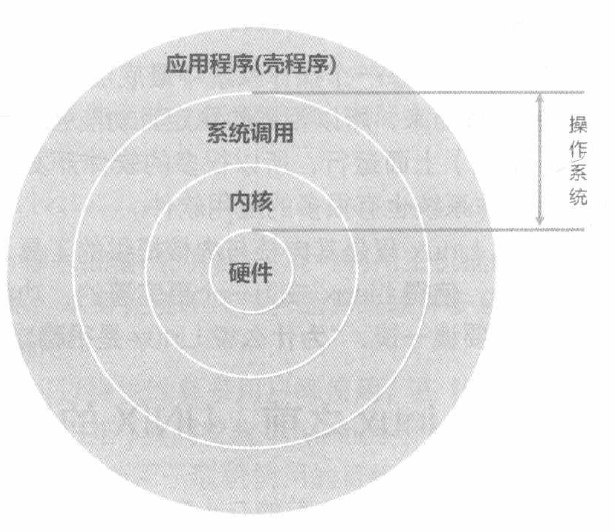

# 第 1 章 Linux 是什么与如何学习

## 1.1 Linux 是什么

### 1.1.1 Linux是什么？操作系统/应用程序？

Linux 就是一个操作系统。就是下图中内核与系统调用接口那两层：

 

同一个操作系统是无法在不同硬件平台上面运行的，不过，Linux 由于是开源的操作系统，它的程序代码可以被修改成适合在各种硬件架构上面运行，也就是说，Linux 是具有“可移植性”。

### 1.1.2 Linux之前，Unix的历史

1. 1969年以前：“Multics”系统

   让大型主机通过提供数个终端机（terminal）以连线进入主机，来利用主机的资源进行运算工作。Multics计划的目的是想要让大型主机可以达成提供300个以上的终端机连线使用的目标。

2. 1969年：Ken Thompson的小型file server system——Unics

3. 1973年：Unix的正式诞生，Ritchie等人以C语言写出第一个正式Unix核心

4. 1977年：重要的Unix分支--BSD的诞生

5. 1979年：重要的 System V 架构与版权宣告

6. 1984年之一：x86架构的Minix操作系统开始撰写并于两年后诞生

   AT&T在1979年发行的第七版Unix中，特别提到了 “不可对学生提供源代码”的严格限制，为方便教学，谭宁邦教授于是乎自己动手写了Minix这个Unix Like的核心程序

7. 1984年之二：GNU计划与FSF基金会的成立

8. 1988年：图形接口XFree86计划

## 1.2 托瓦兹的 Linux 的发展

### 1.2.1 与 Minix 之间

谭宁邦教授为了教学需要而编写的 Minix 系统，类似 UNIX，并且与 UNIX 完全兼容，还可以在 Intel 386 机器上运行。托瓦兹在购买了 Intel 386 的个人计算机之后，就立即安装了 Minix，并从其公布的源代码中学到了很多的内核程序设计的概念。

### 1.2.2 对 386 硬件的多任务测试


# 第2章 主机规划与磁盘分区

## 2.1 各硬件设备在Linux中的文件名

在Linux系统中，每个设备都被当成一个文件来对待

 

## 2.2 磁盘分区

### 2.2.1 MBR(MS-DOS)与GPT磁盘分区表

#### MBR(Master Boot Record, 主引导记录)分区表格式与限制

启动引导程序及录取与分区表通通放在磁盘的第一个扇区，这个扇区通常是512字节的大小，包括：

* 主引导记录：可以安装启动引导程序的地方，有446字节
* 分区表：记录整块硬盘分区的状态，有64字节

由于分区表所在区块仅有64 Bytes容量，因此最多仅能有四组记录区，每组记录区记录了该区段的启始与结束的柱面号码。注意分区的最小单位通常为柱面。

 

##### 扩展分区

既然分区表只有记录四组数据的空间，那么是否代表我一颗硬盘最多只能分区出四个分区？当然不是。

扩展分区的目的是使用额外的扇区来记录分区信息，扩展分区本身并不能被拿出来格式化。

 

L1~L5是由扩展分区继续切出来的分区，就被称为**逻辑分区**。

上述的分区在Linux系统中的设备文件名分别如下：
P1: /dev/sda1
P2: /dev/sda2
L1: /dev/sda5
L2: /dev/sda6
L3: /dev/sda7
L4: /dev/sda8
L5: /dev/sda9
前面四个号码都是保留给主要分区或扩展分区用的，所有逻辑分区的设备名称号码就由5号开始。

##### MBR主要分区、扩展分区、逻辑分区特性

* 主要分区与扩展分区最多可以有四个（硬盘的限制）
* 扩展分区最多只能有一个（操作系统的限制）
* 逻辑分区是由扩展分区持续划分出来的分区
* 能够被格式化后作为数据存取的分区是主要分区与逻辑分区。扩展分区无法格式化
* 逻辑分区的数量依操作系统而不同，在Linux系统中SATA硬盘已经可以突破63个以上的分区限制

#### GPT(GUID partition table)磁盘分区表

过去一个扇区大小就是512字节，不过目前已经有4K的扇区设计出现。为了兼容所有的磁盘，因此在扇区的定义上面，大多会使用所谓的逻辑区块地址（Logical Block Address, LBA）来处理。

GPT将磁盘的所有区块以此LBA来规划。
与 MBR 仅使用第一个 512Bytes 区块来纪录不同， GPT 使用了 34 个 LBA 区块来纪录分区信息。同时与过去 MBR 仅有一的区块，被干掉就死光光的情况不同， GPT 除了前面 34 个LBA 之外，整个磁盘的最后 34 个 LBA 也拿来作为另一个备份。

### 2.2.2 启动流程中的BIOS

#### BIOS 搭配 MBR/GPT 的启动流程

BIOS是一个写入到主板上的一个固件（固件就是写入到硬件上的一个软件程序）。这个BIOS就是在开机的时候，计算机系统会主动执行的第一个程序。接下来整个启动流程为：

1. BIOS：启动后主动执行的固件，会认识第一个可启动的设备；
2. MBR：第一个可启动设备的第一个扇区内的主引导记录块，内含启动引导代码；
3. 启动引导程序（boot loader）：一个可读取内核文件来执行的软件；
4. 内核文件：开始操作系统的功能。

其中boot loader的主要任务有：

1. 提供菜单选项：用户可以选择不同的启动选项，这也是多重引导的重要功能；
2. 加载内核文件：直接指向可使用的程序区段来启动操作系统；
3. 转交其他loader：将启动管理功能转交给其他loader负责。

启动引导程序boot loader除了可以安装在MBR之外，还可以安装在每个分区的启动扇区。

### 2.2.3 Linux安装模式下，磁盘分区的选择

#### 目录树结构

所谓的目录树架构（directory tree）就是以根目录为主，然后向下呈现分支状的目录结构的一种文件架构。

整个目录树架构最重要的就是那个根目录（root directory），这个根目录的表示方法为一条斜线“/”， 所有的文件都与目录树有关。

 

#### 文件系统与目录树的关系（挂载）

我们现在知道整个Linux系统使用的是目录树架构，但是我们的文件数据其实是放置在磁盘分区当中的， 现在的问题是“如何结合目录树的架构与磁盘内的数据”呢？

所谓的挂载，就是利用一个目录当成进入点，将磁盘分区的数据放置在该目录下。也就是进入该目录就可以读取该分区的意思。

例如我们将硬盘分为两个区，分区1挂载到根目录，分区2挂载到/home这个目录。也就是说当我的数据放置在/home内的各次目录时，数据是放置到
分区2的，如果不是放在/home下面的目录， 那么数据就会被放置到分区1了。

 

当我们想知道/home/vbird/test这个文件在哪个分区时，反向追踪，由test --> vbird --> home --> /，看哪个“进入点”先被查到就可以了。所以test使用的是/home这个进入点而不是/。

#### distributions安装时，挂载点与磁盘分区的规划

* 初次接触Linux：只要划分“ / ”及“交换分区”即可

* 建议分区的方法：预留一个备用的剩余磁盘容量

  可以用这个剩余的容量划分出新的分区，并使用它来备份重要的文件。

## 2.3 安装Linux前的规划

 ### 2.3.1 选择适当的Linux发行版

CentOS 7.1版，下载 everything 版本即可：CentOS-7-x86_64-Everything-1503-01.iso

CentOS官方网站：http://mirror.centos.org/centos/7/isos/

中科大镜像站：http://centos.ustc.edu.cn/centos/7/isos/

# 第3、4章 安装CentOS7.x与登录

Linux中，只要文件名的开头是小数点，那么该文件名就不会在一般观察模式被显示出来。所以说，在Linux下面，隐藏文件并不是什么特殊的权限，单纯是因为文件名命名的处理方式不同。

## 4.1 首次登录系统

### 4.1.1 X Window与命令行模式的切换

Linux默认的情况下会提供六个终端来让用户登陆，切换的方式为使用【Ctrl+Alt+F1~F6】的组合键。

* [Ctrl] + [Alt] + [F2] ~ [F6] ：命令行登陆 tty2 ~ tty6 终端机；
* [Ctrl] + [Alt] + [F1] ：图形接口桌面。

### 4.1.2 在终端登录Linux

在终端正确输入账号名和密码之后，能够看到：

```shell
CentOS Linux 7 （Core）
Kernel 3.10.0-229.el7.x86_64 on an x86_64
study login: dmtsai
Password: <==这里输入你的密码
Last login: Fri May 29 11:55:05 on tty1 <==上次登陆的情况
[dmtsai@study ~]$ _ <==光标闪烁，等待你的指令输入
```

[dmtsai@study ~]$ _

是正确登陆之后才显示的讯息， 最左边的 dmtsai 显示的是“目前使用者的帐号”，而@之后接的 study 则是“主机名称”，至于最右边的~则指的是“目前所在的目录”，那个$则是我们常常讲的“提示字符“。

~ 符号代表的是“用户的家目录”的意思，它是个“变量”，举例来说root的家目录在/root，所以~ 就代表/root的意思。而dmtsai的家目录在/home/dmtsai，所以如果你以dmtsai登录时，~ 就会等价于/home/dmtsai。

在Linux中，默认root的提示字符为#，而一般身份用户的提示字符为$。

#### 离开系统

注销Linux很简单，直接输入`exit`就可以了

但是离开系统并不是关机，Linux本身已经有相当多的任务在进行，你的登录也仅是其中的一个任务而已，所以当你离开时，这次这个登录任务 就停止了，但此时Linux其他的任务还是在继续进行中。

## 4.2 命令行模式下命令的执行

命令行模式登陆后所取得的程序被称为壳（Shell），这是因为这支程序负责最外面跟使用者（我们）沟通，所以才被戏称为壳程序。

我们Linux的壳程序就是厉害的BASH。

### 4.2.1 开始执行命令

#### 命令的格式

`[dmtsai@study ~]$ command [-options] parameter1 parameter2 ...`

* 一行指令中第一个输入的部分绝对是“命令（command）”或“可执行文件（例如shell脚本）”
* 命令, 选项, 参数等这几个东西中间以空格来区分，不论空几格 shell 都视为一格。所以空格是很重要的特殊字符。
* 按下[Enter]按键后，该命令就立即执行。[Enter]按键代表着一行命令的开始启动。
* 命令太长的时候，可以使用反斜线 （\） 来转义回车键，使命令连续到下一行。

### 4.2.2 基础命令的操作

#### 显示日期的命令：date

```shell
[dmtsai@study ~]$ date
Fri May 29 14:32:01 CST 2015
[dmtsai@study ~]$ date +%Y/%m/%d
2015/05/29
[dmtsai@study ~]$ date +%H:%M
14:33
```

#### 显示日历的指令： cal

列出目前这个月的日历

```shell
[dmtsai@study ~]$ cal
May 2015
Su Mo Tu We Th Fr Sa
                1 2
3  4  5  6   7 8   9
10 11 12 13 14 15 16
17 18 19 20 21 22 23
24 25 26 27 28 29 30
31
```

显示整年的月历

```shell
[dmtsai@study ~]$ cal 2015
```

显示2015年10月的月历

```shell
[dmtsai@study ~]$ cal 10 2015
```

#### 简单好用的计算机： bc

在命令行输入bc后，屏幕会显示出版本信息， 之后就进入到等待指示的阶段。

bc默认仅输出整数，如果要输出小数点下位数，那么就必须要执行 scale=number ，那个number就是小数点位数。

要离开bc回到命令行界面时，务必要输入【quit】来离开bc的软件环境。

### 4.2.3 重要的几个热键

#### Tab按键

具有命令补全与文件补齐的功能。

例如在命令行输入ca后，连续按下**两次**【Tab】按键，所以以ca为开头的命令都被显示出来。

#### Ctrl-c按键

中断目前程序的按键。

#### Ctrl-d按键

* 表示键盘输入结束（End Of File）
* 也可以用来取代exit的输入，例如你想要直接离开命令行模式，可以直接按下Ctrl-d就能直接离开，相当于输入exit

#### [shift]+{[Page UP]|[Page Down]}按键

当某些命令的输出信息很长的时候，可能会导致前面的部分已经不在目前的屏幕中，可以使用这两个组合键来往前/往后翻页

## 4.3 Linux系统在线求助man page与info page

### 4.3.1 命令的 --help求助说明

使用命令的--help选项就能够将该命令的用法做一个大致的理解。

### 4.3.2 man page

除了【date --help】之外，还可以执行【man date】，就可以看到date的一大堆用法，出现的屏幕界面，就称它为man page。

 

其中DATE(1)后面的1表示的是date是一般用户可使用的命令，其它的如下：

1：用户在shell环境中可以操作的命令或可执行文件
5：配置文件或者是某些文件的格式
8：系统管理员可用的管理命令

#### man page中常用的按键

 

### 4.3.3 info page

info与man的用途其实差不多，但是与man page一口气输出一堆信息不同的是，info page则是将文件数据拆成一个一个的段落，每个段落用自己的页面来编写，并且在各个页面中还有超链接来跳到各个不同的页面中，每个独立的页面也被称为一个节点。

不够查询的命令说明要具有info page功能的话，得用info page的格式来写成在线求助文件才行。至于以非info page格式写的说明文件，虽然也能够使用info来显示，不过其结果就会跟man相同。

## 4.4 超简单的文本编辑器：nano

在nano后面直接加上文件名就能够打开一个旧文件或新文件：`nano text.txt`，文件存在就打开旧文件，不存在就创建新文件。

进入nano后，下方会有组合键的功能，其中指数符号(^)代表的是键盘的[Ctrl]按键。下面列举出几个重要的组合键：

* [ctrl]-G：获得联机帮助（help）
* [ctrl]-X：离开nano软件，若有修改过文件会提示是否需要保存
* [ctrl]-O：保存文件，若你有权限的话就能够保存文件了
* [ctrl]-R：从其他文件读入数据，可以将某个文件的内容贴在本文件中
* [ctrl]-W：查找字符串
* [ctrl]-C：说明目前光标所在处的行数与列数等信息
* [ctrl]-_：可以直接输入行号，让光标快速移动到该行
* [alt]-Y：语法校验功能开启或关闭
* [alt]-M：可以支持鼠标来移动光标的功能

## 4.5 正确的关机方法

### 数据同步写入磁盘：sync

直接在命令行模式下输入sync，那么在内存中尚未被更新的数据，就会被写入硬盘中。所以，这个命令在系统关机或重新启动之前，最好多执行几次。

### 常用的关机命令：shutdown

`shutdown [-krhc] [时间] [警告讯息]`

#### 选项与参数：
-k ： 不要真的关机，只是发送警告信息出去
-r ： 在将系统的服务停掉之后就重新启动（常用）
-h ： 将系统的服务停掉后，立即关机。 （常用）
-c ： 取消已经在进行的 shutdown 命令内容
时间 ： 指定系统关机的时间。若没有这个项目，则默认 1 分钟后自动进行。

#### 使用范例

`[root@study ~]# shutdown -h now`
立刻关机，其中 now 相当于时间为 0 的状态
`[root@study ~]# shutdown -h 20:25`
系统在今天的 20:25 分会关机，若在21:25才下达此指令，则隔天才关机
`[root@study ~]# shutdown -h +10`
系统再过十分钟后自动关机
`[root@study ~]# shutdown -r now`
系统立刻重新开机
`[root@study ~]# shutdown -r +30 'The system will reboot'`
再过三十分钟系统会重新开机，并显示后面的讯息给所有在线上的使用者
`[root@study ~]# shutdown -k now 'This system will reboot'`
仅发出警告信件的参数！系统并不会关机啦！吓唬人！

### 重新启动，关机：reboot、halt、poweroff

#### 重新启动

`sync; sync; sync; reboot`

### 实际使用管理工具systemctl关机

上面谈到的halt、poweroff、reboot、shutdown等，其实都是调用systemctl这个命令。

```shell
[root@study ~]# systemctl [命令]
命令项目包括如下：
halt 进入系统停止的模式，屏幕可能会保留一些信息，这与你的电源管理模式有关
poweroff 进入系统关机模式，直接关机
reboot 直接重新启动
suspend 进入休眠模式
[root@study ~]# systemctl reboot # 系统重新启动
[root@study ~]# systemctl poweroff # 系统关机
```

# 第5章 Linux的文件权限与目录配置

## 5.1 用户与用户组

用户组最有用的功能之一，就是当你在团队进行协同工作的时候。

每个账号都可以有多个用户组的支持。

### Linux用户身份与用户组记录文件

在我们Linux系统当中，默认的情况下，所有的系统上的帐号与一般身份用户，还有那个root的相关信息， 都是记录在/etc/passwd这个文件内的。

至于个人的密码则是记录在/etc/shadow这个文件内。

 此外，Linux所有的组名都纪录在/etc/group中。

## 5.2 Linux文件权限概念

### 5.2.1 Linux文件属性

>使用【su -】切换身份成root
>
>离开su -则使用exit回到之前的身份

【ls -al】命令

选项【-al】: 列出所有的文件以及其详细的权限与属性（包含隐藏文件）

```shell
[dmtsai@study ~]$ su - # 先来切换一下身份看看
Password:
Last login: Tue Jun 2 19:32:31 CST 2015 on tty2
[root@study ~]# ls -al
total 48
dr-xr-x---. 5 root root 4096 May 29 16:08 .
dr-xr-xr-x. 17 root root 4096 May 4 17:56 ..
-rw-------. 1 root root 1816 May 4 17:57 anaconda-ks.cfg
```

 

**第一个字符代表文件的类型**

* 当为[ d ]则是目录
* 当为[ - ]则是常规文件
* 若是[ l ]则表示为链接文件
* 若是[ b ]则表示为设备文件里面的可供储存的周边设备
* 若是[ c ]则表示为设备文件里面的串行端口设备，例如键盘、鼠标
* 若是[ s ]则为数据接口文件
* 若是[ p ]则为数据输送文件

**接下来的字符中，以三个为一组，且均为【rwx】的三个参数的组合。其中，[ r ]代表可读（read）、[ w ]代表可写（write）、[ x ]代表可执行（execute）。这三个权限的位置不会改变，如果没有权限，就会用[ - ]当占位符。**

* 第一组为文件拥有者可具备的权限
* 第二组为加入此用户组的帐号的权限
* 第三组为非本人且没有加入本用户组的其他帐号的权限

**第二栏表示有多少文件名链接到此节点（inode）**

**第三栏表示这个文件的拥有者账号**

**第四栏表示这个文件的所属用户组**

**第五栏为这个文件的容量大小，默认单位为Bytes**

**第六栏为这个文件的创建日期或者是最近的修改日期**

**第七栏为这个文件的文件名**

### 5.2.2 如何修改文件属性与权限

#### 修改所属用户组, chgrp

```shell
[root@study ~]# chgrp [-R] dirname/filename ...
选项与参数：
-R : 进行递归（recursive）修改，亦即连同子目录下的所有文件、目录都更新成为这个用户组之意。常常用在修改某一目录内所有的文件之情况。
范例：
[root@study ~]# chgrp users initial-setup-ks.cfg
[root@study ~]# ls -l
-rw-r--r--. 1 root users 1864 May 4 18:01 initial-setup-ks.cfg
```

#### 修改文件拥有者, chown

chown还可以顺便直接修改用户组的名称。

```shell
[root@study ~]# chown [-R] 帐号名称 文件或目录
[root@study ~]# chown [-R] 帐号名称:用户组名称 文件或目录
选项与参数：
-R : 进行递归（recursive）修改，亦即连同子目录下的所有文件都修改
范例：将 initial-setup-ks.cfg 的拥有者改为bin这个帐号：
[root@study ~]# chown bin initial-setup-ks.cfg
[root@study ~]# ls -l
-rw-r--r--. 1 bin users 1864 May 4 18:01 initial-setup-ks.cfg
范例：将 initial-setup-ks.cfg 的拥有者与群组改回为root：
[root@study ~]# chown root:root initial-setup-ks.cfg
[root@study ~]# ls -l
-rw-r--r--. 1 root root 1864 May 4 18:01 initial-setup-ks.cfg
```

#### 修改权限，cha\mod

##### 数字类型修改文件权限

Linux文件的基本权限有9个，分别是拥有者，用户组，其他人三种身份各自的read、write、execute。我们可以用数字来代表各个权限：

```shell
r:4
w:2
x:1
```

每种身份（owner、group、others）各自的三个权限（r、w、x）数字是需要累加的，例如当权限为： [-rwxrwx---] 数字则是：

```text
owner = rwx = 4+2+1 = 7
group = rwx = 4+2+1 = 7
others= --- = 0+0+0 = 0
```

所以该文件的权限数字就是770

```shell
[root@study ~]# chmod [-R] xyz 文件或目录
选项与参数：
xyz : 就是刚刚提到的数字类型的权限属性，为 rwx 属性数值的相加。
-R : 进行递归（recursive）修改，亦即连同次目录下的所有文件都会修改

[root@study ~]# ls -al .bashrc
-rw-r--r--. 1 root root 176 Dec 29 2013 .bashrc
[root@study ~]# chmod 777 .bashrc
[root@study ~]# ls -al .bashrc
-rwxrwxrwx. 1 root root 176 Dec 29 2013 .bashrc
```

##### 符号类型修改文件权限

借由u, g, o来代表三种身份(user、group、others)，a则代表all亦即全部的身份。

* 设置一个文件的权限成为“-rwxr-xr-x”

  ```shell
  [root@study ~]# chmod u=rwx,go=rx .bashrc
  # 注意！那个 u=rwx,go=rx 是连在一起的，中间并没有任何空格
  [root@study ~]# ls -al .bashrc
  -rwxr-xr-x. 1 root root 176 Dec 29 2013 .bashrc
  ```

* 如果我不知道原先的文件属性，而我只想要增加.bashrc这个文件的每个人均可写入的权限

  ```shell
  [root@study ~]# ls -al .bashrc
  -rwxr-xr-x. 1 root root 176 Dec 29 2013 .bashrc
  [root@study ~]# chmod a+w .bashrc
  [root@study ~]# ls -al .bashrc
  -rwxrwxrwx. 1 root root 176 Dec 29 2013 .bashrc
  ```

* 拿掉全部人的可执行权限

  ```shell
  [root@study ~]# chmod a-x .bashrc
  [root@study ~]# ls -al .bashrc
  -rw-rw-rw-. 1 root root 176 Dec 29 2013 .bashrc
  ```

### 5.2.3 目录与文件的权限意义

#### 权限对文件的意义

文件是实际含有数据的地方。

* r：可读取此文件的实际内容，如读取文本文件的文字内容等

* w：可以编辑、新增或者是修改该文件的内容（但不含删除该文件）

* x：该文件具有可以被系统执行的权限

  在Windows下面一个文件是否具有执行的能力是借由“ 扩展名 ”来判断的， 例如：.exe, .bat, .com 等等，但是在Linux下面，我们的文件是否能被执行，则是借由是否具有“x”这个权限来决定，跟文件名是没有绝对的关系的。

对于文件的rwx来说，主要是针对文件的内容而言。

#### 权限对目录的意义

目录主要的内容在记录文件名列表

* r：表示具有读取目录结构列表的权限，表示你可以查询该目录下的文件名数据，即可以利用【ls】这个命令将目录的内容列表显示出来。
* w：表示具有改动该目录结构列表的权限
  * 建立新的文件与目录
  * 删除已存在的文件与目录
  * 将已存在的文件或目录进行更名
  * 移动该目录内的文件、目录位置
* x：表示用户能否进入该目录称为工作目录，所谓的工作目录就是你目前所在的目录，即表示用户能否通过【cd】命令变换到该目录。

### 5.2.4 Linux文件种类与扩展名

#### 文件种类

* 常规文件

  * 纯文本文件（ASCII）

    内容为我们人类可以直接读到的数据。可以执行`cat`就可以看到该文件的内容。

  * 二进制文件（binary）

    Linux当中的可执行文件。

  * 数据文件（data）

    比如我们的Linux在用户登陆时，都会将登录的数据记录在 /var/log/wtmp这个文件内，该文件是一个数据文件，他能够通过`last`这个命令读出来。但是使用cat时，会读出乱码。

* 目录

* 链接文件

* 设备与设备文件：与系统周边及存储相关的一些文件

  * 区块设备文件

    就是一些储存数据， 以提供系统随机存取的接口设备，举例来说，硬盘和软盘等就是

  * 字符设备文件

    一些串行端口的接口设备，例如鼠标、键盘等。

* 数据接口文件（sockets）：通常被用在网络上的数据交换。

* 数据输送文件（FIFO，pipe）：主要目的是解决多个程序同时读写一个文件所造成的错误问题。

#### Linux文件扩展名

基本上，Linux的文件是没有所谓的“扩展名”的，一个Linux文件能不能被执行，与它的第一栏的十个属性有关， 与文件名根本一点关系也没有。只要你的权限当中具有x的话，即代表这个文件据具有可以被执行的能力。 但是x仅仅代表这个文件具有可执行的能力，但是能不能执行成功，就得要看该文件的内容。

虽然如此，通常我们还是会以适当的扩展名来表示该文件是什么种类的：

* *.sh

  脚本或批处理文件

* Z, .tar, .tar.gz, .zip, *.tgz

  经过打包的压缩文件

* .html, .php

  网页相关的文件

#### Linux文件名长度的限制

单一文件或目录的最大容许文件名为 255字节，以一个 ASCII 英文占用一个字节来说，则大约可达 255 个字符长度。若是以每个汉字占用2字节来说， 最大文件名就是大约在 128 个汉字之间

## 5.3 Linux目录配置

### 5.3.1 Linux目录配置的依据——FHS（Filesystem Hierarchy Standard）

FHS将目录定义为四种交互作用的形态：

* 可分享：可以分享给其他系统挂载使用的目录，所以包括可执行文件与用户的邮件等数据， 是能够分享给网络上其他主机挂载用的目录
* 不可分性：自己机器上面运行的设备文件或者是与程序有关的socket文件等， 由于仅与自身机器有关，所以当然就不适合分享给其他主机
* 不变：有些数据是不会经常变动的。例如函数库、文件说明、系统管理员所管理的主机服务配置文件等等
* 可变动：经常修改的数据，例如日志文件、一般用户可自行接收的新闻组等

 

FHS针对目录树架构仅定义出三层目录下面应该放置什么数据：

* / （root, 根目录）：与启动系统有关
* /usr （unix software resource）：与软件安装/执行有关
* /var （variable）：与系统运行过程有关

#### 根目录 （/） 的意义与内容

根目录是整个系统最重要的一个目录，因为不但所有的目录都是由根目录衍生出来的，同时根目录也与启动/还原/系统修复等操作有关。

FHS标准建议：根目录（/）所在分区应该越小越好， 且应用程序所安装的软件最好不要与根目录放在同一个分区内，保持根目录越小越好。 如此不但性能较佳，根目录所在的文件系统也较不容易发生问题。

#### /usr 的意义与内容

/usr里面放置的数据属于可分享的与不可变动的。

usr是Unix Software Resource的缩写， 也就是“Unix操作系统软件资源”所放置的目录，而不是使用者的数据。

FHS建议所有软件开发者，应该将他们的数据合理地分别放置到这个目录下的子目录，而不要自行建立该软件自己独立的目录。

#### /var 的意义与内容

/var目录主要针对经常性变动的文件，包括缓存（cache）、日志文件（log file）以及某些软件运行所产生的文件， 包括程序文件（lock file, run file），或者例如
MySQL数据库的文件等。

### 5.3.2 目录树（directory tree）

#### 目录树的特性

* 目录树的起始点为根目录（/, root）

* 每一个目录不止能使用本地分区的文件系统，也可以使用网络上的文件系统，比如用NFS服务挂载某特定目录。

* 每一个文件在此目录树中的文件名（包含完整路径）都是独一无二的

### 绝对路径与相对路径

* 绝对路径：由根目录（/）开始写起的文件名或目录名称， 例如 /home/dmtsai/.bashrc
* 相对路径：相对于目前路径的文件名写法。 例如 ./home/dmtsai 或 ../../home/dmtsai/ 等。反正开头不是 / 就属于相对路径的写法
  * **.**    代表当前的目录，也可以使用 ./ 来表示
  * **..**   代表上一层目录，也可以使用 ../ 来表示

# 第6章 Linux文件与目录管理

## 6.1 目录与路径

### 6.1.2 目录的相关操作

#### 特殊的目录

```
.				代表此层目录
..				代表上一层目录
-				代表前一个工作目录
~				代表“目前使用者身份”所在的主文件夹
~account 		代表 account 这个使用者的主文件夹（account是个帐号名称）
```

#### 常见的处理目录的命令

* **cd （change directory, 切换目录）**

  ```shell
  [dmtsai@study ~]$ su - # 先切换身份成为 root 看看。
  [root@study ~]# cd [相对路径或绝对路径]
  # 最重要的就是目录的绝对路径与相对路径，还有一些特殊目录的符号。
  [root@study ~]# cd ~dmtsai
  # 代表去到 dmtsai 这个使用者的家目录，亦即 /home/dmtsai
  [root@study dmtsai]# cd ~
  # 表示回到自己的家目录，亦即是 /root 这个目录
  [root@study ~]# cd
  # 没有加上任何路径，也还是代表回到自己家目录的意思喔，即等价于 cd ~
  [root@study ~]# cd ..
  # 表示去到目前的上层目录，亦即是 /root 的上层目录的意思
  [root@study /]# cd -
  # 表示回到刚刚的那个目录，也就是 /root
  [root@study ~]# cd /var/spool/mail
  # 这个就是绝对路径的写法。直接指定要去的完整路径名称
  [root@study mail]# cd ../postfix
  # 这个是相对路径的写法，我们由/var/spool/mail 去到/var/spool/postfix 就这样写。
  ```

* **pwd （Print Working Directory，显示目前所在的目录）**

  ```shell
  [root@study ~]# pwd [-P]
  选项与参数：
  -P ：显示出真正的路径，而非使用链接 （link） 路径。
  
  范例：单纯显示出目前的工作目录：
  [root@study ~]# pwd
  /root <== 显示出目录
  
  范例：显示出实际的工作目录，而非链接文件本身的目录名而已
  [root@study ~]# cd /var/mail <==注意，/var/mail是一个链接文件
  [root@study mail]# pwd
  /var/mail <==列出目前的工作目录
  [root@study mail]# pwd -P
  /var/spool/mail <==怎么回事？有没有加 -P 差很多
  
  [root@study mail]# ls -ld /var/mail
  lrwxrwxrwx. 1 root root 10 May 4 17:51 /var/mail -> spool/mail
  # 看到这里应该知道为啥了吧？因为 /var/mail 是链接文件，链接到 /var/spool/mail
  # 所以，加上 pwd -P 的选项后，不会显示链接文件的路径，而是显示正确的完整路径。
  ```

* **mkdir （创建新目录）**

  ```shell
  [root@study ~]# mkdir [-mp] 目录名称
  选项与参数：
  -m ：设置文件的权限.直接设置，不使用默认权限 （umask）
  -p ：帮助你直接将所需要的目录（包含上层目录）递归创建
  
  范例：请到/tmp下面尝试创建数个新目录看看：
  [root@study ~]# cd /tmp
  [root@study tmp]# mkdir test <==建立一名为 test 的新目录
  
  [root@study tmp]# mkdir test1/test2/test3/test4
  mkdir: cannot create directory ‘test1/test2/test3/test4’: No such file or directory
  # 话说，系统告诉我们，不可能建立这个目录，就是没有目录才要建立的，见鬼嘛
  [root@study tmp]# mkdir -p test1/test2/test3/test4
  # 原来是要建 test4 上层没先建 test3 的原因，加了这个 -p 的选项，可以自行帮你建立多层目录。
  
  范例：创建权限为rwx--x--x的目录
  [root@study tmp]# mkdir -m 711 test2
  [root@study tmp]# ls -ld test*
  drwxr-xr-x. 2 root root 6 Jun 4 19:03 test
  drwxr-xr-x. 3 root root 18 Jun 4 19:04 test1
  drwx--x--x. 2 root root 6 Jun 4 19:05 test2
  # 仔细看上面的权限部分，如果没有加上 -m 来强制设置属性，系统会使用默认属性。
  # 那么你的默认属性是什么？这要通过下面介绍的 [umask]才能了解。
  ```

* **rmdir （删除“空”的目录）**

  ```shell
  [root@study ~]# rmdir [-p] 目录名称
  选项与参数：
  -p ：连同上层的“空的”目录也一起删除
  
  范例：将于mkdir范例中创建的目录（/tmp下面）删除掉
  [root@study tmp]# ls -ld test* <==看看有多少目录存在？
  drwxr-xr-x. 2 root root 6 Jun 4 19:03 test
  drwxr-xr-x. 3 root root 18 Jun 4 19:04 test1
  drwx--x--x. 2 root root 6 Jun 4 19:05 test2
  [root@study tmp]# rmdir test <==可直接删除掉，没问题
  [root@study tmp]# rmdir test1 <==因为尚有内容，所以无法删除
  rmdir: failed to remove ‘test1’: Directory not empty
  [root@study tmp]# rmdir -p test1/test2/test3/test4
  [root@study tmp]# ls -ld test* <==您看看，下面的输出中test与test1不见了！
  drwx--x--x. 2 root root 6 Jun 4 19:05 test2
  # 使用 -p 这个选项，立刻可将 test1/test2/test3/test4 一次删除
  # 不过要注意，这个 rmdir 仅能“删除空目录”——被删除的目录里面必定不能存在其他的目录或文件
  ```

  如果要将所有目录下的东西都删除，就必须使用【rm -r test】。

### 6.1.3 关于执行文件路径的变量：$PATH

查看文件属性的命令 ls 完整文件名为：/bin/ls（这是绝对路径），但是我们可以在任何地方执行/bin/ls这个命令。这是因为当我们在执行一个命令的时候，举例来说 ls 好了，系统会依照PATH的设置去每个PATH定义的目录下查找文件名为ls的可执行文件。

PATH（一定是大写）这个变量的内容是由一堆目录所组成的，每个目录中间用冒号（:）来隔开， 每个目录是有顺序之分的。

可以执行【echo $PATH】来查看PATH的内容，echo有“显示、打印”的意思，而\$表示后面接的是变量

```shell
范例：用root的身份列出查找的路径是什么？
[root@study ~]# echo $PATH
/usr/local/sbin:/usr/local/bin:/sbin:/bin:/usr/sbin:/usr/bin:/root/bin

范例：用dmtsai的身份列出查找的路径是什么？
[root@study ~]# exit # 由之前的 su - 离开，变回原本的帐号
[dmtsai@study ~]$ echo $PATH
/usr/local/bin:/usr/bin:/usr/local/sbin:/usr/sbin:/home/dmtsai/.local/bin:/home/dmtsai/bin
# 记不记得我们前一章说过，目前 /bin 是链接到 /usr/bin 当中
```

* 不同身份用户默认的PATH不同，默认能够随意执行的命令也不同（如root与dmtsai）

* PATH是可以修改的

  例如我们将“/root”加入到PATH中

  ```shell
  [root@study ~]# PATH="${PATH}:/root"
  ```

* 使用绝对路径或相对路径直接指定某个命令的文件名来执行，会比查找PATH来的正确

* 命令应该要放置到正确的目录下，执行才会比较方便

* 本目录（.）最好不要放到PATH当中

## 6.2 文件与目录管理

### 6.2.1 文件与目录的查看：ls

```shell
[root@study ~]# ls [-aAdfFhilnrRSt] 文件名或目录名称
[root@study ~]# ls [--color={never,auto,always}] 文件名或目录名称
[root@study ~]# ls [--full-time] 文件名或目录名称
选项与参数：
'-a ：全部的文件，连同隐藏文件（ 开头为 . 的文件） 一起列出来（常用）
-A ：全部的文件，连同隐藏文件，但不包括 . 与 .. 这两个目录
'-d ：仅列出目录本身，而不是列出目录内的文件数据（常用）
-f ：直接列出结果，而不进行排序 （ls 默认会以文件名排序）
-F ：根据文件、目录等信息，给予附加数据结构，例如：
	*代表可可执行文件； /代表目录； =代表 socket 文件； |代表 FIFO 文件；
-h ：将文件容量以人类较易读的方式（例如 GB, KB 等等）列出来；
-i ：列出 inode 号码，inode 的意义下一章将会介绍；
'-l ：详细信息显示，包含文件的属性与权限等等数据；（常用）
-n ：列出 UID 与 GID 而非使用者与用户组的名称 （UID与GID会在帐号管理提到）
-r ：将排序结果反向输出，例如：原本文件名由小到大，反向则为由大到小；
-R ：连同子目录内容一起列出来，等于该目录下的所有文件都会显示出来；
-S ：以文件容量大小排序，而不是用文件名排序；
-t ：依时间排序，而不是用文件名。
--color=never ：不要依据文件特性给予颜色显示；
--color=always ：显示颜色
--color=auto ：让系统自行依据设置来判断是否给予颜色
--full-time ：以完整时间模式 （包含年、月、日、时、分） 输出
--time={atime,ctime} ：输出 access 时间或改变权限属性时间 （ctime）而非内容修改时间 （modification time）
```

当你只有执行 ls 时，默认显示的只有：非隐藏文件的文件名、 以文件名进行排序及文件名代表的颜色显示如此而已。

### 6.2.2 复制、删除与移动： cp, rm, mv

* **cp （复制文件或目录）**

  ```shell
  [root@study ~]# cp [-adfilprsu] 源文件（source） 目标文件（destination）
  [root@study ~]# cp [options] source1 source2 source3 .... directory
  选项与参数：
  '-a ：相当于 -dr --preserve=all 的意思，至于 dr 请参考下列说明（常用）
  -d ：若源文件为链接文件的属性（link file），则复制链接文件属性而非文件本身；
  -f ：为强制（force）的意思，若目标文件已经存在且无法开启，则删除后再尝试一次；
  '-i ：若目标文件（destination）已经存在时，在覆盖时会先询问操作的进行（常用）
  -l ：进行硬链接（hard link）的链接文件建立，而非复制文件本身；
  '-p ：连同文件的属性（权限、用户、时间）一起复制过去，而非使用默认属性（备份常用）；
  '-r ：递归复制，用于目录的复制操作；（常用）
  -s ：复制成为符号链接文件 （symbolic link），亦即“快捷方式”文件；
  -u ：源文件比目标文件新才更新目标文件，或目标文件不存在的情况下才复制。常用于备份的工作当中。
  --preserve=all ：除了 -p 的权限相关参数外，还加入 SELinux 的属性, links, xattr 等也复制
  最后需要注意的，如果来源文件有两个以上，则最后一个目的文件一定要是“目录”才行
  ```

  在默认的条件中，cp的源文件与目标文件的权限是不同的，目标文件的拥有者通常会是命令操作者本身。

  因此我们在进行备份的时候，某些需要特备注意的特殊权限文件，例如密码文件，就要加上 -a 或是 -p 等可以完整复制文件权限的选项才行。

  范例：

  ```shell
  范例一：用root身份，将加目录下的 .bashrc 复制到 /tmp 下，并更名为 bashrc
  [root@study ~]# cp ~/.bashrc /tmp/bashrc
  [root@study ~]# cp -i ~/.bashrc /tmp/bashrc
  cp: overwrite `/tmp/bashrc'? n <==n不覆盖，y为覆盖
  # 重复作两次操作，由于 /tmp 下面已经存在 bashrc 了，加上 -i 选项后，
  # 则在覆盖前会询问使用者是否确定，可以按下 n 或者 y 来二次确认
  
  范例二：变换目录到/tmp，并将/var/log/wtmp复制到/tmp且观察属性：
  [root@study ~]# cd /tmp
  [root@study tmp]# cp /var/log/wtmp . <==想要复制到目前的目录，最后的 . 不要忘
  [root@study tmp]# ls -l /var/log/wtmp wtmp
  -rw-rw-r--. 1 root utmp 28416 Jun 11 18:56 /var/log/wtmp
  -rw-r--r--. 1 root root 28416 Jun 11 19:01 wtmp
  # 注意上面的特殊字体，在不加任何选项的情况下，文件的某些属性/权限会改变；
  # 这是个很重要的特性,要注意,还有，连文件创建的时间也不一样了
  # 那如果你想要将文件的所有特性都一起复制过来该怎办？可以加上 -a ,如下所示：
  [root@study tmp]# cp -a /var/log/wtmp wtmp_2
  [root@study tmp]# ls -l /var/log/wtmp wtmp_2
  -rw-rw-r--. 1 root utmp 28416 Jun 11 18:56 /var/log/wtmp
  -rw-rw-r--. 1 root utmp 28416 Jun 11 18:56 wtmp_2
  # 整个数据特性完全一模一样,这就是 -a 的特性
  
  范例三：复制 /etc/ 这个目录下的所有内容到 /tmp 下面
  [root@study tmp]# cp /etc/ /tmp
  cp: omitting directory `/etc' <== 如果是目录则不能直接复制，要加上 -r 的选项
  [root@study tmp]# cp -r /etc/ /tmp
  # 还是要再次的强调, -r 是可以复制目录，但是，文件与目录的权限可能会被改变
  # 所以，也可以利用[cp -a /etc /tmp]来执行命令，尤其是在备份的情况下。
  
  范例四：将范例一复制的 bashrc 创建一个符号链接文件 （symbolic link）
  [root@study tmp]# ls -l bashrc
  -rw-r--r--. 1 root root 176 Jun 11 19:01 bashrc <==先观察一下文件情况
  [root@study tmp]# cp -s bashrc bashrc_slink
  [root@study tmp]# cp -l bashrc bashrc_hlink
  [root@study tmp]# ls -l bashrc*
  -rw-r--r--. 2 root root 176 Jun 11 19:01 bashrc <==与原始文件不太一样了
  -rw-r--r--. 2 root root 176 Jun 11 19:01 bashrc_hlink
  lrwxrwxrwx. 1 root root 6 Jun 11 19:06 bashrc_slink -> bashrc
  # bashrc_slink 是一个“快捷方式”，这个快捷方式会链接到bashrc。所以你会看到文件名右侧会有个指向（->）的符号
  # bashrc_hlink文件与bashrc的属性与权限完全一模一样，与尚未进行链接前的差异则是第二栏的link数由1变成2了
  
  范例五：若 ~/.bashrc 比 /tmp/bashrc 新才复制过来
  [root@study tmp]# cp -u ~/.bashrc /tmp/bashrc
  # 这个 -u 的特性，是在目标文件与来源文件有差异时，才会复制的。
  # 所以，比较常被用于“备份”的工作当中
  
  范例六：将范例四造成的 bashrc_slink 复制成为 bashrc_slink_1 与bashrc_slink_2
  [root@study tmp]# cp bashrc_slink bashrc_slink_1
  [root@study tmp]# cp -d bashrc_slink bashrc_slink_2
  [root@study tmp]# ls -l bashrc bashrc_slink*
  -rw-r--r--. 2 root root 176 Jun 11 19:01 bashrc
  lrwxrwxrwx. 1 root root 6 Jun 11 19:06 bashrc_slink -> bashrc
  -rw-r--r--. 1 root root 176 Jun 11 19:09 bashrc_slink_1 <==与原始文件相同
  lrwxrwxrwx. 1 root root 6 Jun 11 19:10 bashrc_slink_2 -> bashrc <==是链接文件！
  # 原本复制的是链接文件，但是却将链接文件的实际文件复制过来了
  # 也就是说，如果没有加上任何选项时，cp复制的是原始文件，而非链接文件的属性。
  # 若要复制链接文件的属性，就得要使用 -d 的选项了，如 bashrc_slink_2 所示。
  
  范例七：将家目录的 .bashrc 及 .bash_history 复制到 /tmp 下面
  [root@study tmp]# cp ~/.bashrc ~/.bash_history /tmp
  # 可以将多个数据一次复制到同一个目录，最后面一定是目录
  ```

* **rm （删除文件或目录）**

  ```shell
  [root@study ~]# rm [-fir] 文件或目录
  选项与参数：
  -f ：就是 force 的意思，忽略不存在的文件，不会出现警告讯息；
  -i ：互动模式，在删除前会询问使用者是否操作
  -r ：递归删除 最常用于目录的删除，这是非常危险的选项
  
  范例一：将刚刚在 cp 的范例中创建的 bashrc 删除掉！
  [root@study ~]# cd /tmp
  [root@study tmp]# rm -i bashrc
  rm: remove regular file `bashrc'? y
  # 如果加上 -i 的选项就会主动询问，避免你删除到错误的文件名
  
  范例二：通过通配符*的帮忙，将/tmp下面开头为bashrc的文件名通通删除：
  [root@study tmp]# rm -i bashrc*
  # 注意那个星号，代表的是 0 到无穷多个任意字符，很好用的东西
  
  范例三：将 cp 范例中所创建的 /tmp/etc/ 这个目录删除掉！
  [root@study tmp]# rmdir /tmp/etc
  rmdir: failed to remove '/tmp/etc': Directory not empty <== 删不掉，因为这不是空的目录
  [root@study tmp]# rm -r /tmp/etc
  rm: descend into directory `/tmp/etc'? y
  rm: remove regular file `/tmp/etc/fstab'? y
  rm: remove regular empty file `/tmp/etc/crypttab'? ^C <== 按下 [crtl]+c 中断
  .....（中间省略）.....
  # 因为身份是 root ，默认已经加入了 -i 的选项，所以你要一直按 y 才会删除！
  # 如果不想要继续按 y ，可以按下“ [ctrl]-c ”来终止 rm 的工作。
  # 这是一种保护的操作，如果确定要删除掉此目录而不要询问，可以这样做：
  [root@study tmp]# \rm -r /tmp/etc
  # 在指令前加上反斜线，可以忽略掉 alias 的指定选项，至于 alias 我们在bash再谈。
  
  范例四：删除一个带有 - 开头的文件
  [root@study tmp]# touch ./-aaa- <== touch这个命令可以建立空文件
  [root@study tmp]# ls -l
  -rw-r--r--. 1 root root 0 Jun 11 19:22 -aaa- <==文件大小为0，所以是空文件
  [root@study tmp]# rm -aaa-
  rm:invalid option -- 'a' <== 因为 "-" 是选项嘛，所以系统误判了
  Try 'rm ./-aaa-' to remove the file `-aaa-'. <== 新的 bash 有给建议的, 即在前面加上本目录./
  Try 'rm --help' for more information.
  [root@study tmp]# rm ./-aaa-
  ```

* **mv （移动文件与目录，或重命名）**

  ```shell
  [root@study ~]# mv [-fiu] source destination
  [root@study ~]# mv [options] source1 source2 source3 .... directory
  选项与参数：
  -f ：force 强制的意思，如果目标文件已经存在，不会询问而直接覆盖；
  -i ：若目标文件 （destination） 已经存在时，就会询问是否覆盖
  -u ：若目标文件已经存在，且 source 比较新，才会更新 （update）
  
  范例一：复制一文件，创建一目录，将文件移动到目录中
  [root@study ~]# cd /tmp
  [root@study tmp]# cp ~/.bashrc bashrc
  [root@study tmp]# mkdir mvtest
  [root@study tmp]# mv bashrc mvtest
  # 将某个文件移动到某个目录去，就是这样做
  
  范例二：将刚刚的目录名称更名为 mvtest2
  [root@study tmp]# mv mvtest mvtest2 <== 这样就更名了。
  # 其实在 Linux 下面还有个有趣的指令，名称为 rename ，
  # 该指令专职进行多个文件名的同时重命名，并非针对单一文件名修改，与mv不同。请man rename。
  
  范例三：再创建两个文件，再全部移动到 /tmp/mvtest2 当中
  [root@study tmp]# cp ~/.bashrc bashrc1
  [root@study tmp]# cp ~/.bashrc bashrc2
  [root@study tmp]# mv bashrc1 bashrc2 mvtest2
  # 注意到这边，如果有多个来源文件或目录，则最后一个目标文件一定是目录
  # 意思是说，将所有的文件移动到该目录的意思！
  ```

### 6.2.3 获取路径的文件名与目录名称

```shell
[root@study ~]# basename /etc/sysconfig/network
network <== 很简单,就取得最后的文件名
[root@study ~]# dirname /etc/sysconfig/network
/etc/sysconfig <== 取得的变成目录名
```

## 6.3 文件内容查看

### 6.3.1 直接查看文件内容

* **cat (concatenate)**

  ```shell
  [root@study ~]# cat [-AbEnTv]
  选项与参数：
  -A ：相当于 -vET 的整合选项，可列出一些特殊字符而不是空白而已；
  -b ：列出行号，仅针对非空白行做行号显示，空白行不标行号;
  -E ：将结尾的断行字符 $ 显示出来；
  '-n ：打印出行号，连同空白行也会有行号，与 -b 的选项不同；
  -T ：将 [tab] 按键以 ^I 显示出来；
  -v ：列出一些看不出来的特殊字符;
  
  范例一：查看 /etc/issue 这个文件的内容
  [root@study ~]# cat /etc/issue
  \S
  Kernel \r on an \m
  
  范例二：承上题，如果还要打印行号？
  [root@study ~]# cat -n /etc/issue
  1 \S
  2 Kernel \r on an \m
  3
  # 所以这个文件有三行，看到了吧！可以列出行号。这对于大文件要找某个特定的行时，有点用处。
  # 如果不想要显示空白行的行号，可以使用“cat -b /etc/issue”
  
  范例三：将 /etc/man_db.conf 的内容完整的显示出来（包含特殊字符）
  [root@study ~]# cat -A /etc/man_db.conf
  # $
  ....（中间省略）....
  MANPATH_MAP^I/bin^I^I^I/usr/share/man$
  MANPATH_MAP^I/usr/bin^I^I/usr/share/man$
  MANPATH_MAP^I/sbin^I^I^I/usr/share/man$
  MANPATH_MAP^I/usr/sbin^I^I/usr/share/man$
  .....（下面省略）.....
  # 基本上，在一般的环境中，使用 [tab] 与空格键的效果差不多，都是一堆空白。我们无法知道两者的差别。
  # 此时使用 cat -A 就能够发现那些空白的地方是啥鬼东西了，[tab]会以 ^I 表示，
  # 换行符则是以 $ 表示，所以你可以发现每一行后面都是 $ 。
  # 不过换行符在Windows/Linux则不太相同，Windows的换行符是 ^M$。
  ```

* **tac （反向列示）**

  ```shell
  [root@study ~]# tac /etc/issue
  Kernel \r on an \m
  \S
  # 与刚刚上面的范例一比较，是由最后一行先显示。
  ```

* **nl （添加行号打印）**

  ```shell
  [root@study ~]# nl [-bnw] 文件
  选项与参数：
  -b ：	指定行号指定的方式，主要有两种：
  		-b a ：表示不论是否为空行，也同样列出行号（类似 cat -n）；
  		-b t ：如果有空行，空的那一行不要列出行号（默认值）；
  -n ：	列出行号表示的方法，主要有三种：
  		-n ln ：行号在屏幕的最左方显示；
  		-n rn ：行号在自己字段的最右方显示，且不加 0 ；
  		-n rz ：行号在自己字段的最右方显示，且加 0 ；
  -w ：行号字段的占用的字符数。
  
  范例一：用 nl 列出 /etc/issue 的内容
  [root@study ~]# nl /etc/issue
  1 \S
  2 Kernel \r on an \m
  # 注意看，这个文件其实有三行，第三行为空白（没有任何字符），
  # 因为他是空白行，所以 nl 不会加上行号。如果确定要加上行号，可以这样做：
  [root@study ~]# nl -b a /etc/issue
  1 \S
  2 Kernel \r on an \m
  3
  # 那么如果要让行号前面自动补上 0 呢？
  [root@study ~]# nl -b a -n rz /etc/issue
  000001 \S
  000002 Kernel \r on an \m
  000003
  # 自动在自己字段的地方补上 0 了，默认字段是六位数，如果想要改成 3 位数？
  [root@study ~]# nl -b a -n rz -w 3 /etc/issue
  001 \S
  002 Kernel \r on an \m
  003
  # 变成仅有 3 位数
  ```

### 6.3.2 可翻页查看

前面提到的 nl 与 cat, tac 等等，都是一次性的将数据一口气显示到屏幕上面。

* **more （一页一页翻动）**

  ```shell
  [root@study ~]# more /etc/man_db.conf
  #
  #
  This file is used by the man-db package to configure the man and cat paths.
  # It is also used to provide a manpath for those without one by examining
  # their PATH environment variable. For details see the manpath（5） man page.
  # .....（中间省略）.....
  --More--（28%） <== 重点在这一行,你的光标也会在这里等待你的命令
  ```

  最后一行会显示出目前显示的百分比，而且还可以在最后一行输入一些有用的命令：

  * 空白键 （space）：代表向下翻一页
  * Enter ：代表向下翻一行
  * /字符串 ：代表在这个显示的内容当中，向下查找“字符串”这个关键词，而重复查找同一字符串，可以直接按下n即可
  * :f ：立刻显示出文件名以及目前显示的行数
  * q ：代表立刻离开 more ，不再显示该文件内容
  * b 或 [ctrl]-b ：代表往回翻页，不过这动作只对文件有用，对管道无用

* **less （一页一页翻动）**

  ```shell
  [root@study ~]# less /etc/man_db.conf
  #
  #
  This file is used by the man-db package to configure the man and cat paths.
  # It is also used to provide a manpath for those without one by examining
  # their PATH environment variable. For details see the manpath（5） man page.
  # .....（中间省略）.....
  : <== 这里可以等待你输入命令
  ```

  在 more 的时候，我们并没有办法向前面翻， 只能往后面看，但若使用了 less 时，就可以使用 [pageup] [pagedown] 等按键的功能来往前往后翻看文件。

  除此之外，less里面拥有更多的查找功能，不止可以向下查找，也可以向上查找

  * 空格键 ：向下翻动一页
  * [pagedown]：向下翻动一页
  * [pageup] ：向上翻动一页
  * /字符串 ：向下查找“字符串”的功能
  * ?字符串 ：向上查找“字符串”的功能
  * n ：重复前一个查找（与 / 或 ? 有关）
  * N ：反向的重复前一个查找 （与 / 或 ? 有关）
  * g ：前进到这个数据的第一行
  * G ：前进到这个数据的最后一行 （注意大小写）
  * q ：离开 less 这个程序

### 6.3.3 数据截取

* **head （取出前面几行）**

  ```shell
  [root@study ~]# head [-n number] 文件
  选项与参数：
  -n ：后面接数字，代表显示几行的意思
  
  [root@study ~]# head /etc/man_db.conf
  # 默认的情况中，显示前面十行,若要显示前 20 行，就得要这样：
  [root@study ~]# head -n 20 /etc/man_db.conf
  
  范例：如果后面100行的数据都不打印，只打印/etc/man_db.conf的前面几行，该如何是好？
  [root@study ~]# head -n -100 /etc/man_db.conf
  # -n后面如果接的是负数，如上面的-100，代表列出前面所有行，但不包括后面100行
  ```

* **tail （取出后面几行）**

  ```
  [root@study ~]# tail [-n number] 文件
  选项与参数：
  -n ：后面接数字，代表显示几行的意思
  -f ：表示持续刷新显示文件中的内容，要等到按下[ctrl]-c才会结束
  
  [root@study ~]# tail /etc/man_db.conf
  # 默认的情况中，显示最后的十行。若要显示最后的 20 行，就得要这样：
  [root@study ~]# tail -n 20 /etc/man_db.conf
  
  范例一：如果不知道/etc/man_db.conf有几行，却只想列出100行以后的数据时？
  [root@study ~]# tail -n +100 /etc/man_db.conf
  # +100表示该文件从100行以后都会被列出来
  
  范例二：持续检测/var/log/messages的内容
  [root@study ~]# tail -f /var/log/messages
  	<==要等到输入[crtl]-c之后才会结束执行tail这个命令
  ```

假如我想要显示 /etc/man_db.conf 的第 11 到第 20 行？

```shell
head -n 20 /etc/man_db.conf | tail -n 10
# 这两个命令中间有个管道 （|） 的符号存在，这个管线的意思是：“前面的命令所输出的信息，通过管道交由后续的命令继续使用。
```

### 6.3.4 非纯文本文件：od

上面提到的都是在查看纯文本文件的内容，由于执行文件通常是二进制文件，使用上面的命令会产生乱码，可以利用od这个命令来读取执行文件

```shell
[root@study ~]# od [-t TYPE] 文件
选项或参数：
-t ：	后面可以接各种“类型 （TYPE）”的输出，例如：
		a ：利用默认的字符来输出；
		c ：使用 ASCII 字符来输出
		d[size] ：利用十进制（decimal）来输出数据，每个整数占用 size Bytes ；
		f[size] ：利用浮点数值（floating）来输出数据，每个数占用 size Bytes ；
		o[size] ：利用八进位（octal）来输出数据，每个整数占用 size Bytes ；
		x[size] ：利用十六进制（hexadecimal）来输出数据，每个整数占用 size Bytes ；
		
范例一：请将/usr/bin/passwd的内容使用ASCII方式来展现！
[root@study ~]# od -t c /usr/bin/passwd
0000000 177 E L F 002 001 001 \0 \0 \0 \0 \0 \0 \0 \0 \0
0000020 003 \0 > \0 001 \0 \0 \0 364 3 \0 \0 \0 \0 \0 \0
0000040 @ \0 \0 \0 \0 \0 \0 \0 x e \0 \0 \0 \0 \0 \0
0000060 \0 \0 \0 \0 @ \0 8 \0 \t \0 @ \0 035 \0 034 \0
0000100 006 \0 \0 \0 005 \0 \0 \0 @ \0 \0 \0 \0 \0 \0 \0
.....（后面省略）....
# 最左边第一列是以 8 进位来表示Bytes数。
# 以上面范例来说，第二行0000020代表开头是第 16 个 byes （2x8） 的内容之意。

范例二：请将/etc/issue这个文件的内容以8进位列出储存值与ASCII的对照表
[root@study ~]# od -t oCc /etc/issue
0000000 134 123 012 113 145 162 156 145 154 040 134 162 040 157 156 040
		\ 	S 	\n 	K 	e 	r 	n 	e 	l 	\ 	r 	o 	n
0000020 141 156 040 134 155 012 012
		a n \ m \n \n
0000027
# 如上所示，可以发现每个字符可以对应到的数值是什么
# 例如 S 对应的记录数值为 123 ，转成十进制：1x8^2+2x8+3=83。
```

我不想找 google，想要立刻找到 password 这几个字的 ASCII 对照，该如何通过 od来判断？

```shell
echo password | od -t oCc
# echo 可以在屏幕上面显示任何信息，而这个信息不由屏幕输出，而是传给 od 去继续处理
```

### 6.3.5 修改文件时间或创建新文件： touch

Linux中文件的主要时间参数：

* **修改时间（modification time，mtime）**

  当该文件的“内容数据”变更时，就会更新这个时间，内容数据指的是文件的内容，而不是文件的属性或权限

* **状态时间（status time，ctime）**

  当该文件的“状态 （status）”改变时，就会更新这个时间，举例来说，像是权限与属性被更改了，都会更新这个时间

* **读取时间（access time，atime）**

  当“该文件的内容被读取”时，就会更新这个读取时间。举例来说，我们使用 cat 去读取 /etc/man_db.conf ， 就会更新该文件的atime 了

```shell
[root@study ~]# date; ls -l /etc/man_db.conf ; ls -l --time=atime /etc/man_db.conf ; \
> ls -l --time=ctime /etc/man_db.conf # 这两行其实是同一行,用分号隔开
Tue Jun 16 00:43:17 CST 2015 # 目前的时间
-rw-r--r--. 1 root root 5171 Jun 10 2014 /etc/man_db.conf # 在 2014/06/10 建立的内容（mtime）
-rw-r--r--. 1 root root 5171 Jun 15 23:46 /etc/man_db.conf # 在 2015/06/15 读取过内容（atime）
-rw-r--r--. 1 root root 5171 May 4 17:54 /etc/man_db.conf # 在 2015/05/04 更新过状态（ctime）
```

**在默认的情况下，ls 显示出来的是该文件的 mtime ，也就是这个文件的内容上次被修改的时间。**

#### 使用【touch】修改文件的时间

```shell
[root@study ~]# touch [-acdmt] 文件
选项与参数：
-a ：仅修订 access time；
-m ：仅修改 mtime ；
-c ：仅修改文件的时间，若该文件不存在则不建立新文件；
-d ：后面可以接欲自定义的日期而不用目前的日期，也可以使用 --date="日期或时间"
-t ：后面可以接欲自定义的时间而不用目前的时间，格式为[YYYYMMDDhhmm]

范例一：新建一个空的文件并观察时间
[dmtsai@study ~]# cd /tmp
[dmtsai@study tmp]# touch testtouch
[dmtsai@study tmp]# ls -l testtouch
-rw-rw-r--. 1 dmtsai dmtsai 0 Jun 16 00:45 testtouch
# 注意到，这个文件的大小是 0 。在默认的状态下，如果 touch 后面有接文件，
# 则该文件的三个时间 （atime/ctime/mtime） 都会更新为目前的时间。若该文件不存在，
# 则会主动的创建一个新的空的文件！

范例二：将 ~/.bashrc 复制成为 bashrc，假设复制完全的属性，检查其日期
[dmtsai@study tmp]# cp -a ~/.bashrc bashrc
[dmtsai@study tmp]# date; ll bashrc; ll --time=atime bashrc; ll --time=ctime bashrc # [ll] 这个命令其实就是[ls -l]
Tue Jun 16 00:49:24 CST 2015 <==这是目前的时间
-rw-r--r--. 1 dmtsai dmtsai 231 Mar 6 06:06 bashrc <==这是 mtime
-rw-r--r--. 1 dmtsai dmtsai 231 Jun 15 23:44 bashrc <==这是 atime
-rw-r--r--. 1 dmtsai dmtsai 231 Jun 16 00:47 bashrc <==这是 ctime

范例三：修改案例二的 bashrc 文件，将日期调整为两天前
[dmtsai@study tmp]# touch -d "2 days ago" bashrc
[dmtsai@study tmp]# date; ll bashrc; ll --time=atime bashrc; ll --time=ctime bashrc
Tue Jun 16 00:51:52 CST 2015
-rw-r--r--. 1 dmtsai dmtsai 231 Jun 14 00:51 bashrc
-rw-r--r--. 1 dmtsai dmtsai 231 Jun 14 00:51 bashrc
-rw-r--r--. 1 dmtsai dmtsai 231 Jun 16 00:51 bashrc
# 跟上个范例比较看看，本来是 16 日变成 14 日了 （atime/mtime）,不过， ctime 并没有跟着改变

范例四：将上个范例的 bashrc 日期改为 2014/06/15 2:02
[dmtsai@study tmp]# touch -t 201406150202 bashrc
[dmtsai@study tmp]# date; ll bashrc; ll --time=atime bashrc; ll --time=ctime bashrc
Tue Jun 16 00:54:07 CST 2015
-rw-r--r--. 1 dmtsai dmtsai 231 Jun 15 2014 bashrc
-rw-r--r--. 1 dmtsai dmtsai 231 Jun 15 2014 bashrc
-rw-r--r--. 1 dmtsai dmtsai 231 Jun 16 00:54 bashrc
# 注意看看，日期在 atime 与 mtime 都改变了，但是 ctime 则是记录目前的时间
```

touch这个命令最常被使用的情况是：

* 建立一个空文件
* 将某个文件日期自定义为目前（mtime与atime）

## 6.4 文件与目录的默认权限与隐藏权限

### 6.4.1 文件默认权限：umask

当你建立一个新的文件或目录时，它的默认权限与umask有关，umask就是指定目前用户在建立文件或目录的时候的权限默认值。

* 若用户建立为文件，则默认没有可执行（ x ）权限，即只有 rw 这两个项目，也就是最大为 666 ，默认权限如下： -rw-rw-rw-
* 若用户建立为目录，则由于 x 与是否可以进入此目录有关，因此默认为所有权限均开放，亦即为 777 ，默认权限如下： drwxrwxrwx

umask的数字值得是该默认值需要减掉的权限。因为 r、w、x 分别是 4、2、1 ，所以，也就是说，当要拿掉能写的权限，就是输入 2 ；而如果要拿掉能读的权
限，也就是4；而要拿掉读与写的权限，也就是 6 。

使用umask和umask -S查看umask：

```shell
[root@study ~]# umask
0022 <==与一般权限有关的是后面三个数字！
# umask为022，所以 user 并没有被拿掉任何权限，不过 group 与 others 的权限被拿掉了 2 （也就是 w 这个权限）
[root@study ~]# umask -S
u=rwx,g=rx,o=rx
```

设置umask：直接在umask后面输入数字

```shell
[root@study ~]# umask 002
[root@study ~]# touch test3
[root@study ~]# mkdir test4
[root@study ~]# ll -d test[34] # 中括号 [ ] 代表中间有个指定的字符，而不是任意字符的意思
-rw-rw-r--. 1 root root 0 6月 16 01:12 test3
drwxrwxr-x. 2 root root 6 6月 16 01:12 test4
```

### 6.4.2 文件隐藏属性

要先强调的是，下面的chattr命令只能在ext2/ext3/ext4的 Linux 传统文件系统上面完整生效， 其他的文件系统可能就无法完整的支持这个命令了

* chattr （设置文件隐藏属性）

  ```shell
  [root@study ~]# chattr [+-=][ASacdistu] 文件或目录名称
  选项与参数：
  + ：增加某一个特殊参数，其他原本存在参数则不动。
  - ：移除某一个特殊参数，其他原本存在参数则不动。
  = ：直接设置参数，且仅有后面接的参数
  A ：当设置了 A 这个属性时，若你在存取此文件（或目录）时，他的存取时间 atime 将不会被修改，
     可避免 I/O 较慢的机器过度的读写磁盘。（目前建议使用文件系统挂载参数处理这个项目）
  S ：一般文件是非同步写入磁盘的，如果加上 S 这个属性时，当你进行任何文件的修改，该更动会“同步”写入磁盘中。
  'a ：当设置 a 之后，这个文件将只能增加数据，而不能删除也不能修改数据，只有root才能设置这属性
  c ：这个属性设置之后，将会自动的将此文件“压缩”，在读取的时候将会自动解压缩，
  	但是在储存的时候，将会先进行压缩后再储存（看来对于大文件似乎蛮有用的）
  d ：当 dump 程序被执行的时候，设置 d 属性将可使该文件（或目录）不会被 dump 备份
  'i ：这个 i 可就很厉害了，他可以让一个文件“不能被删除、改名、设置链接也无法写入或新增数据”
  	'对于系统安全性有相当大的助益，只有 root 能设置此属性
  s ：当文件设置了 s 属性时，如果这个文件被删除，他将会被完全的移除出这个硬盘空间，
  	所以如果误删了，完全无法恢复
  u ：与 s 相反的，当使用 u 来设置文件时，如果该文件被删除了，则数据内容其实还存在磁盘中，可以使用来恢复该文件
  注意1：属性设置常见的是 a 与 i 的设置值，而且很多设置值必须要是 root 才能设置
  注意2：xfs 文件系统仅支持 AadiS 而已
  
  范例：请尝试到/tmp下面创建文件，并加入 i 的参数，尝试删除看看。
  [root@study ~]# cd /tmp
  [root@study tmp]# touch attrtest <==创建一个空文件
  [root@study tmp]# chattr +i attrtest <==给予 i 的属性
  [root@study tmp]# rm attrtest <==尝试删除看看
  rm: remove regular empty file `attrtest'? y
  rm: cannot remove `attrtest': Operation not permitted
  # 看到了吗？连 root 也没有办法将这个文件删除，赶紧取消参数设置。
  范例：请将该文件的 i 属性取消！
  [root@study tmp]# chattr -i attrtest
  ```

  最重要的当属 +i 与 +a 这个属性了。+i 可以让一个文件无法被修改，对于需要强烈的系统安全的人来说， 真是相当的重要。
  此外，如果是 log file 这种的日志文件，就更需要 +a 这个可以增加但是不能修改旧数据与删除的参数。

* lsattr （显示文件隐藏属性）

  ```Shell
  [root@study ~]# lsattr [-adR] 文件或目录
  选项与参数：
  -a ：将隐藏文件的属性也显示出来；
  -d ：如果接的是目录，仅列出目录本身的属性而非目录内的文件名；
  -R ：连同子目录的数据也一并列出来。
  [root@study tmp]# chattr +aiS attrtest
  [root@study tmp]# lsattr attrtest
  --S-ia---------- attrtest
  ```

### 6.4.3 文件特殊权限： SUID, SGID, SBIT

* **Set UID**

  当 s 这个标志出现在文件拥有者的 x 权限上时，例如 /usr/bin/passwd 这个文件的权限状态：“-rwsr-xr-x”，此时就被称为 Set UID，简称为 SUID 的特殊权限。

  它具有如下功能：

  * SUID 权限仅对二进制程序（binary program）有效
  * 执行者对于该程序需要具有 x 的可执行权限
  * 本权限仅在执行该程序的过程中有效 （run-time）
  * 执行者将具有该程序拥有者 （owner） 的权限

  举例来说，Linux 系统中，所有帐号的密码都记录在 /etc/shadow 这个文件里面，这个文件仅有root可读且仅有root可以强制写入，但是一般使用者却可以修改自己的密码。明明 /etc/shadow 不能让一般用户去存取的，为什么还能够修改这个文件内的密码呢？ 这就是 SUID 的功能：

  * 一般用户对于 /usr/bin/passwd 这个程序来说是具有 x 权限的，表示其能执行passwd
  * passwd 的拥有者是 root 这个帐号
  * 一般用户执行 passwd 的过程中，会“暂时”获得 root 的权限
  * /etc/shadow 就可以被一般用户所执行的 passwd 所修改

  注意，SUID仅可用在二进制程序上，不能够用在shell脚本上面，**shell脚本只是将很多的二进制执行文件调用执行而已**。

  另外，SUID对于目录也是无效的。

* **Set GID**

  当 s 标志在用户组的 x 时则称为 Set GID, 简称为SGID 。

  与 SUID 不同的是，SGID 可以针对文件或目录来设置。

  * 如果是对文件来说， SGID 有如下的功能：
    * SGID 对二进制程序有用
    * 程序执行者对于该程序来说，需具备 x 的权限
    * 执行者在执行的过程中将会获得该程序用户组的支持
  * 如果是对目录来说， SGID 有如下的功能：
    * 用户若对于此目录具有 r 与 x 的权限时，该使用者能够进入此目录
    * 用户在此目录下的有效用户组（effective group）将会变成该目录的用户组
    * 用途：若用户在此目录下具有 w 的权限（可以新建文件），则使用者所创建的新文件，该新文件的用户组与此目录的用户组相同。

* **Sticky Bit**

  Sticky Bit, SBIT 目前只针对目录有效，对于文件已经没有效果了。SBIT 对于目录的作用是：

  * 当用户对于此目录具有 w, x 权限，即具有写入的权限
  * 当用户在该目录下创建文件或目录时，仅有自己与 root 才有权力删除该文件

  举例来说，我们的 /tmp 本身的权限是“drwxrwxrwt”， 在这样的权限内容下，任何人都可以在/tmp 内新增、修改文件，但仅有该文件/目录的创建者与 root 能够删除自己的目录或文件。

* **SUID/SGID/SBIT 权限设置**

  在用数字形式更改权限的方式中再加一个数字，最前面的数字就代表这几个权限了

  * 4 为 SUID
  * 2 为 SGID
  * 1 为 SBIT

  假设要将一个文件权限改为“-rwsr-xr-x”时，由于 s 在使用者权限中，所以是 SUID ，因此，在原先的 755 之前还要加上 4：

  ```Shell
  chmod 4755 filename
  ```

  范例：

  ```Shell
  [root@study ~]# cd /tmp
  [root@study tmp]# touch test <==创建一个测试用空文件
  [root@study tmp]# chmod 4755 test; ls -l test <==加入具有 SUID 的权限
  -rwsr-xr-x 1 root root 0 Jun 16 02:53 test
  [root@study tmp]# chmod 6755 test; ls -l test <==加入具有 SUID/SGID 的权限
  -rwsr-sr-x 1 root root 0 Jun 16 02:53 test
  [root@study tmp]# chmod 1755 test; ls -l test <==加入 SBIT 的功能！
  -rwxr-xr-t 1 root root 0 Jun 16 02:53 test
  [root@study tmp]# chmod 7666 test; ls -l test <==具有空的 SUID/SGID 权限
  -rwSrwSrwT 1 root root 0 Jun 16 02:53 test
  #注意这里出现了大写的S和T，我们执行的是7666，也就是说usr，group，others都没有x这个可执行的标志，所有S和T就代表空。
  ```

  也可以通过符号法来处理，其中SUID为u+s，SGID为g+s，SBIT则是o+t

  ```shell
  # 设置权限成为 -rws--x--x 的模样：
  [root@study tmp]# chmod u=rwxs,go=x test; ls -l test
  -rws--x--x 1 root root 0 Jun 16 02:53 test
  # 承上，加上 SGID 与 SBIT 在上述的文件权限中！
  [root@study tmp]# chmod g+s,o+t test; ls -l test
  -rws--s--t 1 root root 0 Jun 16 02:53 test
  ```

### 6.4.4 观察文件类型：file

  通过这个命令，我们可以简单地先判断这个文件的格式是什么。

  ```shell
  [root@study ~]# file ~/.bashrc
  /root/.bashrc: ASCII text <==告诉我们是 ASCII 的纯文本文件
  [root@study ~]# file /usr/bin/passwd
  /usr/bin/passwd: setuid ELF 64-bit LSB shared object, x86-64, version 1 （SYSV）, dynamically
  linked （uses shared libs）, for GNU/Linux 2.6.32,
  BuildID[sha1]=0xbf35571e607e317bf107b9bcf65199988d0ed5ab, stripped
  # 可执行文件的数据可就多的不得了,包括这个文件的 suid 权限、相容于 Intel x86-64 等级的硬件平台
  # 使用的是 Linux 核心 2.6.32 的动态函数库链接等
  [root@study ~]# file /var/lib/mlocate/mlocate.db
  /var/lib/mlocate/mlocate.db: data <== 这是 data 文件
  ```

  ## 6.5 命令与文件的查找

### 6.5.1 脚本文件的查找

* **which （查找“执行文件”）**

  ```Shell
  [root@study ~]# which [-a] command
  选项或参数：
  -a ：将所有由 PATH 目录中可以找到的命令均列出，而不止第一个被找到的命令名称
  
  范例一：查找 ifconfig 这个命令的完整文件名
  [root@study ~]# which ifconfig
  /sbin/ifconfig
  
  范例二：用 which 去找出 which 的文件名是什么
  [root@study ~]# which which
  alias which='alias | /usr/bin/which --tty-only --read-alias --show-dot --show-tilde'
  	/bin/alias
  	/usr/bin/which
  # 竟然会有两个 which ，其中一个是 alias ，那是啥？那就是所谓的“命令别名”
  # 意思是输入 which 会等于后面接的那串命令，更多的内容我们会在 bash 章节中再来谈
  
  范例三：请找出 history 这个命令的完整文件名
  [root@study ~]# which history
  /usr/bin/which: no history in （/usr/local/sbin:/usr/local/bin:/sbin:/bin:
  /usr/sbin:/usr/bin:/root/bin）
  [root@study ~]# history --help
  -bash: history: --: invalid option
  history: usage: history [-c] [-d offset] [n] or history -anrw [filename] or history -ps arg
  # 什么？怎么可能没有 history ，我明明就能够用 root 执行 history
  ```

  这个命令是根据“PATH”这个环境变量所规范的路径，去搜寻“可执行文件”的文件名。所以，重点是找出执行文件而已。若加上 -a 选项，则可以列出所有的可以找到的同名可执行文件，而非仅显示第一个而已。

### 6.5.2 文件的查找

* **whereis （由一些特定的目录中查找文件）**

  ```Shell
  [root@study ~]# whereis [-bmsu] 文件或目录名
  选项与参数：
  -l :可以列出 whereis 会去查询的几个主要目录
  -b :只找 binary 格式的文件
  -m :只找在说明文件 manual 路径下的文件
  -s :只找 source 源文件
  -u :查找不在上述三个项目当中的其他特殊文件
  
  范例一：请找出 ifconfig 这个文件名
  [root@study ~]# whereis ifconfig
  ifconfig: /sbin/ifconfig /usr/share/man/man8/ifconfig.8.gz
  
  范例二：只找出跟 passwd 有关的“说明文件”文件名（man page）
  [root@study ~]# whereis passwd # 全部的文件名通通列出来
  passwd: /usr/bin/passwd /etc/passwd /usr/share/man/man1/passwd.1.gz /usr/share/man/man5/passwd.5.gz
  [root@study ~]# whereis -m passwd # 只有在 man 里面的文件名才显示出来
  passwd: /usr/share/man/man1/passwd.1.gz /usr/share/man/man5/passwd.5.gz
  ```

  whereis 搜寻的速度会比 find 快很多，这是因为whereis 只找几个特定的目录而已，并没有全系统去查询。

* **locate / updatedb**

  ```shell
  [root@study ~]# locate [-ir] keyword
  选项与参数：
  -i ：忽略大小写的差异；
  -c ：不输出文件名，仅计算找到的文件数量
  -l ：仅输出几行的意思，例如输出五行则是 -l 5
  -S ：输出 locate 所使用的数据库文件的相关信息，包括该数据库纪录的文件/目录数量等
  -r ：后面可接正则表达式的显示方式
  
  范例一：找出系统中所有与 passwd 相关的文件名，且只列出 5 个
  [root@study ~]# locate -l 5 passwd
  /etc/passwd
  /etc/passwd-
  /etc/pam.d/passwd
  /etc/security/opasswd
  /usr/bin/gpasswd
  
  范例二：列出 locate 查询所使用的数据库文件的文件名与各数据数量
  [root@study ~]# locate -S
  Database /var/lib/mlocate/mlocate.db:
  8,086 directories # 总纪录目录数
  109,605 files # 总纪录文件数
  5,190,295 Bytes in file names
  2,349,150 Bytes used to store database
  ```

  使用locate 来寻找数据的时候特别的快， 这是因为 locate 寻找的数据是由“已建立的数据库 /var/lib/mlocate/” 里面的数据所查找到的，所以不用直接在去硬盘当中存取数据。

  但是数据库的建立默认是在每天执行一次 ，所以当你新建立起来的文件， 却还在数据库更新之前查找该文件，那么 locate 会告诉你“找不到！”

  但是我们可以使用【updatedb】来手动更新数据库，updatedb会根据 /etc/updatedb.conf 的设置去查找系统硬盘内的文件，并更新/var/lib/mlocate 内的数据库文件。

* **find**

  ```shell
  [root@study ~]# find [PATH] [option] [action]
  选项与参数：
  1. 与时间有关的选项：共有 -atime, -ctime 与 -mtime ，以 -mtime 说明
  -mtime n ：n 为数字，意义为在 n 天之前的“一天之内”被修改过内容的文件；
  -mtime +n ：列出在 n 天之前（不含 n 天本身）被修改过内容的文件
  -mtime -n ：列出在 n 天之内（含 n 天本身）被修改过内容的文件
  -newer file ：file 为一个存在的文件，列出比 file 还要新的文件
  
  范例一：将过去系统上面 24 小时内有修改过内容 （mtime） 的文件列出
  [root@study ~]# find / -mtime 0
  # 那个 0 是重点。0 代表目前的时间，所以，从现在开始到 24 小时前，
  # 有变动过内容的文件都会被列出来，那如果是三天前那一天的 24 小时内？
  # find / -mtime 3 有变动过的文件都被列出的意思
  
  范例二：寻找 /etc 下面的文件，如果文件日期比 /etc/passwd 新就列出
  [root@study ~]# find /etc -newer /etc/passwd
  # -newer 用在分辨两个文件之间的新旧关系是很有用的。
  ```

  find相关的时间参数的意义：

   

  ```shell
  选项与参数：
  2. 与使用者或用户组名称有关的参数：
  -uid n ：n 为数字，这个数字是使用者的帐号 ID，亦即 UID ，这个 UID 是记录在/etc/passwd 里面与帐号名称对应的数字
  -gid n ：n 为数字，这个数字是群组名称的 ID，亦即 GID，这个 GID 记录在/etc/group
  -user name ：name 为使用者帐号名称。例如 dmtsai
  -group name：name 为用户组名称，例如 users
  -nouser ：查找文件的拥有者不存在 /etc/passwd中
  -nogroup ：查找文件的用户组不存在于 /etc/group 的文件。当你自行安装软件时，很可能该软件的属性当中并没有文件拥有者，这是可能的。在这个时候，就可以使用 -nouser 与 -nogroup 搜寻。
  
  范例三：搜寻 /home 下面属于 dmtsai 的文件
  [root@study ~]# find /home -user dmtsai
  # 这个东西也很有用的，当我们要找出任何一个用户在系统当中的所有文件时，
  # 就可以利用这个命令将属于某个用户的所有文件都找出来。
  
  范例四：搜寻系统中不属于任何人的文件
  [root@study ~]# find / -nouser
  # 通过这个指令，可以轻易的就找出那些不太正常的文件。如果有找到不属于系统任何人的文件时，
  # 不要太紧张，那有时候是正常的，尤其是你曾经以源代码自行编译软件时
  ```

  ```shell
  选项与参数：
  3. 与文件权限及名称有关的参数：
  -name filename：查找文件名称为 filename 的文件；
  -size [+-]SIZE：查找比 SIZE 还要大（+）或小（-）的文件。这个 SIZE 的规格有：
  	c: 代表 Byte， k: 代表 1024Bytes。所以，要找比 50KB还要大的文件，就是“ -size +50k ”
  -type TYPE ：查找文件的类型为 TYPE 的，类型主要有：一般正规文件 （f）, 设备文件 （b, c）,
  	目录 （d）, 链接文件 （l）, socket （s）, 及 FIFO （p） 等属性。
  -perm mode ：查找文件权限“刚好等于” mode 的文件，这个 mode 为类似 chmod的属性值，举例来说， -rwsr-xr-x 的属性为 4755 
  -perm -mode ：查找文件权限“必须要全部囊括 mode 的权限”的文件，举例来说，我们要搜寻 -rwxr--r-- ，亦即 0744 的文件，使用 -perm -0744，
  	当一个文件的权限为 -rwsr-xr-x ，亦即 4755 时，也会被列出来，因为 -rwsr-xr-x 的属性已经囊括了 -rwxr--r-- 的属性了。
  -perm /mode ：查找文件权限“包含任一 mode 的权限”的文件，举例来说，我们搜寻 -rwxr-xr-x ，亦即 -perm /755 时，但一个文件属性为 -rw-------
  	也会被列出来，因为他有 -rw.... 的属性存在！
  	
  范例五：找出文件名为 passwd 这个文件
  [root@study ~]# find / -name passwd
  范例五-1：找出文件名包含了 passwd 这个关键字的文件
  [root@study ~]# find / -name "*passwd*"
  # 利用这个 -name 可以查找文件名啊，默认是完整文件名，如果想要找关键字，
  # 可以使用类似 * 的任意字符来处理
  
  范例六：找出 /run 目录下，文件类型为 Socket 的文件名有哪些？
  [root@study ~]# find /run -type s
  # 这个 -type 的属性也很有帮助，尤其是要找出那些怪异的文件，
  # 例如 socket 与 FIFO 文件，可以用 find /run -type p 或 -type s 来找
  
  范例七：查找文件当中含有 SGID 或 SUID 或 SBIT 的属性
  [root@study ~]# find / -perm /7000
  # 所谓的 7000 就是 ---s--s--t ，那么只要含有 s 或 t 的就列出，所以当然要使用 /7000，
  # 使用 -7000 表示要同时含有 ---s--s--t 的所有三个权限。而只需要任意一个，就是 /7000
  ```

  find后面可以接多个目录来进行查找。另外， find 本来就会查找子目录，这个特色也要特别注意。

  ```shell
  选项与参数：
  4. 额外可进行的操作：
  -exec command ：command 为其他命令，-exec 后面可再接额外的命令来处理查找到的结果。
  -print ：将结果打印到屏幕上，这个操作是默认动作
  
  范例八：将上个范例找到的文件使用 ls -l 列出来
  [root@study ~]# find /usr/bin /usr/sbin -perm /7000 -exec ls -l {} \;
  # 注意到，那个 -exec 后面的 ls -l 就是额外的命令，命令不支持命令别名，
  # 所以仅能使用 ls -l 不可以使用 ll
  # {} 代表的是find找到的内容
  # -exec 一直到 \；是关键词，代表find额外擦偶作的开始到结束，在这中间的就是find命令内的额外操作。在本例中就是"ls -l {}"
  # 因为";"在bash环境下是有特殊意义的，因此利用反斜杠来转义
  ```

  注意由于find在查找数据的时候相当消耗硬盘资源，所以没事不要使用find。

## 6.6 权限与命令间的关系

一、让用户能进入某目录成为可工作目录

* 可使用的命令：例如 cd 等变换工作目录的命令
* 目录所需权限：**用户对这个目录至少需要具有 x 的权限**
* 额外需求：如果用户想要在这个目录内利用 ls 查看文件名，则用户对此目录还需要 r的权限

二、用户在某个目录内读取一个文件

* 可使用的命令：例如 car、more、less等
* 目录所需权限：用户对这个目录至少需要具有 x 的权限
* 文件所需权限：**用户对这个文件至少需要具有 r 的权限**

三、让用户可以修改一个文件

* 可使用的命令：例如 nano 或 vi 编辑器等
* 目录所需权限：用户对这个目录至少需要具有 x 的权限
* 文件所需权限：**用户对这个文件至少需要具有 r、w 的权限**

四、让一个用户可以建立一个文件

* 目录所需权限：用户对这个目录至少需要具有 w、x 的权限，重点在于w

五、让用户进入某目录并执行该目录下的某个命令

* 目录所需权限：用户对这个目录至少需要具有 x 的权限
* 文件所需权限：用户对这个文件至少需要具有 x 的权限

# 第7章 Linux磁盘与文件系统管理

## 7.1 认识Linux文件系统

### 7.1.1 磁盘组成与分区的复习

#### 磁盘的物理组成

* 圆形的碟片（主要记录数据的部分）
* 机械手臂，与在机械手臂上的磁头（可读写盘碟片上的数据）
* 主轴马达，可以转动碟片，让机械手臂的磁头在碟片上读写数据

#### 碟片的物理组成

* 扇区（Sector）为最小的物理存储单位，且依据磁盘设计的不同，目前主要有 512Bytes与 4KB 两种格式
* 将扇区组成一个圆，那就是柱面（Cylinder）
* 早期的分区主要以柱面为最小分区单位，现在的分区通常使用扇区为最小分区单位（每个扇区都有其号码，就好像座位一样）
* 磁盘分区表主要有两种格式，一种是限制较多的 MBR 分区表，一种是较新且限制较少的GPT 分区表
* MBR 分区表中，第一个扇区最重要，里面有：主引导记录（Master boot record, MBR）及分区表（partition table）， 其中 MBR 占有 446 Bytes，而 partition table 则占有 64 Bytes
* GPT 分区表除了分区数量扩充较多之外，支持的磁盘容量也可以超过 2TB

#### 磁盘的文件名

* /dev/sd\[a-p][1-128]：为物理磁盘的文件名
* /dev/vd\[a-d][1-128]：为虚拟磁盘的文件名

### 7.1.2 文件系统特性

传统的磁盘与文件系统应用中，一个分区就只能够被格式化成为一个文件系统，所以我们可以说一个文件分区。但是LVM与软件磁盘阵列等新技术可以将一个分区格式化为多个文件系统，因此我们可以称呼**一个可被挂载的数据为一个文件系统**。

Linux操作系统的文件内容和文件权限(rwx)，文件属性（拥有者，用户组，时间参数等）会被分别存放在不同的区块，**权限与属性放到inode中，实际数据则放置到数据区块中**。另外还有一个超级区块(superblock)会记录整个文件系统的整体信息，包括inode与数据区块的总量、使用量、剩余量等。

* 超级区块

  记录此文件系统的整体信息，包括inode与数据区块的总量、使用量、剩余量，以及文件系统的格式与相关信息等

* inode

  记录文件的属性，一个文件占用一个inode，同时记录此文件的数据所在的区块号码

* 数据区块

  实际记录文件的内容，若文件太大时，会占用多个区块

这种利用inode记录实际数据存放的区块的方式，称为**索引式文件系统**。

### 7.1.3 Linux的ext2文件系统（inode）

ext2 文件系统在格式化的时候基本上是区分为多个区块群组 （block group） ，每个区块群组都有独立的 inode、数据区块、超级区块系统。

 

文件系统最前面有一个启动扇区（boot sector），可以安装启动引导程序。

每一个区块群组有以下六个主要内容：

* **数据区块（data block）**

  数据区块是用来放置文件数据的地方，在 ext2 文件系统中所支持的区块大小有 1K, 2K及 4K 三种。在格式化时区块的大小就固定了，且每个区块都有编号，以方便 inode的记录。ext2文件系统的区块还有以下基本限制：

  * 原则上，区块的大小与数量在格式化完就不能够再修改（除非重新格式化）
  * 每个区块内最多只能够放置一个文件的数据
  * 承上，如果文件大于区块的大小，则一个文件会占用多个区块数量
  * 承上，若文件小于区块，则该区块的剩余容量就不能够再被使用了（磁盘空间会浪费）

* **inode table（inode表）**

  inode记录的数据至少有：

  * 该文件的读写属性（read/write/excute）
  * 该文件的拥有者与用户组（owner/group）
  * 该文件的大小
  * 该文件建立或状态改变的时间（ctime）
  * 最近一次的读取时间（atime）
  * 最近修改的时间（mtime）
  * 定义文件特性的标识（flag），如 SetUID
  * 该文件真正内容的指向 （pointer）

  inode的数量与大小也是在格式化时就已经固定了，除此之外，还有以下特色：

  * 每个 inode 大小均固定为 128 B （新的 ext4 与 xfs 可设置到 256 B）
  * 每个文件都仅会占用一个 inode 而已
  * 承上，因此文件系统能够建立的文件数量与 inode 的数量有关
  * 系统读取文件时需要先找到 inode，并分析 inode 所记录的权限与用户是否符合，若符合才能够读取区块的内容

  文件系统将inode记录区块号码的区域定义为12个直接、一个间接、一个双间接与一个三间接记录区：

   

* **Superblock （超级区块）**

  记录的主要信息有：

  * 数据区块与inode 的总量
  * 未使用与已使用的 inode 与数据区块的数量
  * 数据区块与 inode 的大小 （block 为 1, 2, 4K，inode 为 128Bytes 或 256Bytes）
  * 文件系统的挂载时间、最近一次写入数据的时间、最近一次检验磁盘 （fsck） 的时间等文件系统的相关信息
  * 一个有效位数值，若此文件系统已被挂载，则有效位为 0 ，若未被挂载，则有效位为 1

* **Filesystem Description （文件系统描述说明）**

  这个区段可以描述每个区块群组的开始与结束的区块号码，以及说明每个区段（超级区块, 对照表, inode对照表, 数据区块） 分别介于哪一个区块号码之间

* **block bitmap （区块对照表）**

  新增文件时，从区块对照表当中可以知道哪些区块是空的，因此我们的系统就能够很快速的找到可使用的空间来处理文件。

  删除某些文件时，那么那些文件原本占用的区块号码就得要释放出来， 此时在区块对照表当中相对应到该区块号码的标志就要修改成“未使用中”

* **inode bitmap （inode 对照表）**

  与区块对照表类似，记录使用与未使用的inode号码

#### dumpe2fs： 查询超级块信息的命令

```shell
[root@study ~]# dumpe2fs [-bh] 设备文件名
选项与参数：
-b ：列出保留为坏道的部分（一般用不到）
-h ：仅列出 superblock 的数据，不会列出其他的区段内容
范例：一块 1GB ext4 文件系统内容
[root@study ~]# blkid <==这个指令可以显示目前系统被格式化的设备
/dev/vda1: LABEL="myboot" UUID="ce4dbf1b-2b3d-4973-8234-73768e8fd659" TYPE="xfs"
/dev/vda2: LABEL="myroot" UUID="21ad8b9a-aaad-443c-b732-4e2522e95e23" TYPE="xfs"
/dev/vda3: UUID="12y99K-bv2A-y7RY-jhEW-rIWf-PcH5-SaiApN" TYPE="LVM2_member"
/dev/vda5: UUID="e20d65d9-20d4-472f-9f91-cdcfb30219d6" TYPE="ext4" <==看到 ext4 了！
[root@study ~]# dumpe2fs /dev/vda5
dumpe2fs 1.42.9 （28-Dec-2013）
Filesystem volume name: <none> # 文件系统的名称（不一定会有）
Last mounted on: <not available> # 上一次挂载的目录位置
Filesystem UUID: e20d65d9-20d4-472f-9f91-cdcfb30219d6
Filesystem magic number: 0xEF53 # 上方的 UUID 为 Linux 对设备的定义码
Filesystem revision #: 1 （dynamic） # 下方的 features 为文件系统的特征数据
Filesystem features: has_journal ext_attr resize_inode dir_index filetype extent 64bit
flex_bg sparse_super large_file huge_file uninit_bg dir_nlink extra_isize
Filesystem flags: signed_directory_hash
Default mount options: user_xattr acl # 默认在挂载时会主动加上的挂载参数
Filesystem state: clean # 这块文件系统的状态是什么，clean 是没问题
Errors behavior: Continue
Filesystem OS type: Linux
Inode count: 65536 # inode 的总数
Block count: 262144 # block 的总数
Reserved block count: 13107 # 保留的 block 总数
Free blocks: 249189 # 还有多少的 block 可用数量
Free inodes: 65525 # 还有多少的 inode 可用数量
First block: 0
Block size: 4096 # 单个 block 的大小
Fragment size: 4096
Group descriptor size: 64
....（中间省略）....
Inode size: 256 # inode 的容量大小，已经是 256 了
....（中间省略）....
Journal inode: 8
Default directory hash: half_md4
Directory Hash Seed: 3c2568b4-1a7e-44cf-95a2-c8867fb19fbc
Journal backup: inode blocks
Journal features: （none）
Journal size: 32M # Journal 日志的可供存储大小
Journal length: 8192
Journal sequence: 0x00000001
Journal start: 0
Group 0: （Blocks 0-32767） # 第一块 block group 位置
Checksum 0x13be, unused inodes 8181
Primary superblock at 0, Group descriptors at 1-1 # 主要 superblock 的所在
Reserved GDT blocks at 2-128
Block bitmap at 129 （+129）, Inode bitmap at 145 （+145）
Inode table at 161-672 （+161） # inode table 的所在
28521 free blocks, 8181 free inodes, 2 directories, 8181 unused inodes
Free blocks: 142-144, 153-160, 4258-32767 # 下面两行说明剩余的容量有多少
Free inodes: 12-8192
Group 1: （Blocks 32768-65535） [INODE_UNINIT] # 后续为更多其他的 block group
....（下面省略）....
# 上半部分显示超级区块的内容，下半部分则是每个区块群组的信息
```

### 7.1.4 文件系统与实际的目录树的关系

目录与文件在文件系统中是如何记录数据的

* **目录**

  当我们在Linux下的文件系统建立一个目录时，文件系统会分配一个inode与至少一块区块给该目录。其中，inode记录该目录的相关权限与属性，并可记录分配到的那块区块号码。区块则是记录在这个目录下的**文件名**与**该文件名占用的inode号码**数据。

  如果想要实际观察文件所占用的inode号码数据，可以使用ls -i这个选项来处理：

  ```shell
  [root@study ~]# ls -li
  total 8
  53735697 -rw-------. 1 root root 1816 May 4 17:57 anaconda-ks.cfg
  53745858 -rw-r--r--. 1 root root 1864 May 4 18:01 initial-setup-ks.cfg
  ```

* **文件**

  当我们在 Linux 下的 ext2 创建一个一般文件时， ext2 会分配一个 inode 与相对于该文件大小的区块数量给该文件

* **目录树读取**

  inode本身并不记录文件名，文件名的记录是在目录的区块中。因此新增、删除、修改文件名与目录的w权限有关。

  由于目录树是由根目录开始读起，因此系统通过挂载的信息可以找到**挂载点**的 inode 号码，此时就能够得到根目录的 inode 内容，并依据该 inode 读取根目录的区块内的文件名数据，再一层一层的往下读到正确的文件名。

### 7.1.5  ext2/ext3/ext4 文件的存取与日志式文件系统的功能

当我们新增一个文件时，此时文件系统的操作是：

* 先确定用户对于欲新增文件的目录是否具有 w 与 x 的权限，若有的话才能新增
* 根据 inode 对照表找到没有使用的 inode 号码，并将新文件的权限/属性写入
* 根据区块对照表找到没有使用中的区块号码，并将实际的数据写入区块中，且更新 inode 的区块指向数据
* 将刚刚写入的 inode 与区块数据同步更新 inode 对照表与区块对照表，并更新超级区块的内容

一般来说，我们将 inode表与数据区块称为**数据存放区域**，至于其他例如超级区块、区块对照表与inode对照表等区段就被称为**元数据**（ metadata ），因为它们的数据是经常变动的，每次新增、移除、编辑时都可能会影响到这三个部分的数据，因此才被称为元数据。

#### 数据的不一致状态

如果在写入文件系统时，因为某些原因导致系统中断，写入的数据仅有inode表和数据区块，最后一个同步更新元数据的步骤并没有完成，此时就会发生元数据的内容与实际数据存放区产生不一致的情况。

#### 日志式文件系统

在我们的文件系统当中规划出一个区块，该区块专门记录写入或修改文件时的步骤：

* 预备：当系统要写入一个文件时，会先在日志记录区块中记录某个文件准备要写入的信息
* 实际写入：开始写入文件的权限与数据；开始更新 metadata 的数据
* 结束：完成数据与 metadata 的更新后，在日志记录区块当中完成该文件的记录

这样，万一数据的记录过程当中发生了问题，那么系统只要去检查日志记录区块，就可以直到哪个文件发生了问题，而不必针对整个文件系统进行检查。

### 7.1.6 Linux文件系统的运行

Linux的异步处理方式：当系统加载一个文件到内存后，如果该文件没有被修改过，则在内存区段的文件数据会被设置为**干净（clean）**的。 但如果内存中的文件数据被更改过了（例如你用 nano 去编辑过这个文件），此时该内存中的数据会被设置为**脏的 （Dirty）**。此时所有的动作都还在内存中执行，并没有写入到磁盘中！ 系统会不定时的将内存中设置为“Dirty”的数据写回磁盘，以保持磁盘与内存数据的一致性。 你也可以利用sync命令来手动强制写入磁盘。

### 7.1.7 挂载点（mount point）的意义

将文件系统与目录树结合的操作我们称为**挂载**。挂载点一定是目录，该目录为进入该文件系统的入口。因此任何文件系统必须要挂载到目录树的某个目录后，才能够使用。

### 7.1.8 其他Linux支持的文件系统与VFS

常见的文件系统：ext2 / minix / FAT （用 vfat 模块） / iso9660 （光盘）等

日志式文件系统： ext3 /ext4 / ReiserFS / Windows' NTFS / IBM's JFS / SGI's XFS / ZFS

网络文件系统： NFS / SMBFS

想要知道你的Linux支持的文件系统有哪些，可以查看下面这个目录：

```shell
[root@study ~]# ls -l /lib/modules/$（uname -r）/kernel/fs
```

#### Linux VFS(Virtual File System)

所有的Linux系统都是通过一个名为Virtual Filesystem Switch的内核功能去读取文件系统。用户并不需要知道哪个硬盘分区上面的文件系统是什么，VFS会主动帮我们做好读取的操作。

举例来说假设你的 / 使用的是 /dev/hda1 ，用 ext3 ，而 /home 使用 /dev/hda2 ，用 reiserfs ， 那么你取用 /home/dmtsai/.bashrc 时，有特别指定要用的什么文件系统的模块来读取吗？ 应该是没有吧！这个就是 VFS 的功能：

 

### 7.1.9 XFS文件系统简介

#### ext文件系统存在的问题：支持度最广，但格式化超慢

ext文件系统对于文件格式化的处理方面，采用的是预先规划出所有的inode，区块，元数据，未来系统可以直接使用，不需要再进行动态配置的做法。当TB以上等级的传统ext系列文件系统在格式化的时候，光是预先分配inode与区块就要消耗好多时间。

#### XFS 文件系统的配置

基本数xfs就是一个日志式文件系统。

xfs文件系统在数据分布上，主要规划为三个部分：

* 数据区（data section）

  包括inode、数据区块、超级区块等数据。与ext系列的区块群组类似，也是分为多个存储区群组，每个存储区群组都包含了：

  * 整个文件系统的超级区块
  * 剩余空间的管理机制
  * inode的分配与追踪

  另外与ext系列不同的是,inode与区块都是系统需要用到时才动态配置产生，且区块与inode有多种不同的容量可供设置。

* 文件系统活动登录区（log section）

  记录文件系统的变化，有点像日志区。文件的变化会在这里记录下来，直到该变化完整地写入到数据区后，该条记录才会被结束。

* 实时运行区（realtime section）

  当有文件要被建立时，xfs会在这个区段里面找一个到数个地extent区块，将文件放置在这个区块内，等到分配完毕后，再写入到数据区的inode与区块中。

#### XFS文件系统的描述数据观察

可以用xfs_info观察超级区块内容

```shell
[root@study ~]# xfs_info 挂载点 | 设备文件名
范例一：找出系统 /boot 这个挂载点下面的文件系统的超级区块纪录
[root@study ~]# df -T /boot
Filesystem Type 1K-blocks Used Available Use% Mounted on
/dev/vda2 xfs 1038336 133704 904632 13% /boot
# 没错！可以看得出来是 xfs 文件系统的，来观察一下内容吧
[root@study ~]# xfs_info /dev/vda2
1 meta-data=/dev/vda2 isize=256 agcount=4, agsize=65536 blks 
# isize指的是inode的容量，agcount指的是存储区群组的个数，agsize指的是每个存储区群组具有多少个区块
2 = sectsz=512 attr=2, projid32bit=1
# sectsz指的是逻辑扇区的容量
3 = crc=0 finobt=0
4 data = bsize=4096 blocks=262144, imaxpct=25
# bsize指的是区块的容量，blocks指的是共有多少个区块
5 = sunit=0 swidth=0 blks
6 naming =version 2 bsize=4096 ascii-ci=0 ftype=0
7 log =internal bsize=4096 blocks=2560, version=2
# internal 指的是这个登录区的位置在文件系统内，而不是外部设备的意思
8 = sectsz=512 sunit=0 blks, lazy-count=1
9 realtime =none extsz=4096 blocks=0, rtextents=0
# realtime section里面的extent容量为4K
```

## 7.2 文件系统的简单操作

### 7.2.1 磁盘与目录的容量

#### df：列出文件系统的整体磁盘使用量以及挂载点

由于df主要读取的数据几乎都是针对一整个文件系统，因此读取的范围主要是在超级区块内的信息，所以这个命令显示结果的速度非常快。

```shell
[root@study ~]# df [-ahikHTm] [目录或文件名]
选项与参数：
-a ：列出所有的文件系统，包括系统特有的 /proc 等文件系统；
-k ：以 KBytes 的容量显示各文件系统；
-m ：以 MBytes 的容量显示各文件系统；
'-h ：以人们较易阅读的 GBytes, MBytes, KBytes 等格式自行显示；
-H ：以 M=1000K 取代 M=1024K 的进位方式；
-T ：连同该硬盘分区的文件系统名称 （例如 xfs） 也列出；
'-i ：不用磁盘容量，而以 inode 的数量来显示

范例一：将系统内所有文件系统全列出来
[root@study ~]# df
Filesystem 1K-blocks Used Available Use% Mounted on
/dev/mapper/centos-root 10475520 3409408 7066112 33% /
devtmpfs 627700 0 627700 0% /dev
tmpfs 637568 80 637488 1% /dev/shm
tmpfs 637568 24684 612884 4% /run
tmpfs 637568 0 637568 0% /sys/fs/cgroup
/dev/mapper/centos-home 5232640 67720 5164920 2% /home
/dev/vda2 1038336 133704 904632 13% /boot
# 在 Linux 下面如果 df 没有加任何选项，那么默认会将系统内所有的
# （不含特殊的内存内的文件系统与 swap） 都以 1 KBytes 的容量来列出来！
# 至于那个 /dev/shm 是与内存有关的挂载，先不要理他！
```

Filesystem：代表该文件系统是哪个硬盘分区，所以列出设备名称
1k-blocks：说明下面的数字单位是1KB
Mounted on：磁盘的挂载目录（挂载点）

```shell
范例二：将容量结果以易读的容量格式显示出来
[root@study ~]# df -h
Filesystem Size Used Avail Use% Mounted on
/dev/mapper/centos-root 10G 3.3G 6.8G 33% /
devtmpfs 613M 0 613M 0% /dev
tmpfs 623M 80K 623M 1% /dev/shm
tmpfs 623M 25M 599M 4% /run
tmpfs 623M 0 623M 0% /sys/fs/cgroup
/dev/mapper/centos-home 5.0G 67M 5.0G 2% /home
/dev/vda2 1014M 131M 884M 13% /boot
# 不同于范例一，这里会以 G/M 等容量格式显示出来，比较容易看

范例三：将系统内的所有特殊文件格式及名称都列出来
[root@study ~]# df -aT
Filesystem Type 1K-blocks Used Available Use% Mounted on
rootfs rootfs 10475520 3409368 7066152 33% /
proc proc 0 0 0 - /proc
sysfs sysfs 0 0 0 - /sys
devtmpfs devtmpfs 627700 0 627700 0% /dev
securityfs securityfs 0 0 0 - /sys/kernel/security
tmpfs tmpfs 637568 80 637488 1% /dev/shm
devpts devpts 0 0 0 - /dev/pts
tmpfs tmpfs 637568 24684 612884 4% /run
tmpfs tmpfs 637568 0 637568 0% /sys/fs/cgroup
.....（中间省略）.....
/dev/mapper/centos-root xfs 10475520 3409368 7066152 33% /
selinuxfs selinuxfs 0 0 0 - /sys/fs/selinux
.....（中间省略）.....
/dev/mapper/centos-home xfs 5232640 67720 5164920 2% /home
/dev/vda2 xfs 1038336 133704 904632 13% /boot
binfmt_misc binfmt_misc 0 0 0 - /proc/sys/fs/binfmt_misc
# 系统里面其实还有很多特殊的文件系统存在的。那些比较特殊的文件系统几乎
# 都是在内存当中，例如 /proc 这个挂载点。因此，这些特殊的文件系统
# 都不会占据磁盘空间

范例四：将 /etc 下面的可用的磁盘容量以易读的容量格式显示
[root@study ~]# df -h /etc
Filesystem Size Used Avail Use% Mounted on
/dev/mapper/centos-root 10G 3.3G 6.8G 33% /
# 这个范例比较有趣一点，在 df 后面加上目录或者是文件时， df
# 会自动的分析该目录或文件所在的硬盘分区 ，并将该硬盘分区的容量显示出来，
# 所以，您就可以知道某个目录下面还有多少容量可以使用了

范例五：将目前各个硬盘分区可用的 inode 数量列出
[root@study ~]# df -ih
Filesystem Inodes IUsed IFree IUse% Mounted on
/dev/mapper/centos-root 10M 108K 9.9M 2% /
devtmpfs 154K 397 153K 1% /dev
tmpfs 156K 5 156K 1% /dev/shm
tmpfs 156K 497 156K 1% /run
tmpfs 156K 13 156K 1% /sys/fs/cgroup
# 这个范例则主要列出可用的 inode 剩余量与总容量。分析一下与范例一的关系，
# 你可以清楚的发现到，通常 inode 的数量剩余都比区块还要多
```

#### du：查看目录所占磁盘空间

```shell
[root@study ~]# du [-ahskm] 文件或目录名称
选项与参数：
-a ：列出所有的文件与目录容量，因为默认仅统计目录下面的文件量
-h ：以人们较易读的容量格式 （G/M） 显示；
'-s ：仅列出总量，而不列出每个各别的目录占用容量；
-S ：不包括子目录下的总计，与 -s 有点差别。
-k ：以 KBytes 列出容量显示；
-m ：以 MBytes 列出容量显示；

范例一：列出目前目录下的所有文件容量
[root@study ~]# du
4 ./.cache/dconf <==每个目录都会列出来
4 ./.cache/abrt
8 ./.cache
....（中间省略）....
0 ./test4
4 ./.ssh <==包括隐藏文件的目录
76 . <==这个目录（.）所占用的总量
# 直接输入 du 没有加任何选项时，则 du 会分析“目前所在目录”的文件与目录所占用的磁盘空间。
# 但是，实际显示时，仅会显示目录容量（不含文件），因此 . 目录有很多文件没有被列出来,
# 所以全部的目录相加不会等于 . 的容量,此外，输出的数值数据为 1K 大小的容量单位。

范例二：同范例一，但是将文件的容量也列出来
[root@study ~]# du -a
4 ./.bash_logout <==有文件的列表了
4 ./.bash_profile
4 ./.bashrc
....（中间省略）....
4 ./.ssh/known_hosts
4 ./.ssh
76 .

范例三：检查根目录下面每个目录所占用的容量
[root@study ~]# du -sm /*
0 /bin
99 /boot
....（中间省略）....
du: cannot access ‘/proc/17772/task/17772/fd/4’: No such file or directory
du: cannot access ‘/proc/17772/fdinfo/4’: No such file or directory
0 /proc <==不会占用硬盘空间
1 /root
25 /run
....（中间省略）....
3126 /usr <==系统初期最大就是他了啦！
117 /var
# 这是个很常被使用的功能，利用通配符 * 来代表每个目录，如果想要检查某个目录下，
# 哪个子目录占用最大的容量，可以用这个方法找出来。值得注意的是，如果刚刚安装好 Linux 时，
# 那么整个系统容量最大的应该是 /usr 。而 /proc 虽然有列出容量，但是那个容量是在内存中，
# 不占磁盘空间。至于 /proc 里头会列出一堆“No such file or directory” 的错误，
# 别担心！因为是内存内的程序，程序执行结束就会消失，因此会有些目录找不到，是正确的！
```

与 df 不一样的是，du 这个命令其实会直接到文件系统内去查找所有的文件数据。另外dh后面接目录，查看的是该目录所在硬盘分区的容量，不是该目录的容量！

### 7.2.2 硬链接与符号链接

#### 硬链接（Hard Link）

文件名只与目录有关，文件内容则与inode有关。硬链接只是在某个目录下新增一条文件名链接到某inode号码的关联记录。

```shell
[root@study ~]# ll -i /etc/crontab
34474855 -rw-r--r--. 1 root root 451 Jun 10 2014 /etc/crontab
[root@study ~]# ln /etc/crontab . <==创建硬链接的指令
[root@study ~]# ll -i /etc/crontab crontab
34474855 -rw-r--r--. 2 root root 451 Jun 10 2014 crontab
34474855 -rw-r--r--. 2 root root 451 Jun 10 2014 /etc/crontab
# 注意，第三个字段由1变成了2，表示有多少个文件名链接到这个inode号码
```

如果你将任何一个“文件名”删除，其实 inode 与区块都还是存在的。

此外，不论你使用哪个“文件名”来编辑， 最终的结果都会写入到相同的 inode 与区块中，因此均能进行数据的修改。

一般来说，使用硬链接设置链接文件时，磁盘的空间与 inode 的数目都不会改变。

硬链接具有以下限制：

* 不能跨文件系统

* 不能链接目录

  如果使用硬链接链接到目录时， 链接的数据需要连同被链接目录下面的所有数据都建立链接，会造成相当大的环境复杂度。

#### 符号链接（Symbolic Link，亦即快捷方式）

符号链接就是建立一个独立的文件，而这个文件会让数据的读取指向它链接的那个文件的文件名。

```shell
[root@study ~]# ln -s /etc/crontab crontab2
[root@study ~]# ll -i /etc/crontab /root/crontab2
34474855 -rw-r--r--. 2 root root 451 Jun 10 2014 /etc/crontab
53745909 lrwxrwxrwx. 1 root root 12 Jun 23 22:31 /root/crontab2 -> /etc/crontab
```

可以看到两个文件指向不同的inode号码，是两个独立的文件存在。你可以发现上表中链接文件的大小为 12 B。因为箭头（-->）右边的文件名“/etc/crontab”总共有 12 个字母，每个zimu占用 1 个 Bytes ，所以文件大小就是 12Bytes了。

符号链接由链接文件读取到文件名，根据文件名链接到正确的目录去取得目标文件的inode，最终就能够读取到正确的数据了。

#### ln：制作链接文件的命令

```shell
[root@study ~]# ln [-sf] 来源文件 目标文件
选项与参数：
-s ：如果不加任何参数就进行链接，那就是hard link，至于 -s 就是symbolic link
-f ：如果目标文件存在时，就主动的将目标文件直接删除后再建立

范例一：将 /etc/passwd 复制到 /tmp 下面，并且观察 inode 与 block
[root@study ~]# cd /tmp
[root@study tmp]# cp -a /etc/passwd .
[root@study tmp]# du -sb ; df -i .
6602 . <==先注意一下这里的容量是多少！
Filesystem Inodes IUsed IFree IUse% Mounted on
/dev/mapper/centos-root 10485760 109748 10376012 2% /
# 利用 du 与 df 来检查一下目前的参数,那个 du -sb 是计算整个 /tmp 下面有多少 Bytes 容量的命令

范例二：将 /tmp/passwd 制作 hard link 成为 passwd-hd 文件，并观察文件与容量
[root@study tmp]# ln passwd passwd-hd
[root@study tmp]# du -sb ; df -i .
6602 .
Filesystem Inodes IUsed IFree IUse% Mounted on
/dev/mapper/centos-root 10485760 109748 10376012 2% /
# 仔细看，即使多了一个文件在 /tmp 下面，整个 inode 与 block 的容量并没有改变
[root@study tmp]# ls -il passwd*
2668897 -rw-r--r--. 2 root root 2092 Jun 17 00:20 passwd
2668897 -rw-r--r--. 2 root root 2092 Jun 17 00:20 passwd-hd
# 原来是指向同一个 inode ，另外，那个第二栏的链接数也会增加

范例三：将 /tmp/passwd 创建一个符号链接
[root@study tmp]# ln -s passwd passwd-so
[root@study tmp]# ls -li passwd*
2668897 -rw-r--r--. 2 root root 2092 Jun 17 00:20 passwd
2668897 -rw-r--r--. 2 root root 2092 Jun 17 00:20 passwd-hd
2668898 lrwxrwxrwx. 1 root root 6 Jun 23 22:40 passwd-so --> passwd
# passwd-so 指向的 inode number 不同了，这是一个新的文件，这个文件的内容是指向
# passwd 的。passwd-so 的大小是 6Bytes ，因为 “passwd” 这个单字共有六个字符之故
[root@study tmp]# du -sb ; df -i .
6608 .
Filesystem Inodes IUsed IFree IUse% Mounted on
/dev/mapper/centos-root 10485760 109749 10376011 2% /
# 整个容量与 inode 使用数都改变了

范例四：删除原始文件 passwd ，其他两个文件是否能够打开？
[root@study tmp]# rm passwd
[root@study tmp]# cat passwd-hd
.....（正常显示完毕！）
[root@study tmp]# cat passwd-so
cat: passwd-so: No such file or directory
[root@study tmp]# ll passwd*
-rw-r--r--. 1 root root 2092 Jun 17 00:20 passwd-hd
lrwxrwxrwx. 1 root root 6 Jun 23 22:40 passwd-so --> passwd
# 符号链接果然无法打开！另外，如果符号链接的目标文件不存在，
# 其实文件名的部分就会有特殊的颜色显示
```

#### 目录的链接数量

当我们建立一个新的空的目录后，它里面存在.与..这两个目录，例如我们建立一个新目录名称为 /tmp/testing，将包含以下三个：

* /tmp/testing
* /tmp/testing/.
* /tmp/testing/..

其中前两个都代表该目录，第三个代表上层目录，即/tmp。

所以，当我们建立一个新的目录时，新的目录链接数为2，而上层目录的链接数则会增加1。

## 7.3 磁盘的分区、格式化、检验与挂载

### 7.3.1 观察磁盘分区状态

* **lsblk：列出系统上的所有磁盘列表**

  ```shell
  [root@study ~]# lsblk [-dfimpt] [device]
  选项与参数：
  -d ：仅列出磁盘本身，并不会列出该磁盘的分区数据
  -f ：同时列出该磁盘内的文件系统名称
  -i ：使用 ASCII 的字符输出，不要使用复杂的编码 （在某些环境下很有用）
  -m ：同时输出该设备在 /dev 下面的权限信息 （rwx 的数据）
  -p ：列出该设备的完整文件名，而不是仅列出最后的名字而已。
  -t ：列出该磁盘设备的详细数据，包括磁盘阵列机制、预读写的数据量大小等
  范例一：列出本系统下的所有磁盘与磁盘内的分区信息
  [root@study ~]# lsblk
  NAME 	MAJ:MIN 	RM 	SIZE 	RO 	TYPE 	MOUNTPOINT
  sr0 	11:0 		1 	1024M 	0 	rom
  vda 	252:0 		0 	40G 	0 	disk 				# 一整颗磁盘
  |-vda1 	252:1 		0 	2M 		0 	part
  |-vda2 	252:2 		0 	1G 		0 	part 	/boot
  `-vda3 	252:3 		0 	30G 	0 	part
   |-centos-root 253:0 0 	10G 	0 	lvm 	/ 			# 在 vda3 内的其他文件系统
   |-centos-swap 253:1 0 	1G 		0 	lvm 	[SWAP]
   `-centos-home 253:2 0 	5G 		0 	lvm 	/home
  ```

  可以看到目前的系统主要有sr0和vda设备，vda的设备下面又有三个分区，输出的默认信息有：

  NAME：就是设备的文件名

  MAJ:MIN：其实内核识别的设备都是通过这两个代码来实现的，分别是主要与次要设备代码

  RM：是否为可卸载设备 （removable device），如光盘、USB 磁盘等等

  SIZE：当然就是容量

  RO：是否为只读设备的意思

  TYPE：是磁盘 （disk）、分区 （partition） 还是只读存储器 （rom） 

  MOUTPOINT：挂载点

* **blkid：列出设备的 UUID 等参数**

  UUID 是全局唯一标识符（universally unique identifier），Linux 会将系统内所有的设备都给予一个独一无二的标识符， 这个标识符就可以拿来作为挂载或者是使用这个设备或文件系统

  ```shell
  [root@study ~]# blkid
  /dev/vda2: UUID="94ac5f77-cb8a-495e-a65b-2ef7442b837c" TYPE="xfs"
  /dev/vda3: UUID="WStYq1-P93d-oShM-JNe3-KeDl-bBf6-RSmfae" TYPE="LVM2_member"
  /dev/sda1: UUID="35BC-6D6B" TYPE="vfat"
  /dev/mapper/centos-root: UUID="299bdc5b-de6d-486a-a0d2-375402aaab27" TYPE="xfs"
  /dev/mapper/centos-swap: UUID="905dc471-6c10-4108-b376-a802edbd862d" TYPE="swap"
  /dev/mapper/centos-home: UUID="29979bf1-4a28-48e0-be4a-66329bf727d9" TYPE="xfs"
  ```

  如上所示，每一行代表一个文件系统

* **parted：列出磁盘的分区表类型与分区信息**

  ```shell
  [root@study ~]# parted device_name print
  范例一：列出 /dev/vda 磁盘的相关数据
  [root@study ~]# parted /dev/vda print
  Model: Virtio Block Device （virtblk） # 磁盘的模块名称（厂商）
  Disk /dev/vda: 42.9GB # 磁盘的总容量
  Sector size （logical/physical）: 512B/512B # 磁盘的每个逻辑/物理扇区容量
  Partition Table: gpt # 分区表的格式 （MBR/GPT）
  Disk Flags: pmbr_boot
  Number Start End Size File system Name Flags # 下面才是分区数据
  1 1049kB 3146kB 2097kB bios_grub
  2 3146kB 1077MB 1074MB xfs
  3 1077MB 33.3GB 32.2GB lvm
  ```

### 7.3.2 磁盘分区： gdisk/fdisk

MBR分区表使用fdisk分区，GPT分区表使用gdisk分区。

#### **gdisk**

```shell
[root@study ~]# gdisk 设备名称
范例：由前一小节的 lsblk 输出，我们知道系统有个 /dev/vda，请观察该磁盘的分区与相关数据
[root@study ~]# gdisk /dev/vda <==仔细看，不要加上数字
GPT fdisk （gdisk） version 0.8.6
Partition table scan:
MBR: protective
BSD: not present
APM: not present
GPT: present
Found valid GPT with protective MBR; using GPT. <==找到了 GPT 的分区表
Command （? for help）: <==这里可以让你输入指令动作，可以按问号 （?） 来查看可用命令
Command （? for help）: ?
b 	back up GPT data to a file
c 	change a partition's name
'd 	delete a partition # 删除一个分区
i show detailed information on a partition
l list known partition types
'n add a new partition # 增加一个分区
o create a new empty GUID partition table （GPT）
'p print the partition table # 打印出分区表 （常用）
'q quit without saving changes # 不保存分区就直接离开 gdisk
r recovery and transformation options （experts only）
s sort partitions
t change a partition's type code
v verify disk
'w write table to disk and exit # 保存分区操作后离开 gdisk
x extra functionality （experts only）
? print this menu
Command （? for help）:
```

* **用gdisk查看分区表信息**

  ```shell
  Command （? for help）: p <== 这里可以输出目前磁盘的状态
  Disk /dev/vda: 83886080 sectors, 40.0 GiB # 磁盘文件名/扇区数与总容量
  Logical sector size: 512 Bytes # 单一扇区大小为 512 Bytes
  Disk identifier （GUID）: A4C3C813-62AF-4BFE-BAC9-112EBD87A483 # 磁盘的 GPT 标识码
  Partition table holds up to 128 entries
  First usable sector is 34, last usable sector is 83886046
  Partitions will be aligned on 2048-sector boundaries
  Total free space is 18862013 sectors （9.0 GiB）
  Number Start （sector） End （sector） Size Code Name # 下面为完整的分区信息了！
  1 		2048			 6143 		2.0 MiB EF02 	# 第一个分区数据
  2 		6144 			2103295 	1024.0 MiB 0700
  3 		2103296 		65026047 	30.0 GiB 8E00
  # 分区编号 开始扇区号码 结束扇区号码 容量大小
  Command （? for help）: q
  # 想要不储存离开吗？按下 q 就对了,不要随便按 w 
  ```

  分区的设计中，新分区通常选用上一个分区的结束扇区号码数加1作为起始扇区号码。

  请注意，使用的设备文件名请不要加上数字，因为磁盘分区针对整个磁盘设备而不是某个分区。

* **用gdisk新增分区**

  假设我们现在要新增以下分区：

  1GB 的 xfs 文件系统 （Linux）

  1GB 的 vfat 文件系统 （Windows）

  0.5GB 的 swap （Linux swap）

  ```shell
  [root@study ~]# gdisk /dev/vda
  Command （? for help）: p
  Number Start （sector） End （sector） Size Code Name
  1 2048 6143 2.0 MiB EF02
  2 6144 2103295 1024.0 MiB 0700
  3 2103296 65026047 30.0 GiB 8E00
  # 找出最后一个 sector 的号码是很重要的
  Command （? for help）: n # 开始新增的操作
  Partition number （4-128, default 4）: 4 # 默认就是 4 号，所以也能 enter 即可
  First sector （34-83886046, default = 65026048） or {+-}size{KMGTP}: 65026048 # 也能 enter
  Last sector （65026048-83886046, default = 83886046） or {+-}size{KMGTP}: +1G # 决不要 enter
  # 这个地方可有趣了，我们不需要自己去计算扇区号码，通过 +容量 的这个方式，
  # 就可以让 gdisk 主动去帮你算出最接近你需要的容量的扇区号码
  Current type is 'Linux filesystem'
  Hex code or GUID （L to show codes, Enter = 8300）: # 使用默认值即可，直接 enter 下去
  # 这里在让你选择未来这个分区预计使用的文件系统，默认都是 Linux 文件系统的 8300 
  Command （? for help）: p
  Number Start （sector） End （sector） Size Code Name
  1 2048 6143 2.0 MiB EF02
  2 6144 2103295 1024.0 MiB 0700
  3 2103296 65026047 30.0 GiB 8E00
  4 65026048 67123199 1024.0 MiB 8300 Linux filesystem
  ```

  重点在【last sector】那一行，绝对不要使用默认值，因为默认值会将所有的容量用光，会选择最大的扇区号码。

  另外在设置文件系统处，若忘了文件系统的ID，可以在gdisk中按下【L】来显示。

  继续新增剩余的两个分区，最后直接写入磁盘分区表：

  ```shell
  Command （? for help）: w
  Final checks complete. About to write GPT data. THIS WILL OVERWRITE EXISTING
  PARTITIONS!!
  Do you want to proceed? （Y/N）: y
  OK; writing new GUID partition table （GPT） to /dev/vda.
  Warning: The kernel is still using the old partition table.
  The new table will be used at the next reboot.
  The operation has completed successfully.
  # gdisk 会先警告你可能的问题，我们确定分区是对的，这时才按下 y ,不过怎么还有警告？
  # 这是因为这颗磁盘目前正在使用当中，因此系统无法立即载入新的分区表
  [root@study ~]# cat /proc/partitions
  major minor #blocks name
  252 0 41943040 vda
  252 1 2048 vda1
  252 2 1048576 vda2
  252 3 31461376 vda3
  253 0 10485760 dm-0
  253 1 1048576 dm-1
  253 2 5242880 dm-2
  # 你可以发现，并没有 vda4, vda5, vda6 ，因为内核还没有更新。可以重新启动或者执行partprobe这个命令
  ```

* **partprobe 更新 Linux 内核的分区表信息**

  ```shell
  [root@study ~]# partprobe [-s] # 你可以不要加 -s 那么屏幕不会出现信息。
  [root@study ~]# partprobe -s # 不过还是建议加上 -s 比较清晰。
  /dev/vda: gpt partitions 1 2 3 4 5 6
  [root@study ~]# cat /proc/partitions # 内核的分区纪录
  major minor #blocks name
  252 0 41943040 vda
  252 1 2048 vda1
  252 2 1048576 vda2
  252 3 31461376 vda3
  252 4 1048576 vda4
  252 5 1048576 vda5
  252 6 512000 vda6
  # 现在核心也正确的抓到了分区参数了！
  ```

* **用 gdisk 删除一个分区**

  ```shell
  [root@study ~]# gdisk /dev/vda
  Command （? for help）: p
  Number Start （sector） End （sector） Size Code Name
  1 2048 6143 2.0 MiB EF02
  2 6144 2103295 1024.0 MiB 0700
  3 2103296 65026047 30.0 GiB 8E00
  4 65026048 67123199 1024.0 MiB 8300 Linux filesystem
  5 67123200 69220351 1024.0 MiB 0700 Microsoft basic data
  6 69220352 70244351 500.0 MiB 8200 Linux swap
  Command （? for help）: d
  Partition number （1-6）: 6
  Command （? for help）: p
  # 你会发现 /dev/vda6 不见了,非常棒,没问题就写入吧！
  Command （? for help）: w
  # 同样会有一堆讯息, 自己选择 y 来处理吧！
  [root@study ~]# lsblk
  # 你会发现,怪了,怎么还是有 /dev/vda6 呢？没办法,还没有更新核心的分区表,所以当然有错。
  [root@study ~]# partprobe -s
  [root@study ~]# lsblk
  # 这个时候，那个 /dev/vda6 才真的消失不见了
  ```

#### fdisk

fdisk用来处理MBR分区表，fdisk有时会用柱面作为分区的最小单位，与gdisk默认使用扇区不太一样，此外用法与gdisk几乎一样。

### 7.3.3 磁盘格式化（创建文件系统）

#### XFS 文件系统 mkfs.xfs

```shell
[root@study ~]# mkfs.xfs [-b bsize] [-d parms] [-i parms] [-l parms] [-L label] [-f] [-r parms] 设备名称
选项与参数：
关于单位：下面只要谈到“数值”时，没有加单位则为 Bytes 值，可以用 k,m,g,t,p （小写）等来解释
比较特殊的是 s 这个单位，它指的是 sector 的“个数”
-b ：后面接的是 block 容量，可由 512 到 64k，不过最大容量限制为 Linux 的 4k
-d ：后面接的是重要的 data section 的相关参数值，主要的值有：
	agcount=数值 ：设置需要几个储存群组的意思（AG），通常与 CPU 有关
	agsize=数值 ：每个 AG 设置为多少容量的意思，通常 agcount/agsize 只选一个设置即可
	file ：指的是“格式化的设备是个文件而不是个设备”的意思！（例如虚拟磁盘）
	size=数值 ：data section 的容量，亦即你可以不将全部的设备容量用完的意思
	su=数值 ：当有 RAID 时，那个 stripe 数值的意思，与下面的 sw 搭配使用
	sw=数值 ：当有 RAID 时，用于保存数据的磁盘数量（须扣除备份盘与备用盘）
	sunit=数值 ：与 su 相当，不过单位使用的是“几个 sector（512Bytes大小）”的意思
	swidth=数值 ：就是 su*sw 的数值，但是以“几个 sector（512Bytes大小）”来设置
-f ：如果设备内已经有文件系统，则需要使用这个 -f 来强制格式化才行
-i ：与 inode 有较相关的设置，主要的设置值有：
	size=数值 ：最小是 256Bytes 最大是 2k，一般保留 256 就足够使用了
	internal=[0|1]：log 设备是否为内置？默认为 1 内置，如果要用外部设备，使用下面设置
	logdev=device ：log 设备为后面接的那个设备的意思，需设置 internal=0 才可
	size=数值 ：指定这块登录区的容量，通常最小得要有 512 个 block，大约 2M 以上才行
-L ：后面接这个文件系统的标头名称 Label name 的意思
-r ：指定 realtime section 的相关设置值，常见的有：
	extsize=数值 ：就是那个重要的 extent 数值，一般不须设置，但有 RAID 时，
				最好设置与 swidth 的数值相同较佳，最小为 4K 最大为 1G 。
				
范例：将前一小节分区出来的 /dev/vda4 格式化为 xfs 文件系统
[root@study ~]# mkfs.xfs /dev/vda4
meta-data=/dev/vda4 isize=256 agcount=4, agsize=65536 blks
= sectsz=512 attr=2, projid32bit=1
= crc=0 finobt=0
data = bsize=4096 blocks=262144, imaxpct=25
= sunit=0 swidth=0 blks
naming =version 2 bsize=4096 ascii-ci=0 ftype=0
log =internal log bsize=4096 blocks=2560, version=2
= sectsz=512 sunit=0 blks, lazy-count=1
realtime =none extsz=4096 blocks=0, rtextents=0
# 很快格是化完毕，都用默认值，较重要的是 inode 与 block 的数值
[root@study ~]# blkid /dev/vda4
/dev/vda4: UUID="39293f4f-627b-4dfd-a015-08340537709c" TYPE="xfs"
# 确定创建好 xfs 文件系统了。
```

因为xfs可以使用多个数据流来读写系统，以增加速度，因此agcount可以跟CPU的内核数来搭配，比如你的系统有8个CPU，agcount就可以设置为8.

```shell
范例：找出你系统的 CPU 数，并据以设置你的 agcount 数值
[root@study ~]# grep 'processor' /proc/cpuinfo
processor : 0
processor : 1
# 所以就是有两块 CPU 的意思，那就来设置设置我们的 xfs 文件系统格式化参数
[root@study ~]# mkfs.xfs -f -d agcount=2 /dev/vda4
meta-data=/dev/vda4 isize=256 agcount=2, agsize=131072 blks
= sectsz=512 attr=2, projid32bit=1
= crc=0 finobt=0
.....（下面省略）.....
# 可以跟前一个范例对照看看，可以发现 agcount 变成 2 
# 此外，因为已经格式化过一次，因此 mkfs.xfs 可能会出现不给你格式化的警告，因此需要使用 -f
```

#### ext4 文件系统 mkfs.ext4

```shell
[root@study ~]# mkfs.ext4 [-b size] [-L label] 设备名称
选项与参数：
-b ：设置 block 的大小，有 1K, 2K, 4K 的容量，
-L ：后面接这个设备的标头名称。

范例：将 /dev/vda5 格式化为 ext4 文件系统
[root@study ~]# mkfs.ext4 /dev/vda5
mke2fs 1.42.9 （28-Dec-2013）
Filesystem label= # 显示 Label name
OS type: Linux
Block size=4096 （log=2） # 每一个 block 的大小
Fragment size=4096 （log=2）
Stride=0 blocks, Stripe width=0 blocks # 跟 RAID 相关性较高
65536 inodes, 262144 blocks # 总计 inode/block 的数量
13107 blocks （5.00%） reserved for the super user
First data block=0
Maximum filesystem blocks=268435456
8 block groups # 共有 8 个 block groups
32768 blocks per group, 32768 fragments per group
8192 inodes per group
Superblock backups stored on blocks:
32768, 98304, 163840, 229376
Allocating group tables: done
Writing inode tables: done
Creating journal （8192 blocks）: done
Writing superblocks and filesystem accounting information: done
[root@study ~]# dumpe2fs -h /dev/vda5
dumpe2fs 1.42.9 （28-Dec-2013）
Filesystem volume name: <none>;
Last mounted on: <not available>;
Filesystem UUID: 3fd5cc6f-a47d-46c0-98c0-d43b072e0e12
....（中间省略）....
Inode count: 65536
Block count: 262144
Block size: 4096
Blocks per group: 32768
Inode size: 256
Journal size: 32M
```

### 7.3.4 文件系统校验

文件系统运行时会有磁盘与内存数据异步的状况发生，因此莫名其妙的宕机可能导致文件系统的错乱。使用以下命令可以检验文件系统

#### xfs_repair 处理 XFS 文件系统

```shell
[root@study ~]# xfs_repair [-fnd] 设备名称
选项与参数：
-f ：后面的设备其实是个文件而不是实体设备
-n ：单纯检查并不修改文件系统的任何数据 （检查而已）
-d ：通常用在单人维护模式下面，针对根目录 （/） 进行检查与修复的动作,很危险,不要随便使用
范例：检查一下刚刚创建的 /dev/vda4 文件系统
[root@study ~]# xfs_repair /dev/vda4
Phase 1 - find and verify superblock...
Phase 2 - using internal log
Phase 3 - for each AG...
Phase 4 - check for duplicate blocks...
Phase 5 - rebuild AG headers and trees...
Phase 6 - check inode connectivity...
Phase 7 - verify and correct link counts...
done
# 共有 7 个重要的检查流程,详细的流程介绍可以 man xfs_repair 即可。
范例：检查一下系统原本就有的 /dev/centos/home 文件系统
[root@study ~]# xfs_repair /dev/centos/home
xfs_repair: /dev/centos/home contains a mounted filesystem
xfs_repair: /dev/centos/home contains a mounted and writable filesystem
fatal error -- couldn't initialize XFS library
```

xfs_repair修复时该文件系统不能被挂载。所有修复/dev/centos/home这个已挂载的文件系统时，就会出现上述问题，可以先卸载再处理即可。

Linux有个设备无法被卸载，那就是根目录，如果根目录有问题，就要进入单人维护或恢复模式，然后通过-d这个选项来处理。

#### fsck.ext4 处理 ext4 文件系统

```shell
[root@study ~]# fsck.ext4 [-pf] [-b superblock] 设备名称
选项与参数：
-p ：当文件系统在修复时，若有需要回复 y 的操作时，自动回复 y 来继续进行修复操作。
-f ：强制检查！一般来说，如果 fsck 没有发现任何 unclean 的标识，不会主动进入
	详细检查的，如果您想要强制 fsck 进入详细检查，就得加上 -f 标识
-D ：针对文件系统下的目录进行最优化配置。
-b ：后面接 superblock 的位置，一般来说这个选项用不到。但是如果你的 superblock 因故损毁时，
	通过这个参数即可利用文件系统内备份的 superblock 来尝试恢复。一般来说，superblock 备份在：
	1K block 放在 8193, 2K block 放在 16384, 4K block 放在 32768
	
范例：找出刚刚创建的 /dev/vda5 的另一块 superblock，并据以检测系统
[root@study ~]# dumpe2fs -h /dev/vda5 | grep 'Blocks per group'
Blocks per group: 32768
# 看起来每个 区块群组会有 32768 个 block，因此第二个 superblock 应该就在 32768 上。
# 因为 block 号码为 0 号开始编的。
[root@study ~]# fsck.ext4 -b 32768 /dev/vda5
e2fsck 1.42.9 （28-Dec-2013）
/dev/vda5 was not cleanly unmounted, check forced.
Pass 1: Checking inodes, blocks, and sizes
Deleted inode 1577 has zero dtime. Fix<y>? yes
Pass 2: Checking directory structure
Pass 3: Checking directory connectivity
Pass 4: Checking reference counts
Pass 5: Checking group summary information
/dev/vda5: ***** FILE SYSTEM WAS MODIFIED ***** # 文件系统被改过，所以这里会有警告！
/dev/vda5: 11/65536 files （0.0% non-contiguous）, 12955/262144 blocks
# 好巧，使用这个方式来检验系统，恰好遇到文件系统出问题，于是可以有比较多的解释方向。
# 当文件系统出问题，它就会要你选择是否修复，如果修复如上所示，按下 y 即可！
# 最终系统会告诉你，文件系统已经被更改过，要注意该项目的意思

范例：以默认设置强制检查一次 /dev/vda5
[root@study ~]# fsck.ext4 /dev/vda5
e2fsck 1.42.9 （28-Dec-2013）
/dev/vda5: clean, 11/65536 files, 12955/262144 blocks
# 文件系统状态正常，它并不会进入强制检查！会告诉你文件系统没问题 （clean）
[root@study ~]# fsck.ext4 -f /dev/vda5
e2fsck 1.42.9 （28-Dec-2013）
Pass 1: Checking inodes, blocks, and sizes
....（下面省略）....
```

### 7.3.5 文件系统挂载与卸载

挂载点是目录，而这个目录是进入磁盘分区（其实是文件系统）的入口。在进行挂载之前，先确定几件事：

* 单一文件系统不应该被重复挂载在不同的挂载点（目录）中
* 单一目录不应该重复挂载多个文件系统
* 要作为挂载点的目录，理论上应该都是空目录才行

#### 使用mount将文件系统挂载到Linux系统上

```shell
[root@study ~]# mount -a
[root@study ~]# mount [-l]
[root@study ~]# mount [-t 文件系统] LABEL='' 挂载点
[root@study ~]# mount [-t 文件系统] UUID='' 挂载点 # 鸟哥近期建议用这种方式。
[root@study ~]# mount [-t 文件系统] 设备文件名 挂载点
选项与参数：
-a ：依照配置文件 [/etc/fstab]的数据将所有未挂载的磁盘都挂载上来
-l ：单纯的输入 mount 会显示目前挂载的信息。加上 -l 可增列 Label 名称
-t ：可以加上文件系统种类来指定欲挂载的类型。常见的 Linux 支持类型有：xfs, ext3, ext4,
	reiserfs, vfat, iso9660（光盘格式）, nfs, cifs, smbfs （后三种为网络文件系统类型）
-n ：在默认的情况下，系统会将实际挂载的情况实时写入 /etc/mtab 中，以利其他程序的运行。
	但在某些情况下（例如单人维护模式）为了避免问题会刻意不写入。此时就得要使用 -n 选项。
-o ：后面可以接一些挂载时额外加上的参数，比方说帐号、密码、读写权限等：
	async, sync: 此文件系统是否使用同步写入 （sync） 或非同步 （async） 的内存机制，默认为 async。
	atime,noatime: 是否修订文件的读取时间（atime）。为了性能，某些时刻可使用 noatime
	ro, rw: 挂载文件系统成为只读（ro） 或可读写（rw）
	auto, noauto: 允许此 filesystem 被以 mount -a 自动挂载（auto）
	dev, nodev: 是否允许此 filesystem 上，可创建设备文件？ dev 为可允许
	suid, nosuid: 是否允许此 filesystem 含有 suid/sgid 的文件格式？
	exec, noexec: 是否允许此 filesystem 上拥有可执行 binary 文件？
	user, nouser: 是否允许此 filesystem 让任何使用者执行 mount ？一般来说，mount 仅有 root 可以进行，但下达 user 参数，则可让一般 user 也能够对此 				partition 进行 mount 。
	defaults: 默认值为：rw, suid, dev, exec, auto, nouser, and async
	remount: 重新挂载，这在系统出错，或重新更新参数时，很有用。
```

基本上，你不需要加上 -t 这个选项，系统会自动分析最恰当的文件系统来尝试挂载你需要的设备。

#### 挂载 xfs/ext4/vfat 等文件系统

```shell
范例：找出 /dev/vda4 的 UUID 后，用该 UUID 来挂载文件系统到 /data/xfs 内
[root@study ~]# blkid /dev/vda4
/dev/vda4: UUID="e0a6af55-26e7-4cb7-a515-826a8bd29e90" TYPE="xfs"
[root@study ~]# mount UUID="e0a6af55-26e7-4cb7-a515-826a8bd29e90" /data/xfs
mount: mount point /data/xfs does not exist # 非正规目录！所以手动建立它！
[root@study ~]# mkdir -p /data/xfs
[root@study ~]# mount UUID="e0a6af55-26e7-4cb7-a515-826a8bd29e90" /data/xfs
[root@study ~]# df /data/xfs
Filesystem 1K-blocks Used Available Use% Mounted on
/dev/vda4 1038336 32864 1005472 4% /data/xfs
# 顺利挂载，且容量约为 1G 左右没问题

范例：使用相同的方式，将 /dev/vda5 挂载于 /data/ext4
[root@study ~]# blkid /dev/vda5
/dev/vda5: UUID="899b755b-1da4-4d1d-9b1c-f762adb798e1" TYPE="ext4"
[root@study ~]# mkdir /data/ext4
[root@study ~]# mount UUID="899b755b-1da4-4d1d-9b1c-f762adb798e1" /data/ext4
[root@study ~]# df /data/ext4
Filesystem 1K-blocks Used Available Use% Mounted on
/dev/vda5 999320 2564 927944 1% /data/ext4
```

#### 挂载 CD 或 DVD 光盘

```shell
范例：将你用来安装 Linux 的 CentOS 原版光盘拿出来挂载到 /data/cdrom
[root@study ~]# blkid
.....（前面省略）.....
/dev/sr0: UUID="2015-04-01-00-21-36-00" LABEL="CentOS 7 x86_64" TYPE="iso9660" PTTYPE="dos"
[root@study ~]# mkdir /data/cdrom
[root@study ~]# mount /dev/sr0 /data/cdrom
mount: /dev/sr0 is write-protected, mounting read-only
[root@study ~]# df /data/cdrom
Filesystem 1K-blocks Used Available Use% Mounted on
/dev/sr0 7413478 7413478 0 100% /data/cdrom
# 怎么会使用掉 100% 呢？是啊！因为是 DVD 啊！所以无法再写入了。
```

光驱一挂载之后就无法退出光盘了，除非你将它卸载才能够退出。

#### 重新挂载根目录与挂载不特定目录

```shell
范例：将 / 重新挂载，并加入参数为 rw 与 auto
[root@study ~]# mount -o remount,rw,auto /
```

另外，我们也可以利用 mount --bind 来将某个目录挂载到另外一个目录。这并不是挂载文件系统，而是额外挂载某个目录的方法。（也可以使用符号链接来做链接）

```shell
范例：将 /var 这个目录暂时挂载到 /data/var 下面：
[root@study ~]# mkdir /data/var
[root@study ~]# mount --bind /var /data/var
[root@study ~]# ls -lid /var /data/var
16777346 drwxr-xr-x. 22 root root 4096 Jun 15 23:43 /data/var
16777346 drwxr-xr-x. 22 root root 4096 Jun 15 23:43 /var
# 内容完全一模一样,因为挂载目录的缘故
[root@study ~]# mount | grep var
/dev/mapper/centos-root on /data/var type xfs （rw,relatime,seclabel,attr2,inode64,noquota）
```

#### umount （将设备文件卸载）

```shell
[root@study ~]# umount [-fn] 设备文件名或挂载点
选项与参数：
-f ：强制卸载！可用在类似网络文件系统 （NFS） 无法读取到的情况下；
-l ：立刻卸载文件系统，比 -f 还强
-n ：不更新 /etc/mtab 情况下卸载。
```

```shell
范例：将本章之前自行挂载的文件系统全部卸载：
[root@study ~]# mount
.....（前面省略）.....
/dev/vda4 on /data/xfs type xfs （rw,relatime,seclabel,attr2,inode64,logbsize=256k,sunit=512,..）
/dev/vda5 on /data/ext4 type ext4 （rw,relatime,seclabel,data=ordered）
/dev/sr0 on /data/cdrom type iso9660 （ro,relatime）
/dev/sda1 on /data/usb type vfat （rw,relatime,fmask=0022,dmask=0022,codepage=950,iocharset=...）
/dev/mapper/centos-root on /data/var type xfs （rw,relatime,seclabel,attr2,inode64,noquota）
# 先找一下已经挂载的文件系统，如上所示，特殊字体即为刚刚挂载的设备啰！
# 基本上，卸载后面接设备或挂载点都可以,不过最后一个 centos-root 由于有其他挂载，
# 因此，该项目一定要使用挂载点来卸载才行
[root@study ~]# umount /dev/vda4 <==用设备文件名来卸载
[root@study ~]# umount /data/ext4 <==用挂载点来卸载
[root@study ~]# umount /data/cdrom <==因为挂载点比较好记忆
[root@study ~]# umount /data/usb
[root@study ~]# umount /data/var <==一定要用挂载点！因为设备有被其他方式挂载
```

### 7.3.6 磁盘/文件系统参数自定义

#### mknod

Linux下面的所有设备都以文件来表示，通过文件的major与minor数值来替代设备。常见的磁盘文件名 /dev/sda 等的设备代码如下所示：

| 磁盘文件名 | Major | Minor |
| ---------- | ----- | ----- |
| /dev/sda   | 8     | 0-15  |
| /dev/sdb   | 8     | 16-31 |
| /dev/loop0 | 7     | 0     |
| /dev/loop1 | 7     | 1     |

基本上，硬件文件名已经都可以被系统自动实时产生了，我们根本不需要手动建立设备文件。

```shell
[root@study ~]# mknod 设备文件名 [bcp] [Major] [Minor]
选项与参数：
设备种类：
b ：设置设备名称成为一个周边储存设备文件，例如磁盘等；
c ：设置设备名称成为一个周边输入设备文件，例如鼠标/键盘等；
p ：设置设备名称成为一个 FIFO 文件；
Major ：主要设备代码；
Minor ：次要设备代码；
范例：由上述的介绍我们知道 /dev/vda10 设备代码 252, 10，请创建并查阅此设备
[root@study ~]# mknod /dev/vda10 b 252 10
[root@study ~]# ll /dev/vda10
brw-r--r--. 1 root root 252, 10 Jun 24 23:40 /dev/vda10
# 上面那个 252 与 10 是有意义的，不要随意设置啊！
```

#### xfs_admin 修改 XFS 文件系统的 UUID 与 Label name

如果你当初格式化的时候忘记加上标头名称，后来想要再次加入时，不需要重复格式化。直接使用这个 xfs_admin 即可

```shell
[root@study ~]# xfs_admin [-lu] [-L label] [-U uuid] 设备文件名
选项与参数：
-l ：列出这个设备的 label name
-u ：列出这个设备的 UUID
-L ：设置这个设备的 Label name
-U ：设置这个设备的 UUID

范例：设置 /dev/vda4 的 label name 为 vbird_xfs，并测试挂载
[root@study ~]# xfs_admin -L vbird_xfs /dev/vda4
writing all SBs
new label = "vbird_xfs" # 产生新的 LABEL 名称
[root@study ~]# xfs_admin -l /dev/vda4
label = "vbird_xfs"
[root@study ~]# mount LABEL=vbird_xfs /data/xfs/

范例：利用 uuidgen 产生新 UUID 来设置 /dev/vda4，并测试挂载
[root@study ~]# umount /dev/vda4 # 使用前，请先卸载
[root@study ~]# uuidgen
e0fa7252-b374-4a06-987a-3cb14f415488 # 很有趣的指令！可以产生新的 UUID 
[root@study ~]# xfs_admin -u /dev/vda4
UUID = e0a6af55-26e7-4cb7-a515-826a8bd29e90
[root@study ~]# xfs_admin -U e0fa7252-b374-4a06-987a-3cb14f415488 /dev/vda4
Clearing log and setting UUID
writing all SBs
new UUID = e0fa7252-b374-4a06-987a-3cb14f415488
[root@study ~]# mount UUID=e0fa7252-b374-4a06-987a-3cb14f415488 /data/xfs
```

#### tune2fs 修改 ext4 的 label name 与 UUID

```shell
[root@study ~]# tune2fs [-l] [-L Label] [-U uuid] 设备文件名
选项与参数：
-l ：类似 dumpe2fs -h 的功能,将 superblock 内的数据读出来
-L ：修改 LABEL name
-U ：修改 UUID

范例：列出 /dev/vda5 的 label name 之后，将它改成 vbird_ext4
[root@study ~]# dumpe2fs -h /dev/vda5 | grep name
dumpe2fs 1.42.9 （28-Dec-2013）
Filesystem volume name: <none> # 果然是没有设置
[root@study ~]# tune2fs -L vbird_ext4 /dev/vda5
[root@study ~]# dumpe2fs -h /dev/vda5 | grep name
Filesystem volume name: vbird_ext4
[root@study ~]# mount LABEL=vbird_ext4 /data/ext4
```

## 7.4 设置启动挂载

### 7.4.1 启动挂载 /etc/fstab 及 /etc/mtab

可不可以在启动的时候就将我要的文件系统都挂载好呢？这样我就不需要每次进入 Linux 系统都还要再挂载一次，直接到 /etc/fstab 里面去修改就行。

/etc/fstab这个文件的内容：

```shell
[root@study ~]# cat /etc/fstab
# Device 					Mount point filesystem parameters dump fsck
/dev/mapper/centos-root 	/ xfs defaults 0 0
UUID=94ac5f77-cb8a-495e-a65b-2ef7442b837c /boot xfs defaults 0 0
/dev/mapper/centos-home /home xfs defaults 0 0
/dev/mapper/centos-swap swap swap defaults 0 0
```

其实这个文件就是在我们利用mount命令进行挂载时，将所有的选项与参数写入的文件。一共有6个字段：

[设备/UUID等] [挂载点] [文件系统] [文件系统参数] [dump] [fsck]

* 第一栏：磁盘设备文件名/UUID/LABEL name

* 第二栏：挂载点 （mount point）

* 第三栏：磁盘分区的文件系统

* 第四栏：文件系统参数

  即我们在mount命令中提到的很多特殊的文件系统参数。具体如下：

| 参数                                 | 内容                                                         |
| ------------------------------------ | ------------------------------------------------------------ |
| async/sync<br />异步/同步            | 设置磁盘是否以异步方式运行，默认为 async（性能较佳）         |
| auto/noauto<br/>自动/非自动          | 当执行 mount -a 时，此文件系统是否会被主动测试挂载，默认为 auto |
| rw/ro 可读<br/>可擦写/只读           | 让该分区以可读写或只读的状态挂载上来，如果你想要分享的数据是不给使用者随意变更的， 这里也能够设置为只读。则不论在此文件系统的文件是否设置 w 权限，都无法写入 |
| exec/noexec<br/>可执行/不可执行      | 限制在此文件系统内是否可以进行“执行”的工作？如果是纯粹用来储存数据的目录， 那么可以设置为 noexec 会比较安全。不过，这个参数也不能随便使用，因为你不知道该目录下是否默认会有可执行文件。 因此，建议这个 noexec 最多仅设置于你自定义或分享的一般数据目录。 |
| user/nouser<br/>允许/不允许用户挂载  | 是否允许用户使用 mount 命令来挂载呢？一般而言，我们当然不希望一般身份的 user 能使用 mount 啰，因为太不安全了，因此这里应该要设置为 nouser |
| suid/nosuid<br/>具有/不具有suid 权限 | 该文件系统是否允许 SUID 的存在？如果不是可执行文件放置目录，也可以设置为 nosuid 来取消这个功能 |
| defaults                             | 同时具有 rw, suid, dev, exec, auto, nouser, async 等参数。 基本上，默认情况使用 defaults 设置即可 |

* 第五栏：能否被 dump 备份命令作用

  dump 是一个用来做为备份的命令，不过现在有太多的备份方案了，所以这个项目可以不要理会，直接输入 0 就好了。

* 第六栏：是否以 fsck 检验扇区

  早期启动的流程中，会有一段时间去检验本机的文件系统，看看文件系统是否完整（clean）。 不过这个方式使用的主要是通过 fsck 去做的，我们现在用的 xfs 文件系统就没有办法适用，因为 xfs 会自己进行检验，不需要额外进行这个动作，所以直接填 0 就好了。

### 7.4.2 特殊设备 loop 挂载 （镜像文件不刻录就挂载使用）

####  挂载 CD/DVD 镜像文件

```shell
[root@study ~]# ll -h /tmp/CentOS-7.0-1406-x86_64-DVD.iso
-rw-r--r--. 1 root root 3.9G Jul 7 2014 /tmp/CentOS-7.0-1406-x86_64-DVD.iso
# 看到上面的结果吧！这个文件就是镜像文件，文件非常的大吧！
[root@study ~]# mkdir /data/centos_dvd
[root@study ~]# mount -o loop /tmp/CentOS-7.0-1406-x86_64-DVD.iso /data/centos_dvd
[root@study ~]# df /data/centos_dvd
Filesystem 1K-blocks Used Available Use% Mounted on
/dev/loop0 4050860 4050860 0 100% /data/centos_dvd
# 就是这个项目！ .iso 镜像文件内的所有数据可以在 /data/centos_dvd 看到.
[root@study ~]# ll /data/centos_dvd
total 60
-rw-r--r--. 1 500 502 14 Jul 5 2014 CentOS_BuildTag <==看，这就是 DVD 的内容
drwxr-xr-x. 3 500 502 2048 Jul 4 2014 EFI
-rw-r--r--. 1 500 502 611 Jul 5 2014 EULA
-rw-r--r--. 1 500 502 18009 Jul 5 2014 GPL
drwxr-xr-x. 3 500 502 2048 Jul 4 2014 images
.....（下面省略）.....
[root@study ~]# umount /data/centos_dvd/
# 测试完成，记得将数据给他卸载
```

如此一来，我们不需要将这个文件刻录成为光盘或是DVD就能够读取内部的数据了。

#### 建立大文件以制作 loop 设备文件

制作一个大文件，然后将这个文件格式化后挂载。可以帮助我们解决很多系统的分区不合理的情况。举例来说，如果当初在分区时， 你只有划分出一个根目录，假设你已经没有多余的容量可以进行额外的分区，偏偏根目录的容量还很大，此时你就能够制作出一个大文件，然后将这个文件挂载，如此一来感觉上你就多了一个分区。

* **使用 dd 命令建立大型文件**

  ```shell
  [root@study ~]# dd if=/dev/zero of=/srv/loopdev bs=1M count=512
  512+0 records in <==读入 512 条数据
  512+0 records out <==输出 512 条数据
  536870912 Bytes （537 MB） copied, 12.3484 seconds, 43.5 MB/s
  # 这个指令的简单意义如下：
  # if 是 input file ，输入文件。那个 /dev/zero 是会一直输出 0 的设备。
  # of 是 output file ，将一堆零写入到后面接的文件中。
  # bs 是每个 block 大小，就像文件系统那样的 block 意义；
  # count 则是总共几个 bs 的意思。所以 bs*count 就是这个文件的容量了
  [root@study ~]# ll -h /srv/loopdev
  -rw-r--r--. 1 root root 512M Jun 25 19:46 /srv/loopdev
  ```

* **大型文件的格式化**

  默认 xfs 不能够格式化文件的，所以要格式化文件得要加入特别的参数才行

  ```shell
  [root@study ~]# mkfs.xfs -f /srv/loopdev
  [root@study ~]# blkid /srv/loopdev
  /srv/loopdev: UUID="7dd97bd2-4446-48fd-9d23-a8b03ffdd5ee" TYPE="xfs"
  ```

* **挂载**

  利用mount的特殊参数，-0 loop来处理

  ```shell
  [root@study ~]# mount -o loop UUID="7dd97bd2-4446-48fd-9d23-a8b03ffdd5ee" /mnt
  [root@study ~]# df /mnt
  Filesystem 1K-blocks Used Available Use% Mounted on
  /dev/loop0 520876 26372 494504 6% /mnt
  ```

通过这种方法，感觉上你就可以在不修改原有环境的情况下，在原分区中制作出你想要的分区。

最后将这个文件系统自动地挂载起来。

```shell
[root@study ~]# nano /etc/fstab
/srv/loopdev /data/file xfs defaults**,loop** 0 0
# 毕竟系统大多仅查询 block device 去找出 UUID 而已，因此使用文件创建的 filesystem，
# 最好还是使用原本的文件名来处理，应该比较不容易出现错误信息。
[root@study ~]# umount /mnt
[root@study ~]# mkdir /data/file
[root@study ~]# mount -a
[root@study ~]# df /data/file
Filesystem 1K-blocks Used Available Use% Mounted on
/dev/loop0 520876 26372 494504 6% /data/file
```

## 7.5 内存交换分区（swap）之创建

内存交换分区是用磁盘来暂时放置内存中的信息。

### 7.5.1 使用物理分区创建内存交换分区

#### 1. 在磁盘中划分一个分区给系统作为内存交换分区

```shell
[root@study ~]# gdisk /dev/vda
Command （? for help）: n
Partition number （6-128, default 6）:
First sector （34-83886046, default = 69220352） or {+-}size{KMGTP}:
Last sector （69220352-83886046, default = 83886046） or {+-}size{KMGTP}: +512M
Current type is 'Linux filesystem'
Hex code or GUID （L to show codes, Enter = 8300）: 8200
Changed type of partition to 'Linux swap'
Command （? for help）: p
Number Start （sector） End （sector） Size Code Name
6 69220352 70268927 512.0 MiB 8200 Linux swap # 重点就是产生这东西
Command （? for help）: w
Do you want to proceed? （Y/N）: y
[root@study ~]# partprobe
[root@study ~]# lsblk
NAME MAJ:MIN RM SIZE RO TYPE MOUNTPOINT
vda 252:0 0 40G 0 disk
.....（中间省略）.....
`-vda6 252:6 0 512M 0 part # 确定这里是存在的才行
```

#### 2. 格式化：利用【mkswap】命令就能够格式化该分区成为内存交换分区格式

```shell
[root@study ~]# mkswap /dev/vda6
Setting up swapspace version 1, size = 524284 KiB
no label, UUID=6b17e4ab-9bf9-43d6-88a0-73ab47855f9d
[root@study ~]# blkid /dev/vda6
/dev/vda6: UUID="6b17e4ab-9bf9-43d6-88a0-73ab47855f9d" TYPE="swap"
# 确定格式化成功,且使用 blkid 确实可以识别这个设备
```

#### 3. 开始观察与加载

```shell
[root@study ~]# free
total used free shared buff/cache available
Mem: 1275140 227244 330124 7804 717772 875536 # 物理内存
Swap: 1048572 101340 947232 # swap 相关
# 我有 1275140K 的实体内存，使用 227244K 剩余 330124K ，使用掉的内存有
# 717772K 用在缓冲/高速缓存的用途中。至于 swap 已经有 1048572K 了
[root@study ~]# swapon /dev/vda6	<== 将该设备启动
[root@study ~]# free
total used free shared buff/cache available
Mem: 1275140 227940 329256 7804 717944 874752
Swap: 1572856 101260 1471596 <==有看到增加了没？
[root@study ~]# swapon -s
Filename Type Size Used Priority
/dev/dm-1 partition 1048572 101260 -1
/dev/vda6 partition 524284 0 -2
# 上面列出目前使用的 swap 设备有哪些的意思
[root@study ~]# nano /etc/fstab
UUID="6b17e4ab-9bf9-43d6-88a0-73ab47855f9d" swap swap defaults 0 0
# 当然要写入配置文件，只不过不是文件系统，所以没有挂载点,第二个字段写入 swap 即可。
```

### 7.5.2 使用文件创建内存交换文件

#### 1. 使用 dd 这个命令来新增一个 128MB 的文件在 /tmp 下面

```shell
[root@study ~]# dd if=/dev/zero of=/tmp/swap bs=1M count=128
128+0 records in
128+0 records out
134217728 Bytes （134 MB） copied, 1.7066 seconds, 78.6 MB/s
[root@study ~]# ll -h /tmp/swap
-rw-r--r--. 1 root root 128M Jun 26 17:47 /tmp/swap
```

#### 2. 使用 mkswap 将 /tmp/swap 这个文件格式化为 swap 的文件格式

```shell
[root@study ~]# mkswap /tmp/swap
Setting up swapspace version 1, size = 131068 KiB
no label, UUID=4746c8ce-3f73-4f83-b883-33b12fa7337c
# 这个命令下达时请“特别小心”，因为下错字符，将可能使您的文件系统挂掉
```

#### 3. 使用 swapon 来将 /tmp/swap 启动

```shell
[root@study ~]# swapon /tmp/swap
[root@study ~]# swapon -s
Filename Type Size Used Priority
/dev/dm-1 partition 1048572 100380 -1
/dev/vda6 partition 524284 0 -2
/tmp/swap file 131068 0 -3
```

#### 4. 使用 swapoff 关掉 swap file，并设置自动启用

```shell
[root@study ~]# nano /etc/fstab
/tmp/swap swap swap defaults 0 0
# 为何这里不要使用 UUID 呢，这是因为系统仅会查询区块设备 （block device） 不会查询文件
# 所以，这里千万不要使用 UUID，不然系统会查不到
[root@study ~]# swapoff /tmp/swap /dev/vda6
[root@study ~]# swapon -s
Filename Type Size Used Priority
/dev/dm-1 partition 1048572 100380 -1
# 确定已经回复到原本的状态了！然后准备来测试！！
[root@study ~]# swapon -a
[root@study ~]# swapon -s
# 最终你又会看正确的三个 swap 出现，这也才确定你的 /etc/fstab 设置无误
```

# 第8章 文件与文件系统的压缩

## 8.2 Linux 系统常见的压缩命令

Linux里常见的压缩文件扩展名：

```shell
*.Z 		compress 程序压缩的文件；
*.zip 		zip 程序压缩的文件；
*.gz 		gzip 程序压缩的文件；
*.bz2 		bzip2 程序压缩的文件；
*.xz 		xz 程序压缩的文件；
*.tar 		tar 程序打包的数据，并没有压缩过；
*.tar.gz 	tar 程序打包的文件，其中并且经过 gzip 的压缩
*.tar.bz2 	tar 程序打包的文件，其中并且经过 bzip2 的压缩
*.tar.xz 	tar 程序打包的文件，其中并且经过 xz 的压缩
```

### 8.2.1 gzip，zcat/zmore/zless/zgrep

gzip 可以说是应用最广的压缩命令了，目前 gzip 可以解开 compress, zip 与 gzip 等软件所压缩的文件。 至于 gzip 所创建的压缩文件为 *.gz 

```shell
[dmtsai@study ~]$ gzip [-cdtv#] 文件名
[dmtsai@study ~]$ zcat 文件名.gz
选项与参数：
-c ：将压缩的数据输出到屏幕上，可通过数据流重导向来处理；
-d ：解压缩；
-t ：可以用来检验一个压缩文件的一致性，看看文件有无错误；
-v ：可以显示出原文件/压缩文件的压缩比等信息；
-# ：# 为数字的意思，代表压缩等级，-1 最快，但是压缩比最差、-9 最慢，但是压缩比最好！默认是 -6

范例一：找出 /etc 下面 （不含子目录） 容量最大的文件，并将它复制到 /tmp ，然后以 gzip 压缩
[dmtsai@study ~]$ ls -ldSr /etc/*
.....（前面省略）.....
-rw-r--r--. 1 root root 25213 Jun 10 2014 /etc/dnsmasq.conf
-rw-r--r--. 1 root root 69768 May 4 17:55 /etc/ld.so.cache
-rw-r--r--. 1 root root 670293 Jun 7 2013 /etc/services
[dmtsai@study ~]$ cd /tmp
[dmtsai@study tmp]$ cp /etc/services .
[dmtsai@study tmp]$ gzip -v services
services: 79.7% -- replaced with services.gz
[dmtsai@study tmp]$ ll /etc/services /tmp/services*
-rw-r--r--. 1 root root 670293 Jun 7 2013 /etc/services
-rw-r--r--. 1 dmtsai dmtsai 136088 Jun 30 18:40 /tmp/services.gz
```

当你使用gzip进行压缩时，在默认的状态下原本的文件会被压缩成为.gz后缀的文件，**源文件就不再存在了**。

```shell
范例二：由于 services 是文本文件，请将范例一的压缩文件的内容读出来！
[dmtsai@study tmp]$ zcat services.gz
# 由于 services 这个原本的文件是是文本文件，因此我们可以尝试使用 zcat/zmore/zless 去读取
# 此时屏幕上会显示 servcies.gz 解压缩之后的原始文件内容

范例三：将范例一的文件解压缩
[dmtsai@study tmp]$ gzip -d services.gz
# 与 gzip 相反， gzip -d 会将原本的 .gz 删除，回复到原本的 services 文件。

范例四：将范例三解开的 services 用最佳的压缩比压缩，并保留原本的文件
[dmtsai@study tmp]$ gzip -9 -c services > services.gz

范例五：由范例四再次创建的 services.gz 中，找出 http 这个关键字在哪几行？
[dmtsai@study tmp]$ zgrep -n 'http' services.gz
14:# http://www.iana.org/assignments/port-numbers
89:http 80/tcp www www-http # WorldWideWeb HTTP
90:http 80/udp www www-http # HyperText Transfer Protocol
.....（下面省略）.....
```

* -c 与 > 的使用

  -c可以将原本要转成压缩文件的数据内容，将它变成文字类型从屏幕输出，然后我们可以通过 > 这个符号，将原本应该由屏幕输出的数据，转成输出到文件而不是屏幕，所以就能够建立压缩文件了。

* zcat/zmore/zless 可以对应于cat/more/less 的方式来读取纯文本文件被压缩后的压缩文件

### 8.2.2 bzip2, bzcat/bzmore/bzless/bzgrep

若说 gzip 是为了取代 compress 并提供更好的压缩比而成立的，那么 bzip2 则是为了取代 gzip 并提供更佳的压缩比而来的。

```shell
[dmtsai@study ~]$ bzip2 [-cdkzv#] 文件名
[dmtsai@study ~]$ bzcat 文件名.bz2
选项与参数：
-c ：将压缩的过程产生的数据输出到屏幕上
-d ：解压缩
-k ：保留原始文件，而不会删除原始的文件
-z ：压缩 （默认值，可以不加）
-v ：可以显示出原文件/压缩文件的压缩比等信息；
-# ：与 gzip 同样的，都是在计算压缩比的参数， -9 最佳， -1 最快！

范例一：将刚刚 gzip 范例留下来的 /tmp/services 以 bzip2 压缩
[dmtsai@study tmp]$ bzip2 -v services
services: 5.409:1, 1.479 bits/Byte, 81.51% saved, 670293 in, 123932 out.
[dmtsai@study tmp]$ ls -l services*
-rw-r--r--. 1 dmtsai dmtsai 123932 Jun 30 18:40 services.bz2
-rw-rw-r--. 1 dmtsai dmtsai 135489 Jun 30 18:46 services.gz
# 此时 services 会变成 services.bz2 之外，你也可以发现 bzip2 的压缩比要较 gzip 好
# 压缩率由 gzip 的 79% 提升到 bzip2 的 81% 

范例二：将范例一的文件内容读出来！
[dmtsai@study tmp]$ bzcat services.bz2

范例三：将范例一的文件解压缩
[dmtsai@study tmp]$ bzip2 -d services.bz2

范例四：将范例三解开的 services 用最佳的压缩比压缩，并保留原本的文件
[dmtsai@study tmp]$ bzip2 -9 -c services > services.bz2
```

### 8.2.3 xz, xzcat/xzmore/xzless/xzgrep

xz 是压缩比更高的软件。

```shell
[dmtsai@study ~]$ xz [-dtlkc#] 文件名
[dmtsai@study ~]$ xcat 文件名.xz
选项与参数：
-d ：解压缩
-t ：测试压缩文件的完整性，看有没有错误
-l ：列出压缩文件的相关信息
-k ：保留原本的文件不删除
-c ：同样的，就是将数据由屏幕上输出的意思
-# ：同样的，也有较佳的压缩比的意思

范例一：将刚刚由 bzip2 所遗留下来的 /tmp/services 通过 xz 来压缩！
[dmtsai@study tmp]$ xz -v services
services （1/1）
100 % 97.3 KiB / 654.6 KiB = 0.149
[dmtsai@study tmp]$ ls -l services*
-rw-rw-r--. 1 dmtsai dmtsai 123932 Jun 30 19:09 services.bz2
-rw-rw-r--. 1 dmtsai dmtsai 135489 Jun 30 18:46 services.gz
-rw-r--r--. 1 dmtsai dmtsai 99608 Jun 30 18:40 services.xz
# 容量又进一步下降的更多

范例二：列出这个压缩文件的信息，然后读出这个压缩文件的内容
[dmtsai@study tmp]$ xz -l services.xz
Strms Blocks Compressed Uncompressed Ratio Check Filename
1 1 97.3 KiB 654.6 KiB 0.149 CRC64 services.xz
# 可以列出这个文件的压缩前后的容量
[dmtsai@study tmp]$ xzcat services.xz

范例三：将他解压缩吧
[dmtsai@study tmp]$ xz -d services.xz

范例四：保留原文件的文件名，并且创建压缩文件！
[dmtsai@study tmp]$ xz -k services
```

## 8.3 打包命令： tar
前一小节谈到的命令大多仅能针对单一文件来进行压缩，虽然 gzip，bizip2，xz也能够针对目录来进行压缩，但是，它指的是**将目录内的所有文件分别进行压缩**的操作。这种将多个文件或目录包成一个大文件的命令功能，我们称它是一种**打包命令**。

```shell
[dmtsai@study ~]$ tar [-z|-j|-J] [cv] [-f 待建立的新文件名] filename... <==打包与压缩
[dmtsai@study ~]$ tar [-z|-j|-J] [tv] [-f 既有的 tar文件名] <==查看文件名
[dmtsai@study ~]$ tar [-z|-j|-J] [xv] [-f 既有的 tar文件名] [-C 目录] <==解压缩
选项与参数：
-c ：建立打包文件，可搭配 -v 来查看过程中被打包的文件名（filename）
-t ：查看打包文件的内容含有哪些文件名，重点在察看“文件名”
-x ：解打包或解压缩的功能，可以搭配 -C （大写） 在特定目录解开

特别留意的是， -c, -t, -x 不可同时出现在一串命令行中。
-z ：通过 gzip 的支持进行压缩/解压缩：此时文件名最好为 *.tar.gz
-j ：通过 bzip2 的支持进行压缩/解压缩：此时文件名最好为 *.tar.bz2
-J ：通过 xz 的支持进行压缩/解压缩：此时文件名最好为 *.tar.xz
特别留意， -z, -j, -J 不可以同时出现在一串命令行中

-v ：在压缩/解压缩的过程中，将正在处理的文件名显示出来
-f filename：-f 后面要立刻接要被处理的文件名，建议 -f 单独写一个选项（比较不会忘记）
-C 目录 ：这个选项用在解压缩，若要在特定目录解压缩，可以使用这个选项。

其他后续练习会使用到的选项介绍：
-p（小写） ：保留备份数据的原本权限与属性，常用于备份（-c）重要的配置文件
-P（大写） ：保留绝对路径，亦即允许备份数据中含有根目录存在之意；
--exclude=FILE：在压缩的过程中，不要将 FILE 打包
```

其实最简单的使用tar就只要记住下面的命令即可

```shell
压　缩：tar -jcv -f filename.tar.bz2 要被压缩的文件或目录名称
查　询：tar -jtv -f filename.tar.bz2
解压缩：tar -jxv -f filename.tar.bz2 -C 欲解压缩的目录
```

注意 tar 并不会主动的产生建立的文件名，我们要通过 -f 选项自定义，所以扩展名就显得很重要了。

#### 使用 tar 加入 -z, -j 或 -J 的参数备份 /etc/ 目录

```shell
[dmtsai@study ~]$ su - # 因为备份 /etc 需要 root 的权限，否则会出现一堆错误
[root@study ~]# time tar -zpcv -f /root/etc.tar.gz /etc
tar: Removing leading `/' from member names <==注意这个警告信息
/etc/
....（中间省略）....
/etc/hostname
/etc/aliases.db
real 0m0.799s # 多了 time 会显示程序运行的时间！看 real 就好了！花去了 0.799s
user 0m0.767s
sys 0m0.046s
# 由于加上 -v 这个选项，因此正在作用中的文件名就会显示在屏幕上。
# 至于 -p 的选项，重点在于“保留原本文件的权限与属性”之意。

[root@study ~]# time tar -jpcv -f /root/etc.tar.bz2 /etc
....（前面省略）....
real 0m1.913s
user 0m1.881s
sys 0m0.038s

[root@study ~]# time tar -Jpcv -f /root/etc.tar.xz /etc
....（前面省略）....
real 0m9.023s
user 0m8.984s
sys 0m0.086s
# 使用了 -J 时，会花更多时间

[root@study ~]# ll /root/etc*
-rw-r--r--. 1 root root 6721809 Jul 1 00:16 /root/etc.tar.bz2
-rw-r--r--. 1 root root 7758826 Jul 1 00:14 /root/etc.tar.gz
-rw-r--r--. 1 root root 5511500 Jul 1 00:16 /root/etc.tar.xz
[root@study ~]# du -sm /etc
28 /etc # 实际目录约占有 28MB 的意思！
```

#### 查看 tar 文件的数据内容 （可查看文件名）

```shell
[root@study ~]# tar -jtv -f /root/etc.tar.bz2
....（前面省略）....
-rw-r--r-- root/root 131 2015-05-25 17:48 etc/locale.conf
-rw-r--r-- root/root 19 2015-05-04 17:56 etc/hostname
-rw-r--r-- root/root 12288 2015-05-04 17:59 etc/aliases.db
```

加上 -v 这个选项，详细的文件权限/属性都会被列出来，如果只是想要知道文件名而已，那么就将 -v 拿掉即可。

从上面的数据我们可以发现，每个文件名都没有了根目录。删掉根目录是为了安全，在tar所记录的文件名就是解压缩后实际文件名。如果拿掉了根目录，假设你将备份在 /tmp 解开，那么解压缩的文件名就会变成【/tmp/etc/xxx】。但是如果没有去掉根目录，解压缩后的文件名就会是绝对路径，即解压缩后的数据一定会被放置到 /etc/xxx 去，如此一来，可能会覆盖原本 etc 下面的数据。

如果你确定要备份根目录到 tar 的文件中，那可以使用 -P（大写）这个选项

```shell
范例：将文件名中的（根）目录也备份下来，并查看一下备份文件的内容文件名
[root@study ~]# tar -jpPcv -f /root/etc.and.root.tar.bz2 /etc
[root@study ~]# tar -jtf /root/etc.and.root.tar.bz2
/etc/locale.conf
/etc/hostname
/etc/aliases.db
# 这次查看文件名不含 -v 选项，所以仅有文件名而已，没有详细属性/权限等参数。
```

#### 将备份的数据解压缩，并考虑特定目录的解压缩动作 （-C 选项的应用）

```shell
[root@study ~]# tar -jxv -f /root/etc.tar.bz2
[root@study ~]# ll
....（前面省略）....
drwxr-xr-x. 131 root root 8192 Jun 26 22:14 etc
....（后面省略）....
```

此时打包文件会在本目录下进行解压缩操作，利用 -C 可以指定解压缩的目录

```shell
[root@study ~]# tar -jxv -f /root/etc.tar.bz2 -C /tmp
[root@study ~]# ll /tmp
....（前面省略）....
drwxr-xr-x. 131 root root 8192 Jun 26 22:14 etc
....（后面省略）....
```

#### 仅解开单一文件的方法

解开打包文件内的其中一个文件

```shell
# 1. 先找到我们要的文件名，假设解开 shadow 文件：
[root@study ~]# tar -jtv -f /root/etc.tar.bz2 | grep 'shadow'
---------- root/root 721 2015-06-17 00:20 etc/gshadow
---------- root/root 1183 2015-06-17 00:20 etc/shadow-
---------- root/root 1210 2015-06-17 00:20 etc/shadow <==这是我们要的
---------- root/root 707 2015-06-17 00:20 etc/gshadow-
# 2. 将该文件解开,语法与实际做法如下：
[root@study ~]# tar -jxv -f /root/etc.tar.bz2 etc/shadow
etc/shadow
[root@study ~]# ll etc
total 4
----------. 1 root root 1210 Jun 17 00:20 shadow
# 此时只会解开一个文件而已，不过，重点是那个文件名，你要找到正确的文件名。
# 在本例中，你不能写成 /etc/shadow ，因为记录在 etc.tar.bz2 内的并没有 / 
```

#### 打包某目录，但不含该目录下的某些文件

假设我们想要打包 /etc/ /root 这几个重要的目录，但却不想要打包 /root/etc* 开头的文件，而且假设这个新的打包文件要放置成为 /root/system.tar.bz2 ，当然这个文件自己不要打包自己 （因为这个文件放置在 /root 下面），此时我们可以通过 --exclude 的帮忙， 那个 exclude 就是不包含的意思：

```shell
[root@study ~]# tar -jcv -f /root/system.tar.bz2 --exclude=/root/etc* \
> --exclude=/root/system.tar.bz2 /etc /root
# 一条命令如果想要两行输入时，最后面加上反斜杠 \ ，并立刻按下[Enter]就好了
```

#### 仅备份比某个时刻还要新的文件

有两个选项，一个是“ --newer ”另一个就是“ --newer-mtime ”，当使用“ --newer ”时，表示后续的日期包含“ mtime 与 ctime ”，而 “--newer-mtime” 则仅是 mtime 而已

```shell
# 1. 先由 find 找出比 /etc/passwd 还要新的文件
[root@study ~]# find /etc -newer /etc/passwd
....（过程省略）....
# 此时会显示出比 /etc/passwd 这个文件的 mtime 还要新的文件名
[root@study ~]# ll /etc/passwd
-rw-r--r--. 1 root root 2092 Jun 17 00:20 /etc/passwd
# 2. 好了，那么使用 tar 来进行打包吧！日期为上面看到的 2015/06/17
[root@study ~]# tar -jcv -f /root/etc.newer.then.passwd.tar.bz2 \
> --newer-mtime="2015/06/17" /etc/*
tar: Option --newer-mtime: Treating date `2015/06/17' as 2015-06-17 00:00:00
tar: Removing leading `/' from member names
/etc/abrt/
....（中间省略）....
/etc/alsa/
/etc/yum.repos.d/
....（中间省略）....
tar: /etc/yum.repos.d/CentOS-fasttrack.repo: file is unchanged; not dumped
# 最后行显示的是“没有被备份的”，亦即 not dumped 的意思！
# 3. 显示出文件即可
[root@study ~]# tar -jtv -f /root/etc.newer.then.passwd.tar.bz2 | grep -v '/$'
# 通过这个命令可以调用出 tar.bz2 内的结尾非 / 的文件名,就是我们要的
```

#### 基本名称： tarfile, tarball

如果仅是打包而已，就是“ tar -cv -f file.tar ”，这个文件我们称呼为 tarfile。

如果还有进行压缩的支持，例如“ tar -jcv -f file.tar.bz2 ”时，我们就称呼为 tarball。

此外，tar 除了可以将数据打包成为文件之外，还能够将文件打包到某些特别的设备中去，举例来说， 磁带机（tape） 就是一个常见的例子。磁带由于是一次性读取/写入的设备，因此我们不能够使用类似 cp 等指令来复制， 那如果想要将 /home, /root, /etc 备份到磁带（/dev/st0） 时，就可以使用：

“tar -cv -f /dev/st0 /home /root /etc”

#### 特殊应用：利用管线命令与数据流

```shell
# 1. 将 /etc 整个目录一边打包一边在 /tmp 解开
[root@study ~]# cd /tmp
[root@study tmp]# tar -cvf - /etc | tar -xvf -
# 这个动作有点像是 cp -r /etc /tmp ,依旧是有其用途的
# 要注意的地方在于输出文件变成 - 而输入文件也变成 - ，又有一个 | 存在
# 这分别代表 standard output, standard input 与管线命令
# 简单的想法中，你可以将 - 想成是在内存中的一个设备（缓冲区）。
```

## 8.4 XFS 文件系统的备份与还原

#### 8.4.1 XFS 文件系统备份 xfsdump

xfsdump 除了可以进行文件系统的*完整备份*之外，还可以进行*增量备份*。假设你的 /home 是独立的一个文件系统，那你在第一次使用 xfsdump 进行完整备份后，等过一段时间的文件系统自然运行后， 你再进行第二次 xfsdump 时，就可以选择增量备份了，此时新备份的数据只会记录与第一次完整备份有所差异的文件。

 

上方的“实时文件系统”是一直随着时间而变化的数据，例如在 /home 里面的文件数据会一直变化一样。 而下面的方块则是 xfsdump 备份起来的数据，第一次备份一定是完整备份，完整备份在 xfsdump 当中被定义为 level 0 ，等到第二次备份时，/home 文件系统内的数据已经与 level 0 不一样了，而 level 1 仅只是比较目前的文件系统与 level 0 之间的差异后，备份有变化过的文件而已。**至于 level 2 则是与 level 1 进行比较**。

使用 xfsdump 的限制：

* xfsdump 不支持没有挂载的文件系统备份
* xfsdump 必须使用 root 的权限才能操作
* xfsdump 只能备份 XFS 文件系统
* xfsdump 备份下来的数据 （文件或存储媒介） 只能让 xfsrestore 解析
* xfsdump 是通过文件系统的 UUID 来分辨各个备份文件的，因此不能备份两个具有相同 UUID 的文件系统

```shell
[root@study ~]# xfsdump [-L S_label] [-M M_label] [-l #] [-f 备份文件] 待备份数据
[root@study ~]# xfsdump -I
选项与参数：
-L ：xfsdump 会纪录每次备份的 session 标头，这里可以填写针对此文件系统的简易说明
-M ：xfsdump 可以纪录存储媒介的标头，这里可以填写此媒介的简易说明
-l ：是 L 的小写，就是指定等级，有 0~9 共 10 个等级 （默认为 0，即完整备份）
-f ：有点类似 tar ，后面接产生的文件，亦可接例如 /dev/st0 设备文件名或其他一般文件文件名等
-I ：从 /var/lib/xfsdump/inventory 列出目前备份的信息状态
```

##### 用 xfsdump 备份完整的文件系统**

```shell
# 1. 先确定 /boot 是独立的文件系统
[root@study ~]# df -h /boot
Filesystem Size Used Avail Use% Mounted on
/dev/vda2 1014M 131M 884M 13% /boot # 挂载 /boot 的是 /dev/vda 设备
# 确实是独立的文件系统喔 /boot 是挂载点
# 2. 将完整备份的文件名记录成为 /srv/boot.dump ：
[root@study ~]# xfsdump -l 0 -L boot_all -M boot_all -f /srv/boot.dump /boot
xfsdump -l 0 -L boot_all -M boot_all -f /srv/boot.dump /boot
xfsdump: using file dump （drive_simple） strategy
xfsdump: version 3.1.4 （dump format 3.0） - type ^C for status and control
xfsdump: level 0 dump of study.centos.vbird:/boot 			# 开始备份本机/boot
xfsdump: dump date: Wed Jul 1 18:43:04 2015 # 备份的时间
xfsdump: session id: 418b563f-26fa-4c9b-98b7-6f57ea0163b1 	# 这次dump的ID
xfsdump: session label: "boot_all" 							# 简单给予一个名称
xfsdump: ino map phase 1: constructing initial dump list 	# 开始备份程序
xfsdump: ino map phase 2: skipping （no pruning necessary）
xfsdump: ino map phase 3: skipping （only one dump stream）
xfsdump: ino map construction complete
xfsdump: estimated dump size: 103188992 Bytes
xfsdump: creating dump session media file 0 （media 0, file 0）
xfsdump: dumping ino map
xfsdump: dumping directories
xfsdump: dumping non-directory files
xfsdump: ending media file
xfsdump: media file size 102872168 Bytes
xfsdump: dump size （non-dir files） : 102637296 Bytes
xfsdump: dump complete: 1 seconds elapsed
xfsdump: Dump Summary:
xfsdump: stream 0 /srv/boot.dump OK （success）
xfsdump: Dump Status: SUCCESS
# 在命令的执行方面，你也可以不加 -L 及 -M 的，只是那就会进入交互模式，要求你 enter！
[root@study ~]# ll /srv/boot.dump
-rw-r--r--. 1 root root 102872168 Jul 1 18:43 /srv/boot.dump
[root@study ~]# ll /var/lib/xfsdump/inventory
-rw-r--r--. 1 root root 5080 Jul 1 18:43 506425d2-396a-433d-9968-9b200db0c17c.StObj
-rw-r--r--. 1 root root 312 Jul 1 18:43 94ac5f77-cb8a-495e-a65b-2ef7442b837c.InvIndex
-rw-r--r--. 1 root root 576 Jul 1 18:43 fstab
# 使用了 xfsdump 之后才会有上述 /var/lib/xfsdump/inventory 内的文件产生
```

##### 用 xfsdump 进行增量备份 

```shell
# 0. 看一下有没有任何文件系统被 xfsdump 过的数据？
[root@study ~]# xfsdump -I
file system 0:
fs id: 94ac5f77-cb8a-495e-a65b-2ef7442b837c
session 0:
mount point: study.centos.vbird:/boot
device: study.centos.vbird:/dev/vda2
time: Wed Jul 1 18:43:04 2015
session label: "boot_all"
session id: 418b563f-26fa-4c9b-98b7-6f57ea0163b1
level: 0
resumed: NO
subtree: NO
streams: 1
stream 0:
pathname: /srv/boot.dump
start: ino 132 offset 0
end: ino 2138243 offset 0
interrupted: NO
media files: 1
media file 0:
mfile index: 0
mfile type: data
mfile size: 102872168
mfile start: ino 132 offset 0
mfile end: ino 2138243 offset 0
media label: "boot_all"
media id: a6168ea6-1ca8-44c1-8d88-95c863202eab
xfsdump: Dump Status: SUCCESS
# 我们可以看到目前仅有一个 session 0 的备份数据而已,而且是 level 0
# 1. 创建一个大约 10 MB 的文件在 /boot 内：
[root@study ~]# dd if=/dev/zero of=/boot/testing.img bs=1M count=10
10+0 records in
10+0 records out
10485760 Bytes （10 MB） copied, 0.166128 seconds, 63.1 MB/s
# 2. 开始创建差异备份文件，此时我们使用 level 1 吧：
[root@study ~]# xfsdump -l 1 -L boot_2 -M boot_2 -f /srv/boot.dump1 /boot
....（中间省略）....
[root@study ~]# ll /srv/boot*
-rw-r--r--. 1 root root 102872168 Jul 1 18:43 /srv/boot.dump
-rw-r--r--. 1 root root 10510952 Jul 1 18:46 /srv/boot.dump1
# 看看文件大小，岂不是就是刚刚我们所创建的那个大文件的容量吗？
# 3. 最后再看一下是否有记录 level 1 备份的时间点呢？
[root@study ~]# xfsdump -I
file system 0:
fs id: 94ac5f77-cb8a-495e-a65b-2ef7442b837c
session 0:
mount point: study.centos.vbird:/boot
device: study.centos.vbird:/dev/vda2
....（中间省略）....
session 1:
mount point: study.centos.vbird:/boot
device: study.centos.vbird:/dev/vda2
time: Wed Jul 1 18:46:21 2015
session label: "boot_2"
session id: c71d1d41-b3bb-48ee-bed6-d77c939c5ee8
level: 1
resumed: NO
subtree: NO
streams: 1
stream 0:
pathname: /srv/boot.dump1
start: ino 455518 offset 0
....（下面省略）....
```

#### 8.4.2 XFS 文件系统还原 xfsrestore

```shell
[root@study ~]# xfsrestore -I <==用来查看备份文件
[root@study ~]# xfsrestore [-f 备份文件] [-L S_label] [-s] 待复原目录 <==单一文件全系统恢复
[root@study ~]# xfsrestore [-f 备份文件] -r 待复目录 <==通过增量备份文件来恢复系统
[root@study ~]# xfsrestore [-f 备份文件] -i 待复目录 <==进入交互模式
选项与参数：
-I ：跟 xfsdump 相同的输出。可查询备份数据，包括 Label 名称与备份时间等
-f ：后面接的就是备份文件，企业界很有可能会接 /dev/st0 等磁带机，我们这里接文件名。
-L ：就是 Session 的 Label name ，可用 -I 查询到的数据，在这个选项后输入
-s ：需要接某特定目录，亦即仅恢复某一个文件或目录之意
-r ：如果是用文件来存储备份数据，那这个就不需要使用。如果是一个磁带内有多个文件，需要这东西来完成累积恢复
-i ：进入交互模式，高级管理员使用的，一般我们不太需要操作它
```

##### 用 xfsrestore 观察 xfsdump 后的备份数据内容

```shell
[root@study ~]# xfsrestore -I
file system 0:
fs id: 94ac5f77-cb8a-495e-a65b-2ef7442b837c
session 0:
mount point: study.centos.vbird:/boot
device: study.centos.vbird:/dev/vda2
time: Wed Jul 1 18:43:04 2015
session label: "boot_all"
session id: 418b563f-26fa-4c9b-98b7-6f57ea0163b1
level: 0
pathname: /srv/boot.dump
mfile size: 102872168
media label: "boot_all"
session 1:
mount point: study.centos.vbird:/boot
device: study.centos.vbird:/dev/vda2
time: Wed Jul 1 18:46:21 2015
session label: "boot_2"
session id: c71d1d41-b3bb-48ee-bed6-d77c939c5ee8
level: 1
pathname: /srv/boot.dump1
mfile size: 10510952
media label: "boot_2"
xfsrestore: Restore Status: SUCCESS
# 我们可以看到这个文件系统是 /boot 载点，然后有两个备份，一个 level 0 一个 level 1。
# 也看到这两个备份的数据的内容大小,更重要的，就是那个 session label
```

##### 简单恢复 level 0 的文件系统

```shell
# 1. 直接将数据给它覆盖回去即可。
[root@study ~]# xfsrestore -f /srv/boot.dump -L boot_all /boot
xfsrestore: using file dump （drive_simple） strategy
xfsrestore: version 3.1.4 （dump format 3.0） - type ^C for status and control
xfsrestore: using online session inventory
xfsrestore: searching media for directory dump
xfsrestore: examining media file 0
xfsrestore: reading directories
xfsrestore: 8 directories and 327 entries processed
xfsrestore: directory post-processing
xfsrestore: restoring non-directory files
xfsrestore: restore complete: 1 seconds elapsed
xfsrestore: Restore Summary:
xfsrestore: stream 0 /srv/boot.dump OK （success） # 是否是正确的文件？
xfsrestore: Restore Status: SUCCESS
# 2. 将备份数据在 /tmp/boot 下面解开！
[root@study ~]# mkdir /tmp/boot
[root@study ~]# xfsrestore -f /srv/boot.dump -L boot_all /tmp/boot
```

##### 恢复增量备份数据

```shell
# 继续恢复 level 1 到 /tmp/boot 当中！
[root@study ~]# xfsrestore -f /srv/boot.dump1 /tmp/boot
```

##### 仅还原部分文件的 xfsrestore 交互模式

刚刚的 -s 可以接部分数据来还原，但是，如果我们根本不知道备份文件里面有啥文件，就可以通过 -i 这个交互界面来完成。

```shell
# 1. 先进入备份文件内，找出需要备份的文件，同时预计还原到 /tmp/boot3 当中
[root@study ~]# mkdir /tmp/boot3
[root@study ~]# xfsrestore -f /srv/boot.dump -i /tmp/boot3
========================== subtree selection dialog ==========================
the following commands are available:
pwd
ls [ <path> ]
cd [ <path> ]
add [ <path> ] # 可以加入恢复文件列表中
delete [ <path> ] # 从恢复列表拿掉文件名，并非删除
extract # 开始恢复操作
quit
help
-> ls
	455517 initramfs-3.10.0-229.el7.x86_64kdump.img
	138 initramfs-3.10.0-229.el7.x86_64.img
	141 initrd-plymouth.img
	140 vmlinuz-0-rescue-309eb890d09f440681f596543d95ec7a
	139 initramfs-0-rescue-309eb890d09f440681f596543d95ec7a.img
	137 vmlinuz-3.10.0-229.el7.x86_64
	136 symvers-3.10.0-229.el7.x86_64.gz
	135 config-3.10.0-229.el7.x86_64
	134 System.map-3.10.0-229.el7.x86_64
	133 .vmlinuz-3.10.0-229.el7.x86_64.hmac
	1048704 grub2/
	131 grub/
-> add grub
-> add grub2
-> add config-3.10.0-229.el7.x86_64
-> extract
[root@study ~]# ls -l /tmp/boot3
-rw-r--r--. 1 root root 123838 Mar 6 19:45 config-3.10.0-229.el7.x86_64
drwxr-xr-x. 2 root root 26 May 4 17:52 grub
drwxr-xr-x. 6 root root 104 Jun 25 00:02 grub2
# 就只会有 3 个文件名被恢复，当然，如果文件名是目录，那下面的子文件当然也会被还原回来的
```

## 8.5 光盘写入工具

命令行模式的刻录操作通常是：

* 先将所需备份的数据创建成为一个镜像文件（iso），利用 mkisofs 命令来处理
* 将该镜像文件刻录至CD或DVD当中，利用cdrecord命令来处理

### 8.5.1 mkisofs：创建镜像文件

#### 制作一般数据光盘镜像文件

```shell
[root@study ~]# mkisofs [-o 镜像文件] [-Jrv] [-V vol] [-m file] 待备份文件... \
> -graft-point isodir=systemdir ...
选项与参数：
-o ：后面接你想要产生的那个镜像文件文件名。
-J ：产生较兼容于 windows 机器的文件名结构，可增加文件名长度到 64 个 unicode 字符
-r ：通过 Rock Ridge 产生支持 Unix/Linux 的文件数据，可记录较多的信息（如 UID/GID等） ；
-v ：显示创建 ISO文件的过程
-V vol ：创建 Volume，有点像 Windows 在文件资源管理器内看到的 CD 卷标
-m file ：-m 为排除文件 （exclude） 的意思，后面的文件不备份到镜像文件中，也能使用 * 通配符
-graft-point：graft有转嫁或移植的意思，相关内容在下面文章内说明。
```

光盘的格式一般称为 iso9660 ，这种格式一般仅支持旧版的 DOS 文件名，亦即文件名只能以 8.3 （文件名8个字符，扩展名3个字符） 的方式存在。如果加上 -r 的选项之后，那么文件信息能够被记录的比较完整，可包括UID/GID与权限等等！ 所以，记得加这个 -r 的选项。

一般默认的情况下，所有要被加到镜像文件中的文件都会被放置到镜像文件中的根目录， 如此一来可能会造成刻录后的文件分类不易的情况。所以，你可以使用 -graft-point 这个选项，当你使用这个选项之后， 可以利用如下的方法来定义位于镜像文件中的目录：

* 镜像文件中的目录所在=实际 Linux 文件系统的目录所在
* /movies/=/srv/movies/ （在 Linux 的 /srv/movies 内的文件，加至镜像文件中的 /movies/ 目录）
* /linux/etc=/etc （将 Linux 中的 /etc/ 内的所有数据备份到镜像文件中的 /linux/etc/ 目录中）

```shell
[root@study ~]# mkisofs -r -v -o /tmp/system.img /root /home /etc
I: -input-charset not specified, using utf-8 （detected in locale settings）
genisoimage 1.1.11 （Linux）
Scanning /root
.....（中间省略）.....
Scanning /etc/scl/prefixes
Using SYSTE000.;1 for /system-release-cpe （system-release） 		# 被改名子了
Using CENTO000.;1 for /centos-release-upstream （centos-release） # 被改名子了
Using CRONT000.;1 for /crontab （crontab）
genisoimage: Error: '/etc/crontab' and '/root/crontab' have the same Rock Ridge name 'crontab'.
Unable to sort directory 										 # 文件名不可一样
NOTE: multiple source directories have been specified and merged into the root
of the filesystem. Check your program arguments. genisoimage is not tar.
# 因为文件名一模一样，所以就不给你创建 ISO 文件了
# 请先删除 /root/crontab 这个文件，然后再重复执行一次 mkisofs
[root@study ~]# rm /root/crontab
[root@study ~]# mkisofs -r -v -o /tmp/system.img /root /home /etc
.....（前面省略）.....
83.91% done, estimate finish Thu Jul 2 18:48:04 2015
92.29% done, estimate finish Thu Jul 2 18:48:04 2015
Total translation table size: 0
Total rockridge attributes Bytes: 600251
Total directory Bytes: 2150400
Path table size（Bytes）: 12598
Done with: The File（s） Block（s） 58329
Writing: Ending Padblock Start Block 59449
Done with: Ending Padblock Block（s） 150
Max brk space used 548000
59599 extents written （116 MB）
[root@study ~]# ll -h /tmp/system.img
-rw-r--r--. 1 root root 117M Jul 2 18:48 /tmp/system.img
[root@study ~]# mount -o loop /tmp/system.img /mnt
[root@study ~]# df -h /mnt
Filesystem Size Used Avail Use% Mounted on
/dev/loop0 117M 117M 0 100% /mnt
[root@study ~]# ls /mnt
abrt festival mail.rc rsyncd.conf
adjtime filesystems makedumpfile.conf.sample rsyslog.conf
alex firewalld man_db.conf rsyslog.d
# 三个目录（/root /home /etc）的数据通通放置到了镜像文件的最顶层目录中
[root@study ~]# umount /mnt
# 测试完毕要记得卸载
```
可以看到三个目录（/root /home /etc）的数据通通放置到了镜像文件的最顶层目录中，而且由于 /root/etc 的存在，导致 /etc 的数据似乎没有被包含进来。

```shell
[root@study ~]# mkisofs -r -V 'linux_file' -o /tmp/system.img \
> -m /root/etc -graft-point /root=/root /home=/home /etc=/etc
[root@study ~]# ll -h /tmp/system.img
-rw-r--r--. 1 root root 92M Jul 2 19:00 /tmp/system.img
# 上面的指令会创建一个大文件，其中 -graft-point 后面接的就是我们要备份的数据。
# 必须要注意的是那个等号的两边，等号左边是在镜像文件内的目录，右侧则是实际的数据。
[root@study ~]# mount -o loop /tmp/system.img /mnt
[root@study ~]# ll /mnt
dr-xr-xr-x. 131 root root 34816 Jun 26 22:14 etc
dr-xr-xr-x. 5 root root 2048 Jun 17 00:20 home
dr-xr-xr-x. 8 root root 4096 Jul 2 18:48 root
# 数据是分门别类的在各个目录中,最后将数据卸载一下：
[root@study ~]# umount /mnt
```

### 8.5.2 cdrecord：光盘刻录工具

新版的 CentOS 7 使用的是 wodim 这个命令来进行刻录的操作。

```shell
[root@study ~]# wodim --devices dev=/dev/sr0... 		<==查询刻录机的 bus 位置
[root@study ~]# wodim -v dev=/dev/sr0 blank=[fast|all] 	<==抹除重复读写盘
[root@study ~]# wodim -v dev=/dev/sr0 -format 			<==格式化DVD+RW
[root@study ~]# wodim -v dev=/dev/sr0 [可用选项功能] file.iso
选项与参数：
--devices ：用在扫描磁盘总线并找出可用的刻录机，后续的设备为 ATA 接口
-v ：在 cdrecord 运行的过程中显示过程
dev=/dev/sr0 ：可以找出此光驱的 bus 地址，非常重要
blank=[fast|all]：blank 为抹除可重复写入的CD/DVD-RW，使用fast较快，all较完整
-format ：对光盘片进行格式化，但是仅针对 DVD+RW 这种格式的 DVD 而已；
[可用选项功能] 主要是写入 CD/DVD 时可使用的选项，常见的选项包括有：
	-data ：指定后面的文件以数据格式写入，不是以 CD 音轨（-audio）方式写入
	speed=X ：指定刻录速度，例如CD可用 speed=40，DVD则可用 speed=4 之类
	-eject ：指定刻录完毕后自动推出光盘
	fs=Ym ：指定缓冲内存大小，可用在将镜像文件先暂存至缓冲内存。默认为 4m，
			一般建议可增加到 8m ，不过，还是得视你的刻录机而定。
针对 DVD 的选项功能：
	driveropts=burnfree ：打开 Buffer Underrun Free 模式的写入功能
	-sao ：支持 DVD-RW 的格式
```

#### 检测你的刻录机所在位置

```shell
[root@study ~]# ll /dev/sr0
brw-rw----+ 1 root cdrom 11, 0 Jun 26 22:14 /dev/sr0 # 一般 Linux 光驱名称
[root@demo ~]# wodim --devices dev=/dev/sr0
wodim: Overview of accessible drives （1 found） :
-------------------------------------------------------------------------
0 dev='/dev/sr0' rwrw-- : 'ASUS' 'DRW-24D1ST'
-------------------------------------------------------------------------
```

#### 进行 CD/DVD 的刻录操作

```shell
# 0. 先抹除光盘的原始内容：（非可重复读写则可略过此步骤）
[root@demo ~]# wodim -v dev=/dev/sr0 blank=fast
# 中间会跑出一堆信息告诉你抹除的进度，而且会有 10 秒钟的时间等待你的取消
# 1. 开始刻录：
[root@demo ~]# wodim -v dev=/dev/sr0 speed=4 -dummy -eject /tmp/system.img
....（前面省略）....
Waiting for reader process to fill input buffer ... input buffer ready.
Starting new track at sector: 0
Track 01: 86 of 86 MB written （fifo 100%） [buf 97%] 4.0x. # 这里有流程时间
Track 01: Total Bytes read/written: 90937344/90937344 （44403 sectors）.
Writing time: 38.337s 		# 写入的总时间
Average write speed 1.7x. 	# 换算下来的写入时间
Min drive buffer fill was 97%
Fixating...
Fixating time: 120.943s
wodim: fifo had 1433 puts and 1433 gets.
wodim: fifo was 0 times empty and 777 times full, min fill was 89%.
# 因为有加上 -eject 这个选项的缘故，因此刻录完成后，DVD 会被推出光驱，记得推回去
# 2. 刻录完毕后，测试挂载一下，检验内容：
[root@demo ~]# mount /dev/sr0 /mnt
[root@demo ~]# df -h /mnt
Filesystem Size Used Avail Use% Mounted on
/dev/sr0 87M 87M 0 100% /mnt
[root@demo ~]# ll /mnt
dr-xr-xr-x. 135 root root 36864 Jun 30 04:00 etc
dr-xr-xr-x. 19 root root 8192 Jul 2 13:16 root
[root@demo ~]# umount /mnt <==不要忘了卸载
```

## 8.6 其他常见的压缩与备份工具

### 8.6.1 dd

dd 可以读取磁盘设备的内容（几乎是直接读取扇区），然后将整个设备备份成一个文件。

```shell
[root@study ~]# dd if="input_file" of="output_file" bs="block_size" count="number"
选项与参数：
if ：就是 input file ,也可以是设备
of ：就是 output file ,也可以是设备
bs ：规划的一个 block 的大小，若未指定则默认是 512 Bytes（一个 sector 的大小）
count：多少个 bs 的意思。

范例一：将 /etc/passwd 备份到 /tmp/passwd.back 当中
[root@study ~]# dd if=/etc/passwd of=/tmp/passwd.back
4+1 records in
4+1 records out
2092 Bytes （2.1 kB） copied, 0.000111657 s, 18.7 MB/s
[root@study ~]# ll /etc/passwd /tmp/passwd.back
-rw-r--r--. 1 root root 2092 Jun 17 00:20 /etc/passwd
-rw-r--r--. 1 root root 2092 Jul 2 23:27 /tmp/passwd.back
# 仔细的看一下，我的 /etc/passwd 文件大小为 2092 Bytes，因为我没有设置 bs ，
# 所以默认是 512 Bytes 为一个单位，因此，上面那个 4+1 表示有 4 个完整的 512 Bytes，
# 以及未满 512 Bytes 的另一个 block 的意思,事实上，感觉好像是 cp 这个指令

范例二：将刚刚刻录的光驱的内容，再次的备份下来成为镜像文件
[root@study ~]# dd if=/dev/sr0 of=/tmp/system.iso
177612+0 records in
177612+0 records out
90937344 Bytes （91 MB） copied, 22.111 s, 4.1 MB/s
# 要将数据抓下来用这个方法，如果是要将镜像文件写入 U盘，就会变如下一个范例

范例三：假设你的 USB 是 /dev/sda 好了，请将刚刚范例二的 image 刻录到U盘中
[root@study ~]# lsblk /dev/sda
NAME MAJ:MIN RM SIZE RO TYPE MOUNTPOINT
sda 8:0 0 2G 0 disk # 确实是 disk 而且有 2GB
[root@study ~]# dd if=/tmp/system.iso of=/dev/sda
[root@study ~]# mount /dev/sda /mnt
[root@study ~]# ll /mnt
dr-xr-xr-x. 131 root root 34816 Jun 26 22:14 etc
dr-xr-xr-x. 5 root root 2048 Jun 17 00:20 home
dr-xr-xr-x. 8 root root 4096 Jul 2 18:48 root
# 如果你不想要使用 DVD 来作为启动设备，那可以将镜像文件使用这个 dd 写入 USB 磁盘，
# 该磁盘就会变成跟可启动光盘一样的功能，可以让你用U盘来安装 Linux ，速度快很多

范例四：将你的 /boot 整个文件系统通过 dd 备份下来
[root@study ~]# df -h /boot
Filesystem Size Used Avail Use% Mounted on
/dev/vda2 1014M 149M 866M 15% /boot # 请注意！备份的容量会到 1G
[root@study ~]# dd if=/dev/vda2 of=/tmp/vda2.img
[root@study ~]# ll -h /tmp/vda2.img
-rw-r--r--. 1 root root 1.0G Jul 2 23:39 /tmp/vda2.img
# 等于是将整个 /dev/vda2 通通保存下来的意思，所以，文件容量会跟整块磁盘的最大量一样大
```

#### 举例：将你的 /dev/vda2 完整硬盘分区上

```shell
# 1. 先进行分区的操作
[root@study ~]# fdisk /dev/sda
Command （m for help）: n
Partition type:
p primary （0 primary, 0 extended, 4 free）
e extended
Select （default p）: p
Partition number （1-4, default 1）: 1
First sector （2048-4195455, default 2048）: Enter
Using default value 2048
Last sector, +sectors or +size{K,M,G} （2048-4195455, default 4195455）: Enter
Using default value 4195455
Partition 1 of type Linux and of size 2 GiB is set
Command （m for help）: p
Device Boot Start End Blocks Id System
/dev/sda1 2048 4195455 2096704 83 Linux
Command （m for help）: w
[root@study ~]# partprobe
# 2. 不需要格式化，直接进行 sector 表面的复制
[root@study ~]# dd if=/dev/vda2 of=/dev/sda1
2097152+0 records in
2097152+0 records out
1073741824 Bytes （1.1 GB） copied, 71.5395 s, 15.0 MB/s
[root@study ~]# xfs_repair -L /dev/sda1 # 一定要先清除一堆 log 才行！、
[root@study ~]# uuidgen # 下面两行在给予一个新的 UUID
896c38d1-bcb5-475f-83f1-172ab38c9a0c
[root@study ~]# xfs_admin -U 896c38d1-bcb5-475f-83f1-172ab38c9a0c /dev/sda1
# 因为 XFS 文件系统主要使用 UUID 来分辨文件系统，但我们使用 dd 复制，连 UUID 也都复制成为相同。
# 当然就得要使用上述的 xfs_repair 及 xfs_admin 来修订一下
[root@study ~]# mount /dev/sda1 /mnt
[root@study ~]# df -h /boot /mnt
Filesystem Size Used Avail Use% Mounted on
/dev/vda2 1014M 149M 866M 15% /boot
/dev/sda1 1014M 149M 866M 15% /mnt
# 这两个玩意儿会“一模一样”
# 3. 接下来,让我们将文件系统放大吧
[root@study ~]# xfs_growfs /mnt
[root@study ~]# df -h /boot /mnt
Filesystem Size Used Avail Use% Mounted on
/dev/vda2 1014M 149M 866M 15% /boot
/dev/sda1 2.0G 149M 1.9G 8% /mnt
[root@study ~]# umount /mnt
```

新划分出来的硬盘分区不需要经过格式化，因为 dd 可以在原本旧的硬盘分区上面将扇区的数据整个复制过来。当然连同超级区块、启动扇区、原数组等也会复制过来。

### 8.6.2 cpio

cpio 不会主动地去找文件来备份，一般来说，cpio 要配合类似 find 等可以查找文件地命令来告知 cpio 该备份地数据在哪里。

```shell
[root@study ~]# cpio -ovcB > [file|device] <==备份
[root@study ~]# cpio -ivcdu > [file|device] <==还原
[root@study ~]# cpio -ivct > [file|device] <==查看
备份会使用到的选项与参数：
	-o ：将数据复制输出到文件或设备上
	-B ：让默认的 Blocks 可以增加至 5120 Bytes ，默认是 512 Bytes
　 　 	这样的好处是可以让大文件的储存速度加快（请参考 i-nodes 的概念）
还原会使用到的选项与参数：
	-i ：将数据自文件或设备复制出来到系统当中
	-d ：自动创建目录！使用 cpio 所备份的数据内容不见得会在同一层目录中，因此我们
		必须要让 cpio 在还原时可以创建新目录，此时就得要 -d 选项的帮助
	-u ：自动地将较新的文件覆盖较旧的文件
	-t ：需配合 -i 选项，可用在"查看"以 cpio 创建的文件或设备的内容
一些可共享的选项与参数：
	-v ：让储存的过程中文件名称可以在屏幕上显示
	-c ：一种较新的 portable format 方式储存
```

因为 cpio 会将数据整个显示到屏幕上，因此我们可以通过将这些屏幕的数据重新导向 （>） 一个新的文件。 至于还原，就是将备份文件读进 cpio （<） 进行处理。

```shell
范例：找出 /boot 下面的所有文件，然后将他备份到 /tmp/boot.cpio 去
[root@study ~]# cd /
[root@study /]# find boot -print
boot
boot/grub
boot/grub/splash.xpm.gz
....（以下省略）....
# 通过 find 我们可以找到 boot 下面应该要存在的文件名,包括文件与目录,但请千万不要是绝对路径
[root@study /]# find boot | cpio -ocvB > /tmp/boot.cpio
[root@study /]# ll -h /tmp/boot.cpio
-rw-r--r--. 1 root root 108M Jul 3 00:05 /tmp/boot.cpio
[root@study ~]# file /tmp/boot.cpio
/tmp/boot.cpio: ASCII cpio archive （SVR4 with no CRC）
```

我们使用 find boot 可以找出文件名，然后通过那条管线就能将文件名传给 cpio 来进行处理。

我么必须要先转换目录到 / 再去找 boot ， 不能直接找 /boot ，这是因为 cpio 不会理会你给的是绝对路径还是相对路径的文件名，所以如果你加上绝对路径的 / 开头， 那么未来解开的时候，它就一定会覆盖掉原本的 /boot。

```shell
范例：将刚刚的文件给他在 /root/ 目录下解开
[root@study ~]# cd ~
[root@study ~]# cpio -idvc < /tmp/boot.cpio
[root@study ~]# ll /root/boot
# 你可以自行比较一下 /root/boot 与 /boot 的内容是否一模一样
```

# 第9章 vim 程序编辑器

## 9.1 vi 与 vim

vi 是老式的文本编辑器，很多软件的编辑接口都会主动调用 vi，vim 则是 vi 的高级版本，vim 会依据文件的扩展名或是文件内的开头信息，判断该文件的内容而自动调用该程序的语法判断样式，再以颜色来显示程序代码与一般信息。也就是说，vim 是个程序编辑器。

## 9.2 vi 的使用

vi 分为 3 种模式：

* **一般命令模式（command mode）**

  以 vi 打开一个文件就直接进入一般命令模式了，在这个模式中，可以使用【上下左右】按键来移动光标，可以使用【删除字符】或【删除整行】来处理文件内容，也可以使用【复制、粘贴】来处理文件内容。

* **编辑模式（insert mode）**

  在一般命令模式中，按下【i, I, o, O, a, A, r, R】任何一个字母进入编辑模式。左下方会出现【INSERT】或【REPLACE】，可以编辑文件的内容。

* **命令行模式（Command-line mode）**

  在一般命令模式中，输入【：/ ？】任何一个，就可以将光标移动到最下面那一行。在这个模式中，可以提供你【查找数据、读取、保存、批量替换字符、推出 vi、显示行号】等操作。

3个模式之间的关系：

 

### 9.2.1 简易执行范例

#### 1. 使用“ vi filename ”进入一般命令模式

```shell
[dmtsai@study ~]$ /bin/vi welcome.txt
# 在 CentOS 7 当中，由于一般帐号默认 vi 已经被 vim 取代了，因此得要输入绝对路径来执行才行
```

进入后，整个界面主要分为两部分，上半部分显示的是文件的实际内容，最下面一行则是状态显示行，或是命令执行行。

 

#### 2. 按下 i 进入编辑模式，开始编辑文字

在编辑模式中，左下角状态栏中会出现-INSERT-的字样，就是可以输入任意字符的提示。

#### 3. 按下 [ESC] 键回到一般命令模式

当我们编辑完毕后，按下 [ESC] 键，就会返回一般命令模式，左下角的-INSERT-不见了。

#### 4. 进入命令行模式，文件保存并退出 vi 环境

保存 （write） 并退出 （quit） 的命令很简单，输入【:wq】即可保存退出。 （注意了，按下 : 该光标就会移动到最下面一行去）。

如此一来，文件welcome.txt就已经建立，需要注意的是，如果你的文件没有 w 权限，可能会无法写入，此时可以使用【:wq!】强制写入，不过只有在你的权限可以改变的情况下才能成立。

### 9.2.2 按键说明

#### 第一部分：一般命令模式可用的功能按键说明，光标移动、复制粘贴、查找替换等

 

如果想要进行多次移动的话，例如向下移动30行，可用使用 “30j” 或者 “30↓” 的组合按键。


#### 第二部分：一般命令模式切换到编辑模式的可用的按键说明


#### 第三部分：一般命令模式切换到命令行模式的可用按键说明


特别注意，在 vi 中，【数字】是很有意义的，数字通常代表重复做几次的意思，也有可能代表去到第几个什么什么的意思。

### 9.2.3 vim 的缓存、恢复与打开时的警告信息

当我么在使用 vim 编辑时，vim会在与被编辑的文件的目录下，再建立一个名为 .filename.swp 的文件，你对文件做的操作就会被记录到这个 swp 当中。如果你的系统因为某些原因掉线了，导致你编辑的文件还没有保存，这个时候 swp 文件就能够发挥恢复的功能了。

例如假设我们在编辑 man_db.conf 文件的时候，系统掉线了，当你重新使用 vim 打开该文件时，会有如下提醒：

```shell
[dmtsai@study vitest]$ vim man_db.conf
E325: ATTENTION <==错误代码
Found a swap file by the name ".man_db.conf.swp" <==下面数行说明有缓存文件的存在
owned by: dmtsai dated: Mon Jul 6 23:54:16 2015
file name: /tmp/vitest/man_db.conf <==这个缓存文件属于哪个实际的文件？
modified: no
user name: dmtsai host name: study.centos.vbird
process ID: 31851
While opening file "man_db.conf"
dated: Mon Jul 6 23:47:21 2015
下面说明可能发生这个错误的两个主要原因与解决方案。
（1） Another program may be editing the same file. If this is the case,
be careful not to end up with two different instances of the same
file when making changes. Quit, or continue with caution.
（2） An edit session for this file crashed.
If this is the case, use ":recover" or "vim -r man_db.conf"
to recover the changes （see ":help recovery"）.
If you did this already, delete the swap file ".man_db.conf.swp"
to avoid this message.
Swap file ".man_db.conf.swp" already exists! 下面说明你可进行的动作
[O]pen Read-Only, （E）dit anyway, （R）ecover, （D）elete it, （Q）uit, （A）bort:
```

当 vim 的工作被不正常地中断，导致缓存无法借由正常流程来结束，缓存就不会消失，而继续保留下来，由于缓存存在的关系，vim 会主动地判断这个文件有问题，并提示两点主要地问题与解决方案：

* 问题一：可能有其他人或程序同时在编辑这个文件

  * 找到另外那个程序或人员，请他将该 vim 的工作结束，然后你再继续处理。
  * 如果你只是要看该文件的内容并不会有任何修改编辑的行为，那么可以选择打开成为只读（O）文件， 亦即上述画面反白部分输入英文“ o ”即可，其实就是 [O]pen Read-Only 的选项
* 问题二：在前一个 vim 的环境中，可能因为某些不知名原因导致 vim 中断（crashed）：
  * 如果你之前的 vim 处理动作尚未保存，此时你应该要按下“R”，亦即使用 （R）ecover 的选项， 此时 vim 会载入 .man_db.conf.swp 的内容，让你自己来决定要不要保存。这样就能够救回来你之前未保存的工作。 不过那个 .man_db.conf.swp 并不会在你结束 vim 后自动删除，所以你离开 vim 后还得要自行删除 .man_db.conf.swp 才能避免每次打开这个文件都会出现这样的警告
  * 如果你确定这个缓存是没有用的，那么你可以直接按下“D”删除掉这个缓存，亦即 （D）elete it 这个选项即可。 此时 vim 会载入 man_db.conf ，并且将旧的 .man_db.conf.swp 删除后，创建这次会使用的新的 .man_db.conf.swp


## 9.3 vim 的额外功能

基本上，vim 的一般用法与 vi 完全一模一样，没有不同。

### 9.3.1 可视区块

刚刚提到的简单的 vi 操作过程中，几乎都是以行为单位操作，如果我们想以列为单位操作呢？比如像下面这种格式的文件：

```shell
192.168.1.1 host1.class.net
192.168.1.2 host2.class.net
192.168.1.3 host3.class.net
192.168.1.4 host4.class.net
.....中间省略......
```

我们像要将host1、host2等复制起来，并且加到每一行的后面，即第二行的结果是【192.168.1.2 host2.class.net host2】

当我么按下【v】或【V】或【Ctrl+v】时，光标移动过的地方就会开始反白，可视区块的按键意义：


以上述操作为例，具体的操作为：

1. 使用 vim hosts 来打开该文件
2. 将光标移动到第一列的 host 那个 h 上头，然后按下 [ctrl]-v ，左下角出现区块示意字样
3. 将光标移动到最底部，此时光标移动过的区域会反白
4. 此时你可以按下“ y ”来进行复制，当你按下 y 之后，反白的区块就会消失不见
5. 最后，将光标移动到第一行的最右边，并且再用编辑模式向右按两个空白键，回到一般命令模式后， 再按下【P】

通过上述的功能，你可以复制一个区块，并且是贴在某个【区块的范围】内。

### 9.3.2 多文件编辑

如果你想要将A文件内的10条数据拷贝到B文件去，我们可以使用 vim 后面同时接好几个文件来同时打开，相关的按键有：


假设你要将刚刚的 hosts 内的前四行 IP 数据复制到你的 /etc/hosts 文件内：

1. 通过“ vim hosts /etc/hosts ”指令来使用一个 vim 打开两个文件

2. 在 vim 中先使用“ :files ”查看一下编辑的文件数据有啥？结果如下所示。 至于下图的最后一行显示的是“按下任意键”就会回到 vim 的一般命令模式中

      

3. 在第一行输入“ 4yy ”复制四行
4. 在 vim 的环境下输入“ :n ”会来到第二个编辑的文件，亦即 /etc/hosts 内
5. 在 /etc/hosts 下按“ G ”到最后一列，再输入“ p ”粘贴
6. 按下多次的“ u ”来还原原本的文件数据
7. 最终按下“ :q ”来离开 vim 的多文件编辑

### 9.3.3 多窗口功能

当我们有一个文件非纯的大，查看后面的数据时，想要对照前面的数据，是否需要使用 [ctrl]+f 与 [ctrl]+b （或 pageup, pagedown 功能键） 来跑前跑后查看？

在命令行模式输入【:sp{filename}】，可以将一个文件划分成多个窗口展现。这个 filename 可有可无，如果想要在新窗口启动另一个文件，就加入文件名，否则仅输入 :sp 时，出现的则是同一个文件在两个窗口间。

例如先使用【vim /etc/man_db.conf】打开这个文件，然后【1G】去到第一行，之后输入【:sp】再次打开这个文件依次，然后输入【G】移动到最后一行，结果如图所示：

 

划分窗口之后有如下按键功能


### 9.3.4 vim 的关键词补全功能

几个主要的 vim 补齐功能


例如在用 vim 编辑 html 文件的时候，直接输入 b 然后按下 [crtl]+x 再按下 [crtl]+o 就会出现相应的相关字词可以选择，此时可以使用上下按键来挑选所需要的关键元素。

### 9.3.5 vim 环境设置与记录： ~/.vimrc, ~/.viminfo

vim 会主动地将你曾经做过的操作记录下来，好让你下次可以轻松地作业，这个记录操作的文件就是： ~/.viminfo。因此如果我们以 vim 来查找一个文件内部的某个字符串时，这个字符串会被反白，而下次我们再次以 vim 编辑这个文件时，该查找的字符串反白情况还是存在的，甚至在编辑其他文件时， 如果其他文件内也存在这个字串，还是主动反白。另外，当我们重复编辑同一个文件时，当第二次进入该文件时， 光标就在上次离开的那一行上面。

此外，每个Linux 发行版对 vim 的默认环境都不太相同，举例来说，某些版本在查找到关键词时并不会高亮度反白， 有些版本则会主动的帮你进行缩进的操作。这些都是可以自行设置的，如果想知道目前的设置值，可以在一般命令模式时输入【:set all】来查看，下面列举一些常用的设置值

 

 

如果我们不想每次使用 vim 都重新设置一次各个参数值，可以通过配置文件来直接规定我们习惯的 vim 操作环境。整体 vim 的设置值一般是放置在 /etc/vimrc 这个文件，不过，不建议你修改它， 你可以修改 ~/.vimrc 这个文件 （默认不存在，请你自行手动建立），将你所希望的设置值写入。例如：

```shell
[dmtsai@study ~]$ vim ~/.vimrc
"这个文件的双引号 （"） 是注解
set hlsearch "高亮度反白
set backspace=2 "可随时用倒退键删除
set autoindent "自动缩排
set ruler "可显示最后一列的状态
set showmode "左下角那一列的状态
set nu "可以在每一列的最前面显示行号啦！
set bg=dark "显示不同的底色色调
syntax on "进行语法检验，颜色显示。
```

### 9.3.6 vim 常用命令示意图

 

## 9.4 其他 vim 使用注意事项

### 9.4.1 中文编码的问题

假设文件的中文编码为 GBK，使用下面的命令来修正预系编码：

```shell
[dmtsai@study ~]$ LANG=zh_CN.gb18030
[dmtsai@study ~]$ export LC_ALL=zh_CN.gb18030
```

然后在终端工具栏的【终端】-->【设置字符编码】-->【中文（简体）】选项点选一下。

### 9.4.2 DOS 与 Linux 的换行符

DOS （Windows 系统）使用的换行符为 ^M$ ，我们称为 CR 与 LF 两个符号，而在 Linux 下面，则是仅有 LF （\$ ）这个换行符。

因此在不同的系统之间复制一些纯文本文件时，需要将格式转换成为 Linux。可以使用 dos2unix 和 unix2dos 这个软件。

```shell
[dmtsai@study ~]$ dos2unix [-kn] file [newfile]
[dmtsai@study ~]$ unix2dos [-kn] file [newfile]
选项与参数：
-k ：保留该文件原本的 mtime 时间格式 （不更新文件上次内容经过自定义的时间）
-n ：保留原本的旧文件，将转换后的内容输出到新文件，如： dos2unix -n old new

范例一：将 /etc/man_db.conf 重新复制到 /tmp/vitest/ 下面，并将其修改成为 dos 换行
[dmtsai@study ~]# cd /tmp/vitest
[dmtsai@study vitest]$ cp -a /etc/man_db.conf .
[dmtsai@study vitest]$ ll man_db.conf
-rw-r--r--. 1 root root 5171 Jun 10 2014 man_db.conf
[dmtsai@study vitest]$ unix2dos -k man_db.conf
unix2dos: converting file man_db.conf to DOS format ...
# 屏幕会显示上述的讯息，说明换行转为 DOS 格式了
[dmtsai@study vitest]$ ll man_db.conf
-rw-r--r--. 1 dmtsai dmtsai 5302 Jun 10 2014 man_db.conf
# 换行符多了 ^M ，所以容量增加了

范例二：将上述的 man_db.conf 转成 Linux 换行符，并保留旧文件，新文件放于 man_db.conf.linux
[dmtsai@study vitest]$ dos2unix -k -n man_db.conf man_db.conf.linux
dos2unix: converting file man_db.conf to file man_db.conf.linux in Unix format ...
[dmtsai@study vitest]$ ll man_db.conf*
-rw-r--r--. 1 dmtsai dmtsai 5302 Jun 10 2014 man_db.conf
-rw-r--r--. 1 dmtsai dmtsai 5171 Jun 10 2014 man_db.conf.linux
[dmtsai@study vitest]$ file man_db.conf*
man_db.conf: ASCII text, with CRLF line terminators 很清楚说明是 CRLF 断行！
man_db.conf.linux: ASCII text
```

### 9.4.3 语系编码转换

举例来说，想要将 Big5 编码转成 UTF-8，可以使用【iconv】这个命令

```shell
[dmtsai@study ~]$ iconv --list
[dmtsai@study ~]$ iconv -f 原本编码 -t 新编码 filename [-o newfile]
选项与参数：
--list ：列出 iconv 支持的语系数据
-f ：from ，亦即来源之意，后接原本的编码格式；
-t ：to ，亦即后来的新编码要是什么格式；
-o file：如果要保留原本的文件，那么使用 -o 新文件名，可以创建新编码文件。

范例一：将 /tmp/vitest/vi.big5 转成 utf8 编码吧
[dmtsai@study ~]$ cd /tmp/vitest
[dmtsai@study vitest]$ iconv -f big5 -t utf8 vi.big5 -o vi.utf8
[dmtsai@study vitest]$ file vi*
vi.big5: ISO-8859 text, with CRLF line terminators
vi.utf8: UTF-8 Unicode text, with CRLF line terminators
```

# 第 10 章 认识与学习 BASH

## 10.1 认识 BASH 这个 Shell

### 10.1.1 硬件、核心与 Shell

我们必须通过 Shell 将我们输入的命令与内核沟通，好让内核可以控制硬件来正确无误地工作。

如下图所示操作系统图例，应用程序其实是在最外层，就如同鸡蛋的外壳一样，因此这个东西就被称为壳程序（Shell）。

 

其实壳程序的功能只是提供使用者操作系统的一个接口，因此这个壳程序需要可以调用其他软件才好。 之前介绍的命令，包括 man, chmod, chown, vi, fdisk,
mkfs 等等命令，这些命令都是独立的应用程序， 但是我们可以通过**壳程序 （就是命令行模式）** 来操作这些应用程序，让这些应用程序调用核心来运行所需的任务。

也就是说，只要能够操作应用程序的软件都能够称为壳程序。狭义的壳程序指的是命令行方面的软件，包括本章要介绍的 bash 等。 广义的壳程序则包括图形用户界面模式的软件，因为图形用户界面模式其实也能够操作各种应用程序来调用内核工作啊。

### 10.1.3 系统的合法 shell 与 /etc/shells 功能

shell 依据发展者的不同就有许多的版本，Linux 使用的这一种版本就称为【Bourne Again SHell （简称 bash）】

我们目前的 Linux，可以检查一下 /etc/shells 这个文件，至少就有下面这几个可以用的 shells

* /bin/sh （已经被 /bin/bash 所取代）
* /bin/bash （就是 Linux 默认的 shell）
* /bin/tcsh （整合 C Shell ，提供更多的功能）
* /bin/csh （已经被 /bin/tcsh 所取代）

### 10.1.4 Bash shell 的功能

bash 主要的优点：

* **历史命令（history）**

  只要在命令行按【上下键】就可以找到前/后一个输入的命令。这些命令被记录在你的家目录的 .bash_history 里，不过需要注意的是~/.bash_history 记录的是前一次登录以前所执行过的命令， 而至于这一次登录所执行的命令都被缓存在内存中，当你成功的注销系统后，该命令才会记录到 .bash_history 当中。

* **命令与文件补全功能： （[Tab] 按键的好处）**

  [Tab] 接在一串命令的第一个字的后面，则为命令补全；

  [Tab] 接在一串命令的第二个字的后面，则为文件补齐；

  若安装 bash-completion 软件，则在某些指令后面使用 [Tab] 按键时，可以进行“选项/参数的补齐”功能；

* **命令别名设置功能： （alias）**

  比如你想用 lm 替换 ls -al 这个命令，可以利用 alias 这样做：

  ```shell
  alias lm='ls -al'
  ```

* **程序化脚本：（shell scripts）**

  可以将平时管理系统常需要执行的连续命令写成一个文件

* **通配符：（Wildcard）**

  例如想知道 /usr/bin 下面有多少以 X 为开头的文件：

  ```shell
  ls -l /usr/bin/X*
  ```

### 10.1.5 查询命令是否为 Bash shell 的内置命令： type

为了方便 shell 的操作，其实 bash 已经内置了很多命令了，例如 cd ， 还有例如 umask 等命令，都是内置在 bash 当中。

可以通过 type 这个命令查看命令是来自于外部命令（指的是其他非 bash 所提供的命令）或是内置在 bash 中。

```shell
[dmtsai@study ~]$ type [-tpa] name
选项与参数：
：不加任何选项与参数时，type 会显示出 name 是外部指令还是 bash 内置指令
-t ：当加入 -t 参数时，type 会将 name 以下面这些字眼显示出他的意义：
file ：表示为外部指令；
alias ：表示该指令为命令别名所设置的名称；
builtin ：表示该指令为 bash 内置的指令功能；
-p ：如果后面接的 name 为外部指令时，才会显示完整文件名；
-a ：会由 PATH 变量定义的路径中，将所有含 name 的指令都列出来，包含 alias

范例一：查询一下 ls 这个指令是否为 bash 内置？
[dmtsai@study ~]$ type ls
ls is aliased to `ls --color=auto' <==未加任何参数，列出 ls 的最主要使用情况
[dmtsai@study ~]$ type -t ls
alias <==仅列出 ls 执行时的依据
[dmtsai@study ~]$ type -a ls
ls is aliased to `ls --color=auto' <==最先使用 aliase
ls is /usr/bin/ls <==还有找到外部指令在 /bin/ls
范例二：那么 cd 呢？
[dmtsai@study ~]$ type cd
cd is a shell builtin <==看到了吗？ cd 是 shell 内置命令
```

另外，由于利用 type 查找后面的名称时，如果后面接的名称并不能以可执行文件的状态被找到， 那么该名称是不会被显示出来的。也就是说， type 主要在找出“可执行文件”而不是一般文件。所以，这个 type 也可以用来作为类似 which 命令的用途。

### 10.1.6 命令的执行与快速编辑按钮

当命令串太长时，可以用 \ 转义[Enter]键，在下一行继续命令的输入。当转义成功后，下一行最前面会主动出现 > 符号。

```shell
[dmtsai@study ~]$ cp /var/spool/mail/root /etc/crontab \
> /etc/fstab /root
```

当你输入了一串错误的命令时，有以下组合键可供删除


## 10.2 Shell 的变量功能

### 10.2.1 什么是变量

变量就是以一组文字或符号，来替换一些设置或一串保留的数据。

### 10.2.2 变量的使用与设置： echo、变量的设置规则、unset

#### 变量的使用：echo

变量在被使用时，前面必须要加上美元符号【$】或是以【\${变量}】的方式来使用。

```shell
[dmtsai@study ~]$ echo $variable
[dmtsai@study ~]$ echo $PATH
/usr/local/bin:/usr/bin:/usr/local/sbin:/usr/sbin:/home/dmtsai/.local/bin:/home/dmtsai/bin
[dmtsai@study ~]$ echo ${PATH}
```

修改某个变量的内容，直接用等号就可以了

```shell
[dmtsai@study ~]$ echo ${myname}
<==这里并没有任何数据，因为这个变量尚未被设置，是空的
[dmtsai@study ~]$ myname=VBird
[dmtsai@study ~]$ echo ${myname}
VBird <==出现了,因为这个变量已经被设置了
```

#### 变量的设置规则

* 变量与变量内容以一个等号“=”来连接，如下所示： myname=VBird
* 等号两边不能直接接空格，如下所示为错误： myname = VBird或myname=VBird Tsai 
* 变量名称只能是英文字母与数字，但是开头字符不能是数字，如下为错误：2myname=VBird
* 变量内容若有空格可使用双引号【“】或单引号【‘】将变量内容结合起来，但
  * 双引号内的特殊字符如 \$ 等，可以保有原本的特性，如下所示： var="lang is \$LANG"则“echo $var”可得lang is zh_TW.UTF-8
  * 单引号内的特殊字符则仅为一般字符 （纯文本），如下所示： var='lang is \$LANG'则“echo \$var”可得lang is $LANG
* 可用转义字符“ \ ”将特殊符号（如 [Enter], $, \, 空格, ' 等）变成一般字符，如：myname=VBird\ Tsai
* 在一串命令的执行中，还需要借由其他额外的命令所提供的信息时，可以使用反单引号【\`命令\`】或 【\$(命令)】。特别注意，那个 ` 是键盘上方的数字键 1 左边那个按键，而不是单引号！ 例如想要取得核心版本的设置： version=\$（uname -r）再echo $version可得3.10.0-229.el7.x86_64
* 若该变量为扩增变量内容时，则可用 "\$变量名称" 或 \${变量} 累加内容，如下所示：PATH="\$PATH":/home/bin或PATH=${PATH}:/home/bin
* 若该变量需要在其他子程序执行，则需要以 export 来使变量变成环境变量： export PATH
* 通常大写字符为系统默认变量，自行设置变量可以使用小写字符，方便判断 
* 取消变量的方法为使用 unset ：【unset 变量名称】例如取消 myname 的设置： unset myname

```shell
范例一：设置变量 name ，且内容为 VBird
[dmtsai@study ~]$ 12name=VBird
bash: 12name=VBird: command not found... <==屏幕会显示错误,因为不能以数字开头
[dmtsai@study ~]$ name = VBird <==还是错误，因为有空格
[dmtsai@study ~]$ name=VBird <==OK

范例二：承上题，若变量内容为 VBird's name 呢，就是变量内容含有特殊符号时：
[dmtsai@study ~]$ name=VBird's name
# 单引号与双引号必须要成对，在上面的设置中仅有一个单引号，因此当你按下 enter 后，
# 你还可以继续输入变量内容。这与我们所需要的功能不同，失败
# 记得，失败后要复原请按下 [ctrl]-c 结束

[dmtsai@study ~]$ name="VBird's name" <==OK
# 命令是由左边向右找，先遇到的引号先有用，因此如上所示， 单引号变成一般字符

[dmtsai@study ~]$ name='VBird's name' <==失败
# 因为前两个单引号已成对，后面就多了一个不成对的单引号了,因此也就失败了

[dmtsai@study ~]$ name=VBird\'s\ name <==OK
# 利用反斜线 （\） 转义特殊字符，例如单引号与空白键，这也是 OK 的

范例三：我要在 PATH 这个变量当中“累加”:/home/dmtsai/bin 这个目录
[dmtsai@study ~]$ PATH=$PATH:/home/dmtsai/bin
[dmtsai@study ~]$ PATH="$PATH":/home/dmtsai/bin
[dmtsai@study ~]$ PATH=${PATH}:/home/dmtsai/bin
# 上面这三种格式在 PATH 里头的设置都是 OK 的，但是下面的例子就不见得

范例四：承范例三，我要将 name 的内容多出 "yes" 呢？
[dmtsai@study ~]$ name=$nameyes
# 知道了吧，如果没有双引号，那么变量成了啥，name 的内容是 $nameyes 这个变量
# 我们可没有设置过 nameyes 这个变量，所以，应该是下面这样才对
[dmtsai@study ~]$ name="$name"yes
[dmtsai@study ~]$ name=${name}yes <==以此例较佳

范例五：如何让我刚刚设置的 name=VBird 可以用在下个 shell 的程序？
[dmtsai@study ~]$ name=VBird
[dmtsai@study ~]$ bash <==进入到所谓的子进程
[dmtsai@study ~]$ echo $name <==子进程：再次的 echo 一下；
<==并没有刚刚设置的内容
[dmtsai@study ~]$ exit <==子进程：离开这个子进程
[dmtsai@study ~]$ export name
[dmtsai@study ~]$ bash <==进入到所谓的子进程
[dmtsai@study ~]$ echo $name <==子进程：在此执行
VBird <==出现设置值了
[dmtsai@study ~]$ exit <==子进程：离开这个子进程
```

在我目前这个 shell 的情况下，去启用另一个新的 shell ，新的那个 shell 就是子进程，在一般的状态下，父程序的自定义变量是无法在子程序内使用的。但是通过 export 将变量变成环境变量后，就能够在子进程下面应用了。

```shell
范例六：如何进入到您目前核心的模块目录--内含目录$(命令)的使用方法
[dmtsai@study ~]$ cd /lib/modules/`uname -r`/kernel
[dmtsai@study ~]$ cd /lib/modules/$（uname -r）/kernel # 以此例较佳！
```

### 10.2.3 环境变量的功能

#### 用 env 观察环境变量

```shell
范例一：列出目前的 shell 环境下的所有环境变量与其内容。
[dmtsai@study ~]$ env
HOSTNAME=study.centos.vbird <== 这部主机的主机名称
TERM=xterm <== 这个终端机使用的环境是什么类型
SHELL=/bin/bash <== 目前这个环境下，使用的 Shell 是哪一个程序？
HISTSIZE=1000 <== “记录命令的条数”在 CentOS 默认可记录 1000 条
OLDPWD=/home/dmtsai <== 上一个工作目录的所在
USER=dmtsai <== 使用者的名称
MAIL=/var/spool/mail/dmtsai <== 这个使用者所取用的 mailbox 位置
PATH=/usr/local/bin:/usr/bin:/usr/local/sbin:/usr/sbin:/home/dmtsai/.local/bin:/home/dmtsai/bin
<== 执行文件查找的路径，目录与目录中间以冒号（：）隔开
PWD=/home/dmtsai <== 目前使用者所在的工作目录 （利用 pwd 取出）
LANG=zh_TW.UTF-8 <=== 这个与语系有关，下面会再介绍
HOME=/home/dmtsai <== 这个使用者的家目录
LOGNAME=dmtsai <== 登录者用来登录的帐号名称
```

* RANDOM

  Linux会有随机数生成器，就是 /dev/random 这个文件。我们可以通过这个随机数文件相关的变量 （$RANDOM）来随机取得随机数。在 BASH 的环境下，其值位于 0~32767，如果想要获得 0~9 的数值，则这样做：

  ```shell
  [dmtsai@study ~]$ declare -i number=$RANDOM*10/32768 ; echo $number
  <== 此时会随机取出 0~9 之间的数值
  ```

#### 用 set 观察所有变量（含环境变量与自定义变量）

除了环境变量，bash 还有一些与 bash 操作界面有关的变量，以及用户自己定义的变量存在。

set 除了环境变量之外，还会将其他在 bash 内的变量通通显示出来。

```shell
[dmtsai@study ~]$ set
BASH=/bin/bash &lt;== bash 的主程序放置路径
BASH_VERSINFO=（[0]="4" [1]="2" [2]="46" [3]="1" [4]="release" [5]="x86_64-redhat-linux-gnu"）
BASH_VERSION='4.2.46（1）-release' 									<== 这两行是 bash 的版本
COLUMNS=90 															 <== 在目前的终端机环境下，使用的字段有几个字符长度
HISTFILE=/home/dmtsai/.bash_history 								 <== 历史命令记录的放置文件，隐藏文件
HISTFILESIZE=1000													 <== 存起来（与上个变量有关）的文件之指令的最大条数
HISTSIZE=1000 														 <== 目前环境下，内存中记录的历史命令最大条数
IFS=$' \t\n' 														 <== 默认的分隔符号
LINES=20 															 <== 目前的终端机下的最大行数
MACHTYPE=x86_64-redhat-linux-gnu 									 <== 安装的机器类型
OSTYPE=linux-gnu 													 <== 操作系统的类型
PS1='[\u@\h \W]\$ ' 												 <== PS1 就厉害了。这个是命令提示字符，也就是我们常见的
																		[root@www ~]# 或 [dmtsai ~]$ 的设置值，可以修改
PS2='>' 															 <== 如果你使用转义符 （\） 第二行以后的提示字符
$ 																	 <== 目前这个 shell 所使用的 PID
? 																	 <== 刚刚执行完指令的回传值。
...
```

* **PS1：提示字符的设置**

  上面 PS1 内显示的是一些特殊符号，这些特殊符号可以显示不同的信息：

  * \d ：可显示出“星期 月 日”的日期格式，如："Mon Feb 2"
  * \H ：完整的主机名称。举例来说，“study.centos.vbird”
  * \h ：仅取主机名称在第一个小数点之前的名字，如“study”，后面省略
  * \t ：显示时间，为 24 小时格式的“HH:MM:SS”
  * \T ：显示时间，为 12 小时格式的“HH:MM:SS”
  * \A ：显示时间，为 24 小时格式的“HH:MM”
  * \@ ：显示时间，为 12 小时格式的“am/pm”样式
  * \u ：目前使用者的帐号名称，如“dmtsai”
  * \v ：BASH 的版本信息
  * \w ：完整的工作目录名称，由根目录写起的目录名称。但根目录会以 ~ 替换
  * \W ：利用 basename 函数取得工作目录名称，所以仅会列出最后一个目录名
  * \# ：下达的第几个指令
  * \$ ：提示字符，如果是 root 时，提示字符为 # ，否则就是 $

  因此对于 CentOs 默认的 PS1 内容【[\u@\h \W]\\$】，你能看到的命令提示符为【[dmtsai@study ~]\$】

* **$：（关于本 shell 的 PID）**

  美元符号本身也是个变量。

  想要知道我们的 shell 的 PID，就可以用：【echo $$】，出现的数字就是你的 PID 号码。

* **?：（关于上个执行命令的返回值）**

  当我们执行某些命令时，这些命令都会返回一个执行后的代码。一般来说，如果成功的执行该命令，则会返回一个 0 值。

  ```shell
  [dmtsai@study ~]$ echo $SHELL
  /bin/bash <==可顺利显示 没有错误
  [dmtsai@study ~]$ echo $?
  0 <==因为没问题，所以返回值为 0
  [dmtsai@study ~]$ 12name=VBird
  bash: 12name=VBird: command not found... <==发生错误了！bash回报有问题
  [dmtsai@study ~]$ echo $?
  127 <==因为有问题，返回错误代码（非为0）
  ```

#### export：自定义变量转成环境变量

所谓的环境变量与自定义变量的差异在于【该变量是否会被子进程所继续引用】

如果你想让自定义变量继续在子进程中使用，可以执行：

```shell
[dmtsai@study ~]$ export 变量名称
```

如果仅执行 export 而没有接变量时，那么此时将会把所有的环境变量显示出来

```shell
[dmtsai@study ~]$ export
declare -x HISTSIZE="1000"
declare -x HOME="/home/dmtsai"
declare -x HOSTNAME="study.centos.vbird"
declare -x LANG="zh_TW.UTF-8"
declare -x LC_ALL="en_US.utf8"
```

### 10.2.4 影响显示结果的语系变量（locale）

可以由 locale 命令来查询我们的 Linux 到底支持了多少的语系

```shell

```

