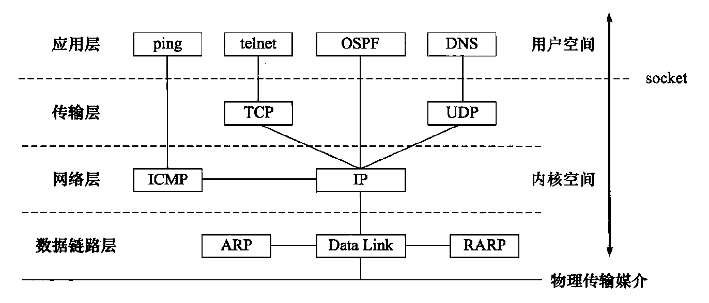
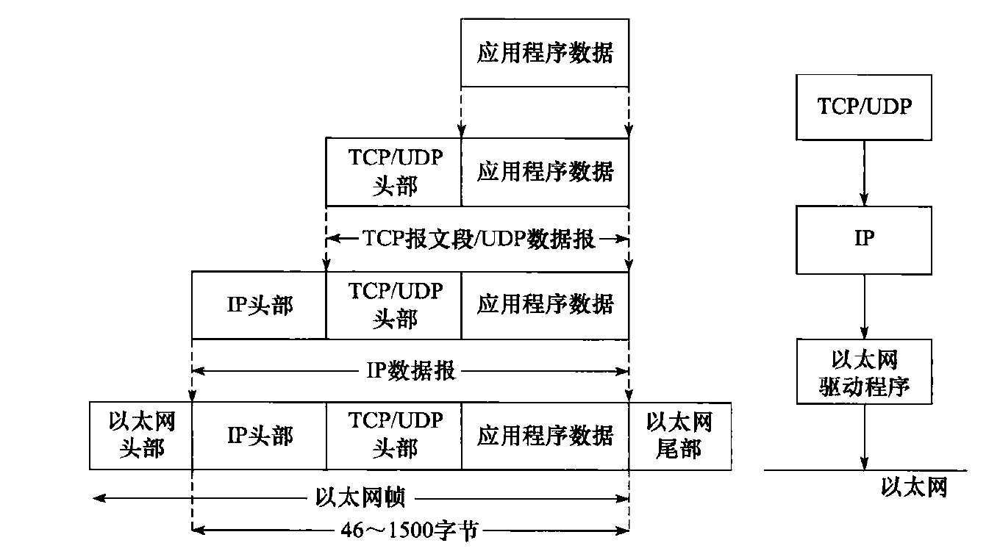
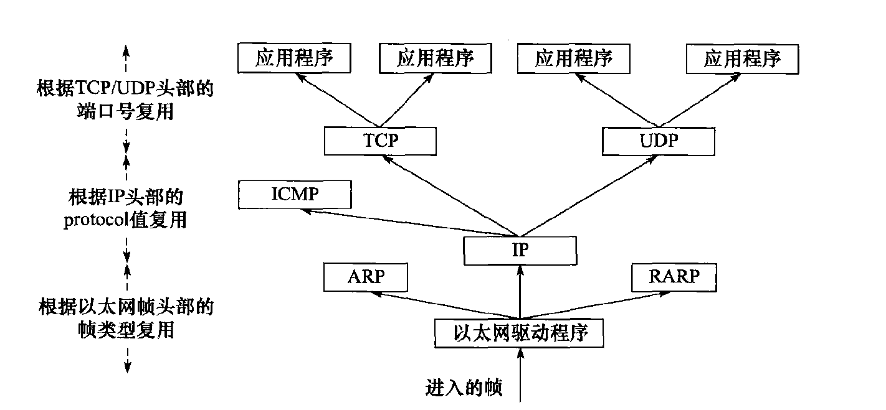
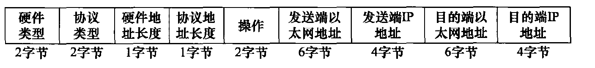
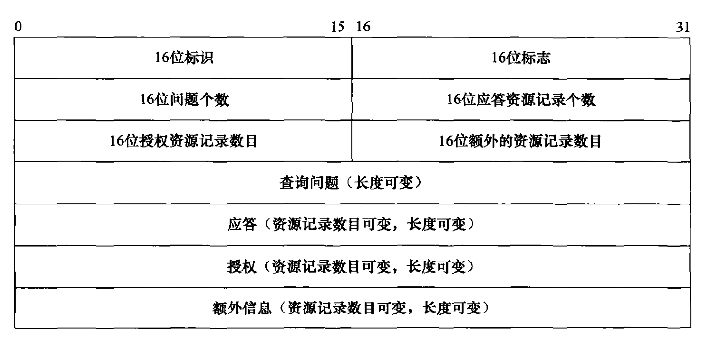
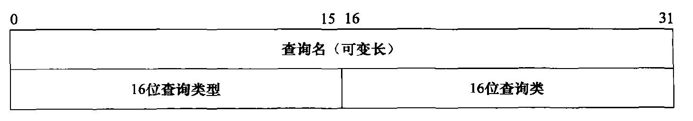
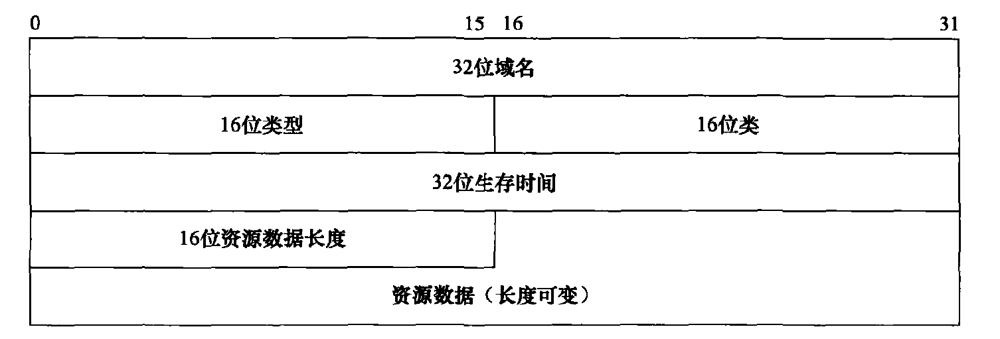
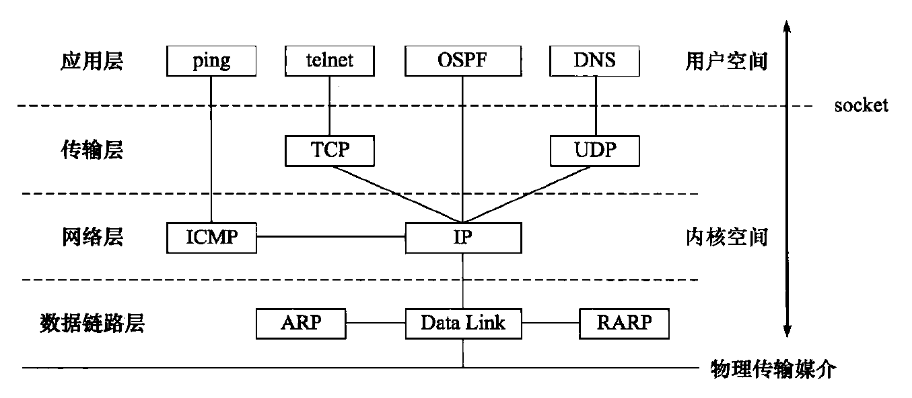
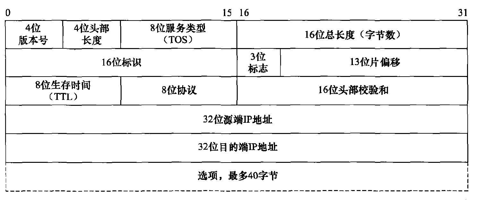

# 第一章 TCP/IP 协议族

现在 Internet （因特网）使用的主流协议族是 TCP/IP 协议族，它是一个**<font color='red'>分层、多协议的通信体系。</font>**

## 1.1 TCP/IP 协议族体系结构以及主要协议

TCP/IP 协议族是一个四层协议系统，自底而上分别是数据链路层、网络层、传输层和应用层：

 

### 1.1.1 数据链路层

数据链路层实现了网卡接口的**<font color='red'>网络驱动程序</font>**，以处理数据在物理媒介（比如以太网、令牌环等）上的传输。不同的物理网络具有不同的电气特性，网络驱动程序隐藏了这些细节，为上层协议提供一个统一的接口。

数据链路层两个常用的协议是 ARP 协议（Address Resolve Protocol，地址解析协议）和 RARP 协议（Reverse Address Resolve Protocol，逆地址解析协议）。它们实现了 IP 地址和MAC 地址之间的相互转换。

### 1.1.2 网络层

网络层实现数据包的**<font color='red'>选路和转发</font>**。 通信的两台主机一般不是直接相连的，而是通过多个中间节点（路由器）连接的。网络层的任务就是选择这些中间节点，以确定两台主机之间的通信路径。

网络层最核心的协议是 IP 协议（Internet Protocol，因特网协议）。IP 协议根据数据包的目的 IP 地址来决定如何投递它，为它选择合适的下一跳。

网络层另外一个重要的协议是 ICMP 协议（Internet Control Message Protocol，因特网控制报文协议）。它是 IP 协议的重要补充，主要用于检测网络连接。需要指出的是， ICMP 协议并非严格意义上的网络层协议，因为它使用处于同一层的 IP 协议提供的服务（一般来说，上层协议使用下层协议提供的服务）。

### 1.1.3 传输层

传输层为两台主机上的应用程序提供**<font color='red'>端到端</font>**（end to end）的通信。与网络层使用的逐跳通信方式不同，传输层只关心通信的起始端和目的端，而不在乎数据包的中转过程。

传输层协议主要有两个：TCP 协议 和 UDP 协议

1. TCP 协议（Transmission Control Protocol，传输控制协议）为应用层提供可靠的、面向连接的和基于流（stream）的服务。基于流的数据没有边界（长度）限制，它源源不断地从通信的一端流入另一端。发送端可以逐个字节地向数据流中写入数据，接收端也可以逐个字节地将它们读出。
2. UDP 协议(User Datagram Protocol，用户数据报协议）则与TCP 协议完全相反，它为应用层提供不可靠、无连接和基于数据报的服务。基于数据报的服务，是相对基于流的服务而言的。每个 UDP 数据报都有一个长度，接收端必须以该长度为最小单位将其所有内容一次性读出，否则数据将被截断。

### 1.1.4 应用层

应用层负责处理应用程序的逻辑，比如文件传输、名称查询和网络管理等。数据链路层、网络层和传输层负责处理网络通信细节。

应用层协议很多，以下仅列举了其中的几个：

1. ping 是应用程序，而不是协议，前面说过它利用 ICMP 报文检测网络连接，是调试网络环境的必备工具。
2. telnet 协议是一种远程登录协议，它使我们能在本地完成远程任务。
3. OSPF (Open Shortest Path First，开放最短路径优先）协议是一种动态路由更新协议，用于路由器之间的通信，以告知对方各自的路由信息。
4. DNS (Domain Name Service，域名服务）协议提供机器域名到 IP 地址的转换。

## 1.2 封装

应用程序数据在发送到物理网络上之前，将沿着协议栈从上往下依次传递。每层协议都将在上层数据的基础上加上自己的头部信息（有时还包括尾部信息），以实现该层的功能，这个过程就称为封装：

 

1. 经过 TCP 封装后的数据称为 **<font color='blue'>TCP 报文段</font>**（TCP message segment) ，或者简称 TCP 段。经过 UDP 封装后的数据称为 **<font color='blue'>UDP 数据报</font>**（UDP datagram）
2. 经过 IP 封装后的数据称为 **<font color='blue'>IP 数据报</font>**（IP datagram）
3. 经过数据链路层封装的数据称为**<font color='blue'>帧</font>**（frame）。帧才是最终在物理网络上传送的字节序列。至此，封装过程完成。

## 1.3 分用

当帧到达目的主机时，将沿着协议栈自底向上依次传递。各层协议依次处理帧中本层负责的头部数据，以获取所需的信息，并最终将处理后的帧交给目标应用程序。这个过程称为分用（demultiplexing）：

1. 因为 IP 协议、ARP 协议和 RARP 协议都使用帧传输数据，所以帧的头部需要提供某个字段（具体情况取决于帧的类型）来区分它们。以以太网帧为例，它使用 2 字节的类型字段来标识上层协议：
   * 如果主机接收到的以太网帧类型字段的值为 0x800，则帧的数据部分为IP 数据报，以太网驱动程序就将帧交付给 IP 模块
   * 若类型字段的值为 0x806，则帧的数据部分为 ARP 请求或应答报文，以太网驱动程序就将帧交付给 ARP 模块
   * 若类型字段的值为 0x835，则帧的数据部分为 RARP 请求或应答报文，以太网驱动程序就将帧交付给 RARP 模块

2. 因为 ICMP 协议、TCP 协议和 UDP 协议都使用 IP 协议，所以 IP 数据报的头部采用 16 位的协议（protocol）字段来区分它们。
3. TCP 报文段和 UDP 数据报则通过其头部中的 16 位的端口号（port number）字段来区分上层应用程序。比如 DNS 协议对应的端口号是 53，HTTP 协议对应的端口号是 80。

帧通过上述分用步骤后，最终将封装前的原始数据送至目标服务。这样，在顶层目标服务看来，**<font color='red'>封装和分用</font>**似乎没有发生过。

 

## 1.4 ARP 协议工作原理

ARP 协议能实现 IP 地址到 MAC 地址的转换。其工作原理是：

主机向自己所在的网络广播一个 ARP 请求，该请求包含目标机器的网络地址。此网络上的其他机器都将收到这个请求，但只有被请
求的目标机器会回应一个 ARP 应答，其中包含自己的物理地址。

### 1.4.1 ARP 请求／应答报文详解

ARP 请求／应答报文的格式为：

 

1. 硬件类型字段定义物理地址的类型，它的值为 1 表示 MAC 地址。
2. 协议类型字段表示要映射的协议地址类型，它的值为 0x800，表示 IP 地址。
3. 硬件地址长度字段和协议地址长度字段，顾名思义，其单位是字节。对 MAC 地址来说其长度为6，对 IP (v4) 地址来说其长度为 4 
4. 操作字段指出 4 种操作类型： 
   * ARP 请求（值为1) 
   * ARP 应答（值为2) 
   * RARP 请求（值为3) 
   * RARP 应答（值为4) 。

5. 最后 4 个字段指定通信双方的 MAC 地址和 IP 地址：
   * 发送端填充除目的端 MAC 地址的其他 3 个字段，以构建ARP 请求并发送之。
   * 接收端发现该请求的目的端 IP 地址是自己，就把自己的 MAC 地址填进去，然后交换两个目的端地址和两个发送端地址，以构建ARP 应答并返回之（当然，如前所述，操作字段需要设置为 2) 。

### 1.4.2 ARP 高速缓存的查看和修改

通常， ARP 维护一个高速缓存，其中包含经常访问（比如网关地址）或最近访问的机器的 IP 地址到物理地址的映射。这样就避免了重复的 ARP 请求，提高了发送数据包的速度。

Linux 下可以使用 【arp -a】 命令来查看和修改 ARP 高速缓存：

```shell
nxb@nxb-ubuntu:~/Desktop$ arp -a
? (192.168.189.1) at 00:50:56:c0:00:08 [ether] on ens33
_gateway (192.168.189.2) at 00:50:56:fe:b1:4f [ether] on ens33
```

下面两条命令则分别删除和添加一个 ARP 缓存项：

```shell
sudo arp -d 192.168.189.1					# 删除一个 ARP 缓存项
sudo arp -s 192.168.189.1 00:50:56:c0:00:08	# 添加一个 ARP 缓存项
```

## 1.5 DNS 工作原理

我们通常使用机器的域名来访问这台机器，而不直接使用其 IP 地址，比如访问因特网上的各种网站。那么如何将机器的域名转换成 IP 地址呢？这就需要使用域名查询服务，例如 DNS。

### 1.5.1 DNS 查询和应答报文详解

DNS 是一套分布式的域名服务系统。每个 DNS 服务器上都存放着大量的机器名和 IP 地址的映射，并且是动态更新的。众多网络客户端程序都使用 DNS 协议来向 DNS 服务器查询目标主机的 IP 地址。

DNS 查询和应答报文的格式如下：

 

1. 16 位标识字段用于标记一对 DNS 查询和应答，以此区分一个 DNS 应答是哪个DNS 查询的回应。

2. 16 位标志字段用千协商具体的通信方式和反馈通信状态：

    

   * QR，查询／应答标志。0 表示这是一个查询报文， 1 表示这是一个应答报文。
   * opcode，定义查询和应答的类型。0 表示标准查询， 1 表示反向查询（由IP 地址获得主机域名）， 2 表示请求服务器状态。
   * AA，授权应答标志，仅由应答报文使用。1 表示域名服务器是授权服务器。
   * TC，截断标志，仅当 DNS 报文使用 UDP 服务时使用。因为 UDP 数据报有长度限制，所以过长的 DNS 报文将被截断。1 表示DNS 报文超过 512 字节，并被截断。
   * RD，递归查询标志。
     * 1 表示执行**<font color='blue'>递归查询</font>**，即如果目标 DNS 服务器无法解析某个主机名，则它将向其他 DNS 服务器继续查询，如此递归，直到获得结果并把该结果返回给客户端。
     * 0 表示执行**<font color='blue'>迭代查询</font>**，即如果目标DNS 服务器无法解析某个主机名，则它将自已知道的其他 DNS 服务器的 IP 地址返回给客户端，以供客户端参考。
   * RA ，允许递归标志。仅由应答报文使用，1 表示DNS 服务器支持递归查询。
   * zero ，这 3 位未用，必须都设置为 0 。
   * rcode，4 位返回码，表示应答的状态。常用值有 0 （无错误）和 3 （域名不存在）。

3. 接下来的4 个字段则分别指出 DNS 报文的最后  4 个字段的资源记录数目。

4. 查询问题的格式为

    

   * 查询名以一定的格式封装了要查询的主机域名
   * 16 位查询类型表示如何执行查询操作，常见的类型有如下几种：
     * 类型 A，值是 1，表示获取目标主机的 IP 地址。
     * 类型 CNAME，值是 5，表示获得目标主机的别名。
     * 类型 PTR，值是 12，表示反向查询。
   * 16 位查询类通常为 1，表示获取 IP 地址

5. 应答字段、授权字段和额外信息字段都使用资源记录（Resource Record, RR）格式。资源记录格式如下：

    

   * 32 位域名是该记录中与资源对应的名字，其格式和查询问题中的查询名字段相同
   * 16 位类型和 16 位类字段的含义也与 DNS 查询问题的对应字段相同。
   * 32 位生存时间表示该查询记录结果可被本地客户端程序缓存多长时间，单位是秒。
   * 16 位资源数据长度字段和资源数据字段的内容取决于类型字段。对类型 A 而言，资源数据是 32 位的 IPv4 地址，而资源数据长度则为 4 （以字节为单位）。

### 1.5.2 Linux 下访问 DNS 服务

我们要访问 DNS 服务，就必须先知道 DNS 服务器的 IP 地址。Linux 使用 /etc/resolv.conf 文件来存放 DNS 服务器的 IP 地址：

```shell
nameserver 127.0.0.53
```

Linux 下一个常用的访问 DNS 服务器的客户端程序是 【host】，比如下面的命令是向首选 DNS 服务器查询机器 www.baidu.com 的 IP 地址：

```shell
nxb@nxb-ubuntu:~/Desktop$ host -t A www.baidu.com
www.baidu.com is an alias for www.a.shifen.com.
www.a.shifen.com has address 182.61.200.6
www.a.shifen.com has address 182.61.200.7
```

host 命令的输出告诉我们，机器名 www.baidu.com 是 www.a.shifen.com 的别名，并且该机器名对应两个 P 地址。

host 命令使用 DNS 协议和 DNS 服务器通信，其【-t】选项告诉 DNS 协议使用哪种查询类型。我们这里使用的是 A 类型，即通过机器的域名获得其 IP 地址。

## 1.6 socket 和 TCP/IP 协议族的关系

数据链路层、网络层、传输层协议是在内核中实现的。因此操作系统需要实现一组系统调用，使得应用程序能够访问这些协议提供的服务。socket 即是实现这组系统调用的 API：

 

由 socket 定义的这一组 API 提供如下两点功能：

1. 将应用程序数据从用户缓冲区中复制到 TCP/UDP 内核发送缓冲区，以交付内核来发送数据，或者是从内核 TCP/UDP 接收缓冲区中复制数据到用户缓冲区，以读取数据
2. 应用程序可以通过它们来修改内核中各层协议的某些头部信息或其他数据结构，从而精细地控制底层通信的行为。比如可以通过`setsockopt` 函数来设置 IP 数据报在网络上的存活时间。

# 第2 章 IP 协议详解

## 2.1 IP 服务的特点

IP 协议为上层协议提供无状态、无连接、不可靠的服务：

* 无状态（stateless）是指 IP 通信双方不同步传输数据的状态信息，因此所有 IP 数据报的发送、传输和接收都是相互独立、没有上下文关系的。这种服务最大的缺点是无法处理乱序和重复的 IP 数据报。这种服务的优点也很明显：简单、高效。我们无须为保持通信的状态而分配一些内核资源，也无须每次传输数据时都携带状态信息。
* 无连接（connectionless）是指 IP 通信双方都不长久地维持对方的任何信息。这样，上层协议每次发送数据的时候，都必须明确指定对方的 IP 地址。
* 不可靠是指 IP 协议不能保证 IP 数据报准确地到达接收端，它只是承诺尽最大努力。发送端的 IP 模块一旦检测到 IP 数据报发送失败，就通知上层协议发送失败，而不会试图重传。因此，**<font color='red'>使用 IP 服务的上层协议（比如 TCP 协议）需要自己实现数据确认、超时重传等机制以达到可靠传输的目的。</font>**

## 2.2 IPv4 头部结构

IPv4 的头部结构如图所示，其长度通常为 20 字节，除非含有可变长的选项部分。

 

1. 4 位**版本号**指定 IP 协议的版本。对 IPv4 来说，其值是4 。

2. 4 位**头部长度**标识该 IP 头部有多少个 32 bit 字（4 字节）。因为 4 位最大能表示 15，所以 IP 头部最长是60 字节。

3. 8 位**服务类型**（Type Of Service，TOS）包括：

   * 3 位的优先权字段（现在已经被忽略）

   * 4 位的TOS 字段，每个字段分别表示：

     * 最小延时
     * 最大吞吐量
     * 最高可靠性
     * 最小费用

     其中最多有一个能置为 1 ，应用程序应该根据实际需要来设置它。比如像 ssh 和 telnet 这样的登录程序需要的是最小延时的服务，而文件传输程序 ftp 则需要最大吞吐最的服务。

   * 1 位保留字段（必须置0) 。

4. 16 位**总长度**是指整个 IP 数据报的长度，以字节为单位，因此 IP 数据报的最大长度为$65535$ ($2^{16}-1$) 字节。但由于 MTU 的限制，长度超过 MTU 的数据报都将被分片传输，所以实际传输的 IP 数据报（或分片）的长度都远远没有达到最大值。

接下来的 3 个字段则描述了如何实现分片

5. 16 位**标识**唯一地标识主机发送的每一个数据报。其初始值由系统随机生成；每发送一个数据报，其值就加 1 。该值在数据报分片时被复制到每个分片中，因此**<font color='red'>同一个数据报的所有分片都具有相同的标识值</font>**。

6. 3 位**标志**字段：

   * 第一位保留。
   * 第二位（Don't Fragment, DF）表示 “禁止分片”。如果设置了这个位， IP 模块将不对数据报进行分片。在这种情况下，如果 IP 数据报长度超过 MTU 的话， IP 模块将丢弃该数据报并返回一个 ICMP 差错报文。
   * 第三位（More Fragment, MF）表示 “更多分片”。除了数据报的最后一个分片外，其他分片都要把它置 1。

7. 13 位分片偏移是分片相对原始IP 数据报开始处（仅指数据部分）的偏移。实际的偏移值是该值左移 3 位（乘8) 后得到的。由于这个原因，除了最后一个 IP 分片外，每个 IP 分片的数据部分的长度必须是 8 的整数倍（这样才能保证后面的 IP 分片拥有一个合适的偏移值）。

   

8. 8 位生存时间（Time To Live, TTL）是数据报到达目的地之前允许经过的路由器跳数。TTL 值被发送端设詈（常见的值是64) 。数据报在转发过程中每经过一个路由，该值就被路由器减 1。当 TTL 值减为0 时，路由器将丢弃数据报，并向源端发送一个 ICMP 差错报文。TTL 值可以防止数据报陷入路由循环。