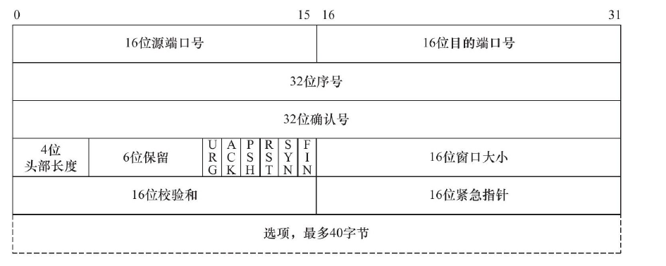

# 第 1 章 TCP/IP 协议族

现在 Internet （因特网）使用的主流协议族是 TCP/IP 协议族，它是一个**<font color='red'>分层、多协议的通信体系。</font>**

## 1.1 TCP/IP 协议族体系结构以及主要协议

TCP/IP 协议族是一个四层协议系统，自底而上分别是数据链路层、网络层、传输层和应用层：

 

### 1.1.1 数据链路层

数据链路层实现了网卡接口的**<font color='red'>网络驱动程序</font>**，以处理数据在物理媒介（比如以太网、令牌环等）上的传输。不同的物理网络具有不同的电气特性，网络驱动程序隐藏了这些细节，为上层协议提供一个统一的接口。

数据链路层两个常用的协议是 ARP 协议（Address Resolve Protocol，地址解析协议）和 RARP 协议（Reverse Address Resolve Protocol，逆地址解析协议）。它们实现了 IP 地址和MAC 地址之间的相互转换。

### 1.1.2 网络层

网络层实现数据包的**<font color='red'>选路和转发</font>**。 通信的两台主机一般不是直接相连的，而是通过多个中间节点（路由器）连接的。网络层的任务就是选择这些中间节点，以确定两台主机之间的通信路径。

网络层最核心的协议是 IP 协议（Internet Protocol，因特网协议）。IP 协议根据数据包的目的 IP 地址来决定如何投递它，为它选择合适的下一跳。

网络层另外一个重要的协议是 ICMP 协议（Internet Control Message Protocol，因特网控制报文协议）。它是 IP 协议的重要补充，主要用于检测网络连接。需要指出的是， ICMP 协议并非严格意义上的网络层协议，因为它使用处于同一层的 IP 协议提供的服务（一般来说，上层协议使用下层协议提供的服务）。

### 1.1.3 传输层

传输层为两台主机上的应用程序提供**<font color='red'>端到端</font>**（end to end）的通信。与网络层使用的逐跳通信方式不同，传输层只关心通信的起始端和目的端，而不在乎数据包的中转过程。

传输层协议主要有两个：TCP 协议 和 UDP 协议

1. TCP 协议（Transmission Control Protocol，传输控制协议）为应用层提供可靠的、面向连接的和基于流（stream）的服务。基于流的数据没有边界（长度）限制，它源源不断地从通信的一端流入另一端。发送端可以逐个字节地向数据流中写入数据，接收端也可以逐个字节地将它们读出。
2. UDP 协议(User Datagram Protocol，用户数据报协议）则与TCP 协议完全相反，它为应用层提供不可靠、无连接和基于数据报的服务。基于数据报的服务，是相对基于流的服务而言的。每个 UDP 数据报都有一个长度，接收端必须以该长度为最小单位将其所有内容一次性读出，否则数据将被截断。

### 1.1.4 应用层

应用层负责处理应用程序的逻辑，比如文件传输、名称查询和网络管理等。数据链路层、网络层和传输层负责处理网络通信细节。

应用层协议很多，以下仅列举了其中的几个：

1. ping 是应用程序，而不是协议，前面说过它利用 ICMP 报文检测网络连接，是调试网络环境的必备工具。
2. telnet 协议是一种远程登录协议，它使我们能在本地完成远程任务。
3. OSPF (Open Shortest Path First，开放最短路径优先）协议是一种动态路由更新协议，用于路由器之间的通信，以告知对方各自的路由信息。
4. DNS (Domain Name Service，域名服务）协议提供机器域名到 IP 地址的转换。

## 1.2 封装

应用程序数据在发送到物理网络上之前，将沿着协议栈从上往下依次传递。每层协议都将在上层数据的基础上加上自己的头部信息（有时还包括尾部信息），以实现该层的功能，这个过程就称为封装：

 

1. 经过 TCP 封装后的数据称为 **<font color='blue'>TCP 报文段</font>**（TCP message segment) ，或者简称 TCP 段。经过 UDP 封装后的数据称为 **<font color='blue'>UDP 数据报</font>**（UDP datagram）
2. 经过 IP 封装后的数据称为 **<font color='blue'>IP 数据报</font>**（IP datagram）
3. 经过数据链路层封装的数据称为**<font color='blue'>帧</font>**（frame）。帧才是最终在物理网络上传送的字节序列。至此，封装过程完成。

## 1.3 分用

当帧到达目的主机时，将沿着协议栈自底向上依次传递。各层协议依次处理帧中本层负责的头部数据，以获取所需的信息，并最终将处理后的帧交给目标应用程序。这个过程称为分用（demultiplexing）：

1. 因为 IP 协议、ARP 协议和 RARP 协议都使用帧传输数据，所以帧的头部需要提供某个字段（具体情况取决于帧的类型）来区分它们。以以太网帧为例，它使用 2 字节的类型字段来标识上层协议：
   * 如果主机接收到的以太网帧类型字段的值为 0x800，则帧的数据部分为IP 数据报，以太网驱动程序就将帧交付给 IP 模块
   * 若类型字段的值为 0x806，则帧的数据部分为 ARP 请求或应答报文，以太网驱动程序就将帧交付给 ARP 模块
   * 若类型字段的值为 0x835，则帧的数据部分为 RARP 请求或应答报文，以太网驱动程序就将帧交付给 RARP 模块

2. 因为 ICMP 协议、TCP 协议和 UDP 协议都使用 IP 协议，所以 IP 数据报的头部采用 16 位的协议（protocol）字段来区分它们。
3. TCP 报文段和 UDP 数据报则通过其头部中的 16 位的端口号（port number）字段来区分上层应用程序。比如 DNS 协议对应的端口号是 53，HTTP 协议对应的端口号是 80。

帧通过上述分用步骤后，最终将封装前的原始数据送至目标服务。这样，在顶层目标服务看来，**<font color='red'>封装和分用</font>**似乎没有发生过。

  

## 1.4 ARP 协议工作原理

ARP 协议能实现 IP 地址到 MAC 地址的转换。其工作原理是：

主机向自己所在的网络广播一个 ARP 请求，该请求包含目标机器的网络地址。此网络上的其他机器都将收到这个请求，但只有被请
求的目标机器会回应一个 ARP 应答，其中包含自己的物理地址。

### 1.4.1 ARP 请求／应答报文详解

ARP 请求／应答报文的格式为：

 

1. **硬件类型**字段定义物理地址的类型，它的值为 1 表示 MAC 地址。
2. **协议类型**字段表示要映射的协议地址类型，它的值为 0x800，表示 IP 地址。
3. **硬件地址长度**字段和**协议地址长度**字段，顾名思义，其单位是字节。对 MAC 地址来说其长度为6，对 IP (v4) 地址来说其长度为 4 
4. **操作**字段指出 4 种操作类型： 
   * ARP 请求（值为1) 
   * ARP 应答（值为2) 
   * RARP 请求（值为3) 
   * RARP 应答（值为4) 。

5. 最后 4 个字段指定通信双方的 MAC 地址和 IP 地址：
   * 发送端填充除目的端 MAC 地址的其他 3 个字段，以构建ARP 请求并发送之。
   * 接收端发现该请求的目的端 IP 地址是自己，就把自己的 MAC 地址填进去，然后交换两个目的端地址和两个发送端地址，以构建ARP 应答并返回之（当然，如前所述，操作字段需要设置为 2) 。

### 1.4.2 ARP 高速缓存的查看和修改

通常， ARP 维护一个高速缓存，其中包含经常访问（比如网关地址）或最近访问的机器的 IP 地址到物理地址的映射。这样就避免了重复的 ARP 请求，提高了发送数据包的速度。

Linux 下可以使用 【arp -a】 命令来查看和修改 ARP 高速缓存：

```shell
nxb@nxb-ubuntu:~/Desktop$ arp -a
? (192.168.189.1) at 00:50:56:c0:00:08 [ether] on ens33
_gateway (192.168.189.2) at 00:50:56:fe:b1:4f [ether] on ens33
```

下面两条命令则分别删除和添加一个 ARP 缓存项：

```shell
sudo arp -d 192.168.189.1					# 删除一个 ARP 缓存项
sudo arp -s 192.168.189.1 00:50:56:c0:00:08	# 添加一个 ARP 缓存项
```

## 1.5 DNS 工作原理

我们通常使用机器的域名来访问这台机器，而不直接使用其 IP 地址，比如访问因特网上的各种网站。那么如何将机器的域名转换成 IP 地址呢？这就需要使用域名查询服务，例如 DNS。

### 1.5.1 DNS 查询和应答报文详解

DNS 是一套分布式的域名服务系统。每个 DNS 服务器上都存放着大量的机器名和 IP 地址的映射，并且是动态更新的。众多网络客户端程序都使用 DNS 协议来向 DNS 服务器查询目标主机的 IP 地址。

DNS 查询和应答报文的格式如下：

  

1. 16 位标识字段用于标记一对 DNS 查询和应答，以此区分一个 DNS 应答是哪个DNS 查询的回应。

2. 16 位标志字段用千协商具体的通信方式和反馈通信状态：

       

   * QR，查询／应答标志。0 表示这是一个查询报文， 1 表示这是一个应答报文。
   * opcode，定义查询和应答的类型。0 表示标准查询， 1 表示反向查询（由IP 地址获得主机域名）， 2 表示请求服务器状态。
   * AA，授权应答标志，仅由应答报文使用。1 表示域名服务器是授权服务器。
   * TC，截断标志，仅当 DNS 报文使用 UDP 服务时使用。因为 UDP 数据报有长度限制，所以过长的 DNS 报文将被截断。1 表示DNS 报文超过 512 字节，并被截断。
   * RD，递归查询标志。
     * 1 表示执行**<font color='blue'>递归查询</font>**，即如果目标 DNS 服务器无法解析某个主机名，则它将向其他 DNS 服务器继续查询，如此递归，直到获得结果并把该结果返回给客户端。
     * 0 表示执行**<font color='blue'>迭代查询</font>**，即如果目标DNS 服务器无法解析某个主机名，则它将自已知道的其他 DNS 服务器的 IP 地址返回给客户端，以供客户端参考。
   * RA ，允许递归标志。仅由应答报文使用，1 表示DNS 服务器支持递归查询。
   * zero ，这 3 位未用，必须都设置为 0 。
   * rcode，4 位返回码，表示应答的状态。常用值有 0 （无错误）和 3 （域名不存在）。

3. 接下来的4 个字段则分别指出 DNS 报文的最后  4 个字段的资源记录数目。

4. 查询问题的格式为

       

   * 查询名以一定的格式封装了要查询的主机域名
   * 16 位查询类型表示如何执行查询操作，常见的类型有如下几种：
     * 类型 A，值是 1，表示获取目标主机的 IP 地址。
     * 类型 CNAME，值是 5，表示获得目标主机的别名。
     * 类型 PTR，值是 12，表示反向查询。
   * 16 位查询类通常为 1，表示获取 IP 地址

5. 应答字段、授权字段和额外信息字段都使用资源记录（Resource Record, RR）格式。资源记录格式如下：

       

   * 32 位域名是该记录中与资源对应的名字，其格式和查询问题中的查询名字段相同
   * 16 位类型和 16 位类字段的含义也与 DNS 查询问题的对应字段相同。
   * 32 位生存时间表示该查询记录结果可被本地客户端程序缓存多长时间，单位是秒。
   * 16 位资源数据长度字段和资源数据字段的内容取决于类型字段。对类型 A 而言，资源数据是 32 位的 IPv4 地址，而资源数据长度则为 4 （以字节为单位）。

### 1.5.2 Linux 下访问 DNS 服务

我们要访问 DNS 服务，就必须先知道 DNS 服务器的 IP 地址。Linux 使用 /etc/resolv.conf 文件来存放 DNS 服务器的 IP 地址：

```shell
nameserver 127.0.0.53
```

Linux 下一个常用的访问 DNS 服务器的客户端程序是 【host】，比如下面的命令是向首选 DNS 服务器查询机器 www.baidu.com 的 IP 地址：

```shell
nxb@nxb-ubuntu:~/Desktop$ host -t A www.baidu.com
www.baidu.com is an alias for www.a.shifen.com.
www.a.shifen.com has address 182.61.200.6
www.a.shifen.com has address 182.61.200.7
```

host 命令的输出告诉我们，机器名 www.baidu.com 是 www.a.shifen.com 的别名，并且该机器名对应两个 P 地址。

host 命令使用 DNS 协议和 DNS 服务器通信，其【-t】选项告诉 DNS 协议使用哪种查询类型。我们这里使用的是 A 类型，即通过机器的域名获得其 IP 地址。

## 1.6 socket 和 TCP/IP 协议族的关系

**<font color='red'>数据链路层、网络层、传输层协议是在内核中实现的</font>**。因此操作系统需要实现一组系统调用，使得应用程序能够访问这些协议提供的服务。socket 即是实现这组系统调用的 API：

  

由 socket 定义的这一组 API 提供如下两点功能：

1. 将应用程序数据从用户缓冲区中复制到 TCP/UDP 内核发送缓冲区，以交付内核来发送数据，或者是从内核 TCP/UDP 接收缓冲区中复制数据到用户缓冲区，以读取数据
2. 应用程序可以通过它们来修改内核中各层协议的某些头部信息或其他数据结构，从而精细地控制底层通信的行为。比如可以通过`setsockopt` 函数来设置 IP 数据报在网络上的存活时间。

# 第 2 章 IP 协议详解

## 2.1 IP 服务的特点

IP 协议为上层协议提供无状态、无连接、不可靠的服务：

* 无状态（stateless）是指 IP 通信双方不同步传输数据的状态信息，因此所有 IP 数据报的发送、传输和接收都是相互独立、没有上下文关系的。这种服务最大的缺点是无法处理乱序和重复的 IP 数据报。这种服务的优点也很明显：简单、高效。我们无须为保持通信的状态而分配一些内核资源，也无须每次传输数据时都携带状态信息。
* 无连接（connectionless）是指 IP 通信双方都不长久地维持对方的任何信息。这样，上层协议每次发送数据的时候，都必须明确指定对方的 IP 地址。
* 不可靠是指 IP 协议不能保证 IP 数据报准确地到达接收端，它只是承诺尽最大努力。发送端的 IP 模块一旦检测到 IP 数据报发送失败，就通知上层协议发送失败，而不会试图重传。因此，**<font color='red'>使用 IP 服务的上层协议（比如 TCP 协议）需要自己实现数据确认、超时重传等机制以达到可靠传输的目的。</font>**

## 2.2 IPv4 头部结构

IPv4 的头部结构如图所示，其长度通常为 20 字节，除非含有可变长的选项部分。

 

1. 4 位**版本号**指定 IP 协议的版本。对 IPv4 来说，其值是4 。

2. 4 位**头部长度**标识该 IP 头部有多少个 32 bit 字（4 字节）。因为 4 位最大能表示 15，所以 IP 头部最长是60 字节。

3. 8 位**服务类型**（Type Of Service，TOS）包括：

   * 3 位的优先权字段（现在已经被忽略）

   * 4 位的TOS 字段，每个字段分别表示：

     * 最小延时
     * 最大吞吐量
     * 最高可靠性
     * 最小费用

     其中最多有一个能置为 1 ，应用程序应该根据实际需要来设置它。比如像 ssh 和 telnet 这样的登录程序需要的是最小延时的服务，而文件传输程序 ftp 则需要最大吞吐最的服务。

   * 1 位保留字段（必须置0) 。

4. 16 位**总长度**是指整个 IP 数据报的长度，以字节为单位，因此 IP 数据报的最大长度为$65535$ ($2^{16}-1$) 字节。但由于 MTU 的限制，长度超过 MTU 的数据报都将被分片传输，所以实际传输的 IP 数据报（或分片）的长度都远远没有达到最大值。

接下来的 3 个字段则描述了如何实现分片：

5. 16 位**标识**唯一地标识主机发送的每一个数据报。其初始值由系统随机生成；每发送一个数据报，其值就加 1 。该值在数据报分片时被复制到每个分片中，因此**<font color='red'>同一个数据报的所有分片都具有相同的标识值</font>**。

6. 3 位**标志**字段：

   * 第一位保留。
   * 第二位（Don't Fragment, DF）表示 “禁止分片”。如果设置了这个位， IP 模块将不对数据报进行分片。在这种情况下，如果 IP 数据报长度超过 MTU 的话， IP 模块将丢弃该数据报并返回一个 ICMP 差错报文。
   * 第三位（More Fragment, MF）表示 “更多分片”。除了数据报的最后一个分片外，其他分片都要把它置 1。

7. 13 位**分片偏移**是分片相对原始IP 数据报开始处（仅指数据部分）的偏移。实际的偏移值是该值左移 3 位（乘8) 后得到的。由于这个原因，除了最后一个 IP 分片外，每个 IP 分片的数据部分的长度必须是 8 的整数倍（这样才能保证后面的 IP 分片拥有一个合适的偏移值）。

   

8. 8 位**生存时间**（Time To Live, TTL）是数据报到达目的地之前允许经过的路由器跳数。TTL 值被发送端设詈（常见的值是64) 。数据报在转发过程中每经过一个路由，该值就被路由器减 1。当 TTL 值减为0 时，路由器将丢弃数据报，并向源端发送一个 ICMP 差错报文。TTL 值可以防止数据报陷入路由循环。

9. 8 位**协议**（protocol）用来区分上层协议，我们在第1 章讨论过。/etc/protocols 文件定义了所有上层协议对应的 protocol 字段的数值。其中， ICMP 是 1，TCP 是 6，UDP 是17。

10. 16 位**头部校验和**由发送端填充，接收端对其使用 CRC 算法以检验 IP 数据报头部（注意，**<font color='red'>仅检验头部</font>**）在传输过程中是否损坏。

11. 32 位的源端 IP 地址和目的端 IP 地址用来标识数据报的发送端和接收端。

12. IPv4 最后一个**选项**字段是可变长的可选信息。这部分最多包含　40 字节，因为IP 头部最长是60 字节（其中还包含前面讨论的20 字节的固定部分）。可用的IP 选项包括：

    * 记录路由

      告诉数据报途经的所有**路由器**都将**自己的 IP 地址**填入 IP 头部的选项部分，这样我们就可以跟踪数据报的传递路径。

    * 时间戳

      告诉每个路由器都将**数据报被转发的时间**填入 IP 头部的选项部分，这样就可以测量途经路由之间数据报传输的时间。

    * 松散源路由选择

      指定一个路由器 IP 地址列表，数据报发送过程中必须经过其中所有的路由器。

    * 严格源路由选择

      和松散源路由选择类似，不过数据报只能经过被指定的路由器。

## 2.3 IP 分片

当 IP 数据报的长度超过帧的 MTU 时，它将被分片传输。分片可能发生在发送端，也可能发生在中转路由器上，而且可能在传输过程中被多次分片，但只有在最终的目标机器上，这些分片才会被内核中的 IP 模块重新组装。

**<font color='red'>以太网帧的 MTU 是1500 字节</font>**，因此它携带的 IP 数据报的数据部分最多是 1480 字节(IP 头部占用20 字节）。

考虑用 IP 数据报封装一个长度为 1481 字节的 ICMP 报文（包括 8 字节的 ICMP 头部，所以其数据部分长度为 1473 字节），则该数据报在使用以太网帧传输时必须被分片：

  

从图中可以看出：

1. 第一个 IP 分片长度为 1500 字节，第二个 IP 分片的长度为 21 字节
2. **<font color='red'>每个 IP 分片都包含自己的 IP 头部（20 字节）</font>**
3. 第一个 IP 分片的 IP 头部设置了 MF 标志，而第二个 IP 分片的 IP 头部则没有设置该标志，因为它已经是最后一个分片了
4. **<font color='red'>原始 IP 数据报中的 ICMP 头部内容被完整地复制到了第一个 IP 分片中，第二个 IP 分片不包含 ICMP 头部信息</font>**。因为 IP 模块重组该 ICMP 报文的时候只需要一份 ICMP 头部信息，重复传送这个信息没有任何益处。

## 2.4 IP 路由

### 2.4.1 IP 模块工作流程

 

1. 当 IP 模块接收到来自数据链路层的 IP 数据报时，它首先对该数据报的头部做 CRC 校验，确认无误之后就分析其头部的具体信息：
   * 如果该 IP 数据报的头部设置了源站选路选项（松散源路由选择或严格源路由选择），则 IP 模块调用数据报转发子模块来处理该数据报。
   * 如果该 IP 数据报的头部中目标 IP 地址是本机的某个 IP 地址，或者是广播地址，即该数据报是发送给本机的，则 IP 模块就根据数据报头部中的协议字段来决定将它派发给哪个上层应用（分用）。
   * 如果 IP 模块发现这个数据报不是发送给本机的，则也调用数据报转发子模块来处理该数据报。
2. 数据报转发子模块将首先检测系统是否允许转发，如果不允许， IP 模块就将数据报丢弃。如果允许，数据报转发子模块将对该数据报执行一些操作，然后将它交给 IP 数据报输出子模块。
3. IP 数据报应该发送至哪个下一跳路由（或者目标机器），以及经过哪个网卡来发送，就是 IP 路由过程。IP 模块实现数据报路由的核心数据结构是**<font color='red'>路由表</font>**。这个表按照数据报的目标 IP 地址分类，同一类型的 IP 数据报将被发往相同的下一跳路由器（或者目标机器）

### 2.4.2 路由机制

在 Linux 系统中，我们可以使用【route】命令或 【netstat】 命令查看路由表：

```shell
[centos.nxb@centos ~]$ route
Kernel IP routing table
Destination     Gateway         Genmask         Flags Metric Ref    Use Iface
192.168.1.0     0.0.0.0         255.255.255.0   U     100    0        0 ens33
192.168.122.0   0.0.0.0         255.255.255.0   U     0      0        0 virbr0
```

路由表中每项都包含 8 个字段：

| 字段        | 含义                                                         |
| ----------- | ------------------------------------------------------------ |
| Destination | 目标网络或主机                                               |
| Gateway     | 网关地址，＊表示目标和本机在同一个网络，不需要路由           |
| Genmask     | 网络掩码                                                     |
| Flags       | 路由项标志，常见标志有如下 5 种:<br />u，该路由项是活动的；<br/>H ，该路由项的目标是一台主机；<br/>G ，该路由项的目标是网关；<br/>D ，该路由项是由重定向生成的；<br/>M ，该路由项被重定向修改过 |
| Metric      | Metric 路由距离，即到达指定网络所需的中转数                  |
| Ref         | 路由项被引用的次数（Linux 未使用）                           |
| Use         | 该路由项被使用的次数                                         |
| Iface       | 该路由项对应的输出网卡接口                                   |

### 2.4.3 路由表更新

路由表必须能够更新，以反映网络连接的变化，这样 IP 模块才能准确、高效地转发数据报。

【route】 命令可以修改路由表，通过【route】或其他工具手工修改路由表，是静态的路由更新方式。

对于大型的路由器，它们通常通过 BGP（Border Gateway Protocol, 边际网关协议）、RIP（Routing Information Protocol, 路由信息协议）、OSPF 等协议来发现路径，并更新自己的路由表。这种更新方式是动态的、自动的。

## 2.5 IP 转发

数据报转发子模块将对期望转发的数据报执行如下操作：

1. 检查数据报头部的 TTL 值。如果 TTL 值已经是 0，则丢弃该数据报。
2. 查看数据报头部的严格源路由选择选项。如果该选项被设置，则检测数据报的目标 IP 地址是否是本机的某个 IP 地址。如果不是，则发送一个 ICMP 源站选路失败报文给发送端。
3. 如果有必要，则给源端发送一个 ICMP 重定向报文，以告诉它一个更合理的下一跳路由器。
4. 将 TTL 值减 1。
5. 处理 IP 头部选项。
6. 如果有必要，则执行 IP 分片操作。

## 2.6 重定向

ICMP 重定向报文也能用于更新路由表。

### 2.6.1 ICMP 重定向报文

ICMP 重定向报文格式如图所示：

  

ICMP 报文**头部**的 3 个固定字段：

1. 8 位类型

   ICMP 重定向报文的类型值是 5

2. 8 位代码

   代码字段有 4 个可选值，用来区分不同的重定向类型。我们仅讨论主机重定向，其代码值为 1。

3. 16 位校验和

ICMP 重定向报文的**数据部分**含义很明确，它给接收方提供了如下两个信息：

* 引起重定向的I P 数据报的源端 IP 地址。
* 应该使用的路由器的IP 地址。

 

# 第 3 章 TCP 协议详解 

和 IP 协议相比， TCP 协议更靠近应用层，因此在应用程序中具有更强的可操作性。一些重要的 socket 选项都和 TCP 协议相关。

## 3.1 TCP 服务的特点

传输层协议主要有两个：TCP 协议和 UDP 协议。TCP 协议相对于 UDP 协议的特点是：**<font color='blue'>面向连接、字节流和可靠传输。</font>**

1. 使用 TCP 协议通信的双方必须先建立连接，然后才能开始数据的读写。**<font color='red'>双方都必须为该连接分配必要的内核资源</font>**，以管理连接的状态和连接上数据的传输。TCP 连接是**<font color='red'>全双工</font>**的，即双方的数据读写可以通过一个连接进行。完成数据交换之后，通信双方都必须断开连接以释放系统资源。

2. TCP 提供**<font color='red'>字节流服务</font>**

   * 当发送端应用程序连续执行多次写操作时， TCP 模块先将这些数据放入 TCP 发送缓冲区中。当 TCP 模块真正开始发送数据时，发送缓冲区中这些等待发送的数据可能被封装成一个或多个 TCP 报文段发出。因此，**<font color='red'>TCP 模块发送出的 TCP 报文段的个数和应用程序执行的写操作次数之间没有固定的数量关系。</font>**
   * 当接收端收到一个或多个 TCP 报文段后，TCP 模块将它们携带的应用程序数据按照 TCP 报文段的序号依次放入 TCP 接收缓冲区中，并通知应用程序读取数据。接收端应用程序可以一次性将 TCP 接收缓冲区中的数据全部读出，也可以分多次读取，这取决于用户指定的应用程序读缓冲区的大小。因此，**<font color='red'>应用程序执行的读操作次数和 TCP 模块接收到的 TCP 报文段个数之间也没有固定的数量关系。</font>**

   这就是字节流的概念：应用程序对数据的发送和接收是没有边界限制的。UDP 则不然，发送端应用程序每执行一次写操作，UDP 模块就将其封装成一个 UDP 数据报并发送之。接收端必须及时针对每一个 UDP 数据报执行读操作。

    

3. TCP 传输是可靠的
   * 首先， TCP 协议采用**<font color='red'>发送应答机制</font>**，即发送端发送的每个 TCP 报文段都必须得到接收方的应答，才认为这个 TCP 报文段传输成功。
   * 其次， TCP 协议采用**<font color='red'>超时重传机制</font>**，发送端在发送出一个 TCP 报文段之后启动定时器，如果在定时时间内未收到应答，它将重发该报文段。
   * 最后，因为 TCP 报文段最终是以 IP 数据报发送的，而 IP 数据报到达接收端可能乱序、重复，所以 TCP 协议还会对接收到的 TCP 报文段**<font color='red'>重排、整理</font>**，再交付给应用层。

## 3.2 TCP 头部结构

TCP 头部用于指定通信的源端端口，目的端端口，管理 TCP 连接等，包括固定头部结构和头部选项。

### 3.2.1 TCP 固定头部结构

 TCP 头部结构如图所示

 

1. 16 位**端口号**：告知主机该报文段是来自哪里（源端口）以及传给哪个上层协议或应用程序（目的端口）的。

2. 32 位**序号**：一次 TCP 通信过程中某一个传输方向上的字节流的每个字节的编号。

   假设主机 A 和主机 B 进行 TCP 通信，A 发送给 B 的第一个 TCP 报文段中，序号值被系统初始化为某个随机值。那么在该传输方向上（从A到B），后续的 TCP 报文段中序号值将被系统设置成该随机值加上该报文段所携带数据的第一个字节在整个字节流中的偏移。

3. 32 位**确认号**：用作对另一方发送来的 TCP 报文段的响应。其值是收到的 TCP 报文段的序号值加 1。

   假设主机 A 和主机 B 进行 TCP 通信，那么 A 发送出的 TCP 报文段不仅携带自己的序号，而且包含对 B 发送来的 TCP 报文段的确认号。

4. 4 位**头部长度**：标识该 TCP 头部有多少个 32bit 字（4字节）。因为4位最大能表示 15，所以 TCP 头部最长是60 字节。

5. 6位**标志位**包含如下几项：

   * URG 标志，表示紧急指针（urgent pointer）是否有效。
   * ACK 标志，表示确认号是否有效。我们称携带 ACK 标志的 TCP 报文段为**<font color='blue'>确认报文段</font>**。
   * PSH 标志，提示接收端应用程序应该立即从 TCP 接收缓冲区中读走数据，为接收后续数据腾出空间。
   * RST 标志，表示要求对方重新建立连接。我们称携带 RST 标志的 TCP 报文段为**<font color='blue'>复位报文段</font>**。
   * SYN 标志，表示请求建立一个连接。我们称携带 SYN 标志的TCP 报文段为**<font color='blue'>同步报文段</font>**。
   * FIN 标志，表示通知对方本端要关闭连接了。我们称携带 FIN 标志的 TCP 报文段为**<font color='blue'>结束报文段</font>**。

6. 16 位**窗口大小**：是 TCP 流量控制的一个手段。这里说的窗口，指的是接收通告窗口。它告诉对方本端的 TCP接收缓冲区还能容纳多少字节的数据，这样对方就可以控制发送数据的速度。
7. 16 位**校验和**：由发送端填充，接收端对 TCP 报文段执行 CRC 算法以检验 TCP 报文段在传输过程中是否损坏。注意，这个校验不仅包括 TCP 头部，也包括数据部分。这也是 TCP 可靠传输的一个重要保障。
8. 16 位**紧急指针**：是一个正的偏移量。它和序号字段的值相加表示最后一个紧急数据的下一字节的序号。TCP的紧急指针是发送端向接收端发送紧急数据的方法。

### 3.2.2 TCP头部选项

TCP 头部的最后一个**选项**字段是可变长的可选信息。这部分最多包含40字节，典型的 TCP 头部选项结构如图所示：

 

1. kind 说明选项的类型
2. length 指定该选项的总长度
3. info 是选项的具体信息。

常见的 TCP 选项有 7 种：

 

1. kind=0 是**选项表结束**选项。

2. kind=1 是**空操作**（nop）选项，没有特殊含义，一般用于将 TCP 选项的总长度填充为 4 字节的整数倍。

3. kind=2 是**最大报文段长度**选项。TCP 连接初始化时，通信双方使用该选项来协商最大报文段长度（Max Segment Size，MSS）。TCP模块通常将 MSS 设置为（MTU-40）字节（减掉的这 40 字节包括 20 字节的
    TCP 头部和 20 字节的 IP 头部）。这样携带TCP报文段的IP数据报的长度就不会超过 MTU，从而避免本机发生 IP 分片。对以太网而言，MSS 值是1460（1500-40）字节。

4. kind=3 是**窗口扩大因子**选项。TCP连接初始化时，通信双方使用该选项来协商接收通告窗口的扩大因子。在 TCP 的头部中，接收通告窗口大小是用 16 位表示的，故最大为 65 535 字节，但实际上 TCP 模块允许的接收通告窗口大小远不止这个数（为了提高TCP通信的吞吐量）。窗口扩大因子解决了这个问题。假设 TCP  头部中的接收通告窗口大小是 N，窗口扩大因子（移位数）是 M，那么TCP报文段的实际接收通告窗口大小是$N$乘$2^M$，或者说 N 左移 M 位。注意，M 的取值范围是0～14。

   和 MSS 选项一样，窗口扩大因子选项只能出现在同步报文段中，否则将被忽略。当连接建立好之后，每个数据传输方向的窗口扩大因子就固定不变了。

5. kind=4 是**选择性确认**（Selective Acknowledgment，SACK）选项。TCP 通信时，如果某个 TCP 报文段丢失，则 TCP 模块会重传最后被确认的 TCP 报文段后续的所有报文段，这样原先已经正确传输的 TCP 报文段也可能重复发送，从而降低了 TCP 性能。**<font color='red'>SACK 使 TCP 模块只重新发送丢失的 TCP 报文段，不用发送所有未被确认的 TCP 报文段。</font>**选择性确认选项用在连接初始化时，表示是否支持 SACK 技术。

6. kind=5 是 **SACK 实际工作的选项**。该选项的参数告诉发送方本端已经收到并缓存的不连续的数据块，从而让发送端可以据此检查并重发丢失的数据块。每个块边沿（edge of block）参数包含一个 4 字节的序号。其中块左边沿表示不连续块的第一个数据的序号，而块右边沿则表示不连续块的最后一个数据的序号的下一个序号。**<font color='red'>这样一对参数（块左边沿和块右边沿）之间的数据是没有收到的。</font>**

7. kind=8 是时间戳选项。该选项提供了较为准确的计算通信双方之间的回路时间（Round Trip Time，RTT）的方法，从而为 TCP 流量控制提供重要信息。

## 3.3 TCP连接的建立和关闭

### 3.3.1 观察 TCP 连接的建立和关闭

如下为从 ernest-laptop上执行 telnet 命令登录 Kongming20 的 80 端口，这一过程中客户端和服务器交换的 TCP报文段：

```shell
1.IP 192.168.1.108.60871＞192.168.1.109.80:Flags[S],seq 535734930,win 5840,length 0
2.IP 192.168.1.109.80＞192.168.1.108.60871:Flags[S.],seq 2159701207,ack 535734931,win 5792,length 0
3.IP 192.168.1.108.60871＞192.168.1.109.80:Flags[.],ack 1,win 92,length 0
4.IP 192.168.1.108.60871＞192.168.1.109.80:Flags[F.],seq 1,ack 1,win 92,length 0
5.IP 192.168.1.109.80＞192.168.1.108.60871:Flags[.],ack 2,win 91,length 0
6.IP 192.168.1.109.80＞192.168.1.108.60871:Flags[F.],seq 1,ack 2,win 91,length 0
7.IP 192.168.1.108.60871＞192.168.1.109.80:Flags[.],ack 2,win 92,length 0
```

注意，从第3个 TCP 报文段开始，tcpdump 输出的序号值和确认值都是相对初始 ISN 值的偏移。当然，我们可以开启 tcpdump 的 -S 选项来选择打印序号的绝对值。

因为整个过程并没有发生应用层数据的交换，所以 TCP 报文段的数据部分的长度（length）总是 0。

为了更清楚地表示建立和关闭 TCP 连接的整个过程，我们将 tcpdump 输出的内容绘制成图所示的时序图:

 

注意其中的报文段 5，Kongming20 用 TCP 报文段 5 来确认结束报文段报文段 4。紧接着 Kongming20 发送自己的结束报文段 6。实际上，**<font color='red'>仅用于确认目的的确认报文段 5 是可以省略的</font>**，因为结束报文段 6 也携带了该确认信息。确认报文段 5 是否出现在连接断开的过程中，取决于 TCP 的延迟确认特性。

### 3.3.2 半关闭状态

TCP 连接是全双工的，所以它允许两个方向的数据传输被独立关闭。换言之，通信的一端可以发送结束报文段给对方，告诉它本端已经完成了数据的发送，但允许继续接收来自对方的数据，直到对方也发送结束报文段以关闭连接。TCP连接的这种状态称为**<font color='blue'>半关闭</font>**（half close）状态，

### 3.3.3 连接超时

如果客户端访问一个距离它很远的服务器，或者由于网络繁忙，导致服务器对于客户端发送出的同步报文段没有应答，此时客户端程序先进行重连（可能执行多次），如果重连仍然无效，则通知应用程序连接超时。

## 3.4 TCP 状态转移

TCP 连接的任意一端在任一时刻都处于某种状态，当前状态可以通过 netsta t命令查看，下图是完整的状态转移
图，它描绘了所有的 TCP 状态以及可能的状态转换：

### 3.4.1 TCP 状态转移总图

 

#### 服务器的典型状态转移过程

1. 服务器通过 listen 系统调用进入 **<font color='blue'>LISTEN </font>**状态，被动等待客户端连接，因此执行的是所谓的被动打开。

2. 服务器一旦监听到某个连接请求（收到同步报文段），就将该连接放入内核等待队列中，并向客户端发送带 SYN 标志的确认报文段。此时该连接处于 **<font color='blue'>SYN_RCVD </font>**状态。

3. 如果服务器成功地接收到客户端发送回的确认报文段，则该连接转移到 **<font color='blue'>ESTABLISHED </font>**状态。ESTABLISHED状态是连接双方能够进行双向数据传输的状态。

4. 当客户端主动关闭连接时（通过 close 或 shutdown 系统调用向服务器发送结束报文段），服务器通过返回确认报文段使连接进入 **<font color='blue'>CLOSE_WAIT </font>**状态。这个状态的含义很明确：等待服务器应用程序关闭连接。

5. 通常，服务器检测到客户端关闭连接后，也会立即给客户端发送一个结束报文段来关闭连接。这将使连接转移到 **<font color='blue'>LAST_ACK </font>**状态，以等待客户端对结束报文段的最后一次确认。一旦确认完成，连接就彻底关闭了。

#### 客户端的典型状态转移过程

1. 客户端通过 connect 系统调用主动与服务器建立连接。connect 系统调用首先给服务器发送一个同步报文段，使连接转移到 **<font color='blue'>SYN_SENT </font>**状态。此后，connect 系统调用可能因为如下两个原因失败返回：

   * 如果 connect 连接的目标端口不存在（未被任何进程监听），或者该端口仍被处于 TIME_WAIT 状态的连接所占用（见后文），则服务器将给客户端发送一个复位报文段，connect 调用失败。
   * 如果目标端口存在，但 connect 在超时时间内未收到服务器的确认报文段，则 connect 调用失败。

2. connect 调用失败将使连接立即返回到初始的 CLOSED 状态。如果客户端成功收到服务器的同步报文段和确认，则 connect 调用成功返回，连接转移至 **<font color='blue'>ESTABLISHED </font>**状态。

3. 当客户端执行主动关闭时，它将向服务器发送一个结束报文段，同时连接进入 **<font color='blue'>FIN_WAIT_1 </font>**状态。

4. 若此时客户端收到服务器专门用于确认目的的确认报文段，则连接转移至 **<font color='blue'>FIN_WAIT_2</font>** 状态。

5. 当客户端处 FIN_WAIT_2 状态时，服务器处于 CLOSE_WAIT 状态，这一对状态是可能发生半关闭的状态。此时如果服务器也关闭连接（发送结束报文段），则客户端将给予确认并进入 **<font color='blue'>TIME_WAIT </font>**状态。

   注意：TCP 状态迁移总图中还给出了客户端从 FIN_WAIT_1 状态直接进入 TIME_WAIT 状态的一条线路（不经过 FIN_WAIT_2 状态），前提是处于 FIN_WAIT_1 状态的客户端直接收到来自服务器的带确认信息的结束报文段（而不是先收到确认报文段，再收到结束报文段）。这种情况对应于 图3-6 中的服务器不发送 TCP 报文段 5。

处于 FIN_WAIT_2 状态的客户端需要等待服务器发送结束报文段，才能转移至 TIME_WAIT 状态，否则它将一直停留在这个状态。如果不是为了在半关闭状态下继续接收数据，连接长时间地停留在 FIN_WAIT_2 状态并无益处。

连接停留在 FIN_WAIT_2 状态的情况可能发生在：客户端执行半关闭后，未等服务器关闭连接就强行退出了。此时客户端连接由内核来接管，可称之为**<font color='blue'>孤儿连接</font>**。Linux 为了防止孤儿连接长时间存留在内核中，定义了两个内核变量：/proc/sys/net/ipv4/tcp_max_orphans 和 /proc/sys/net/ipv4/tcp_fin_timeout。前者指定内核能接管的孤儿连接数目，后者指定孤儿连接在内核中生存的时间。

对应于图 3-6 所示的 TCP 连接的建立与断开过程，客户端和服务器的状态转移如图：

 

### 3.4.2 TIME_WAIT状态

从图 3-9 来看，客户端连接在收到服务器的结束报文段（TCP报文段6）之后，并没有直接进入 CLOSED 状态，而是转移到 TIME_WAIT 状态。在这个状态，客户端连接要等待一段长为 2MSL（Maximum Segment Life，报文段最大生存时间）的时间，才能完全关闭。

TIME_WAIT 状态存在的原因有两点：

1. 可靠地终止 TCP 连接

   假设图 3-9 中用于确认服务器结束报文段 6 的 TCP 报文段 7 丢失，那么服务器将重发结束报文段。因此客户端需要停留在某个状态以处理重复收到的结束报文段（即向服务器发送确认报文段）。

2. 保证让迟来的 TCP 报文段有足够的时间被识别并丢弃。

   在 Linux 系统上，一个 TCP 端口不能被同时打开多次（两次及以上）。当一个 TCP 连接处于 TIME_WAIT 状态时，我们将无法立即使用该连接占用着的端口来建立一个新连接。

   反过来思考，如果不存在 TIME_WAIT 状态，则应用程序能够立即建立一个和刚关闭的连接具有相同的 IP 地址和 端口号的连接。这个新的、和原来相似的连接被称为原来的连接的化身（incarnation）。新的化身可能接收到属于原来的连接的、携带应用程序数据的 TCP 报文段（迟到的报文段），这显然是不应该发生的。

TCP 报文段的最大生存时间是 MSL，TIME_WAIT 状态持续的时间为 2MSL 的原因是：

确保网络上两个传输方向上尚未被接收到的、迟到的 TCP 报文段都已经消失（被中转路由器丢弃）。因此，一个
连接的新的化身可以在 2MS L时间之后安全地建立，而绝对不会接收到属于原来连接的应用程序数据。

## 3.5 复位报文段

在某些特殊条件下，TCP 连接的一端会向另一端发送携带 RST （reset）标志的报文段，即复位报文段，以通知对方关闭连接或重新建立连接。

以下为产生复位报文段的 3 种情况：

### 3.5.1 访问不存在的端口

当客户端程序访问一个不存在的端口时，目标主机将给它发送一个复位报文段。**<font color='red'>复位报文段的接收通告窗口大小为 0</font>**，所以可以预见：收到复位报文段的一端应该关闭连接或者重新连接，而不能回应这个复位报文段。

实际上，当客户端程序向服务器的某个端口发起连接，而该端口仍被处于 TIME_WAIT 状态的连接所占用时，客户端程序也将收到复位报文段。

### 3.5.2 异常终止连接

TCP 提供了异常终止一个连接的方法，即给对方发送一个复位报文段。一旦发送了复位报文段，发送端所有排队等待发送的数据都将被丢弃。

应用程序可以使用 socket 选项 `SO_LINGER` 来发送复位报文段，以异常终止一个连接

### 3.5.3 处理半打开连接

考虑下面的情况：服务器关闭或者异常终止了连接，而对方没有接收到结束报文段（比如发生了网络故障），此时，客户端还维持着原来的连接，而服务器即使重启，也已经没有该连接的任何信息了。我们将这种状态称为半打
开状态，处于这种状态的连接称为**<font color='blue'>半打开连接</font>**。如果客户端往处于半打开状态的连接写入数据，则对方将回应一个复位报文段。

## 3.6 TCP 交互数据流

TCP 报文段所携带的应用程序数据按照长度分为两种：交互数据和成块数据。

**<font color='blue'>交互数据</font>**仅包含很少的字节。使用交互数据的应用程序（或协议）对实时性要求高，比如 telnet、ssh 等。

**<font color='blue'>成块数据</font>**的长度则通常为 TCP 报文段允许的最大数据长度。使用成块数据的应用程序（或协议）对传输效率要求高，比如ftp。

在 telnet 应用程序中，客户端针对服务器返回的数据所发送的确认报文段都不携带任何应用程序数据（长度为0），而服务器每次发送的确认报文段都包含它需要发送的应用程序数据。

服务器的这种处理方式称为**<font color='blue'>延迟确认</font>**，即它不马上确认上次收到的数据，而是在一段延迟时间后查看本端是否有数据需要发送，如果有，则和确认信息一起发出。因为服务器对客户请求处理得很快，所以它发送确认报文段的时候总是有数据一起发送。延迟确认可以减少发送 TCP 报文段的数量。而由于用户的输入速度明显慢于客户端程序的处理速度，所以客户端的确认报文段总是不携带任何应用程序数据

## 3.7 TCP 成块数据流

下面考虑用 FTP 协议传输一个大文件。以下是使用 tcpdump 抓取这一个过程中 ftp 客户端和 ftp 服务器交换的 TCP报文段。

```shell
1.IP 127.0.0.1.20＞127.0.0.1.39651:Flags[.],seq 205783041:205799425,ack 1,win 513,length 16384
2.IP 127.0.0.1.20＞127.0.0.1.39651:Flags[.],seq 205799425:205815809,ack 1,win 513,length 16384
3.IP 127.0.0.1.20＞127.0.0.1.39651:Flags[.],seq 205815809:205832193,ack 1,win 513,length 16384
4.IP 127.0.0.1.20＞127.0.0.1.39651:Flags[P.],seq 205832193:205848577,ack 1,win 513,length 16384
5.IP 127.0.0.1.20＞127.0.0.1.39651:Flags[.],seq 205848577:205864961,ack 1,win 513,length 16384
6.IP 127.0.0.1.20＞127.0.0.1.39651:Flags[.],seq 205864961:205881345,ack 1,win 513,length 16384
7.IP 127.0.0.1.20＞127.0.0.1.39651:Flags[.],seq 205881345:205897729,ack 1,win 513,length 16384
8.IP 127.0.0.1.20＞127.0.0.1.39651:Flags[P.],seq 205897729:205914113,ack 1,win 513,length 16384
9.IP 127.0.0.1.20＞127.0.0.1.39651:Flags[.],seq 205914113:205930497,ack 1,win 513,length 16384
10.IP 127.0.0.1.20＞127.0.0.1.39651:Flags[.],seq 205930497:205946881,ack 1,win 513,length 16384
11.IP 127.0.0.1.20＞127.0.0.1.39651:Flags[.],seq 205946881:205963265,ack 1,win 513,length 16384
12.IP 127.0.0.1.20＞127.0.0.1.39651:Flags[P.],seq 205963265:205979649,ack 1,win 513,length 16384
13.IP 127.0.0.1.20＞127.0.0.1.39651:Flags[.],seq 205979649:205996033,ack 1,win 513,length 16384
14.IP 127.0.0.1.20＞127.0.0.1.39651:Flags[.],seq 205996033:206012417,ack 1,win 513,length 16384
15.IP 127.0.0.1.20＞127.0.0.1.39651:Flags[.],seq 206012417:206028801,ack 1,win 513,length 16384
16.IP 127.0.0.1.20＞127.0.0.1.39651:Flags[P.],seq 206028801:206045185,ack 1,win 513,length 16384
17.IP 127.0.0.1.39651＞127.0.0.1.20:Flags[.],ack 205815809,win 30084,length 0
18.IP 127.0.0.1.39651＞127.0.0.1.20:Flags[.],ack 206045185,win 27317,length 0
```

注意，客户端发送的最后两个 TCP 报文段 17 和 18，它们分别是对 TCP 报文段 2 和 16 的确认（从序号值和确认值来判断）。由此可见，**<font color='red'>当传输大量大块数据的时候，发送方会连续发送多个 TCP 报文段，接收方可以一次确认所有这些报文段。</font>**发送方在收到上一次确认后，由接收通告窗口和拥塞窗口的大小来决定能连续发送多少个 TCP 报文段。

另外一个值得注意的地方是，服务器每发送  4 个 TCP 报文段就传送一个 PSH 标志（tcpdump 输出标志 P）给客户端，以通知客户端的应用程序尽快读取数据。不过这对服务器来说显然不是必需的，因为它知道客户端的 TCP 接收缓冲区中还有空闲空间（接收通告窗口大小不为 0）。

## 3.8 带外数据

有些传输层协议具有带外（Out Of Band，OOB）数据的概念，用于迅速通告对方本端发生的重要事件。因此，带外数据比普通数据（也称为带内数据）有更高的优先级，它应该总是立即被发送，而不论发送缓冲区中是否有排队等待发送的普通数据。

UDP 没有实现带外数据传输，TCP 也没有真正的带外数据。不过 TCP 利用其头部中的**<font color='blue'>紧急指针标志</font>**和**<font color='blue'>紧急指针</font>**两个字段，给应用程序提
供了一种紧急方式。TCP 的紧急方式利用传输普通数据的连接来传输紧急数据。这种紧急数据的含义和带外数据类似，因此后文也将 TCP 紧急数据称为带外数据。

### TCP 发送带外数据的过程

假设一个进程已经往某个 TCP 连接的发送缓冲区中写入了 N 字节的普通数据，并等待其发送。在数据被发送前，该进程又向这个连接写入了 3 字节的带外数据 “abc”。此时，待发送的 TCP 报文段的头部将被设置 URG 标志，并且紧急指针被设置为指向最后一个带外数据的下一字节（进一步减去当前 TCP 报文段的序号值得到其头部中的紧急偏移值），如图3-10所示：

 

发送端一次发送的多字节的带外数据中只有最后一字节被当作带外数据（字母c），而其他数据（字母a和b）被当成了普通数据。如果  TCP 模块以多个 TCP 报文段来发送图 3-10 所示 TCP 发送缓冲区中的内容，则每个 TCP 报文段都将设置 URG 标志，并且它们的紧急指针指向同一个位置（数据流中带外数据的下一个位置），但只有一个 TCP 报文段真正携带带外数据。

### TCP 接收带外数据的过程

TCP 接收端只有在接收到紧急指针标志时才检查紧急指针，然后根据紧急指针所指的位置确定带外数据的位置，并将它读入一个特殊的缓存中。这个缓存只有 1 字节，称为带外缓存。如果上层应用程序没有及时将带外数据从带外缓存中读出，则后续的带外数据（如果有的话）将覆盖它。

如果我们给 TCP 连接设置了 SO_OOBINLINE 选项，则带外数据将和普通数据一样被 TCP 模块存放在 TCP 接收缓冲区中。此时应用程序需要像读取普通数据一样来读取带外数据。在这种情况下，紧急指针可以用来指出带外数据的位置。

## 3.9 TCP 超时重传

TCP 模块为每个 TCP 报文段都维护一个重传定时器，该定时器在 TCP 报文段第一次被发送时启动。如果超时时间内未收到接收方的应
答，TCP 模块将重传 TCP 报文段并重置定时器。至于下次重传的超时时间如何选择，以及最多执行多少次重传，就是 TCP 的重传策略。

Linux 有两个重要的内核参数与 TCP 超时重传相关：/proc/sys/net/ipv4/tcp_retries1 和 /proc/sys/net/ipv4/tcp_retries2。前者指定在底层 IP 接管之前 TCP 最少执行的重传次数，默认值是 3。后者指定连接放弃前 TCP 最多可以执行的重传次数，默认值是15（一般对应
13～30 min）。

虽然超时会导致 TCP 报文段重传，但 TCP 报文段的重传可以发生在超时之前，即**<font color='blue'>快速重传</font>**。

## 3.10 拥塞控制

### 3.10.1 拥塞控制概述

TCP 模块还有一个重要的任务，就是提高网络利用率，降低丢包率，并保证网络资源对每条数据流的公平性。这就是所谓的**<font color='blue'>拥塞控制</font>**。

TCP 拥塞控制主要包括四个部分：

* 慢启动（slow start）
* 拥塞避免（congestion avoidance）
* 快速重传（fast retransmit）
* 快速恢复（fast recovery）

拥塞控制的最终受控变量是发送端向网络一次连续写入（收到其中第一个数据的确认之前）的数据量，我们称为 **<font color='blue'>SWND</font>**（Send
Window，发送窗口）。不过，发送端最终以 TCP 报文段来发送数据，所以 SWND 限定了发送端能连续发送的 TCP 报文段数量。这些TCP 报文段的最大长度（仅指数据部分）称为 SMSS（Sender Maximum Segment Size，发送者最大段大小），其值一般等于 MSS。

前文提到，接收方可通过其接收通告窗口（RWND）来控制发送端的 SWND。但这显然不够，所以发送端引入了一个称为**<font color='blue'>拥塞窗口</font>**（Congestion Window，CWND）的状态变量。实际的 SWND 值是 RWND 和 CWND 中的较小者。

### 3.10.2 慢启动和拥塞避免

TCP 连接建立好之后，CWND 将被设置成初始值 IW（Initial Window），其大小为 2～4 个 SMSS。此时发送端最多能发送 IW 字节的数据。此后发送端每收到接收端的一个确认，其 CWND 就按照下式增加：
$$
CWND+=min(N, SMSS)
$$
其中 N 是此次确认中包含的之前未被确认的字节数。这样一来，CWND 将按照指数形式扩大，这就是所谓的慢启动。慢启动算法的理
由是，TCP 模块刚开始发送数据时并不知道网络的实际情况，需要用一种试探的方式平滑地增加 CWND 的大小。

但是如果不施加其他手段，慢启动必然使得 CWND 很快膨胀（可见慢启动其实不慢）并最终导致网络拥塞。因此 TCP 拥塞控制中定义了
另一个重要的状态变量：**<font color='blue'>慢启动门限</font>**（slow start threshold size，ssthresh）。当 CWND 的大小超过该值时，TCP 拥塞控制将进入**<font color='blue'>拥塞避免</font>**阶段。

拥塞避免算法使得 CWND 按照线性方式增加，从而减缓其扩大。

  

#### 拥塞控制的行为

以上我们讨论了发送端在未检测到拥塞时所采用的**<font color='red'>积极避免</font>**拥塞的方法。接下来介绍拥塞发生时（可能发生在慢启动阶段或者拥塞避
免阶段）拥塞控制的行为。

发送端判断拥塞发生的依据有如下两个：

* 传输超时，或者说TCP重传定时器溢出

  仍然使用慢启动和拥塞避免，执行重传并做如下调整：
  $$
  ssthresh = max(FlightSize/2,2*SMSS)
  $$

  $$
  CWND ≤SMSS
  $$

  

  其中 FlightSize 是已经发送但未收到确认的字节数。这样调整之后，CWND 将小于 SMSS，那么也必然小于新的慢启动门限值
   ssthresh，故而拥塞控制再次进入慢启动阶段。

* 接收到重复的确认报文段

  使用快速重传和快速恢复

### 3.10.3 快速重传和快速恢复

在很多情况下，发送端都可能接收到重复的确认报文段，比如 TCP 报文段丢失，或者接收端收到乱序TCP报文段并重排之等。发送端如果连续收到 3 个重复的确认报文段，就认为是拥塞发生了。然后它启用快速重传和快速恢复算法来处理拥塞，过程如下：

1. 当收到第 3 个重复的确认报文段时，按照下式计算 ssthresh，然后立即重传丢失的报文段。
   $$
   ssthresh = max(FlightSize/2,2*SMSS)
   $$
   并按照下式设置 CWND：
   $$
   CWND = ssthresh+3*SMSS
   $$
   
2. 每次收到 1 个重复的确认时，设置 $CWND=CWND+SMSS$。此时发送端可以发送新的TCP报文段（如果新的 CWND 允许的话）。

3. 当收到新数据的确认时，设置 $CWND=ssthresh$（ssthresh是新的慢启动门限值，由第一步计算得到）。

快速重传和快速恢复完成之后，拥塞控制将恢复到拥塞避免阶段。

 

# 第4章 TCP/IP 通信案例：访问 Internet 上的 Web 服务器

本章，我们分析一个完整的 TCP/IP 通信的实例——访问 Internet 上的 Web 服务器。

Web 客户端和服务器之间使用 HTTP 协议通信。HTTP 协议是一种应用层协议，它默认使用的传输层协议是 TCP 协议。

## 4.1 实例总图

我们按照如下方法来部署通信实例：

在 Kongming20 上运行 wget 客户端程序，在 ernest-laptop 上运行 squid 代理服务器程序。客户端通过代理服务器的中转，获取 Internet 上的主机 www.baidu.com 的首页文档 index.html，如图4-1所示。

 

为了将 ernest-laptop 设置为 Kongming20 的 HTTP 代理服务器，我们需要在 Kongming20 上设置环境变量 http_proxy，当 wget 访问某个 Web 服务器时，它先读取环境变量 http_proxy。如果该环境变量被设置，并且我们没有阻止 wget 使用代理服务，则 wget 将通过 http_proxy 指定的代理服务器来访问 Web 服务。
```shell
$export http_proxy="ernest-laptop:3128"		#在Kongming20上执行
```

其中，3128 是 squid 服务器默认使用的端口号，设置好环境变量之后，Kongming20 访问任何 Internet 上的Web 服务器时，其 HTTP 请求都将首先发送至 ernest-laptop 的 3128 端口。

squid 代理服务器接收到 wget 客户端的 HTTP 请求之后，将简单地修改这个请求，然后把它发送给最终的目标 Web 服务器。

## 4.2 部署代理服务器

### 4.2.1 HTTP 代理服务器的工作原理

在 HTTP 通信链上，客户端和目标服务器之间通常存在某些中转代理服务器，它们提供对目标资源的中转访问。代
理服务器按照其使用方式和作用，分为**<font color='blue'>正向代理服务器</font>**、**<font color='blue'>反向代理服务器</font>**和**<font color='blue'>透明代理服务器</font>**。

1. 正向代理要求客户端自己设置代理服务器的地址。客户的每次请求都将直接发送到该代理服务器，并由代理服务器来请求目标资源。

2. 反向代理则被设置在服务器端，因而客户端无须进行任何设置。反向代理是指用代理服务器来接收 Internet 上的连接请求，然后将请求转发给内部网络上的服务器，并将从内部服务器上得到的结果返回给客户端。

   各大网站通常分区域设置了多个代理服务器，所以在不同的地方 ping 同一个域名可能得到不同的 IP 地址，因为这些 IP 地址实际上是代理服务器的 IP 地址。

3. 透明代理只能设置在网关上。用户访问 Internet 的数据报必然都经过网关，如果在网关上设置代理，则该代理对用户来说显然是透明的。透明代理可以看作正向代理的一种特殊情况。

代理服务器通常还提供缓存目标资源的功能（可选），这样用户下次访问同一资源时速度将很快。优秀的开源软件squid、varnish 都是提供了缓存能力的代理服务器软件，其中 squid 支持所有代理方式，而 varnish 仅能用作反向代理。

### 4.2.2 部署 squid 代理服务器

现在我们在 ernest-laptop 上部署 squid 代理服务器。这个过程很简单，只需修改 squid 服务器的配置文件 /etc/squid3/squid.conf，在其中加入如下两行代码，允许网络 192.168.1.0 上的所有机器通过该代理服务器来访问 Web 服务器：

```shell
acl localnet src 192.168.1.0/24
http_access allow localnet
```

接下来在 ernest-laptop 上执行如下命令，以重启 squid 服务器：

```shell
$sudo service squid3 restart
*Restarting Squid HTTP Proxy 3.0 squid3[OK]
```

## 4.3 使用 tcpdump 抓取传输数据包

现在我们在 Kongming20 上运行 wget 客户端程序，抓取网页，以下是完整 tcpdump 输出的内容

```shell
1.IP 192.168.1.109.40988＞192.168.1.108.3128:Flags[S],seq 227192137,length 0
2.IP 192.168.1.108.3128＞192.168.1.109.40988:Flags[S.],seq 1084588508,ack 227192138,length 0
3.IP 192.168.1.109.40988＞192.168.1.108.3128:Flags[.],ack 1,length 0
4.IP 192.168.1.109.40988＞192.168.1.108.3128:Flags[P.],seq 1:137,ack 1,length 136
5.IP 192.168.1.108.3128＞192.168.1.109.40988:Flags[.],ack 137,length 0
6.ARP,Request who-has 192.168.1.1 tell 192.168.1.108,length 28
7.ARP,Reply 192.168.1.1 is-at 14:e6:e4:93:5b:78,length 46
8.IP 192.168.1.108.46149＞219.239.26.42.53:59410+A? www.baidu.com.(31)
9.IP 219.239.26.42.53＞192.168.1.108.46149:59410 3/4/0 CNAME www.a.shifen.com.,A 119.75.218.77,A 119.75.217.56(162)
10.IP 192.168.1.108.34538＞119.75.218.77.80:Flags[S],seq 1084002207,length 0
11.IP 119.75.218.77.80＞192.168.1.108.34538:Flags[S.],seq 4261071806,ack 1084002208,length 0
12.IP 192.168.1.108.34538＞119.75.218.77.80:Flags[.],ack 1,length 0
13.IP 192.168.1.108.34538＞119.75.218.77.80:Flags[P.],seq 1:226,ack 1,length 225
14.IP 119.75.218.77.80＞192.168.1.108.34538:Flags[.],ack 226,length 0
15.IP 119.75.218.77.80＞192.168.1.108.34538:Flags[P.],seq 1:380,ack 226,length 379
16.IP 192.168.1.108.34538＞119.75.218.77.80:Flags[.],ack 380,length 0
17.IP 119.75.218.77.80＞192.168.1.108.34538:Flags[.],seq 380:1820,ack 226,length 1440
18.IP 192.168.1.108.34538＞119.75.218.77.80:Flags[.],ack 1820,length 0
19.IP 119.75.218.77.80＞192.168.1.108.34538:Flags[.],seq 1820:3260,ack 226,length 1440
20.IP 192.168.1.108.34538＞119.75.218.77.80:Flags[.],ack 3260,length 0
21.IP 119.75.218.77.80＞192.168.1.108.34538:Flags[P.],seq 3260:4700,ack 226,length 1440
22.IP 192.168.1.108.34538＞119.75.218.77.80:Flags[.],ack 4700,length 0
23.IP 192.168.1.108.3128＞192.168.1.109.40988:Flags[.],seq 1:1449,ack 137,length 1448
24.IP 192.168.1.108.3128＞192.168.1.109.40988:Flags[P.],seq 1449:2166,ack 137,length 717
25.IP 192.168.1.108.3128＞192.168.1.109.40988:Flags[.],seq 2166:3614,ack 137,length 1448
26.IP 119.75.218.77.80＞192.168.1.108.34538:Flags[.],seq 4700:6140,ack 226,length 1440
27.IP 192.168.1.108.34538＞119.75.218.77.80:Flags[.],ack 6140,length 0
28.IP 119.75.218.77.80＞192.168.1.108.34538:Flags[.],seq 6140:7580,ack 226,length 1440
29.IP 192.168.1.108.34538＞119.75.218.77.80:Flags[.],ack 7580,length 0
30.IP 119.75.218.77.80＞192.168.1.108.34538:Flags[FP.],seq 7580:8404,ack 226,length 824
31.IP 192.168.1.108.34538＞119.75.218.77.80:Flags[F.],seq 226,ack 8405,length 0
32.IP 192.168.1.109.40988＞192.168.1.108.3128:Flags[.],ack 1449,length 0
33.IP 192.168.1.108.3128＞192.168.1.109.40988:Flags[.],seq 3614:6510,ack 137,length 2896
34.IP 192.168.1.109.40988＞192.168.1.108.3128:Flags[.],ack 2166,length 0
35.IP 192.168.1.108.3128＞192.168.1.109.40988:Flags[.],seq 6510:7958,ack 137,length 1448
36.IP 192.168.1.108.3128＞192.168.1.109.40988:Flags[FP.],seq 7958:8523,ack 137,length 565
37.IP 192.168.1.109.40988＞192.168.1.108.3128:Flags[.],ack 3614,length 0
38.IP 192.168.1.109.40988＞192.168.1.108.3128:Flags[.],ack 5062,length 0
39.IP 192.168.1.109.40988＞192.168.1.108.3128:Flags[.],ack 6510,length 0
40.IP 192.168.1.109.40988＞192.168.1.108.3128:Flags[.],ack 7958,length 0
41.IP 119.75.218.77.80＞192.168.1.108.34538:Flags[.],ack 227,length 0
42.IP 192.168.1.109.40988＞192.168.1.108.3128:Flags[F.],seq 137,ack 8524,length 0
43.IP 192.168.1.108.3128＞192.168.1.109.40988:Flags[.],ack 138,length 0
```

这些数据包不是一对客户端和服务器之间交换的内容，而是两对客户端和服务器（wget 客户端和代理服务器，以及代理服务器和目标 Web 服务器）之间通信的全部内容。

我们将这 43 个数据包按照其逻辑关系分为如下 4 个部分：

1. 代理服务器访问 DNS 服务器以查询域名 www.baidu.com 对应的 IP 地址，包括数据包 8、9。
2. 代理服务器查询路由器 MAC 地址的 ARP 请求和应答，包括数据包 6、7。
3. wget 客户端（192.168.1.109）和代理服务器（192.168.1.108）之间的 HTTP 通信，包括数据包1～5、23～25、32～40、42和43。
4. 代理服务器和 Web 服务器（119.75.218.77）之间的 HTTP 通信，包括数据包10～22、26～31和41。

## 4.4 访问DNS服务器

```shell
8.IP 192.168.1.108.46149＞219.239.26.42.53:59410+A? www.baidu.com.(31)
9.IP 219.239.26.42.53＞192.168.1.108.46149:59410 3/4/0 CNAME www.a.shifen.com.,A 119.75.218.77,A 119.75.217.56(162)
```

数据包 8、9 表示代理服务器 ernest-laptop 向 DNS 服务器（219.239.26.42，首选 DNS 服务器的 IP 地址）查询域名 www.baidu.com 对应的IP地址，并得到了回复。该回复包括一个主机别名（www.a.shifen.com）和两个 IP 地址（119.75.218.77 和 119.75.217.56）。

1. squid 程序通过读取 /etc/resolv.conf 文件获得 DNS 服务器的IP地址，然后将控制权传递给内核中的 UDP 模块。
2. UDP 模块将 DNS 查询报文封装成 UDP 数据报，同时把源端口号和目标端口号加入 UDP 数据报头部，然后 UDP 模块调用 IP 服务。
3. IP 模块则将 UDP 数据报封装成 IP 数据报，并把源端 IP 地址（192.168.1.108）和 DNS 服务器的 IP 地址加入 IP 数据报头部。
4. 接下来，IP 模块查询路由表以决定如何发送该 IP 数据报。根据路由策略，目标 IP 地址（219.239.26.42）仅能匹配路由表中的默认路由项，因此该 IP 数据报先被发送至路由器（IP地址为 192.168.1.1），然后通过路由器来转发。
5. 因为 ernest-laptop 的 ARP 缓存中没有与路由器对应的缓存项（我们手动将其删除了），所以 ernestlaptop 需要发起一个 ARP 广播以查询路由器的 IP 地址，而这正是**<font color='red'>数据包 6 </font>**描述的内容。
6. 路由器则通过 ARP 应答告 诉ernest-laptop 自己的 MA C地址是 14:e6:e4:93:5b:78，如**<font color='red'>数据包 7 </font>**所示。
7. 最终，以太网驱动程序将 IP 数据报封装成以太网帧发送给路由器。此后，代理服务器再次发送数据到 Internet 时将不再需要 ARP 查询，因为 ernest-laptop 的 ARP 高速缓存中已经记录了路由器的 IP 地址和 MAC 地址的映射关系。

## 4.5 本地名称查询

一般来说，通过域名来访问 Internet 上的某台主机时，需要使用 DNS 服务来获取该主机的 IP 地址。但如果我们通过主机名来访问本地局域网上的机器，则可通过本地的静态文件来获得该机器的 IP 地址。

Linux 将目标主机名及其对应的IP地址存储在 /etc/hosts 配置文件中。当需要查询某个主机名对应的 IP 地址时，程序将首先检查这个文件。Kongming20 上 /etc/hosts 文件的内容如下

```shell
127.0.0.1 localhost
192.168.1.109 Kongming20
192.168.1.108 ernest-laptop
```

如果程序在 /etc/hosts 文件中未找到目标机器名对应的 IP 地址，它将求助于 DNS 服务。

## 4.6 HTTP 通信

为了方便讨论，我们将 wget 客户端和代理服务器之间的通信过程画成图 4-4 所示的 TCP 时序图：

 

TCP 连接从建立到关闭的过程中，客户端仅给服务器发送了一个 HTTP 请求（即 TCP 报文段 4），该请求的长度为 136 字节。代理服务器则用 6 个 TCP 报文段（23、24、25、33、35和36）给客户端返回了总长度为 8522 字节的 HTTP 应答。客户端使用了 7 个 TCP 报文段（32、34、37、38、39、40 和 42）来确认这 8522 字节的 HTTP 应答数据。

### 4.6.1 HTTP 请求

HTTP 请求的部分内容如下：

```shell
GET http://www.baidu.com/index.html HTTP/1.0
User-Agent:Wget/1.12(linux-gnu)
Host:www.baidu.com
Connection:close
```

1. 第 1 行是请求行。

   * 其中 “GET” 是请求方法，表示客户端以只读的方式来申请资源。常见的 HTTP 请求方法有 9 种：

    

   GET、HEAD、OPTIONS、TRACE、PUT 和 DELETE等请求方法被认为是**<font color='blue'>等幂</font>**的（idempotent），即多次连续的、重复的请求和只发送一次该请求具有完全相同的效果。

   * “http://www.baidu.com/index.html” 是目标资源的 URL。
     * 其中 “http” 是所谓的 scheme，表示获取目标资源需要使用的应用层协议。其他常见的 scheme 还有 ftp、rtsp 和 file等。
     * “www.baidu.com” 指定资源所在的目标主机。
     * “index.html” 指定资源文件的名称，这里指的是服务器根目录（站点的根目录，而不是服务器的文件系统根目录“/”）中的索引文件。
   * “HTTP/1. 0” 表示客户端（wget程序）使用的 HTTP 的版本号是 1.0。

2. HTTP 请求内容中的第 2～4 行都是 HTTP 请求的头部字段。一个 HTTP 请求可以包含多个头部字段。一个头部字段用一行表示，包含字段名称、冒号、空格和字段的值。HTTP 请求中的头部字段可按任意顺序排列：

   * “User-Agent:Wget/1. 12(linux-gnu)” 表示客户端使用的程序是 wget。

   * “Host:www. baidu.com” 表示目标主机名是 www.baidu.com。

   * “Connection:close” 是我们执行 wget 命令时传入的，用以告诉服务器处理完这个 HTTP 请求之后就关闭连接。

     HTTP 请求和应答中的 “Connection” 头部字段就是专门用于告诉对方一个请求完成之后该如何处理连接的，比如立即关闭连接（该头部字段的值为 “close”）或者保持一段时间以等待后续请求（该头部字段的值为 “keep-alive”）。

3. 在所有头部字段之后，HTTP 请求必须包含一个空行，以标识头部字段的结束。

4. 在空行之后，HTTP 请求可以包含可选的消息体。

### 4.6.2 HTTP应答

HTTP应答的部分内容如下：

```shell
HTTP/1.0 200 OK
Server:BWS/1.0
Content-Length:8024
Content-Type:text/html;charset=gbk
Set- Cookie:BAIDUID=A5B6C72D68CF639CE8896FD79A03FBD8:FG=1;expires=Wed,04-
Jul-42 00:10:47 GMT;path=/;domain=.baidu.com
Via:1.0 localhost(squid/3.0 STABLE18)
```

1. 第一行是状态行。

   * “HTTP/1.0” 是服务器使用的 HTTP 协议的版本号。

   * “200 OK” 是状态码和状态信息。常见的状态码和状态信息及其含义如表 4-2 所示。

       

2. 第 2～7 行是 HTTP 应答的头部字段。其表示方法与 HTTP 请求中的头部字段相同。

   * “Server:BWS/1. 0” 表示目标 Web 服务器程序的名字是 BWS（Baidu Web Server）。

   * “Content-Length:8024” 表示目标文档的长度为 8024 字节。这个值和 wget 输出的文档长度一致。

   * “Content-Type:text/html;charset=gbk” 表示目标文档的 MIME 类型。

     * 其中 “text” 是主文档型，“html” 是子文档类型。“text/html” 表示目标文档 index.html 是 text 类型中的 html 文档。
     * “charset” 是 text 文档类型的一个参数，用于指定文档的字符编码。

   * “Set-Cookie:BAIDUID=A5B6C72D68CF639CE8896FD79A03FBD8:FG=1;expires=Wed,04-Jul-42 00:10:47 GMT;path=/;domain=. baidu.com” 表示服务器传送一个 Cookie 给客户端。

     * 其中，“BAIDUID” 指定 Cookie 的名字
     * “expires” 指定 Cookie 的生存时间
     * “domain” 和 “path” 指定该 Cookie 生效的域名和路径。

     HTTP 协议是一种无状态的协议，即每个 HTTP 请求之间没有任何上下文关系。如果服务器处理后续 HTTP 请求时需要用到前面的 HTTP 请求的相关信息，客户端必须重传这些信息。在交互式 Web 应用程序兴起之后，HTTP 协议的这种无状态特性就显得不适应了，因为交互程序通常要承上启下。因此，我们要使用额外的手段来保持 HTTP 连接状态，常见的解决方法就是 **<font color='blue'>Cookie</font>**。

     Cookie 是服务器发送给客户端的特殊信息（通过HTTP应答的头部字段“Set-Cookie”），客户端每次向服务器发送请求的时候都需要带上这些信息（通过HTTP请求的头部字段“Cookie”）。这样服务器就可以区分不同的客户了。基于浏览器的自动登录就是用 Cooki e实现的。

   * “Via:1. 0 localhost(squid/3.0 STABLE18)” 表示 HTTP 应答在返回过程中经历过的所有代理服务器的地址和名称。这里的 localhost 实际上指的是 “192.168.1.108”。

3. 在所有头部字段之后，HTTP 应答必须包含一个空行，以标识头部字段的结束。

4. 空行之后是被请求文档 index.html 的内容（当然，我们并不关心它），其长度是 8024 字节。

# 第 5 章 Linux 网络编程基础 API

我们将从如下 3 个方面讨论 Linux 网络 API：

1. socket 地址 API

   socket 最开始的含义是一个 IP 地址和端口对（ip，port）。它唯一地表示了使用 TCP 通信的一端。本书称其为 socket 地址。


   ❑网络信息API。Linux提供了一套网络信息API，以实现主机名和
   IP地址之间的转换，以及服务名称和端口号之间的转换。这些API都定
   义在netdb.h头文件中，我们将讨论其中几个主要的函数。

2. socket 基础 API

   socket 的主要 API 都定义在 `sys/socket.h` 头文件中，包括创建 socket、命名 socket、监听 socket、接受连接、发起连接、读写数据、获取地址信息、检测带外标记，以及读取和设置 socket 选项。

3. 网络信息API

   Linux 提供了一套网络信息 API，以实现主机名和 IP 地址之间的转换，以及服务名称和端口号之间的转换。这些 API 都定义在 `netdb.h` 头文件中，我们将讨论其中几个主要的函数。

## 5.1 socket 地址 API

### 5.1.1 主机字节序和网络字节序

字节序分为**<font color='blue'>大端字节序</font>**和**<font color='blue'>小端字节序</font>**。

1. 大端字节序是指一个整数的高位字节（23～31 bit）存储在内存的**<font color='red'>低地址</font>**处，低位字节（0～7 bit）存储在内存的**<font color='red'>高地址</font>**处。
2. 小端字节序则是指整数的高位字节存储在内存的高地址处，而低位字节则存储在内存的低地址处。

我们可以使用下面的代码检查机器的字节序：

```c++
#include＜stdio.h＞
void byteorder()
{
	union
	{
		short value;
		char union_bytes[sizeof(short)];
	}test;
	test.value = 0x0102;
	if((test.union_bytes[0]==1) && (test.union_bytes[1]==2))	// union_bytes[0] 表示内存低地址，union_bytes[1] 表示内存高地址
	{
		printf("big endian\n");
	}
	else if((test.union_bytes[0]==2) && (test.union_bytes[1]==1))
	{
		printf("little endian\n");
	}
	else
	{
		printf("unknown...\n");
	}
}
```

现代 PC 大多采用小端字节序，因此小端字节序又被称为**<font color='blue'>主机字节序</font>**。

当格式化的数据（比如 32 bit 整型数和16 bit 短整型数）在两台使用不同字节序的主机之间直接传递时，接收端必然错误地解释之。解决问题的方法是：**<font color='red'>发送端总是把要发送的数据转化成大端字节序数据后再发送</font>**，而接收端知道对方传送过来的数据总是采用大端字节序，所以接收端可以根据自身采用的字节序决定是否对接收到的数据进行转换（小端机转换，大端机不转换）。

因此大端字节序也称为**<font color='blue'>网络字节序</font>**，它给所有接收数据的主机提供了一个正确解释收到的格式化数据的保证。

Linux 提供了如下 4 个函数来完成主机字节序和网络字节序之间的转换：

```c++
#include <netinet/in.h>
unsigned long int htonl(unsigned long int hostlong);
unsigned short int htons(unsigned short int hostshort);
unsigned long int ntohl(unsigned long int netlong);
unsigned short int ntohs(unsigned short int netshort);
```

htonl 表示 “host to network long”，即将长整型（32 bit）的主机字节序数据转化为网络字节序数据。这 4 个函数中，长整型函数通常用来转换 IP 地址，短整型函数用来转换端口号。

### 5.1.2 通用 socket 地址

socket 网络编程接口中表示 socket 地址的是结构体 `sockaddr`，其定义如下：

```c++
#inlcue <bits/socket.h>
struct sockaddr{
    sa_family_t sa_familty;
    char sa_data[14];
}
```

`sa_family` 成员是地址族类型（`sa_family_t`）的变量。地址族类型通常与协议族类型对应。常见的协议族和对应的地址族如表 5-1 所示：

 

`sa_data` 成员用于存放 socket 地址值。但是，不同的协议族的地址值具有不同的含义和长度，如表5-2所示：

 

由表 5-2 可见，14 字节的 `sa_data` 根本无法完全容纳多数协议族的地址值。因此，Linux 定义了下面这个新的通用 socket 地址结构体：

```c++
#inlcue <bits/socket.h>
struct sockaddr_storage
{
	sa_family_t sa_family;
	unsigned long int __ss_align;
	char __ss_padding[128-sizeof(__ss_align)];
}
```

### 5.1.3 专用 socket 地址

上面这两个通用 socket 地址结构体显然很不好用，比如设置与获取 IP 地址和端口号就需要执行烦琐的位操作。所以 Linux 为各个协议族提供了专门的 socket 地址结构体。

1. UNIX 本地域协议族使用如下专用 socket 地址结构体：

   ```c++
   #include <sys/un.h>
   struct sockaddr_un
   {
   	sa_family_t sin_family;			/*地址族：AF_UNIX*/
   	char sun_path[108];				/*文件路径名*/
   };
   ```

2. TCP/IP 协议族有 `sockaddr_in` 和 `sockaddr_in6` 两个专用 socket 地址结构体，它们分别用于 IPv4 和 IPv6：

   ```c++
   struct sockaddr_in
   {
   	sa_family_t sin_family;					/*地址族：AF_INET*/
   	u_int16_t sin_port;						/*端口号，要用网络字节序表示*/
   	struct in_addr sin_addr;				/*IPv4地址结构体，见下面*/
   };
   struct in_addr
   {
   	u_int32_t s_addr;						/*IPv4地址，要用网络字节序表示*/
   };
   
   struct sockaddr_in6
   {
   	sa_family_t sin6_family;				/*地址族：AF_INET6*/
   	u_int16_t sin6_port;					/*端口号，要用网络字节序表示*/
   	u_int32_t sin6_flowinfo;				/*流信息，应设置为0*/
   	struct in6_addr sin6_addr;				/*IPv6地址结构体，见下面*/
   	u_int32_t sin6_scope_id;				/*scope ID，尚处于实验阶段*/
   };
   struct in6_addr
   {
   	unsigned char sa_addr[16];				/*IPv6地址，要用网络字节序表示*/
   };
   ```

**<font color='red'>所有专用 socket 地址（以及 `sockaddr_storage`) 类型的地址在实际使用时都需要转化为通用 socket 地址类型 `sockaddr` （强制转换即可）</font>**，因为所有 socke 编程接口使用的地址参数的类型都是 `sockaddr`。

### 5.1.4 IP 地址转换函数

通常，人们习惯用可读性好的字符串来表示 IP 地址，比如用点分十进制字符串表示 IPv4 地址。但编程中我们需要先把它们转化为整数（二进制数）方能使用。

下面 3 个函数可用于用点分十进制字符串表示的 IPv4 地址和用网络字节序整数表示的 IPv4 地址之间的转换：

```c++
#include <arpa/inet.h>
in_addr_t inet_addr(const char* strptr);
int inet_aton(const char* cp, struct in_addr *inp);
char* inet_ntoa(struct in_addr in);
```

1. `inet_addr` 函数将用点分十进制字符串表示的 IPv4 地址转化为用网络字节序整数表示的 IPv4 地址。它失败时返回 INADDR_NONE。

2. `inet_aton` 函数完成和 `inet_addr` 同样的功能，但是将转化结果存储于参数 inp 指向的地址结构中。它成功时返回 1，失败则返回 0。

3. `inet_ntoa` 函数将用网络字节序整数表示的 IPv4 地址转化为用点分十进制字符串表示的 IPv4 地址。

   但需要注意的是，该函数内部用一个静态变量存储转化结果，函数的返回值指向该静态内存，因此 `inet_ntoa` 是不可重入的。

下面这对更新的函数也能完成和前面 3 个函数同样的功能，并且它们同时适用于 IPv4 地址和 IPv6 地址：

```c++
#include <arpa/inet.h>
int inet_pton(int af, const char* src, void* dst);
const char* inet_ntop(int af, const void* src, char* dst, socklen_t cnt);
```

1. `inet_pton` 函数将用字符串表示的 IP 地址 `src`（用点分十进制字符串表示的 IPv4 地址或用十六进制字符串表示的 IPv6 地址）转换成用网络字节序整数表示的 IP 地址，并把转换结果存储于 `dst` 指向的内存中。

   其中，`af` 参数指定地址族，可以是 AF_INET 或者 AF_INET6。

2. `inet_ntop` 函数进行相反的转换，前三个参数的含义与 `inet_pton` 的参数相同，最后一个参数 `cnt` 指定目标存储单元的大小。下面的两个宏能帮助我们指定这个大小（分别用于 IPv4 和 IPv6）：

   ```c++
   #include <netinet/in.h>
   #define INET_ADDRSTRLEN 16
   #define INET6_ADDRSTRLEN 46
   ```

## 5.2 创建 socket

UNIX/Linux 的一个哲学是：所有东西都是文件。**<font color='red'>socket</font>** 也不例外，它**<font color='red'>就是可读、可写、可控制、可关闭的文件描述符</font>**。

下面的 socket 系统调用可创建一个 socket：

```c++
#include <sys/types.h>
#include <sys/socket.h>
int socket(int domain, int type, int protocol);
```

1. `domain` 参数告诉系统使用哪个底层协议族。
   * 对 TCP/IP 协议族而言，该参数应该设置为 `PF_INET`（Protocol Family of Internet，用于 IPv4）或 `PF_INET6`（用于IPv6）
   * 对于 UNIX 本地域协议族而言，该参数应该设置为 `PF_UNIX`。

2. `type` 参数指定服务类型。

   服务类型主要有 `SOCK_STREAM` 服务（流服务）和 `SOCK_UGRAM`（数据报）服务。对 TCP/IP 协议族而言，其值取 `SOCK_STREAM` 表示传输层使用 TCP 协议，取 `SOCK_DGRAM` 表示传输层使用 UDP 协议。

3. `protocol` 参数是在前两个参数构成的协议集合下，再选择一个具体的协议。不过这个值通常都是唯一的（前两个参数已经完全决定了它的值）。**<font color='red'>几乎在所有情况下，我们都应该把它设置为 `0`，表示使用默认协议。</font>**

socket 系统调用成功时返回一个 **<font color='red'>socket 文件描述符</font>**，失败则返回 `-1`，并设置 errno。

## 5.3 命名 socket

创建 socket 时，我们给它指定了地址族，但是并未指定使用该地址族中的哪个具体 socket 地址。将一个 socket 与 socket 地址绑定称为给 socket 命名。

**<font color='red'>在服务器程序中，我们通常要命名 socket</font>**，因为只有命名后客户端才能知道该如何连接它。**<font color='red'>客户端则通常不需要命名 socket，而是采用匿名方式，即使用操作系统自动分配的 socket 地址。</font>**

命名 socket 的系统调用是 `bind`，其定义如下：

```c++
#include <sys/types.h>
#include <sys/socket.h>
int bind(int sockfd, const struct sockaddr* my_addr, socklen_t addrlen);
```

`bind` 将 `my_addr` 所指的 socket 地址分配给未命名的 `sockfd` 文件描述符，`addrlen` 参数指出该 socket 地址的长度。

`bind` 成功时返回 `0`，失败则返回 `-1 `并设置 errno。其中两种常见的 errno 是：

* EACCES，被绑定的地址是受保护的地址，仅超级用户能够访问。比如普通用户将 socket 绑定到知名服务端口（端口号为0～1023）上时，`bind` 将返回EACCES 错误。
* EADDRINUSE，被绑定的地址正在使用中。比如将 socket 绑定到一个处于 TIME_WAIT 状态的 socket 地址。

## 5.4 监听 socket

socket 被命名之后，还不能马上接受客户连接，我们需要使用如下系统调用来创建一个**<font color='blue'>监听队列</font>**以存放待处理的客户连接：

```c++
#include <sys/socket.h>
int listen(int sockfd, int backlog);
```

1. `sockfd` 参数指定被监听的 socket

2. `backlog` 参数提示内核监听队列的最大长度

   监听队列的长度如果超过 `backlog`，服务器将不受理新的客户连接，客户端也将收到 ECONNREFUSED 错误信息。

   `backlog` 参数的典型值是 5，当其设置为典型值的时候，如果客户端有多个连接连到服务器，在监听队列中，处于 ESTABLISHED 状态的连接只有 6 个(backlog 值加1) ，其他的连接都处于 SYN_RCVD 状态。

`listen` 成功时返回 `0`，失败则返回 `-1`，并设置 errno。

## 5.5 接受连接

下面的系统调用从 listen 监听队列中接受一个连接：

```c++
#include <sys/types.h>
#include <sys/socket.h>
int accept(int sockfd, struct sockaddr* addr, socklen_t* addrlen);
```

1. `sockfd` 参数是**<font color='red'>执行过 `listen`系统调用</font>**的监听 socket。
2. `addr` 参数用来获取被接受连接的远端 socket 地址，该 socket 地址的长度由 `addrlen` 参数指出。

`accept` 成功时返回一个新的连接 socket，该 socket 唯一地标识了被接受的这个连接，服务器可通过读写该 socket 来与被接受连接对应的客户端通信。

`accept` 失败时返回 `-1` 并设置 errno。

> `accept` 只是从监听队列中取出连接，而不论连接处于何种状态（比如 ESTABLISHED 状态和 CLOSE_WAIT 状态），更不关心任何网络状况的变化。

## 5.6 发起连接

如果说服务器通过 listen 调用来被动接受连接，那么客户端需要通过如下系统调用来主动与服务器建立连接：

```c++
#include <sys/types.h>
#include <sys/socket.h>
int connect(int sockfd, const struct sockaddr *serv_addr, socklen_t addrlen);
```

1. `sockfd` 参数由 `socket` 系统调用返回一个 `socket` 
2. `serv_addr` 参数是服务器监听的 socket 地址，`addrlen` 参数则指定这个地址的长度。

`connect` 成功时返回 `0`。一旦成功建立连接， sockfd 就唯一地标识了这个连接，客户端就可以通过读写 `sockfd` 来与服务器通信。

`connect` 失败则返回 `-1`，并设置 errno。其中两种常见的 errno 是：

* ECONNREFUSED，目标端口不存在，连接被拒绝
* ETIMEDOUT, 连接超时

## 5.7 关闭连接

关闭一个连接实际上就是关闭该连接对应的 socket，这可以通过如下关闭普通文件描述符的系统调用来完成：

```c++
#include＜unistd.h＞
int close(int fd);
```

`fd` 参数是待关闭的 socket。不过，`close` 系统调用并非总是立即关闭一个连接，而是将 `fd` 的引用计数减 1。只有当 `fd` 的引用计数为 0 时，才真正关闭连接。多进程程序中，一次 fork 系统调用默认将使父进程中打开的 socket 的引用计数加 1，因此我们必须在父进程和子进程中都对该 socket 执行 close 调用才能将连接关闭。

如果无论如何都要立即终止连接，可以使用如下的 shutdown 系统调用：

```c++
#include＜sys/socket.h＞
int shutdown(int sockfd, int howto);
```

1. `sockfd` 参数是待关闭的 socket
2. `howto` 参数决定了 shutdown 的行为，它可取表5-3中的某个值。

 

shutdown 成功时返回 0，失败则返回 -1 并设置errno。

> 由此可见，shutdown 能够分别关闭 socket 上的读或写，或者都关闭。
>
> 而 close 在关闭连接时只能将 socket 上的读和写同时关闭。

## 5.8 数据读写

### 5.8.1 TCP 数据读写

对文件的读写操作 read 和 write 同样适用于 socket。但是 socket 编程接口提供了几个专门用于 socket 数据读写的系统调用，它们增加了对数据读写的控制。其中用于 TCP 流数据读写的系统调用是：

```c++
#include <sys/types.h>
#include <sys/socket.h>
ssize_t recv(int sockfd, void* buf, size_t len, int flags);
ssize_t send(int sockfd, const void* buf, size_t len, int flags);
```

`recv` 读取 `sockfd` 上的数据，`buf` 和 `len` 参数分别指定读缓冲区的位置和大小，`flags` 参数的含义见后文，通常设置为 `0` 即可。

1. `recv` 成功时返回实际读取到的数据的长度，它可能小于我们期望的长度 `len`。因此我们可能要多次调用 `recv`，才能读取到完整的数据。

2. `recv` 可能返回 `0`，这意味着通信对方已经关闭连接了。

3. `recv` 出错时返回 `-1` 并设置 errno。

`send` 往 `sockfd` 上写入数据，`buf` 和 `len` 参数分别指定写缓冲区的位置和大小。

1. `send` 成功时返回实际写入的数据的长度
2. 失败则返回 `-1` 并设置 errno。

`flags` 参数为数据收发提供了额外的控制，它可以取表 5-4 所示选项中的一个或几个的逻辑或。

 

MSG_OOB 选项给应用程序提供了发送和接收带外数据的方法，如下面的代码所示：

```c++
/*
服务端程序
oobrecv.cpp
*/
#include <sys/socket.h>
#include <netinet/in.h>
#include <arpa/inet.h>
#include <assert.h>
#include <stdio.h>
#include <unistd.h>
#include <stdlib.h>
#include <errno.h>
#include <string.h>

#define BUF_SIZE 1024

int main( int argc, char* argv[] )
{
    if( argc <= 2 )
    {
        printf( "usage: %s ip_address port_number\n", basename( argv[0] ) );
        return 1;
    }
    const char* ip = argv[1];		// 点分十进制表示的 IP 地址
    int port = atoi( argv[2] );		// 端口号

    // 根据 IP 地址和端口号创建 socket 地址
    struct sockaddr_in address;
    bzero( &address, sizeof( address ) );
    address.sin_family = AF_INET;
    inet_pton( AF_INET, ip, &address.sin_addr );
    address.sin_port = htons( port );

    // 创建 socket
    int sock = socket( PF_INET, SOCK_STREAM, 0 );
    assert( sock >= 0 );

    // 命名 socket
    int ret = bind( sock, ( struct sockaddr* )&address, sizeof( address ) );
    assert( ret != -1 );

    // 监听 socket
    ret = listen( sock, 5 );
    assert( ret != -1 );

    struct sockaddr_in client;
    socklen_t client_addrlength = sizeof( client );
    // 从监听队列中获取一个客户端的 socket 地址，返回一个指向该连接的 socket
    int connfd = accept( sock, ( struct sockaddr* )&client, &client_addrlength );
    if ( connfd < 0 )
    {
        printf( "errno is: %d\n", errno );
    }
    else
    {
        char buffer[ BUF_SIZE ];

        memset( buffer, '\0', BUF_SIZE );
        ret = recv( connfd, buffer, BUF_SIZE-1, 0 );
        printf( "got %d bytes of normal data '%s'\n", ret, buffer );

        memset( buffer, '\0', BUF_SIZE );
        ret = recv( connfd, buffer, BUF_SIZE-1, MSG_OOB );
        printf( "got %d bytes of oob data '%s'\n", ret, buffer );

        memset( buffer, '\0', BUF_SIZE );
        ret = recv( connfd, buffer, BUF_SIZE-1, 0 );
        printf( "got %d bytes of normal data '%s'\n", ret, buffer );

        close( connfd );
    }

    close( sock );
    return 0;
}
```

```c++
/*
客户端程序
oobsend.cpp
*/
#include <sys/socket.h>
#include <netinet/in.h>
#include <arpa/inet.h>
#include <assert.h>
#include <stdio.h>
#include <unistd.h>
#include <string.h>
#include <stdlib.h>

int main( int argc, char* argv[] )
{
    if( argc <= 2 )
    {
        printf( "usage: %s ip_address port_number\n", basename( argv[0] ) );
        return 1;
    }
    const char* ip = argv[1];
    int port = atoi( argv[2] );

    // 根据 IP 地址和端口号创建服务端的 socket 地址
    struct sockaddr_in server_address;
    bzero( &server_address, sizeof( server_address ) );
    server_address.sin_family = AF_INET;
    inet_pton( AF_INET, ip, &server_address.sin_addr );
    server_address.sin_port = htons( port );

    // 创建 socket
    int sockfd = socket( PF_INET, SOCK_STREAM, 0 );
    assert( sockfd >= 0 );
    
    // 连接服务器，返回一个指向该连接的 socket
    if ( connect( sockfd, ( struct sockaddr* )&server_address, sizeof( server_address ) ) < 0 )
    {
        printf( "connection failed\n" );
    }
    else
    {
        printf( "send oob data out\n" );
        const char* oob_data = "abc";
        const char* normal_data = "123";
        send( sockfd, normal_data, strlen( normal_data ), 0 );
        send( sockfd, oob_data, strlen( oob_data ), MSG_OOB );
        send( sockfd, normal_data, strlen( normal_data ), 0 );
    }

    close( sockfd );
    return 0;
}
```

我们先在 Kongming20 上启动服务器程序（名为 testoobrecv），然后从 ernest-laptop 上执行客户端程序（名为 testoobsend）来向服务器发送带外数据。同时用 tcpdump 抓取这一过程中客户端和服务器交换的 TCP 报文段。具体操作如下：

```shell
$./testoobrecv 192.168.1.109 54321		#在 Kongming20 上执行服务器程序，监听 54321 端口
$./testoobsend 192.168.1.109 54321		#在 ernest-laptop 上执行客户端程序
$sudo tcpdump-ntx-i eth0 port 54321
```

服务器程序的输出如下：

```shell
got 5 bytes of normal data'123ab'
got 1 bytes of oob data'c'
got 3 bytes of normal data'123'
```

由此可见，客户端发送给服务器的 **<font color='red'>3 字节的带外数据 “abc” 中，仅有最后一个字符 “c” 被服务器当成真正的带外数据接收</font>**。

并且，**<font color='red'>服务器对正常数据的接收将被带外数据截断</font>**，即前一部分正常数据 “123ab” 和后续的正常数据 “123” 是不能被一个 `recv` 调用全部读出的。

> flags 参数只对 send 和 recv 的当前调用生效，而后面我们将看到如何通过 setsockopt 系统调用永久性地修改 socket 的某些属性。

### 5.8.2 UDP 数据读写

socket 编程接口中用于 UDP 数据报读写的系统调用是：

```c++
#include <sys/types.h>
#include <sys/socket.h>
ssize_t recvfrom(int sockfd, void*buf, size_t len, int flags, struct sockaddr*
					src_addr, socklen_t* addrlen);
ssize_t sendto(int sockfd, const void* buf, size_t len, int flags,const struct
               		sockaddr* dest_addr, socklen_t addrlen);
```

`recvfrom` 读取 `sockfd` 上的数据，`buf` 和 `len` 参数分别指定读缓冲区的位置和大小。**<font color='red'>因为 UDP 通信没有连接的概念，所以我们每次读取数据都需要获取发送端的 socket 地址</font>**，即参数 `src_addr` 所指的内容，`addrlen` 参数则指定该地址的长度。

`sendto` 往 `sockfd` 上写入数据，`buf` 和 `len` 参数分别指定写缓冲区的位置和大小。`dest_addr` 参数指定接收端的 socket 地址，`addrlen` 参数则指定该地址的长度。

这两个系统调用的 `flags` 参数以及返回值的含义均与 `send`/`recv` 系统调用的 `flags` 参数及返回值相同。

> `recvfrom`/`sendto`系统调用也可以用于面向连接（STREAM）的 socket 的数据读写，只需要把最后两个参数都设置为 NULL 以忽略发送端/接收端的 socket 地址（因为我们已经和对方建立了连接，所以已经知道其 socket 地址了）。

### 5.8.3 通用数据读写函数

socket 编程接口还提供了一对通用的数据读写系统调用。它们不仅能用于 TCP 流数据，也能用于 UDP 数据报：

```c++
#include <sys/socket.h>
ssize_t recvmsg(int sockfd, struct msghdr* msg, int flags);
ssize_t sendmsg(int sockfd,struct msghdr* msg, int flags);
```

`msg` 参数是 `msghdr` 结构体类型的指针，`msghdr` 结构体的定义如下：

```C++
struct msghdr
{
	void* msg_name;							/*socket地址*/
	socklen_t msg_namelen;					/*socket地址的长度*/
    
	struct iovec* msg_iov;					/*分散的内存块，见后文*/
	int msg_iovlen;							/*分散内存块的数量*/
    
	void* msg_control;						/*指向辅助数据的起始位置*/
	socklen_t msg_controllen;				/*辅助数据的大小*/
    
	int msg_flags;							/*复制函数中的flags参数，并在调用过程中更新*/
};
```

1. `msg_name` 成员指向一个 socket 地址结构变量。它指定通信对方的 socket 地址

   对于面向连接的 TCP 协议，该成员没有意义，必须被设置为 NULL。这是因为对数据流 socket 而言，对方的地址已经知道。

2. `msg_namelen` 成员则指定了 `msg_name` 所指 `socket` 地址的长度

3. `msg_iov` 成员是 `iovec` 结构体类型的指针，`iovec` 结构体的定义如下：

   ```c++
   struct iovec
   {
   	void* iov_base;		/*内存起始地址*/
   	size_t iov_len;		/*这块内存的长度*/
   };
   ```

   由上可见，`iovec` 结构体封装了一块内存的起始位置和长度。

4. `msg_iovlen` 指定这样的 `iovec` 结构对象有多少个

   * 对于 `recvmsg` 而言，数据将被读取并存放在 `msg_iovlen` 块分散的内存中，这些内存的位置和长度则由 `msg_iov` 指向的数组指定，这称为**<font color='blue'>分散读</font>**（scatter read）

   * 对于 `sendmsg` 而言，`msg_iovlen` 块分散内存中的数据将被一并发送，这称为**<font color='blue'>集中写</font>**（gather write）

5. `msg_control` 和 `msg_controllen` 成员用于辅助数据的传送
6. `msg_flags` 成员无须设定，它会复制 `recvmsg`/`sendmsg` 的 `flags` 参数的内容以影响数据读写过程